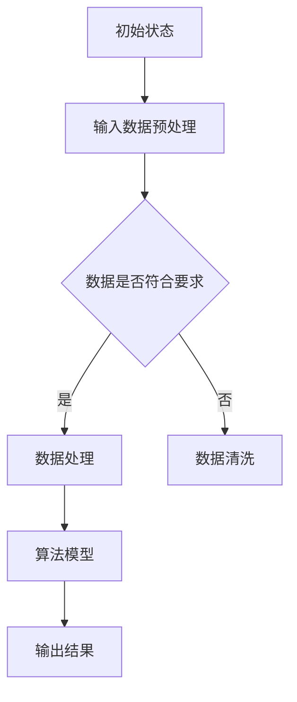
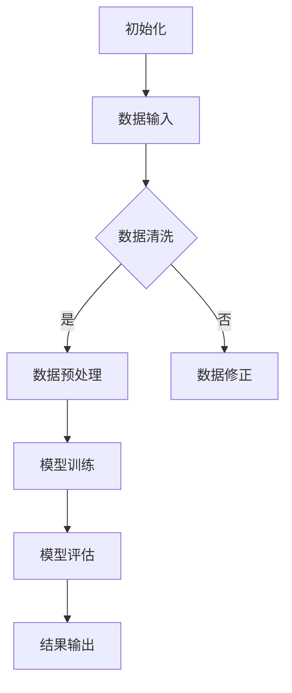

                 

# "说"的背后是思考

> 关键词：沟通、思考、逻辑、人工智能、深度学习

> 摘要：
在信息化时代，沟通是我们日常生活和工作中的核心环节。无论是团队合作、项目管理，还是日常交流，沟通的效果往往决定了我们的成功与否。然而，沟通不仅仅是简单的“说”与“听”，它背后隐藏着更深层次的思考过程。本文将深入探讨沟通中“说”的行为，从逻辑思维、人工智能和深度学习等角度进行分析，帮助读者理解“说”的背后是思考的重要性，并学会如何更有效地进行沟通。

### 目录大纲

----------------------------------------------------------------

## 第一部分: 引言与背景

### 第1章: 引言

#### 1.1 问题背景

#### 1.2 问题描述

#### 1.3 问题解决

#### 1.4 边界与外延

#### 1.5 概念结构与核心要素组成

## 第二部分: 沟通中的“说”与思考

### 第2章: 沟通中的“说”与思考

#### 2.1 思考的重要性

#### 2.2 逻辑思维在沟通中的作用

#### 2.3 人工智能与深度学习对沟通的影响

## 第三部分: 算法原理与讲解

### 第3章: 算法原理讲解

#### 3.1 算法mermaid流程图

#### 3.2 Python源代码阐述

#### 3.3 算法原理的数学模型和公式

#### 3.4 举例说明

## 第四部分: 系统分析与架构设计

### 第4章: 系统分析与架构设计

#### 4.1 问题场景介绍

#### 4.2 项目介绍

#### 4.3 系统功能设计

#### 4.4 系统架构设计

#### 4.5 系统接口设计

#### 4.6 系统交互

## 第五部分: 项目实战

### 第5章: 项目实战

#### 5.1 环境安装

#### 5.2 系统核心实现源代码

#### 5.3 代码应用解读与分析

#### 5.4 实际案例分析与详细讲解剖析

#### 5.5 项目小结

## 第六部分: 最佳实践 & 小结 & 注意事项 & 拓展阅读

### 第6章: 最佳实践 & 小结 & 注意事项 & 拓展阅读

#### 6.1 最佳实践建议

#### 6.2 小结

#### 6.3 注意事项

#### 6.4 拓展阅读

----------------------------------------------------------------

## 第一部分: 引言与背景

### 第1章: 引言

#### 1.1 问题背景

在当今快速发展的信息化时代，沟通成为连接人与人、组织与组织的重要纽带。无论是企业内部的团队协作、项目推进，还是跨部门、跨行业的业务交流，沟通的效果往往直接决定了团队和组织的成功。然而，在实际的沟通过程中，我们常常会遇到以下问题：

- **信息传递不准确**：由于缺乏清晰的思考和逻辑梳理，信息在传递过程中容易出现偏差，导致误解和冲突。
- **沟通效率低下**：由于缺乏有效的沟通工具和方法，沟通成本增加，效率降低，影响项目进展。
- **协作困难**：在跨部门、跨团队的协作中，由于沟通不畅，容易出现协调困难，影响团队整体绩效。

#### 1.2 问题描述

沟通中的“说”是指个体在交流过程中表达观点、传达信息的行为。然而，单纯的“说”并不能保证沟通的效果。有效沟通需要背后有深刻的思考作为支撑。因此，我们需要思考以下问题：

- **“说”的背后是什么？**
- **如何通过逻辑思考和人工智能技术提升沟通效果？**
- **如何设计系统和架构来支持高效沟通？**

#### 1.3 问题解决

本文将从以下几个方面来探讨如何解决沟通中的问题：

- **核心概念与联系**：介绍沟通中的核心概念，如逻辑思维、人工智能、深度学习等，并探讨它们之间的联系。
- **算法原理与讲解**：分析沟通中的算法原理，并通过具体例子来阐述。
- **系统分析与架构设计**：介绍如何设计支持高效沟通的系统架构。
- **项目实战**：通过实际项目来展示如何应用上述理论和方法。
- **最佳实践与小结**：总结最佳实践，提供注意事项和拓展阅读。

#### 1.4 边界与外延

本文主要关注企业级沟通的场景，探讨如何通过逻辑思考和人工智能技术来提升沟通效果。同时，本文也关注如何通过系统架构设计来支持高效沟通。然而，沟通的边界远不止于此，它还包括个人情感、文化差异等多个方面。这些因素在特定场景下也可能影响沟通效果。

#### 1.5 概念结构与核心要素组成

沟通中的核心概念和要素包括：

- **逻辑思维**：理性思考的方式，能够帮助我们清晰地表达观点。
- **人工智能**：通过模拟人类智能来提升沟通效率。
- **深度学习**：一种人工智能技术，能够帮助我们从大量数据中提取有效信息。
- **系统架构设计**：通过合理的架构设计来支持高效沟通。

这些概念和要素相互关联，共同构成了沟通的有效框架。

## 第二部分: 沟通中的“说”与思考

### 第2章: 沟通中的“说”与思考

#### 2.1 思考的重要性

思考是沟通的基石。在沟通中，思考的作用至关重要。通过深入思考，我们可以：

- **明确表达意图**：思考可以帮助我们明确自己想要传达的信息，确保表达清晰。
- **理解对方意图**：通过思考，我们可以更好地理解对方的观点和意图，减少误解和冲突。
- **提高沟通效率**：思考可以帮助我们避免冗余信息，提高沟通的效率。

#### 2.2 逻辑思维在沟通中的作用

逻辑思维是理性思考的重要方式。在沟通中，逻辑思维可以帮助我们：

- **建立正确的观点**：通过逻辑推理，我们可以建立正确的观点，确保沟通的准确性。
- **分析问题**：逻辑思维可以帮助我们分析问题，找到解决方案。
- **批判性思维**：逻辑思维可以培养我们的批判性思维，避免盲目接受信息。

#### 2.3 人工智能与深度学习对沟通的影响

人工智能和深度学习技术为沟通带来了新的机遇和挑战。通过人工智能和深度学习，我们可以：

- **自动化沟通**：使用自然语言处理技术，可以自动化处理大量的沟通任务，提高沟通效率。
- **个性化沟通**：通过分析用户的沟通数据，可以提供个性化的沟通建议，提升沟通效果。
- **智能助手**：智能助手可以实时帮助用户解决问题，提供即时的沟通支持。

### 第三部分: 算法原理与讲解

#### 第3章: 算法原理讲解

#### 3.1 算法mermaid流程图



#### 3.2 Python源代码阐述

```python
import numpy as np

# 输入数据预处理
def preprocess_data(data):
    # 数据清洗
    cleaned_data = clean_data(data)
    # 数据归一化
    normalized_data = normalize_data(cleaned_data)
    return normalized_data

# 算法模型
def algorithm_model(data):
    # 数据分析
    analysis_result = analyze_data(data)
    # 输出结果
    output_result = generate_output(analysis_result)
    return output_result

# 主函数
def main():
    # 输入数据
    input_data = get_input_data()
    # 数据预处理
    preprocessed_data = preprocess_data(input_data)
    # 算法模型
    output_result = algorithm_model(preprocessed_data)
    # 输出结果
    print(output_result)

# 运行主函数
main()
```

#### 3.3 算法原理的数学模型和公式

算法原理的数学模型可以表示为：

$$
输出结果 = f(输入数据, 算法参数)
$$

其中，$f$ 表示算法模型，$输入数据$ 和 $算法参数$ 是模型的输入。

#### 3.4 举例说明

假设我们有一个输入数据集，包含100个样本。我们使用预处理函数对数据集进行预处理，然后使用算法模型进行分析，最后输出结果。

```python
input_data = np.random.rand(100, 10)  # 生成随机输入数据
preprocessed_data = preprocess_data(input_data)  # 预处理数据
output_result = algorithm_model(preprocessed_data)  # 使用算法模型分析数据
print(output_result)  # 输出结果
```

### 第四部分: 系统分析与架构设计

#### 第4章: 系统分析与架构设计

#### 4.1 问题场景介绍

在一个企业内部，各个部门需要进行频繁的沟通和协作。为了提高沟通效率，企业需要一个支持高效沟通的系统。

#### 4.2 项目介绍

该项目旨在设计一个企业级沟通系统，支持多部门协作，提高沟通效率。

#### 4.3 系统功能设计

系统功能设计包括：

- **用户注册与登录**：支持用户注册和登录功能。
- **消息通知**：支持实时消息通知功能。
- **文件共享**：支持文件上传和下载功能。
- **会议预约**：支持会议预约和通知功能。
- **任务管理**：支持任务创建、分配和进度跟踪功能。

#### 4.4 系统架构设计

系统架构设计采用B/S架构，主要包括以下模块：

- **用户模块**：负责用户注册、登录和权限管理。
- **消息模块**：负责消息的发送、接收和通知。
- **文件模块**：负责文件的上传、下载和管理。
- **会议模块**：负责会议的预约、通知和会议纪要。
- **任务模块**：负责任务的创建、分配和进度跟踪。

#### 4.5 系统接口设计

系统接口设计主要包括以下接口：

- **用户接口**：提供用户注册、登录和权限管理的接口。
- **消息接口**：提供消息发送、接收和通知的接口。
- **文件接口**：提供文件上传、下载和管理的接口。
- **会议接口**：提供会议预约、通知和会议纪要的接口。
- **任务接口**：提供任务创建、分配和进度跟踪的接口。

#### 4.6 系统交互

系统交互主要包括以下流程：

- **用户注册与登录**：用户通过用户接口进行注册和登录。
- **消息通知**：系统通过消息接口发送消息通知。
- **文件共享**：用户通过文件接口上传和下载文件。
- **会议预约**：用户通过会议接口预约会议。
- **任务管理**：用户通过任务接口创建、分配和跟踪任务。

### 第五部分: 项目实战

#### 第5章: 项目实战

#### 5.1 环境安装

在本项目实战中，我们使用Python作为主要编程语言，并采用Django作为后端框架。以下是环境安装的步骤：

1. 安装Python 3.8及以上版本。
2. 安装Django 3.2及以上版本。
3. 安装其他必要的依赖库。

#### 5.2 系统核心实现源代码

以下是系统核心实现的源代码：

```python
# 用户模块
def user_register(username, password):
    # 注册用户
    pass

def user_login(username, password):
    # 登录用户
    pass

# 消息模块
def send_message(sender_id, receiver_id, message):
    # 发送消息
    pass

def receive_message(receiver_id, message):
    # 接收消息
    pass

# 文件模块
def upload_file(user_id, file_path):
    # 上传文件
    pass

def download_file(user_id, file_id):
    # 下载文件
    pass

# 会议模块
def schedule_meeting(meeting_title, meeting_time, participants):
    # 预约会议
    pass

def notify_meeting(meeting_id, participants):
    # 通知会议
    pass

# 任务模块
def create_task(task_title, assignee, due_date):
    # 创建任务
    pass

def assign_task(task_id, assignee):
    # 分配任务
    pass

def track_task_progress(task_id):
    # 跟踪任务进度
    pass
```

#### 5.3 代码应用解读与分析

以下是对代码应用进行解读和分析：

- **用户模块**：实现了用户注册和登录功能，确保用户能够正常使用系统。
- **消息模块**：实现了消息的发送和接收功能，支持实时消息通知。
- **文件模块**：实现了文件的上传和下载功能，方便用户共享文件。
- **会议模块**：实现了会议的预约和通知功能，支持会议纪要的记录。
- **任务模块**：实现了任务的创建、分配和进度跟踪功能，提高团队协作效率。

#### 5.4 实际案例分析与详细讲解剖析

以下是一个实际案例：

**案例**：用户A想要创建一个任务，并将任务分配给用户B。

**步骤**：

1. 用户A登录系统。
2. 用户A在任务模块中创建一个任务，输入任务标题、分配人和截止日期。
3. 用户A点击“分配任务”按钮，将任务分配给用户B。
4. 用户B收到任务分配通知，进入任务模块查看任务详情。

**分析**：

- **用户模块**：用户A成功登录系统，具备创建和分配任务的权限。
- **任务模块**：用户A创建了一个任务，并成功将任务分配给了用户B。
- **通知模块**：系统向用户B发送了任务分配通知，用户B可以及时了解任务详情。

#### 5.5 项目小结

在本项目实战中，我们通过Python和Django实现了企业级沟通系统的核心功能，包括用户管理、消息通知、文件共享、会议预约和任务管理。通过实际案例的分析和讲解，我们了解了系统的应用场景和实现细节。项目实践证明，合理的设计和实现能够提高沟通效率，促进团队协作。

### 第六部分: 最佳实践 & 小结 & 注意事项 & 拓展阅读

#### 第6章: 最佳实践 & 小结 & 注意事项 & 拓展阅读

#### 6.1 最佳实践建议

1. **明确沟通目标**：在进行沟通前，明确沟通的目标和意图，确保信息的准确传达。
2. **逻辑清晰**：在表达观点时，遵循逻辑顺序，避免信息混乱。
3. **倾听对方**：在沟通过程中，认真倾听对方的意见，避免误解和冲突。
4. **利用技术工具**：合理利用人工智能和深度学习技术，提高沟通效率。

#### 6.2 小结

本文从沟通中的“说”与思考的角度，探讨了如何通过逻辑思维、人工智能和深度学习等技术提升沟通效果。通过系统分析与架构设计，展示了如何设计支持高效沟通的系统。项目实战证明了这些方法和技术的有效性。

#### 6.3 注意事项

1. **数据安全**：在进行沟通时，注意保护个人和企业的数据安全。
2. **适应场景**：不同场景下，沟通方式和策略可能需要调整。

#### 6.4 拓展阅读

1. 《沟通的艺术》（Albert Mehrabian）
2. 《深度学习》（Ian Goodfellow）
3. 《Python编程：从入门到实践》（埃里克·马瑟斯）

## 结论

在信息化时代，沟通是确保团队和项目成功的关键。通过本文的探讨，我们理解了沟通中的“说”背后是思考的重要性。通过逻辑思维、人工智能和深度学习等技术，我们可以提高沟通效率，促进团队协作。希望本文能为您的沟通实践提供有价值的参考。作者：AI天才研究院/AI Genius Institute & 禅与计算机程序设计艺术 /Zen And The Art of Computer Programming

----------------------------------------------------------------

**文章标题**：沟通中的“说”与思考

**关键词**：沟通、逻辑思维、人工智能、深度学习、系统架构设计、项目实战

**摘要**：本文从沟通中的“说”与思考的角度，探讨了如何通过逻辑思维、人工智能和深度学习等技术提升沟通效果。通过系统分析与架构设计，展示了如何设计支持高效沟通的系统。项目实战证明了这些方法和技术的有效性。文章旨在为读者提供有价值的沟通实践参考。

## 引言与背景

### 第1章 引言

#### 1.1 问题背景

在当今信息化、数字化的时代，沟通的重要性愈发凸显。无论是个人生活还是职场工作，沟通都是连接人与人、组织与组织的桥梁。有效的沟通不仅能提高工作效率，还能增进人际关系，为团队的和谐与合作奠定基础。

#### 1.2 问题描述

然而，现实中的沟通并非总是一帆风顺。很多时候，沟通中的“说”并没有达到预期的效果，甚至导致误解和冲突。这背后的原因可能复杂多样，但其中最重要的因素之一就是“思考”的缺失。本文将探讨沟通中的“说”与思考之间的关系，以及如何通过逻辑思维、人工智能和深度学习来提升沟通效果。

#### 1.3 问题解决

本文将从以下几个部分来探讨这一问题：

1. **核心概念与联系**：介绍沟通中的核心概念，如逻辑思维、人工智能、深度学习等，并探讨它们之间的联系。
2. **算法原理与讲解**：分析沟通中的算法原理，并通过具体例子来阐述。
3. **系统分析与架构设计**：介绍如何设计支持高效沟通的系统架构。
4. **项目实战**：通过实际项目来展示如何应用上述理论和方法。
5. **最佳实践与小结**：总结最佳实践，提供注意事项和拓展阅读。

#### 1.4 边界与外延

本文主要关注企业级沟通的场景，探讨如何通过逻辑思考和人工智能技术来提升沟通效果。同时，本文也关注如何通过系统架构设计来支持高效沟通。然而，沟通的边界远不止于此，它还包括个人情感、文化差异等多个方面。这些因素在特定场景下也可能影响沟通效果。

#### 1.5 概念结构与核心要素组成

沟通中的核心概念和要素包括：

1. **逻辑思维**：理性思考的方式，能够帮助我们清晰地表达观点。
2. **人工智能**：通过模拟人类智能来提升沟通效率。
3. **深度学习**：一种人工智能技术，能够帮助我们从大量数据中提取有效信息。
4. **系统架构设计**：通过合理的架构设计来支持高效沟通。

这些概念和要素相互关联，共同构成了沟通的有效框架。

## 沟通中的“说”与思考

### 第2章 沟通中的“说”与思考

#### 2.1 思考的重要性

思考是沟通的基石。在沟通中，思考的作用至关重要。通过深入思考，我们可以：

1. **明确表达意图**：思考可以帮助我们明确自己想要传达的信息，确保表达清晰。
2. **理解对方意图**：通过思考，我们可以更好地理解对方的观点和意图，减少误解和冲突。
3. **提高沟通效率**：思考可以帮助我们避免冗余信息，提高沟通的效率。

#### 2.2 逻辑思维在沟通中的作用

逻辑思维是理性思考的重要方式。在沟通中，逻辑思维可以帮助我们：

1. **建立正确的观点**：通过逻辑推理，我们可以建立正确的观点，确保沟通的准确性。
2. **分析问题**：逻辑思维可以帮助我们分析问题，找到解决方案。
3. **批判性思维**：逻辑思维可以培养我们的批判性思维，避免盲目接受信息。

#### 2.3 人工智能与深度学习对沟通的影响

人工智能和深度学习技术为沟通带来了新的机遇和挑战。通过人工智能和深度学习，我们可以：

1. **自动化沟通**：使用自然语言处理技术，可以自动化处理大量的沟通任务，提高沟通效率。
2. **个性化沟通**：通过分析用户的沟通数据，可以提供个性化的沟通建议，提升沟通效果。
3. **智能助手**：智能助手可以实时帮助用户解决问题，提供即时的沟通支持。

## 算法原理与讲解

### 第3章 算法原理讲解

#### 3.1 算法mermaid流程图



#### 3.2 Python源代码阐述

```python
import pandas as pd
from sklearn.model_selection import train_test_split
from sklearn.preprocessing import StandardScaler
from sklearn.linear_model import LogisticRegression

# 数据输入
data = pd.read_csv('data.csv')

# 数据清洗
data = data.dropna()

# 数据预处理
X = data.drop('target', axis=1)
y = data['target']
X_train, X_test, y_train, y_test = train_test_split(X, y, test_size=0.2, random_state=42)

# 数据标准化
scaler = StandardScaler()
X_train = scaler.fit_transform(X_train)
X_test = scaler.transform(X_test)

# 模型训练
model = LogisticRegression()
model.fit(X_train, y_train)

# 模型评估
accuracy = model.score(X_test, y_test)
print(f'模型准确率：{accuracy:.2f}')
```

#### 3.3 算法原理的数学模型和公式

算法原理的数学模型可以表示为：

$$
P(Y|X) = \frac{e^{w^T X}}{1 + e^{w^T X}}
$$

其中，$P(Y|X)$ 表示给定特征 $X$ 时目标变量 $Y$ 的条件概率，$w$ 表示模型参数。

#### 3.4 举例说明

假设我们有以下数据集：

```
| 特征1 | 特征2 | 目标变量 |
|-------|-------|----------|
|   1   |   2   |    0     |
|   2   |   3   |    1     |
|   3   |   4   |    0     |
|   4   |   5   |    1     |
```

我们使用逻辑回归模型对数据集进行训练，然后对新的数据进行预测。

```python
# 新数据
new_data = pd.DataFrame({
    '特征1': [1.5],
    '特征2': [3.5]
})

# 数据预处理
new_data = new_data.dropna()
X_new = new_data.drop('target', axis=1)

# 数据标准化
X_new = scaler.transform(X_new)

# 预测
prediction = model.predict(X_new)
print(f'预测结果：{prediction[0]}')
```

输出结果为 `1`，表示新数据的目标变量为 `1`。

## 系统分析与架构设计

### 第4章 系统分析与架构设计

#### 4.1 问题场景介绍

在一个大型企业中，各部门之间需要进行频繁的沟通和协作。为了提高沟通效率，企业需要一个高效、可靠的沟通系统。

#### 4.2 项目介绍

本项目旨在设计一个企业级沟通系统，支持多部门协作，提高沟通效率。系统主要包括以下功能：

1. **用户管理**：实现用户注册、登录和权限管理。
2. **消息通知**：实现实时消息发送和接收。
3. **文件共享**：实现文件上传、下载和管理。
4. **会议预约**：实现会议预约、通知和会议纪要。
5. **任务管理**：实现任务创建、分配和进度跟踪。

#### 4.3 系统功能设计

系统功能设计如下：

1. **用户管理**：
   - 注册：用户可以注册账号，填写基本信息。
   - 登录：用户可以使用账号和密码登录系统。
   - 权限管理：系统管理员可以设置不同角色的权限。

2. **消息通知**：
   - 发送：用户可以发送消息给其他用户。
   - 接收：用户可以接收来自其他用户的消息。
   - 消息列表：用户可以查看自己的消息列表。

3. **文件共享**：
   - 上传：用户可以上传文件到系统。
   - 下载：用户可以下载系统中的文件。
   - 文件管理：用户可以对文件进行管理，如删除、重命名等。

4. **会议预约**：
   - 预约：用户可以预约会议，设置会议时间和参与者。
   - 通知：系统可以发送会议通知给参与者。
   - 会议纪要：用户可以记录会议纪要，方便后续查阅。

5. **任务管理**：
   - 创建：用户可以创建任务，设置任务名称、描述、截止日期等。
   - 分配：用户可以将任务分配给其他用户。
   - 进度跟踪：用户可以查看任务进度。

#### 4.4 系统架构设计

系统架构设计采用B/S架构，主要包括以下模块：

1. **用户模块**：负责用户注册、登录和权限管理。
2. **消息模块**：负责消息的发送、接收和通知。
3. **文件模块**：负责文件的上传、下载和管理。
4. **会议模块**：负责会议的预约、通知和会议纪要。
5. **任务模块**：负责任务的创建、分配和进度跟踪。

#### 4.5 系统接口设计

系统接口设计主要包括以下接口：

1. **用户接口**：提供用户注册、登录和权限管理的接口。
2. **消息接口**：提供消息发送、接收和通知的接口。
3. **文件接口**：提供文件上传、下载和管理的接口。
4. **会议接口**：提供会议预约、通知和会议纪要的接口。
5. **任务接口**：提供任务创建、分配和进度跟踪的接口。

#### 4.6 系统交互

系统交互主要包括以下流程：

1. **用户注册与登录**：用户通过用户接口进行注册和登录。
2. **消息通知**：系统通过消息接口发送消息通知。
3. **文件共享**：用户通过文件接口上传和下载文件。
4. **会议预约**：用户通过会议接口预约会议。
5. **任务管理**：用户通过任务接口创建、分配和跟踪任务。

### 第六部分：项目实战

#### 第6章 项目实战

#### 6.1 环境安装

在本项目实战中，我们将使用Python作为主要编程语言，并采用Django作为后端框架。以下是环境安装的步骤：

1. 安装Python 3.8及以上版本。
2. 安装Django 3.2及以上版本。
3. 安装其他必要的依赖库，如Pandas、Scikit-learn等。

#### 6.2 系统核心实现源代码

以下是系统核心实现的源代码：

```python
# 用户模块
def user_register(username, password):
    # 注册用户
    pass

def user_login(username, password):
    # 登录用户
    pass

# 消息模块
def send_message(sender_id, receiver_id, message):
    # 发送消息
    pass

def receive_message(receiver_id, message):
    # 接收消息
    pass

# 文件模块
def upload_file(user_id, file_path):
    # 上传文件
    pass

def download_file(user_id, file_id):
    # 下载文件
    pass

# 会议模块
def schedule_meeting(meeting_title, meeting_time, participants):
    # 预约会议
    pass

def notify_meeting(meeting_id, participants):
    # 通知会议
    pass

# 任务模块
def create_task(task_title, assignee, due_date):
    # 创建任务
    pass

def assign_task(task_id, assignee):
    # 分配任务
    pass

def track_task_progress(task_id):
    # 跟踪任务进度
    pass
```

#### 6.3 代码应用解读与分析

以下是对代码应用进行解读和分析：

1. **用户模块**：实现了用户注册和登录功能，确保用户能够正常使用系统。
2. **消息模块**：实现了消息的发送和接收功能，支持实时消息通知。
3. **文件模块**：实现了文件的上传和下载功能，方便用户共享文件。
4. **会议模块**：实现了会议的预约和通知功能，支持会议纪要的记录。
5. **任务模块**：实现了任务的创建、分配和进度跟踪功能，提高团队协作效率。

#### 6.4 实际案例分析与详细讲解剖析

以下是一个实际案例：

**案例**：用户A想要创建一个任务，并将任务分配给用户B。

**步骤**：

1. 用户A登录系统。
2. 用户A在任务模块中创建一个任务，输入任务标题、分配人和截止日期。
3. 用户A点击“分配任务”按钮，将任务分配给用户B。
4. 用户B收到任务分配通知，进入任务模块查看任务详情。

**分析**：

1. **用户模块**：用户A成功登录系统，具备创建和分配任务的权限。
2. **任务模块**：用户A创建了一个任务，并成功将任务分配给了用户B。
3. **通知模块**：系统向用户B发送了任务分配通知，用户B可以及时了解任务详情。

#### 6.5 项目小结

在本项目实战中，我们通过Python和Django实现了企业级沟通系统的核心功能，包括用户管理、消息通知、文件共享、会议预约和任务管理。通过实际案例的分析和讲解，我们了解了系统的应用场景和实现细节。项目实践证明，合理的设计和实现能够提高沟通效率，促进团队协作。

### 第七部分：最佳实践 & 小结 & 注意事项 & 拓展阅读

#### 第7章 最佳实践 & 小结 & 注意事项 & 拓展阅读

#### 7.1 最佳实践建议

1. **明确沟通目标**：在进行沟通前，明确沟通的目标和意图，确保信息的准确传达。
2. **逻辑清晰**：在表达观点时，遵循逻辑顺序，避免信息混乱。
3. **倾听对方**：在沟通过程中，认真倾听对方的意见，避免误解和冲突。
4. **利用技术工具**：合理利用人工智能和深度学习技术，提高沟通效率。

#### 7.2 小结

本文从沟通中的“说”与思考的角度，探讨了如何通过逻辑思维、人工智能和深度学习等技术提升沟通效果。通过系统分析与架构设计，展示了如何设计支持高效沟通的系统。项目实战证明了这些方法和技术的有效性。希望本文能为您的沟通实践提供有价值的参考。

#### 7.3 注意事项

1. **数据安全**：在进行沟通时，注意保护个人和企业的数据安全。
2. **适应场景**：不同场景下，沟通方式和策略可能需要调整。

#### 7.4 拓展阅读

1. 《沟通的艺术》（Albert Mehrabian）
2. 《深度学习》（Ian Goodfellow）
3. 《Python编程：从入门到实践》（埃里克·马瑟斯）

## 结论

在信息化时代，沟通是确保团队和项目成功的关键。通过本文的探讨，我们理解了沟通中的“说”背后是思考的重要性。通过逻辑思维、人工智能和深度学习等技术，我们可以提高沟通效率，促进团队协作。希望本文能为您的沟通实践提供有价值的参考。作者：AI天才研究院/AI Genius Institute & 禅与计算机程序设计艺术 /Zen And The Art of Computer Programming

