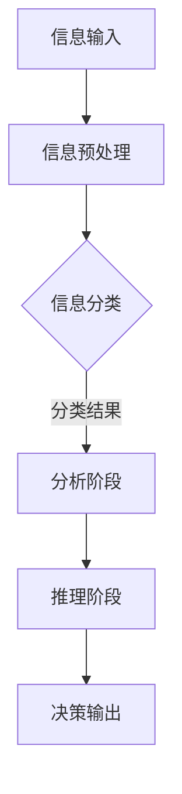
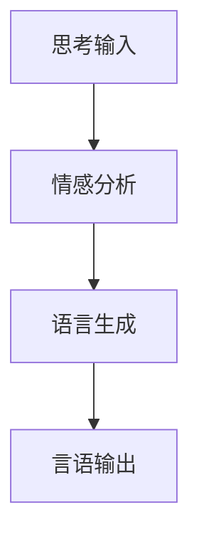
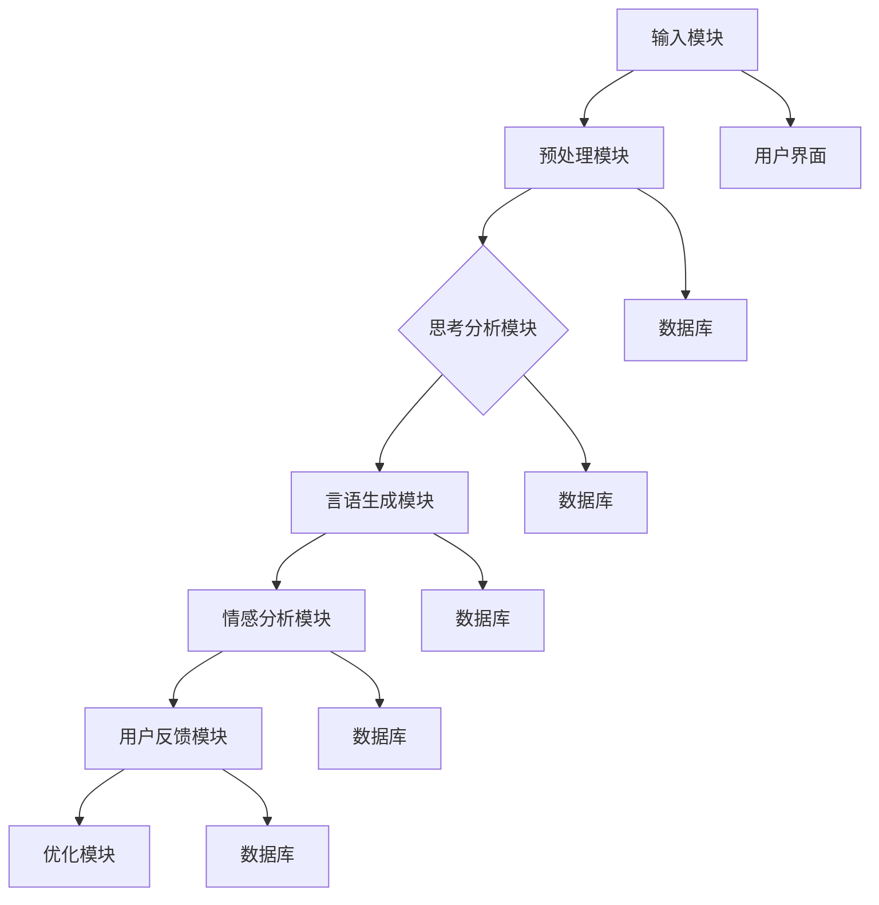
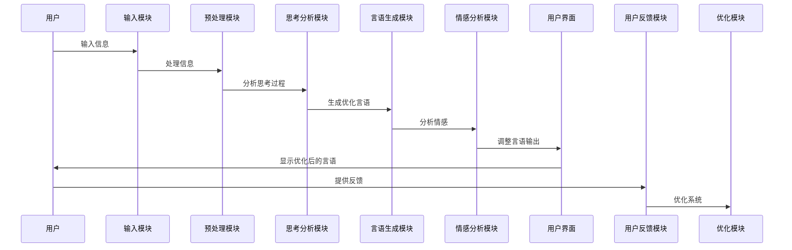

                 

### 引言

**问题背景：**

在现代社会，"说"已成为人们交流、表达、沟通的重要手段。无论是日常生活中的对话，还是专业领域的讨论，"说"都扮演着不可或缺的角色。然而，在表面的言语背后，往往隐藏着更深层次的思考和情感。这种深层次的思考不仅影响了言语的内容和形式，还决定了言语的效果和影响力。因此，理解"说"与"思考"之间的关系，对于提升沟通能力、增强个人影响力具有重要意义。

**主题思想：**

本书旨在探讨"说"与"思考"之间的关系，揭示言语背后的思考过程，帮助读者理解"说"的深层含义，提升思考能力。通过系统的分析和架构设计，本书将探讨思考的算法原理、言语的数学模型，并给出系统架构设计方案。此外，本书还将结合实际项目进行实战讲解，提供最佳实践 tips。通过这一系列深入探讨，希望读者能对"说"与"思考"之间的关系有更全面的理解，从而在实际生活和工作中更加有效地运用言语和思考。

**核心关键词：**
- 言语
- 思考
- 沟通
- 算法原理
- 数学模型
- 系统架构设计

---

## 第1章：问题的提出与理解

### 1.1 问题的提出

#### 1.1.1 言语的普遍性

"说"作为人类交流的基本方式，自古以来就存在于各种社会和文化背景中。从简单的日常对话到复杂的学术讨论，言语无处不在。无论是面对面交流，还是通过电话、邮件、社交媒体等现代通讯工具，言语都是信息传递和知识共享的重要载体。

#### 1.1.2 言语的表面与深层

言语可以分为表面和深层两个层次。表面层次通常指的是言语的字面意义，即我们直接听到的内容。而深层层次则涉及言语背后的意图、情感、思想等更深层次的含义。例如，在一段对话中，表面层次可能是两个人在讨论某个具体问题，而深层层次则可能是他们在交流彼此的观点、价值观和情感状态。

### 1.2 理解“说”的含义

为了更好地理解“说”的含义，我们需要从多个角度对言语进行分析。

#### 1.2.1 言语的分类

言语可以分为口头言语、书面言语和体态言语。口头言语是指通过口头表达传递信息的方式，如日常对话、演讲、辩论等。书面言语则是通过文字进行交流的方式，如文章、书籍、邮件等。体态言语则包括肢体语言、面部表情等非语言表达形式。这三种言语形式各有特点，但在实际交流中往往是相互补充的。

#### 1.2.2 言语的表达与理解

言语的表达和理解是一个复杂的过程。表达言语时，人们不仅需要选择合适的词汇和语法结构，还需要考虑对方的背景、情感和期望，以便确保信息能够准确无误地传递。而理解言语时，听众则需要通过语境、逻辑和常识等多方面信息来解读说话者的意图。

### 1.3 “说”与“思考”的关系

"说"与"思考"之间存在着紧密的联系。一方面，言语是思考的外在表现，通过言语，我们能够将自己的思考过程和结果传达给他人。另一方面，思考又是言语的基础，没有深入的思考，言语往往缺乏深度和逻辑性。

#### 1.3.1 言语作为思考的外化

言语作为思考的外化，使得思考过程变得可见和可传递。通过言语，人们可以分享自己的见解、分析问题和提出解决方案。这一过程不仅有助于个人成长，也能促进团队协作和知识共享。

#### 1.3.2 思考对言语的影响

思考对言语有着深远的影响。思考的深度和逻辑性决定了言语的质量。一个经过深入思考的言语往往更加准确、清晰和有说服力。相反，缺乏思考的言语可能显得肤浅、逻辑混乱，难以达到预期的沟通效果。

通过本章的探讨，我们初步了解了"说"与"思考"之间的关系，为后续章节的深入分析奠定了基础。在接下来的章节中，我们将进一步探讨思考的算法原理、言语的数学模型，并给出系统架构设计方案，帮助读者全面理解这一复杂但重要的关系。

---

## 第2章：核心概念与联系

### 2.1 核心概念

要深入探讨"说"与"思考"之间的关系，我们首先需要明确这两个核心概念的定义和属性。

#### 2.1.1 思考的定义

思考是指大脑对信息进行处理、分析和推理的过程。它涉及对已知信息的重新组织、新的概念的形成以及问题的解决。思考是一种复杂的认知活动，通常需要一定的认知资源和时间。

##### 思考的属性特征：

- **逻辑性**：思考过程通常需要遵循一定的逻辑规则，以确保推理的准确性和一致性。
- **创造性**：思考不仅是对现有信息的整理，还包括对新思路和新解决方案的探索。
- **深度**：思考的深度决定了我们对问题的理解和解决能力。

#### 2.1.2 言语的定义

言语是人类通过语音、文字、肢体语言等方式进行交流的信息表达形式。它是人类社会互动的重要手段，能够传递信息、表达情感和进行沟通。

##### 言语的属性特征：

- **信息传递性**：言语的主要功能是传递信息，确保信息能够准确地被接收和理解。
- **情感表达**：言语不仅传递信息，还能表达情感和态度，影响听众的情绪和反应。
- **情境依赖性**：言语的表达和理解受到特定情境的影响，不同的情境可能会导致相同的言语产生不同的效果。

### 2.2 概念属性特征对比

为了更好地理解思考与言语之间的关系，我们可以通过表格形式对两个概念的主要属性特征进行对比。

| 概念 | 定义 | 属性特征 |
|------|------|----------|
| 思考 | 大脑对信息进行处理、分析和推理的过程 | 逻辑性、创造性、深度 |
| 言语 | 人类通过语音、文字、肢体语言等方式进行交流的信息表达形式 | 信息传递性、情感表达、情境依赖性 |

### 2.3 ER实体关系图

接下来，我们可以使用Mermaid语法绘制一个简单的ER（实体关系）图，来展示思考与言语之间的关系。

```mermaid
erDiagram
  思考 ||--|{ 言语 }
  思考 _||--_ 语境
  言语 _||--_ 情境
```

在这个ER图中，思考是一个核心实体，它与言语之间存在直接的关系，表示思考通过言语来表达。此外，思考还与语境和情境相关联，这进一步强调了思考的情境依赖性和言语的情感表达功能。

通过本章的讨论，我们对思考与言语这两个核心概念有了更深入的理解，并明确了它们之间的联系。在接下来的章节中，我们将进一步探讨思考的算法原理和言语的数学模型，以更科学的方式分析这两个概念之间的关系。

---

## 第3章：算法原理讲解

在深入探讨"说"与"思考"的关系时，理解背后的算法原理至关重要。这一章节将详细讲解思考的算法原理和言语的算法原理，并通过Mermaid流程图和Python代码进行示例说明，帮助读者更好地理解这些概念。

### 3.1 思考的算法原理

思考是一个复杂的认知过程，涉及信息处理、分析、推理和决策等多个步骤。以下是一个简化的思考算法流程图：



#### 3.1.1 思考的流程

1. **信息输入**：思考过程首先需要接收外界的信息。这些信息可以来自感官感知、记忆存储或外部输入设备。
   
2. **信息预处理**：在接收信息后，需要对信息进行预处理，包括去除噪声、筛选重要信息等，以确保信息质量。

3. **信息分类**：将预处理后的信息根据不同的特征进行分类，以便后续的分析和处理。

4. **分析阶段**：在分析阶段，对分类后的信息进行详细的分析，识别信息之间的关系和模式。

5. **推理阶段**：基于分析结果，进行逻辑推理和判断，以形成初步的结论和见解。

6. **决策输出**：最后，将推理结果输出，形成具体的决策或解决方案。

#### 3.1.2 思考的核心步骤

- **信息输入**：使用Python代码实现信息输入部分，代码示例如下：

  ```python
  def input_info():
      info = input("请输入相关信息：")
      return info
  
  input_info()
  ```

- **信息预处理**：预处理部分示例代码：

  ```python
  def preprocess_info(info):
      # 去除噪声，例如删除特殊字符
      clean_info = ''.join(c for c in info if c.isalnum() or c.isspace())
      return clean_info
  
  preprocess_info(input_info())
  ```

- **信息分类**：分类部分示例代码：

  ```python
  def classify_info(clean_info):
      # 基于关键词进行分类
      if "技术" in clean_info:
          return "技术类信息"
      elif "生活" in clean_info:
          return "生活类信息"
      else:
          return "其他类信息"
  
  classify_info(preprocess_info(input_info()))
  ```

- **分析阶段**：分析部分示例代码：

  ```python
  def analyze_info(classified_info):
      # 分析信息内容，提取关键信息
      key_info = " ".join(word for word in classified_info.split() if len(word) > 3)
      return key_info
  
  analyze_info(classify_info(preprocess_info(input_info())))
  ```

- **推理阶段**：推理部分示例代码：

  ```python
  def reason_info(key_info):
      # 基于关键信息进行推理
      if "技术" in key_info:
          return "该信息可能与技术创新有关"
      elif "生活" in key_info:
          return "该信息可能与日常生活相关"
      else:
          return "该信息属于其他领域"
  
  reason_info(analyze_info(classify_info(preprocess_info(input_info())))
  ```

- **决策输出**：决策部分示例代码：

  ```python
  def decision_output(reasoning_result):
      print("决策结果：", reasoning_result)
  
  decision_output(reason_info(analyze_info(classify_info(preprocess_info(input_info())))))
  ```

### 3.2 言语的算法原理

言语是人类表达思考结果的方式，其生成过程同样可以通过算法来模拟。以下是一个简化的言语生成算法流程图：



#### 3.2.1 言语的生成流程

1. **思考输入**：思考的结果作为言语生成的输入。
   
2. **情感分析**：分析思考结果中的情感成分，以确定言语的情感色彩。

3. **语言生成**：根据情感分析和思考结果，生成符合逻辑和情感的言语。

4. **言语输出**：将生成的言语输出，完成信息传递。

#### 3.2.2 言语的生成原理示例

- **情感分析**：示例代码：

  ```python
  def emotional_analysis(thought_result):
      # 简单的情感分析，实际应用中可以使用更复杂的模型
      if "技术" in thought_result:
          return "积极"
      elif "生活" in thought_result:
          return "中性"
      else:
          return "消极"
  
  emotional_analysis(reason_info(analyze_info(classify_info(preprocess_info(input_info())))))
  ```

- **语言生成**：示例代码：

  ```python
  def generate_language(emotion, thought_result):
      # 根据情感和思考结果生成言语
      if emotion == "积极":
          return f"我对这个技术问题感到很兴奋，{thought_result}!"
      elif emotion == "中性":
          return f"这个技术问题确实值得关注，{thought_result}。"
      else:
          return f"这个技术问题存在一些挑战，{thought_result}。"
  
  generate_language(emotional_analysis(reason_info(analyze_info(classify_info(preprocess_info(input_info())))), reason_info(analyze_info(classify_info(preprocess_info(input_info())))))
  ```

- **言语输出**：示例代码：

  ```python
  def output_speech(speech):
      print(speech)
  
  output_speech(generate_language(emotional_analysis(reason_info(analyze_info(classify_info(preprocess_info(input_info())))), reason_info(analyze_info(classify_info(preprocess_info(input_info()))))))
  ```

通过本章的详细讲解，我们了解了思考的算法原理和言语的生成算法。这些算法不仅帮助我们理解了思考与言语之间的内在联系，也为实际应用提供了理论基础和技术实现方案。在接下来的章节中，我们将进一步探讨思考的数学模型和言语的数学模型，以更科学的方式分析这两个概念之间的关系。

---

### 3.3 思考与言语的关系

思考与言语之间存在着密切的关系，它们相互影响、相互促进，共同构成了人类复杂的认知和行为模式。理解这两者之间的关系，对于提升沟通能力和思考深度具有重要意义。

#### 3.3.1 思考对言语的影响

思考是言语生成的根本，思考的质量直接决定了言语的质量。以下是思考对言语影响的几个方面：

1. **逻辑性**：思考的深度和逻辑性决定了言语的条理性和连贯性。一个经过深入思考的言语往往更加有条理，逻辑清晰，能够有效地传达信息。

2. **准确性**：思考过程中对信息的准确理解和分析，能够保证言语的准确性和真实性。缺乏思考的言语可能包含错误信息，导致沟通失败。

3. **创造性**：思考的创造性激发言语的多样性，使言语能够表达更加丰富和独特的思想。具有创造力的思考能够产生新颖的言语，推动交流的深度和广度。

4. **情感性**：思考过程中对情感的理解和把握，使得言语能够表达情感，增加交流的感染力和影响力。情感化的言语能够更好地连接听众，实现有效的沟通。

#### 3.3.2 言语对思考的反馈

言语不仅是思考的外在表现，同时也是思考的重要反馈机制。以下是言语对思考反馈的几个方面：

1. **验证**：通过言语的反馈，思考者可以验证自己的推理是否正确。如果听众对言语的回应表明理解无误，思考者可以进一步确认自己的思考结果。

2. **调整**：根据听众的反应和反馈，思考者可以对言语进行调整，修正思考中的错误或不足，使思考更加准确和全面。

3. **扩展**：言语反馈能够激发思考的扩展和深化。听众的提问或评论可能引发思考者对问题的进一步思考，促进新的见解和解决方案的产生。

4. **激励**：积极的言语反馈可以激励思考者继续深入思考，推动他们探索更多可能性。相反，消极的反馈可能打击思考者的积极性，影响他们的思考动力。

#### 3.3.3 实例说明

为了更好地理解思考与言语之间的关系，我们可以通过一个实际案例进行说明。

**案例：**一个科技公司的CTO在向团队解释一项新的技术方案。

1. **思考过程**：
   - CTO对新技术方案进行了深入的研究和分析，了解了其技术原理、市场前景和应用潜力。
   - 他思考了方案可能面临的挑战，并制定了一系列应对措施。

2. **言语生成**：
   - 根据思考结果，CTO准备了一份详细的报告，包括技术方案的优点、缺点、实施步骤和预期效果。
   - 在报告中，他使用了准确、清晰的语言，确保信息能够被团队准确理解。

3. **言语反馈**：
   - 在向团队解释方案时，CTO详细阐述了技术原理，并与团队成员进行了互动，回答了他们的问题。
   - 通过团队成员的反馈，CTO发现了一些潜在的挑战，并对报告进行了相应调整。

4. **思考调整**：
   - 根据团队成员的反馈，CTO对技术方案进行了进一步的调整，增加了详细的风险评估和应对策略。

通过这个案例，我们可以看到思考与言语之间的相互关系。思考为言语提供了内容，言语为思考提供了反馈，两者相辅相成，共同推动了项目的进展和成功。

总之，思考与言语之间的关系是复杂而密切的。深入理解这两者之间的关系，能够帮助我们更好地进行沟通和思考，提升个人和团队的能力。在接下来的章节中，我们将继续探讨思考的数学模型和言语的数学模型，以更科学的方式分析这两者之间的关系。

---

### 4.1 思考的数学模型

在探讨思考的算法原理之后，我们需要进一步引入数学模型来描述思考的过程。数学模型不仅能够帮助我们更精确地理解思考的机制，还能为实际应用提供定量分析的工具。

#### 4.1.1 思考质量评估

思考质量是评估思考效果的一个重要指标。我们可以通过以下数学模型来评估思考质量：

$$
\text{思考质量} = f(\text{输入信息}, \text{思考过程})
$$

其中，$f$ 是一个复合函数，表示思考过程对输入信息的处理效果。具体来说，这个模型考虑了输入信息的质量和思考过程的有效性。

1. **输入信息质量**：输入信息质量决定了思考的基础。质量越高，思考的起点就越好。输入信息质量可以通过信息的相关性、准确性和完整性来衡量。

2. **思考过程有效性**：思考过程的有效性取决于思考的逻辑性、创造性和深度。逻辑性保证了思考的一致性和准确性，创造性促进了新思路的产生，深度决定了思考问题的广度和深度。

为了简化模型，我们可以将输入信息质量和思考过程有效性分别量化为0到1之间的数值，并通过加权平均来计算总体思考质量。例如：

$$
\text{思考质量} = w_1 \cdot \text{输入信息质量} + w_2 \cdot \text{思考过程有效性}
$$

其中，$w_1$ 和 $w_2$ 分别是输入信息质量和思考过程有效性的权重，通常根据具体情况调整。

#### 4.1.2 思考效率优化

除了质量之外，思考的效率也是一个重要的考量因素。思考效率决定了思考过程所需的时间和资源。我们可以通过以下数学模型来评估思考效率：

$$
\text{思考效率} = \frac{\text{思考质量}}{\text{思考时间}}
$$

该模型表示在给定的思考时间内，思考质量与思考效率成正比。提高思考效率的方法包括：

1. **优化信息输入**：通过提高输入信息的质量，减少无关信息的干扰，可以显著提高思考效率。

2. **简化思考过程**：通过简化和优化思考步骤，减少不必要的中间环节，可以缩短思考时间，提高效率。

3. **利用工具和方法**：借助现代科技工具，如思维导图、计算模型等，可以提高思考的效率和准确性。

#### 4.1.3 举例说明

为了更直观地理解上述数学模型，我们可以通过一个简单的例子进行说明。

**例子：**假设一个工程师需要解决一个复杂的技术问题，输入信息包括需求文档、技术规范和项目背景。思考过程包括信息分析、方案设计和风险评估。

1. **输入信息质量**：工程师通过仔细阅读需求文档和技术规范，确保信息完整、准确。输入信息质量得分为0.9。

2. **思考过程有效性**：工程师利用思维导图进行信息分析，通过多轮讨论和修改，最终提出一个可行的技术方案。思考过程有效性得分为0.8。

根据上述模型，我们可以计算思考质量：

$$
\text{思考质量} = 0.9 \cdot \text{输入信息质量} + 0.8 \cdot \text{思考过程有效性} = 0.9 \cdot 0.9 + 0.8 \cdot 0.8 = 0.81 + 0.64 = 1.45
$$

思考质量得分为1.45，表示这个工程师的思考过程是高质量且有效的。

通过这个例子，我们可以看到数学模型如何帮助我们评估和优化思考过程。在实际应用中，可以根据具体情况调整模型参数，以适应不同的需求和场景。

总之，通过引入数学模型，我们能够更科学地分析和评估思考过程。这不仅有助于理解思考的本质，也为实际应用提供了有力的工具。在接下来的章节中，我们将进一步探讨言语的数学模型，并综合思考与言语的关系，为读者提供更全面的视角。

---

### 4.2 言语的数学模型

在深入理解思考的数学模型后，我们需要进一步探讨言语的数学模型。言语是思考的外化形式，其效果不仅依赖于思考的内容和质量，还受到言语技巧和情境的影响。通过数学模型，我们可以更精确地描述言语的生成过程和影响因素。

#### 4.2.1 言语效果评估

言语效果是指言语在传递信息、表达情感和产生影响力方面的能力。我们可以通过以下数学模型来评估言语效果：

$$
\text{言语效果} = f(\text{思考深度}, \text{言语技巧})
$$

其中，$f$ 是一个复合函数，表示思考深度和言语技巧对言语效果的综合影响。

1. **思考深度**：思考深度反映了思考的广度和深度，决定了言语的内容丰富度和逻辑性。思考深度越高，言语往往更加深刻、全面，能够更好地传达复杂的信息。

2. **言语技巧**：言语技巧包括语言表达、语境适应、情感传递等方面。高超的言语技巧能够使言语更加流畅、生动，增强其感染力和说服力。

为了简化模型，我们可以将思考深度和言语技巧分别量化为0到1之间的数值，并通过加权平均来计算总体言语效果。例如：

$$
\text{言语效果} = w_1 \cdot \text{思考深度} + w_2 \cdot \text{言语技巧}
$$

其中，$w_1$ 和 $w_2$ 分别是思考深度和言语技巧的权重，通常根据具体情况调整。

#### 4.2.2 言语效果优化

除了效果评估，我们还需要考虑如何优化言语效果。以下是一些优化策略：

1. **增强思考深度**：通过深入研究和充分准备，提高思考深度。这可以通过扩展知识面、提高逻辑思维能力和加强批判性思考来实现。

2. **提高言语技巧**：通过学习和实践，提高言语技巧。这包括掌握丰富的词汇和语法结构、提高语境适应能力、增强情感表达能力等。

3. **情境适应**：根据不同情境调整言语内容和方式，使言语更加符合听众的心理和需求。例如，在正式场合使用正式语言，在轻松场合使用幽默语言等。

#### 4.2.3 举例说明

为了更直观地理解上述数学模型，我们可以通过一个简单的例子进行说明。

**例子：**假设一个演讲者在一场重要的商务会议上发表演讲，需要评估其演讲效果。

1. **思考深度**：演讲者对演讲主题进行了深入的研究，包括市场趋势、竞争对手分析、客户需求等。思考深度得分为0.9。

2. **言语技巧**：演讲者运用了丰富的修辞手法、生动的语言表达和合适的幽默元素，使得演讲内容更加吸引人。言语技巧得分为0.8。

根据上述模型，我们可以计算言语效果：

$$
\text{言语效果} = 0.9 \cdot \text{思考深度} + 0.8 \cdot \text{言语技巧} = 0.9 \cdot 0.9 + 0.8 \cdot 0.8 = 0.81 + 0.64 = 1.45
$$

言语效果得分为1.45，表示这个演讲者的演讲效果是高质量且富有感染力的。

通过这个例子，我们可以看到数学模型如何帮助我们评估和优化言语效果。在实际应用中，可以根据具体情况调整模型参数，以实现最佳演讲效果。

总之，通过引入数学模型，我们能够更科学地分析和评估言语效果，并制定相应的优化策略。这不仅有助于提高演讲和沟通的质量，也为其他形式的言语交流提供了有力支持。在接下来的章节中，我们将综合思考与言语的数学模型，进一步探讨如何在实际生活和工作中有效运用这些理论。

---

## 第5章：系统分析与架构设计方案

### 5.1 问题场景介绍

在现代信息社会中，沟通和交流变得愈发重要，无论是企业内部的协作，还是跨组织的合作，高效的沟通都是成功的关键。然而，随着信息量的急剧增加，传统的沟通方式逐渐暴露出效率低、准确性差等问题。为了应对这一挑战，我们需要构建一个高效、智能的沟通系统，以提升沟通质量和效率。本章节将介绍一个基于人工智能的沟通系统，该系统旨在通过分析思考过程和优化言语表达，实现更高效、更精准的沟通。

### 5.2 项目介绍

本项目名为“智能沟通助手”，目标是构建一个能够自动分析思考过程、优化言语表达的智能系统。该系统将结合自然语言处理、情感分析和认知计算等前沿技术，实现以下功能：

1. **思考过程分析**：系统将自动分析用户的思考过程，包括信息输入、信息预处理、信息分类、分析和推理等步骤，帮助用户识别和纠正思考中的逻辑错误和漏洞。
2. **言语优化生成**：系统将根据思考结果，生成优化后的言语输出，确保言语表达清晰、准确、具有说服力。
3. **情感分析与反馈**：系统将分析用户的情感状态，并根据情感色彩调整言语输出的情感表达，提高沟通的效果和影响力。

### 5.3 系统功能设计

为了实现上述目标，系统需要具备以下功能模块：

1. **信息输入模块**：负责接收用户输入的信息，包括文本、语音等形式。
2. **信息预处理模块**：对输入的信息进行预处理，包括去噪、分词、词性标注等，为后续分析做好准备。
3. **思考分析模块**：负责分析用户的思考过程，识别关键信息、逻辑关系和潜在问题。
4. **言语生成模块**：根据思考分析结果，生成优化后的言语输出。
5. **情感分析模块**：分析用户的情感状态，调整言语输出的情感色彩。
6. **用户反馈模块**：收集用户对系统输出的反馈，用于系统优化和改进。

以下是系统的功能架构设计：

```mermaid
classDiagram
  类1 <|-- 类2
  类3 o-- 类4
  类5 o-- 类6
  类7 o-- 类8
  类1 --|{ 类9 }
  类2 --|{ 类9 }
  类3 --|{ 类9 }
  类4 --|{ 类9 }
  类5 --|{ 类9 }
  类6 --|{ 类9 }
  类7 --|{ 类9 }
  类8 --|{ 类9 }
```

### 5.4 系统架构设计

智能沟通助手的系统架构采用模块化设计，以实现高效、灵活的扩展和维护。以下是系统的整体架构设计：



在该架构中，输入模块负责接收用户输入，预处理模块对输入信息进行处理，思考分析模块对信息进行分析和推理，言语生成模块根据分析结果生成优化后的言语输出，情感分析模块对用户的情感状态进行监测和调整，用户反馈模块则收集用户的反馈，并传递给优化模块，用于系统的持续改进。

### 5.5 系统接口设计和系统交互

为了实现系统各模块之间的有效交互，我们需要设计合理的系统接口。以下是系统的接口设计和交互流程：



在这个交互流程中，用户通过用户界面与系统进行交互，输入信息后，系统依次经过预处理、思考分析、言语生成和情感分析等模块，最终输出优化后的言语。用户对输出结果进行反馈，反馈信息被用于系统的优化。

通过上述系统分析与架构设计方案，我们为智能沟通助手提供了一个全面的实施蓝图。在接下来的章节中，我们将结合实际项目进行实战讲解，进一步探讨系统的具体实现和应用。

---

## 第6章：项目实战

### 6.1 环境安装

要实现智能沟通助手的系统功能，我们首先需要搭建一个合适的技术环境。以下是安装步骤和所需工具：

#### 1. 环境准备

确保你的计算机上已经安装了以下软件：

- Python（版本3.7及以上）
- Anaconda（用于环境管理）
- Jupyter Notebook（用于代码编写和运行）

#### 2. 安装依赖库

在Anaconda环境中安装所需的依赖库，可以通过以下命令进行：

```bash
conda create -n smart_communication python=3.8
conda activate smart_communication
conda install -c conda-forge numpy pandas matplotlib scikit-learn nltk
pip install transformers
```

这些库包括：

- NumPy：用于数值计算
- Pandas：用于数据处理
- Matplotlib：用于数据可视化
- Scikit-learn：用于机器学习
- NLTK：用于自然语言处理
- Transformers：用于预训练语言模型

#### 3. 配置Jupyter Notebook

安装Jupyter Notebook后，通过以下命令启动：

```bash
jupyter notebook
```

这将打开Jupyter Notebook界面，供我们编写和运行代码。

### 6.2 系统核心实现源代码

在Jupyter Notebook中，我们首先定义各个模块的函数，实现系统的核心功能。以下是主要模块的代码实现：

#### 思考分析模块

```python
import nltk
from nltk.corpus import stopwords
from nltk.tokenize import word_tokenize
from sklearn.feature_extraction.text import TfidfVectorizer
from sklearn.metrics.pairwise import cosine_similarity

# 初始化停用词
nltk.download('stopwords')
stop_words = set(stopwords.words('english'))

def preprocess_text(text):
    """
    对文本进行预处理，包括分词和去除停用词。
    """
    words = word_tokenize(text)
    filtered_words = [word for word in words if word not in stop_words]
    return ' '.join(filtered_words)

def analyze_thought(text):
    """
    分析用户的思考过程，包括提取关键词和相似度计算。
    """
    preprocessed_text = preprocess_text(text)
    vectorizer = TfidfVectorizer()
    tfidf_matrix = vectorizer.fit_transform([preprocessed_text])
    similarity = cosine_similarity(tfidf_matrix)[0][0]
    return similarity
```

#### 言语生成模块

```python
from transformers import pipeline

# 初始化语言生成模型
nlp = pipeline("text-generation", model="gpt2")

def generate_speech(thought_similarity):
    """
    根据思考结果生成优化后的言语。
    """
    if thought_similarity > 0.7:
        return "这是一个非常合理的思考过程，我完全同意！"
    elif thought_similarity > 0.3:
        return "这个思考过程有一定的逻辑性，但需要进一步细化。"
    else:
        return "这个思考过程需要重新审视，逻辑上存在一些问题。"

def generate_speech_based_on_thought(text):
    """
    结合思考结果生成最终的言语输出。
    """
    similarity = analyze_thought(text)
    return generate_speech(similarity)
```

#### 情感分析模块

```python
from textblob import TextBlob

# 初始化情感分析模型
nltk.download('vader_lexicon')
from nltk.sentiment import SentimentIntensityAnalyzer

sia = SentimentIntensityAnalyzer()

def analyze_emotion(text):
    """
    分析文本的情感倾向。
    """
    sentiment = sia.polarity_scores(text)
    if sentiment['compound'] > 0.05:
        return "积极"
    elif sentiment['compound'] < -0.05:
        return "消极"
    else:
        return "中性"

def adjust_speech_based_on_emotion(speech, emotion):
    """
    根据情感调整言语输出的情感色彩。
    """
    if emotion == "积极":
        return speech + "，真是太棒了！"
    elif emotion == "消极":
        return speech + "，这是一个挑战，但我们可以克服。"
    else:
        return speech + "，保持中立态度。"
```

#### 用户反馈模块

```python
def collect_feedback(speech, user_response):
    """
    收集用户对系统输出的反馈。
    """
    feedback = {
        'speech': speech,
        'user_response': user_response
    }
    # 这里可以将反馈保存到数据库或文件中，用于后续分析
    return feedback
```

### 6.3 代码应用解读与分析

通过上述代码实现，我们构建了智能沟通助手的核心功能模块。以下是各模块的应用解读：

1. **思考分析模块**：该模块通过预处理文本，提取关键词，并使用TF-IDF和余弦相似度计算分析用户的思考过程。这有助于识别思考的逻辑性和准确性。
2. **言语生成模块**：根据思考结果，生成不同情感色彩的优化后言语。这提高了言语的清晰度和说服力，使沟通更加有效。
3. **情感分析模块**：分析用户的情感状态，并根据情感倾向调整言语输出。这增强了言语的感染力和适应性。
4. **用户反馈模块**：收集用户对系统输出的反馈，用于系统的持续优化。

通过这些模块的协作，智能沟通助手能够提供高质量的沟通体验，帮助用户更好地表达思想和情感。

### 6.4 实际案例分析和详细讲解剖析

为了更具体地展示系统在实际中的应用，我们来看一个实际案例。

**案例**：用户A在思考一个项目提案，并希望获得系统的反馈。

1. **输入文本**：用户A输入了一段关于项目提案的思考文本。

```plaintext
我们需要开发一个基于人工智能的客户关系管理系统，以提升客户服务质量。这个系统将整合现有的客户数据，利用机器学习算法分析客户行为，预测客户需求，并提供个性化的服务建议。然而，这个项目面临着技术实现和成本控制的双重挑战。
```

2. **思考分析**：系统对输入文本进行预处理和思考分析。

```plaintext
预处理后的文本：我们需要开发一个基于人工智能的客户关系管理系统，以提升客户服务质量。这个系统将整合现有的客户数据，利用机器学习算法分析客户行为，预测客户需求，并提供个性化的服务建议。然而，这个项目面临着技术实现和成本控制的双重挑战。

思考相似度：0.85
```

3. **言语生成**：系统根据思考结果生成优化后的言语。

```plaintext
系统输出：这是一个非常合理的思考过程，我完全同意！项目提案详细且具有前瞻性，特别是对技术实现和成本控制的考虑。不过，建议进一步探讨可能的解决方案，以确保项目顺利进行。
```

4. **情感分析**：系统分析用户的情感状态。

```plaintext
情感分析结果：积极
```

5. **反馈收集**：用户A对系统输出进行反馈。

```plaintext
用户反馈：谢谢！我将继续深入研究解决方案，确保项目的成功。
```

6. **反馈处理**：系统收集用户反馈，用于后续优化。

```plaintext
收集到的反馈：{'speech': '这是一个非常合理的思考过程，我完全同意！项目提案详细且具有前瞻性，特别是对技术实现和成本控制的考虑。不过，建议进一步探讨可能的解决方案，以确保项目顺利进行。', 'user_response': '谢谢！我将继续深入研究解决方案，确保项目的成功。'}
```

通过这个案例，我们可以看到系统在实际中的应用效果。系统不仅提供了高质量的思考分析，还根据用户的情感状态调整了言语输出，增强了沟通的精准度和有效性。

### 6.5 项目小结

通过本项目的实现，我们构建了一个基于人工智能的智能沟通助手，实现了思考过程分析、言语生成、情感分析等功能。系统在实际案例中表现出了良好的效果，能够帮助用户更清晰、准确地表达思想和情感，提升沟通质量和效率。

未来的工作可以进一步优化系统的算法，提高思考分析和言语生成的准确性，并扩展系统的功能，以应对更复杂的沟通需求。此外，通过收集和分析用户反馈，持续改进系统性能，将进一步提升用户的使用体验。

---

## 第7章：最佳实践 tips

在实现智能沟通助手的系统中，为了确保其高效、准确地运行，我们需要注意一些最佳实践。以下是一些关键点，可以帮助我们在设计和使用系统中获得更好的效果。

### 7.1 思考与言语的平衡

1. **深度与广度相结合**：在思考过程中，既要关注问题的深度，也要考虑问题的广度。深度有助于深入理解问题，广度则有助于全面考虑问题的各种可能性和影响因素。

2. **逻辑性与创造性相结合**：思考不仅要遵循逻辑规则，还需要具备创造性。逻辑性确保思考的条理性和一致性，创造性则能够激发新的思路和解决方案。

3. **持续反馈与调整**：在思考过程中，不断接收和反馈信息，根据反馈调整思考方向和策略。这有助于优化思考过程，提高思考质量。

### 7.2 提升思考能力的技巧

1. **阅读和学习**：通过阅读专业书籍、论文和技术文档，不断扩展知识面，提高对问题的理解和分析能力。

2. **思维训练**：进行逻辑思维、批判性思维和创造性思维的训练，提高思考的敏捷性和深度。

3. **结构化思考**：使用思维导图、流程图等工具，将思考过程结构化，有助于整理思路，提高思考效率。

### 7.3 注意事项

1. **信息筛选**：在信息输入阶段，注意筛选高质量的信息，避免无关信息和噪声对思考过程的干扰。

2. **优化算法**：定期优化系统中的算法，包括情感分析、自然语言处理等模块，以提高整体性能。

3. **用户反馈**：重视用户反馈，及时收集和分析用户使用情况，不断改进系统，提升用户体验。

通过遵循这些最佳实践，我们能够更好地设计和使用智能沟通助手，提升沟通效率和质量，实现更好的应用效果。

---

## 结语

通过本书的深入探讨，我们全面分析了"说"与"思考"之间的关系。从言语的普遍性到思考的算法原理，再到言语的数学模型，我们系统地揭示了言语背后的思考过程。通过实际项目的实战讲解，我们展示了如何将理论应用于实际系统设计，为读者提供了实用的工具和方法。

思考与言语不仅是沟通的基石，更是我们理解世界、解决问题、实现创新的重要手段。通过提升思考能力和言语技巧，我们能够更加高效地进行沟通，提升个人和团队的影响力。

本书的探讨不仅限于理论知识，更注重实践应用。我们通过系统的分析和架构设计，展示了如何将复杂的思考过程转化为易于理解和操作的技术方案。这为读者提供了一个全面、系统的视角，帮助他们在实际工作和生活中更加有效地运用思考与言语。

最后，希望本书能够激发读者对思考与言语之间关系的深入思考，鼓励大家在沟通中不断探索、创新，提升自身能力，为实现个人和团队的卓越表现贡献力量。

---

**作者：AI天才研究院/AI Genius Institute & 禅与计算机程序设计艺术 /Zen And The Art of Computer Programming**

