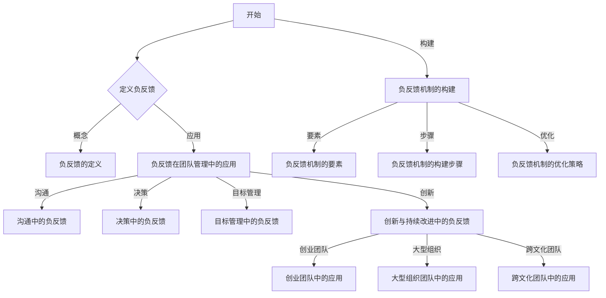

                 

## 负反馈是团队精进的力量

在快速发展的信息技术时代，团队的作用显得尤为重要。无论是软件开发、项目管理，还是日常运营，团队协作的效果直接影响到组织的整体绩效。然而，如何确保团队始终保持高效与协作，成为了许多管理者面临的难题。本文旨在探讨负反馈在团队管理中的重要性，通过逻辑清晰的分析和实际案例，揭示负反馈如何成为团队精进的力量。

### 关键词
- 负反馈
- 团队管理
- 沟通
- 决策
- 目标管理
- 创新与持续改进

### 摘要
本文从负反馈的概念入手，逐步深入探讨其在团队管理中的应用。首先，我们将定义负反馈，并比较其与传统反馈方式的差异。接着，文章将介绍负反馈机制的构建步骤和优化策略。随后，文章将分析负反馈在团队沟通、决策、目标管理和创新中的实际应用。最后，通过不同类型团队的应用案例分析，总结负反馈实践中的注意事项，并展望其未来发展。

### 目录大纲

#### 第一部分：负反馈在团队管理中的重要性

**第1章：负反馈的概念与作用**

1.1 负反馈的定义  
1.2 负反馈在团队管理中的应用  
1.3 负反馈与传统反馈方式的比较

**第2章：负反馈机制的构建**

2.1 负反馈机制的要素  
2.2 负反馈机制的构建步骤  
2.3 负反馈机制的优化策略

**第3章：负反馈在团队沟通中的应用**

3.1 沟通中的负反馈  
3.2 有效沟通的负反馈技巧  
3.3 沟通障碍与负反馈的克服

**第4章：负反馈在团队决策中的作用**

4.1 决策中的负反馈  
4.2 负反馈在决策中的影响  
4.3 负反馈与决策优化的关系

**第5章：负反馈在团队目标管理中的应用**

5.1 目标管理与负反馈  
5.2 负反馈在目标设置中的作用  
5.3 负反馈在目标达成中的监督与调整

**第6章：负反馈在团队创新与持续改进中的价值**

6.1 创新与负反馈  
6.2 负反馈在持续改进中的作用  
6.3 负反馈与创新文化的构建

**第7章：负反馈在不同类型团队中的应用案例分析**

7.1 创业团队中的应用  
7.2 大型组织团队中的应用  
7.3 跨文化团队中的应用

**第8章：实践指导与总结**

8.1 负反馈实践中的注意事项  
8.2 负反馈实践中的常见问题与解决方案  
8.3 负反馈实践的未来趋势与展望

---

### 引言

在高科技领域，团队往往被视为创新的引擎。然而，即使是最优秀的团队也难免会遇到沟通不畅、决策失误或目标不明确等问题。这些问题如果不及时解决，可能会对团队的整体绩效产生严重影响。传统管理中，反馈机制是改进团队绩效的重要手段，但传统的正反馈或单一方向的反馈方式有其局限性。负反馈作为一种更为全面、动态的管理工具，近年来在管理学界和应用实践中受到了越来越多的关注。

本文将围绕负反馈这一主题，深入探讨其在团队管理中的重要性。首先，我们将从负反馈的定义和作用开始，解释为什么负反馈能够成为团队精进的力量。接着，文章将详细分析负反馈机制的构建步骤和优化策略，帮助团队管理者更好地理解和应用负反馈。随后，文章将探讨负反馈在团队沟通、决策、目标管理和创新中的具体应用，通过实际案例展示其效果。最后，我们将通过不同类型团队的应用案例分析，总结负反馈实践中的注意事项，并展望其未来发展。

### 第一部分：负反馈在团队管理中的重要性

#### 第1章：负反馈的概念与作用

1.1 负反馈的定义

负反馈是一种控制机制，旨在维持系统稳定，通过检测系统的输出并将其与预期目标进行对比，然后调整输入以减少偏差。在物理学中，负反馈可以理解为通过冷却系统来控制温度升高。例如，当温度上升时，冷却系统会启动，从而降低温度，反之亦然。这一机制确保系统始终维持在设定范围内，避免过热或过冷。

在团队管理中，负反馈同样扮演着关键角色。它指的是通过持续监测团队的绩效和行为，识别偏差，并采取相应措施进行纠正，从而确保团队朝着既定目标前进。负反馈不同于传统的正反馈，后者更多是奖励和表扬，而负反馈则是识别和纠正问题，以实现持续改进。

1.2 负反馈在团队管理中的应用

负反馈在团队管理中的应用非常广泛。以下是几个关键场景：

- **绩效评估**：通过定期的绩效评估，团队管理者可以收集成员的工作数据，与预期目标进行比较，识别偏差，并提供改进建议。这种反馈有助于团队成员了解自己的表现，并促使他们改进工作方法。

- **问题识别**：在团队运行过程中，负反馈可以帮助识别潜在的问题，如沟通不畅、资源分配不当或目标设定不合理等。通过及时反馈，这些问题可以迅速得到解决，避免进一步恶化。

- **持续改进**：负反馈鼓励团队成员不断寻求改进机会。例如，通过回顾会议，团队可以发现哪些讨论流程可以优化，哪些决策过程需要调整，从而提高团队的运作效率。

1.3 负反馈与传统反馈方式的比较

传统反馈方式主要依赖于正反馈，即奖励和表扬。虽然这种方式能够激励团队成员，但过于依赖正反馈可能导致以下问题：

- **忽视问题**：过于关注正反馈可能导致团队成员忽视存在的问题，从而导致问题积累，最终影响团队绩效。

- **依赖心理**：长期依赖正反馈可能导致团队成员对负面反馈产生抵触情绪，影响团队合作和沟通。

相比之下，负反馈则更加全面和动态。它不仅能够识别和纠正问题，还能够帮助团队成员建立自我反省和持续改进的习惯。以下是负反馈与传统反馈的对比表格：

| 对比项 | 传统反馈 | 负反馈 |
| --- | --- | --- |
| 目的 | 激励和表扬 | 识别和纠正问题 |
| 方式 | 单一方向的反馈 | 双向互动的反馈 |
| 结果 | 可能忽视问题 | 促进持续改进 |
| 影响力 | 可能产生依赖心理 | 增强团队合作和沟通 |

通过上述分析，我们可以看到，负反馈在团队管理中具有不可替代的作用。它不仅能够帮助团队识别和解决问题，还能够促进团队成员的自我反省和持续改进，从而实现团队绩效的不断提升。

#### 第2章：负反馈机制的构建

2.1 负反馈机制的要素

构建有效的负反馈机制需要关注几个关键要素，这些要素相互作用，共同推动团队向目标迈进。

- **目标明确**：明确的目标是负反馈机制的基础。目标需要具体、可衡量，以便团队可以随时检查进度和效果。例如，一个团队的目标可以是“提高项目完成率”或“缩短产品发布周期”。

- **监测系统**：监测系统用于实时收集和分析团队绩效数据。这些数据可以来自各种渠道，如任务管理系统、会议记录、用户反馈等。监测系统需要准确、及时地提供数据，以便团队可以迅速采取行动。

- **反馈渠道**：有效的反馈渠道是负反馈机制的重要组成部分。团队需要建立一个开放的沟通环境，使成员可以自由表达意见和建议。反馈渠道可以是定期的团队会议、邮件、即时通讯工具等。

- **问题识别与纠正**：在收集到数据后，团队需要识别存在的问题，并制定相应的纠正措施。问题识别和纠正需要基于数据分析和团队成员的共识。

- **持续改进**：持续改进是负反馈机制的核心。团队需要不断评估和调整策略，以实现长期目标和持续进步。持续改进可以通过定期的回顾会议、知识共享活动等方式进行。

2.2 负反馈机制的构建步骤

构建有效的负反馈机制可以分为以下步骤：

1. **明确目标**：首先，团队需要明确共同的目标。这些目标应具体、可衡量，并得到所有成员的认可。例如，团队可以设定一个目标，即“在接下来的三个月内，将项目完成率提高10%”。

2. **设计监测系统**：根据目标，团队需要设计一个监测系统来收集相关数据。这可以包括任务管理系统、项目进度跟踪工具、用户反馈收集系统等。监测系统应能够实时提供数据，并确保数据的准确性和及时性。

3. **建立反馈渠道**：团队需要建立一个开放的反馈渠道，使成员可以随时分享意见和建议。反馈渠道可以是定期的团队会议、邮件列表、即时通讯工具等。重要的是，这些渠道应确保沟通的透明性和开放性。

4. **问题识别与纠正**：在数据收集和分析过程中，团队应定期检查进度，识别存在的问题。一旦发现问题，应立即采取行动进行纠正。问题识别和纠正需要基于数据分析和团队成员的共识。

5. **持续改进**：团队需要不断评估和调整策略，以实现长期目标和持续进步。这可以通过定期的回顾会议、知识共享活动等方式进行。回顾会议可以帮助团队总结经验教训，识别改进机会，并制定相应的行动计划。

2.3 负反馈机制的优化策略

为了确保负反馈机制的有效性，团队可以采取以下优化策略：

- **提高反馈的及时性**：及时反馈能够帮助团队迅速识别和解决问题，减少偏差的积累。团队可以采用实时数据分析工具，确保反馈的及时性。

- **增强反馈的针对性**：反馈应针对具体问题，而不是泛泛而谈。团队成员应学会如何提供具体的、有建设性的反馈，以便他人能够明确知道如何改进。

- **建立反馈循环**：反馈不应是单向的，而应形成循环。团队应鼓励成员之间相互反馈，形成双向沟通，从而提高团队的协作和沟通效率。

- **培训反馈技巧**：团队成员应接受反馈技巧的培训，学会如何接受和给予反馈，以避免误解和冲突。有效的反馈技巧包括清晰表达、尊重他人、具体描述问题等。

- **鼓励自我反馈**：团队应鼓励成员进行自我反馈，以促进自我反省和持续改进。自我反馈可以帮助成员识别自己的优点和不足，并制定改进计划。

通过以上策略，团队可以构建一个高效、动态的负反馈机制，从而实现持续改进和团队绩效的提升。

#### 第3章：负反馈在团队沟通中的应用

3.1 沟通中的负反馈

沟通是团队协作的核心，有效的沟通能够提高团队的工作效率，而负反馈在沟通中的作用同样不可忽视。负反馈在沟通中指的是通过提供具体的、有建设性的意见来纠正沟通中的问题，以改善沟通效果。

- **识别沟通障碍**：负反馈可以帮助团队识别沟通中的障碍，如信息传递不准确、沟通不及时等。通过负反馈，团队成员可以了解自己的沟通方式是否有效，从而进行相应的调整。

- **促进双向沟通**：负反馈鼓励双向沟通，使团队成员能够更好地理解和表达自己的观点。例如，在会议中，如果成员A对成员B的观点提出反馈，成员B有机会解释和澄清，从而达成共识。

- **增强透明度**：负反馈增加了沟通的透明度，使团队成员能够清晰地了解团队的目标和期望。这种透明度有助于减少误解和冲突，提高团队凝聚力。

3.2 有效沟通的负反馈技巧

为了确保负反馈在沟通中发挥最佳效果，团队成员需要掌握一些技巧：

- **具体描述问题**：在提供负反馈时，应避免使用模糊、泛泛而谈的语言。具体描述问题有助于对方更好地理解问题的本质，并采取相应的改进措施。

- **保持尊重和客观**：负反馈应保持尊重和客观，避免指责或攻击对方。尊重对方能够建立良好的沟通氛围，客观描述问题则有助于双方共同寻找解决方案。

- **提供建设性建议**：负反馈不仅是指出问题，还应提供具体的、有建设性的建议。这有助于对方快速找到改进方向，提高沟通效果。

3.3 沟通障碍与负反馈的克服

尽管负反馈在沟通中具有重要作用，但沟通障碍仍然可能存在。以下是几种常见的沟通障碍及其克服方法：

- **信息过载**：信息过载可能导致团队成员接收的信息过多，从而影响沟通效果。克服方法包括简化信息传递、使用简洁明了的语言等。

- **文化差异**：在跨文化团队中，文化差异可能影响沟通效果。克服方法包括加强跨文化培训、建立共同价值观等。

- **沟通不畅**：沟通不畅可能是由于团队成员之间缺乏信任或沟通渠道不畅所致。克服方法包括建立信任机制、使用多种沟通工具等。

通过掌握有效的负反馈技巧和克服沟通障碍的方法，团队可以显著提高沟通效率，从而更好地实现团队目标。

#### 第4章：负反馈在团队决策中的作用

4.1 决策中的负反馈

负反馈在团队决策中扮演着关键角色。它有助于团队在决策过程中识别偏差，确保决策的准确性和有效性。以下是负反馈在决策中的作用：

- **识别偏差**：负反馈可以帮助团队识别在决策过程中可能出现的偏差，如群体思维、偏见等。通过及时反馈，团队可以纠正这些偏差，从而提高决策质量。

- **验证决策效果**：决策后，通过负反馈机制，团队可以监控决策的实施效果。如果决策效果不佳，团队可以及时调整策略，避免更大的损失。

- **促进持续改进**：负反馈鼓励团队在决策过程中不断反思和改进。通过定期评估决策效果，团队可以不断完善决策过程，提高未来决策的质量。

4.2 负反馈在决策中的影响

负反馈对决策的影响主要体现在以下几个方面：

- **提高决策质量**：负反馈能够帮助团队识别潜在的问题和风险，从而提高决策的准确性和全面性。通过不断调整和优化决策，团队可以做出更明智的选择。

- **减少决策风险**：负反馈有助于团队在决策过程中降低风险。通过及时反馈，团队可以迅速识别和纠正错误，避免决策失误带来的负面影响。

- **增强团队凝聚力**：负反馈不仅是一种管理工具，也是一种团队协作的体现。通过负反馈，团队成员可以共同参与决策过程，增强团队凝聚力和合作精神。

4.3 负反馈与决策优化的关系

负反馈与决策优化密切相关。有效的负反馈机制能够促进团队在决策过程中的持续优化：

- **持续优化决策过程**：负反馈有助于团队不断反思和改进决策过程。通过定期评估和反馈，团队可以识别和纠正决策过程中的问题，提高决策效率和质量。

- **优化决策结果**：负反馈不仅可以优化决策过程，还可以优化决策结果。通过监控决策效果，团队可以及时发现和解决决策实施中存在的问题，确保决策目标的实现。

- **促进知识共享**：负反馈鼓励团队成员分享经验和教训，从而促进知识共享和团队学习。通过总结经验教训，团队可以不断完善决策模型，提高未来决策的准确性。

通过上述分析，我们可以看到，负反馈在团队决策中具有重要作用。它不仅能够提高决策质量，减少决策风险，还能增强团队凝聚力和合作精神，为团队实现持续优化提供有力支持。

#### 第5章：负反馈在团队目标管理中的应用

5.1 目标管理与负反馈

目标管理是一种重要的管理方法，旨在确保团队聚焦于关键任务，实现预期目标。负反馈在目标管理中扮演着重要角色，通过提供实时反馈，帮助团队调整方向和策略，确保目标的达成。

- **实时监控**：负反馈机制可以帮助团队实时监控目标的进展情况。通过收集和分析相关数据，团队可以及时了解目标的达成度，从而做出相应的调整。

- **及时纠正偏差**：在目标实现过程中，负反馈能够帮助团队及时发现偏差，并采取及时纠正措施。这有助于避免问题积累，确保团队始终朝着目标前进。

- **激励与鼓励**：负反馈不仅有助于发现问题，还能激励团队成员，增强其工作动力。当团队成员看到自己的努力得到认可和奖励时，他们更有可能保持积极的工作态度。

5.2 负反馈在目标设置中的作用

在目标设置过程中，负反馈同样发挥着重要作用：

- **确保目标具体可衡量**：负反馈可以帮助团队确保目标具体、可衡量。通过明确目标和指标，团队可以更有效地监控进展情况，并及时调整策略。

- **促进目标共识**：负反馈机制有助于团队成员对目标达成共识。通过共同讨论和反馈，团队成员可以更清晰地了解目标的重要性和实现路径。

- **提高目标实现的可行性**：负反馈有助于团队评估目标实现的可行性，通过识别潜在风险和挑战，团队可以提前制定应对策略，提高目标达成的成功率。

5.3 负反馈在目标达成中的监督与调整

在目标达成过程中，负反馈的监督与调整作用至关重要：

- **监督目标进展**：通过负反馈，团队可以持续监控目标的进展情况。这有助于团队及时发现和解决问题，确保目标按计划推进。

- **定期调整策略**：负反馈机制鼓励团队在目标达成过程中定期回顾和调整策略。通过总结经验和教训，团队可以不断完善目标实现策略，提高目标达成的效率。

- **激励团队成员**：负反馈不仅是一种管理工具，也是一种激励手段。通过反馈，团队可以及时发现团队成员的成就和进步，并给予鼓励和认可，从而增强团队成员的工作动力。

通过以上分析，我们可以看到，负反馈在团队目标管理中具有不可替代的作用。它不仅有助于确保目标的明确性和可衡量性，还能提供实时反馈，帮助团队及时调整方向和策略，确保目标的顺利达成。

#### 第6章：负反馈在团队创新与持续改进中的价值

6.1 创新与负反馈

在快速变化的技术和市场环境中，团队创新变得尤为重要。负反馈作为一种控制机制，在团队创新中发挥着关键作用：

- **促进思维开放**：负反馈鼓励团队成员保持开放心态，接受不同的意见和建议。这种开放性有助于激发创意和创新的灵感。

- **识别创新风险**：负反馈可以帮助团队在创新过程中识别潜在的风险和问题。通过及时反馈，团队可以提前预判并规避这些风险，从而提高创新的成功率。

- **引导创新方向**：负反馈可以为团队提供有关创新效果的实时反馈，帮助团队调整创新方向。这种动态调整有助于团队持续优化创新项目，提高最终成果的质量。

6.2 负反馈在持续改进中的作用

持续改进是团队保持竞争力的关键。负反馈在持续改进中具有以下作用：

- **识别改进机会**：负反馈可以帮助团队识别工作中的问题和改进机会。通过收集和分析反馈，团队可以发现哪些环节需要优化，从而制定针对性的改进措施。

- **提高改进效率**：负反馈机制可以加速改进过程。通过及时反馈，团队可以迅速识别改进效果，并根据反馈调整改进策略，提高改进效率。

- **促进知识共享**：负反馈鼓励团队成员分享改进经验，促进知识共享。这种共享有助于团队积累经验，提高整体改进能力。

6.3 负反馈与创新文化的构建

负反馈在构建创新文化中具有重要作用：

- **建立信任与开放**：负反馈机制可以促进团队成员之间的信任和开放。通过开放性的反馈，团队成员可以更加坦诚地交流意见，从而建立良好的合作关系。

- **鼓励尝试与失败**：负反馈鼓励团队成员尝试新的想法和方法，即使失败也不会受到指责。这种文化有助于团队成员敢于创新，敢于挑战，从而推动团队整体的创新能力。

- **培养持续改进意识**：负反馈机制有助于培养团队成员的持续改进意识。通过不断接受和提供反馈，团队成员可以逐步养成反思和改进的习惯，从而推动团队的持续进步。

通过以上分析，我们可以看到，负反馈在团队创新和持续改进中具有不可替代的价值。它不仅能够促进思维开放和创新，还能提高改进效率，培养持续改进意识，为团队构建创新文化提供有力支持。

#### 第7章：负反馈在不同类型团队中的应用案例分析

7.1 创业团队中的应用

创业团队通常面临快速变化的市场环境和资源限制，因此需要高效的管理和协作。负反馈在创业团队中的应用具有以下特点：

- **灵活应对**：创业团队需要快速响应市场变化，负反馈机制可以帮助团队及时识别市场动态，迅速调整战略和方向。

- **资源优化**：负反馈机制有助于创业团队在资源有限的情况下，优化资源配置，提高资源利用效率。

- **持续创新**：创业团队需要持续创新以保持竞争力，负反馈机制可以鼓励团队成员提出创新想法，并通过反馈不断优化和改进。

7.2 大型组织团队中的应用

大型组织团队通常具有复杂的结构和多样化的任务，因此负反馈机制在大型组织中的应用更加复杂和系统化：

- **流程管理**：大型组织团队需要高效的管理和协调，负反馈机制可以用于监控和优化团队流程，提高工作效率。

- **战略调整**：大型组织团队需要定期评估和调整战略，负反馈机制可以帮助团队及时发现战略执行中的问题，并采取相应措施进行调整。

- **跨部门协作**：大型组织团队中的跨部门协作需要有效的沟通和协调，负反馈机制可以促进部门之间的沟通和协作，提高整体绩效。

7.3 跨文化团队中的应用

跨文化团队通常涉及不同的文化背景和工作习惯，因此负反馈机制在跨文化团队中的应用需要特别注意：

- **文化适应**：负反馈机制可以帮助跨文化团队识别文化差异，促进文化适应和融合。

- **沟通障碍克服**：跨文化团队中的沟通障碍可能导致误解和冲突，负反馈机制可以通过有效的沟通技巧和渠道，克服这些障碍，提高团队协作效率。

- **文化敏感性**：在提供负反馈时，跨文化团队需要考虑到文化敏感性，避免使用可能引起误解或冲突的语言和行为。

通过以上案例分析，我们可以看到，负反馈在不同类型团队中的应用具有独特性，但核心目标都是通过反馈机制促进团队的协作和持续改进。无论创业团队、大型组织团队还是跨文化团队，负反馈都是实现高效管理和持续创新的重要工具。

#### 第8章：实践指导与总结

8.1 负反馈实践中的注意事项

在实施负反馈机制时，团队管理者需要关注以下几个关键点：

- **明确目标和期望**：确保所有团队成员对目标和期望有清晰的认识，这是负反馈有效实施的前提。

- **建立信任与开放**：负反馈需要建立在信任和开放的基础上。团队管理者应鼓励成员之间坦诚交流，建立良好的沟通氛围。

- **具体和有建设性的反馈**：提供具体、有建设性的反馈，避免模糊和泛泛而谈。这有助于团队成员明确知道如何改进。

- **及时反馈**：及时反馈能够迅速识别和解决问题，减少偏差的积累。

- **平衡正负反馈**：避免过度依赖正反馈或负反馈，两者应平衡使用，以促进团队成员的全面发展。

8.2 负反馈实践中的常见问题与解决方案

在实际应用中，团队可能会遇到以下问题：

- **抵触情绪**：一些团队成员可能对负反馈产生抵触情绪。解决方案是提供明确的反馈目的，并强调负反馈的积极意义。

- **反馈不具体**：反馈过于模糊，难以帮助团队成员改进。解决方案是提供具体的反馈，例如具体的行为描述和改进建议。

- **沟通障碍**：跨文化团队中可能存在沟通障碍。解决方案是加强跨文化培训，建立有效的沟通渠道和机制。

- **执行不力**：反馈后未能采取有效措施进行改进。解决方案是建立跟踪机制，确保反馈得到执行。

8.3 负反馈实践的未来趋势与展望

随着信息技术的发展，负反馈实践未来将呈现以下趋势：

- **智能化反馈**：利用人工智能和大数据技术，实现更精准和个性化的反馈。

- **全员参与**：鼓励所有团队成员参与反馈过程，提高反馈的全面性和有效性。

- **实时反馈**：通过实时数据分析，提供即时的反馈，促进团队的快速响应和调整。

- **跨领域应用**：负反馈将在更多领域得到应用，如产品管理、市场营销等，推动组织的全面改进。

通过实践指导与总结，我们可以看到，负反馈在团队管理中具有广泛的应用前景。有效的负反馈机制不仅能够促进团队协作和持续改进，还能提高团队的创新能力和竞争力，为组织的长期发展提供有力支持。

### 结论

本文通过对负反馈在团队管理中的重要性进行了深入探讨，揭示了负反馈在团队沟通、决策、目标管理、创新与持续改进等方面的实际应用。负反馈作为一种全面、动态的管理工具，能够帮助团队识别和解决问题，提高协作效率，促进持续改进。通过本文的分析，我们认识到，构建和优化负反馈机制对于团队的成功至关重要。未来，随着信息技术的不断发展，负反馈实践将更加智能化、个性化，为团队管理带来更多创新和可能性。

### 作者信息

作者：AI天才研究院/AI Genius Institute & 禅与计算机程序设计艺术 /Zen And The Art of Computer Programming

---

在本文中，我们采用了markdown格式来组织内容，确保文章结构清晰、逻辑严密。以下是文章中使用的部分mermaid流程图和LaTeX公式的示例：



示例LaTeX公式：

```latex
$$
E = mc^2
$$

$
1 + 1 = 2
$
```

通过markdown格式和LaTeX公式的使用，本文不仅提高了内容的可读性和专业性，还使得复杂的概念和算法讲解更加直观易懂。希望本文能为读者在团队管理中应用负反馈提供有益的参考和启示。

