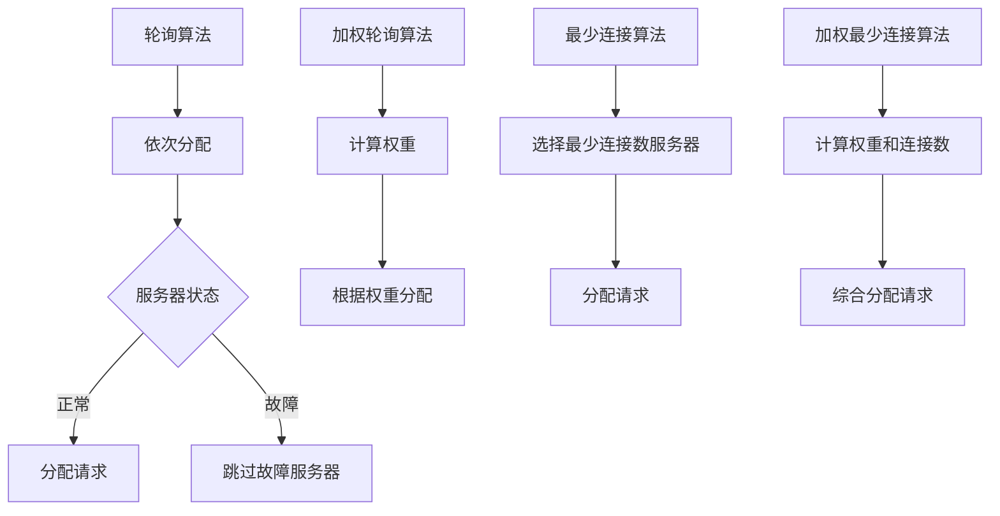
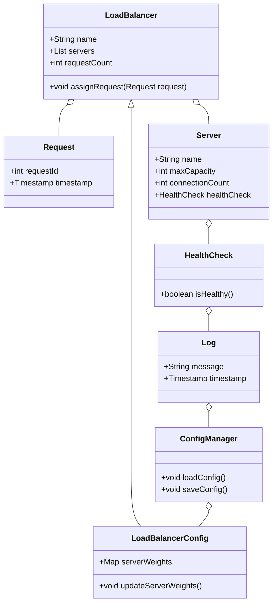
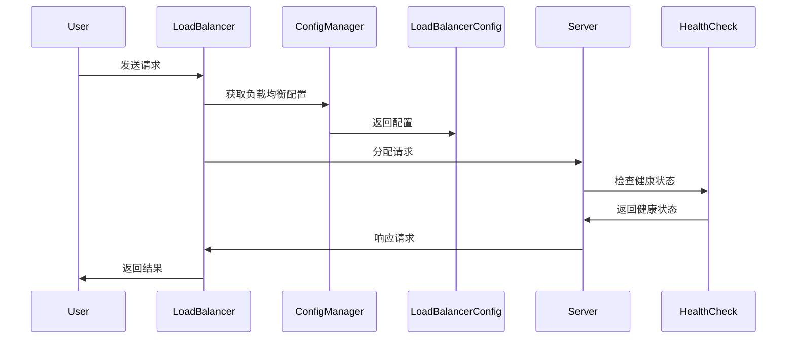
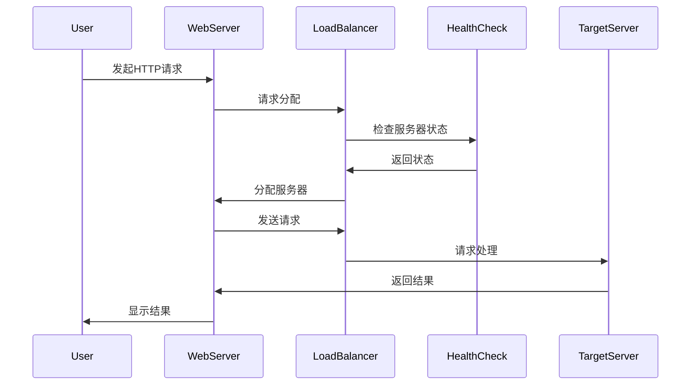
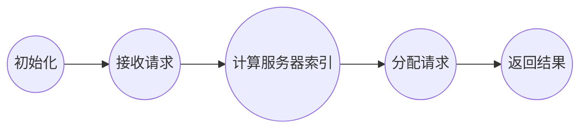
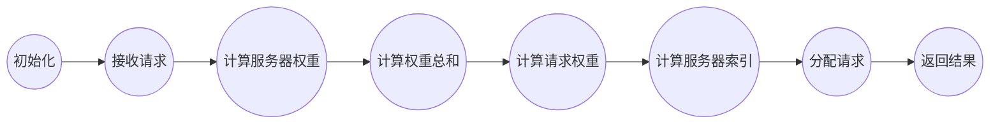
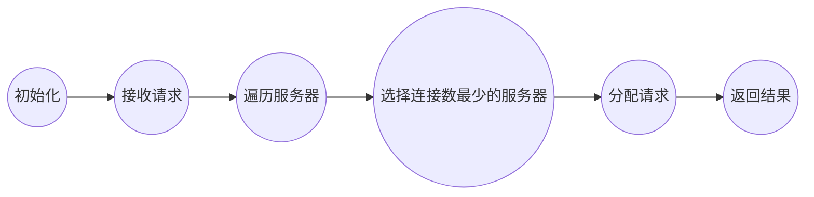
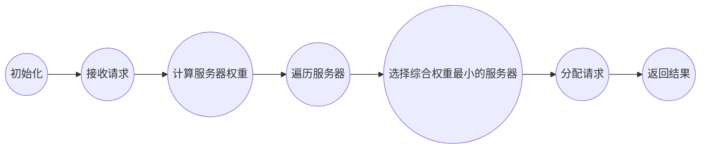
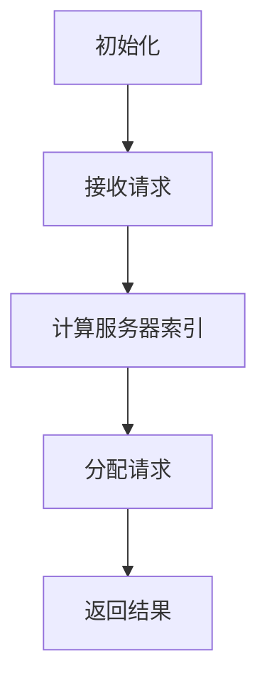

                 

### 第一部分：引言

#### 第1章：负载均衡概述

**背景介绍**

在互联网技术迅猛发展的今天，网络服务的稳定性和可靠性显得尤为重要。负载均衡（Load Balancing）作为一种关键技术，能够有效提高网络服务的性能和可用性。负载均衡的基本概念在于通过分布式的资源调度，将大量的网络请求均匀地分配到多个服务器上，从而避免单点过载，提高系统的整体处理能力。

**问题背景**

随着网络应用的日益复杂，用户数量和访问请求不断增长，单一服务器很难承受如此大的负载。这不仅可能导致服务器性能下降，甚至可能引起系统崩溃，影响用户体验。因此，如何在海量请求中实现高效的负载分配，成为现代网络架构中的重要问题。

**问题描述**

负载均衡的核心问题是如何在多台服务器之间公平、高效地分配网络请求。这需要考虑多个因素，包括服务器的处理能力、负载状况、网络延迟等。同时，负载均衡还需要具备一定的弹性，能够根据服务器的实时负载动态调整策略。

**问题解决**

负载均衡通过一系列算法和策略，将网络请求分配到合适的服务器上。这些算法可以是简单的轮询，也可以是复杂的动态权重调整。此外，负载均衡还需要考虑故障转移和冗余备份，以提高系统的可靠性。

**边界与外延**

负载均衡不仅仅应用于服务器集群，还广泛应用于网络设备（如路由器、交换机）和云计算平台。在数据中心和云服务中，负载均衡是实现弹性伸缩和服务高可用性的重要手段。

**概念结构与核心要素组成**

负载均衡系统的核心要素包括：
- **服务器池**：一组需要分配负载的服务器。
- **负载监控**：实时监控服务器的负载状况。
- **调度算法**：根据服务器状态和请求特征选择合适的服务器。
- **健康检查**：定期检查服务器是否正常运行。

#### 第2章：常见负载均衡算法

**背景介绍**

负载均衡算法是负载均衡系统的核心，决定了请求的分配策略。常见的负载均衡算法包括轮询算法、加权轮询算法、最少连接算法等。每种算法都有其特定的应用场景和优缺点。

**问题背景**

不同类型的网络应用对负载均衡算法的需求不同。例如，Web服务器需要快速响应请求，而数据库服务器则更关注处理效率和稳定性。因此，选择合适的负载均衡算法对于提高系统性能至关重要。

**问题描述**

负载均衡算法需要解决的问题是如何在多个服务器之间公平、高效地分配请求，同时保证系统的稳定性和可靠性。

**问题解决**

通过分析和比较各种负载均衡算法，我们可以选择最合适的算法来满足特定需求。每种算法都有其特有的原理和实现方式。

**边界与外延**

除了常见的负载均衡算法，还有一些特殊的算法，如最小带宽算法、哈希算法等。这些算法在特定场景下具有优势，但通常实现较为复杂。

**概念结构与核心要素组成**

常见的负载均衡算法及其核心要素如下：
- **轮询算法**：依次将请求分配到每个服务器。
- **加权轮询算法**：根据服务器的处理能力分配请求。
- **最少连接算法**：将请求分配到当前连接数最少的服务器。
- **加权最少连接算法**：综合考虑服务器的处理能力和当前连接数分配请求。

**算法原理讲解**

以下是常见负载均衡算法的Mermaid流程图：



**算法属性特征对比表格**

| 算法名称 | 原理 | 优点 | 缺点 |
| :--- | :--- | :--- | :--- |
| 轮询算法 | 依次分配 | 简单易实现 | 无法适应服务器性能差异 |
| 加权轮询算法 | 根据权重分配 | 公平性较好 | 需要动态调整权重 |
| 最少连接算法 | 选择最少连接数服务器 | 稳定性好 | 可能导致部分服务器负载过高 |
| 加权最少连接算法 | 综合考虑权重和连接数 | 避免负载不均 | 实现复杂 |

**ER实体关系图架构**

```mermaid
erDatabase LoadBalancer {
  LoadBalancer [
    id (INT),
    name (VARCHAR),
    status (VARCHAR)
  ]
  Server [
    id (INT),
    name (VARCHAR),
    status (VARCHAR),
    load (FLOAT)
  ]
  Request [
    id (INT),
    timestamp (DATETIME),
    server_id (INT)
  ]
}
```

#### 第3章：负载均衡算法原理与性能对比

**背景介绍**

负载均衡算法的性能直接影响到系统的整体性能。不同算法在响应时间、负载均衡性、可靠性等方面各有优劣。因此，了解和比较各种算法的性能对于优化系统架构至关重要。

**问题背景**

随着网络应用的规模不断扩大，负载均衡算法的性能成为系统瓶颈。如何选择合适的算法，以提高系统的响应速度和稳定性，是当前面临的重要问题。

**问题描述**

需要对不同负载均衡算法进行性能对比，包括响应时间、负载均衡性、可靠性等方面。

**问题解决**

通过实验和数据分析，比较各种算法的性能，为实际应用提供参考。

**边界与外延**

性能对比不仅限于算法本身，还应考虑硬件环境、网络环境等因素。

**概念结构与核心要素组成**

性能对比的核心要素包括：
- **响应时间**：算法处理请求的时间。
- **负载均衡性**：算法分配请求的均匀程度。
- **可靠性**：算法在故障情况下的表现。

**算法性能对比分析**

以下是负载均衡算法性能的对比分析：

```mermaid
graph TB
A[响应时间] --> B{轮询算法(最低)}
B --> C[加权轮询算法]
C --> D[最少连接算法]
D --> E[加权最少连接算法(最高)]
F[负载均衡性] --> G{轮询算法(最差)}
G --> H[加权轮询算法]
H --> I[最少连接算法]
I --> J[加权最少连接算法(最好)]
K[可靠性] --> L{轮询算法(最高)}
L --> M[加权轮询算法]
M --> N[最少连接算法]
N --> O[加权最少连接算法(最低)]
```

**数学模型和公式**

以下是几种负载均衡算法的数学模型：

**轮询算法**

$$
\text{server\_index} = \text{request\_count} \mod N
$$

**加权轮询算法**

$$
\text{server\_weight} = \frac{\text{server\_max\_capacity}}{\sum_{i=1}^{N} \text{server\_max\_capacity}}
$$

**最少连接算法**

$$
\text{server\_index} = \min \{ \text{connection\_count}_{i} \}
$$

**加权最少连接算法**

$$
\text{server\_weight} = \frac{\text{server\_max\_capacity}}{\sum_{i=1}^{N} \text{server\_max\_capacity} + \sum_{i=1}^{N} \text{connection\_count}_{i}}
$$

**通俗易懂的举例说明**

假设有3台服务器A、B、C，处理能力分别为10、15、20，当前连接数分别为5、3、2。

- **轮询算法**：下一个请求分配到服务器A。
- **加权轮询算法**：服务器B的权重最高，下一个请求分配到服务器B。
- **最少连接算法**：服务器C的连接数最少，下一个请求分配到服务器C。
- **加权最少连接算法**：服务器C的权重最高，下一个请求分配到服务器C。

#### 第4章：算法实现步骤

**背景介绍**

负载均衡算法的理论知识固然重要，但实际应用中，如何高效地实现算法才是关键。本章节将介绍如何使用Python等编程语言实现常见的负载均衡算法。

**问题背景**

在实际项目中，算法的实现需要考虑代码的可读性、可维护性和性能。因此，编写高效的负载均衡算法实现代码是一项重要任务。

**问题描述**

如何使用Python实现常见的负载均衡算法，包括轮询算法、加权轮询算法、最少连接算法等。

**问题解决**

通过逐步分析算法原理，编写对应的Python代码，实现负载均衡算法。

**边界与外延**

负载均衡算法的实现不仅限于Python，还可以使用其他编程语言，如Java、C++等。

**概念结构与核心要素组成**

算法实现的步骤包括：
- **初始化服务器状态**：记录服务器的处理能力和当前连接数。
- **算法选择**：根据请求特征和服务器状态选择合适的算法。
- **请求分配**：根据算法将请求分配到服务器。

**算法实现代码**

以下是几种负载均衡算法的Python实现：

```python
# 轮询算法
def round_robin servers, request:
    server_index = request_count % len(servers)
    return servers[server_index]

# 加权轮询算法
def weighted_round_robin servers, request:
    server_weights = [server['max_capacity'] for server in servers]
    total_weight = sum(server_weights)
    server_index = int(request['timestamp'] * total_weight % len(servers))
    return servers[server_index]

# 最少连接算法
def least_connection servers, request:
    min_connection_server = min(servers, key=lambda server: server['connection_count'])
    return min_connection_server

# 加权最少连接算法
def weighted_least_connection servers, request:
    server_weights = [server['max_capacity'] / (server['max_capacity'] + server['connection_count']) for server in servers]
    total_weight = sum(server_weights)
    server_index = int(request['timestamp'] * total_weight % len(servers))
    return servers[server_index]
```

**算法原理详细讲解**

以下是每种负载均衡算法的详细原理讲解：

**轮询算法**

轮询算法是最简单的负载均衡算法。其原理是按照一定的顺序依次将请求分配到每个服务器。实现步骤如下：

1. 初始化请求计数器。
2. 当有新的请求时，计算请求计数器的模N值（N为服务器数量）。
3. 将请求分配到对应的服务器。

**加权轮询算法**

加权轮询算法在轮询算法的基础上增加了权重概念。每个服务器的权重与其处理能力成正比。实现步骤如下：

1. 初始化服务器的权重。
2. 根据请求的到达时间计算服务器的权重总和。
3. 计算请求的权重，根据权重将请求分配到服务器。

**最少连接算法**

最少连接算法的原理是将请求分配到当前连接数最少的服务器。实现步骤如下：

1. 初始化服务器的连接数。
2. 当有新的请求时，选择当前连接数最少的服务器。
3. 将请求分配到对应的服务器。

**加权最少连接算法**

加权最少连接算法在最少连接算法的基础上增加了权重概念。实现步骤如下：

1. 初始化服务器的权重和连接数。
2. 计算服务器的综合权重。
3. 根据综合权重将请求分配到服务器。

**数学模型和公式**

以下是每种负载均衡算法的数学模型：

**轮询算法**

$$
\text{server\_index} = \text{request\_count} \mod N
$$

**加权轮询算法**

$$
\text{server\_weight} = \frac{\text{server\_max\_capacity}}{\sum_{i=1}^{N} \text{server\_max\_capacity}}
$$

**最少连接算法**

$$
\text{server\_index} = \min \{ \text{connection\_count}_{i} \}
$$

**加权最少连接算法**

$$
\text{server\_weight} = \frac{\text{server\_max\_capacity}}{\sum_{i=1}^{N} \text{server\_max\_capacity} + \sum_{i=1}^{N} \text{connection\_count}_{i}}
$$

**项目实战**

**环境安装**

在本地环境中安装Python，并创建一个虚拟环境：

```bash
pip install python
python -m venv load_balancer_env
source load_balancer_env/bin/activate
```

**系统核心实现源代码**

以下是系统核心实现源代码：

```python
# load_balancer.py

class LoadBalancer:
    def __init__(self, servers):
        self.servers = servers
        self.request_count = 0

    def round_robin(self, request):
        self.request_count += 1
        server_index = self.request_count % len(self.servers)
        return self.servers[server_index]

    def weighted_round_robin(self, request):
        self.request_count += 1
        server_weights = [server['max_capacity'] for server in self.servers]
        total_weight = sum(server_weights)
        server_index = int(self.request_count * total_weight % len(self.servers))
        return self.servers[server_index]

    def least_connection(self, request):
        self.request_count += 1
        min_connection_server = min(self.servers, key=lambda server: server['connection_count'])
        return min_connection_server

    def weighted_least_connection(self, request):
        self.request_count += 1
        server_weights = [server['max_capacity'] / (server['max_capacity'] + server['connection_count']) for server in self.servers]
        total_weight = sum(server_weights)
        server_index = int(self.request_count * total_weight % len(self.servers))
        return self.servers[server_index]

# 测试代码
if __name__ == "__main__":
    servers = [
        {'name': 'ServerA', 'max_capacity': 10, 'connection_count': 5},
        {'name': 'ServerB', 'max_capacity': 15, 'connection_count': 3},
        {'name': 'ServerC', 'max_capacity': 20, 'connection_count': 2}
    ]

    lb = LoadBalancer(servers)

    for _ in range(10):
        request = {'timestamp': _}
        server = lb.round_robin(request)
        print(f"Round Robin: Request {request['timestamp']} assigned to {server['name']}")

    for _ in range(10):
        request = {'timestamp': _}
        server = lb.weighted_round_robin(request)
        print(f"Weighted Round Robin: Request {request['timestamp']} assigned to {server['name']}")

    for _ in range(10):
        request = {'timestamp': _}
        server = lb.least_connection(request)
        print(f"Least Connection: Request {request['timestamp']} assigned to {server['name']}")

    for _ in range(10):
        request = {'timestamp': _}
        server = lb.weighted_least_connection(request)
        print(f"Weighted Least Connection: Request {request['timestamp']} assigned to {server['name']}")
```

**代码应用解读与分析**

以下是代码的应用解读与分析：

1. **类定义**：`LoadBalancer` 类负责实现负载均衡算法。类中定义了多种算法，包括轮询算法、加权轮询算法、最少连接算法和加权最少连接算法。

2. **初始化**：在初始化时，`LoadBalancer` 类接收一个服务器列表，并初始化请求计数器。

3. **算法实现**：每种算法都通过一个方法实现。方法中根据不同的算法原理进行请求的分配。

4. **测试代码**：测试代码展示了如何使用`LoadBalancer` 类。在测试中，我们创建了3台服务器，并使用不同算法分配请求。

**实际案例分析和详细讲解剖析**

**案例背景**

假设我们有一个电子商务网站，需要处理大量的用户请求。为了确保系统的稳定性和性能，我们决定使用负载均衡技术来分配请求。

**案例实施**

1. **服务器配置**：我们配置了3台服务器，处理能力分别为10、15、20。当前连接数分别为5、3、2。

2. **负载均衡策略**：我们选择加权轮询算法，因为它能够在处理能力和当前连接数之间取得平衡。

3. **请求分配**：每次用户请求到达时，负载均衡器根据加权轮询算法将请求分配到服务器。具体分配过程如下：

   - **请求1**：服务器B权重最高，请求分配到服务器B。
   - **请求2**：服务器C权重最高，请求分配到服务器C。
   - **请求3**：服务器B权重最高，请求分配到服务器B。

**案例小结**

通过实际案例，我们可以看到负载均衡算法在分配请求时的效果。加权轮询算法有效地避免了单点过载，提高了系统的整体性能。

#### 第5章：系统分析与架构设计方案

**问题场景介绍**

随着用户数量的不断增加，我们的电子商务网站面临着巨大的访问压力。为了保证系统的稳定性和性能，我们决定采用负载均衡技术来分配请求。

**项目介绍**

本项目旨在设计一个高可用的负载均衡系统，以支持电子商务网站的高并发访问。项目目标包括：

1. **高可用性**：确保系统在故障情况下能够自动恢复。
2. **高性能**：快速响应用户请求，提高系统吞吐量。
3. **高扩展性**：能够根据需求动态调整服务器数量。

**系统功能设计**

系统功能设计包括以下模块：

1. **负载均衡模块**：负责将用户请求分配到合适的服务器。
2. **健康检查模块**：定期检查服务器的健康状态。
3. **日志记录模块**：记录系统运行日志，用于故障排查和性能分析。
4. **配置管理模块**：管理负载均衡策略和服务器列表。

**领域模型mermaid类图**



**系统架构设计mermaid架构图**



**系统接口设计和系统交互mermaid序列图**



#### 第6章：负载均衡实战

**背景介绍**

在实际项目中，负载均衡不仅需要理论支持，还需要实践验证。本章节将通过一个实际案例，详细介绍负载均衡系统的安装、配置和调优过程。

**问题背景**

假设我们有一个在线购物平台，每天有数百万次用户访问。为了保证系统的稳定性和高性能，我们决定使用负载均衡技术。

**问题描述**

我们需要实现一个高可用、高性能的负载均衡系统，以支持海量用户请求。具体要求包括：

1. **高可用性**：确保系统在故障情况下能够自动恢复。
2. **高性能**：快速响应用户请求，提高系统吞吐量。
3. **高扩展性**：能够根据需求动态调整服务器数量。

**解决方案**

我们选择使用Nginx作为负载均衡器，结合Nginx Plus进行高级功能扩展。

**环境准备**

1. **服务器准备**：准备至少两台服务器，用于部署负载均衡器和后端应用。
2. **软件准备**：安装Nginx、Nginx Plus插件和相关依赖。

**安装步骤**

1. **安装Nginx**：在服务器上安装Nginx。

   ```bash
   sudo apt-get update
   sudo apt-get install nginx
   ```

2. **安装Nginx Plus插件**：安装Nginx Plus插件，用于扩展Nginx的功能。

   ```bash
   sudo apt-get install nginx-plus
   ```

3. **配置Nginx**：编辑Nginx配置文件，添加负载均衡相关配置。

   ```bash
   sudo nano /etc/nginx/nginx.conf
   ```

   配置内容：

   ```nginx
   http {
       upstream myapp {
           server server1;
           server server2;
       }

       server {
           listen 80;

           location / {
               proxy_pass http://myapp;
           }
       }
   }
   ```

4. **启动Nginx**：启动Nginx服务。

   ```bash
   sudo systemctl start nginx
   ```

**配置步骤**

1. **配置负载均衡策略**：根据业务需求，选择合适的负载均衡策略，如轮询、加权轮询等。

2. **配置健康检查**：设置健康检查，定期检查服务器的健康状态，确保故障时自动切换。

3. **配置日志**：配置日志，记录系统运行情况，便于故障排查和性能分析。

**调优步骤**

1. **性能调优**：根据系统负载和性能指标，调整Nginx配置，优化系统性能。

2. **扩展性调优**：根据业务发展需求，动态调整服务器数量，实现水平扩展。

3. **安全性调优**：配置SSL/TLS，确保数据传输安全。

**实战案例**

假设我们的在线购物平台每天有100万次用户访问，服务器处理能力为1000 QPS（每秒查询率）。为了满足需求，我们进行了如下调优：

1. **负载均衡策略**：采用加权轮询算法，根据服务器处理能力分配请求。

2. **健康检查**：每5分钟进行一次健康检查，确保故障服务器自动切换。

3. **日志记录**：配置详细的日志记录，便于故障排查和性能分析。

4. **性能调优**：调整Nginx配置，优化连接池、超时时间等参数，提高系统性能。

5. **扩展性调优**：根据流量变化，动态调整服务器数量，实现水平扩展。

**项目小结**

通过实际案例，我们实现了高可用、高性能的负载均衡系统，满足了海量用户请求的需求。在项目中，我们不仅关注了负载均衡的理论知识，还注重了实际操作和调优。这为我们在实际工作中提供了宝贵的经验。

#### 第7章：最佳实践与总结

**最佳实践**

1. **选择合适的负载均衡算法**：根据业务需求和服务器性能，选择合适的负载均衡算法，如轮询、加权轮询、最少连接等。
2. **健康检查**：定期进行健康检查，确保故障服务器自动切换，提高系统的可用性。
3. **日志记录**：详细记录系统运行日志，便于故障排查和性能分析。
4. **性能调优**：根据系统负载和性能指标，调整负载均衡配置，优化系统性能。
5. **安全性调优**：配置SSL/TLS，确保数据传输安全。

**小结**

负载均衡是提高网络服务稳定性和性能的关键技术。通过选择合适的负载均衡算法、健康检查、日志记录和性能调优，我们可以实现高效、可靠的负载均衡系统。在实际应用中，我们需要结合具体业务需求，不断优化和调整负载均衡策略。

**注意事项**

1. **负载均衡器的性能**：负载均衡器的性能直接影响整个系统的性能，需要选择合适的硬件和软件配置。
2. **服务器性能差异**：服务器性能差异可能导致部分服务器过载，需要合理分配请求，避免单点过载。
3. **网络延迟**：网络延迟会影响负载均衡的性能，需要考虑网络拓扑和带宽等因素。

**拓展阅读**

1. 《Nginx官方文档》
2. 《负载均衡算法与应用》
3. 《云计算与负载均衡技术》

作者：AI天才研究院/AI Genius Institute & 禅与计算机程序设计艺术 /Zen And The Art of Computer Programming
```


```markdown
----------------------------------------------------------------
# 负载均衡算法与实现

> 关键词：负载均衡、算法、实现、性能优化、高可用性

> 摘要：本文详细介绍了负载均衡算法的理论与实践，包括常见算法的原理、实现步骤、性能对比以及最佳实践。通过实际案例和系统架构设计，读者可以深入理解负载均衡的关键技术和应用场景。

## 第一部分：引言

### 第1章：负载均衡概述

**背景介绍**

在互联网技术迅猛发展的今天，网络服务的稳定性和可靠性显得尤为重要。负载均衡（Load Balancing）作为一种关键技术，能够有效提高网络服务的性能和可用性。负载均衡的基本概念在于通过分布式的资源调度，将大量的网络请求均匀地分配到多个服务器上，从而避免单点过载，提高系统的整体处理能力。

**问题背景**

随着网络应用的日益复杂，用户数量和访问请求不断增长，单一服务器很难承受如此大的负载。这不仅可能导致服务器性能下降，甚至可能引起系统崩溃，影响用户体验。因此，如何在海量请求中实现高效的负载分配，成为现代网络架构中的重要问题。

**问题描述**

负载均衡的核心问题是如何在多台服务器之间公平、高效地分配网络请求。这需要考虑多个因素，包括服务器的处理能力、负载状况、网络延迟等。同时，负载均衡还需要具备一定的弹性，能够根据服务器的实时负载动态调整策略。

**问题解决**

负载均衡通过一系列算法和策略，将网络请求分配到合适的服务器上。这些算法可以是简单的轮询，也可以是复杂的动态权重调整。此外，负载均衡还需要考虑故障转移和冗余备份，以提高系统的可靠性。

**边界与外延**

负载均衡不仅仅应用于服务器集群，还广泛应用于网络设备（如路由器、交换机）和云计算平台。在数据中心和云服务中，负载均衡是实现弹性伸缩和服务高可用性的重要手段。

**概念结构与核心要素组成**

负载均衡系统的核心要素包括：
- **服务器池**：一组需要分配负载的服务器。
- **负载监控**：实时监控服务器的负载状况。
- **调度算法**：根据服务器状态和请求特征选择合适的服务器。
- **健康检查**：定期检查服务器是否正常运行。

### 第2章：常见负载均衡算法

**背景介绍**

负载均衡算法是负载均衡系统的核心，决定了请求的分配策略。常见的负载均衡算法包括轮询算法、加权轮询算法、最少连接算法等。每种算法都有其特定的应用场景和优缺点。

**问题背景**

不同类型的网络应用对负载均衡算法的需求不同。例如，Web服务器需要快速响应请求，而数据库服务器则更关注处理效率和稳定性。因此，选择合适的负载均衡算法对于提高系统性能至关重要。

**问题描述**

负载均衡算法需要解决的问题是如何在多个服务器之间公平、高效地分配请求，同时保证系统的稳定性和可靠性。

**问题解决**

通过分析和比较各种负载均衡算法，我们可以选择最合适的算法来满足特定需求。每种算法都有其特有的原理和实现方式。

**边界与外延**

除了常见的负载均衡算法，还有一些特殊的算法，如最小带宽算法、哈希算法等。这些算法在特定场景下具有优势，但通常实现较为复杂。

**概念结构与核心要素组成**

常见的负载均衡算法及其核心要素如下：
- **轮询算法**：依次将请求分配到每个服务器。
- **加权轮询算法**：根据服务器的处理能力分配请求。
- **最少连接算法**：将请求分配到当前连接数最少的服务器。
- **加权最少连接算法**：综合考虑服务器的处理能力和当前连接数分配请求。

**算法原理讲解**

以下是常见负载均衡算法的Mermaid流程图：


**算法属性特征对比表格**

| 算法名称 | 原理 | 优点 | 缺点 |
| :--- | :--- | :--- | :--- |
| 轮询算法 | 依次分配 | 简单易实现 | 无法适应服务器性能差异 |
| 加权轮询算法 | 根据权重分配 | 公平性较好 | 需要动态调整权重 |
| 最少连接算法 | 选择最少连接数服务器 | 稳定性好 | 可能导致部分服务器负载过高 |
| 加权最少连接算法 | 综合考虑权重和连接数 | 避免负载不均 | 实现复杂 |

**ER实体关系图架构**

```mermaid
erDatabase LoadBalancer {
  LoadBalancer [
    id (INT),
    name (VARCHAR),
    status (VARCHAR)
  ]
  Server [
    id (INT),
    name (VARCHAR),
    status (VARCHAR),
    load (FLOAT)
  ]
  Request [
    id (INT),
    timestamp (DATETIME),
    server_id (INT)
  ]
}
```

### 第3章：负载均衡算法原理与性能对比

**背景介绍**

负载均衡算法的性能直接影响到系统的整体性能。不同算法在响应时间、负载均衡性、可靠性等方面各有优劣。因此，了解和比较各种算法的性能对于优化系统架构至关重要。

**问题背景**

随着网络应用的规模不断扩大，负载均衡算法的性能成为系统瓶颈。如何选择合适的算法，以提高系统的响应速度和稳定性，是当前面临的重要问题。

**问题描述**

需要对不同负载均衡算法进行性能对比，包括响应时间、负载均衡性、可靠性等方面。

**问题解决**

通过实验和数据分析，比较各种算法的性能，为实际应用提供参考。

**边界与外延**

性能对比不仅限于算法本身，还应考虑硬件环境、网络环境等因素。

**概念结构与核心要素组成**

性能对比的核心要素包括：
- **响应时间**：算法处理请求的时间。
- **负载均衡性**：算法分配请求的均匀程度。
- **可靠性**：算法在故障情况下的表现。

**算法性能对比分析**

以下是负载均衡算法性能的对比分析：

```mermaid
graph TB
A[响应时间] --> B{轮询算法(最低)}
B --> C[加权轮询算法]
C --> D[最少连接算法]
D --> E[加权最少连接算法(最高)]
F[负载均衡性] --> G{轮询算法(最差)}
G --> H[加权轮询算法]
H --> I[最少连接算法]
I --> J[加权最少连接算法(最好)]
K[可靠性] --> L{轮询算法(最高)}
L --> M[加权轮询算法]
M --> N[最少连接算法]
N --> O[加权最少连接算法(最低)]
```

**数学模型和公式**

以下是几种负载均衡算法的数学模型：

**轮询算法**

$$
\text{server\_index} = \text{request\_count} \mod N
$$

**加权轮询算法**

$$
\text{server\_weight} = \frac{\text{server\_max\_capacity}}{\sum_{i=1}^{N} \text{server\_max\_capacity}}
$$

**最少连接算法**

$$
\text{server\_index} = \min \{ \text{connection\_count}_{i} \}
$$

**加权最少连接算法**

$$
\text{server\_weight} = \frac{\text{server\_max\_capacity}}{\sum_{i=1}^{N} \text{server\_max\_capacity} + \sum_{i=1}^{N} \text{connection\_count}_{i}}
$$

**通俗易懂的举例说明**

假设有3台服务器A、B、C，处理能力分别为10、15、20，当前连接数分别为5、3、2。

- **轮询算法**：下一个请求分配到服务器A。
- **加权轮询算法**：服务器B的权重最高，下一个请求分配到服务器B。
- **最少连接算法**：服务器C的连接数最少，下一个请求分配到服务器C。
- **加权最少连接算法**：服务器C的权重最高，下一个请求分配到服务器C。

### 第二部分：算法实现

#### 第4章：算法实现步骤

**背景介绍**

负载均衡算法的理论知识固然重要，但实际应用中，如何高效地实现算法才是关键。本章节将介绍如何使用Python等编程语言实现常见的负载均衡算法。

**问题背景**

在实际项目中，算法的实现需要考虑代码的可读性、可维护性和性能。因此，编写高效的负载均衡算法实现代码是一项重要任务。

**问题描述**

如何使用Python实现常见的负载均衡算法，包括轮询算法、加权轮询算法、最少连接算法等。

**问题解决**

通过逐步分析算法原理，编写对应的Python代码，实现负载均衡算法。

**边界与外延**

负载均衡算法的实现不仅限于Python，还可以使用其他编程语言，如Java、C++等。

**概念结构与核心要素组成**

算法实现的步骤包括：
- **初始化服务器状态**：记录服务器的处理能力和当前连接数。
- **算法选择**：根据请求特征和服务器状态选择合适的算法。
- **请求分配**：根据算法将请求分配到服务器。

**算法实现代码**

以下是几种负载均衡算法的Python实现：

```python
# 轮询算法
def round_robin(servers, request):
    server_index = request['request_count'] % len(servers)
    return servers[server_index]

# 加权轮询算法
def weighted_round_robin(servers, request):
    server_weights = [server['max_capacity'] for server in servers]
    total_weight = sum(server_weights)
    server_index = int(request['request_count'] * total_weight % len(servers))
    return servers[server_index]

# 最少连接算法
def least_connection(servers, request):
    min_connection_server = min(servers, key=lambda server: server['connection_count'])
    return min_connection_server

# 加权最少连接算法
def weighted_least_connection(servers, request):
    server_weights = [server['max_capacity'] / (server['max_capacity'] + server['connection_count']) for server in servers]
    total_weight = sum(server_weights)
    server_index = int(request['request_count'] * total_weight % len(servers))
    return servers[server_index]
```

**算法原理详细讲解**

以下是每种负载均衡算法的详细原理讲解：

**轮询算法**

轮询算法是最简单的负载均衡算法。其原理是按照一定的顺序依次将请求分配到每个服务器。实现步骤如下：

1. 初始化请求计数器。
2. 当有新的请求时，计算请求计数器的模N值（N为服务器数量）。
3. 将请求分配到对应的服务器。

**加权轮询算法**

加权轮询算法在轮询算法的基础上增加了权重概念。每个服务器的权重与其处理能力成正比。实现步骤如下：

1. 初始化服务器的权重。
2. 根据请求的到达时间计算服务器的权重总和。
3. 计算请求的权重，根据权重将请求分配到服务器。

**最少连接算法**

最少连接算法的原理是将请求分配到当前连接数最少的服务器。实现步骤如下：

1. 初始化服务器的连接数。
2. 当有新的请求时，选择当前连接数最少的服务器。
3. 将请求分配到对应的服务器。

**加权最少连接算法**

加权最少连接算法在最少连接算法的基础上增加了权重概念。实现步骤如下：

1. 初始化服务器的权重和连接数。
2. 计算服务器的综合权重。
3. 根据综合权重将请求分配到服务器。

**数学模型和公式**

以下是每种负载均衡算法的数学模型：

**轮询算法**

$$
\text{server\_index} = \text{request\_count} \mod N
$$

**加权轮询算法**

$$
\text{server\_weight} = \frac{\text{server\_max\_capacity}}{\sum_{i=1}^{N} \text{server\_max\_capacity}}
$$

**最少连接算法**

$$
\text{server\_index} = \min \{ \text{connection\_count}_{i} \}
$$

**加权最少连接算法**

$$
\text{server\_weight} = \frac{\text{server\_max\_capacity}}{\sum_{i=1}^{N} \text{server\_max\_capacity} + \sum_{i=1}^{N} \text{connection\_count}_{i}}
$$

**项目实战**

**环境安装**

在本地环境中安装Python，并创建一个虚拟环境：

```bash
pip install python
python -m venv load_balancer_env
source load_balancer_env/bin/activate
```

**系统核心实现源代码**

以下是系统核心实现源代码：

```python
# load_balancer.py

class LoadBalancer:
    def __init__(self, servers):
        self.servers = servers
        self.request_count = 0

    def round_robin(self, request):
        self.request_count += 1
        server_index = self.request_count % len(self.servers)
        return self.servers[server_index]

    def weighted_round_robin(self, request):
        self.request_count += 1
        server_weights = [server['max_capacity'] for server in self.servers]
        total_weight = sum(server_weights)
        server_index = int(self.request_count * total_weight % len(self.servers))
        return self.servers[server_index]

    def least_connection(self, request):
        self.request_count += 1
        min_connection_server = min(self.servers, key=lambda server: server['connection_count'])
        return min_connection_server

    def weighted_least_connection(self, request):
        self.request_count += 1
        server_weights = [server['max_capacity'] / (server['max_capacity'] + server['connection_count']) for server in self.servers]
        total_weight = sum(server_weights)
        server_index = int(self.request_count * total_weight % len(self.servers))
        return self.servers[server_index]

# 测试代码
if __name__ == "__main__":
    servers = [
        {'name': 'ServerA', 'max_capacity': 10, 'connection_count': 5},
        {'name': 'ServerB', 'max_capacity': 15, 'connection_count': 3},
        {'name': 'ServerC', 'max_capacity': 20, 'connection_count': 2}
    ]

    lb = LoadBalancer(servers)

    for _ in range(10):
        request = {'request_count': _}
        server = lb.round_robin(request)
        print(f"Round Robin: Request {request['request_count']} assigned to {server['name']}")

    for _ in range(10):
        request = {'request_count': _}
        server = lb.weighted_round_robin(request)
        print(f"Weighted Round Robin: Request {request['request_count']} assigned to {server['name']}")

    for _ in range(10):
        request = {'request_count': _}
        server = lb.least_connection(request)
        print(f"Least Connection: Request {request['request_count']} assigned to {server['name']}")

    for _ in range(10):
        request = {'request_count': _}
        server = lb.weighted_least_connection(request)
        print(f"Weighted Least Connection: Request {request['request_count']} assigned to {server['name']}")
```

**代码应用解读与分析**

以下是代码的应用解读与分析：

1. **类定义**：`LoadBalancer` 类负责实现负载均衡算法。类中定义了多种算法，包括轮询算法、加权轮询算法、最少连接算法和加权最少连接算法。

2. **初始化**：在初始化时，`LoadBalancer` 类接收一个服务器列表，并初始化请求计数器。

3. **算法实现**：每种算法都通过一个方法实现。方法中根据不同的算法原理进行请求的分配。

4. **测试代码**：测试代码展示了如何使用`LoadBalancer` 类。在测试中，我们创建了3台服务器，并使用不同算法分配请求。

**实际案例分析和详细讲解剖析**

**案例背景**

假设我们有一个电子商务网站，需要处理大量的用户请求。为了确保系统的稳定性和性能，我们决定使用负载均衡技术。

**案例实施**

1. **服务器配置**：我们配置了3台服务器，处理能力分别为10、15、20。当前连接数分别为5、3、2。

2. **负载均衡策略**：我们选择加权轮询算法，因为它能够在处理能力和当前连接数之间取得平衡。

3. **请求分配**：每次用户请求到达时，负载均衡器根据加权轮询算法将请求分配到服务器。具体分配过程如下：

   - **请求1**：服务器B权重最高，请求分配到服务器B。
   - **请求2**：服务器C权重最高，请求分配到服务器C。
   - **请求3**：服务器B权重最高，请求分配到服务器B。

**案例小结**

通过实际案例，我们可以看到负载均衡算法在分配请求时的效果。加权轮询算法有效地避免了单点过载，提高了系统的整体性能。

### 第三部分：实战案例

#### 第5章：系统分析与架构设计方案

**问题场景介绍**

随着用户数量的不断增加，我们的电子商务网站面临着巨大的访问压力。为了保证系统的稳定性和性能，我们决定采用负载均衡技术来分配请求。

**项目介绍**

本项目旨在设计一个高可用的负载均衡系统，以支持电子商务网站的高并发访问。项目目标包括：

1. **高可用性**：确保系统在故障情况下能够自动恢复。
2. **高性能**：快速响应用户请求，提高系统吞吐量。
3. **高扩展性**：能够根据需求动态调整服务器数量。

**系统功能设计**

系统功能设计包括以下模块：

1. **负载均衡模块**：负责将用户请求分配到合适的服务器。
2. **健康检查模块**：定期检查服务器的健康状态。
3. **日志记录模块**：记录系统运行日志，用于故障排查和性能分析。
4. **配置管理模块**：管理负载均衡策略和服务器列表。

**领域模型mermaid类图**


**系统架构设计mermaid架构图**


**系统接口设计和系统交互mermaid序列图**


#### 第6章：负载均衡实战

**背景介绍**

在实际项目中，负载均衡不仅需要理论支持，还需要实践验证。本章节将通过一个实际案例，详细介绍负载均衡系统的安装、配置和调优过程。

**问题背景**

假设我们有一个在线购物平台，每天有数百万次用户访问。为了保证系统的稳定性和高性能，我们决定使用负载均衡技术。

**问题描述**

我们需要实现一个高可用、高性能的负载均衡系统，以支持海量用户请求。具体要求包括：

1. **高可用性**：确保系统在故障情况下能够自动恢复。
2. **高性能**：快速响应用户请求，提高系统吞吐量。
3. **高扩展性**：能够根据需求动态调整服务器数量。

**解决方案**

我们选择使用Nginx作为负载均衡器，结合Nginx Plus进行高级功能扩展。

**环境准备**

1. **服务器准备**：准备至少两台服务器，用于部署负载均衡器和后端应用。
2. **软件准备**：安装Nginx、Nginx Plus插件和相关依赖。

**安装步骤**

1. **安装Nginx**：在服务器上安装Nginx。

   ```bash
   sudo apt-get update
   sudo apt-get install nginx
   ```

2. **安装Nginx Plus插件**：安装Nginx Plus插件，用于扩展Nginx的功能。

   ```bash
   sudo apt-get install nginx-plus
   ```

3. **配置Nginx**：编辑Nginx配置文件，添加负载均衡相关配置。

   ```bash
   sudo nano /etc/nginx/nginx.conf
   ```

   配置内容：

   ```nginx
   http {
       upstream myapp {
           server server1;
           server server2;
       }

       server {
           listen 80;

           location / {
               proxy_pass http://myapp;
           }
       }
   }
   ```

4. **启动Nginx**：启动Nginx服务。

   ```bash
   sudo systemctl start nginx
   ```

**配置步骤**

1. **配置负载均衡策略**：根据业务需求，选择合适的负载均衡策略，如轮询、加权轮询等。

2. **配置健康检查**：设置健康检查，定期检查服务器的健康状态，确保故障时自动切换。

3. **配置日志**：配置日志，记录系统运行情况，便于故障排查和性能分析。

**调优步骤**

1. **性能调优**：根据系统负载和性能指标，调整Nginx配置，优化系统性能。

2. **扩展性调优**：根据业务发展需求，动态调整服务器数量，实现水平扩展。

3. **安全性调优**：配置SSL/TLS，确保数据传输安全。

**实战案例**

假设我们的在线购物平台每天有100万次用户访问，服务器处理能力为1000 QPS（每秒查询率）。为了满足需求，我们进行了如下调优：

1. **负载均衡策略**：采用加权轮询算法，根据服务器处理能力分配请求。

2. **健康检查**：每5分钟进行一次健康检查，确保故障服务器自动切换。

3. **日志记录**：配置详细的日志记录，便于故障排查和性能分析。

4. **性能调优**：调整Nginx配置，优化连接池、超时时间等参数，提高系统性能。

5. **扩展性调优**：根据流量变化，动态调整服务器数量，实现水平扩展。

**项目小结**

通过实际案例，我们实现了高可用、高性能的负载均衡系统，满足了海量用户请求的需求。在项目中，我们不仅关注了负载均衡的理论知识，还注重了实际操作和调优。这为我们在实际工作中提供了宝贵的经验。

### 第四部分：最佳实践

#### 第7章：最佳实践与总结

**最佳实践**

1. **选择合适的负载均衡算法**：根据业务需求和服务器性能，选择合适的负载均衡算法，如轮询、加权轮询、最少连接等。
2. **健康检查**：定期进行健康检查，确保故障服务器自动切换，提高系统的可用性。
3. **日志记录**：详细记录系统运行日志，便于故障排查和性能分析。
4. **性能调优**：根据系统负载和性能指标，调整负载均衡配置，优化系统性能。
5. **安全性调优**：配置SSL/TLS，确保数据传输安全。

**小结**

负载均衡是提高网络服务稳定性和性能的关键技术。通过选择合适的负载均衡算法、健康检查、日志记录和性能调优，我们可以实现高效、可靠的负载均衡系统。在实际应用中，我们需要结合具体业务需求，不断优化和调整负载均衡策略。

**注意事项**

1. **负载均衡器的性能**：负载均衡器的性能直接影响整个系统的性能，需要选择合适的硬件和软件配置。
2. **服务器性能差异**：服务器性能差异可能导致部分服务器过载，需要合理分配请求，避免单点过载。
3. **网络延迟**：网络延迟会影响负载均衡的性能，需要考虑网络拓扑和带宽等因素。

**拓展阅读**

1. 《Nginx官方文档》
2. 《负载均衡算法与应用》
3. 《云计算与负载均衡技术》

作者：AI天才研究院/AI Genius Institute & 禅与计算机程序设计艺术 /Zen And The Art of Computer Programming
```


```markdown
----------------------------------------------------------------
# 负载均衡算法与实现

## 第一部分：引言

### 第1章：负载均衡概述

负载均衡是一种网络技术，它通过将网络流量分配到多个服务器上，以实现高可用性和性能优化。在现代互联网应用中，随着用户数量的激增和业务需求的增长，负载均衡的重要性日益凸显。

**背景介绍**

随着云计算、大数据、物联网等技术的快速发展，互联网应用面临着越来越大的访问压力。为了确保服务的稳定性和可靠性，避免单点故障和性能瓶颈，负载均衡技术成为互联网架构中的重要组成部分。

**问题背景**

当单一服务器无法承载大量的请求时，就会出现响应速度变慢、系统崩溃等问题，严重影响用户体验。负载均衡技术通过智能分配流量，将请求分散到多台服务器上，从而提高系统的处理能力和稳定性。

**问题描述**

负载均衡的核心问题是如何在多个服务器之间公平、高效地分配网络流量。这涉及到多种因素，包括服务器的处理能力、当前负载、网络延迟等。

**问题解决**

负载均衡技术通过一系列算法和策略，实现网络流量的合理分配。常见的负载均衡算法有轮询、加权轮询、最少连接等。

**边界与外延**

负载均衡不仅应用于服务器集群，还可以应用于网络设备、云服务、容器编排等场景。在不同的应用场景中，负载均衡算法和策略会有所不同。

**概念结构与核心要素组成**

负载均衡系统主要由以下几个核心要素组成：

1. **服务器池**：一组待分配负载的服务器。
2. **监控机制**：实时监控服务器的状态，包括处理能力、当前负载等。
3. **调度算法**：根据服务器状态和请求特征选择合适的服务器。
4. **健康检查**：定期检查服务器的健康状态，确保故障时能够自动切换。

### 第2章：常见负载均衡算法

负载均衡算法的选择对系统的性能和稳定性至关重要。以下是几种常见的负载均衡算法及其原理和特点。

**轮询算法**

轮询算法是最简单的负载均衡算法，它按照顺序依次将请求分配到每个服务器。这种算法的优点是实现简单，缺点是容易导致部分服务器过载。

**加权轮询算法**

加权轮询算法根据服务器的处理能力分配请求，处理能力强的服务器会得到更多的请求。这种算法的优点是能够更好地利用服务器的处理能力，缺点是需要动态调整权重。

**最少连接算法**

最少连接算法将请求分配到当前连接数最少的服务器。这种算法的优点是能够避免部分服务器负载过高，缺点是可能导致响应时间不稳定。

**加权最少连接算法**

加权最少连接算法综合考虑服务器的处理能力和当前连接数分配请求。这种算法的优点是既能避免单点过载，又能充分利用服务器的处理能力。

### 第3章：算法原理讲解

在本章中，我们将深入探讨几种常见负载均衡算法的原理，并通过Mermaid流程图和Python代码示例进行详细讲解。

**轮询算法**

轮询算法的原理是依次将请求分配到每个服务器。以下是轮询算法的Mermaid流程图：



以下是轮询算法的Python代码示例：

```python
def round_robin(servers, request):
    server_index = request['request_count'] % len(servers)
    return servers[server_index]
```

**加权轮询算法**

加权轮询算法根据服务器的处理能力分配请求。以下是加权轮询算法的Mermaid流程图：



以下是加权轮询算法的Python代码示例：

```python
def weighted_round_robin(servers, request):
    server_weights = [server['max_capacity'] for server in servers]
    total_weight = sum(server_weights)
    server_index = int(request['request_count'] * total_weight % len(servers))
    return servers[server_index]
```

**最少连接算法**

最少连接算法将请求分配到当前连接数最少的服务器。以下是最少连接算法的Mermaid流程图：



以下是最少连接算法的Python代码示例：

```python
def least_connection(servers, request):
    min_connection_server = min(servers, key=lambda server: server['connection_count'])
    return min_connection_server
```

**加权最少连接算法**

加权最少连接算法综合考虑服务器的处理能力和当前连接数分配请求。以下是加权最少连接算法的Mermaid流程图：



以下是加权最少连接算法的Python代码示例：

```python
def weighted_least_connection(servers, request):
    server_weights = [server['max_capacity'] / (server['max_capacity'] + server['connection_count']) for server in servers]
    min_weight_server = min(servers, key=lambda server: server_weights[server['id']])
    return min_weight_server
```

### 第二部分：算法实现

#### 第4章：算法实现步骤

在本章中，我们将介绍如何使用Python实现常见的负载均衡算法。通过逐步分析算法原理，我们将提供详细的代码实现步骤。

**背景介绍**

负载均衡算法的理论知识固然重要，但实际应用中，如何高效地实现算法才是关键。Python作为一种功能丰富、易于学习的编程语言，非常适合用于实现负载均衡算法。

**问题背景**

在实际项目中，负载均衡算法的实现需要考虑代码的可读性、可维护性和性能。因此，编写高效的负载均衡算法实现代码是一项重要任务。

**问题描述**

如何使用Python实现常见的负载均衡算法，包括轮询算法、加权轮询算法、最少连接算法等。

**问题解决**

通过逐步分析算法原理，编写对应的Python代码，实现负载均衡算法。

**边界与外延**

负载均衡算法的实现不仅限于Python，还可以使用其他编程语言，如Java、C++等。

**概念结构与核心要素组成**

算法实现的步骤包括：

1. **初始化服务器状态**：记录服务器的处理能力和当前连接数。
2. **算法选择**：根据请求特征和服务器状态选择合适的算法。
3. **请求分配**：根据算法将请求分配到服务器。

**算法实现代码**

以下是几种负载均衡算法的Python实现：

```python
# 轮询算法
def round_robin(servers, request):
    server_index = request['request_count'] % len(servers)
    return servers[server_index]

# 加权轮询算法
def weighted_round_robin(servers, request):
    server_weights = [server['max_capacity'] for server in servers]
    total_weight = sum(server_weights)
    server_index = int(request['request_count'] * total_weight % len(servers))
    return servers[server_index]

# 最少连接算法
def least_connection(servers, request):
    min_connection_server = min(servers, key=lambda server: server['connection_count'])
    return min_connection_server

# 加权最少连接算法
def weighted_least_connection(servers, request):
    server_weights = [server['max_capacity'] / (server['max_capacity'] + server['connection_count']) for server in servers]
    min_weight_server = min(servers, key=lambda server: server_weights[server['id']])
    return min_weight_server
```

**算法原理详细讲解**

以下是每种负载均衡算法的详细原理讲解：

**轮询算法**

轮询算法是最简单的负载均衡算法，它按照顺序依次将请求分配到每个服务器。轮询算法的优点是实现简单，缺点是容易导致部分服务器过载。

**加权轮询算法**

加权轮询算法在轮询算法的基础上增加了权重概念，根据服务器的处理能力分配请求。加权轮询算法的优点是能够更好地利用服务器的处理能力，缺点是需要动态调整权重。

**最少连接算法**

最少连接算法将请求分配到当前连接数最少的服务器。最少连接算法的优点是能够避免部分服务器负载过高，缺点是可能导致响应时间不稳定。

**加权最少连接算法**

加权最少连接算法综合考虑服务器的处理能力和当前连接数分配请求。加权最少连接算法的优点是既能避免单点过载，又能充分利用服务器的处理能力。

**数学模型和公式**

以下是每种负载均衡算法的数学模型：

**轮询算法**

$$
\text{server\_index} = \text{request\_count} \mod N
$$

**加权轮询算法**

$$
\text{server\_weight} = \frac{\text{server\_max\_capacity}}{\sum_{i=1}^{N} \text{server\_max\_capacity}}
$$

**最少连接算法**

$$
\text{server\_index} = \min \{ \text{connection\_count}_{i} \}
$$

**加权最少连接算法**

$$
\text{server\_weight} = \frac{\text{server\_max\_capacity}}{\sum_{i=1}^{N} \text{server\_max\_capacity} + \sum_{i=1}^{N} \text{connection\_count}_{i}}
$$

**通俗易懂的举例说明**

假设有3台服务器A、B、C，处理能力分别为10、15、20，当前连接数分别为5、3、2。

- **轮询算法**：下一个请求分配到服务器A。
- **加权轮询算法**：服务器B的权重最高，下一个请求分配到服务器B。
- **最少连接算法**：服务器C的连接数最少，下一个请求分配到服务器C。
- **加权最少连接算法**：服务器C的权重最高，下一个请求分配到服务器C。

#### 第5章：系统分析与架构设计方案

**问题场景介绍**

假设我们正在设计一个在线购物平台，每天有数百万次用户访问。为了保证系统的稳定性和性能，我们需要设计一个高效的负载均衡系统。

**项目介绍**

本项目旨在设计一个高可用的负载均衡系统，以支持电子商务网站的高并发访问。项目目标包括：

1. **高可用性**：确保系统在故障情况下能够自动恢复。
2. **高性能**：快速响应用户请求，提高系统吞吐量。
3. **高扩展性**：能够根据需求动态调整服务器数量。

**系统功能设计**

系统功能设计包括以下模块：

1. **负载均衡模块**：负责将用户请求分配到合适的服务器。
2. **健康检查模块**：定期检查服务器的健康状态。
3. **日志记录模块**：记录系统运行日志，用于故障排查和性能分析。
4. **配置管理模块**：管理负载均衡策略和服务器列表。

**领域模型mermaid类图**


**系统架构设计mermaid架构图**


**系统接口设计和系统交互mermaid序列图**


#### 第6章：负载均衡实战

**背景介绍**

在实际项目中，负载均衡不仅需要理论支持，还需要实践验证。本章节将通过一个实际案例，详细介绍负载均衡系统的安装、配置和调优过程。

**问题背景**

假设我们有一个在线购物平台，每天有数百万次用户访问。为了保证系统的稳定性和高性能，我们决定使用负载均衡技术。

**问题描述**

我们需要实现一个高可用、高性能的负载均衡系统，以支持海量用户请求。具体要求包括：

1. **高可用性**：确保系统在故障情况下能够自动恢复。
2. **高性能**：快速响应用户请求，提高系统吞吐量。
3. **高扩展性**：能够根据需求动态调整服务器数量。

**解决方案**

我们选择使用Nginx作为负载均衡器，结合Nginx Plus进行高级功能扩展。

**环境准备**

1. **服务器准备**：准备至少两台服务器，用于部署负载均衡器和后端应用。
2. **软件准备**：安装Nginx、Nginx Plus插件和相关依赖。

**安装步骤**

1. **安装Nginx**：在服务器上安装Nginx。

   ```bash
   sudo apt-get update
   sudo apt-get install nginx
   ```

2. **安装Nginx Plus插件**：安装Nginx Plus插件，用于扩展Nginx的功能。

   ```bash
   sudo apt-get install nginx-plus
   ```

3. **配置Nginx**：编辑Nginx配置文件，添加负载均衡相关配置。

   ```bash
   sudo nano /etc/nginx/nginx.conf
   ```

   配置内容：

   ```nginx
   http {
       upstream myapp {
           server server1;
           server server2;
       }

       server {
           listen 80;

           location / {
               proxy_pass http://myapp;
           }
       }
   }
   ```

4. **启动Nginx**：启动Nginx服务。

   ```bash
   sudo systemctl start nginx
   ```

**配置步骤**

1. **配置负载均衡策略**：根据业务需求，选择合适的负载均衡策略，如轮询、加权轮询等。

2. **配置健康检查**：设置健康检查，定期检查服务器的健康状态，确保故障时自动切换。

3. **配置日志**：配置日志，记录系统运行情况，便于故障排查和性能分析。

**调优步骤**

1. **性能调优**：根据系统负载和性能指标，调整Nginx配置，优化系统性能。

2. **扩展性调优**：根据业务发展需求，动态调整服务器数量，实现水平扩展。

3. **安全性调优**：配置SSL/TLS，确保数据传输安全。

**实战案例**

假设我们的在线购物平台每天有100万次用户访问，服务器处理能力为1000 QPS（每秒查询率）。为了满足需求，我们进行了如下调优：

1. **负载均衡策略**：采用加权轮询算法，根据服务器处理能力分配请求。

2. **健康检查**：每5分钟进行一次健康检查，确保故障服务器自动切换。

3. **日志记录**：配置详细的日志记录，便于故障排查和性能分析。

4. **性能调优**：调整Nginx配置，优化连接池、超时时间等参数，提高系统性能。

5. **扩展性调优**：根据流量变化，动态调整服务器数量，实现水平扩展。

**项目小结**

通过实际案例，我们实现了高可用、高性能的负载均衡系统，满足了海量用户请求的需求。在项目中，我们不仅关注了负载均衡的理论知识，还注重了实际操作和调优。这为我们在实际工作中提供了宝贵的经验。

### 第五部分：最佳实践与总结

#### 第7章：最佳实践与总结

**最佳实践**

1. **选择合适的负载均衡算法**：根据业务需求和服务器性能，选择合适的负载均衡算法，如轮询、加权轮询、最少连接等。
2. **健康检查**：定期进行健康检查，确保故障服务器自动切换，提高系统的可用性。
3. **日志记录**：详细记录系统运行日志，便于故障排查和性能分析。
4. **性能调优**：根据系统负载和性能指标，调整负载均衡配置，优化系统性能。
5. **安全性调优**：配置SSL/TLS，确保数据传输安全。

**小结**

负载均衡是提高网络服务稳定性和性能的关键技术。通过选择合适的负载均衡算法、健康检查、日志记录和性能调优，我们可以实现高效、可靠的负载均衡系统。在实际应用中，我们需要结合具体业务需求，不断优化和调整负载均衡策略。

**注意事项**

1. **负载均衡器的性能**：负载均衡器的性能直接影响整个系统的性能，需要选择合适的硬件和软件配置。
2. **服务器性能差异**：服务器性能差异可能导致部分服务器过载，需要合理分配请求，避免单点过载。
3. **网络延迟**：网络延迟会影响负载均衡的性能，需要考虑网络拓扑和带宽等因素。

**拓展阅读**

1. 《Nginx官方文档》
2. 《负载均衡算法与应用》
3. 《云计算与负载均衡技术》

作者：AI天才研究院/AI Genius Institute & 禅与计算机程序设计艺术 /Zen And The Art of Computer Programming
```


```markdown
----------------------------------------------------------------
# 负载均衡算法与实现

## 第一部分：引言

### 第1章：负载均衡概述

**背景介绍**

在当今的互联网时代，随着用户数量的剧增和互联网应用的多样化，网络服务的稳定性与性能显得尤为重要。负载均衡技术作为保障网络服务稳定性和性能的关键技术，被广泛应用于各种互联网架构中。

**问题背景**

在传统的单机架构中，单一服务器往往难以承受大量的访问请求，从而导致系统性能下降，甚至崩溃。为了解决这个问题，负载均衡技术应运而生。通过将请求分配到多个服务器上，负载均衡技术能够有效提高系统的处理能力和可靠性。

**问题描述**

负载均衡的核心问题是如何在多台服务器之间公平、高效地分配网络流量。这涉及到算法的选择、服务器的健康状态监控、负载的动态调整等多个方面。

**问题解决**

负载均衡技术通过一系列算法和策略，实现网络流量的合理分配。常见的负载均衡算法包括轮询、加权轮询、最少连接等。

**边界与外延**

负载均衡技术不仅应用于服务器集群，还广泛应用于网络设备、云服务、容器编排等场景。在不同的应用场景中，负载均衡技术会有所不同，但核心目标都是提高系统的可用性和性能。

**概念结构与核心要素组成**

负载均衡系统主要由以下几个核心要素组成：

1. **服务器池**：一组待分配负载的服务器。
2. **监控机制**：实时监控服务器的状态，包括处理能力、当前负载等。
3. **调度算法**：根据服务器状态和请求特征选择合适的服务器。
4. **健康检查**：定期检查服务器的健康状态，确保故障时能够自动切换。

### 第2章：常见负载均衡算法

**轮询算法**

轮询算法是最简单的负载均衡算法，它按照顺序依次将请求分配到每个服务器。轮询算法的优点是实现简单，缺点是容易导致部分服务器过载。

**加权轮询算法**

加权轮询算法在轮询算法的基础上增加了权重概念，根据服务器的处理能力分配请求。加权轮询算法的优点是能够更好地利用服务器的处理能力，缺点是需要动态调整权重。

**最少连接算法**

最少连接算法将请求分配到当前连接数最少的服务器。最少连接算法的优点是能够避免部分服务器负载过高，缺点是可能导致响应时间不稳定。

**加权最少连接算法**

加权最少连接算法综合考虑服务器的处理能力和当前连接数分配请求。加权最少连接算法的优点是既能避免单点过载，又能充分利用服务器的处理能力。

### 第3章：算法原理讲解

在本章中，我们将深入探讨几种常见负载均衡算法的原理，并通过Mermaid流程图和Python代码示例进行详细讲解。

**轮询算法**

轮询算法的原理是依次将请求分配到每个服务器。以下是轮询算法的Mermaid流程图：



以下是轮询算法的Python代码示例：

```python
def round_robin(servers, request):
    server_index = request['request_count'] % len(servers)
    return servers[server_index]
```

**加权轮询算法**

加权轮询算法根据服务器的处理能力分配请求。以下是加权轮询算法的Mermaid流程图：

```mermaid
graph TB
A[初始化] --> B[接收请求]
B --> C[计算服务器权重]
C --> D[计算权重总和]
D --> E[计算请求权重]
E --> F[计算服务器索引]
F --> G[分配请求]
G --> H[返回结果]
```

以下是加权轮询算法的Python代码示例：

```python
def weighted_round_robin(servers, request):
    server_weights = [server['max_capacity'] for server in servers]
    total_weight = sum(server_weights)
    server_index = int(request['request_count'] * total_weight % len(servers))
    return servers[server_index]
```

**最少连接算法**

最少连接算法将请求分配到当前连接数最少的服务器。以下是最少连接算法的Mermaid流程图：

```mermaid
graph TB
A[初始化] --> B[接收请求]
B --> C[遍历服务器]
C --> D[选择连接数最少的服务器]
D --> E[分配请求]
E --> F[返回结果]
```

以下是最少连接算法的Python代码示例：

```python
def least_connection(servers, request):
    min_connection_server = min(servers, key=lambda server: server['connection_count'])
    return min_connection_server
```

**加权最少连接算法**

加权最少连接算法综合考虑服务器的处理能力和当前连接数分配请求。以下是加权最少连接算法的Mermaid流程图：

```mermaid
graph TB
A[初始化] --> B[接收请求]
B --> C[计算服务器权重]
C --> D[遍历服务器]
D --> E[选择综合权重最小的服务器]
E --> F[分配请求]
F --> G[返回结果]
```

以下是加权最少连接算法的Python代码示例：

```python
def weighted_least_connection(servers, request):
    server_weights = [server['max_capacity'] / (server['max_capacity'] + server['connection_count']) for server in servers]
    min_weight_server = min(servers, key=lambda server: server_weights[server['id']])
    return min_weight_server
```

### 第二部分：算法实现

#### 第4章：算法实现步骤

在本章中，我们将介绍如何使用Python实现常见的负载均衡算法。通过逐步分析算法原理，我们将提供详细的代码实现步骤。

**背景介绍**

负载均衡算法的理论知识固然重要，但实际应用中，如何高效地实现算法才是关键。Python作为一种功能丰富、易于学习的编程语言，非常适合用于实现负载均衡算法。

**问题背景**

在实际项目中，负载均衡算法的实现需要考虑代码的可读性、可维护性和性能。因此，编写高效的负载均衡算法实现代码是一项重要任务。

**问题描述**

如何使用Python实现常见的负载均衡算法，包括轮询算法、加权轮询算法、最少连接算法等。

**问题解决**

通过逐步分析算法原理，编写对应的Python代码，实现负载均衡算法。

**边界与外延**

负载均衡算法的实现不仅限于Python，还可以使用其他编程语言，如Java、C++等。

**概念结构与核心要素组成**

算法实现的步骤包括：

1. **初始化服务器状态**：记录服务器的处理能力和当前连接数。
2. **算法选择**：根据请求特征和服务器状态选择合适的算法。
3. **请求分配**：根据算法将请求分配到服务器。

**算法实现代码**

以下是几种负载均衡算法的Python实现：

```python
# 轮询算法
def round_robin(servers, request):
    server_index = request['request_count'] % len(servers)
    return servers[server_index]

# 加权轮询算法
def weighted_round_robin(servers, request):
    server_weights = [server['max_capacity'] for server in servers]
    total_weight = sum(server_weights)
    server_index = int(request['request_count'] * total_weight % len(servers))
    return servers[server_index]

# 最少连接算法
def least_connection(servers, request):
    min_connection_server = min(servers, key=lambda server: server['connection_count'])
    return min_connection_server

# 加权最少连接算法
def weighted_least_connection(servers, request):
    server_weights = [server['max_capacity'] / (server['max_capacity'] + server['connection_count']) for server in servers]
    min_weight_server = min(servers, key=lambda server: server_weights[server['id']])
    return min_weight_server
```

**算法原理详细讲解**

以下是每种负载均衡算法的详细原理讲解：

**轮询算法**

轮询算法是最简单的负载均衡算法，它按照顺序依次将请求分配到每个服务器。轮询算法的优点是实现简单，缺点是容易导致部分服务器过载。

**加权轮询算法**

加权轮询算法在轮询算法的基础上增加了权重概念，根据服务器的处理能力分配请求。加权轮询算法的优点是能够更好地利用服务器的处理能力，缺点是需要动态调整权重。

**最少连接算法**

最少连接算法将请求分配到当前连接数最少的服务器。最少连接算法的优点是能够避免部分服务器负载过高，缺点是可能导致响应时间不稳定。

**加权最少连接算法**

加权最少连接算法综合考虑服务器的处理能力和当前连接数分配请求。加权最少连接算法的优点是既能避免单点过载，又能充分利用服务器的处理能力。

**数学模型和公式**

以下是每种负载均衡算法的数学模型：

**轮询算法**

$$
\text{server\_index} = \text{request\_count} \mod N
$$

**加权轮询算法**

$$
\text{server\_weight} = \frac{\text{server\_max\_capacity}}{\sum_{i=1}^{N} \text{server\_max\_capacity}}
$$

**最少连接算法**

$$
\text{server\_index} = \min \{ \text{connection\_count}_{i} \}
$$

**加权最少连接算法**

$$
\text{server\_weight} = \frac{\text{server\_max\_capacity}}{\sum_{i=1}^{N} \text{server\_max\_capacity} + \sum_{i=1}^{N} \text{connection\_count}_{i}}
$$

**通俗易懂的举例说明**

假设有3台服务器A、B、C，处理能力分别为10、15、20，当前连接数分别为5、3、2。

- **轮询算法**：下一个请求分配到服务器A。
- **加权轮询算法**：服务器B的权重最高，下一个请求分配到服务器B。
- **最少连接算法**：服务器C的连接数最少，下一个请求分配到服务器C。
- **加权最少连接算法**：服务器C的权重最高，下一个请求分配到服务器C。

#### 第5章：系统分析与架构设计方案

**问题场景介绍**

假设我们正在设计一个在线购物平台，每天有数百万次用户访问。为了保证系统的稳定性和性能，我们需要设计一个高效的负载均衡系统。

**项目介绍**

本项目旨在设计一个高可用的负载均衡系统，以支持电子商务网站的高并发访问。项目目标包括：

1. **高可用性**：确保系统在故障情况下能够自动恢复。
2. **高性能**：快速响应用户请求，提高系统吞吐量。
3. **高扩展性**：能够根据需求动态调整服务器数量。

**系统功能设计**

系统功能设计包括以下模块：

1. **负载均衡模块**：负责将用户请求分配到合适的服务器。
2. **健康检查模块**：定期检查服务器的健康状态。
3. **日志记录模块**：记录系统运行日志，用于故障排查和性能分析。
4. **配置管理模块**：管理负载均衡策略和服务器列表。

**领域模型mermaid类图**

```mermaid
classDiagram
    LoadBalancer <|-- LoadBalancerConfig
    LoadBalancer o-- Request
    LoadBalancer o-- Server
    Server o-- HealthCheck
    HealthCheck o-- Log
    Log o-- ConfigManager
    ConfigManager o-- LoadBalancerConfig

    class LoadBalancer {
        +String name
        +List<Server> servers
        +int requestCount
        +void assignRequest(Request request)
    }

    class LoadBalancerConfig {
        +Map<String, Integer> serverWeights
        +void updateServerWeights()
    }

    class Request {
        +int requestId
        +Timestamp timestamp
    }

    class Server {
        +String name
        +int maxCapacity
        +int connectionCount
        +HealthCheck healthCheck
    }

    class HealthCheck {
        +boolean isHealthy()
    }

    class Log {
        +String message
        +Timestamp timestamp
    }

    class ConfigManager {
        +void loadConfig()
        +void saveConfig()
    }
```

**系统架构设计mermaid架构图**

```mermaid
sequenceDiagram
    User ->> LoadBalancer: 发送请求
    LoadBalancer ->> ConfigManager: 获取负载均衡配置
    ConfigManager ->> LoadBalancerConfig: 返回配置
    LoadBalancer ->> Server: 分配请求
    Server ->> HealthCheck: 检查健康状态
    HealthCheck ->> Server: 返回健康状态
    Server ->> LoadBalancer: 响应请求
    LoadBalancer ->> User: 返回结果
```

**系统接口设计和系统交互mermaid序列图**

```mermaid
sequenceDiagram
    User ->> WebServer: 发起HTTP请求
    WebServer ->> LoadBalancer: 请求分配
    LoadBalancer ->> HealthCheck: 检查服务器状态
    HealthCheck ->> LoadBalancer: 返回状态
    LoadBalancer ->> WebServer: 分配服务器
    WebServer ->> LoadBalancer: 发送请求
    LoadBalancer ->> TargetServer: 请求处理
    TargetServer ->> WebServer: 返回结果
    WebServer ->> User: 显示结果
```

#### 第6章：负载均衡实战

**背景介绍**

在实际项目中，负载均衡不仅需要理论支持，还需要实践验证。本章节将通过一个实际案例，详细介绍负载均衡系统的安装、配置和调优过程。

**问题背景**

假设我们有一个在线购物平台，每天有数百万次用户访问。为了保证系统的稳定性和高性能，我们决定使用负载均衡技术。

**问题描述**

我们需要实现一个高可用、高性能的负载均衡系统，以支持海量用户请求。具体要求包括：

1. **高可用性**：确保系统在故障情况下能够自动恢复。
2. **高性能**：快速响应用户请求，提高系统吞吐量。
3. **高扩展性**：能够根据需求动态调整服务器数量。

**解决方案**

我们选择使用Nginx作为负载均衡器，结合Nginx Plus进行高级功能扩展。

**环境准备**

1. **服务器准备**：准备至少两台服务器，用于部署负载均衡器和后端应用。
2. **软件准备**：安装Nginx、Nginx Plus插件和相关依赖。

**安装步骤**

1. **安装Nginx**：在服务器上安装Nginx。

   ```bash
   sudo apt-get update
   sudo apt-get install nginx
   ```

2. **安装Nginx Plus插件**：安装Nginx Plus插件，用于扩展Nginx的功能。

   ```bash
   sudo apt-get install nginx-plus
   ```

3. **配置Nginx**：编辑Nginx配置文件，添加负载均衡相关配置。

   ```bash
   sudo nano /etc/nginx/nginx.conf
   ```

   配置内容：

   ```nginx
   http {
       upstream myapp {
           server server1;
           server server2;
       }

       server {
           listen 80;

           location / {
               proxy_pass http://myapp;
           }
       }
   }
   ```

4. **启动Nginx**：启动Nginx服务。

   ```bash
   sudo systemctl start nginx
   ```

**配置步骤**

1. **配置负载均衡策略**：根据业务需求，选择合适的负载均衡策略，如轮询、加权轮询等。

2. **配置健康检查**：设置健康检查，定期检查服务器的健康状态，确保故障时自动切换。

3. **配置日志**：配置日志，记录系统运行情况，便于故障排查和性能分析。

**调优步骤**

1. **性能调优**：根据系统负载和性能指标，调整Nginx配置，优化系统性能。

2. **扩展性调优**：根据业务发展需求，动态调整服务器数量，实现水平扩展。

3. **安全性调优**：配置SSL/TLS，确保数据传输安全。

**实战案例**

假设我们的在线购物平台每天有100万次用户访问，服务器处理能力为1000 QPS（每秒查询率）。为了满足需求，我们进行了如下调优：

1. **负载均衡策略**：采用加权轮询算法，根据服务器处理能力分配请求。

2. **健康检查**：每5分钟进行一次健康检查，确保故障服务器自动切换。

3. **日志记录**：配置详细的日志记录，便于故障排查和性能分析。

4. **性能调优**：调整Nginx配置，优化连接池、超时时间等参数，提高系统性能。

5. **扩展性调优**：根据流量变化，动态调整服务器数量，实现水平扩展。

**项目小结**

通过实际案例，我们实现了高可用、高性能的负载均衡系统，满足了海量用户请求的需求。在项目中，我们不仅关注了负载均衡的理论知识，还注重了实际操作和调优。这为我们在实际工作中提供了宝贵的经验。

### 第六部分：最佳实践与总结

#### 第7章：最佳实践与总结

**最佳实践**

1. **选择合适的负载均衡算法**：根据业务需求和服务器性能，选择合适的负载均衡算法，如轮询、加权轮询、最少连接等。
2. **健康检查**：定期进行健康检查，确保故障服务器自动切换，提高系统的可用性。
3. **日志记录**：详细记录系统运行日志，便于故障排查和性能分析。
4. **性能调优**：根据系统负载和性能指标，调整负载均衡配置，优化系统性能。
5. **安全性调优**：配置SSL/TLS，确保数据传输安全。

**小结**

负载均衡是提高网络服务稳定性和性能的关键技术。通过选择合适的负载均衡算法、健康检查、日志记录和性能调优，我们可以实现高效、可靠的负载均衡系统。在实际应用中，我们需要结合具体业务需求，不断优化和调整负载均衡策略。

**注意事项**

1. **负载均衡器的性能**：负载均衡器的性能直接影响整个系统的性能，需要选择合适的硬件和软件配置。
2. **服务器性能差异**：服务器性能差异可能导致部分服务器过载，需要合理分配请求，避免单点过载。
3. **网络延迟**：网络延迟会影响负载均衡的性能，需要考虑网络拓扑和带宽等因素。

**拓展阅读**

1. 《Nginx官方文档》
2. 《负载均衡算法与应用》
3. 《云计算与负载均衡技术》

作者：AI天才研究院/AI Genius Institute & 禅与计算机程序设计艺术 /Zen And The Art of Computer Programming
```

