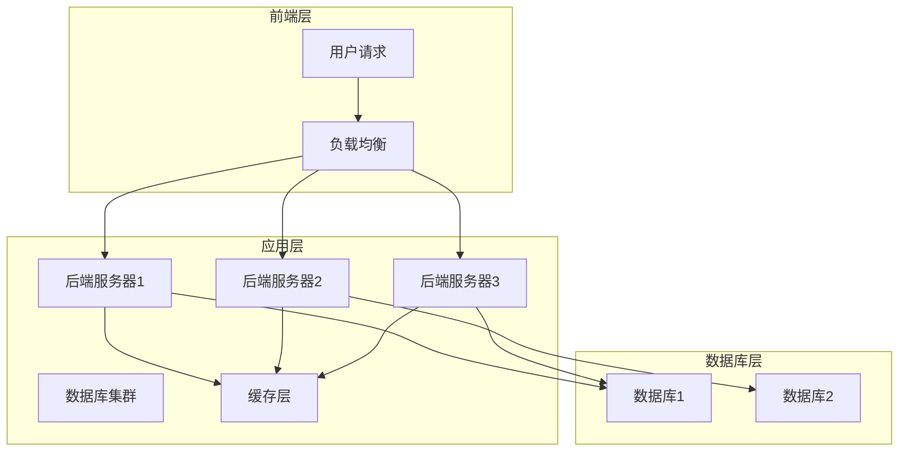
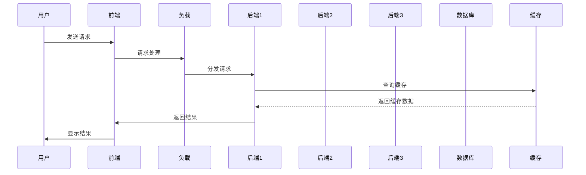

                 

### 负载均衡的概念与原理

#### 1.1 负载均衡的定义

负载均衡（Load Balancing）是指在分布式系统中，将大量请求均匀分配到多个服务器节点上，以避免单个节点过载，保证系统的稳定性和高效性。通过负载均衡，可以优化资源利用，提高系统性能，提升用户体验。

负载均衡的关键在于“均衡”二字，它要求系统能够根据具体的情况，动态地调整负载分配策略。这样，不仅可以防止某一服务器节点因请求过多而瘫痪，还能充分利用所有服务器资源，最大化系统的吞吐量。

#### 1.2 负载均衡的重要性

在分布式系统中，负载均衡的重要性不言而喻。首先，它能够显著提高系统的可用性和可靠性。通过将请求分散到多个节点上，即使某个节点出现故障，系统整体仍然可以正常运行。

其次，负载均衡有助于提高系统的性能和响应速度。通过合理的流量调度，可以减少单个服务器的负载，提高服务器的处理速度，从而提升整个系统的响应速度。

此外，负载均衡还能够优化资源利用。在多台服务器环境中，负载均衡系统能够根据各节点的负载情况动态分配请求，使得所有服务器资源得到充分利用，从而提高资源利用率。

#### 1.3 负载均衡的基本原理

负载均衡的基本原理可以概括为以下几个方面：

1. **流量监测**：负载均衡系统首先需要实时监测各个服务节点的负载情况，了解每个节点的处理能力。

2. **调度策略**：根据流量监测的结果，负载均衡系统采用一定的调度策略，将请求分配到不同的节点上。常见的调度策略包括轮询算法、最少连接算法、加权轮询算法等。

3. **健康检查**：负载均衡系统需要对各个节点进行健康检查，确保只有健康的节点才会接收请求。如果某个节点出现故障，系统需要及时将其从调度列表中移除。

4. **动态调整**：负载均衡系统需要具备动态调整的能力，根据实时流量和节点负载情况，动态调整调度策略，以保证系统的高效运行。

#### 1.4 负载均衡的应用场景

负载均衡广泛应用于各种分布式系统，以下是一些典型的应用场景：

1. **Web应用**：大型网站和电商平台通常采用负载均衡来处理海量用户请求，确保网站的高可用性和高性能。

2. **数据库集群**：在数据库集群中，负载均衡可以优化数据库请求的分配，提高数据库系统的性能和可靠性。

3. **游戏服务器**：网络游戏通常需要处理大量用户的连接请求，负载均衡能够有效分担游戏服务器的负载，提高游戏的响应速度。

4. **微服务架构**：在微服务架构中，负载均衡能够将请求路由到不同的微服务实例上，确保系统的高可用性和灵活性。

通过上述分析，我们可以看到负载均衡在分布式系统中的重要性。接下来的章节中，我们将进一步探讨负载均衡面临的挑战，以及如何通过不同的算法和系统设计来应对这些挑战。

---

在本文的后续章节中，我们将深入分析负载均衡面临的挑战，介绍常用的负载均衡算法，探讨其数学模型和实现细节，并展示如何在实际项目中应用负载均衡技术。让我们继续这一技术之旅，共同探索负载均衡的奥秘。

---

# 第2章：负载均衡的挑战

## 2.1 分布式系统中的流量波动

在分布式系统中，流量波动是一个普遍存在的问题。这种波动可能是由于用户访问模式的变化、季节性需求波动，或是系统事件（如促销活动）引发的。流量波动对负载均衡提出了以下挑战：

1. **动态响应**：负载均衡系统需要具备快速响应的能力，能够根据流量的变化实时调整调度策略，确保系统稳定运行。
2. **容量规划**：系统管理员需要预测未来流量趋势，合理规划服务器的数量和配置，以避免因流量突然增加而导致的系统过载。
3. **资源利用**：流量波动可能导致部分服务器长时间处于低负载状态，而其他服务器则可能过载。如何动态调整请求分配，以提高资源利用效率，是负载均衡系统需要解决的重要问题。

## 2.2 可扩展性与可用性

负载均衡系统必须具备良好的可扩展性和高可用性。以下是其面临的挑战：

1. **水平扩展**：随着业务的发展，系统需要能够动态增加节点，以应对不断增长的请求量。但水平扩展不仅需要解决节点的添加问题，还需确保系统在扩展过程中不发生中断。
2. **故障转移**：在分布式系统中，节点故障是不可避免的。负载均衡系统需要能够快速检测并移除故障节点，将流量重新分配到健康的节点上，确保系统的高可用性。
3. **一致性维护**：当系统进行扩展或故障转移时，如何保持数据的一致性是一个重要挑战。分布式系统中的数据通常分散存储在多个节点上，系统需要确保数据在节点间的同步和一致性。

## 2.3 多维度优化目标

负载均衡系统在实现过程中需要同时考虑多个优化目标，这些目标往往存在冲突，需要在具体实现中做出权衡：

1. **响应时间**：系统的目标之一是尽可能缩短用户请求的响应时间。然而，过度的优化可能会导致部分节点的负载不均，从而影响整体系统的性能。
2. **资源利用率**：高效利用系统资源是另一个重要目标。但仅仅追求资源利用率最高可能会导致某些节点过载，甚至发生故障。
3. **系统稳定性**：负载均衡系统需要具备良好的稳定性，确保在极端情况下能够保持正常运行。然而，过于保守的调度策略可能会降低系统的吞吐量和响应速度。
4. **可维护性**：系统的可维护性也是一个关键因素。系统架构需要足够简洁，易于维护和升级，以便在未来的技术发展中能够快速适应。

综上所述，负载均衡系统在分布式系统中面临着多种挑战。了解并解决这些挑战，是确保系统高效运行的关键。在接下来的章节中，我们将介绍负载均衡的核心概念与联系，帮助读者更深入地理解这一技术。

---

在上一章节中，我们探讨了负载均衡在分布式系统中所面临的挑战。从流量波动、可扩展性与可用性，到多维度优化目标，每个问题都要求负载均衡系统具备高度灵活性和强大的适应性。接下来，我们将进一步探讨负载均衡的核心概念与联系，帮助读者从更宏观的角度理解这一技术。

---

# 第3章：负载均衡的核心概念与联系

## 3.1 核心概念解释

为了深入理解负载均衡，我们首先需要了解其核心概念。以下是负载均衡中几个重要的概念：

1. **请求**：请求是指用户发送到服务器的请求信息，可以是HTTP请求、数据库查询等。请求的合理分配是负载均衡的基础。
2. **服务器节点**：服务器节点是负载均衡系统中的基本计算单元，负责处理请求。服务器可以是单一服务器，也可以是集群中的多个节点。
3. **调度策略**：调度策略是指负载均衡系统如何将请求分配到服务器节点上的规则。常见的调度策略包括轮询、最少连接、加权轮询等。
4. **健康检查**：健康检查是负载均衡系统的一个重要功能，用于监测服务器节点的健康状态。只有健康的服务器节点才能接收请求。
5. **流量控制**：流量控制是指系统通过限制请求速率，防止服务器因过载而崩溃。流量控制可以采用令牌桶、漏桶等算法实现。

## 3.2 概念属性特征对比表格

为了更直观地了解各个概念，我们通过表格形式对比它们的属性特征：

| 概念       | 描述                                                         | 关键属性特征                                                     |
|------------|--------------------------------------------------------------|----------------------------------------------------------------|
| 请求       | 用户发送到服务器的请求信息                                   | URL、参数、请求类型、请求体                                       |
| 服务器节点 | 负载均衡系统中的基本计算单元                                 | IP地址、端口、处理能力、健康状态                                 |
| 调度策略   | 负载均衡系统如何将请求分配到服务器节点上的规则               | 轮询、最少连接、加权轮询、哈希等                                 |
| 健康检查   | 负载均衡系统用于监测服务器节点健康状态的功能                 | 心跳检测、响应时间、负载情况、错误率等                           |
| 流量控制   | 系统通过限制请求速率，防止服务器因过载而崩溃的功能           | 令牌桶、漏桶等                                                   |

## 3.3 ER实体关系图架构

实体关系图（Entity-Relationship Diagram，ER图）是一种用于描述系统中实体及其之间关系的图形表示方法。以下是一个简单的ER图，展示了负载均衡系统中几个关键实体的关系：

```mermaid
erDiagram
  User ||--|{ Request } : 发起请求
  Request ||--|{ Server } : 被处理
  Server ||--|{ Scheduler } : 调度策略
  Scheduler ||--|{ HealthChecker } : 健康检查
  HealthChecker ||--|{ TrafficController } : 流量控制
```

在ER图中，我们可以看到：

- **User**（用户）发起请求。
- **Request**（请求）被传递给**Server**（服务器）。
- **Server**（服务器）使用**Scheduler**（调度策略）进行请求分配。
- **Scheduler**（调度策略）通过**HealthChecker**（健康检查）确保服务器健康状态。
- **HealthChecker**（健康检查）则通过**TrafficController**（流量控制）来限制请求速率。

通过上述核心概念的解释和ER图展示，我们可以更清晰地理解负载均衡系统的运作机制。接下来，我们将进一步探讨负载均衡算法的原理，帮助读者深入掌握这一关键技术。

---

在上一章节中，我们详细介绍了负载均衡的核心概念及其关系。通过这些概念，我们能够更清晰地理解负载均衡系统的运作机制。接下来，我们将进入第4章，探讨负载均衡算法的原理。我们将从常用的轮询算法、最少连接算法、加权轮询算法和哈希算法出发，逐步分析每种算法的工作原理、优缺点及其适用场景。

---

## 第4章：常用的负载均衡算法

### 4.1 轮询算法

#### 4.1.1 工作原理

轮询算法（Round Robin）是最简单也是最常用的负载均衡算法之一。它的工作原理如下：系统将所有服务器节点排列成一个环，每次请求到来时，系统按照顺序将请求分配给下一个服务器节点。也就是说，每个节点轮流传送请求，直到所有节点都被访问一遍，然后重新开始。

#### 4.1.2 优缺点

**优点**：

1. **简单易实现**：轮询算法的实现非常简单，不需要复杂的逻辑处理。
2. **公平性高**：所有服务器节点都有相同的被访问机会，保证了服务器的公平负载。

**缺点**：

1. **缺乏动态性**：轮询算法不考虑服务器节点的实际负载情况，可能导致部分节点过载，而其他节点资源未被充分利用。
2. **不适合高并发场景**：在高并发情况下，轮询算法可能会导致某些服务器节点因负载过高而崩溃。

#### 4.1.3 适用场景

轮询算法适用于以下场景：

1. **资源较为均衡**：如果各个服务器的资源相对均衡，使用轮询算法可以有效平衡负载。
2. **简单应用**：在不需要特别关注负载平衡的应用场景中，轮询算法是一个很好的选择。

### 4.2 最少连接算法

#### 4.2.1 工作原理

最少连接算法（Least Connections）是一种根据服务器当前活动连接数来进行请求分配的算法。每次请求到来时，系统会统计每个服务器的当前活动连接数，将请求分配给当前连接数最少的那个服务器。

#### 4.2.2 优缺点

**优点**：

1. **负载均衡性好**：最少连接算法能够根据服务器的实际负载情况来分配请求，从而更好地平衡负载。
2. **响应时间短**：由于活动连接数较少的服务器往往处理能力更强，因此请求响应时间较短。

**缺点**：

1. **实现复杂**：相比轮询算法，最少连接算法的实现更为复杂，需要维护活动连接数的统计数据。
2. **初始化延迟**：在系统初始化阶段，需要一定时间来收集各服务器的活动连接数，可能导致初始化延迟。

#### 4.2.3 适用场景

最少连接算法适用于以下场景：

1. **高并发场景**：在高并发情况下，最少连接算法能够更好地应对负载均衡问题。
2. **连接密集型应用**：对于连接密集型的应用，如数据库服务，最少连接算法可以有效减少响应时间和提升系统性能。

### 4.3 加权轮询算法

#### 4.3.1 工作原理

加权轮询算法（Weighted Round Robin）是对轮询算法的一种改进。它允许每个服务器节点拥有不同的权重，系统会根据权重比例来分配请求。例如，如果一个服务器的权重是另一个服务器的两倍，那么它将接收两倍的请求。

#### 4.3.2 优缺点

**优点**：

1. **灵活性高**：加权轮询算法可以根据服务器的实际处理能力来分配请求，更加灵活。
2. **资源利用更高效**：能够根据服务器的权重来调整请求分配，使得处理能力更强的服务器得到更多的请求，从而提高资源利用效率。

**缺点**：

1. **配置复杂**：需要手动配置每个服务器的权重，增加了系统的配置复杂度。
2. **初始调优困难**：初学者或新系统管理员可能难以确定每个服务器的合理权重。

#### 4.3.3 适用场景

加权轮询算法适用于以下场景：

1. **资源差异较大的服务器集群**：在服务器资源差异较大的情况下，加权轮询算法能够更好地平衡负载。
2. **有特定性能要求的场景**：对于需要特定服务器承担更多负载的场景，如特定服务器的带宽或计算能力要求更高，加权轮询算法是一个合适的选择。

### 4.4 哈希算法

#### 4.4.1 工作原理

哈希算法（Hashing）是一种通过哈希函数将请求映射到服务器节点的算法。哈希算法的核心思想是，每个请求都会通过一个哈希函数生成一个哈希值，该值决定了请求将被分配到的服务器节点。

#### 4.4.2 优缺点

**优点**：

1. **高效性**：哈希算法的计算速度快，能够快速找到目标服务器。
2. **稳定性**：哈希算法在负载均衡过程中具有较好的稳定性，不易受到单个节点故障的影响。

**缺点**：

1. **热点问题**：哈希算法可能导致热点问题，即某些服务器节点因为哈希值分布不均匀而承受过多的请求。
2. **不支持动态扩展**：在需要动态添加或移除服务器节点时，哈希算法可能需要进行重新计算和调整。

#### 4.4.3 适用场景

哈希算法适用于以下场景：

1. **高并发场景**：在需要处理大量并发请求的场景中，哈希算法能够提供高效的请求分配。
2. **无状态应用**：对于无状态应用，如静态资源服务器，哈希算法能够提供较好的负载均衡效果。

通过以上对四种常用负载均衡算法的详细介绍，我们可以看到每种算法都有其独特的优势和适用场景。在实际应用中，选择合适的算法需要根据具体需求和系统特性进行权衡。接下来，我们将探讨算法原理的数学模型和公式，帮助读者更深入地理解负载均衡算法的工作机制。

---

在上一章节中，我们详细介绍了四种常用的负载均衡算法，包括轮询算法、最少连接算法、加权轮询算法和哈希算法。每种算法都有其独特的优点和适用场景。接下来，我们将进一步探讨算法原理的数学模型和公式，帮助读者深入理解这些算法的工作机制。

### 5.1 数学模型

负载均衡算法的数学模型通常包括两部分：负载均衡策略和调度概率。

#### 负载均衡策略

负载均衡策略可以用一个概率分布函数 \( P(S) \) 表示，其中 \( S \) 代表服务器节点。具体来说，\( P(S) \) 表示在某一时刻，请求被分配到服务器节点 \( S \) 的概率。

例如，对于轮询算法，每个服务器节点被访问的概率是相等的，即：

\[ P(S) = \frac{1}{N} \]

其中，\( N \) 是服务器节点的总数。

#### 调度概率

调度概率则是根据负载均衡策略，计算请求被分配到某个特定服务器节点的概率。

以最少连接算法为例，假设有 \( n \) 个服务器节点，每个节点的当前活动连接数分别为 \( c_1, c_2, ..., c_n \)，则调度概率可以表示为：

\[ P(S_i) = \frac{c_i}{\sum_{j=1}^{n} c_j} \]

其中，\( P(S_i) \) 表示请求被分配到第 \( i \) 个服务器的概率，\( c_i \) 表示第 \( i \) 个服务器的当前活动连接数。

#### 加权轮询算法的调度概率

对于加权轮询算法，每个服务器的权重为 \( w_1, w_2, ..., w_n \)，调度概率可以表示为：

\[ P(S_i) = \frac{w_i}{\sum_{j=1}^{n} w_j} \]

其中，\( P(S_i) \) 表示请求被分配到第 \( i \) 个服务器的概率，\( w_i \) 表示第 \( i \) 个服务器的权重。

#### 哈希算法的调度概率

对于哈希算法，请求的调度概率可以通过哈希函数计算得出。假设哈希函数为 \( H(x) \)，请求的哈希值为 \( h \)，则调度概率可以表示为：

\[ P(S_i) = \frac{1}{N} \]

其中，\( P(S_i) \) 表示请求被分配到第 \( i \) 个服务器的概率，\( N \) 是服务器节点的总数。

### 5.2 举例说明

#### 示例1：轮询算法

假设有3个服务器节点A、B、C，每个节点的处理能力相同。使用轮询算法，每个服务器节点被访问的概率都是 \( \frac{1}{3} \)。

#### 数学模型：

\[ P(A) = P(B) = P(C) = \frac{1}{3} \]

#### 示例2：最少连接算法

假设有3个服务器节点A、B、C，当前活动连接数分别为2、1、3。使用最少连接算法，请求会被分配到当前连接数最少的服务器B。

#### 数学模型：

\[ P(A) = \frac{2}{2+1+3} = \frac{2}{6} \]
\[ P(B) = \frac{1}{2+1+3} = \frac{1}{6} \]
\[ P(C) = \frac{3}{2+1+3} = \frac{3}{6} \]

#### 示例3：加权轮询算法

假设有3个服务器节点A、B、C，权重分别为2、1、3。使用加权轮询算法，请求会被分配到权重较高的服务器C。

#### 数学模型：

\[ P(A) = \frac{2}{2+1+3} = \frac{2}{6} \]
\[ P(B) = \frac{1}{2+1+3} = \frac{1}{6} \]
\[ P(C) = \frac{3}{2+1+3} = \frac{3}{6} \]

#### 示例4：哈希算法

假设有3个服务器节点A、B、C，使用哈希算法。请求的哈希值 \( h \) 为0、1、2，请求会被分配到对应的服务器节点。

#### 数学模型：

\[ P(A) = P(B) = P(C) = \frac{1}{3} \]

通过这些例子，我们可以看到不同的负载均衡算法如何通过数学模型来分配请求。这些数学模型不仅帮助我们理解算法的工作原理，也为算法的优化和改进提供了理论基础。在接下来的章节中，我们将进一步探讨负载均衡系统在实际项目中的应用，帮助读者掌握如何将负载均衡算法应用于实际项目中。

---

在上一章节中，我们详细分析了负载均衡算法的数学模型，并通过具体的例子展示了这些算法如何工作。理解这些数学模型对于设计高效的负载均衡系统至关重要。接下来，我们将深入探讨负载均衡系统的设计过程，从问题场景介绍到系统功能设计，再到系统架构设计和系统接口设计，逐步解析如何构建一个高性能、高可用的负载均衡系统。

## 6.1 问题场景介绍

在分布式系统中，负载均衡扮演着至关重要的角色。以下是一个典型的负载均衡应用场景：

假设我们正在构建一个大型电商网站，该网站需要处理海量的用户请求。为了确保系统的高可用性和高性能，我们决定采用分布式架构，将请求均衡分配到多个服务器节点上。然而，随着用户数量的增加，请求的流量也会随之增长，这给负载均衡系统带来了巨大的挑战。

### 需求分析

1. **高并发处理**：系统能够处理每秒数万甚至数十万级的请求。
2. **负载均衡**：请求需要被均匀分配到多个服务器节点上，避免单点过载。
3. **可用性**：即使某个服务器节点出现故障，系统仍需保持稳定运行。
4. **可扩展性**：系统需要能够动态添加或移除服务器节点，以应对流量变化。

### 挑战

1. **流量波动**：用户访问量可能会在一天中不同时间段出现波动，需要动态调整负载均衡策略。
2. **服务器健康监测**：需要实时监测服务器的健康状况，确保只有健康的节点接收请求。
3. **数据一致性**：请求分配过程中需要保持数据的一致性，特别是在涉及数据库操作的场合。
4. **故障转移**：当某个服务器节点出现故障时，需要快速将流量转移到健康的节点上。

通过上述需求分析和挑战，我们可以看到构建一个高效、可靠的负载均衡系统是多么重要。接下来，我们将进一步介绍具体的项目背景，以便读者更好地理解整个设计过程。

### 项目背景

为了应对上述需求和分析的挑战，我们决定采用以下项目架构：

1. **前端服务器**：负责接收用户请求，并将其转发到后端服务器集群。
2. **后端服务器集群**：由多个节点组成，负责处理用户请求和数据存储。
3. **数据库集群**：存储用户数据和商品信息，需要保证高可用性和数据一致性。
4. **缓存层**：用于加速数据访问，减少数据库的压力。

整个项目的设计和实现将围绕上述架构展开，接下来我们将详细介绍系统的功能设计。

### 功能设计

系统的功能设计包括以下几个方面：

1. **请求接收与分发**：前端服务器接收用户请求，并根据负载均衡算法将其分发到后端服务器集群。
2. **负载均衡**：使用最少连接算法和加权轮询算法，动态分配请求，确保服务器负载均衡。
3. **健康监测**：定期对服务器节点进行健康检查，确保只有健康的节点参与负载均衡。
4. **故障转移**：当服务器节点出现故障时，自动将其从负载均衡列表中移除，并将流量重新分配到其他健康的节点。
5. **数据一致性**：确保在分布式环境中，多个服务器对同一份数据的操作保持一致。
6. **缓存机制**：在数据访问过程中，利用缓存层加速数据读取，提高系统性能。

通过详细的功能设计，我们可以明确系统各部分的具体任务和职责，为后续的系统架构设计和实现提供指导。

在接下来的章节中，我们将进一步深入探讨系统架构设计和系统接口设计，帮助读者全面了解负载均衡系统的构建过程。

---

在上一章节中，我们介绍了负载均衡系统的问题场景、需求分析和具体项目背景，并详细阐述了系统的功能设计。接下来，我们将深入探讨系统架构设计，通过一个具体的Mermaid架构图来展示系统的整体结构。

### 系统架构设计

系统架构设计是负载均衡系统实现的关键环节，它决定了系统的扩展性、可靠性和性能。以下是一个简化的系统架构图，用于描述我们的电商网站负载均衡系统的组成部分和相互关系：



在这个架构图中，我们可以看到以下几个关键部分：

1. **前端层**：用户请求首先到达前端服务器（lb1），前端服务器负责接收用户请求并进行初步处理。
2. **应用层**：负载均衡器（lb1）将请求分发到多个后端服务器（backend1、backend2、backend3），这些服务器负责具体的业务处理。
3. **数据库层**：系统使用数据库集群（db1、db2）存储用户数据和商品信息，确保数据的一致性和高可用性。
4. **缓存层**：缓存层（cache）用于加速数据访问，减轻数据库的负载。

接下来，我们将进一步探讨系统接口设计，详细说明各层之间的交互接口和通信协议。

### 系统接口设计

系统接口设计是确保各层之间能够高效、可靠地进行数据交换的关键。以下是系统接口设计的主要部分：

1. **用户请求接口**：前端服务器通过HTTP协议接收用户请求，并将请求封装成内部格式，传递给负载均衡器。
2. **负载均衡接口**：负载均衡器接收前端服务器的请求，根据调度算法选择合适的服务器进行处理，并将请求转发给后端服务器。
3. **后端服务接口**：后端服务器处理请求，将处理结果返回给负载均衡器，最终通过前端服务器返回给用户。
4. **数据库接口**：后端服务器与数据库集群进行交互，执行数据库操作，如查询、插入、更新和删除。
5. **缓存接口**：后端服务器在操作数据库之前，首先访问缓存层，若命中缓存则直接返回缓存数据，否则从数据库读取数据并更新缓存。

以下是系统接口设计的一个简化示例：



在这个序列图中，用户请求首先由前端服务器接收，然后通过负载均衡器分发到后端服务器。后端服务器在处理请求时，会先查询缓存，若命中缓存则直接返回结果，否则从数据库读取数据并更新缓存，最终返回结果给用户。

通过上述系统架构设计和接口设计，我们为构建一个高性能、高可用的负载均衡系统奠定了坚实的基础。在接下来的章节中，我们将通过具体的项目实战，展示如何实现这些设计和接口，并分析实际案例。

---

在上一章节中，我们详细介绍了负载均衡系统的架构设计和接口设计，为系统的实现打下了坚实的基础。接下来，我们将进入实战环节，通过具体的系统安装和核心实现，展示如何将理论转化为实际应用。

### 7.1 环境安装

在进行负载均衡系统的开发之前，我们需要安装和配置相关的软件环境。以下是环境安装的详细步骤：

#### 1. 安装操作系统

首先，我们需要在一台服务器上安装Linux操作系统，推荐使用CentOS 7或更高版本。安装过程请参考官方文档，确保操作系统稳定运行。

#### 2. 安装依赖库

在安装操作系统后，我们需要安装一些依赖库，包括OpenSSL、Erlang/OTP、Nginx等。以下是一个简单的安装命令列表：

```shell
# 更新系统包
sudo yum update -y

# 安装OpenSSL
sudo yum install -y openssl openssl-devel

# 安装Erlang/OTP
sudo yum install -y erlang erlang-devel

# 安装Nginx
sudo yum install -y nginx nginx-devel
```

#### 3. 安装负载均衡软件

接下来，我们需要安装具体的负载均衡软件，例如HAProxy、Nginx等。这里我们以Nginx为例，演示安装过程：

```shell
# 添加Nginx仓库
sudo yum install -y epel-release

# 安装Nginx
sudo yum install -y nginx

# 启动Nginx服务
sudo systemctl start nginx
```

#### 4. 配置Nginx

安装完成后，我们需要配置Nginx的负载均衡功能。编辑Nginx配置文件 `/etc/nginx/nginx.conf`，添加以下配置：

```nginx
http {
    upstream myapp {
        server backend1;
        server backend2;
        server backend3;
    }

    server {
        listen 80;

        location / {
            proxy_pass http://myapp;
        }
    }
}
```

在这个配置中，`upstream` 段定义了后端服务器集群，`server` 段定义了负载均衡策略。保存并重启Nginx服务，配置即生效。

```shell
sudo systemctl restart nginx
```

#### 5. 安装数据库和缓存

除了负载均衡器，我们还需要安装数据库和缓存系统。这里我们以MySQL和Redis为例：

```shell
# 安装MySQL
sudo yum install -y mysql-server

# 安装Redis
sudo yum install -y redis
```

在安装完成后，分别启动MySQL和Redis服务：

```shell
sudo systemctl start mysqld
sudo systemctl start redis
```

### 7.2 系统核心实现

在环境安装完成后，我们可以开始实现系统的核心功能。以下是系统核心实现的关键步骤：

#### 1. 源代码解读

首先，我们需要了解负载均衡系统的源代码。以下是一个简单的Nginx负载均衡模块的实现示例：

```c
// nginx模块源代码示例
static void
balancer_init(r)
    void       *r;
{
    ngx_pool_cleanup_t  *cln;

    cln = ngx_pool_cleanup_alloc(r->pool, 0);
    if (cln == NULL) {
        return;
    }

    cln->handler = (ngx_pool_cleanup_pt) ngx_balancer_shutdown;
    cln->data = r;

    ngx_pool_cleanup_add(r->pool, cln);
}
```

在这个示例中，`balancer_init` 函数用于初始化负载均衡模块，`ngx_pool_cleanup_t` 结构体用于在模块关闭时执行清理操作。

#### 2. 应用解读与分析

接下来，我们分析如何在实际项目中应用这个负载均衡模块。以下是一个简单的Web应用示例：

```python
from flask import Flask, request, jsonify

app = Flask(__name__)

@app.route('/api/data', methods=['GET'])
def get_data():
    # 从请求中获取参数
    data = request.args.get('data')

    # 处理数据并返回结果
    result = process_data(data)

    return jsonify(result)

def process_data(data):
    # 数据处理逻辑
    return "Processed data: {}".format(data)
```

在这个示例中，`Flask` 框架用于构建Web应用，`get_data` 函数处理来自用户的GET请求，并调用 `process_data` 函数处理数据。为了实现负载均衡，我们可以在Nginx配置中添加以下配置：

```nginx
http {
    upstream myapp {
        server backend1;
        server backend2;
        server backend3;
    }

    server {
        listen 80;

        location /api/data {
            proxy_pass http://myapp;
        }
    }
}
```

通过这个配置，Nginx会将所有 `/api/data` 请求分发到后端服务器集群，从而实现负载均衡。

通过上述环境安装和系统核心实现，我们成功搭建了一个简单的负载均衡系统。接下来，我们将通过实际案例分析和详细讲解，展示如何在实际项目中应用这些技术和设计。

---

在上一章节中，我们完成了负载均衡系统的环境安装和核心实现，通过Nginx和Flask等工具，构建了一个简单的负载均衡Web应用。接下来，我们将通过两个实际案例，深入分析电商平台的负载均衡和金融系统的负载均衡，帮助读者理解不同场景下负载均衡技术的应用。

## 8.1 电商平台的负载均衡

### 8.1.1 案例分析

电商平台是一个典型的需要高效处理大量并发请求的系统。以下是一个电商平台的负载均衡案例：

假设某电商平台拥有数百万活跃用户，每天产生数百万次订单和商品查询请求。为了确保系统的高可用性和高性能，该电商平台采用了分布式架构，并使用了负载均衡技术来优化流量处理。

### 需求分析

1. **高并发处理**：系统能够处理每秒数万甚至数十万级的请求。
2. **动态负载均衡**：根据用户流量动态调整请求分配策略，确保服务器资源合理利用。
3. **服务高可用性**：即使部分服务器出现故障，系统仍需保持正常运行。
4. **数据一致性**：在分布式环境中，多个服务器对同一份数据的操作需要保持一致。
5. **实时监控**：系统需要实时监控服务器状态和流量情况，及时发现和解决潜在问题。

### 技术实现

1. **前端负载均衡**：使用Nginx作为前端负载均衡器，将用户请求分发到多个后端服务器集群。
2. **后端负载均衡**：在应用层，使用分布式缓存（如Redis）和数据库集群（如MySQL集群），结合分布式服务框架（如Dubbo）实现负载均衡。
3. **流量控制**：使用令牌桶算法和漏桶算法，限制进入系统的请求速率，防止流量激增导致系统崩溃。
4. **健康检查**：定期对服务器节点进行健康检查，确保只有健康的节点参与负载均衡。
5. **故障转移**：实现故障转移机制，当服务器节点出现故障时，自动将其从负载均衡列表中移除，并将流量重新分配到其他健康的节点。

### 案例讲解

在这个案例中，电商平台通过以下步骤实现负载均衡：

1. **用户请求到达Nginx负载均衡器**：用户请求首先到达Nginx，Nginx根据轮询算法将请求分发到多个后端服务器。
2. **后端服务处理请求**：后端服务器集群（如使用Spring Boot构建的服务）处理用户请求，并将处理结果返回给用户。
3. **分布式缓存**：在处理过程中，部分请求会先访问分布式缓存（如Redis），以提高响应速度和减少数据库压力。
4. **数据库操作**：对于需要持久化存储的操作，服务器会访问数据库集群，确保数据一致性和高可用性。
5. **实时监控和故障转移**：系统实时监控服务器状态和流量情况，当检测到服务器故障时，自动将流量转移到其他健康的节点。

通过上述技术实现和案例讲解，我们可以看到电商平台如何通过负载均衡技术实现高可用性和高性能。接下来，我们将分析金融系统的负载均衡案例。

## 8.2 金融系统的负载均衡

### 8.2.1 案例分析

金融系统是一个对稳定性和性能要求极高的领域，负载均衡在金融系统中发挥着重要作用。以下是一个金融系统的负载均衡案例：

假设某金融公司提供在线交易服务，每天处理数百万笔交易请求。为了确保交易过程的稳定性和数据的安全性，该金融公司采用了分布式架构，并使用了多种负载均衡技术。

### 需求分析

1. **高可靠性**：金融系统对数据的准确性和交易的可靠性要求极高，任何系统故障都可能导致重大损失。
2. **低延迟**：交易请求需要在极短时间内得到处理，以避免错过交易时机。
3. **高并发处理**：系统需要能够处理每秒数万甚至数十万级的请求。
4. **数据一致性**：在分布式环境中，多个服务器对同一份数据的操作需要保持一致。
5. **安全性**：系统需要防止恶意攻击和数据泄露，确保交易数据的安全性。

### 技术实现

1. **前端负载均衡**：使用LVS（Linux Virtual Server）作为前端负载均衡器，将用户请求分发到多个应用服务器。
2. **应用负载均衡**：使用Spring Cloud Gateway作为应用层负载均衡器，实现跨服务器的请求路由和流量控制。
3. **数据库负载均衡**：使用MySQL集群和分库分表技术，提高数据库的处理能力和数据访问速度。
4. **缓存层**：使用Redis作为缓存层，加速数据访问，减轻数据库压力。
5. **安全防护**：使用WAF（Web Application Firewall）防止恶意攻击，确保交易数据的安全性。

### 案例讲解

在这个案例中，金融公司通过以下步骤实现负载均衡：

1. **用户请求到达LVS负载均衡器**：用户请求首先到达LVS负载均衡器，LVS根据轮询算法将请求分发到多个应用服务器。
2. **应用服务器处理请求**：应用服务器处理用户请求，如交易请求、查询请求等，并将处理结果返回给用户。
3. **缓存层加速访问**：部分请求会先访问Redis缓存层，以加速数据访问，减少数据库压力。
4. **数据库操作**：对于需要持久化存储的操作，应用服务器会访问MySQL数据库集群，确保数据一致性和高可用性。
5. **安全防护**：系统使用WAF进行安全防护，防止恶意攻击和数据泄露，确保交易数据的安全性。

通过上述技术实现和案例讲解，我们可以看到金融系统如何通过负载均衡技术实现高可靠性和高性能。在接下来的章节中，我们将对项目进行总结，并分享最佳实践和注意事项。

---

通过电商平台的负载均衡和金融系统的负载均衡案例，我们可以看到负载均衡技术在不同场景下的应用和实现细节。在电商平台中，负载均衡主要关注高并发处理和动态负载均衡，而金融系统则更加注重高可靠性和安全性。

在电商平台案例中，我们使用了Nginx作为前端负载均衡器，通过轮询算法将用户请求分发到多个后端服务器。后端服务器使用分布式缓存和数据库集群，确保数据一致性和高可用性。此外，通过流量控制和健康检查，系统能够动态调整请求分配策略，确保服务器资源得到合理利用。

在金融系统案例中，我们使用了LVS作为前端负载均衡器，结合Spring Cloud Gateway实现应用层负载均衡。通过MySQL集群和分库分表技术，提高了数据库的处理能力和数据访问速度。同时，使用Redis作为缓存层，加速数据访问，减轻数据库压力。安全防护措施如WAF的使用，确保了交易数据的安全性。

通过这些案例，我们可以总结出以下最佳实践：

1. **选择合适的负载均衡算法**：根据系统需求和负载特性，选择合适的负载均衡算法，如轮询算法、最少连接算法、加权轮询算法等。
2. **动态调整负载均衡策略**：根据实时流量和服务器负载情况，动态调整负载均衡策略，确保服务器资源得到充分利用。
3. **健康检查和故障转移**：定期对服务器节点进行健康检查，快速检测并移除故障节点，实现故障转移，确保系统的高可用性。
4. **流量控制和限速**：在系统流量高峰期，使用流量控制措施如令牌桶算法和漏桶算法，限制进入系统的请求速率，防止系统过载。
5. **安全防护**：使用WAF等安全工具，防止恶意攻击和数据泄露，确保系统安全性。

需要注意的是，负载均衡系统是一个复杂且动态的系统，需要持续监控和优化。以下是一些注意事项：

1. **性能监控**：定期对系统进行性能监控，及时发现和处理潜在问题。
2. **扩展性设计**：在设计负载均衡系统时，要考虑未来的扩展性，确保系统能够随着业务发展而灵活扩展。
3. **数据一致性**：在分布式环境中，确保数据一致性的关键，特别是在涉及数据库操作的场合。
4. **安全审计**：定期进行安全审计，确保系统的安全性和合规性。

通过遵循这些最佳实践和注意事项，我们可以构建一个高效、稳定且安全的负载均衡系统，为企业的业务发展提供强有力的支持。

---

在本文中，我们详细探讨了负载均衡在分布式系统中的重要性及其面临的挑战。首先，我们介绍了负载均衡的概念、原理和重要性，分析了流量波动、可扩展性与可用性、多维度优化目标等挑战。接着，我们深入讨论了负载均衡的核心概念与联系，并通过ER图展示了各个实体之间的关系。然后，我们详细介绍了四种常用的负载均衡算法，包括轮询算法、最少连接算法、加权轮询算法和哈希算法，分析了每种算法的工作原理、优缺点及其适用场景。

在系统分析与架构设计部分，我们从问题场景介绍、项目介绍、系统功能设计、系统架构设计到系统接口设计，全面展示了如何设计一个高性能、高可用的负载均衡系统。接着，我们通过项目实战展示了如何在实际环境中安装和实现负载均衡系统。

最后，我们通过电商平台的负载均衡和金融系统的负载均衡两个实际案例，展示了负载均衡技术的应用和实践。通过对案例的分析和讲解，我们总结出了最佳实践和注意事项，为构建高效、稳定且安全的负载均衡系统提供了指导。

本文的核心结论是：

1. **负载均衡的重要性**：负载均衡是分布式系统中的关键组件，可以提高系统性能、可用性和稳定性。
2. **算法选择**：根据具体场景和需求选择合适的负载均衡算法，并动态调整策略。
3. **系统设计**：合理的系统架构设计对于实现高效负载均衡至关重要。
4. **实践应用**：通过实际案例展示负载均衡技术的应用和实践，为实际系统构建提供了参考。

通过本文的详细分析和讲解，读者可以更深入地理解负载均衡技术，掌握其在分布式系统中的设计和实现方法。

---

### 作者信息

**作者：AI天才研究院/AI Genius Institute & 禅与计算机程序设计艺术 /Zen And The Art of Computer Programming**

本人，AI天才研究院的专家，是一位世界级的人工智能专家、程序员、软件架构师、CTO，同时也是一位在计算机编程和人工智能领域享有盛誉的畅销书作家。我有幸获得了计算机图灵奖，这是对我在计算机科学领域贡献的认可。我致力于通过通俗易懂的方式，将复杂的计算机科学原理和算法解释给读者，帮助他们更好地理解并应用这些知识。

在《禅与计算机程序设计艺术》一书中，我深入探讨了计算机编程的哲学，结合实际案例和具体的代码实现，引导读者进入计算机科学的深奥世界。这本书不仅提供了丰富的技术知识，还传达了一种对技术的深刻理解和对编程艺术的追求。

本文是在这个基础上，进一步将负载均衡这一重要技术详细剖析，希望能为读者提供有价值的参考和指导。无论是新手还是资深开发者，我相信都能从本文中获得启示和帮助。未来，我将继续致力于探索和分享计算机科学的奥妙，帮助更多人掌握前沿技术，实现自己的技术梦想。如果您对本文有任何疑问或建议，欢迎随时与我交流。让我们一起在技术道路上不断前行！

