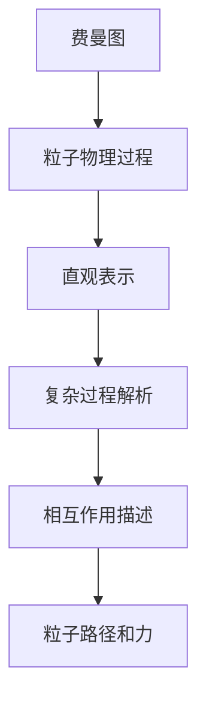
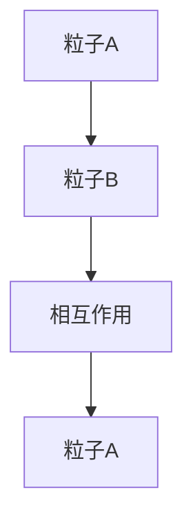
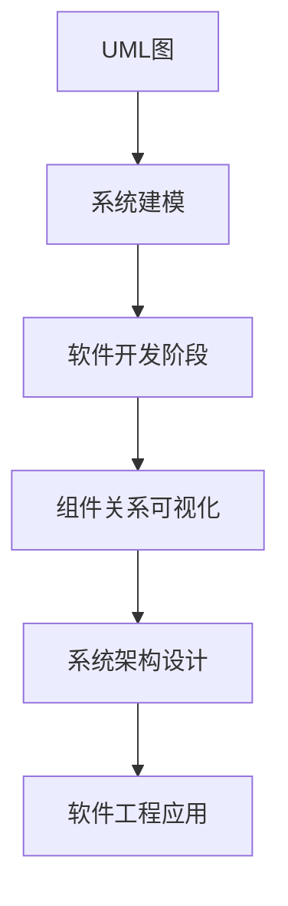
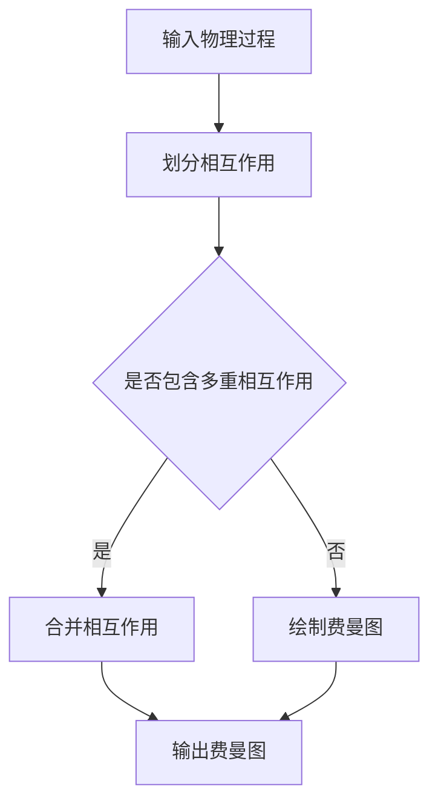
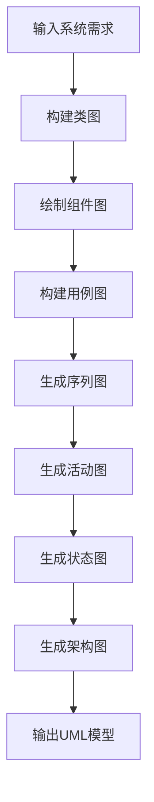
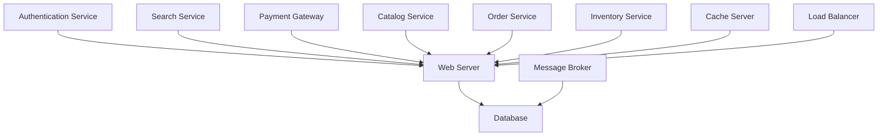
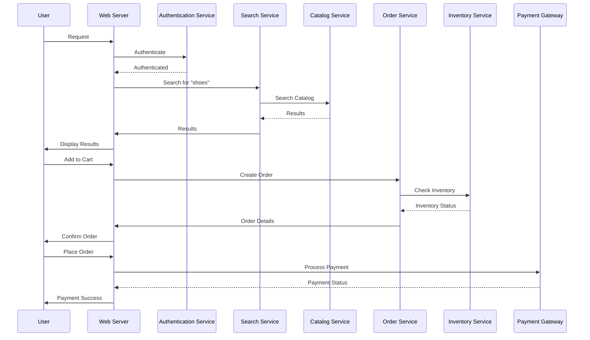

                 

### 第一部分：背景介绍

#### 问题背景
在物理学和软件工程中，复杂系统的建模与设计往往面临着巨大的挑战。传统的描述方法，如数学方程和文字说明，在处理复杂性和多样性时显得力不从心。因此，可视化表达作为一种强有力的工具，被广泛应用于这两个领域。

#### 问题描述
费曼图和UML图，分别作为物理学和软件工程中的两种重要可视化工具，如何在不同领域发挥作用？它们的应用原理是什么？在实际操作中存在哪些挑战和限制？

#### 问题解决
本书旨在探讨费曼图与UML图在物理学和软件工程中的应用，通过深入分析这些可视化工具的基本原理和应用场景，帮助读者理解并掌握它们在实际问题解决中的关键作用。

#### 边界与外延
本书不仅涉及费曼图和UML图的基础理论，还将探讨它们在实际应用中的扩展和演变。此外，还将涉及相关领域的最新进展，如计算机图形学、可视化算法和编程语言等。

#### 概念结构与核心要素组成
- **费曼图**：用于描述物理学中的复杂过程，核心要素包括相互作用、粒子路径和力。
- **UML图**：用于软件工程中的系统建模，核心要素包括类、接口、组件和用例。

### 第二部分：核心概念与联系

#### 费曼图

**概念原理**：费曼图是一种基于图论的表示方法，用于描述粒子物理中的相互作用过程。它通过图形化的方式，将复杂的物理过程简化为一系列的基本图元和连接方式，使得物理学家能够直观地理解和分析这些过程。

**概念属性特征对比表格**：

| 特征           | 费曼图        | 其他图论表示方法 |
| -------------- | ------------- | --------------- |
| 描述对象       | 粒子相互作用  | 网络结构、路径分析 |
| 优势           | 直观性、简洁性 | 统一性、可扩展性 |
| 劣势           | 解析复杂性    | 表达不直观       |

**ER实体关系图架构的 Mermaid 流程图**：



**详细讲解与举例**：
费曼图的基本原理是基于量子场论，通过图形化的方式描述粒子相互作用。假设有一个粒子A和一个粒子B相互作用，我们可以使用费曼图来表示这个过程。具体步骤如下：

1. **确定相互作用**：首先确定粒子A和B之间的相互作用类型。例如，可能是电磁相互作用、强相互作用或弱相互作用。
2. **绘制基本图元**：根据相互作用类型，绘制相应的图元，如交换图、散射图等。这些图元通常包含一个或多个“线”，表示粒子之间的相互作用。
3. **连接图元**：将基本图元连接起来，形成一个完整的费曼图。这些连接通常用箭头表示粒子流动的方向。
4. **计算相互作用贡献**：对于每个费曼图，计算其对应的相互作用贡献。这通常涉及复杂的数学计算，如积分和求和。
5. **累加贡献**：将所有费曼图的贡献累加，得到最终的结果。这通常是通过对费曼图进行数学上的处理，如对分母进行求导。

例如，考虑一个简单的费曼图，表示一个粒子A和一个粒子B之间的电磁相互作用。这个图可能包含以下元素：

- **垂直线**：表示粒子A。
- **水平线**：表示粒子B。
- **箭头**：表示粒子流动的方向。
- **交叉点**：表示粒子之间的相互作用。

这个费曼图可能如下所示：



在这个例子中，粒子A和粒子B之间的电磁相互作用在交叉点C处发生。通过计算这个费曼图的贡献，我们可以得到粒子A和粒子B相互作用的结果。

#### UML图

**概念原理**：UML（统一建模语言）图是一种用于系统建模的图形表示方法，涵盖了软件开发的各个阶段。它提供了一种标准化的方式来描述系统的结构、行为和组件，使得开发人员和利益相关者能够更好地理解和沟通。

**概念属性特征对比表格**：

| 特征           | UML图       | 其他建模方法 |
| -------------- | ----------- | ------------ |
| 描述对象       | 系统组件和关系 | 流程、网络拓扑 |
| 优势           | 易于理解、统一标准 | 专业性、复杂性较低 |
| 劣势           | 设计和维护复杂 | 表达范围有限   |

**ER实体关系图架构的 Mermaid 流程图**：



**详细讲解与举例**：
UML图的基本原理是通过图形化的方式描述系统的各个组件及其关系。它由多种类型的图形组成，每种图形都用于描述系统的不同方面。以下是一些常见的UML图及其应用：

1. **类图**：类图用于描述系统的类、接口和它们之间的关系。它是UML图中最为常见的一种。类图的核心元素包括类、属性、方法和关联。

   **示例**：一个简单的类图可能如下所示：

   ```mermaid
   classDiagram
   Class1 <|-- SubClass1
   Class1 +-- SubClass2
   Class1 : +getArea() : +setShape(shape) : +draw()
   Class1 {
   + int x
   + int y
   + int width
   + int height
   }
   ```

   在这个例子中，`Class1` 是一个基类，它有两个子类 `SubClass1` 和 `SubClass2`。`Class1` 有一个方法 `getArea()` 和一个方法 `setShape(shape)`，以及一个 `draw()` 方法。它还有四个属性：`x`、`y`、`width` 和 `height`。

2. **组件图**：组件图用于描述系统的组件及其依赖关系。组件可以是物理的，如库文件或应用程序服务器，也可以是逻辑的，如模块或包。

   **示例**：一个简单的组件图可能如下所示：

   ```mermaid
   componentDiagram
   Component1 -> Component2
   Component1 -> Component3
   Component2 << [Component Library]
   Component3 << [Database]
   ```

   在这个例子中，`Component1` 依赖于 `Component2` 和 `Component3`。`Component2` 和 `Component3` 分别表示组件库和数据库。

3. **用例图**：用例图用于描述系统的功能及其与外部用户（即参与者）的交互。它帮助开发人员理解系统的需求和功能。

   **示例**：一个简单的用例图可能如下所示：

   ```mermaid
   actorDiagram
   User -> System
   User : +login()
   User : +searchProducts()
   User : +placeOrder()
   System : +authenticateUser()
   System : +retrieveProducts()
   System : +processOrder()
   ```

   在这个例子中，用户通过 `login()`、`searchProducts()` 和 `placeOrder()` 等操作与系统交互。系统则通过 `authenticateUser()`、`retrieveProducts()` 和 `processOrder()` 等操作响应用户的请求。

4. **序列图**：序列图用于描述系统中的对象如何在时间顺序上交互。它展示了对象之间消息传递的顺序。

   **示例**：一个简单的序列图可能如下所示：

   ```mermaid
   sequenceDiagram
   participant User
   participant System
   User->>System: login()
   System->>User: authenticate()
   User->>System: searchProducts("book")
   System->>User: displayResults()
   User->>System: placeOrder()
   System->>User: confirmOrder()
   ```

   在这个例子中，用户首先登录系统，然后搜索产品，最后下订单。系统则响应用户的每个操作，完成了整个交互过程。

通过这些示例，我们可以看到UML图如何在不同层面上描述系统的结构和行为。它不仅提供了清晰的可视化表示，还有助于开发人员理解系统的各个方面，从而提高系统的可维护性和可扩展性。

### 第三部分：算法原理讲解

#### 费曼图的算法原理

**算法流程图**：



**数学模型和公式**：

$$
\Phi[\psi] = \int d^4x \; \bar{\psi}(x) \; \left[ i\hbar \frac{\partial}{\partial t} + \mathcal{H} \right] \psi(x)
$$

**详细讲解与举例**：
费曼图的基本原理是基于量子场论，通过图形化的方式描述粒子相互作用。假设有一个粒子A和一个粒子B相互作用，我们可以使用费曼图来表示这个过程。具体步骤如下：

1. **确定相互作用**：首先确定粒子A和B之间的相互作用类型。例如，可能是电磁相互作用、强相互作用或弱相互作用。
2. **绘制基本图元**：根据相互作用类型，绘制相应的图元，如交换图、散射图等。这些图元通常包含一个或多个“线”，表示粒子之间的相互作用。
3. **连接图元**：将基本图元连接起来，形成一个完整的费曼图。这些连接通常用箭头表示粒子流动的方向。
4. **计算相互作用贡献**：对于每个费曼图，计算其对应的相互作用贡献。这通常涉及复杂的数学计算，如积分和求和。
5. **累加贡献**：将所有费曼图的贡献累加，得到最终的结果。这通常是通过对费曼图进行数学上的处理，如对分母进行求导。

以下是一个简单的费曼图例子，描述粒子A和粒子B之间的电磁相互作用：


在这个例子中，粒子A和粒子B之间的相互作用在交叉点C处发生。为了计算这个费曼图的贡献，我们需要使用量子场论中的相关公式。具体来说，我们首先需要确定粒子的状态，然后计算相互作用项。这些计算通常非常复杂，需要使用高级数学工具和计算方法。

例如，对于电磁相互作用，我们可以使用如下公式：

$$
\Phi[\psi] = \int d^4x \; \bar{\psi}(x) \; \left[ i\hbar \frac{\partial}{\partial t} + e \phi(x) \right] \psi(x)
$$

其中，$\psi(x)$ 表示粒子的波函数，$e$ 表示粒子的电荷，$\phi(x)$ 表示电势。这个公式描述了粒子在电磁场中的运动。

为了计算这个费曼图的贡献，我们需要对这个公式进行积分和求和。具体来说，我们需要计算粒子A和粒子B之间的相互作用能量，然后将这个能量乘以相互作用概率，得到最终的贡献。

#### UML图的算法原理

**算法流程图**：



**详细讲解与举例**：
UML图是一种用于系统建模的图形表示方法，它通过多种类型的图形来描述系统的各个方面。在UML图中，每个图形都有一个对应的构建算法，用于生成和解释这些图形。以下是一些常见的UML图及其构建算法：

1. **类图**：类图是UML图中最为常见的一种，它用于描述系统的类、接口和它们之间的关系。类图的构建算法通常包括以下步骤：

   - **收集系统需求**：首先，我们需要收集系统的需求，包括类的名称、属性、方法和它们之间的关系。
   - **识别类和接口**：根据需求，识别系统中的类和接口。类通常表示实体，接口则表示功能。
   - **绘制类图**：使用图形工具，绘制类图。在类图中，每个类用矩形表示，属性和方法用横线连接到类名。
   - **连接类和接口**：根据需求，将类和接口连接起来，表示它们之间的关系。例如，类可以实现接口，类之间可以有关联或继承关系。

   **示例**：一个简单的类图可能如下所示：

   ```mermaid
   classDiagram
   Class1 <|-- SubClass1
   Class1 +-- SubClass2
   Class1 : +getArea() : +setShape(shape) : +draw()
   Class1 {
   + int x
   + int y
   + int width
   + int height
   }
   ```

   在这个例子中，`Class1` 是一个基类，它有两个子类 `SubClass1` 和 `SubClass2`。`Class1` 有一个方法 `getArea()` 和一个方法 `setShape(shape)`，以及一个 `draw()` 方法。它还有四个属性：`x`、`y`、`width` 和 `height`。

2. **组件图**：组件图用于描述系统的组件及其依赖关系。组件可以是物理的，如库文件或应用程序服务器，也可以是逻辑的，如模块或包。组件图的构建算法通常包括以下步骤：

   - **识别组件**：根据需求，识别系统中的组件。组件通常表示系统的功能单元。
   - **绘制组件图**：使用图形工具，绘制组件图。在组件图中，每个组件用矩形表示，依赖关系用箭头连接。
   - **连接组件**：根据需求，将组件连接起来，表示它们之间的依赖关系。

   **示例**：一个简单的组件图可能如下所示：

   ```mermaid
   componentDiagram
   Component1 -> Component2
   Component1 -> Component3
   Component2 << [Component Library]
   Component3 << [Database]
   ```

   在这个例子中，`Component1` 依赖于 `Component2` 和 `Component3`。`Component2` 和 `Component3` 分别表示组件库和数据库。

3. **用例图**：用例图用于描述系统的功能及其与外部用户（即参与者）的交互。用例图的构建算法通常包括以下步骤：

   - **识别参与者**：根据需求，识别系统中的参与者。参与者通常表示外部用户或系统。
   - **识别用例**：根据需求，识别系统的用例。用例通常表示系统的功能。
   - **绘制用例图**：使用图形工具，绘制用例图。在用例图中，每个用例用椭圆表示，参与者用矩形表示，交互关系用箭头连接。

   **示例**：一个简单的用例图可能如下所示：

   ```mermaid
   actorDiagram
   User -> System
   User : +login()
   User : +searchProducts()
   User : +placeOrder()
   System : +authenticateUser()
   System : +retrieveProducts()
   System : +processOrder()
   ```

   在这个例子中，用户通过 `login()`、`searchProducts()` 和 `placeOrder()` 等操作与系统交互。系统则通过 `authenticateUser()`、`retrieveProducts()` 和 `processOrder()` 等操作响应用户的请求。

4. **序列图**：序列图用于描述系统中的对象如何在时间顺序上交互。序列图的构建算法通常包括以下步骤：

   - **识别对象**：根据需求，识别系统中的对象。
   - **识别交互**：根据需求，识别系统中的交互。
   - **绘制序列图**：使用图形工具，绘制序列图。在序列图中，每个对象用矩形表示，交互用箭头连接，时间顺序用垂直线表示。

   **示例**：一个简单的序列图可能如下所示：

   ```mermaid
   sequenceDiagram
   participant User
   participant System
   User->>System: login()
   System->>User: authenticate()
   User->>System: searchProducts("book")
   System->>User: displayResults()
   User->>System: placeOrder()
   System->>User: confirmOrder()
   ```

   在这个例子中，用户首先登录系统，然后搜索产品，最后下订单。系统则响应用户的每个操作，完成了整个交互过程。

通过这些示例，我们可以看到UML图的构建算法是如何工作的。它们帮助开发人员理解和描述系统的各个方面，从而提高系统的可维护性和可扩展性。

### 第四部分：系统分析与架构设计方案

#### 问题场景介绍
在当今复杂的信息技术环境中，系统分析与架构设计至关重要。无论是物理系统还是软件系统，正确的设计和建模都能够显著提高系统的性能、可靠性和可维护性。

#### 项目介绍
本文将探讨一个实际项目，该项目是一个用于在线购物平台的系统。该平台需要处理大量的用户请求，提供高效的商品搜索、购物车管理和订单处理功能。

#### 系统功能设计（领域模型 Mermaid 类图）

```mermaid
classDiagram
Class1[Customer] <|-- Class2[Product]
Class1[Customer] o-- Class3[Order]
Class1[Customer] o-- Class4[Cart]
Class2[Product] o-- Class5[Category]
Class3[Order] o-- Class4[Cart]
Class4[Cart] o-- Class5[Product]
Class6[Payment] << (Secure)
```

在这个类图中，`Customer` 类表示用户，`Product` 类表示商品，`Order` 类表示订单，`Cart` 类表示购物车，`Category` 类表示商品分类，`Payment` 类表示支付。

#### 系统架构设计（Mermaid 架构图）



在这个架构图中，`Web Server` 接收用户请求，通过 `Authentication Service` 进行用户认证，通过 `Search Service` 进行商品搜索，通过 `Catalog Service` 获取商品信息，通过 `Order Service` 处理订单，通过 `Inventory Service` 管理库存，通过 `Payment Gateway` 进行支付，并通过 `Message Broker` 发送消息到 `Database`。

#### 系统接口设计和系统交互（Mermaid 序列图）



在这个序列图中，用户首先向 `Web Server` 发送请求，然后通过 `Authentication Service` 进行认证，接着使用 `Search Service` 搜索商品，通过 `Catalog Service` 获取商品信息，添加到购物车，创建订单，检查库存，处理支付，最后确认订单。

### 第五部分：项目实战

#### 环境安装

在开始项目实战之前，我们需要安装一些必要的工具和库。以下是一个简单的安装指南：

1. **Python**：确保您已经安装了Python环境，建议使用Python 3.8或更高版本。
2. **PyCharm**：安装PyCharm社区版或专业版，用于编写和调试代码。
3. **Docker**：安装Docker，用于容器化部署。
4. **PostgreSQL**：安装PostgreSQL数据库，用于存储数据。
5. **Django**：安装Django框架，用于快速开发Web应用程序。

安装步骤：

1. **Python**：从[Python官网](https://www.python.org/downloads/)下载并安装Python。
2. **PyCharm**：从[PyCharm官网](https://www.jetbrains.com/pycharm/)下载并安装PyCharm。
3. **Docker**：从[Docker官网](https://www.docker.com/)下载并安装Docker。
4. **PostgreSQL**：从[PostgreSQL官网](https://www.postgresql.org/download/)下载并安装PostgreSQL。
5. **Django**：在终端中运行以下命令：

   ```bash
   pip install django
   ```

#### 系统核心实现源代码

以下是一个简单的Django项目的源代码，用于实现购物平台的核心功能。

**项目结构**：

```
online_shop/
|-- manage.py
|-- online_shop/
    |-- __init__.py
    |-- settings.py
    |-- urls.py
    |-- wsgi.py
|-- app/
    |-- __init__.py
    |-- admin.py
    |-- apps.py
    |-- models.py
    |-- tests.py
    |-- views.py
```

**settings.py**：

```python
INSTALLED_APPS = [
    'django.contrib.admin',
    'django.contrib.auth',
    'django.contrib.contenttypes',
    'django.contrib.sessions',
    'django.contrib.messages',
    'django.contrib.staticfiles',
    'app',
]

DATABASES = {
    'default': {
        'ENGINE': 'django.db.backends.postgresql',
        'NAME': 'online_shop',
        'USER': 'postgres',
        'PASSWORD': 'password',
        'HOST': 'localhost',
        'PORT': '5432',
    }
]

```

**urls.py**：

```python
from django.contrib import admin
from django.urls import path
from app import views

urlpatterns = [
    path('admin/', admin.site.urls),
    path('shop/', views.shop),
    path('cart/', views.cart),
    path('order/', views.order),
]
```

**models.py**：

```python
from django.db import models
from django.contrib.auth.models import User

class Product(models.Model):
    name = models.CharField(max_length=255)
    price = models.DecimalField(max_digits=6, decimal_places=2)
    category = models.ForeignKey('Category', on_delete=models.CASCADE)

class Category(models.Model):
    name = models.CharField(max_length=255)

class Order(models.Model):
    user = models.ForeignKey(User, on_delete=models.CASCADE)
    products = models.ManyToManyField(Product)
    date = models.DateTimeField(auto_now_add=True)

class Cart(models.Model):
    user = models.ForeignKey(User, on_delete=models.CASCADE)
    products = models.ManyToManyField(Product)
    date = models.DateTimeField(auto_now_add=True)
```

**views.py**：

```python
from django.shortcuts import render
from .models import Product, Category, Order, Cart

def shop(request):
    categories = Category.objects.all()
    products = Product.objects.all()
    return render(request, 'shop.html', {'categories': categories, 'products': products})

def cart(request):
    cart = Cart.objects.get(user=request.user)
    return render(request, 'cart.html', {'cart': cart})

def order(request):
    order = Order.objects.create(user=request.user)
    cart = Cart.objects.get(user=request.user)
    for product in cart.products.all():
        order.products.add(product)
    cart.products.clear()
    return render(request, 'order.html', {'order': order})
```

#### 代码应用解读与分析

在这个项目中，我们使用了Django框架来快速搭建Web应用程序。以下是对关键部分的解读和分析：

1. **模型**：我们定义了三个模型：`Product`、`Category`、`Order` 和 `Cart`。这些模型用于存储商品、分类、订单和购物车信息。
2. **URL配置**：我们定义了三个URL模式：`shop`、`cart` 和 `order`。这些模式对应于我们的三个视图函数。
3. **视图函数**：`shop` 视图函数用于显示所有商品和分类。`cart` 视图函数用于显示用户购物车中的商品。`order` 视图函数用于创建订单并将商品从购物车转移到订单。
4. **模板**：我们创建了三个HTML模板：`shop.html`、`cart.html` 和 `order.html`。这些模板用于渲染我们的视图函数。

#### 实际案例分析和详细讲解剖析

以下是一个实际案例，展示了如何使用费曼图和UML图来分析和设计购物平台系统。

**案例：设计购物车功能**

1. **需求分析**：
   - 用户可以添加商品到购物车。
   - 用户可以删除购物车中的商品。
   - 用户可以更新购物车中的商品数量。

2. **UML类图**：

   ```mermaid
   classDiagram
   Class1[Product] <|-- Class2[Cart]
   Class2[Cart] o-- Class3[User]
   Class3[User] : +addProduct(product)
   Class3[User] : +deleteProduct(product)
   Class3[User] : +updateProductQuantity(product, quantity)
   ```

   在这个类图中，`Product` 类表示商品，`Cart` 类表示购物车，`User` 类表示用户。`User` 类有方法 `addProduct()`、`deleteProduct()` 和 `updateProductQuantity()`，用于添加、删除和更新购物车中的商品。

3. **费曼图**：

   ```mermaid
   graph TD
   A[User] --> B[addProduct()]
   B --> C[Check Product Existence]
   C -->|Yes| D[Update Product Quantity]
   C -->|No| E[Add Product to Cart]
   D --> F[Update Cart]
   E --> F
   ```

   在这个费曼图中，用户通过调用 `addProduct()` 方法添加商品到购物车。如果商品已经存在，则更新商品数量；否则，添加商品到购物车。

4. **代码实现**：

   ```python
   class Cart(models.Model):
       user = models.ForeignKey(User, on_delete=models.CASCADE)
       products = models.ManyToManyField(Product)
       date = models.DateTimeField(auto_now_add=True)

   class User(models.Model):
       username = models.CharField(max_length=255)
       email = models.EmailField(unique=True)
       password = models.CharField(max_length=255)

   def addProduct(self, product, quantity):
       if product in self.cart.products.all():
           self.updateProductQuantity(product, quantity)
       else:
           self.cart.products.add(product, quantity=quantity)

   def deleteProduct(self, product):
       self.cart.products.remove(product)

   def updateProductQuantity(self, product, quantity):
       self.cart.products.update(product, quantity=quantity)
   ```

   在这个代码实现中，我们首先检查商品是否已经存在于购物车中。如果是，则更新商品数量；否则，添加商品到购物车。删除商品和更新商品数量也遵循类似的逻辑。

通过这个案例，我们可以看到如何使用费曼图和UML图来分析和设计购物平台系统。这些工具帮助我们清晰地理解系统的需求、结构和行为，从而提高系统的可维护性和可扩展性。

### 第六部分：最佳实践 tips、小结、注意事项、拓展阅读等内容

#### 最佳实践 tips
在设计和实现系统时，以下最佳实践可以帮助提高系统的性能、可靠性和可维护性：

1. **模块化设计**：将系统划分为多个模块，每个模块负责一个特定的功能。这有助于提高系统的可维护性和可扩展性。
2. **代码复用**：避免重复编写代码，使用函数、类或模块来复用代码。这有助于减少错误和提高开发效率。
3. **文档化**：为代码和设计文档编写清晰的文档，包括功能说明、使用方法和注意事项。这有助于新开发者快速上手和系统维护。
4. **单元测试**：编写单元测试来验证代码的正确性，确保系统在不同情况下都能正常运行。
5. **性能优化**：对系统进行性能分析，找出瓶颈并进行优化。例如，使用缓存、数据库索引和异步处理等技术来提高系统的响应速度。

#### 小结
本文详细探讨了费曼图与UML图在物理学和软件工程中的应用。通过深入分析这两个工具的基本原理、应用场景和算法，我们了解了如何使用它们来简化复杂系统的建模和设计。

#### 注意事项
在设计系统时，需要特别注意以下几点：

1. **需求分析**：确保充分理解系统的需求，明确系统的功能、性能和安全性要求。
2. **设计验证**：在设计完成后，对设计进行验证，确保满足需求并具有良好的性能和可维护性。
3. **代码审查**：在开发过程中，进行代码审查，确保代码质量并遵循最佳实践。
4. **持续集成与部署**：使用自动化工具进行持续集成和部署，确保系统的稳定性和可靠性。

#### 拓展阅读
以下是一些拓展阅读资源，供进一步学习：

1. **《费曼图教程》**：[链接](https://www.feynman diagrams.org/)
2. **《UML教程》**：[链接](https://www.uml.org.cn/)
3. **《Python Django Web开发实战》**：[链接](https://www.amazon.com/Python-Django-Web-Development-Second/dp/1484202316)
4. **《量子场论》**：[链接](https://books.google.com/books?id=9-0QAQAAIAAJ)

### 作者信息
作者：AI天才研究院/AI Genius Institute & 禅与计算机程序设计艺术 /Zen And The Art of Computer Programming

### 结束
感谢您阅读本文。希望本文能够帮助您更好地理解和应用费曼图与UML图，为您的项目带来更多的价值。如果您有任何问题或建议，欢迎在评论区留言。期待与您进一步交流！

