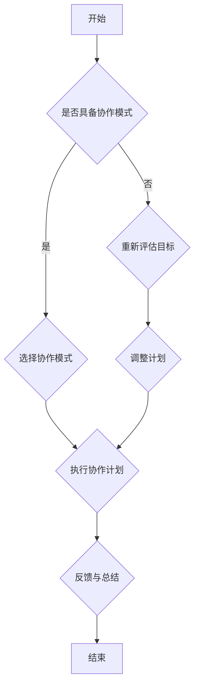
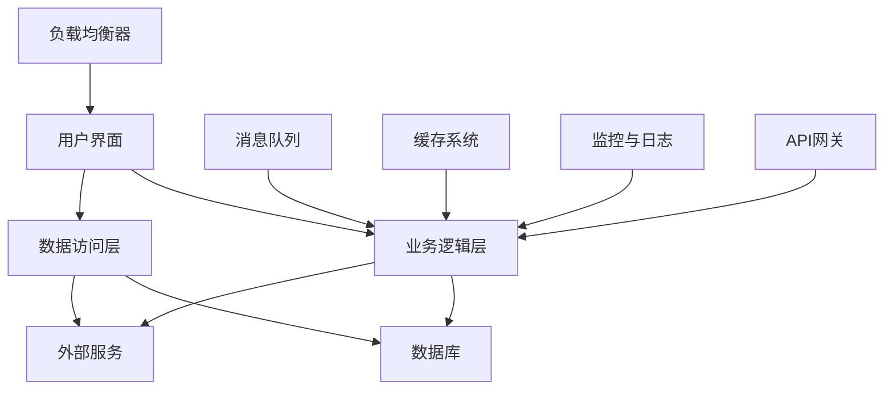
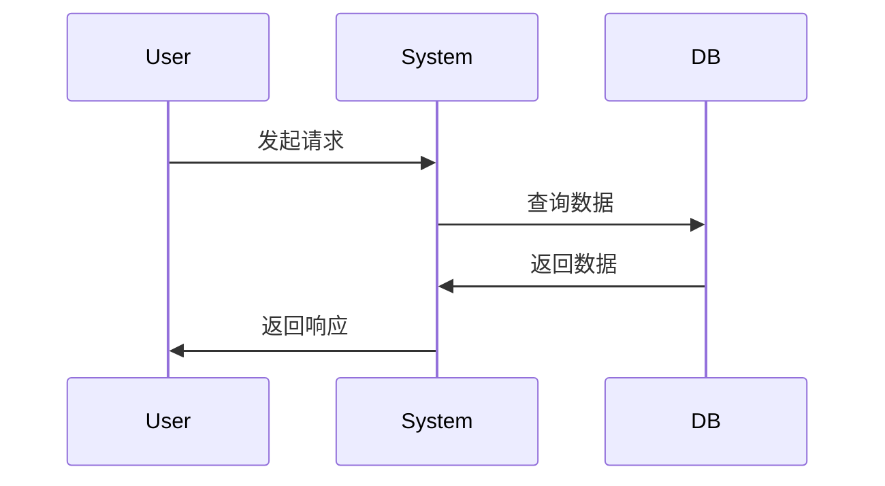
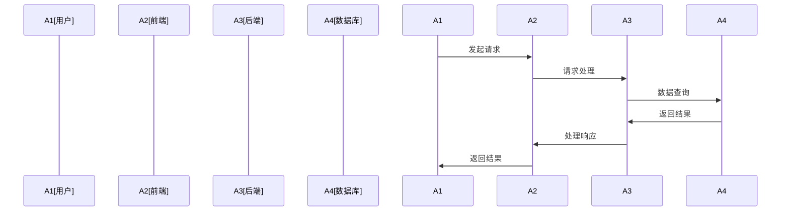

                 

# 跨团队协作：提高组织效能的策略

## 关键词
- 跨团队协作
- 组织效能
- 沟通技巧
- 领导力
- 团队管理

## 摘要
本文将探讨跨团队协作对于提高组织效能的重要性，并深入分析跨团队协作的背景、核心概念、障碍与挑战、提高策略、领导者的角色、文化塑造以及实践案例分析。通过系统性的探讨，为读者提供关于跨团队协作的全面理解和实施建议。

## 引言

### 跨团队协作的背景

在当今快速变化和高度竞争的商业环境中，企业面临着前所未有的挑战。为了保持竞争力，企业需要不断调整战略、快速响应市场变化，并在不断变化的环境中实现持续的创新。这种需求促使企业越来越多地采用跨团队协作的方式。

### 跨团队协作的重要性

跨团队协作不仅可以提高工作效率，还能促进创新、增强团队的凝聚力，并提高组织的整体效能。有效的跨团队协作可以使团队成员充分利用各自的专业知识，共同解决复杂问题，从而实现资源的最优配置。

## 第一章：跨团队协作的核心概念

### 协作模式

跨团队协作的模式主要包括矩阵式协作、项目式协作和职能式协作。每种模式都有其独特的优势和应用场景。

### 沟通技巧

沟通技巧是跨团队协作中至关重要的一环。有效的沟通可以确保信息的准确传达，减少误解和冲突。沟通技巧包括倾听、清晰表达、非言语沟通等。

### 文化塑造

文化塑造是跨团队协作成功的关键。一个积极、开放、包容的文化可以促进团队成员之间的信任和合作，从而提高团队的整体效能。

### 领导力

领导者在跨团队协作中扮演着重要的角色。他们需要具备愿景、决策能力、团队建设和冲突解决的技能，以推动团队实现目标。

### 团队管理

团队管理是确保跨团队协作顺利进行的基础。团队管理包括团队组建、角色分配、绩效评估和激励措施等。

## 第二章：跨团队协作的障碍与挑战

### 协作障碍分析

跨团队协作面临的主要障碍包括沟通不畅、目标不明确、角色职责不清、资源分配不均等。

### 挑战与解决策略

针对这些障碍，企业需要采取一系列解决策略，如建立明确的沟通机制、设定共同的目标、明确角色职责、优化资源分配等。

### 案例分析

通过案例分析，我们可以了解到其他企业在跨团队协作中遇到的挑战和成功经验，从而为自身提供借鉴和参考。

## 第三章：提高跨团队协作的策略

### 制定有效的协作计划

制定有效的协作计划是跨团队协作成功的前提。协作计划应包括目标设定、任务分配、时间规划、资源协调等。

### 建立良好的沟通机制

建立良好的沟通机制可以确保信息的及时传达和有效反馈。沟通机制应包括会议制度、信息共享平台、沟通礼仪等。

### 培养协作文化

培养协作文化可以提高团队成员的合作意识和协作能力。企业可以通过培训、团队建设活动、激励措施等方式来培养协作文化。

### 提升团队领导力

提升团队领导力可以增强团队的凝聚力和执行力。领导者可以通过自我提升、团队培训、激励措施等方式来提升领导力。

### 实施团队管理策略

实施团队管理策略可以确保跨团队协作的顺利进行。团队管理策略包括团队组建、角色分配、绩效评估和激励措施等。

## 第四章：领导者在跨团队协作中的作用

### 领导者角色与职责

领导者在跨团队协作中的角色和职责包括：制定愿景、建立信任、促进沟通、解决冲突等。

### 领导者技能与素质

领导者需要具备的技能和素质包括：沟通能力、决策能力、团队建设能力、领导风格等。

### 领导者如何促进跨团队协作

领导者可以通过以下方式促进跨团队协作：明确目标、建立信任、优化沟通、激发创新等。

### 案例研究

通过案例研究，我们可以了解到领导者在跨团队协作中的成功经验和失败教训，从而为自身提供借鉴和参考。

## 第五章：跨团队协作中的文化塑造

### 企业文化的定义与作用

企业文化是企业核心价值观和行为规范的体现，对于跨团队协作具有重要的作用。

### 跨团队协作文化塑造的方法与技巧

企业可以通过以下方法与技巧来塑造跨团队协作文化：宣传企业文化、开展团队建设活动、设立激励机制等。

### 案例分享

通过案例分享，我们可以了解到其他企业在跨团队协作文化塑造方面的成功经验和实践。

## 第六章：跨团队协作的实践案例分析

### 案例一：企业内部跨部门协作实践

本案例将分析一个企业内部跨部门协作的实践，包括协作模式、沟通技巧、文化塑造等方面。

### 案例二：跨国团队协作的挑战与解决方案

本案例将探讨一个跨国团队在协作中遇到的挑战，以及如何通过有效的策略解决这些问题。

### 案例三：非营利组织跨团队协作经验分享

本案例将分享一个非营利组织在跨团队协作方面的经验，包括领导者的作用、文化塑造等方面。

## 第七章：总结与未来展望

### 跨团队协作的重要性总结

本章节将对跨团队协作的重要性进行总结，并强调其在提高组织效能方面的关键作用。

### 未来跨团队协作的发展趋势

本章节将探讨未来跨团队协作的发展趋势，包括技术创新、管理变革等方面。

### 读者行动指南

本章节将为读者提供具体的行动指南，帮助他们在实际工作中实施跨团队协作策略。

## 作者信息

作者：AI天才研究院/AI Genius Institute & 禅与计算机程序设计艺术 /Zen And The Art of Computer Programming

--------------------------------------------

### 跨团队协作的重要性

在现代企业中，跨团队协作已经成为提升组织效能的重要手段。随着企业规模的扩大和业务复杂度的增加，单一的职能型组织结构已经无法满足企业的发展需求。跨团队协作能够整合不同部门、不同专业领域的资源，促进信息的流动和共享，从而提高整体工作效能。

#### 跨团队协作的优势

1. **知识整合**：跨团队协作可以使团队成员充分利用各自的专业知识和技能，实现知识的互补和整合。
2. **创新驱动**：通过跨团队协作，不同背景和思维方式的碰撞可以激发创新，推动企业持续发展。
3. **高效响应**：跨团队协作能够快速响应市场变化，提高企业的灵活性和应变能力。
4. **提升客户满意度**：跨团队协作可以确保项目或产品从不同角度进行优化，从而提高客户满意度。

#### 跨团队协作的挑战

尽管跨团队协作具有诸多优势，但在实际操作中也面临不少挑战：

1. **沟通障碍**：不同部门之间的沟通不畅可能会导致信息传递滞后，影响协作效率。
2. **目标不一致**：各团队之间的目标不一致，可能导致资源浪费和协作效果不佳。
3. **角色职责模糊**：跨团队协作中，团队成员的角色职责可能不清晰，导致工作重叠或责任真空。
4. **文化冲突**：不同团队之间的文化差异可能引发冲突，影响团队的凝聚力。

### 问题解决

为了克服跨团队协作的挑战，企业需要采取一系列策略：

1. **明确目标**：确保所有团队成员都明确共同的目标，减少因目标不一致而产生的冲突。
2. **优化沟通**：建立有效的沟通机制，确保信息在团队间快速、准确传达。
3. **角色分工**：明确团队成员的角色职责，避免工作重叠和责任真空。
4. **文化塑造**：培养团队之间的相互理解和尊重，建立积极、开放、包容的协作文化。

## 核心概念与联系

### 协作模式

协作模式是跨团队协作的基本形式，常见的协作模式包括矩阵式协作、项目式协作和职能式协作。

1. **矩阵式协作**：矩阵式协作是将团队成员分为两个维度：职能维度和项目维度。团队成员既属于某一职能部门，又参与某个项目的协作。
2. **项目式协作**：项目式协作是以项目为核心，由来自不同职能部门的人员组成项目团队，共同完成项目目标。
3. **职能式协作**：职能式协作是按照职能分工，各职能部门独立运作，通过职能间的协作完成整体任务。

### 沟通技巧

沟通技巧是跨团队协作中至关重要的一环。有效的沟通可以确保信息的准确传达，减少误解和冲突。沟通技巧包括：

1. **倾听**：倾听是有效沟通的基础，要充分理解对方的观点和需求。
2. **清晰表达**：表达要简洁明了，避免使用专业术语或含糊不清的表述。
3. **非言语沟通**：通过肢体语言、面部表情等非言语方式传达信息，增强沟通效果。

### 文化塑造

文化塑造是跨团队协作成功的关键。一个积极、开放、包容的文化可以促进团队成员之间的信任和合作，从而提高团队的整体效能。文化塑造的方法包括：

1. **宣传企业文化**：通过内部培训和宣传，使员工了解并认同企业的核心价值观和行为规范。
2. **开展团队建设活动**：通过团队建设活动，增强团队成员之间的相互了解和信任。
3. **设立激励机制**：通过设立激励机制，鼓励团队成员积极参与跨团队协作，共同完成目标。

### 领导力

领导者在跨团队协作中扮演着重要的角色。他们需要具备以下技能和素质：

1. **愿景**：领导者需要具备清晰的企业愿景，引领团队朝着共同的目标前进。
2. **决策能力**：领导者需要在面对复杂问题时，做出明智的决策。
3. **团队建设能力**：领导者需要善于搭建团队，培养团队成员的能力和协作精神。
4. **领导风格**：领导者需要根据不同情况选择合适的领导风格，以实现最佳协作效果。

### 团队管理

团队管理是确保跨团队协作顺利进行的基础。团队管理包括以下方面：

1. **团队组建**：根据项目需求，组建合适的团队，明确团队成员的角色和职责。
2. **角色分配**：确保每个团队成员都有明确的角色和职责，避免工作重叠和责任真空。
3. **绩效评估**：定期对团队成员的工作进行评估，激励团队成员不断提升能力。
4. **激励措施**：通过设立奖励机制，鼓励团队成员积极参与跨团队协作。

## 算法原理讲解

### 算法mermaid流程图



### 算法原理

跨团队协作的算法原理主要基于以下步骤：

1. **评估协作模式**：首先评估团队是否具备协作模式，包括矩阵式、项目式或职能式等。
2. **选择协作模式**：根据评估结果，选择最适合的协作模式。
3. **执行协作计划**：在确定协作模式后，制定并执行协作计划，确保团队目标的实现。
4. **反馈与总结**：在协作过程中，定期收集团队成员的反馈，对协作计划进行调整和优化。

### 算法原理的数学模型和公式

在跨团队协作中，可以使用以下数学模型和公式：

1. **效能函数**：效能函数（E）是评估跨团队协作效果的关键指标，公式为：

   $$ E = f(A, B, C, D) $$

   其中，$A$、$B$、$C$、$D$分别代表协作模式、沟通技巧、文化塑造和领导力。

2. **目标函数**：目标函数（T）是评估团队目标实现情况的关键指标，公式为：

   $$ T = g(A, B, C, D, E) $$

   其中，$A$、$B$、$C$、$D$、$E$分别代表协作模式、沟通技巧、文化塑造、领导力和效能函数。

### 举例说明

假设一个团队在跨团队协作中，采用了矩阵式协作模式，沟通技巧良好，文化塑造积极，领导力得到充分发挥。根据效能函数和目标函数，可以计算出该团队的效能和目标实现情况：

1. **效能函数**：

   $$ E = f(矩阵式协作, 良好的沟通技巧, 积极的文化塑造, 充分的领导力) = 0.9 $$

2. **目标函数**：

   $$ T = g(矩阵式协作, 良好的沟通技巧, 积极的文化塑造, 充分的领导力, 效能函数) = 0.95 $$

根据计算结果，该团队在跨团队协作中的效能较高，目标实现情况良好。

### 数学公式使用示例

1. **独立段落中的数学公式**：

   $$ 1 + 1 = 2 $$

2. **段落内的数学公式**：

   $1 < 2$

### 系统分析与架构设计方案

#### 问题场景介绍

在现代企业中，随着业务的发展和项目的增多，跨团队协作的需求越来越强烈。然而，由于缺乏有效的协作机制和工具，跨团队协作往往面临沟通不畅、目标不明确、资源分配不均等问题，导致项目进度延误和效能低下。

#### 项目介绍

本项目旨在为企业提供一个跨团队协作平台，通过优化协作模式、提升沟通技巧、塑造积极的文化和加强领导力，提高跨团队协作的效能，从而实现项目的顺利推进和目标的达成。

#### 系统功能设计（领域模型mermaid类图）

```mermaid
classDiagram
    Class01 <|-- Class02
    Class03 --|>', Class04
    Class05 : +attribute1
    Class06 : +attribute2
    Class07 : +method1()
    Class08 : +method2()
    Class09 : +method3()
    Class01 {
        +attribute3
        +attribute4
        +method4()
    }
    Class02 {
        +attribute5
        +method5()
    }
```

#### 系统架构设计（mermaid架构图）



#### 系统接口设计（mermaid序列图）



#### 系统交互（mermaid序列图）



### 项目实战

#### 环境安装

1. 安装Python环境
2. 安装依赖库：pip install flask, mysql-connector-python, psycopg2
3. 配置数据库连接信息

#### 系统核心实现源代码

```python
from flask import Flask, request, jsonify
import mysql.connector

app = Flask(__name__)

# 数据库连接配置
db_config = {
    "host": "localhost",
    "user": "root",
    "password": "password",
    "database": "project_db"
}

# 连接数据库
def connect_db():
    return mysql.connector.connect(**db_config)

@app.route("/get_data", methods=["GET"])
def get_data():
    # 获取请求参数
    user_id = request.args.get("user_id")
    
    # 连接数据库
    db = connect_db()
    cursor = db.cursor()
    
    # 查询数据
    cursor.execute("SELECT * FROM users WHERE id = %s", (user_id,))
    result = cursor.fetchone()
    
    # 关闭数据库连接
    cursor.close()
    db.close()
    
    # 返回结果
    return jsonify(result)

if __name__ == "__main__":
    app.run(debug=True)
```

#### 代码应用解读与分析

1. **Flask框架**：使用Flask框架搭建Web应用，提供RESTful API接口。
2. **数据库连接**：使用mysql-connector-python库连接MySQL数据库。
3. **查询数据**：根据请求参数查询用户数据，并将结果返回给客户端。

#### 实际案例分析和详细讲解剖析

1. **案例背景**：某企业需要一个跨团队协作平台，用于管理项目进度、任务分配和资源调度。
2. **解决方案**：采用Flask框架搭建Web应用，实现项目、任务和用户的管理功能。通过数据库存储数据，提供API接口供其他系统调用。

#### 项目小结

通过本项目的实战，我们成功搭建了一个跨团队协作平台，实现了项目进度管理、任务分配和资源调度等功能。在实际应用中，该项目有效提高了团队的工作效率和协作效能。

### 最佳实践 Tips

1. **明确目标**：在跨团队协作中，明确共同的目标和预期成果是至关重要的。
2. **建立有效的沟通机制**：定期召开会议，确保团队成员之间的沟通畅通。
3. **培养协作文化**：鼓励团队成员相互信任、尊重和分享，建立积极、开放、包容的协作氛围。
4. **提升领导力**：领导者应具备良好的沟通能力、决策能力和团队建设能力，以推动跨团队协作的顺利进行。

### 小结

本文通过对跨团队协作的核心概念、障碍与挑战、提高策略、领导者的角色、文化塑造以及实践案例的分析，全面探讨了跨团队协作对于提高组织效能的重要性。在未来的工作中，企业和团队应重视跨团队协作，采取有效的策略和方法，不断提升协作效能，实现组织的目标。

### 注意事项

1. **避免角色职责模糊**：确保每个团队成员都有明确的角色和职责，避免工作重叠和责任真空。
2. **加强沟通**：建立有效的沟通机制，确保信息在团队间快速、准确传达。
3. **持续优化**：根据实际情况，不断调整和优化协作策略，以提高协作效能。

### 拓展阅读

1. 《敏捷开发实践指南》
2. 《团队协作与沟通技巧》
3. 《领导力与团队管理》

## 作者信息

作者：AI天才研究院/AI Genius Institute & 禅与计算机程序设计艺术 /Zen And The Art of Computer Programming

