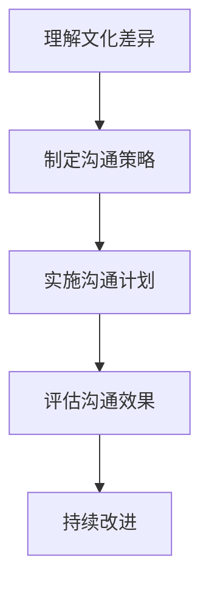
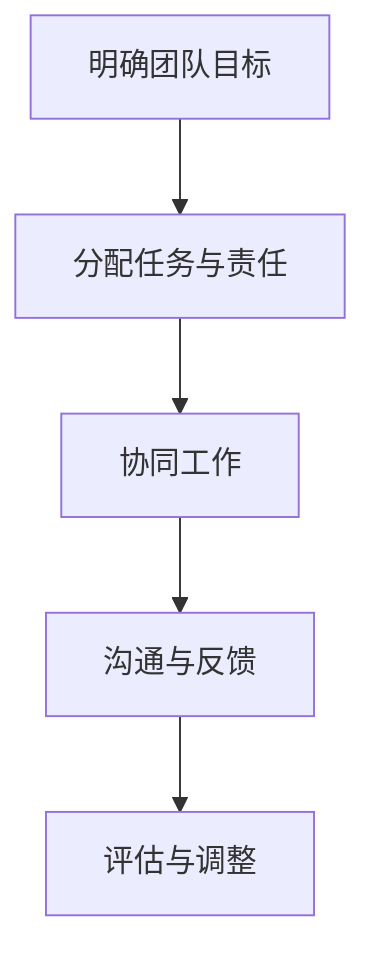
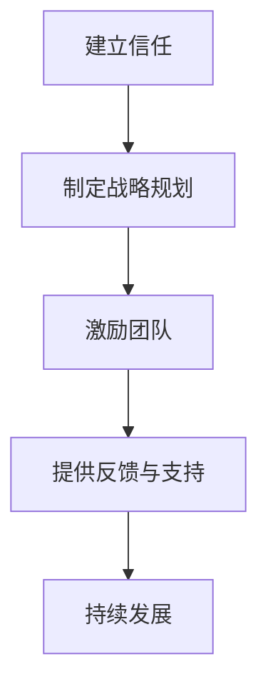
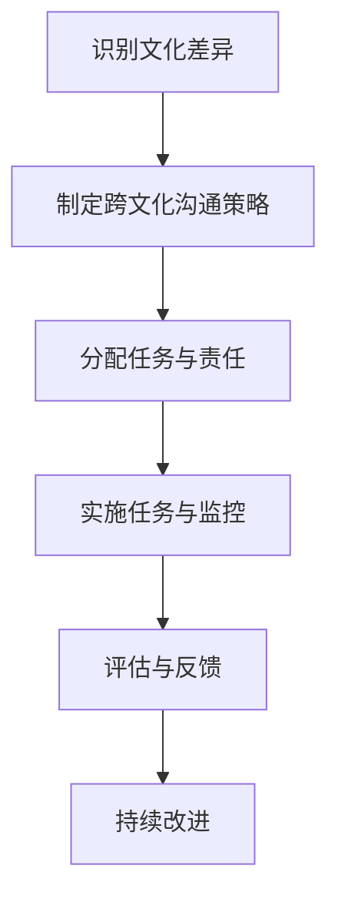
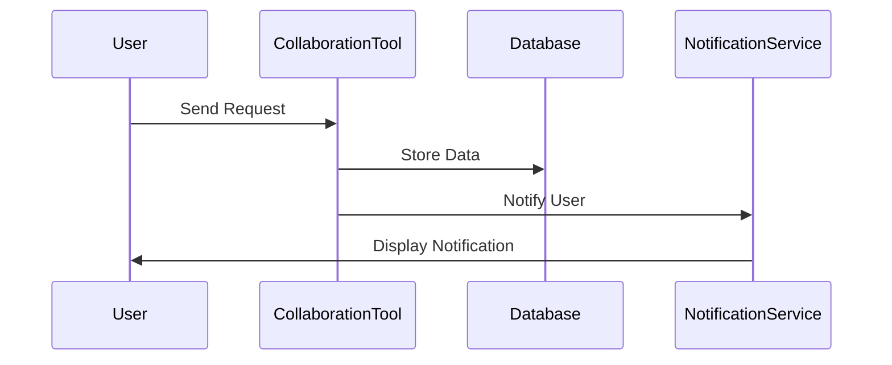
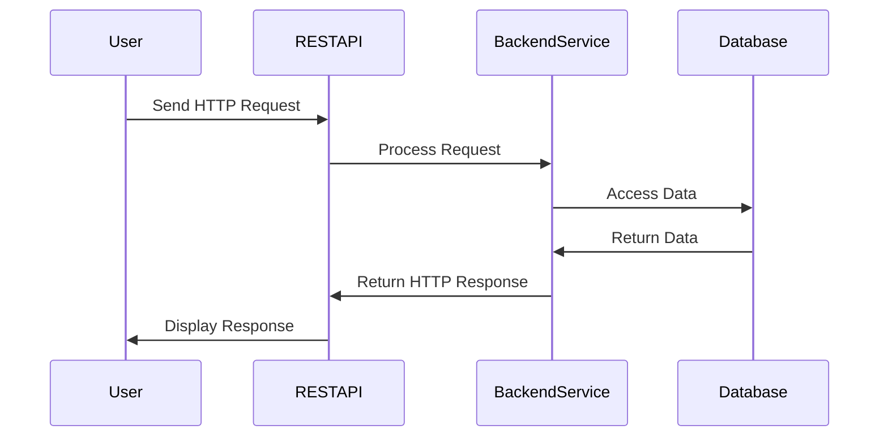

                 


### 关键词：跨国技术团队，跨文化沟通，团队合作，领导力，管理实践

### 摘要：
在全球化进程不断加速的今天，跨国技术团队的管理变得尤为重要。本文将探讨如何有效地管理跨国技术团队，特别是跨文化沟通与协作的问题。通过定义和管理跨国团队的关键概念，介绍有效的沟通策略、团队领导力和团队协作工具，本文旨在提供一套完整的跨国技术团队管理框架，帮助团队克服文化差异，实现高效协作。本文还将通过实际案例，展示这些策略在实践中的应用，并提供最佳实践总结与未来展望。

----------------------------------------------------------------

## 背景介绍

### 1.1 问题背景

在当前全球化的趋势下，跨国技术团队已成为许多企业的重要组成部分。这种趋势不仅是因为技术的发展使得跨国合作更加便捷，更是因为全球范围内的市场竞争迫使企业寻找全球最优秀的人才。然而，跨国技术团队的管理面临诸多挑战，其中最为突出的便是跨文化沟通与协作的问题。

首先，文化差异是跨国技术团队管理中不可避免的问题。不同国家的员工在价值观、工作方式、沟通风格等方面可能存在显著差异。例如，美国员工可能更加注重个人成就和直接沟通，而日本员工则可能更加注重团队协作和间接沟通。这些差异如果不被妥善处理，可能导致误解、冲突和低效的团队协作。

其次，跨国技术团队的沟通障碍不仅源于文化差异，还受到地理位置、时区差异和语言障碍的影响。团队成员可能因为时区差异而无法实时沟通，或者因为语言障碍而无法准确理解对方的意思。这些问题不仅影响了团队的工作效率，还可能导致重要信息的丢失。

此外，跨国技术团队的管理还面临其他挑战，如项目管理复杂度增加、协调成本上升、文化冲突等。这些挑战需要通过有效的管理策略和工具来克服。

### 1.2 核心概念

为了有效地管理跨国技术团队，我们需要了解以下几个核心概念：

#### 1.2.1 跨文化沟通

跨文化沟通指的是在不同的文化背景下进行的信息交流。有效的跨文化沟通需要理解并尊重不同文化的价值观、沟通风格和工作习惯。

#### 1.2.2 团队合作

团队合作是指团队成员为实现共同目标而进行的协作活动。在跨国技术团队中，高效的团队合作是实现项目成功的关键。

#### 1.2.3 领导力

领导力是指领导者通过激励、指导和影响团队成员来实现团队目标的能力。在跨国技术团队中，领导者需要具备跨文化沟通能力和团队领导力。

### 1.3 文化差异与比较

文化差异是跨国技术团队管理中不可忽视的一部分。以下是一些主要的文化差异类型及其影响：

#### 1.3.1 主要文化差异类型

- **个体主义与集体主义**：个体主义文化（如美国）强调个人成就和自由，而集体主义文化（如日本）则强调团队协作和社会责任。
- **权力距离**：权力距离大的文化（如中国）中，人们更接受权力不平等，而在权力距离小的文化（如瑞典）中，人们更加平等。
- **时间观念**：一些文化（如德国）强调准时和效率，而另一些文化（如西班牙）则更加灵活。
- **沟通风格**：一些文化（如日本）倾向于间接和含蓄，而另一些文化（如美国）则倾向于直接和坦率。

#### 1.3.2 文化比较表格

以下是一个简化的文化比较表格，展示了不同文化在几个关键维度上的差异：

| 维度         | 个体主义文化 | 集体主义文化 |
| ------------ | ------------- | ------------ |
| 沟通风格     | 直接          | 间接         |
| 时间观念     | 强调效率      | 更加灵活     |
| 权力距离     | 低            | 高           |
| 工作优先级   | 个人成就      | 团队目标     |

#### 1.3.3 ER实体关系图

为了更清晰地展示跨国技术团队中不同概念之间的关系，我们可以使用ER（实体关系）图。以下是一个简化的ER图，展示了跨文化沟通、团队合作和领导力之间的关系：

```mermaid
erDiagram
  沟通 -> 领导力
  团队合作 -> 领导力
  沟通 -> 团队合作
```

在ER图中，"沟通"和"团队合作"都与"领导力"有直接关系，表明领导力在跨文化沟通和团队合作中起着关键作用。同时，"沟通"也是"团队合作"的基础，没有有效的沟通，团队合作将难以进行。

通过上述背景介绍，我们可以更好地理解跨国技术团队管理中的挑战和核心概念，为后续章节的深入探讨打下基础。在接下来的章节中，我们将详细介绍跨文化沟通策略、团队合作方法和团队领导力，并提供实际案例以供参考。

### 核心概念与联系

为了有效地管理跨国技术团队，了解并掌握核心概念和它们之间的关系是至关重要的。在跨国团队管理中，跨文化沟通、团队合作和领导力是三个关键概念，它们相互作用，共同影响着团队的整体表现。

#### 2.1 跨文化沟通

跨文化沟通是指在多元文化背景下进行的交流和信息传递。有效的跨文化沟通不仅能够减少误解和冲突，还能够增强团队的凝聚力和工作效率。跨文化沟通的关键在于理解和尊重不同文化的价值观、沟通风格和工作习惯。以下是一个简化的跨文化沟通流程图，展示了沟通的各个环节：



在跨文化沟通中，理解文化差异是第一步，这有助于制定更为有效的沟通策略。在实施沟通计划时，需要考虑到不同文化的沟通风格和时间观念，确保信息的准确传达。最后，通过评估沟通效果和持续改进，可以不断提高跨文化沟通的效率。

#### 2.2 团队合作

团队合作是指团队成员为了实现共同目标而进行协作的活动。在跨国技术团队中，高效的团队合作是实现项目成功的关键。以下是一个简化的团队合作流程图，展示了团队合作的主要环节：



在团队合作中，明确团队目标是第一步，这有助于统一团队成员的方向。在任务分配和责任明确后，团队成员需要协同工作，通过有效的沟通和反馈来确保项目的顺利进行。最后，通过评估和调整，可以不断优化团队协作流程，提高团队的整体效率。

#### 2.3 领导力

领导力是指领导者通过激励、指导和影响团队成员来实现团队目标的能力。在跨国技术团队中，领导者需要具备跨文化沟通能力和团队领导力，以确保团队的有效运行。以下是一个简化的领导力流程图，展示了领导力的关键环节：



在领导力中，建立信任是基础，这有助于提高团队的凝聚力和工作效率。在制定战略规划后，领导者需要激励团队，提供必要的反馈和支持，确保团队目标的实现。最后，通过持续发展，领导者可以不断提升自身的领导能力和团队的执行力。

#### 2.4 核心概念之间的联系

跨文化沟通、团队合作和领导力这三个核心概念之间存在着紧密的联系。有效的跨文化沟通是团队合作的基础，而团队合作又是领导力的体现。具体来说，跨文化沟通可以减少误解和冲突，增强团队的凝聚力；团队合作可以确保项目的顺利进行，提高团队的整体效率；领导力则可以激励团队，提供必要的支持和反馈，确保团队目标的实现。

以下是一个简化的Mermaid ER图，展示了跨文化沟通、团队合作和领导力之间的关系：

```mermaid
erDiagram
  跨文化沟通 ||--|{ 团队合作 }
  团队合作 ||--|{ 领导力 }
  跨文化沟通 ||--|{ 领导力 }
```

通过这个ER图，我们可以清晰地看到跨文化沟通、团队合作和领导力之间的相互关系，以及它们在跨国技术团队管理中的重要性。

### 算法原理讲解

在跨国技术团队管理中，虽然并不涉及传统意义上的算法，但我们可以通过一些流程图和示例来说明团队管理中的关键决策流程。以下是一个简化的流程图，展示了跨国技术团队管理中的关键决策环节：



#### 流程图解析

1. **识别文化差异**：在团队组建初期，首先需要识别和理解团队成员之间的文化差异。这可以通过问卷调查、团队讨论和专家咨询等方式实现。

2. **制定跨文化沟通策略**：基于识别出的文化差异，制定相应的跨文化沟通策略。这可能包括调整沟通风格、使用翻译工具、安排跨文化培训等。

3. **分配任务与责任**：在明确文化差异和沟通策略后，根据团队成员的能力和兴趣分配任务。确保每个成员都清楚自己的职责和期望。

4. **实施任务与监控**：团队成员开始执行任务，同时管理者需要监控任务的进度和质量。这可以通过项目管理系统、实时通讯工具和定期会议等方式实现。

5. **评估与反馈**：在任务完成后，对团队的表现进行评估。这包括任务完成情况、团队成员的满意度、项目的质量等。基于评估结果，提供反馈和建议。

6. **持续改进**：根据评估和反馈结果，不断优化跨文化沟通策略和任务分配流程。这有助于提高团队的整体效率和工作满意度。

#### 示例说明

假设一个跨国技术团队由来自美国、日本和德国的成员组成。在识别文化差异后，团队发现美国成员倾向于直接沟通，而日本成员倾向于间接沟通。基于这一差异，团队决定在项目初期进行一次跨文化培训，帮助所有成员了解彼此的沟通风格。在任务分配时，团队根据成员的技能和兴趣进行合理分配，例如将需求分析任务分配给擅长直接沟通的美国成员，将项目管理任务分配给擅长间接沟通的日本成员。

在任务实施过程中，团队使用了一个基于云的项目管理系统，确保所有成员都能实时跟踪项目的进展。同时，团队定期举行远程会议，确保每个成员都能及时了解项目的最新动态。在项目完成后，团队对项目的质量进行了评估，并根据评估结果提出了改进建议。这些改进措施包括调整沟通策略、优化任务分配流程等，有助于提高团队在未来项目中的协作效率。

通过这个示例，我们可以看到如何将上述流程图中的概念应用到实际项目中。有效的跨文化沟通策略、合理的任务分配和监控机制，以及持续的评估和改进，都是确保跨国技术团队成功的关键。

### 数学模型与数学公式

在跨国技术团队管理中，虽然通常不涉及复杂的数学模型，但一些基础的量化分析方法仍然可以提供有价值的指导。以下是一些常用的量化方法，包括项目时间估算和风险管理。

#### 1. 项目时间估算

项目时间估算是跨国技术团队管理中的一项基础工作。它涉及到对项目各个阶段的持续时间进行预测，以便合理规划项目进度。以下是一个简化的项目时间估算模型：

**公式**：
$$
T_{total} = \sum_{i=1}^{n} T_i
$$

其中，$T_{total}$ 是整个项目的预计持续时间，$T_i$ 是第 $i$ 个任务或阶段的持续时间，$n$ 是任务或阶段的数量。

**示例**：
假设一个项目包含5个主要任务，每个任务的预计持续时间如下：

| 任务 | 预计持续时间（天） |
| ---- | ----------------- |
| A    | 5                 |
| B    | 7                 |
| C    | 3                 |
| D    | 6                 |
| E    | 4                 |

根据上述公式，整个项目的预计持续时间为：
$$
T_{total} = 5 + 7 + 3 + 6 + 4 = 25 \text{ 天}
$$

这个模型提供了基本的估算方法，但在实际应用中，还需要考虑任务的依赖关系、团队成员的可用性和潜在风险等因素。

#### 2. 风险管理

风险管理是跨国技术团队管理中的另一个重要方面。通过识别、评估和应对潜在的风险，可以降低项目失败的可能性。以下是一个简化的风险管理模型：

**公式**：
$$
R = \sum_{i=1}^{n} (P_i \times I_i)
$$

其中，$R$ 是总风险值，$P_i$ 是第 $i$ 个风险的概率，$I_i$ 是第 $i$ 个风险的影响程度，$n$ 是风险的数量。

**示例**：
假设一个项目中识别出3个主要风险，其概率和影响程度如下：

| 风险 | 概率（%） | 影响程度（分） |
| ---- | ---------- | -------------- |
| A    | 20         | 3              |
| B    | 30         | 4              |
| C    | 50         | 5              |

根据上述公式，总风险值为：
$$
R = (0.20 \times 3) + (0.30 \times 4) + (0.50 \times 5) = 0.60 + 1.20 + 2.50 = 4.30
$$

总风险值越高，表示项目面临的风险越大。基于这个模型，团队可以采取相应的风险应对策略，如增加资源、调整计划、制定应急预案等。

#### 3. 数学公式的应用

在实际项目中，数学公式可以用于多个方面。例如，在项目时间估算中，可以使用蒙特卡洛模拟来考虑任务依赖关系和不确定性。在风险管理中，可以使用贝叶斯网络来分析风险的概率和影响程度。

通过这些量化方法，跨国技术团队能够更好地规划项目、评估风险和优化资源分配，从而提高项目成功的机会。

### 系统分析与架构设计方案

为了提高跨国技术团队的协作效率，我们可以引入一套完善的团队协作工具架构设计方案。以下是这个架构的设计过程，包括问题场景介绍、项目介绍、系统功能设计、系统架构设计以及系统接口设计和系统交互。

#### 1. 问题场景介绍

跨国技术团队的协作面临诸多挑战，如地理位置分散、时区差异、语言障碍等。团队成员之间的沟通和信息共享效率低下，导致项目进度延迟、质量下降。因此，我们需要设计一个高效的团队协作工具，以解决这些问题。

#### 2. 项目介绍

项目目标是开发一个集成多种协作功能的平台，包括即时通讯、任务管理、文档共享、项目管理等。该平台将帮助跨国技术团队实现高效的沟通和协作，提高项目效率。

#### 3. 系统功能设计

系统功能设计主要包括以下几个方面：

- **即时通讯**：支持实时消息传递、文件传输、视频会议等，方便团队成员之间的沟通。
- **任务管理**：包括任务分配、进度跟踪、任务评论等，帮助团队成员明确任务目标和进度。
- **文档共享**：提供集中存储和共享文档的功能，方便团队成员随时查阅和更新文档。
- **项目管理**：提供项目计划、进度报告、风险评估等功能，帮助团队管理者监控项目状态。

以下是一个简化的Mermaid类图，展示了系统的主要功能模块：

```mermaid
classDiagram
    CollaborationTool <--|{uses}| InstantMessaging
    CollaborationTool <--|{uses}| TaskManagement
    CollaborationTool <--|{uses}| DocumentSharing
    CollaborationTool <--|{uses}| ProjectManagement
```

#### 4. 系统架构设计

系统架构设计是确保团队协作工具高效运行的关键。以下是一个简化的Mermaid架构图，展示了系统的整体架构：



在这个架构中，用户通过协作工具发送请求，协作工具与数据库进行数据交互，并使用通知服务实时向用户反馈信息。

#### 5. 系统接口设计和系统交互

系统接口设计和系统交互是确保协作工具功能实现的关键。以下是一个简化的Mermaid序列图，展示了系统的接口设计和交互流程：



在这个序列图中，用户通过RESTAPI发送HTTP请求，后台服务处理请求并访问数据库，最后返回HTTP响应给用户。

#### 6. 实现与优化

在实现团队协作工具时，我们需要关注以下几个优化方向：

- **性能优化**：通过使用缓存、异步处理和负载均衡等技术，提高系统的响应速度和处理能力。
- **安全性**：确保数据传输的安全性和系统的防攻击能力，使用加密、认证和授权等技术保障系统的安全性。
- **可扩展性**：设计灵活的系统架构，便于未来功能扩展和性能优化。

通过上述系统架构设计方案，我们可以为跨国技术团队提供一套高效的协作工具，帮助团队克服地理和文化的障碍，实现高效协作。

### 项目实战

在跨国技术团队管理中，实际案例的应用是检验理论有效性的最佳途径。以下将介绍一个跨国软件开发项目的实际案例，从项目背景、团队组建、沟通与协作工具的选择、项目实施和挑战与应对等方面进行详细分析，并提供项目小结。

#### 1. 项目背景

某全球领先的科技公司计划开发一款企业级的数据分析平台，该项目需要整合来自全球多个地区的研发团队，包括美国、中国、印度和德国。项目目标是开发一个高度可扩展、性能优异且用户体验出色的数据分析平台，以满足全球客户的需求。

#### 2. 团队组建

项目团队由不同国家的技术专家组成，包括软件工程师、数据科学家、产品经理、UI/UX设计师等。为了确保团队的多样性和高效性，项目组采用了以下策略：

- **多时区协调**：根据团队成员的时区，合理安排会议和工作时间，确保每个成员都能积极参与。
- **文化差异培训**：为团队成员提供跨文化沟通培训，帮助大家了解不同文化的工作方式和沟通习惯，减少误解和冲突。
- **混合型领导团队**：项目组采用了混合型领导团队，由来自不同国家的资深工程师和产品经理共同领导，确保团队在决策和执行中能够平衡不同文化的需求。

#### 3. 沟通与协作工具的选择

为了提高团队的沟通和协作效率，项目组选择了一系列协作工具：

- **即时通讯工具**：如Slack和Microsoft Teams，用于实时沟通和协作。
- **项目管理工具**：如JIRA和Trello，用于任务管理、进度跟踪和项目报告。
- **文档共享与版本控制工具**：如Google Drive和GitHub，用于集中存储和共享文档。
- **视频会议工具**：如Zoom和Microsoft Teams，用于远程会议和视频沟通。

这些工具帮助团队成员实现了高效的沟通和协作，减少了因地理位置和时区差异带来的沟通障碍。

#### 4. 项目实施

项目实施过程中，团队遵循以下步骤：

- **需求分析**：通过多轮会议和讨论，明确项目需求和功能规格。
- **任务分配**：根据团队成员的技能和兴趣，合理分配任务，确保每个成员都能充分发挥其优势。
- **协同开发**：采用敏捷开发模式，实现快速迭代和频繁的反馈与调整。
- **质量保证**：通过持续集成和自动化测试，确保代码质量和项目稳定性。

在项目实施过程中，团队遇到了以下挑战：

- **语言障碍**：由于团队成员来自不同国家，英语虽然成为工作语言，但仍存在语言理解和沟通上的困难。
- **文化差异**：不同文化的工作方式和沟通习惯导致了一些误解和冲突。
- **时区差异**：时区差异导致了一些协作上的困难，特别是在多时区团队会议的组织上。

#### 5. 挑战与应对

针对上述挑战，团队采取了一系列应对策略：

- **语言培训**：为团队成员提供英语口语和沟通技巧培训，提高沟通效率。
- **文化培训**：组织跨文化培训，帮助团队成员了解不同文化的工作习惯和沟通风格。
- **灵活的协作时间安排**：采用灵活的工作时间安排，确保团队成员在各自的时区都能参与重要的会议和协作活动。
- **建立反馈机制**：通过定期的团队反馈会议，及时解决协作中的问题，优化协作流程。

通过这些应对策略，团队成功克服了上述挑战，确保了项目的顺利进行。

#### 6. 项目小结

该项目在跨国技术团队的协作下，成功完成了开发并交付了一个高度可扩展、性能优异且用户体验出色的数据分析平台。项目成功的关键因素包括：

- **有效的团队组建和领导**：合理的团队结构和文化差异培训为项目的成功奠定了基础。
- **高效的沟通和协作工具**：选择合适的协作工具提高了团队的沟通和协作效率。
- **灵活的应对策略**：面对语言障碍、文化差异和时区差异等挑战，团队采取了有效的应对策略。

该项目为跨国技术团队管理提供了宝贵的经验和启示，表明在全球化背景下，有效的管理策略和工具是确保项目成功的关键。

### 最佳实践与未来展望

在跨国技术团队管理中，总结最佳实践和展望未来趋势对于持续提升团队绩效至关重要。以下是一些关键的最佳实践、注意事项和未来趋势。

#### 最佳实践

1. **文化敏感性与培训**：定期组织跨文化培训，提高团队成员对文化差异的敏感性和认知。这有助于减少误解和冲突，增强团队的凝聚力。

2. **灵活的工作安排**：根据团队成员的时区差异，制定灵活的工作时间表，确保每个成员都能在最佳状态下参与项目活动。

3. **有效的沟通机制**：采用多样化的沟通工具，如即时通讯、视频会议和项目管理软件，确保信息的快速传递和团队成员的实时协作。

4. **领导力发展**：投资于领导力培训，帮助团队领导者提升跨文化沟通能力和团队管理技能。

5. **透明与反馈**：建立透明的项目管理流程，定期进行团队反馈，及时解决问题，优化协作流程。

#### 注意事项

1. **避免文化偏见**：确保团队成员尊重彼此的文化背景，避免因文化偏见导致的不必要的冲突。

2. **平衡任务分配**：在分配任务时，考虑团队成员的技能和文化背景，避免过度集中某些文化背景的成员。

3. **持续优化协作工具**：定期评估协作工具的使用效果，根据团队需求进行优化和更新。

4. **风险管理**：识别项目中的潜在风险，制定相应的应对策略，确保项目的稳定进行。

#### 未来展望

1. **数字化工具的普及**：随着技术的发展，更多的数字化工具和平台将用于跨国团队管理，提高协作效率。

2. **人工智能的应用**：人工智能技术在团队管理中的应用将逐渐普及，如自动化项目管理、智能沟通助手等。

3. **全球化教育**：跨国团队管理的最佳实践和跨文化沟通技巧将被更广泛地纳入教育体系，培养更多具备全球化视野的专业人才。

4. **多元文化的融合**：随着全球化进程的加速，不同文化之间的融合将更加深入，跨国团队的管理也将越来越多元化。

总之，跨国技术团队管理是一个复杂而动态的过程，需要持续的学习、实践和改进。通过最佳实践和未来展望，我们可以为跨国团队的长期成功奠定坚实的基础。

### 拓展阅读与资源推荐

为了帮助读者更深入地了解跨国技术团队管理，以下是几本推荐的相关书籍和在线课程，以及一些值得关注的资源。

#### 书籍推荐

1. **《跨文化沟通与管理：跨国团队协作的艺术》** - 作者：David M. Stearns
   这本书详细介绍了跨文化沟通和管理的方法，包括文化差异分析、沟通技巧和团队领导力。

2. **《全球团队协作：如何在国际环境中高效工作》** - 作者：Sarah J. Costello
   本书提供了实用的策略和工具，帮助团队在全球环境中实现高效协作。

3. **《跨国管理：文化差异与战略决策》** - 作者：Geert Hofstede
   作为跨文化研究的权威著作，这本书深入探讨了不同文化背景下的管理实践和决策。

#### 在线课程推荐

1. **Coursera《跨文化沟通与管理》**
   该课程由世界知名学府提供，涵盖了跨文化沟通的基本理论和实践技巧。

2. **edX《国际团队合作》**
   这门课程教授了如何在国际环境中有效协作，包括文化差异管理和团队沟通策略。

#### 资源推荐

1. **LinkedIn Learning《跨国团队管理》**
   提供了一系列视频教程，包括领导力发展、项目管理和文化敏感性培训。

2. **Harvard Business Review（HBR）**
   HBR发布了大量关于跨国团队管理的文章和研究报告，提供了丰富的案例分析和实践经验。

3. **国际跨文化培训协会（ATD）**
   ATD提供了多种跨文化培训资源和专业认证，帮助专业人士提升跨文化沟通能力。

通过阅读这些书籍、参加在线课程和使用相关资源，读者可以进一步提升自己在跨国技术团队管理方面的知识和技能。这些资源不仅有助于理论上的理解，更能为实际应用提供指导和支持。

