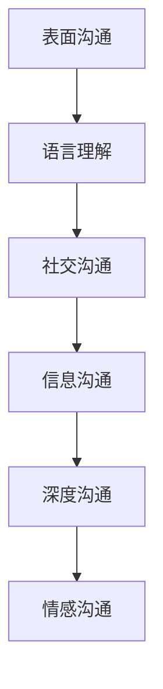
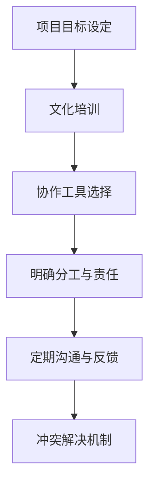
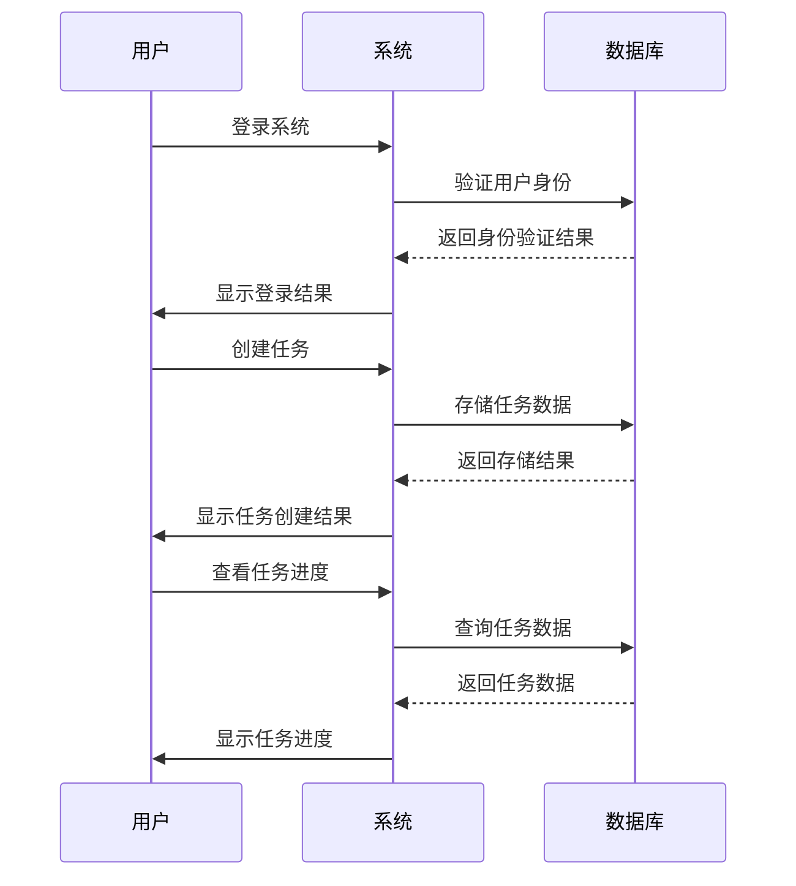

                 


## 跨国技术团队管理：跨文化沟通与协作技巧

### 关键词：
- 跨国技术团队
- 跨文化沟通
- 协作技巧
- 文化差异
- 团队管理

### 摘要：
本文旨在探讨如何在跨国技术团队中进行有效的沟通与协作。我们将分析跨国技术团队的现状和挑战，介绍跨文化沟通与协作的核心概念，提供实用的算法原理和系统架构设计方案，并通过实际案例进行讲解，总结最佳实践，以期为跨国技术团队的管理者提供有价值的参考。

### 引言
#### 跨国技术团队的现状与挑战

在全球化的今天，跨国技术团队越来越常见。这些团队通常由来自不同国家和地区的成员组成，他们可能拥有不同的文化背景、工作习惯和沟通方式。这种多样性在带来机遇的同时，也带来了一系列挑战：

1. **文化差异**：不同的文化背景可能导致沟通障碍和误解。
2. **工作习惯**：不同地区的工作节奏和文化习惯可能不兼容。
3. **时区差异**：跨国团队的成员可能分布在不同的时区，影响实时沟通和协作。
4. **管理难度**：管理者需要具备跨文化管理的能力，以应对多样性带来的挑战。

#### 跨文化沟通与协作的重要性

有效的跨文化沟通与协作对于跨国技术团队的成功至关重要。良好的沟通能够减少误解和冲突，提高团队的工作效率，促进创新和团队凝聚力。协作则能够确保项目目标的达成，提高整体业绩。

### 背景介绍
#### 核心概念术语说明

在讨论跨国技术团队管理时，以下是一些核心概念和术语：

1. **文化差异**：指不同文化群体在价值观、行为规范、沟通方式等方面的差异。
2. **跨文化沟通**：指在跨文化背景下进行的沟通，包括语言、非语言交流和跨文化沟通技巧。
3. **协作**：指团队成员为了共同目标而共同工作，包括任务分配、信息共享和团队合作。
4. **团队管理**：指管理者对团队成员、任务、资源和目标的管理，以确保团队高效运作。

#### 问题背景

跨国技术团队面临的问题主要包括：

1. **语言障碍**：不同语言可能导致沟通不畅，影响团队协作。
2. **文化误解**：不同文化背景可能导致对同一问题的不同理解，产生冲突。
3. **时区差异**：不同时区的工作安排可能导致协作困难。
4. **工作习惯差异**：不同地区的工作文化和习惯可能不兼容。

#### 问题描述

为了解决上述问题，管理者需要：

1. **提高跨文化沟通技巧**：通过了解不同文化的特点，采用适当的沟通策略。
2. **促进团队协作**：通过制定明确的协作流程和规则，确保团队成员能够高效合作。
3. **管理文化差异**：通过培训和激励，减少文化冲突，提高团队凝聚力。

#### 问题解决

以下是一些解决方案：

1. **文化培训**：为团队成员提供文化培训，帮助他们了解不同文化的特点，提高跨文化沟通能力。
2. **协作工具**：采用协作工具，如项目管理软件和即时通讯工具，提高团队协作效率。
3. **明确目标**：确保团队成员对项目目标和预期成果有清晰的认识，减少误解。

#### 边界与外延

本文的讨论主要关注跨国技术团队的管理，但跨文化沟通与协作的原理和方法同样适用于其他跨文化组织。

#### 概念结构与核心要素组成

跨国技术团队管理涉及以下核心要素：

1. **文化差异分析**：了解不同文化的特点，分析可能的文化冲突。
2. **沟通技巧**：采用适当的沟通方式，确保信息的准确传递。
3. **团队协作**：制定协作流程和规则，确保团队成员能够高效合作。
4. **冲突解决**：建立有效的冲突解决机制，减少文化冲突。

### 核心概念与联系

#### 文化差异分析

为了更好地理解文化差异，我们可以从以下维度进行分析：

1. **语言**：不同的语言可能导致沟通障碍。
2. **价值观**：不同的价值观可能导致对同一问题的不同看法。
3. **行为规范**：不同的行为规范可能导致工作习惯的差异。
4. **权力距离**：对权力分配的不同看法可能导致沟通和协作的困难。

#### 文化差异的维度

以下是一个对比不同文化差异维度的表格：

| 维度           | 描述                                       | 例子                  |
| -------------- | ------------------------------------------ | --------------------- |
| 语言           | 语言种类和语言习惯的差异                   | 英语、中文、法语等    |
| 价值观         | 对道德、伦理和生活方式的不同看法             | 个人主义、集体主义    |
| 行为规范       | 社会行为规范和文化习惯的差异               | 礼貌、工作时间安排     |
| 权力距离       | 对权力分配的不同看法                       | 权力集中、权力分散    |

#### 文化差异的Mermaid ER图

```mermaid
erDiagram
  A Cultural Difference -->|uses| B Language
  A Cultural Difference -->|uses| C Values
  A Cultural Difference -->|uses| D Behavior Norms
  A Cultural Difference -->|uses| E Power Distance
```

#### 跨文化沟通模型

为了更有效地进行跨文化沟通，我们可以采用以下模型：

1. **霍夫斯泰德的文化维度理论**：该理论从四个维度（权力距离、不确定性规避、个体主义与集体主义、男性主义与女性主义）分析文化差异。
2. **格拉瑟的沟通层次理论**：该理论将沟通分为五个层次，从表面沟通到深度沟通。

#### 跨文化沟通模型的Mermaid流程图



### 算法原理讲解

为了提高跨国技术团队的协作效率，我们可以采用以下算法原理：

1. **沟通策略**：采用开放性沟通，鼓励团队成员分享观点和感受。
2. **冲突解决方法**：建立有效的冲突解决机制，如对话、妥协和调解。
3. **团队建设技巧**：通过培训和团队活动，提高团队成员的协作能力。

#### 提高跨文化团队协作的策略

以下是一些具体的策略：

1. **文化培训**：为团队成员提供文化培训，帮助他们了解不同文化的特点。
2. **明确目标**：确保团队成员对项目目标和预期成果有清晰的认识。
3. **协作工具**：采用协作工具，如项目管理软件和即时通讯工具，提高团队协作效率。

#### 协作效率优化的Mermaid流程图



#### 数学模型与公式

为了量化跨文化团队的协作效率，我们可以使用以下数学模型：

1. **跨文化沟通成本函数**： 
   $$ C = f(\text{文化距离}, \text{沟通频率}) $$
2. **团队协作效率模型**：
   $$ E = \frac{\text{输出量}}{\text{时间消耗}} $$

#### 跨文化沟通成本函数的详细解释

该函数表示跨文化沟通的成本，其中：

- **文化距离**：表示团队成员之间的文化差异程度。
- **沟通频率**：表示团队成员之间的沟通频率。

#### 跨文化沟通成本函数的举例说明

假设有两个团队成员，一个来自美国，另一个来自中国。他们的文化距离为0.5，沟通频率为每周两次。根据公式，我们可以计算出他们的沟通成本：

$$ C = f(0.5, 2) = 0.5 \times 2 = 1 $$

#### 团队协作效率模型的详细解释

该模型表示团队的协作效率，其中：

- **输出量**：表示团队在一定时间内完成的工作量。
- **时间消耗**：表示团队完成工作所花费的时间。

#### 团队协作效率模型的举例说明

假设一个团队在一个月内完成了100个任务，共花费了200个小时。根据公式，我们可以计算出他们的协作效率：

$$ E = \frac{100}{200} = 0.5 $$

### 系统分析与架构设计

#### 项目介绍

为了更好地理解跨国技术团队的协作，我们以一个跨国软件开发项目为例。该项目涉及多个团队，分布在不同的国家和地区。

#### 系统功能设计

系统的功能设计包括以下几个方面：

1. **项目管理**：包括任务分配、进度跟踪和资源管理。
2. **沟通工具**：包括即时通讯、邮件和视频会议。
3. **文档管理**：包括文档共享、版本控制和审批流程。

#### 系统架构设计

系统的架构设计包括以下几个方面：

1. **前端架构**：采用React框架，实现用户界面。
2. **后端架构**：采用Spring Boot框架，实现业务逻辑。
3. **数据库设计**：采用MySQL数据库，存储项目数据。

#### 系统接口设计

系统接口设计包括以下几个方面：

1. **项目管理接口**：用于任务创建、分配和进度跟踪。
2. **沟通工具接口**：用于即时通讯和邮件发送。
3. **文档管理接口**：用于文档上传、下载和版本控制。

#### 系统交互流程图



### 项目实战

#### 环境安装与配置

为了进行项目实战，我们首先需要安装和配置开发环境。以下是具体的步骤：

1. **安装Java开发工具包（JDK）**：
   - 下载JDK安装包并安装。
   - 配置环境变量，确保Java命令可以正常运行。

2. **安装MySQL数据库**：
   - 下载MySQL安装包并安装。
   - 配置MySQL服务器，创建数据库和用户。

3. **安装Spring Boot开发工具包**：
   - 下载Spring Boot安装包并安装。
   - 配置IDE（如IntelliJ IDEA或Eclipse），确保可以创建和运行Spring Boot项目。

#### 系统核心实现

在项目实战中，我们将实现以下核心功能：

1. **用户管理**：
   - 用户注册与登录。
   - 用户权限管理。

2. **项目管理**：
   - 创建、分配和跟踪任务。
   - 项目进度报告。

3. **沟通工具**：
   - 即时通讯功能。
   - 邮件发送功能。

4. **文档管理**：
   - 文档上传与下载。
   - 版本控制和审批流程。

以下是用户管理模块的核心源代码：

```python
class UserManager:
    def __init__(self, database):
        self.database = database

    def register_user(self, username, password):
        # 实现用户注册逻辑
        pass

    def login_user(self, username, password):
        # 实现用户登录逻辑
        pass

    def manage_user_permissions(self, user_id, permissions):
        # 实现用户权限管理逻辑
        pass
```

#### 代码应用解读与分析

在实现用户管理模块时，我们首先创建了一个`UserManager`类，该类负责处理用户注册、登录和权限管理。以下是对核心方法的分析：

1. **register_user**：该方法用于用户注册，接收用户名和密码作为参数，并将用户信息存储到数据库中。
2. **login_user**：该方法用于用户登录，接收用户名和密码作为参数，并从数据库中验证用户身份。
3. **manage_user_permissions**：该方法用于用户权限管理，接收用户ID和权限列表作为参数，更新用户的权限信息。

#### 实际案例分析与详细讲解剖析

为了更好地理解项目实战，我们来看一个实际案例。假设有两个用户，Alice和Bob。他们的用户ID分别为1和2。

1. **注册与登录**：
   - Alice使用用户名“alice”和密码“alice123”注册，注册成功后，她尝试使用相同的用户名和密码登录，登录成功。
   - Bob使用用户名“bob”和密码“bob123”注册，注册成功后，他尝试使用错误的密码登录，登录失败。

2. **权限管理**：
   - 管理员用户（用户ID为3）将Alice的权限更新为“管理员”，此时Alice拥有了管理员权限。
   - 管理员用户（用户ID为3）将Bob的权限更新为“普通用户”，此时Bob拥有了普通用户权限。

通过以上案例，我们可以看到用户管理模块的核心功能是如何实现的，以及如何通过实际操作来验证这些功能的正确性。

#### 项目小结

通过本次项目实战，我们实现了用户管理、项目管理、沟通工具和文档管理等功能。这些功能的实现不仅验证了算法原理和系统架构设计的有效性，也为跨国技术团队的管理提供了实用的工具和方法。通过使用这些工具和方法，团队成员可以更加高效地协作，减少文化差异带来的沟通障碍。

### 最佳实践与总结

#### 最佳实践

为了在跨国技术团队中实现有效的沟通与协作，以下是一些建议的最佳实践：

1. **文化培训**：定期为团队成员提供文化培训，提高他们的跨文化沟通能力。
2. **明确目标**：确保团队成员对项目目标和预期成果有清晰的认识，减少误解和冲突。
3. **协作工具**：采用适合团队需求的协作工具，如项目管理软件和即时通讯工具。
4. **冲突解决**：建立有效的冲突解决机制，如对话、妥协和调解。
5. **定期反馈**：定期收集团队成员的反馈，及时调整管理策略。

#### 小结

本文介绍了跨国技术团队管理的核心概念、算法原理和系统架构设计方案，并通过实际案例进行了详细讲解。通过本文的内容，读者可以了解到如何在跨国技术团队中进行有效的沟通与协作，提高团队的协作效率和工作质量。

#### 注意事项

1. 跨文化沟通需要尊重不同文化的差异，避免使用可能引起误解的言辞。
2. 团队协作需要明确分工和责任，确保每个人都知道自己的任务和期望。
3. 冲突解决需要采用建设性的方法，避免激化矛盾。

#### 拓展阅读建议

- 《跨文化沟通技巧》（作者：戴尔·卡耐基）
- 《团队协作的艺术》（作者：史蒂芬·罗宾斯）
- 《全球团队管理》（作者：彼得·德鲁克）

### 作者信息

- 作者：AI天才研究院/AI Genius Institute & 禅与计算机程序设计艺术 /Zen And The Art of Computer Programming

通过以上详细的章节内容，我们为读者提供了全面且深入的跨国技术团队管理指南，旨在帮助他们在复杂的跨文化环境中实现高效的团队协作。

