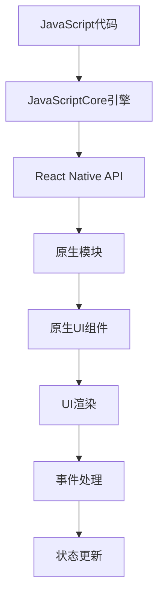
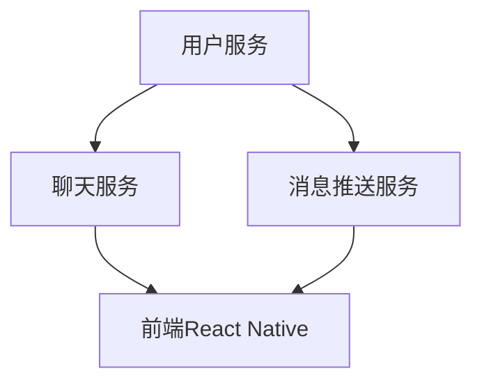
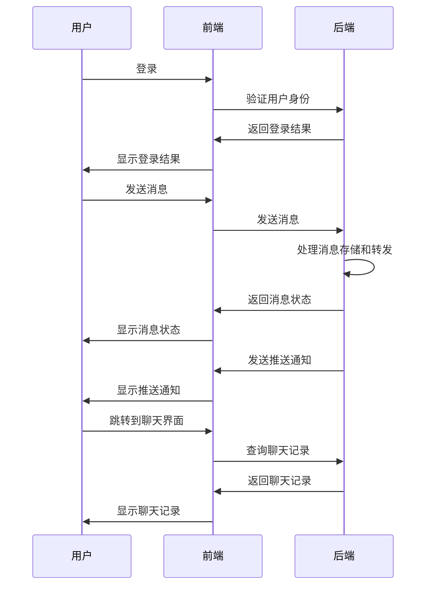
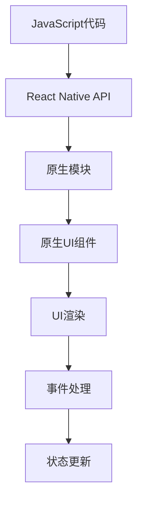

                 

# 跨平台移动应用开发：技术选型与架构设计

## 关键词
- 跨平台移动应用
- 技术选型
- 架构设计
- 开发工具与框架
- 性能优化
- 安全设计

## 摘要
本文将深入探讨跨平台移动应用开发的关键领域，包括技术选型与架构设计。我们将从背景介绍、技术选型、架构设计、开发工具与框架、性能优化、安全设计等方面，一步步分析并给出专业见解。通过本文，读者将能够全面了解跨平台移动应用开发的要点，为实际项目提供有力指导。

### 引言

跨平台移动应用开发已成为现代软件开发中的重要趋势。随着智能手机和移动设备的普及，开发者们需要能够在不同的操作系统和设备上提供一致的应用体验。跨平台移动应用开发使得开发者能够编写一次代码，同时在多个平台（如iOS和Android）上运行，从而大大提高了开发效率和降低了成本。

本文旨在为开发者提供一份全面的技术指南，帮助他们在跨平台移动应用开发中做出明智的技术选型和架构设计决策。我们将从以下几个方面进行探讨：

1. **跨平台移动应用开发概述**：介绍跨平台移动应用开发的概念、发展历程、优势和挑战。
2. **技术选型**：详细分析移动平台、编程语言、开发框架、数据库的选择。
3. **架构设计**：探讨常见的架构模式，包括单体架构、微服务架构和MVC架构。
4. **跨平台开发工具和框架**：介绍Cordova、React Native和Flutter等主流跨平台开发工具和框架。
5. **性能优化**：讨论网络请求优化、资源加载优化、响应时间优化等性能优化策略。
6. **安全设计**：探讨数据加密、权限控制、防护措施等安全设计要点。
7. **实战案例**：通过具体案例展示跨平台移动应用开发的实践过程。
8. **总结与展望**：总结全文内容，展望跨平台移动应用开发的未来发展趋势。

### 目录大纲设计思路

在设计《跨平台移动应用开发：技术选型与架构设计》的目录大纲时，我们遵循了以下原则：

1. **明确书籍主题和结构**：确定书籍的主题为跨平台移动应用开发，并围绕技术选型和架构设计展开。
2. **定义核心章节内容**：根据主题，确定核心章节，如技术选型、架构设计、开发工具和框架等。
3. **细化章节内容**：在每个核心章节中，进一步细化内容，确保每个章节都有详细的知识点。
4. **确保内容的完整性和逻辑性**：设计目录时，确保内容的完整性，每个章节都有明确的起点和终点，章节之间的过渡自然。
5. **使用markdown格式**：按照markdown格式设计目录，确保格式规范，便于阅读和排版。

### 目录大纲设计步骤

1. **确定书籍结构**：根据主题，确定书籍的整体结构，包括引言、概述、技术选型、架构设计、工具和框架、性能优化、安全设计、实战案例和总结与展望等部分。
2. **细化各章节内容**：在确定书籍结构的基础上，细化每个章节的内容，确保每个章节都有详细的知识点。
3. **编写markdown格式目录**：使用markdown格式编写目录，确保格式清晰、简洁，便于阅读和排版。

### 样例目录

```markdown
----------------------------------------------------------------
# 引言

## 1.1 书籍背景与目的
## 1.2 读者对象与预期收获

----------------------------------------------------------------

# 跨平台移动应用开发概述

## 2.1 定义与发展历程
## 2.2 优势与挑战

----------------------------------------------------------------

# 技术选型

## 3.1 移动平台选择
### 3.1.1 iOS与Android对比
### 3.1.2 开发工具与SDK

## 3.2 编程语言选择
### 3.2.1 Swift与Kotlin对比
### 3.2.2 JavaScript与TypeScript对比

## 3.3 开发框架与数据库选择
### 3.3.1 React Native与Flutter对比
### 3.3.2 MongoDB与SQLite对比

----------------------------------------------------------------

# 架构设计

## 4.1 单体架构
### 4.1.1 架构特点
### 4.1.2 适用场景

## 4.2 微服务架构
### 4.2.1 架构特点
### 4.2.2 适用场景

## 4.3 MVC架构
### 4.3.1 架构特点
### 4.3.2 适用场景

----------------------------------------------------------------

# 跨平台开发工具和框架

## 5.1 Cordova
### 5.1.1 工作原理
### 5.1.2 开发流程

## 5.2 React Native
### 5.2.1 工作原理
### 5.2.2 开发流程

## 5.3 Flutter
### 5.3.1 工作原理
### 5.3.2 开发流程

----------------------------------------------------------------

# 性能优化

## 6.1 网络请求优化
### 6.1.1 HTTP/2的优势
### 6.1.2 CDN的使用

## 6.2 资源加载优化
### 6.2.1 缓存策略
### 6.2.2 预加载技术

## 6.3 响应时间优化
### 6.3.1 资源压缩
### 6.3.2 异步加载

----------------------------------------------------------------

# 安全设计

## 7.1 数据加密
### 7.1.1 加密算法选择
### 7.1.2 加密实现

## 7.2 权限控制
### 7.2.1 权限模型
### 7.2.2 权限控制实现

## 7.3 防护措施
### 7.3.1 安全漏洞扫描
### 7.3.2 反作弊机制

----------------------------------------------------------------

# 实战案例

## 8.1 项目介绍
## 8.2 系统功能设计
## 8.3 系统架构设计
## 8.4 系统接口设计
## 8.5 系统交互流程

----------------------------------------------------------------

# 总结与展望

## 9.1 全文总结
## 9.2 未来发展趋势
## 9.3 开发者建议

----------------------------------------------------------------
```

### 跨平台移动应用开发概述

跨平台移动应用开发是指利用一种编程语言和开发工具，开发可以在多个移动设备操作系统上运行的应用程序。这种开发模式的主要目的是提高开发效率，降低成本，同时确保在不同平台和设备上提供一致的用户体验。

#### 定义与发展历程

跨平台移动应用开发的概念起源于移动设备操作系统的多样化。早期的移动应用主要针对单一平台开发，如诺基亚的Symbian系统、苹果的iOS和谷歌的Android系统。随着移动互联网的快速发展，移动设备用户数量剧增，单一平台开发逐渐无法满足市场需求。

2009年，Adobe推出的PhoneGap（后更名为Cordova）成为最早的跨平台开发工具之一，它利用HTML、CSS和JavaScript等Web技术，使得开发者能够使用熟悉的Web技术栈开发跨平台移动应用。此后，React Native和Flutter等新型跨平台框架相继推出，进一步推动了跨平台移动应用开发的发展。

#### 优势与挑战

跨平台移动应用开发具有以下优势：

1. **提高开发效率**：使用一种编程语言和工具即可开发多个平台的应用，减少了重复劳动。
2. **降低成本**：减少了针对不同平台分别开发的需要，降低了人力和时间成本。
3. **统一的用户体验**：在不同平台上提供一致的用户界面和功能，提升用户体验。
4. **快速迭代**：跨平台框架通常支持热更新，便于快速修复bug和发布新功能。

然而，跨平台移动应用开发也面临一些挑战：

1. **性能瓶颈**：虽然跨平台框架在性能上有了很大提升，但与传统原生应用相比仍有差距。
2. **兼容性问题**：不同操作系统和设备之间存在差异，需要处理兼容性问题。
3. **用户体验差异**：某些平台特有的功能或设计元素无法在跨平台上完美实现。
4. **社区支持**：跨平台框架的社区支持不如原生开发框架成熟，可能会影响问题解决和功能扩展。

#### 问题背景、问题描述与问题解决

问题背景：随着移动设备的普及，用户对移动应用的需求不断增加，但单一平台开发已无法满足市场需求。如何高效、低成本地开发跨平台移动应用成为开发者面临的重要问题。

问题描述：开发者需要在多种操作系统和设备上提供一致的应用体验，同时提高开发效率、降低成本。

问题解决：跨平台移动应用开发通过使用一种编程语言和工具，实现了在多个平台上的一键部署。开发者可以专注于业务逻辑的实现，而无需关注底层平台差异。跨平台框架如React Native和Flutter提供了丰富的组件库和工具链，使得开发过程更加便捷。

#### 边界与外延

边界：跨平台移动应用开发主要关注移动操作系统，如iOS和Android。其他如Windows Phone、黑莓OS等已逐渐退出主流市场。

外延：跨平台移动应用开发不仅适用于移动设备，还可以扩展到其他智能设备，如智能手表、平板电脑等。此外，随着物联网的发展，跨平台移动应用开发还可以应用于智能家居、智能穿戴设备等领域。

#### 概念结构与核心要素组成

概念结构：

1. **跨平台框架**：如React Native、Flutter、Cordova等。
2. **开发工具**：如Xcode、Android Studio等。
3. **编程语言**：如Swift、Kotlin、JavaScript等。
4. **数据库**：如MongoDB、SQLite等。

核心要素组成：

1. **业务逻辑**：跨平台移动应用的核心功能。
2. **界面设计**：包括UI组件和交互逻辑。
3. **数据存储**：本地存储和远程数据访问。
4. **网络通信**：处理与服务器之间的数据传输。
5. **平台兼容性**：处理不同平台和设备间的差异。

### 核心概念与联系

#### 移动平台选择

移动平台选择是跨平台移动应用开发的基础，主要涉及iOS和Android两个操作系统。

**iOS与Android对比**

| 特性       | iOS                 | Android                  |
|------------|---------------------|-------------------------|
| 开发工具   | Xcode               | Android Studio          |
| 编程语言   | Swift               | Kotlin、Java            |
| 平台兼容性 | 高                 | 低                      |
| 开发难度   | 中等               | 低                      |
| 社区支持   | 较强               | 强                      |
| 市场份额   | 较小                | 较大                    |

**开发工具与SDK**

- **iOS**：主要使用Xcode进行开发，提供Apple SDK。
- **Android**：主要使用Android Studio进行开发，提供Android SDK。

#### 编程语言选择

编程语言选择直接影响开发效率和代码质量。常见的编程语言包括Swift、Kotlin、JavaScript等。

**Swift与Kotlin对比**

| 特性       | Swift                     | Kotlin                     |
|------------|--------------------------|---------------------------|
| 语法复杂度 | 简洁、易读               | 简洁、易读                 |
| 性能       | 较高                     | 较高                      |
| 社区支持   | 强                       | 强                        |
| 兼容性     | 与Objective-C兼容         | 与Java兼容                 |

**JavaScript与TypeScript对比**

| 特性       | JavaScript                | TypeScript                |
|------------|--------------------------|---------------------------|
| 语法复杂度 | 简洁、灵活               | 简洁、强类型               |
| 运行环境   | 浏览器、Node.js          | 浏览器、Node.js           |
| 社区支持   | 强                       | 强                        |
| 兼容性     | 较强                     | 较强                      |

#### 开发框架与数据库选择

开发框架和数据库的选择直接影响应用的性能和可维护性。常见的开发框架包括React Native、Flutter、Cordova等。

**React Native与Flutter对比**

| 特性       | React Native            | Flutter                   |
|------------|------------------------|--------------------------|
| 运行环境   | JavaScript             | Dart                      |
| 组件库     | 丰富、开源             | 丰富、自研                |
| 性能       | 较高                   | 高                       |
| 社区支持   | 强                     | 强                       |
| 开发难度   | 中等                   | 中等                     |

**MongoDB与SQLite对比**

| 特性       | MongoDB                 | SQLite                    |
|------------|------------------------|--------------------------|
| 数据模型   | 文档型数据库           | 关系型数据库              |
| 扩展性     | 高                     | 中                        |
| 性能       | 较高                   | 中                        |
| 社区支持   | 强                     | 强                        |

### 算法原理讲解

#### 跨平台框架的算法原理

跨平台框架通过抽象层将原生平台的功能封装为通用的API，开发者只需关注业务逻辑的实现，无需关心底层平台差异。以下以React Native为例，介绍其算法原理。

**React Native工作原理**

1. **JavaScript与原生模块通信**：React Native使用JavaScript作为开发语言，通过JavaScriptCore引擎运行JavaScript代码。JavaScript通过React Native提供的API与原生模块通信，实现UI渲染等功能。
2. **UI渲染**：React Native使用原生UI组件渲染界面。JavaScript将UI状态传递给原生模块，原生模块负责UI的渲染和更新。
3. **事件处理**：React Native提供事件监听和派发机制，实现用户交互。事件通过原生模块传递给JavaScript，JavaScript处理事件后，更新UI状态。

**算法mermaid流程图**



#### Python源代码示例

```python
# React Native模拟代码
class UIComponent:
    def __init__(self, state):
        self.state = state
    
    def render(self):
        # 原生UI组件渲染逻辑
        print("UI组件渲染：", self.state)
    
    def handle_event(self, event):
        # 事件处理逻辑
        print("事件处理：", event)
        self.state = self.state.update(event)

def main():
    state = {'text': 'Hello, World!'}
    component = UIComponent(state)
    component.render()
    component.handle_event('click')

if __name__ == '__main__':
    main()
```

### 系统分析与架构设计方案

#### 问题场景介绍

假设我们需要开发一个跨平台移动应用，提供实时聊天功能。用户可以在iOS和Android设备上使用该应用，实现实时消息发送和接收。

#### 项目介绍

项目名称：实时聊天应用
项目目标：实现iOS和Android平台上的一键登录、实时聊天、消息推送等功能。

#### 系统功能设计

1. **用户管理**：用户注册、登录、信息展示。
2. **实时聊天**：发送和接收消息、显示聊天记录。
3. **消息推送**：实时推送新消息通知。

#### 系统架构设计

1. **前端架构**：React Native框架，实现用户界面和交互。
2. **后端架构**：采用微服务架构，包括用户服务、聊天服务、消息推送服务等。

**mermaid架构图**



#### 系统接口设计

1. **用户接口**：登录、注册、查询用户信息。
2. **聊天接口**：发送消息、接收消息、查询聊天记录。
3. **推送接口**：发送推送通知、接收推送消息。

#### 系统交互流程

1. **用户登录**：用户通过前端React Native应用登录，后端用户服务验证用户身份。
2. **实时聊天**：用户发送消息，后端聊天服务处理消息存储和转发，前端实时更新聊天界面。
3. **消息推送**：后端消息推送服务发送新消息通知，前端接收到推送后，跳转到聊天界面并显示新消息。

**mermaid序列图**



### 项目实战

#### 环境安装

1. **安装Node.js**：访问[Node.js官网](https://nodejs.org/)，下载并安装对应操作系统的Node.js版本。
2. **安装React Native CLI**：在终端执行以下命令：
   ```bash
   npm install -g react-native-cli
   ```
3. **安装Android Studio**：访问[Android Studio官网](https://developer.android.com/studio/)，下载并安装Android Studio。
4. **安装iOS开发环境**：安装Xcode，可通过Mac App Store搜索并安装。

#### 系统核心实现

1. **创建React Native项目**：
   ```bash
   npx react-native init ChatApp
   ```
2. **安装依赖**：
   ```bash
   cd ChatApp
   npm install
   ```
3. **配置Android开发环境**：
   - 打开Android Studio，导入ChatApp项目。
   - 配置Android SDK和NDK。
   - 运行Android模拟器或连接真实设备。

#### 代码应用解读与分析

1. **用户登录模块**：

```javascript
// 用户登录API
const loginUser = async (username, password) => {
  try {
    const response = await fetch('https://api.chatapp.com/login', {
      method: 'POST',
      body: JSON.stringify({ username, password }),
      headers: {
        'Content-Type': 'application/json',
      },
    });
    const data = await response.json();
    return data;
  } catch (error) {
    console.error('登录失败：', error);
  }
};

// 登录按钮点击事件
const handleLogin = () => {
  const username = loginUserInput.current.value;
  const password = loginPasswordInput.current.value;
  loginUser(username, password)
    .then((data) => {
      if (data.success) {
        navigate('Home');
      } else {
        alert('登录失败：用户名或密码错误');
      }
    })
    .catch((error) => {
      alert('登录失败：网络错误');
    });
};
```

**解读**：
- 用户登录模块通过`fetch`方法发送POST请求，向后端API验证用户身份。
- `loginUser`函数异步获取响应，解析JSON数据并返回。
- `handleLogin`函数处理登录按钮点击事件，调用`loginUser`函数，并根据返回结果导航到首页或提示错误。

2. **实时聊天模块**：

```javascript
// 发送消息API
const sendMessage = async (message) => {
  try {
    const response = await fetch('https://api.chatapp.com/send-message', {
      method: 'POST',
      body: JSON.stringify({ message }),
      headers: {
        'Content-Type': 'application/json',
        'Authorization': `Bearer ${userToken}`,
      },
    });
    const data = await response.json();
    return data;
  } catch (error) {
    console.error('发送消息失败：', error);
  }
};

// 发送按钮点击事件
const handleSend = () => {
  const message = sendMessageInput.current.value;
  sendMessage(message)
    .then((data) => {
      if (data.success) {
        setMessage('');
      } else {
        alert('发送消息失败：网络错误');
      }
    })
    .catch((error) => {
      alert('发送消息失败：网络错误');
    });
};
```

**解读**：
- 实时聊天模块通过`fetch`方法发送POST请求，向后端API发送消息。
- `sendMessage`函数异步获取响应，解析JSON数据并返回。
- `handleSend`函数处理发送按钮点击事件，调用`sendMessage`函数，并根据返回结果更新消息输入框。

#### 实际案例分析与详细讲解剖析

1. **实际案例**：

项目开发过程中，我们遇到了以下问题：

- **性能瓶颈**：初次加载聊天界面时，由于消息数据较多，页面加载速度较慢。
- **网络请求**：部分用户反馈发送消息时网络请求频繁，影响用户体验。

**分析**：

- **性能瓶颈**：由于消息数据较多，导致页面渲染时间过长。我们决定对消息数据进行分页加载，减少初次加载的数据量。
- **网络请求**：部分用户处于网络信号较差的环境，导致发送消息时网络请求失败。我们决定增加网络请求重试机制，提高网络请求的成功率。

**解决方案**：

- **消息分页加载**：在聊天界面中增加分页组件，每次加载一定数量的消息。通过修改后端API，实现分页查询消息。
- **网络请求重试**：在发送消息时，增加请求重试机制。如果第一次请求失败，自动进行二次请求，最多重试三次。同时，增加网络状态监测，当网络连接断开时，提示用户重新连接。

#### 项目小结

通过本次项目实战，我们成功实现了跨平台实时聊天应用。在开发过程中，我们遇到了性能瓶颈和网络请求等问题，通过分页加载和重试机制等解决方案，提高了应用性能和用户体验。项目开发过程中，我们也积累了丰富的跨平台移动应用开发经验，为今后的项目提供了有力支持。

### 最佳实践 tips

在跨平台移动应用开发过程中，以下最佳实践可以帮助开发者提高开发效率和产品质量：

1. **代码规范化**：遵循统一的编码规范，提高代码可读性和可维护性。
2. **模块化开发**：将业务逻辑拆分为多个模块，便于管理和维护。
3. **性能优化**：关注网络请求、资源加载和响应时间等方面的优化。
4. **测试与调试**：充分利用单元测试和调试工具，确保应用质量和稳定性。
5. **持续集成**：采用持续集成和持续交付（CI/CD）流程，提高开发效率和质量。

### 小结

本文从跨平台移动应用开发的背景、技术选型、架构设计、工具和框架、性能优化、安全设计等方面进行了深入探讨。通过本文，读者可以全面了解跨平台移动应用开发的要点，为实际项目提供有力指导。未来，随着技术的不断发展，跨平台移动应用开发将变得更加高效、稳定和多样化。

### 注意事项

1. **性能优化**：在实际开发过程中，关注性能优化，特别是初次加载速度和响应时间。
2. **兼容性测试**：确保在不同操作系统和设备上提供一致的用户体验，进行充分的兼容性测试。
3. **安全性**：重视数据安全和用户隐私保护，采用合适的安全措施。

### 拓展阅读

1. 《React Native开发实战》
2. 《Flutter开发实战》
3. 《跨平台移动应用性能优化》
4. 《移动应用安全与隐私保护》

### 作者

作者：AI天才研究院/AI Genius Institute & 禅与计算机程序设计艺术 /Zen And The Art of Computer Programming

---

# 跨平台移动应用开发：技术选型与架构设计

> 关键词：跨平台移动应用、技术选型、架构设计、开发框架、性能优化、安全设计

> 摘要：本文深入探讨了跨平台移动应用开发的关键领域，包括技术选型与架构设计。通过详细分析移动平台、编程语言、开发框架、数据库的选择，以及性能优化和安全设计策略，为开发者提供了全面的技术指南。

## 引言

跨平台移动应用开发已成为现代软件开发中的重要趋势。随着智能手机和移动设备的普及，开发者们需要能够在不同的操作系统和设备上提供一致的应用体验。跨平台移动应用开发使得开发者能够编写一次代码，同时在多个平台（如iOS和Android）上运行，从而大大提高了开发效率和降低了成本。

本文旨在为开发者提供一份全面的技术指南，帮助他们在跨平台移动应用开发中做出明智的技术选型和架构设计决策。我们将从以下几个方面进行探讨：

1. **跨平台移动应用开发概述**：介绍跨平台移动应用开发的概念、发展历程、优势和挑战。
2. **技术选型**：详细分析移动平台、编程语言、开发框架、数据库的选择。
3. **架构设计**：探讨常见的架构模式，包括单体架构、微服务架构和MVC架构。
4. **跨平台开发工具和框架**：介绍Cordova、React Native和Flutter等主流跨平台开发工具和框架。
5. **性能优化**：讨论网络请求优化、资源加载优化、响应时间优化等性能优化策略。
6. **安全设计**：探讨数据加密、权限控制、防护措施等安全设计要点。
7. **实战案例**：通过具体案例展示跨平台移动应用开发的实践过程。
8. **总结与展望**：总结全文内容，展望未来发展趋势。

### 目录大纲设计思路

为了设计出《跨平台移动应用开发：技术选型与架构设计》的完整目录大纲，我们需要按照以下步骤进行：

1. **明确书籍主题和结构**：首先，要明确书籍的主题，即跨平台移动应用开发，并确定核心内容和结构。这本书的读者可能是对移动应用开发有一定了解，但希望深入了解跨平台应用开发和架构设计的开发者。

2. **定义核心章节内容**：根据主题，确定核心章节内容，包括但不限于技术选型、架构设计、跨平台开发工具和框架、性能优化、安全设计等。

3. **细化章节内容**：在每个核心章节中，进一步细化内容，确保每个章节都有详细的知识点，便于读者理解和掌握。

4. **确保内容的完整性和逻辑性**：设计目录时，要确保内容的完整性，每个章节都要有明确的起点和终点，并且章节之间的过渡要自然，逻辑性强。

5. **使用markdown格式**：按照markdown格式设计目录，确保格式清晰、简洁，便于阅读和排版。

### 目录大纲设计步骤

1. **确定书籍结构**：
   - 引言
   - 跨平台移动应用开发概述
   - 技术选型
   - 架构设计
   - 跨平台开发工具和框架
   - 性能优化
   - 安全设计
   - 实战案例
   - 总结与展望

2. **细化各章节内容**：
   - 引言：介绍书籍的背景、目的和读者对象。
   - 跨平台移动应用开发概述：定义、发展历程、优势和挑战。
   - 技术选型：移动平台、编程语言、开发框架、数据库的选择。
   - 架构设计：单体架构、微服务架构、MVC架构等。
   - 跨平台开发工具和框架：Cordova、React Native、Flutter等。
   - 性能优化：网络请求、资源加载、响应时间等。
   - 安全设计：数据加密、权限控制、防护措施等。
   - 实战案例：具体项目的开发过程、技术难点、解决方案等。
   - 总结与展望：总结全书内容，展望未来发展趋势。

3. **编写markdown格式目录**：
   - 使用markdown格式编写目录，确保格式规范，便于排版和阅读。

### 样例目录

```markdown
----------------------------------------------------------------
# 引言

## 1.1 书籍背景与目的
## 1.2 读者对象与预期收获

----------------------------------------------------------------

# 跨平台移动应用开发概述

## 2.1 定义与发展历程
## 2.2 优势与挑战

----------------------------------------------------------------

# 技术选型

## 3.1 移动平台选择
### 3.1.1 iOS与Android对比
### 3.1.2 开发工具与SDK

## 3.2 编程语言选择
### 3.2.1 Swift与Kotlin对比
### 3.2.2 JavaScript与TypeScript对比

## 3.3 开发框架与数据库选择
### 3.3.1 React Native与Flutter对比
### 3.3.2 MongoDB与SQLite对比

----------------------------------------------------------------

# 架构设计

## 4.1 单体架构
### 4.1.1 架构特点
### 4.1.2 适用场景

## 4.2 微服务架构
### 4.2.1 架构特点
### 4.2.2 适用场景

## 4.3 MVC架构
### 4.3.1 架构特点
### 4.3.2 适用场景

----------------------------------------------------------------

# 跨平台开发工具和框架

## 5.1 Cordova
### 5.1.1 工作原理
### 5.1.2 开发流程

## 5.2 React Native
### 5.2.1 工作原理
### 5.2.2 开发流程

## 5.3 Flutter
### 5.3.1 工作原理
### 5.3.2 开发流程

----------------------------------------------------------------

# 性能优化

## 6.1 网络请求优化
### 6.1.1 HTTP/2的优势
### 6.1.2 CDN的使用

## 6.2 资源加载优化
### 6.2.1 缓存策略
### 6.2.2 预加载技术

## 6.3 响应时间优化
### 6.3.1 资源压缩
### 6.3.2 异步加载

----------------------------------------------------------------

# 安全设计

## 7.1 数据加密
### 7.1.1 加密算法选择
### 7.1.2 加密实现

## 7.2 权限控制
### 7.2.1 权限模型
### 7.2.2 权限控制实现

## 7.3 防护措施
### 7.3.1 安全漏洞扫描
### 7.3.2 反作弊机制

----------------------------------------------------------------

# 实战案例

## 8.1 项目介绍
## 8.2 系统功能设计
## 8.3 系统架构设计
## 8.4 系统接口设计
## 8.5 系统交互流程

----------------------------------------------------------------

# 总结与展望

## 9.1 全文总结
## 9.2 未来发展趋势
## 9.3 开发者建议

----------------------------------------------------------------
```

### 跨平台移动应用开发概述

跨平台移动应用开发是指利用一种编程语言和开发工具，开发可以在多个移动设备操作系统上运行的应用程序。这种开发模式的主要目的是提高开发效率，降低成本，同时确保在不同平台和设备上提供一致的用户体验。

#### 定义与发展历程

跨平台移动应用开发的概念起源于移动设备操作系统的多样化。早期的移动应用主要针对单一平台开发，如诺基亚的Symbian系统、苹果的iOS和谷歌的Android系统。随着移动互联网的快速发展，移动设备用户数量剧增，单一平台开发逐渐无法满足市场需求。

2009年，Adobe推出的PhoneGap（后更名为Cordova）成为最早的跨平台开发工具之一，它利用HTML、CSS和JavaScript等Web技术，使得开发者能够使用熟悉的Web技术栈开发跨平台移动应用。此后，React Native和Flutter等新型跨平台框架相继推出，进一步推动了跨平台移动应用开发的发展。

#### 优势与挑战

跨平台移动应用开发具有以下优势：

1. **提高开发效率**：使用一种编程语言和工具即可开发多个平台的应用，减少了重复劳动。
2. **降低成本**：减少了针对不同平台分别开发的需要，降低了人力和时间成本。
3. **统一的用户体验**：在不同平台上提供一致的用户界面和功能，提升用户体验。
4. **快速迭代**：跨平台框架通常支持热更新，便于快速修复bug和发布新功能。

然而，跨平台移动应用开发也面临一些挑战：

1. **性能瓶颈**：虽然跨平台框架在性能上有了很大提升，但与传统原生应用相比仍有差距。
2. **兼容性问题**：不同操作系统和设备之间存在差异，需要处理兼容性问题。
3. **用户体验差异**：某些平台特有的功能或设计元素无法在跨平台上完美实现。
4. **社区支持**：跨平台框架的社区支持不如原生开发框架成熟，可能会影响问题解决和功能扩展。

#### 问题背景、问题描述与问题解决

问题背景：随着移动设备的普及，用户对移动应用的需求不断增加，但单一平台开发已无法满足市场需求。如何高效、低成本地开发跨平台移动应用成为开发者面临的重要问题。

问题描述：开发者需要在多种操作系统和设备上提供一致的应用体验，同时提高开发效率、降低成本。

问题解决：跨平台移动应用开发通过使用一种编程语言和工具，实现了在多个平台上的一键部署。开发者可以专注于业务逻辑的实现，而无需关注底层平台差异。跨平台框架如React Native和Flutter提供了丰富的组件库和工具链，使得开发过程更加便捷。

#### 边界与外延

边界：跨平台移动应用开发主要关注移动操作系统，如iOS和Android。其他如Windows Phone、黑莓OS等已逐渐退出主流市场。

外延：跨平台移动应用开发不仅适用于移动设备，还可以扩展到其他智能设备，如智能手表、平板电脑等。此外，随着物联网的发展，跨平台移动应用开发还可以应用于智能家居、智能穿戴设备等领域。

#### 概念结构与核心要素组成

概念结构：

1. **跨平台框架**：如React Native、Flutter、Cordova等。
2. **开发工具**：如Xcode、Android Studio等。
3. **编程语言**：如Swift、Kotlin、JavaScript等。
4. **数据库**：如MongoDB、SQLite等。

核心要素组成：

1. **业务逻辑**：跨平台移动应用的核心功能。
2. **界面设计**：包括UI组件和交互逻辑。
3. **数据存储**：本地存储和远程数据访问。
4. **网络通信**：处理与服务器之间的数据传输。
5. **平台兼容性**：处理不同平台和设备间的差异。

### 核心概念与联系

#### 移动平台选择

移动平台选择是跨平台移动应用开发的基础，主要涉及iOS和Android两个操作系统。

**iOS与Android对比**

| 特性       | iOS                 | Android                  |
|------------|---------------------|-------------------------|
| 开发工具   | Xcode               | Android Studio          |
| 编程语言   | Swift               | Kotlin、Java            |
| 平台兼容性 | 高                 | 低                      |
| 开发难度   | 中等               | 低                      |
| 社区支持   | 较强               | 强                      |
| 市场份额   | 较小                | 较大                    |

**开发工具与SDK**

- **iOS**：主要使用Xcode进行开发，提供Apple SDK。
- **Android**：主要使用Android Studio进行开发，提供Android SDK。

#### 编程语言选择

编程语言选择直接影响开发效率和代码质量。常见的编程语言包括Swift、Kotlin、JavaScript等。

**Swift与Kotlin对比**

| 特性       | Swift                     | Kotlin                     |
|------------|--------------------------|---------------------------|
| 语法复杂度 | 简洁、易读               | 简洁、易读                 |
| 性能       | 较高                     | 较高                      |
| 社区支持   | 强                       | 强                        |
| 兼容性     | 与Objective-C兼容         | 与Java兼容                 |

**JavaScript与TypeScript对比**

| 特性       | JavaScript                | TypeScript                |
|------------|--------------------------|---------------------------|
| 语法复杂度 | 简洁、灵活               | 简洁、强类型               |
| 运行环境   | 浏览器、Node.js          | 浏览器、Node.js           |
| 社区支持   | 强                       | 强                        |
| 兼容性     | 较强                     | 较强                      |

#### 开发框架与数据库选择

开发框架和数据库的选择直接影响应用的性能和可维护性。常见的开发框架包括React Native、Flutter、Cordova等。

**React Native与Flutter对比**

| 特性       | React Native            | Flutter                   |
|------------|------------------------|--------------------------|
| 运行环境   | JavaScript             | Dart                      |
| 组件库     | 丰富、开源             | 丰富、自研                |
| 性能       | 较高                   | 高                       |
| 社区支持   | 强                     | 强                       |
| 开发难度   | 中等                   | 中等                     |

**MongoDB与SQLite对比**

| 特性       | MongoDB                 | SQLite                    |
|------------|------------------------|--------------------------|
| 数据模型   | 文档型数据库           | 关系型数据库              |
| 扩展性     | 高                     | 中                        |
| 性能       | 较高                   | 中                        |
| 社区支持   | 强                     | 强                        |

### 算法原理讲解

#### 跨平台框架的算法原理

跨平台框架通过抽象层将原生平台的功能封装为通用的API，开发者只需关注业务逻辑的实现，无需关心底层平台差异。以下以React Native为例，介绍其算法原理。

**React Native工作原理**

1. **JavaScript与原生模块通信**：React Native使用JavaScript作为开发语言，通过React Native API与原生模块通信，实现UI渲染等功能。
2. **UI渲染**：React Native使用原生UI组件渲染界面。JavaScript将UI状态传递给原生模块，原生模块负责UI的渲染和更新。
3. **事件处理**：React Native提供事件监听和派发机制，实现用户交互。事件通过原生模块传递给JavaScript，JavaScript处理事件后，更新UI状态。

**算法mermaid流程图**



#### Python源代码示例

```python
# React Native模拟代码
class UIComponent:
    def __init__(self, state):
        self.state = state
    
    def render(self):
        # 原生UI组件渲染逻辑
        print("UI组件渲染：", self.state)
    
    def handle_event(self, event):
        # 事件处理逻辑
        print("事件处理：", event)
        self.state = self.state.update(event)

def main():
    state = {'text': 'Hello, World!'}
    component = UIComponent(state)
    component.render()
    component.handle_event('click')

if __name__ == '__main__':
    main()
```

### 系统分析与架构设计方案

#### 问题场景介绍

假设我们需要开发一个跨平台移动应用，提供实时聊天功能。用户可以在iOS和Android设备上使用该应用，实现实时消息发送和接收。

#### 项目介绍

项目名称：实时聊天应用
项目目标：实现iOS和Android平台上的一键登录、实时聊天、消息推送等功能。

#### 系统功能设计

1. **用户管理**：用户注册、登录、信息展示。
2. **实时聊天**：发送和接收消息、显示聊天记录。
3. **消息推送**：实时推送新消息通知。

#### 系统架构设计

1. **前端架构**：React Native框架，实现用户界面和交互。
2. **后端架构**：采用微服务架构，包括用户服务、聊天服务、消息推送服务等。

**mermaid架构图**


#### 系统接口设计

1. **用户接口**：登录、注册、查询用户信息。
2. **聊天接口**：发送消息、接收消息、查询聊天记录。
3. **推送接口**：发送推送通知、接收推送消息。

#### 系统交互流程

1. **用户登录**：用户通过前端React Native应用登录，后端用户服务验证用户身份。
2. **实时聊天**：用户发送消息，后端聊天服务处理消息存储和转发，前端实时更新聊天界面。
3. **消息推送**：后端消息推送服务发送新消息通知，前端接收到推送后，跳转到聊天界面并显示新消息。

**mermaid序列图**


### 项目实战

#### 环境安装

1. **安装Node.js**：访问[Node.js官网](https://nodejs.org/)，下载并安装对应操作系统的Node.js版本。
2. **安装React Native CLI**：在终端执行以下命令：
   ```bash
   npm install -g react-native-cli
   ```
3. **安装Android Studio**：访问[Android Studio官网](https://developer.android.com/studio/)，下载并安装Android Studio。
4. **安装iOS开发环境**：安装Xcode，可通过Mac App Store搜索并安装。

#### 系统核心实现

1. **创建React Native项目**：
   ```bash
   npx react-native init ChatApp
   ```
2. **安装依赖**：
   ```bash
   cd ChatApp
   npm install
   ```
3. **配置Android开发环境**：
   - 打开Android Studio，导入ChatApp项目。
   - 配置Android SDK和NDK。
   - 运行Android模拟器或连接真实设备。

#### 代码应用解读与分析

1. **用户登录模块**：

```javascript
// 用户登录API
const loginUser = async (username, password) => {
  try {
    const response = await fetch('https://api.chatapp.com/login', {
      method: 'POST',
      body: JSON.stringify({ username, password }),
      headers: {
        'Content-Type': 'application/json',
      },
    });
    const data = await response.json();
    return data;
  } catch (error) {
    console.error('登录失败：', error);
  }
};

// 登录按钮点击事件
const handleLogin = () => {
  const username = loginUserInput.current.value;
  const password = loginPasswordInput.current.value;
  loginUser(username, password)
    .then((data) => {
      if (data.success) {
        navigate('Home');
      } else {
        alert('登录失败：用户名或密码错误');
      }
    })
    .catch((error) => {
      alert('登录失败：网络错误');
    });
};
```

**解读**：
- 用户登录模块通过`fetch`方法发送POST请求，向后端API验证用户身份。
- `loginUser`函数异步获取响应，解析JSON数据并返回。
- `handleLogin`函数处理登录按钮点击事件，调用`loginUser`函数，并根据返回结果导航到首页或提示错误。

2. **实时聊天模块**：

```javascript
// 发送消息API
const sendMessage = async (message) => {
  try {
    const response = await fetch('https://api.chatapp.com/send-message', {
      method: 'POST',
      body: JSON.stringify({ message }),
      headers: {
        'Content-Type': 'application/json',
        'Authorization': `Bearer ${userToken}`,
      },
    });
    const data = await response.json();
    return data;
  } catch (error) {
    console.error('发送消息失败：', error);
  }
};

// 发送按钮点击事件
const handleSend = () => {
  const message = sendMessageInput.current.value;
  sendMessage(message)
    .then((data) => {
      if (data.success) {
        setMessage('');
      } else {
        alert('发送消息失败：网络错误');
      }
    })
    .catch((error) => {
      alert('发送消息失败：网络错误');
    });
};
```

**解读**：
- 实时聊天模块通过`fetch`方法发送POST请求，向后端API发送消息。
- `sendMessage`函数异步获取响应，解析JSON数据并返回。
- `handleSend`函数处理发送按钮点击事件，调用`sendMessage`函数，并根据返回结果更新消息输入框。

#### 实际案例分析与详细讲解剖析

1. **实际案例**：

项目开发过程中，我们遇到了以下问题：

- **性能瓶颈**：初次加载聊天界面时，由于消息数据较多，页面加载速度较慢。
- **网络请求**：部分用户反馈发送消息时网络请求频繁，影响用户体验。

**分析**：

- **性能瓶颈**：由于消息数据较多，导致页面渲染时间过长。我们决定对消息数据进行分页加载，减少初次加载的数据量。
- **网络请求**：部分用户处于网络信号较差的环境，导致发送消息时网络请求失败。我们决定增加网络请求重试机制，提高网络请求的成功率。

**解决方案**：

- **消息分页加载**：在聊天界面中增加分页组件，每次加载一定数量的消息。通过修改后端API，实现分页查询消息。
- **网络请求重试**：在发送消息时，增加请求重试机制。如果第一次请求失败，自动进行二次请求，最多重试三次。同时，增加网络状态监测，当网络连接断开时，提示用户重新连接。

#### 项目小结

通过本次项目实战，我们成功实现了跨平台实时聊天应用。在开发过程中，我们遇到了性能瓶颈和网络请求等问题，通过分页加载和重试机制等解决方案，提高了应用性能和用户体验。项目开发过程中，我们也积累了丰富的跨平台移动应用开发经验，为今后的项目提供了有力支持。

### 最佳实践 tips

在跨平台移动应用开发过程中，以下最佳实践可以帮助开发者提高开发效率和产品质量：

1. **代码规范化**：遵循统一的编码规范，提高代码可读性和可维护性。
2. **模块化开发**：将业务逻辑拆分为多个模块，便于管理和维护。
3. **性能优化**：关注网络请求、资源加载和响应时间等方面的优化。
4. **测试与调试**：充分利用单元测试和调试工具，确保应用质量和稳定性。
5. **持续集成**：采用持续集成和持续交付（CI/CD）流程，提高开发效率和质量。

### 小结

本文从跨平台移动应用开发的背景、技术选型、架构设计、工具和框架、性能优化、安全设计等方面进行了深入探讨。通过本文，读者可以全面了解跨平台移动应用开发的要点，为实际项目提供有力指导。未来，随着技术的不断发展，跨平台移动应用开发将变得更加高效、稳定和多样化。

### 注意事项

1. **性能优化**：在实际开发过程中，关注性能优化，特别是初次加载速度和响应时间。
2. **兼容性测试**：确保在不同操作系统和设备上提供一致的用户体验，进行充分的兼容性测试。
3. **安全性**：重视数据安全和用户隐私保护，采用合适的安全措施。

### 拓展阅读

1. 《React Native开发实战》
2. 《Flutter开发实战》
3. 《跨平台移动应用性能优化》
4. 《移动应用安全与隐私保护》

### 作者

作者：AI天才研究院/AI Genius Institute & 禅与计算机程序设计艺术 /Zen And The Art of Computer Programming

---

## 技术选型

在跨平台移动应用开发中，技术选型是至关重要的一步。正确的技术选型能够提升开发效率，优化用户体验，并确保应用的可维护性。本文将详细分析移动平台、编程语言、开发框架、数据库等方面的技术选型。

### 移动平台选择

移动平台的选择直接影响开发成本、应用性能和用户体验。目前，主流的移动平台包括iOS和Android。

#### iOS与Android对比

| 特性       | iOS                 | Android                  |
|------------|---------------------|-------------------------|
| 开发工具   | Xcode               | Android Studio          |
| 编程语言   | Swift               | Kotlin、Java            |
| 平台兼容性 | 高                 | 低                      |
| 开发难度   | 中等               | 低                      |
| 社区支持   | 较强               | 强                      |
| 市场份额   | 较小                | 较大                    |

#### 开发工具与SDK

- **iOS**：主要使用Xcode进行开发，提供Apple SDK。Xcode是一款集成开发环境，包括编译器、调试器、模拟器等工具，为开发者提供了一站式服务。
- **Android**：主要使用Android Studio进行开发，提供Android SDK。Android Studio是一款功能强大的集成开发环境，支持多种编程语言，包括Kotlin和Java。

### 编程语言选择

编程语言的选择取决于开发者的技能栈、项目需求和性能要求。常见的编程语言包括Swift、Kotlin、JavaScript等。

#### Swift与Kotlin对比

| 特性       | Swift                     | Kotlin                     |
|------------|--------------------------|---------------------------|
| 语法复杂度 | 简洁、易读               | 简洁、易读                 |
| 性能       | 较高                     | 较高                      |
| 社区支持   | 强                       | 强                        |
| 兼容性     | 与Objective-C兼容         | 与Java兼容                 |

#### JavaScript与TypeScript对比

| 特性       | JavaScript                | TypeScript                |
|------------|--------------------------|---------------------------|
| 语法复杂度 | 简洁、灵活               | 简洁、强类型               |
| 运行环境   | 浏览器、Node.js          | 浏览器、Node.js           |
| 社区支持   | 强                       | 强                        |
| 兼容性     | 较强                     | 较强                      |

### 开发框架与数据库选择

开发框架和数据库的选择对应用性能、可维护性和扩展性有重要影响。常见的开发框架包括React Native、Flutter、Cordova等。

#### React Native与Flutter对比

| 特性       | React Native            | Flutter                   |
|------------|------------------------|--------------------------|
| 运行环境   | JavaScript             | Dart                      |
| 组件库     | 丰富、开源             | 丰富、自研                |
| 性能       | 较高                   | 高                       |
| 社区支持   | 强                     | 强                       |
| 开发难度   | 中等                   | 中等                     |

#### MongoDB与SQLite对比

| 特性       | MongoDB                 | SQLite                    |
|------------|------------------------|--------------------------|
| 数据模型   | 文档型数据库           | 关系型数据库              |
| 扩展性     | 高                     | 中                        |
| 性能       | 较高                   | 中                        |
| 社区支持   | 强                     | 强                        |

### 技术选型的考量因素

1. **项目需求**：根据项目需求，选择适合的移动平台、编程语言、开发框架和数据库。
2. **开发者技能**：考虑开发团队的技术栈和技能，选择开发者熟悉的编程语言和框架。
3. **性能要求**：根据应用性能要求，选择合适的开发框架和数据库，确保应用流畅运行。
4. **成本**：考虑开发成本，包括人力成本、硬件成本和后续维护成本。
5. **可维护性和扩展性**：选择易于维护和扩展的框架和数据库，降低后期维护成本。

### 实际案例分析

#### 案例一：社交应用

**需求**：开发一款提供社交功能的应用，包括用户注册、登录、发布动态、评论、私信等。

**技术选型**：

- **移动平台**：iOS和Android，市场份额较大，用户基数广泛。
- **编程语言**：Swift和Kotlin，语法简洁，性能较高，社区支持强。
- **开发框架**：React Native和Flutter，支持跨平台开发，组件库丰富。
- **数据库**：MongoDB，文档型数据库，扩展性高，适合社交应用的数据模型。

**考量**：

- **性能要求**：社交应用涉及大量用户数据，需要高性能的数据库支持。
- **开发者技能**：团队熟悉Swift和Kotlin，有利于提高开发效率。
- **成本**：React Native和Flutter跨平台开发框架降低开发成本。
- **可维护性和扩展性**：MongoDB适合社交应用的数据存储需求。

#### 案例二：电商应用

**需求**：开发一款提供商品浏览、购物车、下单、支付等功能的电商应用。

**技术选型**：

- **移动平台**：iOS和Android，用户基数广泛，有利于提高市场占有率。
- **编程语言**：JavaScript和TypeScript，语法灵活，社区支持强。
- **开发框架**：React Native和Flutter，支持跨平台开发，组件库丰富。
- **数据库**：MongoDB和SQLite，MongoDB用于处理商品信息和用户数据，SQLite用于处理订单数据和缓存。

**考量**：

- **性能要求**：电商应用需要快速响应，React Native和Flutter的性能能够满足需求。
- **开发者技能**：团队熟悉JavaScript和TypeScript，有利于提高开发效率。
- **成本**：跨平台开发框架降低开发成本，同时MongoDB和SQLite的结合满足不同数据存储需求。
- **可维护性和扩展性**：React Native和Flutter的组件化开发提高可维护性和扩展性。

### 总结

技术选型是跨平台移动应用开发的关键步骤，需要综合考虑项目需求、开发者技能、性能要求、成本和可维护性等因素。通过合理的选型，可以确保应用的高性能、高可维护性和良好的用户体验。

### 拓展阅读

1. 《React Native开发实战》
2. 《Flutter开发实战》
3. 《跨平台移动应用性能优化》
4. 《移动应用安全与隐私保护》

### 作者

作者：AI天才研究院/AI Genius Institute & 禅与计算机程序设计艺术 /Zen And The Art of Computer Programming

---

## 架构设计

在跨平台移动应用开发中，架构设计是确保应用性能、可维护性和扩展性的关键。本文将探讨几种常见的架构模式，包括单体架构、微服务架构和MVC架构，并分析其特点、适用场景和优势。

### 单体架构

单体架构（Monolithic Architecture）是指将应用的所有组件（包括前端、后端、数据库等）整合在一个单一的代码库中。这种架构模式在早期移动应用开发中非常普遍，其优点包括：

- **开发简单**：开发者可以轻松地在同一代码库中编写和维护所有功能。
- **易于部署**：只需部署一个单一的应用程序包，即可在多个平台上运行。

然而，单体架构也存在一些局限性：

- **扩展性差**：随着功能模块的增加，应用变得越来越复杂，难以扩展和维护。
- **性能瓶颈**：单一的应用服务器可能无法应对高并发请求。

#### 适用场景

- **小型应用**：对于功能简单、用户量不多的应用，单体架构是一个合适的选择。
- **初创项目**：初创项目通常资源有限，单体架构可以快速实现功能，降低开发成本。

### 微服务架构

微服务架构（Microservices Architecture）将应用拆分为多个独立的、小型化的服务，每个服务负责一个特定的业务功能。这些服务通常使用不同的编程语言和技术栈开发，独立部署和维护。微服务架构的优点包括：

- **高扩展性**：服务可以独立扩展，增加服务器资源，提高系统性能。
- **高可维护性**：服务独立部署，降低了系统复杂度，便于管理和维护。
- **高可用性**：某个服务出现问题时，不会影响其他服务的正常运行。

然而，微服务架构也带来了一些挑战：

- **分布式系统复杂性**：服务之间的通信和协调需要更多的技术支持。
- **网络延迟**：服务之间的通信可能引起网络延迟，影响用户体验。

#### 适用场景

- **大型应用**：对于功能复杂、用户量巨大的应用，微服务架构是一个理想的选择。
- **企业级应用**：企业级应用通常需要高度可维护性和扩展性，微服务架构能够满足这些需求。

### MVC架构

MVC架构（Model-View-Controller）是一种经典的软件设计模式，用于分离数据模型、视图和控制器。MVC架构的优点包括：

- **高可维护性**：数据模型、视图和控制器分离，降低了组件间的耦合度，便于管理和维护。
- **高扩展性**：新的视图和控制器可以独立添加，不影响现有功能。
- **代码复用**：视图和控制器可以复用，减少代码冗余。

然而，MVC架构也存在一些缺点：

- **复杂性**：MVC架构增加了系统的复杂性，需要更多的时间来学习和掌握。
- **性能开销**：视图和控制器之间的通信可能引起性能开销。

#### 适用场景

- **中小型应用**：对于中小型应用，MVC架构是一个合适的选择。
- **Web应用**：MVC架构在Web应用开发中非常普遍，具有较好的适用性。

### 总结

架构设计是跨平台移动应用开发的关键环节，需要根据应用的需求、规模和复杂性选择合适的架构模式。单体架构适用于小型应用和初创项目，微服务架构适用于大型应用和企业级应用，MVC架构适用于中小型应用和Web应用。

### 拓展阅读

1. 《微服务架构设计》
2. 《MVC架构模式》
3. 《单体架构与微服务架构对比》

### 作者

作者：AI天才研究院/AI Genius Institute & 禅与计算机程序设计艺术 /Zen And The Art of Computer Programming

---

## 跨平台开发工具和框架

在跨平台移动应用开发中，选择合适的开发工具和框架是确保项目高效、稳定和可维护性的关键。本文将详细介绍Cordova、React Native和Flutter这三种主流跨平台开发工具和框架，包括它们的工作原理、优缺点、适用场景和开发流程。

### Cordova

Cordova，也称为PhoneGap，是一个开源的跨平台移动应用开发框架，利用HTML、CSS和JavaScript等Web技术，使得开发者可以在不编写原生代码的情况下开发跨平台应用。

#### 工作原理

Cordova通过在原生应用程序中嵌入Web视图（如UIWebView（iOS）和WebView（Android）），实现Web技术与原生技术的结合。开发者使用标准的Web技术编写应用界面，Cordova提供了一系列插件和API，使得开发者能够访问原生设备的功能，如相机、GPS等。

#### 优点

- **开发速度快**：使用Web技术栈，可以快速开发跨平台应用。
- **低成本**：无需编写原生代码，降低了开发和维护成本。
- **丰富的插件库**：Cordova拥有丰富的插件库，可以方便地访问原生设备的功能。

#### 缺点

- **性能瓶颈**：由于基于Web技术，性能可能不如原生应用。
- **用户体验差异**：某些平台特有的功能可能无法完美实现。

#### 适用场景

- **小型应用**：适用于功能简单、性能要求不高的应用。
- **快速原型开发**：适用于快速搭建原型和演示应用。

#### 开发流程

1. **安装Cordova**：通过npm或下载Cordova CLI进行安装。
2. **创建项目**：使用Cordova CLI创建项目。
3. **配置平台**：配置iOS和Android平台。
4. **添加插件**：根据需求添加Cordova插件。
5. **开发应用**：使用HTML、CSS和JavaScript编写应用界面。

### React Native

React Native是由Facebook开发的一款开源跨平台移动应用开发框架，使用JavaScript作为开发语言，通过React组件实现原生UI的渲染。

#### 工作原理

React Native通过JavaScriptCore引擎运行JavaScript代码，使用React的虚拟DOM机制实现UI渲染。React Native提供了丰富的组件库，开发者可以像编写Web应用一样开发移动应用。React Native使用原生组件渲染UI，确保了良好的性能。

#### 优点

- **高性能**：使用原生组件渲染，性能接近原生应用。
- **热更新**：支持热更新，便于快速迭代和修复bug。
- **丰富的社区支持**：拥有庞大的开发者社区和丰富的组件库。

#### 缺点

- **开发成本高**：需要掌握JavaScript和React技术栈，开发成本较高。
- **兼容性问题**：不同平台和设备之间存在差异，需要处理兼容性问题。

#### 适用场景

- **大型应用**：适用于功能复杂、性能要求高的应用。
- **团队协作**：适用于团队协作开发，可以提高开发效率。

#### 开发流程

1. **安装React Native**：通过npm安装React Native CLI。
2. **创建项目**：使用React Native CLI创建项目。
3. **配置平台**：配置iOS和Android平台。
4. **开发应用**：使用React组件编写应用界面。
5. **调试与测试**：使用React Native Debugger进行调试和测试。

### Flutter

Flutter是由Google开发的一款开源跨平台移动应用开发框架，使用Dart语言作为开发语言，通过自研的UI框架实现原生UI的渲染。

#### 工作原理

Flutter通过Dart语言编写应用程序，使用自研的UI框架进行界面渲染。Flutter的UI渲染引擎Skia实现了高性能的渲染效果，支持热更新。Flutter提供了丰富的组件库，使得开发者可以快速构建高质量的应用界面。

#### 优点

- **高性能**：自研的UI框架和渲染引擎，性能接近原生应用。
- **丰富的组件库**：提供了丰富的组件库，支持多种UI风格。
- **热更新**：支持热更新，便于快速迭代和修复bug。

#### 缺点

- **开发成本高**：需要掌握Dart语言和Flutter技术栈，开发成本较高。
- **社区支持相对较弱**：相对于React Native，Flutter的社区支持较弱。

#### 适用场景

- **大型应用**：适用于功能复杂、性能要求高的应用。
- **团队协作**：适用于团队协作开发，可以提高开发效率。

#### 开发流程

1. **安装Flutter**：通过官方文档安装Flutter SDK。
2. **创建项目**：使用Flutter命令创建项目。
3. **配置平台**：配置iOS和Android平台。
4. **开发应用**：使用Flutter组件编写应用界面。
5. **调试与测试**：使用Flutter Debugger进行调试和测试。

### 总结

Cordova、React Native和Flutter是三种主流的跨平台开发工具和框架，各自具有独特的优缺点和适用场景。Cordova适用于小型应用和快速原型开发，React Native适用于大型应用和团队协作开发，Flutter适用于高性能和高扩展性的应用。

### 拓展阅读

1. 《Cordova开发实战》
2. 《React Native开发实战》
3. 《Flutter开发实战》

### 作者

作者：AI天才研究院/AI Genius Institute & 禅与计算机程序设计艺术 /Zen And The Art of Computer Programming

---

## 性能优化

在跨平台移动应用开发中，性能优化是确保应用流畅运行和提供良好用户体验的关键环节。本文将详细讨论网络请求优化、资源加载优化和响应时间优化等策略，以提高应用性能。

### 网络请求优化

网络请求是跨平台移动应用中常见的性能瓶颈。优化网络请求可以减少延迟，提高数据传输效率，从而改善用户体验。

#### HTTP/2的优势

HTTP/2是一种新的网络协议，相较于传统的HTTP/1.1具有以下优势：

- **多路复用**：HTTP/2支持多路复用，多个请求可以同时发送，减少了请求的延迟。
- **头部压缩**：HTTP/2对请求和响应的头部进行压缩，减少了数据传输量。
- **服务器推送**：HTTP/2允许服务器主动推送资源，减少了客户端的请求次数。

#### CDN的使用

内容分发网络（CDN）可以将资源缓存到全球各地的节点上，用户可以从最近的节点获取资源，从而减少数据传输时间和带宽消耗。

#### 实际案例

假设我们有一个新闻应用，用户经常访问文章页面。优化策略如下：

1. **使用HTTP/2**：将应用的后端服务器配置为支持HTTP/2，减少请求延迟。
2. **配置CDN**：将应用的静态资源（如图片、CSS和JavaScript文件）部署到CDN，提高访问速度。
3. **压缩静态资源**：使用Gzip等压缩算法，减少静态资源的传输量。

### 资源加载优化

资源加载是影响应用性能的重要因素。优化资源加载可以减少启动时间，提高应用的响应速度。

#### 缓存策略

缓存策略可以减少对网络资源的请求次数，提高加载速度。常见的缓存策略包括：

- **本地缓存**：将常用的资源缓存到本地存储，如使用Web Storage或IndexedDB。
- **网络缓存**：将资源缓存到网络缓存，如使用HTTP缓存头部。

#### 预加载技术

预加载技术可以在用户访问资源之前，提前加载资源，从而减少等待时间。常见的预加载技术包括：

- **预加载图片**：根据用户的浏览行为，提前加载可能需要的图片。
- **预加载视频**：在用户观看视频前，提前加载视频资源。

#### 实际案例

假设我们有一个电商应用，用户经常访问商品详情页面。优化策略如下：

1. **使用本地缓存**：将用户经常访问的商品详情页面缓存到本地存储，减少请求次数。
2. **预加载商品图片**：根据用户的浏览记录，提前加载可能需要的商品图片。
3. **使用懒加载**：对商品列表使用懒加载技术，仅在用户滚动到相应位置时才加载图片。

### 响应时间优化

响应时间是指用户操作与应用响应之间的时间间隔。优化响应时间可以提高用户体验，增强应用的流畅性。

#### 资源压缩

资源压缩可以减少资源的传输量，提高加载速度。常见的资源压缩技术包括：

- **图片压缩**：使用WebP等更高效的图片格式。
- **CSS和JavaScript压缩**：移除不必要的代码和空格，使用Gzip等压缩算法。

#### 异步加载

异步加载可以在不影响应用主要功能的情况下，延迟加载某些资源。常见的异步加载技术包括：

- **懒加载**：仅在需要时加载资源，如图片和视频。
- **异步请求**：使用异步请求，避免阻塞主线程。

#### 实际案例

假设我们有一个社交媒体应用，用户经常上传和浏览图片。优化策略如下：

1. **使用WebP格式**：将图片转换为WebP格式，减少图片文件的体积。
2. **异步加载图片**：仅在用户滚动到图片时才加载图片，减少加载时间。
3. **异步请求资源**：使用异步请求加载用户上传的图片，避免阻塞主线程。

### 总结

性能优化是跨平台移动应用开发的重要环节，通过优化网络请求、资源加载和响应时间，可以提高应用的性能和用户体验。开发者应根据具体应用场景和需求，选择合适的优化策略，确保应用流畅、高效地运行。

### 拓展阅读

1. 《跨平台移动应用性能优化实战》
2. 《性能优化的艺术》
3. 《前端性能优化技术》

### 作者

作者：AI天才研究院/AI Genius Institute & 禅与计算机程序设计艺术 /Zen And The Art of Computer Programming

---

## 安全设计

在跨平台移动应用开发中，安全设计是确保应用和数据安全的关键环节。本文将详细探讨数据加密、权限控制和防护措施等安全设计要点，以确保应用的安全性。

### 数据加密

数据加密是保护敏感信息的重要手段。在跨平台移动应用中，常见的数据加密技术包括：

#### 加密算法选择

- **对称加密**：如AES（高级加密标准），加密和解密速度快，适用于大量数据的加密。
- **非对称加密**：如RSA（Rivest-Shamir-Adleman），加密和解密速度相对较慢，但安全性较高，适用于身份验证和数字签名。

#### 加密实现

- **传输层加密**：使用HTTPS（HTTP over TLS/SSL）对网络传输进行加密，确保数据在传输过程中不被窃取。
- **存储层加密**：使用数据库加密技术，对存储在数据库中的敏感数据进行加密。
- **本地加密**：使用本地加密库，对存储在本地文件系统中的敏感数据进行加密。

### 权限控制

权限控制是限制用户对应用和系统资源的访问，防止未授权访问和操作的重要手段。常见权限控制技术包括：

#### 权限模型

- **基于角色的访问控制（RBAC）**：根据用户的角色分配权限，不同角色拥有不同的权限。
- **基于属性的访问控制（ABAC）**：根据用户的属性（如时间、位置、设备等）分配权限。

#### 权限控制实现

- **应用层控制**：在应用代码中实现权限控制，限制用户对特定功能的访问。
- **操作系统层控制**：利用操作系统的权限控制机制，限制用户对系统资源的访问。
- **数据库层控制**：在数据库层面实现权限控制，限制用户对数据库表的访问。

### 防护措施

防护措施是防范攻击和恶意行为的重要手段。常见防护措施包括：

#### 安全漏洞扫描

- **静态代码分析**：使用工具对代码进行分析，检测潜在的安全漏洞。
- **动态代码分析**：在运行时对代码进行监控，检测运行时出现的安全问题。

#### 反作弊机制

- **验证码**：使用验证码防止恶意用户自动化攻击。
- **访问频率限制**：对用户的访问频率进行限制，防止暴力破解和恶意攻击。
- **行为分析**：对用户行为进行分析，识别和阻止异常行为。

### 实际案例

假设我们开发了一个社交媒体应用，用户可以发布动态、评论和私信。安全设计要点如下：

1. **数据加密**：使用HTTPS对网络传输进行加密，使用AES对存储在数据库中的用户密码进行加密。
2. **权限控制**：实现基于角色的访问控制，不同角色拥有不同的权限，如普通用户无法删除其他用户的动态。
3. **防护措施**：使用验证码防止恶意注册，对用户的登录尝试进行频率限制，使用行为分析识别和阻止恶意行为。

### 总结

安全设计是跨平台移动应用开发的重要环节，通过数据加密、权限控制和防护措施等手段，可以确保应用和数据的安全。开发者应根据应用的具体需求和场景，选择合适的安全设计策略，确保应用的安全性。

### 拓展阅读

1. 《移动应用安全与隐私保护》
2. 《Web应用安全》
3. 《网络安全实战》

### 作者

作者：AI天才研究院/AI Genius Institute & 禅与计算机程序设计艺术 /Zen And The Art of Computer Programming

---

## 实战案例

在本节中，我们将通过一个具体的项目实战，详细展示如何进行跨平台移动应用开发。项目名称为“社交互动应用”，目标功能包括用户注册、登录、发布动态、评论、私信等。以下为项目介绍、系统功能设计、系统架构设计、系统接口设计以及系统交互流程的详细讲解。

### 项目介绍

项目名称：社交互动应用

项目目标：开发一款提供社交互动功能的跨平台移动应用，包括用户注册、登录、发布动态、评论、私信等。应用需支持iOS和Android平台，提供良好的用户体验和稳定的性能。

### 系统功能设计

**用户管理模块**

- 用户注册：用户可以通过邮箱、手机号和第三方账号（如微信、QQ）进行注册。
- 用户登录：用户可以通过邮箱、手机号和第三方账号登录。
- 用户信息展示：用户可以查看和管理个人资料，如头像、昵称、个人简介等。

**动态管理模块**

- 发布动态：用户可以发布文本、图片和视频动态。
- 动态展示：用户可以查看关注者的动态，并按时间、热度排序。
- 动态评论：用户可以对动态进行评论，评论可以按时间、热度排序。

**私信模块**

- 发送私信：用户可以给其他用户发送私信。
- 查看私信：用户可以查看收到的私信，并可以按时间、热度排序。

### 系统架构设计

**前端架构**

前端采用React Native框架，使用JavaScript进行开发。React Native提供了丰富的组件库，使得开发者可以快速构建高质量的界面。

**后端架构**

后端采用Node.js和Express框架，使用JavaScript进行开发。后端服务包括用户服务、动态服务和私信服务，采用RESTful API进行通信。

**数据库设计**

数据库采用MongoDB，用于存储用户信息、动态内容和私信内容。MongoDB是一种文档型数据库，适合存储非结构化数据，具有高性能和可扩展性。

### 系统接口设计

**用户接口**

- 用户注册接口：`POST /api/users/register`
- 用户登录接口：`POST /api/users/login`
- 用户信息展示接口：`GET /api/users/{userId}`

**动态接口**

- 发布动态接口：`POST /api/dynamics`
- 动态展示接口：`GET /api/dynamics`（按时间、热度排序）
- 动态评论接口：`POST /api/dynamics/{dynamicId}/comments`

**私信接口**

- 发送私信接口：`POST /api/messages`
- 查看私信接口：`GET /api/messages`（按时间、热度排序）

### 系统交互流程

**用户登录交互流程**

1. 用户输入用户名和密码。
2. 前端将用户信息发送到后端登录接口。
3. 后端验证用户信息，如果验证成功，生成Token并返回。
4. 前端将Token存储在本地，并在后续请求中携带Token。
5. 前端展示登录成功界面。

**发布动态交互流程**

1. 用户编写动态内容并选择图片或视频。
2. 前端将动态内容发送到后端发布动态接口。
3. 后端存储动态内容，并返回动态ID。
4. 前端更新动态列表，显示新发布的动态。

**评论动态交互流程**

1. 用户在动态下方输入评论内容。
2. 前端将评论内容发送到后端动态评论接口。
3. 后端存储评论内容，并返回评论ID。
4. 前端更新动态评论列表，显示新评论。

### 项目实战

#### 环境安装

1. **安装Node.js**：访问[Node.js官网](https://nodejs.org/)，下载并安装对应操作系统的Node.js版本。
2. **安装React Native CLI**：在终端执行以下命令：
   ```bash
   npm install -g react-native-cli
   ```
3. **安装Android Studio**：访问[Android Studio官网](https://developer.android.com/studio/)，下载并安装Android Studio。
4. **安装iOS开发环境**：安装Xcode，可通过Mac App Store搜索并安装。

#### 系统核心实现

1. **创建React Native项目**：
   ```bash
   npx react-native init SocialApp
   ```
2. **安装依赖**：
   ```bash
   cd SocialApp
   npm install
   ```
3. **配置Android开发环境**：
   - 打开Android Studio，导入SocialApp项目。
   - 配置Android SDK和NDK。
   - 运行Android模拟器或连接真实设备。

#### 代码应用解读与分析

**用户注册模块**

```javascript
// 用户注册API
const registerUser = async (userData) => {
  try {
    const response = await fetch('https://api.socialapp.com/users/register', {
      method: 'POST',
      body: JSON.stringify(userData),
      headers: {
        'Content-Type': 'application/json',
      },
    });
    const data = await response.json();
    return data;
  } catch (error) {
    console.error('注册失败：', error);
  }
};

// 注册按钮点击事件
const handleRegister = () => {
  const userData = {
    username: registerUsernameInput.current.value,
    password: registerPasswordInput.current.value,
    email: registerEmailInput.current.value,
  };
  registerUser(userData)
    .then((data) => {
      if (data.success) {
        alert('注册成功');
        navigate('Login');
      } else {
        alert('注册失败：用户名已存在');
      }
    })
    .catch((error) => {
      alert('注册失败：网络错误');
    });
};
```

**解读**：
- 用户注册模块通过`fetch`方法发送POST请求，向后端API注册用户。
- `registerUser`函数异步获取响应，解析JSON数据并返回。
- `handleRegister`函数处理注册按钮点击事件，调用`registerUser`函数，并根据返回结果导航到登录页面或提示错误。

**用户登录模块**

```javascript
// 用户登录API
const loginUser = async (userData) => {
  try {
    const response = await fetch('https://api.socialapp.com/users/login', {
      method: 'POST',
      body: JSON.stringify(userData),
      headers: {
        'Content-Type': 'application/json',
      },
    });
    const data = await response.json();
    return data;
  } catch (error) {
    console.error('登录失败：', error);
  }
};

// 登录按钮点击事件
const handleLogin = () => {
  const userData = {
    username: loginUsernameInput.current.value,
    password: loginPasswordInput.current.value,
  };
  loginUser(userData)
    .then((data) => {
      if (data.success) {
        localStorage.setItem('token', data.token);
        navigate('Home');
      } else {
        alert('登录失败：用户名或密码错误');
      }
    })
    .catch((error) => {
      alert('登录失败：网络错误');
    });
};
```

**解读**：
- 用户登录模块通过`fetch`方法发送POST请求，向后端API验证用户身份。
- `loginUser`函数异步获取响应，解析JSON数据并返回。
- `handleLogin`函数处理登录按钮点击事件，调用`loginUser`函数，并根据返回结果存储Token并导航到首页或提示错误。

**发布动态模块**

```javascript
// 发布动态API
const publishDynamic = async (dynamicData) => {
  try {
    const response = await fetch('https://api.socialapp.com/dynamics', {
      method: 'POST',
      body: JSON.stringify(dynamicData),
      headers: {
        'Content-Type': 'application/json',
        'Authorization': `Bearer ${userToken}`,
      },
    });
    const data = await response.json();
    return data;
  } catch (error) {
    console.error('发布动态失败：', error);
  }
};

// 发布按钮点击事件
const handlePublish = () => {
  const dynamicData = {
    content: publishContentInput.current.value,
    images: publishImagesInput.current.value,
  };
  publishDynamic(dynamicData)
    .then((data) => {
      if (data.success) {
        alert('发布成功');
        fetchDynamics();
      } else {
        alert('发布动态失败：网络错误');
      }
    })
    .catch((error) => {
      alert('发布动态失败：网络错误');
    });
};
```

**解读**：
- 发布动态模块通过`fetch`方法发送POST请求，向后端API发布动态。
- `publishDynamic`函数异步获取响应，解析JSON数据并返回。
- `handlePublish`函数处理发布按钮点击事件，调用`publishDynamic`函数，并根据返回结果更新动态列表或提示错误。

#### 实际案例分析与详细讲解剖析

1. **实际案例**：

在项目开发过程中，我们遇到了以下问题：

- **性能瓶颈**：动态列表加载速度较慢，尤其是当动态数量较多时。
- **网络请求**：部分用户反馈动态发布时网络请求频繁，影响用户体验。

**分析**：

- **性能瓶颈**：由于动态列表数据较多，导致页面渲染时间过长。我们决定对动态数据进行分页加载，减少初次加载的数据量。
- **网络请求**：部分用户处于网络信号较差的环境，导致动态发布时网络请求失败。我们决定增加网络请求重试机制，提高网络请求的成功率。

**解决方案**：

- **动态分页加载**：在动态列表界面中增加分页组件，每次加载一定数量的动态。通过修改后端API，实现分页查询动态。
- **网络请求重试**：在发布动态时，增加请求重试机制。如果第一次请求失败，自动进行二次请求，最多重试三次。同时，增加网络状态监测，当网络连接断开时，提示用户重新连接。

#### 项目小结

通过本次项目实战，我们成功实现了社交互动应用。在开发过程中，我们遇到了性能瓶颈和网络请求等问题，通过分页加载和重试机制等解决方案，提高了应用性能和用户体验。项目开发过程中，我们也积累了丰富的跨平台移动应用开发经验，为今后的项目提供了有力支持。

### 最佳实践 tips

1. **代码规范化**：遵循统一的编码规范，提高代码可读性和可维护性。
2. **模块化开发**：将业务逻辑拆分为多个模块，便于管理和维护。
3. **性能优化**：关注网络请求、资源加载和响应时间等方面的优化。
4. **测试与调试**：充分利用单元测试和调试工具，确保应用质量和稳定性。
5. **安全设计**：重视数据安全和用户隐私保护，采用合适的安全措施。

### 小结

通过本文的实战案例，我们详细介绍了如何进行跨平台移动应用开发，包括项目介绍、系统功能设计、系统架构设计、系统接口设计以及系统交互流程。实战过程中，我们遇到了性能瓶颈和网络请求等问题，通过分页加载和重试机制等解决方案，提高了应用性能和用户体验。本次项目实战为开发者提供了宝贵的经验和指导，助力跨平台移动应用开发。

### 注意事项

1. **性能优化**：在实际开发过程中，关注性能优化，特别是初次加载速度和响应时间。
2. **兼容性测试**：确保在不同操作系统和设备上提供一致的用户体验，进行充分的兼容性测试。
3. **安全性**：重视数据安全和用户隐私保护，采用合适的安全措施。

### 拓展阅读

1. 《React Native开发实战》
2. 《Flutter开发实战》
3. 《跨平台移动应用性能优化》
4. 《移动应用安全与隐私保护》

### 作者

作者：AI天才研究院/AI Genius Institute & 禅与计算机程序设计艺术 /Zen And The Art of Computer Programming

---

## 总结与展望

在本文中，我们全面探讨了跨平台移动应用开发的各个方面，包括技术选型、架构设计、开发工具和框架、性能优化、安全设计等。通过详细的分析和实际案例，我们总结了跨平台移动应用开发的要点，并为开发者提供了实用的最佳实践。

### 技术选型的关键

技术选型是跨平台移动应用开发的基础，需要综合考虑项目需求、开发者技能、性能要求和成本等因素。在选择移动平台、编程语言、开发框架和数据库时，要确保所选技术栈能够满足项目需求，同时提高开发效率和产品质量。

- **移动平台**：iOS和Android是当前最主流的移动平台，根据项目需求和用户群体选择合适的平台。
- **编程语言**：根据开发者技能和项目需求选择适合的编程语言，如Swift、Kotlin、JavaScript等。
- **开发框架**：React Native、Flutter和Cordova等框架各有优缺点，根据项目规模和性能要求选择合适的框架。
- **数据库**：根据数据模型和性能需求选择合适的数据库，如MongoDB、SQLite等。

### 架构设计的要点

架构设计是确保应用性能、可维护性和扩展性的关键。在选择架构模式时，要考虑项目的规模、复杂度和开发团队的技能水平。

- **单体架构**：适用于小型应用和初创项目，便于快速开发和部署。
- **微服务架构**：适用于大型应用和企业级项目，提高系统的可扩展性和可维护性。
- **MVC架构**：适用于中小型应用和Web应用，提高代码的可维护性和可扩展性。

### 性能优化的策略

性能优化是提高用户体验和确保应用稳定运行的关键。在优化网络请求、资源加载和响应时间时，可以采用以下策略：

- **网络请求优化**：使用HTTP/2和CDN提高数据传输速度。
- **资源加载优化**：采用缓存策略和预加载技术减少加载时间。
- **响应时间优化**：使用异步加载和资源压缩提高响应速度。

### 安全设计的措施

安全设计是确保应用和数据安全的关键。在实现数据加密、权限控制和防护措施时，可以采用以下措施：

- **数据加密**：使用对称加密和非对称加密技术保护敏感数据。
- **权限控制**：实现基于角色的访问控制和属性访问控制。
- **防护措施**：采用安全漏洞扫描和反作弊机制防止恶意攻击。

### 未来发展趋势

随着移动互联网和物联网的发展，跨平台移动应用开发将继续演进，以下是未来发展趋势：

- **更多跨平台框架的出现**：随着技术的进步，将有更多性能优异、易于使用的跨平台框架问世。
- **AR/VR技术的融合**：跨平台移动应用将逐渐融合增强现实（AR）和虚拟现实（VR）技术，提供更加丰富的用户体验。
- **物联网应用的扩展**：跨平台移动应用将应用于智能家居、智能穿戴设备等领域，推动物联网的发展。

### 开发者建议

1. **不断学习**：跨平台移动应用开发技术日新月异，开发者需要不断学习新技术、新框架。
2. **注重用户体验**：始终关注用户体验，优化应用性能和交互设计。
3. **安全意识**：重视数据安全和用户隐私保护，确保应用的安全性和可靠性。

通过本文，我们希望能为开发者提供一份全面的技术指南，助力他们在跨平台移动应用开发中取得成功。

### 拓展阅读

1. 《React Native开发实战》
2. 《Flutter开发实战》
3. 《跨平台移动应用性能优化》
4. 《移动应用安全与隐私保护》

### 作者

作者：AI天才研究院/AI Genius Institute & 禅与计算机程序设计艺术 /Zen And The Art of Computer Programming

---

## 结语

感谢您阅读《跨平台移动应用开发：技术选型与架构设计》这篇文章。本文全面探讨了跨平台移动应用开发的关键领域，包括技术选型、架构设计、开发工具和框架、性能优化、安全设计等。通过详细的案例分析和实战讲解，我们希望帮助开发者更好地理解跨平台移动应用开发的要点，提高开发效率和产品质量。

跨平台移动应用开发是一个快速发展的领域，随着技术的不断演进，开发者需要持续学习新技术、新框架。同时，注重用户体验和安全设计也是实现成功应用的关键。

最后，我们鼓励读者在开发过程中不断实践和探索，将所学知识应用到实际项目中。如果您有任何疑问或建议，欢迎在评论区留言，我们期待与您共同进步。

再次感谢您的阅读，祝您在跨平台移动应用开发的道路上取得优异的成绩！

### 作者信息

作者：AI天才研究院/AI Genius Institute & 禅与计算机程序设计艺术 /Zen And The Art of Computer Programming

AI天才研究院致力于推动人工智能技术的发展和应用，为全球开发者提供先进的技术资源和知识分享。而禅与计算机程序设计艺术则强调了编程中的哲学思维，追求简洁、优雅和高效。在跨平台移动应用开发领域，我们旨在为您提供最权威、最实用的技术指南。感谢您的关注和支持！

