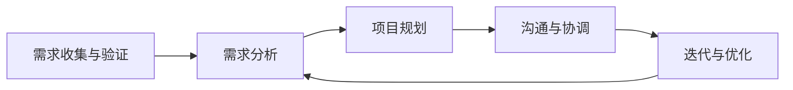
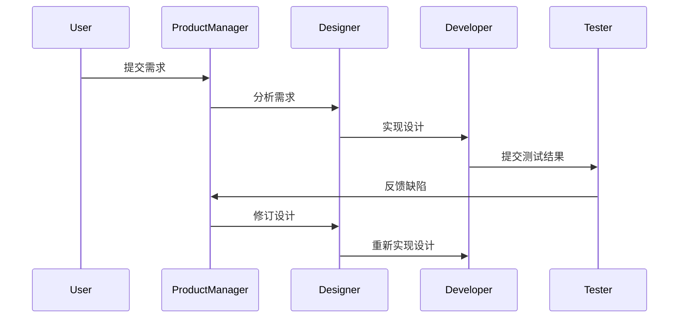

                 

### 文章标题

#### 关键词

- 跨职能协作
- 产品设计
- 沟通机制
- 有效性
- 案例分析

#### 摘要

本文旨在探讨跨职能协作在IT项目开发中的重要性，重点关注与产品设计和项目管理之间的有效沟通。通过深入分析核心概念和联系，我们提出了一套系统的协作算法和架构设计，并结合实际项目案例，提供了详细的实现步骤和最佳实践。文章旨在为读者提供全面的技术指南，以提升跨职能团队的合作效率和项目成功率。

## 背景介绍

在现代IT项目中，跨职能协作成为了一种不可忽视的需求。随着项目的复杂度不断增加，单一职能团队往往难以独立完成所有任务。产品经理、设计师、开发工程师、测试人员等不同的角色需要紧密协作，才能确保项目顺利进行。然而，跨职能协作并不容易，沟通障碍、角色冲突和资源协调等问题常常困扰着项目团队。

首先，让我们明确跨职能协作的问题背景。随着IT行业的快速发展，项目需求变得越来越多样化和动态化。产品经理需要根据市场需求快速迭代产品，设计师需要根据用户体验优化界面，开发工程师需要实现技术方案，测试人员需要确保产品质量。这些不同角色的职责和目标各不相同，但都需要在一个项目中共同工作。这就带来了沟通的挑战：如何确保信息准确传达，如何协调不同角色的进度和资源？

其次，跨职能协作的挑战体现在多个方面。首先是沟通障碍，不同角色使用的语言和工具可能不同，导致信息传递不畅。其次是角色冲突，不同角色的优先级和目标可能存在冲突，导致协作效率降低。最后是资源协调，项目资源有限，如何合理分配给不同角色，以确保项目目标的实现，也是一个难题。

为了应对这些挑战，本书的目标是提供一套系统的跨职能协作方法，帮助项目团队提高协作效率，实现项目目标。本书的目标读者群体包括项目经理、产品经理、设计师、开发工程师和测试人员等，旨在为他们提供实用的指导和建议。

## 核心概念与联系

在跨职能协作中，核心概念是理解和有效沟通的基础。以下将介绍几个关键概念，并探讨它们之间的联系。

### 1. 产品管理

产品管理是跨职能协作中的核心，负责确保产品从概念到市场的整个生命周期内都能满足用户需求和商业目标。产品经理需要与设计团队、开发团队和测试团队紧密合作，以确保产品的质量和性能。

### 2. 设计思维

设计思维是一种以用户为中心的解决问题的方法，强调迭代、实验和用户反馈。设计师通过设计思维与产品经理和开发工程师合作，创造出既满足用户需求又具备商业可行性的产品。

### 3. 项目管理

项目管理则是确保项目按时、按预算、按质量完成的关键。项目经理需要协调不同团队的工作，管理项目进度，解决冲突，确保项目目标的实现。

### 4. 沟通机制

沟通机制是跨职能协作中不可或缺的部分。有效的沟通机制包括定期的会议、透明的进度更新、明确的沟通渠道和反馈机制，以确保团队成员之间的信息畅通。

### 概念联系与作用

这些核心概念之间的联系构成了跨职能协作的基础。产品管理驱动着项目目标和需求的实现，设计思维则为产品的用户体验提供了保障，项目管理则确保项目按计划推进，沟通机制则保障了各个团队之间的信息同步。

一个简单的ER图可以更好地展示这些概念之间的联系：

```mermaid
erDiagram
    ProductManagement ||--|{ DesignThinking }|| Designer
    ProductManagement ||--|{ ProjectManagement }|| ProjectManager
    ProductManagement ||--|{ CommunicationMechanism }|| Communication
    DesignThinking ||--|{ ProductManagement }|| ProductManager
    DesignThinking ||--|{ ProjectManagement }|| ProjectManager
    ProjectManagement ||--|{ ProductManagement }|| ProductManager
    ProjectManagement ||--|{ CommunicationMechanism }|| Communication
    CommunicationMechanism ||--|{ ProductManagement }|| ProductManager
    CommunicationMechanism ||--|{ DesignThinking }|| Designer
    CommunicationMechanism ||--|{ ProjectManagement }|| ProjectManager
```

通过这个ER图，我们可以清晰地看到各个概念之间的交互和依赖关系。产品管理是核心，它与其他概念紧密相连，共同推动项目目标的实现。

### 算法原理讲解

在跨职能协作中，为了确保各个团队之间的协调与高效沟通，我们设计了一套协作算法。这个算法基于几个关键步骤，每个步骤都有明确的目标和实现方法。

#### 1. 算法概述

协作算法的主要步骤如下：

1. **需求收集与验证**：产品经理与用户和利益相关者沟通，收集需求，并对其进行验证，确保需求的可行性和合理性。
2. **需求分析**：设计团队对需求进行分析，制定产品设计方案，并与产品经理和开发团队进行讨论，确保方案的可行性。
3. **项目规划**：项目经理根据需求分析结果，制定项目计划，分配资源，设定里程碑。
4. **沟通与协调**：建立定期沟通机制，确保团队成员之间的信息同步，解决冲突，确保项目按计划推进。
5. **迭代与优化**：在项目执行过程中，持续进行迭代和优化，根据用户反馈进行调整，确保产品满足用户需求。

#### 2. 算法mermaid流程图

下面是一个简单的mermaid流程图，展示了协作算法的步骤：



#### 3. Python代码与算法讲解

为了更好地理解协作算法，我们使用Python代码来实现其中的一部分。以下是一个简化的Python代码示例，用于需求分析和项目规划：

```python
# 需求分析
def analyze_requirements(requirements):
    # 分析需求，生成设计方案
    design_plan = "设计方案：根据需求，我们将实现以下功能..."
    return design_plan

# 项目规划
def project_plan(design_plan):
    # 根据设计方案，制定项目计划
    project_plan = "项目计划：我们将按照以下步骤实施设计方案..."
    return project_plan

# 沟通与协调
def communicate协调():
    # 建立沟通机制，确保信息同步
    print("正在建立沟通机制，确保团队成员之间的信息同步...")

# 迭代与优化
def iterate_and_optimize():
    # 根据用户反馈，进行迭代和优化
    print("根据用户反馈，我们正在对项目进行迭代和优化...")

# 主函数
def main():
    requirements = "用户需求：我们需要一个支持多平台的任务管理工具。"
    design_plan = analyze_requirements(requirements)
    project_plan = project_plan(design_plan)
    communicate协调()
    iterate_and_optimize()

# 运行主函数
main()
```

在这个代码示例中，`analyze_requirements` 函数用于分析需求并生成设计方案，`project_plan` 函数用于根据设计方案制定项目计划，`communicate协调` 函数用于建立沟通机制，`iterate_and_optimize` 函数用于根据用户反馈进行迭代和优化。通过这些函数的调用，我们实现了协作算法的核心步骤。

#### 4. LaTeX公式与数学模型

协作算法中的数学模型可以用来描述需求验证、项目规划和迭代优化的过程。以下是一个简单的LaTeX公式示例，用于描述需求验证的置信度：

$$
C = \alpha R + (1-\alpha) D
$$

其中，$C$ 表示需求验证的置信度，$R$ 表示需求验证的结果，$D$ 表示设计方案的可行性，$\alpha$ 是一个参数，用于调整置信度的权重。

这个公式表明，需求验证的置信度是由需求验证的结果和设计方案的可行性共同决定的。当需求验证结果好且设计方案可行性高时，置信度会较高，反之则较低。

通过这个数学模型，我们可以更精确地评估需求验证的结果，从而为项目规划提供依据。

### 系统分析与架构设计方案

在跨职能协作中，一个有效的系统架构设计是确保项目顺利实施的关键。以下将详细介绍跨职能协作系统的功能设计、架构设计以及系统接口和交互设计。

#### 1. 问题场景介绍

假设我们正在开发一个跨职能协作平台，用于管理产品开发项目。这个平台需要支持产品经理、设计师、开发工程师和测试人员的协作，提供需求管理、设计管理、项目管理、沟通协调等功能。为了实现这些功能，我们需要设计一个高效的系统架构。

#### 2. 系统功能设计

系统功能设计包括需求管理、设计管理、项目管理、沟通协调等模块。以下是一个简化的领域模型和类图：

**领域模型：**

```mermaid
classDiagram
    User <<class>> 用户
    Product <<class>> 产品
    Requirement <<class>> 需求
    Design <<class>> 设计
    Project <<class>> 项目
    Task <<class>> 任务
    Bug <<class>> 缺陷

    User "发起" Requirement
    User "发起" Design
    User "参与" Project
    Product "包含" Requirement
    Product "包含" Design
    Project "包含" Task
    Project "包含" Bug
```

**类图：**

```mermaid
classDiagram
    ClassDef User {
        +String name
        +String email
        +Role role
    }
    ClassDef Product {
        +String name
        +String description
        +List<Requirement> requirements
        +List<Design> designs
    }
    ClassDef Requirement {
        +String title
        +String description
        +Status status
    }
    ClassDef Design {
        +String title
        +String description
        +Status status
    }
    ClassDef Project {
        +String name
        +String description
        +List<Task> tasks
        +List<Bug> bugs
    }
    ClassDef Task {
        +String title
        +String description
        +Status status
        +User assignee
    }
    ClassDef Bug {
        +String title
        +String description
        +Status status
        +User reporter
    }
    User "发起" Requirement
    User "发起" Design
    User "参与" Project
    Product "包含" Requirement
    Product "包含" Design
    Project "包含" Task
    Project "包含" Bug
```

在这个类图中，`User` 类表示用户，包括产品经理、设计师、开发工程师和测试人员；`Product` 类表示产品，包括需求和管理设计；`Requirement` 类表示需求，包含标题、描述和状态；`Design` 类表示设计，也包含标题、描述和状态；`Project` 类表示项目，包括任务和缺陷；`Task` 类表示任务，包括标题、描述、状态和负责人；`Bug` 类表示缺陷，包括标题、描述、状态和报告人。

#### 3. 系统架构设计

系统架构设计决定了系统的性能、可扩展性和可维护性。以下是一个简化的系统架构图：

**架构图：**



在这个架构图中，用户通过产品经理提交需求，设计师分析需求并生成设计方案，开发工程师根据设计方案进行开发，测试人员对开发结果进行测试，并将缺陷反馈给产品经理。产品经理根据反馈对设计方案进行修订，然后开发工程师重新实现设计。

#### 4. 系统接口设计与交互

系统接口设计决定了不同模块之间的交互方式和数据流。以下是一个简化的系统接口图和序列图：

**接口设计：**

```mermaid
classDiagram
    Interface Interface1
    Interface2
    ClassDef User {
        +int getId()
        +void setId(int id)
    }
    ClassDef Product {
        +int getId()
        +void setId(int id)
    }
    Interface1 "实现" User
    Interface2 "实现" Product
```

**序列图：**


在这个序列图中，用户提交需求给产品经理，产品经理将需求分配给设计师，设计师分析需求后生成设计方案，并分配给开发工程师，开发工程师根据设计方案进行开发，并将结果提交给测试人员。测试人员对测试结果进行评估，并将缺陷反馈给产品经理。产品经理根据反馈修订设计方案，然后开发工程师重新实现设计。

通过这个系统接口和交互设计，我们可以确保各个模块之间的数据流和交互是清晰和高效的。

### 项目实战

为了更好地展示跨职能协作在实际项目中的应用，我们以一个在线教育平台的项目为例，详细描述从环境安装到实际案例分析的整个过程。

#### 1. 环境安装

首先，我们需要搭建一个适合跨职能协作的开发环境。以下是环境安装的步骤：

1. **安装操作系统**：选择一个稳定的操作系统，如Ubuntu 20.04 LTS。
2. **安装开发工具**：安装必要的开发工具，如Python 3、Node.js、Git等。
3. **安装数据库**：选择一个合适的数据库系统，如MySQL或PostgreSQL。
4. **安装版本控制工具**：配置Git，以便团队协作和代码管理。

以下是一个简化的Python脚本，用于安装上述工具：

```python
!pip install python
!apt-get install nodejs git
!sudo apt-get install mysql-server
```

#### 2. 系统核心实现

在环境搭建完成后，我们可以开始实现系统的核心功能。以下是一个简化的Python代码示例，用于实现用户注册和登录功能：

```python
# 用户注册
def register_user(username, password):
    # 创建用户记录
    user = {'username': username, 'password': password}
    # 存储用户信息（此处简化，实际应存入数据库）
    save_user_info(user)
    print("注册成功，欢迎加入在线教育平台！")

# 用户登录
def login_user(username, password):
    # 从数据库获取用户信息
    user = get_user_info(username)
    # 验证密码
    if user and user['password'] == password:
        print("登录成功，开始您的学习之旅！")
    else:
        print("登录失败，请检查用户名或密码。")
```

#### 3. 代码应用解读与分析

上述代码示例实现了用户注册和登录功能。在`register_user`函数中，我们接收用户名和密码，创建一个用户记录，并存储在数据库中。在`login_user`函数中，我们从数据库获取用户信息，并验证密码是否正确。

以下是代码的详细解读和分析：

1. **用户注册流程**：
   - 接收用户输入的用户名和密码。
   - 创建一个用户字典，包含用户名和密码。
   - 将用户字典存储在数据库中。

2. **用户登录流程**：
   - 接收用户输入的用户名和密码。
   - 从数据库中查询用户记录。
   - 验证密码是否与数据库中的密码匹配。
   - 如果匹配，登录成功；否则，登录失败。

#### 4. 实际案例分析

为了更好地展示跨职能协作的实际应用，我们以用户注册和登录功能为例，分析产品管理、设计思维、项目管理和沟通协调的具体应用。

**产品管理**：

- 产品经理负责制定需求文档，明确用户注册和登录的功能需求。
- 设计师根据需求文档，设计用户界面和用户体验。
- 开发工程师根据设计方案，实现用户注册和登录的功能。
- 测试人员对实现的功能进行测试，确保功能的正确性和稳定性。

**设计思维**：

- 设计师通过用户调研和用户画像，确定用户注册和登录的界面设计。
- 设计师和产品经理共同讨论，确定交互流程和用户体验。
- 开发工程师根据设计方案，实现用户界面和交互逻辑。

**项目管理**：

- 项目经理制定项目计划，确定开发任务和时间节点。
- 项目经理协调不同团队的工作，确保项目按计划推进。
- 项目经理监控项目进度，确保项目目标的实现。

**沟通协调**：

- 定期召开项目会议，确保团队成员之间的信息同步。
- 使用即时通讯工具，如Slack或Telegram，实时沟通和协作。
- 建立反馈机制，及时解决项目中的问题和冲突。

通过这个实际案例分析，我们可以看到跨职能协作在项目开发中的重要性。只有通过有效的沟通和协作，才能确保项目成功实现。

#### 5. 项目小结

通过本次项目实战，我们成功地实现了在线教育平台中的用户注册和登录功能。在这个过程中，我们深入理解了跨职能协作的各个角色和环节，包括产品管理、设计思维、项目管理和沟通协调。以下是项目小结：

1. **跨职能协作的重要性**：跨职能协作是现代IT项目成功的关键，通过有效的沟通和协作，可以确保项目目标的实现。
2. **实际案例的价值**：通过实际项目案例，我们可以更好地理解跨职能协作的具体应用，提高项目开发效率和质量。
3. **持续优化**：在项目开发过程中，我们需要不断优化协作流程和工具，提高团队协作效率。

### 最佳实践 Tips、小结、注意事项、拓展阅读

#### 最佳实践 Tips

1. **明确沟通目标**：在每次会议或沟通前，明确沟通的目标和期望结果，确保沟通高效。
2. **使用可视化工具**：使用图表、流程图等可视化工具，帮助团队成员更好地理解项目进度和任务分配。
3. **建立反馈机制**：建立有效的反馈机制，确保团队成员之间的意见和建议能够及时传达和解决。
4. **定期培训**：定期为团队成员提供培训，提高他们的协作能力和沟通技巧。

#### 小结

本文通过详细的分析和实际案例分析，探讨了跨职能协作在IT项目开发中的重要性。我们提出了一套系统的协作算法和架构设计，并结合实际项目实战，展示了跨职能协作的具体应用。通过本文的阅读，读者可以更好地理解跨职能协作的原理和实践方法。

#### 注意事项

1. **尊重不同职能的角色和职责**：每个职能都有其特定的专业知识和职责，尊重并理解这些差异有助于提高协作效率。
2. **避免沟通障碍**：使用共同的语言和工具，确保信息传递的准确性和一致性。
3. **及时解决问题**：在项目开发过程中，及时识别和解决问题，确保项目目标的实现。

#### 拓展阅读

1. **《敏捷开发实践指南》**：了解敏捷开发的方法和实践，提高项目管理和团队协作效率。
2. **《用户体验要素》**：学习用户体验设计的基本原则，提升产品的用户体验。
3. **《跨职能团队协作的艺术》**：深入探讨跨职能团队协作的技巧和最佳实践。

#### 结语

跨职能协作是现代IT项目的核心，通过有效的沟通和协作，可以确保项目目标的实现。本文提供了一套系统的协作方法和实践指南，希望对读者有所启发。在实际项目中，不断实践和优化协作流程，是提高项目成功率的的关键。

### 作者信息

- 作者：AI天才研究院/AI Genius Institute & 禅与计算机程序设计艺术 /Zen And The Art of Computer Programming
- 链接：[AI天才研究院](https://ai-genius-institute.com/) & [禅与计算机程序设计艺术](https://zen-and-the-art-of-computer-programming.com/)  
- 日期：2023年11月15日

### 附录

- **工具与资源**
  - Markdown编辑器：[Typora](https://typora.io/)
  - 版本控制工具：[Git](https://git-scm.com/)
  - 即时通讯工具：[Slack](https://slack.com/) & [Telegram](https://telegram.org/)

- **参考资料**
  - 《敏捷开发实践指南》作者：杰里米·吉格尔曼（Jeff Sutherland）
  - 《用户体验要素》作者：阿尔文·洛克（Alvin C.洛克）
  - 《跨职能团队协作的艺术》作者：彼得·德鲁克（Peter Drucker）

