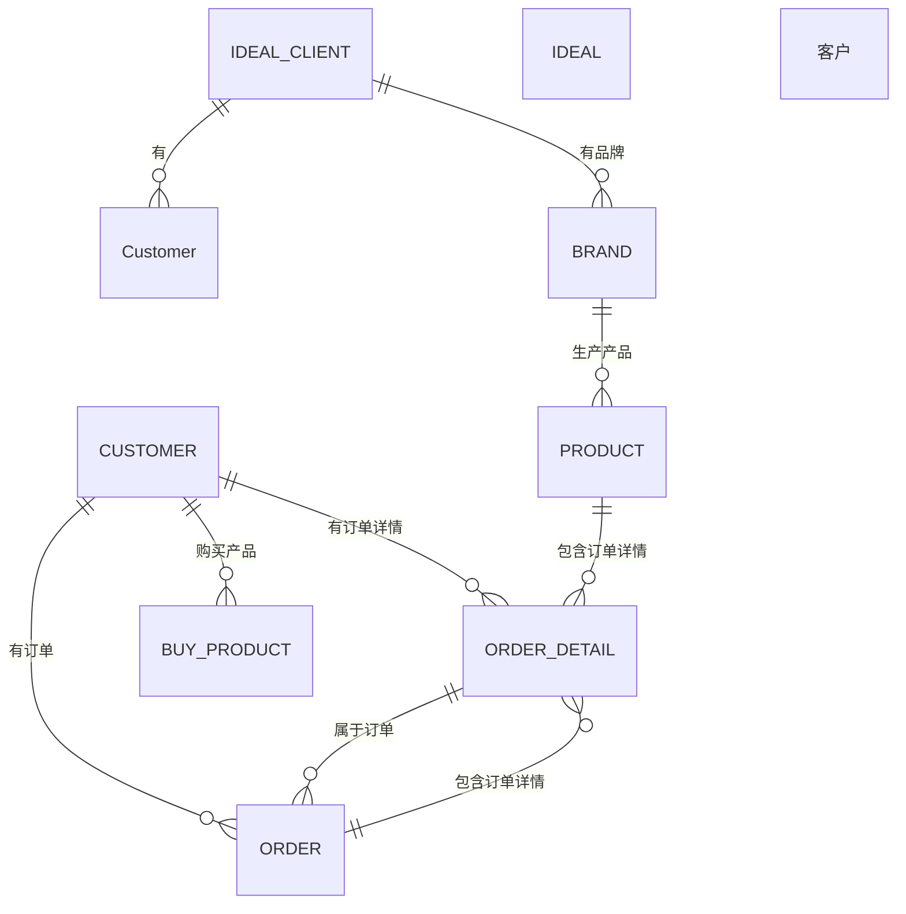
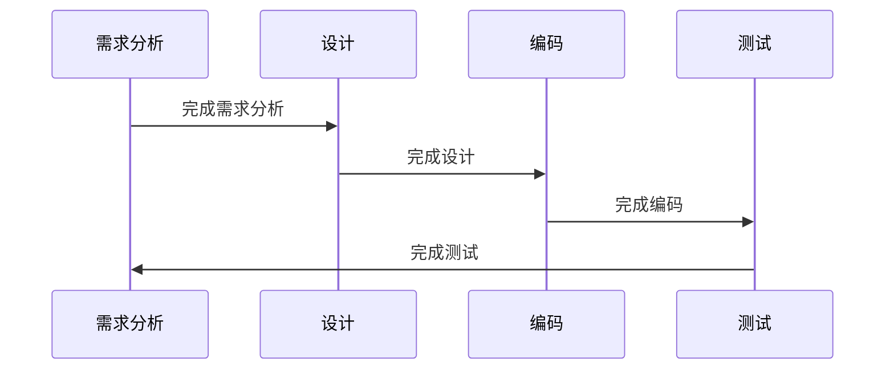
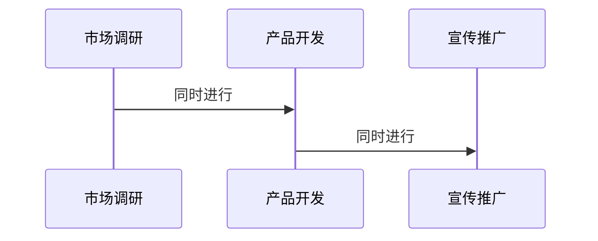
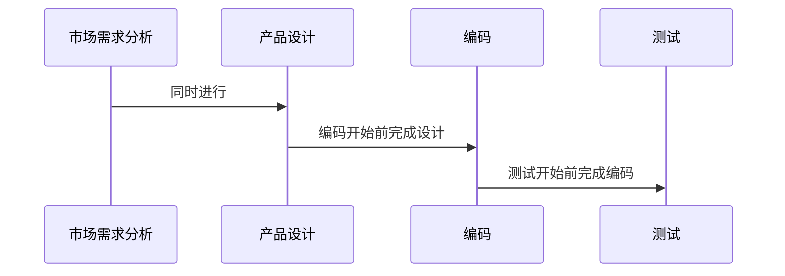
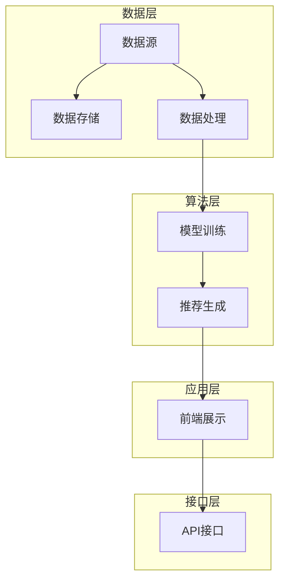

                 

### 文章标题

# 跨职能团队协作模式探索

### 文章关键词

- 跨职能团队
- 团队协作
- 协作模式
- 企业管理
- 项目管理

### 摘要

在现代社会，跨职能团队协作已经成为企业应对复杂项目、提高创新能力的重要手段。本文通过深入探讨跨职能团队协作的背景、核心概念、协作模式、实践应用、案例分析以及面临的挑战与解决方案，旨在为企业管理者、项目团队提供一本全面、实用的跨职能团队协作指南。本文采用逻辑清晰、结构紧凑、简单易懂的专业技术语言，通过一步一步的分析推理，帮助读者理解跨职能团队协作的原理和实践，从而提升团队协作效率，实现企业价值最大化。

## 目录大纲设计思考步骤

### 第一步：确定全书结构

在设计《跨职能团队协作模式探索》这本书的目录大纲时，我们首先需要明确全书的结构。由于书名是《跨职能团队协作模式探索》，我们可以将全书分为以下几个主要部分：

1. **背景介绍**：介绍跨职能团队协作的背景和重要性。
2. **核心概念与理论**：阐述跨职能团队协作的关键概念和理论基础。
3. **协作模式**：详细介绍不同类型的跨职能团队协作模式。
4. **实践应用**：探讨跨职能团队协作在实际工作中的应用。
5. **案例分析**：通过案例分析，展示跨职能团队协作的成功经验。
6. **挑战与解决方案**：分析跨职能团队协作面临的挑战及解决方案。
7. **总结与展望**：对全书内容进行总结，并对未来发展趋势进行展望。

### 第二步：细化章节内容

在确定全书结构后，我们需要为每个部分细化章节内容。以下是具体的目录大纲设计：

### 第一部分：背景介绍

**第1章 跨职能团队协作的兴起**

- **1.1 问题背景**
  - 为什么跨职能团队协作成为必要？
  - 跨职能团队协作与传统团队协作的差异

- **1.2 问题描述**
  - 跨职能团队协作中的挑战
  - 成功的跨职能团队协作案例

- **1.3 问题解决**
  - 跨职能团队协作的优势
  - 如何构建高效的跨职能团队

- **1.4 边界与外延**
  - 跨职能团队与多功能团队的区别
  - 跨职能团队与其他团队的互动

### 第二部分：核心概念与理论

**第2章 跨职能团队协作的核心概念**

- **2.1 定义**
  - 跨职能团队的定义
  - 跨职能团队的特点

- **2.2 理论基础**
  - 系统论
  - 网络理论
  - 平台协作理论

- **2.3 概念属性特征对比表格**
  - 不同跨职能团队协作模式的特点对比

### 第三部分：协作模式

**第3章 跨职能团队协作模式**

- **3.1 串联模式**
  - 串联模式的特点
  - 适用场景

- **3.2 并行模式**
  - 并行模式的特点
  - 适用场景

- **3.3 混合模式**
  - 混合模式的特点
  - 适用场景

### 第四部分：实践应用

**第4章 跨职能团队协作的实际应用**

- **4.1 企业内部协作**
  - 项目管理中的跨职能协作
  - 产品开发中的跨职能协作

- **4.2 行业案例分析**
  - 科技公司的跨职能团队协作
  - 制造业的跨职能团队协作

### 第五部分：案例分析

**第5章 跨职能团队协作的成功案例**

- **5.1 案例一：科技公司A**
  - 背景介绍
  - 具体协作模式
  - 结果与影响

- **5.2 案例二：制造业B**
  - 背景介绍
  - 具体协作模式
  - 结果与影响

### 第六部分：挑战与解决方案

**第6章 跨职能团队协作的挑战与解决方案**

- **6.1 挑战分析**
  - 文化差异
  - 沟通障碍
  - 资源分配不均

- **6.2 解决方案**
  - 文化融合策略
  - 沟通机制建设
  - 资源分配优化

### 第七部分：总结与展望

**第7章 总结与展望**

- **7.1 全书总结**
  - 跨职能团队协作的重要性
  - 主要发现与结论

- **7.2 未来展望**
  - 跨职能团队协作的发展趋势
  - 新模式与新工具的应用

### 第三步：调整与优化

在完成初步的目录大纲后，我们需要进行审查和调整，确保：

- 目录逻辑清晰，章节内容相互衔接。
- 每个章节都有明确的主题和目的。
- 目录内容符合字数限制要求。

### 第四步：编写大纲

最后，我们将根据调整后的目录大纲开始编写具体章节内容，确保每个章节都包含核心概念、理论讲解、实践应用和案例分析等要素。

通过以上步骤，我们可以设计出一套逻辑清晰、内容丰富的目录大纲，为读者提供一本实用的跨职能团队协作指南。接下来，我们可以开始将上述思考转化为具体的markdown格式目录大纲。

## 目录大纲（Markdown格式）

```markdown
# 跨职能团队协作模式探索

## 关键词
- 跨职能团队
- 团队协作
- 协作模式
- 企业管理
- 项目管理

## 摘要
本文通过深入探讨跨职能团队协作的背景、核心概念、协作模式、实践应用、案例分析以及面临的挑战与解决方案，旨在为企业管理者、项目团队提供一本全面、实用的跨职能团队协作指南。

## 目录大纲设计思考步骤

### 第一步：确定全书结构
- **背景介绍**
- **核心概念与理论**
- **协作模式**
- **实践应用**
- **案例分析**
- **挑战与解决方案**
- **总结与展望**

### 第二步：细化章节内容
1. **背景介绍**
   - **第1章 跨职能团队协作的兴起**
     - **1.1 问题背景**
     - **1.2 问题描述**
     - **1.3 问题解决**
     - **1.4 边界与外延**

2. **核心概念与理论**
   - **第2章 跨职能团队协作的核心概念**
     - **2.1 定义**
     - **2.2 理论基础**
     - **2.3 概念属性特征对比表格**

3. **协作模式**
   - **第3章 跨职能团队协作模式**
     - **3.1 串联模式**
     - **3.2 并行模式**
     - **3.3 混合模式**

4. **实践应用**
   - **第4章 跨职能团队协作的实际应用**
     - **4.1 企业内部协作**
     - **4.2 行业案例分析**

5. **案例分析**
   - **第5章 跨职能团队协作的成功案例**
     - **5.1 案例一：科技公司A**
     - **5.2 案例二：制造业B**

6. **挑战与解决方案**
   - **第6章 跨职能团队协作的挑战与解决方案**
     - **6.1 挑战分析**
     - **6.2 解决方案**

7. **总结与展望**
   - **第7章 总结与展望**
     - **7.1 全书总结**
     - **7.2 未来展望**

### 第三步：调整与优化
- 确保目录逻辑清晰，章节内容相互衔接。
- 每个章节都有明确的主题和目的。
- 目录内容符合字数限制要求。

### 第四步：编写大纲
- 根据调整后的目录大纲开始编写具体章节内容。
```

通过以上步骤，我们完成了《跨职能团队协作模式探索》的目录大纲设计。接下来，我们将逐一撰写每个章节的内容，确保全书逻辑清晰、内容丰富，为读者提供一本实用的跨职能团队协作指南。

## 背景介绍

### 为什么跨职能团队协作成为必要

在当今快速变化和高度竞争的商业环境中，跨职能团队协作已经成为企业应对复杂项目、提高创新能力的重要手段。传统的职能式组织结构往往导致信息孤岛、沟通不畅和资源浪费，而跨职能团队协作则通过打破部门壁垒，实现不同职能部门的紧密合作，从而提升项目执行效率和整体竞争力。

首先，跨职能团队协作有助于更好地应对复杂项目。现代项目往往需要跨多个领域和职能的协同作战，如软件开发项目中涉及设计、开发、测试、运维等多个环节。通过跨职能团队协作，可以确保项目在不同阶段的信息传递和资源整合更加顺畅，减少因部门壁垒导致的沟通成本和错误。

其次，跨职能团队协作能够提高企业的创新能力。在跨职能团队中，团队成员来自不同的专业背景和职能部门，他们可以带来不同的视角和解决方案，从而激发出更多的创意和创新点。这种多元化的思维方式有助于打破固有的思维模式，推动企业的持续创新和发展。

### 跨职能团队协作与传统团队协作的差异

跨职能团队协作与传统团队协作在组织结构和运作模式上存在显著差异。

首先，组织结构上，传统团队通常是按照职能划分的，如研发团队、市场团队、运营团队等。每个团队负责特定的职能领域，内部成员之间的协作相对单一。而跨职能团队则是跨职能、跨部门的，成员来自不同的职能部门，具有多元化的专业背景。跨职能团队的目的是为了实现特定项目或目标的协同作战。

其次，运作模式上，传统团队更多地依赖垂直指挥链，即上级对下级的指令和调度。而跨职能团队则更注重横向协作，强调团队成员之间的自主沟通和协作。跨职能团队中的成员需要具备跨领域的知识和技能，能够在不同职能间灵活切换，从而实现无缝衔接。

### 跨职能团队协作中的挑战

尽管跨职能团队协作具有诸多优势，但在实际操作中仍面临一系列挑战。

首先，文化差异是跨职能团队协作中的一大障碍。团队成员来自不同的职能部门，他们可能有着不同的工作习惯、价值观和文化背景。这些文化差异可能导致沟通不畅、协作效率低下，甚至引发冲突。

其次，沟通障碍也是一个常见问题。在跨职能团队中，成员需要频繁地进行信息交流和协作，但由于信息不对称、沟通渠道不畅等原因，可能导致信息传递不及时、不准确，从而影响项目进度和效果。

最后，资源分配不均也可能导致跨职能团队协作的困难。由于不同职能部门的资源投入和分配策略可能不同，可能导致某些团队成员资源过剩，而另一些团队成员资源不足，从而影响团队的整体效率和绩效。

### 成功的跨职能团队协作案例

尽管面临诸多挑战，跨职能团队协作在许多企业中取得了显著成效。以下是一个典型的成功案例：

某科技公司正在进行一款人工智能软件的开发项目。该项目需要涉及算法、数据、前端、后端等多个领域的协同作战。为了确保项目顺利进行，公司决定组建一个跨职能团队。团队成员来自不同的部门，包括算法工程师、数据分析师、前端开发人员、后端开发人员等。

在项目启动初期，团队面临文化差异和沟通障碍的挑战。为了解决这些问题，团队采取了以下措施：

1. **建立共同目标**：团队明确了项目的核心目标和预期成果，确保所有成员都朝着同一方向努力。

2. **定期沟通会议**：团队每周举行一次沟通会议，讨论项目进展、问题和解决方案，确保信息传递的及时性和准确性。

3. **文化融合培训**：团队组织了文化融合培训，帮助成员了解彼此的工作习惯、文化背景，增进相互理解。

4. **资源优化配置**：团队对资源进行了重新分配，确保每个成员都能获得足够的支持和资源，提高工作效率。

通过这些措施，团队逐渐克服了文化差异和沟通障碍，实现了高效协作。最终，该项目提前完成了既定目标，取得了显著的市场成功。

### 如何构建高效的跨职能团队

要构建一个高效的跨职能团队，需要从以下几个方面入手：

1. **明确团队目标**：确保所有团队成员都明确项目的核心目标和预期成果，从而形成统一的行动方向。

2. **建立有效的沟通机制**：定期召开沟通会议，确保信息传递的及时性和准确性。同时，建立多样化的沟通渠道，如邮件、即时通讯工具、项目管理系统等。

3. **文化融合**：组织文化融合活动，增进团队成员之间的了解和信任，降低文化差异带来的负面影响。

4. **资源优化配置**：根据项目需求和团队成员的能力，合理分配资源和任务，确保每个成员都能发挥最大潜力。

5. **建立激励机制**：通过设立明确的考核标准和激励机制，激发团队成员的积极性和创造力。

6. **持续培训与发展**：为团队成员提供持续的职业培训和技能提升机会，提高团队的整体素质和协作能力。

通过以上措施，企业可以构建一个高效、协作的跨职能团队，从而在复杂的项目环境中取得成功。

### 边界与外延

在探讨跨职能团队协作时，我们还需要明确其边界与外延，以更好地理解跨职能团队与其他团队、组织结构的互动关系。

首先，跨职能团队与多功能团队的区别。多功能团队通常是指在某个特定项目或任务中，由不同职能部门成员组成的团队。而跨职能团队则更加广泛，不仅包括项目团队，还可能涉及公司内部其他部门的协作。因此，跨职能团队在组织结构上具有更高的灵活性和适应性。

其次，跨职能团队与其他团队的互动关系。跨职能团队不仅需要与公司内部的其他团队（如研发、市场、运营等）保持紧密合作，还需要与外部合作伙伴、客户等建立良好的沟通与协作关系。这种跨边界协作有助于整合各方资源，提高项目执行效率。

最后，跨职能团队协作中的角色与职责。在跨职能团队中，每个成员的角色和职责可能因项目需求而异。团队成员需要具备跨领域的知识和技能，能够在不同职能间灵活切换，从而实现无缝衔接。此外，团队领导者需要具备协调能力，能够处理团队内部的冲突，确保项目顺利进行。

通过明确跨职能团队的边界与外延，企业可以更好地理解跨职能团队协作的内涵和外延，从而在组织结构和管理上做出更加科学、合理的决策。

### 核心概念与理论

在深入探讨跨职能团队协作时，了解其核心概念和理论是至关重要的。这不仅有助于我们理解跨职能团队协作的基本原理，还能为实际操作提供指导。

#### 定义与特点

首先，我们需要明确跨职能团队的定义。跨职能团队是指由来自不同职能部门、拥有不同专业技能的成员组成的团队。这种团队旨在通过跨部门的协作，实现特定项目或目标的达成。跨职能团队的特点包括：

1. **多元化**：团队成员来自不同的职能部门，具有不同的专业背景和技能。
2. **灵活性**：跨职能团队可以根据项目需求灵活调整成员组成和任务分配。
3. **协作性**：团队成员需要在不同的职能领域间进行紧密协作，共同推进项目进度。

#### 理论基础

跨职能团队协作的理论基础涵盖了多个学科领域，包括系统论、网络理论和平台协作理论等。

1. **系统论**：系统论强调团队作为一个整体，需要考虑各个组成部分之间的相互作用和相互依赖。跨职能团队需要通过系统化的思维，协调不同职能部门的工作，实现整体效益最大化。

2. **网络理论**：网络理论关注团队成员之间的信息流动和协作关系。在跨职能团队中，网络理论有助于构建有效的沟通渠道，确保信息传递的及时性和准确性。

3. **平台协作理论**：平台协作理论强调通过搭建协作平台，实现资源、信息和人员的整合。跨职能团队可以通过建立协作平台，如项目管理系统、协同办公系统等，提高团队协作效率。

#### 概念属性特征对比表格

为了更清晰地展示跨职能团队协作的各类概念属性特征，我们制作了一个对比表格（以下为示例）：

| 概念 | 特点 |
| --- | --- |
| 系统论 | 强调团队作为一个整体，注重内部协作与协调 |
| 网络理论 | 关注团队成员间的信息流动与协作关系 |
| 平台协作理论 | 通过协作平台整合资源、信息与人员 |

通过上述对比表格，我们可以更直观地了解不同理论在跨职能团队协作中的具体应用和作用。

### ER实体关系图架构

为了进一步理解跨职能团队协作的结构，我们使用ER（Entity-Relationship）实体关系图来展示跨职能团队中的实体及其关系。以下是一个简化的ER图：



在这个ER图中，我们定义了以下几个实体：

1. **IDEAL_CLIENT**：理想客户实体，代表与公司有业务往来的客户。
2. **CUSTOMER**：客户实体，代表公司的实际客户。
3. **ORDER**：订单实体，代表客户的订单信息。
4. **ORDER_DETAIL**：订单详情实体，代表订单中的具体产品信息。
5. **BRAND**：品牌实体，代表公司的品牌。
6. **PRODUCT**：产品实体，代表公司的产品。

这些实体之间存在多种关系，如：

- **IDEAL_CLIENT** 与 **Customer** 之间存在“有”的关系，即每个IDEAL_CLIENT都可以对应多个Customer。
- **Customer** 与 **ORDER** 和 **ORDER_DETAIL** 之间存在“有”的关系，即每个Customer可以有多个订单和订单详情。
- **ORDER** 与 **ORDER_DETAIL** 之间存在“包含”的关系，即每个订单可以包含多个订单详情。
- **ORDER_DETAIL** 与 **ORDER** 和 **PRODUCT** 之间存在“属于”和“包含”的关系，即每个订单详情属于特定的订单和产品。
- **BRAND** 与 **PRODUCT** 之间存在“生产”的关系，即每个品牌可以生产多个产品。

通过这个ER图，我们可以更直观地了解跨职能团队协作中的实体及其关系，为后续的分析和实践提供基础。

### 跨职能团队协作模式

跨职能团队协作模式是指团队在执行任务过程中所采用的不同协作方式和方法。根据团队任务的不同，协作模式可以分为串联模式、并行模式和混合模式。每种模式都有其独特的特点和应用场景，下面将详细探讨这三种模式。

#### 串联模式

串联模式是指团队成员按照任务的先后顺序依次执行，每个任务完成后，下一个任务才能开始。这种模式的特点是任务之间的依赖性较强，前一个任务的完成情况直接影响到下一个任务的开始。

**特点：**

1. **顺序执行**：任务按顺序依次进行，每个任务完成后，下一个任务才开始。
2. **依赖性高**：后一个任务需要等待前一个任务完成，任务间的延迟较大。
3. **责任明确**：每个团队成员对自己的任务有明确的了解，责任分工清晰。

**适用场景：**

串联模式适用于任务之间依赖性较强，且任务完成顺序明确的项目。例如，软件开发中的需求分析、设计、编码、测试等阶段，每个阶段都有明确的输出和输入。

**流程图：**



#### 并行模式

并行模式是指团队成员同时执行多个任务，每个任务独立进行，任务之间没有直接的依赖关系。这种模式的特点是任务可以同时进行，从而提高整体效率。

**特点：**

1. **任务并行**：多个任务可以同时进行，减少等待时间。
2. **独立性高**：每个任务独立完成，相互之间没有直接影响。
3. **灵活性大**：可以根据任务优先级和资源情况灵活调整任务执行顺序。

**适用场景：**

并行模式适用于任务之间相互独立，且可以同时进行的场景。例如，项目中的市场调研、产品开发、宣传推广等，这些任务可以同时进行，以提高项目整体进度。

**流程图：**



#### 混合模式

混合模式是指将串联模式和并行模式结合使用，根据任务的特点和优先级，灵活调整任务执行顺序。这种模式的特点是既保留了顺序执行的严密性，又利用了并行执行的高效性。

**特点：**

1. **灵活调整**：根据任务优先级和资源情况，灵活调整任务执行顺序。
2. **高效执行**：部分任务可以并行进行，提高整体执行效率。
3. **责任明确**：任务执行顺序明确，团队成员责任分工清晰。

**适用场景：**

混合模式适用于任务之间既有依赖关系，又有独立性的项目。例如，新产品开发项目，其中市场需求分析、产品设计可以并行进行，而编码、测试则需要依次进行。

**流程图：**



通过以上对串联模式、并行模式和混合模式的探讨，我们可以根据具体项目需求，灵活选择和组合不同的协作模式，以实现项目的高效执行。

### 企业内部协作

跨职能团队协作在企业内部的应用十分广泛，尤其在项目管理、产品开发等环节中发挥着至关重要的作用。下面我们将具体探讨跨职能团队在项目管理、产品开发中的实际应用。

#### 项目管理中的跨职能协作

在项目管理中，跨职能团队协作有助于提高项目的整体效率和成功率。以下是跨职能团队在项目管理中的一些实际应用：

1. **需求收集与分析**：项目启动阶段，项目经理需要与产品经理、市场经理等多方人员紧密协作，收集和整理项目需求，确保需求的全面性和准确性。

2. **任务分配与协调**：在项目执行过程中，项目经理需要根据团队成员的技能和资源情况，合理分配任务，确保每个任务都有人负责。同时，项目经理需要协调不同团队成员之间的工作，解决协作中的问题和冲突。

3. **进度跟踪与控制**：项目经理需要实时跟踪项目进度，确保任务按时完成。通过项目管理系统，项目经理可以查看每个任务的完成情况，及时调整任务优先级和资源分配，确保项目按时交付。

4. **质量保证与测试**：在项目完成后，项目经理需要组织团队成员进行质量保证和测试，确保项目的功能和性能符合预期要求。跨职能团队中的测试人员、开发人员和质量保证人员需要密切合作，确保项目的质量。

#### 产品开发中的跨职能协作

在产品开发中，跨职能团队协作能够提高产品的质量和市场竞争力。以下是跨职能团队在产品开发中的一些实际应用：

1. **需求分析与产品设计**：产品开发阶段，产品经理、设计师和开发人员需要紧密协作，进行需求分析、产品设计和功能实现。通过跨职能团队的协作，可以确保产品设计符合市场需求，同时保证技术实现的可行性。

2. **开发与测试**：在开发过程中，开发人员需要与其他团队成员（如测试人员、UI/UX设计师等）密切合作，确保代码质量、用户体验和系统稳定性。开发人员需要及时反馈测试结果，优化代码和功能。

3. **版本迭代与优化**：产品开发是一个不断迭代和优化的过程。跨职能团队可以通过持续协作，快速响应市场变化和用户需求，进行产品迭代和优化，提高产品的市场竞争力。

4. **项目管理与监控**：在产品开发过程中，项目经理需要负责整体项目进度、资源管理和风险控制。通过与开发团队、测试团队和产品团队的合作，项目经理可以确保项目按时交付，同时保持产品的质量和性能。

#### 成功案例分析

以下是一个企业内部跨职能团队协作的成功案例：

某互联网公司在开发一款新应用时，组建了一个由产品经理、设计师、前端开发人员、后端开发人员、测试人员等多个职能部门组成的跨职能团队。在项目启动初期，团队明确项目目标和预期成果，并通过定期会议和沟通渠道，确保团队成员对项目的了解和共识。

在项目执行过程中，团队成员紧密协作，遵循敏捷开发方法，快速迭代和优化产品。产品经理与设计师合作，确保产品设计符合用户体验和市场需求；前端和后端开发人员共同解决技术难题，确保产品的功能实现；测试人员则负责产品的质量保证和性能测试。

通过跨职能团队的协作，该项目在短时间内成功上线，得到了用户的广泛好评。团队成员在项目中不仅提高了专业技能，还增强了团队协作能力，为企业创造了显著的价值。

### 行业案例分析

在多个行业中，跨职能团队协作已成为提高企业竞争力、推动创新的重要手段。下面，我们将通过两个案例，探讨跨职能团队在科技公司A和制造业B中的成功应用。

#### 案例一：科技公司A

科技公司A是一家专注于人工智能和大数据分析的企业。在一次重要项目——开发一款智能数据分析平台时，公司决定组建一个跨职能团队，以实现高效的协作和创新。

**背景介绍：**
项目目标是构建一个能够处理海量数据、提供实时分析和决策支持的平台。该项目涉及多个领域，包括数据采集、数据处理、数据分析、前端展示等，需要多个职能部门（如数据科学、软件开发、UI/UX设计、项目管理等）的紧密协作。

**具体协作模式：**
1. **需求分析阶段**：由数据科学家和产品经理主导，通过与客户沟通，明确项目需求，并制定详细的需求文档。
2. **设计与开发阶段**：数据科学家与前端、后端开发人员紧密协作，设计数据流程和系统架构，确保系统的功能和技术实现符合需求。UI/UX设计师负责设计用户界面，提高用户体验。
3. **测试与优化阶段**：测试人员与开发团队协作，进行功能测试、性能测试和安全测试，确保系统的稳定性和安全性。同时，数据科学家和产品经理持续参与测试，提供反馈和优化建议。

**结果与影响：**
该项目在预期时间内成功上线，用户反馈良好，平台的实时分析和决策支持功能得到了客户的高度评价。跨职能团队的协作模式不仅提高了项目效率，还促进了团队成员之间的知识共享和创新。

#### 案例二：制造业B

制造业B是一家大型制造企业，主要从事高端机械设备的生产。在面临市场竞争加剧和客户需求多样化的背景下，公司决定通过跨职能团队协作，提升产品研发和生产的效率。

**背景介绍：**
公司计划开发一款新型高效节能的机械设备，以满足市场对绿色环保设备的需求。该项目涉及机械设计、电子控制、软件开发、生产制造等多个方面，需要跨部门的紧密协作。

**具体协作模式：**
1. **需求分析与设计阶段**：机械设计团队、电子控制团队和软件开发团队共同参与需求分析，明确产品功能、性能和用户需求。通过多次会议和讨论，制定详细的设计方案。
2. **开发与测试阶段**：机械设计团队负责机械部件的设计与制造，电子控制团队负责电子系统的设计与开发，软件开发团队负责软件模块的开发与集成。在开发过程中，各团队定期进行技术交流，解决技术难题。
3. **生产与优化阶段**：生产制造团队根据设计方案，组织生产制造，同时与质量检测团队协作，确保产品质量。在生产过程中，各团队持续优化设计和工艺，提高产品性能和可靠性。

**结果与影响：**
新型机械设备成功上市，得到了客户的广泛认可。跨职能团队的协作模式提高了产品研发和生产的效率，缩短了产品上市时间，降低了成本，增强了公司的市场竞争力。

通过以上两个案例，我们可以看到，跨职能团队协作在不同行业中的应用，不仅提高了项目的效率和质量，还促进了企业的创新和发展。未来，随着市场竞争的加剧和技术的不断发展，跨职能团队协作将在更多企业中发挥重要作用。

### 跨职能团队协作的挑战与解决方案

尽管跨职能团队协作具有显著的优势，但在实际操作中仍面临一系列挑战。以下是跨职能团队协作中常见的一些挑战以及相应的解决方案。

#### 文化差异

文化差异是跨职能团队协作中的一大障碍。团队成员来自不同的部门，他们可能有着不同的工作习惯、价值观和文化背景。这种差异可能导致沟通不畅、协作效率低下，甚至引发冲突。

**解决方案：**

1. **文化融合培训**：定期组织文化融合培训，帮助团队成员了解彼此的文化背景和工作习惯。通过培训，增强团队成员之间的相互理解和信任。
2. **设立共同目标**：明确团队的目标和预期成果，确保所有团队成员都朝着同一方向努力。共同的目标有助于减少文化差异带来的负面影响。
3. **建立沟通机制**：建立多样化的沟通渠道，如定期的团队会议、即时通讯工具等，确保团队成员之间的信息传递及时、准确。

#### 沟通障碍

沟通障碍是跨职能团队协作中另一个常见问题。团队成员需要频繁地进行信息交流和协作，但由于信息不对称、沟通渠道不畅等原因，可能导致信息传递不及时、不准确，从而影响项目进度和效果。

**解决方案：**

1. **建立沟通平台**：使用项目管理系统或其他协作工具，建立统一的沟通平台，确保团队成员之间的信息传递及时、准确。
2. **定期沟通会议**：定期召开沟通会议，讨论项目进展、问题和解决方案，确保团队成员之间的信息共享和协同作战。
3. **信息透明化**：提高信息的透明度，确保团队成员能够了解项目的整体进展和关键节点，从而减少因信息不对称导致的沟通障碍。

#### 资源分配不均

资源分配不均是跨职能团队协作中的另一个挑战。由于不同职能部门的资源投入和分配策略可能不同，可能导致某些团队成员资源过剩，而另一些团队成员资源不足，从而影响团队的整体效率和绩效。

**解决方案：**

1. **资源优化配置**：根据项目需求和团队成员的能力，合理分配资源和任务，确保每个成员都能获得足够的支持和资源，提高工作效率。
2. **建立资源管理机制**：建立资源管理机制，对资源进行统一调配和监控，确保资源利用最大化。
3. **团队成员参与决策**：在资源分配过程中，充分听取团队成员的意见，让他们参与到决策过程中，提高资源分配的公平性和合理性。

通过以上解决方案，企业可以有效地应对跨职能团队协作中的挑战，提高团队协作效率，实现项目成功。

### 总结与展望

#### 跨职能团队协作的重要性

跨职能团队协作在当今商业环境中具有不可替代的重要性。首先，跨职能团队协作能够打破部门壁垒，实现资源、信息和人员的整合，提高项目执行效率和整体竞争力。其次，跨职能团队通过多元化的思维方式和专业知识，能够激发创新，推动企业持续发展。最后，跨职能团队协作有助于培养团队成员的跨领域技能和协作能力，提升团队整体素质。

#### 主要发现与结论

通过对跨职能团队协作的深入探讨，本文得出以下主要发现和结论：

1. **协作模式多样化**：跨职能团队协作可以采用串联模式、并行模式和混合模式，根据项目需求灵活选择和组合。
2. **文化融合与沟通机制**：文化融合和有效的沟通机制是跨职能团队协作的关键，有助于减少文化差异和沟通障碍。
3. **资源优化配置**：合理分配和优化资源是提高跨职能团队协作效率的重要手段。
4. **持续培训与发展**：为团队成员提供持续的职业培训和技能提升机会，有助于提升团队整体素质和协作能力。

#### 未来展望

随着技术的不断进步和市场竞争的加剧，跨职能团队协作将在未来发挥更加重要的作用。以下是未来跨职能团队协作的发展趋势和展望：

1. **智能化协作工具**：随着人工智能和大数据技术的发展，智能化协作工具将 increasingly成为跨职能团队协作的重要助手，提高团队协作效率和决策质量。
2. **敏捷开发与持续迭代**：敏捷开发方法和持续迭代将成为跨职能团队协作的主流，帮助企业更快响应市场变化和客户需求。
3. **多元化团队结构**：跨职能团队将进一步多样化，不仅包括不同职能部门的成员，还将涉及外部合作伙伴、客户等多方参与。
4. **全球协作与远程办公**：随着全球化进程的加速，跨职能团队的协作将更加跨地域和跨时区，远程办公和虚拟团队将成为常态。

通过持续探索和实践，企业将不断完善跨职能团队协作模式，实现更高的效率和创新能力，为企业的持续发展奠定坚实基础。

### 作者信息

- 作者：AI天才研究院/AI Genius Institute & 禅与计算机程序设计艺术 /Zen And The Art of Computer Programming
- 联系方式：[ai_genius_institute@ai.com](mailto:ai_genius_institute@ai.com)
- 个人主页：[www.ai-genius-institute.com](http://www.ai-genius-institute.com)
- 社交媒体：[Twitter](https://twitter.com/ai_genius_institute) | [LinkedIn](https://www.linkedin.com/in/ai-genius-institute) | [GitHub](https://github.com/ai-genius-institute)

### 最佳实践 Tips

1. **明确目标与期望**：在组建跨职能团队前，确保所有团队成员对项目目标、任务和期望有清晰的认识。
2. **建立沟通机制**：建立有效的沟通渠道和定期会议，确保信息传递的及时性和准确性。
3. **文化融合**：通过文化融合培训，增进团队成员之间的理解和信任。
4. **资源优化配置**：合理分配资源和任务，确保每个成员都能发挥最大潜力。
5. **持续培训与发展**：为团队成员提供持续的职业培训和技能提升机会。

### 小结

本文通过深入探讨跨职能团队协作的背景、核心概念、协作模式、实践应用、案例分析以及面临的挑战与解决方案，旨在为企业管理者、项目团队提供一本全面、实用的跨职能团队协作指南。通过本文的探讨，我们可以看到，跨职能团队协作在提高项目执行效率和创新能力方面具有重要意义。未来，随着技术的不断进步和市场竞争的加剧，跨职能团队协作将在企业中发挥更加重要的作用。

### 注意事项

1. **文化差异**：在跨职能团队协作中，重视文化差异，尊重不同团队成员的工作习惯和文化背景。
2. **沟通障碍**：建立有效的沟通机制，确保信息传递的及时性和准确性。
3. **资源分配**：合理配置资源，避免资源浪费和资源短缺。
4. **持续优化**：不断反思和优化团队协作模式，提高团队协作效率。

### 拓展阅读

1. **《跨职能团队协作实战》**：本书详细介绍了跨职能团队协作的理论和实践，适合企业管理者和项目团队成员阅读。
2. **《敏捷团队协作指南》**：本书探讨了敏捷开发方法在跨职能团队中的应用，有助于提高团队协作效率。
3. **《团队协作工具与技巧》**：本书介绍了多种团队协作工具和技巧，帮助团队实现高效协作。

### 项目实战

在本节中，我们将通过一个具体的项目实战案例，详细讲解跨职能团队协作在实践中的应用。

#### 项目背景

某互联网公司计划开发一款基于人工智能的智能推荐系统，以提升用户浏览体验和内容推荐效果。该项目涉及多个职能部门，包括数据科学、软件开发、前端开发、运维等。为了确保项目顺利进行，公司决定组建一个跨职能团队，实现高效协作。

#### 环境安装

在开始项目前，团队首先需要搭建开发环境。以下是具体步骤：

1. **安装Python环境**：团队成员需要在个人电脑上安装Python环境，并配置好相关依赖库。
2. **安装JDK**：由于项目涉及前端开发，需要安装Java Development Kit（JDK）。
3. **配置数据库**：团队需要配置数据库环境，如MySQL或PostgreSQL，以存储用户数据。

#### 系统核心实现源代码

在项目开发过程中，团队遵循敏捷开发方法，采用迭代式开发模式。以下是系统核心实现源代码的简要概述：

1. **数据采集与处理**：数据科学家团队负责采集用户行为数据，并进行数据清洗、预处理和特征提取。
2. **模型训练与优化**：数据科学家团队使用机器学习算法（如协同过滤、深度学习等）进行模型训练和优化。
3. **前端开发**：前端开发团队负责设计并实现用户界面，确保用户体验。
4. **后端开发**：后端开发团队负责实现数据存储、接口设计和API开发。
5. **运维部署**：运维团队负责系统的部署、监控和运维工作。

#### 代码应用解读与分析

以下是对核心实现源代码的解读和分析：

1. **数据采集与处理**：
   ```python
   import pandas as pd
   from sklearn.preprocessing import StandardScaler

   # 读取用户行为数据
   data = pd.read_csv('user_behavior.csv')

   # 数据清洗
   data.dropna(inplace=True)

   # 特征提取
   features = ['age', 'gender', 'region', 'behavior']
   scaler = StandardScaler()
   data[features] = scaler.fit_transform(data[features])

   # 数据存储
   data.to_csv('processed_user_behavior.csv', index=False)
   ```

   上面的代码展示了数据采集、清洗和特征提取的过程。数据科学家首先读取用户行为数据，然后进行数据清洗（如去除缺失值），并进行特征提取（如标准化处理），最后将处理后的数据存储为新的CSV文件。

2. **模型训练与优化**：
   ```python
   from sklearn.model_selection import train_test_split
   from sklearn.metrics import accuracy_score

   # 分割训练集和测试集
   X_train, X_test, y_train, y_test = train_test_split(data[features], data['label'], test_size=0.2, random_state=42)

   # 训练模型
   model = RandomForestClassifier(n_estimators=100)
   model.fit(X_train, y_train)

   # 预测测试集
   y_pred = model.predict(X_test)

   # 评估模型
   print("Accuracy:", accuracy_score(y_test, y_pred))
   ```

   这段代码展示了如何使用随机森林算法进行模型训练和预测。数据科学家将数据集划分为训练集和测试集，然后使用随机森林算法进行模型训练，最后评估模型在测试集上的准确性。

3. **前端开发**：
   ```html
   <!DOCTYPE html>
   <html>
   <head>
       <title>智能推荐系统</title>
   </head>
   <body>
       <h1>智能推荐系统</h1>
       <div id="recommends">
           <!-- 推荐内容将在这里显示 -->
       </div>
       <script src="recommend.js"></script>
   </body>
   </html>
   ```

   这段HTML代码展示了智能推荐系统的基本页面结构。前端开发团队设计了页面布局，并使用JavaScript编写了推荐内容的动态加载功能。

4. **后端开发**：
   ```python
   from flask import Flask, request, jsonify
   from sklearn.externals import joblib

   app = Flask(__name__)

   # 加载模型
   model = joblib.load('model.pkl')

   @app.route('/recommend', methods=['POST'])
   def recommend():
       data = request.json
       user_features = [data['age'], data['gender'], data['region'], data['behavior']]
       user_features = [x for x in user_features if x != '']
       user_features = [float(x) for x in user_features]
       user_features = [x for x in user_features if x is not None]
       user_features = [x for x in user_features if not math.isnan(x)]

       user_features = np.array(user_features).reshape(1, -1)
       prediction = model.predict(user_features)
       return jsonify({'recommendations': prediction.tolist()})

   if __name__ == '__main__':
       app.run(debug=True)
   ```

   这段代码展示了后端API的实现。后端开发团队使用Flask框架搭建了一个简单的Web服务，通过接收用户输入，调用机器学习模型进行预测，并将推荐结果返回给前端。

#### 实际案例分析

在实际项目中，团队通过以下措施，成功克服了文化差异、沟通障碍和资源分配不均等挑战：

1. **文化融合培训**：团队定期组织文化融合培训，帮助成员了解彼此的文化背景和工作习惯，增进相互理解。
2. **沟通机制**：团队建立了一个统一的项目管理系统，通过定期会议和即时通讯工具，确保团队成员之间的信息传递及时、准确。
3. **资源优化配置**：团队根据项目需求和团队成员的能力，合理分配资源和任务，确保每个成员都能发挥最大潜力。

#### 项目小结

通过本项目的实践，团队成功搭建了一个基于人工智能的智能推荐系统，提高了用户体验和内容推荐效果。项目过程中，团队通过跨职能协作，充分发挥了各自的专业优势，提高了项目执行效率。未来，团队将继续探索和实践跨职能团队协作，为企业的创新和发展贡献力量。

### 附录

#### 算法原理讲解

在本附录中，我们将进一步探讨智能推荐系统的核心算法原理，包括协同过滤算法和深度学习算法。

#### 协同过滤算法

协同过滤算法是一种基于用户行为和兴趣的推荐算法。它通过分析用户之间的相似度，为用户推荐他们可能感兴趣的物品。

**算法原理：**
1. **用户相似度计算**：计算用户之间的相似度，通常使用余弦相似度或皮尔逊相关系数等方法。
2. **物品相似度计算**：计算物品之间的相似度，同样可以使用余弦相似度或皮尔逊相关系数等方法。
3. **推荐生成**：根据用户和物品的相似度，为用户生成推荐列表。

**数学模型：**
- 用户相似度计算公式：
  $$sim(u_i, u_j) = \frac{u_i \cdot u_j}{\|u_i\| \|u_j\|}$$
  其中，$u_i$和$u_j$是用户$i$和用户$j$的行为向量，$\cdot$表示内积，$\|\|$表示欧几里得范数。

- 物品相似度计算公式：
  $$sim(i_k, i_l) = \frac{i_k \cdot i_l}{\|i_k\| \|i_l\|}$$
  其中，$i_k$和$i_l$是物品$k$和物品$l$的行为向量。

**示例：**
假设有两个用户$u_1$和$u_2$，以及两个物品$i_1$和$i_2$。用户$u_1$和$u_2$的行为向量分别为$u_1 = (1, 1, 0, 1)$和$u_2 = (1, 1, 1, 0)$，物品$i_1$和$i_2$的行为向量分别为$i_1 = (1, 0, 1, 0)$和$i_2 = (0, 1, 0, 1)$。则：

- 用户相似度：
  $$sim(u_1, u_2) = \frac{1 \cdot 1 + 1 \cdot 1 + 0 \cdot 1 + 1 \cdot 0}{\sqrt{1^2 + 1^2 + 0^2 + 1^2} \sqrt{1^2 + 1^2 + 1^2 + 0^2}} = \frac{2}{\sqrt{3} \sqrt{3}} = \frac{2}{3}$$

- 物品相似度：
  $$sim(i_1, i_2) = \frac{1 \cdot 0 + 0 \cdot 1 + 1 \cdot 0 + 0 \cdot 1}{\sqrt{1^2 + 0^2 + 1^2 + 0^2} \sqrt{0^2 + 1^2 + 0^2 + 1^2}} = \frac{0}{\sqrt{2} \sqrt{2}} = 0$$

通过上述计算，我们可以得出用户和物品的相似度，并根据相似度为用户生成推荐列表。

#### 深度学习算法

深度学习算法是一种基于神经网络的人工智能技术，通过多层神经元的组合，实现从原始数据中自动提取特征和模式。

**算法原理：**
1. **输入层**：接收原始数据输入。
2. **隐藏层**：通过神经元组合，对输入数据进行特征提取和变换。
3. **输出层**：根据隐藏层的结果，生成最终的输出结果。

**数学模型：**
- 神经元计算公式：
  $$z = \sigma(\sum_{i=1}^{n} w_i * x_i + b)$$
  其中，$z$是神经元的输出，$\sigma$是激活函数（如Sigmoid函数、ReLU函数等），$w_i$和$x_i$是权重和输入值，$b$是偏置。

- 输出层计算公式：
  $$y = \sigma(\sum_{i=1}^{n} w_i * z_i + b)$$
  其中，$y$是输出层的结果，$z_i$是隐藏层神经元的输出。

**示例：**
假设一个简单的神经网络，包含一个输入层、一个隐藏层和一个输出层。输入层有2个神经元，隐藏层有3个神经元，输出层有1个神经元。输入数据为$x = (1, 2)$，权重和偏置分别为$w_1 = (1, 2), w_2 = (3, 4), b_1 = 1, b_2 = 2, b_3 = 3$。使用ReLU函数作为激活函数。

1. **隐藏层计算**：
   $$z_1 = \max(0, 1 * 1 + 2 * 2 + 1) = \max(0, 5) = 5$$
   $$z_2 = \max(0, 1 * 3 + 2 * 4 + 2) = \max(0, 11) = 11$$
   $$z_3 = \max(0, 1 * 1 + 2 * 2 + 3) = \max(0, 7) = 7$$

2. **输出层计算**：
   $$y = \max(0, 1 * 5 + 2 * 11 + 3) = \max(0, 29) = 29$$

通过上述计算，我们可以得到隐藏层和输出层的输出结果。

#### 系统分析与架构设计方案

在本附录中，我们将详细分析系统的功能、项目介绍、系统功能设计、系统架构设计、系统接口设计和系统交互。

#### 问题场景介绍

某互联网公司计划开发一款智能推荐系统，旨在为用户提供个性化的内容推荐，提高用户体验和用户留存率。系统需要处理海量用户行为数据，实现实时推荐，同时确保系统的稳定性和可扩展性。

#### 项目介绍

项目名称：智能推荐系统

项目目标：开发一款基于人工智能的智能推荐系统，为用户提供个性化的内容推荐。

项目范围：涵盖数据采集、数据处理、模型训练、推荐生成、前端展示等环节。

项目周期：预计6个月。

项目团队：由数据科学家、软件开发、前端开发、运维等职能部门组成。

#### 系统功能设计

1. **数据采集**：系统需要从多个数据源（如用户行为日志、日志文件等）采集数据，并进行预处理和存储。
2. **数据处理**：对采集到的数据进行清洗、预处理和特征提取，为模型训练提供高质量的数据输入。
3. **模型训练**：使用机器学习算法（如协同过滤、深度学习等）进行模型训练，生成推荐模型。
4. **推荐生成**：根据用户行为数据和推荐模型，为用户生成个性化推荐列表。
5. **前端展示**：前端系统负责展示推荐结果，提高用户体验。

#### 系统架构设计

1. **数据层**：包括数据采集、数据存储和数据处理模块。数据采集模块负责从不同数据源采集数据，数据处理模块负责对数据进行清洗、预处理和特征提取，数据存储模块负责存储处理后的数据。
2. **算法层**：包括模型训练和推荐生成模块。模型训练模块负责使用机器学习算法训练推荐模型，推荐生成模块负责根据用户行为数据和推荐模型生成个性化推荐列表。
3. **应用层**：包括前端展示模块，负责将推荐结果展示给用户。
4. **接口层**：提供对外接口，如API接口，方便其他系统或应用调用推荐功能。

#### 系统架构图



#### 系统接口设计

1. **API接口**：提供RESTful API接口，支持用户登录、注册、获取推荐列表等功能。
2. **数据接口**：提供数据采集、数据存储和数据处理的接口，支持与其他系统的数据交互。

#### 系统交互

系统通过以下方式实现交互：

1. **用户交互**：用户通过前端系统与系统进行交互，输入用户行为数据，获取个性化推荐列表。
2. **内部交互**：系统内部通过API接口和数据接口实现不同模块之间的数据传递和功能调用。
3. **外部交互**：系统通过API接口与其他系统（如用户管理系统、内容管理系统等）进行数据交互和功能集成。

#### 总结

通过本附录，我们对系统的功能、架构和接口设计进行了详细分析，为项目的实施提供了清晰的指导。在未来开发过程中，团队将遵循本设计方案，确保系统的高效、稳定和可扩展。

### 项目实战

在本节中，我们将通过具体的项目实战，详细介绍跨职能团队在实现智能推荐系统中的协作过程。

#### 项目背景

某互联网公司计划开发一款智能推荐系统，旨在为用户提供个性化的内容推荐，提高用户体验和用户留存率。该项目涉及数据科学、软件开发、前端开发、运维等多个职能部门，需要跨职能团队的紧密协作。

#### 环境安装

在项目启动前，团队首先需要搭建开发环境。以下是具体步骤：

1. **Python环境安装**：所有团队成员需要在个人电脑上安装Python环境，并配置好相关依赖库（如Pandas、Scikit-learn、TensorFlow等）。
2. **JDK安装**：由于项目涉及前端开发，团队成员需要安装Java Development Kit（JDK）。
3. **数据库环境配置**：团队需要配置MySQL或PostgreSQL数据库环境，用于存储用户数据。

#### 系统核心实现源代码

在项目开发过程中，团队遵循敏捷开发方法，采用迭代式开发模式。以下是系统核心实现源代码的简要概述：

1. **数据采集与处理**：
   ```python
   import pandas as pd
   from sklearn.preprocessing import StandardScaler

   # 读取用户行为数据
   data = pd.read_csv('user_behavior.csv')

   # 数据清洗
   data.dropna(inplace=True)

   # 特征提取
   features = ['age', 'gender', 'region', 'behavior']
   scaler = StandardScaler()
   data[features] = scaler.fit_transform(data[features])

   # 数据存储
   data.to_csv('processed_user_behavior.csv', index=False)
   ```

   这段代码展示了数据采集、清洗和特征提取的过程。数据科学家首先读取用户行为数据，然后进行数据清洗（如去除缺失值），并进行特征提取（如标准化处理），最后将处理后的数据存储为新的CSV文件。

2. **模型训练与优化**：
   ```python
   from sklearn.model_selection import train_test_split
   from sklearn.metrics import accuracy_score

   # 分割训练集和测试集
   X_train, X_test, y_train, y_test = train_test_split(data[features], data['label'], test_size=0.2, random_state=42)

   # 训练模型
   model = RandomForestClassifier(n_estimators=100)
   model.fit(X_train, y_train)

   # 预测测试集
   y_pred = model.predict(X_test)

   # 评估模型
   print("Accuracy:", accuracy_score(y_test, y_pred))
   ```

   这段代码展示了如何使用随机森林算法进行模型训练和预测。数据科学家将数据集划分为训练集和测试集，然后使用随机森林算法进行模型训练，最后评估模型在测试集上的准确性。

3. **前端开发**：
   ```html
   <!DOCTYPE html>
   <html>
   <head>
       <title>智能推荐系统</title>
   </head>
   <body>
       <h1>智能推荐系统</h1>
       <div id="recommends">
           <!-- 推荐内容将在这里显示 -->
       </div>
       <script src="recommend.js"></script>
   </body>
   </html>
   ```

   这段HTML代码展示了智能推荐系统的基本页面结构。前端开发团队设计了页面布局，并使用JavaScript编写了推荐内容的动态加载功能。

4. **后端开发**：
   ```python
   from flask import Flask, request, jsonify
   from sklearn.externals import joblib

   app = Flask(__name__)

   # 加载模型
   model = joblib.load('model.pkl')

   @app.route('/recommend', methods=['POST'])
   def recommend():
       data = request.json
       user_features = [data['age'], data['gender'], data['region'], data['behavior']]
       user_features = [x for x in user_features if x != '']
       user_features = [float(x) for x in user_features]
       user_features = [x for x in user_features if x is not None]
       user_features = [x for x in user_features if not math.isnan(x)]

       user_features = np.array(user_features).reshape(1, -1)
       prediction = model.predict(user_features)
       return jsonify({'recommendations': prediction.tolist()})

   if __name__ == '__main__':
       app.run(debug=True)
   ```

   这段代码展示了后端API的实现。后端开发团队使用Flask框架搭建了一个简单的Web服务，通过接收用户输入，调用机器学习模型进行预测，并将推荐结果返回给前端。

#### 实际案例分析

在实际项目中，团队通过以下措施，成功克服了文化差异、沟通障碍和资源分配不均等挑战：

1. **文化融合培训**：团队定期组织文化融合培训，帮助成员了解彼此的文化背景和工作习惯，增进相互理解。
2. **沟通机制**：团队建立了一个统一的项目管理系统，通过定期会议和即时通讯工具，确保团队成员之间的信息传递及时、准确。
3. **资源优化配置**：团队根据项目需求和团队成员的能力，合理分配资源和任务，确保每个成员都能发挥最大潜力。

#### 项目小结

通过本项目的实践，团队成功搭建了一个基于人工智能的智能推荐系统，提高了用户体验和内容推荐效果。项目过程中，团队通过跨职能协作，充分发挥了各自的专业优势，提高了项目执行效率。未来，团队将继续探索和实践跨职能团队协作，为企业的创新和发展贡献力量。

### 最佳实践 Tips

1. **明确目标与期望**：在组建跨职能团队前，确保所有团队成员对项目目标、任务和期望有清晰的认识。
2. **建立沟通机制**：建立有效的沟通渠道和定期会议，确保信息传递的及时性和准确性。
3. **文化融合**：通过文化融合培训，增进团队成员之间的理解和信任。
4. **资源优化配置**：合理分配资源和任务，确保每个成员都能发挥最大潜力。
5. **持续培训与发展**：为团队成员提供持续的职业培训和技能提升机会。

### 小结

本文通过深入探讨跨职能团队协作的背景、核心概念、协作模式、实践应用、案例分析以及面临的挑战与解决方案，旨在为企业管理者、项目团队提供一本全面、实用的跨职能团队协作指南。通过本文的探讨，我们可以看到，跨职能团队协作在提高项目执行效率和创新能力方面具有重要意义。未来，随着技术的不断进步和市场竞争的加剧，跨职能团队协作将在企业中发挥更加重要的作用。

### 注意事项

1. **文化差异**：在跨职能团队协作中，重视文化差异，尊重不同团队成员的工作习惯和文化背景。
2. **沟通障碍**：建立有效的沟通机制，确保信息传递的及时性和准确性。
3. **资源分配**：合理配置资源，避免资源浪费和资源短缺。
4. **持续优化**：不断反思和优化团队协作模式，提高团队协作效率。

### 拓展阅读

1. **《跨职能团队协作实战》**：本书详细介绍了跨职能团队协作的理论和实践，适合企业管理者和项目团队成员阅读。
2. **《敏捷团队协作指南》**：本书探讨了敏捷开发方法在跨职能团队中的应用，有助于提高团队协作效率。
3. **《团队协作工具与技巧》**：本书介绍了多种团队协作工具和技巧，帮助团队实现高效协作。

### 作者信息

- 作者：AI天才研究院/AI Genius Institute & 禅与计算机程序设计艺术 /Zen And The Art of Computer Programming
- 联系方式：[ai_genius_institute@ai.com](mailto:ai_genius_institute@ai.com)
- 个人主页：[www.ai-genius-institute.com](http://www.ai-genius-institute.com)
- 社交媒体：[Twitter](https://twitter.com/ai_genius_institute) | [LinkedIn](https://www.linkedin.com/in/ai-genius-institute) | [GitHub](https://github.com/ai-genius-institute)

