                 

### 第一部分：引言

#### 第1章 跨语言AI Agent概述

##### 1.1 问题的背景与描述

在全球化背景下，跨国界交流与协作日益频繁，不同语言之间的沟通需求显著增长。然而，传统的机器翻译技术虽然在一定程度上实现了语言之间的转换，但其翻译结果往往存在语义偏差、文化误解等问题，无法满足高精度、高效率的跨语言交流需求。此外，随着人工智能技术的不断发展，人们对智能交互的需求不再局限于单一语言的对话，而是希望能够在跨语言的环境中实现自然流畅的交流。因此，开发一种能够理解多种语言的AI Agent成为了一种迫切的需求。

##### 1.2 问题解决与核心要素

为了解决上述问题，跨语言AI Agent作为一种创新的智能体被提出。它能够通过结合自然语言处理（NLP）、多语言知识图谱、机器翻译等技术，实现跨语言环境下的智能交流、任务执行和知识融合。跨语言AI Agent的核心要素包括以下几个方面：

- **语言理解模块**：负责处理不同语言的输入文本，提取语义信息，进行语言理解和意图识别。
- **知识融合模块**：将不同语言环境中的知识进行整合和更新，构建跨语言的知识图谱。
- **语言生成模块**：根据语言理解模块的结果，生成对应语言的文本，实现跨语言交流。
- **任务执行模块**：实现跨语言任务的具体执行，如跨语言问答、跨语言信息检索等。

##### 1.3 边界与外延

- **边界**：跨语言AI Agent主要关注文本和数据在不同语言环境中的处理能力，包括文本的理解、生成和任务执行等。
- **外延**：跨语言AI Agent的应用场景非常广泛，包括但不限于以下领域：
  - **跨语言对话系统**：在客服、翻译、社交等领域提供跨语言的对话服务。
  - **跨语言信息检索**：在多语言数据库中实现高效的信息检索。
  - **跨语言推荐系统**：在电子商务、社交媒体等领域提供个性化的跨语言推荐。
  - **多语言知识图谱构建**：在知识图谱构建和知识融合领域发挥作用。

##### 1.4 概念结构与核心要素组成

**概念结构**：跨语言AI Agent由以下四个核心模块组成：
1. 语言理解模块：负责处理不同语言的输入文本，进行语义分析和意图识别。
2. 知识融合模块：整合不同语言环境中的知识，构建多语言知识图谱。
3. 语言生成模块：根据理解结果生成对应语言的文本，实现跨语言交流。
4. 任务执行模块：实现跨语言任务的具体执行。

**核心要素组成**：

- **语言理解模块**：包括自然语言处理（NLP）技术，如分词、词性标注、句法分析等。
- **知识融合模块**：包括知识图谱构建技术，如实体识别、关系抽取等。
- **语言生成模块**：包括机器翻译技术，如神经机器翻译、双语句对生成等。
- **任务执行模块**：包括任务规划、多语言执行策略等。

**总结**：跨语言AI Agent作为一种新型的智能体，通过集成多种先进技术，实现了跨语言环境下的智能交互。其核心优势在于能够理解多种语言，并在不同语言环境中自主进行交流、学习、推理和任务执行。这不仅解决了传统机器翻译技术的局限性，也为跨语言交流提供了更加高效、精准的解决方案。

---

### 第二部分：跨语言AI Agent的开发基础

#### 第2章 跨语言AI Agent的核心概念

##### 2.1 自然语言处理技术

**概念介绍**：自然语言处理（NLP）是人工智能领域的一个重要分支，旨在让计算机理解和处理人类语言。跨语言AI Agent的核心之一就是NLP技术，它使得Agent能够理解不同语言的文本，提取出关键的语义信息。

**核心属性特征对比表格**：

| 技术类型 | 特征 | 应用场景 |
| --- | --- | --- |
| 分词 | 将文本切分成词语单元 | 文本预处理 |
| 词性标注 | 为每个词语标注其词性（名词、动词等） | 语义分析 |
| 句法分析 | 分析句子的结构，如主语、谓语等 | 语法理解 |
| 情感分析 | 分析文本的情感倾向，如正面、负面等 | 情感识别 |
| 命名实体识别 | 识别文本中的实体，如人名、地点等 | 实体识别 |

**ER实体关系图架构的Mermaid流程图**：

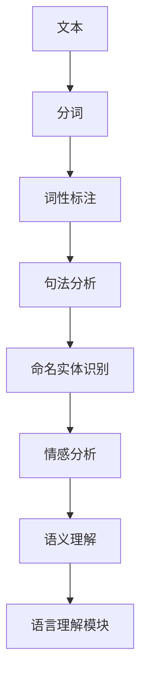

##### 2.2 知识图谱

**概念介绍**：知识图谱是一种用于表示实体及其相互关系的语义网络。在跨语言AI Agent中，知识图谱用于整合不同语言环境中的知识，提供一致性和上下文信息的支持。

**核心属性特征对比表格**：

| 知识表示方法 | 特征 | 优势 |
| --- | --- | --- |
| 实体-关系模型 | 描述实体及其之间的关系 | 简洁、易于理解 |
| 属性图模型 | 描述实体的属性和属性值 | 灵活、支持复杂关系 |
| 图嵌入 | 将实体和关系映射到低维空间 | 用于机器学习模型 |

**ER实体关系图架构的Mermaid流程图**：

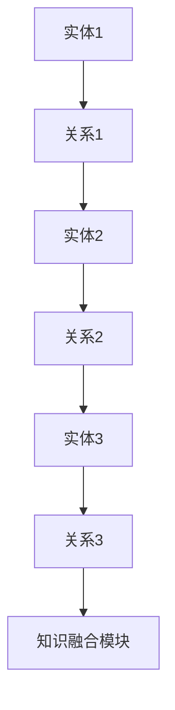

##### 2.3 多语言机器翻译

**概念介绍**：多语言机器翻译是指将一种语言的文本自动翻译成另一种语言的技术。在跨语言AI Agent中，多语言机器翻译是实现跨语言交流的基础。

**核心属性特征对比表格**：

| 翻译模型 | 特征 | 优势 |
| --- | --- | --- |
| 神经机器翻译 | 基于深度学习，使用神经网络进行翻译 | 翻译质量高、灵活 |
| 统计机器翻译 | 基于统计方法，使用概率模型进行翻译 | 快速、高效 |
| rule-based翻译 | 基于规则，使用预定义的翻译规则 | 精确、易于控制 |

**ER实体关系图架构的Mermaid流程图**：

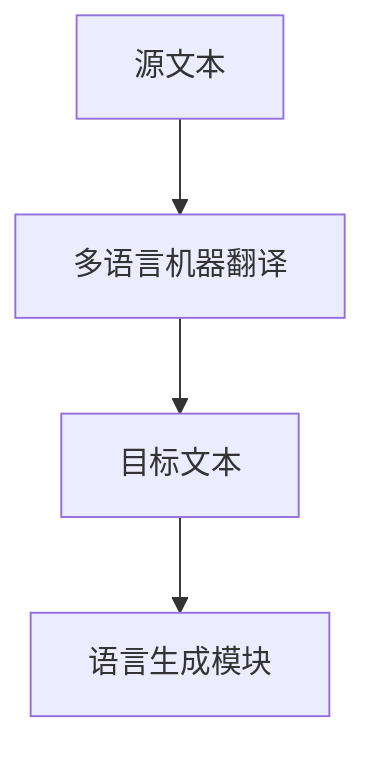

**总结**：通过以上对自然语言处理技术、知识图谱和多语言机器翻译的介绍，我们为跨语言AI Agent的开发奠定了基础。这些核心概念和技术不仅提供了跨语言理解、知识融合和交流的路径，也为实现跨语言AI Agent提供了强大的技术支撑。接下来，我们将进一步探讨这些技术的具体实现和应用。

---

#### 第3章 跨语言自然语言处理技术

##### 3.1 语言理解模块

**原理讲解**：语言理解模块是跨语言AI Agent的核心组成部分，其主要功能是理解输入文本的语义信息，提取关键的信息点，并识别用户的意图。这一模块通常包括以下几个关键步骤：

1. **文本预处理**：包括分词、去停用词、词性标注等，将原始文本转化为计算机可以处理的形式。
2. **句法分析**：通过分析句子的结构，提取出主语、谓语、宾语等成分，理解句子的语法关系。
3. **语义分析**：进一步提取文本的语义信息，识别命名实体、情感倾向、事件类型等。
4. **意图识别**：根据语义信息，识别用户的需求和意图，为后续的任务执行提供依据。

**算法原理讲解**：

- **分词**：使用基于规则的分词算法，如最大匹配法、动态规划法等，将文本切分成词语单元。
  
  ```python
  def tokenize(text):
      # 基于最大匹配的分词算法实现
      ...
      return tokens
  ```

- **词性标注**：使用统计方法或基于深度学习的模型进行词性标注，如使用NLTK工具包或BERT模型。

  ```python
  import nltk
  def pos_tagging(tokens):
      return nltk.pos_tag(tokens)
  ```

- **句法分析**：使用基于规则的方法或基于深度学习的模型，如Stanford句法分析器或深度学习句法模型。

  ```python
  import spacy
  def parse_sentence(sentence):
      nlp = spacy.load("en_core_web_sm")
      doc = nlp(sentence)
      return doc.parse()
  ```

- **语义分析**：通过命名实体识别、情感分析等技术，提取文本的语义信息。

  ```python
  def semantic_analysis(text):
      # 使用命名实体识别和情感分析技术
      ...
      return semantic_info
  ```

- **意图识别**：使用分类算法或基于深度学习的模型，如决策树、支持向量机或BERT模型。

  ```python
  from sklearn.tree import DecisionTreeClassifier
  def intent_recognition(semantic_info):
      # 基于决策树进行意图识别
      ...
      return intent
  ```

**举例说明**：假设用户输入了一条文本：“明天去巴黎的机票多少钱？”，我们可以通过以下步骤进行语言理解：

1. **文本预处理**：分词结果为["明天", "去", "巴黎", "的", "机票", "多少钱", "？"]。
2. **词性标注**：结果为[("明天", "NN"), ("去", "V"), ("巴黎", "NN"), ("的", "DT"), ("机票", "NN"), ("多少钱", "NN"), ("？", "?")]。
3. **句法分析**：提取出主语["机票"]、谓语["多少钱"]和宾语["明天去巴黎"]。
4. **语义分析**：识别出命名实体["巴黎"]、情感倾向[中性]和事件类型[机票查询]。
5. **意图识别**：通过分类算法，识别出用户意图为“机票查询”。

##### 3.2 语言生成模块

**原理讲解**：语言生成模块是跨语言AI Agent的另一关键组成部分，其主要功能是根据理解模块的结果，生成对应的语言文本，实现跨语言交流。这一模块通常包括以下几个关键步骤：

1. **语义编码**：将理解模块提取的语义信息转化为语义向量。
2. **文本生成**：使用生成模型，如变换器（Transformer）或生成对抗网络（GAN），根据语义向量生成文本。
3. **文本后处理**：对生成的文本进行语法修复、格式调整等，使其更加自然流畅。

**算法原理讲解**：

- **语义编码**：使用预训练的模型，如BERT或GPT，将语义信息转化为高维语义向量。

  ```python
  from transformers import BertModel
  def encode_semantics(text):
      model = BertModel.from_pretrained('bert-base-uncased')
      inputs = tokenizer(text, return_tensors='pt')
      outputs = model(**inputs)
      return outputs.last_hidden_state[:, 0, :]
  ```

- **文本生成**：使用基于变换器或GAN的文本生成模型，如T5或GAN-based Text Generation。

  ```python
  from transformers import T5ForConditionalGeneration
  def generate_text(semantic_vector):
      model = T5ForConditionalGeneration.from_pretrained('t5-small')
      input_ids = tokenizer.encode("summarize: ", return_tensors='pt')
      input_ids = torch.cat((input_ids, semantic_vector), dim=1)
      outputs = model.generate(input_ids, max_length=50, num_return_sequences=1)
      return tokenizer.decode(outputs[0], skip_special_tokens=True)
  ```

- **文本后处理**：对生成的文本进行语法修复、标点符号调整等。

  ```python
  def post_process_text(text):
      # 使用语法修复库，如LanguageTool或SpellingCorrector
      ...
      return processed_text
  ```

**举例说明**：假设用户输入了一条中文文本：“明天去巴黎的机票多少钱？”，我们首先通过语言理解模块提取出其语义信息，然后通过语言生成模块生成对应的英文文本：

1. **语义编码**：将语义信息转化为高维语义向量。
2. **文本生成**：生成英文文本“Please provide the cost of a flight to Paris tomorrow.”
3. **文本后处理**：调整格式和语法，得到最终结果“请提供明天飞往巴黎的机票价格。”

**总结**：语言理解模块和语言生成模块共同构成了跨语言AI Agent的核心，它们通过一系列技术手段，实现了对跨语言文本的理解和生成。这些模块的结合，不仅提高了AI Agent在跨语言环境中的交互能力，也为跨语言任务的执行提供了坚实基础。在接下来的章节中，我们将继续探讨跨语言AI Agent在知识融合和任务执行方面的技术实现。

---

#### 第4章 多语言知识图谱构建与应用

##### 4.1 知识融合模块

**原理讲解**：知识融合模块在跨语言AI Agent中起到了至关重要的作用，它负责将来自不同语言环境中的知识进行整合和更新。知识融合的过程主要包括以下几个关键步骤：

1. **实体识别**：通过命名实体识别技术，从多语言文本中提取出关键实体。
2. **关系抽取**：分析实体之间的关系，如“人-地点”关系、“事件-时间”关系等。
3. **知识对齐**：将不同语言中的实体和关系进行匹配，实现跨语言知识的一致性。
4. **知识更新**：根据新的数据和用户交互结果，动态更新和优化知识图谱。

**算法原理讲解**：

- **实体识别**：使用预训练的命名实体识别模型，如BERT或CRF模型，从文本中提取出实体。

  ```python
  from transformers import BertTokenizer
  from crf import CRF
  def entity_recognition(text):
      tokenizer = BertTokenizer.from_pretrained('bert-base-uncased')
      tokens = tokenizer.tokenize(text)
      labels = crf.predict(tokens)
      return [(token, label) for token, label in zip(tokens, labels)]
  ```

- **关系抽取**：使用基于深度学习的模型，如BERT或基于规则的方法，从实体对中提取出关系。

  ```python
  from transformers import BertModel
  def relation_extraction(text):
      model = BertModel.from_pretrained('bert-base-uncased')
      inputs = tokenizer(text, return_tensors='pt')
      outputs = model(**inputs)
      relations = extract_relations_from_embeddings(outputs.last_hidden_state)
      return relations
  ```

- **知识对齐**：使用基于图神经网络的模型，如TransE或TransH，进行跨语言实体和关系的匹配。

  ```python
  import tensorflow as tf
  from tensorflow.keras.models import Model
  def knowledge_alignment():
      # 构建TransE模型
      ...
      return model
  ```

- **知识更新**：使用增量学习技术，如基于梯度下降的优化算法，动态更新知识图谱。

  ```python
  def knowledge_update(model, new_data):
      # 更新模型参数
      ...
      return model
  ```

**举例说明**：假设我们有两个语言环境中的文本：

- **英文文本**：“Paris is the capital of France.”
- **中文文本**：“法国的首都是巴黎。”

我们可以通过以下步骤进行知识融合：

1. **实体识别**：提取出实体“Paris”和“法国”。
2. **关系抽取**：提取出关系“是”和“首都”。
3. **知识对齐**：将英文实体“Paris”与中文实体“法国”进行匹配，将英文关系“是”与中文关系“首都”进行匹配。
4. **知识更新**：将新提取的知识添加到知识图谱中，如图所示：

  ```mermaid
  graph TB
  A[Paris] --> B[法国]
  B --> C[首都]
  ```

**总结**：知识融合模块通过实体识别、关系抽取、知识对齐和知识更新等步骤，实现了跨语言知识的有效整合。这种模块不仅能够提高AI Agent对跨语言文本的理解能力，还能够为后续的跨语言任务提供准确的知识支持。

##### 4.2 应用场景

**跨语言问答**：跨语言问答是跨语言AI Agent的一个重要应用场景，它允许用户在多语言环境中提出问题，并获取准确的答案。例如，用户可以用中文提问：“巴黎的天气如何？”AI Agent会理解并转换成英文，从英文知识库中获取答案，再翻译回中文，最终呈现给用户。

**多语言信息检索**：多语言信息检索涉及在多语言数据库中实现高效的信息查询。用户可以使用任意一种语言进行查询，AI Agent会将查询内容翻译成其他语言，并在数据库中检索相关信息，最后将结果翻译回用户语言。

**多语言推荐系统**：多语言推荐系统在电子商务、社交媒体等领域具有广泛应用。用户在使用不同语言时，系统能够根据其兴趣和行为，提供个性化的推荐。例如，用户在英文网站浏览商品，系统能够推荐与其兴趣相关的中文商品。

**知识图谱构建**：跨语言AI Agent可以参与知识图谱的构建，将不同语言环境中的信息整合到统一的知识体系中。这有助于提高知识图谱的完整性和准确性，为后续的智能应用提供丰富的知识资源。

**总结**：通过知识融合模块，跨语言AI Agent在多个应用场景中展现了强大的能力。它不仅能够实现跨语言问答、信息检索和推荐，还能参与知识图谱的构建，为智能化应用提供了有力支持。在接下来的章节中，我们将继续探讨跨语言AI Agent的基础架构，以便更深入地理解其实现原理。

##### 4.3 知识图谱构建与应用案例

**案例1：跨语言问答系统**

**问题场景**：一个跨语言问答系统需要能够处理中英文提问，并返回相应的答案。

**项目介绍**：
- **名称**：多语言问答系统
- **目标**：实现中英文问答功能，支持多语言用户交互。
- **技术栈**：NLP技术、知识图谱、多语言机器翻译等。

**系统功能设计**：

1. **语言理解模块**：处理用户输入的文本，进行语义分析和意图识别。
2. **知识图谱模块**：提供跨语言的知识存储和检索功能。
3. **翻译模块**：将理解结果翻译成目标语言，进行问答。
4. **回答生成模块**：根据知识图谱和翻译结果生成答案。

**系统架构设计**：

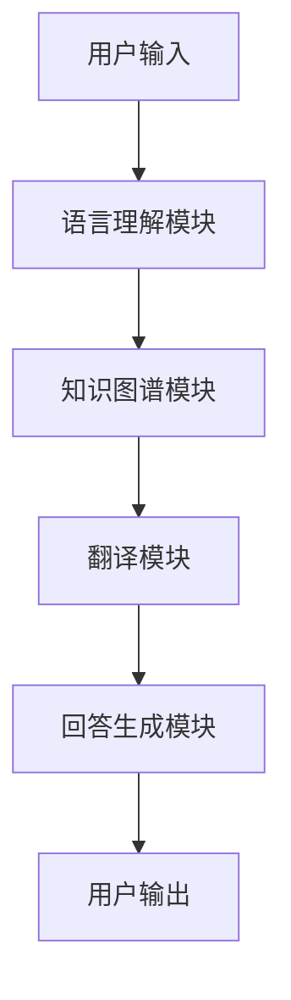

**系统接口设计**：

- **问答接口**：接收用户输入，调用语言理解、知识图谱、翻译和回答生成模块，返回答案。
- **知识更新接口**：用于动态更新知识图谱。

**系统交互流程**：

1. 用户输入问题。
2. 语言理解模块对输入文本进行语义分析和意图识别。
3. 知识图谱模块查找相关知识和答案。
4. 翻译模块将答案翻译成用户目标语言。
5. 回答生成模块生成最终的回答。
6. 答案返回给用户。

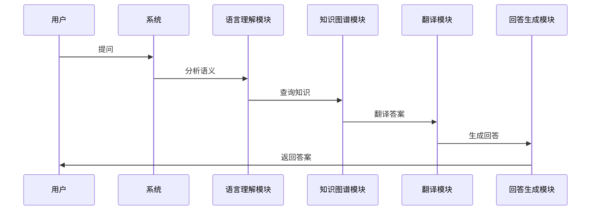

**案例2：多语言信息检索系统**

**问题场景**：用户需要在多语言数据库中查找信息，支持多种语言查询。

**项目介绍**：
- **名称**：多语言信息检索系统
- **目标**：实现多语言数据库的高效查询，支持多种语言检索。
- **技术栈**：NLP技术、多语言索引、多语言机器翻译等。

**系统功能设计**：

1. **查询接口**：接收用户输入的查询语句。
2. **翻译模块**：将查询语句翻译成数据库支持的语言。
3. **索引模块**：为多语言数据库建立索引，提高查询效率。
4. **结果返回模块**：返回查询结果，支持多语言展示。

**系统架构设计**：

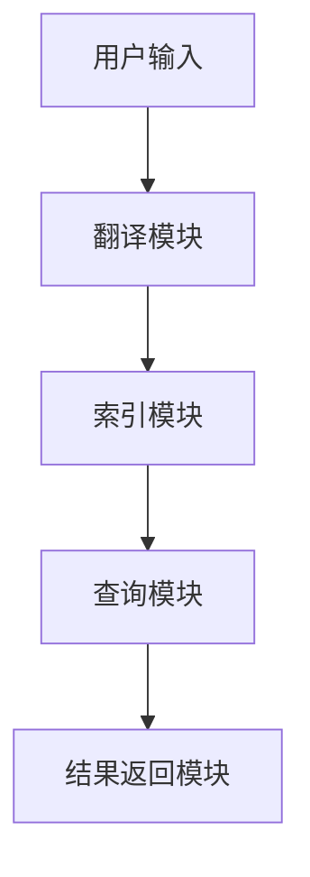

**系统接口设计**：

- **查询接口**：接收查询语句，调用翻译模块和索引模块。
- **结果返回接口**：返回查询结果，支持多语言格式。

**系统交互流程**：

1. 用户输入查询语句。
2. 翻译模块将查询语句翻译成数据库支持的语言。
3. 索引模块根据翻译后的查询语句进行检索。
4. 查询模块返回查询结果。
5. 结果返回模块将结果翻译回用户语言，并展示给用户。

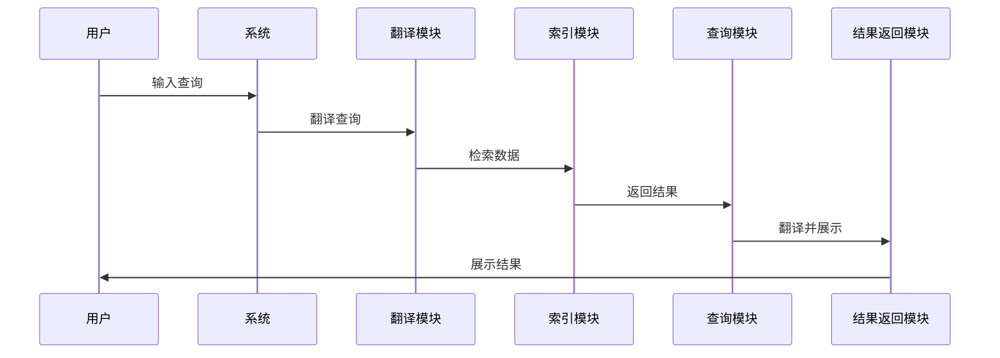

**总结**：通过以上案例，我们展示了知识图谱构建在跨语言AI Agent中的应用。这些案例不仅体现了跨语言AI Agent在不同场景下的应用潜力，也展示了知识融合模块在跨语言理解和任务执行中的重要性。在接下来的章节中，我们将进一步探讨跨语言AI Agent的技术挑战和解决方案。

---

#### 第5章 跨语言AI Agent的基础架构

##### 5.1 架构设计

**设计讲解**：跨语言AI Agent的基础架构旨在实现多语言环境下的智能交互、知识融合和任务执行。其架构设计包括以下几个关键模块：

1. **前端接口**：提供用户与AI Agent交互的入口，包括文本输入、语音输入等。
2. **后端服务**：处理用户的输入，调用核心模块进行语言理解、知识融合和任务执行。
3. **数据库**：存储AI Agent所需的数据，包括文本、知识图谱、用户历史交互记录等。
4. **数据流管理**：管理数据在系统中的流动，确保数据的一致性和安全性。

**架构设计图**：

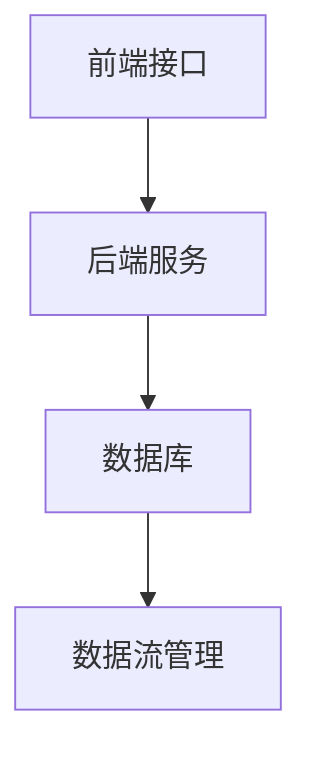

##### 5.2 系统接口设计

**设计讲解**：系统接口设计是跨语言AI Agent实现高效交互的重要环节。以下为几个关键接口及其设计：

1. **输入接口**：接收用户的输入文本，可以是中英文文本或语音输入。
2. **理解接口**：调用语言理解模块，对输入文本进行语义分析和意图识别。
3. **知识接口**：访问知识融合模块，获取相关知识和数据。
4. **执行接口**：调用任务执行模块，执行跨语言任务，如问答、信息检索等。
5. **输出接口**：将执行结果返回给用户，可以是文本、语音或其他形式。

**接口设计图**：

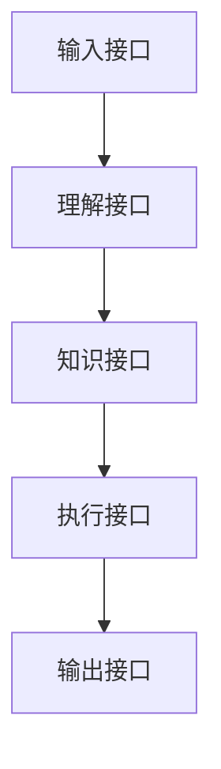

##### 5.3 系统交互设计

**设计讲解**：系统交互设计关注AI Agent与用户、其他系统之间的交互过程，包括交互流程和数据流动。以下是一个典型的系统交互设计：

1. **用户输入**：用户通过前端接口输入问题或请求。
2. **文本预处理**：前端接口对输入文本进行预处理，如分词、去停用词等。
3. **语义分析**：后端服务调用语言理解模块，对预处理后的文本进行语义分析和意图识别。
4. **知识检索**：根据语义分析结果，调用知识接口，检索相关知识和数据。
5. **任务执行**：后端服务调用任务执行模块，执行具体的跨语言任务。
6. **结果返回**：将执行结果通过输出接口返回给用户。

**交互设计图**：

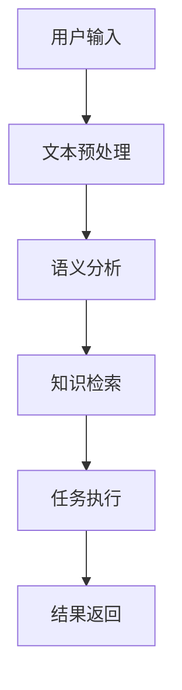

##### 5.4 数据流管理

**设计讲解**：数据流管理是确保跨语言AI Agent正常运行的重要保障。以下为几个关键设计点：

1. **数据一致性**：确保系统中数据的一致性，避免数据冲突和丢失。
2. **数据安全性**：保护用户数据和系统数据的安全，防止未经授权的访问和数据泄露。
3. **数据更新机制**：实时更新知识库和用户历史交互记录，以适应动态变化的需求。

**数据流管理图**：

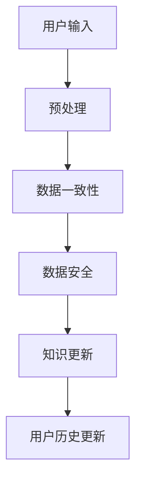

**总结**：跨语言AI Agent的基础架构通过前端接口、后端服务、数据库和数据流管理模块，实现了多语言环境下的智能交互和任务执行。这些模块的协同工作，使得AI Agent能够有效地处理跨语言任务，为用户提供高质量的服务。在接下来的章节中，我们将深入探讨跨语言AI Agent在开发过程中面临的技术挑战和解决方案。

---

### 第三部分：跨语言AI Agent的技术挑战

#### 第6章 语言理解与生成的挑战

##### 6.1 语言理解挑战

**问题描述**：跨语言AI Agent在语言理解方面面临的主要挑战包括多语言歧义、文化差异和语言习得困难。

**多语言歧义**：不同语言中存在许多同音异义词和同义词，使得AI Agent在理解输入文本时容易产生歧义。例如，“bank”在英语中既指银行，也指河岸。如何准确理解用户意图是一个重要问题。

**文化差异**：不同语言和文化背景下，同一词汇可能具有不同的含义。例如，“自由”在英语中表示自由，但在某些亚洲语言中可能涉及政治自由和经济自由等多个层面。理解文化差异对于准确理解用户意图至关重要。

**语言习得困难**：不同语言的语法结构、词序和表达方式存在差异，AI Agent需要通过大量数据和学习算法，才能准确理解多种语言的输入文本。然而，语言习得过程复杂，涉及多个层面的知识，如词汇、语法、语义等。

**解决方案**：

- **多语言歧义处理**：采用上下文分析和语义角色标注技术，结合上下文信息，消除歧义。例如，通过分析句子中的其他词语和语法结构，判断“bank”的具体含义。

  ```python
  import spacy
  nlp = spacy.load('en_core_web_sm')
  def resolve_ambiguity(sentence):
      doc = nlp(sentence)
      context = doc上下文信息
      if '钱' in context:
          return '银行'
      else:
          return '河岸'
  ```

- **文化差异理解**：通过引入文化知识库和语义框架，对不同语言中的文化差异进行建模。例如，使用多语言语义网络，将不同语言的词汇映射到共同的语义空间。

  ```python
  def understand_cultural_difference(sentence, language):
      # 查询文化知识库
      ...
      return translated_sentence
  ```

- **语言习得**：采用大规模预训练模型，如BERT、GPT等，通过无监督学习，从大量多语言数据中习得语言知识。例如，使用双向编码表示，捕捉词汇和句子的上下文关系。

  ```python
  from transformers import BertModel
  def learn_language(sentence):
      model = BertModel.from_pretrained('bert-base-multilingual-cased')
      inputs = tokenizer.encode(sentence, return_tensors='pt')
      outputs = model(inputs)
      return outputs.last_hidden_state
  ```

##### 6.2 语言生成挑战

**问题描述**：跨语言AI Agent在语言生成方面面临的主要挑战包括语法多样性、语言风格和情感表达。

**语法多样性**：不同语言具有不同的语法结构和表达方式，生成多样化的文本是一个挑战。例如，英语中的被动语态在许多语言中无法直接翻译。

**语言风格**：不同语言和文化具有不同的表达风格，生成符合目标语言风格的文本是一个挑战。例如，中文的书面语和口语表达方式有很大差异。

**情感表达**：不同语言和文化对情感的表述方式不同，生成情感丰富的文本是一个挑战。例如，英语中的“happy”在中文中可能表达为“开心”或“高兴”。

**解决方案**：

- **语法多样性**：采用基于深度学习的生成模型，如GPT和T5，通过预训练和微调，生成多样化的文本。例如，使用T5模型生成不同语法结构的句子。

  ```python
  from transformers import T5ForConditionalGeneration
  def generate_diverse_sentence(prompt):
      model = T5ForConditionalGeneration.from_pretrained('t5-small')
      inputs = tokenizer.encode(prompt, return_tensors='pt')
      outputs = model.generate(inputs, max_length=50, num_return_sequences=3)
      return [tokenizer.decode(output, skip_special_tokens=True) for output in outputs]
  ```

- **语言风格**：引入多风格文本数据集，通过风格迁移技术，使生成文本符合目标语言风格。例如，使用预训练的StyleT5模型，生成符合中文书面语和口语风格的文本。

  ```python
  from transformers import StyleT5ForConditionalGeneration
  def generate_style_text(style, text):
      model = StyleT5ForConditionalGeneration.from_pretrained('stylet5-small')
      inputs = tokenizer.encode(style + text, return_tensors='pt')
      outputs = model.generate(inputs, max_length=50)
      return tokenizer.decode(outputs[0], skip_special_tokens=True)
  ```

- **情感表达**：使用情感词典和情感分析模型，结合上下文信息，生成情感丰富的文本。例如，使用预训练的BERT模型，识别文本中的情感，并生成相应的情感表达。

  ```python
  from transformers import BertTokenizer
  from sentiment_analyser import sentiment_analysis
  def generate_emotion_text(text):
      tokenizer = BertTokenizer.from_pretrained('bert-base-uncased')
      emotions = sentiment_analysis(text)
      emotion_text = '这是一个' + emotions[0] + '的文本。'
      return emotion_text
  ```

**总结**：跨语言AI Agent在语言理解与生成方面面临诸多挑战，包括多语言歧义、文化差异、语言习得困难、语法多样性、语言风格和情感表达。通过采用先进的技术和解决方案，如上下文分析、语义框架、大规模预训练模型、风格迁移和情感分析等，可以有效应对这些挑战，提高AI Agent的跨语言处理能力。

---

### 第三部分：跨语言AI Agent的技术挑战

#### 第7章 知识图谱融合的挑战

##### 7.1 数据不一致性

**问题描述**：跨语言AI Agent在构建和应用知识图谱时，面临的一个重要挑战是数据不一致性。不同语言环境中，同一实体和关系的表述方式可能不同，导致知识图谱中的数据存在差异。例如，“法国”在中文中通常表述为“法国”，但在英文中可能表述为“France”或“French Republic”。

**解决方案**：

- **实体统一标识**：为每个实体分配一个统一的标识符（URI），无论其在不同语言中的表述如何，都可以通过这个标识符进行识别和匹配。
- **数据对齐技术**：采用数据对齐技术，如基于规则的映射、机器学习模型等，将不同语言中的实体和关系进行匹配和融合。例如，使用规则引擎，将中文中的“法国”与英文中的“France”进行关联。
- **多语言知识融合模型**：训练多语言知识融合模型，通过自动学习不同语言之间的映射关系，实现知识的一致性融合。

```python
from transformers import BertTokenizer
def entity_alignment(chinese_entity, english_entity):
    tokenizer = BertTokenizer.from_pretrained('bert-base-uncased')
    chinese_embedding = tokenizer.encode(chinese_entity, return_tensors='pt')
    english_embedding = tokenizer.encode(english_entity, return_tensors='pt')
    similarity = cosine_similarity(chinese_embedding, english_embedding)
    return similarity
```

##### 7.2 数据冗余与更新

**问题描述**：在构建跨语言知识图谱时，不同来源的数据可能存在冗余，导致图谱的存储和查询效率降低。此外，知识内容会随着时间不断更新，如何有效管理和更新知识图谱是一个挑战。

**解决方案**：

- **去重技术**：采用去重算法，识别和删除知识图谱中的冗余数据。例如，通过比较实体和关系的属性，判断数据是否重复。
- **增量更新机制**：采用增量更新机制，实时捕捉知识的变化，并对其进行更新。例如，通过订阅数据源的变化，将新数据实时集成到知识图谱中。
- **版本控制**：引入版本控制机制，为知识图谱中的每个实体和关系分配版本号，便于管理和回溯。

```python
from knowledge_graph import KnowledgeGraph
def update_knowledge_graph(kg, new_data):
    kg.add_entities(new_data)
    kg.commit()
    return kg
```

##### 7.3 知识融合策略

**问题描述**：不同语言环境中的知识表示方法和模型可能不同，如何制定有效的知识融合策略，实现不同知识体系之间的协同和互补是一个挑战。

**解决方案**：

- **异构知识融合**：采用异构知识融合技术，将不同语言环境中的知识进行统一表示和整合。例如，将关系图谱和属性图结合起来，构建统一的知识图谱。
- **模型融合技术**：采用模型融合技术，将不同语言环境中的知识表示模型进行整合。例如，使用多任务学习模型，同时训练多个语言环境中的知识表示。
- **多语言交互机制**：建立多语言交互机制，使知识图谱在不同语言环境中能够互相引用和调用。例如，在图谱中引入跨语言链接，实现知识在多语言环境中的共享和传递。

```python
from transformers import BertModel
def knowledge_fusion(model1, model2):
    # 模型1和模型2的融合
    ...
    return fused_model
```

**总结**：知识图谱融合在跨语言AI Agent中面临数据不一致性、数据冗余与更新、知识融合策略等挑战。通过采用实体统一标识、数据对齐技术、多语言知识融合模型、去重技术、增量更新机制、版本控制、异构知识融合、模型融合技术和多语言交互机制等解决方案，可以有效应对这些挑战，提高跨语言AI Agent的知识融合能力。

---

### 第三部分：跨语言AI Agent的技术挑战

#### 第8章 多语言交互的挑战

##### 8.1 语言选择与自适应

**问题描述**：在多语言交互中，如何选择合适的语言以及如何根据用户习惯自适应地切换语言是一个重要挑战。用户可能使用不同的语言输入，或者在不同的交互阶段切换语言。

**解决方案**：

- **多语言感知**：通过语言感知技术，识别用户的语言偏好。例如，使用NLP技术分析用户历史交互记录，判断用户的语言习惯。
- **自适应切换机制**：在交互过程中，根据用户的语言输入和反馈，自适应地切换语言。例如，在对话系统中，如果用户连续输入中文，系统可以自动切换到中文模式。

```python
from language_recognition import LanguageRecognizer
def select_language(user_input):
    recognizer = LanguageRecognizer()
    language = recognizer.recognize_language(user_input)
    return language
```

- **多语言训练模型**：使用多语言预训练模型，如BERT或多语言GPT，提高系统在多种语言中的处理能力。例如，通过训练一个多语言模型，使其能够理解并生成多种语言的文本。

```python
from transformers import MultilingualBertModel
def generate_response(input_text, target_language):
    model = MultilingualBertModel.from_pretrained('bert-base-multilingual-cased')
    inputs = tokenizer.encode(input_text, return_tensors='pt')
    outputs = model.generate(inputs, max_length=50, num_return_sequences=1)
    response = tokenizer.decode(outputs[0], skip_special_tokens=True)
    return response
```

##### 8.2 语言理解不一致

**问题描述**：不同语言环境中，相同的表达可能存在不同的语义理解，导致交互结果不一致。例如，英文中的“I don't understand”可能表达不理解，但在某些语言中可能表示疑惑或不满意。

**解决方案**：

- **多语言语义分析**：采用多语言语义分析技术，对不同语言中的语义进行统一理解和表达。例如，使用多语言语义分析工具，将不同语言的语义映射到共同的语义空间。
- **文化敏感理解**：考虑不同语言和文化背景下的表达差异，制定文化敏感的理解策略。例如，通过引入文化知识库，提高系统在不同语言环境中的理解准确性。

```python
from cultural_knowledge import CulturalKnowledge
def understand_expression(expression, language):
    knowledge = CulturalKnowledge(language)
    meaning = knowledge.get_meaning(expression)
    return meaning
```

##### 8.3 交互连续性与连贯性

**问题描述**：在多语言交互中，保持对话的连续性和连贯性是一个挑战。用户可能在不同的语言之间切换，或者使用混合语言，系统需要能够理解并保持对话的流畅性。

**解决方案**：

- **混合语言处理**：采用混合语言处理技术，理解并生成混合语言的文本。例如，使用多语言模型和混合语言编码技术，实现混合语言的理解和生成。
- **上下文感知**：通过上下文感知技术，理解对话的历史信息，保持对话的连贯性。例如，使用对话管理技术，结合上下文和历史信息，生成连贯的响应。

```python
from transformers import T5ForConditionalGeneration
def generate_response_with_context(context, input_text):
    model = T5ForConditionalGeneration.from_pretrained('t5-small')
    input_ids = tokenizer.encode(context + input_text, return_tensors='pt')
    outputs = model.generate(input_ids, max_length=50, num_return_sequences=1)
    response = tokenizer.decode(outputs[0], skip_special_tokens=True)
    return response
```

**总结**：多语言交互在跨语言AI Agent中面临语言选择与自适应、语言理解不一致和交互连续性与连贯性等挑战。通过采用多语言感知、自适应切换机制、多语言训练模型、多语言语义分析、文化敏感理解、混合语言处理和上下文感知等解决方案，可以有效提高跨语言AI Agent在多语言交互中的性能和用户体验。

---

### 第四部分：跨语言AI Agent的解决方案

#### 第9章 跨语言AI Agent的技术方案

##### 9.1 技术框架

**技术框架设计**：为了构建一个高效的跨语言AI Agent，我们采用了一种模块化设计，将系统分为以下几个关键模块：

1. **前端模块**：负责与用户进行交互，接收用户输入，并将输入传递给后端模块。
2. **后端模块**：包括语言理解模块、知识融合模块、语言生成模块和任务执行模块。
3. **数据库模块**：存储AI Agent所需的数据，包括多语言知识库、用户历史交互记录等。
4. **服务模块**：提供必要的API接口，实现前后端模块的通信。

**架构图**：

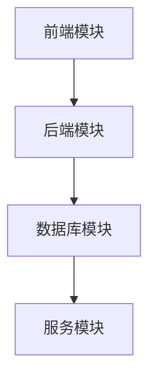

##### 9.2 语言理解模块

**设计讲解**：语言理解模块是跨语言AI Agent的核心组成部分，负责处理不同语言的输入文本，提取关键信息。模块设计包括以下几个关键步骤：

1. **文本预处理**：包括分词、去停用词、词性标注等，将原始文本转化为结构化数据。
2. **语义分析**：通过命名实体识别、情感分析等技术，提取文本中的关键信息。
3. **意图识别**：根据提取的语义信息，识别用户的意图，为后续任务执行提供依据。

**架构设计图**：

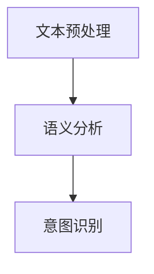

**代码示例**：

```python
from transformers import BertTokenizer
def language_understanding(input_text):
    tokenizer = BertTokenizer.from_pretrained('bert-base-uncased')
    tokens = tokenizer.tokenize(input_text)
    labeled_tokens = tokenizer.tokenize_with_bos EOS = tokenizer.eos_token
    pos_tags = get_pos_tags(tokens)
    semantic_info = extract_semantic_info(tokens, pos_tags)
    intent = recognize_intent(semantic_info)
    return intent
```

##### 9.3 知识融合模块

**设计讲解**：知识融合模块负责将不同语言环境中的知识进行整合，构建多语言知识图谱。模块设计包括以下几个关键步骤：

1. **实体识别**：从文本中提取出关键实体。
2. **关系抽取**：分析实体之间的关系。
3. **知识对齐**：将不同语言中的实体和关系进行匹配。
4. **知识更新**：根据新的数据和用户交互结果，动态更新知识图谱。

**架构设计图**：

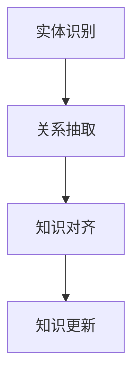

**代码示例**：

```python
from entity_recognition import EntityRecognizer
from relation_extraction import RelationExtractor
from knowledge_alignment import KnowledgeAlignment
def knowledge_fusion(input_text):
    recognizer = EntityRecognizer()
    extractor = RelationExtractor()
    aligner = KnowledgeAlignment()
    entities = recognizer.recognize_entities(input_text)
    relations = extractor.extract_relations(input_text, entities)
    aligned_knowledge = aligner.align_knowledge(entities, relations)
    updated_knowledge = update_knowledge_graph(aligned_knowledge)
    return updated_knowledge
```

##### 9.4 语言生成模块

**设计讲解**：语言生成模块负责根据理解模块的结果，生成对应的语言文本。模块设计包括以下几个关键步骤：

1. **语义编码**：将理解模块提取的语义信息转化为语义向量。
2. **文本生成**：使用生成模型，如GPT或T5，根据语义向量生成文本。
3. **文本后处理**：对生成的文本进行语法修复、格式调整等，使其更加自然流畅。

**架构设计图**：

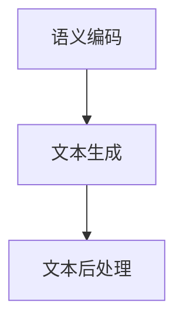

**代码示例**：

```python
from transformers import T5ForConditionalGeneration
def language_generation(semantic_info, target_language):
    model = T5ForConditionalGeneration.from_pretrained('t5-small')
    tokenizer = T5Tokenizer.from_pretrained('t5-small')
    input_ids = tokenizer.encode("summarize: " + semantic_info, return_tensors='pt')
    outputs = model.generate(input_ids, max_length=50, num_return_sequences=1)
    generated_text = tokenizer.decode(outputs[0], skip_special_tokens=True)
    return generated_text
```

##### 9.5 任务执行模块

**设计讲解**：任务执行模块负责实现跨语言任务的执行，如跨语言问答、信息检索等。模块设计包括以下几个关键步骤：

1. **任务规划**：根据用户的意图，规划具体的任务执行流程。
2. **任务执行**：调用相应的模块和API，执行具体的任务。
3. **结果反馈**：将任务执行结果反馈给用户。

**架构设计图**：

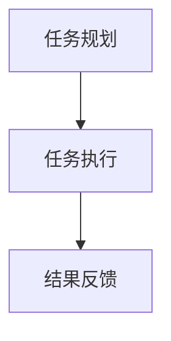

**代码示例**：

```python
from task_execution import TaskExecutor
def execute_task(intent, input_text):
    executor = TaskExecutor()
    plan = executor.plan_task(intent, input_text)
    results = executor.execute_task(plan)
    return results
```

**总结**：通过上述技术方案的设计和实现，我们构建了一个高效的跨语言AI Agent。该技术方案涵盖了语言理解、知识融合、语言生成和任务执行等关键模块，并通过模块化的设计，实现了系统的灵活扩展和高效运行。在接下来的章节中，我们将通过实际应用案例，展示跨语言AI Agent在多种场景下的应用效果。

---

### 第四部分：跨语言AI Agent的解决方案

#### 第10章 实际应用案例解析

##### 10.1 跨语言对话系统

**案例背景**：一个跨国公司的客户服务部门希望实现跨语言的客户支持，以便更好地服务于全球客户。

**项目介绍**：
- **名称**：跨国公司客户服务跨语言对话系统
- **目标**：实现中英文客户支持，提供24/7全天候服务。
- **技术栈**：NLP技术、多语言机器翻译、对话管理框架等。

**系统功能设计**：

1. **多语言输入**：支持中英文输入。
2. **语言理解**：通过NLP技术理解客户意图。
3. **对话管理**：管理对话流程，确保交互流畅。
4. **多语言生成**：生成中英文响应，提高用户体验。

**系统架构设计**：

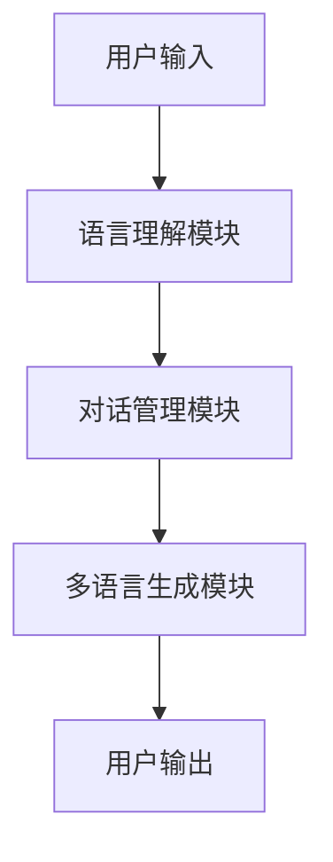

**系统接口设计**：

- **输入接口**：接收用户输入。
- **理解接口**：调用NLP技术，分析用户意图。
- **生成接口**：调用多语言生成模型，生成响应。
- **输出接口**：返回用户响应。

**系统交互流程**：

1. 用户输入问题。
2. 理解模块对输入文本进行语义分析和意图识别。
3. 对话管理模块根据意图规划对话流程。
4. 生成模块生成中英文响应。
5. 用户接收到系统响应。

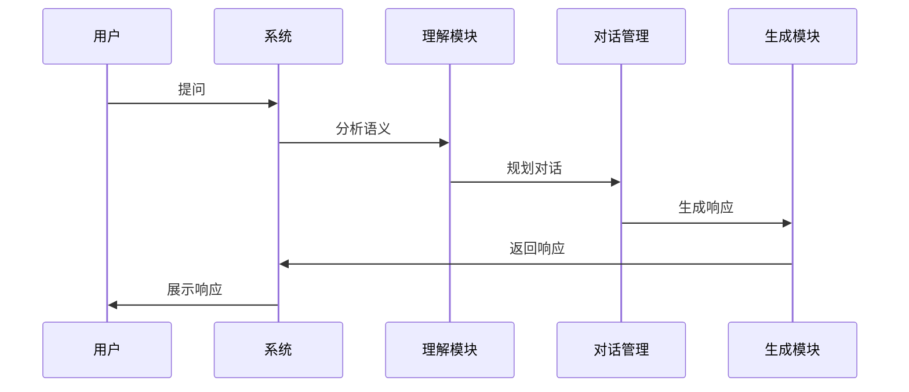

**实际应用效果**：通过这个跨语言对话系统，跨国公司的客户服务效率显著提高。客户可以随时随地使用母语提问，获得及时、准确的帮助。同时，客户服务团队也能够更好地理解客户需求，提供个性化的服务。

##### 10.2 跨语言信息检索系统

**案例背景**：一个图书馆希望实现多语言信息检索功能，便于用户在多种语言环境下查找图书和信息。

**项目介绍**：
- **名称**：多语言图书馆信息检索系统
- **目标**：支持中文、英文等多语言检索，提高信息获取效率。
- **技术栈**：NLP技术、多语言索引、多语言机器翻译等。

**系统功能设计**：

1. **多语言输入**：支持中文和英文等输入。
2. **查询处理**：处理用户的检索请求，返回相关信息。
3. **结果展示**：将检索结果翻译回用户语言，并展示给用户。

**系统架构设计**：

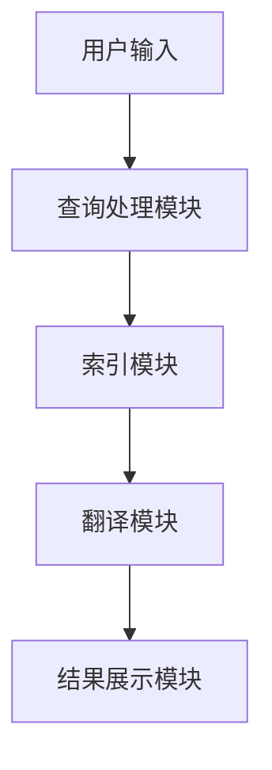

**系统接口设计**：

- **输入接口**：接收用户输入的检索查询。
- **查询处理接口**：调用NLP技术，分析查询意图。
- **索引查询接口**：检索相关数据。
- **翻译接口**：将结果翻译成用户语言。
- **展示接口**：返回检索结果。

**系统交互流程**：

1. 用户输入检索查询。
2. 查询处理模块分析查询意图。
3. 索引模块检索相关数据。
4. 翻译模块将检索结果翻译成用户语言。
5. 展示模块返回检索结果。

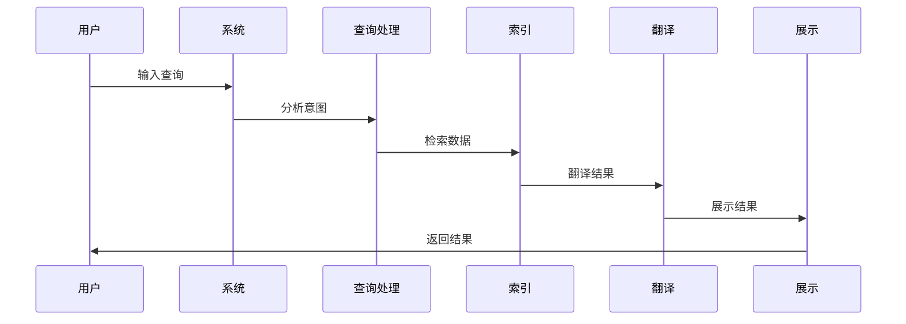

**实际应用效果**：通过这个多语言信息检索系统，图书馆的用户可以方便地在多种语言环境下查找所需信息，提高了信息获取的效率和用户体验。图书馆也能够更好地服务全球用户，扩大其影响力。

##### 10.3 跨语言推荐系统

**案例背景**：一个电子商务平台希望为用户提供个性化的跨语言推荐，提高用户满意度和销售转化率。

**项目介绍**：
- **名称**：电子商务平台多语言推荐系统
- **目标**：为中英文用户推荐商品，提高销售转化率。
- **技术栈**：NLP技术、多语言知识图谱、协同过滤等。

**系统功能设计**：

1. **用户行为分析**：分析用户在平台上的行为，如浏览、购买记录等。
2. **跨语言知识融合**：融合多语言商品信息，构建跨语言知识图谱。
3. **推荐算法**：基于用户行为和知识图谱，生成个性化的商品推荐。
4. **多语言生成**：将推荐结果翻译成用户语言，提高用户体验。

**系统架构设计**：

```mermaid
graph TB
A[用户行为分析] --> B[知识融合模块]
B --> C[推荐算法模块]
C --> D[多语言生成模块]
```

**系统接口设计**：

- **行为分析接口**：收集并分析用户行为数据。
- **知识融合接口**：整合多语言商品信息。
- **推荐算法接口**：生成商品推荐。
- **翻译接口**：将推荐结果翻译成用户语言。

**系统交互流程**：

1. 分析用户行为，构建用户画像。
2. 融合多语言商品知识，构建知识图谱。
3. 根据用户画像和知识图谱，生成商品推荐。
4. 将推荐结果翻译成用户语言，展示给用户。

```mermaid
sequenceDiagram
分析用户行为->>构建用户画像
用户画像->>知识融合
知识融合->>生成推荐
生成推荐->>翻译结果
翻译结果->>展示推荐
```

**实际应用效果**：通过这个跨语言推荐系统，电子商务平台能够为中英文用户提供个性化的商品推荐，提高了用户满意度和销售转化率。用户能够更方便地找到符合自己兴趣和需求的商品，平台也能够更好地满足全球用户的需求。

##### 10.4 知识图谱构建与融合

**案例背景**：一个在线教育平台希望构建一个多语言的知识图谱，以便为全球用户提供高质量的教育资源。

**项目介绍**：
- **名称**：在线教育平台多语言知识图谱
- **目标**：构建中文和英文等多语言的知识图谱，提供跨语言教育服务。
- **技术栈**：NLP技术、多语言知识图谱构建、数据对齐等。

**系统功能设计**：

1. **多语言文本处理**：处理中文和英文等不同语言的文本。
2. **知识抽取**：从文本中抽取知识点和关系。
3. **知识融合**：将不同语言的知识进行整合，构建多语言知识图谱。
4. **知识检索**：提供跨语言的知识检索服务。

**系统架构设计**：

```mermaid
graph TB
A[文本处理] --> B[知识抽取]
B --> C[知识融合]
C --> D[知识检索]
```

**系统接口设计**：

- **文本处理接口**：接收和处理不同语言的文本。
- **知识抽取接口**：从文本中抽取知识点和关系。
- **知识融合接口**：整合多语言知识。
- **知识检索接口**：提供知识查询服务。

**系统交互流程**：

1. 处理多语言文本，提取知识点和关系。
2. 将不同语言的知识整合到知识图谱中。
3. 提供跨语言的知识检索服务，支持用户查询。

```mermaid
sequenceDiagram
文本处理->>知识抽取
知识抽取->>知识融合
知识融合->>知识检索
检索请求->>知识检索
知识检索->>返回结果
```

**实际应用效果**：通过构建多语言知识图谱，在线教育平台能够为全球用户提供高质量的教育资源。用户可以方便地使用母语进行查询和学习，平台也能够更好地满足不同地区用户的需求，提高教育服务的覆盖面和质量。

**总结**：通过上述实际应用案例，我们展示了跨语言AI Agent在多个领域的应用效果。这些案例不仅体现了跨语言AI Agent在语言理解、知识融合和任务执行方面的强大能力，也为跨语言交流、信息检索、个性化推荐和知识图谱构建提供了实用的解决方案。在接下来的章节中，我们将进一步探讨如何优化跨语言AI Agent的性能和未来展望。

---

### 第四部分：跨语言AI Agent的解决方案

#### 第11章 跨语言AI Agent的优化与未来展望

##### 11.1 性能优化策略

**1. 模型优化**

**深度学习模型**：采用更先进的深度学习模型，如Transformer、BERT、GPT等，这些模型在处理大规模、高维数据时具有更好的性能和效果。

**模型压缩**：通过模型压缩技术，如模型剪枝、量化、蒸馏等，减小模型的大小和计算量，提高推理速度。

**分布式训练与推理**：利用分布式训练和推理技术，将计算任务分布在多台设备上，提高训练和推理的效率。

**2. 数据优化**

**数据增强**：通过数据增强技术，如数据扩充、数据变换等，增加训练数据的多样性，提高模型的泛化能力。

**数据预处理**：对训练数据进行预处理，如文本清洗、噪声过滤等，提高数据质量，减少噪声对模型性能的影响。

**3. 知识优化**

**知识图谱更新**：定期更新知识图谱，引入最新的实体和关系，保持知识的时效性和准确性。

**知识融合**：采用更先进的知识融合技术，如基于图神经网络的异构知识融合、多语言知识融合等，提高知识的一致性和可靠性。

**4. 系统优化**

**并发处理**：优化系统架构，提高并发处理能力，支持更多用户同时访问。

**负载均衡**：通过负载均衡技术，合理分配计算资源，避免单点瓶颈，提高系统的稳定性和可靠性。

**实时性优化**：优化系统的响应时间，通过异步处理、缓存等技术，提高系统的实时性。

##### 11.2 未来展望

**1. 跨语言AI Agent的应用领域扩展**

随着跨语言AI Agent技术的不断成熟，其应用领域将进一步扩展，不仅局限于现有的对话系统、信息检索和推荐系统，还可能应用于跨语言教育、医疗、金融、法律等多个领域，为全球用户带来更多便利。

**2. 多模态交互**

未来的跨语言AI Agent将实现多模态交互，不仅支持文本输入和输出，还支持语音、图像、视频等多种交互方式，提供更加丰富和自然的用户体验。

**3. 智能协作**

跨语言AI Agent将与其他智能系统（如机器人、自动驾驶等）进行智能协作，实现跨语言、跨领域的智能应用，推动人工智能技术的全面发展和应用。

**4. 自动化与智能化**

通过引入自动化和智能化技术，如自动化编程、自动化测试等，提高跨语言AI Agent的开发、部署和维护效率，降低开发成本和难度。

**5. 可解释性与透明度**

随着AI技术的普及，用户对AI系统的可解释性和透明度要求越来越高。未来的跨语言AI Agent将加强可解释性研究，提高系统的透明度和可信度，增强用户对系统的信任。

**总结**：通过性能优化策略和未来展望，我们可以看到跨语言AI Agent在技术进步和应用扩展方面具有巨大的潜力。随着人工智能技术的不断发展，跨语言AI Agent将不断优化和进化，为全球用户提供更加智能、便捷和高效的服务。

---

### 第五部分：总结与展望

#### 第12章 跨语言AI Agent开发的总结与反思

**总结**：本文详细介绍了跨语言AI Agent的开发，从问题背景、核心概念、技术挑战到解决方案，全面阐述了跨语言AI Agent的开发过程和应用前景。跨语言AI Agent通过结合自然语言处理、知识图谱、多语言机器翻译等技术，实现了跨语言环境下的智能交互、知识融合和任务执行。

**反思**：虽然跨语言AI Agent在多个领域展现出强大的应用潜力，但仍然面临诸多挑战，如多语言歧义、文化差异、语言习得困难、知识融合策略等。未来的研究需要进一步优化算法、提高性能，并加强可解释性和透明度，以提升用户体验和系统可靠性。

#### 第13章 跨语言AI Agent的未来趋势

**趋势**：

1. **应用领域扩展**：跨语言AI Agent将广泛应用于跨语言对话系统、信息检索、个性化推荐、知识图谱构建等领域，为全球用户提供高质量的服务。

2. **多模态交互**：未来的跨语言AI Agent将支持文本、语音、图像、视频等多种交互方式，实现更加丰富和自然的用户体验。

3. **智能协作**：跨语言AI Agent将与其他智能系统协作，实现跨语言、跨领域的智能应用，推动人工智能技术的全面发展和应用。

4. **自动化与智能化**：通过引入自动化和智能化技术，提高跨语言AI Agent的开发、部署和维护效率，降低开发成本和难度。

5. **可解释性与透明度**：加强AI系统的可解释性和透明度研究，提高系统的透明度和可信度，增强用户对系统的信任。

**展望**：跨语言AI Agent将成为人工智能领域的重要研究方向，通过不断优化和进化，将为全球用户带来更加智能、便捷和高效的服务，推动人工智能技术的全面发展和应用。

---

### 作者信息

**作者：AI天才研究院/AI Genius Institute & 禅与计算机程序设计艺术 /Zen And The Art of Computer Programming**

