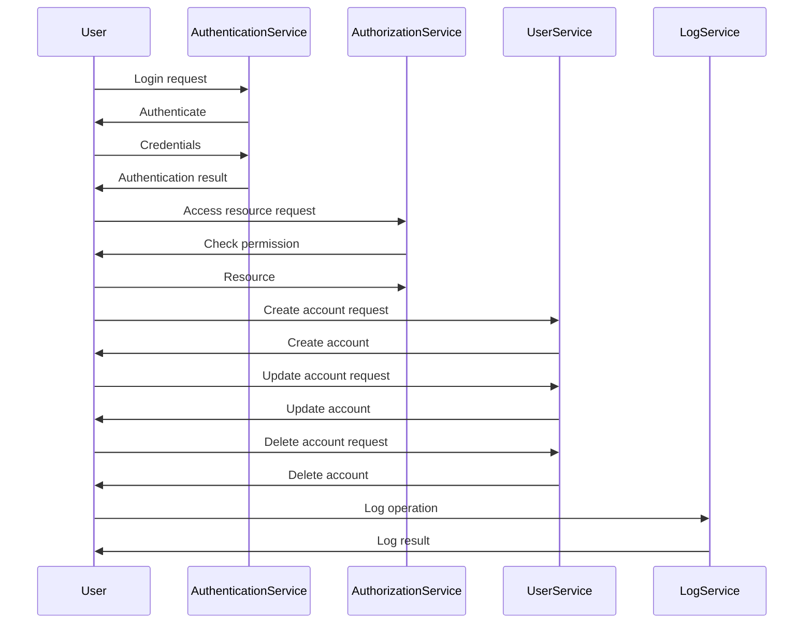
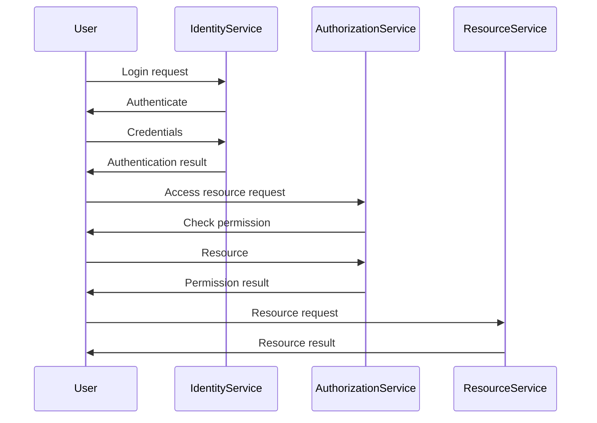

                 

# 身份认证与授权系统设计

> 关键词：身份认证、授权系统、安全、架构设计、技术实现

> 摘要：本文深入探讨了身份认证与授权系统设计的关键概念、技术实现和最佳实践。通过对身份认证与授权的基础知识、设计方法、系统架构和实际案例的详细分析，为读者提供了全面的设计思路和实用指导。

----------------------------------------------------------------

## 引言

在现代信息社会中，身份认证与授权系统是保障信息安全的核心环节。身份认证（Authentication）是指验证用户身份的过程，确保只有合法用户才能访问系统和资源；而授权（Authorization）则是在认证成功后，根据用户身份决定其可以访问哪些资源和执行哪些操作。本文将围绕这两个核心概念，逐步探讨身份认证与授权系统的设计原则、实现方法和最佳实践。

文章结构如下：

1. **基金

## 基金

### 1.1 关键概念

#### 1.1.1 身份管理（Identity Management）

身份管理是指对用户身份信息进行有效管理的一系列机制。它涉及用户账户的创建、维护、删除，以及用户身份的验证和授权。身份管理的主要目标是通过集中化、自动化的方式提高用户访问控制和安全性。

#### 1.1.2 认证（Authentication）

认证是验证用户身份的过程。常见的认证方法包括密码认证、双因素认证（2FA）、生物识别等。认证系统的设计必须确保安全性和便捷性之间的平衡。

#### 1.1.3 授权（Authorization）

授权是在认证完成后，根据用户的角色和权限确定其可以访问的资源范围。授权通常基于角色基础访问控制（RBAC）、属性基础访问控制（ABAC）等方法实现。

### 1.2 问题背景

随着云计算、大数据和物联网的发展，企业和组织面临的网络安全威胁日益复杂。传统的身份认证和授权方式难以满足新的安全需求。设计高效、安全的身份认证与授权系统成为当务之急。

### 1.3 问题描述

身份认证与授权系统设计面临的主要问题包括：

- **安全性**：确保只有合法用户能够访问系统和资源。
- **便捷性**：简化用户认证流程，提高用户体验。
- **灵活性**：适应不同的业务场景和安全需求。
- **可扩展性**：支持系统规模的增长。

### 1.4 问题解决

解决上述问题的方法包括：

- 采用多因素认证提高安全性。
- 设计灵活的授权机制，支持多种访问控制策略。
- 使用分布式架构提高系统的可扩展性。

### 1.5 边界与外延

- **边界**：本文主要关注身份认证与授权系统设计，不包括具体的实现细节。
- **外延**：本文的内容可以扩展到更广泛的领域，如单点登录（SSO）、身份认证协议（如OAuth、OpenID Connect）等。

### 1.6 概念结构与核心要素

身份认证与授权系统的核心要素包括：

- **用户身份信息**：存储用户的姓名、密码、电子邮件等。
- **认证机制**：实现用户身份验证的方法，如密码哈希、双因素认证等。
- **授权策略**：定义用户角色和权限，实现访问控制。
- **用户接口**：用户与系统交互的界面。

以下是身份认证与授权系统的ER实体关系图：

```mermaid
erDiagram
    User ||--|{ Authentication : has }
    User ||--|{ Authorization : has }
    Authentication ||--|{ Method : has }
    Authorization ||--|{ Role : has }
    Role ||--|{ Permission : has }
```

## 核心概念与联系

### 2.1 核心概念原理

#### 认证机制

认证机制是验证用户身份的核心。常见的认证机制包括：

- **密码认证**：用户通过输入密码进行身份验证。
- **双因素认证**（2FA）：在密码认证的基础上，增加第二层验证，如短信验证码、邮箱验证等。
- **生物识别**：通过人脸、指纹等生物特征进行身份验证。

#### 授权机制

授权机制是决定用户访问权限的核心。常见的授权机制包括：

- **角色基础访问控制**（RBAC）：根据用户角色定义其访问权限。
- **属性基础访问控制**（ABAC）：根据用户属性（如部门、职位等）定义其访问权限。
- **基于资源的访问控制**（ABAC）：根据资源的属性定义访问权限。

### 2.2 概念属性特征对比表格

| 认证机制          | 特点                                                     |
|-----------------|--------------------------------------------------------|
| 密码认证          | 简单易用，但安全性较低                                   |
| 双因素认证        | 提高安全性，但使用成本较高                               |
| 生物识别          | 安全性高，但成本高，技术复杂                             |

| 授权机制          | 特点                                                     |
|-----------------|--------------------------------------------------------|
| 角色基础访问控制  | 简单明了，但灵活性较低                                   |
| 属性基础访问控制  | 灵活性高，但实现复杂                                   |
| 基于资源的访问控制 | 精确控制，但管理复杂                                   |

### 2.3 ER实体关系图架构

以下是身份认证与授权系统的ER实体关系图：

```mermaid
erDiagram
    User ||--|{ Authentication : has }
    User ||--|{ Authorization : has }
    Authentication ||--|{ Method : has }
    Authorization ||--|{ Role : has }
    Role ||--|{ Permission : has }
```

## 算法原理讲解

### 3.1 认证算法

#### 3.1.1 密码认证算法

密码认证是身份认证中最为常见的方法。以下是密码认证算法的详细步骤：

1. 用户输入密码。
2. 服务器将输入的密码与数据库中存储的密码哈希进行比对。
3. 如果哈希值匹配，认证成功；否则，认证失败。

以下是密码认证算法的Python代码实现：

```python
import hashlib

def authenticate(username, password):
    # 从数据库中获取密码哈希
    stored_hash = get_stored_hash(username)
    
    # 计算输入密码的哈希
    input_hash = hashlib.sha256(password.encode()).hexdigest()
    
    # 比较哈希值
    if stored_hash == input_hash:
        return "Authentication successful"
    else:
        return "Authentication failed"

def get_stored_hash(username):
    # 此处为从数据库获取密码哈希的伪代码
    return "stored_hash_value"

# 示例
print(authenticate("user1", "password123"))
```

#### 3.1.2 双因素认证算法

双因素认证是在密码认证的基础上增加第二层验证。以下是双因素认证算法的详细步骤：

1. 用户输入密码。
2. 服务器验证密码。
3. 如果密码正确，发送双因素认证码到用户的手机或邮箱。
4. 用户输入双因素认证码。
5. 服务器验证双因素认证码。

以下是双因素认证算法的Python代码实现：

```python
import random
import smtplib
from email.mime.text import MIMEText

def send_2fa_code(email):
    # 生成双因素认证码
    code = random.randint(100000, 999999)
    
    # 发送邮件
    send_email(email, f"Your 2FA code is: {code}")
    
    return code

def send_email(email, message):
    # 此处为发送邮件的伪代码
    pass

def authenticate_2fa(username, password, code):
    # 验证密码
    if authenticate(username, password) == "Authentication successful":
        # 验证双因素认证码
        if code == send_2fa_code(username):
            return "Authentication successful"
        else:
            return "2FA code verification failed"
    else:
        return "Authentication failed"

# 示例
print(authenticate_2fa("user1", "password123", 123456))
```

### 3.2 授权算法

#### 3.2.1 角色基础访问控制算法

角色基础访问控制（RBAC）是一种常用的授权机制。以下是RBAC算法的详细步骤：

1. 定义角色和权限。
2. 用户登录系统，系统根据用户角色分配权限。
3. 用户请求访问资源，系统检查用户权限，决定是否允许访问。

以下是RBAC算法的Python代码实现：

```python
def check_permission(user_role, resource):
    # 检查用户角色是否有访问资源的权限
    if user_role in resource_permissions[resource]:
        return "Permission granted"
    else:
        return "Permission denied"

# 角色与权限的映射关系
role_permissions = {
    "admin": ["resource1", "resource2"],
    "user": ["resource1"],
    "guest": []
}

# 资源与权限的映射关系
resource_permissions = {
    "resource1": ["admin", "user"],
    "resource2": ["admin"],
    "resource3": ["guest"]
}

# 示例
print(check_permission("admin", "resource1"))
print(check_permission("user", "resource2"))
print(check_permission("guest", "resource3"))
```

## 系统分析与架构设计方案

### 4.1 问题场景介绍

企业内部存在多个业务系统，需要对用户身份进行统一认证和授权，确保不同系统之间的数据安全和访问控制。

### 4.2 项目介绍

项目名称：企业统一身份认证与授权系统

项目目标：实现企业内部多个业务系统的统一身份认证与授权，提高安全性和用户体验。

### 4.3 系统功能设计

系统功能包括：

- 用户身份认证：支持密码认证、双因素认证等。
- 用户身份管理：用户账户的创建、修改和删除。
- 授权管理：定义用户角色和权限，实现访问控制。
- 日志管理：记录用户操作日志，支持审计。

### 4.4 系统架构设计

系统架构采用分布式设计，包括以下组件：

- **认证服务**：处理用户认证请求，支持多种认证方式。
- **授权服务**：处理用户授权请求，根据用户角色和权限进行访问控制。
- **用户服务**：处理用户身份管理请求，包括用户账户的创建、修改和删除。
- **日志服务**：记录用户操作日志，支持审计。

以下是系统架构设计图：



### 4.5 系统接口设计和系统交互

系统接口设计包括：

- **认证接口**：用于处理用户认证请求。
- **授权接口**：用于处理用户授权请求。
- **用户管理接口**：用于处理用户身份管理请求。

系统交互包括：

- 用户通过认证接口进行身份认证。
- 用户通过授权接口请求访问资源。
- 用户通过用户管理接口进行用户账户管理。

以下是系统交互设计图：



## 项目实战

### 5.1 环境安装

安装所需环境：

- Python 3.8+
- Flask 框架
- SQLAlchemy 数据库
- Redis 缓存

安装命令：

```bash
pip install flask sqlalchemy redis
```

### 5.2 系统核心实现源代码

核心实现代码如下：

```python
# app.py

from flask import Flask, request, jsonify
from flask_sqlalchemy import SQLAlchemy
from redis import Redis

app = Flask(__name__)
app.config['SQLALCHEMY_DATABASE_URI'] = 'sqlite:///users.db'
db = SQLAlchemy(app)
redis = Redis(host='localhost', port=6379)

class User(db.Model):
    id = db.Column(db.Integer, primary_key=True)
    username = db.Column(db.String(80), unique=True, nullable=False)
    password_hash = db.Column(db.String(120), nullable=False)

@app.route('/login', methods=['POST'])
def login():
    username = request.form['username']
    password = request.form['password']
    
    user = User.query.filter_by(username=username).first()
    if user and user.password_hash == hashlib.sha256(password.encode()).hexdigest():
        token = generate_token(username)
        redis.set(token, username)
        return jsonify({'token': token})
    else:
        return jsonify({'error': 'Invalid credentials'})

def generate_token(username):
    # 生成唯一token的伪代码
    return f"token_{username}_{random.randint(1000, 9999)}"

if __name__ == '__main__':
    db.create_all()
    app.run(debug=True)
```

### 5.3 代码应用解读与分析

上述代码实现了用户登录功能，主要包括：

- **用户模型**：定义用户属性，包括用户名和密码哈希。
- **登录接口**：接收用户名和密码，验证用户身份，生成token并存储到Redis缓存中。
- **令牌生成**：生成唯一token，用于后续认证。

### 5.4 实际案例分析和详细讲解剖析

假设用户`user1`尝试登录系统，步骤如下：

1. 用户在登录界面输入用户名`user1`和密码`password123`。
2. 后端接收到请求，从数据库查询用户名对应的密码哈希。
3. 后端计算输入密码的哈希，与数据库中的密码哈希进行比对。
4. 比对成功，后端生成唯一token，存储到Redis缓存中。
5. 后端将token返回给用户。

### 5.5 项目小结

本文通过一个简单的实际案例，展示了如何使用Python Flask框架实现用户登录功能。虽然案例简单，但涵盖了身份认证与授权系统的核心原理和实践方法。读者可以在此基础上进一步扩展和优化，构建更复杂、更安全、更实用的身份认证与授权系统。

## 最佳实践 tips

- **密码强度要求**：要求用户使用复杂密码，包括字母、数字和特殊字符。
- **定期更换密码**：建议用户定期更换密码，提高账户安全性。
- **双因素认证**：强制或推荐用户使用双因素认证，提高账户安全性。
- **日志审计**：定期检查用户操作日志，发现并处理异常操作。

## 小结

本文从身份认证与授权系统的设计原则、实现方法和最佳实践出发，详细分析了身份认证与授权系统的核心概念、技术实现和系统架构。通过实际案例，展示了如何使用Python Flask框架实现用户登录功能。希望本文能为读者在身份认证与授权系统设计方面提供有益的参考和启示。

## 注意事项

- 在实际应用中，身份认证与授权系统需要根据具体业务需求进行调整和优化。
- 身份认证与授权系统的安全性至关重要，应定期进行安全审计和漏洞修复。

## 拓展阅读

- 《深入理解身份认证与授权》
- 《网络安全实战：身份认证与访问控制》
- 《Python Flask Web开发：实战手册》

---

**作者：AI天才研究院/AI Genius Institute & 禅与计算机程序设计艺术 /Zen And The Art of Computer Programming**

