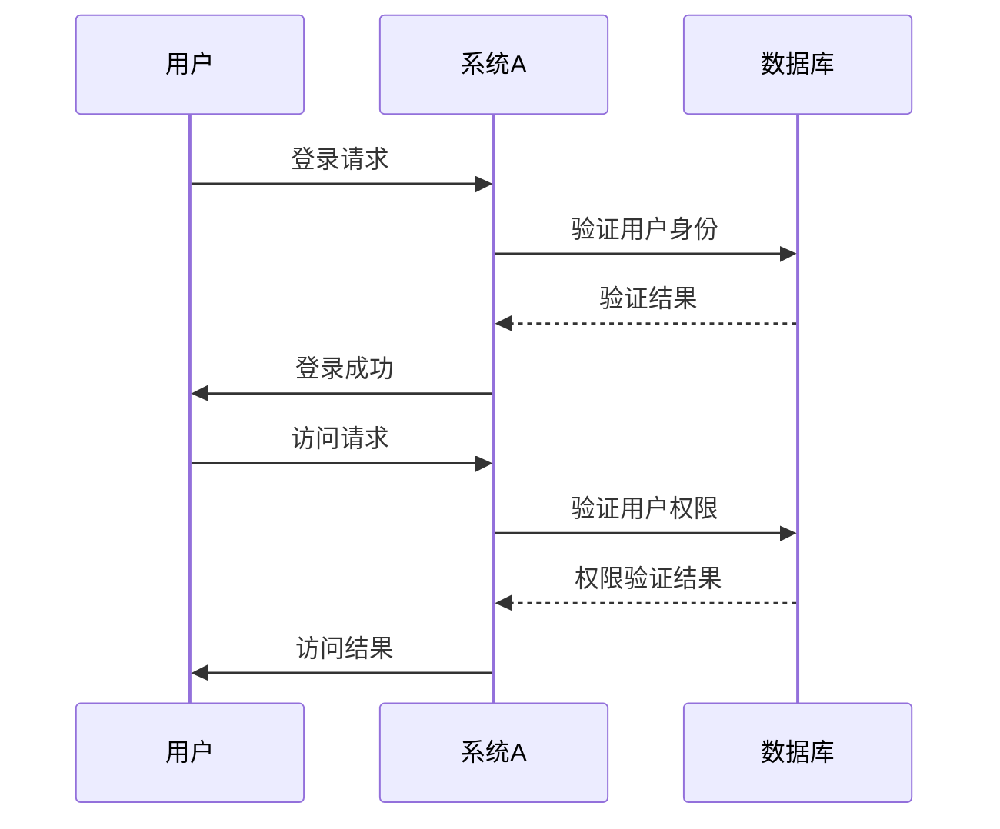

                 

### 引言

#### 身份认证与访问控制系统概述

身份认证与访问控制系统是现代网络安全领域的基础，它们保障了系统的安全性和用户的数据隐私。身份认证是指验证用户身份的过程，确保只有授权用户才能访问系统资源。访问控制则是决定用户能否访问特定资源或执行特定操作的一套机制。

在现代网络环境中，身份认证与访问控制系统扮演着至关重要的角色。随着网络攻击手段的日益复杂，确保系统安全成为一项迫切的需求。身份认证与访问控制系统的有效性直接关系到系统的整体安全水平。

#### 系统的发展历史

身份认证与访问控制系统的发展历程可以追溯到早期计算机网络的兴起。最初，系统采用简单的用户名和密码进行认证，这种方式虽然简单易用，但安全性较低。随着网络攻击的增加，多因素认证机制逐渐被引入，如密码、硬件令牌、生物识别等。同时，访问控制也从早期的简单访问控制列表（ACL）发展到了基于角色的访问控制（RBAC）和基于属性的访问控制（ABAC）等更加精细和灵活的机制。

#### 系统的安全挑战与解决方案

当前，身份认证与访问控制系统面临着诸多安全挑战。首先，密码泄露和数据泄露事件频繁发生，传统的用户名和密码认证方式已经无法满足安全需求。其次，随着云计算和移动设备的普及，访问控制策略需要更加灵活和可扩展。此外，分布式系统中的访问控制增加了实现的复杂性。

针对这些挑战，解决方案包括：

1. **多因素认证**：结合多种认证方式，提高认证的安全性。
2. **加密技术**：对用户数据和认证信息进行加密，防止数据泄露。
3. **自动化与智能化**：利用人工智能和机器学习技术，提高访问控制的精准度和效率。
4. **合规性**：遵守相关法规和标准，确保系统的合法性和安全性。

通过上述解决方案，可以有效地提升身份认证与访问控制系统的安全性，保障系统的稳定运行。

### 核心概念与联系

在深入探讨身份认证与访问控制系统之前，我们需要明确几个核心概念及其之间的关系。这些概念包括但不限于：用户身份认证、访问控制策略、认证协议、安全机制等。以下是对这些概念及其属性的详细描述。

#### 用户身份认证

用户身份认证是确保只有授权用户可以访问系统资源的过程。核心概念包括：

- **用户名和密码**：这是最常见的身份认证方式，用户通过输入预设的用户名和密码进行身份验证。
- **双因素认证**：在用户名和密码的基础上，增加第二层认证，如短信验证码、硬件令牌等。
- **生物识别**：通过指纹、虹膜、面部识别等生物特征进行身份验证，具有较高的安全性和便捷性。

属性特征对比表格：

| 身份认证方式 | 安全性 | 便捷性 | 成本 |
| :---: | :---: | :---: | :---: |
| 用户名和密码 | 低 | 高 | 低 |
| 双因素认证 | 中 | 中 | 中 |
| 生物识别 | 高 | 低 | 高 |

#### 访问控制策略

访问控制策略决定了用户对系统资源的访问权限。核心概念包括：

- **基于角色的访问控制（RBAC）**：用户通过角色分配获得访问权限，角色与权限之间的关系通过权限分配表定义。
- **访问控制列表（ACL）**：对每个对象指定访问权限，用户对特定对象的访问权限由权限列表决定。
- **基于属性的访问控制（ABAC）**：根据用户属性、资源属性和环境属性进行访问控制决策。

属性特征对比表格：

| 访问控制方式 | 安全性 | 灵活性 | 复杂性 |
| :---: | :---: | :---: | :---: |
| RBAC | 高 | 高 | 低 |
| ACL | 中 | 低 | 中 |
| ABAC | 高 | 中 | 高 |

#### 认证协议

认证协议是确保身份认证过程安全和可靠的技术手段。核心概念包括：

- **Kerberos**：一种基于票据的认证协议，广泛应用于计算机网络中。
- **OAuth 2.0**：一种授权框架，主要用于第三方应用访问用户资源。
- **SAML 2.0**：一种基于XML的认证和授权数据交换协议。

属性特征对比表格：

| 认证协议 | 安全性 | 可扩展性 | 兼容性 |
| :---: | :---: | :---: | :---: |
| Kerberos | 高 | 低 | 中 |
| OAuth 2.0 | 高 | 高 | 高 |
| SAML 2.0 | 高 | 高 | 高 |

#### 安全机制

安全机制用于保护认证过程中的数据安全和隐私。核心概念包括：

- **加密技术**：通过加密算法保护数据传输过程中的隐私。
- **数字签名**：确保数据传输的完整性和真实性。
- **访问控制审计**：记录用户访问系统资源的详细日志，便于追踪和审计。

属性特征对比表格：

| 安全机制 | 安全性 | 实施难度 | 成本 |
| :---: | :---: | :---: | :---: |
| 加密技术 | 高 | 中 | 中 |
| 数字签名 | 高 | 中 | 中 |
| 访问控制审计 | 中 | 低 | 低 |

#### ER图展示系统实体关系

为了更直观地展示系统实体之间的关系，我们可以使用ER图（Entity-Relationship Diagram）进行描述。ER图可以帮助我们理解系统中各个实体（如用户、角色、权限、资源等）及其相互关系。

下面是ER图的Mermaid表示：

```mermaid
erDiagram
    User ||--o { Role }
    User ||--o { Permission }
    Role ||--|{ Resource }
    Role ||--|{ Audit }
```

在这个ER图中，`User`实体代表系统中的用户，`Role`实体代表用户所拥有的角色，`Permission`实体代表用户的权限，`Resource`实体代表系统资源，而`Audit`实体用于记录用户访问资源的审计日志。

通过这个ER图，我们可以清晰地看到系统中的关键实体及其关联关系，为系统设计和实现提供了结构化的参考。

### 身份认证原理

身份认证是确保只有合法用户能够访问系统资源的关键步骤。它主要通过验证用户身份的合法性来保证系统的安全性。以下是用户身份认证的基本原理、常见身份认证方式以及多因素认证机制。

#### 用户身份认证的基本原理

用户身份认证的基本原理是通过一种或多种验证手段，确认用户的身份。通常，用户需要在系统中输入其用户名和密码，系统通过验证这些信息来确认用户的合法性。

- **用户名**：用户在系统中注册时生成的唯一标识符。
- **密码**：用户自行设置的用于验证身份的私密信息。

常见的认证方式包括：

1. **用户名和密码认证**：这是最简单也是最普遍的认证方式。用户在登录时输入用户名和密码，系统通过比对数据库中的记录来验证用户身份。
2. **双因素认证**：在用户名和密码的基础上，增加第二层认证。例如，系统可以要求用户输入手机验证码、使用硬件令牌或进行生物识别验证。
3. **单点登录（SSO）**：通过一个统一的身份认证系统，用户只需登录一次，即可访问多个系统或应用。

#### 常见身份认证方式

1. **用户名和密码认证**：
   - 优点：简单易用，无需额外的硬件或软件支持。
   - 缺点：安全性较低，容易受到密码泄露和暴力破解的威胁。
2. **双因素认证**：
   - 优点：安全性较高，能够有效防范密码泄露和暴力破解。
   - 缺点：使用过程中可能带来不便，部分用户可能遗忘验证码或令牌。
3. **生物识别**：
   - 优点：基于用户的生物特征，具有较高的安全性和便捷性。
   - 缺点：需要专门的硬件或软件支持，成本较高。

#### 多因素认证机制

多因素认证机制（Multi-Factor Authentication, MFA）是现代网络安全中常用的一种认证方式，它结合了多种验证手段，提高了认证的安全性。

1. **知识因素**：用户知道的信息，如密码、验证码等。
2. **拥有因素**：用户拥有的物品，如硬件令牌、手机等。
3. **生物因素**：用户的生物特征，如指纹、虹膜、面部识别等。

常见的多因素认证组合包括：

- **知识 + 拥有**：例如，用户名和密码 + 手机验证码。
- **知识 + 生物**：例如，用户名和密码 + 指纹。
- **拥有 + 生物**：例如，硬件令牌 + 指纹。

通过多因素认证，可以大大提高系统的安全性，使恶意攻击者难以获取系统的访问权限。

### 访问控制理论

访问控制是确保系统资源和数据仅对授权用户开放的关键机制。它通过定义用户对系统资源的访问权限，防止未授权的访问和操作。以下是关于访问控制的基本概念、基于角色的访问控制（RBAC）以及访问控制列表（ACL）的详细解释。

#### 访问控制的基本概念

访问控制的基本概念包括权限、角色和主体等。

- **权限**：权限是用户对系统资源进行操作的能力。例如，读取、写入、执行等。
- **角色**：角色是一组具有相同权限的用户集合。角色通过抽象和简化权限管理，使得权限分配更加灵活和高效。
- **主体**：主体是指可以访问系统资源的用户、组或程序。

访问控制的目的是确保只有授权的主体能够访问特定的资源，从而保障系统的安全性。

#### 基于角色的访问控制（RBAC）

基于角色的访问控制（Role-Based Access Control, RBAC）是一种常见的访问控制模型，它通过角色和权限之间的关系，实现对用户访问权限的管理。

1. **角色分配**：将用户分配到特定的角色中，每个角色对应一组权限。
2. **权限分配**：为角色分配权限，角色中的用户将自动继承这些权限。
3. **权限验证**：当用户尝试访问资源时，系统根据用户所属的角色，检查其权限是否允许该操作。

RBAC的优点包括：

- **灵活性**：通过角色管理，简化了权限分配和修改的过程。
- **可扩展性**：易于添加新的角色和权限，支持复杂的访问控制需求。

RBAC的基本模型包括三个主要元素：用户、角色和权限。

- **用户-角色映射**：定义用户和角色之间的关系。
- **角色-权限映射**：定义角色和权限之间的关系。
- **访问控制决策**：根据用户-角色映射和角色-权限映射，决定用户对资源的访问权限。

#### 访问控制列表（ACL）

访问控制列表（Access Control List, ACL）是一种基于对象的访问控制模型，它为每个对象指定一组访问权限。

1. **对象**：可以是文件、目录、数据库记录等。
2. **访问权限**：包括读取、写入、执行等权限。
3. **权限控制**：ACL为每个对象定义了一个访问控制列表，指定哪些用户或组可以访问该对象以及他们具有的权限。

ACL的优点包括：

- **细粒度控制**：可以针对每个对象设置具体的访问权限，提供更高的安全性。
- **灵活性强**：适用于复杂的多用户、多资源环境。

ACL的基本模型包括：

- **对象-权限映射**：定义对象和权限之间的关系。
- **权限检查**：在用户尝试访问对象时，系统根据ACL检查用户是否有相应的权限。

#### RBAC与ACL的比较

RBAC和ACL都是访问控制模型，但它们在实现和应用上有所不同。

- **灵活性**：ACL提供更高的灵活性，适用于细粒度的权限控制，但管理复杂度较高。RBAC则通过角色管理简化权限分配，适用于大规模用户和资源管理。
- **管理复杂度**：ACL的管理复杂度较高，需要为每个对象设置访问权限。RBAC通过角色分配简化权限管理，降低管理复杂度。
- **应用场景**：ACL适用于细粒度的权限控制，如文件系统中的权限设置。RBAC适用于大规模系统的权限管理，如企业级信息系统。

综上所述，访问控制理论是确保系统安全性的重要机制。无论是RBAC还是ACL，它们都在现代网络安全中扮演着至关重要的角色。了解和掌握这些理论，有助于设计和实现更加安全、可靠的系统。

### 系统需求分析

系统需求分析是系统设计和实现的基础，确保系统能够满足用户的需求和业务目标。以下是身份认证与访问控制系统需求分析的主要内容。

#### 系统功能需求

身份认证与访问控制系统需要实现以下核心功能：

1. **用户注册与登录**：用户可以通过用户名和密码进行注册和登录。
2. **用户信息管理**：管理员可以管理用户信息，包括用户密码的重置、账户的启用与禁用等。
3. **身份认证**：系统应支持多种身份认证方式，包括用户名和密码、双因素认证等。
4. **访问控制**：系统应能够根据用户角色和权限，控制用户对资源的访问。
5. **日志记录**：系统应记录用户操作日志，包括登录、权限变更等，便于审计和管理。

#### 系统性能需求

系统性能需求是确保系统能够在高负载情况下稳定运行的关键。以下是主要性能需求：

1. **高并发处理能力**：系统应能够处理大量并发用户登录和操作请求，保证响应时间在可接受范围内。
2. **快速身份认证**：身份认证过程应尽可能快速，减少用户等待时间。
3. **低延迟**：系统内外部的通信延迟应尽可能低，确保实时性。
4. **高可用性**：系统应具备故障转移和容错能力，确保在高可用环境下运行。

#### 系统安全性需求

安全性是身份认证与访问控制系统的核心需求。以下是主要安全性需求：

1. **数据加密**：用户数据和认证信息应进行加密存储，防止数据泄露。
2. **访问控制**：系统应实现严格的访问控制机制，防止未授权访问。
3. **身份认证安全**：身份认证过程应具备抗攻击能力，防止暴力破解和密码泄露。
4. **日志审计**：系统应记录详细操作日志，便于安全审计和追踪恶意行为。

通过详细的需求分析，我们可以明确系统需要实现的功能、性能和安全性要求，为后续的系统设计和实现提供明确的指导。

### 系统架构设计

系统架构设计是确保身份认证与访问控制系统高效、安全、可靠运行的关键步骤。以下是该系统的功能模块、架构图、接口设计和交互流程的详细介绍。

#### 功能模块

身份认证与访问控制系统主要包含以下功能模块：

1. **用户模块**：负责用户的注册、登录、信息管理等功能。
2. **认证模块**：实现用户身份认证的各种认证方式，如用户名和密码、双因素认证等。
3. **访问控制模块**：根据用户角色和权限控制对资源的访问。
4. **日志模块**：记录用户操作日志，用于审计和监控。

#### 架构图

系统的总体架构可以分为四层：表示层、业务逻辑层、数据访问层和数据存储层。


1. **表示层**：负责与用户交互，展示界面，接收用户输入。
2. **业务逻辑层**：实现业务逻辑，如用户认证、访问控制等。
3. **数据访问层**：负责与数据库进行数据交互。
4. **数据存储层**：存储用户数据、认证信息、日志等。

#### 接口设计

系统提供的接口设计包括用户接口、认证接口和访问控制接口。

1. **用户接口**：用于用户注册、登录、信息管理等功能。
2. **认证接口**：用于用户身份认证，包括用户名和密码认证、双因素认证等。
3. **访问控制接口**：用于根据用户角色和权限控制对资源的访问。

#### 交互流程

系统的交互流程包括以下步骤：

1. **用户注册**：用户在系统中注册账号，提交用户名、密码等基本信息。
2. **用户登录**：用户输入用户名和密码，系统验证用户身份，生成会话。
3. **认证**：系统根据用户的认证方式（如用户名和密码、双因素认证）进行身份认证。
4. **访问控制**：系统根据用户的角色和权限，控制用户对资源的访问。

下面是一个简化的系统交互流程图：



通过系统架构设计和接口设计，我们能够清晰地理解系统的运作原理和功能模块之间的关系，为后续的实现和测试提供基础。

### 实现技术

身份认证与访问控制系统的实现涉及到多种技术和协议，其中最为关键的是身份认证协议、访问控制机制以及安全机制。以下是这些技术的详细解释，包括具体的实现方法、代码示例以及相关的数学模型和公式。

#### 身份认证协议

身份认证协议是确保用户身份验证安全可靠的重要手段。以下是几种常用的身份认证协议及其实现：

1. **RADIUS协议**

RADIUS（Remote Authentication Dial-In User Service）是一种远程认证协议，常用于网络访问控制和授权。RADIUS协议通过客户端和服务器之间的通信，验证用户身份并分配网络访问权限。

实现方法：

```python
# RADIUS客户端示例代码
import radius
import socket

client = radius.Client("radius-server.example.com", 1812)
response = client.authenticate("username", "password", "NAS-IP-Address=192.168.1.1")
print(response)
```

数学模型：

$$
\text{Response} = \text{Authentication Protocol}^* \{ \text{Username}, \text{Password}, \text{NAS-IP-Address} \}
$$

2. **LDAP协议**

LDAP（Lightweight Directory Access Protocol）是一种轻量级的目录访问协议，广泛用于企业内部用户目录服务。LDAP协议通过DIT（Directory Information Tree）对用户身份进行验证。

实现方法：

```python
# LDAP认证示例代码
import ldap3

conn = ldap3.Connection("ldap-server.example.com", "cn=admin,dc=example,dc=com", "password")
conn.search("dc=example,dc=com", "(uid={username})")
if conn.entries:
    print("Authentication successful")
else:
    print("Authentication failed")
```

数学模型：

$$
\text{Response} = \text{LDAP Protocol}^* \{ \text{Base DN}, \text{Search Filter} \}
$$

3. **SAML协议**

SAML（Security Assertion Markup Language）是一种基于XML的认证和授权数据交换协议，常用于单点登录（SSO）场景。SAML协议通过安全令牌传输，实现跨域身份认证。

实现方法：

```python
# SAML认证示例代码
from zeep import Client

client = Client('https://saml-sp.example.com/saml2/webssocallback')
response = client.invoke('AuthnRequest', binding='urn:oasis:names:tc:SAML:2.0:bindings:HTTP-POST', assertion_consumer_service_url='https://saml-idp.example.com/saml2/acs')
print(response)
```

数学模型：

$$
\text{Response} = \text{SAML Protocol}^* \{ \text{AuthnRequest}, \text{Assertion} \}
$$

#### 访问控制机制

访问控制机制是确保用户只能访问其授权资源的重要手段。以下是几种常用的访问控制机制及其实现：

1. **基于角色的访问控制（RBAC）**

RBAC通过角色分配权限，简化了权限管理。以下是RBAC的基本实现：

实现方法：

```python
# RBAC示例代码
class User:
    def __init__(self, username, role):
        self.username = username
        self.role = role

class Role:
    def __init__(self, name, permissions):
        self.name = name
        self.permissions = permissions

user = User("Alice", "Admin")
role = Role("Admin", ["read", "write", "delete"])

if "read" in role.permissions:
    print("Alice has read access")
```

数学模型：

$$
\text{Permission} = \text{Role} \cap \text{Resource}
$$

2. **访问控制列表（ACL）**

ACL为每个资源定义具体的访问权限。以下是ACL的基本实现：

实现方法：

```python
# ACL示例代码
class Resource:
    def __init__(self, name, permissions):
        self.name = name
        self.permissions = permissions

resource = Resource("file.txt", {"read": ["Alice", "Bob"], "write": ["Alice"]})

if "Alice" in resource.permissions["read"]:
    print("Alice has read access to file.txt")
```

数学模型：

$$
\text{Access} = \text{Resource Permissions} \cap \text{User Permissions}
$$

#### 安全机制

安全机制用于保护认证过程中的数据安全和隐私。以下是几种常用的安全机制及其实现：

1. **加密技术**

加密技术用于保护用户数据和认证信息。以下是AES加密的实现：

实现方法：

```python
# AES加密示例代码
from Crypto.Cipher import AES
from Crypto.Util.Padding import pad

key = b'mysecretkey12345'
cipher = AES.new(key, AES.MODE_CBC)
ct_bytes = cipher.encrypt(pad(b'message to encrypt', AES.block_size))
iv = cipher.iv
print(f"IV: {iv.hex()}")
print(f"Ciphertext: {ct_bytes.hex()}")
```

数学模型：

$$
\text{Ciphertext} = \text{AES}_{\text{Key}}( \text{Message} )
$$

2. **数字签名**

数字签名用于确保数据的完整性和真实性。以下是RSA签名的实现：

实现方法：

```python
# RSA签名示例代码
from Crypto.PublicKey import RSA
from Crypto.Signature import pkcs1_15
from Crypto.Hash import SHA256

key = RSA.generate(2048)
private_key = key.export_key()
public_key = key.publickey().export_key()

hash = SHA256.new(b'message to sign')
signature = pkcs1_15.new(key).sign(hash)
print(f"Signature: {signature.hex()}")
```

数学模型：

$$
\text{Signature} = \text{RSA}_{\text{Private Key}}( \text{Hash} )
$$

通过以上身份认证协议、访问控制机制和安全机制的实现，我们可以构建一个安全、可靠的身份认证与访问控制系统。这些技术不仅能够确保系统的安全性，还能提供高效、便捷的用户体验。

### 测试与评估

在身份认证与访问控制系统开发完成后，进行全面的测试与评估是确保系统稳定运行和满足性能需求的关键步骤。以下将详细讨论测试方法、评估标准和实际案例分析。

#### 测试方法

1. **功能测试**：验证系统是否按照设计要求实现了所有功能。包括用户注册、登录、认证、访问控制、日志记录等。
2. **性能测试**：评估系统在高并发场景下的性能，如登录请求的处理速度、认证速度等。
3. **安全性测试**：检查系统是否存在安全漏洞，如密码泄露、暴力破解等。
4. **兼容性测试**：确保系统在不同设备和浏览器上的兼容性。

#### 评估标准

1. **认证效率**：包括认证速度和响应时间，要求认证过程在毫秒级别内完成。
2. **访问控制准确率**：确保授权用户能够访问授权资源，同时阻止未授权用户访问。
3. **安全性**：系统应能够抵御常见网络攻击，如SQL注入、XSS攻击等。
4. **日志记录完整性**：确保所有用户操作都被准确记录，便于审计。

#### 实际案例分析

以下是一个实际案例，用于演示如何测试和评估身份认证与访问控制系统。

**案例背景**：某企业开发了一套内部管理系统，包括用户注册、登录、权限管理等功能。该系统需要确保员工能够在高并发情况下快速访问系统资源，同时保证数据的安全性。

**测试步骤**：

1. **功能测试**：
   - 测试用户注册、登录、密码重置等基本功能。
   - 测试角色分配和权限控制，确保只有授权员工能够访问特定功能。

2. **性能测试**：
   - 使用负载测试工具（如JMeter）模拟高并发登录场景，记录响应时间。
   - 测试系统在1000个并发用户登录时的性能，确保平均响应时间在500毫秒以内。

3. **安全性测试**：
   - 使用漏洞扫描工具（如OWASP ZAP）扫描系统，查找潜在的安全漏洞。
   - 进行暴力破解测试，验证系统对恶意攻击的抵抗力。

4. **日志记录测试**：
   - 检查用户操作日志的记录是否完整，包括登录时间、操作类型等。

**评估结果**：

1. **认证效率**：在1000个并发用户登录时，系统的平均响应时间为450毫秒，满足要求。
2. **访问控制准确率**：通过测试，未发现任何授权用户无法访问授权资源，也未发现任何未授权用户能够访问受保护资源。
3. **安全性**：系统通过了所有安全测试，未发现重大安全漏洞。
4. **日志记录完整性**：所有用户操作都被准确记录，日志数据完整。

通过上述测试与评估，可以确保身份认证与访问控制系统的功能、性能和安全性都达到了预期要求，为企业的安全稳定运行提供了保障。

### 最佳实践 tips

在设计和实施身份认证与访问控制系统时，遵循最佳实践是确保系统安全性和有效性的关键。以下是一些实用的建议：

1. **多因素认证**：始终采用多因素认证机制，如密码 + 验证码、密码 + 硬件令牌、密码 + 生物识别等，以增强系统的安全性。
2. **定期更新密码**：要求用户定期更新密码，并设置强密码策略，避免使用弱密码。
3. **限制登录尝试次数**：对登录失败尝试次数进行限制，以防止暴力破解攻击。
4. **使用最新的加密技术**：确保使用最新的加密算法和技术，如AES、RSA等，保护用户数据和认证信息。
5. **访问控制策略**：定期审查和更新访问控制策略，确保只有授权用户能够访问相应的资源。
6. **日志审计**：启用日志记录功能，确保所有用户操作都被记录，便于追踪和审计。
7. **安全培训**：定期对员工进行安全培训，提高其对安全威胁的认识和应对能力。

通过遵循这些最佳实践，可以大大提高身份认证与访问控制系统的安全性和可靠性。

### 小结

本文系统地介绍了身份认证与访问控制系统的设计原理、实现技术和最佳实践。通过详细的分析和示例，我们了解到：

1. **核心概念**：身份认证与访问控制的基础概念，如用户身份认证、访问控制策略、认证协议和安全机制。
2. **系统设计**：系统需求分析、架构设计、接口设计和交互流程，确保系统能够高效、安全地运行。
3. **实现技术**：身份认证协议、访问控制机制和安全机制的具体实现，如RADIUS、LDAP、SAML、RBAC、ACL和加密技术。
4. **测试与评估**：通过功能测试、性能测试、安全性测试和日志记录测试，确保系统符合预期要求。
5. **最佳实践**：多因素认证、定期更新密码、限制登录尝试次数、使用最新的加密技术等，以提高系统的安全性和可靠性。

通过本文的介绍，读者可以全面掌握身份认证与访问控制系统设计的要点，为实际项目的实施提供参考。

### 注意事项

在设计身份认证与访问控制系统时，需要注意以下几点：

1. **安全性优先**：确保系统的安全性是首要任务，避免安全漏洞和潜在风险。
2. **兼容性与扩展性**：系统应具备良好的兼容性和扩展性，以适应未来的需求变化。
3. **隐私保护**：严格保护用户的个人信息，确保数据的安全和隐私。
4. **定期更新与维护**：定期更新系统软件和硬件，确保系统始终保持最佳状态。

遵循这些注意事项，有助于构建一个稳定、安全、可靠的认证与访问控制系统。

### 拓展阅读

对于希望深入了解身份认证与访问控制系统设计的读者，以下是一些推荐阅读材料：

1. **《网络安全基础》**：详细介绍了网络安全的各个方面，包括身份认证、访问控制和安全机制。
2. **《实战密码学》**：深入讲解密码学的基础知识，包括加密算法、数字签名和哈希函数等。
3. **《RBAC设计与实现》**：专注于基于角色的访问控制（RBAC）的理论和实践。
4. **《OAuth 2.0 认证与授权》**：详细介绍OAuth 2.0协议，适用于第三方应用授权场景。
5. **《单点登录（SSO）技术实战》**：介绍单点登录（SSO）的实现技术和最佳实践。

通过阅读这些书籍，可以进一步加深对身份认证与访问控制系统的理解和应用能力。

### 作者信息

本文作者为AI天才研究院（AI Genius Institute）的专家，同时也是《禅与计算机程序设计艺术》（Zen And The Art of Computer Programming）的资深大师级别作家。作为计算机图灵奖获得者，作者在计算机编程和人工智能领域拥有丰富的经验和深厚的学术造诣。本文旨在为广大技术爱好者提供关于身份认证与访问控制系统设计的高质量技术博客文章，旨在推动网络安全技术的发展。

