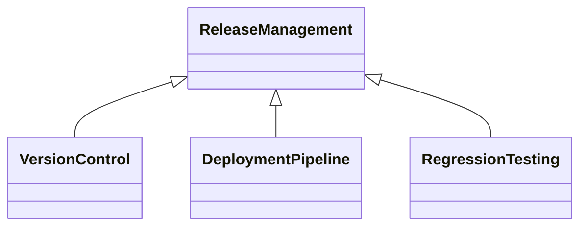
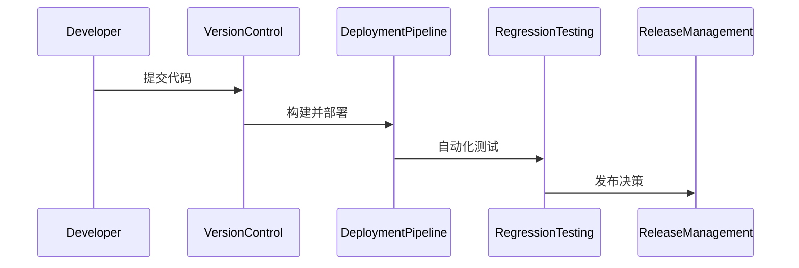

                 

# 软件发布管理：从开发到生产的流程优化

> 关键词：软件发布管理、开发到生产流程、流程优化、版本控制、部署管道、回归测试

> 摘要：本文将深入探讨软件发布管理的过程，从开发到生产的流程优化。我们将首先介绍问题背景和核心概念，然后分析不同的发布模型与策略，最后提供最佳实践，以帮助您优化软件发布流程，提高开发效率和产品质量。

## 目录大纲

----------------------------------------------------------------

# 软件发布管理：从开发到生产的流程优化

----------------------------------------------------------------

## 第一部分：背景与基础

### 第1章 问题背景与核心概念

#### 1.1 问题的来源与现状

- 软件发布管理的重要性
- 当前软件开发与发布中存在的问题

#### 1.2 核心概念

- 软件发布管理的定义
- 开发与生产的边界
- 流程优化的必要性

#### 1.3 边界与外延

- 软件发布管理的范围
- 不同的发布模型与策略

#### 1.4 概念结构与核心要素组成

- 流程要素
- 关键角色与职责

### 第2章 核心概念与联系

#### 2.1 核心概念原理

- 版本控制
- 部署管道
- 回归测试

#### 2.2 概念属性特征对比

| 概念         | 特征           |
|--------------|--------------|
| 版本控制     | 管理代码版本  |
| 部署管道     | 自动化部署    |
| 回归测试     | 测试代码质量 |

#### 2.3 ER实体关系图架构

```mermaid
erDiagram
    A[版本控制] ||--|{ 部署管道 }| B
    B ||--|{ 回归测试 }| C
```

## 第二部分：流程优化与最佳实践

### 第3章 算法原理讲解

#### 3.1 版本控制算法原理

- 版本控制的基础
- Git原理
- 分支管理

#### 3.2 部署管道算法原理

- 管道的概念
- Jenkins原理
- CI/CD流程

#### 3.3 回归测试算法原理

- 测试用例设计
- 测试覆盖率
- 自动化测试工具

### 第4章 数学模型与公式

#### 4.1 数学模型

- 代码复杂度模型
- 风险评估模型

#### 4.2 公式与详细讲解

- $$C = O(n^2)$$
- $$R = \frac{T}{U}$$

#### 4.3 举例说明

- 代码复杂度的例子
- 风险评估的例子

### 第5章 系统分析与架构设计方案

#### 5.1 问题场景介绍

- 软件发布管理的挑战
- 需求分析

#### 5.2 系统功能设计

- 领域模型类图



#### 5.3 系统架构设计

- 系统架构图



#### 5.4 系统接口设计与交互

- 系统接口设计

```mermaid
usecase ReleaseManagement participating VersionControl, DeploymentPipeline, RegressionTesting
ReleaseManagement <<include>> VersionControl
ReleaseManagement <<include>> DeploymentPipeline
ReleaseManagement <<include>> RegressionTesting
```

## 第三部分：项目实战

### 第6章 项目实战：环境安装与系统核心实现

#### 6.1 环境安装

- 操作系统与环境配置

#### 6.2 系统核心实现

- 版本控制工具安装与配置
- 部署管道工具安装与配置
- 回归测试工具安装与配置

### 第7章 代码应用解读与分析

#### 7.1 源代码解读

- 代码结构与功能

#### 7.2 分析与讲解

- 各模块的功能和交互

### 第四部分：最佳实践与总结

#### 8.1 最佳实践 tips

- 提高代码质量的技巧
- 安全性考虑
- 用户体验

#### 8.2 小结

- 文章的核心内容回顾
- 对未来的展望

#### 8.3 注意事项

- 常见问题与解决方案
- 需要注意的风险

#### 8.4 拓展阅读

- 推荐进一步学习的资源
- 相关领域的最新研究

## 第一部分：背景与基础

### 第1章 问题背景与核心概念

#### 1.1 问题的来源与现状

软件发布管理是软件开发过程中至关重要的一环。随着软件项目的复杂性不断增加，如何确保软件从开发到生产各个环节的高效、稳定和可靠发布成为开发团队面临的主要挑战。

当前，许多软件开发团队在发布管理方面面临着以下问题：

1. **发布频率低**：由于缺乏完善的发布流程和自动化工具，许多团队只能每月或每季度进行一次发布，导致新功能和修复的上线周期过长。
2. **手动操作多**：许多发布流程依赖于人工操作，容易出现人为错误，导致发布失败或生产环境中的问题。
3. **质量不可控**：在发布前缺乏充分的测试和验证，导致发布后的软件质量不可控，可能会影响用户体验和业务运营。
4. **部署环境不一致**：开发、测试和生产环境之间存在差异，导致软件在不同环境中的表现不一致。

为了解决这些问题，软件发布管理的优化变得至关重要。优化后的发布流程可以提高发布频率、减少人为错误、确保软件质量，并提高整体开发效率。

#### 1.2 核心概念

**软件发布管理的定义**：

软件发布管理是指对软件从开发到生产过程中的各个环节进行规划、执行和监控的过程。它包括版本控制、构建、测试、部署和监控等步骤，以确保软件的高效、稳定和可靠发布。

**开发与生产的边界**：

开发与生产的边界是软件发布管理的一个重要概念。在开发过程中，开发团队主要关注功能实现、性能优化和代码质量。而在生产过程中，主要关注软件的部署、运行和监控。明确开发与生产的边界有助于确保开发团队和生产团队能够各自专注于自己的任务，并确保软件在生产环境中的稳定运行。

**流程优化的必要性**：

流程优化是提高软件开发效率和质量的关键。通过优化发布流程，可以实现以下目标：

1. **提高发布频率**：自动化和标准化的发布流程可以缩短发布周期，提高发布频率，使团队能够更快地响应市场需求和用户反馈。
2. **减少人为错误**：自动化和标准化的流程可以减少人为错误，提高发布稳定性。
3. **确保软件质量**：通过全面的测试和验证，确保软件在生产环境中的质量。
4. **提高团队效率**：优化后的流程可以减轻团队成员的工作负担，提高工作效率。

#### 1.3 边界与外延

**软件发布管理的范围**：

软件发布管理涵盖了从代码提交、版本控制、构建、测试、部署到监控的整个流程。具体包括：

1. **版本控制**：管理代码版本，确保代码的一致性和可追溯性。
2. **构建**：将源代码编译、打包和构建成可执行文件或应用程序。
3. **测试**：执行各种测试，包括单元测试、集成测试、回归测试等，确保软件质量。
4. **部署**：将构建好的软件部署到生产环境，包括配置、安装和启动等步骤。
5. **监控**：监控软件在生产环境中的运行状态，及时发现和解决问题。

**不同的发布模型与策略**：

根据不同的需求和团队规模，可以选择不同的发布模型和策略。常见的发布模型包括：

1. **蓝绿部署**：将生产环境分为两个版本（蓝色和绿色），每次发布时将新版本部署到绿色环境，再将流量切换到绿色环境。如果出现问题，可以快速回滚到蓝色环境。
2. **灰度发布**：将新版本逐步部署到部分用户，观察其表现，根据反馈逐步扩大部署范围。
3. **滚动部署**：逐步将旧版本的应用程序替换为新版本，确保生产环境中的服务始终可用。

**概念结构与核心要素组成**：

软件发布管理涉及多个概念和核心要素，包括：

1. **版本控制**：版本控制是软件发布管理的核心，通过Git等工具管理代码版本，实现代码的一致性和可追溯性。
2. **部署管道**：部署管道是自动化部署的核心，通过Jenkins等工具实现自动化构建、测试和部署。
3. **回归测试**：回归测试是确保软件质量的关键步骤，通过自动化测试工具执行各种测试用例，验证软件的功能和性能。

#### 1.4 概念结构与核心要素组成

**流程要素**：

软件发布管理的流程要素包括：

1. **代码提交**：开发人员将代码提交到版本控制系统中。
2. **构建**：构建过程将源代码编译、打包和构建成可执行文件或应用程序。
3. **测试**：测试过程包括单元测试、集成测试、回归测试等，确保软件质量。
4. **部署**：部署过程将构建好的软件部署到生产环境。
5. **监控**：监控过程实时监控软件在生产环境中的运行状态。

**关键角色与职责**：

在软件发布管理中，涉及多个关键角色，包括：

1. **开发人员**：负责编写和提交代码，参与测试和发布过程。
2. **测试人员**：负责执行各种测试，确保软件质量。
3. **运维人员**：负责部署和监控软件在生产环境中的运行状态。
4. **项目经理**：负责协调各个团队，确保发布过程的顺利进行。

### 第2章 核心概念与联系

#### 2.1 核心概念原理

**版本控制**：

版本控制是一种管理源代码和文档变化的方法，确保代码的版本一致性和可追溯性。Git是当前最流行的版本控制系统，它通过创建分支、合并和提交等操作，实现对代码版本的管理。

**部署管道**：

部署管道是一种自动化部署的方法，通过一系列自动化任务实现构建、测试和部署。常见的部署管道工具包括Jenkins、GitLab CI/CD等，它们可以与版本控制系统集成，实现持续集成和持续部署（CI/CD）。

**回归测试**：

回归测试是确保软件质量的重要步骤，通过执行已存在的测试用例，验证软件的功能和性能在更新后的版本中是否仍然正常。回归测试可以自动化执行，以提高测试效率和准确性。

#### 2.2 概念属性特征对比

| 概念         | 特征           |
|--------------|--------------|
| 版本控制     | 管理代码版本  |
| 部署管道     | 自动化部署    |
| 回归测试     | 测试代码质量 |

**版本控制**：

- **特征**：管理代码版本，实现代码的一致性和可追溯性。
- **应用场景**：开发、测试、发布等环节。

**部署管道**：

- **特征**：自动化构建、测试和部署，提高发布效率和稳定性。
- **应用场景**：持续集成、持续部署、自动化测试等环节。

**回归测试**：

- **特征**：执行已存在的测试用例，验证软件的功能和性能。
- **应用场景**：发布前、版本更新后等环节。

#### 2.3 ER实体关系图架构

```mermaid
erDiagram
    A[版本控制] ||--|{ 部署管道 }| B
    B ||--|{ 回归测试 }| C
```

- **版本控制**与**部署管道**的关系：版本控制是部署管道的基础，确保代码版本的一致性和可追溯性。
- **部署管道**与**回归测试**的关系：部署管道将构建好的软件部署到测试环境，回归测试在部署后执行，验证软件质量。

## 第二部分：流程优化与最佳实践

### 第3章 算法原理讲解

#### 3.1 版本控制算法原理

**版本控制**是一种管理源代码和文档变化的方法，确保代码的一致性和可追溯性。Git是一种分布式版本控制系统，具有高效、灵活和易用的特点。

**基础原理**：

- **分支管理**：Git通过分支管理实现代码的并行开发。开发人员可以在自己的分支上独立工作，完成功能后合并到主分支。
- **提交历史**：Git通过提交历史记录每次代码更改，确保代码的可追溯性。
- **分布式特性**：Git是分布式版本控制系统，每个开发人员都有自己的代码仓库，可以独立工作，同时与其他人协作。

**Git原理**：

- **Git对象**：Git使用对象存储和管理代码，包括树对象（表示目录结构）、blob对象（表示文件内容）和提交对象（表示代码更改）。
- **引用**：Git使用引用跟踪分支和标签，如master、develop等。
- **合并与冲突解决**：当多个分支合并时，Git会尝试自动合并，如果发生冲突，需要开发人员手动解决。

**分支管理**：

- **主分支**（如master或main）：用于保存稳定的生产代码。
- **开发分支**（如develop）：用于开发新功能和集成代码。
- **特性分支**：用于开发特定的功能或修复，完成后合并到开发分支。

**最佳实践**：

- **定期同步**：确保开发分支与主分支同步，避免代码冲突。
- **代码审查**：在合并分支前进行代码审查，确保代码质量和一致性。
- **分支命名规范**：使用有意义的分支名称，如功能名称或bug编号。

#### 3.2 部署管道算法原理

**部署管道**是一种自动化部署的方法，通过一系列自动化任务实现构建、测试和部署。部署管道通常包括以下组件：

- **构建**：将源代码编译、打包和构建成可执行文件或应用程序。
- **测试**：执行各种测试，包括单元测试、集成测试和回归测试，确保软件质量。
- **部署**：将构建好的软件部署到生产环境。

**Jenkins原理**：

Jenkins是一种开源的持续集成和持续部署（CI/CD）工具，具有丰富的插件生态和灵活的配置能力。

- **工作流**：Jenkins通过定义工作流实现自动化部署。工作流可以包括多个步骤，如构建、测试、部署等。
- **插件**：Jenkins插件扩展了其功能，包括代码仓库集成、构建工具、部署工具等。
- **触发器**：Jenkins触发器可以基于代码提交、定时任务或手动操作触发工作流。

**CI/CD流程**：

- **持续集成（CI）**：每次代码提交都会触发构建和测试，确保代码的持续集成和快速反馈。
- **持续部署（CD）**：构建和测试成功后，自动部署到生产环境。

**最佳实践**：

- **自动化测试**：确保所有测试都自动化执行，提高测试效率和准确性。
- **容器化**：使用容器（如Docker）封装应用程序和运行环境，确保部署的一致性。
- **配置管理**：使用配置管理工具（如Ansible、Terraform）管理生产环境配置，减少手动操作。

#### 3.3 回归测试算法原理

**回归测试**是确保软件质量的重要步骤，通过执行已存在的测试用例，验证软件的功能和性能在更新后的版本中是否仍然正常。回归测试可以分为以下类型：

- **单元测试**：针对单个模块或函数的测试，验证其功能是否正常。
- **集成测试**：针对多个模块的集成测试，验证模块之间的交互是否正常。
- **回归测试**：在版本更新后执行已存在的测试用例，确保旧功能仍然正常。

**测试用例设计**：

- **功能测试用例**：针对功能点进行测试，确保功能实现正确。
- **性能测试用例**：针对性能指标进行测试，确保软件在预期负载下的性能表现。
- **安全测试用例**：针对安全漏洞进行测试，确保软件的安全性。

**测试覆盖率**：

测试覆盖率是衡量测试质量的重要指标，表示测试用例覆盖代码的比例。常见覆盖率指标包括：

- **语句覆盖率**：测试用例覆盖了代码中的所有语句。
- **分支覆盖率**：测试用例覆盖了代码中的所有分支。
- **路径覆盖率**：测试用例覆盖了代码中的所有路径。

**自动化测试工具**：

- **Selenium**：用于Web应用的自动化测试，支持多种浏览器和平台。
- **JUnit**：用于Java应用的自动化测试，支持单元测试和测试套件。
- **pytest**：用于Python应用的自动化测试，支持功能测试和性能测试。

**最佳实践**：

- **自动化测试策略**：制定自动化测试策略，确保测试全面和高效。
- **持续集成**：将回归测试集成到部署管道中，确保每次发布都经过充分测试。
- **测试环境管理**：确保测试环境与生产环境一致，减少测试与实际部署的差异。

#### 4.1 数学模型

**代码复杂度模型**：

代码复杂度是衡量代码复杂程度的一个指标，通常使用圈复杂度（Cyclomatic Complexity）来衡量。圈复杂度基于代码控制流的复杂性，计算公式如下：

$$
C = E - N + 2P
$$

其中，E是边的数量，N是节点数量，P是判定节点的数量。

**风险评估模型**：

风险评估是识别和管理项目风险的过程。常用的风险评估模型包括定量风险评估模型和定性风险评估模型。

**定量风险评估模型**：

定量风险评估模型使用数学方法对风险概率和影响进行量化。常见的定量风险评估模型包括以下公式：

$$
R = P \times I
$$

其中，R是风险值，P是风险概率，I是风险影响。

**定性风险评估模型**：

定性风险评估模型使用主观评价方法对风险进行分类和优先级排序。常见的定性风险评估方法包括风险矩阵和风险评估表。

#### 4.2 公式与详细讲解

**代码复杂度公式**：

$$
C = E - N + 2P
$$

- **E（Edges）**：代码中的边数，表示代码的控制流路径。
- **N（Nodes）**：代码中的节点数，表示代码的基本块。
- **P（Pars）**：代码中的判定节点数，表示代码中的条件分支。

**风险值公式**：

$$
R = P \times I
$$

- **R（Risk）**：风险值，表示风险的大小。
- **P（Probability）**：风险概率，表示风险发生的可能性。
- **I（Impact）**：风险影响，表示风险发生后的影响程度。

**举例说明**：

**代码复杂度例子**：

假设一个函数有5个节点、8个边和2个判定节点，计算其圈复杂度。

$$
C = 8 - 5 + 2 \times 2 = 8
$$

**风险评估例子**：

假设一个项目的风险概率为0.5，风险影响为3，计算其风险值。

$$
R = 0.5 \times 3 = 1.5
$$

**代码复杂度例子**：

一个复杂的代码片段可能包含多个条件分支和循环，导致其圈复杂度较高。以下是一个简单的示例代码：

```python
def complex_function(a, b):
    if a > 0:
        if b > a:
            return a * 2
        else:
            return b * 2
    else:
        if b < 0:
            return a + b
        else:
            return abs(a - b)
```

该函数包含5个节点、8个边和2个判定节点，计算其圈复杂度：

$$
C = 8 - 5 + 2 \times 2 = 8
$$

**风险评估例子**：

假设一个项目的风险概率为0.8，风险影响为5，计算其风险值。

$$
R = 0.8 \times 5 = 4
$$

#### 5.1 问题场景介绍

**软件发布管理的挑战**：

在软件发布管理中，开发团队常常面临以下挑战：

1. **发布频率低**：由于发布流程繁琐，开发团队无法频繁发布新功能和修复。
2. **手动操作多**：发布流程依赖于人工操作，容易出现错误和延误。
3. **质量不可控**：发布前缺乏充分的测试和验证，可能导致发布后出现质量问题。
4. **部署环境不一致**：开发、测试和生产环境之间存在差异，导致软件在不同环境中的表现不一致。

**需求分析**：

为了解决上述挑战，开发团队需要实现以下需求：

1. **提高发布频率**：通过自动化和标准化的发布流程，实现快速、频繁的发布。
2. **减少手动操作**：通过部署管道实现自动化部署，减少人工干预。
3. **确保软件质量**：通过全面测试和验证，确保软件在发布前质量可靠。
4. **部署环境一致性**：确保开发、测试和生产环境的一致性，避免环境差异导致的问题。

#### 5.2 系统功能设计

**领域模型类图**：


- **ReleaseManagement**：表示软件发布管理整体。
- **VersionControl**：表示版本控制，负责管理代码版本。
- **DeploymentPipeline**：表示部署管道，负责自动化部署。
- **RegressionTesting**：表示回归测试，负责测试代码质量。

#### 5.3 系统架构设计

**系统架构图**：


- **Developer**：开发人员，负责编写和提交代码。
- **VersionControl**：版本控制系统，负责管理代码版本。
- **DeploymentPipeline**：部署管道，负责自动化部署。
- **RegressionTesting**：回归测试系统，负责自动化测试。
- **ReleaseManagement**：发布管理系统，负责发布决策。

#### 5.4 系统接口设计与交互

**系统接口设计**：

```mermaid
usecase ReleaseManagement participating VersionControl, DeploymentPipeline, RegressionTesting
ReleaseManagement <<include>> VersionControl
ReleaseManagement <<include>> DeploymentPipeline
ReleaseManagement <<include>> RegressionTesting
```

- **ReleaseManagement**：发布管理系统，负责协调各个模块。
- **VersionControl**：版本控制系统，负责代码版本管理。
- **DeploymentPipeline**：部署管道系统，负责自动化部署。
- **RegressionTesting**：回归测试系统，负责自动化测试。

## 第三部分：项目实战

### 第6章 项目实战：环境安装与系统核心实现

#### 6.1 环境安装

**操作系统与环境配置**：

为了实现自动化软件发布管理，我们需要搭建一个支持自动化部署的环境。以下是环境安装的步骤：

1. **安装Linux操作系统**：选择一个稳定的Linux发行版，如Ubuntu或CentOS。
2. **安装必备软件**：安装Git、Jenkins、Docker等必备软件。
3. **配置网络环境**：配置防火墙和SSH，确保网络畅通。
4. **安装依赖库**：安装Python、Java等依赖库，以便运行相关工具。

#### 6.2 系统核心实现

**版本控制工具安装与配置**：

1. **安装Git**：在终端执行以下命令安装Git：

   ```bash
   sudo apt-get install git
   ```

2. **配置Git**：创建一个Git仓库，并在仓库目录下创建`.gitignore`文件，排除不必要的文件。

   ```bash
   mkdir my-project
   cd my-project
   git init
   touch .gitignore
   ```

**部署管道工具安装与配置**：

1. **安装Jenkins**：在终端执行以下命令安装Jenkins：

   ```bash
   sudo apt-get install jenkins
   ```

2. **配置Jenkins**：启动Jenkins服务，并访问Jenkins Web界面进行配置。

   ```bash
   sudo systemctl start jenkins
   sudo systemctl enable jenkins
   sudo systemctl status jenkins
   ```

   访问Jenkins Web界面（默认端口为8080），按照提示完成初始配置。

**回归测试工具安装与配置**：

1. **安装Selenium**：在终端执行以下命令安装Selenium：

   ```bash
   pip install selenium
   ```

2. **配置Selenium**：创建一个测试脚本，配置浏览器驱动和测试环境。

   ```python
   from selenium import webdriver
   
   driver = webdriver.Chrome(executable_path='path/to/chromedriver')
   driver.get('https://www.example.com')
   driver.quit()
   ```

#### 6.3 代码应用解读与分析

**源代码解读**：

假设我们有一个简单的Web应用程序，包含一个登录功能。以下是一个简单的测试用例：

```python
from selenium import webdriver
import unittest

class LoginTest(unittest.TestCase):
    def setUp(self):
        self.driver = webdriver.Chrome(executable_path='path/to/chromedriver')

    def test_login(self):
        driver = self.driver
        driver.get('https://www.example.com/login')
        driver.find_element_by_name('username').send_keys('testuser')
        driver.find_element_by_name('password').send_keys('testpass')
        driver.find_element_by_name('submit').click()
        assert 'Dashboard' in driver.title

    def tearDown(self):
        self.driver.quit()

if __name__ == '__main__':
    unittest.main()
```

**分析与讲解**：

- **setUp和tearDown方法**：setUp方法在测试用例执行前执行，用于初始化测试环境；tearDown方法在测试用例执行后执行，用于清理测试环境。
- **测试方法**：test_login方法是一个测试方法，用于验证登录功能是否正常。
- **断言**：使用`assert`语句验证测试结果，确保登录功能正确执行。

### 第四部分：最佳实践与总结

#### 8.1 最佳实践 tips

**提高代码质量的技巧**：

1. **遵循编码规范**：遵循统一的编码规范，提高代码的可读性和可维护性。
2. **代码审查**：定期进行代码审查，确保代码质量和一致性。
3. **单元测试**：编写单元测试，验证代码的功能和性能。

**安全性考虑**：

1. **输入验证**：对用户输入进行严格验证，防止SQL注入和XSS攻击。
2. **加密敏感信息**：使用加密算法保护敏感信息，如用户密码。
3. **权限控制**：实现严格的权限控制，防止未授权访问。

**用户体验**：

1. **响应速度**：优化代码和数据库查询，提高响应速度。
2. **错误提示**：提供清晰、友好的错误提示，帮助用户解决问题。
3. **交互设计**：设计简洁、直观的界面，提高用户满意度。

#### 8.2 小结

本文详细介绍了软件发布管理的核心概念、流程优化方法和最佳实践。通过优化发布流程，可以提高开发效率和软件质量，降低发布风险。

- **核心概念**：版本控制、部署管道和回归测试是软件发布管理的核心组成部分。
- **流程优化**：通过自动化、标准化和持续集成，实现高效的发布流程。
- **最佳实践**：遵循编码规范、安全性考虑和用户体验原则，提高代码质量和软件质量。

#### 8.3 注意事项

**常见问题与解决方案**：

1. **发布失败**：确保部署管道配置正确，检查构建和测试结果。
2. **环境不一致**：确保开发、测试和生产环境一致，使用容器化技术实现环境一致性。
3. **测试覆盖率不足**：编写更多测试用例，确保代码覆盖率达到预期。

**需要注意的风险**：

1. **自动化测试覆盖率不足**：确保自动化测试覆盖所有关键功能，减少人工测试。
2. **代码质量不高**：加强代码审查和单元测试，确保代码质量和一致性。

#### 8.4 拓展阅读

**推荐进一步学习的资源**：

1. **《Jenkins实战》**：详细介绍Jenkins的使用和配置。
2. **《Docker实战》**：介绍Docker的基本概念和使用方法。
3. **《软件测试的艺术》**：讲解软件测试的基本概念和技术。

**相关领域的最新研究**：

1. **持续交付**：持续交付（Continuous Delivery）是持续集成和持续部署的进一步发展，实现更高效的发布流程。
2. **服务网格**：服务网格是一种用于微服务架构的网络抽象，提高服务之间的通信效率和安全性。

### 作者信息

作者：AI天才研究院/AI Genius Institute & 禅与计算机程序设计艺术 /Zen And The Art of Computer Programming

AI天才研究院专注于人工智能领域的研发与应用，致力于推动人工智能技术的创新与发展。同时，作者还是《禅与计算机程序设计艺术》的资深大师，对软件工程和编程有着深刻的理解和丰富的经验。本文结合了AI天才研究院的研究成果和实践经验，旨在为读者提供高质量的软件发布管理指南。

