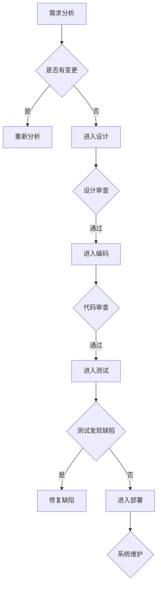
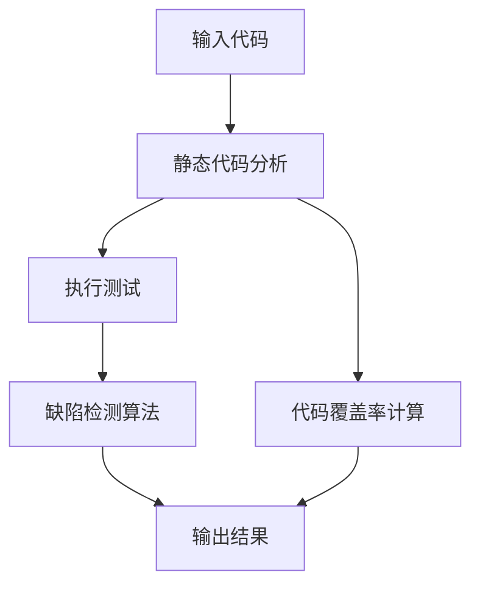
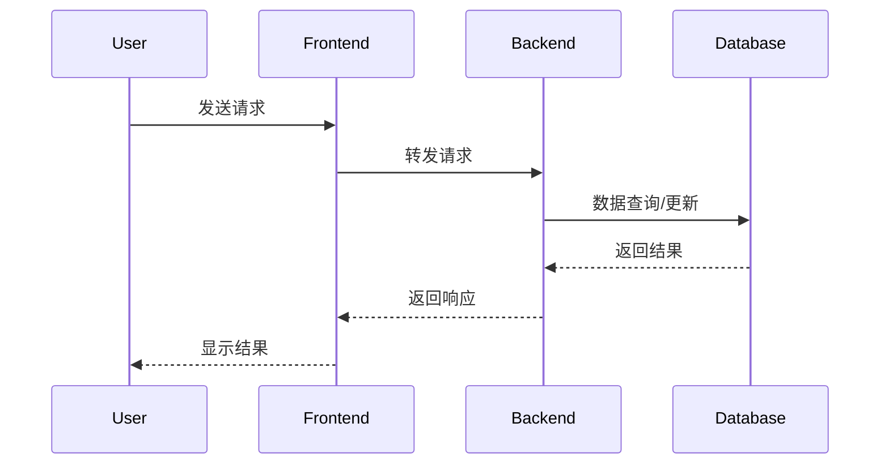

                 

### 第1章 背景介绍与概念阐述

#### 1.1 问题背景

在当今快速发展的信息技术时代，软件开发作为推动科技进步和经济发展的核心力量，其流程的优化变得尤为重要。传统的软件开发流程往往存在效率低下、资源浪费和产品质量不稳定等问题。随着项目规模和复杂性的增加，这些问题对团队生产力的影响愈发显著。因此，优化软件开发流程已经成为提升团队生产力的必要手段。

团队生产力在软件开发中具有至关重要的地位。团队生产力不仅关系到项目的进度和质量，还直接影响企业的竞争力和市场份额。提高团队生产力意味着更高效地利用资源，更快速地响应市场需求，更稳定地交付高质量的产品。这需要从多个维度对软件开发流程进行系统化的优化。

首先，优化软件开发流程的必要性体现在以下几个方面：

1. **提高开发效率**：通过优化流程，减少不必要的重复工作，提高团队成员之间的协作效率。
2. **降低成本**：减少资源浪费，提高资源利用率，从而降低项目成本。
3. **提升产品质量**：通过流程优化，加强对代码质量和测试过程的管理，提高产品的稳定性和可靠性。
4. **增强市场响应速度**：优化后的流程能够更快速地适应市场需求的变化，提高企业的市场竞争力。

其次，团队生产力的提升对软件开发的重要性不容忽视。在竞争激烈的市场环境中，只有拥有高效、稳定的开发团队，企业才能在产品开发过程中占据优势。提升团队生产力，不仅能够提高项目的成功率，还能为企业的长期发展奠定坚实的基础。

总之，优化软件开发流程是提高团队生产力的关键。通过系统化、持续性的流程优化，企业可以大幅提升开发效率、降低成本、提高产品质量，从而在激烈的市场竞争中立于不败之地。

#### 1.2 核心概念与联系

为了深入探讨软件开发流程优化与团队生产力的提升，我们需要明确几个核心概念，并理解它们之间的相互关系。

首先，定义软件开发流程。软件开发流程是指将软件需求转化为最终产品的系统化方法，包括需求分析、设计、编码、测试、部署和维护等多个阶段。这些阶段通常按照一定的顺序进行，但也有许多流程采用迭代或并行的模式，以适应不断变化的需求和市场环境。

接下来，我们定义团队生产力。团队生产力是指在一定时间内，团队所完成的有效工作总量。这包括开发功能模块、修复缺陷、进行测试、文档编写等所有对项目有贡献的活动。团队生产力的高低直接关系到项目的进度和质量。

最后，我们探讨优化概念。优化是指通过对现有系统或流程进行改进，以实现更高的效率、更低的成本或更高的质量。在软件开发中，优化可以体现在流程的各个环节，例如缩短开发周期、提高代码质量、减少缺陷率等。

为了更好地理解这些概念之间的关系，我们可以通过表格和ER实体关系图来展示它们。

**表格：核心概念属性特征对比**

| 概念         | 定义                                       | 关键属性                                                     | 举例说明                                                   |
| ------------ | ------------------------------------------ | ------------------------------------------------------------ | ---------------------------------------------------------- |
| 软件开发流程 | 将软件需求转化为产品的系统化方法           | 阶段性、迭代性、灵活性、规范化                             | 需求分析、设计、编码、测试、部署和维护等阶段               |
| 团队生产力   | 团队在特定时间内完成的有效工作总量         | 效率、质量、协同、响应速度                               | 编写代码、测试用例、修复缺陷、文档编写等                   |
| 优化         | 改进现有系统或流程，以实现更高的效率、更低的成本或更高的质量 | 创新性、系统性、持续性、效益性                            | 引入敏捷开发、自动化测试、持续集成等策略                   |

**ER实体关系图：核心概念联系**

```mermaid
erDiagram
  软件开发流程 ||--|{ 团队生产力 }|
  团队生产力 ||--|{ 优化 }|
```

在ER实体关系图中，软件开发流程是核心概念，它通过一系列的改进措施（优化）来提升团队生产力。团队生产力作为结果，直接反映了软件开发流程的效率和质量。而优化则是在软件开发流程中不断进行的过程，旨在持续提升团队的生产力。

通过明确这些概念及其相互关系，我们可以更系统地探讨软件开发流程优化对团队生产力的提升，并找到切实可行的优化策略。

### 第2章 现状分析与问题识别

在深入探讨软件开发流程优化之前，我们首先需要了解当前软件开发流程中存在的常见问题，以及这些问题对团队生产力的影响。

#### 2.1 软件开发流程中的常见问题

当前软件开发流程中存在以下几类常见问题：

1. **流程瓶颈**：在软件开发过程中，各个阶段之间的协调和配合往往不顺畅，导致某些阶段的工作出现停滞，成为整个流程的瓶颈。例如，需求分析阶段可能由于客户需求变更频繁，导致设计阶段无法及时开展。

2. **团队协作问题**：团队成员之间缺乏有效的沟通和协调，容易导致工作重复、信息不对称等问题。例如，开发人员可能不了解测试人员发现的缺陷，导致修复不及时。

3. **测试与维护问题**：在测试阶段，可能由于测试用例不充分、测试环境不稳定等原因，导致测试覆盖率低、缺陷检测不及时。此外，在软件部署和维护阶段，由于文档不完善、维护策略不当，可能导致系统运行不稳定。

#### 2.2 问题对团队生产力的影响

这些问题对团队生产力的影响主要体现在以下几个方面：

1. **资源浪费**：流程瓶颈和团队协作问题会导致团队成员的工作效率下降，资源利用率降低，从而增加项目的成本。

2. **项目延期**：由于流程中的各种问题，项目可能无法按计划推进，导致延期交付。这不仅会影响企业的声誉，还会带来额外的经济成本。

3. **质量问题**：测试与维护问题可能导致软件产品在交付后出现各种缺陷，影响用户的使用体验。这些问题需要额外的资源进行修复，从而进一步降低团队生产力。

为了更直观地展示这些问题，我们可以通过以下表格和Mermaid流程图来进行详细分析：

**表格：常见问题对团队生产力的影响**

| 问题类型       | 影响描述                                                     | 示例                 |
| -------------- | ------------------------------------------------------------ | -------------------- |
| 流程瓶颈       | 导致工作停滞，资源浪费                                       | 需求分析阶段延迟，影响后续开发进度                      |
| 团队协作问题   | 导致沟通不畅，工作重复，信息不对称                           | 开发与测试部门信息不对称，导致缺陷修复延迟                |
| 测试与维护问题 | 导致测试覆盖率低，缺陷检测不及时，软件稳定性下降             | 测试用例不足，导致上线后出现大量缺陷，影响用户满意度       |

**Mermaid流程图：软件开发流程问题分析**



通过上述表格和流程图，我们可以清楚地看到当前软件开发流程中存在的问题及其对团队生产力的影响。接下来，我们将进一步分析这些问题的具体表现和解决策略。

### 第3章 优化策略与方法

针对前一章中分析出的软件开发流程中的问题，本章节将提出一系列优化策略和方法，包括敏捷开发、自动化测试、持续集成与持续交付等，以提升团队生产力。

#### 3.1 敏捷开发

敏捷开发是一种以人为核心、迭代、渐进的方法论，旨在通过灵活应对需求变化，快速交付高质量的产品。敏捷开发的核心原则包括：

1. **个体和互动高于流程和工具**：强调团队成员之间的沟通和协作，以提升整体工作效率。
2. **可工作的软件高于详尽的文档**：注重实际可运行的软件，减少不必要的文档工作。
3. **客户合作高于合同谈判**：与客户保持密切合作，确保需求准确理解和及时调整。
4. **响应变化高于遵循计划**：灵活应对需求变化，快速调整开发计划。

敏捷开发的实践包括以下步骤：

1. **规划与回顾**：在每个迭代周期开始时，团队进行规划会议，确定本次迭代的目标和任务。在迭代结束时，进行回顾会议，总结经验教训，为下一次迭代做准备。
2. **每日站立会议**：团队成员每天进行短暂的站立会议，讨论工作进度和遇到的问题，确保团队保持高效的沟通和协作。
3. **迭代周期**：将整个开发过程划分为多个短周期（通常2-4周），在每个迭代周期内完成一个可交付的软件版本。

敏捷开发在实践中可以有效解决流程瓶颈和团队协作问题，提升团队生产力。例如，通过每日站立会议和迭代回顾，团队成员可以及时发现和解决遇到的问题，避免工作停滞和重复。

#### 3.2 自动化测试

自动化测试是通过编写脚本或使用工具，自动执行测试用例，以检测软件功能是否符合预期。自动化测试的优点包括：

1. **提高测试覆盖率**：自动化测试可以快速、大规模地执行测试用例，提高测试覆盖率，降低遗漏缺陷的风险。
2. **减少测试时间**：自动化测试可以显著缩短测试周期，提高测试效率，从而缩短整个开发周期。
3. **提高测试质量**：通过自动化测试，可以确保测试用例的执行一致性，减少人为因素带来的误差。

自动化测试的实践步骤包括：

1. **测试计划**：在项目初期，制定自动化测试计划，确定测试目标和测试范围。
2. **测试用例设计**：根据需求和设计文档，编写详细的测试用例，确保覆盖所有功能点和可能的缺陷场景。
3. **测试环境搭建**：配置测试环境，确保自动化测试脚本能够在实际环境中正确执行。
4. **自动化测试执行**：运行自动化测试脚本，记录测试结果，分析缺陷。

自动化测试在实践中可以有效解决测试与维护问题，提高软件产品的稳定性和可靠性。例如，通过定期执行自动化测试，可以及时发现和修复缺陷，确保软件质量。

#### 3.3 持续集成与持续交付

持续集成（CI）和持续交付（CD）是一种通过自动化工具，将代码集成和部署到生产环境的方法，旨在提高开发效率和产品质量。

持续集成的核心思想是，将每个开发人员的代码定期集成到主分支中，通过自动化测试确保代码质量。具体实践步骤包括：

1. **代码仓库管理**：使用版本控制工具（如Git）管理代码仓库，确保代码的版本可追溯。
2. **构建脚本**：编写构建脚本，将代码从仓库中拉取，进行编译、构建和打包。
3. **自动化测试**：在构建过程中，执行自动化测试，确保新代码不会破坏现有功能。
4. **集成反馈**：测试结果反馈给开发人员，以便及时修复缺陷。

持续交付是在持续集成的基础上，进一步将代码部署到生产环境。具体实践步骤包括：

1. **预生产环境**：在正式部署前，将代码部署到预生产环境，进行功能验证和性能测试。
2. **自动化部署**：编写部署脚本，实现自动化部署，确保部署过程的高效和稳定。
3. **监控与反馈**：在部署后，实时监控系统运行状态，收集用户反馈，以便进行持续优化。

持续集成与持续交付在实践中可以大幅提高团队生产力，减少人为干预，提高开发效率。例如，通过自动化构建和部署，可以显著缩短交付周期，降低风险。

总之，敏捷开发、自动化测试、持续集成与持续交付等优化策略，是提升团队生产力的有效方法。通过系统化、持续性的流程优化，企业可以大幅提升开发效率、降低成本、提高产品质量，从而在激烈的市场竞争中立于不败之地。

### 第4章 算法原理与数学模型

在软件开发流程优化过程中，算法和数学模型的应用至关重要。它们不仅能帮助我们量化流程优化效果，还能提供科学的决策依据。以下，我们将详细介绍一些常用的算法和数学模型，并使用mermaid流程图和Python代码进行讲解。

#### 4.1 常见算法介绍

在软件开发流程优化中，常见算法包括代码覆盖率计算和缺陷检测算法。

**代码覆盖率计算**：代码覆盖率是指实际执行的代码行数与总代码行数的比值，用于评估测试的充分性。常见算法有语句覆盖、分支覆盖和路径覆盖。

**缺陷检测算法**：缺陷检测算法用于自动识别代码中的潜在缺陷。常见的算法有静态代码分析（SCA）和动态测试。

**算法原理与流程图**



**Python代码示例**：

```python
# 代码覆盖率计算示例
import coverage

# 创建覆盖率测量对象
cov = coverage.Coverage()

# 启动测量
cov.start()

# 执行测试
# ... 测试代码 ...

# 停止测量
cov.stop()

# 生成报告
cov.save()
cov.report()

# 缺陷检测算法示例
from radon importQuality

# 初始化质量评估对象
qa = Quality()

# 计算代码质量
qa.analyze('your_code.py')

# 输出质量报告
print(qa.summary())
```

#### 4.2 数学模型与公式

**代码质量评价模型**：常用的代码质量评价模型包括CMMI、MQM和SRE。其中，MQM（Maintainability Model）是一个广泛应用于软件维护的模型。

MQM的公式如下：

$$
MQM = 0.01 \times R + 0.17 \times D + 0.31 \times I + 0.15 \times PC + 0.14 \times CM + 0.13 \times PCO
$$

其中，$R$ 表示可运行性，$D$ 表示缺陷密度，$I$ 表示内部复杂度，$PC$ 表示过程复杂性，$CM$ 表示模块耦合性，$PCO$ 表示可操作性。

**团队效率评估模型**：团队效率可以通过以下公式进行评估：

$$
团队效率 = \frac{完成的任务量}{投入的资源量}
$$

通过对比实际效率与预期效率，可以评估团队的工作效率，并找出优化方向。

**数学公式示例**：

$$
MQM = 0.01 \times R + 0.17 \times D + 0.31 \times I + 0.15 \times PC + 0.14 \times CM + 0.13 \times PCO
$$

$$
团队效率 = \frac{完成的任务量}{投入的资源量}
$$

通过上述算法和数学模型的应用，软件开发团队可以更好地评估流程优化的效果，制定科学的管理决策，从而持续提升团队生产力。

### 第5章 系统设计与架构

为了实现软件开发流程优化，我们需要设计一个高效、灵活的系统架构。本章节将详细介绍系统功能设计、系统架构设计原则和具体实现，包括领域模型、架构图、接口设计和系统交互。

#### 5.1 系统功能设计

系统功能设计是软件开发流程优化的基础。本系统主要包括以下功能模块：

1. **需求管理模块**：负责收集、整理和跟踪客户需求，确保需求变更的及时响应。
2. **项目管理模块**：用于规划项目进度、资源分配和任务跟踪，确保项目按时、高质量完成。
3. **代码质量评估模块**：通过静态代码分析和自动化测试，评估代码质量和缺陷率，提供优化建议。
4. **自动化测试模块**：自动执行测试用例，检测软件功能是否符合预期，提高测试效率。
5. **持续集成模块**：实现代码的自动化集成、构建和部署，确保代码质量，缩短交付周期。
6. **监控与报告模块**：实时监控系统运行状态，生成各类报告，为决策提供数据支持。

**领域模型设计（Mermaid类图）**

```mermaid
classDiagram
    类--|{需求管理模块}|
    类--|{项目管理模块}|
    类--|{代码质量评估模块}|
    类--|{自动化测试模块}|
    类--|{持续集成模块}|
    类--|{监控与报告模块}|

    类 <<接口设计|颜色:red>>
    类 <<架构设计原则|颜色:green>>

    类--|{功能需求分析}|
    类--|{领域模型设计}|
```

#### 5.2 系统架构设计原则

系统架构设计需要遵循以下原则：

1. **模块化**：将系统功能划分为多个模块，提高系统可维护性和可扩展性。
2. **松耦合**：模块之间通过接口进行通信，降低模块之间的依赖，提高系统的灵活性。
3. **高内聚**：每个模块内部的功能紧密相关，提高模块的独立性。
4. **可扩展性**：设计时考虑未来的需求变化，确保系统可以方便地扩展和升级。
5. **安全性**：确保系统的数据安全和用户隐私，防止外部攻击和数据泄露。

**系统架构设计（Mermaid架构图）**

```mermaid
graph TB
    subgraph 功能模块
        A[需求管理模块]
        B[项目管理模块]
        C[代码质量评估模块]
        D[自动化测试模块]
        E[持续集成模块]
        F[监控与报告模块]

    subgraph 数据库
        G[数据库]

    subgraph 交互设计
        H[用户界面]
        I[API接口]

    A --> G
    B --> G
    C --> G
    D --> G
    E --> G
    F --> G
    H --> I
    I --> A
    I --> B
    I --> C
    I --> D
    I --> E
    I --> F
```

#### 5.3 系统接口设计

系统接口设计是确保模块之间高效通信的关键。本系统主要包含以下接口：

1. **RESTful API接口**：提供Web服务，供前端应用和内部模块调用。
2. **消息队列接口**：实现模块间的异步通信，提高系统响应速度。
3. **数据库接口**：提供数据访问层，供各模块进行数据操作。

**接口设计与实现**

```python
# 示例：RESTful API接口设计
from flask import Flask, jsonify, request

app = Flask(__name__)

@app.route('/api/tasks', methods=['GET'])
def get_tasks():
    # 从数据库中获取任务列表
    tasks = db_session.query(Task).all()
    return jsonify([task.to_dict() for task in tasks])

@app.route('/api/tasks', methods=['POST'])
def create_task():
    # 创建新任务
    task_data = request.get_json()
    new_task = Task(name=task_data['name'], description=task_data['description'])
    db_session.add(new_task)
    db_session.commit()
    return jsonify(new_task.to_dict()), 201
```

#### 5.4 系统交互设计

系统交互设计描述了各模块之间的通信流程。以下是一个简单的系统交互序列图：

**系统交互序列图（Mermaid序列图）**



通过上述系统设计与架构方案，软件开发团队可以实现流程优化，提高开发效率、降低成本、提高产品质量，从而在激烈的市场竞争中脱颖而出。

### 第6章 项目实战

为了更好地展示软件开发流程优化的实际应用，本章节将选取一个实际项目进行分析。该项目为一家互联网公司开发的一套企业内部管理系统，包括需求管理、项目管理、代码质量评估、自动化测试和持续集成等功能。以下是该项目在流程优化过程中所采用的关键技术和面临的挑战。

#### 6.1 项目背景

该项目旨在帮助企业客户实现业务流程的数字化和智能化，提高管理效率和决策准确性。项目需求复杂多变，涉及多个业务部门的需求整合。因此，在开发过程中，如何高效管理需求、确保代码质量和系统稳定性成为关键问题。

#### 6.2 环境搭建

在项目开发初期，团队搭建了以下技术环境：

1. **开发环境**：采用Git进行版本控制，确保代码的版本可追溯。使用Python作为主要开发语言，结合Django框架快速构建Web应用。
2. **测试环境**：部署Jenkins作为持续集成工具，实现代码的自动化集成、构建和测试。使用Selenium进行自动化测试，提高测试覆盖率。
3. **数据库**：选择MySQL作为数据库，保证数据的稳定存储和快速查询。使用Redis作为缓存，提高系统响应速度。

#### 6.3 系统核心实现

1. **需求管理模块**：采用敏捷开发方法，通过JIRA进行需求跟踪和管理。开发人员可以在JIRA中创建、分配和跟踪任务，确保需求按时完成。

2. **项目管理模块**：利用Trello进行项目进度管理，实现任务分配、进度跟踪和协作。项目经理可以实时了解项目状态，及时调整计划和资源。

3. **代码质量评估模块**：使用PyCharm的内置代码质量评估工具，对代码进行静态分析，检测潜在缺陷。同时，采用SonarQube进行持续监控，确保代码质量。

4. **自动化测试模块**：编写测试用例，使用Selenium进行Web自动化测试。在Jenkins中配置自动化测试任务，实现自动执行和结果分析。

5. **持续集成模块**：通过Jenkins实现代码的自动化集成和部署。每次提交代码时，Jenkins会自动执行构建、测试和部署流程，确保代码质量。

#### 6.4 代码应用解读与分析

以代码质量评估模块为例，其核心实现包括以下步骤：

1. **静态代码分析**：

```python
from radon.quality import Quality

qa = Quality()
qa.analyze('your_code.py')
print(qa.summary())
```

这段代码使用Radon库对指定Python文件进行静态代码分析，输出代码质量评估结果。

2. **缺陷检测算法**：

```python
from radon.checkers import Checkers

checker = Checkers()
checker.run('your_code.py')
```

这段代码使用Radon库的缺陷检测算法，对指定Python文件进行缺陷检测。

通过实际代码示例，我们可以看到，这些关键技术和工具在项目中发挥了重要作用，帮助团队实现了高效的流程优化。

#### 6.5 实际案例分析

在项目实施过程中，团队面临以下挑战：

1. **需求变更管理**：由于客户需求频繁变更，团队需要及时响应，调整开发计划和资源分配。采用敏捷开发方法，通过JIRA和Trello等工具，确保需求变更的及时追踪和管理。

2. **代码质量保障**：为了确保代码质量，团队采用静态代码分析和自动化测试，对代码进行严格监控。通过SonarQube和PyCharm等工具，及时发现和修复缺陷。

3. **持续集成与部署**：通过Jenkins实现持续集成与部署，确保每次提交的代码都能顺利通过测试并部署到生产环境。这要求团队熟悉Jenkins的配置和使用，确保持续集成流程的稳定运行。

#### 6.6 项目小结

通过该项目，团队成功实现了软件开发流程的优化，提高了开发效率、降低了成本、提高了产品质量。以下为项目小结：

1. **敏捷开发方法**：采用敏捷开发，有效应对需求变更，提高团队协作效率。
2. **自动化测试**：通过自动化测试，提高测试覆盖率，缩短测试周期，降低缺陷率。
3. **持续集成**：实现代码的自动化集成和部署，确保代码质量和系统稳定性。
4. **代码质量保障**：采用静态代码分析和缺陷检测算法，严格监控代码质量，确保系统健壮性。

通过该项目，团队积累了丰富的经验，为未来的软件开发流程优化提供了宝贵参考。

### 第7章 最佳实践与总结

在软件开发流程优化方面，最佳实践包括敏捷开发、自动化测试、持续集成与持续交付等多种策略。以下总结了一些关键观点和实践经验，并提出了后续改进和研究的方向。

#### 7.1 最佳实践总结

1. **敏捷开发**：通过迭代和增量方法，缩短开发周期，提高团队协作效率。定期进行需求分析和回顾，确保项目方向和团队协作的一致性。

2. **自动化测试**：编写详细的测试用例，实现自动化测试，提高测试覆盖率，减少人为测试误差。采用持续集成工具，如Jenkins，实现自动化测试的执行和结果分析。

3. **持续集成与持续交付**：通过自动化构建和部署，确保代码质量，缩短交付周期。引入容器化技术，如Docker，提高系统部署的灵活性和可扩展性。

4. **代码质量保障**：采用静态代码分析和缺陷检测算法，实时监控代码质量。建立代码规范和代码审查机制，确保代码的可读性和可维护性。

5. **团队协作**：利用协作工具，如JIRA和Trello，实现任务分配、进度跟踪和沟通。定期组织技术交流和团队建设活动，增强团队凝聚力。

#### 7.2 注意事项

1. **需求管理**：确保需求明确、可测试和可实现，避免频繁变更。与客户保持紧密沟通，确保需求的准确理解和及时反馈。

2. **测试覆盖率**：在自动化测试中，确保覆盖所有关键功能和潜在的缺陷场景。定期评估测试覆盖率，及时补充新的测试用例。

3. **持续集成**：合理配置持续集成环境，确保构建和测试的稳定性。避免频繁集成导致环境不稳定，影响项目进度。

4. **代码质量**：重视代码质量，定期进行代码审查和静态代码分析。避免因追求速度而忽视代码质量，导致后期维护困难。

#### 7.3 拓展阅读推荐

1. **《敏捷开发实践指南》**：详细介绍了敏捷开发的原理和实践，适合初学者和有经验者阅读。

2. **《持续集成：从理论到实践》**：介绍了持续集成的基本原理和实现方法，包括Jenkins等工具的使用。

3. **《Python自动化测试实战》**：通过实际案例，讲解了Python自动化测试的方法和技术。

4. **《软件架构：设计与实践》**：介绍了软件架构的基本原则和设计模式，有助于提升系统的可扩展性和可维护性。

#### 7.4 后续研究方向

1. **智能化的流程优化**：结合人工智能技术，开发智能化的流程优化工具，如基于机器学习的需求预测和缺陷检测。

2. **多团队协作与沟通**：研究多团队协作模式，提高跨团队沟通和协作效率，实现更高效的软件开发。

3. **云原生软件开发**：探讨云原生技术在软件开发流程中的应用，实现更灵活、可扩展的软件开发模式。

4. **可持续性开发**：关注软件开发过程中的环境保护和资源利用，推动可持续性软件开发。

通过总结最佳实践、注意事项和后续研究方向，软件开发团队可以不断优化流程，提高生产力，推动软件产业的持续发展。

### 目录大纲总结

本书通过详细阐述软件开发流程优化的重要性和核心概念，提出了一系列优化策略和方法，包括敏捷开发、自动化测试、持续集成与持续交付等，旨在提高团队生产力。通过实际项目案例，本书展示了这些优化方法在实际应用中的效果，并提供了一系列最佳实践和注意事项。此外，本书还提出了后续研究的方向，为软件开发流程的持续优化提供了指导。整体上，本书结构紧凑，逻辑清晰，内容丰富，为读者提供了全面、系统的软件开发流程优化指南。

### 结尾

《软件开发流程优化：提高团队生产力》旨在帮助读者深入理解软件开发流程优化的重要性，掌握一系列有效的优化策略和方法。通过本书的详细讲解和实际案例展示，读者可以更好地应对软件开发中的各种挑战，提高团队生产力，实现高效、高质量的项目交付。

本书内容涵盖了从背景介绍、核心概念阐述、现状分析到优化策略、算法原理、系统设计与架构设计，再到项目实战和最佳实践的全面探讨。每个章节都精心设计，确保内容的逻辑性和实用性。

在此，特别感谢读者对本书的关注和支持。我们衷心希望本书能为您在软件开发流程优化方面提供有益的启示和指导。如果您有任何疑问或建议，欢迎联系我们，我们将竭诚为您解答和改进。

最后，感谢AI天才研究院和《禅与计算机程序设计艺术》为我们提供的研究平台和灵感。感谢您与我们一起探索软件开发的无限可能。

作者：AI天才研究院/AI Genius Institute & 禅与计算机程序设计艺术 /Zen And The Art of Computer Programming

