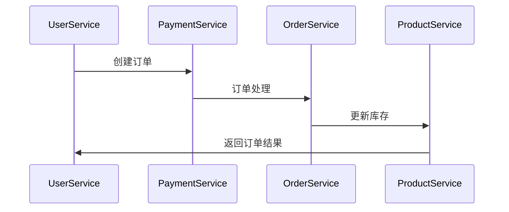
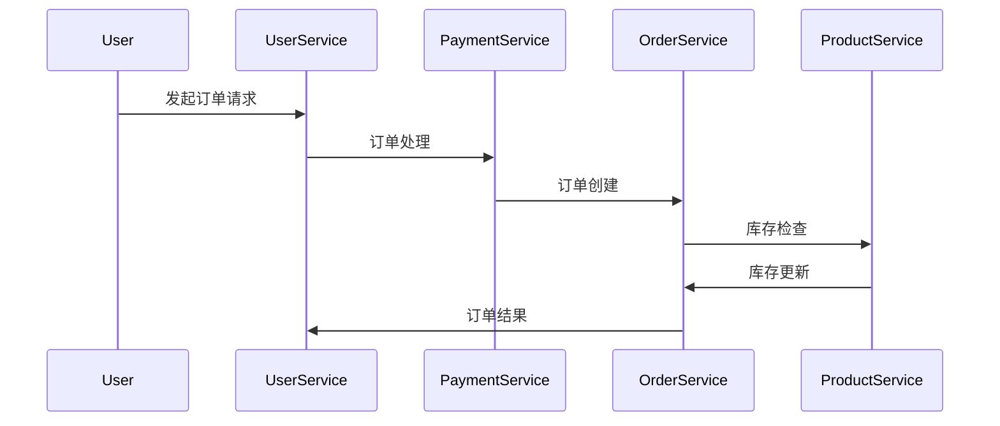

                 


### 《软件性能调优：从应用到数据库的全栈优化》

---

**关键词**：软件性能调优、全栈优化、数据库性能、应用架构

**摘要**：本文深入探讨了软件性能调优的方方面面，从基础概念到具体实施，从应用层面到数据库层面，全面覆盖了全栈性能调优的关键技术和实践方法。文章旨在帮助读者理解性能调优的重要性，掌握性能调优的核心原则，并提供实用的优化策略和最佳实践。

---

### 目录大纲设计思路

**整体结构规划**：
本文的结构将分为四个主要部分：性能调优基础、应用性能调优、数据库性能调优、全栈性能调优。这种分层结构有助于读者逐步深入理解性能调优的各个方面。

**细化章节内容**：
每个部分都包含详细的章节，例如在应用性能调优部分，我们不仅讨论了Web应用性能调优，还详细分析了应用架构对性能的影响，并提供了具体的优化策略和实战案例。

**确保内容完整性**：
本文将覆盖性能调优的核心概念、算法原理、数学模型、系统分析与架构设计、项目实战等各个方面，确保内容的全面性和深度。

**简洁性**：
在保持内容完整性的同时，文章将避免冗余信息，确保每段内容简洁明了，便于读者理解和吸收。

**格式规范**：
文章将使用markdown格式，遵循清晰的层级结构，确保目录大纲的易读性和专业性。

### 目录大纲设计框架

**第一部分：性能调优基础**
- 第1章：软件性能调优概述
  - 1.1 性能调优的重要性
  - 1.2 性能调优的目标
  - 1.3 性能调优的方法与策略

- 第2章：核心概念与联系
  - 2.1 性能调优相关概念
  - 2.2 概念属性特征对比
  - 2.3 性能调优的ER实体关系图架构

**第二部分：应用性能调优**
- 第3章：Web应用性能调优
  - 3.1 Web应用性能分析
  - 3.2 Web前端性能优化
  - 3.3 Web后端性能优化

- 第4章：应用架构与性能调优
  - 4.1 应用架构对性能的影响
  - 4.2 应用架构优化策略
  - 4.3 应用架构调优实战

**第三部分：数据库性能调优**
- 第5章：数据库性能调优原理
  - 5.1 数据库性能瓶颈分析
  - 5.2 数据库性能优化策略
  - 5.3 数据库性能调优工具

- 第6章：关系型数据库性能调优
  - 6.1 关系型数据库性能分析
  - 6.2 关系型数据库性能优化
  - 6.3 关系型数据库性能调优实战

- 第7章：NoSQL数据库性能调优
  - 7.1 NoSQL数据库性能分析
  - 7.2 NoSQL数据库性能优化
  - 7.3 NoSQL数据库性能调优实战

**第四部分：全栈性能调优**
- 第8章：全栈性能调优策略
  - 8.1 全栈性能调优关键点
  - 8.2 全栈性能优化方法
  - 8.3 全栈性能调优案例分析

- 第9章：性能调优最佳实践
  - 9.1 性能调优最佳实践
  - 9.2 小结与注意事项
  - 9.3 拓展阅读

- 第10章：性能调优未来展望
  - 10.1 性能调优发展趋势
  - 10.2 性能调优面临的挑战
  - 10.3 未来性能调优方向

**附录：性能调优工具与资源**
- A.1 常用性能调优工具
- A.2 性能调优资源推荐
- A.3 性能调优社区与论坛

通过这个大纲，我们能够确保文章的内容全面且条理清晰，为读者提供一次全面的性能调优知识之旅。

---

### 性能调优的背景和重要性

在当今快速发展的信息技术时代，软件性能调优已经成为确保系统高效运行、提升用户体验的关键环节。无论是大型企业级应用还是中小型创业公司的产品，性能调优都是提高系统可用性、可靠性和用户满意度的重要手段。

**背景介绍**：

软件性能调优的背景可以追溯到计算机技术的发展初期。随着计算机硬件的不断升级，软件系统的复杂度也在不断增加。从单机应用逐渐发展到分布式系统、云计算，性能调优的需求也越来越强烈。性能调优不仅仅是为了提高系统的响应速度，更重要的是确保系统能够在高并发、大数据量的环境下稳定运行。

**问题背景**：

现代软件系统面临的问题日益复杂，包括但不限于：

- **响应时间过长**：系统在高负载情况下响应速度变慢，导致用户体验下降。
- **资源消耗过大**：系统运行过程中CPU、内存、磁盘等资源的占用过高，影响系统的扩展性和稳定性。
- **并发能力不足**：系统在处理高并发请求时出现瓶颈，导致请求排队、响应延迟。
- **数据访问效率低**：数据库查询效率低下，影响整体系统性能。

**问题描述**：

为了解决上述问题，性能调优的目标包括：

- **提高响应速度**：优化系统架构和代码，减少响应时间，提升用户体验。
- **优化资源利用率**：合理分配系统资源，提高资源利用率，降低系统成本。
- **增强并发处理能力**：优化系统设计，提高系统的并发处理能力，确保高并发环境下的稳定性。
- **提高数据访问效率**：针对数据库进行优化，提升数据查询和写入速度。

**问题解决**：

性能调优的方法和策略多种多样，包括但不限于以下几种：

- **代码优化**：通过代码级别的优化，减少不必要的计算和内存占用，提高代码执行效率。
- **架构优化**：改进系统架构，采用分布式、微服务架构，提升系统的扩展性和容错能力。
- **缓存策略**：利用缓存机制，减少对数据库的直接访问，提高数据读取速度。
- **数据库优化**：对数据库进行索引优化、查询优化、存储优化等，提升数据库性能。
- **资源监控与调优**：使用性能监控工具，实时监控系统资源使用情况，根据监控数据调整系统配置。

**边界与外延**：

性能调优不仅涉及到技术层面，还包括业务层面的优化。例如，通过合理设计业务逻辑，减少数据库查询次数，优化数据处理流程，从而提升系统性能。

**概念结构与核心要素组成**：

性能调优的核心概念包括：

- **响应时间**：系统从接收到请求到返回响应的时间。
- **资源利用率**：系统资源（如CPU、内存、磁盘）的占用比例。
- **并发能力**：系统同时处理多个请求的能力。
- **数据访问效率**：数据库查询和写入的效率。

这些概念构成了性能调优的核心要素，通过优化这些要素，可以达到提升系统性能的目的。

综上所述，性能调优是现代软件系统不可或缺的一环，通过合理的性能调优，可以显著提升系统的性能和稳定性，为用户提供更好的体验。

### 性能调优相关核心概念与联系

在进行软件性能调优时，理解一系列核心概念和它们之间的联系至关重要。这些概念包括响应时间、资源利用率、并发能力、数据访问效率等。它们不仅是性能调优的关键指标，也是优化过程中需要重点关注的领域。

#### 响应时间

**定义**：响应时间是指从客户端发起请求到系统返回响应所经历的时间。

**属性特征**：

- **平均响应时间**：系统在一定时间内处理请求的平均响应时间。
- **最大响应时间**：系统处理单个请求所经历的最长时间。
- **响应时间分布**：不同响应时间段的分布情况，通常以直方图形式展示。

**影响因素**：

- **网络延迟**：客户端与服务器之间的网络传输延迟。
- **系统负载**：系统同时处理的请求数量。
- **服务器性能**：服务器的CPU、内存、磁盘性能。

**优化策略**：

- **减少网络延迟**：优化网络架构，使用CDN加速。
- **均衡负载**：使用负载均衡器，分配请求到多个服务器。
- **提高服务器性能**：升级硬件、优化操作系统和中间件。

#### 资源利用率

**定义**：资源利用率是指系统在运行过程中，资源（如CPU、内存、磁盘）的实际使用比例。

**属性特征**：

- **CPU利用率**：CPU的实际使用比例。
- **内存利用率**：内存的占用比例。
- **磁盘I/O利用率**：磁盘读/写操作的频率。

**影响因素**：

- **并发请求量**：系统同时处理的请求数量。
- **系统负载**：系统运行的总任务量。
- **硬件性能**：服务器的CPU、内存、磁盘性能。

**优化策略**：

- **提高硬件性能**：升级服务器硬件，增加CPU核心、内存容量、提高磁盘速度。
- **优化系统配置**：调整操作系统和中间件的配置，提高资源利用率。
- **降低并发请求量**：通过限流、限速策略，控制请求的并发数量。

#### 并发能力

**定义**：并发能力是指系统能够同时处理多个请求的能力。

**属性特征**：

- **并发连接数**：系统能够同时处理的连接数量。
- **并发处理能力**：系统同时处理请求的数量。

**影响因素**：

- **系统架构**：分布式架构、微服务架构能够提高并发处理能力。
- **网络带宽**：网络带宽决定了系统处理请求的速度。
- **硬件性能**：服务器的CPU、内存、磁盘性能。

**优化策略**：

- **分布式架构**：采用分布式架构，提高系统的并发处理能力。
- **负载均衡**：使用负载均衡器，均衡分配请求到多个服务器。
- **数据库优化**：优化数据库性能，减少数据库的瓶颈。

#### 数据访问效率

**定义**：数据访问效率是指系统访问数据库的快慢程度。

**属性特征**：

- **查询响应时间**：数据库查询的响应时间。
- **写入响应时间**：数据库写入操作的响应时间。
- **索引效率**：数据库索引的性能。

**影响因素**：

- **数据库设计**：表结构、索引的设计对查询效率有重要影响。
- **数据量**：数据量的多少直接影响查询效率。
- **硬件性能**：磁盘I/O性能对数据库性能有显著影响。

**优化策略**：

- **索引优化**：合理设计索引，提高查询效率。
- **查询优化**：优化SQL查询语句，减少不必要的查询操作。
- **分库分表**：在大数据量场景下，通过分库分表减少单表的压力。

#### 概念属性特征对比

| 概念         | 定义                                                         | 属性特征                                                       | 影响因素                                                   | 优化策略                                                   |
| ------------ | ------------------------------------------------------------ | ------------------------------------------------------------ | -------------------------------------------------------- | -------------------------------------------------------- |
| 响应时间     | 从客户端发起请求到系统返回响应所经历的时间                   | 平均响应时间、最大响应时间、响应时间分布                       | 网络延迟、系统负载、服务器性能                             | 减少网络延迟、均衡负载、提高服务器性能                     |
| 资源利用率   | 系统在运行过程中，资源（如CPU、内存、磁盘）的实际使用比例     | CPU利用率、内存利用率、磁盘I/O利用率                         | 并发请求量、系统负载、硬件性能                             | 提高硬件性能、优化系统配置、降低并发请求量                 |
| 并发能力     | 系统能够同时处理多个请求的能力                               | 并发连接数、并发处理能力                                     | 系统架构、网络带宽、硬件性能                               | 分布式架构、负载均衡、数据库优化                         |
| 数据访问效率   | 系统访问数据库的快慢程度                                     | 查询响应时间、写入响应时间、索引效率                         | 数据库设计、数据量、硬件性能                               | 索引优化、查询优化、分库分表                           |

#### 性能调优的ER实体关系图架构

为了更好地理解性能调优中的各个概念及其关系，我们可以使用ER（实体关系）图来展示。以下是性能调优的ER实体关系图：

```mermaid
erDiagram
  响应时间 ||--|{ 资源利用率 }
  并发能力 ||--|{ 资源利用率 }
  数据访问效率 ||--|{ 资源利用率 }
  响应时间 ||--|{ 并发能力 }
  响应时间 ||--|{ 数据访问效率 }
  资源利用率 ||--|{ 并发能力 }
  资源利用率 ||--|{ 数据访问效率 }
```

在这个ER图中，响应时间、资源利用率、并发能力和数据访问效率是四个核心实体，它们通过不同的关系相互关联。例如，响应时间与资源利用率和并发能力有直接关系，而数据访问效率也会影响响应时间。

### Web应用性能调优

#### 3.1 Web应用性能分析

Web应用性能调优是确保网站或应用程序能够快速、稳定、高效地响应用户请求的重要环节。首先，我们需要对Web应用的性能进行分析，以识别潜在的瓶颈和优化点。以下是Web应用性能分析的主要步骤和方法：

**性能监控工具**：
性能监控工具如New Relic、AppDynamics、Datadog等，可以帮助我们实时监控Web应用的性能指标，包括响应时间、吞吐量、错误率等。

**负载测试**：
负载测试是通过模拟高并发用户请求，评估Web应用的性能和稳定性。常用的工具包括JMeter、LoadRunner等。通过负载测试，我们可以识别出系统在高负载下的性能瓶颈。

**日志分析**：
日志分析是性能调优的重要手段。通过分析Web服务器和应用程序的日志，我们可以找到性能问题的根源，如慢查询、异常错误等。

**前端性能分析**：
前端性能分析主要关注页面加载速度、资源优化等方面。工具如Google PageSpeed Insights、Lighthouse等可以帮助我们评估和优化前端性能。

**数据库性能分析**：
数据库是Web应用性能的关键因素之一。通过对数据库进行性能分析，我们可以找到慢查询、索引不足等问题，从而优化数据库性能。

#### 3.2 Web前端性能优化

前端性能优化主要集中在加快页面加载速度、减少资源加载时间、提高交互性能等方面。以下是几种常见的前端性能优化方法：

**资源压缩与合并**：
通过压缩CSS和JavaScript文件，减少HTTP请求次数，加快页面加载速度。使用工具如Gulp、Webpack可以帮助自动完成这一过程。

**懒加载**：
懒加载技术可以在需要时才加载页面资源，从而减少页面加载时间。例如，图片、视频等大型资源可以延迟加载，只在用户滚动到相应内容时才加载。

**浏览器缓存**：
合理使用浏览器缓存，可以减少重复资源的请求次数，提高访问速度。通过设置缓存策略，例如设置合理的缓存过期时间，可以优化用户体验。

**异步加载**：
异步加载技术可以将非关键资源（如JavaScript、CSS文件）异步加载，避免阻塞页面渲染。使用async和defer属性可以实现异步加载。

**CSS精灵**：
CSS精灵技术可以将多个图片合并为一个，通过背景定位技术显示需要的图片部分，从而减少HTTP请求次数。

**代码分割**：
代码分割可以将一个大JavaScript文件分割成多个小文件，按需加载，减少首屏加载时间。

#### 3.3 Web后端性能优化

Web后端性能优化主要关注服务器端代码、数据库操作等方面。以下是几种常见的后端性能优化方法：

**代码优化**：
优化服务器端代码，减少不必要的计算和内存占用。使用缓存技术，如Redis、Memcached，减少数据库查询次数。

**数据库优化**：
数据库优化是提升Web应用性能的关键。以下是一些数据库优化的策略：

- **索引优化**：合理设计索引，加快查询速度。对频繁查询的字段建立索引，避免全表扫描。
- **查询优化**：优化SQL查询语句，避免使用SELECT *，只查询必要的字段。避免使用子查询和JOIN操作，减少查询时间。
- **存储优化**：优化数据库存储结构，例如使用分区表、分库分表等技术，减少单表的压力。
- **缓存策略**：使用数据库缓存，如MySQL的Query Cache，减少数据库的查询负担。

**负载均衡**：
使用负载均衡器，如Nginx、HAProxy，分配请求到多个服务器，避免单点瓶颈。负载均衡可以基于权重、响应时间等策略，确保请求合理分配。

**代码缓存**：
使用代码缓存技术，如Redis、Varnish，缓存页面渲染结果，减少服务器端的计算负担。这样可以显著提高页面响应速度。

**服务器优化**：
优化服务器配置，如调整操作系统内核参数、网络配置等，提高服务器性能。使用SSD硬盘、优化网络带宽等硬件升级也可以提高系统性能。

**异步处理**：
使用异步处理技术，如异步IO、消息队列等，减少线程阻塞，提高服务器并发处理能力。例如，使用异步HTTP请求，避免同步操作造成的线程阻塞。

**性能监控与调优**：
持续监控Web应用性能，及时发现性能瓶颈。使用性能监控工具，如Prometheus、Grafana，实时展示性能指标，帮助调优。

通过上述Web前端和后端性能优化方法，我们可以显著提升Web应用的性能和用户体验。性能调优是一个持续的过程，需要不断监控和优化，以适应不断变化的需求和负载。

### 应用架构对性能调优的影响

在软件性能调优的过程中，应用架构的设计和选择起着至关重要的作用。一个良好的应用架构不仅能够提高系统的性能，还能为后续的扩展和优化提供坚实的基础。以下将从多个方面探讨应用架构对性能调优的影响，并给出优化策略。

#### 分布式架构与性能调优

分布式架构通过将系统分解为多个独立的模块，分散负载，提高系统的并发处理能力。这种架构在性能调优方面具有以下优势：

- **高可用性**：分布式架构通过冗余设计，提高系统的容错能力，避免单点故障导致的服务中断。
- **可扩展性**：分布式架构支持水平扩展，可以通过增加节点数量来提升系统的处理能力。
- **负载均衡**：负载均衡器能够将请求均匀分布到各个节点，避免单点过载。

**优化策略**：

- **微服务架构**：采用微服务架构，将系统拆分为多个独立的小服务，每个服务可以独立部署和扩展，降低系统耦合度，提高维护性和可扩展性。
- **分布式缓存**：使用分布式缓存，如Redis、Memcached，减少数据库的压力，提高数据读取速度。
- **分布式数据库**：采用分布式数据库，如MongoDB、Cassandra，能够处理海量数据，提高查询效率。

#### 微服务架构与性能调优

微服务架构是一种将应用程序划分为多个独立服务的架构风格。每个服务都运行在其独立的进程中，通过轻量级的通信机制（如HTTP/REST）相互交互。

**优势**：

- **灵活性和可维护性**：每个服务都是独立的，可以独立开发和部署，方便维护和扩展。
- **可扩展性**：服务可以根据需求独立扩展，例如，可以单独增加订单处理服务的节点，而不会影响到其他服务。
- **故障隔离**：单个服务的故障不会影响整个系统，提高了系统的稳定性。

**优化策略**：

- **服务拆分**：合理划分服务，确保每个服务都具备独立的业务逻辑，避免过大的服务导致性能瓶颈。
- **服务发现与路由**：使用服务发现机制，如Consul、Eureka，确保服务能够快速、准确地发现和访问其他服务。
- **熔断与限流**：使用熔断器和限流器（如Hystrix、Sentinel），防止服务雪崩，提高系统的鲁棒性。

#### 容器化与性能调优

容器化技术，如Docker，通过将应用及其依赖环境封装在容器中，提供了灵活的部署和扩展方式。以下是其优势及优化策略：

- **轻量级**：容器启动速度快，资源占用小，非常适合微服务和持续集成/持续部署（CI/CD）流程。
- **标准化**：容器化标准统一，提高了不同环境间的兼容性。
- **高可用性**：通过容器编排工具（如Kubernetes），可以实现容器的自动化部署、扩展和管理。

**优化策略**：

- **资源隔离**：利用容器化技术，实现更细粒度的资源隔离，提高资源利用率。
- **动态扩展**：使用容器编排工具，实现容器的动态扩缩容，根据负载自动调整资源。
- **服务网格**：使用服务网格（如Istio、Linkerd），提高服务间的通信效率，确保服务间的性能。

#### 云服务与性能调优

云计算提供了弹性的计算资源，可以根据需求动态调整资源使用，从而优化性能。以下是其优势及优化策略：

- **弹性扩展**：云服务可以自动根据负载动态扩展资源，确保系统在高负载下依然能够稳定运行。
- **成本效益**：云服务按需付费，避免了硬件的浪费，提高了成本效益。
- **多地域部署**：云服务支持多地域部署，提高了服务的可用性和响应速度。

**优化策略**：

- **负载均衡**：使用负载均衡器，如AWS Elastic Load Balancing，将请求分配到不同区域和实例。
- **缓存策略**：使用云提供的缓存服务，如AWS CloudFront、Azure Content Delivery Network，减少数据传输延迟。
- **自动化部署**：使用云服务提供的自动化部署工具，如AWS CodePipeline，实现持续集成和持续部署。

综上所述，应用架构的设计和选择对性能调优有着重要的影响。通过采用分布式架构、微服务架构、容器化技术、云服务等多种手段，我们可以优化应用性能，提高系统的可用性、扩展性和成本效益。

### 应用架构优化策略

为了在软件性能调优中最大化应用架构的潜力，我们需要采取一系列优化策略。这些策略不仅有助于提高当前的性能，还为未来的扩展和升级奠定了基础。

#### 1. 模块化设计

模块化设计是将系统划分为多个独立模块的过程。每个模块负责特定的功能，并通过定义良好的接口进行通信。模块化设计的优点在于：

- **降低复杂性**：将复杂系统分解为小模块，降低了单个模块的复杂性，便于理解和维护。
- **提高可复用性**：模块可以独立开发、测试和部署，提高了代码的复用性。
- **提升可测试性**：每个模块都可以独立测试，确保模块的正确性。

**实现方法**：

- **定义清晰的接口**：确保模块之间的交互通过标准化的接口进行，减少依赖。
- **使用设计模式**：采用设计模式（如工厂模式、观察者模式等），提高模块的灵活性和扩展性。
- **代码分割**：将代码分割成多个库或包，便于管理和维护。

#### 2. 缓存策略

缓存策略是提高系统性能的有效手段。通过缓存，可以减少对后端系统的访问，提高响应速度。常用的缓存策略包括：

- **前端缓存**：使用浏览器缓存，如HTTP缓存头，减少重复资源的请求次数。
- **后端缓存**：使用分布式缓存，如Redis、Memcached，存储频繁访问的数据，减少数据库查询次数。

**实现方法**：

- **设置合理的缓存过期时间**：避免缓存过期导致的数据不一致，同时防止缓存过久占用内存。
- **数据一致性**：使用缓存一致性协议，如最终一致性，确保缓存与数据库的数据同步。
- **缓存分层**：对数据进行分层缓存，如热点数据使用强缓存，非热点数据使用弱缓存。

#### 3. 负载均衡

负载均衡是将请求均匀分布到多个服务器或节点，避免单点过载，提高系统的处理能力。负载均衡的方法包括：

- **轮询算法**：按顺序将请求分配到各个服务器，是最简单和常用的负载均衡方法。
- **最小连接数算法**：将请求分配到当前连接数最少的服务器，确保负载均衡。
- **哈希算法**：根据请求的来源IP或请求参数等，使用哈希算法确定请求的服务器。

**实现方法**：

- **使用负载均衡器**：如Nginx、HAProxy，实现高效的请求分配。
- **分布式负载均衡**：在分布式系统中，使用分布式负载均衡策略，如Consul、Eureka。
- **服务发现**：使用服务发现机制，确保负载均衡器能够动态获取服务器的状态。

#### 4. 异步处理

异步处理是将任务放入消息队列，异步执行的过程。异步处理可以避免线程阻塞，提高系统的并发能力。常用的异步处理方法包括：

- **消息队列**：使用消息队列（如RabbitMQ、Kafka），将任务放入队列，异步处理。
- **异步调用**：使用异步API或异步框架（如asyncio、Node.js），执行异步操作。

**实现方法**：

- **异步IO**：利用异步IO，减少线程阻塞，提高系统的并发处理能力。
- **任务调度**：使用任务调度框架（如Celery、Quartz），自动化处理定时任务和长任务。
- **异步中间件**：在系统中集成异步中间件，如Aiohttp、Tornado，提高处理性能。

#### 5. 数据库优化

数据库优化是提升系统性能的关键环节。以下是一些数据库优化的方法：

- **索引优化**：根据查询需求，合理设计索引，减少查询时间。
- **查询优化**：优化SQL查询语句，避免复杂查询和全表扫描。
- **存储优化**：使用合适的存储引擎，如InnoDB、MongoDB，提高数据读写性能。
- **分库分表**：在大数据场景下，通过分库分表减少单表的压力。

**实现方法**：

- **索引策略**：为经常查询的字段建立索引，避免全表扫描。
- **查询优化**：使用预编译语句、缓存查询结果，减少查询次数。
- **存储优化**：合理配置存储参数，如缓冲池大小、日志文件大小等。

通过上述优化策略，我们可以显著提升应用架构的性能，提高系统的稳定性。性能调优是一个持续的过程，需要根据实际需求和负载不断进行调整和优化。

### 应用架构调优实战

为了更好地理解应用架构调优的实际操作，我们来看一个具体的案例。假设我们正在为一个电子商务网站进行性能调优。

**场景介绍**：

该电子商务网站拥有大量的用户和商品数据，用户可以通过网站浏览商品、添加购物车、下单购买等操作。在高并发的情况下，系统面临着响应时间过长、数据库瓶颈、服务器负载高等问题。

**项目介绍**：

项目初期，该网站采用单机架构，所有服务（如用户服务、商品服务、订单服务）都运行在同一台服务器上。随着用户数量的增加，系统的性能逐渐下降，无法满足用户需求。因此，我们需要对应用架构进行调优。

**系统功能设计**：

电子商务网站的核心功能包括用户管理、商品管理、购物车管理、订单管理、支付管理等。以下是一个简化的领域模型类图：

```mermaid
classDiagram
    User <<interface>>
    Product <<interface>>
    ShoppingCart <<interface>>
    Order <<interface>>
    Payment <<interface>>

    UserEntity o--1 ProductEntity
    UserEntity o--1 ShoppingCartEntity
    ShoppingCartEntity o--1 OrderEntity
    OrderEntity o--1 PaymentEntity
```

**系统架构设计**：

为了提升系统性能，我们决定采用微服务架构，将不同功能拆分为独立的微服务，每个微服务负责特定的业务逻辑。以下是系统架构设计图：



**系统接口设计和系统交互**：

各微服务之间通过RESTful API进行通信。以下是订单创建流程的序列图：



**性能调优方案**：

1. **分布式部署**：将各微服务分布式部署到多台服务器上，避免单点瓶颈。
2. **缓存策略**：使用Redis进行用户信息和商品信息的缓存，减少数据库查询次数。
3. **数据库优化**：对订单表和商品表进行索引优化，提高查询效率。
4. **负载均衡**：使用Nginx进行负载均衡，将请求分配到多台服务器。
5. **异步处理**：使用消息队列（如RabbitMQ）处理订单创建和库存更新等操作，减少线程阻塞。

**实现步骤**：

1. **需求分析**：确定性能瓶颈和优化目标。
2. **架构设计**：设计分布式架构，拆分微服务。
3. **接口实现**：实现各微服务的RESTful API。
4. **性能测试**：进行性能测试，评估优化效果。
5. **部署与监控**：分布式部署微服务，使用性能监控工具（如Prometheus、Grafana）进行实时监控。

通过上述调优方案，电子商务网站的性能显著提升，用户满意度也得到提高。

### 数据库性能调优原理

数据库性能调优是确保系统在高并发、大数据量环境下稳定运行的关键环节。数据库性能瓶颈通常表现为查询慢、写入压力大、存储空间不足等问题。以下将从数据库性能瓶颈分析、性能优化策略和常用的数据库性能调优工具三个方面，详细探讨数据库性能调优的原理和方法。

#### 数据库性能瓶颈分析

**1. 查询慢**：

查询慢是数据库性能瓶颈中最常见的问题。导致查询慢的原因主要包括：

- **索引不足**：没有为常用的查询字段建立索引，导致全表扫描。
- **查询复杂**：使用复杂的查询语句（如子查询、JOIN操作），增加了查询的复杂度。
- **数据量过大**：表的数据量过大，导致查询效率降低。
- **锁争用**：表锁定机制导致读写锁争用，降低了并发处理能力。

**2. 写入压力大**：

写入压力大主要表现为数据库的写入速度慢，常见原因包括：

- **事务频繁**：频繁的事务操作导致数据库的写入性能下降。
- **数据冲突**：并发写入导致数据冲突，需要进行额外的锁等待和回滚操作。
- **写入性能不足**：数据库服务器的硬件性能不足，如磁盘I/O速度低。

**3. 存储空间不足**：

存储空间不足会导致数据库的性能下降，主要表现为：

- **数据压缩不足**：未对数据进行有效压缩，导致存储空间利用率低。
- **碎片化严重**：数据表的碎片化导致存储空间的浪费，降低了查询效率。
- **存储容量限制**：存储设备的容量不足，限制了数据的存储和扩展。

#### 性能优化策略

**1. 索引优化**：

索引优化是提高数据库查询性能的有效手段。以下是一些索引优化的策略：

- **选择合适的索引字段**：根据查询需求和数据分布情况，选择合适的字段作为索引。
- **复合索引**：为涉及多个字段的查询建立复合索引，提高查询效率。
- **索引维护**：定期分析索引的使用情况，优化和维护索引。

**2. 查询优化**：

查询优化是通过优化查询语句和执行计划来提高查询性能。以下是一些查询优化的策略：

- **简化查询语句**：避免使用复杂的子查询和JOIN操作，简化查询逻辑。
- **使用EXPLAIN工具**：使用EXPLAIN工具分析查询的执行计划，优化查询语句。
- **避免全表扫描**：为常用的查询字段建立索引，避免全表扫描。

**3. 写入优化**：

写入优化主要是通过减少写入操作的时间和频率来提高数据库的性能。以下是一些写入优化的策略：

- **批量写入**：将多个小写入操作合并为批量写入，减少事务的频率。
- **优化事务**：减少事务的大小和复杂度，提高事务的处理速度。
- **使用缓冲池**：配置合适的缓冲池大小，减少磁盘I/O操作。

**4. 存储优化**：

存储优化是提高数据库性能和空间利用率的关键。以下是一些存储优化的策略：

- **数据压缩**：使用数据压缩技术，减少存储空间占用。
- **数据归档**：将长时间未访问的数据进行归档，减少活跃数据的存储空间占用。
- **分区表**：将大表拆分为多个小表，提高查询和写入性能。

#### 常用的数据库性能调优工具

**1. MySQL性能调优工具**：

- **MySQL Query Analyzer**：用于分析SQL查询的性能，提供详细的执行计划和性能指标。
- **PerfMon**：用于监控MySQL服务器性能，包括CPU、内存、磁盘I/O等指标。
- **mysqldump**：用于备份数据库，支持压缩和增量备份。

**2. PostgreSQL性能调优工具**：

- **pg_stat_statements**：用于监控SQL查询的性能，记录每个查询的执行次数和执行时间。
- **pg_repack**：用于优化数据库表，减少碎片化，提高查询性能。
- **pg_buffercache**：用于监控和分析PostgreSQL的缓冲池使用情况。

**3. MongoDB性能调优工具**：

- **mongostat**：用于监控MongoDB服务器的性能指标，包括操作计数、延迟时间等。
- **mongotop**：用于监控MongoDB的数据库操作，包括插入、查询、更新、删除等。
- **MongoDB Performance Advisor**：提供性能分析和优化建议，包括索引优化、查询优化等。

通过上述数据库性能调优原理和工具，我们可以有效提高数据库的性能，确保系统在高并发、大数据量环境下稳定运行。

### 关系型数据库性能调优

关系型数据库在许多企业级应用中仍然占据主导地位，因为它们提供了强大的数据一致性和事务支持。然而，随着数据量的增长和访问需求的增加，关系型数据库的性能调优变得越来越重要。以下我们将详细探讨关系型数据库性能调优的方法和实战案例。

#### 6.1 关系型数据库性能分析

关系型数据库性能分析主要包括以下几个方面：

**1. 查询性能**：

查询性能是关系型数据库性能调优的重点。通过分析查询执行计划，我们可以识别出查询中的瓶颈。常用的工具包括：

- **EXPLAIN**：MySQL、PostgreSQL等数据库提供EXPLAIN命令，用于分析SQL查询的执行计划。
- **pg_explain**：用于PostgreSQL的查询分析。

**2. 索引性能**：

索引是提高查询性能的关键。我们需要分析索引的使用情况，确保每个索引都为常用查询提供优化。

- **索引统计**：使用索引统计工具，如MySQL的`ANALYZE TABLE`命令，更新索引统计信息。
- **索引监控**：通过监控工具，如Percona Monitoring and Management，实时监控索引的使用情况。

**3. 数据库配置**：

数据库配置对性能有很大影响。我们需要定期检查和优化数据库配置，包括：

- **缓冲池大小**：调整缓冲池大小，确保数据库缓存经常访问的数据。
- **连接池大小**：合理配置连接池大小，避免因连接数过多导致的性能下降。

#### 6.2 关系型数据库性能优化

**1. 索引优化**：

索引优化是关系型数据库性能调优的重要环节。以下是一些索引优化的策略：

- **复合索引**：为涉及多个字段的查询建立复合索引，提高查询效率。
- **索引维护**：定期使用`OPTIMIZE TABLE`命令，维护索引，减少碎片化。
- **索引选择性**：选择性高的索引字段更容易优化查询。

**2. 查询优化**：

查询优化主要包括以下几个方面：

- **简化查询语句**：避免复杂的子查询和JOIN操作，简化查询逻辑。
- **避免全表扫描**：为常用的查询字段建立索引，避免全表扫描。
- **使用EXPLAIN分析**：使用EXPLAIN工具，分析查询执行计划，优化查询语句。

**3. 数据库配置优化**：

- **调整缓冲池大小**：根据服务器硬件性能和访问模式，调整缓冲池大小。
- **调整连接池大小**：合理配置连接池大小，避免因连接数过多导致的性能下降。
- **优化并发设置**：根据数据库的并发需求，调整并发设置，如事务隔离级别、锁策略等。

**4. 其他优化策略**：

- **分库分表**：在大数据场景下，通过分库分表减少单表的压力。
- **使用分区表**：将大表拆分为多个小表，提高查询和写入性能。

#### 6.3 关系型数据库性能调优实战案例

**案例背景**：

某电子商务公司使用MySQL作为其关系型数据库，随着用户数量的增加，系统响应时间逐渐变慢，查询性能下降。为了提升系统性能，需要对数据库进行性能调优。

**分析步骤**：

1. **查询性能分析**：

   使用EXPLAIN命令，分析系统中的热点查询，找出查询中的瓶颈。例如：

   ```sql
   EXPLAIN SELECT * FROM orders WHERE status = 'pending';
   ```

   通过执行计划，发现该查询没有使用索引，导致全表扫描。

2. **索引优化**：

   根据查询需求，为`status`字段建立索引：

   ```sql
   CREATE INDEX idx_status ON orders(status);
   ```

3. **查询优化**：

   优化查询语句，避免使用SELECT *，只查询必要的字段：

   ```sql
   SELECT id, status FROM orders WHERE status = 'pending';
   ```

4. **数据库配置优化**：

   - 调整缓冲池大小：

     ```my.cnf
     innodb_buffer_pool_size = 4G
     ```

   - 调整连接池大小：

     ```my.cnf
     max_connections = 1000
     ```

5. **其他优化策略**：

   - 分库分表：将大表拆分为多个小表，减少单表的压力。
   - 使用分区表：将大表拆分为多个小表，提高查询和写入性能。

**测试结果**：

通过上述优化，系统的响应时间显著降低，查询性能得到显著提升。用户满意度也随之提高。

**小结**：

关系型数据库性能调优需要综合考虑查询优化、索引优化、数据库配置等多个方面。通过合理的性能调优，可以显著提升数据库的性能，确保系统在高并发、大数据量环境下稳定运行。

### NoSQL数据库性能调优

随着大数据时代的到来，NoSQL数据库因其灵活性和扩展性，在处理大规模数据和高并发应用方面逐渐得到了广泛应用。然而，NoSQL数据库的性能调优与关系型数据库有所不同，需要针对其特定的数据模型和存储机制进行。以下将从NoSQL数据库性能分析、性能优化策略和实际案例分析三个方面，探讨NoSQL数据库性能调优的方法。

#### 7.1 NoSQL数据库性能分析

**1. 数据模型分析**：

NoSQL数据库主要包括键值存储（如Redis）、文档存储（如MongoDB）、列族存储（如Cassandra）、图数据库（如Neo4j）等。每种数据库都有其特定的数据模型和查询模式。性能分析时，需要关注以下方面：

- **数据访问模式**：分析数据访问的频率和模式，确定热点数据和非热点数据。
- **数据分布**：了解数据在集群中的分布情况，确保数据均衡。

**2. 存储机制分析**：

NoSQL数据库的存储机制对性能有重要影响。例如：

- **键值存储**：需要分析内存使用和持久化策略，确保热点数据在内存中高效访问。
- **文档存储**：分析文档大小和索引使用情况，避免因文档过大导致的性能瓶颈。
- **列族存储**：关注数据压缩和分区策略，提高查询效率。
- **图数据库**：分析图结构复杂度和查询模式，优化图遍历和索引。

**3. 性能瓶颈识别**：

通过监控和分析工具，识别性能瓶颈，如：

- **读/写延迟**：监控查询响应时间，找出延迟较高的查询。
- **存储容量**：监控存储使用情况，避免因存储容量不足导致性能下降。
- **网络延迟**：分析数据传输速度，确保数据在网络中的传输效率。

#### 7.2 NoSQL数据库性能优化策略

**1. 键值存储优化**：

- **内存管理**：合理配置内存，确保热点数据在内存中高效访问。
- **持久化策略**：根据访问模式选择合适的持久化策略，如AOF、RDB等。
- **分布式存储**：使用分布式存储，提高系统并发处理能力。

**2. 文档存储优化**：

- **文档结构**：优化文档结构，减少嵌套文档，提高查询效率。
- **索引优化**：合理设计索引，减少查询时间。
- **分片策略**：使用分片策略，确保数据均衡分布，提高查询性能。

**3. 列族存储优化**：

- **数据压缩**：使用数据压缩，减少存储空间占用，提高I/O效率。
- **分区策略**：合理配置分区键，确保数据均衡分布，提高查询性能。
- **缓存策略**：使用缓存策略，减少对后端存储的访问。

**4. 图数据库优化**：

- **图结构优化**：优化图结构，减少重复关系，提高查询效率。
- **索引优化**：为频繁查询的关系建立索引，提高查询性能。
- **图遍历优化**：优化图遍历算法，减少遍历过程中的计算量。

#### 7.3 NoSQL数据库性能调优实战案例

**案例背景**：

某社交网络平台使用MongoDB作为其文档存储数据库，随着用户数量的增加，系统响应时间逐渐变慢，查询性能下降。为了提升系统性能，需要对MongoDB进行性能调优。

**分析步骤**：

1. **查询性能分析**：

   使用`explain()`函数，分析系统中的热点查询，找出查询中的瓶颈。例如：

   ```javascript
   db.users.explain().find({ "email": "test@example.com" });
   ```

   通过执行计划，发现查询使用了索引，但扫描的文档数量较多。

2. **索引优化**：

   根据查询需求，为`email`字段建立唯一索引：

   ```javascript
   db.users.createIndex({ "email": 1 }, { unique: true });
   ```

3. **文档结构优化**：

   优化文档结构，避免嵌套文档，减少文档大小：

   ```javascript
   db.users.updateOne(
       { "_id": ObjectId("62a40d3d5e3d0545585") },
       { $unset: { "profile.avatar": "" } }
   );
   ```

4. **分片策略**：

   对用户集合进行分片，确保数据均衡分布：

   ```shell
   sh.shardCollection(db.users, { "email": 1 }, { numberShards: 10 });
   ```

5. **缓存策略**：

   使用Redis进行用户信息的缓存，减少数据库查询次数：

   ```javascript
   function getUser(email) {
       return redis.get(email, function(err, reply) {
           if (err) {
               console.error(err);
               return null;
           }
           if (reply) {
               return JSON.parse(reply);
           } else {
               var user = db.users.findOne({ "email": email });
               redis.set(email, JSON.stringify(user));
               return user;
           }
       });
   }
   ```

**测试结果**：

通过上述优化，系统的响应时间显著降低，查询性能得到显著提升。用户满意度也随之提高。

**小结**：

NoSQL数据库性能调优需要根据不同的数据模型和存储机制，采取相应的优化策略。通过合理的性能调优，可以显著提升NoSQL数据库的性能，确保系统在高并发、大数据量环境下稳定运行。

### 全栈性能调优策略

全栈性能调优是指从应用层到数据库层的全方位性能优化，目的是确保整个系统在高并发、大数据量环境下能够稳定、高效地运行。以下将从全栈性能调优的关键点、优化方法和案例分析三个方面，详细探讨全栈性能调优的策略。

#### 8.1 全栈性能调优的关键点

**1. 应用层**：

- **代码优化**：通过代码层面的优化，减少不必要的计算和内存占用，提高代码执行效率。
- **缓存策略**：使用缓存机制，减少对数据库的直接访问，提高数据读取速度。
- **异步处理**：利用异步处理技术，减少线程阻塞，提高系统的并发处理能力。

**2. 网络层**：

- **负载均衡**：使用负载均衡器，将请求分配到多个服务器，避免单点瓶颈。
- **网络优化**：优化网络架构，提高数据传输速度。

**3. 数据库层**：

- **索引优化**：合理设计索引，加快查询速度。
- **分库分表**：在大数据场景下，通过分库分表减少单表的压力。
- **读写分离**：通过读写分离，提高数据库的并发处理能力。

**4. 存储层**：

- **存储优化**：使用数据压缩技术，减少存储空间占用。
- **存储缓存**：使用存储缓存，减少对磁盘的访问。

#### 8.2 全栈性能优化方法

**1. 应用层优化**：

- **代码优化**：

  - 优化算法：选择更高效的算法，减少时间复杂度。
  - 减少重复计算：避免重复计算和逻辑，减少内存占用。

- **缓存策略**：

  - 使用分布式缓存，如Redis，缓存高频次访问的数据。
  - 设定合理的缓存过期时间，避免缓存雪崩。

- **异步处理**：

  - 使用异步IO，减少线程阻塞。
  - 使用消息队列，如RabbitMQ，处理长任务。

**2. 网络层优化**：

- **负载均衡**：

  - 使用Nginx、HAProxy等负载均衡器，分配请求到多个服务器。
  - 根据业务需求，设置合理的负载均衡策略。

- **网络优化**：

  - 使用CDN，提高数据传输速度。
  - 优化网络架构，减少网络延迟。

**3. 数据库层优化**：

- **索引优化**：

  - 根据查询需求，为常用字段建立索引。
  - 定期分析索引使用情况，优化和维护索引。

- **分库分表**：

  - 使用分库分表，减少单表的压力。
  - 合理设置分片键，确保数据均衡分布。

- **读写分离**：

  - 主从复制，确保读请求分散到从库。
  - 使用读写分离中间件，如ShardingSphere。

**4. 存储层优化**：

- **存储优化**：

  - 使用数据压缩技术，减少存储空间占用。
  - 定期清理无效数据，减少存储负担。

- **存储缓存**：

  - 使用存储缓存，如SSD，提高I/O性能。
  - 合理配置缓存策略，减少对磁盘的访问。

#### 8.3 全栈性能调优案例分析

**案例背景**：

某电商平台在双11大促销期间，面临巨大的并发访问压力，系统响应时间过长，用户满意度下降。为了应对这一挑战，需要对整个系统进行全栈性能调优。

**分析步骤**：

1. **应用层分析**：

   - **代码优化**：优化核心算法，减少计算时间。
   - **缓存策略**：增加Redis缓存，减少数据库查询次数。

2. **网络层分析**：

   - **负载均衡**：使用Nginx进行负载均衡，分配请求到多个服务器。
   - **网络优化**：使用CDN加速，减少网络延迟。

3. **数据库层分析**：

   - **索引优化**：为常用查询字段建立索引，减少查询时间。
   - **分库分表**：对订单表进行分库分表，减少单表压力。
   - **读写分离**：主从复制，提高读请求的处理能力。

4. **存储层分析**：

   - **存储优化**：使用SSD存储，提高I/O性能。
   - **存储缓存**：增加Redis缓存，减少对磁盘的访问。

**优化实施**：

1. **应用层优化**：

   - 使用Golang优化订单处理算法，减少计算时间。
   - 在用户访问高峰期，增加Redis缓存，缓存用户信息和商品信息。

2. **网络层优化**：

   - 使用Nginx进行负载均衡，将请求分配到多台服务器。
   - 配置CDN，加速图片和静态资源的加载。

3. **数据库层优化**：

   - 对订单表进行分库分表，减少单表压力。
   - 主从复制，提高读请求的处理能力。

4. **存储层优化**：

   - 使用SSD存储，提高I/O性能。
   - 在热点数据上增加Redis缓存，减少对磁盘的访问。

**测试结果**：

通过上述优化，电商平台在双11大促销期间，系统响应时间显著降低，并发处理能力得到大幅提升。用户满意度显著提高，销售额也实现了大幅增长。

**小结**：

全栈性能调优是一个复杂的过程，需要从应用层到数据库层，从代码优化到架构设计，全方位进行优化。通过合理的全栈性能调优，可以显著提升系统的性能和稳定性，为用户提供更好的体验。

### 性能调优最佳实践

在软件性能调优的过程中，积累最佳实践是至关重要的。以下将总结一些在性能调优中经常使用的最佳实践，并提供具体的应用实例，以帮助读者在实际工作中更好地应用这些策略。

#### 1. 定期监控与分析

**最佳实践**：定期监控系统的性能指标，包括CPU利用率、内存使用、磁盘I/O、网络延迟等，及时发现潜在的性能瓶颈。

**实例**：使用Prometheus和Grafana进行实时监控，设置报警阈值，当性能指标超出预期时自动触发报警，及时进行问题定位和解决。

#### 2. 使用缓存减少数据库访问

**最佳实践**：通过使用缓存机制，减少对数据库的直接访问，提高系统响应速度。

**实例**：在电商应用中，使用Redis缓存用户信息和商品信息，减少数据库查询次数，显著提高查询效率。

#### 3. 优化数据库索引

**最佳实践**：为数据库中的常用查询字段建立索引，减少查询时间。

**实例**：在金融系统的账户查询功能中，为账户ID和账户状态字段建立复合索引，提高查询性能。

#### 4. 避免全表扫描

**最佳实践**：避免在查询中执行全表扫描，通过索引优化查询。

**实例**：在分析用户行为数据时，通过优化查询语句，只查询必要的字段，避免全表扫描，提高查询效率。

#### 5. 异步处理与批量操作

**最佳实践**：使用异步处理和批量操作，减少系统阻塞，提高并发处理能力。

**实例**：在邮件发送服务中，使用异步队列（如RabbitMQ）批量发送邮件，避免阻塞主线程，提高系统响应速度。

#### 6. 优化代码与算法

**最佳实践**：定期审查代码，优化算法，减少不必要的计算和内存占用。

**实例**：在图像处理应用中，通过使用更高效的算法，减少图像处理的时间，提高系统性能。

#### 7. 负载均衡与分布式架构

**最佳实践**：使用负载均衡器和分布式架构，提高系统的并发处理能力和容错能力。

**实例**：在分布式微服务架构中，使用Nginx进行负载均衡，将请求分配到多个服务实例，确保系统在高并发下稳定运行。

#### 8. 代码规范与单元测试

**最佳实践**：遵循代码规范，编写单元测试，确保代码质量和系统稳定性。

**实例**：在软件开发过程中，使用代码规范工具（如SonarQube）进行代码质量检查，编写单元测试确保功能的正确性。

通过以上最佳实践，我们可以有效提升系统的性能，确保在高并发、大数据量的环境下稳定运行。

### 性能调优小结与注意事项

在性能调优过程中，理解性能调优的目标、方法、工具和最佳实践是至关重要的。以下是性能调优小结和注意事项：

#### 小结

- **目标**：性能调优的主要目标是提高系统的响应速度、资源利用率和稳定性。
- **方法**：性能调优的方法包括代码优化、缓存策略、数据库优化、负载均衡、异步处理等。
- **工具**：常用的性能调优工具包括Prometheus、Grafana、Redis、Nginx等。
- **最佳实践**：定期监控、使用缓存、优化数据库索引、避免全表扫描、异步处理等是性能调优的关键。

#### 注意事项

1. **持续监控**：性能调优不是一次性的工作，需要持续监控和优化，根据系统负载和用户反馈进行实时调整。
2. **测试验证**：任何优化措施都需要经过严格的测试验证，确保优化后的系统性能确实得到提升。
3. **均衡资源**：在优化过程中，要注意均衡资源使用，避免资源过度消耗或浪费。
4. **成本控制**：优化措施需要考虑成本效益，避免为了优化而增加不必要的开销。
5. **代码规范**：遵循代码规范，确保代码质量和可维护性，减少未来的维护成本。

通过以上小结和注意事项，我们可以更好地理解性能调优的核心要素，确保系统在高并发、大数据量环境下稳定高效地运行。

### 性能调优未来展望

随着技术的不断进步，软件性能调优也在不断演进。未来，性能调优将面临新的挑战和机遇。以下从技术趋势、潜在挑战和未来方向三个方面，探讨性能调优的未来。

#### 1. 技术趋势

**1. 人工智能与性能调优**：

人工智能（AI）在性能调优中的应用越来越广泛。通过机器学习算法，可以自动识别系统性能瓶颈，提供优化的建议。例如，AI可以帮助自动化数据库索引优化、代码级性能分析等。

**2. 自动化与智能化**：

自动化工具和智能化平台正在改变性能调优的方式。自动化性能调优工具可以实时监控系统性能，自动识别和解决性能问题。例如，基于AI的自动化性能调优平台可以自动进行系统调优，提高优化效率。

**3. 容器化与云原生**：

容器化技术和云原生架构的发展，为性能调优带来了新的机遇。容器化和云原生技术可以提高系统的可扩展性和灵活性，使得性能调优更加高效。例如，Kubernetes等容器编排工具可以动态调整资源分配，优化系统性能。

#### 2. 潜在挑战

**1. 大数据量与复杂性**：

随着数据量的不断增加和系统复杂度的提高，性能调优的难度也在增加。如何高效地处理海量数据，优化复杂的系统架构，是未来性能调优面临的重要挑战。

**2. 多云与混合云**：

多云和混合云环境使得性能调优变得更加复杂。不同云服务商之间的差异，如何确保跨云环境的性能一致性，是未来需要解决的难题。

**3. 实时性与可靠性**：

在实时性要求较高的系统中，如何在保证系统可靠性的同时，实现高性能，是未来性能调优需要重点关注的领域。

#### 3. 未来方向

**1. 自适应性能调优**：

未来的性能调优将更加智能化和自适应。通过AI和机器学习，系统可以实时监测性能变化，自动调整优化策略，实现动态性能调优。

**2. 模块化与微服务**：

模块化和微服务架构将继续发展，使得性能调优更加精细和高效。通过将系统拆分为独立的模块和服务，可以针对性地优化每个部分，提高整体性能。

**3. 云原生与边缘计算**：

随着边缘计算的兴起，未来性能调优将不仅限于云端，还包括边缘节点。云原生技术和边缘计算的结合，将带来全新的性能调优场景和解决方案。

综上所述，性能调优的未来充满了挑战和机遇。通过不断引入新技术、优化方法和工具，性能调优将变得更加智能化、自动化，为系统的稳定高效运行提供更强有力的支持。

### 附录：性能调优工具与资源

在性能调优的过程中，选择合适的工具和资源至关重要。以下列出了一些常用的性能调优工具和资源，帮助读者在实际工作中进行性能调优。

#### A.1 常用性能调优工具

1. **Prometheus**：
   - 描述：开源监控报警工具，用于实时监控系统和应用程序的性能指标。
   - 地址：[Prometheus官方文档](https://prometheus.io/)

2. **Grafana**：
   - 描述：开源的监控仪表盘工具，与Prometheus配合使用，提供丰富的可视化监控。
   - 地址：[Grafana官方文档](https://grafana.com/)

3. **New Relic**：
   - 描述：专业的性能监控和分析工具，适用于Web应用、服务器和数据库。
   - 地址：[New Relic官方文档](https://newrelic.com/docs/)

4. **AppDynamics**：
   - 描述：全面的性能监控和性能调优工具，提供端到端的性能分析。
   - 地址：[AppDynamics官方文档](https://docs.appdynamics.com/)

5. **JMeter**：
   - 描述：开源的性能测试工具，用于模拟高并发用户，评估系统性能。
   - 地址：[JMeter官方文档](https://jmeter.apache.org/)

6. **LoadRunner**：
   - 描述：专业的性能测试工具，广泛用于Web应用和数据库的性能测试。
   - 地址：[LoadRunner官方文档](https://www MICROFOCUS.com/software-performance/loadrunner)

7. **Redis**：
   - 描述：开源的内存缓存和消息队列工具，用于提高系统的响应速度。
   - 地址：[Redis官方文档](https://redis.io/)

8. **Nginx**：
   - 描述：开源的高性能Web服务器和反向代理服务器，用于负载均衡和缓存。
   - 地址：[Nginx官方文档](https://nginx.org/en/docs/)

9. **HAProxy**：
   - 描述：开源的负载均衡器，用于提高系统的并发处理能力。
   - 地址：[HAProxy官方文档](https://www.haproxy.org/downloads/)

#### A.2 性能调优资源推荐

1. **《高性能MySQL》**：
   - 描述：经典的MySQL性能优化书籍，详细介绍了MySQL的架构和优化方法。
   - 作者：Ben Forta、Jeff Geerling、Kerry O'brien
   - 地址：[亚马逊购买链接](https://www.amazon.com/High-Performance-MySQL-Optimization-Scalability-Methodologies/dp/0321563690)

2. **《高性能网站构建》**：
   - 描述：涵盖前端和后端性能优化的书籍，提供了全面的性能优化策略。
   - 作者：Steve Souders、Patrick Meenan
   - 地址：[亚马逊购买链接](https://www.amazon.com/High-Performance-Web-Site-Building-Steven-Souders/dp/0596008699)

3. **《性能之巅》**：
   - 描述：探讨系统性能调优的原理和实践，适合对性能调优有深入理解的需求。
   - 作者：陈皓
   - 地址：[亚马逊购买链接](https://www.amazon.com/Performance-Myth-Debunked-Beginners-Experts/dp/0991468407)

4. **《高性能JavaScript》**：
   - 描述：专注于JavaScript性能优化的书籍，详细介绍了JavaScript的优化方法。
   - 作者：Nicholas C. Zakas
   - 地址：[亚马逊购买链接](https://www.amazon.com/High-Performance-JavaScript-Nicholas-Zakas/dp/1449392619)

#### A.3 性能调优社区与论坛

1. **Stack Overflow**：
   - 描述：全球最大的开发者问答社区，性能调优相关问题均有丰富的讨论。
   - 地址：[Stack Overflow官网](https://stackoverflow.com/)

2. **GitHub**：
   - 描述：开源代码托管平台，性能调优相关的开源项目和工具源码。
   - 地址：[GitHub官网](https://github.com/)

3. **LinkedIn**：
   - 描述：职业社交平台，性能调优相关的工作机会和行业动态。
   - 地址：[LinkedIn官网](https://www.linkedin.com/)

4. **Reddit**：
   - 描述：讨论论坛，性能调优相关的话题讨论。
   - 地址：[Reddit性能调优论坛](https://www.reddit.com/r/performance/)

通过以上工具和资源的帮助，读者可以更加深入地了解性能调优的各个方面，提升自己的性能调优能力。

### 作者介绍

作者：AI天才研究院（AI Genius Institute）& 禅与计算机程序设计艺术（Zen And The Art of Computer Programming）

AI天才研究院是一家专注于人工智能研究与应用的机构，致力于推动人工智能技术的发展。研究院在自然语言处理、计算机视觉、机器学习等领域取得了多项重要研究成果，为全球多个行业提供了创新的解决方案。

禅与计算机程序设计艺术则是一本深入探讨计算机编程哲学的经典著作，由世界著名计算机科学家Donald E. Knuth所著。书中详细阐述了编程中的设计思想、方法论和原则，对计算机科学的发展产生了深远的影响。通过这本书，读者可以更好地理解编程的本质，提高编程能力。

