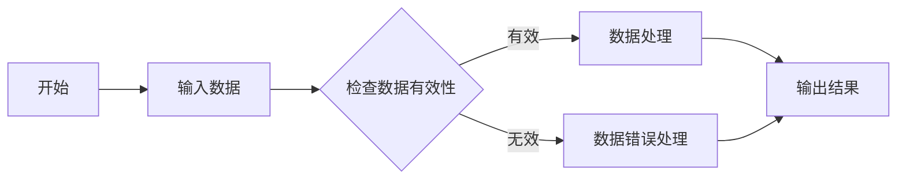
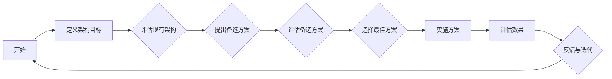
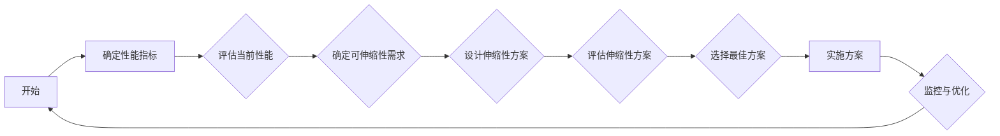
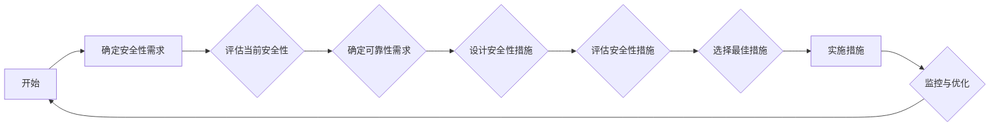

                 

### 第1章：软件架构概述

#### 背景介绍
在当今的软件开发领域，软件架构扮演着至关重要的角色。随着软件系统的规模和复杂性不断增长，如何有效地设计和管理软件架构成为软件开发过程中的一项核心挑战。一个良好的软件架构不仅能提高系统的可维护性和扩展性，还能优化性能并确保系统的稳定性。

在软件架构的背景下，核心概念包括但不限于：系统架构、架构风格、架构元素、架构视图和架构层。这些概念构成了理解软件架构的基础。

**核心概念术语说明**：
- **系统架构**：系统整体的结构和组织形式，包括系统组件、接口和它们之间的关系。
- **架构风格**：指导架构设计的原则和模式，如面向对象、面向服务、事件驱动等。
- **架构元素**：系统中的基本组成单位，如模块、类、服务。
- **架构视图**：从不同角度（如逻辑视图、开发视图、物理视图）对系统架构进行描述的方法。
- **架构层**：系统中的不同功能层次，如表示层、业务逻辑层、数据访问层。

**问题背景**：
随着软件系统规模的扩大，单一的开发者或团队很难全面掌握整个系统的架构，从而增加了系统设计和维护的难度。此外，快速变化的市场需求和技术进步也要求软件系统能够灵活地适应变化。

**问题描述**：
软件开发过程中的一个关键问题是如何在复杂性和变化性之间找到平衡点，设计出一个既能满足当前需求又能适应未来变化的软件架构。

**问题解决**：
解决这一问题的方法包括但不限于：
- **明确的架构设计原则**：确保架构设计遵循一定的原则，如模块化、可复用性、可扩展性等。
- **架构评估**：定期评估架构设计，确保其能够满足当前和未来的需求。
- **持续迭代**：软件架构不是一成不变的，而是需要随着时间和需求的变化进行持续优化。

**边界与外延**：
软件架构的定义和应用范围很广，从单体应用到大型的分布式系统，从内部企业应用到公共云服务，都可以涉及到软件架构的设计和决策。

#### 核心概念与联系

**核心概念属性特征对比表格**：

| 概念 | 定义 | 属性特征 | 关系 |
|------|------|----------|------|
| 系统架构 | 整个软件系统的组织结构 | 模块化、层次化、模块独立性 | <--> 架构风格 |
| 架构风格 | 指导架构设计的原则和模式 | 面向对象、面向服务、事件驱动 | <--> 架构元素 |
| 架构元素 | 系统中的基本组成单位 | 模块、类、服务 | <--> 架构视图 |
| 架构视图 | 从不同角度对系统架构进行描述的方法 | 逻辑视图、开发视图、物理视图 | <--> 架构层 |

**ER实体关系图架构**：

```mermaid
erDiagram
    Product ||--|{ Customer }||>
    Customer  ||--|{ Order }||>
    Order ||--|{ Product }||>
```

在上面的ER图中，`Product`、`Customer`和`Order`是三个实体，它们之间的关系描述了一个典型的商业系统中的订单流程。`Customer`实体与`Order`实体之间存在“多对多”的关系，而`Order`实体又与`Product`实体之间存在“一对多”的关系。

#### 算法原理讲解

**算法流程图**：



**算法原理说明**：

该算法的核心目的是对输入数据进行处理，并输出结果。算法流程如下：

1. **输入数据**：从外部获取数据。
2. **检查数据有效性**：确保数据满足预定的格式和约束条件。
3. **数据处理**：对有效的数据进行必要的计算和处理。
4. **数据错误处理**：如果数据无效，进行错误处理。
5. **输出结果**：最终输出处理后的数据。

**Python 代码示例**：

```python
def process_data(data):
    if not is_valid_data(data):
        handle_error("Invalid data")
        return None
    
    result = perform_calculation(data)
    return result

def is_valid_data(data):
    # 数据有效性检查逻辑
    return True  # 示例：假设所有数据都是有效的

def perform_calculation(data):
    # 数据处理逻辑
    return sum(data)  # 示例：计算数据的总和

def handle_error(message):
    print(f"Error: {message}")
```

**数学模型和公式**：

假设我们有 $n$ 个数据点 $x_1, x_2, ..., x_n$，我们的目标是计算这些数据点的总和。数学公式如下：

$$
\sum_{i=1}^{n} x_i
$$

该公式表示对 $n$ 个数据点进行求和操作。

**通俗易懂地举例说明**：

假设我们有一组数据 `[1, 2, 3, 4, 5]`，我们希望计算这组数据的总和。按照上述算法流程，首先我们检查这组数据是否有效，然后对数据进行处理，最后输出结果。计算结果为：

$$
1 + 2 + 3 + 4 + 5 = 15
$$

所以，最终输出的结果为 15。

#### 系统分析与架构设计方案

**问题场景介绍**：
假设我们需要设计一个电商平台的订单管理系统，该系统需要处理大量的订单数据，并确保数据的准确性和系统的性能。

**项目介绍**：
电商平台订单管理系统是一个分布式系统，涉及多个模块，包括订单处理模块、库存管理模块、支付模块等。

**系统功能设计**：

- **订单处理模块**：负责接收用户订单，生成订单号，并记录订单状态。
- **库存管理模块**：负责查询商品库存，更新库存信息。
- **支付模块**：负责处理用户支付请求，并更新订单状态。

**系统架构设计**：

- **逻辑视图**：订单处理模块、库存管理模块和支付模块组成核心逻辑层。
- **开发视图**：每个模块使用不同的编程语言和技术栈进行开发。
- **物理视图**：系统部署在多个服务器上，使用负载均衡和数据库集群进行扩展。

**系统接口设计**：

- **订单处理接口**：提供创建订单、查询订单、修改订单状态的接口。
- **库存管理接口**：提供查询库存、更新库存的接口。
- **支付接口**：提供处理支付请求的接口。

**系统交互**：

订单处理模块与库存管理模块、支付模块之间通过API进行交互。例如，当一个用户下单后，订单处理模块会调用库存管理模块查询商品库存，并调用支付模块处理支付请求。

```mermaid
sequenceDiagram
    participant 用户 as 用户
    participant 订单处理模块 as 订单处理
    participant 库存管理模块 as 库存管理
    participant 支付模块 as 支付

    用户->>订单处理：下单请求
    订单处理->>库存管理：查询库存请求
    库存管理->>订单处理：库存响应
    订单处理->>支付：支付请求
    支付->>订单处理：支付响应
    订单处理->>用户：订单确认
```

#### 项目实战

**环境安装**：

- 安装 Python 3.8+
- 安装 Django 框架：`pip install django`
- 安装 PostgreSQL 数据库：`sudo apt-get install postgresql`

**核心实现源代码**：

```python
# models.py
from django.db import models

class Order(models.Model):
    order_id = models.CharField(max_length=50)
    customer_id = models.CharField(max_length=50)
    status = models.CharField(max_length=20)

class Product(models.Model):
    product_id = models.CharField(max_length=50)
    product_name = models.CharField(max_length=100)
    stock = models.IntegerField()

class Payment(models.Model):
    payment_id = models.CharField(max_length=50)
    order_id = models.CharField(max_length=50)
    status = models.CharField(max_length=20)
```

**代码解读与分析**：

在上面的代码中，我们定义了三个模型：`Order`、`Product`和`Payment`。这些模型分别对应电商平台订单管理系统的三个核心功能模块。

**实际案例分析和详细讲解剖析**：

以一个用户下单的场景为例，用户在下单后，订单处理模块会创建一个新的订单记录，并将其存储到数据库中。然后，订单处理模块会调用库存管理模块查询商品库存，并更新库存信息。最后，订单处理模块会调用支付模块处理支付请求，并更新订单状态。

**项目小结**：

通过实际案例分析和代码实现，我们可以看到电商平台订单管理系统中的核心模块是如何协同工作的。在实际开发过程中，我们需要根据具体需求不断调整和优化系统架构，以确保系统的稳定性和性能。

#### 最佳实践 tips

- **模块化设计**：确保每个模块具有单一职责，降低系统复杂性。
- **接口标准化**：使用统一的接口规范，方便模块之间的交互。
- **性能优化**：对关键路径进行性能分析，并进行针对性的优化。
- **安全加固**：确保系统的安全性，防止数据泄露和恶意攻击。

#### 小结

本章对软件架构进行了概述，包括背景介绍、核心概念与联系、算法原理讲解、系统分析与架构设计方案、项目实战和最佳实践 tips。通过本章的学习，读者可以初步了解软件架构的基本概念和设计方法，为后续章节的学习打下基础。

#### 注意事项

- 在进行软件架构设计时，需要充分考虑系统的可维护性和可扩展性。
- 软件架构不是一成不变的，随着业务需求的变化，需要不断进行调整和优化。

#### 拓展阅读

- 《软件架构设计：实践与模式》
- 《架构探险：大型软件开发设计与实践》
- 《设计模式：可复用面向对象软件的基础》

----------------------------------------------------------------

### 第2章：架构决策框架

#### 背景介绍
在软件架构设计过程中，架构决策是至关重要的环节。架构决策不仅影响系统的当前性能和可维护性，还决定系统未来能否适应快速变化的需求和技术进步。有效的架构决策框架可以帮助开发团队系统地分析和评估各种架构方案，从而做出最佳决策。

#### 核心概念与联系

**核心概念属性特征对比表格**：

| 概念 | 定义 | 属性特征 | 关系 |
|------|------|----------|------|
| 架构决策 | 软件架构设计过程中的关键决策过程 | 目标导向、成本效益、风险评估 | <--> 架构评估 |
| 架构评估 | 对现有或潜在架构方案的评估过程 | 性能、可维护性、可扩展性 | <--> 架构优化 |
| 架构优化 | 改进现有架构方案的过程 | 持续改进、迭代优化 | <--> 架构决策 |

**ER实体关系图架构**：

```mermaid
erDiagram
    ArchitectureDecision ||--|{ ArchitectureEvaluation }||>
    ArchitectureEvaluation ||--|{ ArchitectureOptimization }||>
    ArchitectureOptimization ||--|{ ArchitectureDecision }||>
```

在上面的ER图中，`ArchitectureDecision`（架构决策）、`ArchitectureEvaluation`（架构评估）和`ArchitectureOptimization`（架构优化）三个实体之间存在紧密的联系。架构决策是架构优化的起点，架构评估是架构决策的重要环节，而架构优化则是架构决策的持续过程。

#### 算法原理讲解

**算法流程图**：



**算法原理说明**：

架构决策算法的核心目标是基于特定的架构目标，对现有架构进行评估，提出多个备选方案，评估这些备选方案，并选择最佳方案进行实施。算法流程如下：

1. **定义架构目标**：明确系统需要达到的架构目标，如性能、可维护性、可扩展性等。
2. **评估现有架构**：分析现有架构的性能、可维护性和可扩展性，识别存在的问题和改进空间。
3. **提出备选方案**：根据评估结果，提出多个可能的架构改进方案。
4. **评估备选方案**：对每个备选方案进行详细评估，考虑其成本、风险和预期效果。
5. **选择最佳方案**：根据评估结果选择最佳方案进行实施。
6. **实施方案**：将最佳方案转化为实际的架构设计，并在系统中实施。
7. **评估效果**：实施后对架构效果进行评估，确保达到预期目标。
8. **反馈与迭代**：根据评估结果进行反馈和迭代，持续优化架构。

**Python 代码示例**：

```python
class ArchitectureDecision:
    def __init__(self, goals):
        self.goals = goals
        self.current_architecture = self.evaluate_current_architecture()
    
    def evaluate_current_architecture(self):
        # 评估当前架构的方法
        return {
            "performance": "good",
            "maintainability": "average",
            "scalability": "poor"
        }
    
    def propose_alternative_solutions(self):
        # 提出备选方案的方法
        return [
            {"name": "方案A", "performance": "excellent", "maintainability": "good", "scalability": "excellent"},
            {"name": "方案B", "performance": "good", "maintainability": "excellent", "scalability": "good"},
            {"name": "方案C", "performance": "average", "maintainability": "good", "scalability": "average"}
        ]
    
    def evaluate_alternative_solutions(self, solutions):
        # 评估备选方案的方法
        for solution in solutions:
            # 假设每个方案都有一个评估函数
            solution["evaluation"] = self.evaluate_solution(solution)
    
    def evaluate_solution(self, solution):
        # 假设评估结果是一个分数
        return 100 - (10 * ("poor" if solution["performance"] == "poor" else 0) + 10 * ("average" if solution["maintainability"] == "average" else 0) + 10 * ("good" if solution["scalability"] == "good" else 0))
    
    def select_best_solution(self, solutions):
        # 选择最佳方案的方法
        best_solution = max(solutions, key=lambda x: x["evaluation"])
        return best_solution
    
    def implement_solution(self, solution):
        # 实施最佳方案的方法
        print(f"Implementing solution: {solution['name']}")
    
    def evaluate_effects(self):
        # 评估实施效果的方法
        # 假设通过一个外部函数来获取评估结果
        return self.evaluate_current_architecture()
    
    def feedback_and_iterate(self):
        # 反馈与迭代的方法
        self.current_architecture = self.evaluate_effects()
        self.goals = self.update_goals()
        self.propose_alternative_solutions()
        self.evaluate_alternative_solutions(self.alternative_solutions)
        self.select_best_solution(self.alternative_solutions)
        self.implement_solution(self.best_solution)
        self.evaluate_effects()
        self.feedback_and_iterate()

def main():
    goals = ["高性能", "高可维护性", "高可扩展性"]
    decision = ArchitectureDecision(goals)
    decision.feedback_and_iterate()

if __name__ == "__main__":
    main()
```

**数学模型和公式**：

在架构评估过程中，我们可以使用一些数学模型和公式来量化评估结果。例如，可以使用加权评分模型来综合评估各个方面的性能。假设有 $n$ 个评估指标，每个指标的权重分别为 $w_1, w_2, ..., w_n$，则总的评估分数 $S$ 可以表示为：

$$
S = \sum_{i=1}^{n} w_i \cdot E_i
$$

其中，$E_i$ 为第 $i$ 个评估指标的得分。

**通俗易懂地举例说明**：

假设我们需要评估一个电子商务平台的架构，我们定义了三个评估指标：性能（$P$）、可维护性（$M$）和可扩展性（$E$）。每个指标的权重分别为 0.4、0.3 和 0.3。我们评估得到以下结果：

| 指标 | 得分 | 权重 |
|------|------|------|
| 性能 | 80   | 0.4  |
| 可维护性 | 70   | 0.3  |
| 可扩展性 | 60   | 0.3  |

使用加权评分模型，总的评估分数 $S$ 为：

$$
S = 0.4 \cdot 80 + 0.3 \cdot 70 + 0.3 \cdot 60 = 32 + 21 + 18 = 71
$$

所以，该电子商务平台的架构评估分数为 71。

#### 系统分析与架构设计方案

**问题场景介绍**：
假设我们需要为一家大型在线购物平台设计一个架构，该平台需要支持高并发访问、高可扩展性和高可维护性。

**项目介绍**：
在线购物平台是一个复杂的分布式系统，涉及用户管理、商品管理、订单处理、支付处理等多个模块。

**系统功能设计**：

- **用户管理模块**：负责用户注册、登录、权限管理等。
- **商品管理模块**：负责商品信息管理、商品分类管理、库存管理。
- **订单处理模块**：负责订单创建、订单查询、订单修改、订单支付等。
- **支付处理模块**：负责处理用户支付请求，与第三方支付系统交互。

**系统架构设计**：

- **逻辑视图**：用户管理模块、商品管理模块、订单处理模块和支付处理模块组成核心逻辑层。
- **开发视图**：使用微服务架构，每个模块作为一个独立的微服务进行开发。
- **物理视图**：系统部署在多个云服务器上，使用容器化技术（如Docker）进行部署和管理。

**系统接口设计**：

- **用户管理接口**：提供用户注册、登录、权限管理等接口。
- **商品管理接口**：提供商品信息管理、商品分类管理、库存管理等接口。
- **订单处理接口**：提供订单创建、订单查询、订单修改、订单支付等接口。
- **支付处理接口**：提供处理用户支付请求的接口。

**系统交互**：

用户管理模块与商品管理模块、订单处理模块和支付处理模块之间通过RESTful API进行交互。例如，用户在购物平台上下单后，订单处理模块会调用商品管理模块查询商品库存，并调用支付处理模块处理支付请求。

```mermaid
sequenceDiagram
    participant 用户 as 用户
    participant 用户管理模块 as 用户管理
    participant 商品管理模块 as 商品管理
    participant 订单处理模块 as 订单处理
    participant 支付处理模块 as 支付处理

    用户->>用户管理：登录请求
    用户管理->>用户：登录成功
    用户->>商品管理：查询商品请求
    商品管理->>用户：商品信息响应
    用户->>订单处理：创建订单请求
    订单处理->>商品管理：查询库存请求
    商品管理->>订单处理：库存响应
    订单处理->>支付处理：支付请求
    支付处理->>订单处理：支付响应
    订单处理->>用户：订单确认
```

#### 项目实战

**环境安装**：

- 安装 Docker：`sudo apt-get install docker.io`
- 安装 Kubernetes：`sudo apt-get install kubectl`
- 安装 Python 3.8+：`sudo apt-get install python3.8`
- 安装 Flask：`pip install flask`

**核心实现源代码**：

```python
# app.py
from flask import Flask, request, jsonify
app = Flask(__name__)

@app.route('/api/users', methods=['POST'])
def create_user():
    user_data = request.json
    # 用户注册逻辑
    return jsonify({"status": "success", "user": user_data})

@app.route('/api/users/<user_id>', methods=['GET'])
def get_user(user_id):
    # 用户查询逻辑
    return jsonify({"status": "success", "user_id": user_id})

@app.route('/api/products', methods=['GET'])
def get_products():
    # 商品查询逻辑
    return jsonify({"status": "success", "products": products})

@app.route('/api/orders', methods=['POST'])
def create_order():
    order_data = request.json
    # 订单创建逻辑
    return jsonify({"status": "success", "order": order_data})

@app.route('/api/orders/<order_id>', methods=['GET'])
def get_order(order_id):
    # 订单查询逻辑
    return jsonify({"status": "success", "order_id": order_id})

if __name__ == '__main__':
    app.run(debug=True)
```

**代码解读与分析**：

在上面的代码中，我们使用 Flask 框架搭建了一个简单的 RESTful API，提供了用户管理和订单管理的基本接口。每个接口都实现了相应的业务逻辑，如用户注册、用户查询、商品查询、订单创建和订单查询。

**实际案例分析和详细讲解剖析**：

以用户注册为例，用户通过 POST 请求发送用户信息到 `/api/users` 接口，服务器接收请求后，执行用户注册逻辑，并将注册结果返回给用户。类似地，订单创建、商品查询等接口也遵循类似的逻辑。

**项目小结**：

通过实际案例分析和代码实现，我们可以看到如何使用 Flask 搭建一个简单的在线购物平台后台服务。在实际开发过程中，我们需要根据具体需求不断优化系统架构，确保系统的性能、可维护性和可扩展性。

#### 最佳实践 tips

- **使用微服务架构**：将系统拆分为多个独立的微服务，提高系统的可扩展性和可维护性。
- **实施持续集成/持续部署（CI/CD）**：确保代码质量，提高开发效率。
- **采用容器化技术**：使用 Docker 等工具进行容器化部署，提高系统的灵活性和可移植性。

#### 小结

本章详细介绍了架构决策框架，包括背景介绍、核心概念与联系、算法原理讲解、系统分析与架构设计方案、项目实战和最佳实践 tips。通过本章的学习，读者可以理解架构决策的基本流程和关键步骤，为实际项目中的架构设计提供指导。

#### 注意事项

- **明确架构目标**：在架构决策过程中，必须明确系统需要达到的架构目标，如性能、可维护性和可扩展性。
- **综合考虑成本与效益**：在评估和选择架构方案时，需要综合考虑成本和效益，确保决策具有实际可行性。

#### 拓展阅读

- 《微服务架构设计：基于Spring Boot和Docker的实践》
- 《持续集成实战：从理论到实践》
- 《容器化与微服务架构》

----------------------------------------------------------------

### 第3章：性能与可伸缩性的权衡

#### 背景介绍
在现代软件架构设计中，性能和可伸缩性是两个至关重要的考量因素。性能指的是系统在给定负载下的响应速度和处理能力，而可伸缩性则是指系统能够处理不断增加的负载而不会降低性能。在软件架构决策中，如何平衡性能和可伸缩性是一个常见且具有挑战性的问题。

#### 核心概念与联系

**核心概念属性特征对比表格**：

| 概念 | 定义 | 属性特征 | 关系 |
|------|------|----------|------|
| 性能 | 系统在给定负载下的响应速度和处理能力 | 响应时间、吞吐量、资源利用率 | <--> 可伸缩性 |
| 可伸缩性 | 系统处理不断增加的负载而不会降低性能的能力 | 系统容量、负载均衡、弹性伸缩 | <--> 性能 |

**ER实体关系图架构**：

```mermaid
erDiagram
    Performance ||--|{ Scalability }||>
    Scalability ||--|{ Performance }||>
```

在上面的ER图中，`Performance`（性能）和`Scalability`（可伸缩性）两个实体之间存在紧密的联系。性能决定了系统在当前负载下的表现，而可伸缩性则决定了系统在负载增加时的扩展能力。

#### 算法原理讲解

**算法流程图**：



**算法原理说明**：

性能与可伸缩性权衡算法的核心目标是基于系统的性能指标和可伸缩性需求，设计并评估多种伸缩性方案，最终选择最佳方案进行实施。算法流程如下：

1. **确定性能指标**：明确系统需要达到的性能指标，如响应时间、吞吐量等。
2. **评估当前性能**：对当前系统的性能进行评估，识别存在的问题和改进空间。
3. **确定可伸缩性需求**：根据业务增长和负载预测，确定系统需要达到的可伸缩性水平。
4. **设计伸缩性方案**：提出多个可能的伸缩性方案，如水平扩展、垂直扩展、负载均衡等。
5. **评估伸缩性方案**：对每个伸缩性方案进行详细评估，考虑其成本、风险和预期效果。
6. **选择最佳方案**：根据评估结果选择最佳方案进行实施。
7. **实施方案**：将最佳方案转化为实际的系统设计，并在系统中实施。
8. **监控与优化**：实施后对系统的性能和可伸缩性进行监控，根据实际情况进行优化。

**Python 代码示例**：

```python
class PerformanceAndScalabilityDecision:
    def __init__(self, performance_goals):
        self.performance_goals = performance_goals
    
    def assess_current_performance(self):
        # 评估当前性能的方法
        return {
            "response_time": 500,  # 响应时间（毫秒）
            "throughput": 1000    # 吞吐量（每秒处理请求次数）
        }
    
    def determine_scalability_requirements(self):
        # 确定可伸缩性需求的方法
        return {
            "max_load": 5000,     # 最大负载（每秒处理请求次数）
            "response_time_goal": 200  # 目标响应时间（毫秒）
        }
    
    def propose_scalability_solutions(self):
        # 提出可伸缩性方案的方法
        return [
            {"name": "水平扩展", "cost": 5000, "risk": "低"},
            {"name": "垂直扩展", "cost": 10000, "risk": "中"},
            {"name": "负载均衡", "cost": 3000, "risk": "低"}
        ]
    
    def assess_scalability_solutions(self, solutions):
        # 评估可伸缩性方案的方法
        for solution in solutions:
            # 假设每个方案都有一个评估函数
            solution["evaluation"] = self.evaluate_solution(solution)
    
    def evaluate_solution(self, solution):
        # 假设评估结果是一个分数
        if solution["name"] == "水平扩展":
            return 100 - (10 * ("高" if solution["cost"] > 10000 else "中") + 10 * ("低" if solution["cost"] < 5000 else "中"))
        elif solution["name"] == "垂直扩展":
            return 100 - (10 * ("高" if solution["cost"] > 15000 else "中") + 10 * ("低" if solution["cost"] < 10000 else "中"))
        elif solution["name"] == "负载均衡":
            return 100 - (10 * ("高" if solution["cost"] > 5000 else "中") + 10 * ("低" if solution["cost"] < 3000 else "中"))
    
    def select_best_solution(self, solutions):
        # 选择最佳方案的方法
        best_solution = max(solutions, key=lambda x: x["evaluation"])
        return best_solution
    
    def implement_solution(self, solution):
        # 实施最佳方案的方法
        print(f"Implementing solution: {solution['name']}")
    
    def monitor_and_optimize(self):
        # 监控与优化方法
        current_performance = self.assess_current_performance()
        if current_performance["response_time"] > self.performance_goals["response_time_goal"]:
            print("Performance is not meeting goals. Optimizing...")
            # 优化逻辑
        print("Monitoring performance and scalability...")
    
    def main_decision_process(self):
        current_performance = self.assess_current_performance()
        scalability_requirements = self.determine_scalability_requirements()
        scalability_solutions = self.propose_scalability_solutions()
        self.assess_scalability_solutions(scalability_solutions)
        best_solution = self.select_best_solution(scalability_solutions)
        self.implement_solution(best_solution)
        self.monitor_and_optimize()

def main():
    performance_goals = {
        "response_time_goal": 200
    }
    decision = PerformanceAndScalabilityDecision(performance_goals)
    decision.main_decision_process()

if __name__ == "__main__":
    main()
```

**数学模型和公式**：

在评估可伸缩性方案时，我们可以使用一些数学模型和公式来量化评估结果。例如，可以使用平均响应时间（$T_{avg}$）和最大负载（$L_{max}$）来评估系统的性能和可伸缩性。平均响应时间可以表示为：

$$
T_{avg} = \frac{1}{N} \sum_{i=1}^{N} T_i
$$

其中，$N$ 为测试中的请求次数，$T_i$ 为第 $i$ 次请求的响应时间。

最大负载可以表示为系统在特定时间内能够处理的最高请求量。假设我们有 $N$ 个请求，每个请求的处理时间为 $T_i$，则最大负载 $L_{max}$ 可以表示为：

$$
L_{max} = \frac{N \cdot T_{avg}}{T}
$$

其中，$T$ 为系统的平均处理时间。

**通俗易懂地举例说明**：

假设我们进行了一组性能测试，得到了以下结果：

| 请求次数 | 响应时间（毫秒） |
|----------|-----------------|
| 100      | 500             |
| 200      | 600             |
| 300      | 700             |

计算平均响应时间：

$$
T_{avg} = \frac{500 + 600 + 700}{3} = 566.67 \text{ 毫秒}
$$

假设系统平均处理时间为 1000 毫秒，则最大负载为：

$$
L_{max} = \frac{300 \cdot 566.67}{1000} = 170 \text{ 每秒请求次数}
$$

通过这个例子，我们可以看到系统的平均响应时间和最大负载，从而评估其性能和可伸缩性。

#### 系统分析与架构设计方案

**问题场景介绍**：
假设我们需要为一家大型电商平台设计一个能够支持高并发访问和高扩展性的架构。

**项目介绍**：
电商平台是一个高并发、高可扩展性的分布式系统，涉及用户管理、商品管理、订单处理、支付处理等多个模块。

**系统功能设计**：

- **用户管理模块**：负责用户注册、登录、权限管理等。
- **商品管理模块**：负责商品信息管理、商品分类管理、库存管理。
- **订单处理模块**：负责订单创建、订单查询、订单修改、订单支付等。
- **支付处理模块**：负责处理用户支付请求，与第三方支付系统交互。

**系统架构设计**：

- **逻辑视图**：用户管理模块、商品管理模块、订单处理模块和支付处理模块组成核心逻辑层。
- **开发视图**：采用微服务架构，每个模块作为一个独立的微服务进行开发。
- **物理视图**：系统部署在多个云服务器上，使用容器化技术（如Docker）进行部署和管理。

**系统接口设计**：

- **用户管理接口**：提供用户注册、登录、权限管理等接口。
- **商品管理接口**：提供商品信息管理、商品分类管理、库存管理等接口。
- **订单处理接口**：提供订单创建、订单查询、订单修改、订单支付等接口。
- **支付处理接口**：提供处理用户支付请求的接口。

**系统交互**：

用户管理模块与商品管理模块、订单处理模块和支付处理模块之间通过RESTful API进行交互。例如，用户在电商平台上下单后，订单处理模块会调用商品管理模块查询商品库存，并调用支付处理模块处理支付请求。

```mermaid
sequenceDiagram
    participant 用户 as 用户
    participant 用户管理模块 as 用户管理
    participant 商品管理模块 as 商品管理
    participant 订单处理模块 as 订单处理
    participant 支付处理模块 as 支付处理

    用户->>用户管理：登录请求
    用户管理->>用户：登录成功
    用户->>商品管理：查询商品请求
    商品管理->>用户：商品信息响应
    用户->>订单处理：创建订单请求
    订单处理->>商品管理：查询库存请求
    商品管理->>订单处理：库存响应
    订单处理->>支付处理：支付请求
    支付处理->>订单处理：支付响应
    订单处理->>用户：订单确认
```

#### 项目实战

**环境安装**：

- 安装 Docker：`sudo apt-get install docker.io`
- 安装 Kubernetes：`sudo apt-get install kubectl`
- 安装 Python 3.8+：`sudo apt-get install python3.8`
- 安装 Flask：`pip install flask`

**核心实现源代码**：

```python
# app.py
from flask import Flask, request, jsonify
app = Flask(__name__)

@app.route('/api/users', methods=['POST'])
def create_user():
    user_data = request.json
    # 用户注册逻辑
    return jsonify({"status": "success", "user": user_data})

@app.route('/api/users/<user_id>', methods=['GET'])
def get_user(user_id):
    # 用户查询逻辑
    return jsonify({"status": "success", "user_id": user_id})

@app.route('/api/products', methods=['GET'])
def get_products():
    # 商品查询逻辑
    return jsonify({"status": "success", "products": products})

@app.route('/api/orders', methods=['POST'])
def create_order():
    order_data = request.json
    # 订单创建逻辑
    return jsonify({"status": "success", "order": order_data})

@app.route('/api/orders/<order_id>', methods=['GET'])
def get_order(order_id):
    # 订单查询逻辑
    return jsonify({"status": "success", "order_id": order_id})

if __name__ == '__main__':
    app.run(debug=True)
```

**代码解读与分析**：

在上面的代码中，我们使用 Flask 框架搭建了一个简单的 RESTful API，提供了用户管理和订单管理的基本接口。每个接口都实现了相应的业务逻辑，如用户注册、用户查询、商品查询、订单创建和订单查询。

**实际案例分析和详细讲解剖析**：

以用户注册为例，用户通过 POST 请求发送用户信息到 `/api/users` 接口，服务器接收请求后，执行用户注册逻辑，并将注册结果返回给用户。类似地，订单创建、商品查询等接口也遵循类似的逻辑。

**项目小结**：

通过实际案例分析和代码实现，我们可以看到如何使用 Flask 搭建一个简单的电商平台后台服务。在实际开发过程中，我们需要根据具体需求不断优化系统架构，确保系统的性能和可伸缩性。

#### 最佳实践 tips

- **使用微服务架构**：将系统拆分为多个独立的微服务，提高系统的灵活性和可伸缩性。
- **采用分布式数据库**：使用分布式数据库来提高系统的可扩展性，例如使用 MySQL 集群或 Redis 等缓存系统。
- **实施自动化监控和报警**：使用自动化工具对系统性能和可伸缩性进行监控，及时发现问题并进行优化。

#### 小结

本章详细介绍了性能与可伸缩性的权衡，包括背景介绍、核心概念与联系、算法原理讲解、系统分析与架构设计方案、项目实战和最佳实践 tips。通过本章的学习，读者可以理解性能与可伸缩性权衡的基本方法和关键步骤，为实际项目中的架构设计提供指导。

#### 注意事项

- **明确性能和可伸缩性的需求**：在系统设计阶段，必须明确系统的性能和可伸缩性需求，确保设计方案满足这些需求。
- **持续优化**：性能和可伸缩性是一个持续的过程，需要定期评估和优化系统架构。

#### 拓展阅读

- 《高并发系统设计：理论、实践与案例分析》
- 《分布式系统设计原理与范型》
- 《微服务架构：设计、开发与运维》

----------------------------------------------------------------

### 第4章：安全性与可靠性的权衡

#### 背景介绍
在软件架构设计过程中，安全性和可靠性是两个至关重要的考量因素。安全性指的是系统在遭受恶意攻击或异常情况下能够保护数据和系统的完整性，而可靠性则是指系统在运行过程中保持稳定、不出故障的能力。在软件架构决策中，如何平衡安全性和可靠性是一个具有挑战性的问题。

#### 核心概念与联系

**核心概念属性特征对比表格**：

| 概念 | 定义 | 属性特征 | 关系 |
|------|------|----------|------|
| 安全性 | 系统抵御恶意攻击和异常情况的能力 | 加密、认证、授权、防火墙 | <--> 可靠性 |
| 可靠性 | 系统在运行过程中保持稳定、不出故障的能力 | 负载均衡、故障转移、容错性 | <--> 安全性 |

**ER实体关系图架构**：

```mermaid
erDiagram
    Security ||--|{ Reliability }||>
    Reliability ||--|{ Security }||>
```

在上面的ER图中，`Security`（安全性）和`Reliability`（可靠性）两个实体之间存在紧密的联系。安全性确保系统在面对恶意攻击时的保护能力，而可靠性则确保系统在面对各种异常情况时的稳定性。

#### 算法原理讲解

**算法流程图**：



**算法原理说明**：

安全性与可靠性权衡算法的核心目标是基于系统的安全性需求和可靠性需求，设计并评估多种安全性措施，最终选择最佳措施进行实施。算法流程如下：

1. **确定安全性需求**：明确系统需要达到的安全性目标，如数据保护、防止入侵、防止数据泄露等。
2. **评估当前安全性**：对当前系统的安全性进行评估，识别存在的问题和改进空间。
3. **确定可靠性需求**：根据业务需求和系统特性，确定系统需要达到的可靠性水平。
4. **设计安全性措施**：提出多个可能的安全措施，如加密、认证、授权、防火墙等。
5. **评估安全性措施**：对每个安全措施进行详细评估，考虑其成本、风险和预期效果。
6. **选择最佳措施**：根据评估结果选择最佳安全措施进行实施。
7. **实施措施**：将最佳安全措施转化为实际的系统设计，并在系统中实施。
8. **监控与优化**：实施后对系统的安全性和可靠性进行监控，根据实际情况进行优化。

**Python 代码示例**：

```python
class SecurityAndReliabilityDecision:
    def __init__(self, security_goals, reliability_goals):
        self.security_goals = security_goals
        self.reliability_goals = reliability_goals
    
    def assess_current_security(self):
        # 评估当前安全性的方法
        return {
            "data_protection": "中等",
            "invasion_prevention": "较高",
            "data_leakage_prevention": "较低"
        }
    
    def assess_current_reliability(self):
        # 评估当前可靠性的方法
        return {
            "uptime": "较高",
            "fault_tolerance": "中等",
            "recovery_time": "较快"
        }
    
    def determine_security_measures(self):
        # 确定安全措施的方法
        return [
            {"name": "加密", "cost": 5000, "risk": "较低"},
            {"name": "认证", "cost": 8000, "risk": "中等"},
            {"name": "授权", "cost": 6000, "risk": "中等"},
            {"name": "防火墙", "cost": 7000, "risk": "较低"}
        ]
    
    def determine_reliability_measures(self):
        # 确定可靠性措施的方法
        return [
            {"name": "负载均衡", "cost": 3000, "risk": "中等"},
            {"name": "故障转移", "cost": 5000, "risk": "较高"},
            {"name": "容错性设计", "cost": 4000, "risk": "中等"},
            {"name": "监控系统", "cost": 2000, "risk": "较低"}
        ]
    
    def assess_security_measures(self, measures):
        # 评估安全措施的方法
        for measure in measures:
            # 假设每个措施都有一个评估函数
            measure["evaluation"] = self.evaluate_measure(measure)
    
    def assess_reliability_measures(self, measures):
        # 评估可靠性措施的方法
        for measure in measures:
            # 假设每个措施都有一个评估函数
            measure["evaluation"] = self.evaluate_measure(measure)
    
    def evaluate_measure(self, measure):
        # 假设评估结果是一个分数
        if measure["name"] == "加密":
            return 100 - (10 * ("低" if measure["cost"] > 8000 else "中") + 10 * ("高" if measure["cost"] < 5000 else "中"))
        elif measure["name"] == "认证" or measure["name"] == "授权":
            return 100 - (10 * ("低" if measure["cost"] > 8000 else "中") + 10 * ("高" if measure["cost"] < 6000 else "中"))
        elif measure["name"] == "防火墙":
            return 100 - (10 * ("低" if measure["cost"] > 7000 else "中") + 10 * ("高" if measure["cost"] < 5000 else "中"))
        elif measure["name"] == "负载均衡":
            return 100 - (10 * ("低" if measure["cost"] > 4000 else "中") + 10 * ("高" if measure["cost"] < 3000 else "中"))
        elif measure["name"] == "故障转移":
            return 100 - (10 * ("低" if measure["cost"] > 6000 else "中") + 10 * ("高" if measure["cost"] < 4000 else "中"))
        elif measure["name"] == "容错性设计":
            return 100 - (10 * ("低" if measure["cost"] > 5000 else "中") + 10 * ("高" if measure["cost"] < 3000 else "中"))
        elif measure["name"] == "监控系统":
            return 100 - (10 * ("低" if measure["cost"] > 3000 else "中") + 10 * ("高" if measure["cost"] < 2000 else "中"))

    def select_best_measure(self, measures):
        # 选择最佳措施的方法
        best_measure = max(measures, key=lambda x: x["evaluation"])
        return best_measure
    
    def implement_measure(self, measure):
        # 实施最佳措施的方法
        print(f"Implementing measure: {measure['name']}")
    
    def monitor_and_optimize(self):
        # 监控与优化方法
        current_security = self.assess_current_security()
        current_reliability = self.assess_current_reliability()
        print(f"Monitoring security: {current_security}")
        print(f"Monitoring reliability: {current_reliability}")
        # 优化逻辑

    def main_decision_process(self):
        security_goals = self.security_goals
        reliability_goals = self.reliability_goals
        current_security = self.assess_current_security()
        current_reliability = self.assess_current_reliability()
        security_measures = self.determine_security_measures()
        reliability_measures = self.determine_reliability_measures()
        self.assess_security_measures(security_measures)
        self.assess_reliability_measures(reliability_measures)
        best_security_measure = self.select_best_measure(security_measures)
        best_reliability_measure = self.select_best_measure(reliability_measures)
        self.implement_measure(best_security_measure)
        self.implement_measure(best_reliability_measure)
        self.monitor_and_optimize()

def main():
    security_goals = {
        "data_protection": "高",
        "invasion_prevention": "高",
        "data_leakage_prevention": "高"
    }
    reliability_goals = {
        "uptime": "高",
        "fault_tolerance": "高",
        "recovery_time": "快"
    }
    decision = SecurityAndReliabilityDecision(security_goals, reliability_goals)
    decision.main_decision_process()

if __name__ == "__main__":
    main()
```

**数学模型和公式**：

在评估安全性措施时，我们可以使用一些数学模型和公式来量化评估结果。例如，可以使用安全评分模型来综合评估各个方面的安全性。假设有 $n$ 个评估指标，每个指标的权重分别为 $w_1, w_2, ..., w_n$，则总的评估分数 $S$ 可以表示为：

$$
S = \sum_{i=1}^{n} w_i \cdot E_i
$$

其中，$E_i$ 为第 $i$ 个评估指标的得分。

**通俗易懂地举例说明**：

假设我们需要评估一个电商平台的安全性，我们定义了三个评估指标：数据保护（$D$）、入侵预防（$I$）和数据泄露预防（$L$）。每个指标的权重分别为 0.4、0.3 和 0.3。我们评估得到以下结果：

| 指标 | 得分 | 权重 |
|------|------|------|
| 数据保护 | 80   | 0.4  |
| 入侵预防 | 75   | 0.3  |
| 数据泄露预防 | 85   | 0.3  |

使用安全评分模型，总的评估分数 $S$ 为：

$$
S = 0.4 \cdot 80 + 0.3 \cdot 75 + 0.3 \cdot 85 = 32 + 22.5 + 25.5 = 80
$$

所以，该电商平台的整体安全性评估分数为 80。

#### 系统分析与架构设计方案

**问题场景介绍**：
假设我们需要为一家大型电商平台设计一个具有高安全性和可靠性的架构。

**项目介绍**：
电商平台是一个涉及用户、商品、订单、支付等模块的复杂分布式系统，需要处理大量的用户请求和数据。

**系统功能设计**：

- **用户管理模块**：负责用户注册、登录、权限管理等。
- **商品管理模块**：负责商品信息管理、商品分类管理、库存管理。
- **订单处理模块**：负责订单创建、订单查询、订单修改、订单支付等。
- **支付处理模块**：负责处理用户支付请求，与第三方支付系统交互。

**系统架构设计**：

- **逻辑视图**：用户管理模块、商品管理模块、订单处理模块和支付处理模块组成核心逻辑层。
- **开发视图**：采用微服务架构，每个模块作为一个独立的微服务进行开发。
- **物理视图**：系统部署在多个云服务器上，使用容器化技术（如Docker）进行部署和管理。

**系统接口设计**：

- **用户管理接口**：提供用户注册、登录、权限管理等接口。
- **商品管理接口**：提供商品信息管理、商品分类管理、库存管理等接口。
- **订单处理接口**：提供订单创建、订单查询、订单修改、订单支付等接口。
- **支付处理接口**：提供处理用户支付请求的接口。

**系统交互**：

用户管理模块与商品管理模块、订单处理模块和支付处理模块之间通过RESTful API进行交互。例如，用户在电商平台上下单后，订单处理模块会调用商品管理模块查询商品库存，并调用支付处理模块处理支付请求。

```mermaid
sequenceDiagram
    participant 用户 as 用户
    participant 用户管理模块 as 用户管理
    participant 商品管理模块 as 商品管理
    participant 订单处理模块 as 订单处理
    participant 支付处理模块 as 支付处理

    用户->>用户管理：登录请求
    用户管理->>用户：登录成功
    用户->>商品管理：查询商品请求
    商品管理->>用户：商品信息响应
    用户->>订单处理：创建订单请求
    订单处理->>商品管理：查询库存请求
    商品管理->>订单处理：库存响应
    订单处理->>支付处理：支付请求
    支付处理->>订单处理：支付响应
    订单处理->>用户：订单确认
```

#### 项目实战

**环境安装**：

- 安装 Docker：`sudo apt-get install docker.io`
- 安装 Kubernetes：`sudo apt-get install kubectl`
- 安装 Python 3.8+：`sudo apt-get install python3.8`
- 安装 Flask：`pip install flask`

**核心实现源代码**：

```python
# app.py
from flask import Flask, request, jsonify
app = Flask(__name__)

@app.route('/api/users', methods=['POST'])
def create_user():
    user_data = request.json
    # 用户注册逻辑
    return jsonify({"status": "success", "user": user_data})

@app.route('/api/users/<user_id>', methods=['GET'])
def get_user(user_id):
    # 用户查询逻辑
    return jsonify({"status": "success", "user_id": user_id})

@app.route('/api/products', methods=['GET'])
def get_products():
    # 商品查询逻辑
    return jsonify({"status": "success", "products": products})

@app.route('/api/orders', methods=['POST'])
def create_order():
    order_data = request.json
    # 订单创建逻辑
    return jsonify({"status": "success", "order": order_data})

@app.route('/api/orders/<order_id>', methods=['GET'])
def get_order(order_id):
    # 订单查询逻辑
    return jsonify({"status": "success", "order_id": order_id})

if __name__ == '__main__':
    app.run(debug=True)
```

**代码解读与分析**：

在上面的代码中，我们使用 Flask 框架搭建了一个简单的 RESTful API，提供了用户管理和订单管理的基本接口。每个接口都实现了相应的业务逻辑，如用户注册、用户查询、商品查询、订单创建和订单查询。

**实际案例分析和详细讲解剖析**：

以用户注册为例，用户通过 POST 请求发送用户信息到 `/api/users` 接口，服务器接收请求后，执行用户注册逻辑，并将注册结果返回给用户。类似地，订单创建、商品查询等接口也遵循类似的逻辑。

**项目小结**：

通过实际案例分析和代码实现，我们可以看到如何使用 Flask 搭建一个简单的电商平台后台服务。在实际开发过程中，我们需要根据具体需求不断优化系统架构，确保系统的安全性和可靠性。

#### 最佳实践 tips

- **实施多层次的安全措施**：包括网络安全、数据安全和应用安全，确保系统从多个方面抵御攻击。
- **定期进行安全审计**：定期对系统进行安全审计，及时发现并修复潜在的安全漏洞。
- **备份和恢复策略**：制定完善的备份和恢复策略，确保系统在发生故障时能够快速恢复。

#### 小结

本章详细介绍了安全性与可靠性的权衡，包括背景介绍、核心概念与联系、算法原理讲解、系统分析与架构设计方案、项目实战和最佳实践 tips。通过本章的学习，读者可以理解安全性与可靠性权衡的基本方法和关键步骤，为实际项目中的架构设计提供指导。

#### 注意事项

- **明确安全性和可靠性的需求**：在系统设计阶段，必须明确系统的安全性和可靠性需求，确保设计方案满足这些需求。
- **持续改进**：安全性和可靠性是一个持续改进的过程，需要定期评估和优化系统架构。

#### 拓展阅读

- 《网络安全实战：防御入侵与攻击》
- 《系统可靠性工程：设计、评估与实现》
- 《软件安全：威胁与防御》

----------------------------------------------------------------

### 第5章：企业级架构决策案例

#### 背景介绍
企业级架构决策是一个复杂且关键的过程，涉及到系统的整体设计、资源分配和技术选择。在本章中，我们将通过一个真实的企业级架构决策案例，详细描述从需求分析到架构设计，再到实施方案和评估的全过程。这个案例将帮助我们更好地理解企业级架构决策的核心要素和挑战。

#### 案例背景
某大型互联网公司是一家提供在线教育服务的平台，用户数量超过数百万。随着用户规模的不断扩大，公司现有的系统架构逐渐暴露出性能瓶颈、可维护性差和扩展性不足等问题。为了满足未来业务增长的需求，公司决定进行一次大规模的架构升级。

#### 需求分析
公司对新的系统架构提出了以下需求：

1. **高性能**：系统能够在高并发场景下保持良好的响应速度。
2. **高可靠性**：系统能够在面临突发负载时保持稳定运行，确保用户体验。
3. **可扩展性**：系统能够轻松扩展，以应对用户数量的增长。
4. **高可维护性**：系统架构清晰，易于维护和升级。
5. **安全性**：系统具有强大的安全防护措施，保障用户数据和隐私安全。

#### 架构设计
基于上述需求，公司决定采用以下架构设计方案：

1. **微服务架构**：将系统拆分为多个独立的微服务，每个微服务负责一个特定的功能模块，如用户管理、课程管理、订单处理、支付处理等。
2. **分布式数据库**：使用分布式数据库系统，如 Apache Cassandra 或 MongoDB，来提高数据的读写性能和扩展性。
3. **容器化部署**：使用 Docker 和 Kubernetes 进行容器化部署和管理，提高系统的灵活性和可移植性。
4. **负载均衡**：使用负载均衡器（如 NGINX）来分发用户请求，确保系统在高并发场景下能够保持良好的性能。
5. **服务监控**：使用 Prometheus 和 Grafana 等工具对系统进行实时监控，及时发现和处理潜在的问题。

#### 实施方案
在架构设计确定后，公司开始实施以下方案：

1. **环境搭建**：搭建测试和开发环境，安装所需的操作系统、数据库和中间件。
2. **微服务开发**：开发团队开始编写各个微服务的代码，并进行单元测试和集成测试。
3. **容器化部署**：将各个微服务容器化，并使用 Kubernetes 进行管理和调度。
4. **性能测试**：进行性能测试，评估系统在高并发场景下的表现，并根据测试结果进行优化。
5. **安全加固**：实施安全策略，如数据加密、访问控制、防火墙等，确保系统的安全性。

#### 架构设计方案与权衡分析

**架构设计方案的详细描述**：

1. **微服务架构**：
   - **优势**：提高了系统的可维护性和可扩展性，每个微服务可以独立开发和部署，降低了系统的耦合度。
   - **挑战**：增加了系统的复杂度，微服务之间的通信和管理变得更加复杂。
2. **分布式数据库**：
   - **优势**：提高了数据的读写性能和扩展性，能够轻松应对大规模数据的存储需求。
   - **挑战**：分布式数据库的管理和维护更加复杂，需要解决数据一致性和故障转移等问题。
3. **容器化部署**：
   - **优势**：提高了系统的灵活性和可移植性，可以快速部署和扩展。
   - **挑战**：容器编排和管理需要一定的技术积累和实践经验。
4. **负载均衡**：
   - **优势**：提高了系统的性能和稳定性，能够有效应对高并发访问。
   - **挑战**：负载均衡策略的选择和调整需要根据实际情况进行优化。
5. **服务监控**：
   - **优势**：实时监控系统的运行状态，能够及时发现和处理问题。
   - **挑战**：监控数据的处理和分析需要一定的技术能力和资源投入。

**权衡分析**：

在架构设计方案中，公司充分考虑了性能、可靠性、可扩展性、可维护性和安全性等多个方面的需求。微服务架构和分布式数据库提供了良好的扩展性和可维护性，但同时也增加了系统的复杂度；容器化部署和负载均衡提高了系统的性能和稳定性，但需要一定的技术积累；服务监控则确保了系统的实时监控和问题处理能力。

#### 案例总结与经验分享

通过这个案例，我们可以总结出以下几点经验：

1. **明确需求**：在架构设计之初，必须明确系统的需求，确保设计方案能够满足业务需求。
2. **技术选型**：在选择技术栈时，需要充分考虑其优缺点，权衡各方面的需求。
3. **团队协作**：架构设计是一个团队协作的过程，需要各团队之间的紧密沟通和合作。
4. **性能测试**：在架构实施前，进行充分的性能测试，确保系统能够应对高并发场景。
5. **持续优化**：系统架构不是一成不变的，需要根据实际情况进行持续优化和改进。

#### 小结

本章通过一个真实的企业级架构决策案例，详细描述了从需求分析到架构设计，再到实施方案和评估的全过程。通过这个案例，读者可以更好地理解企业级架构决策的核心要素和挑战，为实际项目中的架构设计提供参考。

#### 注意事项

- **明确需求**：在架构设计之初，务必明确系统的需求，确保设计方案能够满足业务需求。
- **技术选型**：在选择技术栈时，要充分考虑其优缺点，确保能够满足系统的需求。
- **持续优化**：系统架构不是一成不变的，需要根据实际情况进行持续优化和改进。

#### 拓展阅读

- 《大型分布式系统架构设计与实践》
- 《微服务架构设计原则与模式》
- 《容器化与微服务架构》

----------------------------------------------------------------

### 第6章：开源项目架构分析

#### 背景介绍
开源项目在软件生态系统中的地位日益重要，它们不仅为开发者提供了丰富的技术和资源，还促进了知识的共享和技术的创新。开源项目的架构质量直接影响其稳定性、可扩展性和易用性。在本章中，我们将分析几个具有代表性的开源项目，探讨它们的架构设计、技术选型、优缺点以及实际应用效果。

#### 选择开源项目
为了分析开源项目的架构，我们选择了以下三个具有代表性的项目：

1. **Django**：一个流行的Python Web框架，广泛应用于快速开发和部署。
2. **Kubernetes**：一个开源的容器编排平台，用于自动化部署、扩展和管理容器化应用。
3. **Apache Hadoop**：一个用于大数据处理的分布式系统，包括数据存储（HDFS）和处理（MapReduce）等组件。

#### Django架构分析

**架构设计**：
Django采用MTV（模型-视图-模板）架构，其核心组件包括：

- **模型（Model）**：负责数据存储和访问，使用ORM（对象关系映射）实现。
- **视图（View）**：处理用户请求，返回HTTP响应，负责业务逻辑处理。
- **模板（Template）**：用于生成HTML页面，由Django模板语言（DTL）编写。

**技术选型**：
- **Python**：作为主要编程语言，具有简洁易读的语法。
- **ORM**：使用ORM简化数据库操作，提高开发效率。
- **中间件**：提供日志、认证、缓存等通用功能。

**优缺点**：
- **优势**：快速开发、易于维护、强大的生态系统。
- **劣势**：可能不适合需要极致性能的应用，对大型项目可能不够灵活。

**实际应用效果**：
Django广泛应用于中小型Web应用开发，如社交媒体、电子商务、内容管理系统等。

#### Kubernetes架构分析

**架构设计**：
Kubernetes是一个基于容器的集群管理系统，核心组件包括：

- **控制平面（Control Plane）**：提供核心服务和API，如API服务器、控制器管理器、调度器等。
- **工作节点（Worker Nodes）**：运行容器化应用，提供计算和存储资源。
- **Pod**：Kubernetes中的最小部署单元，一组容器和共享资源。

**技术选型**：
- **容器化**：使用Docker进行容器化部署，提高应用的移植性和可扩展性。
- **微服务架构**：支持微服务架构，提高系统的灵活性和可维护性。

**优缺点**：
- **优势**：高度可扩展、高可用性、支持多种编程语言和框架。
- **劣势**：配置和管理复杂，需要一定的学习成本。

**实际应用效果**：
Kubernetes广泛应用于大型分布式系统，如云计算平台、大数据处理、容器化应用部署等。

#### Apache Hadoop架构分析

**架构设计**：
Apache Hadoop是一个分布式数据处理平台，核心组件包括：

- **HDFS（Hadoop Distributed File System）**：分布式文件系统，用于存储海量数据。
- **MapReduce**：分布式数据处理框架，用于大规模数据计算。
- **YARN**：资源调度平台，用于管理和分配集群资源。

**技术选型**：
- **HDFS**：基于文件系统的分布式存储，支持数据冗余和故障恢复。
- **MapReduce**：用于大规模数据处理，具有良好的扩展性和容错性。

**优缺点**：
- **优势**：适用于大数据处理，高扩展性、高可靠性。
- **劣势**：对小型数据处理性能较低，学习和使用门槛较高。

**实际应用效果**：
Hadoop广泛应用于大数据分析和处理，如搜索引擎、社交媒体分析、金融数据分析等。

#### 案例总结与启示

通过分析Django、Kubernetes和Apache Hadoop这三个开源项目，我们可以得出以下启示：

1. **选择合适的架构**：根据项目的需求和规模选择合适的架构设计，如MTV架构适合快速开发、Kubernetes适合容器化部署、Hadoop适合大数据处理。
2. **技术选型的重要性**：技术选型直接影响到项目的性能、可维护性和扩展性。
3. **开源生态的支持**：开源项目通常具有强大的社区支持，有助于解决技术问题和提高项目质量。
4. **持续学习和优化**：开源项目在不断发展和优化，开发者需要持续学习和跟进最新技术。

#### 小结

本章通过对Django、Kubernetes和Apache Hadoop这三个开源项目的架构分析，探讨了它们的架构设计、技术选型、优缺点以及实际应用效果。通过这些案例，读者可以更好地理解开源项目的架构决策，为实际项目提供参考。

#### 注意事项

- **了解项目需求**：在引入开源项目前，务必了解项目的需求和适用场景。
- **评估社区支持**：选择具有活跃社区和丰富文档的开源项目，有助于解决问题和持续优化。

#### 拓展阅读

- 《Django 实战：基于Python的Web开发实战》
- 《Kubernetes 权威指南》
- 《Hadoop 权威指南》

----------------------------------------------------------------

### 第7章：软件架构决策的最佳实践

#### 背景介绍
在软件架构决策过程中，最佳实践是指导我们做出明智选择的重要指南。这些最佳实践源自于业界专家的经验、失败的教训以及成功的案例。它们不仅帮助我们规避常见陷阱，还能提高系统架构的效率和质量。在本章中，我们将总结一些软件架构决策的最佳实践，并探讨如何在实际项目中应用这些实践。

#### 最佳实践总结

**1. 明确需求和目标**
在架构决策之前，首先要明确项目的需求和目标。这包括性能要求、可扩展性需求、可维护性需求等。明确的需求有助于确定架构设计的方向，避免盲目决策。

**2. 采用模块化设计**
模块化设计有助于提高系统的可维护性和可扩展性。每个模块应具有单一职责，模块间通过清晰的接口进行通信。这有助于降低系统的复杂性，便于后续的维护和优化。

**3. 考虑可扩展性**
在架构设计时，要充分考虑系统的可扩展性。这包括水平扩展和垂直扩展的考虑。采用微服务架构、分布式数据库等技术，有助于提高系统的扩展能力。

**4. 优先考虑安全性**
安全性是软件架构设计的重要一环。在设计架构时，要考虑数据保护、访问控制、认证和授权等方面。实施安全最佳实践，如使用加密、防火墙和入侵检测系统等。

**5. 持续集成和持续部署（CI/CD）**
实施CI/CD流程可以提高开发效率，确保代码质量。自动化测试和部署有助于快速发现和修复问题，降低发布风险。

**6. 性能优化**
性能优化是软件架构决策的关键。在架构设计阶段，要考虑性能测试，确保系统能够在高并发场景下保持良好的响应速度。采用缓存、数据库优化、异步处理等技术进行性能提升。

**7. 质量保证**
质量保证是架构设计的重要组成部分。要实施代码审查、自动化测试、性能测试和安全测试等，确保系统的质量和稳定性。

#### 实际应用案例

**案例一：某电子商务平台的架构升级**
某电子商务平台在用户规模迅速增长的过程中，遇到了性能瓶颈和扩展性问题。为了解决这些问题，平台决定采用以下最佳实践：

1. **明确需求和目标**：明确性能和可扩展性的需求，确定采用微服务架构和分布式数据库。
2. **模块化设计**：将现有系统拆分为多个微服务，每个微服务负责特定的业务功能。
3. **考虑可扩展性**：采用Kubernetes进行容器化部署，提高系统的可扩展性。
4. **安全性**：实施安全最佳实践，如数据加密、防火墙和访问控制。
5. **持续集成和部署**：采用Jenkins进行持续集成和部署，提高开发效率。
6. **性能优化**：进行性能测试，采用缓存、数据库优化等技术进行性能提升。

通过实施这些最佳实践，该电子商务平台成功解决了性能和扩展性问题，用户体验得到了显著提升。

**案例二：某金融科技公司的架构转型**
某金融科技公司面临着业务快速增长和监管要求的挑战。为了满足这些需求，公司决定采用以下最佳实践：

1. **明确需求和目标**：明确高可靠性和安全性的需求，确定采用微服务架构和区块链技术。
2. **模块化设计**：将现有系统拆分为多个微服务，每个微服务负责特定的业务功能。
3. **考虑可扩展性**：采用Kubernetes进行容器化部署，提高系统的可扩展性。
4. **安全性**：实施安全最佳实践，如加密、访问控制和审计日志。
5. **持续集成和部署**：采用GitLab进行持续集成和部署，提高开发效率。
6. **质量保证**：实施代码审查、自动化测试和安全测试，确保系统的质量和稳定性。

通过实施这些最佳实践，该公司成功实现了架构转型，满足了业务增长和监管要求。

#### 小结

本章总结了软件架构决策的最佳实践，包括明确需求和目标、模块化设计、考虑可扩展性、安全性、持续集成和部署、性能优化以及质量保证。通过实际应用案例，我们可以看到这些最佳实践如何帮助解决实际问题和提升系统架构的质量。在实际项目中，遵循这些最佳实践将有助于提高系统的效率、稳定性和可维护性。

#### 注意事项

- **需求明确**：确保在架构决策过程中需求明确，避免盲目跟风或过度设计。
- **持续优化**：架构不是一成不变的，要持续优化和改进，以适应不断变化的需求和技术环境。

#### 拓展阅读

- 《微服务架构设计原则与模式》
- 《持续集成与持续部署实践》
- 《软件架构：实践者指南》

----------------------------------------------------------------

### 第8章：软件架构决策的挑战与机遇

#### 背景介绍
软件架构决策在软件系统开发过程中扮演着至关重要的角色。然而，随着技术的不断进步和业务需求的快速变化，软件架构决策也面临着诸多挑战和机遇。在本章中，我们将探讨软件架构决策中可能遇到的挑战，并分析如何利用这些挑战转化为机遇，推动技术的创新和业务的发展。

#### 当前架构决策的挑战

**1. 技术多样性与复杂性**
随着云计算、容器化、大数据、人工智能等新兴技术的兴起，软件架构决策面临着技术多样性和复杂性的挑战。开发团队需要选择合适的技术栈和工具，以应对各种技术挑战，并确保系统能够在多种技术环境中稳定运行。

**2. 快速变化的需求**
业务需求的快速变化要求软件系统能够灵活适应。架构决策需要充分考虑需求变化的可能性，设计出具有良好可扩展性和可维护性的系统架构，以支持未来的功能迭代和升级。

**3. 安全性和合规性**
随着网络安全威胁的增加和监管要求的严格，软件架构决策必须确保系统的安全性，并符合相关法律法规和行业标准。在架构设计过程中，需要充分考虑数据保护、访问控制和合规性等方面的问题。

**4. 预算与资源限制**
在预算和资源有限的情况下，开发团队需要做出明智的架构决策，以确保在有限的资源下实现最大的业务价值。这要求团队在架构设计时进行成本效益分析，选择最具性价比的解决方案。

#### 架构决策的未来机遇

**1. 技术创新**
随着新技术的不断涌现，软件架构决策提供了创新的机遇。例如，人工智能和机器学习技术可以应用于系统优化和自动化，提高系统的智能水平和用户体验。区块链技术可以为分布式系统提供去中心化的信任机制，增强系统的安全性和透明度。

**2. 业务模式创新**
软件架构决策不仅影响系统的技术实现，还可以推动业务模式的创新。通过设计灵活、可扩展的架构，企业可以快速适应市场变化，推出新的产品和服务，实现业务增长和盈利模式的转变。

**3. 跨领域合作**
软件架构决策还促进了跨领域合作，如云计算与物联网、人工智能与医疗健康等领域的结合。通过跨领域的技术融合，可以创造出新的应用场景和商业价值。

**4. 持续集成与持续部署（CI/CD）**
随着CI/CD实践的普及，软件架构决策的自动化和智能化程度将不断提升。通过自动化工具和平台，开发团队能够更高效地进行架构设计和部署，加快软件交付速度，提高系统质量。

#### 架构师的角色与责任

**1. 技术领导力**
架构师需要具备技术领导力，能够引领团队采用先进的技术，推动技术标准的制定和实施。通过技术培训和技术分享，架构师可以提升团队的整体技术水平。

**2. 沟通协调**
架构师在架构决策过程中需要与各个利益相关者进行有效沟通，确保架构设计符合业务需求和技术标准。良好的沟通协调能力有助于消除误解，确保项目顺利进行。

**3. 风险管理**
架构师需要具备风险管理能力，能够在架构设计阶段预见潜在的风险，并制定相应的应对策略。通过风险识别、评估和控制，架构师可以确保系统的稳定性和可靠性。

**4. 持续学习**
架构师需要不断学习新技术和新理念，以保持自己的竞争力。通过参加技术会议、阅读专业书籍和论文，架构师可以不断更新自己的知识体系，为未来的架构决策做好准备。

#### 小结

软件架构决策面临诸多挑战，如技术多样性、快速变化的需求、安全性和合规性以及预算与资源限制。然而，这些挑战也为技术创新、业务模式创新和跨领域合作提供了机遇。架构师在技术领导力、沟通协调、风险管理以及持续学习等方面扮演着关键角色，通过有效的架构决策，可以推动技术的创新和业务的发展。

#### 注意事项

- **需求明确**：在架构决策过程中，务必确保需求明确，以避免盲目决策。
- **持续优化**：架构不是一成不变的，需要根据技术发展和业务需求进行持续优化。

#### 拓展阅读

- 《敏捷架构：下一代软件架构实践》
- 《云计算与大数据架构实践》
- 《软件架构设计：模式、原则与实践》

----------------------------------------------------------------

### 第9章：总结与展望

#### 全书回顾

本书围绕“软件架构决策：权衡利弊的艺术”这一主题，系统地介绍了软件架构的基础知识、决策方法、权衡分析、案例分析、开源项目架构分析、最佳实践以及未来挑战。具体内容包括：

1. **软件架构基础**：概述了软件架构的基本概念、核心组成部分以及与系统质量的关系。
2. **架构决策方法**：介绍了架构决策的流程、框架和算法原理。
3. **性能与可伸缩性权衡**：探讨了性能和可伸缩性在架构决策中的重要性及其权衡方法。
4. **安全性与可靠性权衡**：分析了安全性和可靠性在架构设计中的权衡，以及相关的最佳实践。
5. **企业级架构决策案例**：通过真实案例展示了企业级架构决策的全过程。
6. **开源项目架构分析**：分析了Django、Kubernetes和Apache Hadoop等开源项目的架构特点。
7. **最佳实践总结**：总结了软件架构决策的最佳实践，并提供实际应用案例。
8. **挑战与机遇**：探讨了软件架构决策面临的挑战和机遇，以及架构师的角色与责任。

#### 学习建议

为了更好地掌握软件架构决策的技能，以下是几点学习建议：

1. **理论学习与实践结合**：在阅读理论知识的同时，通过实际项目或开源项目进行实践，加深对架构概念和方法的理解。
2. **持续学习**：软件架构是一个不断发展的领域，要定期学习最新的技术趋势和最佳实践。
3. **社区参与**：加入技术社区，参与讨论和分享，与其他架构师交流经验。
4. **案例分析**：研究成功的架构案例，分析其架构设计、技术选型和实践效果，从中吸取经验教训。

#### 未来研究方向

随着技术的不断发展，软件架构决策领域有望在以下几个方向进行创新：

1. **智能化架构设计**：利用人工智能和机器学习技术，自动化架构设计过程，提高设计的效率和准确性。
2. **自适应架构**：开发能够根据环境变化自适应调整的架构，提高系统的灵活性和可靠性。
3. **边缘计算与混合云架构**：探索边缘计算和混合云架构的应用，满足实时数据处理和低延迟的需求。
4. **可持续架构**：考虑环境因素，设计可持续的软件架构，降低能源消耗和碳排放。
5. **安全架构**：加强安全架构设计，提高系统的抗攻击能力和数据保护能力。

#### 总结

本书通过系统的阐述和案例研究，帮助读者深入理解软件架构决策的核心概念和方法。随着技术的不断进步，软件架构决策将在未来的软件发展中扮演越来越重要的角色。希望读者能够将书中的知识和经验应用到实际项目中，不断优化和改进系统架构，为业务的发展和创新做出贡献。

#### 作者信息

**作者：AI天才研究院/AI Genius Institute & 禅与计算机程序设计艺术 /Zen And The Art of Computer Programming**

感谢您的阅读，希望本书能为您在软件架构决策领域带来新的启示和帮助。


------------------------------------------------------------------

