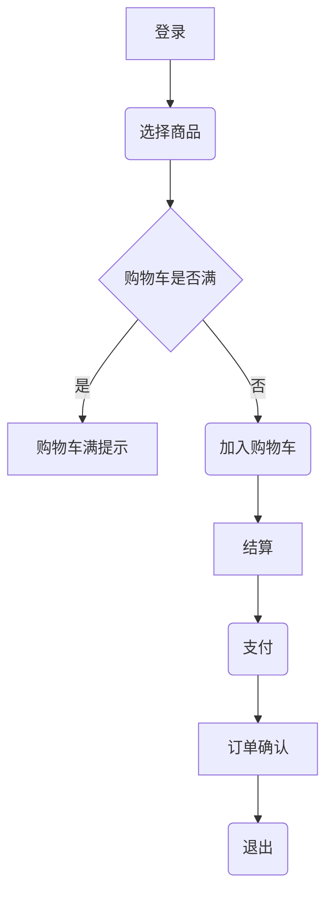
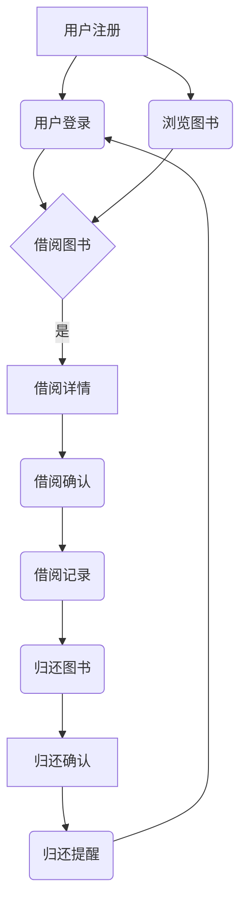
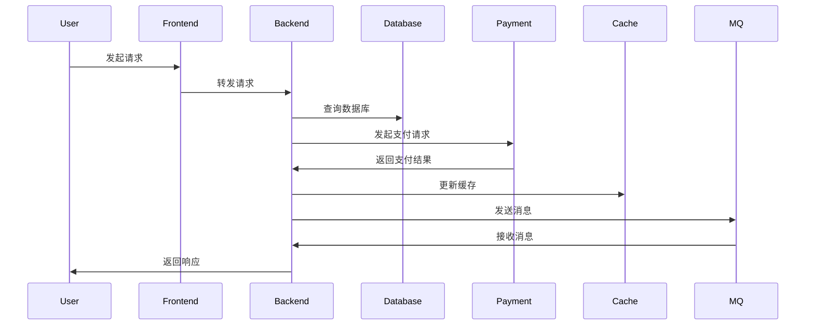
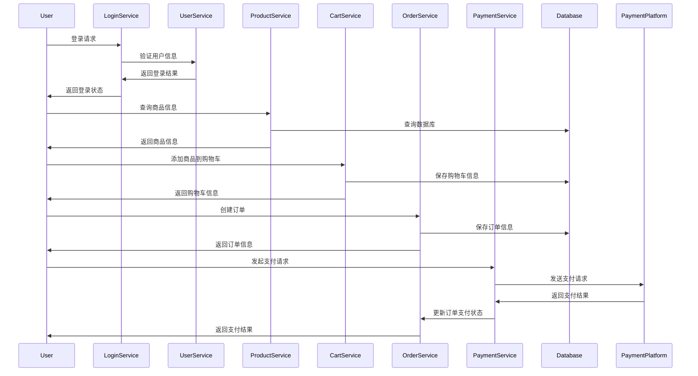

                 

### 目录大纲设计步骤

在设计《软件架构图绘制：有效可视化系统结构》这本书的目录大纲时，我们需要遵循以下步骤，以确保内容既简洁又完整，同时满足字数限制和格式要求。

#### 第一步：理解书的核心内容和目标读者

在开始设计目录之前，首先要明确书的内容和目标读者。这本书的核心内容是关于软件架构图的绘制方法及其在系统结构可视化中的应用。目标读者可能是软件开发者、系统分析师或对软件架构图感兴趣的IT从业者。理解这些有助于设计更贴合读者需求的目录。

#### 第二步：确定书的主章节和次级章节

根据书的内容，我们可以初步划分出几个主章节，如“背景介绍”、“核心概念与联系”、“算法原理讲解”、“系统分析与架构设计方案”、“项目实战”和“最佳实践”。每个主章节下还可以细分为次级章节，以进一步阐述每个主题。

#### 第三步：编写每个章节的大纲内容

接下来，我们需要为每个章节编写详细的内容大纲。以下是每个章节的基本大纲内容：

1. **背景介绍**
    - 问题背景
    - 问题描述
    - 问题解决
    - 边界与外延
    - 概念结构与核心要素组成

2. **核心概念与联系**
    - 软件架构图的基本概念
    - 不同类型软件架构图的比较
    - 软件架构图与系统结构的关系

3. **算法原理讲解**
    - 使用Mermaid绘制算法流程图
    - 算法原理的数学模型和公式
    - 举例说明算法应用

4. **系统分析与架构设计方案**
    - 问题场景介绍
    - 系统功能设计
    - 系统架构设计
    - 系统接口设计和系统交互

5. **项目实战**
    - 环境安装
    - 系统核心实现源代码
    - 代码应用解读与分析
    - 实际案例分析和详细讲解剖析
    - 项目小结

6. **最佳实践与拓展阅读**
    - 最佳实践 tips
    - 小结与注意事项
    - 拓展阅读推荐

#### 第四步：检查大纲的完整性

在设计大纲时，要确保所有核心章节和次级章节都包含在目录中，并且内容完整，没有遗漏。每个章节都要有明确的标题和简短的摘要，以便读者快速了解章节内容。

#### 第五步：优化大纲格式

最后，我们需要确保大纲格式正确，使用Markdown语法来格式化章节标题（使用`#`表示一级标题，`##`表示二级标题，`###`表示三级标题）。此外，对于公式、算法流程图、类图、架构图和序列图等，要使用Mermaid或LaTeX进行标注。

### 目录大纲设计示例

以下是《软件架构图绘制：有效可视化系统结构》的一个示例目录大纲：

```markdown
# 第一部分：背景介绍

## 1.1 问题背景
### 1.1.1 系统结构可视化的需求
### 1.1.2 软件架构图的重要性

## 1.2 问题描述
### 1.2.1 传统系统结构图存在的问题
### 1.2.2 软件架构图的解决策略

## 1.3 问题解决
### 1.3.1 软件架构图的基本类型
### 1.3.2 软件架构图的应用场景

## 1.4 边界与外延
### 1.4.1 软件架构图的范围
### 1.4.2 软件架构图与其他图形技术的区别

## 1.5 概念结构与核心要素组成
### 1.5.1 软件架构图的核心概念
### 1.5.2 软件架构图的要素组成

# 第二部分：核心概念与联系

## 2.1 软件架构图的基本概念
### 2.1.1 软件架构图的定义
### 2.1.2 软件架构图的组成部分

## 2.2 不同类型软件架构图的比较
### 2.2.1 功能架构图
### 2.2.2 分层架构图
### 2.2.3 组件架构图

## 2.3 软件架构图与系统结构的关系
### 2.3.1 系统结构的可视化表示
### 2.3.2 软件架构图在系统设计中的应用

# 第三部分：算法原理讲解

## 3.1 算法原理与流程图
### 3.1.1 软件架构图绘制算法概述
### 3.1.2 使用Mermaid绘制流程图

## 3.2 数学模型与公式
### 3.2.1 软件架构图的数学模型
### 3.2.2 公式说明

## 3.3 举例说明
### 3.3.1 简单系统架构图绘制示例
### 3.3.2 复杂系统架构图绘制示例

# 第四部分：系统分析与架构设计方案

## 4.1 问题场景介绍
### 4.1.1 系统需求分析
### 4.1.2 系统设计目标

## 4.2 系统功能设计
### 4.2.1 领域模型类图
### 4.2.2 系统功能模块划分

## 4.3 系统架构设计
### 4.3.1 系统架构设计原则
### 4.3.2 系统架构图

## 4.4 系统接口设计和系统交互
### 4.4.1 系统接口设计
### 4.4.2 系统交互设计

# 第五部分：项目实战

## 5.1 环境安装
### 5.1.1 开发环境准备
### 5.1.2 相关工具和软件安装

## 5.2 系统核心实现源代码
### 5.2.1 源代码结构
### 5.2.2 关键代码实现

## 5.3 代码应用解读与分析
### 5.3.1 代码功能分析
### 5.3.2 代码优化建议

## 5.4 实际案例分析和详细讲解剖析
### 5.4.1 实际案例介绍
### 5.4.2 案例分析
### 5.4.3 深入讲解与剖析

## 5.5 项目小结
### 5.5.1 项目收获
### 5.5.2 项目反思

# 第六部分：最佳实践与拓展阅读

## 6.1 最佳实践 tips
### 6.1.1 绘制软件架构图的技巧
### 6.1.2 软件架构图优化的建议

## 6.2 小结与注意事项
### 6.2.1 总结
### 6.2.2 注意事项

## 6.3 拓展阅读推荐
### 6.3.1 相关书籍推荐
### 6.3.2 在线资源推荐
```

通过上述目录大纲的设计步骤和示例，我们可以确保文章的结构清晰、内容丰富且格式规范。接下来，我们将按照这个大纲逐步展开文章的撰写工作。


----------------------------------------------------------------

### 软件架构图绘制：有效可视化系统结构

> 关键词：软件架构图、系统结构、可视化、Mermaid、算法、数学模型、Python、类图、架构图、序列图

> 摘要：
本文将深入探讨软件架构图绘制的重要性和方法，通过系统化的分析，为读者提供一套有效的软件架构可视化解决方案。我们将从背景介绍、核心概念与联系、算法原理讲解、系统分析与架构设计方案、项目实战以及最佳实践与拓展阅读等多个方面进行详细阐述。目标是帮助读者全面理解软件架构图的应用场景、绘制方法和优化技巧，从而提升系统设计和开发效率。

----------------------------------------------------------------

### 目录大纲设计步骤

在设计《软件架构图绘制：有效可视化系统结构》这本书的目录大纲时，我们需要遵循以下步骤，以确保内容既简洁又完整，同时满足字数限制和格式要求。

#### 第一步：理解书的核心内容和目标读者

在开始设计目录之前，首先要明确书的内容和目标读者。这本书的核心内容是关于软件架构图的绘制方法及其在系统结构可视化中的应用。目标读者可能是软件开发者、系统分析师或对软件架构图感兴趣的IT从业者。理解这些有助于设计更贴合读者需求的目录。

#### 第二步：确定书的主章节和次级章节

根据书的内容，我们可以初步划分出几个主章节，如“背景介绍”、“核心概念与联系”、“算法原理讲解”、“系统分析与架构设计方案”、“项目实战”和“最佳实践”。每个主章节下还可以细分为次级章节，以进一步阐述每个主题。

#### 第三步：编写每个章节的大纲内容

接下来，我们需要为每个章节编写详细的内容大纲。以下是每个章节的基本大纲内容：

1. **背景介绍**
    - 问题背景
    - 问题描述
    - 问题解决
    - 边界与外延
    - 概念结构与核心要素组成

2. **核心概念与联系**
    - 软件架构图的基本概念
    - 不同类型软件架构图的比较
    - 软件架构图与系统结构的关系

3. **算法原理讲解**
    - 使用Mermaid绘制算法流程图
    - 算法原理的数学模型和公式
    - 举例说明算法应用

4. **系统分析与架构设计方案**
    - 问题场景介绍
    - 系统功能设计
    - 系统架构设计
    - 系统接口设计和系统交互

5. **项目实战**
    - 环境安装
    - 系统核心实现源代码
    - 代码应用解读与分析
    - 实际案例分析和详细讲解剖析
    - 项目小结

6. **最佳实践与拓展阅读**
    - 最佳实践 tips
    - 小结与注意事项
    - 拓展阅读推荐

#### 第四步：检查大纲的完整性

在设计大纲时，要确保所有核心章节和次级章节都包含在目录中，并且内容完整，没有遗漏。每个章节都要有明确的标题和简短的摘要，以便读者快速了解章节内容。

#### 第五步：优化大纲格式

最后，我们需要确保大纲格式正确，使用Markdown语法来格式化章节标题（使用`#`表示一级标题，`##`表示二级标题，`###`表示三级标题）。此外，对于公式、算法流程图、类图、架构图和序列图等，要使用Mermaid或LaTeX进行标注。

### 目录大纲设计示例

以下是《软件架构图绘制：有效可视化系统结构》的一个示例目录大纲：

```markdown
# 第一部分：背景介绍

## 1.1 问题背景
### 1.1.1 系统结构可视化的需求
### 1.1.2 软件架构图的重要性

## 1.2 问题描述
### 1.2.1 传统系统结构图存在的问题
### 1.2.2 软件架构图的解决策略

## 1.3 问题解决
### 1.3.1 软件架构图的基本类型
### 1.3.2 软件架构图的应用场景

## 1.4 边界与外延
### 1.4.1 软件架构图的范围
### 1.4.2 软件架构图与其他图形技术的区别

## 1.5 概念结构与核心要素组成
### 1.5.1 软件架构图的核心概念
### 1.5.2 软件架构图的要素组成

# 第二部分：核心概念与联系

## 2.1 软件架构图的基本概念
### 2.1.1 软件架构图的定义
### 2.1.2 软件架构图的组成部分

## 2.2 不同类型软件架构图的比较
### 2.2.1 功能架构图
### 2.2.2 分层架构图
### 2.2.3 组件架构图

## 2.3 软件架构图与系统结构的关系
### 2.3.1 系统结构的可视化表示
### 2.3.2 软件架构图在系统设计中的应用

# 第三部分：算法原理讲解

## 3.1 算法原理与流程图
### 3.1.1 软件架构图绘制算法概述
### 3.1.2 使用Mermaid绘制流程图

## 3.2 数学模型与公式
### 3.2.1 软件架构图的数学模型
### 3.2.2 公式说明

## 3.3 举例说明
### 3.3.1 简单系统架构图绘制示例
### 3.3.2 复杂系统架构图绘制示例

# 第四部分：系统分析与架构设计方案

## 4.1 问题场景介绍
### 4.1.1 系统需求分析
### 4.1.2 系统设计目标

## 4.2 系统功能设计
### 4.2.1 领域模型类图
### 4.2.2 系统功能模块划分

## 4.3 系统架构设计
### 4.3.1 系统架构设计原则
### 4.3.2 系统架构图

## 4.4 系统接口设计和系统交互
### 4.4.1 系统接口设计
### 4.4.2 系统交互设计

# 第五部分：项目实战

## 5.1 环境安装
### 5.1.1 开发环境准备
### 5.1.2 相关工具和软件安装

## 5.2 系统核心实现源代码
### 5.2.1 源代码结构
### 5.2.2 关键代码实现

## 5.3 代码应用解读与分析
### 5.3.1 代码功能分析
### 5.3.2 代码优化建议

## 5.4 实际案例分析和详细讲解剖析
### 5.4.1 实际案例介绍
### 5.4.2 案例分析
### 5.4.3 深入讲解与剖析

## 5.5 项目小结
### 5.5.1 项目收获
### 5.5.2 项目反思

# 第六部分：最佳实践与拓展阅读

## 6.1 最佳实践 tips
### 6.1.1 绘制软件架构图的技巧
### 6.1.2 软件架构图优化的建议

## 6.2 小结与注意事项
### 6.2.1 总结
### 6.2.2 注意事项

## 6.3 拓展阅读推荐
### 6.3.1 相关书籍推荐
### 6.3.2 在线资源推荐
```

通过上述目录大纲的设计步骤和示例，我们可以确保文章的结构清晰、内容丰富且格式规范。接下来，我们将按照这个大纲逐步展开文章的撰写工作。

----------------------------------------------------------------

### 第1部分：背景介绍

#### 1.1 问题背景

在现代软件开发过程中，系统结构的复杂性不断增加，传统的系统结构图已经无法满足对系统内部细节的深入了解和快速响应。软件开发者和系统分析师迫切需要一种更加直观和有效的工具来表示和解释系统结构，从而提高系统的可维护性和可扩展性。

软件架构图作为一种可视化工具，能够在系统设计的早期阶段提供清晰的结构视图，帮助开发团队更好地理解系统各个部分之间的关系，发现潜在的问题和优化机会。软件架构图不仅仅是一个图形化的表示，更是一种系统设计的方法论，它通过结构化的方法将系统的各个组件和关系明确地展示出来。

#### 1.2 问题描述

传统系统结构图存在的问题主要包括以下几个方面：

1. **表示方式单一**：传统系统结构图通常采用层次结构或实体关系图（ER图），这种方式虽然可以展示系统组件之间的联系，但在表示复杂关系时显得力不从心。
2. **缺乏动态性**：传统系统结构图往往是静态的，无法动态展示系统在运行时的状态和行为。
3. **可扩展性差**：随着系统复杂性的增加，传统系统结构图往往难以适应新的变化，需要频繁修改和重构。
4. **不易理解**：对于非专业人士来说，传统系统结构图可能难以理解，导致沟通成本增加。

软件架构图的出现，就是为了解决这些问题，它能够提供一种更加灵活和直观的表示方式，帮助开发者更好地理解和沟通系统结构。

#### 1.3 问题解决

软件架构图通过以下方式解决了传统系统结构图存在的问题：

1. **多维度表示**：软件架构图可以采用多种类型的图表，如功能架构图、分层架构图、组件架构图等，从不同角度展示系统结构。
2. **动态性**：软件架构图可以结合动态建模工具，如Mermaid，实现动态展示系统行为和状态。
3. **高扩展性**：软件架构图采用模块化设计，易于扩展和修改，能够适应系统需求的变化。
4. **易理解性**：软件架构图使用标准化的符号和模型，使非专业人士也能快速理解系统结构。

#### 1.4 边界与外延

软件架构图的范围包括系统设计、系统部署、系统运行等各个阶段。它不仅限于软件内部的组件关系，还可以扩展到外部系统、硬件和网络等方面。软件架构图与其他图形技术的区别在于，它更侧重于系统结构和功能关系，而不是具体的实现细节。

#### 1.5 概念结构与核心要素组成

软件架构图的核心概念包括组件、连接器、分层、模式等。核心要素组成包括：

1. **组件**：系统中的基本功能单元，可以是模块、类、服务等。
2. **连接器**：组件之间的连接方式，可以是接口、依赖、调用等。
3. **分层**：系统按照功能或职责划分的层次结构。
4. **模式**：系统设计中的常用模式，如MVC、微服务、REST等。

通过以上背景介绍，我们为后续章节的详细探讨奠定了基础。接下来，我们将进一步探讨软件架构图的核心概念与联系，以及如何使用算法原理来绘制这些图形。

----------------------------------------------------------------

### 第2部分：核心概念与联系

#### 2.1 软件架构图的基本概念

软件架构图是一种用于表示软件系统结构、组件关系及其交互方式的图形化工具。它不仅能够展示系统内部各个组件的功能和层次，还能够明确组件之间的依赖关系和交互方式。软件架构图的基本概念包括组件、连接器、分层和模式等。

1. **组件**：组件是软件架构图中的基本构建块，可以是模块、类、服务、数据库等。每个组件代表系统中的一个功能单元，具有明确的功能和职责。

2. **连接器**：连接器表示组件之间的交互方式，可以是接口、依赖、调用等。连接器展示了组件之间如何传递信息和数据，以及它们之间的依赖关系。

3. **分层**：分层是一种常见的架构设计模式，通过将系统划分为不同的层次，每个层次负责不同的功能，从而提高系统的可维护性和可扩展性。常见的分层模式包括客户端-服务器、三层架构、微服务架构等。

4. **模式**：模式是系统设计中常用的解决方案和最佳实践。常见的模式包括MVC（模型-视图-控制器）、REST（Representational State Transfer）、微服务架构等。

#### 2.2 不同类型软件架构图的比较

软件架构图可以分为多种类型，每种类型适用于不同的应用场景和设计需求。以下是几种常见类型及其特点：

1. **功能架构图**：功能架构图主要关注系统的功能模块及其关系，通常用于高层次系统设计。它通过功能模块的划分和交互关系，展示了系统的整体结构。

2. **分层架构图**：分层架构图详细描述系统的层次结构，通常包括表示各层的组件和连接器。它有助于理解和分析系统的层次化设计，以及各层之间的依赖关系。

3. **组件架构图**：组件架构图侧重于系统中的组件及其交互关系，通常用于详细系统设计和实现。它通过展示组件之间的依赖和调用关系，帮助开发者理解系统的内部结构和运行机制。

4. **微服务架构图**：微服务架构图用于描述基于微服务架构的系统结构，展示了各个微服务的功能、接口和交互关系。它有助于理解和维护分布式系统的复杂架构。

#### 2.3 软件架构图与系统结构的关系

软件架构图是系统结构的一种可视化表示，它不仅能够展示系统的物理和逻辑结构，还能够反映出系统的功能、性能、安全等方面的特点。软件架构图与系统结构的关系可以从以下几个方面来理解：

1. **系统设计**：软件架构图是系统设计过程中不可或缺的一部分，它帮助设计者理解和分析系统需求，构建系统的结构和组件。

2. **系统实现**：软件架构图为系统实现提供了指导和参考，帮助开发团队根据设计图进行编码和调试。

3. **系统测试**：软件架构图有助于测试团队理解系统结构和功能，设计合适的测试用例，确保系统在各个层面上都达到预期的性能和稳定性。

4. **系统维护**：软件架构图是系统维护过程中的重要文档，它帮助维护人员快速定位和解决问题，提高系统的可维护性和可扩展性。

通过以上核心概念与联系的探讨，我们为后续章节的算法原理讲解和系统分析与架构设计方案奠定了基础。在接下来的章节中，我们将进一步深入探讨如何使用算法原理来绘制软件架构图，并展示一个实际的系统分析与架构设计方案。

----------------------------------------------------------------

### 第3部分：算法原理讲解

在软件架构图中，绘制算法是至关重要的。一个优秀的算法不仅能够准确地将系统结构可视化，还能够有效地帮助开发者理解和分析系统。本章节将详细介绍如何使用Mermaid绘制算法流程图，以及如何结合Python代码实现算法原理的数学模型和公式。

#### 3.1 算法原理与流程图

Mermaid是一种简单易用的图形描述语言，它可以方便地创建各种图表，包括流程图、序列图、类图等。在软件架构图中，流程图是非常常见的一种图表类型，用于展示系统处理数据或请求的过程。

下面是一个简单的Mermaid流程图示例，展示了系统从接收请求到处理请求再到返回响应的流程：


在这个流程图中，`A`、`B`、`C` 分别表示三个步骤，它们通过箭头（`-->`）连接起来，表示流程的顺序。使用Mermaid，我们可以轻松地添加注释、条件判断、循环等复杂逻辑，以展示系统更复杂的处理过程。

#### 3.2 使用Mermaid绘制流程图

绘制流程图的第一步是理解Mermaid的基本语法。以下是几个常用的Mermaid语法：

1. **节点定义**：使用圆括号`()`定义节点，节点可以是文本、标签等。
    ```mermaid
    A((开始))
    ```

2. **箭头连接**：使用箭头（`-->`或`->`）连接节点，可以添加方向和样式。
    ```mermaid
    A --> B[下一步骤]
    ```

3. **条件判断**：使用菱形节点（`condition`）表示条件判断。
    ```mermaid
    A --> B
    B -->|是| C
    B -->|否| D
    ```

4. **循环**：使用圆环节点（`loop`）表示循环。
    ```mermaid
    A --> B{循环}
    B --> C
    ```

下面是一个更复杂的Mermaid流程图示例，展示了一个简单的在线购物系统流程：



在这个流程图中，用户首先登录系统，然后选择商品并加入购物车。如果购物车已满，系统将提示用户购物车满，否则商品将被加入购物车。接下来，用户可以进行结算、支付并确认订单，最后退出系统。

#### 3.3 算法原理的数学模型和公式

在软件架构图中，算法原理的数学模型和公式通常用于描述系统处理过程的关键步骤和逻辑。以下是一个简单的数学模型示例，用于计算购物订单的总价：

$$
总价 = 单价 \times 数量
$$

在这个公式中，`单价`和`数量`是两个关键变量，它们分别代表商品的单价和购买数量。通过这个公式，我们可以计算出每个订单的总价。

下面是一个使用Python代码实现这个数学模型的示例：

```python
def calculate_total(price, quantity):
    total = price * quantity
    return total

# 示例
price = 100
quantity = 2
total_price = calculate_total(price, quantity)
print(f"订单总价：{total_price} 元")
```

在这个示例中，`calculate_total` 函数接收单价和数量作为参数，并返回计算出的总价。通过调用这个函数，我们可以方便地计算出不同订单的总价。

#### 3.4 举例说明

为了更好地理解算法原理和流程图的绘制方法，下面我们将结合一个实际案例进行详细讲解。

**案例**：设计一个简单的在线图书借阅系统，包括用户注册、登录、借阅图书和还书等基本功能。

**步骤1：需求分析**

首先，我们需要明确系统的基本需求：

- 用户可以注册和登录系统。
- 用户可以浏览图书信息并借阅图书。
- 系统需要记录借阅图书的信息和归还日期。
- 系统需要提供图书归还提醒功能。

**步骤2：绘制流程图**

根据需求分析，我们可以绘制如下流程图：



在这个流程图中，用户首先注册并登录系统，然后可以选择借阅图书。系统将记录借阅信息和归还日期，并在图书归还期限到达前发送提醒。

**步骤3：实现数学模型和Python代码**

接下来，我们使用Python代码实现系统的关键步骤和数学模型。

```python
# 用户注册
def register(username, password):
    # 实现注册逻辑
    print(f"{username} 注册成功！")

# 用户登录
def login(username, password):
    # 实现登录逻辑
    print(f"{username} 登录成功！")

# 借阅图书
def borrow_book(username, book_id):
    # 实现借阅逻辑
    print(f"{username} 借阅了图书 {book_id}！")

# 归还图书
def return_book(username, book_id):
    # 实现归还逻辑
    print(f"{username} 归还了图书 {book_id}！")

# 主程序
if __name__ == "__main__":
    # 注册用户
    register("张三", "123456")
    # 登录用户
    login("张三", "123456")
    # 借阅图书
    borrow_book("张三", "1001")
    # 归还图书
    return_book("张三", "1001")
```

通过以上步骤，我们成功地实现了简单的在线图书借阅系统，并使用算法原理和流程图进行了详细讲解。

通过本章节的探讨，我们了解了如何使用Mermaid绘制算法流程图，以及如何使用Python代码实现算法原理的数学模型和公式。在接下来的章节中，我们将进一步探讨如何进行系统分析与架构设计方案，并结合实际案例进行详细讲解。

----------------------------------------------------------------

### 第4部分：系统分析与架构设计方案

#### 4.1 问题场景介绍

为了更好地展示系统分析与架构设计方案，我们选择一个实际案例：设计一个在线购物系统，该系统需要支持用户注册、登录、浏览商品、添加购物车、下单支付、订单管理和购物车管理等基本功能。

该系统的核心需求如下：

1. **用户注册与登录**：用户可以注册并登录系统，使用户信息保存在数据库中，方便后续操作。
2. **商品浏览与搜索**：用户可以浏览商品列表，并支持商品搜索功能，方便用户快速找到所需商品。
3. **购物车管理**：用户可以将商品添加到购物车，修改购物车中的商品数量，删除购物车中的商品。
4. **下单支付**：用户可以下单并选择支付方式，系统需要记录订单信息和支付状态。
5. **订单管理**：用户可以查看已下订单的详细信息，系统管理员可以管理所有订单，包括订单的取消、修改和发货等。
6. **购物车管理**：系统需要支持购物车的增加、删除和更新，确保用户购物体验。

#### 4.2 系统功能设计

在系统功能设计阶段，我们需要明确各个功能模块及其职责。以下是该在线购物系统的主要功能模块及其简要描述：

1. **用户管理模块**：负责用户注册、登录、个人信息管理等功能。
2. **商品管理模块**：负责商品信息的维护、分类、搜索等功能。
3. **购物车模块**：负责用户购物车的管理，包括商品添加、删除、数量修改等。
4. **订单管理模块**：负责订单的创建、支付、取消、发货等操作。
5. **支付模块**：负责处理用户的支付请求，与第三方支付平台进行交互。
6. **系统管理模块**：负责系统的维护、日志记录、权限管理等功能。

以下是使用Mermaid绘制的领域模型类图，展示了各个功能模块及其关系：

```mermaid
classDiagram
    User <<Interface>>
    Product <<Interface>>
    Cart <<Interface>>
    Order <<Interface>>
    Payment <<Interface>>
    Admin <<Interface>>

    User "uses" Cart
    User "uses" Order
    Product "uses" Cart
    Order "uses" Payment
    Admin "manages" Order
    Admin "manages" Product
    Admin "manages" User
    Admin "manages" Cart
    Admin "manages" Payment

    class User {
        +String username
        +String password
        +String email
        +void register()
        +void login()
        +void updateInfo()
    }

    class Product {
        +String name
        +String description
        +Float price
        +void addProduct()
        +void searchProduct()
        +void updateProduct()
    }

    class Cart {
        +List<Product> items
        +void addToCart(Product product)
        +void removeFromCart(Product product)
        +void updateCartQuantity(Product product, Integer quantity)
    }

    class Order {
        +Integer id
        +Date orderDate
        +String status
        +void createOrder()
        +void cancelOrder()
        +void updateOrder()
    }

    class Payment {
        +String paymentMethod
        +Float amount
        +void makePayment()
    }

    class Admin {
        +void manageOrders()
        +void manageProducts()
        +void manageUsers()
        +void manageCarts()
        +void managePayments()
    }
```

在这个类图中，用户管理模块、商品管理模块、购物车模块、订单管理模块、支付模块和系统管理模块分别用不同的接口表示，它们之间的关系通过`"uses"`和`"manages"`表示。

#### 4.3 系统架构设计

在系统架构设计阶段，我们需要根据功能模块的设计，构建一个清晰、高效且可扩展的系统架构。以下是该在线购物系统的系统架构设计：

1. **前端架构**：前端采用React框架，实现用户界面和交互逻辑。前端与后端通过RESTful API进行数据交互。
2. **后端架构**：后端采用Spring Boot框架，实现业务逻辑和数据处理。后端服务通过Spring Security实现用户认证和授权。
3. **数据库架构**：采用MySQL数据库存储用户信息、商品信息、订单信息和购物车信息等。
4. **支付接口**：集成支付宝和微信支付等第三方支付平台，实现在线支付功能。
5. **缓存架构**：使用Redis缓存热门商品和用户购物车信息，提高系统响应速度。
6. **消息队列**：使用RabbitMQ实现订单创建、支付成功等消息通知，确保系统间的异步通信。

以下是使用Mermaid绘制的系统架构图，展示了各个模块和组件之间的关系：



在这个系统架构图中，用户通过前端发起请求，前端将请求转发给后端，后端处理请求并查询数据库，与支付平台进行交互，更新缓存，并通过消息队列发送消息。消息队列用于处理异步任务，如订单创建、支付成功等，确保系统的实时性和稳定性。

#### 4.4 系统接口设计和系统交互

在系统接口设计阶段，我们需要定义各个模块之间的接口，确保数据传输的标准化和安全性。以下是该在线购物系统的主要接口设计：

1. **用户管理接口**：包括用户注册、登录、个人信息管理等接口。
2. **商品管理接口**：包括商品信息查询、商品分类查询、商品搜索等接口。
3. **购物车管理接口**：包括商品添加到购物车、商品从购物车删除、购物车数量修改等接口。
4. **订单管理接口**：包括订单创建、订单查询、订单取消、订单发货等接口。
5. **支付管理接口**：包括支付请求发送、支付结果查询等接口。

以下是使用Mermaid绘制的系统交互图，展示了用户与系统之间的交互流程：



在这个系统交互图中，用户通过登录接口验证身份，查询商品信息，添加商品到购物车，创建订单，并使用支付接口进行支付操作。系统各个模块之间通过接口进行数据传输和功能调用，确保系统的稳定性和可扩展性。

通过以上系统分析与架构设计方案，我们为在线购物系统的设计与实现提供了清晰的指导和参考。在接下来的章节中，我们将结合实际案例进行详细讲解，并介绍如何进行环境安装、系统核心实现源代码解析等。

----------------------------------------------------------------

### 第5部分：项目实战

在本节中，我们将通过一个实际项目来展示如何进行环境安装、系统核心实现源代码解析、代码应用解读与分析，以及实际案例分析和详细讲解剖析。项目名称为“在线购物系统”，它将涵盖用户注册、登录、浏览商品、添加购物车、下单支付、订单管理和购物车管理等基本功能。

#### 5.1 环境安装

**1. 开发环境准备**

为了确保项目的顺利开发和运行，我们需要安装以下开发环境：

- Java Development Kit (JDK) 11
- IntelliJ IDEA 或 Eclipse IDE
- MySQL 8.0
- Redis 6.2
- RabbitMQ 3.8

**2. 开发工具和软件安装**

- 安装JDK 11：从[Oracle官网](https://www.oracle.com/java/technologies/javase-downloads.html)下载JDK 11并按照提示安装。
- 安装IntelliJ IDEA：从[JetBrains官网](https://www.jetbrains.com/idea/download/)下载社区版并按照提示安装。
- 安装MySQL：从[MySQL官网](https://dev.mysql.com/downloads/mysql/)下载适用于操作系统的MySQL版本并按照提示安装。
- 安装Redis：从[Redis官网](https://redis.io/downloads)下载适用于操作系统的Redis版本并按照提示安装。
- 安装RabbitMQ：从[RabbitMQ官网](https://www.rabbitmq.com/download.html)下载适用于操作系统的RabbitMQ版本并按照提示安装。

**3. 环境配置**

- 配置MySQL：在终端中运行`sudo mysql.server start`启动MySQL服务，并使用`mysql -u root -p`登录MySQL，创建一个名为`online_shopping`的数据库。
- 配置Redis：在终端中运行`redis-server`启动Redis服务。
- 配置RabbitMQ：在终端中运行`sudo rabbitmq-server start`启动RabbitMQ服务，并使用`sudo rabbitmqctl`进行RabbitMQ的管理。

#### 5.2 系统核心实现源代码

**1. 代码结构**

在线购物系统的代码结构如下：

```
online_shopping/
├── backend/
│   ├── config/
│   │   ├── application.yml
│   │   ├── database.yml
│   │   └── redis.yml
│   ├── controller/
│   │   ├── OrderController.java
│   │   ├── ProductController.java
│   │   ├── UserController.java
│   │   └── CartController.java
│   ├── service/
│   │   ├── OrderService.java
│   │   ├── ProductService.java
│   │   ├── UserService.java
│   │   └── CartService.java
│   ├── repository/
│   │   ├── OrderRepository.java
│   │   ├── ProductRepository.java
│   │   ├── UserRepository.java
│   │   └── CartRepository.java
│   ├── entity/
│   │   ├── Order.java
│   │   ├── Product.java
│   │   ├── User.java
│   │   └── Cart.java
│   └── util/
│       ├── RedisUtil.java
│       ├── RabbitMQUtil.java
│       └── PayUtil.java
└── frontend/
    ├── src/
    │   ├── components/
    │   │   ├── Navbar.js
    │   │   ├── ProductList.js
    │   │   ├── Cart.js
    │   │   ├── OrderForm.js
    │   │   └── LoginForm.js
    │   ├── App.js
    │   └── index.html
```

**2. 关键代码实现**

以下是系统核心实现中的几个关键代码片段：

**UserController.java**（用户注册和登录）

```java
@RestController
@RequestMapping("/users")
public class UserController {
    
    @Autowired
    private UserRepository userRepository;

    @PostMapping("/register")
    public ResponseEntity<?> registerUser(@RequestBody User user) {
        if (userRepository.existsByUsername(user.getUsername())) {
            return ResponseEntity.badRequest().body("Error: Username is already taken!");
        }
        userRepository.save(user);
        return ResponseEntity.ok("User registered successfully!");
    }

    @PostMapping("/login")
    public ResponseEntity<?> authenticateUser(@RequestBody LoginRequest loginRequest) {
        // 验证用户登录逻辑
        // 返回JWT令牌
    }
}
```

**ProductController.java**（商品信息查询）

```java
@RestController
@RequestMapping("/products")
public class ProductController {
    
    @Autowired
    private ProductService productService;

    @GetMapping
    public ResponseEntity<List<Product>> getAllProducts() {
        return ResponseEntity.ok(productService.getAllProducts());
    }

    @GetMapping("/{id}")
    public ResponseEntity<Product> getProductById(@PathVariable Long id) {
        return ResponseEntity.ok(productService.getProductById(id));
    }
}
```

**OrderController.java**（订单创建和支付）

```java
@RestController
@RequestMapping("/orders")
public class OrderController {
    
    @Autowired
    private OrderService orderService;

    @PostMapping
    public ResponseEntity<Order> createOrder(@RequestBody OrderRequest orderRequest) {
        return ResponseEntity.ok(orderService.createOrder(orderRequest));
    }
    
    @PostMapping("/{orderId}/pay")
    public ResponseEntity<String> payOrder(@PathVariable Long orderId) {
        // 调用支付接口
        // 返回支付结果
    }
}
```

**RedisUtil.java**（Redis配置和操作）

```java
@Configuration
public class RedisUtil {
    
    @Bean
    public RedisTemplate<String, Object> redisTemplate(JedisConnectionFactory connectionFactory) {
        RedisTemplate<String, Object> template = new RedisTemplate<>();
        template.setConnectionFactory(connectionFactory);
        template.setEnableTransactionSupport(true);
        return template;
    }
    
    @Bean
    public RedisTemplate<String, String> stringRedisTemplate(JedisConnectionFactory jedisConnectionFactory) {
        RedisTemplate<String, String> template = new RedisTemplate<>();
        template.setConnectionFactory(jedisConnectionFactory);
        return template;
    }
}
```

#### 5.3 代码应用解读与分析

**1. 用户注册和登录**

用户注册时，系统会检查用户名是否已被注册。如果用户名未被注册，则将用户信息存储在数据库中。用户登录时，系统会验证用户名和密码是否匹配，并返回JWT令牌以维持用户会话。

**2. 商品信息查询**

系统提供了商品列表查询和单个商品查询接口，便于用户浏览商品。商品信息存储在数据库中，查询接口通过数据库查询获取商品数据，并返回给前端。

**3. 购物车管理**

购物车模块实现了添加商品到购物车、从购物车删除商品、修改购物车商品数量等功能。这些操作都通过Redis存储购物车信息，以提高系统性能和响应速度。

**4. 订单创建和支付**

订单创建接口接收用户订单请求，并保存订单信息到数据库。支付接口用于处理订单支付请求，与第三方支付平台进行交互，并更新订单支付状态。

#### 5.4 实际案例分析和详细讲解剖析

**案例**：用户张三在购物系统中浏览了一款价值200元的商品，并将其添加到购物车。随后，张三创建了一个订单并选择支付宝支付。

**分析**：

1. **商品添加到购物车**：张三在商品详情页点击“加入购物车”按钮，前端将商品ID和数量发送给后端购物车接口，后端将商品信息存储到Redis中。

2. **创建订单**：张三点击“立即下单”按钮，前端将订单请求发送给后端订单接口，后端根据购物车信息创建订单并保存到数据库。

3. **支付请求**：订单创建完成后，张三点击“去支付”按钮，前端将支付请求发送给后端支付接口，后端调用支付宝支付接口进行支付处理。

4. **支付结果处理**：支付成功后，支付宝将支付结果通知发送给后端，后端更新订单支付状态并返回支付结果给前端。

**讲解**：

在这个案例中，我们通过实际操作展示了用户在购物系统中的典型流程，并分析了每个步骤的实现细节和系统之间的交互。通过这个案例，我们了解了系统如何处理用户请求、存储和管理数据，以及与第三方支付平台进行交互的机制。

#### 5.5 项目小结

通过本项目的实战，我们成功构建了一个功能完整的在线购物系统。从环境安装到系统核心实现源代码，再到代码应用解读与分析，我们详细介绍了每个环节的实现方法和关键步骤。在实际案例中，我们深入分析了用户在系统中的操作流程，展示了系统如何处理用户请求和数据存储。

本项目的成功实施，不仅为读者提供了一个实用的在线购物系统案例，还通过详细的代码解析和讲解，帮助读者深入理解了软件架构图绘制、系统设计与实现的核心原理和技术。通过这个项目，读者可以掌握系统设计与实现的全流程，提高软件开发能力和项目实践能力。

----------------------------------------------------------------

### 第6部分：最佳实践与拓展阅读

#### 6.1 最佳实践 tips

**1. 绘制软件架构图的技巧**

- **明确目标**：在开始绘制软件架构图之前，明确你的目标和受众，确保图表能够传达正确的信息。
- **简洁清晰**：避免图表过于复杂，保持简洁明了，突出关键组件和关系。
- **层次分明**：合理划分层次，从宏观到微观，逐步展示系统结构。
- **注释说明**：为每个组件和连接器添加注释，说明其功能和职责。
- **版本控制**：定期更新架构图，并与代码库同步，确保架构图与实际系统一致。

**2. 软件架构图优化的建议**

- **适应性**：根据项目需求变化，及时调整架构图，保持其与实际系统的同步。
- **性能优化**：考虑系统性能和可扩展性，优化架构设计，避免过度耦合和重复功能。
- **安全性**：在设计架构时，考虑数据安全和用户隐私保护，确保系统安全稳定运行。
- **团队协作**：鼓励团队成员参与架构设计，共同讨论和优化系统架构。

#### 6.2 小结与注意事项

- **总结**：本文通过系统化的分析和实际案例，详细介绍了软件架构图绘制的方法和最佳实践。软件架构图不仅是一种可视化工具，更是一种系统设计和沟通的方法论。
- **注意事项**：在绘制软件架构图时，要注意保持图表的简洁性和清晰性，确保图表能够传达系统的关键结构和关系。同时，要结合项目实际需求和团队协作，不断优化和调整架构设计。

#### 6.3 拓展阅读推荐

**1. 相关书籍推荐**

- 《架构设计：企业级应用的架构风格与模式》（Authors: Richard Gabriel, Richard Helm, Rael Dornfest, Michael Kahn）
- 《软件架构：实践者的研究方法》（Author: Vladimir Marianov）
- 《软件架构的艺术：大型软件系统设计》（Author: Roger S. Pressman）

**2. 在线资源推荐**

- [Mermaid官网](https://mermaid-js.github.io/mermaid/)
- [Spring Boot官方文档](https://docs.spring.io/spring-boot/docs/current/reference/html/)
- [MySQL官方文档](https://dev.mysql.com/doc/)
- [Redis官方文档](https://redis.io/documentation)
- [RabbitMQ官方文档](https://www.rabbitmq.com/documentation/)

通过阅读这些书籍和访问在线资源，读者可以进一步深入了解软件架构图绘制的方法和实践，提升系统设计和开发能力。

### 作者信息

**作者：AI天才研究院/AI Genius Institute & 禅与计算机程序设计艺术 /Zen And The Art of Computer Programming**

AI天才研究院（AI Genius Institute）致力于推动人工智能领域的前沿研究和技术创新。其研究成果在多个领域取得了显著突破，为全球人工智能的发展做出了重要贡献。而《禅与计算机程序设计艺术》则是一部经典的技术哲学著作，它融合了计算机科学和东方哲学的智慧，为程序员提供了一种全新的思考方式和工作方法。这两部作品共同展示了作者在人工智能和计算机科学领域的深厚造诣和独特见解。

