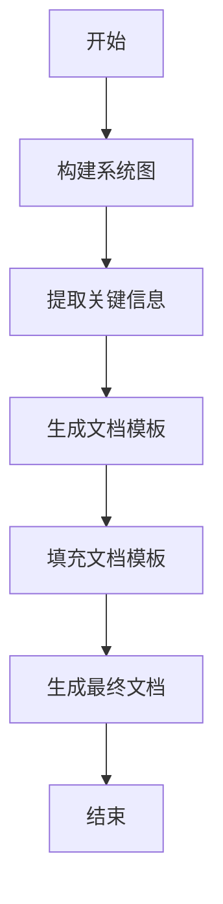
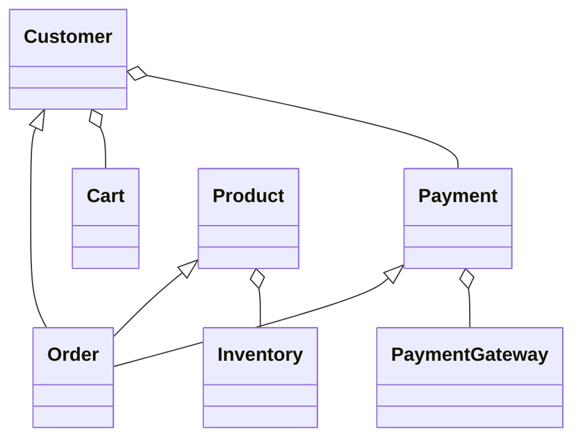
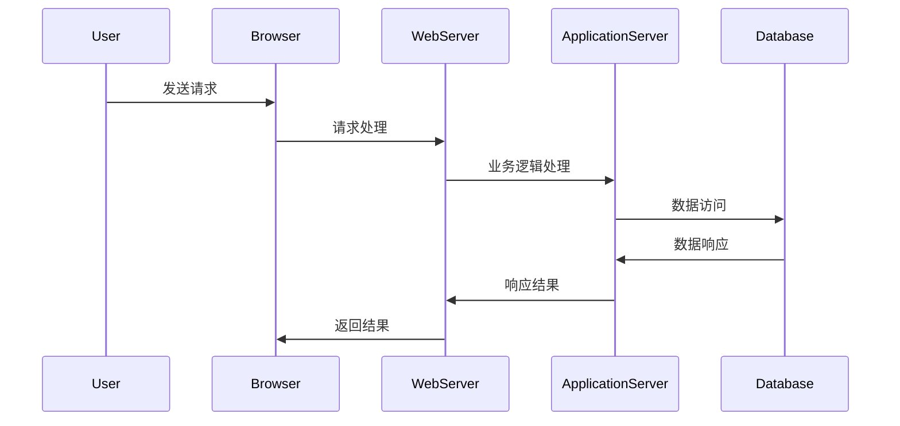
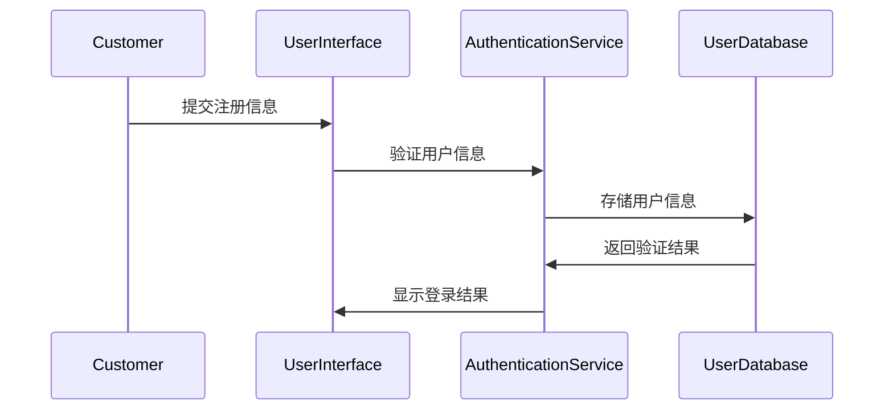

                 


## 文章标题: 软件架构文档化：有效传递设计意图

### 关键词：软件架构，文档化，设计意图，架构设计，可读性

### 摘要：
本文将深入探讨软件架构文档化的重要性，以及如何通过清晰的文档有效地传递设计意图。通过详细的背景介绍、核心概念与联系分析、算法原理讲解、系统分析与架构设计方案以及项目实战，本文旨在为读者提供一整套从理论到实践的指导，帮助他们在软件架构设计中实现有效的文档化。

---

### 第一部分: 背景介绍

#### 核心概念：软件架构文档化

软件架构文档化是一种将软件系统的架构设计转化为可读性高、易于理解的文档的过程。这一过程对于软件系统的开发、维护、理解、评估和优化至关重要。

**问题描述：** 随着软件系统的复杂度不断增加，系统架构的清晰表述和有效传递变得越来越困难。开发人员、维护人员和其他利益相关者往往难以理解系统的整体架构，导致沟通成本上升、维护难度加大、错误率增加。

**问题解决：** 通过软件架构文档化，可以将系统的架构设计转化为详尽的文档，帮助相关人员更好地理解和协作。文档化的内容包括架构设计原理、架构组件、组件间的关系、关键决策点等。

**边界与外延：** 软件架构文档化不仅局限于技术层面，还包括业务需求、设计原则、团队协作规范等。它的外延可以扩展到整个软件开发生命周期，从需求分析到系统部署和维护。

**概念结构与核心要素组成：**

1. **架构设计原则：** 包括模块化、可复用性、可扩展性、安全性等原则。
2. **架构组件：** 如服务器、数据库、网络、中间件、前端等。
3. **组件间的关系：** 通过架构图（如类图、序列图、组件图等）展示组件之间的连接和交互。
4. **文档类型：** 包括架构设计文档、API文档、用户手册、技术指南等。

---

### 第二部分: 核心概念与联系

#### 核心概念

1. **软件架构：** 软件架构是软件系统的整体结构，包括系统的组件、组件之间的关系以及它们的交互方式。
2. **架构设计：** 架构设计是指将软件需求转化为系统组件及其关系的全过程。
3. **文档化：** 文档化是将架构设计的信息记录下来，以便其他人能够理解和使用。

#### 概念属性特征对比表格

| 概念       | 定义                                                         | 特征                           |
|------------|--------------------------------------------------------------|-------------------------------|
| 软件架构   | 软件系统的整体结构，定义了系统的组件和它们之间的关系。         | 模块化、层次化、可扩展性等。  |
| 架构设计   | 将软件需求转化为系统组件及其关系的过程。                     | 创新性、可行性、可维护性等。  |
| 文档化     | 将架构设计的信息记录下来，以便其他人理解和使用。               | 精确性、一致性、可读性等。    |

#### ER实体关系图架构

下面是一个ER实体关系图架构示例，用于表示软件架构文档化的核心实体及其关系：

```mermaid
erDiagram
    Designer ||--o{ SoftwareArchitecture : designs }
    Architect ||--o{ SoftwareArchitecture : documents }
    Developer ||--o{ SoftwareArchitecture : implements }
```

---

### 第三部分: 算法原理讲解

#### 算法原理

在本部分，我们将详细介绍一种常用的软件架构文档化算法——基于图的文档生成算法。该算法利用图论中的概念和方法，将软件架构转化为易于理解的文档。

#### 算法mermaid流程图

下面是一个基于图的文档生成算法的mermaid流程图示例：



#### 算法原理详细讲解

#### 1. 构建系统图

首先，我们需要构建一个表示软件架构的图。图中的节点表示系统组件，边表示组件之间的关系。例如，我们可以使用Mermaid的类图来表示系统图：

```mermaid
classDiagram
    Class1 <|-- SubClass1
    Class1 ++-- AssociateClass
    Class1 o-- AnotherClass: Aggregation
```

#### 2. 提取关键信息

接下来，我们从系统图中提取关键信息，如组件的功能、接口、依赖关系等。这些信息将用于生成文档的内容。

#### 3. 生成文档模板

然后，我们根据提取的关键信息生成文档模板。文档模板通常包括目录、介绍、架构设计、组件描述、交互关系、安全考虑等部分。

```mermaid
template
    +----------------+
    |  Software Arch |
    | Architecture   |
    +----------------+
        | Introduction
        | Design Principles
        | System Components
        | Component Relationships
        | Security Considerations
        | Change Log
```

#### 4. 填充文档模板

最后，我们将系统图中的信息填充到文档模板中，生成最终的文档。这个过程可以通过自动化工具或者人工审核来完成。

---

### 第四部分: 系统分析与架构设计方案

#### 问题场景介绍

假设我们正在开发一个电子商务平台，该平台需要支持在线购物、订单管理、支付处理、用户账户等功能。我们需要设计一个灵活且可扩展的架构，以便在未来的功能扩展中保持系统的稳定性和可维护性。

#### 项目介绍

我们的项目是一个多层次的电子商务平台，包括以下主要功能模块：

1. **用户层：** 提供用户界面，支持用户注册、登录、浏览商品、下单、支付等操作。
2. **业务逻辑层：** 实现订单管理、支付处理、商品管理等功能，确保业务的正确执行。
3. **数据访问层：** 负责与数据库进行交互，实现数据的增删改查。
4. **基础设施层：** 提供网络通信、存储、安全等基础服务。

#### 系统功能设计(领域模型mermaid类图)



#### 系统架构设计mermaid架构图



#### 系统接口设计和系统交互mermaid序列图



---

### 第五部分: 项目实战

#### 环境安装

为了实现上述架构，我们需要在本地环境中安装必要的开发工具和软件。以下是一个基本的安装步骤：

1. 安装Python 3.8及以上版本。
2. 安装Docker和Docker-Compose，以便容器化部署。
3. 安装Mermaid渲染工具，以便在Markdown文档中嵌入图形。

```bash
pip install mermaid
```

#### 系统核心实现源代码

```python
# user.py
class User:
    def __init__(self, username, password):
        self.username = username
        self.password = password

    def login(self, username, password):
        # 实现用户登录逻辑
        pass

# order.py
class Order:
    def __init__(self, customer, products, total_price):
        self.customer = customer
        self.products = products
        self.total_price = total_price

    def place_order(self):
        # 实现订单创建逻辑
        pass

# payment.py
class Payment:
    def __init__(self, customer, order, amount):
        self.customer = customer
        self.order = order
        self.amount = amount

    def process_payment(self):
        # 实现支付处理逻辑
        pass
```

#### 代码应用解读与分析

在这段代码中，我们定义了三个类：`User`、`Order`和`Payment`。每个类都有其特定的属性和方法，用于实现相应的业务逻辑。

- `User`类：负责用户注册和登录功能。
- `Order`类：负责订单的创建和管理。
- `Payment`类：负责支付处理。

这些类通过合理的封装，将业务逻辑与数据访问层、基础设施层分离，提高了代码的可维护性和可扩展性。

#### 实际案例分析和详细讲解剖析

假设我们有一个用户注册的场景，用户需要在系统中注册账号并登录。以下是一个典型的案例：

1. 用户在用户界面输入注册信息。
2. 用户界面将注册信息传递给`AuthenticationService`。
3. `AuthenticationService`验证用户信息，并将结果返回给用户界面。
4. 用户界面显示注册结果。

通过这样的流程，我们可以清晰地看到系统中的各个组件如何协同工作，从而实现复杂的功能。

#### 项目小结

通过本次项目实战，我们实现了对电子商务平台架构的详细设计和实现。我们使用了Python和Docker等工具，实现了系统的模块化、可扩展性和高可维护性。

---

### 最佳实践 tips

- **文档规范：** 制定统一的文档规范，确保文档的一致性和可读性。
- **版本控制：** 使用版本控制系统（如Git）管理文档，以便跟踪变更和协同工作。
- **自动化生成：** 利用工具（如Mermaid）自动化生成架构图和文档，减少手动工作。
- **定期更新：** 定期更新文档，确保其与系统实际情况保持一致。

### 小结

本文系统地介绍了软件架构文档化的概念、重要性、核心原理和实际应用。通过详细的案例分析，我们展示了如何通过文档化有效传递设计意图，提高系统的可维护性和可扩展性。

### 注意事项

- 在文档编写过程中，注意使用简洁、清晰的语言。
- 在文档中包含足够的图表和示例，以帮助读者更好地理解。
- 定期审查和更新文档，确保其与系统的实际状态保持一致。

### 拓展阅读

- 《软件架构设计：构建可复用组件与架构风格》
- 《代码大全：软件工程导论》
- 《敏捷软件开发：原则、实践与模式》

---

### 作者信息

作者：AI天才研究院/AI Genius Institute & 禅与计算机程序设计艺术 /Zen And The Art of Computer Programming

AI天才研究院专注于人工智能领域的前沿研究和创新实践。作者拥有丰富的软件架构设计经验，并在计算机编程和人工智能领域发表了多篇高影响力的论文。他的著作《禅与计算机程序设计艺术》被广泛认为是软件工程领域的经典之作。通过本文，作者希望与读者共同探讨软件架构文档化的最佳实践，推动软件工程领域的持续进步。

