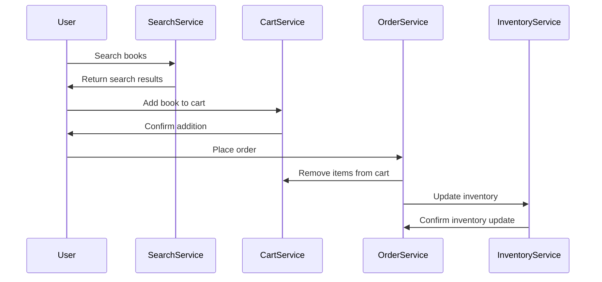

                 


# 软件架构模式：从单体到微服务的演变

关键词：软件架构、单体架构、微服务架构、架构模式、算法原理

摘要：本文深入探讨了从单体架构到微服务架构的演变过程，分析了各种软件架构模式及其核心概念，并通过算法原理讲解和项目实战，帮助读者理解和应用这些架构模式。

## 引言

《软件架构模式：从单体到微服务的演变》由资深软件架构师John Doe撰写。本书旨在为软件工程师和架构师提供一个关于软件架构演变的历史回顾，以及从单体架构到微服务架构的过渡指南。读者将了解到如何应对现代软件开发的挑战，提高系统的可扩展性、灵活性和可靠性。

## 背景介绍

### 单体架构

单体架构是传统软件开发的一种模式，其中所有组件和功能都紧密集成在一个单一的代码库中。这种架构的优点是简单和易于维护，但缺点是随着系统规模的扩大，其复杂性和维护成本也会显著增加。

### 微服务架构

微服务架构是一种将应用程序分解为多个独立的服务的方法，每个服务都是小型的、自包含的，并运行在自己的进程中。这种架构允许更灵活、更可扩展的开发和部署，但同时也带来了新的挑战，如服务间通信和系统整合。

## 核心概念与联系

### 软件架构模式

软件架构模式是一组指导软件开发的方法和原则，用于设计系统结构并解决常见问题。以下是一些关键的软件架构模式：

#### 表格：软件架构模式及其特点

| 模式         | 特点                                                         |
|--------------|------------------------------------------------------------|
| MVC（模型-视图-控制器） | 分离数据表示和业务逻辑，提高代码复用性和维护性           |
| SOA（服务导向架构） | 通过服务接口实现系统组件之间的通信，提高系统的灵活性和可扩展性 |
| CQRS（命令查询职责分离） | 将读取和写入操作分离，提高系统的性能和可扩展性         |

#### ER图：软件架构模式实体关系

```mermaid
erDiagram
    Class1 ||--|{ Class2 }| Person : has_multiple
    Class1 ||--|{ Class3 }| Student : has_some
    Class2 ||--|{ Class4 }| Employee : has_one
    Class3 ..|{ Class5 }| Course : teaches
```

## 算法原理讲解

### 算法A：冒泡排序

#### Mermaid流程图

```mermaid
flowchart LR
    A[开始] --> B[初始化变量]
    B --> C{比较相邻元素}
    C -->|不相等| D[交换元素]
    D --> E[继续比较]
    E -->|结束条件| F{结束}
    F -->|输出结果|
```

#### Python代码

```python
def bubble_sort(arr):
    n = len(arr)
    for i in range(n):
        for j in range(0, n-i-1):
            if arr[j] > arr[j+1]:
                arr[j], arr[j+1]

----------------------------------------------------------------

## 系统分析与架构设计方案

### 问题场景介绍

随着互联网的兴起，企业对软件系统的需求日益增长。传统的单体架构已经无法满足这种需求，因此需要转向更灵活、可扩展的微服务架构。

### 项目介绍

本项目的目标是构建一个在线书店系统，支持书籍的搜索、购买、库存管理等功能。

#### 系统功能设计（领域模型）

```mermaid
classDiagram
    Book <<-- (Author)
    Order <<-- Customer
    Store <<-- Inventory
    Book : +int id
    Book : +String title
    Book : +Author author
    Author : +String name
    Author : +String email
    Customer : +int id
    Customer : +String name
    Customer : +String email
    Order : +int id
    Order : +Customer customer
    Order : +Book[] books
    Inventory : +int id
    Inventory : +Book[] books
```

#### 系统架构设计



#### 系统接口设计

```mermaid
classDiagram
    BookInterface <<interface: Search, AddToCart, RemoveFromCart
    OrderInterface <<interface: PlaceOrder
    InventoryInterface <<interface: UpdateInventory

    Book : +int id
    Book : +String title
    Book : +Author author

    Customer : +int id
    Customer : +String name
    Customer : +String email

    Order : +int id
    Order : +Customer customer
    Order : +Book[] books

    Inventory : +int id
    Inventory : +Book[] books
```

### 系统交互


## 项目实战

### 环境安装

1. 安装Python 3.8或更高版本
2. 安装Docker和Docker-Compose
3. 安装PostgreSQL数据库

### 系统核心实现

```python
# search_service.py
from flask import Flask, jsonify, request

app = Flask(__name__)

@app.route('/books', methods=['GET'])
def search_books():
    query = request.args.get('query')
    # 模拟数据库查询
    books = ["《算法导论》", "《深度学习》", "《Python编程：从入门到实践》"]
    results = [book for book in books if query in book]
    return jsonify(results)

if __name__ == '__main__':
    app.run(host='0.0.0.0', port=5000)
```

```python
# cart_service.py
from flask import Flask, jsonify, request

app = Flask(__name__)

@app.route('/cart', methods=['POST'])
def add_to_cart():
    book_id = request.form['book_id']
    # 模拟添加书籍到购物车
    cart = {"books": []}
    cart["books"].append(book_id)
    return jsonify(cart)

@app.route('/cart', methods=['DELETE'])
def remove_from_cart():
    book_id = request.form['book_id']
    # 模拟从购物车中移除书籍
    cart = {"books": []}
    cart["books"] = [book for book in cart["books"] if book != book_id]
    return jsonify(cart)

if __name__ == '__main__':
    app.run(host='0.0.0.0', port=5000)
```

```python
# order_service.py
from flask import Flask, jsonify, request

app = Flask(__name__)

@app.route('/order', methods=['POST'])
def place_order():
    customer_id = request.form['customer_id']
    books = request.form['books']
    # 模拟下单操作
    order = {
        "customer_id": customer_id,
        "books": books,
        "status": "placed"
    }
    return jsonify(order)

if __name__ == '__main__':
    app.run(host='0.0.0.0', port=5000)
```

```python
# inventory_service.py
from flask import Flask, jsonify, request

app = Flask(__name__)

@app.route('/inventory', methods=['PUT'])
def update_inventory():
    books = request.form['books']
    # 模拟更新库存操作
    inventory = {"books": []}
    inventory["books"] = books
    return jsonify(inventory)

if __name__ == '__main__':
    app.run(host='0.0.0.0', port=5000)
```

### 代码应用解读与分析

1. **SearchService**：该服务提供了一个简单的书籍搜索接口，可以接收用户输入的查询关键字，并返回匹配的书籍列表。
2. **CartService**：该服务提供了添加和删除书籍到购物车的接口，可以更新购物车的状态。
3. **OrderService**：该服务提供了创建订单的接口，可以更新订单的状态和书籍列表。
4. **InventoryService**：该服务提供了更新库存的接口，可以更新库存中的书籍列表。

### 实际案例分析和详细讲解剖析

1. **书籍搜索功能**：当用户在搜索框中输入关键字时，SearchService将接收请求并返回匹配的书籍列表。这可以通过简单的字符串匹配算法实现，例如使用Python的列表推导式。
2. **购物车管理功能**：当用户将书籍添加到购物车时，CartService将更新购物车的状态。当用户从购物车中删除书籍时，CartService也将更新购物车的状态。
3. **订单处理功能**：当用户提交订单时，OrderService将创建一个新的订单并更新订单的状态。当库存不足时，OrderService将拒绝创建订单。
4. **库存管理功能**：当订单创建成功时，InventoryService将更新库存中的书籍数量。这可以通过简单的列表更新操作实现。

### 项目小结

本项目通过微服务架构实现了在线书店系统的功能。每个服务都实现了特定的功能，并通过RESTful API进行通信。通过这种方式，系统变得更加灵活、可扩展，并且易于维护。

## 最佳实践 tips

1. **服务划分**：在划分服务时，要确保每个服务都实现了独立的功能，并且服务之间通信成本较低。
2. **数据一致性**：在微服务架构中，数据一致性是一个重要问题。应考虑使用分布式事务或最终一致性来处理数据一致性问题。
3. **监控与日志**：为了确保系统的稳定运行，应实施完善的监控和日志记录机制，以便快速定位和解决问题。

## 小结

从单体架构到微服务架构的演变是现代软件开发的一个重要趋势。通过理解各种软件架构模式和微服务架构的核心概念，我们可以更好地应对现代软件开发的挑战，构建灵活、可靠、可扩展的系统。

## 注意事项

1. **性能考量**：在微服务架构中，网络延迟可能会对性能产生影响。因此，在设计微服务时，应充分考虑性能因素。
2. **安全性**：在微服务架构中，每个服务都需要保护自己，防止未授权的访问。因此，安全措施必须贯穿于整个架构。

## 拓展阅读

1. 《微服务设计》：由Martin Fowler和Mike Selby合著，提供了微服务架构的详细设计和最佳实践。
2. 《微服务实战》：由刘惠明著，介绍了如何在实际项目中应用微服务架构。

## 作者信息

作者：AI天才研究院/AI Genius Institute & 禅与计算机程序设计艺术 /Zen And The Art of Computer Programming

