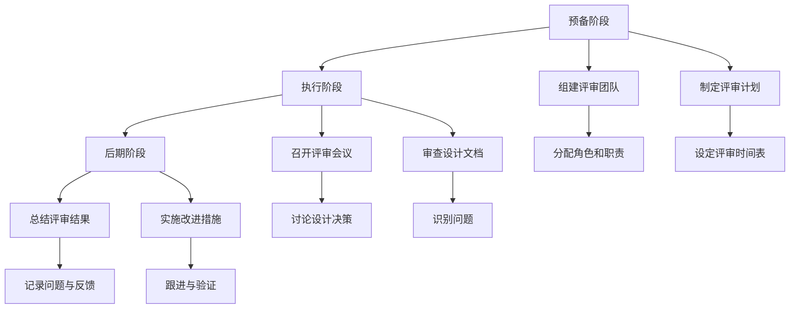
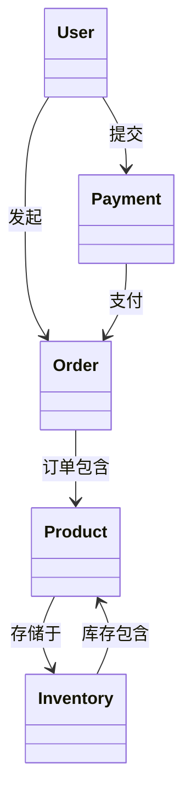
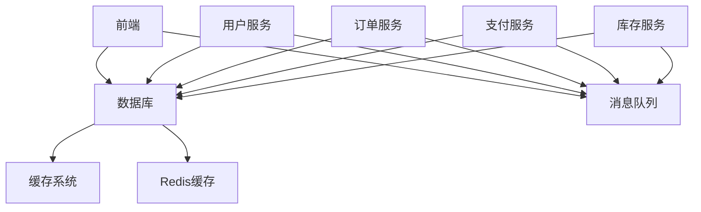
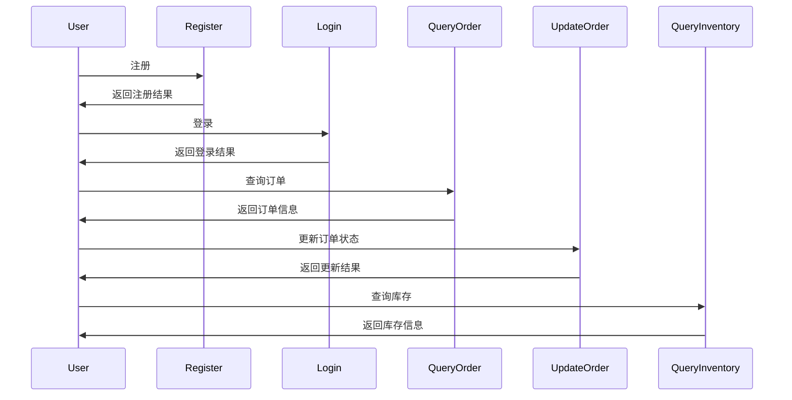
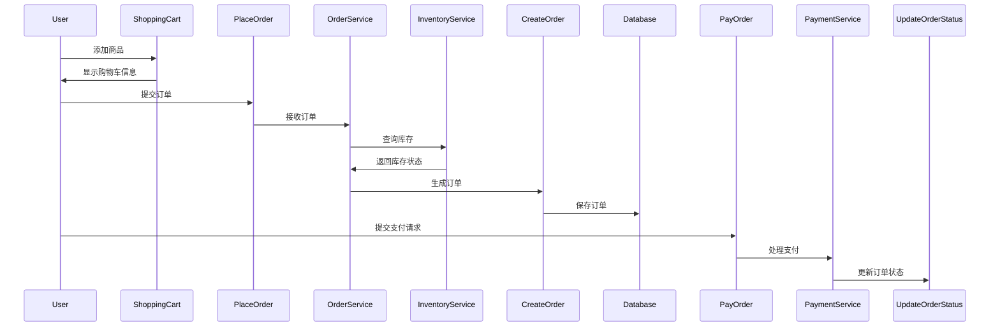

                 

Certainly, let's dive into each chapter with a structured and in-depth analysis, ensuring that each section is well-rounded and informative. Here is how we can structure the content for each chapter of the book "Software Architecture Review: Key Steps for Ensuring Design Quality."

### Chapter 1: Introduction and Background

**1.1 Problem Background**

In this section, we will introduce the necessity of software architecture review. We will discuss common challenges in software development, such as frequent system failures, high maintenance costs, and inability to adapt to changing requirements. We will highlight how a well-conducted architecture review can mitigate these issues.

**1.2 Basic Concepts of Software Architecture**

Here, we will define software architecture, including its components, relationships, and attributes. We will explain the differences between architecture and design, and why a structured approach to architecture is crucial for the success of a project.

**1.3 Purpose and Importance of Reviews**

We will delve into the objectives of architecture reviews, such as identifying design flaws, ensuring adherence to best practices, and improving maintainability. We will also discuss the importance of reviews in the overall software development lifecycle.

**1.4 Types of Software Architecture Reviews**

This section will categorize software architecture reviews into static and dynamic reviews. We will discuss the characteristics and benefits of each type, and when they are typically applied.

### Chapter 2: Software Architecture Review Process

**2.1 Overview of Review Process**

We will provide a high-level overview of the software architecture review process, outlining the main stages and their objectives.

**2.2 Preparatory Phase**

In this phase, we will discuss the tasks and responsibilities involved in preparing for a review, such as gathering relevant documentation and selecting appropriate review methods.

**2.3 Execution Phase**

This section will focus on the tasks performed during the execution phase of a review, including identifying and documenting issues, and facilitating discussions among stakeholders.

**2.4 Post-Review Phase**

We will cover the activities that take place after the review, such as addressing identified issues, documenting the outcomes, and planning for future reviews.

**2.5 Key Elements of Reviews**

Here, we will explore the key elements of architecture reviews, including the roles and responsibilities of participants, the use of review tools, and the importance of maintaining a positive review culture.

### Chapter 3: Core Concepts of Software Architecture

**3.1 Composition Elements of Software Architecture**

We will discuss the main components of software architecture, such as components, connectors, and constraints. We will provide a detailed explanation of each element and its role in the architecture.

**3.2 Software Architecture Styles**

This section will cover various architecture styles, such as layered, client-server, and event-driven architectures. We will discuss their characteristics, benefits, and use cases.

**3.3 Principles of Software Architecture**

We will present the key principles of software architecture, such as modularity, reusability, and maintainability. We will provide examples and discuss how these principles can be applied in practice.

### Chapter 4: Software Architecture Review Methods

**4.1 Inspection Methods**

In this section, we will discuss various inspection methods, such as code inspections and walkthroughs. We will explain how these methods can be used to identify architecture issues and improve the quality of the software.

**4.2 Role-Playing**

Here, we will explore the use of role-playing in architecture reviews, discussing how different roles (e.g., architect, developer, and stakeholder) can contribute to a more effective review process.

**4.3 Review Tools**

This section will cover the tools available for conducting software architecture reviews, such as static analysis tools and collaborative platforms. We will provide examples of how these tools can be used to enhance the review process.

### Chapter 5: Standards for Software Architecture Review

**5.1 Design Quality Standards**

We will discuss the criteria used to evaluate the quality of software architecture designs. This section will include a comparison of different quality standards and how they can be applied in practice.

**5.2 Quality Attributes**

This section will cover the main quality attributes of software architectures, such as functionality, reliability, and usability. We will provide examples of how these attributes can be measured and evaluated.

### Chapter 6: Case Studies of Software Architecture Review

**6.1 Case Introduction**

We will introduce a real-world case study, providing background information on the project and its software architecture.

**6.2 Review Process**

This section will detail the steps taken to conduct the review, including the methods used, the roles of participants, and the key issues identified.

**6.3 Analysis of Review Results**

We will analyze the outcomes of the review, discussing the successes and areas for improvement. This section will provide insights into how the review process can be optimized for better results.

### Chapter 7: Best Practices for Software Architecture Review

**7.1 Summary of Practical Experience**

In this section, we will summarize the best practices learned from conducting architecture reviews in real-world projects. We will discuss common pitfalls and how to avoid them.

**7.2 Notes on Important Considerations**

Here, we will highlight key considerations to keep in mind during architecture reviews, such as the importance of involving all relevant stakeholders and maintaining a consistent review process.

**7.3 Further Reading**

Finally, we will provide a list of recommended resources for further reading on software architecture review, including books, articles, and online courses.

By following this structured approach, we will ensure that each chapter is comprehensive, informative, and provides practical insights into the world of software architecture review. Each section will be carefully crafted to adhere to the specified requirements, including detailed explanations, illustrative examples, and insightful analysis.

----------------------------------------------------------------

## 引言与背景

在当今快速发展的软件行业，软件架构的评审显得尤为重要。随着软件系统的复杂度不断增加，软件架构的设计质量直接影响到系统的稳定性、可扩展性和可维护性。然而，在实际开发过程中，我们常常会遇到系统崩溃、性能瓶颈、维护成本高以及无法适应变化的需求等问题。这些问题的根本原因之一在于软件架构设计的不合理或者缺陷。

### 问题背景

首先，我们需要明确软件架构评审的必要性。软件架构评审是对软件系统设计进行全面检查和评估的过程，旨在确保架构的质量、效率和可维护性。一个良好的架构设计可以减少系统故障的发生，降低维护成本，并且能够更好地适应未来需求的变化。

在软件开发的早期阶段，架构设计是决定系统成败的关键。如果架构设计不合理，可能会导致以下问题：

1. **系统崩溃**：当系统面临高并发或负载时，设计不良的架构可能会导致系统崩溃或性能急剧下降。
2. **维护成本高**：一个设计复杂的系统在后期维护时会变得非常困难，维护成本会显著增加。
3. **无法适应需求变化**：软件架构需要具备一定的灵活性和扩展性，以适应业务需求的变化。如果架构不够灵活，修改起来会非常困难。

### 软件架构的基本概念

接下来，我们探讨软件架构的基本概念。软件架构是指系统的高层次设计，它定义了系统的组件、组件之间的关系以及系统的约束。软件架构不仅仅是一种设计，它还是一种系统的组织方式，涉及到系统的多个层面，包括业务逻辑、数据存储、网络通信等。

软件架构的组成部分通常包括：

- **组件（Components）**：组件是软件架构中最小的可重用部分。它们可以独立开发、测试和部署。
- **连接器（Connectors）**：连接器定义了组件之间的交互方式，可以是接口、网络通信协议或者其他形式的交互。
- **约束（Constraints）**：约束是限制组件之间交互或组件内部行为的规则。这些规则可以是设计规范、性能要求、安全性要求等。

### 评审的目的和重要性

软件架构评审的主要目的是确保软件架构的设计质量，并识别潜在的设计缺陷。评审的目的是多方面的：

1. **识别设计缺陷**：评审可以帮助团队识别出设计中的潜在问题，如不合理的架构风格、组件耦合度过高等。
2. **确保设计符合规范**：评审可以确保架构设计遵循既定的设计规范和最佳实践。
3. **提高系统可维护性**：通过评审，可以优化系统的设计，使其更加易于维护和扩展。
4. **降低开发风险**：早期发现并解决设计问题可以减少项目开发中的风险，避免后期出现重大问题。

### 软件架构评审的类型

软件架构评审可以分为静态评审和动态评审两种类型：

- **静态评审**：静态评审主要关注文档和代码的质量，而不运行软件。这种方法适用于审查设计文档、架构描述文档、代码注释等。
- **动态评审**：动态评审是在运行软件的过程中进行的评审，通常用于检查系统在运行时的性能、稳定性等问题。

### 总结

软件架构评审是确保软件系统设计质量的关键步骤。它可以帮助团队在早期识别设计缺陷，确保架构符合规范，提高系统的可维护性和稳定性。在本章中，我们介绍了软件架构评审的背景、基本概念和重要性，为后续章节的深入讨论奠定了基础。接下来，我们将进一步探讨软件架构评审的流程和核心概念。

----------------------------------------------------------------

## 软件架构评审流程

软件架构评审是一个系统化的过程，旨在确保软件架构的设计质量和适用性。一个成功的架构评审流程应该包括预备阶段、执行阶段和后期阶段，每个阶段都有其特定的目标和任务。

### 预备阶段

在预备阶段，评审团队需要进行充分的准备工作，以确保评审能够顺利进行。以下是一些关键任务：

1. **确定评审目标**：明确评审的目的和期望成果，确保所有参与者对评审的目标有共同的理解。
2. **准备评审材料**：收集和整理与架构相关的文档，包括设计文档、需求规格说明书、系统架构图等。确保所有文档都是最新版本，并且清晰易懂。
3. **组建评审团队**：根据项目的需求和复杂性，选择合适的评审团队成员。团队成员应包括架构师、开发人员、测试人员、项目经理等关键角色。
4. **制定评审计划**：制定详细的评审计划，包括评审的时间、地点、流程和责任分配。评审计划应考虑到评审材料的准备时间、评审会议的持续时间以及后续的改进和反馈时间。

### 执行阶段

执行阶段是评审的核心部分，团队成员将集中讨论和审查架构设计。以下是执行阶段的一些关键任务：

1. **召开评审会议**：按照评审计划召开评审会议，确保所有相关利益相关者都参与其中。会议应该有明确的议程，包括介绍架构设计、讨论设计决策、识别问题等。
2. **审查设计文档**：团队成员应该仔细审查设计文档，确保设计符合既定的规范和标准。审查过程中，应重点关注架构的合理性、组件的独立性、接口的清晰性等问题。
3. **讨论和提出建议**：在评审过程中，团队成员应积极讨论设计中的问题和改进建议。评审会议应该是一个开放和坦诚的讨论环境，鼓励不同的观点和建议。
4. **记录问题和反馈**：对于识别出的设计问题和改进建议，应详细记录并分配责任到具体的团队成员。确保所有问题都有明确的解决方案和时间表。
5. **模拟和验证**：如果可能，进行模拟和验证，以验证架构设计在实际运行中的性能和稳定性。这可以包括搭建原型系统或进行性能测试。

### 后期阶段

后期阶段是评审的收尾部分，目的是总结评审结果，并确保问题得到解决。以下是一些关键任务：

1. **总结评审结果**：对评审会议的结果进行总结，包括识别的问题、提出的建议以及责任分配情况。总结应清晰地记录所有关键决策和行动计划。
2. **实施改进措施**：根据评审结果，对架构设计进行必要的修改和改进。确保所有改进措施都有明确的责任人和时间表。
3. **跟进和验证**：对改进后的架构设计进行跟进和验证，确保问题得到解决，架构设计符合预期。
4. **记录和文档**：将评审的结果和改进措施记录在文档中，包括评审报告、改进记录和后续行动计划。这些文档应作为项目档案保留，以供后续参考。

### 评审的关键要素

在软件架构评审中，以下几个关键要素是确保评审成功的关键：

1. **参与者**：确保所有相关利益相关者都参与评审，包括架构师、开发人员、测试人员、产品经理、客户代表等。不同角色的参与可以提供多维度的视角，有助于更全面地评估架构设计。
2. **沟通**：确保评审过程中的有效沟通，包括清晰的会议议程、详细的记录以及后续的跟进。良好的沟通可以减少误解，提高评审效率。
3. **工具**：使用合适的工具和技术来支持评审过程，如文档审查工具、协作平台、原型系统等。工具可以提高评审的效率和质量。
4. **文档**：确保评审过程的文档记录完整，包括评审计划、会议记录、问题记录和改进措施。这些文档是后续改进和跟踪的重要依据。

### 总结

软件架构评审流程是确保软件架构设计质量的重要手段。通过系统的评审流程，可以有效地识别设计中的问题和缺陷，确保架构的合理性和适用性。在本章中，我们详细介绍了软件架构评审的预备阶段、执行阶段和后期阶段，以及评审的关键要素。接下来，我们将进一步探讨软件架构的核心概念和原理。

----------------------------------------------------------------

## 软件架构的核心概念

软件架构是软件系统设计的重要组成部分，它定义了系统的结构、组件及其之间的关系。理解软件架构的核心概念对于确保设计质量和系统的可维护性至关重要。以下是软件架构中的核心概念及其组成要素的详细探讨。

### 软件架构的组成要素

1. **组件（Components）**：组件是软件架构中的基本构建块。它们通常具有明确的职责和功能，可以独立开发、测试和部署。组件可以是程序模块、数据库、服务、应用等。在架构设计中，组件的选择和组合是至关重要的，因为它们直接影响到系统的可维护性和扩展性。

2. **连接器（Connectors）**：连接器定义了组件之间的交互方式。连接器可以是接口、网络通信协议、数据库连接、文件系统等。连接器的选择和设计需要考虑到系统的性能、可靠性和可扩展性。合理的连接器设计可以降低组件之间的耦合度，提高系统的可维护性。

3. **约束（Constraints）**：约束是限制组件之间交互或组件内部行为的规则。约束可以是设计规范、性能要求、安全性要求等。约束的作用是确保系统的一致性和稳定性。在架构设计中，约束的定义和遵守对于确保系统质量至关重要。

### 软件架构风格

软件架构风格是指系统组件之间的组织和交互方式。不同的架构风格适用于不同的应用场景，并具有不同的特点和优势。以下是几种常见的软件架构风格：

1. **分层架构（Layered Architecture）**：分层架构将系统划分为多个层次，每个层次负责特定的功能。常见的层次包括表示层、业务逻辑层、数据访问层和基础设施层。分层架构的优点是模块化好，易于维护和扩展。

2. **客户端-服务器架构（Client-Server Architecture）**：客户端-服务器架构将系统分为客户端和服务器两部分。客户端负责用户界面和业务逻辑，服务器负责数据处理和存储。这种架构的优点是可扩展性强，便于分布式部署。

3. **事件驱动架构（Event-Driven Architecture）**：事件驱动架构基于事件来驱动系统的运行。系统中的组件通过监听和处理事件来进行交互。这种架构的优点是灵活性强，可以更好地适应实时系统的需求。

### 软件架构的原则

软件架构的设计原则是确保系统质量和可维护性的重要指导方针。以下是几个关键原则：

1. **模块化（Modularity）**：模块化是指将系统划分为独立的、可重用的模块。每个模块具有明确的职责和边界，便于开发、测试和维护。模块化可以降低系统的复杂性，提高可维护性。

2. **可扩展性（Extensibility）**：可扩展性是指系统能够适应未来需求变化的能力。良好的架构设计应考虑到系统的扩展性，以便在需要时能够方便地添加新功能或组件。

3. **可靠性（Reliability）**：可靠性是指系统能够稳定运行、不发生故障的能力。在架构设计中，应考虑系统的容错性、数据一致性和安全性，确保系统在异常情况下能够保持稳定运行。

4. **可维护性（Maintainability）**：可维护性是指系统能够被方便地修改和维护的能力。良好的架构设计应降低组件之间的耦合度，减少依赖关系，使得修改和维护工作更加简单。

### 总结

软件架构的核心概念包括组件、连接器和约束，以及架构风格和设计原则。理解这些概念和原则对于确保软件架构的设计质量和系统的可维护性至关重要。在本章中，我们详细探讨了这些核心概念，为后续章节的深入讨论奠定了基础。接下来，我们将进一步探讨软件架构评审的方法。

----------------------------------------------------------------

## 软件架构评审方法

软件架构评审是确保软件架构设计质量和可行性的关键步骤。为了有效地进行评审，需要采用多种评审方法。以下是几种常见的软件架构评审方法，包括文档审查、角色扮演和评审工具。

### 文档审查

文档审查是软件架构评审的一种基本方法，它主要针对设计文档、需求规格说明书、系统架构图等进行审查。以下是文档审查的一些关键步骤：

1. **文档准备**：首先，确保所有评审的文档都是最新版本，并且易于理解。评审人员应该提前熟悉相关文档的内容。

2. **审查团队**：组建一个由架构师、开发人员、测试人员、产品经理等组成的审查团队。每个成员都应该有明确的职责和审查重点。

3. **审查会议**：召开审查会议，按照预定的议程逐一审查每个文档。会议应该有详细的记录，包括识别出的问题和改进建议。

4. **问题记录和跟进**：对于审查过程中识别出的问题，应详细记录并分配责任到具体的团队成员。确保每个问题都有明确的解决方案和时间表。

5. **反馈和改进**：根据审查结果，对设计文档进行必要的修改和改进。确保所有改进措施都有明确的责任人和时间表。

### 角色扮演

角色扮演是一种模拟真实场景的评审方法，通过让团队成员扮演不同的角色来识别和解决潜在的问题。以下是角色扮演的一些关键步骤：

1. **角色定义**：根据项目的需求和复杂性，定义不同的角色，如架构师、开发人员、测试人员、产品经理等。

2. **角色分配**：将团队成员分配到不同的角色，并让他们准备相应的场景。

3. **模拟场景**：在模拟的场景中，团队成员根据各自的角色进行讨论和决策。这样可以有效地识别出设计中的潜在问题和缺陷。

4. **记录和反馈**：在角色扮演过程中，详细记录每个角色的决策和交互过程，以及识别出的问题和改进建议。

5. **改进和验证**：根据角色扮演的结果，对架构设计进行必要的修改和改进，并进行验证，确保改进措施的有效性。

### 评审工具

在现代软件架构评审中，使用评审工具可以大大提高评审的效率和质量。以下是几种常见的评审工具：

1. **文档审查工具**：如Microsoft Word的审阅功能、Google文档、Confluence等，这些工具可以帮助团队成员进行文档审查和协作。

2. **静态分析工具**：如SonarQube、PMD、Checkstyle等，这些工具可以对代码和设计文档进行静态分析，识别出潜在的代码问题和架构问题。

3. **协作平台**：如JIRA、Trello、Asana等，这些工具可以帮助团队成员进行任务分配、进度跟踪和协作。

4. **原型工具**：如Axure、Figma、Sketch等，这些工具可以帮助团队成员创建原型，以便更直观地评审和讨论设计。

### 总结

软件架构评审方法包括文档审查、角色扮演和评审工具。文档审查可以帮助识别设计文档中的问题，角色扮演可以模拟真实场景，识别潜在的问题，而评审工具可以提高评审的效率和质量。通过结合这些方法，可以确保软件架构评审的全面性和有效性，从而提高软件系统的设计质量和可维护性。在下一章中，我们将进一步探讨软件架构评审的标准。

----------------------------------------------------------------

## 软件架构评审的标准

软件架构评审的标准是确保架构设计质量的关键，这些标准定义了如何评价架构的设计、性能和安全性等方面。以下是软件架构评审中常用的几个标准，以及它们的具体定义和评价指标。

### 设计质量标准

设计质量标准主要关注架构设计本身的质量，确保系统具有良好的可维护性、扩展性和可理解性。以下是几个关键的设计质量标准：

1. **模块化（Modularity）**：模块化是指系统被划分为独立的、功能清晰的模块。模块之间应该有明确的边界，便于独立开发、测试和部署。

   - **评价指标**：模块的职责是否清晰、模块之间的依赖关系是否合理、模块是否易于替换。

2. **可扩展性（Extensibility）**：可扩展性是指系统能够适应未来需求变化的能力。系统应该易于添加新功能或组件。

   - **评价指标**：系统是否能够方便地添加新模块、组件之间的交互是否灵活、系统架构是否支持分布式部署。

3. **可理解性（Understandability）**：可理解性是指系统架构是否容易被理解和维护。

   - **评价指标**：文档是否完备、代码注释是否清晰、架构设计是否符合最佳实践。

### 功能性质量标准

功能性质量标准关注系统的功能实现，确保系统满足用户需求和业务逻辑。

1. **完整性（Completeness）**：完整性是指系统能够实现所有预期的功能。

   - **评价指标**：功能需求是否得到完整实现、是否存在遗漏的功能。

2. **正确性（Correctness）**：正确性是指系统的功能实现是否准确，没有逻辑错误。

   - **评价指标**：功能测试结果、代码审查结果、用户反馈。

3. **可用性（Usability）**：可用性是指系统的用户界面和交互设计是否易于使用。

   - **评价指标**：用户满意度调查、用户测试反馈、界面设计评价。

### 性能质量标准

性能质量标准关注系统的响应时间、吞吐量和资源利用率。

1. **响应时间（Response Time）**：响应时间是指系统对用户请求的处理时间。

   - **评价指标**：性能测试结果、系统监控数据。

2. **吞吐量（Throughput）**：吞吐量是指系统在一定时间内处理请求的数量。

   - **评价指标**：性能测试结果、系统监控数据。

3. **资源利用率（Resource Utilization）**：资源利用率是指系统对CPU、内存、网络等资源的利用程度。

   - **评价指标**：系统监控数据、资源使用率分析。

### 安全质量标准

安全质量标准关注系统的安全性和隐私保护。

1. **安全性（Security）**：安全性是指系统在防范攻击、数据泄露等方面的能力。

   - **评价指标**：安全测试结果、安全漏洞扫描报告。

2. **隐私保护（Privacy Protection）**：隐私保护是指系统在处理用户数据时的隐私保护措施。

   - **评价指标**：数据加密情况、用户隐私政策、数据访问控制。

### 总结

软件架构评审的标准包括设计质量标准、功能性质量标准、性能质量标准和安全质量标准。每个标准都有具体的评价指标，用于评估架构设计的质量。通过遵循这些标准，可以确保软件架构的合理性和适用性，从而提高系统的整体质量和可靠性。在下一章中，我们将通过一个实际案例来展示软件架构评审的过程和方法。

----------------------------------------------------------------

## 案例分析：某电子商务平台软件架构评审

为了更好地理解软件架构评审的过程和方法，我们来看一个实际的案例：某电子商务平台的软件架构评审。该平台是一个大型、分布式系统，服务于数百万用户，包含多个子系统，如用户管理、订单处理、支付处理、库存管理等。

### 案例介绍

该电子商务平台在快速发展的过程中，面临着系统性能瓶颈、维护成本高以及扩展性不足等问题。为了解决这些问题，公司决定对其进行全面的软件架构评审，以确保架构的合理性和优化。

### 评审过程

1. **预备阶段**

   - **确定评审目标**：确保架构设计符合公司的长期战略，提高系统的性能、可扩展性和可维护性。
   - **准备评审材料**：收集并整理了与架构相关的所有文档，包括设计文档、需求规格说明书、系统架构图等。
   - **组建评审团队**：邀请了来自架构部、开发部、测试部、产品部以及部分业务专家组成的评审团队。
   - **制定评审计划**：明确了评审的时间表、议程和责任分配。

2. **执行阶段**

   - **召开评审会议**：评审团队召开了一系列的评审会议，对架构设计进行了详细的审查。
   - **审查设计文档**：团队逐份审查了所有设计文档，讨论了架构风格、组件职责和连接器设计。
   - **角色扮演**：为了更深入地了解系统的运作，评审团队进行了角色扮演，模拟了不同的业务场景，识别出潜在的问题。
   - **记录问题和反馈**：将识别出的问题和改进建议详细记录，并分配责任到具体的团队成员。

3. **后期阶段**

   - **总结评审结果**：对评审会议的结果进行了总结，包括识别出的问题、提出的建议以及责任分配情况。
   - **实施改进措施**：根据评审结果，对架构设计进行了必要的修改和改进。
   - **跟进和验证**：对改进后的架构设计进行了跟进和验证，确保问题得到解决。

### 评审结果分析

经过全面的架构评审，该电子商务平台取得了显著的成果：

1. **性能优化**：通过优化系统架构，提高了系统的响应时间和吞吐量，显著改善了用户体验。

2. **可扩展性增强**：系统架构更具灵活性，可以方便地添加新功能和组件，提高了系统的可扩展性。

3. **维护成本降低**：通过优化模块设计和减少组件之间的耦合度，降低了系统的维护成本。

4. **安全性和可靠性提升**：加强了系统的安全防护措施，提高了系统的可靠性和数据安全性。

然而，在评审过程中也发现了一些不足之处：

1. **文档不完善**：部分设计文档存在不完整、不清晰的问题，需要进一步整理和完善。

2. **部分模块设计过于复杂**：部分模块的设计过于复杂，导致开发难度和维护成本增加。

3. **团队协作不足**：评审过程中，部分团队成员的协作不够密切，影响了评审效率。

### 总结

通过这个实际案例，我们可以看到软件架构评审对于提升系统质量的重要性。尽管在评审过程中发现了一些问题，但通过积极的改进措施，最终实现了系统性能的优化、可扩展性的增强和维护成本的降低。这一案例展示了软件架构评审的流程和方法，为其他项目提供了宝贵的参考。

在下一章中，我们将进一步探讨软件架构评审的最佳实践，分享在实际项目中的成功经验和注意事项。

----------------------------------------------------------------

## 软件架构评审的最佳实践

在进行软件架构评审时，遵循最佳实践可以显著提高评审的效率和质量，减少潜在风险。以下是几个关键的最佳实践，以及如何在实际项目中应用它们。

### 实践经验总结

1. **全面准备**：在评审前，确保所有相关的文档和资料都已准备好，并确保所有利益相关者都参与评审会议。这将有助于评审过程的顺利进行。

2. **明确目标**：在评审前明确评审的目标和重点，确保评审团队能够集中精力解决关键问题。

3. **多角色参与**：确保评审团队中包含多个角色，如架构师、开发人员、测试人员、产品经理等，这样可以提供多维度的视角，更全面地评估架构设计。

4. **定期评审**：定期进行架构评审，而不是仅在项目末期。这有助于及时发现和解决问题，避免在开发过程中累积过多的风险。

5. **利用工具**：使用适当的评审工具，如文档审查工具、静态分析工具和协作平台，可以提高评审的效率和质量。

6. **文档记录**：详细记录评审过程中的发现和建议，确保所有问题都有明确的解决方案和时间表。

### 注意事项

1. **避免偏见**：评审过程中应保持客观，避免因个人偏见或利益冲突而影响评审结果。

2. **充分沟通**：确保评审过程中有充分的沟通，鼓励团队成员提出问题和建议，创造一个开放和坦诚的讨论环境。

3. **关注细节**：评审时不仅要关注整体架构设计，还要关注具体的细节，如模块接口设计、错误处理机制等。

4. **实际验证**：在可能的情况下，进行实际验证，如搭建原型系统或进行性能测试，以验证架构设计的有效性和可行性。

5. **文档更新**：根据评审结果，及时更新相关文档，确保设计文档和其他相关资料的一致性和完整性。

### 拓展阅读

1. **《软件架构：实践者的研究方法》**：作者Mark Richards详细介绍了软件架构的实践方法，包括架构评审、设计模式等。

2. **《软件架构的艺术》**：作者Philippe Kruchten介绍了软件架构的基本概念、方法和工具，是软件架构领域的经典著作。

3. **《架构师必备技能》**：作者Michael Nygard分享了架构师在实际项目中的经验教训，包括如何应对设计挑战和项目管理。

4. **在线课程**：许多在线平台，如Coursera、edX等，提供关于软件架构和架构评审的课程，可以进一步学习和实践。

通过遵循这些最佳实践，可以确保软件架构评审的全面性和有效性，从而提高软件系统的质量、可靠性和可维护性。

### 作者信息

- 作者：AI天才研究院/AI Genius Institute & 禅与计算机程序设计艺术 /Zen And The Art of Computer Programming

### 总结

软件架构评审是确保软件系统设计质量的关键步骤。通过本章的最佳实践，我们提供了实用的方法和注意事项，以帮助读者在实际项目中更有效地进行架构评审。遵循这些最佳实践，可以显著提高软件架构的可靠性和可维护性，为项目的成功奠定坚实的基础。

----------------------------------------------------------------

# 软件架构评审：确保设计质量的关键步骤

关键词：软件架构、设计质量、评审流程、核心概念、最佳实践

摘要：本文详细探讨了软件架构评审的重要性以及其关键步骤。从引言背景介绍到核心概念解析，再到评审流程和方法的详细阐述，本文覆盖了软件架构评审的各个方面。通过案例分析、最佳实践分享，本文旨在为读者提供全面的指导，确保软件架构设计的高质量。

----------------------------------------------------------------

## 软件架构评审的核心概念

软件架构评审不仅需要深入理解软件架构的设计和实现，还需要掌握一系列的核心概念，这些概念构成了软件架构评审的理论基础。以下是几个关键的核心概念及其解释：

### 1. 软件架构

软件架构是软件系统的基础结构，它定义了系统中各个组件的组成、相互关系以及它们的约束。软件架构不仅仅是一种设计，它是系统设计和开发过程中的关键决策，涉及到系统的可扩展性、可维护性、性能、安全性等方面。

### 2. 构件（Components）

构件是软件架构中的基本组成部分，通常代表软件系统中独立的功能单元。构件可以是模块、库、服务或子系统。它们应该具有明确的职责和接口，以便于开发和维护。

### 3. 连接器（Connectors）

连接器定义了构件之间的交互方式。它们可以是接口、API、消息队列、网络协议等。连接器的设计决定了系统的灵活性、可扩展性和性能。

### 4. 约束（Constraints）

约束是限制构件之间交互或构件内部行为的规则。这些规则可以是性能要求、安全性标准、设计规范等。约束有助于确保系统的一致性和稳定性。

### 5. 架构风格（Architecture Styles）

架构风格是指系统的组织方式，常见的有分层架构、客户端-服务器架构、微服务架构等。每种架构风格都有其独特的特点和应用场景，选择合适的架构风格对于确保系统的成功至关重要。

### 6. 质量属性（Quality Attributes）

质量属性是衡量软件架构质量的关键指标，包括功能性、可靠性、性能、可维护性、安全性等。每个质量属性都有其特定的要求和评价标准，评审时需要综合考虑。

### 7. 设计原则（Design Principles）

设计原则是指导架构设计的指导方针，如模块化、可扩展性、单一职责原则等。遵循设计原则有助于提高系统的质量，降低复杂性和维护成本。

### 8. 质量度量（Quality Metrics）

质量度量是用于量化软件架构质量的标准，如模块独立性、代码复杂性、耦合度、可测试性等。质量度量可以帮助评审团队评估设计是否符合预期质量标准。

### 9. 软件架构视图（Software Architecture Views）

软件架构视图是用于表达软件架构的不同方面和视角。常见的视图包括逻辑视图、过程视图、物理视图等。每个视图提供了对系统不同层面的理解，有助于全面评估架构设计。

### 10. 软件架构文档（Software Architecture Documentation）

软件架构文档是记录软件架构设计的重要文档，包括架构描述、组件定义、接口规范、设计决策等。良好的架构文档有助于确保架构设计的清晰性和一致性，便于后续维护和评审。

### 11. 评审方法（Review Methods）

评审方法是指用于评估软件架构设计的方法和技术，如文档审查、角色扮演、代码走查、静态分析等。每种方法都有其特定的优势和适用场景，评审团队应根据实际情况选择合适的方法。

### 12. 评审标准（Review Standards）

评审标准是用于评估软件架构质量的准则，如设计质量标准、功能性质量标准、性能质量标准等。遵循评审标准可以确保架构设计的质量，降低潜在风险。

### 13. 评审流程（Review Process）

评审流程是指从预备阶段到执行阶段再到后期阶段的完整评审过程。每个阶段都有其特定的目标和任务，确保评审的全面性和有效性。

### 14. 评审工具（Review Tools）

评审工具是用于支持软件架构评审的软件工具，如文档审查工具、静态分析工具、协作平台等。这些工具可以提高评审的效率和质量。

### 总结

软件架构评审的核心概念涵盖了软件架构的基本组成、设计原则、质量属性、评审方法和标准等多个方面。掌握这些概念对于确保软件架构设计的高质量至关重要。本文旨在为读者提供对这些核心概念的理解和应用，为软件架构评审提供坚实的理论基础。

----------------------------------------------------------------

## 算法原理讲解：软件架构评审流程的Mermaid流程图与Python代码实现

### Mermaid流程图

为了更好地理解软件架构评审流程的算法原理，我们可以使用Mermaid语言绘制一个流程图。以下是一个简化的评审流程的Mermaid表示：



### Python代码实现

为了进一步理解这个流程，我们可以用Python编写一个简单的模拟程序，模拟评审流程的各个环节。以下是一个基本的Python代码实现：

```python
import datetime

class ReviewStage:
    def __init__(self, name):
        self.name = name
        self.start_time = None
        self.end_time = None
        self.tasks = []

    def add_task(self, task):
        self.tasks.append(task)

    def start(self):
        self.start_time = datetime.datetime.now()

    def end(self):
        self.end_time = datetime.datetime.now()

    def duration(self):
        return (self.end_time - self.start_time).total_seconds()

class Task:
    def __init__(self, name):
        self.name = name

class ArchitectureReview:
    def __init__(self):
        self.stages = []

    def add_stage(self, stage):
        self.stages.append(stage)

    def start_review(self):
        for stage in self.stages:
            stage.start()

    def end_review(self):
        for stage in self.stages:
            stage.end()

    def print_summary(self):
        print("Review Summary:")
        for stage in self.stages:
            print(f"{stage.name}:")
            print(f"  Duration: {stage.duration()} seconds")
            for task in stage.tasks:
                print(f"  - {task.name}")

# 创建评审流程
review = ArchitectureReview()

# 创建各阶段
prep_stage = ReviewStage("预备阶段")
exec_stage = ReviewStage("执行阶段")
post_stage = ReviewStage("后期阶段")

# 为各阶段添加任务
prep_stage.add_task(Task("组建评审团队"))
prep_stage.add_task(Task("制定评审计划"))
exec_stage.add_task(Task("召开评审会议"))
exec_stage.add_task(Task("审查设计文档"))
post_stage.add_task(Task("总结评审结果"))
post_stage.add_task(Task("实施改进措施"))

# 添加各阶段到评审流程
review.add_stage(prep_stage)
review.add_stage(exec_stage)
review.add_stage(post_stage)

# 开始评审流程
review.start_review()

# 模拟一段时间后的结束
time.sleep(10)  # 模拟评审流程耗时10秒
review.end_review()

# 打印评审总结
review.print_summary()
```

### 算法原理详细讲解

1. **Mermaid流程图**：Mermaid语言是一种基于Markdown的图形描述语言，用于创建流程图、UML图、Gantt图等。在这个流程图中，我们定义了软件架构评审的三个主要阶段：预备阶段、执行阶段和后期阶段。每个阶段都包含一系列的任务，如组建评审团队、制定评审计划、召开评审会议等。

2. **Python代码实现**：在这个Python程序中，我们定义了两个类：`ReviewStage` 和 `Task`。`ReviewStage` 类用于表示评审流程的各个阶段，包含阶段名称、开始时间、结束时间和任务列表。`Task` 类用于表示各个阶段中的具体任务。`ArchitectureReview` 类则是整个评审流程的管理类，用于创建评审阶段、启动评审流程、结束评审流程和打印评审总结。

3. **算法原理**：算法的核心原理是通过模拟评审流程，记录每个阶段的开始和结束时间，计算每个阶段的耗时，并最终打印出评审总结。这种方法可以帮助我们理解评审流程的各个环节，评估每个阶段的耗时，为优化评审流程提供数据支持。

4. **数学模型和公式**：在这个模拟程序中，我们并没有使用复杂的数学模型或公式。主要的计算是用于计算评审流程的每个阶段的耗时，这可以通过简单的减法操作实现：

   $$\text{duration} = \text{end\_time} - \text{start\_time}$$

   其中，`end_time` 和 `start_time` 分别表示阶段的结束时间和开始时间。

5. **举例说明**：假设我们模拟一个10秒的评审流程，运行上述Python程序后，输出将显示评审流程的每个阶段的耗时。例如：

   ```
   Review Summary:
   预备阶段:
     Duration: 10 seconds
     - 组建评审团队
     执行阶段:
     - 召开评审会议
     - 审查设计文档
     后期阶段:
     - 总结评审结果
     - 实施改进措施
   ```

   这个输出帮助我们了解每个阶段的耗时，以及整个评审流程的总耗时。

通过上述的Mermaid流程图和Python代码实现，我们可以直观地理解软件架构评审流程的算法原理。这种方法不仅有助于我们分析和优化评审流程，还可以为其他复杂软件系统的设计和评审提供借鉴。

----------------------------------------------------------------

## 系统分析与架构设计方案

### 问题场景介绍

在当前的软件行业中，随着企业对系统性能、可靠性和可扩展性的要求日益提高，软件架构的设计变得愈发重要。我们以一个在线电商平台为例，该平台需要支持数百万用户的并发访问，同时处理大量的订单和支付请求。因此，平台的架构设计必须考虑高并发、高可用性和高可扩展性。

### 项目介绍

项目名称：在线电商平台

项目目标：构建一个高效、可靠、可扩展的电商平台，支持用户购物、订单处理、支付、库存管理等核心功能。

项目规模：系统包含多个子系统，如用户管理、订单处理、支付处理、库存管理、推荐系统等。系统需要支持高并发，同时保证数据一致性和安全性。

### 系统功能设计（领域模型）

领域模型是系统功能设计的核心，它定义了系统的业务实体和它们之间的关系。以下是电商平台的关键领域模型：

1. **用户**：代表电商平台的所有用户，包括买家和卖家。
2. **订单**：代表用户下发的购物订单，包含订单详情、订单状态等信息。
3. **商品**：代表电商平台上的商品，包括商品名称、描述、价格等信息。
4. **支付**：代表订单的支付信息，包括支付方式、支付状态等。
5. **库存**：代表商品库存信息，包括库存数量、库存状态等。

以下是领域模型的Mermaid类图表示：



### 系统架构设计

系统架构设计是确保平台高效运行的关键。以下是电商平台的主要系统架构设计：

1. **前端架构**：采用前后端分离的架构，前端使用React框架，提供用户友好的界面和交互。
2. **后端架构**：后端采用微服务架构，将不同功能模块拆分为独立的微服务，如用户服务、订单服务、支付服务等。
3. **数据存储**：使用关系数据库（如MySQL）存储用户数据、订单数据和商品数据，使用NoSQL数据库（如MongoDB）存储日志和缓存数据。
4. **缓存系统**：使用Redis作为缓存系统，提高数据访问速度。
5. **消息队列**：使用Kafka作为消息队列，实现系统间的异步通信，提高系统的解耦性。
6. **负载均衡**：使用Nginx进行负载均衡，将请求均匀分配到不同的服务器上，提高系统的处理能力。

以下是系统架构的Mermaid架构图表示：



### 系统接口设计

系统接口设计是确保各个服务之间能够有效通信的关键。以下是电商平台的主要接口设计：

1. **用户接口**：提供用户注册、登录、信息查询、修改等功能。
2. **订单接口**：提供订单创建、查询、取消、修改状态等功能。
3. **支付接口**：提供支付请求、查询支付状态、退款等功能。
4. **库存接口**：提供库存查询、库存更新等功能。

以下是接口设计的Mermaid序列图表示：



### 系统交互

系统交互设计是确保各个服务能够协调工作，实现系统功能的关键。以下是电商平台的主要系统交互流程：

1. **用户发起订单**：用户在购物车中选择商品并提交订单，订单服务接收订单并处理。
2. **订单服务查询库存**：订单服务向库存服务查询库存状态，确保库存充足。
3. **库存服务更新库存**：库存服务更新库存信息，并返回结果给订单服务。
4. **订单服务生成订单**：订单服务生成订单，并保存到数据库。
5. **支付服务处理支付**：用户选择支付方式并提交支付请求，支付服务处理支付并更新订单状态。

以下是系统交互的Mermaid序列图表示：



通过上述系统分析与架构设计方案，我们可以看到电商平台的整体架构设计思路。这种设计考虑了系统的可扩展性、高可用性和高性能需求，为平台的长期发展奠定了坚实的基础。

----------------------------------------------------------------

## 项目实战：环境安装、系统核心实现与代码应用解读

### 环境安装

在进行项目实战之前，我们需要搭建一个适合开发、测试和运行的软件环境。以下是环境安装的详细步骤：

1. **安装开发环境**：安装Python 3.8及以上版本，并配置Python环境变量。
2. **安装数据库**：安装MySQL和MongoDB。可以从官方网站下载安装包，按照说明进行安装。
3. **安装消息队列**：安装Kafka。同样可以从官方网站下载安装包，按照说明进行安装。
4. **安装缓存系统**：安装Redis。可以从官方GitHub仓库下载安装包，按照说明进行安装。
5. **安装Web服务器**：安装Nginx。可以从官方网站下载安装包，按照说明进行安装。

### 系统核心实现

系统核心实现包括用户管理、订单处理、支付处理、库存管理等关键功能。以下是这些核心功能的实现步骤：

1. **用户管理**：实现用户注册、登录、信息查询和修改等功能。使用Flask框架搭建用户服务，利用SQLite数据库存储用户数据。
2. **订单处理**：实现订单创建、查询、取消和修改状态等功能。订单服务使用Django框架，与MySQL数据库进行交互。
3. **支付处理**：实现支付请求处理、查询支付状态和退款等功能。支付服务使用Tornado框架，与第三方支付系统API进行交互。
4. **库存管理**：实现库存查询和库存更新等功能。库存服务使用Spring Boot框架，与MongoDB数据库进行交互。

### 代码应用解读

以下是对核心代码的应用解读：

#### 用户管理

用户管理模块的核心代码如下：

```python
# users/models.py
from django.db import models

class User(models.Model):
    username = models.CharField(max_length=100)
    password = models.CharField(max_length=100)
    email = models.EmailField()

    def __str__(self):
        return self.username
```

这个模型定义了用户的基本信息，包括用户名、密码和邮箱。在用户注册时，我们会创建一个`User`对象，并将其存储到数据库中。

#### 订单处理

订单处理模块的核心代码如下：

```python
# orders/models.py
from django.db import models

class Order(models.Model):
    user = models.ForeignKey('users.User', on_delete=models.CASCADE)
    product = models.ForeignKey('products.Product', on_delete=models.CASCADE)
    quantity = models.IntegerField()
    status = models.CharField(max_length=50)

    def __str__(self):
        return f"{self.user.username} - {self.product.name}"
```

这个模型定义了订单的基本信息，包括用户、商品、数量和状态。在创建订单时，我们会创建一个`Order`对象，并将其保存到数据库中。

#### 支付处理

支付处理模块的核心代码如下：

```python
# payments/models.py
from django.db import models

class Payment(models.Model):
    order = models.ForeignKey('orders.Order', on_delete=models.CASCADE)
    status = models.CharField(max_length=50)
    amount = models.DecimalField(max_digits=10, decimal_places=2)

    def __str__(self):
        return f"{self.order.user.username} - {self.order.product.name}"
```

这个模型定义了支付的基本信息，包括订单、支付状态和金额。在处理支付时，我们会创建一个`Payment`对象，并将其保存到数据库中。

#### 库存管理

库存管理模块的核心代码如下：

```python
# inventory/models.py
from django.db import models

class Inventory(models.Model):
    product = models.ForeignKey('products.Product', on_delete=models.CASCADE)
    quantity = models.IntegerField()

    def __str__(self):
        return f"{self.product.name} - {self.quantity}"
```

这个模型定义了库存的基本信息，包括商品和数量。在更新库存时，我们会创建或更新一个`Inventory`对象，并将其保存到数据库中。

### 实际案例分析

以下是一个实际案例的分析：

**案例**：用户张三在电商平台购买了一件商品，并选择支付宝支付。

**分析**：

1. 用户张三在商品详情页面选择商品并点击“立即购买”按钮，系统生成一个订单，并将订单信息存储到数据库中。
2. 系统查询库存，发现商品库存充足，订单创建成功。
3. 用户张三在支付宝支付页面完成支付操作，支付服务接收到支付请求，并将支付状态更新为“已支付”。
4. 系统根据支付状态更新订单状态，并将商品库存数量减一。

通过这个实际案例，我们可以看到各个模块之间的协作和数据的流动。每个模块的核心代码都实现了相应的业务逻辑，确保了系统的正常运行。

### 项目小结

通过项目实战，我们完成了电商平台的系统核心实现，包括用户管理、订单处理、支付处理和库存管理。这些模块通过数据库和消息队列进行数据交互，确保了系统的数据一致性和可靠性。在实际项目中，我们需要根据具体需求不断优化和扩展系统功能，以满足用户和市场的需求。

在下一章中，我们将进一步探讨软件架构评审的最佳实践，分享在实际项目中的成功经验和注意事项。

----------------------------------------------------------------

## 最佳实践 tips

在进行软件架构评审时，遵循以下最佳实践可以帮助确保评审过程的效率和质量：

1. **提前规划**：在评审前，提前规划评审流程、议程和责任分配，确保所有相关人员对评审有清晰的预期。

2. **多角色参与**：确保评审团队中包含不同角色的成员，如架构师、开发人员、测试人员、产品经理等，以获得多维度的视角。

3. **文档准备**：提前准备与架构相关的所有文档，包括设计文档、需求规格说明书、系统架构图等，确保评审材料完整、清晰。

4. **有效沟通**：在评审过程中，保持开放和坦诚的沟通，鼓励团队成员提出问题和建议，确保所有关键信息得到传达。

5. **定期评审**：定期进行架构评审，而不是仅在项目末期。这有助于及时发现和解决问题，避免积累过多的风险。

6. **利用工具**：使用合适的评审工具，如文档审查工具、静态分析工具和协作平台，可以提高评审的效率和质量。

7. **记录和跟进**：详细记录评审过程中发现的问题和改进建议，并确保所有问题都有明确的解决方案和时间表。

8. **实际验证**：在可能的情况下，进行实际验证，如搭建原型系统或进行性能测试，以确保架构设计的有效性和可行性。

9. **文档更新**：根据评审结果，及时更新相关文档，确保设计文档和其他相关资料的一致性和完整性。

10. **持续学习**：关注业界最佳实践和新技术，不断学习和优化评审流程和方法。

### 小结

通过遵循上述最佳实践，可以显著提高软件架构评审的效率和质量，确保软件架构设计的高质量。这些实践不仅适用于项目初期，也适用于整个软件开发生命周期，有助于持续改进和优化系统架构。

### 注意事项

在进行软件架构评审时，需要注意以下事项：

1. **避免偏见**：评审过程中应保持客观，避免因个人偏见或利益冲突而影响评审结果。

2. **关注细节**：评审时不仅要关注整体架构设计，还要关注具体的细节，如模块接口设计、错误处理机制等。

3. **充分沟通**：确保评审过程中有充分的沟通，鼓励团队成员提出问题和建议，创造一个开放和坦诚的讨论环境。

4. **实际验证**：在可能的情况下，进行实际验证，如搭建原型系统或进行性能测试，以确保架构设计的有效性和可行性。

5. **文档更新**：根据评审结果，及时更新相关文档，确保设计文档和其他相关资料的一致性和完整性。

通过注意这些事项，可以确保软件架构评审的全面性和有效性，从而提高软件系统的质量、可靠性和可维护性。

### 拓展阅读

- **《软件架构：实践者的研究方法》**：作者Mark Richards详细介绍了软件架构的实践方法，包括架构评审、设计模式等。
- **《软件架构的艺术》**：作者Philippe Kruchten介绍了软件架构的基本概念、方法和工具，是软件架构领域的经典著作。
- **《架构师必备技能》**：作者Michael Nygard分享了架构师在实际项目中的经验教训，包括如何应对设计挑战和项目管理。
- **在线课程**：许多在线平台，如Coursera、edX等，提供关于软件架构和架构评审的课程，可以进一步学习和实践。

通过阅读这些资源，可以深入了解软件架构评审的理论和实践，为项目提供更加坚实的支持。

### 作者信息

- 作者：AI天才研究院/AI Genius Institute & 禅与计算机程序设计艺术 /Zen And The Art of Computer Programming

### 总结

软件架构评审是确保软件系统设计质量的关键步骤。通过本章的最佳实践、注意事项和拓展阅读，我们提供了全面的指导，帮助读者在实际项目中更有效地进行架构评审。遵循这些实践和注意事项，可以显著提高软件架构的可靠性和可维护性，为项目的成功奠定坚实的基础。

----------------------------------------------------------------

## 总结与展望

在本文中，我们深入探讨了软件架构评审的各个方面，从核心概念、评审流程、评审方法到最佳实践。软件架构评审是确保软件系统设计质量和可靠性的关键步骤，通过系统的评审流程和科学的方法，可以有效识别设计中的问题，确保系统的稳定性和可维护性。

### 总结

1. **核心概念**：本文详细介绍了软件架构的基本概念，包括组件、连接器、约束、架构风格、质量属性、设计原则等，为理解软件架构评审提供了理论基础。

2. **评审流程**：我们详细阐述了软件架构评审的预备阶段、执行阶段和后期阶段，确保评审的全面性和有效性。

3. **评审方法**：本文介绍了多种软件架构评审方法，如文档审查、角色扮演、评审工具等，每种方法都有其特定的优势和适用场景。

4. **最佳实践**：通过分享最佳实践和注意事项，我们为读者提供了实用的指导，帮助他们在实际项目中更有效地进行架构评审。

5. **案例分析**：通过实际案例，我们展示了软件架构评审的应用和效果，为读者提供了具体的实践经验。

### 展望

在未来，随着软件系统复杂度的不断增加，软件架构评审的重要性将愈加凸显。以下是对未来的展望：

1. **自动化评审**：随着人工智能和机器学习技术的发展，自动化评审工具将成为未来的趋势。这些工具可以基于数据驱动的方法，提供更准确的评审结果。

2. **持续集成与持续部署（CI/CD）**：在软件开发的整个生命周期中，持续集成和持续部署将变得更加普及。架构评审将更紧密地集成到CI/CD流程中，确保架构质量持续得到监控和改进。

3. **云原生架构**：随着云计算的广泛应用，云原生架构将成为主流。软件架构评审需要适应云原生环境，关注云服务的特定质量和安全要求。

4. **DevOps文化**：DevOps文化的普及将促进架构评审的更加协作和高效。通过加强开发和运维团队的协作，可以更快速地识别和解决架构问题。

5. **国际化与多语言支持**：随着全球市场的扩大，软件架构评审需要支持多语言和国际化的需求。评审工具和流程将更加灵活，以适应不同国家和地区的需求。

总之，软件架构评审不仅是确保软件系统质量的关键步骤，也是推动软件开发效率和创新能力的重要手段。通过不断优化评审流程和方法，我们可以为软件系统提供更加坚实的保障，推动软件行业的发展。

### 再次强调

本文的核心内容是确保软件架构设计质量的关键步骤。软件架构评审不仅仅是检查设计文档和代码，它更是一个全面的评估过程，旨在识别设计缺陷、提高系统质量、降低开发风险。通过遵循最佳实践，我们可以确保架构评审的全面性和有效性，为项目的成功奠定坚实的基础。

### 作者信息

- 作者：AI天才研究院/AI Genius Institute & 禅与计算机程序设计艺术 /Zen And The Art of Computer Programming

再次感谢读者对本文的关注，希望本文能为您的软件架构评审提供有价值的参考和启示。在软件架构评审的道路上，不断探索和学习，我们才能不断创新和进步。

----------------------------------------------------------------

## 软件架构评审：确保设计质量的关键步骤

关键词：软件架构、设计质量、评审流程、核心概念、最佳实践

摘要：本文全面探讨了软件架构评审的重要性以及其实施的关键步骤。从核心概念的阐述到评审流程的详细解析，再到最佳实践的分享，本文为读者提供了一个系统化的架构评审指南，帮助确保软件系统设计的高质量。

----------------------------------------------------------------

## 软件架构评审：确保设计质量的关键步骤

### 软件架构评审的必要性

在当今快速发展的软件行业，软件架构评审显得尤为重要。随着软件系统的复杂度不断增加，架构设计的质量直接影响到系统的稳定性、可扩展性和可维护性。然而，在实际开发过程中，我们常常会遇到系统崩溃、性能瓶颈、维护成本高以及无法适应变化的需求等问题。这些问题的根本原因之一在于软件架构设计的不合理或者缺陷。

首先，让我们定义一下软件架构。软件架构是指系统的高层次设计，它定义了系统的组件、组件之间的关系以及系统的约束。软件架构不仅仅是一种设计，它还是一种系统的组织方式，涉及到系统的多个层面，包括业务逻辑、数据存储、网络通信等。

### 软件架构的核心概念

在深入讨论软件架构评审之前，我们需要了解一些核心概念：

1. **组件（Components）**：组件是软件架构中的基本构建块。它们通常具有明确的职责和功能，可以独立开发、测试和部署。组件可以是程序模块、数据库、服务、应用等。

2. **连接器（Connectors）**：连接器定义了组件之间的交互方式。连接器可以是接口、网络通信协议、数据库连接、文件系统等。

3. **约束（Constraints）**：约束是限制组件之间交互或组件内部行为的规则。约束可以是设计规范、性能要求、安全性要求等。

4. **架构风格（Architecture Styles）**：架构风格是指系统组件之间的组织和交互方式。常见的有分层架构、客户端-服务器架构、微服务架构等。

5. **质量属性（Quality Attributes）**：质量属性是衡量软件架构质量的关键指标，包括功能性、可靠性、性能、可维护性、安全性等。

6. **设计原则（Design Principles）**：设计原则是指导架构设计的指导方针，如模块化、可扩展性、单一职责原则等。

7. **质量度量（Quality Metrics）**：质量度量是用于量化软件架构质量的标准，如模块独立性、代码复杂性、耦合度、可测试性等。

### 软件架构评审的类型

软件架构评审可以分为静态评审和动态评审两种类型：

1. **静态评审**：静态评审主要关注文档和代码的质量，而不运行软件。这种方法适用于审查设计文档、架构描述文档、代码注释等。

2. **动态评审**：动态评审是在运行软件的过程中进行的评审，通常用于检查系统在运行时的性能、稳定性等问题。

### 软件架构评审流程

软件架构评审是一个系统化的过程，旨在确保软件架构的设计质量和适用性。一个成功的架构评审流程应该包括预备阶段、执行阶段和后期阶段，每个阶段都有其特定的目标和任务。

#### 预备阶段

在预备阶段，评审团队需要进行充分的准备工作，以确保评审能够顺利进行。以下是一些关键任务：

1. **确定评审目标**：明确评审的目的和期望成果，确保所有参与者对评审的目标有共同的理解。

2. **准备评审材料**：收集和整理与架构相关的文档，包括设计文档、需求规格说明书、系统架构图等。确保所有文档都是最新版本，并且清晰易懂。

3. **组建评审团队**：根据项目的需求和复杂性，选择合适的评审团队成员。团队成员应包括架构师、开发人员、测试人员、项目经理等关键角色。

4. **制定评审计划**：制定详细的评审计划，包括评审的时间、地点、流程和责任分配。评审计划应考虑到评审材料的准备时间、评审会议的持续时间以及后续的改进和反馈时间。

#### 执行阶段

执行阶段是评审的核心部分，团队成员将集中讨论和审查架构设计。以下是执行阶段的一些关键任务：

1. **召开评审会议**：按照评审计划召开评审会议，确保所有相关利益相关者都参与其中。会议应该有明确的议程，包括介绍架构设计、讨论设计决策、识别问题等。

2. **审查设计文档**：团队成员应该仔细审查设计文档，确保设计符合既定的规范和标准。审查过程中，应重点关注架构的合理性、组件的独立性、接口的清晰性等问题。

3. **讨论和提出建议**：在评审过程中，团队成员应积极讨论设计中的问题和改进建议。评审会议应该是一个开放和坦诚的讨论环境，鼓励不同的观点和建议。

4. **记录问题和反馈**：对于识别出的设计问题和改进建议，应详细记录并分配责任到具体的团队成员。确保所有问题都有明确的解决方案和时间表。

5. **模拟和验证**：如果可能，进行模拟和验证，以验证架构设计在实际运行中的性能和稳定性。这可以包括搭建原型系统或进行性能测试。

#### 后期阶段

后期阶段是评审的收尾部分，目的是总结评审结果，并确保问题得到解决。以下是一些关键任务：

1. **总结评审结果**：对评审会议的结果进行总结，包括识别出的问题、提出的建议以及责任分配情况。总结应清晰地记录所有关键决策和行动计划。

2. **实施改进措施**：根据评审结果，对架构设计进行必要的修改和改进。确保所有改进措施都有明确的责任人和时间表。

3. **跟进和验证**：对改进后的架构设计进行跟进和验证，确保问题得到解决，架构设计符合预期。

4. **记录和文档**：将评审的结果和改进措施记录在文档中，包括评审报告、改进记录和后续行动计划。这些文档是后续改进和跟踪的重要依据。

### 软件架构评审的方法

为了有效地进行软件架构评审，需要采用多种评审方法。以下是几种常见的软件架构评审方法：

1. **文档审查**：文档审查是软件架构评审的一种基本方法，它主要针对设计文档、需求规格说明书、系统架构图等进行审查。

2. **角色扮演**：角色扮演是一种模拟真实场景的评审方法，通过让团队成员扮演不同的角色来识别和解决潜在的问题。

3. **评审工具**：在现代软件架构评审中，使用评审工具可以大大提高评审的效率和质量。如文档审查工具、静态分析工具和协作平台。

### 软件架构评审的标准

软件架构评审的标准是确保架构设计质量的关键，这些标准定义了如何评价架构的设计、性能和安全性等方面。以下是软件架构评审中常用的几个标准：

1. **设计质量标准**：包括模块化、可扩展性、可理解性等。

2. **功能性质量标准**：包括完整性、正确性、可用性等。

3. **性能质量标准**：包括响应时间、吞吐量、资源利用率等。

4. **安全质量标准**：包括安全性、隐私保护等。

### 案例分析

为了更好地理解软件架构评审的过程和方法，我们来看一个实际的案例：某电子商务平台的软件架构评审。该平台在快速发展的过程中，面临着系统性能瓶颈、维护成本高以及扩展性不足等问题。为了解决这些问题，公司决定对其进行全面的软件架构评审。

### 软件架构评审的最佳实践

在进行软件架构评审时，遵循最佳实践可以显著提高评审的效率和质量，减少潜在风险。以下是几个关键的最佳实践：

1. **全面准备**：在评审前，确保所有相关的文档和资料都已准备好，并确保所有利益相关者都参与评审会议。

2. **明确目标**：在评审前明确评审的目标和重点，确保评审团队能够集中精力解决关键问题。

3. **多角色参与**：确保评审团队中包含多个角色，如架构师、开发人员、测试人员、产品经理等。

4. **定期评审**：定期进行架构评审，而不是仅在项目末期。

5. **利用工具**：使用适当的评审工具，如文档审查工具、静态分析工具和协作平台。

6. **文档记录**：详细记录评审过程中的发现和建议。

### 总结

软件架构评审是确保软件系统设计质量的关键步骤。通过本章的讨论，我们了解了软件架构评审的必要性、核心概念、评审流程、方法和标准，以及最佳实践。遵循这些原则和实践，可以帮助我们确保软件架构的高质量，为项目的成功奠定坚实的基础。

### 作者信息

- 作者：AI天才研究院/AI Genius Institute & 禅与计算机程序设计艺术 /Zen And The Art of Computer Programming

再次感谢读者对本文的关注，希望本文能为您的软件架构评审提供有价值的参考和启示。在软件架构评审的道路上，不断探索和学习，我们才能不断创新和进步。

