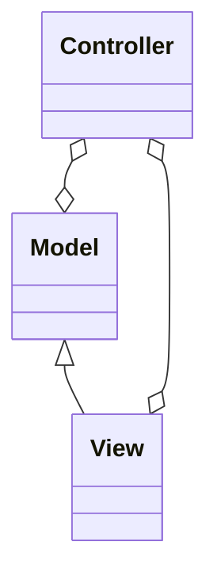
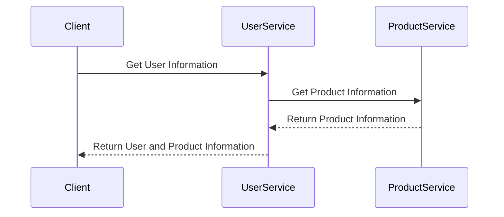
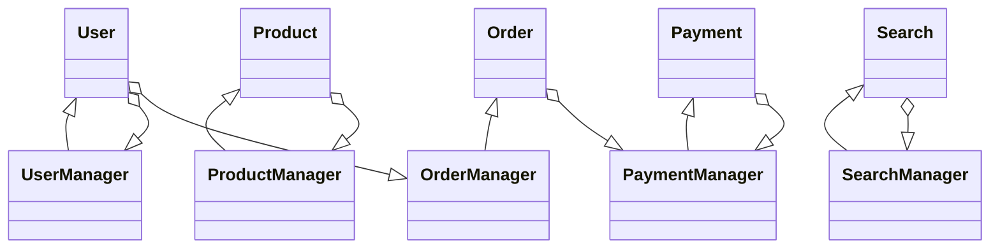
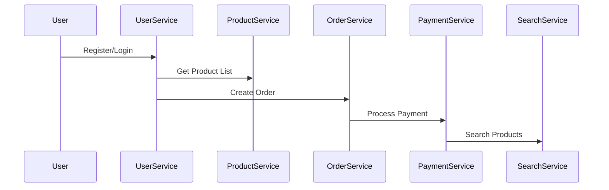
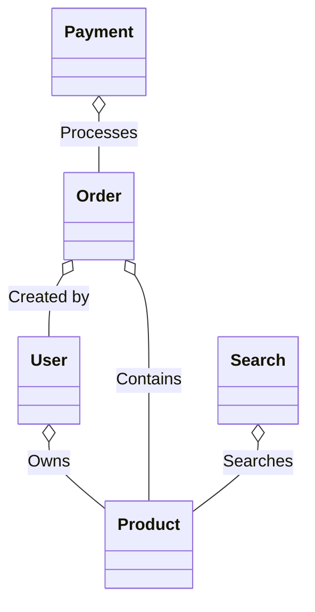

                 


### 引言

#### 软件架构的重要性

软件架构是软件开发过程中的核心概念，它决定了软件系统的整体结构和运行效率。一个优秀的软件架构不仅能够满足当前的需求，还能应对未来可能的变更。软件架构的重要性体现在以下几个方面：

首先，软件架构是系统的“骨架”，它为软件系统的设计与实现提供了清晰的框架和指导。通过定义组件之间的交互关系和层次结构，软件架构可以帮助开发者更好地理解系统的整体结构和功能。

其次，软件架构对于系统的可维护性和扩展性至关重要。良好的架构设计可以降低系统的复杂度，使得开发者能够更轻松地修改和扩展系统功能。相反，糟糕的架构会导致系统代码混乱、难以维护，甚至可能影响系统的稳定性。

最后，软件架构对系统的性能和安全性也有着重要影响。通过合理的架构设计，可以提高系统的响应速度和处理能力，同时减少潜在的漏洞和风险。

#### 软件架构与软件工程的关系

软件架构是软件工程的重要组成部分，它贯穿于整个软件生命周期。从需求分析到设计、开发、测试和部署，软件架构始终扮演着关键角色。

在需求分析阶段，软件架构师需要与利益相关者进行沟通，理解业务需求和系统功能，为后续的架构设计奠定基础。

在设计阶段，软件架构师根据需求分析的结果，制定系统的总体架构方案。这个阶段需要综合考虑技术可行性、性能要求、可维护性和扩展性等因素。

在开发阶段，开发者根据架构设计进行具体编码实现。良好的架构设计可以提高开发效率，减少重复劳动。

在测试阶段，测试团队需要验证系统是否符合架构设计的要求，确保系统的稳定性和性能。

在部署阶段，架构设计的影响依然存在。合理的部署方案可以确保系统的高可用性和安全性。

#### 适应不同项目的架构风格

不同的项目具有不同的需求和技术背景，因此选择适合的架构风格至关重要。常见的架构风格包括组件架构、模式驱动架构等。

组件架构风格通过将系统划分为独立的组件，使得每个组件可以独立开发、测试和部署。这种风格适用于大型复杂系统，可以提高开发效率和系统可维护性。

模式驱动架构风格则通过使用预先定义的模式来指导系统设计，使得系统能够快速响应需求变更。这种风格适用于需求变化频繁的项目。

在本章中，我们将详细介绍这些架构风格的特点、优缺点以及适用场景。通过对比分析，读者可以更好地理解不同架构风格的优势和局限性，从而选择适合自己项目的架构方案。

## 2. 软件架构风格概述

在软件架构领域，有多种不同的架构风格，每种风格都有其独特的特点和适用场景。本节将介绍两种主要的架构风格：组件架构风格和模式驱动架构风格。

### 2.1 组件架构风格

组件架构风格是软件开发中广泛应用的一种架构风格。它将系统划分为多个独立的组件，每个组件具有明确的功能和接口。组件之间通过接口进行通信，组件内部则独立实现其功能。

#### 组件架构的特点

1. **模块化**：组件架构使系统具有高度的模块化，每个组件都可以独立开发、测试和部署。这提高了系统的可维护性和可扩展性。
2. **解耦**：组件之间通过接口进行通信，降低了组件之间的依赖关系，从而提高了系统的灵活性和可重用性。
3. **可复用性**：由于组件是独立的，因此可以方便地在不同项目中复用。
4. **独立部署**：组件可以独立部署，这意味着可以针对特定组件进行性能优化或故障修复，而不会影响其他组件。

#### 主要组件架构风格

1. **层次化架构**：层次化架构将系统分为多个层次，每个层次负责不同的功能。例如，常用的三层架构包括表示层、业务逻辑层和数据访问层。
2. **微服务架构**：微服务架构将系统划分为多个微服务，每个微服务负责独立的功能模块。这种风格适用于大型、复杂、分布式系统。

#### 组件架构的优缺点

**优点**：
- 高度模块化，提高系统的可维护性和可扩展性。
- 低耦合，提高系统的灵活性和可重用性。
- 独立部署，方便进行性能优化和故障修复。

**缺点**：
- 设计和实现复杂，需要严格定义组件接口和通信协议。
- 系统整体性能可能受到组件通信的影响。

### 2.2 模式驱动架构风格

模式驱动架构风格是一种以模式为驱动的系统设计方法。模式是解决特定问题的通用解决方案，它可以被复用在不同的项目中。模式驱动架构风格通过使用预先定义的模式来指导系统设计。

#### 模式驱动的概念

模式驱动架构风格的核心是模式。模式是一组规则和指导原则，用于定义系统中的组件、交互和行为。模式可以涵盖系统设计的各个方面，如数据结构、流程控制、通信机制等。

#### 模式驱动的架构风格

1. **设计模式**：设计模式是针对特定设计问题的解决方案。例如，单例模式确保一个类只有一个实例，工厂模式用于创建对象实例。
2. **架构模式**：架构模式是针对特定类型的系统或应用程序的解决方案。例如，MVC模式用于构建用户界面，微服务架构适用于分布式系统。

#### 模式驱动的应用场景

模式驱动架构风格适用于需求变化频繁、系统复杂度较高的项目。通过使用预先定义的模式，可以快速响应需求变更，同时保证系统的稳定性和可维护性。

### 2.3 软件架构风格的选择

选择适合项目的架构风格是软件架构设计的关键步骤。以下是一些考虑因素：

1. **项目需求**：项目需求的变化频率和规模直接影响架构风格的选择。需求变化频繁的项目适合模式驱动架构风格，而需求相对稳定的项目则适合组件架构风格。
2. **系统规模**：系统规模较大、复杂度较高时，层次化架构和微服务架构是较好的选择。这些架构风格能够降低系统的复杂度，提高可维护性和可扩展性。
3. **开发团队经验**：开发团队对特定架构风格的经验和熟练度也是选择架构风格的重要因素。具有丰富经验的团队可以更好地应对复杂的架构设计挑战。

在本章的后续部分，我们将进一步探讨软件架构的设计原则与模式，以及如何评估和优化软件架构。通过深入分析这些内容，读者可以更好地理解软件架构的精髓，为实际项目选择合适的架构方案。

## 3. 软件架构的设计原则与模式

在设计软件架构时，遵循一些基本原则和模式能够帮助开发者构建稳定、高效和可扩展的系统。本节将介绍软件架构设计的基本原则和常见的架构模式，以便读者能够更好地理解和应用。

### 3.1 软件架构设计原则

软件架构设计原则是构建高质量软件架构的基础，以下是一些关键原则：

#### 3.1.1 模块化

模块化是将系统划分为若干独立的功能模块，每个模块负责特定的功能。模块化可以提高系统的可维护性和可复用性。模块之间通过清晰的接口进行通信，从而降低模块之间的依赖关系。

#### 3.1.2 分层

分层是将系统划分为多个层次，每个层次负责不同的功能。常用的三层架构包括表示层、业务逻辑层和数据访问层。分层设计有助于降低系统复杂度，提高系统的可扩展性和可维护性。

#### 3.1.3 可复用性

可复用性是指系统组件可以在多个项目中重复使用。通过设计可复用的组件，可以提高开发效率，减少重复劳动。可复用性通常通过定义明确的接口和抽象类来实现。

#### 3.1.4 松耦合

松耦合是指组件之间的依赖关系较弱。松耦合可以提高系统的灵活性和可扩展性，因为组件可以独立开发、测试和部署。实现松耦合通常通过定义清晰的接口和最小化组件间的直接依赖关系。

#### 3.1.5 可扩展性

可扩展性是指系统能够方便地添加新功能或扩展现有功能。通过设计灵活的架构和可插拔的组件，可以方便地实现系统的扩展。

#### 3.1.6 可维护性

可维护性是指系统能够在出现问题时快速修复，并能够适应未来的变更。良好的架构设计可以提高系统的可维护性，减少维护成本。

### 3.2 软件架构模式

软件架构模式是解决特定问题的通用解决方案，它为系统设计提供了指导。以下是一些常见的架构模式：

#### 3.2.1 设计模式

设计模式是针对特定设计问题的解决方案。设计模式分为三种类型：创建型、结构型和行为型。

- **创建型模式**：这类模式主要关注对象创建的过程，如工厂模式、单例模式和抽象工厂模式。
- **结构型模式**：这类模式主要关注类和对象之间的组合，如代理模式、桥接模式和装饰器模式。
- **行为型模式**：这类模式主要关注对象之间的交互和通信，如策略模式、观察者模式和责任链模式。

#### 3.2.2 架构模式

架构模式是针对特定类型的系统或应用程序的解决方案，如MVC模式、微服务架构模式和RESTful架构模式。

- **MVC模式**：MVC（Model-View-Controller）模式是一种常用的前端架构模式，用于构建用户界面。它将系统的功能划分为模型、视图和控制器三个部分。
- **微服务架构模式**：微服务架构模式是一种分布式系统架构，将系统划分为多个独立的微服务，每个微服务负责独立的功能模块。
- **RESTful架构模式**：RESTful架构模式是一种基于HTTP协议的Web服务架构风格，它定义了资源的表示、传输和交互方式。

### 3.2.3 常见架构模式详解

在本小节中，我们将详细探讨一些常见架构模式，并使用Mermaid流程图和Python源代码进行说明。

#### 3.2.3.1 单例模式

单例模式确保一个类只有一个实例，并提供一个全局访问点。以下是一个Python实现示例：

```python
class Singleton:
    _instance = None
    
    def __new__(cls, *args, **kwargs):
        if not cls._instance:
            cls._instance = super().__new__(cls, *args, **kwargs)
        return cls._instance

singleton = Singleton()
```

#### 3.2.3.2 工厂模式

工厂模式用于创建对象实例，而不需要指定具体类。以下是一个Python实现示例：

```python
class Factory:
    def create_object(self, class_name):
        return eval(class_name)()

class ProductA:
    def operation(self):
        return "Product A"

class ProductB:
    def operation(self):
        return "Product B"

factory = Factory()
product_a = factory.create_object("ProductA")
product_b = factory.create_object("ProductB")
```

#### 3.2.3.3 MVC模式

MVC模式将系统的功能划分为模型、视图和控制器三个部分。以下是一个简单的Mermaid类图示例：



#### 3.2.3.4 微服务架构模式

微服务架构模式将系统划分为多个独立的微服务，每个微服务负责独立的功能模块。以下是一个简单的Mermaid架构图示例：



通过以上对软件架构设计原则和模式的详细讲解，读者可以更好地理解如何在实际项目中应用这些原则和模式，从而构建高质量的软件架构。

### 4. 软件架构评估与优化

在软件架构设计中，评估和优化架构是确保系统质量的重要环节。本节将介绍软件架构评估的方法、优化策略以及具体案例分析。

#### 4.1 软件架构评估方法

评估软件架构的主要目的是确定架构是否满足需求、是否具有良好的性能、是否易于维护和扩展等。以下是一些常用的评估方法：

1. **架构评估指标**：架构评估指标是衡量软件架构质量的关键因素。常见的评估指标包括模块化程度、耦合度、可扩展性、性能等。
2. **架构评估工具**：架构评估工具可以帮助自动化地评估架构的质量。常见的工具包括架构探索器（Architecture Explorer）、Architecture Analysis and Design Language（AADL）等。
3. **专家评审**：专家评审是一种通过专家意见来评估架构质量的方法。专家评审通常包括架构师、项目经理和开发人员等，他们可以从不同角度对架构进行评估。

#### 4.2 软件架构优化策略

架构优化是指通过调整系统架构来提高其性能、可维护性和扩展性。以下是一些常见的架构优化策略：

1. **性能优化**：性能优化是指通过改进算法、减少资源消耗和优化系统结构来提高系统性能。常见的方法包括缓存策略、负载均衡和数据库优化等。
2. **模块化与解耦**：模块化和解耦是提高系统可维护性和可扩展性的关键策略。通过将系统划分为独立的功能模块，可以降低模块之间的依赖关系，从而提高系统的灵活性和可维护性。
3. **重构**：重构是指在不改变系统外部行为的前提下，改进系统的内部结构和代码质量。通过重构，可以消除代码中的冗余和重复，提高代码的可读性和可维护性。
4. **微服务化**：微服务化是将大型单体应用分解为多个小型服务的过程。通过微服务化，可以降低系统的复杂度，提高系统的可扩展性和可维护性。

#### 4.3 优化案例分析

以下是一个针对电商系统的架构优化案例分析。

##### 4.3.1 系统需求分析

电商系统的需求主要包括商品管理、订单管理、用户管理和支付系统等。随着业务的发展，系统的用户量和交易量不断增加，系统性能面临严峻挑战。

##### 4.3.2 架构评估

1. **模块化程度**：电商系统的模块化程度较低，业务逻辑分散在不同模块中，导致代码冗余和可维护性差。
2. **耦合度**：系统中的模块之间存在较强的依赖关系，导致系统难以扩展和维护。
3. **性能**：系统的响应速度较慢，特别是在高峰期，系统容易出现性能瓶颈。

##### 4.3.3 优化方案

1. **模块化与解耦**：将系统划分为多个独立的微服务，每个微服务负责特定的功能模块，如商品管理微服务、订单管理微服务和支付微服务。通过定义清晰的接口和减少模块间的直接依赖，提高系统的灵活性和可维护性。
2. **性能优化**：引入缓存策略，如Redis缓存，减少数据库访问次数，提高系统的响应速度。同时，使用负载均衡器（如Nginx）来分发用户请求，确保系统在高并发情况下能够稳定运行。
3. **数据库优化**：对数据库进行分区和索引优化，提高数据库查询性能。同时，采用读写分离策略，将读操作和写操作分离到不同的数据库实例上，提高系统的并发处理能力。

##### 4.3.4 优化效果

通过上述优化方案，电商系统的性能得到了显著提升。模块化与解耦使得系统的可维护性大大提高，开发团队可以更快速地响应业务需求。性能优化策略确保了系统在高并发情况下的稳定性，用户满意度得到了提升。

#### 4.4 总结

软件架构评估与优化是确保系统质量的关键环节。通过合理的评估方法和优化策略，可以构建高质量、高性能和可扩展的系统。在本节中，我们介绍了软件架构评估的方法、优化策略以及具体案例分析，为读者提供了实用的参考。

## 5. 项目实践：从需求到架构设计

软件架构设计是一个复杂而系统的过程，需要从需求分析开始，逐步进行架构设计，最终实现并验证架构的有效性。本节将详细描述一个电商项目的架构设计过程，从需求分析到架构设计，并提供一个实际案例的详细剖析。

### 5.1 需求分析与建模

在开始架构设计之前，首先要明确项目的需求。对于电商项目，需求主要包括以下几个方面：

1. **用户管理**：包括用户注册、登录、个人信息管理等功能。
2. **商品管理**：包括商品分类、商品信息展示、库存管理等功能。
3. **订单管理**：包括订单创建、订单查询、订单支付等功能。
4. **支付系统**：包括支付接口、退款处理等功能。
5. **搜索功能**：提供商品搜索功能，支持关键词搜索和过滤。

#### 需求建模

在需求分析阶段，可以通过使用类图来描述系统的领域模型。以下是一个简单的Mermaid类图示例，用于表示电商系统的主要类及其关系：



在这个类图中，`User`、`Product`、`Order`、`Payment`和`Search`是主要实体类，`UserManager`、`ProductManager`、`OrderManager`、`PaymentManager`和`SearchManager`是相应的业务服务类。

### 5.2 架构设计过程

架构设计过程通常包括以下几个步骤：

#### 5.2.1 架构设计策略

在架构设计过程中，需要根据项目的需求、技术背景和团队经验，选择合适的架构风格和设计策略。对于电商项目，我们选择微服务架构风格，将系统划分为多个独立的微服务，每个微服务负责特定的业务功能。

1. **用户管理服务**：处理用户注册、登录和用户信息管理。
2. **商品管理服务**：处理商品分类、商品信息展示和库存管理。
3. **订单管理服务**：处理订单创建、订单查询和订单支付。
4. **支付服务**：处理支付接口和退款处理。
5. **搜索服务**：处理商品搜索功能。

#### 5.2.2 架构设计工具

在架构设计过程中，可以使用各种工具来辅助设计和文档化。常用的工具包括UML建模工具（如Visual Paradigm、Enterprise Architect）、Mermaid图库和Swagger接口文档工具等。

#### 5.2.3 架构设计案例分析

以下是一个简单的Mermaid架构图示例，用于表示电商系统的整体架构：



在这个架构图中，`User`表示用户，`UserService`、`ProductService`、`OrderService`、`PaymentService`和`SearchService`分别表示对应的微服务。

### 5.3 系统功能设计

在架构设计的基础上，接下来是系统功能设计的具体实现。系统功能设计包括领域模型、接口设计和序列图等。

#### 5.3.1 领域模型

领域模型是系统功能的核心，用于描述系统中各个实体及其关系。以下是一个简单的Mermaid类图示例，用于表示电商系统的领域模型：



在这个领域模型中，`User`是用户实体，`Product`是商品实体，`Order`是订单实体，`Payment`是支付实体，`Search`是搜索实体。

#### 5.3.2 系统架构设计

系统架构设计包括系统架构图和接口设计。以下是一个简单的Mermaid架构图示例，用于表示电商系统的系统架构：


在这个架构图中，`User`通过`UserService`与系统进行交互，`ProductService`处理商品相关操作，`OrderService`处理订单相关操作，`PaymentService`处理支付相关操作，`SearchService`处理搜索相关操作。

#### 5.3.3 系统接口设计和序列图

系统接口设计用于描述各个服务之间的交互接口。以下是一个简单的Mermaid序列图示例，用于表示电商系统的接口设计：


在这个序列图中，用户通过`UserService`进行注册或登录，`UserService`调用`ProductService`获取商品列表，用户通过`OrderService`创建订单，`OrderService`调用`PaymentService`处理支付，`PaymentService`调用`SearchService`进行商品搜索。

### 5.4 系统实现

在完成架构设计和接口设计后，接下来是具体的系统实现。以下是一个简单的Python代码示例，用于实现用户注册功能：

```python
class UserService:
    def register(self, user_data):
        # 注册逻辑
        print(f"User {user_data['username']} registered successfully.")
        return True

user_service = UserService()
user_data = {'username': 'john_doe', 'password': 'password123'}
user_service.register(user_data)
```

在这个代码中，`UserService`类有一个`register`方法，用于处理用户注册逻辑。

### 5.5 系统验证与优化

在系统实现后，需要进行系统验证，以确保系统功能符合预期。验证过程包括单元测试、集成测试和性能测试等。在验证过程中，如果发现系统性能瓶颈或功能缺陷，需要根据实际情况进行优化。

### 5.6 小结

通过以上步骤，我们从需求分析开始，逐步进行了架构设计、系统功能设计和系统实现，并对系统进行了验证和优化。这个案例展示了如何将软件架构设计应用于实际项目，为读者提供了实用的经验和参考。

## 6. 软件架构风格选择案例分析

在软件架构设计中，选择合适的架构风格对于项目的成功至关重要。本节将通过两个实际案例，分析不同架构风格在电商系统和移动APP开发中的应用和效果。

### 6.1 案例一：电商系统

#### 6.1.1 系统需求分析

电商系统是一个复杂的应用，其核心需求包括用户管理、商品管理、订单管理、支付系统以及搜索功能。随着用户量和交易量的增加，系统需要具备良好的扩展性、性能和可维护性。

#### 6.1.2 架构风格选择

1. **组件架构风格**：由于电商系统需求复杂，不同模块之间需要独立开发和部署。组件架构风格通过将系统划分为多个独立组件（如用户管理、商品管理、订单管理等），使得每个组件可以独立开发、测试和部署，从而提高系统的可维护性和扩展性。
2. **微服务架构风格**：考虑到电商系统未来可能需要扩展到更多功能模块，如物流、营销等，微服务架构风格是一个较好的选择。微服务架构通过将系统划分为多个独立的微服务（如用户管理服务、商品管理服务、订单管理服务等），每个微服务负责独立的功能模块，使得系统能够灵活扩展和应对变化。

#### 6.1.3 架构设计实现

1. **用户管理服务**：负责用户注册、登录和权限管理。
2. **商品管理服务**：负责商品分类、信息展示和库存管理。
3. **订单管理服务**：负责订单创建、订单查询和订单支付。
4. **支付服务**：负责支付接口和退款处理。
5. **搜索服务**：负责商品搜索功能。

在实现过程中，各个服务通过RESTful API进行通信，使用分布式缓存（如Redis）提高系统性能，并采用消息队列（如Kafka）处理异步任务，确保系统的高并发处理能力。

#### 6.1.4 架构效果

通过组件架构和微服务架构的结合应用，电商系统具备了以下优势：

- **高扩展性**：每个服务都可以独立扩展，满足未来业务需求。
- **高性能**：通过分布式缓存和消息队列，提高了系统的响应速度和处理能力。
- **高可维护性**：组件化和微服务化使得系统代码清晰、易于维护。

### 6.2 案例二：移动APP开发

#### 6.2.1 系统需求分析

移动APP开发通常涉及用户界面、后台服务和数据存储等方面。其核心需求包括用户登录、个人信息管理、商品浏览、购物车管理和支付功能。

#### 6.2.2 架构风格选择

1. **MVC架构风格**：MVC（Model-View-Controller）架构风格是一种常用的移动应用架构。它将系统划分为模型（Model）、视图（View）和控制器（Controller）三个部分，使得代码结构清晰、易于维护。
   - **模型（Model）**：负责处理应用程序的数据和业务逻辑。
   - **视图（View）**：负责展示应用程序的用户界面。
   - **控制器（Controller）**：负责处理用户输入和业务逻辑。

2. **组件化架构风格**：对于移动APP开发，组件化架构风格也是一个较好的选择。通过将应用划分为多个独立组件（如用户模块、商品模块、支付模块等），可以提高开发效率和代码复用性。

#### 6.2.3 架构设计实现

1. **用户模块**：负责用户登录、注册和个人信息管理。
2. **商品模块**：负责商品浏览、商品详情展示和购物车管理。
3. **支付模块**：负责支付接口和支付流程处理。

在实现过程中，使用React Native框架进行前端开发，使用RESTful API进行前后端通信，使用SQLite数据库进行数据存储。

#### 6.2.4 架构效果

通过MVC架构和组件化架构的应用，移动APP开发项目获得了以下优势：

- **高可维护性**：清晰的代码结构使得维护和扩展更加容易。
- **高效开发**：组件化架构提高了开发效率，减少了重复劳动。
- **高质量的用户体验**：MVC架构使得用户界面和业务逻辑分离，确保了高质量的UI交互体验。

### 6.3 总结

通过电商系统和移动APP开发的案例，我们可以看到，不同的架构风格在不同场景中的应用效果。组件架构和微服务架构适用于复杂、需求多变的大型系统，而MVC架构和组件化架构则适用于移动应用开发，能够提高系统的可维护性和开发效率。选择适合的架构风格是成功项目的关键。

## 7. 总结与展望

### 7.1 软件架构发展趋势

软件架构领域的发展日新月异，未来将呈现出以下几大趋势：

1. **微服务架构**：微服务架构因其灵活性和可扩展性，成为现代分布式系统的首选架构。随着容器技术（如Docker和Kubernetes）的成熟，微服务架构的应用将更加广泛。
2. **云原生架构**：云原生架构利用云平台提供的高可用性和弹性，通过无状态服务和动态伸缩等特性，使得应用能够更好地应对负载波动。
3. **Serverless架构**：Serverless架构通过减少服务器管理的复杂性，使得开发者能够专注于业务逻辑的开发，降低运维成本。
4. **分布式系统**：分布式系统架构将数据和处理能力分布在多个节点上，提高了系统的容错性和可扩展性。
5. **AI驱动的架构**：随着人工智能技术的发展，AI驱动的架构将逐渐融入软件架构设计中，为系统提供智能化的决策支持和优化。

### 7.2 对软件架构师的建议

对于软件架构师来说，以下是一些建议，以应对未来架构设计的挑战：

1. **持续学习**：软件架构领域发展迅速，架构师需要不断学习新技术和新理念，以保持竞争力。
2. **关注系统质量**：在追求速度和功能的同时，要注重系统的质量，确保系统具备良好的可维护性和可扩展性。
3. **沟通协作**：架构师需要与项目团队和利益相关者保持良好的沟通，确保架构设计符合业务需求和团队能力。
4. **实践驱动**：通过实际项目实践，不断总结和优化架构设计，提高架构设计的实际效果。
5. **灵活应变**：在面对需求变化和技术挑战时，架构师需要具备灵活应变的能力，能够快速调整架构设计，确保项目的成功。

### 7.3 对读者的期望

希望读者通过本文的阅读，能够：

1. **深入理解**：对软件架构的核心概念和设计原则有更深刻的理解。
2. **掌握方法**：学会如何评估和优化软件架构，为实际项目选择合适的架构方案。
3. **实践应用**：将所学知识应用于实际项目，提高软件架构设计的能力和水平。
4. **持续进步**：不断学习新技术和新理念，保持对软件架构领域的热情和关注。

通过本文的阐述，希望读者能够更好地理解软件架构的重要性，掌握不同架构风格的应用场景，并在实际项目中做出明智的决策，为项目的成功奠定坚实基础。

## 7.4 拓展阅读

对于希望进一步深入了解软件架构的读者，以下是一些推荐的阅读材料：

1. **《软件架构：实践者的研究方法》** - Richard N. Taylor, David R. Brown, and Eric M. Dashofy
2. **《微服务架构设计》** - Martin Fowler
3. **《架构整洁之道》** - Jack Bauer
4. **《云原生架构》** - Docker公司
5. **《AI驱动架构》** - Andrew Ng和Kirk Bresnik

这些书籍和资源将帮助读者在软件架构领域取得更高的成就。

### 作者信息

**作者：AI天才研究院/AI Genius Institute & 禅与计算机程序设计艺术 /Zen And The Art of Computer Programming**

