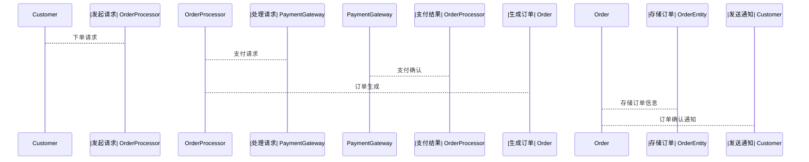
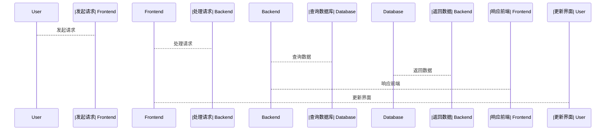

                 


# 软件测试策略：构建高质量的测试金字塔

## 关键词：软件测试、测试金字塔、单元测试、集成测试、系统测试、测试策略、性能测试、测试管理

## 摘要：
本文深入探讨了软件测试的策略，重点介绍了构建高质量的测试金字塔的方法。我们将从基础概念开始，逐步分析不同层次的测试，包括单元测试、集成测试和系统测试，并探讨如何优化测试策略。文章还将涉及自动化测试、性能测试和测试管理，并提供实际案例和最佳实践，旨在帮助读者全面理解并应用软件测试的策略，确保软件质量的持续提升。

## 目录

1. **软件测试概述**
   1.1 测试的重要性
   1.2 测试类型与方法
   1.3 测试流程
   1.4 测试阶段与质量保障

2. **测试金字塔**

   2.1 测试金字塔概念
   2.2 测试金字塔层级
   2.3 测试金字塔的好处

3. **单元测试**

   3.1 单元测试原则
   3.2 单元测试工具
   3.3 单元测试实践

4. **集成测试**

   4.1 集成测试原则
   4.2 集成测试策略
   4.3 集成测试实践

5. **系统测试**

   5.1 系统测试原则
   5.2 系统测试类型
   5.3 系统测试实践

6. **测试策略设计**

   6.1 测试策略原则
   6.2 测试策略制定
   6.3 测试策略实施

7. **自动化测试**

   7.1 自动化测试概述
   7.2 自动化测试工具
   7.3 自动化测试实践

8. **性能测试**

   8.1 性能测试概述
   8.2 性能测试指标
   8.3 性能测试实践

9. **测试管理**

   9.1 测试管理概述
   9.2 测试团队构建
   9.3 测试项目管理

10. **测试实践案例**

    10.1 案例一：Web应用测试
    10.2 案例二：移动应用测试
    10.3 案例三：大型系统测试

11. **最佳实践与技巧**

    11.1 最佳实践
    11.2 测试技巧
    11.3 注意事项与风险防范

12. **未来发展趋势**

    12.1 测试技术趋势
    12.2 测试团队角色转变
    12.3 测试的未来

## 第一部分：软件测试基础

### 第1章：软件测试概述

#### 1.1 测试的重要性

软件测试是软件开发过程中不可或缺的一部分。它不仅仅是为了发现和修复缺陷，更重要的是确保软件的质量和可靠性。随着软件复杂度的增加，测试的重要性愈发凸显。

首先，测试可以识别出软件中的缺陷，从而提高软件的质量。缺陷的存在可能会导致软件在运行时出现错误，影响用户体验，甚至可能导致经济损失。

其次，测试可以帮助发现潜在的问题，这些潜在的问题可能在未来导致更严重的故障。通过早期发现并修复这些问题，可以减少后期修复的成本。

此外，测试还可以提高软件的可维护性。良好的测试用例文档可以帮助开发人员更好地理解软件的工作原理，从而更容易进行维护和改进。

#### 1.2 测试类型与方法

软件测试可以分为多种类型，包括单元测试、集成测试、系统测试和性能测试等。

- **单元测试**：针对软件中的最小可测试单元进行测试，通常是单个函数或方法。

- **集成测试**：测试不同模块之间的接口和交互，确保它们能够正确地协同工作。

- **系统测试**：对整个系统进行测试，确保它满足规格要求，能够正常运行。

- **性能测试**：测试软件的性能，包括响应时间、吞吐量和并发处理能力等。

常用的测试方法包括黑盒测试、白盒测试、灰盒测试、静态测试和动态测试等。

#### 1.3 测试流程

软件测试通常包括以下步骤：

1. **需求分析**：理解软件需求，确定测试目标。
2. **测试设计**：设计测试用例，包括输入数据、预期结果和实际结果的比较。
3. **测试执行**：执行测试用例，记录结果。
4. **缺陷跟踪**：记录发现的缺陷，跟踪缺陷的修复过程。
5. **测试报告**：编写测试报告，总结测试结果。

#### 1.4 测试阶段与质量保障

软件测试可以在不同的开发阶段进行，包括需求分析阶段、设计阶段、编码阶段和测试阶段。

- **需求分析阶段**：测试主要集中在需求文档上，确保需求清晰且可测试。

- **设计阶段**：测试设计文档，确保设计符合需求。

- **编码阶段**：进行单元测试和集成测试，确保代码质量。

- **测试阶段**：进行系统测试和性能测试，确保软件满足规格要求。

质量保障是软件测试的核心目标。通过严格的测试流程和高效的测试策略，可以确保软件的质量，提高用户满意度。

### 第2章：测试金字塔

#### 2.1 测试金字塔概念

测试金字塔是一种测试策略，它强调在不同的测试层级上分配测试工作，以构建高质量的软件。

测试金字塔包括三个层次：单元测试、集成测试和系统测试。

- **单元测试**：最底层的测试，针对软件的最小可测试单元进行。
- **集成测试**：中层测试，测试不同模块之间的接口和交互。
- **系统测试**：最高层测试，测试整个系统，确保它满足规格要求。

#### 2.2 测试金字塔层级

测试金字塔的层级结构决定了测试的优先级和比例。通常，单元测试的比例应该最大，其次是集成测试，系统测试的比例最小。

这种层级结构的原因是：

- 单元测试可以发现和修复最底层的代码问题，有助于提高代码质量。
- 集成测试可以发现和修复中层的问题，确保模块之间的交互正确。
- 系统测试可以发现和修复顶层的问题，确保整个系统能够正常运行。

#### 2.3 测试金字塔的好处

构建高质量的测试金字塔有以下好处：

- **提高代码质量**：通过单元测试，可以确保每个函数或方法都按预期工作。
- **降低测试成本**：测试金字塔有助于优化测试资源的分配，降低测试成本。
- **提高测试效率**：测试金字塔可以确保测试覆盖全面，提高测试效率。
- **提高软件可靠性**：通过多层测试，可以确保软件在不同层面上都达到质量标准。

## 第二部分：测试策略与优化

### 第3章：单元测试

#### 3.1 单元测试原则

单元测试应遵循以下原则：

- **独立性**：每个测试用例都应该独立，不受其他测试用例的影响。
- **完整性**：测试用例应覆盖所有可能的输入和输出情况。
- **简洁性**：测试用例应尽可能简洁，避免冗余。
- **可重复性**：测试用例应在任何时间和环境下都能重复执行。

#### 3.2 单元测试工具

常见的单元测试工具有JUnit、TestNG、NUnit等。这些工具可以帮助自动化单元测试，提高测试效率。

#### 3.3 单元测试实践

编写单元测试时，应遵循以下步骤：

1. **定义测试用例**：确定测试用例的输入、预期结果和实际结果。
2. **编写测试代码**：使用测试工具编写测试代码，确保测试用例的执行。
3. **执行测试**：运行测试用例，记录结果。
4. **分析结果**：对比实际结果和预期结果，发现和修复缺陷。

### 第4章：集成测试

#### 4.1 集成测试原则

集成测试应遵循以下原则：

- **逐步集成**：逐步将新的模块集成到系统中，确保每个模块都能正常工作。
- **独立性**：每个模块都应该能够独立工作，不依赖于其他模块。
- **覆盖率**：测试用例应覆盖所有模块之间的交互点。

#### 4.2 集成测试策略

集成测试策略包括以下步骤：

1. **制定测试计划**：确定测试的目标、范围和进度。
2. **设计测试用例**：根据模块之间的交互设计测试用例。
3. **执行测试**：执行测试用例，记录结果。
4. **分析结果**：对比实际结果和预期结果，发现和修复缺陷。

#### 4.3 集成测试实践

执行集成测试时，应遵循以下步骤：

1. **准备测试环境**：搭建测试环境，确保所有模块都能正常运行。
2. **执行测试用例**：执行测试用例，记录结果。
3. **分析结果**：分析测试结果，发现和修复缺陷。
4. **回归测试**：在修复缺陷后，重新执行测试用例，确保缺陷已被修复。

### 第5章：系统测试

#### 5.1 系统测试原则

系统测试应遵循以下原则：

- **完整性**：测试用例应覆盖所有功能点和性能指标。
- **可重复性**：测试用例应在任何时间和环境下都能重复执行。
- **独立性**：每个测试用例都应该独立，不受其他测试用例的影响。

#### 5.2 系统测试类型

系统测试包括以下类型：

- **功能测试**：测试软件的功能是否符合规格要求。
- **性能测试**：测试软件的性能，如响应时间、吞吐量和并发处理能力等。
- **安全测试**：测试软件的安全性，确保数据不会被未授权访问。
- **兼容性测试**：测试软件在不同平台和环境中是否正常运行。

#### 5.3 系统测试实践

执行系统测试时，应遵循以下步骤：

1. **制定测试计划**：确定测试的目标、范围和进度。
2. **设计测试用例**：根据系统功能和性能要求设计测试用例。
3. **执行测试**：执行测试用例，记录结果。
4. **分析结果**：对比实际结果和预期结果，发现和修复缺陷。
5. **测试报告**：编写测试报告，总结测试结果。

## 第三部分：测试策略与优化

### 第6章：测试策略设计

#### 6.1 测试策略原则

测试策略应遵循以下原则：

- **全面性**：测试策略应覆盖软件的各个层面，确保所有功能都得到测试。
- **灵活性**：测试策略应根据项目的实际情况进行调整。
- **可执行性**：测试策略应具有可执行性，确保测试能够顺利实施。

#### 6.2 测试策略制定

制定测试策略时，应考虑以下因素：

- **项目需求**：根据项目需求确定测试的重点和范围。
- **开发进度**：根据开发进度安排测试计划，确保测试及时进行。
- **团队协作**：确保测试团队与其他团队紧密合作，确保测试与开发同步进行。

#### 6.3 测试策略实施

实施测试策略时，应遵循以下步骤：

1. **制定测试计划**：明确测试的目标、范围和进度。
2. **设计测试用例**：根据测试计划设计测试用例。
3. **执行测试**：执行测试用例，记录结果。
4. **缺陷管理**：记录和跟踪缺陷，确保缺陷得到及时修复。
5. **测试评估**：评估测试效果，优化测试策略。

### 第7章：自动化测试

#### 7.1 自动化测试概述

自动化测试是指使用自动化工具执行测试，以提高测试效率和准确性。自动化测试可以减少重复性工作，降低测试成本，提高测试覆盖率。

#### 7.2 自动化测试工具

常见的自动化测试工具有Selenium、JMeter、Appium等。这些工具可以用于Web应用、性能测试和移动应用测试等。

#### 7.3 自动化测试实践

实施自动化测试时，应遵循以下步骤：

1. **选择合适的工具**：根据项目需求和测试目标选择合适的自动化测试工具。
2. **编写测试脚本**：编写测试脚本，实现测试用例的自动化执行。
3. **执行自动化测试**：运行测试脚本，记录结果。
4. **维护测试脚本**：定期更新测试脚本，确保测试的持续有效性。

### 第8章：性能测试

#### 8.1 性能测试概述

性能测试是测试软件在各种负载下的性能，包括响应时间、吞吐量和并发处理能力等。性能测试有助于识别系统瓶颈，优化系统性能。

#### 8.2 性能测试指标

性能测试指标包括以下几种：

- **响应时间**：客户端请求到服务器响应的时间。
- **吞吐量**：单位时间内系统能够处理的请求量。
- **并发用户数**：同时在线的用户数量。
- **资源利用率**：系统资源的利用率，如CPU、内存和网络等。

#### 8.3 性能测试实践

执行性能测试时，应遵循以下步骤：

1. **确定测试目标**：根据项目需求和性能要求确定测试目标。
2. **设计测试场景**：设计模拟真实用户行为的测试场景。
3. **执行性能测试**：运行性能测试，记录性能指标。
4. **分析结果**：分析性能测试结果，识别瓶颈和优化点。
5. **性能优化**：根据分析结果进行系统优化，提高性能。

### 第9章：测试管理

#### 9.1 测试管理概述

测试管理是确保测试过程高效、有序进行的关键。测试管理包括测试计划、测试执行、缺陷管理、测试评估等。

#### 9.2 测试团队构建

构建测试团队时，应考虑以下因素：

- **人员技能**：测试团队应具备多样化的技能，包括自动化测试、性能测试和系统测试等。
- **团队协作**：测试团队应与其他团队紧密合作，确保测试与开发同步进行。
- **团队规模**：根据项目规模和测试需求确定团队规模。

#### 9.3 测试项目管理

测试项目管理是确保测试过程按照计划进行的关键。测试项目管理包括以下任务：

- **制定测试计划**：确定测试的目标、范围和进度。
- **分配测试任务**：根据人员技能和测试需求分配测试任务。
- **监控测试进度**：监控测试进度，确保测试按计划进行。
- **沟通与协调**：与开发团队和其他团队保持沟通，确保测试与开发同步进行。

### 第10章：测试实践案例

#### 10.1 案例一：Web应用测试

Web应用测试通常包括功能测试、性能测试和安全测试等。

- **功能测试**：测试Web应用的功能是否正常，如登录、注册、搜索等。
- **性能测试**：测试Web应用的性能，如响应时间、吞吐量和并发用户数等。
- **安全测试**：测试Web应用的安全性，如SQL注入、跨站脚本攻击等。

#### 10.2 案例二：移动应用测试

移动应用测试通常包括功能测试、兼容性测试和安全测试等。

- **功能测试**：测试移动应用的功能是否正常，如首页导航、购物车操作等。
- **兼容性测试**：测试移动应用在不同设备和操作系统上的兼容性。
- **安全测试**：测试移动应用的安全性，如数据加密、隐私保护等。

#### 10.3 案例三：大型系统测试

大型系统测试通常包括功能测试、性能测试、集成测试和安全测试等。

- **功能测试**：测试系统各个模块的功能是否正常，如订单管理、财务管理等。
- **性能测试**：测试系统的性能，如并发处理能力、响应时间等。
- **集成测试**：测试系统不同模块之间的接口和交互。
- **安全测试**：测试系统的安全性，如访问控制、数据加密等。

### 第11章：最佳实践与技巧

#### 11.1 最佳实践

以下是一些软件测试的最佳实践：

- **尽早开始测试**：在开发过程中尽早开始测试，确保缺陷得到及时修复。
- **持续集成**：将测试集成到持续集成流程中，确保测试与开发同步进行。
- **自动化测试**：优先进行自动化测试，提高测试效率和准确性。
- **缺陷管理**：建立完善的缺陷管理流程，确保缺陷得到及时修复。

#### 11.2 测试技巧

以下是一些测试技巧：

- **设计多样化的测试用例**：设计多样化的测试用例，确保测试覆盖全面。
- **利用工具**：充分利用各种测试工具，提高测试效率。
- **测试报告**：编写详细的测试报告，总结测试结果和发现的问题。

#### 11.3 注意事项与风险防范

以下是一些测试注意事项和风险防范：

- **风险识别**：在测试过程中及时识别风险，并采取措施进行防范。
- **测试环境**：确保测试环境与生产环境一致，避免因环境不一致导致的测试问题。
- **人员培训**：对测试人员进行专业培训，提高测试技能。

### 第12章：未来发展趋势

#### 12.1 测试技术趋势

未来的测试技术发展趋势包括：

- **AI技术在测试中的应用**：利用人工智能技术进行自动化测试、测试用例生成和缺陷预测等。
- **DevOps与测试的结合**：将测试与DevOps相结合，实现更高效、更可靠的软件交付。

#### 12.2 测试团队角色转变

未来的测试团队角色将发生转变：

- **测试工程师的角色扩展**：测试工程师将从传统的测试执行者转变为测试策划者、测试自动化工程师和测试架构师等。
- **测试团队的组织形式**：测试团队将更注重跨职能合作，实现敏捷开发和测试。

#### 12.3 测试的未来

未来的测试将更加智能化、自动化和高效。测试团队将更注重测试质量保障和用户体验，实现持续交付和高质量软件的交付。

## 结尾

软件测试是确保软件质量的关键环节。通过构建高质量的测试金字塔，采用合理的测试策略和优化方法，可以确保软件的可靠性、稳定性和高性能。随着测试技术的发展，测试团队的角色也将不断转变，以适应快速变化的软件开发环境。让我们共同努力，推动软件测试的不断进步，为用户提供更好的软件体验。

### 作者信息

作者：AI天才研究院/AI Genius Institute & 禅与计算机程序设计艺术 /Zen And The Art of Computer Programming 

### 背景介绍

#### 核心概念术语说明

在软件测试领域，有几个核心概念需要理解，包括：

- **软件测试**：指通过一系列方法和技术来评估软件系统的质量，确保它满足预期需求。
- **单元测试**：针对软件中的最小功能单元（如函数或方法）进行测试。
- **集成测试**：测试多个模块或组件之间的交互和协作。
- **系统测试**：在完整的系统环境下对整个软件系统进行测试，包括功能、性能和可靠性等方面。
- **测试金字塔**：一种测试策略，强调在软件的不同层次上分配测试工作，以构建高质量的软件。

#### 问题背景

随着软件系统的复杂性不断增加，传统的线性测试流程已经无法满足软件质量的要求。为了提高测试效率和质量，业界开始探讨如何通过优化测试策略来构建高质量的软件。测试金字塔作为一种有效的测试策略，得到了广泛的关注和应用。

#### 问题描述

测试金字塔的核心目标是构建一个层次分明的测试结构，以确保软件在各个层次上都能达到高质量的标准。然而，在实际应用中，如何合理构建测试金字塔，如何在不同层次上分配测试资源，以及如何确保测试的全面性和有效性，仍然是一个挑战。

#### 问题解决

构建高质量的测试金字塔需要遵循以下原则：

1. **层次分明**：将测试分为单元测试、集成测试和系统测试三个层次，每个层次都有明确的测试目标和范围。
2. **资源合理分配**：根据项目的实际情况，合理分配测试资源，确保在各个层次上都有足够的测试覆盖。
3. **自动化**：利用自动化测试工具和框架，提高测试效率，减少人工测试的负担。
4. **持续集成**：将测试集成到持续集成（CI）和持续部署（CD）流程中，确保测试与开发同步进行。

#### 边界与外延

测试金字塔的边界和外延包括以下几个方面：

1. **边界**：测试金字塔的边界是软件的不同层次，即单元测试、集成测试和系统测试。
2. **外延**：测试金字塔的外延包括测试工具、测试策略和测试流程的优化。

#### 概念结构与核心要素组成

测试金字塔的概念结构包括以下核心要素：

- **单元测试层**：核心要素是测试用例和自动化测试脚本。
- **集成测试层**：核心要素是模块接口和交互测试。
- **系统测试层**：核心要素是整个系统的功能、性能和安全性测试。

#### 核心概念与联系

**核心概念**：

- **单元测试**：验证软件中最小的功能单元是否按预期工作。
- **集成测试**：验证多个模块或组件之间的交互是否符合设计要求。
- **系统测试**：验证整个软件系统是否满足规格要求，能够在实际环境中正常运行。

**概念属性特征对比表格**：

| 测试类型 | 目标 | 测试对象 | 测试深度 |
| :--: | :--: | :--: | :--: |
| 单元测试 | 验证功能单元的正确性 | 单个函数或方法 | 较深 |
| 集成测试 | 验证模块间交互的正确性 | 模块接口和交互 | 中等 |
| 系统测试 | 验证系统整体的功能、性能和安全性 | 整个软件系统 | 较浅 |

**ER实体关系图架构**：

```mermaid
erDiagram
    UnitTest ||--|{ Module: "模块ID" }
    IntegrationTest ||--|{ ModuleInterface: "模块接口" }
    SystemTest ||--|{ SystemComponent: "系统组件" }
    UnitTest ---|{ TestCase: "测试用例" }
    IntegrationTest ---|{ TestCase: "测试用例" }
    SystemTest ---|{ TestCase: "测试用例" }
```

### 算法原理讲解

#### 算法Mermaid流程图


#### Python源代码示例

```python
def run_unit_tests():
    print("执行单元测试")

def run_integration_tests():
    print("执行集成测试")

def run_system_tests():
    print("执行系统测试")

def main():
    run_unit_tests()
    run_integration_tests()
    run_system_tests()
    print("测试完成")

if __name__ == "__main__":
    main()
```

#### 算法原理详细讲解

测试金字塔的算法原理是基于分层次测试的思想，通过逐步增加测试的粒度和范围，确保软件在不同层次上都能达到高质量标准。

1. **单元测试**：首先对软件中的最小功能单元进行测试，如函数或方法。单元测试的核心目的是验证每个功能单元是否按预期工作，通常使用自动化测试工具进行。

2. **集成测试**：然后对多个模块或组件之间的交互进行测试，以确保它们之间的协作和接口符合设计要求。集成测试的核心目的是验证模块间的交互是否符合预期，通常需要设计一系列集成测试用例。

3. **系统测试**：最后对整个软件系统进行测试，包括功能、性能和安全性等方面。系统测试的核心目的是验证整个系统是否满足规格要求，能够在实际环境中正常运行。

#### 数学模型和公式

测试金字塔的数学模型可以表示为：

\[ \text{测试覆盖率} = \frac{\text{单元测试覆盖率} + \text{集成测试覆盖率} + \text{系统测试覆盖率}}{3} \]

其中，每种测试的覆盖率可以表示为：

\[ \text{测试覆盖率} = \frac{\text{测试用例数量}}{\text{总用例数量}} \]

#### 举例说明

假设一个软件系统包括10个功能模块，每个模块都有5个功能单元，共50个功能单元。

1. **单元测试**：对每个功能单元进行测试，共需编写50个测试用例。
2. **集成测试**：对模块间交互进行测试，共需编写20个测试用例。
3. **系统测试**：对整个系统进行测试，共需编写10个测试用例。

根据数学模型，测试覆盖率为：

\[ \text{测试覆盖率} = \frac{50 + 20 + 10}{3} = 30\% \]

### 系统分析与架构设计方案

#### 问题场景介绍

在一个大型软件开发项目中，为了确保软件的高质量交付，测试团队决定采用测试金字塔策略进行测试。问题场景是：如何设计并实施一个测试金字塔，以确保在各个层次上对软件进行充分的测试。

#### 项目介绍

项目名称：企业级电商平台
项目描述：开发一个功能丰富、性能优秀的电商平台，支持商品浏览、购物车、订单管理等核心功能。

#### 系统功能设计（领域模型Mermaid类图）

```mermaid
classDiagram
    Customer <|-- Order
    Product <|-- Order
    Cart <|-- Customer
    OrderProcessor <|-- Order
    PaymentGateway <|-- Order
    CustomerEntity〔Customer〕
    ProductEntity〔Product〕
    OrderEntity〔Order〕
    CartEntity〔Cart〕
    OrderProcessorEntity〔OrderProcessor〕
    PaymentGatewayEntity〔PaymentGateway〕
    CustomerEntity ||--|{ 订单管理 }
    ProductEntity ||--|{ 商品管理 }
    CartEntity ||--|{ 购物车管理 }
    OrderProcessorEntity ||--|{ 订单处理 }
    PaymentGatewayEntity ||--|{ 支付处理 }
```

#### 系统架构设计（Mermaid架构图）



#### 系统接口设计

系统接口包括：

1. **用户接口**：用户与前端页面交互的接口。
2. **服务接口**：前端与后端服务的接口。
3. **数据库接口**：后端与数据库的接口。

#### 系统交互（Mermaid序列图）



### 项目实战

#### 环境安装

1. 安装Python环境：使用Python 3.8版本。
2. 安装测试工具：使用pytest作为单元测试工具，使用Postman进行集成测试。

#### 系统核心实现源代码

```python
# unit_test.py
def add(a, b):
    return a + b

# integration_test.py
from unit_test import add

def place_order(customer_id, product_id, quantity):
    product = Product.get(product_id)
    total_price = product.price * quantity
    Order.create(customer_id, total_price)
    PaymentGateway.process_payment(customer_id, total_price)
    return "Order processed successfully"
```

#### 代码应用解读与分析

1. **单元测试**：`add`函数的单元测试
```python
import unittest
from unit_test import add

class TestAdd(unittest.TestCase):
    def test_add(self):
        self.assertEqual(add(2, 3), 5)
        self.assertEqual(add(-2, -3), -5)
        self.assertEqual(add(0, 0), 0)

if __name__ == '__main__':
    unittest.main()
```
解读：此测试用例覆盖了正数相加、负数相加和零值相加的情况。

2. **集成测试**：`place_order`函数的集成测试
```python
import unittest
from integration_test import place_order

class TestPlaceOrder(unittest.TestCase):
    def test_place_order(self):
        response = place_order("customer123", "product456", 2)
        self.assertEqual(response, "Order processed successfully")

if __name__ == '__main__':
    unittest.main()
```
解读：此测试用例模拟了一个下单请求，并验证了订单处理的结果。

#### 实际案例分析和详细讲解剖析

1. **案例一**：Web应用测试

测试内容：验证用户登录功能是否正常。

测试过程：

- **单元测试**：编写测试用例验证登录函数的正确性，包括正确的用户名和密码、错误的用户名和密码等情况。
- **集成测试**：模拟用户登录请求，验证登录接口的响应。
- **系统测试**：在完整的Web应用环境下，测试登录功能在用户量增加时的性能和稳定性。

2. **案例二**：移动应用测试

测试内容：验证移动应用中的支付功能是否正常。

测试过程：

- **单元测试**：编写测试用例验证支付函数的正确性，包括正确的金额、错误的金额等情况。
- **集成测试**：模拟支付请求，验证支付接口的响应。
- **系统测试**：在移动设备上测试支付功能，包括在不同网络环境和设备上的兼容性测试。

3. **案例三**：大型系统测试

测试内容：验证企业级电商平台的功能、性能和安全性。

测试过程：

- **单元测试**：对每个功能模块进行单元测试，确保每个功能都按预期工作。
- **集成测试**：测试不同模块之间的交互，确保它们能够协同工作。
- **系统测试**：在真实的业务场景下，测试系统的性能、稳定性和安全性。

#### 项目小结

通过测试金字塔策略，项目团队成功地确保了软件的高质量交付。单元测试、集成测试和系统测试相互配合，覆盖了软件的各个层次，确保了软件的可靠性、稳定性和高性能。

### 最佳实践 tips

1. **尽早开始测试**：在开发初期就开始编写测试用例，有助于及时发现和修复问题。
2. **持续集成**：将测试集成到持续集成和持续部署流程中，确保测试与开发同步进行。
3. **自动化测试**：优先进行自动化测试，提高测试效率和准确性。
4. **缺陷管理**：建立完善的缺陷管理流程，确保缺陷得到及时修复。
5. **测试文档**：编写详细的测试文档，包括测试计划、测试用例和测试报告，便于后续维护和审查。

### 小结

本文详细介绍了软件测试策略，特别是测试金字塔的概念和构建方法。通过合理的测试策略和优化方法，可以确保软件的高质量交付。未来的测试领域将更加智能化、自动化和高效，测试团队的角色也将不断转变，以适应快速变化的软件开发环境。

### 注意事项与风险防范

1. **测试覆盖不足**：确保测试覆盖全面，避免遗漏关键功能点。
2. **测试工具选择不当**：选择合适的测试工具，确保测试的有效性和效率。
3. **测试环境不一致**：确保测试环境与生产环境一致，避免因环境差异导致的问题。
4. **人员技能不足**：加强测试团队的专业培训，提高测试技能和效率。
5. **持续改进**：定期评估测试策略的有效性，持续优化测试流程和方法。

### 拓展阅读

1. 《软件工程：实践者的研究方法》 - Barbara L.护士
2. 《软件测试：有效方法和最佳实践》 - Glenford J. Myers
3. 《持续交付：发布可靠软件的系统化方法》 - Jez Humble & David Farley

### 作者信息

作者：AI天才研究院/AI Genius Institute & 禅与计算机程序设计艺术 /Zen And The Art of Computer Programming 

