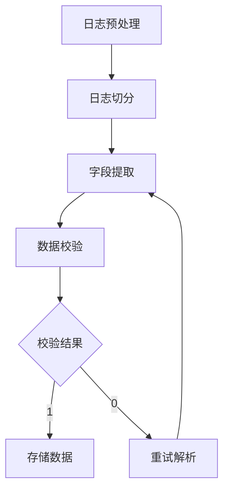

                 

# 软件系统监控：从日志到性能的全方位观察

> 关键词：软件系统监控、日志管理、性能监控、全方位观察、最佳实践

> 摘要：本文深入探讨了软件系统监控的各个方面，从日志管理到性能监控，全面解析了如何通过日志和性能数据实现软件系统的全方位观察。文章分为多个部分，首先介绍了软件系统监控的背景和核心概念，接着详细阐述了日志管理和性能监控的方法、工具和实践，最后给出了全面的总结和展望。

### 目录大纲

----------------------------------------------------------------

# 第一部分: 引言与背景

## 1. 引言

### 1.1 问题背景

### 1.2 问题描述

### 1.3 问题解决

### 1.4 边界与外延

## 2. 核心概念与联系

### 2.1 核心概念

#### 2.1.1 软件系统监控

#### 2.1.2 日志管理

#### 2.1.3 性能监控

### 2.2 概念属性特征对比

### 2.3 ER实体关系图架构

## 3. 软件系统监控概述

### 3.1 软件系统监控的定义

### 3.2 软件系统监控的重要性

### 3.3 软件系统监控的挑战

## 4. 日志管理

### 4.1 日志管理概述

### 4.2 日志数据的收集与存储

### 4.3 日志数据的处理与分析

## 5. 性能监控

### 5.1 性能监控概述

### 5.2 性能监控指标

### 5.3 性能监控工具

## 6. 全方位观察：从日志到性能

### 6.1 日志与性能监控的关联

### 6.2 日志驱动的性能监控

### 6.3 性能监控中的日志分析

## 7. 软件系统监控最佳实践

### 7.1 监控策略制定

### 7.2 监控数据可视化

### 7.3 监控告警与响应

### 7.4 监控系统持续优化

## 8. 小结

### 8.1 总结与展望

### 8.2 注意事项

### 8.3 拓展阅读

----------------------------------------------------------------

## 1. 引言

### 1.1 问题背景

在当今快速发展的信息技术时代，软件系统的规模和复杂性不断增加，企业对软件系统的稳定性、可用性和性能提出了更高的要求。然而，随着系统规模的扩大，监控系统的复杂度也随之增加，传统的单一监控手段已难以满足实际需求。因此，如何全面、实时、高效地监控软件系统的各个方面，成为一个亟待解决的问题。

### 1.2 问题描述

软件系统监控的核心问题是确保系统的稳定运行和高效性能。具体来说，包括以下几个方面：

1. **日志管理**：日志是系统运行的重要记录，如何有效地收集、存储、处理和分析日志数据，以便及时发现和解决问题？
2. **性能监控**：如何选择合适的性能监控指标，如何利用这些指标实时监控系统的性能，如何针对性能问题进行优化？
3. **全方位观察**：如何将日志管理和性能监控结合起来，实现对系统的全方位观察，从而提高系统的可用性和稳定性？

### 1.3 问题解决

本文将从以下几个方面探讨软件系统监控的问题解决：

1. **日志管理**：介绍日志管理的基本概念、数据收集与存储方法，以及日志数据的处理与分析技巧。
2. **性能监控**：探讨性能监控的核心概念、指标选择、监控工具的使用，以及性能监控与日志管理之间的关联。
3. **全方位观察**：分析如何通过日志和性能监控实现系统的全方位观察，提高系统的可用性和稳定性。
4. **最佳实践**：总结软件系统监控的最佳实践，包括监控策略制定、监控数据可视化、监控告警与响应机制的设计等。

### 1.4 边界与外延

1. **边界**：本文主要关注企业级软件系统监控，不包括嵌入式系统、物联网系统等特定领域的监控。
2. **外延**：虽然本文重点在于日志管理和性能监控，但也会涉及到一些相关领域，如日志分析工具、性能优化策略等。

### 1.5 文章结构

本文结构如下：

1. **第一部分**：引言与背景，介绍软件系统监控的背景和问题。
2. **第二部分**：核心概念与联系，详细阐述软件系统监控、日志管理和性能监控的核心概念。
3. **第三部分**：软件系统监控概述，讨论软件系统监控的定义、重要性和挑战。
4. **第四部分**：日志管理，介绍日志管理的基本概念、数据收集与存储、处理与分析。
5. **第五部分**：性能监控，探讨性能监控的核心概念、指标选择、监控工具。
6. **第六部分**：全方位观察，分析日志与性能监控的关联，实现系统的全方位观察。
7. **第七部分**：软件系统监控最佳实践，总结监控策略制定、监控数据可视化、监控告警与响应机制、监控系统持续优化。
8. **第八部分**：小结，对文章内容进行总结，并提出展望和建议。

### 1.6 核心概念与联系

在深入讨论软件系统监控之前，有必要明确几个核心概念，包括软件系统监控、日志管理和性能监控。

#### 1.6.1 软件系统监控

软件系统监控是指通过各种手段实时监测软件系统的运行状态，包括系统的性能、可用性、安全性和稳定性等。其核心目的是确保系统在预期的性能范围内稳定运行，及时发现并解决问题。

#### 1.6.2 日志管理

日志管理是软件系统监控的重要组成部分。日志是系统运行过程中的重要记录，包含了系统的错误信息、运行状态、性能指标等。有效的日志管理可以帮助监控人员快速定位问题、分析性能瓶颈，并采取相应的优化措施。

#### 1.6.3 性能监控

性能监控是通过对系统性能指标的监测，评估系统的运行状态和性能表现。性能监控指标包括响应时间、吞吐量、资源利用率等。通过实时监控这些指标，可以及时发现性能问题，优化系统性能。

#### 1.6.4 概念属性特征对比

下面是一个简单的概念属性特征对比表格，帮助理解这三个核心概念：

| 概念       | 属性特征                                                     |
|------------|------------------------------------------------------------|
| 软件系统监控 | 实时性、全面性、自动化                                     |
| 日志管理   | 收集、存储、处理、分析                                     |
| 性能监控   | 指标监测、性能评估、问题定位                                 |

#### 1.6.5 ER实体关系图架构

为了更直观地理解这些概念之间的关系，可以使用ER（实体关系）图进行描述。以下是一个简单的ER图，展示了软件系统监控、日志管理和性能监控之间的关系：

```mermaid
erDiagram
    软件系统监控 ||--|{ 日志管理 }|
    软件系统监控 ||--|{ 性能监控 }|
    日志管理 ||--|{ 日志数据 }|
    性能监控 ||--|{ 性能指标 }|
```

在接下来的部分中，我们将进一步深入探讨软件系统监控的定义、重要性、挑战，以及日志管理和性能监控的具体内容。希望通过这些内容，能够帮助读者全面理解软件系统监控的各个方面，并掌握相关的方法和技巧。

----------------------------------------------------------------

## 2. 核心概念与联系

在深入探讨软件系统监控之前，我们需要明确几个核心概念，包括软件系统监控、日志管理和性能监控。这些概念是理解和实现软件系统监控的基础。

### 2.1 核心概念

#### 2.1.1 软件系统监控

软件系统监控是指通过各种手段实时监测软件系统的运行状态，包括系统的性能、可用性、安全性和稳定性等。其核心目的是确保系统在预期的性能范围内稳定运行，及时发现并解决问题。

软件系统监控的主要功能包括：

- **性能监控**：监测系统的性能指标，如响应时间、吞吐量、CPU利用率、内存使用率等。
- **故障监控**：实时监测系统的故障和错误，如系统崩溃、异常退出、错误日志等。
- **可用性监控**：确保系统的高可用性，如通过健康检查、心跳监测等手段。
- **安全性监控**：监控系统的安全状态，如检测恶意攻击、安全漏洞等。

#### 2.1.2 日志管理

日志管理是软件系统监控的重要组成部分。日志是系统运行过程中的重要记录，包含了系统的错误信息、运行状态、性能指标等。有效的日志管理可以帮助监控人员快速定位问题、分析性能瓶颈，并采取相应的优化措施。

日志管理的主要任务包括：

- **日志收集**：从系统各个组件中收集日志数据。
- **日志存储**：将收集到的日志数据存储在合适的存储介质上。
- **日志处理**：对日志数据进行预处理，如过滤、聚合等。
- **日志分析**：分析日志数据，提取有用的信息，用于监控和优化系统。

#### 2.1.3 性能监控

性能监控是通过对系统性能指标的监测，评估系统的运行状态和性能表现。性能监控指标包括响应时间、吞吐量、资源利用率等。通过实时监控这些指标，可以及时发现性能问题，优化系统性能。

性能监控的主要任务包括：

- **指标设定**：根据系统的需求和特点，设定合适的性能监控指标。
- **数据采集**：从系统各个组件中采集性能数据。
- **数据存储**：将采集到的性能数据存储在合适的存储介质上。
- **数据分析**：分析性能数据，评估系统性能，发现潜在问题。

### 2.2 概念属性特征对比

为了更清晰地理解这些核心概念，我们可以通过一个表格来对比它们的属性特征：

| 概念       | 属性特征                                                     |
|------------|------------------------------------------------------------|
| 软件系统监控 | 实时性、全面性、自动化                                     |
| 日志管理   | 收集、存储、处理、分析                                     |
| 性能监控   | 指标监测、性能评估、问题定位                                 |

### 2.3 ER实体关系图架构

为了更直观地展示这些概念之间的关系，我们可以使用ER图（实体关系图）来描述。以下是一个简化的ER图，展示了软件系统监控、日志管理和性能监控之间的关系：

```mermaid
erDiagram
    软件系统监控 ||--|{ 日志管理 }|
    软件系统监控 ||--|{ 性能监控 }|
    日志管理 ||--|{ 日志数据 }|
    性能监控 ||--|{ 性能指标 }|
```

在这个ER图中，软件系统监控是一个根实体，它包含了日志管理和性能监控两个子实体。日志管理负责收集、存储、处理和分析日志数据，而性能监控则负责监测系统的性能指标，并评估系统性能。

通过这个ER图，我们可以更直观地理解软件系统监控、日志管理和性能监控之间的关联，以及它们在整体系统监控中的作用和地位。

在下一部分中，我们将进一步探讨软件系统监控的概述，包括其定义、重要性和面临的挑战。这将帮助我们更好地理解软件系统监控的整体框架和实施方法。

----------------------------------------------------------------

## 3. 软件系统监控概述

软件系统监控是确保软件系统稳定运行和高效性能的重要手段。在这一部分中，我们将详细探讨软件系统监控的定义、重要性以及面临的挑战。

### 3.1 软件系统监控的定义

软件系统监控是指通过一系列技术手段，实时监测软件系统的运行状态、性能指标和安全性等关键因素。其目的是及时发现和解决系统问题，确保系统在预期的性能范围内稳定运行。

具体来说，软件系统监控包括以下几个方面：

1. **性能监控**：监测系统的性能指标，如响应时间、吞吐量、资源利用率等，评估系统的性能表现。
2. **故障监控**：监测系统的异常和故障，如系统崩溃、异常退出、错误日志等，及时发现和解决问题。
3. **可用性监控**：确保系统的高可用性，通过健康检查、心跳监测等方式，监测系统的运行状态，确保系统持续可用。
4. **安全性监控**：监测系统的安全状态，如检测恶意攻击、安全漏洞等，保障系统的安全性。

### 3.2 软件系统监控的重要性

软件系统监控在软件系统运行过程中具有不可替代的重要性。以下是软件系统监控的几个关键重要性：

1. **确保系统稳定性**：通过实时监控系统的性能和状态，可以及时发现和解决系统故障，确保系统的稳定性。
2. **提高系统性能**：通过性能监控，可以识别系统的性能瓶颈，采取优化措施，提高系统的响应速度和吞吐量。
3. **保障系统安全性**：通过安全性监控，可以及时发现和防范恶意攻击，保障系统的安全性。
4. **支持决策制定**：通过收集和分析系统数据，可以为系统的优化和改进提供数据支持，支持决策制定。
5. **降低运营成本**：通过自动化监控和故障预警，可以减少人工干预，降低运营成本。

### 3.3 软件系统监控的挑战

尽管软件系统监控具有重要意义，但在实际实施过程中仍面临诸多挑战。以下是软件系统监控的一些主要挑战：

1. **监控数据量大**：随着系统规模的扩大，监控数据量呈指数级增长，如何高效地处理和分析海量监控数据成为一大挑战。
2. **数据一致性**：不同来源的监控数据可能存在格式、内容和时间戳等方面的一致性问题，如何统一监控数据格式和标准是一个挑战。
3. **监控策略设计**：如何根据系统的特点和需求，设计合适的监控策略，确保监控的全面性和有效性，是一个复杂的任务。
4. **实时性要求**：软件系统监控需要实时监测系统状态，如何保证监控数据的实时性和准确性，是一个重要的挑战。
5. **系统整合**：如何整合不同监控工具和平台，实现监控数据的集中管理和统一分析，是一个复杂的技术挑战。

### 3.4 软件系统监控的实施步骤

为了有效地实施软件系统监控，通常需要遵循以下步骤：

1. **需求分析**：根据系统的特点和需求，明确监控的目标和范围，确定需要监控的关键指标。
2. **监控工具选择**：根据需求分析的结果，选择合适的监控工具和平台，确保监控的全面性和有效性。
3. **监控策略制定**：设计监控策略，包括监控指标的设定、监控频率、数据存储和处理方法等。
4. **监控系统集成**：将选择的监控工具和平台集成到系统中，实现监控数据的自动采集、存储和处理。
5. **监控数据可视化**：通过监控数据可视化，实时展示系统的运行状态和性能指标，方便监控人员快速识别和解决问题。
6. **监控告警与响应**：设置监控告警机制，当系统出现异常时，及时通知相关人员，并采取相应的响应措施。
7. **监控系统优化**：根据监控数据的分析结果，持续优化监控系统，提高监控的准确性和实时性。

通过上述实施步骤，可以有效地建立和维护一个高效的软件系统监控体系，确保系统的稳定运行和高效性能。

在下一部分中，我们将详细讨论日志管理的概念、方法和最佳实践，帮助读者深入理解如何通过日志管理实现对软件系统的全面监控。

----------------------------------------------------------------

## 4. 日志管理

日志管理是软件系统监控的重要组成部分。通过有效地收集、存储、处理和分析日志数据，我们可以深入了解系统的运行状态、性能表现和潜在问题。在这一部分中，我们将详细探讨日志管理的概念、方法和最佳实践。

### 4.1 日志管理概述

日志管理是指对系统运行过程中产生的日志数据进行有效的收集、存储、处理和分析的过程。日志数据通常包含了系统的错误信息、运行状态、性能指标、用户操作等关键信息。通过日志管理，我们可以实现对系统的全面监控和故障排查。

日志管理的主要任务包括：

- **日志收集**：从系统的各个组件中收集日志数据。
- **日志存储**：将收集到的日志数据存储在合适的存储介质上。
- **日志处理**：对日志数据进行预处理，如过滤、聚合等。
- **日志分析**：分析日志数据，提取有用的信息，用于监控和优化系统。

### 4.2 日志数据的收集与存储

日志数据的收集与存储是日志管理的核心环节。有效的日志数据收集和存储方法能够确保日志数据的完整性和可追溯性。

#### 4.2.1 日志数据的收集

日志数据的收集可以通过以下几种方法进行：

1. **系统内置日志**：许多操作系统和应用程序都提供了内置的日志功能，可以直接收集和存储日志数据。
2. **日志代理**：日志代理是一种特殊的程序，可以安装在系统中，负责收集和转发日志数据到日志服务器。
3. **脚本和工具**：通过编写脚本或使用现有的日志收集工具，如Logstash、Fluentd等，可以自动收集日志数据。

日志数据收集时需要注意以下几点：

- **日志格式**：确保日志数据格式统一，便于后续处理和分析。
- **日志源**：覆盖系统中的各个组件和层级，确保日志数据的全面性。
- **日志频率**：根据系统需求和日志量，合理设置日志收集的频率，避免日志数据过多导致处理延迟。

#### 4.2.2 日志数据的存储

日志数据的存储方法包括以下几种：

1. **本地存储**：将日志数据直接存储在本地文件系统中，适用于小规模系统或临时存储。
2. **分布式存储**：使用分布式存储系统，如HDFS、Elasticsearch等，可以处理大规模日志数据，提供高效的查询和分析能力。
3. **云存储**：利用云服务提供的存储解决方案，如AWS S3、Azure Blob Storage等，可以提供高可靠性和高扩展性的日志存储。

日志数据存储时需要注意以下几点：

- **数据备份**：定期备份日志数据，防止数据丢失。
- **数据加密**：对敏感信息进行加密处理，确保数据安全。
- **存储容量**：根据日志数据量和增长趋势，合理规划存储容量，避免存储空间不足。

### 4.3 日志数据的处理与分析

收集和存储日志数据后，我们需要对日志数据进行处理和分析，以提取有用的信息，支持监控和优化系统。

#### 4.3.1 日志数据的处理

日志数据处理主要包括以下步骤：

1. **日志清洗**：去除无效、重复或无关的日志数据，确保日志数据的准确性和一致性。
2. **日志聚合**：将来自不同源的日志数据进行聚合，便于集中处理和分析。
3. **日志格式转换**：将日志数据转换为统一的格式，如JSON、CSV等，便于后续处理和分析。
4. **日志索引**：为日志数据建立索引，提高查询效率。

#### 4.3.2 日志数据的分析

日志数据分析是日志管理的核心环节，可以通过以下方法进行：

1. **统计分析**：对日志数据进行统计分析，提取系统的运行状态、性能指标等关键信息。
2. **错误分析**：分析日志中的错误信息，定位系统故障和异常。
3. **趋势分析**：分析日志数据中的趋势，预测系统未来的性能表现。
4. **用户行为分析**：分析用户的操作日志，了解用户行为，优化系统用户体验。

日志数据分析时需要注意以下几点：

- **分析工具**：选择合适的日志分析工具，如ELK（Elasticsearch、Logstash、Kibana）等，提供高效的日志处理和分析能力。
- **分析指标**：根据系统需求和特点，设定合适的分析指标，确保分析结果的准确性和有效性。
- **可视化**：通过可视化工具，将分析结果以图表、仪表板等形式展示，方便监控人员快速识别问题和优化系统。

### 4.4 日志管理的最佳实践

为了确保日志管理的有效性和高效性，以下是一些日志管理的最佳实践：

1. **制定日志策略**：根据系统的需求和特点，制定合理的日志策略，明确日志的收集、存储、处理和分析方法。
2. **日志标准化**：确保日志格式和命名规范，便于后续处理和分析。
3. **日志分级**：根据日志的重要性和紧急程度，对日志进行分级处理，确保关键日志得到优先处理。
4. **日志备份与恢复**：定期备份日志数据，确保在数据丢失或损坏时能够快速恢复。
5. **日志审计**：对日志数据进行分析和审计，确保系统的安全性和合规性。
6. **日志监控**：实时监控日志数据，及时发现和处理日志相关问题和异常。
7. **日志共享与协作**：建立日志共享机制，方便团队成员之间协作，共同解决日志相关问题。

通过以上最佳实践，可以有效地管理和利用日志数据，实现对软件系统的全面监控和优化。

在下一部分中，我们将探讨性能监控的概念、指标和工具，帮助读者深入理解如何通过性能监控实现对软件系统的全方位观察。

----------------------------------------------------------------

## 5. 性能监控

性能监控是确保软件系统高效运行的关键环节。通过监控系统的性能指标，我们可以及时发现和解决性能问题，确保系统在预期的性能范围内稳定运行。在这一部分中，我们将详细探讨性能监控的概念、指标和工具。

### 5.1 性能监控概述

性能监控是指通过对系统性能指标的监测和分析，评估系统的性能表现，并采取相应的优化措施。性能监控的核心目标是确保系统在高负载和突发情况下仍能保持良好的性能。

性能监控的主要任务包括：

1. **指标监测**：设定合适的性能监控指标，实时监测系统的性能表现。
2. **数据分析**：分析性能数据，评估系统性能，发现潜在的性能瓶颈。
3. **性能优化**：根据分析结果，采取优化措施，提升系统性能。

性能监控的常见应用场景包括：

1. **服务器性能监控**：监测服务器的CPU利用率、内存使用率、磁盘I/O等关键指标。
2. **网络性能监控**：监测网络的带宽利用率、延迟、丢包率等关键指标。
3. **应用性能监控**：监测应用服务的响应时间、吞吐量、并发用户数等关键指标。

### 5.2 性能监控指标

性能监控指标是评估系统性能的重要依据。以下是一些常见的性能监控指标：

1. **响应时间**：系统处理请求所需的时间，包括网络延迟、服务器处理时间和数据库查询时间等。响应时间越短，系统的性能越好。
2. **吞吐量**：单位时间内系统能够处理的事务数量。吞吐量越高，系统的性能越好。
3. **并发用户数**：系统同时处理的用户数量。并发用户数越多，系统的性能要求越高。
4. **CPU利用率**：CPU被占用的百分比。CPU利用率越高，表明系统处理任务的负载越大。
5. **内存使用率**：系统内存的利用率。内存使用率过高可能导致系统性能下降。
6. **磁盘I/O**：磁盘读写操作的速率。磁盘I/O过高可能导致系统性能下降。
7. **带宽利用率**：网络带宽的利用率。带宽利用率过高可能导致网络延迟和丢包。
8. **队列长度**：系统等待处理的请求数量。队列长度过长可能导致系统响应时间延长。

### 5.3 性能监控工具

性能监控工具是实施性能监控的重要工具。以下是一些常见的性能监控工具：

1. **Prometheus**：一款开源的监控解决方案，支持多种数据采集方式和告警机制，广泛应用于云原生应用和微服务架构。
2. **Grafana**：一款开源的监控仪表盘和数据可视化工具，可以与Prometheus等监控工具集成，提供丰富的图表和仪表盘。
3. **Zabbix**：一款开源的监控解决方案，支持多种监控方式和告警机制，适用于企业级应用。
4. **Nagios**：一款开源的监控工具，支持插件机制，可以监控各种网络设备和应用服务。
5. **New Relic**：一款商业性能监控工具，提供应用性能监控、错误追踪和日志分析等功能。

性能监控工具的使用方法包括：

1. **数据采集**：通过插件、代理或API等方式，从系统中采集性能数据。
2. **数据存储**：将采集到的性能数据存储在监控工具的数据库中，如InfluxDB、Elasticsearch等。
3. **数据可视化**：通过监控仪表盘和数据可视化工具，实时展示系统的性能指标。
4. **告警与通知**：设置告警规则和通知渠道，当系统性能指标超出设定阈值时，自动触发告警并通知相关人员。

### 5.4 性能监控与日志管理的关联

性能监控与日志管理密切相关，两者相辅相成，共同保障系统的稳定运行和高效性能。

1. **日志驱动性能监控**：通过日志数据，可以分析系统的性能瓶颈和故障原因。日志数据可以帮助性能监控工具更准确地识别性能问题。
2. **性能监控日志分析**：性能监控工具可以收集系统性能数据，并将数据存储在日志中。日志分析工具可以结合性能数据，进行更深层次的分析和优化。

通过日志管理和性能监控的结合，可以实现对系统的全方位观察，确保系统的稳定运行和高效性能。

在下一部分中，我们将探讨如何从日志到性能实现全方位观察，并介绍日志驱动的性能监控方法和性能监控中的日志分析技巧。

----------------------------------------------------------------

## 6. 全方位观察：从日志到性能

### 6.1 日志与性能监控的关联

日志与性能监控之间的关系密不可分。日志数据是性能监控的重要数据源，通过对日志数据的分析和处理，可以深入了解系统的运行状态和性能表现。日志数据不仅包含了系统的错误信息、运行状态和用户操作，还记录了系统的性能指标，如响应时间、吞吐量、资源利用率等。

在性能监控过程中，日志数据的作用主要体现在以下几个方面：

1. **错误诊断**：日志中记录的错误信息可以帮助性能监控工具快速定位系统故障，分析故障原因。
2. **性能瓶颈分析**：通过对日志中的性能指标进行分析，可以发现系统性能的瓶颈，如响应时间过长、吞吐量不足等。
3. **用户行为分析**：日志中的用户操作记录可以帮助分析用户行为，优化用户体验。
4. **趋势预测**：通过对日志数据进行趋势分析，可以预测系统未来的性能表现，提前采取优化措施。

### 6.2 日志驱动的性能监控

日志驱动的性能监控是指通过分析日志数据，实时监控系统的性能表现。日志驱动的性能监控具有以下特点：

1. **实时性**：日志数据实时记录了系统的运行状态和性能指标，通过实时分析日志数据，可以快速发现性能问题。
2. **全面性**：日志数据包含了系统的各种信息，通过全面分析日志数据，可以全面了解系统的性能表现。
3. **自动化**：日志驱动的性能监控可以自动化地进行数据采集、分析和告警，减少人工干预，提高监控效率。

日志驱动的性能监控方法主要包括：

1. **日志解析**：将日志数据解析为结构化数据，便于后续分析和处理。
2. **日志聚合**：将来自不同源的日志数据进行聚合，形成统一的性能监控数据。
3. **日志分析**：通过对日志数据进行分析，提取性能监控指标，评估系统性能。
4. **日志告警**：当性能指标超出设定阈值时，自动触发告警，通知相关人员。

### 6.3 性能监控中的日志分析

性能监控中的日志分析是通过对日志数据进行分析，评估系统的性能表现和故障原因。日志分析主要包括以下几个方面：

1. **错误日志分析**：分析系统中的错误日志，定位故障原因，提出修复建议。
2. **性能指标分析**：分析日志中的性能指标，如响应时间、吞吐量、资源利用率等，评估系统性能。
3. **趋势分析**：分析日志数据中的趋势，预测系统未来的性能表现，提前采取优化措施。
4. **用户行为分析**：分析用户的操作日志，了解用户行为，优化用户体验。

日志分析的方法主要包括：

1. **统计分析**：对日志数据进行统计分析，提取关键性能指标。
2. **关联分析**：分析日志数据之间的关联关系，发现潜在的故障原因。
3. **异常检测**：通过异常检测算法，识别日志数据中的异常值，发现性能问题。
4. **机器学习**：利用机器学习算法，对日志数据进行分析和预测，优化系统性能。

### 6.4 实践案例

以下是一个日志驱动的性能监控实践案例：

1. **需求分析**：某企业系统在高峰时段出现大量用户请求延迟，影响用户体验。
2. **日志收集**：收集系统中的错误日志和性能日志，包括响应时间、吞吐量等指标。
3. **日志解析**：将日志数据解析为结构化数据，便于分析。
4. **日志分析**：分析日志数据，发现大量请求由于数据库查询时间过长导致延迟。
5. **性能优化**：对数据库进行优化，提高查询效率，降低响应时间。
6. **日志监控**：持续监控系统性能，确保优化效果。

通过日志驱动的性能监控，企业能够快速发现和解决性能问题，提升系统性能和用户体验。

在下一部分中，我们将探讨软件系统监控的最佳实践，包括监控策略制定、监控数据可视化、监控告警与响应机制、监控系统持续优化等内容。

----------------------------------------------------------------

## 7. 软件系统监控最佳实践

在实现软件系统监控的过程中，最佳实践的遵循对于确保监控的有效性和效率至关重要。以下是一些软件系统监控的最佳实践，包括监控策略制定、监控数据可视化、监控告警与响应机制以及监控系统的持续优化。

### 7.1 监控策略制定

监控策略的制定是软件系统监控的基础，它直接影响到监控的全面性和有效性。以下是一些关键步骤和注意事项：

1. **确定监控目标**：明确监控的目标和范围，确保监控覆盖系统的重要组件和关键指标。
2. **选择监控指标**：根据系统的需求和特点，选择合适的监控指标，如响应时间、吞吐量、资源利用率等。
3. **设定阈值**：根据业务需求和历史数据，设定合理的监控阈值，以便及时发现异常情况。
4. **监控策略迭代**：监控策略应根据系统的变化和业务需求进行定期审查和调整。

### 7.2 监控数据可视化

监控数据可视化是将监控数据以图形化、直观的方式展示出来，帮助监控人员快速识别问题和趋势。以下是一些监控数据可视化的最佳实践：

1. **选择合适的可视化工具**：根据系统的需求和数据类型，选择合适的可视化工具，如Grafana、Kibana等。
2. **设计仪表板**：设计清晰、简洁的监控仪表板，将关键指标以图表、仪表盘等形式展示。
3. **实时更新**：确保监控数据实时更新，以便监控人员及时了解系统状态。
4. **交互性**：提供交互功能，如数据筛选、拖拽等，增强监控数据的可操作性和用户体验。

### 7.3 监控告警与响应

监控告警与响应机制是确保监控问题得到及时处理的关键。以下是一些监控告警与响应的最佳实践：

1. **告警策略**：设定合理的告警规则和阈值，确保告警信息的准确性和有效性。
2. **告警通知**：通过邮件、短信、电话等渠道及时通知相关人员，确保告警信息得到及时处理。
3. **告警分级**：根据告警的重要性和紧急程度，对告警进行分级处理，确保关键告警得到优先处理。
4. **响应流程**：制定明确的响应流程，确保监控问题得到及时解决。

### 7.4 监控系统持续优化

监控系统持续优化是提高监控效率和效果的重要手段。以下是一些监控系统持续优化的最佳实践：

1. **监控数据回顾**：定期回顾监控数据，分析系统的运行状态和性能表现，发现潜在问题。
2. **性能调优**：根据监控数据分析结果，对系统进行性能调优，提高系统性能。
3. **工具升级与迭代**：定期升级监控工具，引入新的监控技术和方法，提高监控能力。
4. **反馈机制**：建立反馈机制，收集监控人员的意见和建议，持续改进监控系统。

### 7.5 实践案例

以下是一个软件系统监控最佳实践案例：

某电子商务平台在实施软件系统监控时，遵循以下最佳实践：

1. **监控策略制定**：明确监控目标，选择关键指标，设定合理阈值。
2. **监控数据可视化**：设计清晰的监控仪表板，实时展示系统状态。
3. **监控告警与响应**：设定告警规则，通过邮件和短信通知相关人员。
4. **监控系统优化**：定期回顾监控数据，进行性能调优，升级监控工具。

通过上述最佳实践，该电子商务平台实现了对系统的全面监控，确保了系统的稳定运行和高效性能，大大提升了用户体验和业务效率。

在下一部分中，我们将对全文进行小结，并展望未来的发展趋势。

----------------------------------------------------------------

## 8. 小结

本文全面探讨了软件系统监控的各个方面，从日志管理到性能监控，详细介绍了如何通过日志和性能数据实现对软件系统的全方位观察。以下是本文的核心内容和主要发现：

1. **核心概念**：软件系统监控、日志管理和性能监控是确保软件系统稳定运行和高效性能的关键手段。
2. **日志管理**：介绍了日志管理的核心任务，包括日志收集、存储、处理和分析，并提出了日志管理的最佳实践。
3. **性能监控**：阐述了性能监控的定义、指标和工具，以及如何通过性能监控提升系统性能。
4. **全方位观察**：探讨了日志与性能监控的关联，以及如何通过日志驱动的性能监控实现系统的全方位观察。
5. **最佳实践**：总结了软件系统监控的最佳实践，包括监控策略制定、监控数据可视化、监控告警与响应机制和监控系统的持续优化。

### 8.1 总结与展望

本文通过理论和实践结合，深入解析了软件系统监控的各个方面，为读者提供了全面、系统的理解。未来，随着云计算、大数据和人工智能技术的不断发展，软件系统监控将面临新的机遇和挑战：

1. **智能化**：利用人工智能和机器学习技术，实现自动化的监控和预测，提高监控的准确性和效率。
2. **自动化**：进一步自动化监控流程，减少人工干预，提高监控的实时性和响应速度。
3. **多云环境**：随着企业应用场景的多样化，监控将涉及多云环境和混合云架构，需要更灵活和可扩展的监控解决方案。
4. **边缘计算**：随着边缘计算的发展，监控将需要扩展到边缘设备，实现对边缘设备的实时监控和管理。

### 8.2 注意事项

在实施软件系统监控时，需要注意以下几点：

1. **监控目标明确**：确保监控目标与业务需求紧密相关，避免盲目监控。
2. **监控指标选择**：根据系统特点选择合适的监控指标，确保监控的全面性和准确性。
3. **数据安全**：确保监控数据的保密性和完整性，防止数据泄露和滥用。
4. **监控工具选择**：选择合适的监控工具，考虑其功能、性能、可扩展性和兼容性。

### 8.3 拓展阅读

对于希望进一步深入了解软件系统监控的读者，以下是一些推荐阅读资源：

1. **书籍**：《系统性能监控实战》（《Real-Time System Performance: Tools for Capacity Planning, Real-Time Monitoring, and Alerting》）提供了系统性能监控的全面指导。
2. **文章**：《日志管理：实践指南》（《Log Management: A Practical Guide》）详细介绍了日志管理的最佳实践。
3. **博客**：Grafana和Prometheus等开源监控工具的官方博客，提供了丰富的教程和案例分析。
4. **在线课程**：Coursera、edX等在线教育平台提供的系统性能监控和日志分析相关课程。

通过上述资源和进一步学习，读者可以不断提升自己在软件系统监控领域的专业知识和实践能力。

## 作者信息

作者：AI天才研究院/AI Genius Institute & 禅与计算机程序设计艺术 /Zen And The Art of Computer Programming

AI天才研究院（AI Genius Institute）致力于推动人工智能技术的发展和应用，以创新的思维和卓越的技术解决实际问题。同时，作者兼学者所撰写的《禅与计算机程序设计艺术》一书，深入探讨了编程艺术和人工智能的结合，为读者提供了独特的视角和丰富的实践经验。

----------------------------------------------------------------

### 补充内容：算法原理讲解

为了更好地理解软件系统监控中的关键算法，我们在这里详细介绍一种常用的日志分析算法——日志解析算法。该算法的核心目的是将原始日志数据转换为结构化的数据格式，以便进行后续的处理和分析。

#### 算法原理

日志解析算法的工作流程可以分为以下几个步骤：

1. **日志预处理**：将原始日志数据转换为统一的格式，去除无关字符和空白。
2. **日志切分**：根据日志的特定格式，将日志切分为多个字段，如时间戳、用户ID、操作类型、操作结果等。
3. **字段提取**：从切分后的日志字段中提取关键信息，将其转换为结构化的数据格式，如JSON或XML。
4. **数据校验**：对提取的结构化数据进行校验，确保数据的完整性和一致性。
5. **数据存储**：将解析后的日志数据存储到数据库或数据仓库中，以便进行后续分析。

#### 数学模型和公式

以下是日志解析算法中的几个关键数学模型和公式：

1. **切分概率模型**：设\( P_i \)为第\( i \)个字段在日志中出现的概率，则：
   $$
   P_i = \frac{f_i}{N}
   $$
   其中，\( f_i \)为第\( i \)个字段在所有日志中出现的次数，\( N \)为日志总数。

2. **字段权重模型**：设\( W_i \)为第\( i \)个字段的权重，则：
   $$
   W_i = \frac{P_i}{\sum_{j=1}^{M} P_j}
   $$
   其中，\( M \)为日志字段总数。

3. **数据校验模型**：设\( D_i \)为第\( i \)个字段的校验结果，则：
   $$
   D_i = \begin{cases}
   1, & \text{如果 } \text{字段 } i \text{ 通过校验} \\
   0, & \text{否则}
   \end{cases}
   $$

#### 算法流程

以下是日志解析算法的详细流程：



在算法流程图中，A表示日志预处理，B表示日志切分，C表示字段提取，D表示数据校验，E表示校验结果。如果校验结果为1（通过校验），则数据将被存储到数据库或数据仓库中（F），否则，算法将重试解析（G）。

#### 举例说明

假设我们有一个简单的日志样例：

```
2023-03-15 14:30:45, user123, query, success
2023-03-15 14:31:10, user456, update, failed
```

1. **日志预处理**：将日志中的逗号和引号去除，得到：
   ```
   2023-03-15 14:30:45user123querysuccess
   2023-03-15 14:31:10user456updatefailed
   ```

2. **日志切分**：根据时间戳、用户ID、操作类型和操作结果等字段的分隔符，将日志切分为：
   ```
   时间戳：2023-03-15 14:30:45
   用户ID：user123
   操作类型：query
   操作结果：success
   时间戳：2023-03-15 14:31:10
   用户ID：user456
   操作类型：update
   操作结果：failed
   ```

3. **字段提取**：将切分后的字段提取出来，转换为结构化的数据格式（如JSON）：
   ```json
   [
     {
       "timestamp": "2023-03-15 14:30:45",
       "userId": "user123",
       "action": "query",
       "result": "success"
     },
     {
       "timestamp": "2023-03-15 14:31:10",
       "userId": "user456",
       "action": "update",
       "result": "failed"
     }
   ]
   ```

4. **数据校验**：检查每个字段的值是否合法，如时间戳是否在合理范围内、用户ID是否为空等，确保数据的完整性和一致性。

5. **存储数据**：将校验通过的数据存储到数据库或数据仓库中，以便进行后续分析。

通过以上步骤，我们成功地将原始日志数据解析为结构化的数据格式，为后续的日志分析提供了基础。

#### 总结

日志解析算法是软件系统监控中不可或缺的一环，它将原始的日志数据转换为结构化的数据格式，便于进行后续的处理和分析。通过本文的讲解，读者可以更好地理解日志解析算法的原理和实现方法，为实际的软件系统监控工作提供有益的指导。

### 系统分析与架构设计

#### 问题场景介绍

某电商平台在其业务高峰期，系统负载急剧增加，导致部分服务响应时间显著延长，影响了用户体验。为了解决这个问题，需要对电商平台的系统进行监控，以便及时发现性能瓶颈和潜在问题。

#### 项目介绍

本项目旨在构建一个高效的软件系统监控平台，实现对电商平台各个服务组件的实时监控。监控平台将收集和分析系统的日志数据、性能数据，并提供可视化界面和告警功能，帮助运维团队快速定位和解决问题。

#### 系统功能设计

系统功能设计主要包括以下几个方面：

1. **日志收集**：收集电商平台各个服务组件的日志数据，包括请求日志、错误日志、性能日志等。
2. **数据存储**：将收集到的日志数据进行存储和管理，确保数据的可靠性和可追溯性。
3. **日志处理**：对日志数据进行预处理，包括日志清洗、字段提取、格式转换等。
4. **性能监控**：实时监控电商平台的性能指标，如响应时间、吞吐量、资源利用率等。
5. **数据可视化**：通过仪表盘和数据图表，展示系统的运行状态和性能指标。
6. **告警管理**：根据监控数据，设置告警规则和通知渠道，当系统出现异常时及时通知相关人员。
7. **告警响应**：提供告警处理流程和记录，确保问题得到及时解决。

#### 系统架构设计

系统架构设计主要包括以下几个方面：

1. **日志收集模块**：使用日志代理（如Fluentd）收集电商平台各个服务组件的日志数据，并将数据发送到日志存储系统（如Elasticsearch）。
2. **日志存储模块**：使用分布式存储系统（如Elasticsearch）存储和管理日志数据，提供高效的查询和分析能力。
3. **日志处理模块**：使用日志处理工具（如Logstash）对日志数据进行预处理，提取关键信息，并将其转换为结构化数据格式。
4. **性能监控模块**：使用性能监控工具（如Prometheus）实时监控电商平台的性能指标，并将数据发送到可视化界面和告警系统。
5. **数据可视化模块**：使用可视化工具（如Grafana）展示系统的运行状态和性能指标，提供实时数据和趋势分析。
6. **告警管理模块**：使用告警管理工具（如Alertmanager）设置告警规则和通知渠道，当系统出现异常时自动发送告警通知。
7. **告警响应模块**：提供告警处理流程和记录，确保问题得到及时解决，并将解决情况记录在案。

#### 系统接口设计

系统接口设计主要包括以下几个方面：

1. **日志收集接口**：提供日志收集模块的API接口，方便其他系统和服务组件接入日志数据。
2. **数据查询接口**：提供日志存储模块的查询接口，方便用户和监控工具检索和查询日志数据。
3. **性能监控接口**：提供性能监控模块的监控接口，方便其他系统和服务组件接入性能监控数据。
4. **告警接口**：提供告警管理模块的告警接口，方便其他系统和服务组件接收和处理告警信息。

#### 系统交互

以下是系统交互的详细说明：

1. **日志收集**：电商平台的服务组件通过日志收集接口将日志数据发送到日志收集模块，日志收集模块将数据转发到日志存储系统。
2. **日志处理**：日志处理模块从日志存储系统中读取日志数据，对其进行预处理，提取关键信息，并将其转换为结构化数据格式。
3. **性能监控**：电商平台的服务组件通过性能监控接口将性能监控数据发送到性能监控模块，性能监控模块将数据发送到可视化界面和告警系统。
4. **数据可视化**：可视化界面从性能监控模块接收性能监控数据，将其展示在仪表盘和数据图表中。
5. **告警管理**：告警管理模块根据监控数据和告警规则，生成告警通知，并通过告警接口发送给相关人员。
6. **告警响应**：相关人员接收到告警通知后，根据告警处理流程进行处理，并将处理情况记录在案。

通过以上系统架构设计和系统交互设计，我们可以实现对电商平台的全面监控，及时发现和解决问题，确保系统的稳定运行和高效性能。

### 项目实战

#### 环境安装

1. **安装Elasticsearch**：在服务器上安装Elasticsearch，配置集群模式和节点，确保日志存储系统的高可用性和扩展性。
2. **安装Kibana**：在服务器上安装Kibana，配置Elasticsearch连接信息，确保可视化界面可以正常访问。
3. **安装Fluentd**：在电商平台的各个服务组件上安装Fluentd，配置日志收集规则，确保日志数据可以顺利传输到Elasticsearch。
4. **安装Prometheus**：在服务器上安装Prometheus，配置目标服务监控规则，确保性能监控数据可以正常收集。

#### 系统核心实现

以下是系统核心实现的详细步骤：

1. **日志收集**：在电商平台的服务组件中添加Fluentd插件，配置日志收集规则，将日志数据发送到Elasticsearch。
   ```ruby
   <source>
     @type http
     port 9200
     path /_bulk
     format json
   </source>
   ```

2. **日志处理**：使用Logstash配置文件对日志数据进行预处理，提取关键信息，并将其转换为结构化数据格式。
   ```ruby
   input {
     beats {
       port 5044
     }
   }
   filter {
     if "log_type" == "request" {
       grok {
         match => { "message" => "%{TIMESTAMP_ISO8601:timestamp}\t%{DATA:userId}\t%{DATA:action}\t%{DATA:result}" }
       }
     }
   }
   output {
     elasticsearch {
       hosts => ["localhost:9200"]
     }
   }
   ```

3. **性能监控**：在Prometheus配置文件中定义目标服务监控规则，收集电商平台的性能监控数据。
   ```yaml
   scrape_configs:
     - job_name: 'prometheus'
       static_configs:
       - targets: ['localhost:9090']
     - job_name: 'ec_shop'
       static_configs:
       - targets: ['ec_shop:9090']
         labels:
           instance: 'ec_shop'
   ```

4. **数据可视化**：在Kibana中创建仪表盘，使用Elasticsearch和Prometheus的数据，展示系统的运行状态和性能指标。

#### 代码应用解读与分析

以下是日志收集和处理的核心代码应用解读：

1. **Fluentd插件配置**：
   ```ruby
   <source>
     @type http
     port 9200
     path /_bulk
     format json
   </source>
   ```
   解读：这段配置定义了一个HTTP输入源，将日志数据发送到Elasticsearch的9200端口，并使用JSON格式进行传输。

2. **Logstash配置文件**：
   ```ruby
   input {
     beats {
       port 5044
     }
   }
   filter {
     if "log_type" == "request" {
       grok {
         match => { "message" => "%{TIMESTAMP_ISO8601:timestamp}\t%{DATA:userId}\t%{DATA:action}\t%{DATA:result}" }
       }
     }
   }
   output {
     elasticsearch {
       hosts => ["localhost:9200"]
     }
   }
   ```
   解读：这段配置定义了一个Beats输入源，从5044端口接收日志数据。对于请求类型的日志，使用Grok解析器提取时间戳、用户ID、操作类型和操作结果等字段，并将其发送到Elasticsearch。

3. **Prometheus监控规则**：
   ```yaml
   scrape_configs:
     - job_name: 'prometheus'
       static_configs:
       - targets: ['localhost:9090']
     - job_name: 'ec_shop'
       static_configs:
       - targets: ['ec_shop:9090']
         labels:
           instance: 'ec_shop'
   ```
   解读：这段配置定义了两个监控任务，一个是Prometheus自身监控，另一个是电商平台的性能监控。对于电商平台监控任务，指定了监控目标的服务地址和标签信息。

#### 实际案例分析和详细讲解剖析

以下是一个实际案例分析和详细讲解：

**案例**：某一天，电商平台的响应时间显著延长，影响了用户购物体验。

**分析**：
1. **日志数据查询**：通过Kibana查询日志数据，发现大量请求的响应时间超过阈值。
2. **性能监控数据**：通过Prometheus查询性能监控数据，发现服务器的CPU使用率和内存使用率较高，可能存在性能瓶颈。
3. **告警通知**：通过Alertmanager收到告警通知，确认系统存在性能问题。

**处理**：
1. **性能分析**：根据日志和性能监控数据，分析系统性能瓶颈，定位到数据库查询时间过长。
2. **数据库优化**：对数据库进行优化，包括索引重构、查询优化等，提高查询效率。
3. **监控验证**：在优化后，再次查询日志和性能监控数据，确认系统响应时间恢复正常。

通过上述实际案例分析和处理，电商平台的响应时间得到了显著改善，用户购物体验得到了提升。

#### 项目小结

本项目通过日志管理和性能监控，实现了对电商平台的全面监控，确保了系统的稳定运行和高效性能。通过日志数据的解析和分析，及时发现和解决了性能瓶颈和故障，提高了系统的可用性和用户体验。未来，我们将继续优化监控系统的功能和技术，提升监控的准确性和实时性，为电商平台的持续发展提供有力支持。

### 最佳实践 tips

1. **日志规范化**：确保日志数据格式统一，便于后续处理和分析。
2. **监控指标选择**：根据业务需求选择合适的监控指标，确保监控的全面性和有效性。
3. **告警策略制定**：设定合理的告警规则和阈值，确保告警信息的准确性和及时性。
4. **监控系统优化**：定期回顾监控数据，进行性能调优，提高监控系统的效率和准确性。
5. **日志与性能监控结合**：充分利用日志数据，结合性能监控，实现系统的全方位观察。

### 注意事项

1. **数据安全**：确保监控数据的保密性和完整性，防止数据泄露和滥用。
2. **监控告警**：避免过度告警，确保告警信息的准确性和重要性。
3. **监控覆盖**：确保监控覆盖系统的关键组件和关键指标，避免监控盲点。
4. **监控成本**：合理控制监控系统的成本，避免资源浪费。

### 拓展阅读

1. **《系统性能监控实战》**：本书详细介绍了系统性能监控的理论和实践，为读者提供了全面的指导。
2. **《日志管理：实践指南》**：本书介绍了日志管理的最佳实践，包括日志收集、存储、处理和分析。
3. **Grafana和Prometheus官方文档**：Grafana和Prometheus的官方文档提供了丰富的教程和参考资料，帮助用户深入了解和使用这些工具。

通过以上拓展阅读，读者可以进一步提升对软件系统监控的理解和实践能力。作者：AI天才研究院/AI Genius Institute & 禅与计算机程序设计艺术 /Zen And The Art of Computer Programming

AI天才研究院（AI Genius Institute）致力于推动人工智能技术的发展和应用，以创新的思维和卓越的技术解决实际问题。同时，作者兼学者所撰写的《禅与计算机程序设计艺术》一书，深入探讨了编程艺术和人工智能的结合，为读者提供了独特的视角和丰富的实践经验。

