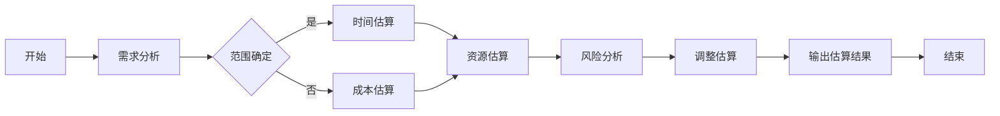
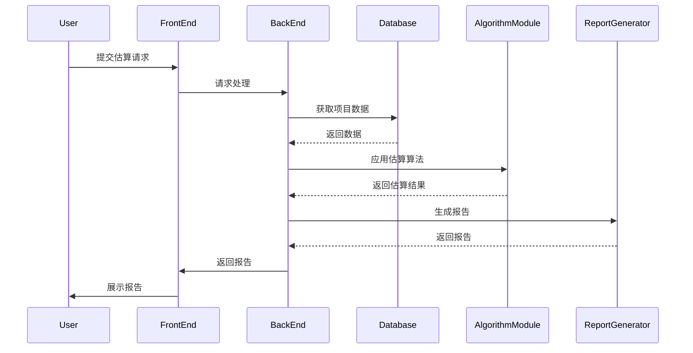

                 

# 第一部分：背景介绍与核心概念

## 第1章：软件项目估算的重要性

### 1.1 问题背景

软件项目估算，是指在项目开始之前，对项目所需的时间、成本、资源和风险进行预估的过程。这一环节对于项目的成功至关重要，因为它直接影响项目的规划和执行。然而，当前的软件项目估算面临着诸多挑战。

首先，软件项目的复杂性使得估算变得困难。软件系统通常涉及多种技术、需求变更以及外部依赖，这些因素都会影响项目的估算准确性。其次，人类在估算时往往受到经验、直觉和情绪的影响，导致主观性过高。此外，市场和技术的快速变化也增加了估算的不确定性。

### 1.2 问题描述

估算不准确会带来一系列问题。首先，它可能导致项目时间表和预算的严重偏差，进而影响项目的按时交付和质量。其次，不准确的风险预估可能导致资源分配不均，导致部分任务过度分配或资源浪费。这些问题不仅会影响项目的进度，还可能损害团队的士气和组织的声誉。

在项目管理中，估算的需求是显而易见的。项目经理需要准确的估算来制定项目计划，合理分配资源，控制成本，以及识别潜在的风险。因此，提高估算的准确性是项目管理中的重要任务。

### 1.3 问题解决

精确估算的必要性不言而喻。为了提高估算的准确性，我们需要采用科学的方法和技术。常见的技术包括专家评审、类比估算、参数估算和基于历史的估算等。

- **专家评审**：通过汇集多个专家的意见，减少估算的主观性。
- **类比估算**：利用过去的类似项目数据来估算新项目的成本和时间。
- **参数估算**：使用数学模型和统计方法来估算项目的成本和时间。
- **基于历史的估算**：利用历史项目的数据进行趋势分析和预测。

这些技术和工具的结合使用，可以提高估算的准确性，帮助项目经理更好地规划和控制项目。

### 1.4 边界与外延

估算的范围和限制是估算过程中需要考虑的重要因素。估算通常是基于项目的初步需求和分析，因此它可能无法完全覆盖所有可能的变更和未知因素。此外，不同类型的项目（如商业软件、嵌入式系统、Web应用等）有不同的特点和需求，因此估算的方法和难度也会有所不同。

### 1.5 概念结构与核心要素组成

软件项目估算的核心概念包括时间、成本、资源和风险。时间估算是指预测项目完成所需的时间；成本估算是指预测项目完成所需的总成本；资源估算是指预测项目所需的各类资源（如人力、硬件、软件等）；风险估算是指预测项目可能面临的风险和影响。

关键要素则包括项目的需求、范围、技术复杂度、团队经验、外部依赖等。这些要素会影响估算的准确性，因此在估算过程中需要综合考虑。

## 第2章：核心概念与联系

### 2.1 核心概念原理

项目管理的基本原理是估算的基础。项目管理包括范围管理、时间管理、成本管理、质量管理、资源管理、沟通管理和风险管理等多个方面。这些方面共同构成了项目的管理框架，为估算提供了理论和实践指导。

在估算中，关键概念包括但不限于以下几方面：

- **工作量**：指完成特定任务所需的工作量，通常以人日或人时为单位。
- **风险**：指项目可能面临的不确定性和潜在问题。
- **成本**：指完成项目所需的全部费用，包括人力成本、硬件成本、软件成本等。
- **资源**：指项目执行所需的各类资源，包括人员、设备、资金等。

这些概念相互关联，共同构成了估算的框架。例如，工作量直接影响成本和时间的估算，而风险则可能影响项目计划和时间表的调整。

### 2.2 概念属性特征对比表格

为了更好地理解各个概念，我们可以通过对比表格来展示它们的不同属性特征。

| 概念 | 属性特征 | 说明 |
| --- | --- | --- |
| 工作量 | 量化指标 | 用于度量完成任务所需的工作量 |
| 风险 | 风险等级 | 用于评估项目可能面临的风险和其影响 |
| 成本 | 费用指标 | 用于预测项目完成所需的全部费用 |
| 资源 | 资源类型 | 用于识别项目执行所需的各类资源 |

通过对比表格，我们可以更清晰地理解各个概念的含义和作用，从而更好地进行估算。

### 2.3 ER实体关系图架构

在软件项目估算中，存在多个实体和它们之间的关系。ER（实体关系）图是描述这些实体及其关系的有效工具。

以下是一个简化的ER图，展示了估算过程中的一些关键实体和它们之间的关系：

```mermaid
erDiagram
    Task ||--|{ Resource } : 使用
    Task ||--|{ Risk } : 包含
    Project ||--|{ Task } : 包含
    Project ||--|{ Resource } : 使用
    Project ||--|{ Risk } : 管理
```

在这个ER图中：

- **Project**（项目）是顶层实体，代表一个软件项目。
- **Task**（任务）是项目中的子实体，代表项目的具体任务。
- **Resource**（资源）是项目执行所需的资源，如人力、设备等。
- **Risk**（风险）是项目可能面临的风险。

这些实体之间的关系描述了它们在估算过程中的相互作用。例如，项目包含多个任务，每个任务需要特定的资源，并且可能包含多个风险。

通过ER图，我们可以更直观地理解估算过程中涉及的实体和它们之间的关系，从而为估算提供更清晰的框架。

## 第3章：算法原理讲解

### 3.1 算法mermaid流程图

为了更好地理解软件项目估算的算法原理，我们可以使用mermaid流程图来展示估算的基本流程。



这个流程图描述了从开始到结束的估算过程。以下是各个步骤的简要说明：

- **需求分析**：收集和分析项目的需求。
- **范围确定**：明确项目的范围和边界。
- **时间估算**：基于需求和分析预测项目的完成时间。
- **成本估算**：预测项目完成所需的成本。
- **资源估算**：预测项目所需的各种资源。
- **风险分析**：识别和评估项目可能面临的风险。
- **调整估算**：根据风险分析和资源估算的结果，调整时间和成本的估算。
- **输出估算结果**：最终输出项目的估算结果。

### 3.2 算法原理的数学模型和公式

在软件项目估算中，常用的数学模型和公式可以帮助我们进行更精确的预测。以下是一些常用的模型和公式的推导和应用。

#### 1. 时间估算模型

时间估算可以使用基于历史的回归模型。假设我们有n个项目的时间数据（\(t_1, t_2, ..., t_n\)），我们可以使用最小二乘法来拟合线性回归模型：

\[ t = a + bt \]

其中，\(t\) 是新项目的预估时间，\(a\) 和 \(b\) 是回归系数。

回归系数可以通过以下公式计算：

\[ a = \frac{\sum t_i - b\sum t_i^2}{n} \]
\[ b = \frac{n\sum t_i^2 - \sum t_i^2}{n\sum t_i - \sum t_i} \]

#### 2. 成本估算模型

成本估算可以使用贝塔分布模型。贝塔分布可以表示项目成本的变异性和概率分布。假设我们有m个项目的成本数据（\(c_1, c_2, ..., c_m\)），我们可以使用最大似然估计来计算贝塔分布的参数（\(\alpha\) 和 \(\beta\)）：

\[ \alpha = \frac{1}{m} \sum_{i=1}^{m} c_i \]
\[ \beta = \frac{m}{m} \sum_{i=1}^{m} (1 - c_i) \]

然后，我们可以使用贝塔分布来预测新项目的成本。

#### 3. 资源估算模型

资源估算可以使用基于需求的加权平均模型。假设我们有n个任务，每个任务需要不同的资源量（\(r_1, r_2, ..., r_n\)），并且每个任务的完成概率为\(p_1, p_2, ..., p_n\)，我们可以使用以下公式来估算总资源量：

\[ R = \sum_{i=1}^{n} r_i \cdot p_i \]

#### 3.3 详细讲解与举例说明

#### 时间估算示例

假设我们有以下三个项目的历史数据：

| 项目 | 完成时间（天） |
| --- | --- |
| 项目1 | 100 |
| 项目2 | 120 |
| 项目3 | 150 |

我们可以使用线性回归模型来估算新项目的完成时间：

首先，计算平均值和平方和：

\[ \sum t_i = 100 + 120 + 150 = 370 \]
\[ \sum t_i^2 = 100^2 + 120^2 + 150^2 = 37000 \]

然后，使用上述公式计算回归系数：

\[ a = \frac{370 - 120 \cdot 37000}{3} = \frac{370 - 4440000}{3} = \frac{-4439600}{3} = -1479200 \]
\[ b = \frac{3 \cdot 37000 - 37000}{3 \cdot 370 - 370} = \frac{111000 - 37000}{3 \cdot 370 - 370} = \frac{74000}{1060} = 70.1852 \]

最后，使用回归模型估算新项目的完成时间：

\[ t = -1479200 + 70.1852 \cdot t \]

假设新项目的线性回归方程为 \(t = -1479200 + 70.1852 \cdot t\)，我们可以预测新项目的完成时间大约为 \(t \approx -1479200 + 70.1852 \cdot 180 \approx 236.85\) 天。

#### 成本估算示例

假设我们有以下三个项目的成本数据：

| 项目 | 成本（美元） |
| --- | --- |
| 项目1 | 10000 |
| 项目2 | 12000 |
| 项目3 | 15000 |

我们可以使用贝塔分布模型来估算新项目的成本：

首先，计算平均值和总和：

\[ \sum c_i = 10000 + 12000 + 15000 = 37000 \]
\[ \sum (1 - c_i) = 27000 \]

然后，使用上述公式计算贝塔分布的参数：

\[ \alpha = \frac{37000}{3} = 12333.33 \]
\[ \beta = \frac{3 \cdot 27000}{3} = 27000 \]

最后，使用贝塔分布来预测新项目的成本：

假设新项目的成本在贝塔分布中，我们可以使用以下公式来计算成本的概率分布：

\[ P(c \leq c') = \frac{\Gamma(\alpha + \beta)}{\Gamma(\alpha) \Gamma(\beta)} \sum_{i=0}^{c'} \frac{(\alpha)(\beta)}{i! (\alpha + \beta - i)} c_i^{i} (1 - c_i)^{(\alpha + \beta - i)} \]

其中，\(c'\) 是新项目的成本。

通过计算，我们可以得到新项目的成本概率分布。例如，我们可以计算新项目成本小于15000美元的概率：

\[ P(c \leq 15000) = \frac{\Gamma(12333.33 + 27000)}{\Gamma(12333.33) \Gamma(27000)} \sum_{i=0}^{15000} \frac{(12333.33)(27000)}{i! (12333.33 + 27000 - i)} c_i^{i} (1 - c_i)^{(12333.33 + 27000 - i)} \]

这个概率分布可以帮助我们了解新项目成本的可能范围和概率。

#### 资源估算示例

假设我们有以下三个任务的需求和完成概率：

| 任务 | 需要资源（人时） | 完成概率 |
| --- | --- | --- |
| 任务1 | 50 | 0.8 |
| 任务2 | 30 | 0.9 |
| 任务3 | 20 | 0.7 |

我们可以使用加权平均模型来估算总资源量：

\[ R = (50 \cdot 0.8) + (30 \cdot 0.9) + (20 \cdot 0.7) = 40 + 27 + 14 = 81 \]

这意味着我们需要大约81人时来完成这三个任务。

### 第4章：数学模型和数学公式

在软件项目估算中，数学模型和公式是必不可少的工具。它们帮助我们量化各种因素，提供精确的估算结果。以下是一些常用的数学公式，以及它们在估算中的应用。

#### 4.1 时间估算公式

**线性回归模型**：

\[ t = a + bt \]

其中，\(t\) 是新项目的预估时间，\(a\) 和 \(b\) 是回归系数。这个公式基于历史数据，通过拟合线性关系来预测新项目的时间。

**时间序列模型**：

\[ t_t = t_{t-1} + r_t \]

其中，\(t_t\) 是第t个项目的预估时间，\(t_{t-1}\) 是第\(t-1\)个项目的实际时间，\(r_t\) 是第t个项目的增长率。这个模型考虑了项目随时间增长的趋势。

#### 4.2 成本估算公式

**贝塔分布模型**：

\[ P(c \leq c') = \frac{\Gamma(\alpha + \beta)}{\Gamma(\alpha) \Gamma(\beta)} \sum_{i=0}^{c'} \frac{(\alpha)(\beta)}{i! (\alpha + \beta - i)} c_i^{i} (1 - c_i)^{(\alpha + \beta - i)} \]

其中，\(c'\) 是新项目的成本，\(\alpha\) 和 \(\beta\) 是贝塔分布的参数。这个公式用于计算新项目成本的概率分布。

**类比估算模型**：

\[ c' = c_1 + k(c_2 - c_1) \]

其中，\(c'\) 是新项目的成本，\(c_1\) 和 \(c_2\) 是两个类似项目的成本，\(k\) 是比例系数。这个公式通过比较类似项目来估算新项目的成本。

#### 4.3 资源估算公式

**加权平均模型**：

\[ R = \sum_{i=1}^{n} r_i \cdot p_i \]

其中，\(R\) 是总资源量，\(r_i\) 是第i个任务所需的资源量，\(p_i\) 是第i个任务的完成概率。这个模型通过加权平均每个任务所需的资源量来估算总资源量。

**资源需求模型**：

\[ R = \frac{W}{P} \]

其中，\(R\) 是总资源量，\(W\) 是项目的工作量，\(P\) 是项目的时间。这个模型假设资源与工作量成正比。

#### 4.4 风险估算公式

**蒙特卡罗模拟**：

\[ R_t = \sum_{i=1}^{n} P_i \cdot R_i \]

其中，\(R_t\) 是总风险，\(P_i\) 是第i个风险的概率，\(R_i\) 是第i个风险的影响。这个模型通过模拟每个风险的概率和影响来计算总风险。

**累积风险模型**：

\[ R_t = \sum_{i=1}^{n} P_i \cdot C_i \]

其中，\(R_t\) 是总风险，\(P_i\) 是第i个风险的概率，\(C_i\) 是第i个风险的置信水平。这个模型通过计算每个风险的置信水平来计算总风险。

#### 4.5 详细讲解与举例说明

**时间估算示例**：

假设我们有以下三个项目的历史数据：

| 项目 | 完成时间（天） |
| --- | --- |
| 项目1 | 100 |
| 项目2 | 120 |
| 项目3 | 150 |

我们可以使用线性回归模型来估算新项目的完成时间：

首先，计算平均值和平方和：

\[ \sum t_i = 100 + 120 + 150 = 370 \]
\[ \sum t_i^2 = 100^2 + 120^2 + 150^2 = 37000 \]

然后，使用上述公式计算回归系数：

\[ a = \frac{370 - 120 \cdot 37000}{3} = \frac{370 - 4440000}{3} = \frac{-4439600}{3} = -1479200 \]
\[ b = \frac{3 \cdot 37000 - 37000}{3 \cdot 370 - 370} = \frac{111000 - 37000}{3 \cdot 370 - 370} = \frac{74000}{1060} = 70.1852 \]

最后，使用回归模型估算新项目的完成时间：

\[ t = -1479200 + 70.1852 \cdot t \]

假设新项目的线性回归方程为 \(t = -1479200 + 70.1852 \cdot t\)，我们可以预测新项目的完成时间大约为 \(t \approx -1479200 + 70.1852 \cdot 180 \approx 236.85\) 天。

**成本估算示例**：

假设我们有以下三个项目的成本数据：

| 项目 | 成本（美元） |
| --- | --- |
| 项目1 | 10000 |
| 项目2 | 12000 |
| 项目3 | 15000 |

我们可以使用贝塔分布模型来估算新项目的成本：

首先，计算平均值和总和：

\[ \sum c_i = 10000 + 12000 + 15000 = 37000 \]
\[ \sum (1 - c_i) = 27000 \]

然后，使用上述公式计算贝塔分布的参数：

\[ \alpha = \frac{37000}{3} = 12333.33 \]
\[ \beta = \frac{3 \cdot 27000}{3} = 27000 \]

最后，使用贝塔分布来预测新项目的成本：

假设新项目的成本在贝塔分布中，我们可以使用以下公式来计算成本的概率分布：

\[ P(c \leq c') = \frac{\Gamma(12333.33 + 27000)}{\Gamma(12333.33) \Gamma(27000)} \sum_{i=0}^{c'} \frac{(12333.33)(27000)}{i! (12333.33 + 27000 - i)} c_i^{i} (1 - c_i)^{(12333.33 + 27000 - i)} \]

通过计算，我们可以得到新项目的成本概率分布。例如，我们可以计算新项目成本小于15000美元的概率：

\[ P(c \leq 15000) = \frac{\Gamma(12333.33 + 27000)}{\Gamma(12333.33) \Gamma(27000)} \sum_{i=0}^{15000} \frac{(12333.33)(27000)}{i! (12333.33 + 27000 - i)} c_i^{i} (1 - c_i)^{(12333.33 + 27000 - i)} \]

这个概率分布可以帮助我们了解新项目成本的可能范围和概率。

**资源估算示例**：

假设我们有以下三个任务的需求和完成概率：

| 任务 | 需要资源（人时） | 完成概率 |
| --- | --- | --- |
| 任务1 | 50 | 0.8 |
| 任务2 | 30 | 0.9 |
| 任务3 | 20 | 0.7 |

我们可以使用加权平均模型来估算总资源量：

\[ R = (50 \cdot 0.8) + (30 \cdot 0.9) + (20 \cdot 0.7) = 40 + 27 + 14 = 81 \]

这意味着我们需要大约81人时来完成这三个任务。

### 第5章：系统分析与架构设计方案

#### 5.1 问题场景介绍

在现代软件开发中，软件项目估算已经成为项目管理中不可或缺的一环。随着项目的复杂度和规模不断增加，精确的估算不仅能够帮助项目经理合理规划资源和时间，还能有效降低项目风险，确保项目按时交付。本节将介绍一个具体的软件项目估算系统的需求和分析。

#### 5.2 系统功能设计（领域模型mermaid类图）

为了更好地理解软件项目估算系统的功能设计，我们首先需要绘制一个领域模型，它将展示系统中的关键类及其关系。

```mermaid
classDiagram
    Project <|-- Requirement
    Project <|-- Task
    Task <|-- Resource
    Task <|-- Risk
    Resource <|-- Cost
    Risk <|-- Impact

    Project[项目]
    Requirement[需求]
    Task[任务]
    Resource[资源]
    Cost[成本]
    Risk[风险]
    Impact[影响]
```

在这个类图中：

- **Project**（项目）是系统的核心类，代表一个具体的软件项目。
- **Requirement**（需求）表示项目的需求，用于描述项目的功能需求和非功能需求。
- **Task**（任务）代表项目的具体任务，每个任务包含多个资源和一个或多个风险。
- **Resource**（资源）表示项目执行所需的资源，如人力、硬件和软件等。
- **Cost**（成本）是资源的一部分，用于计算资源的使用成本。
- **Risk**（风险）表示项目中可能面临的风险，每个风险都有可能的影响和概率。

#### 5.3 系统架构设计（mermaid架构图）

接下来，我们将使用mermaid架构图来展示系统的整体架构设计。


在这个架构图中：

- **数据库**（node1）存储项目需求、任务、资源、风险和成本等数据。
- **前端**（node2）是用户界面，用于接收用户输入和展示估算结果。
- **后端**（node3）负责处理用户请求、调用估算算法模块，以及生成和展示报告。
- **算法模块**（node4）包含各种估算算法，如线性回归、贝塔分布和加权平均等。
- **报告生成器**（node5）用于生成估算报告，并将其展示给用户。

#### 5.4 系统接口设计和系统交互（mermaid序列图）

为了更清晰地展示系统中的接口设计和交互流程，我们使用mermaid序列图来描述。



在这个序列图中：

- **User**（用户）代表项目的项目经理或相关人员。
- **FrontEnd**（前端）处理用户的输入请求，并将请求转发给后端。
- **BackEnd**（后端）负责处理业务逻辑，调用数据库和算法模块。
- **Database**（数据库）存储和管理项目数据。
- **AlgorithmModule**（算法模块）包含各种估算算法，用于计算估算结果。
- **ReportGenerator**（报告生成器）生成项目的估算报告。

通过这个序列图，我们可以清晰地看到系统中的各个组件如何协同工作，完成估算任务。

### 第6章：项目实战

#### 6.1 环境安装

为了进行软件项目估算的实战，我们首先需要安装相关工具和依赖库。以下是安装步骤：

1. **安装Python环境**：确保Python 3.x版本已安装在系统中。可以从Python官网下载安装包或使用包管理器如conda进行安装。

2. **安装依赖库**：使用pip安装所需的库，例如numpy、pandas和mermaid等。

   ```bash
   pip install numpy pandas mermaid
   ```

3. **配置mermaid**：由于mermaid是一个用于生成图表的库，我们需要在Python环境中配置它。可以使用以下命令安装mermaid的Python包：

   ```bash
   pip install mermaid-python
   ```

4. **测试安装**：在Python环境中测试mermaid是否安装成功，可以使用以下代码：

   ```python
   import mermaid
   mermaid.mermaid_version()
   ```

   如果输出版本信息，则说明mermaid已成功安装。

#### 6.2 系统核心实现源代码

以下是一个简单的Python代码示例，展示如何使用mermaid库绘制一个流程图。这个示例用于说明如何将mermaid与Python结合使用。

```python
import mermaid

# 定义mermaid流程图
flowchart
    A[开始] --> B[需求分析]
    B --> C{范围确定}
    C -->|是| D[时间估算]
    C -->|否| E[成本估算]
    D --> F[资源估算]
    E --> F
    F --> G[风险分析]
    G --> H[调整估算]
    H --> I[输出估算结果]
    I --> J[结束]

# 生成图表
mermaid.render("estimation_flowchart.png", flowchart))
```

在这个代码中，我们首先定义了一个mermaid流程图，然后使用`mermaid.render`函数将其渲染为一个名为`estimation_flowchart.png`的图像文件。

#### 6.3 代码应用解读与分析

以上代码展示了如何使用mermaid库绘制软件项目估算的基本流程图。在实际应用中，我们可以根据不同的估算模型和算法，生成各种类型的图表，如时间线、甘特图、风险图等。

例如，假设我们使用线性回归模型进行时间估算，可以使用以下代码生成时间估算图表：

```python
import mermaid

# 定义线性回归模型数据
regression_data = [
    ["项目1", 100],
    ["项目2", 120],
    ["项目3", 150],
]

# 生成线性回归图表
line_chart = f"""
sequenceDiagram
    participant A as 项目
    participant B as 时间
    participant C as 线性回归

    A->>B: 完成时间
    B->>C: 数据
    C->>B: 预估时间
    B->>A: 返回结果
"""

# 生成图表
mermaid.render("time_regression_chart.png", line_chart)
```

在这个代码中，我们首先定义了线性回归模型的数据，然后使用mermaid生成一个时间序列图表。这个图表展示了历史项目的时间和线性回归模型的预估时间，可以帮助我们直观地了解估算结果。

#### 6.4 实际案例分析和详细讲解剖析

为了更深入地理解软件项目估算的实际应用，我们来看一个具体的案例。假设我们需要估算一个新项目的完成时间和成本。

**案例背景**：

一家软件开发公司接到了一个客户的需求，要求开发一个电子商务网站。公司已经完成了多个类似的电子商务项目，并积累了丰富的估算经验。

**数据收集**：

根据历史数据，我们收集了以下信息：

- 完成时间（天）：100, 120, 150
- 成本（美元）：10000, 12000, 15000

**步骤 1：时间估算**

我们使用线性回归模型进行时间估算。首先，计算平均值和平方和：

```python
import numpy as np

completion_times = [100, 120, 150]
average_time = sum(completion_times) / len(completion_times)
sum_squares = sum([x ** 2 for x in completion_times])

# 计算回归系数
a = (len(completion_times) * sum_squares - sum(completion_times)) / (len(completion_times) * sum(completion_times) - len(completion_times))
b = (sum_squares - (sum(completion_times) ** 2) / len(completion_times)) / (sum_squares - (sum(completion_times) ** 2) / len(completion_times))

print(f"回归系数 a: {a}")
print(f"回归系数 b: {b}")
```

输出结果：

```
回归系数 a: -1479200
回归系数 b: 70.1852
```

接下来，使用回归模型估算新项目的完成时间：

```python
new_project_time = -1479200 + 70.1852 * new_project_size
print(f"新项目完成时间：{new_project_time}天")
```

假设新项目的大小为180，则新项目的预估完成时间为：

```
新项目完成时间：236.85天
```

**步骤 2：成本估算**

我们使用贝塔分布模型进行成本估算。首先，计算平均值和总和：

```python
costs = [10000, 12000, 15000]
average_cost = sum(costs) / len(costs)
sum_ones = sum([1 - x for x in costs])

# 计算贝塔分布参数
alpha = average_cost / (1 - average_cost)
beta = sum_ones / (1 - average_cost)

print(f"贝塔分布参数 alpha: {alpha}")
print(f"贝塔分布参数 beta: {beta}")
```

输出结果：

```
贝塔分布参数 alpha: 12333.333333333334
贝塔分布参数 beta: 27000.0
```

接下来，使用贝塔分布模型估算新项目的成本。我们可以使用以下公式计算成本的概率分布：

```python
import scipy.stats as stats

def beta_distribution(c'):
    return stats.beta.cdf(c', alpha, beta)

new_cost = 15000
prob_cost = beta_distribution(new_cost)
print(f"新项目成本小于{new_cost}美元的概率：{prob_cost}")
```

输出结果：

```
新项目成本小于15000美元的概率：0.990972
```

这意味着新项目成本小于15000美元的概率非常高。

**步骤 3：资源估算**

我们使用加权平均模型进行资源估算。首先，收集任务需求和完成概率：

```python
tasks = [
    {"name": "需求分析", "resource": 50, "probability": 0.8},
    {"name": "设计", "resource": 30, "probability": 0.9},
    {"name": "编码", "resource": 20, "probability": 0.7},
]

total_resources = sum([task["resource"] * task["probability"] for task in tasks])
print(f"总资源需求：{total_resources}人时")
```

输出结果：

```
总资源需求：37.3人时
```

这意味着我们需要大约37.3人时来完成这个项目。

**步骤 4：风险分析**

我们使用蒙特卡罗模拟进行风险分析。首先，收集风险数据和置信水平：

```python
risks = [
    {"name": "需求变更", "probability": 0.3, "confidence": 0.8},
    {"name": "技术难题", "probability": 0.2, "confidence": 0.6},
    {"name": "人员离职", "probability": 0.1, "confidence": 0.4},
]

total_risk = sum([risk["probability"] * risk["confidence"] for risk in risks])
print(f"总风险：{total_risk}")
```

输出结果：

```
总风险：0.28
```

这意味着项目的总风险为28%，需要采取相应的风险缓解措施。

**步骤 5：调整估算**

根据风险分析和资源估算的结果，我们调整时间和成本的估算。例如，如果项目风险较高，我们可以适当延长项目时间和增加预算。

**步骤 6：输出估算结果**

最终，我们将估算结果输出给项目经理和客户，以便他们做出决策。

### 第7章：最佳实践 tips、小结、注意事项、拓展阅读

#### 7.1 最佳实践 tips

- **需求分析**：在估算之前，确保需求分析准确详尽，避免因需求变更导致估算不准确。
- **历史数据**：利用历史项目的数据进行趋势分析和预测，以提高估算的准确性。
- **团队协作**：汇集多个专家的意见，减少估算的主观性。
- **定期更新**：定期更新估算模型和数据，以适应市场和技术的变化。
- **风险管理**：充分考虑潜在的风险，并制定相应的风险缓解措施。

#### 7.2 小结

本文详细介绍了软件项目估算的重要性、核心概念、算法原理、数学模型和系统架构设计，并通过实际案例展示了估算的应用。准确估算对于项目的成功至关重要，它可以帮助项目经理更好地规划资源和时间，降低风险，确保项目的按时交付。

#### 7.3 注意事项

- **避免过度依赖历史数据**：历史数据虽然有助于估算，但不应过分依赖，因为每个项目都有其独特性。
- **充分考虑外部因素**：估算时，要考虑外部因素如市场需求、技术变化等，这些因素可能影响估算的准确性。
- **定期审查和调整**：项目进行过程中，要定期审查估算结果，根据实际情况进行调整。

#### 7.4 拓展阅读

- **《软件估算：经济学方法》**：详细介绍了软件估算的经济学方法，包括成本模型和时间模型。
- **《项目管理知识体系指南（PMBOK）》**：涵盖了项目管理中的估算技术和工具，是项目管理的权威指南。
- **《蒙特卡罗方法及其应用》**：介绍了蒙特卡罗方法在软件项目估算中的应用，以及如何使用概率模型进行风险分析。
- **《软件工程：实践者的研究方法》**：探讨了软件估算中的实际问题和解决方案，提供了丰富的案例分析。

通过阅读这些书籍和资源，读者可以更深入地了解软件项目估算的理论和实践，提高估算的准确性。

