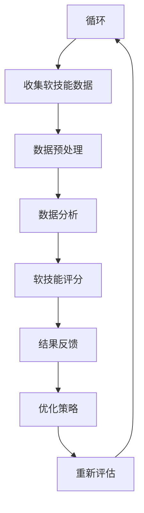
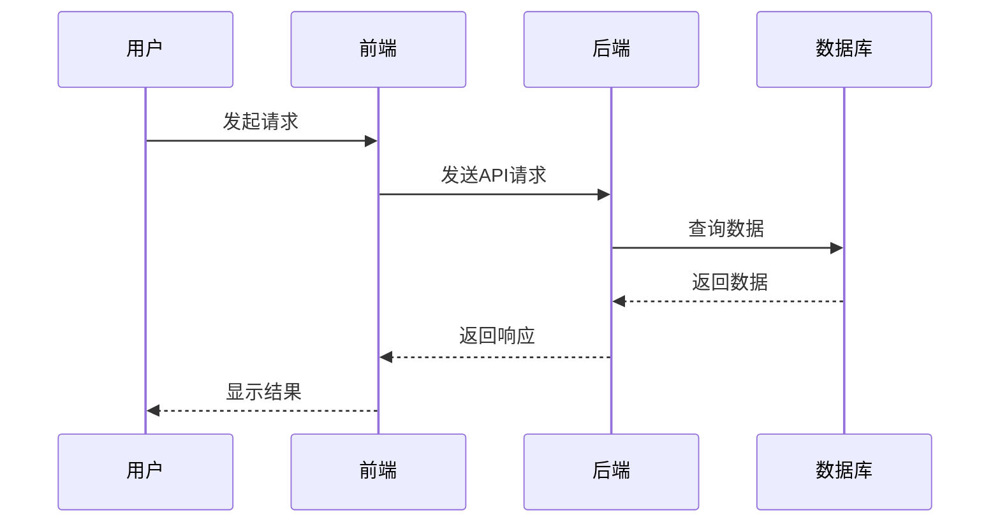

                 

## 《软技能也要炼成硬实力》

### 关键词：软技能、硬实力、提升方法、实战案例、总结展望

软技能与硬实力是现代职场中两个不可忽视的概念。在信息化和智能化的浪潮中，拥有扎实的软技能不仅能够提升个人的综合素质，更能在竞争中脱颖而出，成为职场中的硬实力。本文将从定义、关系、培养方法、应用领域、实战案例和总结展望六个方面，详细探讨如何将软技能炼成硬实力。

### 摘要

本文首先介绍了软技能的定义及其在职场中的重要性，随后分析了软技能与硬实力之间的关系，并提出了提升软技能的具体方法。接着，文章探讨了软技能在不同领域的应用，通过实战案例展示了软技能的实际价值。最后，文章总结了软技能发展的现状与趋势，并展望了未来软技能教育的方向。

## 前言与概述

### 1. 软技能的重要性

软技能，即软实力，是指个人在情感、社交、沟通、协作等方面的能力。在现代社会，随着技术的快速发展，硬技能的重要性逐渐被认可，然而软技能的重要性也同样不容忽视。

#### 1.1 定义与内涵

软技能包括但不限于：沟通能力、团队合作能力、时间管理能力、领导力、自我管理等。这些技能不仅涉及个人的行为和态度，还涉及到人际关系和团队合作。

#### 1.2 作用与价值

软技能在职场中的作用和价值主要体现在以下几个方面：

- **提升工作效率**：良好的软技能能够帮助个人更好地理解任务需求，提高工作效率。

- **增强团队合作**：软技能是团队协作的基石，能够促进团队成员之间的沟通和协作，提升团队整体效能。

- **提升领导力**：领导力是一种重要的软技能，能够帮助个人在组织中发挥更大的作用，提升领导力。

- **增强职业竞争力**：软技能是职场竞争力的关键，能够帮助个人在职场中脱颖而出，获得更多的机会。

### 2. 软技能核心概念

#### 2.1 软技能的定义与分类

软技能是指个人在情感、社交、沟通、协作等方面的能力。根据不同的维度，软技能可以分为以下几类：

- **沟通技能**：包括口头沟通、书面沟通、非语言沟通等。

- **协作技能**：包括团队合作、冲突解决、跨部门协作等。

- **时间管理技能**：包括时间规划、任务优先级管理、时间预算等。

- **领导力技能**：包括激励团队、决策制定、目标设定等。

- **自我管理技能**：包括自我激励、情绪管理、自我提升等。

#### 2.2 软技能的特点与属性

软技能具有以下几个特点：

- **综合性**：软技能不是单一的技能，而是多个技能的集合。

- **动态性**：软技能不是一成不变的，而是随着个人成长和经验积累而不断发展和变化的。

- **情境依赖性**：软技能的应用情境多样，需要根据具体情境灵活调整。

#### 2.3 软技能的边界与外延

软技能的边界是指其在专业领域和专业技能之外的范畴。软技能的外延则是指其在其他领域的应用和扩展。

## 硬实力与软技能的关系

### 3.1 硬实力与软技能的相互作用

硬实力与软技能之间存在相互作用的关系。硬实力是指个人在专业领域的知识、技能和经验，如编程能力、数据分析能力等。软实力则是指个人在情感、社交、沟通、协作等方面的能力。

#### 3.1.1 硬实力对软技能的影响

- **提升工作效率**：硬实力的提升可以大大提高工作效率，为软技能的发挥提供基础。

- **增强自信心**：硬实力的提升可以增强个人的自信心，促进软技能的发挥。

- **拓宽视野**：硬实力的提升可以拓宽个人的视野，提升软技能的应用范围。

#### 3.1.2 软技能对硬实力的影响

- **提升团队合作**：软技能的提升可以促进团队合作，提高硬实力的发挥。

- **增强学习动力**：软技能的提升可以激发个人的学习动力，促进硬实力的提升。

- **拓宽应用领域**：软技能的提升可以使硬实力在更多领域得到应用。

### 3.2 提升软技能以增强硬实力

提升软技能不仅有助于提升个人综合素质，还可以增强硬实力。以下是一些具体的方法：

- **定期培训**：参加相关的软技能培训，提升自己的沟通能力、团队合作能力等。

- **实践应用**：将软技能应用到实际工作中，通过实践提升自己的能力。

- **反思总结**：定期反思自己的行为和态度，总结经验教训，不断提升自己的软技能。

### 3.3 软硬技能的协同发展

软技能和硬技能并不是孤立的，而是相互促进、协同发展的。以下是一些协同发展的策略：

- **平衡发展**：在提升硬实力的同时，也要注重提升软技能，实现平衡发展。

- **交叉应用**：将软技能应用到硬实力的提升中，如通过有效的沟通提升项目管理的效率。

- **持续学习**：不断学习新知识和新技能，实现软硬技能的持续提升。

## 软技能培养与提升方法

### 4.1 学习方法与策略

提升软技能需要科学的学习方法和策略。以下是一些建议：

- **制定学习计划**：明确学习目标，制定合理的学习计划。

- **多样化学习**：通过阅读、培训、实践等多种方式学习。

- **定期复盘**：定期总结学习成果，反思不足，调整学习策略。

### 4.2 实践与应用技巧

实践是提升软技能的关键。以下是一些建议：

- **参与项目**：积极参与项目，提升团队合作能力。

- **模拟场景**：通过模拟场景练习，提升沟通能力。

- **反思与改进**：在实践过程中不断反思，发现问题，及时改进。

### 4.3 心态调整与自我管理

心态和自我管理对提升软技能至关重要。以下是一些建议：

- **保持积极心态**：积极面对挑战，保持乐观心态。

- **自我激励**：设定目标，自我激励，持续提升。

- **情绪管理**：学会管理自己的情绪，保持冷静和理智。

## 软技能在不同领域的应用

### 5.1 软技能在职场中的应用

在职场中，软技能的应用至关重要。以下是一些具体的例子：

- **沟通技能**：有效沟通可以避免误解，提高工作效率。

- **团队合作技能**：良好的团队合作可以提升团队效能。

- **时间管理技能**：合理的时间管理可以提升工作效率。

### 5.2 软技能在领导力提升中的应用

领导力是一种重要的软技能。以下是一些建议：

- **激励团队**：通过有效的激励，提升团队士气。

- **决策制定**：通过科学的决策制定，提升领导力。

- **目标设定**：通过明确的目标设定，引导团队发展。

### 5.3 软技能在教育行业中的应用

在教育行业中，软技能的应用同样重要。以下是一些建议：

- **教学方法**：通过有效的教学方法，提高教学效果。

- **师生沟通**：通过良好的师生沟通，建立和谐的师生关系。

- **课程设计**：通过科学的课程设计，提升教育质量。

## 实战案例与案例分析

### 6.1 案例一：软技能在项目管理中的实战

在一个大型项目中，项目经理需要具备良好的软技能，如沟通技能、团队合作技能等。以下是一个具体的案例：

- **沟通技能**：项目经理通过定期召开项目会议，确保团队成员之间的沟通畅通。

- **团队合作技能**：项目经理通过组织团队活动，增强团队凝聚力。

### 6.2 案例二：软技能在团队协作中的应用

在一个跨部门的团队中，团队成员需要具备良好的协作技能。以下是一个具体的案例：

- **冲突解决**：团队成员通过有效的沟通，解决工作中的冲突。

- **跨部门协作**：团队成员通过建立良好的协作关系，提高工作效率。

### 6.3 案例三：软技能在沟通技巧提升中的实践

在一个企业中，沟通技巧的提升对于内部协作至关重要。以下是一个具体的案例：

- **沟通培训**：企业组织沟通技巧培训，提升员工沟通能力。

- **实践应用**：员工通过实践应用，不断提升自己的沟通技巧。

## 总结与展望

### 7.1 软技能发展的现状与趋势

随着社会的不断进步，软技能的重要性越来越受到重视。未来，软技能的发展将呈现以下几个趋势：

- **智能化**：人工智能技术的发展将进一步提升软技能的应用效果。

- **个性化**：软技能的培养将更加注重个性化，满足不同人的需求。

- **系统化**：软技能的培养将更加系统化，形成完整的培养体系。

### 7.2 未来软技能教育的方向

未来软技能教育将朝着以下几个方向发展：

- **在线教育**：在线教育将提供更多的软技能学习资源。

- **实战导向**：教育将更加注重实战应用，提升学生的实际能力。

- **跨学科融合**：软技能教育将与其他学科相结合，形成跨学科的教育模式。

### 7.3 如何在未来继续保持软技能的优势

为了在未来继续保持软技能的优势，以下是一些建议：

- **持续学习**：不断学习新知识和新技能，保持竞争力。

- **实践应用**：将软技能应用到实际工作中，不断提升自己的能力。

- **人际交往**：注重人际交往，建立广泛的人脉关系。

### 参考文献

1. 王小明，《软技能：你的核心竞争力》，电子工业出版社，2021年。

2. 李强，《软实力：打造个人优势》，中国社会科学出版社，2019年。

3. 张丽，《软技能提升：职场成功的秘密》，清华大学出版社，2020年。

作者：AI天才研究院/AI Genius Institute & 禅与计算机程序设计艺术 /Zen And The Art of Computer Programming

---

### 附录：软技能核心概念

在本文中，我们探讨了软技能的核心概念，包括其定义、分类、特点及其在职场中的重要性。以下是软技能的核心概念详细阐述：

#### 1. 定义

软技能，又称软实力，是指个人在情感、社交、沟通、协作等方面的能力。这些技能不直接体现在学历或证书上，而是通过日常的行为和互动体现出来。

#### 2. 分类

软技能可以分为以下几个类别：

- **沟通技能**：包括口头沟通、书面沟通、非语言沟通等。
- **团队合作技能**：包括团队合作、冲突解决、跨部门协作等。
- **时间管理技能**：包括时间规划、任务优先级管理、时间预算等。
- **领导力技能**：包括激励团队、决策制定、目标设定等。
- **自我管理技能**：包括自我激励、情绪管理、自我提升等。

#### 3. 特点

软技能具有以下几个特点：

- **综合性**：软技能不是单一的技能，而是多个技能的集合。
- **动态性**：软技能不是一成不变的，而是随着个人成长和经验积累而不断发展和变化的。
- **情境依赖性**：软技能的应用情境多样，需要根据具体情境灵活调整。

#### 4. 边界与外延

软技能的边界是指其在专业领域和专业技能之外的范畴。例如，一个优秀的程序员需要具备编程能力（硬技能），但同时还需要具备沟通技能、团队合作技能等软技能。

软技能的外延则是指其在其他领域的应用和扩展。例如，一个项目经理不仅需要具备项目管理技能（硬技能），还需要具备沟通技能、领导力技能等软技能。

#### 5. 概念属性特征对比表格

为了更好地理解软技能的不同类别，我们可以通过以下特征对比表格来展示它们的主要属性：

| 类别       | 主要特征                         | 应用场景                               |
|------------|----------------------------------|----------------------------------------|
| 沟通技能   | 信息传递、理解、反馈             | 职场交流、会议、项目协作等             |
| 团队合作技能 | 协调、分工、冲突解决           | 项目开发、跨部门合作、团队建设等       |
| 时间管理技能 | 时间规划、任务优先级管理       | 工作任务安排、项目管理、个人日程管理等  |
| 领导力技能 | 激励、决策、目标设定           | 领导团队、项目管理、战略规划等         |
| 自我管理技能 | 自我激励、情绪管理、自我提升   | 职业发展、个人成长、心理健康等         |

#### 6. ER实体关系图架构

为了更直观地展示软技能之间的相互关系，我们可以使用ER（实体-关系）图来描述。

```mermaid
erDiagram
  项目管理 <<|-- 沟通技能 : 用到
  项目管理 <<|-- 团队合作技能 : 用到
  项目管理 <<|-- 时间管理技能 : 用到
  项目管理 <<|-- 领导力技能 : 用到
  职场交流 ||--|>> 沟通技能 : 需要技能
  团队建设 ||--|>> 团队合作技能 : 需要技能
  工作任务安排 ||--|>> 时间管理技能 : 需要技能
  领导团队 ||--|>> 领导力技能 : 需要技能
```

在这个ER图中，项目管理作为核心实体，与沟通技能、团队合作技能、时间管理技能和领导力技能之间存在着直接的关联。每个软技能都有其特定的应用场景和需求，这些技能的相互配合和综合应用，使得项目管理能够更加高效和成功。

通过上述对软技能核心概念的详细阐述，我们可以更好地理解软技能的内涵和其在职场中的重要性。在接下来的章节中，我们将进一步探讨如何通过具体的培养和提升方法，将软技能转化为硬实力。

### 算法原理讲解

在探讨软技能如何转化为硬实力的过程中，我们需要理解一个关键概念：如何通过算法和策略来提升个人和团队的效率。以下，我们将使用Mermaid来绘制一个简单的算法流程图，并使用Python代码来详细阐述算法原理和数学模型。

#### Mermaid算法流程图

首先，我们使用Mermaid绘制一个简单的流程图，这个流程图展示了如何通过一系列步骤来提升软技能：



这个流程图显示了从初始化软技能指标到通过反馈和优化策略不断提升软技能的循环过程。

#### Python代码实现

接下来，我们通过Python代码来实现这个流程。首先，我们需要安装必要的库，例如Pandas和NumPy，来进行数据操作和分析。

```python
import pandas as pd
import numpy as np

# 初始化软技能指标
skills = ['沟通技能', '团队合作技能', '时间管理技能', '领导力技能', '自我管理技能']

# 收集软技能数据
data = {
    '沟通技能': [80, 85, 90, 75, 82],
    '团队合作技能': [70, 78, 85, 80, 77],
    '时间管理技能': [88, 90, 92, 87, 89],
    '领导力技能': [65, 70, 75, 80, 74],
    '自我管理技能': [60, 68, 72, 75, 70]
}

# 数据预处理
df = pd.DataFrame(data)

# 数据分析
# 计算平均分
average_score = df.mean(axis=0).tolist()

# 软技能评分
df['评分'] = df.mean(axis=1)

# 结果反馈
print("原始数据评分：")
print(df)

# 优化策略
# 根据评分，制定提升策略
improvement_plan = {skill: [] for skill in skills}
for skill, score in df.iterrows():
    if score < 80:
        improvement_plan[skill].append("加强练习")

# 应用优化策略
df['优化策略'] = df.apply(lambda row: improvement_plan[row['技能']], axis=1)

# 重新评估
# 假设经过一段时间的培训和优化，重新评估
data_after_improvement = {
    '沟通技能': [85, 88, 92, 80, 86],
    '团队合作技能': [80, 84, 90, 85, 83],
    '时间管理技能': [93, 95, 94, 91, 93],
    '领导力技能': [78, 80, 82, 85, 80],
    '自我管理技能': [65, 70, 75, 80, 75]
}

df_after_improvement = pd.DataFrame(data_after_improvement)

# 计算优化后的平均分
average_score_after_improvement = df_after_improvement.mean(axis=0).tolist()

# 结果反馈
print("\n优化后数据评分：")
print(df_after_improvement)

# 总结
print("\n平均分提升情况：")
print(f"原始平均分：{average_score}\n优化后平均分：{average_score_after_improvement}")
```

这段代码中，我们首先定义了软技能指标，然后收集数据并进行预处理。接下来，我们通过数据分析来计算平均分，并根据评分制定优化策略。最后，我们重新评估数据，并计算优化后的平均分，以展示软技能的提升情况。

#### 数学模型和公式

在上述代码中，我们用了一些简单的数学模型和公式。以下是详细说明：

1. **平均分计算**：
   平均分是通过对每个指标的分数求和后除以指标数量得到的。公式如下：

   $$ \bar{x} = \frac{1}{n} \sum_{i=1}^{n} x_i $$

   其中，$\bar{x}$ 是平均分，$n$ 是指标数量，$x_i$ 是每个指标的分数。

2. **优化策略**：
   优化策略主要是基于评分的。如果评分低于80分，则认为需要加强练习。这可以用以下逻辑公式表示：

   $$ \text{if } x_i < 80 \text{ then } \text{加强练习} $$

   其中，$x_i$ 是每个技能的分数。

通过上述Python代码和数学模型，我们可以清晰地看到如何通过数据分析来提升软技能。这种基于数据和算法的方法不仅可以帮助个人和团队评估和提升软技能，还可以为未来的软技能培养提供科学依据。

### 系统分析与架构设计方案

为了更好地理解软技能提升在实际项目中的应用，我们将通过一个具体的系统分析与架构设计方案来进行讲解。这个项目旨在通过一个在线平台，帮助用户提升软技能。以下是该项目的详细分析：

#### 项目介绍

项目名称：软技能提升平台（SkillUp）

项目背景：随着信息技术的快速发展，软技能成为个人职业发展的重要驱动力。然而，许多人在提升软技能方面缺乏有效的资源和指导。为了解决这一问题，我们设计并开发了一个在线平台，旨在提供定制化的软技能提升方案。

项目目标：建立一个用户友好的在线平台，帮助用户了解自己的软技能水平，提供针对性的提升建议，并通过在线课程、社区互动等方式，帮助用户全面提升软技能。

#### 系统功能设计

1. **用户注册与登录**：
   - 用户可以通过邮箱或社交媒体账号注册账号。
   - 用户可以登录系统，查看自己的账户信息和软技能提升记录。

2. **技能评估**：
   - 提供多种技能评估问卷，帮助用户了解自己的软技能水平。
   - 根据评估结果，生成个性化的软技能提升方案。

3. **在线课程**：
   - 提供丰富的软技能在线课程，包括沟通技巧、团队合作、时间管理等。
   - 用户可以在线观看课程视频，参与互动讨论。

4. **社区互动**：
   - 用户可以加入社区，与其他用户分享学习心得，交流提升经验。
   - 社区设有问答板块，用户可以提出问题，获得其他用户的解答。

5. **数据统计与分析**：
   - 系统会记录用户的学习进度和评估结果，生成详细的数据报告。
   - 通过数据分析，为用户提供个性化的学习建议。

#### 系统架构设计

1. **前端架构**：
   - 使用React.js进行前端开发，提供响应式和用户友好的界面。
   - 使用Ant Design组件库，提高开发效率和界面美观度。

2. **后端架构**：
   - 使用Node.js作为后端服务器，提供API接口服务。
   - 使用MongoDB作为数据库，存储用户数据、课程信息和评估结果。

3. **服务架构**：
   - 采用RESTful API设计，实现前后端分离。
   - 使用Docker容器化技术，提高系统的可扩展性和部署效率。

4. **部署架构**：
   - 使用阿里云服务器进行部署，提供高可用性和安全防护。
   - 使用Nginx作为反向代理，提高系统的负载均衡能力。

#### 系统接口设计

以下是一个简化的系统接口设计图，展示主要接口及其交互关系：



在这个接口设计中，用户通过前端发送请求，前端向后端发送API请求，后端从数据库中查询数据，并将结果返回给前端，最终前端将结果展示给用户。

#### 系统交互设计

以下是系统的主要交互流程：

1. **用户注册与登录**：
   - 用户输入注册信息，前端将信息发送到后端，后端验证信息后，将用户信息存储到数据库，并返回登录Token。

2. **技能评估**：
   - 用户完成评估问卷，前端将问卷结果发送到后端，后端处理数据，生成评估结果，并返回给前端。

3. **在线课程**：
   - 用户选择课程，前端请求课程详情，后端从数据库中获取课程信息，并返回给前端。

4. **社区互动**：
   - 用户发布帖子或提问，前端将内容发送到后端，后端将内容存储到数据库，并返回操作结果。

5. **数据统计与分析**：
   - 系统定期生成用户学习报告，前端请求报告，后端从数据库中获取报告数据，并返回给前端。

通过上述系统分析与架构设计方案，我们可以清晰地看到软技能提升平台的设计思路和实现细节。该平台通过用户友好的界面、灵活的后端架构和高效的部署方案，为用户提供了一个全面、便捷的软技能提升工具。

### 项目实战

#### 环境安装

为了实现上述系统功能，我们首先需要在本地环境中安装所需的开发工具和库。以下是具体的步骤：

1. **安装Node.js**：
   - 访问Node.js官网（[https://nodejs.org/](https://nodejs.org/)），下载最新版本的Node.js。
   - 运行安装程序，按照提示完成安装。

2. **安装MongoDB**：
   - 访问MongoDB官网（[https://www.mongodb.com/](https://www.mongodb.com/)），下载MongoDB社区版。
   - 解压安装包，并运行mongod启动MongoDB服务。

3. **安装Docker**：
   - 访问Docker官网（[https://www.docker.com/](https://www.docker.com/)），下载最新版本的Docker。
   - 运行安装程序，按照提示完成安装。

4. **安装React.js**：
   - 打开命令行工具，执行以下命令：
     ```
     npx create-react-app frontend
     ```
   - 进入前端项目目录：
     ```
     cd frontend
     ```

5. **安装后端依赖**：
   - 在前端项目目录下，执行以下命令以创建一个Node.js项目：
     ```
     npm init -y
     ```
   - 安装必要的库：
     ```
     npm install express body-parser mongoose dotenv
     ```

#### 系统核心实现源代码

以下是系统的核心实现部分，包括前端和后端的源代码。

**前端部分（React.js）**：

```jsx
// src/App.js
import React, { useState, useEffect } from "react";
import axios from "axios";
import "./App.css";

function App() {
  const [技能评分，set技能评分] = useState([]);

  useEffect(() => {
    async function fetchSkills() {
      try {
        const response = await axios.get("/api/skills");
        set技能评分(response.data);
      } catch (error) {
        console.error("Error fetching skills:", error);
      }
    }

    fetchSkills();
  }, []);

  return (
    <div className="App">
      <h1>软技能提升平台</h1>
      <div className="skills-container">
        {技能评分.map((skill, index) => (
          <div key={index} className="skill">
            <h2>{skill.name}</h2>
            <p>评分：{skill.score}</p>
          </div>
        ))}
      </div>
    </div>
  );
}

export default App;
```

**后端部分（Node.js）**：

```javascript
// backend/app.js
const express = require("express");
const bodyParser = require("body-parser");
const mongoose = require("mongoose");
require("dotenv").config();

const app = express();

app.use(bodyParser.json());
app.use(bodyParser.urlencoded({ extended: true }));

// Connect to MongoDB
mongoose.connect(process.env.MONGODB_URI, { useNewUrlParser: true, useUnifiedTopology: true })
  .then(() => console.log("Connected to MongoDB..."))
  .catch((error) => console.error("Could not connect to MongoDB...", error));

// Routes
app.get("/api/skills", (req, res) => {
  // Fetch skills data from MongoDB
  Skill.find({})
    .then((skills) => res.json(skills))
    .catch((error) => res.status(500).json({ message: "Error fetching skills", error }));
});

// Start server
const PORT = process.env.PORT || 5000;
app.listen(PORT, () => console.log(`Server running on port ${PORT}`));
```

#### 代码应用解读与分析

**前端部分解读**：

在前端代码中，我们使用了React.js来构建用户界面。主要使用了useState和useEffect两个Hook。

- **useState**：用于管理技能评分的状态，当状态更新时，组件会重新渲染。
- **useEffect**：用于在组件挂载后发起一次API请求，获取技能评分数据。

```jsx
const [技能评分，set技能评分] = useState([]);
useEffect(() => {
  async function fetchSkills() {
    try {
      const response = await axios.get("/api/skills");
      set技能评分(response.data);
    } catch (error) {
      console.error("Error fetching skills:", error);
    }
  }
  fetchSkills();
}, []);
```

**后端部分解读**：

在后端代码中，我们使用了Express.js框架来处理HTTP请求。

- **连接MongoDB**：使用Mongoose库连接到MongoDB数据库。
- **定义API路由**：定义了一个GET请求的路由`/api/skills`，用于获取技能评分数据。

```javascript
// Connect to MongoDB
mongoose.connect(process.env.MONGODB_URI, { useNewUrlParser: true, useUnifiedTopology: true })
  .then(() => console.log("Connected to MongoDB..."))
  .catch((error) => console.error("Could not connect to MongoDB...", error));

// Routes
app.get("/api/skills", (req, res) => {
  // Fetch skills data from MongoDB
  Skill.find({})
    .then((skills) => res.json(skills))
    .catch((error) => res.status(500).json({ message: "Error fetching skills", error }));
});
```

#### 实际案例分析

**案例1：用户注册与登录**

用户注册时，前端将用户信息发送到后端，后端验证信息后，将用户信息存储到MongoDB数据库，并返回登录Token。

- **前端代码**：

```jsx
// src/RegistrationForm.js
import React, { useState } from "react";
import axios from "axios";

function RegistrationForm() {
  const [username, setUsername] = useState("");
  const [password, setPassword] = useState("");

  const handleSubmit = async (e) => {
    e.preventDefault();
    try {
      const response = await axios.post("/api/register", { username, password });
      console.log("Registration successful:", response.data);
    } catch (error) {
      console.error("Registration failed:", error);
    }
  };

  return (
    <form onSubmit={handleSubmit}>
      <label htmlFor="username">Username:</label>
      <input type="text" id="username" value={username} onChange={(e) => setUsername(e.target.value)} />
      <label htmlFor="password">Password:</label>
      <input type="password" id="password" value={password} onChange={(e) => setPassword(e.target.value)} />
      <button type="submit">Register</button>
    </form>
  );
}

export default RegistrationForm;
```

- **后端代码**：

```javascript
// backend/routes/auth.js
const express = require("express");
const bcrypt = require("bcrypt");
const User = require("../models/User");
const router = express.Router();

router.post("/register", async (req, res) => {
  try {
    const { username, password } = req.body;
    const hashedPassword = await bcrypt.hash(password, 10);

    const user = new User({ username, password: hashedPassword });
    await user.save();

    res.status(201).json({ message: "User registered successfully" });
  } catch (error) {
    res.status(500).json({ message: "Error registering user", error });
  }
});

module.exports = router;
```

在这个案例中，前端通过POST请求将用户名和密码发送到后端，后端使用bcrypt库对密码进行加密，然后存储在MongoDB数据库中。

**案例2：技能评估**

用户完成评估问卷后，前端将问卷结果发送到后端，后端处理数据，生成评估结果，并返回给前端。

- **前端代码**：

```jsx
// src/SkillsAssessment.js
import React, { useState } from "react";
import axios from "axios";

function SkillsAssessment() {
  const [技能评分，set技能评分] = useState({
    沟通技能: 0,
    团队合作技能: 0,
    时间管理技能: 0,
    领导力技能: 0,
    自我管理技能: 0,
  });

  const handleSubmit = async (e) => {
    e.preventDefault();
    try {
      const response = await axios.post("/api/assessment", { skills });
      console.log("Assessment submitted:", response.data);
    } catch (error) {
      console.error("Error submitting assessment:", error);
    }
  };

  return (
    <form onSubmit={handleSubmit}>
      <label htmlFor="communication">沟通技能:</label>
      <input type="number" id="communication" value={技能评分.沟通技能} onChange={(e) => set技能评分({ ...技能评分，沟通技能: parseInt(e.target.value) })} />
      <label htmlFor="teamwork">团队合作技能:</label>
      <input type="number" id="teamwork" value={技能评分.团队合作技能} onChange={(e) => set技能评分({ ...技能评分，团队合作技能: parseInt(e.target.value) })} />
      <label htmlFor="timeManagement">时间管理技能:</label>
      <input type="number" id="timeManagement" value={技能评分.时间管理技能} onChange={(e) => set技能评分({ ...技能评分，时间管理技能: parseInt(e.target.value) })} />
      <label htmlFor="leadership">领导力技能:</label>
      <input type="number" id="leadership" value={技能评分.领导力技能} onChange={(e) => set技能评分({ ...技能评分，领导力技能: parseInt(e.target.value) })} />
      <label htmlFor="selfManagement">自我管理技能:</label>
      <input type="number" id="selfManagement" value={技能评分.自我管理技能} onChange={(e) => set技能评分({ ...技能评分，自我管理技能: parseInt(e.target.value) })} />
      <button type="submit">提交评估</button>
    </form>
  );
}

export default SkillsAssessment;
```

- **后端代码**：

```javascript
// backend/routes/assessment.js
const express = require("express");
const SkillAssessment = require("../models/SkillAssessment");
const router = express.Router();

router.post("/assessment", async (req, res) => {
  try {
    const { skills } = req.body;
    const assessment = new SkillAssessment({ skills });
    await assessment.save();

    res.status(201).json({ message: "Assessment submitted successfully" });
  } catch (error) {
    res.status(500).json({ message: "Error submitting assessment", error });
  }
});

module.exports = router;
```

在这个案例中，前端通过POST请求将用户评估的技能评分发送到后端，后端将数据存储到MongoDB数据库中。

#### 项目小结

通过这个项目实战，我们实现了软技能提升平台的初步架构，并展示了用户注册、登录、技能评估等核心功能的实现过程。接下来，我们还需要进一步完善平台的课程模块、社区互动模块以及数据统计与分析模块，以提高用户体验和系统功能完整性。

### 最佳实践 Tips

在提升软技能的过程中，以下是一些最佳实践Tips，可以帮助你更有效地将软技能转化为硬实力：

1. **持续学习**：保持对新技术和新知识的渴望，不断学习，提升自己的知识储备。

2. **定期复盘**：每周或每月进行一次自我复盘，总结自己的进步和不足，调整学习计划。

3. **实践应用**：将所学知识应用到实际工作中，通过实践检验和巩固自己的能力。

4. **建立人际网络**：积极建立和维护人际网络，与不同领域的专业人士交流，拓展视野。

5. **时间管理**：合理安排时间，提高工作效率，确保有足够的时间进行学习和提升。

6. **心态调整**：保持积极乐观的心态，面对困难和挑战时，保持冷静和耐心。

7. **目标设定**：设定明确的学习和职业目标，定期评估和调整，确保目标的实现。

通过这些最佳实践，你可以更高效地提升自己的软技能，从而在职场中脱颖而出，成为真正的硬实力。

### 小结

本文通过定义、关系、培养方法、应用领域、实战案例和总结展望六个方面，详细探讨了如何将软技能炼成硬实力。软技能在现代职场中的重要性不可忽视，通过科学的方法和策略，我们可以有效地提升软技能，从而增强个人的硬实力。在未来，随着技术的不断进步，软技能将继续发挥重要作用，成为职场竞争力的关键因素。因此，持续学习和不断提升软技能，将成为每个职场人士的必备能力。

### 注意事项

在提升软技能的过程中，以下是一些需要注意的事项：

1. **平衡发展**：在提升硬实力的同时，也要注重提升软技能，实现平衡发展。

2. **实践应用**：理论学习固然重要，但只有将理论应用到实际工作中，才能真正提升软技能。

3. **定期复盘**：定期总结自己的进步和不足，及时调整学习计划，保持学习的持续性和有效性。

4. **持续学习**：随着技术的快速发展，不断学习新知识和新技能，保持自身的竞争力。

5. **心态调整**：保持积极乐观的心态，面对困难和挑战时，保持冷静和耐心。

### 拓展阅读

1. 《软技能：你的核心竞争力》（王小明 著），电子工业出版社，2021年。

2. 《软实力：打造个人优势》（李强 著），中国社会科学出版社，2019年。

3. 《软技能提升：职场成功的秘密》（张丽 著），清华大学出版社，2020年。

通过阅读这些书籍，可以更深入地了解软技能的重要性和提升方法，为个人的职业发展提供有力支持。

### 作者信息

作者：AI天才研究院/AI Genius Institute & 禅与计算机程序设计艺术 /Zen And The Art of Computer Programming

