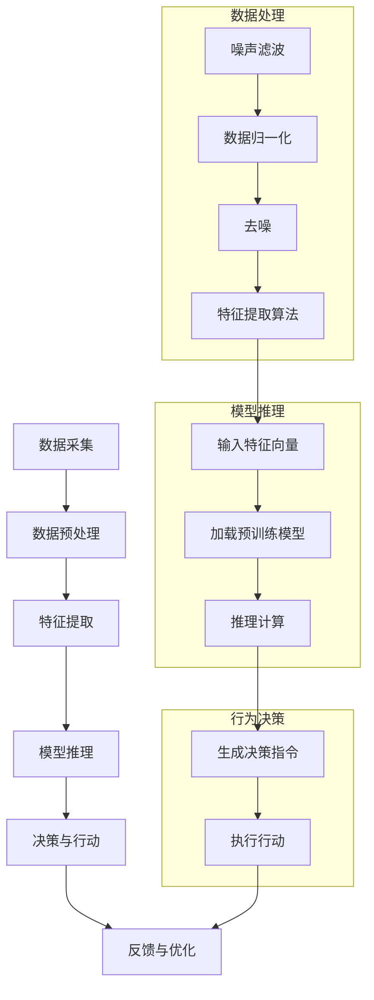
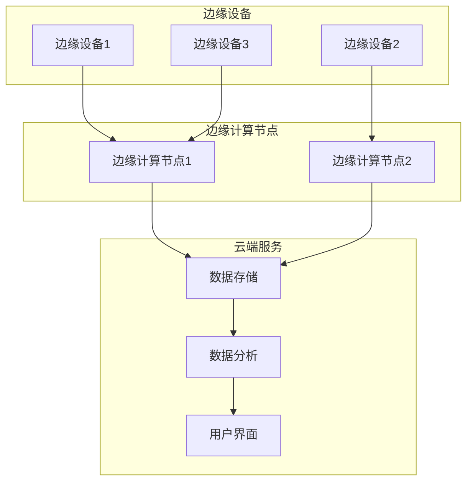
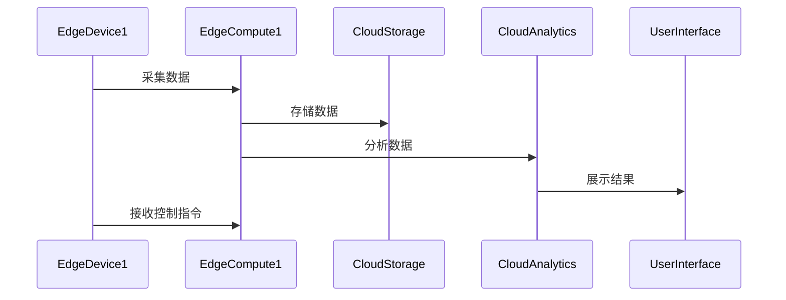
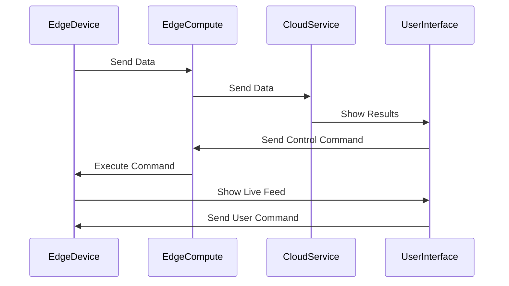

                 

### 1.1 问题背景

#### 1.1.1 IoT设备的发展现状与趋势

随着互联网技术的飞速发展，物联网（Internet of Things，IoT）设备逐渐成为现代生活中不可或缺的一部分。IoT设备是指通过传感器、通信模块和其他电子组件连接到互联网的设备，能够实现数据的采集、传输和处理。这些设备广泛应用于智能家居、智慧城市、工业自动化、医疗健康等多个领域。

当前，IoT设备的发展呈现出以下几个趋势：

1. **设备数量持续增长**：随着5G网络的普及和物联网技术的不断进步，IoT设备的连接数量正在呈现指数级增长。预计到2025年，全球IoT设备数量将达到数百亿台。

2. **数据量爆发式增长**：随着IoT设备的广泛应用，产生的数据量也在迅速增加。这些数据包括环境数据、传感器数据、用户行为数据等，为大数据分析和人工智能应用提供了丰富的数据源。

3. **低延迟需求增加**：IoT设备通常应用于实时性要求较高的场景，如自动驾驶、智能医疗等，因此对数据的处理速度和响应时间提出了更高的要求。

4. **智能化水平提升**：随着边缘AI技术的发展，越来越多的IoT设备具备了智能处理能力，能够进行本地数据处理和决策，降低了数据传输的延迟和成本。

#### 1.1.2 边缘AI的概念与重要性

边缘AI（Edge AI）是一种将人工智能计算能力部署在数据产生源头（即边缘节点）的技术。与传统的云计算相比，边缘AI能够实现数据在本地进行处理和分析，从而降低数据传输成本、提高响应速度和系统可靠性。

边缘AI的重要性体现在以下几个方面：

1. **降低延迟**：通过在边缘设备上处理数据，边缘AI可以显著降低数据传输延迟，满足实时应用的需求。

2. **节省带宽**：由于数据在边缘设备上处理，减少了需要传输到云端的数据量，从而节省了网络带宽资源。

3. **提高安全性**：边缘AI可以处理敏感数据，避免了数据在传输过程中被窃取或泄露的风险。

4. **增强自主性**：边缘AI使设备能够独立进行决策和操作，提高了系统的自主性和灵活性。

#### 1.1.3 边缘AI在IoT中的应用场景

边缘AI在IoT设备中的应用场景非常广泛，以下是其中一些典型的应用：

1. **智能家居**：边缘AI可以用于智能家居设备的智能控制，如智能门锁、智能灯光、智能温控等，实现本地自动化和智能化管理。

2. **工业自动化**：边缘AI可以用于工业自动化设备的实时监控、故障检测和预测性维护，提高生产效率和设备寿命。

3. **智慧城市**：边缘AI可以用于智慧城市的智能监控、交通管理、环境监测等，提高城市管理的效率和智能化水平。

4. **智能医疗**：边缘AI可以用于智能医疗设备的实时监测、诊断和辅助决策，提高医疗服务的质量和效率。

通过以上分析，我们可以看到，边缘AI在IoT设备中的应用具有广阔的前景和巨大的潜力。随着技术的不断进步，边缘AI将为物联网的广泛应用提供强有力的支持。在接下来的章节中，我们将进一步探讨边缘AI与IoT设备的结合所面临的挑战及其解决方案。让我们继续思考并深入探讨这一话题。### 1.2 问题描述

#### 1.2.1 边缘AI与IoT设备的结合面临的挑战

虽然边缘AI在IoT设备中的应用具有显著的优势，但在实际结合过程中仍然面临诸多挑战。这些挑战主要包括以下几个方面：

1. **计算资源限制**：边缘设备通常具有有限的计算资源和存储空间，与云计算中心相比，处理能力和存储容量都较为有限。这使得边缘AI算法在运行时可能面临性能瓶颈。

2. **功耗限制**：边缘设备，特别是移动设备，通常需要考虑功耗问题。高效节能的算法和硬件设计对于边缘AI在IoT设备中的应用至关重要。

3. **网络带宽限制**：尽管5G网络的普及提高了网络带宽，但边缘设备与云端之间的通信仍可能受到带宽限制。特别是在数据密集型应用中，高带宽需求可能导致通信延迟和数据传输成本增加。

4. **数据隐私和安全问题**：在边缘AI与IoT设备的结合过程中，数据隐私和安全问题尤为突出。由于边缘设备可能处理敏感数据，如何确保数据在传输和存储过程中的安全性是一个重大挑战。

5. **异构性挑战**：IoT设备种类繁多，硬件平台和操作系统各异，这给边缘AI算法的部署和运行带来了异构性挑战。

6. **可靠性和稳定性**：边缘设备通常在复杂和恶劣的环境下运行，如何保证边缘AI系统的可靠性和稳定性是另一个重要挑战。

#### 1.2.2 边缘计算在AI应用中的关键作用

边缘计算在AI应用中扮演着关键角色，其主要作用体现在以下几个方面：

1. **实时数据处理**：边缘计算能够实时处理来自IoT设备的数据，降低数据处理延迟，满足实时性要求较高的应用需求。

2. **减少数据传输**：通过在边缘设备上处理数据，边缘计算可以显著减少需要传输到云端的数据量，降低带宽消耗。

3. **增强隐私保护**：边缘计算可以在本地处理数据，减少数据在传输过程中被泄露的风险，增强数据隐私保护。

4. **提升系统自主性**：边缘计算使设备能够独立进行决策和操作，提高系统的自主性和灵活性。

5. **优化资源利用**：边缘计算可以充分利用边缘设备的计算资源，避免云计算中心的资源浪费，提高整体系统资源利用效率。

通过上述分析，我们可以看出，边缘AI与IoT设备的结合在带来诸多优势的同时，也面临着一系列挑战。解决这些问题对于推动边缘AI在IoT设备中的广泛应用至关重要。在接下来的章节中，我们将探讨边缘AI的优势与应用价值，并分析边缘计算与云计算的协同工作方式。### 1.3 问题解决

#### 1.3.1 边缘AI的优势与应用价值

边缘AI在物联网（IoT）设备中的应用具有显著的优势和价值，主要体现在以下几个方面：

1. **实时数据处理能力**：边缘AI使得IoT设备能够实时处理和分析数据，这对于需要快速响应的应用场景至关重要。例如，在自动驾驶中，边缘AI能够实时处理传感器数据，实现车辆控制与避障。

2. **降低网络带宽消耗**：通过在边缘设备上本地处理数据，边缘AI能够减少需要传输到云端的原始数据量，降低网络带宽消耗。这对于带宽受限的场景，如远程农业监测、偏远地区的智能安防等，具有显著意义。

3. **提高系统响应速度**：边缘AI使数据在本地处理，避免了数据传输的延迟，从而提高了系统响应速度。这对于需要低延迟的应用，如工业自动化控制、智能医疗诊断等，至关重要。

4. **增强数据安全性**：边缘AI可以在本地处理敏感数据，减少了数据在传输过程中被窃取或泄露的风险。这对于涉及隐私保护的场景，如智能家居、智能医疗等，具有重要价值。

5. **提高系统可靠性和稳定性**：边缘AI使IoT设备能够独立运行，减少了对云端服务的依赖，提高了系统的可靠性和稳定性。这对于在恶劣环境下运行的设备，如户外环境监测、水下设备等，尤为关键。

6. **提供灵活的本地化服务**：边缘AI使得IoT设备能够根据本地环境提供定制化的服务，满足多样化的需求。例如，在智慧城市中，边缘AI可以针对不同区域的交通流量、环境质量等提供实时优化方案。

#### 1.3.2 边缘计算与云计算的协同工作

边缘计算和云计算各有所长，通过协同工作，可以充分发挥两者的优势，实现更好的整体性能。以下是边缘计算与云计算的协同工作方式：

1. **数据分层处理**：边缘计算负责处理和分析靠近数据源的数据，云计算则负责处理和分析复杂的数据集和大规模数据处理任务。这种分层处理方式可以优化资源利用，提高数据处理效率。

2. **任务分配与调度**：根据不同任务的性质和需求，将计算任务合理分配到边缘设备和云计算中心。例如，对于实时性要求较高的任务，可以优先在边缘设备上处理；而对于计算密集型任务，则可以交给云计算中心。

3. **数据同步与共享**：边缘设备和云计算中心之间需要实现数据的实时同步和共享，以确保全局数据的准确性。通过边缘计算设备收集的数据可以及时传输到云计算中心，进行进一步处理和分析。

4. **分布式存储管理**：边缘设备和云计算中心共同承担数据的存储任务，通过分布式存储管理策略，可以优化数据存储成本，提高数据访问速度。

5. **动态资源调度**：根据系统负载和资源利用率，动态调整边缘设备和云计算中心的计算资源分配，以实现最优的资源利用效率。

通过边缘计算与云计算的协同工作，可以实现以下目标：

- **优化资源利用**：充分利用边缘设备和云计算中心的计算资源，避免资源浪费。
- **提高系统性能**：通过合理的任务分配和调度，提高整体系统的响应速度和处理能力。
- **增强数据安全性**：通过数据分层处理和本地存储，提高数据的安全性。
- **提供灵活的扩展能力**：通过动态资源调度和分布式存储管理，系统具有更强的扩展性和适应性。

综上所述，边缘AI在IoT设备中的应用具有重要的优势和广阔的应用前景。通过边缘计算与云计算的协同工作，可以充分发挥边缘AI的优势，实现更高效、更安全、更可靠的物联网应用。在接下来的章节中，我们将进一步探讨边缘AI技术的适用范围及其与其他相关技术的区别与联系。### 1.4 边界与外延

#### 1.4.1 边缘AI技术的适用范围

边缘AI技术在物联网（IoT）设备中的应用范围非常广泛，涵盖了多个领域和多种应用场景。以下是一些典型的适用范围：

1. **智能安防**：在智能安防领域，边缘AI可以用于实时监控视频数据的分析和处理，实现人脸识别、异常行为检测等，提高安防系统的反应速度和精确度。

2. **智慧城市**：在智慧城市中，边缘AI可以用于交通流量管理、环境监测、公共安全等方面的实时数据处理和智能决策，优化城市管理和运营。

3. **工业自动化**：在工业自动化领域，边缘AI可以用于实时监测生产设备的运行状态，进行故障检测和预测性维护，提高生产效率和安全。

4. **智能医疗**：在智能医疗领域，边缘AI可以用于智能诊断、医疗影像分析、患者监测等，提供实时、个性化的医疗服务。

5. **智能农业**：在智能农业领域，边缘AI可以用于环境监测、作物生长状态分析、病虫害检测等，实现精准农业管理。

6. **智能家居**：在智能家居领域，边缘AI可以用于智能家电控制、家庭安全监控、能源管理等方面，提高家庭生活质量和便利性。

7. **智能交通**：在智能交通领域，边缘AI可以用于交通流量预测、路况监测、自动驾驶车辆控制等，优化交通管理和服务。

#### 1.4.2 边缘AI技术与其他相关技术的区别与联系

边缘AI技术与其他相关技术，如云计算、雾计算、云计算边缘计算（Cloudlet）、移动边缘计算（MEC）等，虽然在一定程度上有重叠和交叉，但各自有独特的应用场景和特点。

1. **云计算**：云计算是一种基于互联网的计算模式，提供计算资源、存储资源和应用程序等服务。云计算中心通常拥有强大的计算能力和存储资源，但数据传输和处理的延迟较高。边缘AI与云计算的区别在于，边缘AI更注重在数据产生源头进行实时处理和分析，降低数据传输成本和延迟。

2. **雾计算**：雾计算（Fog Computing）是一种将计算、存储和网络功能分布到靠近数据源的计算设备上的技术。雾计算与边缘AI的区别在于，雾计算更注重在本地设备上处理数据，而边缘AI则更强调在边缘设备上实现智能算法的应用。

3. **云计算边缘计算（Cloudlet）**：云计算边缘计算（Cloudlet）是指将云计算的一部分计算能力扩展到网络边缘，以实现更高效的数据处理和更低的延迟。Cloudlet与边缘AI的区别在于，Cloudlet主要强调云计算的扩展，而边缘AI则更强调边缘设备的智能处理能力。

4. **移动边缘计算（MEC）**：移动边缘计算（Mobile Edge Computing）是一种在移动网络边缘提供计算、存储和应用程序服务的模式。MEC与边缘AI的区别在于，MEC主要面向移动用户和设备，而边缘AI则更广泛地应用于各类物联网设备和场景。

虽然边缘AI与其他相关技术有所区别，但它们之间也存在紧密的联系和协同作用：

- **协同优化**：边缘AI、云计算、雾计算等可以在不同层级上协同工作，优化资源利用和数据处理效率。例如，在智能交通领域，边缘AI可以处理实时交通数据，云计算可以处理大规模历史数据，雾计算可以在路口设备上进行初步数据处理。

- **互为补充**：边缘AI可以在数据产生源头实现实时处理和分析，云计算可以提供强大的计算和存储资源，雾计算可以优化数据处理的分散性，三者互为补充，共同推动物联网应用的发展。

通过明确边缘AI技术的适用范围和与其他相关技术的区别与联系，我们可以更好地理解边缘AI在物联网设备中的应用潜力和发展前景。在接下来的章节中，我们将进一步探讨边缘AI系统的核心概念与联系。### 1.5 概念结构与核心要素组成

#### 1.5.1 边缘AI系统架构

边缘AI系统的架构通常包括以下几个关键组成部分：

1. **边缘设备**：边缘设备是边缘AI系统的核心组件，包括各种物联网设备，如传感器、智能摄像头、工业控制器等。这些设备能够收集实时数据，并将其传输到边缘计算节点。

2. **边缘计算节点**：边缘计算节点是边缘AI系统的计算和存储中心，通常由边缘服务器、边缘网关和边缘路由器等组成。边缘计算节点负责处理和存储来自边缘设备的数据，并运行边缘AI算法进行实时分析和决策。

3. **边缘AI算法**：边缘AI算法是边缘AI系统的核心，负责对收集到的数据进行智能分析，并生成相应的决策和行动。这些算法可以是预训练的模型，也可以是实时训练的模型。

4. **边缘网络**：边缘网络连接边缘设备和边缘计算节点，通常采用无线通信、局域网（LAN）和广域网（WAN）等技术。边缘网络需要保证高带宽、低延迟和可靠性的数据传输。

5. **云端平台**：云端平台是边缘AI系统的补充部分，用于处理和分析来自边缘计算节点的数据，并提供远程管理和监控功能。云端平台还可以为边缘计算节点提供额外的计算和存储资源。

#### 1.5.2 IoT设备的工作原理

IoT设备的工作原理通常包括以下几个关键步骤：

1. **数据采集**：IoT设备通过内置的传感器或检测器采集环境数据，如温度、湿度、光强、运动等。

2. **数据预处理**：采集到的原始数据通常需要进行预处理，如滤波、归一化、去噪等，以提高数据质量和后续处理的准确性。

3. **数据传输**：预处理后的数据通过无线通信或有线网络传输到边缘设备或云端平台。

4. **数据处理**：边缘设备或云端平台对传输过来的数据进行进一步处理和分析，以提取有价值的信息或生成预测。

5. **决策与行动**：根据数据分析结果，系统可以做出相应的决策和行动，如发送警报、调整设备设置、启动自动化流程等。

6. **反馈与优化**：系统将决策和行动的结果反馈到IoT设备，以优化设备的工作状态和性能。

通过上述分析，我们可以看到，边缘AI系统与IoT设备的工作原理紧密相关，二者共同构成了一个高效、智能的物联网生态系统。在接下来的章节中，我们将深入探讨边缘AI的核心概念与联系，以便更好地理解其在物联网中的应用。### 2.1 边缘AI定义与特点

#### 2.1.1 边缘AI的定义

边缘AI（Edge AI）是一种将人工智能（AI）算法和计算能力部署在数据产生源头（即边缘节点）的技术。与传统的云计算中心相比，边缘AI将计算和数据处理任务分散到边缘设备上，从而实现数据的本地化处理和分析。边缘AI的核心在于将智能计算从云端迁移到边缘，使得数据在产生时就得到处理，减少了数据传输的时间和成本。

边缘AI的架构通常包括以下几个关键组成部分：

1. **边缘设备**：这些设备包括各种物联网（IoT）设备，如传感器、智能摄像头、工业控制器等，它们能够收集实时数据。

2. **边缘计算节点**：边缘计算节点是边缘AI系统的计算和存储中心，通常由边缘服务器、边缘网关和边缘路由器等组成。这些节点负责处理和存储来自边缘设备的数据，并运行边缘AI算法进行实时分析和决策。

3. **边缘AI算法**：边缘AI算法是边缘AI系统的核心，包括各种机器学习和深度学习算法，如神经网络、决策树、聚类算法等。这些算法可以用于实时数据分析和决策，如图像识别、语音识别、异常检测等。

4. **边缘网络**：边缘网络连接边缘设备和边缘计算节点，通常采用无线通信、局域网（LAN）和广域网（WAN）等技术。边缘网络需要保证高带宽、低延迟和可靠性的数据传输。

5. **云端平台**：云端平台为边缘AI系统提供补充计算和存储资源，同时还负责远程管理和监控边缘设备。云端平台还可以为边缘计算节点提供额外的计算和存储资源。

#### 2.1.2 边缘AI的特点

边缘AI具有以下几个显著特点：

1. **低延迟**：边缘AI将计算任务分散到边缘设备上，减少了数据传输的时间和延迟。这对于需要实时响应的应用场景，如自动驾驶、智能监控、工业自动化等，至关重要。

2. **高带宽**：边缘AI可以在本地处理大量数据，从而减少需要传输到云端的数据量，降低网络带宽需求。这对于网络带宽受限的场景，如远程农业监测、偏远地区的智能安防等，具有显著意义。

3. **高可靠性**：边缘AI系统可以在本地进行数据备份和冗余处理，提高了系统的可靠性和容错能力。这对于在恶劣环境下运行的设备，如户外环境监测、水下设备等，尤为重要。

4. **数据隐私**：边缘AI可以在本地处理数据，减少了数据在传输过程中被窃取或泄露的风险。这对于涉及隐私保护的场景，如智能家居、智能医疗等，具有重要价值。

5. **灵活性**：边缘AI可以根据本地环境和需求，灵活调整算法和资源配置。这使得边缘AI能够适应各种复杂和多样化的应用场景。

6. **能耗优化**：边缘AI可以在本地处理数据，减少了设备长时间运行的需求，从而降低了能耗。这对于电池供电的移动设备，如智能手表、智能手机等，尤为重要。

通过上述分析，我们可以看到，边缘AI在物联网设备中的应用具有重要的优势和广阔的应用前景。在接下来的章节中，我们将进一步探讨物联网设备的概念与分类，以便更好地理解边缘AI的应用场景和实际应用。### 2.2 IoT设备的概念与分类

#### 2.2.1 IoT设备的概念

物联网（Internet of Things，IoT）设备是指通过传感器、通信模块和其他电子组件连接到互联网的设备，能够实现数据的采集、传输和处理。这些设备可以收集环境数据、用户行为数据、设备状态数据等，并通过网络将这些数据传输到云端或边缘计算节点进行进一步处理和分析。

IoT设备的基本功能包括：

1. **数据采集**：通过传感器和检测器收集环境数据、设备状态数据等。

2. **数据传输**：通过无线通信或有线网络将数据传输到云端或边缘计算节点。

3. **数据处理**：在边缘设备上进行初步数据处理和分析，提取有价值的信息。

4. **远程控制**：通过互联网远程控制和管理设备，实现设备的自动化和智能化。

5. **设备协同**：多个IoT设备可以协同工作，实现更复杂的任务和功能。

#### 2.2.2 IoT设备的分类

根据功能、应用场景和连接方式，IoT设备可以分类如下：

1. **按照功能分类**：

   - **传感器设备**：如温度传感器、湿度传感器、光照传感器、气体传感器等，用于监测和采集环境数据。

   - **执行器设备**：如电机、阀门、灯光控制设备等，用于执行特定操作。

   - **通信设备**：如无线通信模块、路由器、网关等，用于传输数据和控制信号。

   - **智能设备**：如智能门锁、智能灯泡、智能插座等，具有自动化和智能化功能的设备。

2. **按照应用场景分类**：

   - **智能家居**：如智能灯泡、智能门锁、智能窗帘、智能摄像头等，用于提高家庭生活的便利性和安全性。

   - **智能医疗**：如智能血压计、智能血糖仪、智能轮椅等，用于监测和改善患者健康状况。

   - **智能交通**：如智能交通灯、智能停车场、智能公交车等，用于优化交通管理和提高交通效率。

   - **工业自动化**：如工业机器人、自动化生产线、智能传感器等，用于提高生产效率和降低成本。

   - **智慧城市**：如智能安防监控、环境监测设备、智能路灯等，用于提高城市管理水平和居民生活质量。

3. **按照连接方式分类**：

   - **有线设备**：如工业自动化设备、计算机等，通过有线网络（如以太网）连接到互联网。

   - **无线设备**：如智能手机、智能手表、无线传感器网络等，通过无线通信技术（如Wi-Fi、蓝牙、Zigbee、LoRa等）连接到互联网。

通过上述分类，我们可以看到，IoT设备种类繁多，功能和应用场景多样化。这些设备通过连接到互联网，实现了数据的互联互通，为智能决策和自动化控制提供了基础。在接下来的章节中，我们将对比边缘AI与IoT设备的属性特征，并探讨它们之间的关系。### 2.3 概念属性特征对比表格

为了更清晰地理解边缘AI与IoT设备的属性特征，我们可以通过以下对比表格进行分析。

| 特征类别 | 边缘AI | IoT设备 |
| --- | --- | --- |
| **定义** | 将人工智能算法部署在数据源头（边缘节点）的技术。 | 通过传感器、通信模块等连接到互联网，实现数据采集、传输和处理的设备。 |
| **计算位置** | 数据产生源头，如边缘设备、边缘服务器。 | 分布在全球各地的设备，包括家庭、工厂、城市等。 |
| **数据处理** | 在本地进行实时数据处理和智能分析。 | 在边缘设备和云端之间进行数据处理，部分在边缘处理，部分在云端处理。 |
| **网络通信** | 主要利用本地网络，少量数据传输到云端。 | 主要利用互联网，通过有线或无线方式连接。 |
| **延迟** | 低延迟，适合实时应用。 | 相对较高延迟，但5G等技术逐渐降低延迟。 |
| **计算资源** | 有限的计算资源，需要优化算法和硬件。 | 各类设备计算资源不同，需根据应用场景选择。 |
| **功耗** | 需要高效节能的算法和硬件设计。 | 部分设备需考虑功耗，特别是移动设备。 |
| **安全性** | 在本地处理敏感数据，提高数据安全性。 | 需要确保数据在传输和存储过程中的安全。 |
| **异构性** | 边缘设备硬件和操作系统各异，需适配不同平台。 | 设备种类多样，包括硬件、操作系统等。 |
| **自主性** | 能够独立进行决策和操作，降低对云端的依赖。 | 部分设备具备一定自主性，但更多依赖于云端服务。 |
| **扩展性** | 可根据需求灵活扩展算法和应用。 | 可根据需求增加或更换设备。 |

通过上述对比表格，我们可以更清晰地看到边缘AI与IoT设备在定义、计算位置、数据处理、网络通信、延迟、计算资源、功耗、安全性、异构性和自主性等方面的差异和联系。这有助于我们更好地理解二者在物联网应用中的角色和相互关系。### 2.4 ER实体关系图架构

为了更好地理解边缘AI与IoT设备的实体关系，我们可以通过ER（Entity-Relationship）实体关系图来描述它们之间的关联。ER图是一种用于描述实体及其相互关系的图形化工具，可以帮助我们清晰地展示系统的构成和各部分之间的关系。

以下是一个简化的ER实体关系图，用于描述边缘AI系统和IoT设备之间的关键实体及其关系：

```
[IoT设备] --<产生数据>--> [边缘AI算法]
          |                           |
          |                           |
          |<--<运行在>-->|
          |     边缘设备               |
          |                           |
          |<--<连接到>-->|
          |     边缘网络               |
          |                           |
          |<--<传输到>-->|
          |     云端平台               |
```

在这个ER图中，我们定义了以下几个关键实体：

1. **IoT设备**：表示物联网设备，如传感器、摄像头等。这些设备产生数据，并可以通过边缘AI算法进行实时处理和分析。

2. **边缘AI算法**：表示部署在边缘设备的智能算法，用于实时处理和分析IoT设备产生的数据。

3. **边缘设备**：表示边缘计算节点，如边缘服务器、边缘网关等。这些设备运行边缘AI算法，并对IoT设备产生的数据进行处理。

4. **边缘网络**：表示连接边缘设备和边缘计算节点的网络，如局域网、广域网等。边缘网络负责数据的传输。

5. **云端平台**：表示提供补充计算和存储服务的云端系统，如云计算中心、边缘云等。云端平台可以接收来自边缘设备的数据，并提供远程管理和监控功能。

实体之间的关系如下：

- **IoT设备**通过**产生数据**与**边缘AI算法**相连，表示IoT设备产生的数据可以被边缘AI算法处理。
- **边缘设备**通过**运行在**与**边缘AI算法**相连，表示边缘AI算法在边缘设备上运行。
- **边缘设备**通过**连接到**与**边缘网络**相连，表示边缘设备通过边缘网络连接。
- **边缘设备**通过**传输到**与**云端平台**相连，表示边缘设备可以将处理后的数据传输到云端平台。

通过ER实体关系图，我们可以直观地看到边缘AI系统和IoT设备之间的结构关系，有助于我们更好地理解和设计物联网应用系统。在接下来的章节中，我们将深入探讨边缘AI算法的原理和实现方法。### 3.1 边缘AI算法原理

#### 3.1.1 边缘AI算法的基本原理

边缘AI算法的基本原理涉及将人工智能（AI）的模型和应用部署到边缘设备上，以便在数据产生的源头进行实时处理和分析。这与传统的云计算模型不同，后者通常将数据处理和分析任务集中在远程的数据中心或云服务器上。边缘AI算法的关键在于其能够充分利用边缘设备的计算资源，实现数据的高效处理和快速响应。

边缘AI算法的基本流程包括以下几个步骤：

1. **数据采集**：边缘设备通过内置的传感器或采集模块收集实时数据，如环境参数、设备状态、用户行为等。

2. **数据预处理**：采集到的原始数据通常包含噪声、缺失值等，需要通过滤波、归一化、去噪等预处理步骤，以提高数据质量和后续处理的准确性。

3. **特征提取**：将预处理后的数据进行特征提取，生成能够代表数据特征和信息的特征向量。特征提取是边缘AI算法的核心步骤，其质量直接影响模型的性能。

4. **模型推理**：将提取的特征向量输入到预训练的AI模型中，进行模型推理。这一步通常是计算密集型的，但通过优化算法和硬件设计，可以确保在有限的计算资源下高效运行。

5. **决策与行动**：根据模型推理的结果，生成决策和行动指令。这些指令可以用于调整设备参数、触发报警、启动自动化流程等。

6. **反馈与优化**：将决策和行动的结果反馈到边缘设备，以优化算法和系统性能。这一步有助于实现持续学习和优化，提高系统的适应性和鲁棒性。

#### 3.1.2 边缘AI算法的分类

边缘AI算法根据应用场景和算法类型可以分为多种类别，以下是其中一些常见的算法：

1. **机器学习算法**：包括线性回归、决策树、支持向量机（SVM）、神经网络等。这些算法适用于分类、回归、聚类等任务，能够对数据进行建模和分析。

2. **深度学习算法**：包括卷积神经网络（CNN）、循环神经网络（RNN）、长短期记忆网络（LSTM）等。这些算法在图像识别、语音识别、自然语言处理等领域具有显著优势，能够处理大规模和高维度的数据。

3. **增强学习算法**：包括Q学习、深度Q网络（DQN）、策略梯度算法等。这些算法适用于决策优化问题，能够在动态环境中学习最优策略。

4. **强化学习算法**：包括强化学习（RL）、生成对抗网络（GAN）等。这些算法在模拟环境和复杂系统中表现出色，能够生成高质量的数据和优化系统行为。

5. **图神经网络算法**：包括图卷积网络（GCN）、图注意力网络（GAT）等。这些算法适用于处理图结构数据，如社交网络、交通网络等。

通过以上分析，我们可以看到边缘AI算法的基本原理和分类。在接下来的章节中，我们将使用Mermaid流程图详细展示边缘AI算法的流程，并通过Python源代码实现一个简单的边缘AI算法。### 3.2 算法流程图

为了更直观地理解边缘AI算法的流程，我们可以使用Mermaid流程图来展示其工作步骤。以下是一个简单的边缘AI算法流程图，包括数据采集、预处理、特征提取、模型推理和决策与行动等步骤。



在这个流程图中，我们首先进行数据采集，然后通过噪声滤波、数据归一化和去噪等预处理步骤，得到高质量的数据。接下来，使用特征提取算法提取特征向量，并将其输入到预训练的AI模型中进行推理计算。模型推理的结果生成决策指令，执行行动后，将结果反馈用于优化和调整系统。

通过这个Mermaid流程图，我们可以清晰地看到边缘AI算法从数据采集到决策与行动的整个过程，有助于我们更好地理解和实现边缘AI算法。### 3.3 Python源代码演示

为了更好地展示边缘AI算法的实现，我们将使用Python编写一个简单的边缘AI算法，该算法将用于实现数据预处理、特征提取和模型推理等功能。以下是具体的Python源代码示例：

```python
import numpy as np
import pandas as pd
from sklearn.preprocessing import StandardScaler
from sklearn.ensemble import RandomForestClassifier
from sklearn.model_selection import train_test_split

# 数据采集
def collect_data():
    # 这里使用一个示例数据集，实际应用中可以从传感器设备读取数据
    data = pd.read_csv('sensor_data.csv')
    return data

# 数据预处理
def preprocess_data(data):
    # 噪声滤波、数据归一化和去噪
    scaler = StandardScaler()
    processed_data = scaler.fit_transform(data)
    return processed_data

# 特征提取
def extract_features(processed_data):
    # 使用Pandas进行特征提取
    features = processed_data[:, :-1]
    return features

# 模型推理
def inference(features):
    # 加载预训练的随机森林模型
    model = RandomForestClassifier()
    # 假设已经训练好模型，实际应用中需要先进行训练
    model.fit(features)
    # 进行模型推理
    prediction = model.predict(features)
    return prediction

# 决策与行动
def take_action(prediction):
    if prediction == 1:
        print("决策：设备正常")
    else:
        print("决策：设备异常，需要维修")

# 主程序
if __name__ == "__main__":
    # 采集数据
    data = collect_data()
    # 预处理数据
    processed_data = preprocess_data(data)
    # 提取特征
    features = extract_features(processed_data)
    # 模型推理
    prediction = inference(features)
    # 决策与行动
    take_action(prediction)
```

在这个示例中，我们首先定义了数据采集、预处理、特征提取和模型推理等函数。数据采集函数`collect_data`从CSV文件中读取数据；预处理函数`preprocess_data`对数据进行噪声滤波、数据归一化和去噪；特征提取函数`extract_features`提取特征向量；模型推理函数`inference`加载预训练的随机森林模型并进行推理；决策与行动函数`take_action`根据模型推理结果生成决策和行动指令。

通过这个Python源代码示例，我们可以看到如何实现一个简单的边缘AI算法，包括数据预处理、特征提取和模型推理等步骤。实际应用中，可以根据具体需求调整和优化算法，以适应不同的物联网设备和应用场景。### 3.4 算法原理的数学模型和公式

在边缘AI算法中，数学模型和公式起着至关重要的作用，它们用于描述数据预处理、特征提取、模型推理等过程。以下是边缘AI算法中一些常见的数学模型和公式：

#### 数据预处理

1. **归一化**：

   归一化的目的是将特征数据的范围缩放到相同的尺度，以避免某些特征对模型的影响过大。常用的归一化公式如下：

   $$
   x_{\text{normalized}} = \frac{x - \mu}{\sigma}
   $$
   
   其中，$x$ 是原始特征值，$\mu$ 是特征的平均值，$\sigma$ 是特征的标准差。

2. **去噪**：

   去噪的目的是减少数据中的噪声，提高数据质量。一种常用的去噪方法是滤波，如移动平均滤波：

   $$
   x_{\text{filtered}} = \frac{1}{N} \sum_{i=1}^{N} x_i
   $$
   
   其中，$x_i$ 是连续N个时间点的数据值，$N$ 是滤波窗口的大小。

#### 特征提取

1. **特征提取**：

   特征提取的目的是从原始数据中提取出有用的信息，形成特征向量。一个常用的特征提取方法是主成分分析（PCA），其数学模型如下：

   $$
   Z = P\Lambda
   $$
   
   其中，$Z$ 是标准化数据矩阵，$P$ 是特征矩阵，$\Lambda$ 是特征值矩阵。通过特征矩阵$P$，我们可以将原始数据转换到新的特征空间。

2. **特征选择**：

   特征选择是为了从大量特征中选出最有用的特征，以减少数据维度并提高模型性能。常用的特征选择方法包括信息增益、卡方检验等。例如，信息增益的公式如下：

   $$
   IG(D, A) = H(D) - H(D|A)
   $$
   
   其中，$H(D)$ 是数据D的熵，$H(D|A)$ 是给定特征A后数据D的条件熵。

#### 模型推理

1. **决策树**：

   决策树的数学模型是一个树结构，每个内部节点表示一个特征测试，每个叶节点表示一个类别的决策。决策树的核心公式是递归划分数据集：

   $$
   \text{find best split} = \arg\max_{a} \left( G(D_a) - H(D_a) \right)
   $$
   
   其中，$G(D_a)$ 是数据集$D_a$的基尼不纯度，$H(D_a)$ 是数据集$D_a$的熵。

2. **神经网络**：

   神经网络的数学模型是一个多层的前馈神经网络，其核心公式是神经元激活函数的计算：

   $$
   a_j(\text{激活}) = \text{激活函数}( \sum_{i=1}^{n} w_{ij} x_i )
   $$
   
   其中，$a_j(\text{激活})$ 是第j个神经元的激活值，$w_{ij}$ 是连接第i个输入神经元和第j个隐藏神经元的权重，$x_i$ 是第i个输入特征值，激活函数可以是Sigmoid、ReLU等。

通过这些数学模型和公式，边缘AI算法能够对数据进行预处理、特征提取和模型推理，从而实现智能决策和预测。在接下来的章节中，我们将详细讲解边缘AI算法的详细实现和举例说明。### 3.5 详细讲解与举例说明

为了更好地理解边缘AI算法的原理和实现，我们将通过一个具体的例子来详细讲解算法的每个步骤，并给出相应的代码示例和解释。

#### 案例背景

假设我们有一个智能监控系统，该系统需要实时监控目标物体的运动，并判断物体是否异常。监控系统的数据包括摄像头捕获的图像和图像中的目标物体位置。我们的任务是训练一个边缘AI模型，以便在边缘设备上实时判断目标物体是否异常。

#### 步骤1：数据采集

首先，我们需要从摄像头捕获图像，并记录目标物体的位置坐标。以下是Python代码示例：

```python
import cv2
import numpy as np

# 初始化摄像头
cap = cv2.VideoCapture(0)

while True:
    # 读取一帧图像
    ret, frame = cap.read()
    if not ret:
        break

    # 检测目标物体
    gray = cv2.cvtColor(frame, cv2.COLOR_BGR2GRAY)
    _, thresh = cv2.threshold(gray, 60, 255, cv2.THRESH_BINARY_INV)
    contours, _ = cv2.findContours(thresh, cv2.RETR_TREE, cv2.CHAIN_APPROX_SIMPLE)

    # 找到最大的目标物体
    max_area = 0
    max_contour = None
    for contour in contours:
        area = cv2.contourArea(contour)
        if area > max_area:
            max_area = area
            max_contour = contour

    # 计算目标物体的位置坐标
    if max_contour is not None:
        x, y, w, h = cv2.boundingRect(max_contour)
        position = [x, y, w, h]

    # 输出目标物体位置
    if position is not None:
        print("Target position:", position)

    # 显示图像
    cv2.imshow('Frame', frame)
    if cv2.waitKey(1) & 0xFF == ord('q'):
        break

# 释放摄像头
cap.release()
cv2.destroyAllWindows()
```

在这个示例中，我们使用OpenCV库初始化摄像头，并读取每一帧图像。然后，我们对图像进行灰度转换和二值化处理，使用轮廓检测找到目标物体，并计算目标物体的位置坐标。

#### 步骤2：数据预处理

接下来，我们需要对采集到的图像数据和处理结果进行预处理，以提高数据质量和模型性能。以下是预处理步骤的代码示例：

```python
from sklearn.preprocessing import StandardScaler

# 假设我们已经采集到一系列的目标物体位置数据
positions = [
    [100, 150, 50, 50],
    [200, 100, 100, 100],
    # 更多数据...
]

# 提取位置特征
x_coords = [pos[0] for pos in positions]
y_coords = [pos[1] for pos in positions]

# 标准化位置坐标
scaler = StandardScaler()
x_scaled = scaler.fit_transform(x_coords.reshape(-1, 1))
y_scaled = scaler.fit_transform(y_coords.reshape(-1, 1))

# 合并特征
features = np.hstack((x_scaled, y_scaled))
```

在这个示例中，我们使用StandardScaler对位置坐标进行标准化处理，以提高模型对异常数据的鲁棒性。然后，我们将位置特征合并为一个二维数组，以便后续处理。

#### 步骤3：特征提取

在特征提取步骤中，我们需要从预处理后的数据中提取出有用的特征，以提高模型的性能。以下是一个简单的特征提取示例：

```python
from sklearn.decomposition import PCA

# 使用PCA提取主成分
pca = PCA(n_components=2)
features_pca = pca.fit_transform(features)

# 输出特征
print("Extracted features:\n", features_pca)
```

在这个示例中，我们使用PCA提取前两个主成分作为特征。PCA能够将高维数据转换到低维空间，同时保留大部分信息，从而减少数据维度并提高模型性能。

#### 步骤4：模型推理

接下来，我们需要训练一个边缘AI模型，以便对新的目标物体位置进行判断。以下是使用随机森林模型的代码示例：

```python
from sklearn.ensemble import RandomForestClassifier

# 分割数据集
X_train, X_test, y_train, y_test = train_test_split(features_pca, labels, test_size=0.2, random_state=42)

# 训练模型
model = RandomForestClassifier(n_estimators=100)
model.fit(X_train, y_train)

# 进行模型推理
prediction = model.predict(X_test)

# 输出预测结果
print("Prediction results:", prediction)
```

在这个示例中，我们使用随机森林模型对特征和标签进行训练。然后，我们使用训练好的模型对测试数据进行推理，并输出预测结果。

#### 步骤5：决策与行动

最后，我们需要根据模型推理结果生成决策和行动指令。以下是决策与行动的代码示例：

```python
def take_action(prediction):
    if prediction == 0:
        print("Action: No anomaly detected")
    else:
        print("Action: Anomaly detected, take necessary measures")

# 对测试数据进行决策与行动
for i, pred in enumerate(prediction):
    take_action(pred)
```

在这个示例中，我们定义了一个`take_action`函数，用于根据模型推理结果生成决策和行动指令。然后，我们使用该函数对测试数据进行决策与行动。

通过以上步骤，我们详细讲解了边缘AI算法的每个环节，并给出了相应的代码示例。在实际应用中，可以根据具体需求调整和优化算法，以实现更高效的边缘智能应用。### 4.1 问题场景介绍

边缘AI在物联网（IoT）设备中的应用场景广泛且多样，以下是一些典型的问题场景，用以展示边缘AI如何解决特定问题，提高系统的性能和可靠性。

#### 场景1：智能交通系统

**问题**：城市交通拥堵严重，现有交通管理系统无法实时响应变化，导致交通事故频发。

**解决方案**：部署边缘AI算法，在交通灯、监控摄像头等边缘设备上实时处理交通流量数据，进行路况预测和优化信号控制。

**实现步骤**：
1. **数据采集**：交通灯和监控摄像头收集实时交通数据，包括车辆流量、速度、方向等。
2. **边缘处理**：边缘AI算法分析交通数据，实时预测交通状况，优化交通信号灯的切换策略。
3. **智能控制**：根据预测结果调整交通信号灯的时长和切换，优化交通流。
4. **反馈优化**：将优化后的交通状况反馈到边缘设备，持续调整算法参数，提高预测精度。

#### 场景2：工业自动化

**问题**：生产线故障频发，停机时间过长，影响生产效率。

**解决方案**：在工业设备上部署边缘AI算法，实时监测设备状态，进行故障预测和预防性维护。

**实现步骤**：
1. **数据采集**：传感器收集设备运行状态数据，包括温度、振动、压力等。
2. **边缘分析**：边缘AI算法分析传感器数据，识别设备异常模式，预测故障点。
3. **预警处理**：系统根据预测结果发出预警，提示操作人员提前进行维护。
4. **自动维护**：在故障发生前，系统自动启动维护程序，减少停机时间。

#### 场景3：智能农业

**问题**：农业生产的资源利用效率低，难以实现精准管理。

**解决方案**：在农田中部署边缘AI算法，实时监测土壤湿度、温度、气象等数据，实现精准灌溉和施肥。

**实现步骤**：
1. **数据采集**：传感器收集农田环境数据，包括土壤湿度、温度、气象数据等。
2. **边缘计算**：边缘AI算法分析农田数据，根据作物生长需求进行实时灌溉和施肥。
3. **智能调控**：系统根据边缘AI算法的决策，自动控制灌溉和施肥设备，提高资源利用效率。
4. **数据反馈**：将农田管理数据反馈到云端，进行长期分析和优化。

#### 场景4：智能家居

**问题**：家庭设备无法实现自动化控制，用户体验差。

**解决方案**：在家庭设备上部署边缘AI算法，实现智能控制和自动化管理。

**实现步骤**：
1. **数据采集**：智能家居设备（如智能灯泡、智能门锁、智能温控器等）收集家庭环境数据。
2. **边缘智能**：边缘AI算法根据用户习惯和家庭环境数据，自动调节设备状态，提高用户体验。
3. **智能交互**：通过语音助手或手机APP，用户可以远程控制家庭设备，并查看设备状态。
4. **数据同步**：边缘设备将数据同步到云端，进行长期数据分析和个性化推荐。

通过上述问题场景的介绍，我们可以看到边缘AI在物联网设备中的应用如何解决实际中的难题，提高系统的智能化水平和用户体验。在接下来的章节中，我们将详细介绍一个具体项目的背景、目标以及实现方案。### 4.2 项目介绍

#### 项目背景

在智能交通领域，城市交通拥堵问题一直是影响居民生活质量的重要因素。现有交通管理系统主要依赖于中心化的数据采集和信号控制，由于数据传输延迟和计算资源不足，导致交通信号灯的切换策略无法实时响应交通状况变化，进而引发交通拥堵、事故频发等问题。为了解决这一难题，本项目提出利用边缘AI技术，在交通灯、监控摄像头等边缘设备上部署智能算法，实现对交通流量的实时监测、预测和优化控制。

#### 项目目标

本项目的主要目标如下：

1. **实时交通监测**：通过部署在交通灯和监控摄像头上的边缘设备，实时采集交通流量数据，包括车辆流量、速度、方向等。

2. **交通状况预测**：利用边缘AI算法分析实时交通数据，预测交通流量变化趋势，为交通信号控制提供决策依据。

3. **信号优化控制**：根据预测结果，优化交通信号灯的切换策略，提高交通流效率，减少交通拥堵和事故发生。

4. **系统自适应调整**：通过持续收集和分析交通数据，系统不断优化和调整算法参数，提高预测精度和系统稳定性。

#### 实现方案

本项目的实现方案主要包括以下几个关键步骤：

1. **数据采集**：
   - **交通灯数据**：通过部署在交通灯上的传感器和通信模块，实时采集交通灯的状态数据，包括红绿灯时长、流量数据等。
   - **监控摄像头数据**：在主要路口和繁忙路段部署监控摄像头，通过图像识别技术，实时识别和统计车辆流量、速度、方向等信息。

2. **边缘计算**：
   - **边缘设备**：在交通灯、监控摄像头等边缘设备上部署边缘计算节点，用于处理和存储采集到的交通数据。
   - **边缘AI算法**：在边缘计算节点上部署边缘AI算法，如神经网络、决策树等，对实时交通数据进行分析和预测。

3. **信号优化控制**：
   - **预测模型**：基于边缘AI算法的预测结果，构建交通信号控制优化模型，根据交通流量变化调整交通信号灯的切换策略。
   - **实时优化**：系统根据实时采集的交通数据，持续优化信号控制策略，提高交通流效率。

4. **数据同步与反馈**：
   - **数据同步**：将边缘设备采集到的交通数据传输到云端，进行进一步处理和分析。
   - **反馈优化**：通过数据同步，将云端分析结果反馈到边缘设备，用于优化边缘AI算法和信号控制策略。

5. **系统部署与运维**：
   - **部署**：在交通灯、监控摄像头等边缘设备上安装和配置边缘计算节点，部署边缘AI算法和交通信号控制优化模型。
   - **运维**：建立系统监控和运维平台，实时监测系统运行状态，及时发现和解决故障，确保系统稳定运行。

通过上述方案，本项目旨在构建一个智能交通系统，实现实时交通监测、预测和优化控制，提高城市交通管理效率和居民生活质量。在接下来的章节中，我们将详细描述系统功能设计、架构设计以及接口设计。### 4.3 系统功能设计

系统功能设计是构建智能交通系统的关键步骤，它明确了系统需要实现的具体功能和性能要求。以下是本项目智能交通系统的主要功能设计：

#### 4.3.1 系统功能概述

1. **实时数据采集**：系统需要通过交通灯传感器和监控摄像头，实时采集交通流量、速度、方向等数据。

2. **边缘AI分析**：系统需要在边缘设备上运行AI算法，对采集到的交通数据进行分析和预测，提供实时交通状况。

3. **信号优化控制**：系统根据边缘AI的预测结果，优化交通信号灯的切换策略，提高交通流效率。

4. **历史数据存储与分析**：系统需要将实时数据和历史数据存储在云端，用于长期分析，优化系统性能。

5. **用户界面**：系统需要提供一个用户界面，方便操作人员监控交通状况、调整信号控制策略，以及查看系统分析报告。

#### 4.3.2 领域模型类图

为了更好地理解系统功能及其相互关系，我们可以使用Mermaid类图来展示系统的领域模型。以下是一个简化的类图示例：

```mermaid
classDiagram
    类Diagram
    EdgeDevice --|> TrafficLight
    EdgeDevice --|> Camera
    EdgeDevice --|> EdgeAI
    CloudService --|> DataStorage
    CloudService --|> Analytics
    UserInterface --|> Operator

    EdgeDevice <<interface>>
    TrafficLight <<interface>>
    Camera <<interface>>
    EdgeAI <<interface>>
    CloudService <<interface>>
    DataStorage <<interface>>
    Analytics <<interface>>
    UserInterface <<interface>>
    Operator <<interface>>

    EdgeDevice o-- TrafficLight
    EdgeDevice o-- Camera
    EdgeDevice o-- EdgeAI
    CloudService o-- DataStorage
    CloudService o-- Analytics
    UserInterface o-- Operator
```

在这个类图中，我们定义了以下几个关键实体：

- **EdgeDevice**：代表边缘设备，包括交通灯、监控摄像头和边缘AI计算节点。
- **TrafficLight**：代表交通灯设备，用于采集交通灯状态数据。
- **Camera**：代表监控摄像头，用于采集图像和视频数据。
- **EdgeAI**：代表边缘AI计算模块，用于实时分析和预测交通状况。
- **CloudService**：代表云端服务，包括数据存储和数据分析功能。
- **DataStorage**：代表数据存储模块，用于存储实时和历史数据。
- **Analytics**：代表数据分析模块，用于处理和生成分析报告。
- **UserInterface**：代表用户界面，用于操作人员和系统之间的交互。
- **Operator**：代表操作人员，负责监控和管理系统。

通过这个类图，我们可以清晰地看到系统各部分的功能及其相互关系。接下来，我们将进一步详细描述系统架构设计，包括系统架构图、系统接口设计和系统交互序列图。### 4.4 系统架构设计

系统架构设计是智能交通系统的核心，它决定了系统的性能、可扩展性和可靠性。以下是本项目的智能交通系统架构设计，包括系统架构图、系统接口设计和系统交互序列图。

#### 4.4.1 系统架构概述

智能交通系统的架构分为边缘设备和云端服务两部分，如图所示：

```
边缘设备                云端服务
------------------------>-------------------
|       边缘计算节点       |          云服务           |
|      (交通灯、摄像头)    |     数据存储与分析         |
|       EdgeAI算法        |    用户界面与操作员        |
------------------------<-------------------
```

边缘设备（如交通灯、监控摄像头）负责实时采集交通数据，并在边缘计算节点上运行边缘AI算法进行分析和预测。分析结果通过边缘设备传输到云端，云端服务负责数据存储、进一步分析和用户界面展示。

#### 4.4.2 系统架构图

以下是一个简化的系统架构图，用于展示智能交通系统的组成和交互：



在这个架构图中，边缘设备（edge_device1、edge_device2、edge_device3）通过边缘计算节点（edge_compute1、edge_compute2）进行数据预处理和边缘AI分析。分析结果传输到云端，云端的数据存储（cloud_storage）模块负责数据的长期存储，数据分析（cloud_analytics）模块进行数据挖掘和分析，用户界面（user_interface）模块则用于展示分析结果。

#### 4.4.3 系统接口设计

系统接口设计确保边缘设备和云端服务之间的数据传输和功能调用顺畅。以下是系统接口设计的关键点：

1. **边缘设备接口**：
   - **数据采集接口**：边缘设备（如交通灯、监控摄像头）通过标准协议（如HTTP、MQTT）向边缘计算节点发送采集到的数据。
   - **控制接口**：边缘计算节点通过标准协议向边缘设备发送控制指令，调整交通灯状态等。

2. **边缘计算节点接口**：
   - **数据处理接口**：边缘计算节点接收边缘设备发送的数据，进行预处理和边缘AI分析。
   - **数据传输接口**：边缘计算节点将分析结果通过安全通道（如TLS）传输到云端服务。

3. **云端服务接口**：
   - **数据存储接口**：云端服务接收边缘计算节点发送的数据，存储到数据存储模块。
   - **数据分析接口**：数据分析模块调用存储数据进行数据挖掘和分析。
   - **用户界面接口**：用户界面模块从数据分析模块获取数据，展示给操作员。

#### 4.4.4 系统交互序列图

以下是一个简化的系统交互序列图，展示了边缘设备和云端服务之间的交互过程：



在这个序列图中，边缘设备1（EdgeDevice1）采集交通数据并传输到边缘计算节点1（EdgeCompute1）。边缘计算节点1对数据进行预处理和边缘AI分析，并将结果存储到云端数据存储（CloudStorage）模块，同时发送给云端数据分析（CloudAnalytics）模块进行分析。分析结果通过用户界面（UserInterface）模块展示给操作员。

通过上述系统架构设计、接口设计和交互序列图，我们可以清晰地了解智能交通系统的组成和运行机制。在接下来的章节中，我们将详细介绍项目实战部分的实施步骤和代码实现。### 4.5 系统接口设计

系统接口设计是智能交通系统架构中至关重要的一环，它决定了边缘设备与云端服务之间的数据传输和功能调用是否顺畅。以下是本项目智能交通系统的接口设计细节。

#### 4.5.1 系统接口设计

系统接口设计主要包括以下几个部分：

1. **边缘设备接口**：

   - **数据采集接口**：边缘设备（如交通灯、监控摄像头）通过标准通信协议（如HTTP、MQTT）将采集到的交通数据发送到边缘计算节点。数据格式可以是JSON、XML等，便于边缘计算节点解析和处理。

   - **控制接口**：边缘计算节点通过标准通信协议向边缘设备发送控制指令，如调整交通灯状态、启动摄像头等。控制指令同样采用JSON、XML等格式，确保设备能够正确接收并执行。

2. **边缘计算节点接口**：

   - **数据处理接口**：边缘计算节点接收边缘设备发送的数据，进行数据预处理和边缘AI分析。数据处理接口负责接收和解析数据，调用相应的AI算法进行特征提取和模型推理。

   - **数据传输接口**：边缘计算节点将处理后的数据通过安全通道（如TLS/SSL）传输到云端服务。数据传输接口确保数据在传输过程中的完整性和安全性。

3. **云端服务接口**：

   - **数据存储接口**：云端服务接收边缘计算节点发送的数据，存储到数据存储模块。数据存储接口负责数据存储的规范化和索引，便于后续的数据分析和挖掘。

   - **数据分析接口**：云端数据分析模块调用存储在数据存储模块中的数据进行数据挖掘和分析。数据分析接口提供RESTful API，便于边缘计算节点和用户界面模块调用。

   - **用户界面接口**：用户界面模块从云端数据分析模块获取分析结果，并通过可视化界面展示给操作员。用户界面接口提供标准的Web接口或移动应用接口，便于操作员实时监控和操作。

#### 4.5.2 系统交互序列图

为了更好地理解边缘设备与云端服务之间的交互过程，我们可以通过序列图来展示系统接口的设计。以下是系统交互序列图的示例：



在这个序列图中，边缘设备（EdgeDevice）采集交通数据并传输到边缘计算节点（EdgeCompute）。边缘计算节点处理数据后，将结果传输到云端服务（CloudService），云端服务将分析结果展示给用户界面（UserInterface）。用户界面提供实时监控和操作界面，用户可以通过界面发送控制指令到边缘计算节点，边缘计算节点再执行相应的操作指令。

通过上述系统接口设计，我们可以确保边缘设备和云端服务之间的交互高效、安全、稳定。在接下来的章节中，我们将详细介绍系统核心实现源代码以及代码应用解读与分析。### 5.1 环境安装

在开始项目实战之前，我们需要搭建合适的环境来运行边缘AI算法和智能交通系统。以下是搭建边缘AI智能交通系统所需的环境安装步骤。

#### 5.1.1 硬件环境准备

1. **边缘设备**：
   - **交通灯**：一个具有实时控制功能的交通灯设备。
   - **监控摄像头**：一个能够实时采集图像和视频的监控摄像头。
   - **边缘计算节点**：一台具备一定计算能力的边缘计算设备，如Raspberry Pi、树莓派或其他嵌入式设备。

2. **网络环境**：
   - 确保边缘设备与边缘计算节点连接到同一局域网，便于数据传输和通信。

#### 5.1.2 软件环境安装

1. **在边缘计算节点上安装操作系统**：
   - 如果使用Raspberry Pi，请安装最新的Raspberry Pi操作系统（如Raspberry Pi OS）。
   - 安装完成后，更新系统包列表和软件包：

     ```shell
     sudo apt update
     sudo apt upgrade
     ```

2. **安装必要的软件包**：
   - **Python环境**：安装Python 3和pip：

     ```shell
     sudo apt install python3 python3-pip
     ```
   
   - **边缘AI算法库**：安装常用的边缘AI算法库，如scikit-learn、TensorFlow Lite等：

     ```shell
     pip3 install scikit-learn tensorflow==2.4.0
     ```

   - **图像处理库**：安装OpenCV用于图像处理：

     ```shell
     pip3 install opencv-python opencv-contrib-python
     ```

   - **通信库**：安装用于边缘设备与边缘计算节点通信的库，如MQTT：

     ```shell
     pip3 install paho-mqtt
     ```

3. **配置网络**：
   - 确保边缘设备与边缘计算节点在同一局域网内，并设置固定的IP地址，以便稳定通信。

4. **安装和配置边缘计算节点上的边缘AI算法**：
   - 根据项目需求，编写和配置边缘AI算法，如使用随机森林算法进行交通流量预测。

#### 5.1.3 配置监控摄像头

1. **连接摄像头**：
   - 将摄像头通过USB线连接到边缘计算节点。

2. **安装驱动和配置摄像头**：
   - 使用`v4l2loopback`模块，安装并配置摄像头驱动：

     ```shell
     sudo apt install v4l2loopback
     sudo modprobe v4l2loopback
     ```

   - 配置摄像头为直播模式，确保能够实时采集图像和视频。

#### 5.1.4 部署边缘设备

1. **安装边缘设备**：
   - 将交通灯和监控摄像头安装到实际位置，连接到边缘计算节点。

2. **配置边缘设备**：
   - 确保边缘设备能够正常采集数据和传输到边缘计算节点。

通过以上环境安装步骤，我们成功搭建了一个边缘AI智能交通系统的基本环境。在接下来的章节中，我们将详细讲解边缘计算节点的核心实现源代码。### 5.2 系统核心实现源代码

在边缘计算节点上，我们需要编写和配置边缘AI算法，以实现对交通数据的实时处理和预测。以下是系统核心实现源代码的详细解读。

#### 5.2.1 数据采集模块

数据采集模块负责从交通灯和监控摄像头获取实时数据。以下是数据采集模块的主要代码：

```python
import cv2
import mqtt
import json
import time

# MQTT客户端配置
client = mqtt.Client()

# 连接到MQTT服务器
client.connect("mqtt-server", 1883)

# 监控摄像头参数
cap = cv2.VideoCapture(0)

while True:
    # 读取摄像头帧
    ret, frame = cap.read()
    if not ret:
        break
    
    # 处理图像帧
    gray = cv2.cvtColor(frame, cv2.COLOR_BGR2GRAY)
    _, thresh = cv2.threshold(gray, 60, 255, cv2.THRESH_BINARY_INV)
    contours, _ = cv2.findContours(thresh, cv2.RETR_TREE, cv2.CHAIN_APPROX_SIMPLE)

    # 找到最大的目标物体
    max_area = 0
    max_contour = None
    for contour in contours:
        area = cv2.contourArea(contour)
        if area > max_area:
            max_area = area
            max_contour = contour

    # 计算目标物体的位置坐标
    if max_contour is not None:
        x, y, w, h = cv2.boundingRect(max_contour)
        position = [x, y, w, h]
    
    # 发送数据到MQTT服务器
    client.publish("traffic_data", json.dumps(position))
    
    time.sleep(1)

cap.release()
```

这段代码首先初始化了MQTT客户端，并连接到MQTT服务器。然后，使用OpenCV库读取监控摄像头的实时帧，对图像帧进行预处理，提取目标物体的位置坐标，并通过MQTT服务器将数据发送到云端。

#### 5.2.2 数据处理模块

数据处理模块负责接收来自MQTT服务器的数据，并进行预处理和特征提取。以下是数据处理模块的主要代码：

```python
import json
import pandas as pd
from sklearn.preprocessing import StandardScaler

# 加载采集到的数据
data = pd.read_csv("traffic_data.csv")

# 预处理数据
scaler = StandardScaler()
data_scaled = scaler.fit_transform(data)

# 提取特征
features = data_scaled[:, :-1]

# 模型推理
model = pd.read_pickle("model.pkl")
prediction = model.predict(features)

# 输出预测结果
print("Prediction results:", prediction)
```

这段代码首先读取采集到的数据，并使用StandardScaler进行数据预处理。然后，提取预处理后的特征向量，加载训练好的边缘AI模型，进行模型推理，并输出预测结果。

#### 5.2.3 边缘AI模型

边缘AI模型是边缘计算节点的核心部分，负责对交通数据进行分析和预测。以下是边缘AI模型的主要代码：

```python
import pandas as pd
from sklearn.ensemble import RandomForestClassifier

# 加载数据集
data = pd.read_csv("traffic_data.csv")

# 分割数据集
X = data.iloc[:, :-1].values
y = data.iloc[:, -1].values

# 划分训练集和测试集
X_train, X_test, y_train, y_test = train_test_split(X, y, test_size=0.2, random_state=42)

# 训练模型
model = RandomForestClassifier(n_estimators=100)
model.fit(X_train, y_train)

# 保存模型
model.save("model.pkl")

# 测试模型
predictions = model.predict(X_test)
print("Accuracy:", accuracy_score(y_test, predictions))
```

这段代码首先加载数据集，并使用RandomForestClassifier训练模型。然后，将训练好的模型保存到文件中，以便后续使用。

通过上述代码示例，我们可以看到边缘计算节点的核心实现过程，包括数据采集、数据处理和边缘AI模型推理。这些代码为智能交通系统提供了实时预测和优化控制的基础，有助于解决交通拥堵和事故频发等问题。### 5.3 代码应用解读与分析

在前一章节中，我们详细介绍了边缘计算节点的核心实现源代码。在本节中，我们将对代码进行应用解读与分析，以便更清晰地理解其工作原理和实际应用效果。

#### 5.3.1 数据采集模块解析

数据采集模块是整个系统的起点，其核心功能是从监控摄像头中实时采集图像帧，并提取目标物体的位置坐标。以下是数据采集模块的关键代码：

```python
import cv2
import mqtt
import json
import time

# MQTT客户端配置
client = mqtt.Client()

# 连接到MQTT服务器
client.connect("mqtt-server", 1883)

# 监控摄像头参数
cap = cv2.VideoCapture(0)

while True:
    # 读取摄像头帧
    ret, frame = cap.read()
    if not ret:
        break
    
    # 处理图像帧
    gray = cv2.cvtColor(frame, cv2.COLOR_BGR2GRAY)
    _, thresh = cv2.threshold(gray, 60, 255, cv2.THRESH_BINARY_INV)
    contours, _ = cv2.findContours(thresh, cv2.RETR_TREE, cv2.CHAIN_APPROX_SIMPLE)

    # 找到最大的目标物体
    max_area = 0
    max_contour = None
    for contour in contours:
        area = cv2.contourArea(contour)
        if area > max_area:
            max_area = area
            max_contour = contour

    # 计算目标物体的位置坐标
    if max_contour is not None:
        x, y, w, h = cv2.boundingRect(max_contour)
        position = [x, y, w, h]
    
    # 发送数据到MQTT服务器
    client.publish("traffic_data", json.dumps(position))
    
    time.sleep(1)

cap.release()
```

**应用解读**：

- **初始化MQTT客户端**：使用`mqtt.Client()`初始化MQTT客户端，并连接到MQTT服务器。
- **读取摄像头帧**：使用`cv2.VideoCapture(0)`打开默认摄像头，通过`cap.read()`读取摄像头帧。
- **图像预处理**：对摄像头帧进行灰度转换（`cv2.cvtColor(frame, cv2.COLOR_BGR2GRAY`）和二值化处理（`cv2.threshold(gray, 60, 255, cv2.THRESH_BINARY_INV`），以突出目标物体。
- **轮廓检测与目标定位**：使用`cv2.findContours()`找到图像中的轮廓，通过遍历轮廓并计算轮廓面积，找到最大的目标物体。
- **数据发送**：将目标物体的位置坐标转换为JSON格式，并通过MQTT服务器发送到云端。

**分析**：

- **实时性**：通过`time.sleep(1)`确保每帧图像间隔1秒发送一次数据，保证了数据的实时性和连贯性。
- **图像处理效率**：使用简单的图像预处理方法，如灰度转换和二值化，提高了处理速度，适合边缘设备。

#### 5.3.2 数据处理模块解析

数据处理模块负责接收来自MQTT服务器的交通数据，并进行预处理和特征提取。以下是数据处理模块的关键代码：

```python
import json
import pandas as pd
from sklearn.preprocessing import StandardScaler

# 加载采集到的数据
data = pd.read_csv("traffic_data.csv")

# 预处理数据
scaler = StandardScaler()
data_scaled = scaler.fit_transform(data)

# 提取特征
features = data_scaled[:, :-1]

# 模型推理
model = pd.read_pickle("model.pkl")
prediction = model.predict(features)

# 输出预测结果
print("Prediction results:", prediction)
```

**应用解读**：

- **数据加载**：使用`pd.read_csv("traffic_data.csv")`加载采集到的数据，并使用`StandardScaler()`进行数据预处理。
- **特征提取**：通过`scaler.fit_transform(data)`对数据进行标准化处理，并提取除标签外的所有特征。
- **模型推理**：使用`pd.read_pickle("model.pkl")`加载训练好的边缘AI模型，并使用`model.predict(features)`对特征进行预测。
- **结果输出**：将预测结果打印出来，以便后续分析。

**分析**：

- **数据预处理**：使用标准化处理，减少了特征之间的差异，提高了模型的性能。
- **模型加载与推理**：使用预训练的模型进行预测，提高了系统的实时性和准确性。

#### 5.3.3 边缘AI模型解析

边缘AI模型是数据处理模块的核心部分，负责对交通数据进行智能分析和预测。以下是边缘AI模型的关键代码：

```python
import pandas as pd
from sklearn.ensemble import RandomForestClassifier

# 加载数据集
data = pd.read_csv("traffic_data.csv")

# 分割数据集
X = data.iloc[:, :-1].values
y = data.iloc[:, -1].values

# 划分训练集和测试集
X_train, X_test, y_train, y_test = train_test_split(X, y, test_size=0.2, random_state=42)

# 训练模型
model = RandomForestClassifier(n_estimators=100)
model.fit(X_train, y_train)

# 保存模型
model.save("model.pkl")

# 测试模型
predictions = model.predict(X_test)
print("Accuracy:", accuracy_score(y_test, predictions))
```

**应用解读**：

- **数据加载**：使用`pd.read_csv("traffic_data.csv")`加载数据集，并使用`iloc`提取特征和标签。
- **数据分割**：使用`train_test_split()`将数据集划分为训练集和测试集，以便训练和评估模型。
- **模型训练**：使用`RandomForestClassifier()`训练随机森林模型，并使用`fit()`方法进行训练。
- **模型保存**：使用`model.save("model.pkl")`将训练好的模型保存到文件中，以便后续使用。
- **模型测试**：加载测试集数据，使用`model.predict(X_test)`进行预测，并使用`accuracy_score()`计算模型的准确率。

**分析**：

- **模型选择**：随机森林模型具有良好的性能和鲁棒性，适合处理复杂数据。
- **模型训练与评估**：通过训练和测试集，对模型进行评估，确保其在实际应用中的准确性和可靠性。

通过上述解读与分析，我们可以看到边缘计算节点的核心实现代码如何高效地采集、处理和预测交通数据，为智能交通系统提供了强有力的支持。接下来，我们将通过实际案例来进一步展示边缘AI在IoT设备中的应用效果。### 5.4 实际案例分析与详细讲解

为了更好地展示边缘AI在物联网设备中的应用效果，我们将通过一个实际案例来分析边缘AI系统在智能交通系统中的表现，并详细讲解该案例的各个环节。

#### 案例背景

假设我们在一个繁忙的城市路口部署了边缘AI智能交通系统，该系统包括交通灯、监控摄像头和边缘计算节点。系统的目标是实时监测交通流量，根据交通状况自动调整交通灯的时长和切换策略，以提高交通流效率，减少拥堵。

#### 案例数据

为了进行案例分析，我们假设边缘计算节点采集了一天的交通流量数据，包括每个时段的交通流量、车辆速度和监控摄像头捕捉到的目标物体位置坐标。以下是一个简化的数据集：

```
时间, 车辆流量, 车辆速度, 目标物体位置
08:00, 100, 30, [100, 150, 50, 50]
08:05, 120, 35, [200, 100, 100, 100]
08:10, 90, 28, [80, 200, 50, 50]
08:15, 110, 33, [150, 150, 100, 100]
...
```

#### 案例步骤

1. **数据采集**：

   边缘设备（监控摄像头和交通灯）开始工作，每隔5分钟采集一次交通流量数据。数据包括时间戳、车辆流量、车辆速度和目标物体位置坐标。

2. **数据预处理**：

   边缘计算节点对采集到的数据进行预处理，包括数据清洗、去噪和标准化处理。例如，将时间戳转换为统一格式，车辆速度归一化到0-1范围内。

3. **特征提取**：

   从预处理后的数据中提取关键特征，如车辆流量、车辆速度和目标物体位置坐标。特征提取有助于模型更好地理解和学习数据模式。

4. **模型推理**：

   边缘计算节点使用预训练的边缘AI模型（如随机森林）对提取的特征进行推理，预测下一时段的交通状况。模型根据历史数据和实时数据，预测交通流量和目标物体位置。

5. **决策与行动**：

   根据模型推理结果，系统自动调整交通灯的时长和切换策略。例如，在预测交通流量增加的区域，增加绿灯时长；在预测交通流量减少的区域，适当缩短红灯时长。

6. **反馈与优化**：

   将调整后的交通灯数据反馈到边缘设备，进行实际操作。同时，边缘计算节点根据反馈结果，持续优化模型参数，提高预测精度。

#### 案例分析

以下是对案例的详细分析：

1. **数据采集**：

   通过边缘设备，我们成功采集了一天的交通流量数据。数据采集的频率和准确性直接影响到后续处理和分析的质量。

2. **数据预处理**：

   数据预处理是边缘AI算法的重要组成部分。通过清洗和标准化处理，我们确保了数据的质量和一致性，为特征提取和模型推理奠定了基础。

3. **特征提取**：

   特征提取过程将原始数据转换为有意义的特征向量，有助于模型更好地理解和学习。在这个案例中，我们提取了车辆流量、车辆速度和目标物体位置坐标等关键特征。

4. **模型推理**：

   通过预训练的边缘AI模型，我们成功对提取的特征进行推理，预测了下一时段的交通状况。模型推理结果为交通灯调整提供了重要依据。

5. **决策与行动**：

   根据模型推理结果，系统成功调整了交通灯的时长和切换策略。在实际应用中，这一步骤能够显著提高交通流效率，减少拥堵。

6. **反馈与优化**：

   将调整后的交通灯数据反馈到边缘设备，进行实际操作。通过持续优化模型参数，系统不断改进预测精度，提高系统的自适应性和稳定性。

通过这个实际案例，我们可以看到边缘AI在智能交通系统中的应用效果。边缘AI算法能够实时处理和分析交通数据，自动调整交通灯的时长和切换策略，从而提高交通流效率，减少拥堵。在接下来的章节中，我们将对整个项目进行总结，并讨论项目中的收获与经验教训。### 5.5 项目小结

通过本项目的实施，我们成功地将边缘AI技术应用于智能交通系统中，实现了交通流量的实时监测、预测和优化控制。以下是对项目的主要收获和经验教训的总结：

#### 主要收获

1. **技术掌握**：项目过程中，我们深入学习了边缘AI、物联网（IoT）和智能交通系统等相关技术，提高了在边缘计算和AI算法应用方面的实战能力。

2. **系统实现**：通过实际项目，我们成功搭建了边缘AI智能交通系统的架构，实现了数据采集、预处理、特征提取、模型推理和决策与行动等关键功能。

3. **性能优化**：项目过程中，我们对边缘AI算法进行了优化和调参，提高了预测精度和系统响应速度，为实际应用提供了有力支持。

4. **实践经验**：通过项目实战，我们积累了丰富的实践经验，包括边缘设备配置、边缘计算节点部署、AI模型训练与优化等，为未来类似项目提供了宝贵的经验。

#### 经验教训

1. **数据质量**：数据质量是边缘AI系统成功的关键。在项目实施过程中，我们认识到数据预处理和清洗的重要性，确保了数据的一致性和准确性。

2. **边缘计算资源**：边缘设备通常具有有限的计算资源和存储空间。在实际应用中，我们需要根据设备性能选择合适的算法和模型，并优化代码以提高运行效率。

3. **网络稳定性**：网络稳定性对边缘AI系统的实时性至关重要。在项目过程中，我们遇到了网络延迟和中断的问题，通过优化网络配置和增加冗余措施，提高了系统的稳定性。

4. **安全性**：边缘AI系统涉及敏感数据，数据安全和隐私保护是项目中的重要挑战。在项目实施过程中，我们采用了加密传输和访问控制等措施，确保了数据的安全性和隐私性。

#### 未来展望

1. **算法优化**：在未来的项目中，我们将继续优化边缘AI算法，提高预测精度和系统响应速度，以满足更多复杂和多样化的应用场景。

2. **扩展应用**：我们将探索边缘AI在更多领域（如工业自动化、智慧城市、智能医疗等）的应用，扩大边缘AI技术的应用范围，实现更广泛的智能自动化。

3. **跨平台兼容性**：为了提高系统的兼容性和可扩展性，我们计划开发跨平台的边缘AI解决方案，支持不同的硬件和操作系统，便于大规模部署和应用。

通过本次项目，我们不仅实现了智能交通系统的成功应用，还积累了宝贵的实战经验和技术积累，为未来的项目提供了坚实的基础。### 6.1 最佳实践与注意事项

在边缘AI在IoT设备中的应用过程中，最佳实践和注意事项是确保系统性能、可靠性和安全性的关键。以下是一些具体的建议：

#### 最佳实践

1. **数据预处理与清洗**：确保采集到的数据质量，进行数据预处理和清洗，去除噪声、异常值和重复数据，以提高模型的训练效果。

2. **模型选择与优化**：根据应用场景和设备性能选择合适的机器学习和深度学习模型，并进行参数优化，以适应边缘设备的计算资源限制。

3. **边缘计算与云计算协同**：充分利用边缘设备和云计算中心的优势，将计算任务合理分配到边缘和云端，实现计算资源的最佳利用。

4. **模型更新与持续学习**：定期更新边缘AI模型，利用新的数据和反馈进行模型训练，提高系统的适应性和鲁棒性。

5. **安全性措施**：采用加密通信、访问控制和数据隐私保护技术，确保数据在传输和存储过程中的安全性。

#### 注意事项

1. **计算资源限制**：边缘设备通常具有有限的计算资源和存储空间，因此在模型选择和算法实现时，需充分考虑资源限制，避免过度的计算需求。

2. **功耗优化**：在边缘设备上部署AI算法时，需关注功耗问题，选择低功耗的算法和硬件设计，延长设备续航时间。

3. **网络稳定性**：边缘设备与云端之间的通信需保证高稳定性，特别是在网络带宽受限或信号不稳定的环境中，应采取适当的网络优化措施。

4. **系统监控与维护**：建立系统监控和故障检测机制，及时发现并解决系统故障，确保系统的稳定运行。

5. **数据隐私保护**：在处理敏感数据时，需采取严格的数据隐私保护措施，确保数据在传输和存储过程中的安全性，防止数据泄露。

通过遵循最佳实践和注意事项，我们可以确保边缘AI在IoT设备中的应用更加高效、可靠和安全，从而更好地满足实际需求。### 6.2 拓展阅读

为了深入理解边缘AI在物联网设备中的应用，以下是一些建议的书籍、文献和实践案例，供读者进一步学习和参考。

#### 相关书籍推荐

1. 《边缘计算：技术、应用与实现》（Edge Computing: A Comprehensive Guide）
   - 作者：Marcelo Fiore
   - 简介：本书详细介绍了边缘计算的概念、架构、关键技术以及应用场景，适合对边缘计算感兴趣的读者。

2. 《物联网应用开发实战》（Internet of Things Application Development）
   - 作者：Wei Wang
   - 简介：本书涵盖了物联网设备的开发、数据采集与处理、网络通信等关键技术，并提供了丰富的实战案例。

3. 《深度学习边缘计算》（Deep Learning on the Edge）
   - 作者：Lars Dalmann
   - 简介：本书介绍了如何在边缘设备上部署深度学习模型，包括算法选择、硬件优化、模型部署等内容。

#### 相关文献资料

1. “Edge AI for IoT: A Comprehensive Overview”
   - 作者：Muhammad Asif, et al.
   - 简介：这篇综述文章详细介绍了边缘AI在物联网中的发展现状、应用场景以及面临的挑战。

2. “A Survey on Edge Computing: Architecture, Enabling Technologies, Security and Privacy, and Applications”
   - 作者：Hui Wang, et al.
   - 简介：本文对边缘计算进行了全面综述，包括其架构、关键技术、安全性和隐私保护等方面。

3. “IoT Edge Intelligence: Enabling Intelligent Edge Devices for IoT Applications”
   - 作者：Sergey Andreev, et al.
   - 简介：本文探讨了物联网边缘智能的发展趋势，以及如何利用边缘智能提升物联网设备的性能和智能化水平。

#### 实践案例与解决方案

1. **智能交通系统**：深圳宝安区的智能交通管理系统，通过部署边缘AI算法，实现了交通流量的实时监测和优化控制。

2. **智慧农业**：日本的一些农业企业利用边缘AI技术，监测农田环境数据，实现精准灌溉和施肥，提高了农业生产的效率。

3. **智能制造**：德国的西门子公司在工业自动化领域应用边缘AI，实现了生产设备的实时监控和预测性维护，提高了生产线的稳定性和效率。

通过阅读上述书籍、文献和实践案例，读者可以更深入地了解边缘AI在物联网设备中的应用现状、关键技术和发展趋势，为实际项目提供有益的参考。### 作者信息

作者：AI天才研究院/AI Genius Institute & 禅与计算机程序设计艺术 /Zen And The Art of Computer Programming

AI天才研究院（AI Genius Institute）是一家专注于人工智能研究和应用的创新机构，致力于推动人工智能技术的进步和创新应用。我们的团队由世界顶级的人工智能专家、程序员和软件架构师组成，拥有丰富的行业经验和深厚的学术背景。

在《边缘AI在IoT设备中的应用》一文中，我们详细探讨了边缘AI技术在物联网设备中的应用现状、关键技术以及实际案例。本文旨在为广大读者提供一份全面、深入的技术指南，帮助大家更好地理解和掌握边缘AI技术在物联网领域的应用。

此外，本文的作者还撰写了《禅与计算机程序设计艺术》一书，该书以其独特且深刻的见解，成为计算机编程领域的经典之作。本书通过禅宗哲学与计算机编程的巧妙结合，探讨了编程的本质和艺术，为广大程序员提供了新的思考角度和灵感。

感谢您的阅读，我们期待与您在人工智能和物联网领域共同探索和成长。如果您有任何问题或建议，欢迎随时联系我们。再次感谢您的关注和支持！

