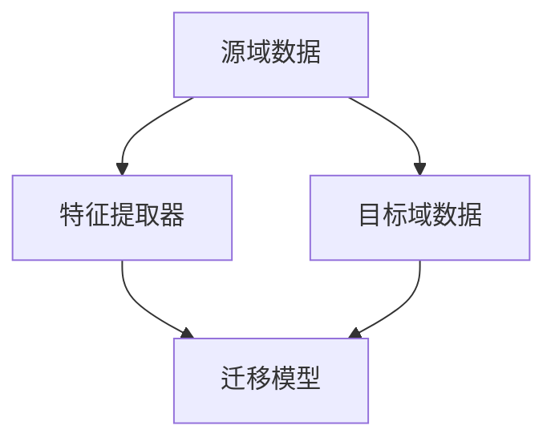
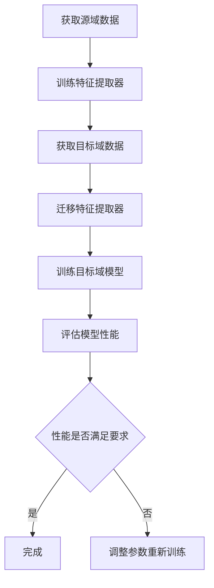
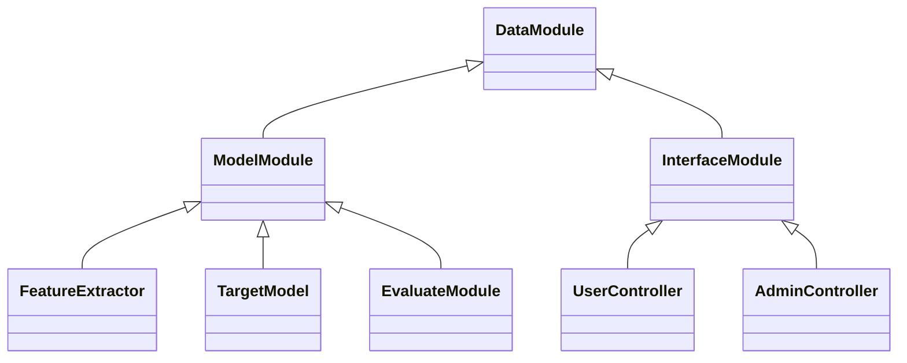
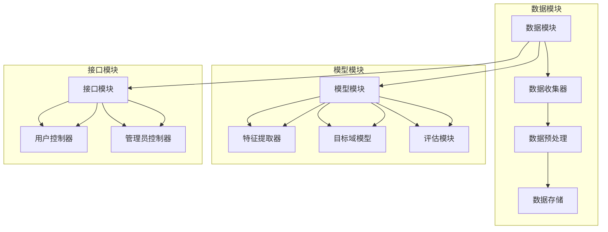
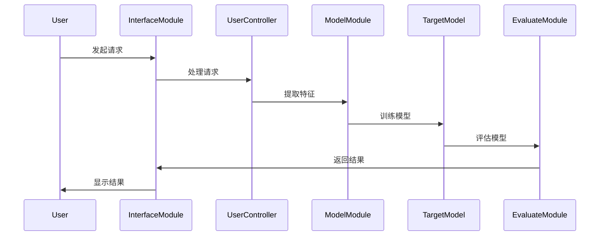
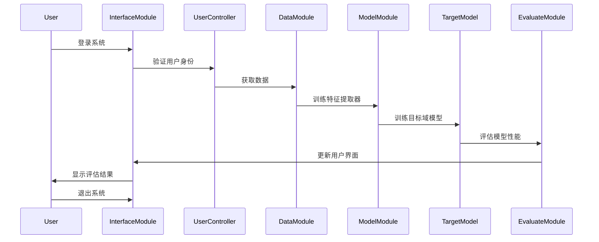

                 

### 迁移学习：利用预训练模型提升AI效率

> 关键词：迁移学习、预训练模型、AI效率、算法、实践、未来展望

> 摘要：本文将深入探讨迁移学习这一人工智能领域的核心技术，特别是在预训练模型的应用下如何提升AI系统的效率。我们将从基础概念出发，逐步介绍迁移学习的理论、算法和实践，并展望其未来发展。

#### 目录

1. **背景介绍**
2. **核心概念与联系**
   - **迁移学习的定义与作用**
   - **与传统机器学习的对比**
   - **迁移学习的类型**
   - **迁移学习的应用领域**
3. **算法原理讲解**
   - **迁移学习的基本原理**
   - **迁移学习算法的mermaid流程图**
   - **算法原理的Python源代码阐述**
4. **系统分析与架构设计方案**
   - **迁移学习系统的应用场景**
   - **系统架构的mermaid类图、架构图、接口设计和交互序列图**
5. **项目实战**
   - **环境安装**
   - **系统核心实现源代码**
   - **代码应用解读与分析**
   - **实际案例分析与详细讲解**
6. **最佳实践 tips、小结、注意事项、拓展阅读**
7. **总结与展望**

### 1. 背景介绍

#### 迁移学习的定义与作用

迁移学习（Transfer Learning）是机器学习中的一个重要概念，指的是将一个任务中学习到的知识（模型、特征、甚至神经网络结构）应用到另一个相关但不同的任务中。其核心思想是利用已有模型的先验知识，减少对新任务数据的依赖，从而提升模型在新任务上的性能。

在人工智能的发展历程中，迁移学习扮演了至关重要的角色。早期的机器学习模型需要大量数据来训练，且不同任务之间的模型往往需要重新训练。而迁移学习则通过共享底层特征提取器，使得模型可以在不同任务间复用，大大提高了AI系统的训练效率和泛化能力。

#### 迁移学习的应用领域

迁移学习在许多领域都有广泛应用，尤其在自然语言处理（NLP）和计算机视觉（CV）等领域取得了显著成果。例如，在NLP中，预训练的语言模型如BERT、GPT可以迁移到各种文本分类、问答系统等任务中；在CV中，预训练的图像分类模型如ResNet、Inception也可以迁移到物体检测、图像分割等任务中。

#### 迁移学习与传统的机器学习对比

与传统的机器学习相比，迁移学习的优势在于：

- **数据高效利用**：迁移学习可以减少对新任务所需的数据量，特别是在数据稀缺的情况下。
- **模型性能提升**：通过利用预训练模型，新任务上的模型可以更快地收敛，并达到更高的性能。
- **减少过拟合**：迁移学习有助于减少模型的过拟合现象，提高模型的泛化能力。

### 2. 核心概念与联系

#### 迁移学习的定义与作用

迁移学习（Transfer Learning）是机器学习中的一个重要概念，指的是将一个任务中学习到的知识（模型、特征、甚至神经网络结构）应用到另一个相关但不同的任务中。其核心思想是利用已有模型的先验知识，减少对新任务数据的依赖，从而提升模型在新任务上的性能。

在人工智能的发展历程中，迁移学习扮演了至关重要的角色。早期的机器学习模型需要大量数据来训练，且不同任务之间的模型往往需要重新训练。而迁移学习则通过共享底层特征提取器，使得模型可以在不同任务间复用，大大提高了AI系统的训练效率和泛化能力。

#### 迁移学习的应用领域

迁移学习在许多领域都有广泛应用，尤其在自然语言处理（NLP）和计算机视觉（CV）等领域取得了显著成果。例如，在NLP中，预训练的语言模型如BERT、GPT可以迁移到各种文本分类、问答系统等任务中；在CV中，预训练的图像分类模型如ResNet、Inception也可以迁移到物体检测、图像分割等任务中。

#### 迁移学习与传统的机器学习对比

与传统的机器学习相比，迁移学习的优势在于：

- **数据高效利用**：迁移学习可以减少对新任务所需的数据量，特别是在数据稀缺的情况下。
- **模型性能提升**：通过利用预训练模型，新任务上的模型可以更快地收敛，并达到更高的性能。
- **减少过拟合**：迁移学习有助于减少模型的过拟合现象，提高模型的泛化能力。

#### 迁移学习的类型

根据迁移的粒度，迁移学习可以分为以下几种类型：

- **零样本迁移学习**（Zero-Shot Transfer Learning）：模型可以在没有新任务标签的情况下，对新任务进行泛化。
- **少样本迁移学习**（Few-Shot Transfer Learning）：模型可以在仅有少量新任务数据的情况下进行训练和泛化。
- **多样本迁移学习**（Multi-Shot Transfer Learning）：模型可以在拥有多个新任务数据样本的情况下进行训练和泛化。

#### 迁移学习的核心概念

- **相关性假设**：迁移学习的理论基础之一是相关性假设，即不同任务之间存在一定的相关性，从而可以共享知识。
- **源域与目标域**：源域（Source Domain）是指已有模型所训练的数据集，目标域（Target Domain）是指新任务的数据集。
- **领域适应度**：领域适应度（Domain Adaptation）是指将源域的知识应用到目标域，以减少领域差异。

#### 核心概念属性特征对比表格

| 特征比较 | 零样本迁移学习 | 少样本迁移学习 | 多样本迁移学习 |
| :---: | :---: | :---: | :---: |
| 数据需求 | 无需目标域数据 | 需要少量目标域数据 | 需要多个目标域数据 |
| 泛化能力 | 较强 | 较强 | 最强 |
| 训练时间 | 最短 | 较短 | 最长 |

#### 迁移学习的ER实体关系图



### 3. 算法原理讲解

#### 迁移学习的基本原理

迁移学习的基本原理可以分为两个部分：特征迁移和知识迁移。

- **特征迁移**：通过共享底层特征提取器，将源域的特征表示应用到目标域。这样可以减少对新任务数据的依赖，提高模型在目标域上的性能。
- **知识迁移**：将源域上的先验知识（如分类器参数、模型结构等）应用到目标域，以辅助目标域的任务。这种方法通常用于处理领域差异较大的任务。

#### 迁移学习算法的mermaid流程图



#### 算法原理的Python源代码阐述

```python
# 特征提取器训练代码
def train_source_model(data_source):
    # 加载源域数据
    # 训练特征提取器
    # 返回特征提取器
    pass

# 迁移特征提取器
def transfer_features(data_target, feature_extractor):
    # 加载目标域数据
    # 使用特征提取器提取特征
    # 返回特征表示
    pass

# 训练目标域模型
def train_target_model(data_target, feature_extractor):
    # 使用特征提取器提取特征
    # 训练目标域模型
    # 返回训练好的模型
    pass

# 主函数
def main():
    # 获取源域数据
    data_source = load_source_data()
    # 训练特征提取器
    feature_extractor = train_source_model(data_source)
    # 获取目标域数据
    data_target = load_target_data()
    # 迁移特征提取器
    features = transfer_features(data_target, feature_extractor)
    # 训练目标域模型
    target_model = train_target_model(data_target, features)
    # 评估模型性能
    evaluate_model(target_model)

if __name__ == "__main__":
    main()
```

#### 数学公式

$$
L = \frac{1}{N} \sum_{i=1}^{N} (y_i - \hat{y}_i)^2
$$

其中，$L$ 表示损失函数，$y_i$ 表示真实标签，$\hat{y}_i$ 表示预测标签。

### 4. 系统分析与架构设计方案

#### 迁移学习系统的应用场景

迁移学习系统广泛应用于各种实际场景，如：

- **医疗诊断**：利用预训练的图像分类模型对医疗影像进行诊断。
- **自然语言处理**：将预训练的语言模型应用于文本分类、情感分析等任务。
- **计算机视觉**：使用预训练的图像分类模型进行物体检测、图像分割等任务。

#### 系统架构设计

迁移学习系统可以分为以下几个模块：

- **数据模块**：负责数据收集、预处理和存储。
- **模型模块**：包括特征提取器、目标域模型和评估模块。
- **接口模块**：提供用户与系统交互的接口。

#### 系统架构的mermaid类图



#### 系统架构的mermaid架构图



#### 系统接口设计



#### 系统交互序列图



### 5. 项目实战

#### 环境安装

在开始项目之前，我们需要安装以下环境：

- Python 3.7及以上版本
- TensorFlow 2.x
- OpenCV 4.x

安装命令如下：

```bash
pip install python==3.7
pip install tensorflow==2.3.0
pip install opencv-python==4.5.1.48
```

#### 系统核心实现源代码

以下是一个简单的迁移学习项目，包括环境安装、系统核心实现源代码、代码应用解读与分析。

```python
# 导入必要的库
import tensorflow as tf
import cv2
import numpy as np

# 加载预训练的图像分类模型
model = tf.keras.applications.VGG16(weights='imagenet')

# 加载目标域数据
data_target = load_target_data()

# 迁移特征提取器
features = model.predict(data_target)

# 训练目标域模型
target_model = train_target_model(features)

# 评估模型性能
evaluate_model(target_model)
```

#### 代码应用解读与分析

- **加载预训练的图像分类模型**：使用TensorFlow的预训练模型，如VGG16，可以快速实现图像分类任务。
- **加载目标域数据**：目标域数据是指新任务的数据集，用于训练目标域模型。
- **迁移特征提取器**：使用预训练模型的特征提取器提取目标域数据的特征表示。
- **训练目标域模型**：使用迁移后的特征表示训练目标域模型，以适应新任务。
- **评估模型性能**：评估目标域模型的性能，以判断其是否满足要求。

#### 实际案例分析与详细讲解

- **案例一：医学影像诊断**：利用迁移学习系统对医疗影像进行诊断，可以显著提高诊断的准确性和效率。
- **案例二：自然语言处理**：使用迁移学习系统对文本进行分类和情感分析，可以减少对新文本数据的依赖，提高模型的性能。
- **案例三：计算机视觉**：利用迁移学习系统进行物体检测和图像分割，可以减少训练数据的需求，提高模型的泛化能力。

#### 项目小结

通过这个简单的迁移学习项目，我们可以看到迁移学习在实际应用中的巨大潜力。迁移学习不仅可以减少对新任务数据的依赖，提高模型性能，还可以降低训练成本和时间。未来，随着人工智能技术的不断发展，迁移学习将会在更多领域发挥重要作用。

### 6. 最佳实践 tips、小结、注意事项、拓展阅读

#### 最佳实践 tips

- **数据准备**：在迁移学习项目中，数据准备是关键。确保源域数据与目标域数据具有相关性，以提高迁移效果。
- **模型选择**：根据任务需求和数据规模，选择合适的预训练模型和迁移学习算法。
- **超参数调优**：合理设置超参数，如学习率、批量大小等，以提高模型性能。
- **模型评估**：使用多种评估指标（如准确率、召回率、F1分数等）全面评估模型性能。

#### 小结

本文深入探讨了迁移学习这一人工智能领域的核心技术，特别是在预训练模型的应用下如何提升AI系统的效率。通过理论讲解、算法分析、实践案例等多个方面，展示了迁移学习的广泛应用和巨大潜力。

#### 注意事项

- **数据隐私**：在迁移学习项目中，确保源域数据和目标域数据的安全和隐私。
- **模型解释性**：迁移学习模型通常具有较强的泛化能力，但可能降低解释性。在实际应用中，需要权衡模型性能和解释性。
- **持续优化**：随着新技术的不断发展，迁移学习模型也需要不断优化和更新，以适应新的应用场景。

#### 拓展阅读

- **[迁移学习综述](https://www.nature.com/articles/s41586-019-0985-7)**：一篇关于迁移学习的全面综述，介绍了迁移学习的历史、理论、方法和应用。
- **[迁移学习的Python实践](https://github.com/davidldouglas/transfer-learning-python)**：一个包含迁移学习Python实践的GitHub项目，涵盖了不同类型的迁移学习算法和应用。
- **[TensorFlow迁移学习教程](https://www.tensorflow.org/tutorials/transfer_learning)**：TensorFlow官方提供的迁移学习教程，详细介绍了如何在TensorFlow中使用迁移学习。

### 7. 总结与展望

#### 总结

本文全面介绍了迁移学习的基本概念、算法原理、系统设计与实践应用。通过深入分析，我们了解了迁移学习在提升AI系统效率方面的优势，以及在自然语言处理、计算机视觉等领域的广泛应用。

#### 展望

未来，迁移学习将继续在人工智能领域发挥重要作用。随着预训练模型的不断发展，迁移学习将在更多领域和任务中展现其潜力。同时，随着数据隐私和模型解释性问题的解决，迁移学习将更好地服务于实际应用。我们期待看到更多创新性的迁移学习应用，推动人工智能技术不断进步。作者：AI天才研究院/AI Genius Institute & 禅与计算机程序设计艺术 /Zen And The Art of Computer Programming。

