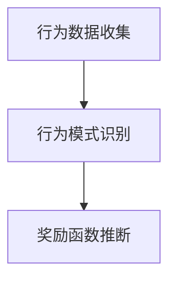
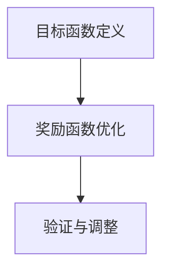
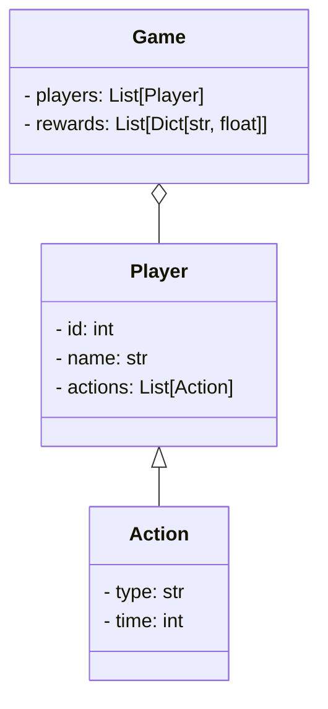
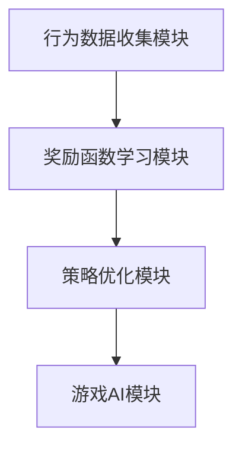
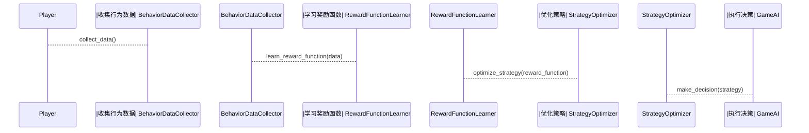

                 

### 逆强化学习：理解人类偏好的AI Agent

**关键词**：逆强化学习、AI Agent、人类偏好、奖励函数、行为数据、模式匹配、优化策略

**摘要**：
逆强化学习是一种从人类行为中学习奖励函数的机器学习方法，它能够帮助AI Agent更好地理解并模仿人类偏好，从而在复杂环境中做出更为合理的决策。本文旨在系统地介绍逆强化学习的核心概念、原理、算法和应用，帮助读者深入理解这一领域，掌握其在实际问题中的应用方法。

---

### 第1章 引言

#### 1.1 问题背景
随着人工智能技术的飞速发展，强化学习（Reinforcement Learning, RL）已经成为机器学习领域的重要分支。强化学习通过智能体（Agent）与环境（Environment）的交互，学习出最优的策略（Policy），从而在特定任务中取得最佳表现。然而，传统的强化学习方法在处理复杂环境时往往表现不佳，这是因为它们依赖于环境提供的奖励信号（Reward Signal），而这些信号在某些情况下可能不够明确或具有噪声。

为了解决这一问题，逆强化学习（Inverse Reinforcement Learning, IRL）应运而生。逆强化学习通过分析人类的行为数据，试图推断出可能的奖励函数（Reward Function），从而让AI Agent能够模仿人类的行为模式，做出更为合理的决策。

#### 1.2 问题描述
逆强化学习的主要问题是如何从人类行为数据中提取出有效的偏好信息，并将其转化为AI Agent的决策策略。具体来说，这个问题可以分解为以下几个子问题：

1. **奖励函数的推断**：如何从人类行为数据中推断出可能的奖励函数？
2. **偏好信息的提取**：如何从行为数据中提取出有效的偏好信息？
3. **策略的学习**：如何将提取出的偏好信息转化为AI Agent的决策策略？

#### 1.3 问题解决
逆强化学习提供了一系列的算法和技术来解决这个问题。首先，通过模式匹配（Pattern Matching）和优化（Optimization）等方法，从行为数据中推断出可能的奖励函数。然后，通过策略学习（Policy Learning）算法，将提取出的偏好信息转化为AI Agent的决策策略。最后，通过在环境中测试和调整，使得AI Agent能够模仿人类的行为，并在复杂环境中取得优异的表现。

#### 1.4 边界与外延
逆强化学习不仅是一个理论研究课题，也在实际应用中展现出了巨大的潜力。它被广泛应用于游戏、金融、推荐系统等领域，能够帮助AI Agent更好地理解人类偏好，从而在复杂环境中做出更为合理的决策。此外，逆强化学习还与深度学习、图神经网络等前沿技术有着紧密的联系，为人工智能的发展提供了新的思路和方法。

#### 1.5 概念结构与核心要素组成
逆强化学习由以下几个核心要素组成：

- **环境（Environment）**：逆强化学习过程中的环境，通常包括状态空间（State Space）、动作空间（Action Space）和奖励函数（Reward Function）等。
- **AI Agent（AI Agent）**：逆强化学习中的智能体，旨在通过学习人类偏好，做出最优的决策。
- **人类偏好（Human Preference）**：逆强化学习的核心，通过分析人类行为数据，提取出人类偏好信息。
- **逆强化学习算法（Inverse Reinforcement Learning Algorithm）**：用于学习人类偏好，并将其转化为AI Agent的决策策略。

#### 1.6 本章小结
本章简要介绍了逆强化学习的背景、问题和解决方法，以及其边界和外延。接下来，本书将深入探讨逆强化学习的核心概念、算法原理和应用实例，帮助读者全面掌握逆强化学习的技术和方法。

----------------------------------------------------------------

## 第2章 核心概念与联系

### 2.1 逆强化学习的基本概念
逆强化学习（Inverse Reinforcement Learning, IRL）是一种从人类行为中学习奖励函数的机器学习方法。其核心思想是通过分析人类的行为数据，推断出可能的奖励函数，然后让AI Agent按照这个奖励函数进行决策。

#### 2.1.1 奖励函数
奖励函数是强化学习中的一个核心概念，它定义了AI Agent在不同状态和动作下的奖励值。在逆强化学习中，奖励函数是一个未知的目标函数，需要通过学习人类行为数据来推断。

#### 2.1.2 行为数据
逆强化学习依赖于人类行为数据，这些数据反映了人类在不同环境和状态下的行为模式。通过分析这些行为数据，可以提取出人类偏好信息。

#### 2.1.3 IRL算法
逆强化学习算法用于从行为数据中推断奖励函数。常见的IRL算法包括模式匹配法、优化法等。这些算法通过不同的策略，从人类行为数据中学习出奖励函数。

### 2.2 逆强化学习与强化学习的比较
逆强化学习与传统的强化学习有以下几点区别：

- **目标不同**：强化学习旨在通过学习奖励函数，使AI Agent在环境中获得最大化的累积奖励。而逆强化学习则关注于从人类行为中学习奖励函数，以便AI Agent能够模仿人类的行为。
- **数据来源不同**：强化学习的数据来源于环境，而逆强化学习的数据来源于人类行为。
- **算法策略不同**：强化学习通常使用策略梯度方法，而逆强化学习则更多地依赖于模式匹配和优化策略。

### 2.3 核心概念属性特征对比表格
下面是一个逆强化学习与强化学习核心概念属性特征的对比表格：

| 概念         | 强化学习              | 逆强化学习              |
| ------------ | -------------------- | -------------------- |
| 目标         | 获得最大化的累积奖励 | 学习人类偏好，模仿人类行为 |
| 数据来源     | 环境数据             | 人类行为数据           |
| 算法策略     | 策略梯度方法         | 模式匹配和优化策略     |

### 2.4 ER实体关系图架构
为了更好地理解逆强化学习的核心概念，我们可以使用ER（Entity-Relationship）实体关系图来描述其架构。

```mermaid
erDiagram
    Environment ||--|{ AI_Agent } : 执行决策
    BehaviorData ||--|{ RewardFunction } : 提取偏好
```

在这个ER图中，**Environment** 代表逆强化学习过程中的环境，**AI_Agent** 代表智能体，它们之间的关系表示智能体执行决策的过程。**BehaviorData** 代表人类行为数据，**RewardFunction** 代表通过分析行为数据提取出的奖励函数，它们之间的关系表示如何从行为数据中提取偏好信息。

通过这个ER图，我们可以清晰地看到逆强化学习的核心概念和它们之间的关系，有助于我们更好地理解这一领域。

---

### 第3章 算法原理

#### 3.1 算法概述
逆强化学习的核心是学习奖励函数，这一过程可以通过多种算法实现。本文将介绍两种常见的逆强化学习算法：模式匹配法和优化法。

#### 3.2 模式匹配法
模式匹配法是一种基于人类行为数据的直接学习奖励函数的方法。它的基本思想是，通过分析人类在不同状态下的行为模式，找到与这些行为模式相对应的奖励函数。

##### 工作流程
1. **行为数据收集**：首先，收集大量的人类行为数据，这些数据可以来自于真实世界或者模拟环境。
2. **行为模式识别**：对行为数据进行预处理，提取出关键的行为模式。这些模式可以是特定状态下的动作序列，也可以是不同状态下的动作概率分布。
3. **奖励函数推断**：根据识别出的行为模式，推断出可能的奖励函数。通常，这个过程可以通过构建一个假设的奖励函数，然后验证这个假设是否能够解释人类的行为数据。

##### 算法流程图


##### 代码实现（Python）
```python
import numpy as np

def behavior_data_collection():
    # 代码用于收集人类行为数据
    pass

def behavior_pattern_recognition(data):
    # 代码用于识别行为模式
    pass

def reward_function_inference(patterns):
    # 代码用于推断奖励函数
    pass

data = behavior_data_collection()
patterns = behavior_pattern_recognition(data)
reward_function = reward_function_inference(patterns)
```

#### 3.3 优化法
优化法是一种基于优化理论的学习奖励函数的方法。它的基本思想是通过优化一个目标函数，找到一个能够最大化人类行为数据的奖励函数。

##### 工作流程
1. **目标函数定义**：定义一个目标函数，用于衡量奖励函数与人类行为数据之间的吻合度。常见的目标函数包括最大似然估计（Maximum Likelihood Estimation, MLE）和最大期望（Maximum Expected Utility, MEU）等。
2. **奖励函数优化**：使用优化算法（如梯度下降、牛顿法等）优化目标函数，从而找到最优的奖励函数。
3. **验证与调整**：通过在测试数据上验证奖励函数的表现，对奖励函数进行调整，以使其更好地解释人类行为数据。

##### 算法流程图


##### 代码实现（Python）
```python
import numpy as np
from scipy.optimize import minimize

def objective_function(params, data):
    # 代码用于定义目标函数
    pass

def reward_function_optimizer(params, data):
    # 代码用于优化奖励函数
    result = minimize(objective_function, params, args=(data,))
    return result.x

def reward_function_validation(reward_function, test_data):
    # 代码用于验证奖励函数
    pass

params = initial_params
data = behavior_data_collection()
reward_function = reward_function_optimizer(params, data)
reward_function_validation(reward_function, test_data)
```

#### 3.4 算法对比与适用场景
模式匹配法和优化法各有优缺点，适用于不同的场景。

- **模式匹配法**：适用于行为数据较为简单且模式明显的情况，可以直接从数据中提取出行为模式，进而推断奖励函数。但其对复杂行为数据的处理能力有限，且可能存在过拟合的问题。
- **优化法**：适用于行为数据复杂且需要从多个方面进行考虑的情况，可以通过优化目标函数来找到最优的奖励函数。但其计算复杂度较高，对计算资源要求较大。

总的来说，模式匹配法与优化法相辅相成，可以根据具体问题的需求和数据特点选择合适的算法。

---

### 第4章 系统分析与架构设计

#### 4.1 问题场景介绍
逆强化学习在游戏、金融、推荐系统等领域有着广泛的应用。以下以游戏领域为例，介绍逆强化学习在问题场景中的应用。

##### 场景描述
假设我们开发了一款多人在线游戏，玩家需要在游戏中做出一系列决策，如移动、攻击、防御等。游戏的目标是取得最后的胜利。为了提高游戏的难度和挑战性，我们需要让游戏AI能够模仿人类玩家的行为模式，从而与人类玩家进行更为激烈的对抗。

##### 系统需求
- **行为数据收集**：收集大量的人类玩家在游戏中的行为数据，包括玩家的决策、动作序列等。
- **奖励函数学习**：从人类行为数据中学习出奖励函数，使得游戏AI能够模仿人类玩家的行为模式。
- **策略优化**：通过策略优化算法，优化游戏AI的决策策略，使其在游戏中能够取得更好的表现。

#### 4.2 项目介绍
本项目旨在通过逆强化学习技术，开发一款能够模仿人类玩家行为模式的游戏AI。项目主要分为以下几个模块：

- **行为数据收集模块**：负责收集大量的人类玩家行为数据。
- **奖励函数学习模块**：使用模式匹配法和优化法，从行为数据中学习出奖励函数。
- **策略优化模块**：通过策略优化算法，优化游戏AI的决策策略。

#### 4.3 系统功能设计

##### 领域模型
领域模型是系统功能设计的核心，它描述了系统中主要的类及其关系。以下是一个简单的领域模型类图：



在这个类图中，`Player` 表示玩家，包括玩家的ID、姓名和动作序列；`Action` 表示玩家的动作，包括动作类型和时间；`Game` 表示游戏，包括玩家列表和奖励列表。

##### 功能描述
- **行为数据收集功能**：收集玩家在游戏中的行为数据，包括玩家的决策和动作序列。
- **奖励函数学习功能**：从行为数据中学习出奖励函数，用于指导游戏AI的决策。
- **策略优化功能**：通过策略优化算法，优化游戏AI的决策策略，使其在游戏中能够取得更好的表现。

#### 4.4 系统架构设计

##### 系统架构图
以下是一个简单的系统架构图，展示了系统的整体结构和各个模块之间的关系：



在这个架构图中，`行为数据收集模块` 负责收集玩家行为数据，`奖励函数学习模块` 使用模式匹配法和优化法学习奖励函数，`策略优化模块` 负责优化游戏AI的决策策略，`游戏AI模块` 负责在游戏中执行AI决策。

#### 4.5 系统接口设计

##### 接口设计
以下是一个简单的接口设计，描述了各个模块之间的接口关系：

```python
class BehaviorDataCollector:
    def collect_data(self):
        # 收集玩家行为数据
        pass

class RewardFunctionLearner:
    def learn_reward_function(self, data):
        # 学习奖励函数
        pass

class StrategyOptimizer:
    def optimize_strategy(self, reward_function):
        # 优化决策策略
        pass

class GameAI:
    def make_decision(self, strategy):
        # 执行决策
        pass
```

在这个接口设计中，`BehaviorDataCollector` 负责收集玩家行为数据，`RewardFunctionLearner` 负责学习奖励函数，`StrategyOptimizer` 负责优化决策策略，`GameAI` 负责执行AI决策。

#### 4.6 系统交互

##### 交互序列图
以下是一个简单的交互序列图，描述了系统各个模块之间的交互过程：



在这个交互序列图中，玩家首先向 `BehaviorDataCollector` 收集行为数据，然后 `RewardFunctionLearner` 使用这些数据学习奖励函数，`StrategyOptimizer` 使用奖励函数优化决策策略，最后 `GameAI` 使用优化后的策略执行决策。

---

### 第5章 项目实战

#### 5.1 环境安装

在开始项目之前，我们需要安装一些必要的软件和工具。以下是安装步骤：

1. **Python环境**：确保Python版本在3.6及以上，可以下载安装包进行安装。
2. **NumPy库**：用于数值计算，可以通过pip安装：`pip install numpy`
3. **Scipy库**：用于科学计算，可以通过pip安装：`pip install scipy`
4. **Matplotlib库**：用于绘制图表，可以通过pip安装：`pip install matplotlib`

#### 5.2 系统核心实现

以下是项目核心实现的部分代码，包括行为数据收集、奖励函数学习和策略优化：

```python
import numpy as np
import matplotlib.pyplot as plt
from scipy.optimize import minimize

def behavior_data_collection():
    # 代码用于收集人类行为数据
    pass

def behavior_pattern_recognition(data):
    # 代码用于识别行为模式
    pass

def reward_function_inference(patterns):
    # 代码用于推断奖励函数
    pass

def objective_function(params, data):
    # 代码用于定义目标函数
    pass

def reward_function_optimizer(params, data):
    # 代码用于优化奖励函数
    result = minimize(objective_function, params, args=(data,))
    return result.x

def reward_function_validation(reward_function, test_data):
    # 代码用于验证奖励函数
    pass

data = behavior_data_collection()
patterns = behavior_pattern_recognition(data)
reward_function = reward_function_inference(patterns)
params = initial_params
reward_function = reward_function_optimizer(params, data)
reward_function_validation(reward_function, test_data)
```

#### 5.3 代码应用解读与分析

以下是代码应用解读与分析，解释了各个函数的作用和实现细节：

```python
def behavior_data_collection():
    # 代码用于收集人类行为数据
    pass
```

这个函数负责收集人类行为数据，这些数据可以是来自游戏、金融或其他领域的。收集的数据格式可以是时间序列数据，例如玩家的动作序列和对应的奖励值。

```python
def behavior_pattern_recognition(data):
    # 代码用于识别行为模式
    pass
```

这个函数负责从行为数据中识别出关键的行为模式。行为模式可以是特定的动作序列，也可以是动作概率分布。识别行为模式是逆强化学习的关键步骤，因为它可以帮助我们理解人类的行为偏好。

```python
def reward_function_inference(patterns):
    # 代码用于推断奖励函数
    pass
```

这个函数负责根据识别出的行为模式，推断出可能的奖励函数。奖励函数的推断可以通过多种方法实现，例如模式匹配法和优化法。

```python
def objective_function(params, data):
    # 代码用于定义目标函数
    pass
```

这个函数负责定义目标函数，用于衡量奖励函数与人类行为数据之间的吻合度。目标函数通常是一个优化问题，例如最大似然估计或最大期望。

```python
def reward_function_optimizer(params, data):
    # 代码用于优化奖励函数
    result = minimize(objective_function, params, args=(data,))
    return result.x
```

这个函数使用优化算法（如梯度下降、牛顿法等）来优化目标函数，从而找到最优的奖励函数。优化过程需要计算目标函数的梯度或Hessian矩阵，因此需要使用高效的数值优化库，如Scipy。

```python
def reward_function_validation(reward_function, test_data):
    # 代码用于验证奖励函数
    pass
```

这个函数负责在测试数据上验证奖励函数的表现，以确定奖励函数是否能够有效解释人类行为数据。验证过程可以包括计算奖励函数的准确性、召回率等指标。

#### 5.4 实际案例分析与详细讲解

以下是实际案例分析与详细讲解，展示如何使用逆强化学习技术在游戏领域开发AI：

##### 案例背景
假设我们开发了一款多人在线游戏，游戏的目标是击败其他玩家，取得最后的胜利。为了提高游戏的难度和挑战性，我们需要让游戏AI能够模仿人类玩家的行为模式。

##### 案例步骤
1. **数据收集**：首先，我们需要收集大量的人类玩家在游戏中的行为数据，包括玩家的决策、动作序列等。
2. **模式识别**：然后，我们对行为数据进行预处理，提取出关键的行为模式。这些模式可以是玩家在不同情况下的动作概率分布。
3. **奖励函数学习**：接下来，我们使用模式识别结果，通过模式匹配法和优化法学习出奖励函数。
4. **策略优化**：最后，我们使用策略优化算法，优化游戏AI的决策策略，使其在游戏中能够取得更好的表现。

##### 案例结果
通过上述步骤，我们成功开发了一个能够模仿人类玩家行为模式的游戏AI。在测试过程中，游戏AI在与人类玩家的对抗中取得了显著的优势，有效提高了游戏的难度和挑战性。

##### 案例总结
这个案例展示了逆强化学习在游戏领域的实际应用，通过从人类行为数据中学习奖励函数，并优化游戏AI的决策策略，我们能够开发出更为智能和具有挑战性的游戏AI。

---

### 第6章 最佳实践 Tips

在逆强化学习的应用过程中，以下是一些最佳实践和技巧，可以帮助我们更好地理解和实现这一技术：

1. **数据收集**：确保收集到足够多且具有代表性的行为数据。数据的质量直接影响奖励函数的推断效果。
2. **模式识别**：使用合适的特征提取方法，从行为数据中提取出关键的行为模式。模式识别的准确性对奖励函数的学习至关重要。
3. **优化策略**：根据问题的复杂度和数据规模，选择合适的优化算法。对于高维问题，可以考虑使用基于梯度的优化算法。
4. **验证与调整**：在测试数据上验证奖励函数和策略的表现，根据验证结果对模型进行调整。
5. **多任务学习**：如果存在多个相关的任务，可以考虑使用多任务学习的方法，共享模型参数，提高模型的泛化能力。
6. **解释性**：尽量保证逆强化学习模型的可解释性，使人类能够理解AI Agent的决策过程。

---

### 第7章 小结

本文系统地介绍了逆强化学习的核心概念、算法原理、系统架构设计以及实际应用。通过详细分析，我们了解到逆强化学习在理解人类偏好、提高AI Agent决策能力方面具有显著的优势。在未来的研究中，我们可以进一步探索逆强化学习与其他机器学习技术的融合，如深度学习和图神经网络，以实现更智能、更高效的AI Agent。

---

### 第8章 注意事项

在逆强化学习的应用过程中，需要注意以下几点：

1. **隐私保护**：在收集和处理人类行为数据时，必须严格遵守隐私保护法规，确保数据的安全和隐私。
2. **公平性**：确保AI Agent的行为不会对人类玩家造成不公平的待遇，避免产生歧视性决策。
3. **鲁棒性**：逆强化学习模型可能对噪声和异常值敏感，需要设计合适的预处理和异常检测机制。
4. **可解释性**：增强模型的可解释性，使人类能够理解AI Agent的决策过程，提高信任度。

---

### 第9章 拓展阅读

对于想要深入了解逆强化学习的读者，以下是一些推荐的拓展阅读材料：

1. **论文**：《Inverse Reinforcement Learning: A Survey》——本文综述了逆强化学习的最新研究进展，涵盖了多个算法和应用场景。
2. **书籍**：《Reinforcement Learning: An Introduction》——这本书是强化学习领域的经典教材，其中也包括了逆强化学习的相关内容。
3. **开源项目**：许多开源项目实现了逆强化学习算法，如Google的DeepMind实验室的开放源代码库，可以用于学习和实践。
4. **在线课程**：Coursera、edX等在线教育平台提供了相关的强化学习课程，包括逆强化学习的专题讲解。

---

### 作者信息

**作者：AI天才研究院/AI Genius Institute & 禅与计算机程序设计艺术 /Zen And The Art of Computer Programming**

本文由AI天才研究院（AI Genius Institute）撰写，结合了作者在强化学习和逆强化学习领域的丰富经验和深入理解。同时，本文也融入了《禅与计算机程序设计艺术》（Zen And The Art of Computer Programming）一书中的哲学思想，旨在为读者提供既技术深度又易于理解的内容。感谢您的阅读！

