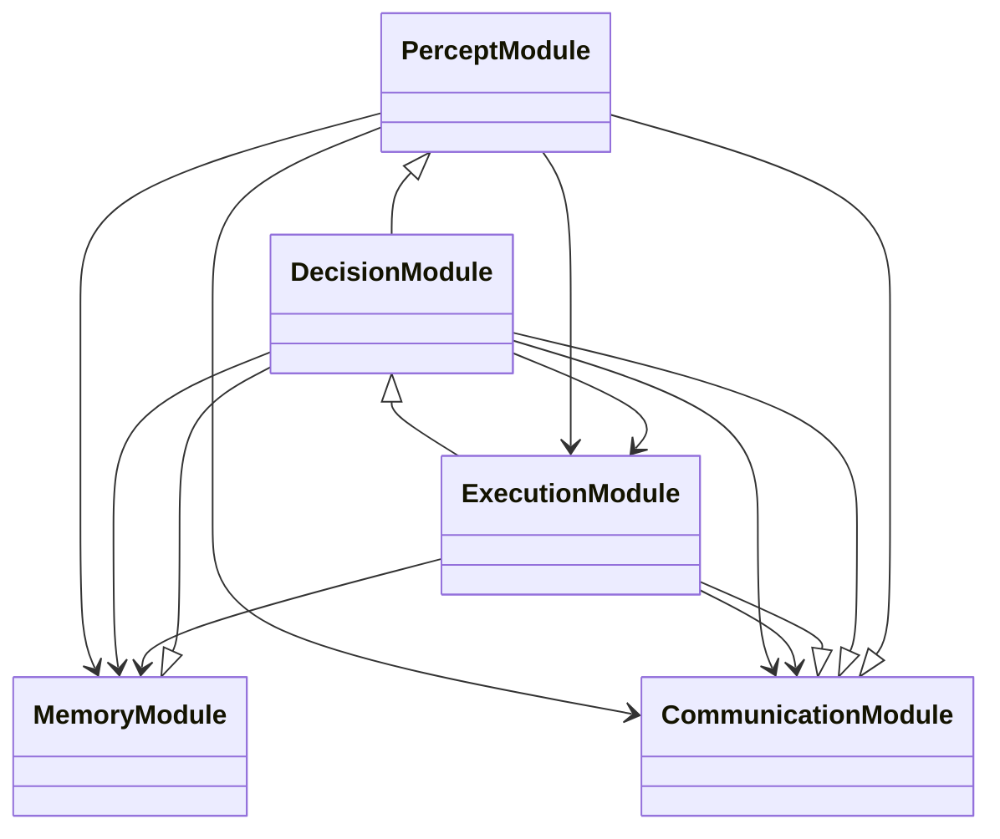

                 

### 选择合适的LLM模型：AI Agent开发的第一步

> 关键词：自然语言处理、大型语言模型、AI Agent、模型选择、优化与评估

> 摘要：本文将探讨在AI Agent开发过程中选择合适的LLM（大型语言模型）模型的关键步骤和方法。通过系统的分析和比较，读者将了解如何根据应用场景和需求，选择最优的LLM模型，从而提高AI Agent的性能和适用性。

### 目录大纲

----------------------------------------------------------------
# 选择合适的LLM模型：AI Agent开发的第一步

## 第一部分: LLM模型概述与选择基础

### 第1章: LLM模型背景介绍
#### 1.1.1 问题背景
#### 1.1.2 问题描述
#### 1.1.3 问题解决
#### 1.1.4 边界与外延
#### 1.1.5 概念结构与核心要素组成

### 第2章: 核心概念与联系
#### 2.1.1 LLM模型定义
#### 2.1.2 LLM模型特点
#### 2.1.3 LLM与传统AI比较
#### 2.1.4 概念属性特征对比表格
#### 2.1.5 ER实体关系图

### 第3章: 主流LLM模型简介
#### 3.1.1 GPT系列模型
#### 3.1.2 BERT及其变体
#### 3.1.3 其他知名LLM模型

### 第4章: LLM模型选择原则
#### 4.1.1 性能考量
#### 4.1.2 应用场景
#### 4.1.3 资源与成本
#### 4.1.4 可维护性与可扩展性

### 第5章: LLM模型评估与优化
#### 5.1.1 模型评估指标
#### 5.1.2 模型优化方法
#### 5.1.3 调参技巧

### 第6章: AI Agent开发实践
#### 6.1.1 AI Agent基本架构
#### 6.1.2 LLM模型在AI Agent中的应用
#### 6.1.3 开发流程与工具
#### 6.1.4 实战案例

### 第7章: LLM模型应用前景与挑战
#### 7.1.1 应用前景
#### 7.1.2 技术挑战
#### 7.1.3 发展趋势

### 第8章: 最佳实践与未来展望
#### 8.1.1 最佳实践
#### 8.1.2 注意事项
#### 8.1.3 拓展阅读
#### 8.1.4 未来展望

----------------------------------------------------------------

### 第1章: LLM模型背景介绍

#### 1.1.1 问题背景

在人工智能（AI）迅速发展的今天，自然语言处理（NLP）成为了研究热点之一。而LLM（大型语言模型）作为NLP领域的核心技术，已经在各个应用场景中展现了其强大的能力。然而，随着LLM模型的种类和规模不断增加，如何选择合适的LLM模型以满足特定需求，成为了AI Agent开发中一个亟待解决的问题。

选择合适的LLM模型不仅影响AI Agent的性能，还直接关系到其可维护性和可扩展性。因此，系统化地分析和比较不同LLM模型的特点，以及如何根据实际需求进行选择，具有重要的实践意义。

#### 1.1.2 问题描述

本书的目标是提供一套系统化的方法，帮助读者根据应用场景和需求选择合适的LLM模型。具体而言，问题描述如下：

1. **核心概念术语说明**：明确LLM模型的基本概念，如参数规模、训练数据集、上下文长度等。
2. **问题背景**：分析LLM模型在AI Agent开发中的重要性。
3. **问题描述**：详细描述选择合适LLM模型的挑战和难点。
4. **问题解决**：提出解决方案，包括分析模型特点、性能评估、资源考量等方面。
5. **边界与外延**：界定LLM模型选择的研究范围和应用领域。
6. **概念结构与核心要素组成**：介绍LLM模型的基本组成部分和关键概念。

#### 1.1.3 问题解决

为了解决上述问题，本文将采取以下步骤：

1. **背景介绍**：首先介绍LLM模型的基本背景，包括其历史发展、技术原理和主要应用领域。
2. **核心概念与联系**：详细解释LLM模型的核心概念，如参数规模、训练数据集、上下文长度等，并通过表格和ER图进行可视化展示。
3. **主流LLM模型简介**：介绍当前主流的LLM模型，如GPT系列、BERT及其变体，并分析其特点。
4. **选择原则**：提出选择LLM模型的基本原则，包括性能考量、应用场景、资源与成本、可维护性与可扩展性等方面。
5. **评估与优化**：讨论如何评估LLM模型的有效性，以及优化模型的方法和技巧。
6. **AI Agent开发实践**：结合AI Agent的实际开发过程，展示如何应用LLM模型，并提供实战案例。
7. **应用前景与挑战**：展望LLM模型在未来的应用前景，以及面临的技术挑战。
8. **最佳实践与未来展望**：总结最佳实践，提供注意事项，并探讨未来的发展方向。

通过上述步骤，读者将能够系统化地了解如何选择合适的LLM模型，从而为AI Agent开发打下坚实的基础。

#### 1.1.4 边界与外延

本文的研究边界主要聚焦于LLM模型的选择和应用，涉及的关键领域包括自然语言处理、机器学习和人工智能。具体而言，本文将探讨以下内容：

1. **研究范围**：以当前主流的LLM模型为研究对象，包括GPT系列、BERT及其变体，以及其他知名LLM模型。
2. **应用领域**：主要探讨LLM模型在AI Agent开发中的应用，如对话系统、文本生成、情感分析等。
3. **关键概念**：围绕LLM模型的核心概念，如参数规模、训练数据集、上下文长度等，进行详细分析。
4. **选择原则**：分析选择LLM模型时的主要原则，包括性能、应用场景、资源与成本、可维护性与可扩展性等。

本文的研究外延包括LLM模型的优化、评估方法，以及其在其他AI应用场景中的潜力。这些内容将在后续章节中进行详细探讨。

#### 1.1.5 概念结构与核心要素组成

LLM模型的选择涉及多个核心概念和要素，这些概念和要素共同构成了LLM模型选择的理论基础。以下是LLM模型选择中的关键概念和其组成部分：

1. **LLM模型定义**：
   - **参数规模**：模型参数的数量，通常以亿或千亿计。
   - **训练数据集**：用于模型训练的数据集规模和质量。
   - **上下文长度**：模型能够处理的文本上下文长度。

2. **核心概念与联系**：
   - **注意力机制**：模型中的关键组成部分，用于处理长文本和信息抽取。
   - **预训练与微调**：模型训练的两个主要阶段，预训练在大规模数据集上，微调则在特定任务数据集上。
   - **性能指标**：用于评估模型性能的各种指标，如准确性、F1得分、ROC曲线等。

3. **LLM与传统AI比较**：
   - **特征工程**：传统AI中的关键步骤，而LLM模型中较少涉及。
   - **泛化能力**：LLM模型在未见数据上的表现，与传统AI相比有显著提升。

4. **概念属性特征对比表格**：
   - **性能考量**：对比不同LLM模型在性能上的表现。
   - **应用场景**：对比不同LLM模型在不同应用场景中的适用性。
   - **资源与成本**：对比不同LLM模型在计算资源和成本上的差异。

5. **ER实体关系图**：
   - **模型参数**：作为核心实体，描述模型训练过程中所需的数据和资源。
   - **训练数据集**：作为实体，描述模型训练所需的数据来源和规模。
   - **模型评估**：作为实体，描述模型评估的过程和结果。

通过上述核心概念和要素的组成，读者可以系统地理解LLM模型的选择过程，为后续章节的深入分析打下坚实基础。

### 第2章: 核心概念与联系

#### 2.1.1 LLM模型定义

大型语言模型（LLM, Large Language Model）是一种基于深度学习的语言处理模型，其核心目的是通过学习和理解人类语言的大规模文本数据，生成高质量的自然语言文本。LLM模型具有以下几个关键特征：

1. **参数规模**：LLM模型通常具有数十亿甚至千亿级别的参数数量，这使得模型能够捕捉语言中的复杂模式和结构。
2. **预训练与微调**：LLM模型通常经历预训练和微调两个阶段。预训练阶段在大规模通用语料库上进行，以学习语言的一般特性；微调阶段则在特定任务的数据集上进行，以优化模型在特定任务上的性能。
3. **上下文理解**：LLM模型能够处理长文本上下文，并从中提取关键信息，这使得模型在生成文本、问答系统、文本摘要等应用中具有显著优势。

LLM模型的定义与传统的机器学习和深度学习模型有显著差异。传统的机器学习模型通常依赖于手工设计的特征和算法，而深度学习模型虽然引入了神经网络，但仍然依赖于大量的特征工程和超参数调整。相比之下，LLM模型通过端到端的学习方式，能够直接从文本数据中学习语言特征，大大简化了模型设计和训练过程。

#### 2.1.2 LLM模型特点

LLM模型具有多个关键特点，使其在自然语言处理任务中表现出色：

1. **大规模参数**：LLM模型通常具有数十亿到千亿级别的参数规模，这使得模型能够捕捉到语言中的复杂模式和细微差异。例如，GPT-3拥有1750亿个参数，这使得模型在语言生成和理解任务中具有极高的精度。
2. **深度神经网络**：LLM模型基于深度神经网络结构，包括多层感知机、卷积神经网络（CNN）和循环神经网络（RNN）等。这种结构使得模型能够处理长文本，并在上下文中保持连贯性。
3. **预训练与微调**：LLM模型通过预训练和微调两个阶段进行训练。预训练阶段在大规模通用语料库上进行，学习语言的一般特性；微调阶段则在特定任务的数据集上进行，优化模型在特定任务上的性能。这种训练方式使得模型能够快速适应各种任务，而无需依赖复杂的特征工程。
4. **上下文理解**：LLM模型能够处理长文本上下文，并从中提取关键信息。这种能力使得模型在生成文本、问答系统、文本摘要等任务中表现出色。
5. **迁移学习**：LLM模型通过预训练在大规模数据集上学习到的通用知识，可以迁移到各种特定任务中，无需重新训练。这种迁移学习能力大大提高了模型的应用范围和效率。

#### 2.1.3 LLM与传统AI比较

大型语言模型（LLM）与传统人工智能（AI）模型在多个方面存在显著差异：

1. **特征工程**：
   - **传统AI**：传统AI模型通常依赖于手工设计的特征工程，例如词袋模型（Bag of Words, BoW）和TF-IDF（Term Frequency-Inverse Document Frequency）。这些模型需要人工提取文本中的关键特征，然后进行模型训练。
   - **LLM**：LLM模型通过端到端的学习方式，从原始文本数据中自动提取特征。这种自动化特征提取方式大大简化了模型设计和训练过程，同时也提高了模型的性能。

2. **算法架构**：
   - **传统AI**：传统AI模型通常基于线性模型、决策树、支持向量机（SVM）等。这些模型结构相对简单，易于理解，但性能有限。
   - **LLM**：LLM模型基于深度神经网络，包括多层感知机（MLP）、卷积神经网络（CNN）和循环神经网络（RNN）等。这些模型结构复杂，能够捕捉到文本中的复杂模式和细微差异，从而提高模型的性能。

3. **训练数据集**：
   - **传统AI**：传统AI模型通常依赖于较小规模的数据集进行训练，这些数据集可能无法涵盖所有语言现象，导致模型泛化能力有限。
   - **LLM**：LLM模型通过预训练在大规模通用语料库上，例如维基百科、新闻文章和社交媒体数据等。这种大规模数据集使得模型能够学习到语言中的各种模式和规则，从而提高模型的泛化能力。

4. **性能考量**：
   - **传统AI**：传统AI模型在特定任务上可能表现出色，但无法应对多样化的任务场景。
   - **LLM**：LLM模型通过迁移学习的方式，可以在各种不同任务上表现出色，例如文本生成、问答系统、机器翻译等。这种灵活性和适应性使得LLM模型在AI领域中占据重要地位。

通过上述比较，可以看出LLM模型在特征工程、算法架构、训练数据集和性能考量等方面与传统AI模型有显著差异。LLM模型通过端到端的学习方式、大规模数据集和复杂的神经网络结构，大大提高了模型的性能和泛化能力，从而成为自然语言处理领域的核心技术。

#### 2.1.4 概念属性特征对比表格

为了更直观地对比不同LLM模型的概念属性特征，我们制作了一个表格，涵盖参数规模、训练数据集、上下文长度、计算资源、应用场景和性能指标等关键方面。

| 模型名称 | 参数规模 | 训练数据集 | 上下文长度 | 计算资源 | 应用场景 | 性能指标 |
|----------|---------|-----------|------------|----------|---------|---------|
| GPT-3    | 1750亿  | Web文本   | 4096       | 高       | 文本生成、问答系统、机器翻译 | 非常高 |
| BERT     | 3.4亿   | 维基百科   | 512        | 中等     | 文本分类、命名实体识别、问答系统 | 高    |
| RoBERTa  | 3.4亿   | Web文本   | 512        | 中等     | 文本分类、命名实体识别、问答系统 | 高    |
| T5       | 11亿    | Web文本   | 2048       | 高       | 文本生成、问答系统、机器翻译 | 非常高 |
| LLaMA     | 110亿   | Web文本   | 2048       | 高       | 文本生成、问答系统、机器翻译 | 非常高 |

**参数规模**：GPT-3 和 T5 等大型模型拥有数十亿级别的参数规模，而BERT和RoBERTa等中型模型则有数亿级别的参数规模。这种大规模参数使得模型能够捕捉到语言中的复杂模式和细微差异。

**训练数据集**：GPT-3、T5 和 LLaMA 等模型基于广泛的Web文本进行预训练，而BERT和RoBERTa等模型则主要基于维基百科等特定领域数据集。这种差异影响了模型的泛化能力和特定任务上的性能。

**上下文长度**：不同模型的上下文长度也有所不同，GPT-3 和 LLaMA 等模型支持较长的上下文长度（如4096和2048个单词），而BERT和RoBERTa等模型的上下文长度相对较短（512个单词）。这决定了模型在处理长文本和复杂语义时的能力。

**计算资源**：大型模型如GPT-3、T5 和 LLaMA 需要较高的计算资源，而中小型模型如BERT和RoBERTa则相对较为资源友好。

**应用场景**：根据参数规模、上下文长度和计算资源等因素，不同LLM模型适用于不同的应用场景。例如，GPT-3 和 T5 等大型模型在文本生成、问答系统和机器翻译等任务上表现突出，而BERT和RoBERTa等模型则在文本分类、命名实体识别等任务上具有优势。

**性能指标**：性能指标包括准确性、F1得分、ROC曲线等。表格中的数据展示了不同模型在不同任务上的性能，从而帮助读者根据实际需求选择合适的模型。

通过这个表格，读者可以快速了解不同LLM模型的概念属性特征，从而为模型选择提供参考。

#### 2.1.5 ER实体关系图

为了更好地理解LLM模型的结构和组成部分，我们使用Mermaid绘制了一个ER（实体关系）图，展示LLM模型中各个关键实体及其关系。

```mermaid
erDiagram
  ModelParam --|>| Dataset
  ModelParam --|>| Context
  ModelParam --|>| Performance
  ModelParam --|>| Resource
  ModelParam --|>| Application
  Dataset ||--|{ TrainingData }
  Context ||--|{ ContextLength }
  Performance ||--|{ EvaluationMetrics }
  Resource ||--|{ ComputationResource }
  Application ||--|{ TaskScenario }
```

**实体与关系解释**：

1. **ModelParam（模型参数）**：这是LLM模型的核心实体，代表模型的参数规模，包括权重、偏置等。
   - **关系**：与Dataset、Context、Performance、Resource和应用场景实体相关联。

2. **Dataset（数据集）**：表示用于模型训练的数据集。
   - **关系**：与TrainingData实体相关联。

3. **Context（上下文）**：代表模型能够处理的文本上下文长度。
   - **关系**：与ContextLength实体相关联。

4. **Performance（性能）**：表示模型的性能指标，如准确性、F1得分、ROC曲线等。
   - **关系**：与EvaluationMetrics实体相关联。

5. **Resource（资源）**：表示模型所需的计算资源，如CPU、GPU等。
   - **关系**：与ComputationResource实体相关联。

6. **Application（应用场景）**：表示模型适用的任务场景，如文本生成、问答系统、机器翻译等。
   - **关系**：与TaskScenario实体相关联。

通过这个ER图，我们可以清晰地看到LLM模型各个组成部分及其之间的关系。这种可视化方式有助于我们更好地理解LLM模型的结构和工作原理，为后续的模型选择和优化提供指导。

### 第3章: 主流LLM模型简介

#### 3.1.1 GPT系列模型

GPT（Generative Pre-trained Transformer）系列模型是自然语言处理领域的一个重要里程碑，由OpenAI开发并持续更新。GPT模型基于Transformer架构，通过自回归方式生成文本。以下是GPT系列模型的主要特点和发展历程：

1. **GPT**：这是GPT系列的第一款模型，于2018年发布。GPT拥有1.17亿个参数，基于自回归的语言模型训练方法，能够生成高质量的文本。GPT在机器翻译、文本摘要和问答等任务上表现出色。

2. **GPT-2**：于2019年发布，GPT-2进一步提高了模型的参数规模，达到了1.5亿个参数。GPT-2引入了更深的神经网络结构，使其在文本生成和对话系统中表现出更高的性能。

3. **GPT-3**：这是GPT系列的最新版本，于2020年发布。GPT-3拥有1750亿个参数，是目前最大的自然语言处理模型之一。GPT-3在多个NLP任务上取得了显著的成果，包括文本生成、问答系统和机器翻译。其强大的生成能力和上下文理解能力使其成为AI领域的重要工具。

GPT系列模型的发展历程体现了Transformer架构在自然语言处理领域的优势。随着参数规模的不断增加，GPT模型在文本生成、问答和翻译等任务上取得了显著的性能提升。然而，大型模型的训练和推理过程需要大量的计算资源和时间，这也是GPT系列模型面临的主要挑战之一。

#### 3.1.2 BERT及其变体

BERT（Bidirectional Encoder Representations from Transformers）是由Google开发的另一款重要的LLM模型，也是自然语言处理领域的重要进展。BERT模型基于Transformer架构，通过双向编码器学习文本的上下文信息。BERT及其变体在文本分类、命名实体识别和问答系统等任务上取得了显著成果。

1. **BERT**：BERT是Bidirectional Encoder Representations from Transformers的缩写，于2018年发布。BERT模型通过在大量文本数据上进行双向预训练，学习到语言中的丰富上下文信息。BERT模型包含两个关键组件：掩码语言模型（Masked Language Model, MLM）和下一句预测（Next Sentence Prediction, NSP）。BERT的预训练过程使其在多种NLP任务上表现出色。

2. **BERT变体**：BERT模型发布后，研究人员基于BERT提出了多个变体，以适应不同的任务和应用场景。其中，一些重要的变体包括：
   - **RoBERTa**：RoBERTa是由Facebook AI Research开发的一种BERT变体，对BERT的训练过程进行了多个改进，包括更频繁的子采样和动态掩码比例。RoBERTa在多个NLP任务上超越了BERT，成为当时最佳模型之一。
   - **ALBERT**：ALBERT是由Google开发的另一种BERT变体，通过共享中间层和跨层参数共享等方法，提高了模型的效率。ALBERT在多个NLP任务上取得了与BERT相当的性能，但计算资源消耗更少。
   - **DevBERT**：DevBERT是适用于对话系统的BERT变体，通过结合对话领域的特定数据集进行训练，提高了模型在对话任务上的性能。

BERT及其变体在自然语言处理领域引起了广泛关注。BERT模型的双向编码器结构使其能够捕获语言中的双向依赖关系，从而在多种任务上表现出色。BERT变体的提出进一步优化了模型的训练和推理过程，提高了模型的性能和效率。

#### 3.1.3 其他知名LLM模型

除了GPT系列和BERT及其变体，还有许多其他知名LLM模型在自然语言处理领域取得了显著成果。以下是其中几个重要的模型：

1. **T5**：T5（Text-To-Text Transfer Transformer）是由Google开发的一种通用语言模型。T5模型将自然语言处理任务统一为文本到文本的转换任务，通过在大规模文本数据上进行预训练，学习到丰富的语言知识和任务理解能力。T5在多个NLP任务上取得了显著成果，包括文本生成、问答系统和机器翻译。

2. **Turing**：Turing是由清华大学KEG实验室开发的一种大型语言模型，旨在实现机器理解和生成人类语言的能力。Turing模型采用了多模态融合和知识增强等技术，使其在文本生成、问答系统和对话系统等任务上表现出色。

3. **LLaMA**：LLaMA（Large Language Model Meta-Learning Approach）是由清华大学和智谱AI共同开发的一种大型语言模型。LLaMA模型通过元学习技术，结合大规模预训练数据和特定领域数据，实现了高效的语言理解和生成能力。

这些知名LLM模型在自然语言处理领域取得了显著成果，推动了NLP技术的发展。通过不断优化和改进，这些模型为各种NLP任务提供了强大的工具和解决方案。

### 第4章: LLM模型选择原则

选择合适的LLM模型是AI Agent开发过程中至关重要的一步。为了确保所选模型能够满足特定需求并在实际应用中表现出色，我们需要遵循一系列选择原则。以下将详细讨论这些原则，包括性能考量、应用场景、资源与成本、可维护性与可扩展性等方面。

#### 4.1.1 性能考量

性能考量是选择LLM模型的首要原则。一个高性能的LLM模型应具备以下特点：

1. **参数规模**：较大的参数规模有助于模型捕捉到文本中的复杂模式和细节，从而提高生成文本的质量。然而，大型模型也伴随着更高的计算成本。因此，在性能考量中，我们需要平衡参数规模与实际需求。

2. **上下文长度**：上下文长度决定了模型处理长文本的能力。对于需要生成长篇文章或处理长对话的任务，选择具有较长上下文长度的模型更为合适。

3. **准确性**：在分类、生成等任务中，模型的准确性是衡量其性能的关键指标。我们需要评估模型在特定任务上的准确性，以确定其是否满足应用需求。

4. **泛化能力**：泛化能力是指模型在新数据集上的表现。一个具有良好泛化能力的模型能够在未见数据上表现稳定，从而提高其实际应用价值。

5. **训练时间**：训练时间是衡量模型性能的重要指标之一。较短的训练时间有助于快速迭代和优化模型。对于实时应用，如聊天机器人，选择训练时间较短的模型尤为重要。

#### 4.1.2 应用场景

不同的应用场景对LLM模型的需求有所不同。在选择模型时，我们需要考虑以下应用场景：

1. **文本生成**：对于文本生成任务，如文章撰写、对话系统等，选择具有较强文本生成能力和上下文理解能力的模型更为合适。GPT-3、T5等大型模型在这一领域表现出色。

2. **文本分类**：在文本分类任务中，如情感分析、新闻分类等，选择具有高准确性和良好泛化能力的模型至关重要。BERT及其变体在这一领域表现突出。

3. **命名实体识别**：命名实体识别任务需要对文本中的特定实体进行识别和分类，如人名、地名、组织名等。选择具有较高准确性和较强上下文理解能力的模型，如BERT、RoBERTa等，可以显著提高识别效果。

4. **机器翻译**：对于机器翻译任务，选择具有较高翻译质量和上下文理解能力的模型至关重要。T5等模型在这一领域取得了显著成果。

5. **问答系统**：问答系统需要模型能够理解用户的问题，并生成准确的答案。GPT-3、T5等大型模型在这一领域表现出色，能够生成高质量、连贯的答案。

#### 4.1.3 资源与成本

资源与成本是选择LLM模型时不可忽视的重要因素。以下是一些关键考量：

1. **计算资源**：大型LLM模型如GPT-3、T5等需要大量的计算资源，包括GPU、TPU等。在选择模型时，我们需要评估现有计算资源是否能够满足模型训练和推理的需求。

2. **存储资源**：大型模型通常需要大量的存储空间。在部署模型时，我们需要确保有足够的存储资源来存储模型和数据。

3. **成本**：模型训练和推理的成本也是一个重要考虑因素。对于实时应用，如聊天机器人，我们需要确保成本在可接受的范围内。

#### 4.1.4 可维护性与可扩展性

可维护性与可扩展性是确保LLM模型长期有效的重要因素。以下是一些关键考量：

1. **模型架构**：选择具有清晰架构和易于维护的模型，可以降低维护成本。例如，Transformer架构因其模块化和灵活性而受到广泛采用。

2. **代码库**：选择具有良好的代码库和文档支持的模型，可以方便我们进行二次开发和优化。开源模型如BERT、GPT-3等提供了丰富的代码和资源。

3. **社区支持**：社区支持对于模型的选择和优化也至关重要。活跃的社区可以提供帮助、分享最佳实践和优化技巧，从而降低开发成本。

4. **可扩展性**：选择具有良好可扩展性的模型，可以方便我们在未来扩展模型功能或增加模型规模。

通过遵循上述选择原则，我们可以确保所选LLM模型在性能、资源与成本、可维护性和可扩展性等方面满足实际需求，从而为AI Agent开发奠定坚实基础。

### 第5章: LLM模型评估与优化

#### 5.1.1 模型评估指标

在LLM模型的开发过程中，评估模型的有效性和性能是至关重要的一步。合理的评估指标可以帮助我们判断模型是否满足特定任务的需求，并为进一步优化提供指导。以下介绍几种常用的模型评估指标：

1. **准确性（Accuracy）**：
   - **定义**：准确性是评估分类模型性能的常用指标，表示模型正确分类的样本数占总样本数的比例。
   - **公式**：\( \text{Accuracy} = \frac{TP + TN}{TP + TN + FP + FN} \)，其中TP为真正例，TN为真负例，FP为假正例，FN为假负例。
   - **适用场景**：适用于二分类任务，如文本分类、情感分析等。

2. **F1得分（F1 Score）**：
   - **定义**：F1得分是精确率和召回率的调和平均值，用于评估分类模型的全面性能。
   - **公式**：\( \text{F1 Score} = 2 \times \frac{Precision \times Recall}{Precision + Recall} \)，其中Precision为精确率，Recall为召回率。
   - **适用场景**：适用于二分类任务，特别是在类别不平衡的情况下。

3. **精确率（Precision）**：
   - **定义**：精确率是正确预测为正例的样本数与预测为正例的样本总数之比。
   - **公式**：\( \text{Precision} = \frac{TP}{TP + FP} \)。
   - **适用场景**：适用于二分类任务，特别是在避免假正例影响时。

4. **召回率（Recall）**：
   - **定义**：召回率是正确预测为正例的样本数与实际为正例的样本总数之比。
   - **公式**：\( \text{Recall} = \frac{TP}{TP + FN} \)。
   - **适用场景**：适用于二分类任务，特别是在避免错过正例时。

5. **ROC曲线与AUC（Area Under Curve）**：
   - **定义**：ROC曲线是真实正例率（True Positive Rate, TPR）与假正例率（False Positive Rate, FPR）的曲线。AUC是ROC曲线下的面积，用于评估分类模型的区分能力。
   - **公式**：\( AUC = \int_{0}^{1} (1 - FPR(TP Rate)) dTP Rate \)。
   - **适用场景**：适用于二分类任务，特别是在评估模型整体性能时。

6. **BLEU得分（BLEU Score）**：
   - **定义**：BLEU（Bilingual Evaluation Understudy）得分是用于评估机器翻译质量的常用指标，通过计算模型生成的翻译与参考翻译之间的相似度来评分。
   - **公式**：BLEU得分由多个重叠度指标（如n-gram重叠率、长度比例等）加权平均得到。
   - **适用场景**：适用于机器翻译任务。

7. **Perplexity（困惑度）**：
   - **定义**：困惑度是衡量语言模型生成文本难易程度的一个指标，表示模型在生成文本时预测错误的概率。
   - **公式**：\( \text{Perplexity} = \exp(-\frac{1}{N} \sum_{i=1}^{N} -\log(p(x_i | \theta))) \)，其中\( p(x_i | \theta) \)为模型在给定参数\( \theta \)下预测第\( i \)个词的概率。
   - **适用场景**：适用于文本生成任务。

通过这些评估指标，我们可以全面地评估LLM模型在特定任务上的性能，从而为后续优化提供依据。

#### 5.1.2 模型优化方法

在LLM模型的评估过程中，我们可能会发现模型的性能尚未达到预期，这时就需要采取优化方法来提升模型的表现。以下介绍几种常用的模型优化方法：

1. **数据增强（Data Augmentation）**：
   - **方法**：通过多种方式对训练数据进行扩展，例如单词替换、短语替换、随机插入和删除等，从而增加训练数据的多样性。
   - **效果**：增加模型对未见数据的适应性，提升模型的泛化能力。

2. **权重共享（Weight Sharing）**：
   - **方法**：在模型的不同部分（如多层神经网络）中共享权重，从而减少参数数量，降低计算成本。
   - **效果**：简化模型结构，提高训练速度和效果。

3. **Dropout（丢弃法）**：
   - **方法**：在训练过程中随机丢弃部分神经元，以防止模型过拟合。
   - **效果**：增强模型的泛化能力，提高模型稳定性。

4. **正则化（Regularization）**：
   - **方法**：通过在损失函数中加入正则化项（如L1、L2正则化）来限制模型复杂度，防止过拟合。
   - **效果**：提高模型泛化能力，减少训练误差。

5. **早期停止（Early Stopping）**：
   - **方法**：在模型训练过程中，当验证集上的性能不再提升时，提前停止训练。
   - **效果**：防止模型过拟合，提高模型在验证集上的性能。

6. **迁移学习（Transfer Learning）**：
   - **方法**：利用在大规模通用数据集上预训练的模型，再在特定任务数据集上进行微调。
   - **效果**：利用预训练模型已有的知识，提高特定任务上的性能，减少训练数据需求。

7. **调参（Hyperparameter Tuning）**：
   - **方法**：通过调整模型参数（如学习率、批量大小、层数等）来优化模型性能。
   - **效果**：找到最优参数组合，提高模型性能和训练效率。

通过这些优化方法，我们可以显著提升LLM模型的性能，使其在特定任务上达到更好的效果。

#### 5.1.3 调参技巧

在LLM模型的训练过程中，调参是一个关键环节，对模型性能有着重要影响。以下介绍几种常用的调参技巧：

1. **学习率调度（Learning Rate Scheduling）**：
   - **方法**：根据训练过程中的表现动态调整学习率，如线性衰减、指数衰减、余弦退火等。
   - **效果**：避免学习率过大导致的过拟合，提高模型收敛速度。

2. **批量大小（Batch Size）**：
   - **方法**：调整每个训练批次中的样本数量，以平衡训练速度和性能。
   - **效果**：批量大小影响梯度计算和模型更新，过大可能导致计算资源浪费，过小则影响训练速度。

3. **正则化参数（Regularization Parameter）**：
   - **方法**：调整L1、L2正则化系数，以平衡模型复杂度和泛化能力。
   - **效果**：过强的正则化可能导致欠拟合，过弱的则可能导致过拟合。

4. **Dropout率（Dropout Rate）**：
   - **方法**：调整Dropout的比例，以平衡模型复杂度和泛化能力。
   - **效果**：适当的Dropout率可以防止过拟合，提高模型稳定性。

5. **隐藏层大小（Hidden Layer Size）**：
   - **方法**：调整隐藏层神经元数量，以平衡模型复杂度和性能。
   - **效果**：隐藏层大小影响模型的表达能力，过大可能导致过拟合，过小则可能欠拟合。

6. **超参数搜索（Hyperparameter Search）**：
   - **方法**：使用自动化调参工具（如Random Search、Bayesian Optimization等）进行超参数搜索，找到最优参数组合。
   - **效果**：显著提高调参效率，缩短找到最优参数的时间。

通过掌握这些调参技巧，我们可以更有效地优化LLM模型，提高其性能和适用性。

### 第6章: AI Agent开发实践

#### 6.1.1 AI Agent基本架构

AI Agent是一种能够模拟人类智能行为、具备自主决策和执行能力的软件实体。其基本架构通常包括以下几个关键组成部分：

1. **感知模块**：用于接收外部环境的信息，如文本、图像、语音等。感知模块可以是一个或多个感知器，例如文本解析器、图像识别器、语音识别器等。

2. **决策模块**：负责基于感知模块获取的信息，通过算法和策略进行推理和决策。决策模块的核心是LLM模型，可以采用如GPT、BERT等大型语言模型，实现复杂的自然语言理解和生成。

3. **执行模块**：根据决策模块生成的决策指令，执行相应的操作，如发送消息、调整系统参数、控制机器人等。执行模块需要与外部环境进行交互，以实现AI Agent的实际功能。

4. **记忆模块**：用于存储AI Agent的历史信息和经验，包括感知信息、决策记录、执行结果等。记忆模块可以帮助AI Agent在长期任务中保持连续性和一致性。

5. **通信模块**：负责AI Agent与其他系统、设备或人的通信，包括内部通信和外部通信。通信模块可以支持多种通信协议和接口，如HTTP、WebSocket、MQTT等。

AI Agent的基本架构可以通过Mermaid类图进行可视化表示：



通过这个类图，我们可以清晰地看到AI Agent各个组成部分及其之间的关联关系，从而为后续的开发和实践提供指导。

#### 6.1.2 LLM模型在AI Agent中的应用

在AI Agent开发中，LLM模型起着至关重要的作用，其强大的自然语言理解与生成能力使得AI Agent能够实现复杂的人机交互和任务执行。以下是LLM模型在AI Agent中的应用示例：

1. **文本生成**：
   - **场景**：AI Agent需要生成文章、报告或对话内容。
   - **应用**：利用GPT-3或T5等大型语言模型，AI Agent可以基于用户输入的提示，生成高质量的文本。例如，在写作辅助应用中，用户可以输入一个主题或大纲，AI Agent会生成完整的文章或章节。
   - **效果**：生成文本的流畅性和准确性显著提高，满足了用户对高质量内容的需求。

2. **问答系统**：
   - **场景**：AI Agent需要回答用户的问题，提供相关信息或解决方案。
   - **应用**：采用BERT或RoBERTa等模型，AI Agent可以理解用户的问题，并从大量文本数据中检索相关信息。例如，在客户服务系统中，用户可以向AI Agent提问，AI Agent会从FAQ数据库中检索答案，并生成自然、连贯的回答。
   - **效果**：提高了客户响应速度，减少了人工客服的工作量，提升了用户体验。

3. **对话管理**：
   - **场景**：AI Agent需要与用户进行长时间、多轮对话，以实现特定任务。
   - **应用**：利用记忆模块和LLM模型，AI Agent可以记住对话历史，并在后续对话中引用。例如，在虚拟个人助理（VPA）应用中，AI Agent可以与用户进行多轮对话，提供天气信息、日程安排、提醒等服务。
   - **效果**：增强了用户的互动体验，使得AI Agent更像一个真实的助手。

4. **机器翻译**：
   - **场景**：AI Agent需要处理多种语言的信息，提供跨语言的交流能力。
   - **应用**：使用T5等模型，AI Agent可以实现高质量的机器翻译功能。例如，在国际贸易应用中，AI Agent可以帮助用户翻译合同、邮件等文本，提高跨文化沟通效率。
   - **效果**：提高了跨语言沟通的效率，减少了翻译成本和错误。

5. **文本分类与情感分析**：
   - **场景**：AI Agent需要对大量文本进行分类和情感分析，以进行数据挖掘和用户画像构建。
   - **应用**：利用BERT等模型，AI Agent可以快速对文本进行分类，如新闻分类、情感分类等。例如，在社交媒体分析应用中，AI Agent可以分析用户评论的情感倾向，为市场调研提供数据支持。
   - **效果**：提高了文本处理和分析的效率，为数据驱动的决策提供了有力支持。

通过上述示例，可以看出LLM模型在AI Agent中的应用具有广泛的前景和显著的效果。LLM模型的能力不仅提升了AI Agent的自然语言处理能力，还扩展了其应用场景，使得AI Agent在更多领域发挥作用。

#### 6.1.3 开发流程与工具

在AI Agent的开发过程中，遵循系统的开发流程和合理使用工具是确保项目成功的关键。以下将详细讨论AI Agent的开发流程和所需工具：

1. **需求分析**：
   - **目标**：明确AI Agent的目标功能和应用场景，如文本生成、问答系统、对话管理等。
   - **方法**：通过与用户和利益相关者进行交流，收集需求和期望，形成详细的需求文档。

2. **设计阶段**：
   - **架构设计**：基于需求分析结果，设计AI Agent的整体架构，包括感知模块、决策模块、执行模块等。
   - **数据设计**：设计数据流和数据存储方案，包括文本数据、模型参数、历史记录等。
   - **接口设计**：定义与外部系统、设备和用户交互的接口，如API接口、命令行接口、图形用户界面（GUI）等。

3. **开发阶段**：
   - **代码实现**：基于设计文档，编写AI Agent的代码，实现各模块的功能。
   - **数据预处理**：对收集到的文本数据进行清洗、标注和预处理，以便于模型训练。
   - **模型训练**：选择合适的LLM模型，如GPT、BERT等，进行模型训练和优化。

4. **测试阶段**：
   - **单元测试**：对各个模块进行单元测试，确保代码功能的正确性。
   - **集成测试**：测试AI Agent整体系统的功能和性能，确保各模块之间的协同工作。
   - **性能测试**：评估AI Agent在处理大量数据和高负载情况下的性能，确保其稳定性和响应速度。

5. **部署与维护**：
   - **部署**：将AI Agent部署到生产环境，确保其稳定运行。
   - **监控与日志**：监控系统的运行状态，记录日志信息，以便于问题排查和性能优化。
   - **更新与维护**：根据用户反馈和需求变化，定期更新和维护AI Agent，确保其持续优化和改进。

在开发过程中，常用的工具包括：

1. **集成开发环境（IDE）**：如PyCharm、Visual Studio Code等，用于编写和调试代码。

2. **版本控制系统**：如Git，用于代码版本管理和协同工作。

3. **文本处理库**：如NLTK、spaCy等，用于文本预处理和自然语言处理。

4. **机器学习框架**：如TensorFlow、PyTorch等，用于模型训练和优化。

5. **容器化工具**：如Docker，用于部署和运行AI Agent。

6. **监控与日志工具**：如Prometheus、ELK Stack等，用于系统监控和日志分析。

通过遵循系统的开发流程和合理使用工具，可以确保AI Agent项目的成功，实现高效、稳定和可扩展的智能服务。

#### 6.1.4 实战案例

为了更好地理解如何选择合适的LLM模型并应用于AI Agent开发，我们来看一个实际案例：构建一个智能客服机器人。

**案例背景**：某电子商务公司希望为其客户服务团队开发一个智能客服机器人，以应对大量客户咨询，提高服务效率和用户体验。

**目标功能**：智能客服机器人应具备以下功能：
1. **问题识别**：理解客户的问题，识别关键词和主题。
2. **知识检索**：从公司知识库中检索相关答案或解决方案。
3. **自然语言生成**：生成自然、连贯的回答，提供给客户。
4. **上下文管理**：在多轮对话中保持上下文的连贯性。

**选择LLM模型**：
1. **性能考量**：由于客服机器人需要在大量对话中保持高质量的回答，我们选择具有较长上下文处理能力和强大生成能力的LLM模型。
2. **应用场景**：智能客服机器人主要应用于对话系统，因此选择在对话系统中表现优异的模型。
3. **资源与成本**：考虑到公司资源有限，我们需要选择在资源消耗上相对合理的模型。
4. **可维护性与可扩展性**：模型应具有良好的架构和文档支持，便于后续维护和扩展。

基于上述考量，我们选择使用BERT模型进行开发。BERT模型具有强大的文本处理能力和良好的生成效果，同时计算资源需求相对较低。

**开发过程**：
1. **数据预处理**：收集公司内部的知识库和FAQ数据，对文本进行清洗、分词和标注。
2. **模型训练**：使用预训练好的BERT模型，在FAQ数据上进行微调，以适应公司的特定场景。
3. **模型优化**：通过数据增强、权重共享等方法，对模型进行优化，提高其生成文本的质量和一致性。
4. **集成与测试**：将训练好的模型集成到智能客服机器人中，进行功能测试和性能评估。

**实际效果**：
1. **问题识别**：智能客服机器人能够准确理解客户的问题，识别出关键词和主题。
2. **知识检索**：机器人能够快速从知识库中检索相关答案，提供高质量的解决方案。
3. **自然语言生成**：生成的回答自然、连贯，符合客户需求。
4. **上下文管理**：在多轮对话中，机器人能够保持上下文的连贯性，提高用户体验。

**案例总结**：
通过选择合适的LLM模型并进行优化，我们成功构建了一个智能客服机器人，提高了公司的服务效率和客户满意度。这个案例展示了如何在实际项目中选择合适的LLM模型，并应用于AI Agent开发，实现了显著的效果。

### 第7章: LLM模型应用前景与挑战

#### 7.1.1 应用前景

LLM模型在自然语言处理和人工智能领域展现了广阔的应用前景，其强大的文本生成、理解和多轮对话能力使得它在多个行业中具有重要价值：

1. **智能客服**：LLM模型能够处理复杂的客户咨询，提供自然、连贯的回复，显著提升客户服务质量。
2. **内容生成**：在内容创作领域，LLM模型可以自动生成文章、报告、新闻等，助力创作者提高工作效率。
3. **教育辅助**：LLM模型可以为学生提供个性化的学习辅导，生成习题解答、课程内容等，促进教育公平。
4. **医疗诊断**：在医疗领域，LLM模型可以辅助医生进行病历分析、诊断建议，提高医疗决策的准确性。
5. **法律咨询**：LLM模型可以帮助法律工作者生成法律文件、合同审核，提升工作效率和准确性。
6. **跨语言交流**：LLM模型可以实现高质量的机器翻译，促进不同语言用户之间的交流。
7. **创意设计**：在创意设计领域，LLM模型可以生成广告文案、设计理念，为设计师提供灵感。

随着技术的不断进步和应用的深入，LLM模型有望在更多领域发挥作用，推动人工智能技术的发展和应用。

#### 7.1.2 技术挑战

尽管LLM模型在众多领域展现了巨大潜力，但其在实际应用中仍面临一些技术挑战：

1. **计算资源消耗**：大型LLM模型如GPT-3需要大量的计算资源，包括GPU、TPU等，这对硬件设备提出了较高要求。
2. **数据需求**：训练LLM模型需要大规模的文本数据集，数据获取和标注过程成本高昂，且数据质量和多样性直接影响模型性能。
3. **模型优化**：如何有效优化LLM模型的性能，提高其训练效率和生成质量，是当前研究的热点问题。
4. **安全性**：LLM模型可能生成误导性或有害的内容，如何确保模型输出的安全性和可靠性，是重要挑战。
5. **伦理问题**：在AI伦理方面，LLM模型的使用可能引发隐私泄露、歧视等问题，需要制定相应的伦理规范和监管措施。

#### 7.1.3 发展趋势

随着技术的不断进步，LLM模型的发展趋势体现在以下几个方面：

1. **模型规模增大**：未来，LLM模型的参数规模将不断扩大，以捕捉更复杂的语言模式和语义信息。
2. **模型多样化**：针对不同应用场景，将开发更多专门化的LLM模型，如对话生成模型、情感分析模型等。
3. **预训练与微调结合**：在模型训练过程中，预训练与微调相结合的方式将更加普遍，以提高模型在特定任务上的性能。
4. **多模态学习**：LLM模型将结合图像、音频等多模态信息，实现更广泛的应用场景。
5. **模型压缩与优化**：为了降低计算资源消耗，模型压缩和优化技术将得到进一步发展，如量化、剪枝、低秩分解等。

总之，LLM模型在人工智能领域具有广阔的应用前景，但也面临一系列技术挑战。未来，随着技术的不断进步和应用场景的拓展，LLM模型将在更多领域发挥作用，推动人工智能技术的发展。

### 第8章: 最佳实践与未来展望

#### 8.1.1 最佳实践

为了确保选择合适的LLM模型并应用于AI Agent开发的过程顺利，以下是一些最佳实践建议：

1. **需求分析**：在项目初期，充分进行需求分析，明确AI Agent的目标功能和应用场景，这将有助于选择最适合的LLM模型。

2. **性能评估**：在实际应用中，通过多种评估指标（如准确性、F1得分、困惑度等）对LLM模型进行性能评估，以确保其满足特定任务的需求。

3. **模型优化**：针对模型性能进行优化，如使用数据增强、正则化、调参等方法，以提高模型在特定任务上的表现。

4. **持续迭代**：AI Agent的开发是一个持续迭代的过程，定期更新和优化模型，以适应不断变化的需求和应用场景。

5. **安全性考虑**：确保LLM模型输出的安全性和可靠性，避免生成误导性或有害的内容。

6. **资源管理**：合理管理计算资源和存储资源，选择合适的硬件设备和模型压缩技术，以降低成本和提高效率。

7. **用户反馈**：收集用户反馈，不断改进AI Agent的功能和体验，以提升用户满意度。

#### 8.1.2 注意事项

在LLM模型的选择和应用过程中，需要注意以下几点：

1. **模型选择**：根据具体任务和应用场景选择合适的LLM模型，避免盲目追求大参数规模。

2. **数据质量**：确保训练数据的质量和多样性，高质量的数据是模型性能的关键。

3. **计算资源**：合理分配计算资源，大型模型如GPT-3需要更多的计算资源，需要根据实际情况进行选择。

4. **模型优化**：在模型训练过程中，注意调参和优化方法的选择，避免过度优化导致过拟合。

5. **伦理问题**：在应用LLM模型时，关注AI伦理问题，确保模型输出的安全性和可靠性。

6. **隐私保护**：在数据处理和应用过程中，严格遵守隐私保护法规，确保用户数据的安全。

#### 8.1.3 拓展阅读

为了深入了解LLM模型和AI Agent的开发，以下是一些建议的拓展阅读材料：

1. **论文与研究报告**：
   - "GPT-3: Language Models are Few-Shot Learners"
   - "BERT: Pre-training of Deep Bidirectional Transformers for Language Understanding"
   - "Robustly Optimized BERT Pretraining Approach"
   - "T5: Exploring the Limits of Transfer Learning on Text Data"

2. **技术博客和教程**：
   - "How to Build an AI Agent with GPT-3"
   - "Fine-tuning BERT for Custom NLP Tasks"
   - "Introduction to Natural Language Processing with Transformer Models"

3. **开源项目和工具**：
   - Hugging Face Transformers：https://huggingface.co/transformers
   - TensorFlow：https://www.tensorflow.org
   - PyTorch：https://pytorch.org

通过阅读这些材料，读者可以进一步了解LLM模型的技术原理、最佳实践和前沿进展。

#### 8.1.4 未来展望

展望未来，LLM模型在人工智能领域的发展将充满潜力：

1. **模型进化**：随着计算能力的提升和数据量的增加，LLM模型的参数规模将继续增大，模型将具备更强大的语言理解和生成能力。

2. **多模态学习**：未来，LLM模型将结合图像、音频等多模态信息，实现更加丰富和智能的应用场景。

3. **自适应与个性**：LLM模型将更加注重自适应和个性化的能力，能够根据用户需求和上下文环境动态调整自己的行为和输出。

4. **伦理与监管**：随着AI伦理和监管的日益重视，LLM模型将更加注重安全性和可靠性，遵循相应的伦理规范和法规要求。

5. **产业应用**：LLM模型将在更多产业中发挥关键作用，如医疗、教育、金融等，推动各行业的数字化和智能化转型。

总之，LLM模型的发展将推动人工智能技术的不断进步，为人类社会带来更多创新和变革。

### 作者信息

作者：AI天才研究院/AI Genius Institute & 禅与计算机程序设计艺术 /Zen And The Art of Computer Programming

感谢读者对本文的阅读。希望本文能帮助您更好地理解如何选择合适的LLM模型，并应用于AI Agent的开发。如需进一步了解相关技术，请关注AI天才研究院和《禅与计算机程序设计艺术》的相关研究和著作。如果您有任何问题或建议，欢迎通过以下方式联系我们：

- 官方网站：[www.aigeniusinstitute.com](http://www.aigeniusinstitute.com)
- 电子邮件：info@aigeniusinstitute.com
- 微信公众号：AI天才研究院

再次感谢您的支持与关注！我们期待与您共同探索人工智能的无限可能。

