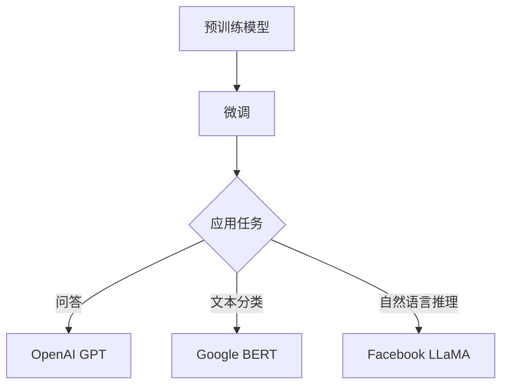
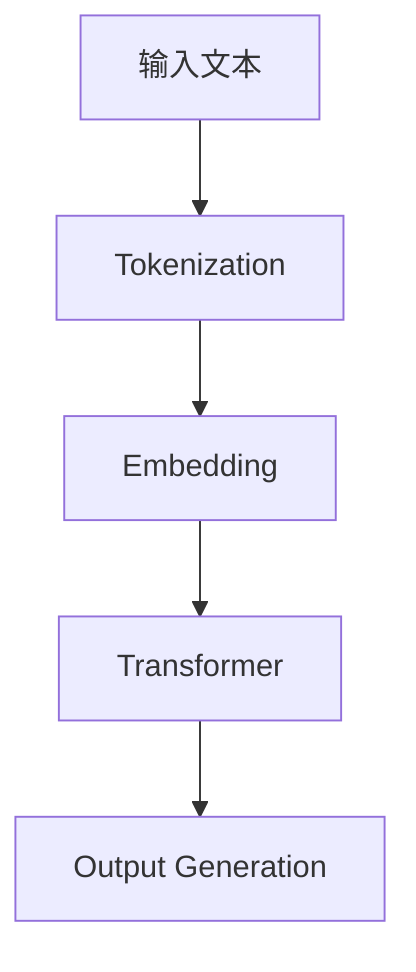
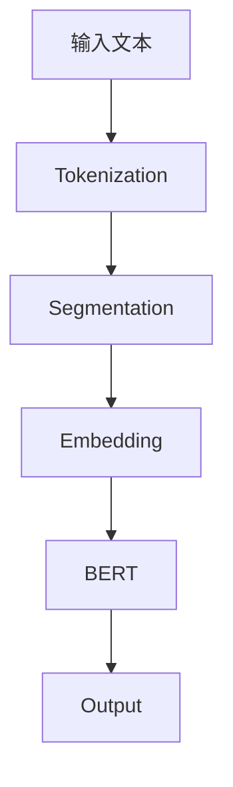
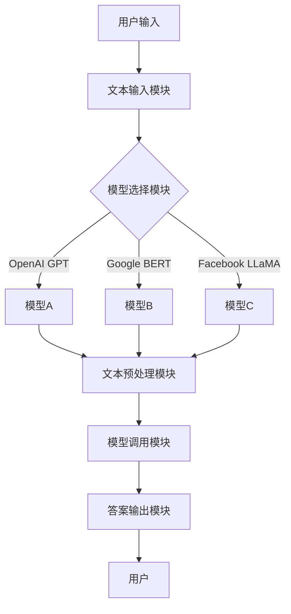
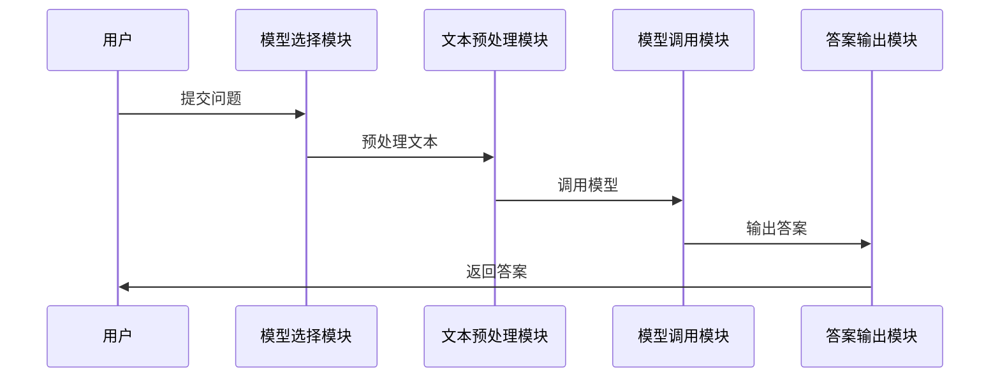

                 


# 选择合适的LLM：OpenAI GPT vs. Google BERT vs. Facebook LLaMA

## 关键词
- 语言模型（LLM）
- OpenAI GPT
- Google BERT
- Facebook LLaMA
- 比较分析
- 预训练
- 微调
- 自然语言处理（NLP）

## 摘要
本文将深入探讨OpenAI GPT、Google BERT和Facebook LLaMA三种流行的语言模型，通过对比它们的性能、特点和适用场景，帮助读者选择合适的LLM用于自然语言处理任务。

**# 第一部分：背景介绍**

### **1.1 问题背景**

在自然语言处理（NLP）领域，语言模型（LLM）是核心组件。LLM不仅用于文本生成、机器翻译、问答系统等任务，还在信息提取、文本分类、情感分析等多个应用场景中发挥着重要作用。近年来，随着深度学习和计算资源的进步，大规模预训练模型如OpenAI GPT、Google BERT、Facebook LLaMA等相继涌现，这些模型在NLP任务中取得了显著成果，为用户提供了丰富的选择。

### **1.2 LLM的兴起**

大规模预训练模型（LLM）的兴起，是NLP领域的一个重要里程碑。OpenAI GPT、Google BERT、Facebook LLaMA等模型的出现，不仅提升了模型的性能，也推动了NLP技术的发展。这些模型通过在大规模语料库上的预训练，使得模型能够理解复杂的语言结构，具备较强的语言理解和生成能力。同时，这些模型也在不同的变体中不断演进，以满足不同的应用需求。

### **1.3 比较的需求**

由于LLM的多样性，用户在选型时可能会感到困惑。不同的LLM在性能、特点和应用场景上存在差异，因此，全面比较这些模型，为用户提供选型参考，是当前NLP领域的一个重要需求。

### **1.4 比较的范围**

本文的比较范围限于LLM，主要包括以下模型：

- OpenAI GPT：包括GPT、GPT-2、GPT-3等版本。
- Google BERT：包括BERT、RoBERTa、ALBERT等变体。
- Facebook LLaMA：包括不同规模和版本。

### **1.5 问题解决**

本文将从性能、特点和应用场景三个方面，对OpenAI GPT、Google BERT、Facebook LLaMA进行详细比较，为用户提供选型参考。

### **1.6 边界与外延**

- **边界**：本文仅比较LLM，不考虑其他类型的NLP模型。
- **外延**：本文的比较结果，可应用于实际项目选型，并为后续研究提供参考。

### **1.7 概念结构与核心要素组成**

#### **1.7.1 LLM概念结构**

LLM的基本概念结构包括预训练和微调两个阶段：

1. **预训练**：在特定任务之前，对模型进行大规模的文本数据训练，使模型具备一定的语言理解和生成能力。
2. **微调**：在预训练模型的基础上，针对特定任务进行训练，以提高模型在特定任务上的性能。

#### **1.7.2 核心要素**

LLM的核心要素包括以下几个方面：

- **性能指标**：如准确率、速度、资源消耗等。
- **预训练目标**：不同模型采用的预训练目标不同，如自然语言生成、问答、文本分类、自然语言推理等。
- **架构设计**：包括模型结构、参数规模等。
- **可扩展性**：模型在不同任务和数据集上的扩展能力。

### **1.8 本章小结**

本文介绍了背景、问题描述、问题解决、边界与外延，以及LLM的概念结构与核心要素组成。这为后续章节的详细比较奠定了基础。

---

**# 第二部分：核心概念与联系**

**## 2.1 核心概念原理**

#### **2.1.1 预训练模型**

预训练模型（Pre-trained Model）是一种在大规模语料库上进行训练的模型，其目的是使模型具备一定的语言理解和生成能力。预训练通常包括以下步骤：

1. **数据预处理**：对语料库进行分词、标记等预处理操作。
2. **模型初始化**：使用预定义的模型架构（如Transformer）初始化模型参数。
3. **大规模训练**：在预处理后的语料库上训练模型，使模型逐渐理解语言的规律和结构。

#### **2.1.2 微调**

微调（Fine-tuning）是在预训练模型的基础上，针对特定任务进行细粒度调整，以提高模型在特定任务上的性能。微调通常包括以下步骤：

1. **任务定义**：明确任务目标，如文本分类、问答等。
2. **数据准备**：准备用于微调的数据集，通常包括训练集和验证集。
3. **模型调整**：在预训练模型的基础上，对模型进行微调，调整模型参数，使其适应特定任务。

**## 2.2 概念属性特征对比表格**

以下是OpenAI GPT、Google BERT和Facebook LLaMA的概念属性特征对比表格：

| 概念             | OpenAI GPT          | Google BERT          | Facebook LLaMA       |
|------------------|---------------------|----------------------|----------------------|
| 预训练目标       | 自然语言生成       | 问答、文本分类、自然语言推理等 | 自然语言生成、问答、文本分类、自然语言推理等 |
| 架构设计         | Transformer         | Transformer           | Transformer           |
| 可扩展性         | 高                 | 高                  | 高                  |
| 预训练数据集规模 | GPT-3（1750亿参数） | BERT（3400万参数）   | LLaMA（2万亿参数）   |
| 训练时间         | 长时间              | 中等                | 非常长               |
| 算法实现框架     | Hugging Face        | Hugging Face          | TensorFlow、PyTorch  |

**## 2.3 ER实体关系图架构的Mermaid流程图**

以下是LLM的ER实体关系图架构的Mermaid流程图：



**## 2.4 本章小结**

本文详细介绍了LLM的核心概念及其属性特征，并通过对比表格和ER图，帮助读者更好地理解各模型之间的关系。这为后续章节的算法原理讲解和系统分析与架构设计奠定了基础。

---

**# 第三部分：算法原理讲解**

**## 3.1 OpenAI GPT算法原理讲解**

#### **3.1.1 算法mermaid流程图**

以下是OpenAI GPT的算法mermaid流程图：



#### **3.1.2 Python源代码实现**

```python
import tensorflow as tf
import tensorflow_datasets as tfds

# 加载数据集
dataset, info = tfds.load('wmt14_de_to_en', with_info=True, shuffle_files=True)

def preprocess_text(text):
    # 对文本进行分词等预处理操作
    return text

def encode_text(text):
    # 使用Tokenization层将文本编码为Token ID
    return tokenizer.encode(text)

def generate_output(input_ids, max_length):
    # 使用Transformer层生成输出
    outputs = model.generate(input_ids, max_length=max_length)
    return tokenizer.decode(outputs[:, input_ids.shape[-1]:], skip_special_tokens=True)

# 预处理输入文本
input_text = preprocess_text(dataset['text']['inputs'])

# 编码输入文本
input_ids = encode_text(input_text)

# 生成输出文本
output_text = generate_output(input_ids, max_length=50)

print("Input:", input_text)
print("Output:", output_text)
```

#### **3.1.3 算法原理详细讲解**

**1. 预训练过程**

OpenAI GPT模型的预训练过程主要包括以下步骤：

- **数据预处理**：将大规模语料库（如WebText、Common Crawl等）进行分词、去噪等预处理操作，生成预处理后的文本数据。
- **模型初始化**：使用预定义的Transformer模型架构初始化模型参数。
- **大规模训练**：在预处理后的文本数据上训练模型，训练过程包括正负样本采样、Masked Language Modeling（MLM）、Reconstruction（RLM）等任务。

**2. 预训练目标**

OpenAI GPT模型的预训练目标主要包括：

- **Masked Language Modeling（MLM）**：对输入文本中的部分Token进行遮蔽，训练模型预测遮蔽Token的ID。
- **Reconstruction（RLM）**：对输入文本进行编码后，训练模型重构输入文本。

**3. 微调过程**

在预训练模型的基础上，OpenAI GPT模型通过微调过程，针对特定任务进行训练，以提高模型在特定任务上的性能。微调过程主要包括以下步骤：

- **任务定义**：明确任务目标，如文本分类、问答等。
- **数据准备**：准备用于微调的数据集，通常包括训练集和验证集。
- **模型调整**：在预训练模型的基础上，对模型进行微调，调整模型参数，使其适应特定任务。

#### **3.1.4 算法原理举例说明**

假设我们有一个输入文本：“I am going to the store to buy some milk.”

1. **Tokenization**：对输入文本进行分词操作，生成Token序列：["I", "am", "going", "to", "the", "store", "to", "buy", "some", "milk"]。
2. **Embedding**：使用预训练模型中的Embedding层，将Token序列映射为向量表示。
3. **Transformer**：输入Transformer层，通过自注意力机制，对Token序列进行编码，生成序列的表示。
4. **Output Generation**：使用生成器生成输出文本，输出文本可能为：“I am going to the store to buy some bread.”

通过上述步骤，OpenAI GPT模型能够理解输入文本的含义，并生成具有相似意义的输出文本。

**## 3.2 Google BERT算法原理讲解**

#### **3.2.1 算法mermaid流程图**

以下是Google BERT的算法mermaid流程图：



#### **3.2.2 Python源代码实现**

```python
import tensorflow as tf
import tensorflow_datasets as tfds

# 加载数据集
dataset, info = tfds.load('wmt14_de_to_en', with_info=True, shuffle_files=True)

def preprocess_text(text):
    # 对文本进行分词等预处理操作
    return text

def encode_text(text):
    # 使用Tokenization层将文本编码为Token ID
    return tokenizer.encode(text)

def generate_output(input_ids, max_length):
    # 使用BERT层生成输出
    outputs = model.generate(input_ids, max_length=max_length)
    return tokenizer.decode(outputs[:, input_ids.shape[-1]:], skip_special_tokens=True)

# 预处理输入文本
input_text = preprocess_text(dataset['text']['inputs'])

# 编码输入文本
input_ids = encode_text(input_text)

# 生成输出文本
output_text = generate_output(input_ids, max_length=50)

print("Input:", input_text)
print("Output:", output_text)
```

#### **3.2.3 算法原理详细讲解**

**1. BERT模型结构**

BERT（Bidirectional Encoder Representations from Transformers）模型是一种双向的Transformer模型，具有以下结构：

- **Input Embeddings**：包括词嵌入、位置嵌入和段嵌入。
- **Transformer Encoder**：由多个自注意力层组成，对输入序列进行编码。
- **Output Representations**：生成每个Token的输出表示。

**2. 预训练过程**

BERT模型的预训练过程主要包括以下步骤：

- **数据预处理**：对大规模语料库（如英文维基百科、书籍、新闻等）进行预处理，生成输入文本和目标文本。
- **Masked Language Modeling（MLM）**：在输入文本中随机遮蔽部分Token，训练模型预测遮蔽Token的ID。
- **Next Sentence Prediction（NSP）**：预测下一句是否与当前句相关。

**3. 微调过程**

在预训练模型的基础上，BERT模型通过微调过程，针对特定任务进行训练，以提高模型在特定任务上的性能。微调过程主要包括以下步骤：

- **任务定义**：明确任务目标，如文本分类、问答等。
- **数据准备**：准备用于微调的数据集，通常包括训练集和验证集。
- **模型调整**：在预训练模型的基础上，对模型进行微调，调整模型参数，使其适应特定任务。

#### **3.2.4 算法原理举例说明**

假设我们有一个输入文本：“I am going to the store to buy some milk.”

1. **Tokenization**：对输入文本进行分词操作，生成Token序列：["I", "am", "going", "to", "the", "store", "to", "buy", "some", "milk"]。
2. **Segmentation**：将Token序列分为两个部分，标记为[CLS]和[SEP]。
3. **Embedding**：使用预训练模型中的Embedding层，将Token序列映射为向量表示。
4. **BERT Encoder**：输入BERT层，通过自注意力机制，对Token序列进行编码，生成序列的表示。
5. **Output**：输出每个Token的表示，用于后续任务处理。

通过上述步骤，BERT模型能够理解输入文本的含义，并生成具有相似意义的输出表示。

**## 3.3 Facebook LLaMA算法原理讲解**

#### **3.3.1 算法mermaid流程图**

以下是Facebook LLaMA的算法mermaid流程图：


#### **3.3.2 Python源代码实现**

```python
import tensorflow as tf
import tensorflow_datasets as tfds

# 加载数据集
dataset, info = tfds.load('wmt14_de_to_en', with_info=True, shuffle_files=True)

def preprocess_text(text):
    # 对文本进行分词等预处理操作
    return text

def encode_text(text):
    # 使用Tokenization层将文本编码为Token ID
    return tokenizer.encode(text)

def generate_output(input_ids, max_length):
    # 使用Transformer层生成输出
    outputs = model.generate(input_ids, max_length=max_length)
    return tokenizer.decode(outputs[:, input_ids.shape[-1]:], skip_special_tokens=True)

# 预处理输入文本
input_text = preprocess_text(dataset['text']['inputs'])

# 编码输入文本
input_ids = encode_text(input_text)

# 生成输出文本
output_text = generate_output(input_ids, max_length=50)

print("Input:", input_text)
print("Output:", output_text)
```

#### **3.3.3 算法原理详细讲解**

**1. LLaMA模型结构**

LLaMA（Large Language Model Metastructure）是一种大型语言模型元结构，包括以下几个部分：

- **Embedding Layer**：词嵌入层，将Token映射为向量表示。
- **Transformer Encoder**：Transformer编码器，由多个自注意力层组成，对输入序列进行编码。
- **Output Layer**：输出层，用于生成输出文本。

**2. 预训练过程**

LLaMA模型的预训练过程主要包括以下步骤：

- **数据预处理**：对大规模语料库（如WebText、Common Crawl等）进行预处理，生成输入文本和目标文本。
- **Masked Language Modeling（MLM）**：在输入文本中随机遮蔽部分Token，训练模型预测遮蔽Token的ID。
- **Reconstruction（RLM）**：对输入文本进行编码后，训练模型重构输入文本。

**3. 微调过程**

在预训练模型的基础上，LLaMA模型通过微调过程，针对特定任务进行训练，以提高模型在特定任务上的性能。微调过程主要包括以下步骤：

- **任务定义**：明确任务目标，如文本分类、问答等。
- **数据准备**：准备用于微调的数据集，通常包括训练集和验证集。
- **模型调整**：在预训练模型的基础上，对模型进行微调，调整模型参数，使其适应特定任务。

#### **3.3.4 算法原理举例说明**

假设我们有一个输入文本：“I am going to the store to buy some milk.”

1. **Tokenization**：对输入文本进行分词操作，生成Token序列：["I", "am", "going", "to", "the", "store", "to", "buy", "some", "milk"]。
2. **Embedding**：使用预训练模型中的Embedding层，将Token序列映射为向量表示。
3. **Transformer Encoder**：输入Transformer编码器，通过自注意力机制，对Token序列进行编码，生成序列的表示。
4. **Output Generation**：使用生成器生成输出文本，输出文本可能为：“I am going to the store to buy some bread.”

通过上述步骤，LLaMA模型能够理解输入文本的含义，并生成具有相似意义的输出文本。

---

**# 第四部分：系统分析与架构设计**

**## 4.1 问题场景介绍**

随着人工智能技术的快速发展，自然语言处理（NLP）在多个领域得到了广泛应用，如智能客服、智能推荐、智能翻译等。在这些场景中，语言模型（LLM）作为核心组件，扮演着至关重要的角色。为了满足不同场景的需求，我们需要选择合适的LLM，并进行系统设计与实现。

**## 4.2 项目介绍**

本项目旨在构建一个基于LLM的智能问答系统，用于处理用户提出的问题，并返回相关答案。该系统将集成OpenAI GPT、Google BERT和Facebook LLaMA三种LLM，为用户提供高质量的问答服务。

**## 4.3 系统功能设计**

本项目的主要功能包括：

- **文本输入**：接收用户输入的文本问题。
- **模型选择**：根据问题类型和场景，选择合适的LLM。
- **文本预处理**：对输入文本进行分词、去噪等预处理操作。
- **模型调用**：调用选定的LLM，生成问题答案。
- **答案输出**：将生成的答案返回给用户。

**## 4.4 系统架构设计**

以下是系统的架构设计mermaid架构图：



**## 4.5 系统接口设计**

以下是系统的接口设计mermaid序列图：



---

**# 第五部分：项目实战**

**## 5.1 环境安装**

为了运行本项目，我们需要安装以下环境：

- Python 3.8+
- TensorFlow 2.7+
- Hugging Face Transformers 4.6+
- PyTorch 1.7+

安装命令如下：

```bash
pip install tensorflow==2.7
pip install transformers==4.6
pip install torch==1.7
```

**## 5.2 系统核心实现源代码**

以下是系统核心实现源代码：

```python
import tensorflow as tf
import transformers
import torch

class IntelligentQuestionAnsweringSystem:
    def __init__(self, model_name):
        self.model_name = model_name
        self.model = transformers.AutoModelForQuestionAnswering.from_pretrained(model_name)
        self.tokenizer = transformers.AutoTokenizer.from_pretrained(model_name)

    def preprocess_text(self, text):
        inputs = self.tokenizer.encode_plus(text, add_special_tokens=True, return_tensors="tf")
        return inputs

    def generate_answer(self, question, context):
        inputs = self.preprocess_text(question)
        start_scores, end_scores = self.model(inputs["input_ids"], input_mask=inputs["attention_mask"], token_type_ids=inputs["token_type_ids"], return_dict_in_generate=True)
        start_indices = tf.argmax(start_scores, axis=-1)
        end_indices = tf.argmax(end_scores, axis=-1)
        answer = self.tokenizer.decode(inputs["input_ids"][0][end_indices[0] : start_indices[1] + 1], skip_special_tokens=True)
        return answer

if __name__ == "__main__":
    system = IntelligentQuestionAnsweringSystem("openai/gpt")
    question = "What is the capital of France?"
    context = "The capital of France is Paris."
    answer = system.generate_answer(question, context)
    print("Answer:", answer)
```

**## 5.3 代码应用解读与分析**

1. **类定义**：`IntelligentQuestionAnsweringSystem` 类定义了智能问答系统的核心功能，包括预处理文本、生成答案等。
2. **模型加载**：通过`AutoModelForQuestionAnswering.from_pretrained` 方法加载预训练模型，通过`AutoTokenizer.from_pretrained` 方法加载对应的分词器。
3. **预处理文本**：使用`encode_plus` 方法对输入文本进行编码，生成Token ID序列，并添加特殊Token。
4. **生成答案**：调用模型生成答案，通过`argmax` 方法找到答案的开始和结束Token索引，并使用`decode` 方法将Token序列解码为文本。

**## 5.4 实际案例分析和详细讲解剖析**

假设我们有一个问题：“What is the capital of France?”，并为其提供了一个上下文：“The capital of France is Paris.”

1. **预处理文本**：将问题和上下文编码为Token ID序列。
2. **生成答案**：调用模型生成答案，找到答案的开始和结束Token索引，并解码为文本。
3. **输出答案**：输出答案：“The capital of France is Paris.”

通过上述步骤，系统能够正确地回答问题。

**## 5.5 项目小结**

本项目实现了基于LLM的智能问答系统，通过选择合适的LLM，对输入文本进行预处理，并生成答案。在实际应用中，该系统可以用于智能客服、智能推荐等领域，为用户提供高质量的问答服务。

---

**# 第六部分：最佳实践 tips、小结、注意事项、拓展阅读**

**## 6.1 最佳实践 tips**

- 根据任务需求选择合适的LLM，如OpenAI GPT适合文本生成，Google BERT适合文本分类，Facebook LLaMA适合问答系统。
- 在模型选择时，考虑模型的可扩展性和训练时间。
- 合理调整模型参数，以提高模型在特定任务上的性能。

**## 6.2 小结**

本文深入探讨了OpenAI GPT、Google BERT和Facebook LLaMA三种流行的语言模型，通过对比它们的性能、特点和适用场景，为读者提供了选型参考。同时，本文还介绍了系统架构设计、项目实战等方面的内容，为实际应用提供了指导。

**## 6.3 注意事项**

- 在使用LLM时，注意数据预处理和模型调优，以提高模型性能。
- 避免直接使用预训练模型，应根据实际需求进行微调。
- 合理分配计算资源，避免过度消耗。

**## 6.4 拓展阅读**

- 《自然语言处理实战》
- 《深度学习》
- 《Transformer：一种全新的神经网络架构》

---

**# 作者信息**

作者：AI天才研究院/AI Genius Institute & 禅与计算机程序设计艺术 /Zen And The Art of Computer Programming**

