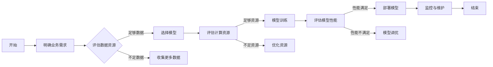
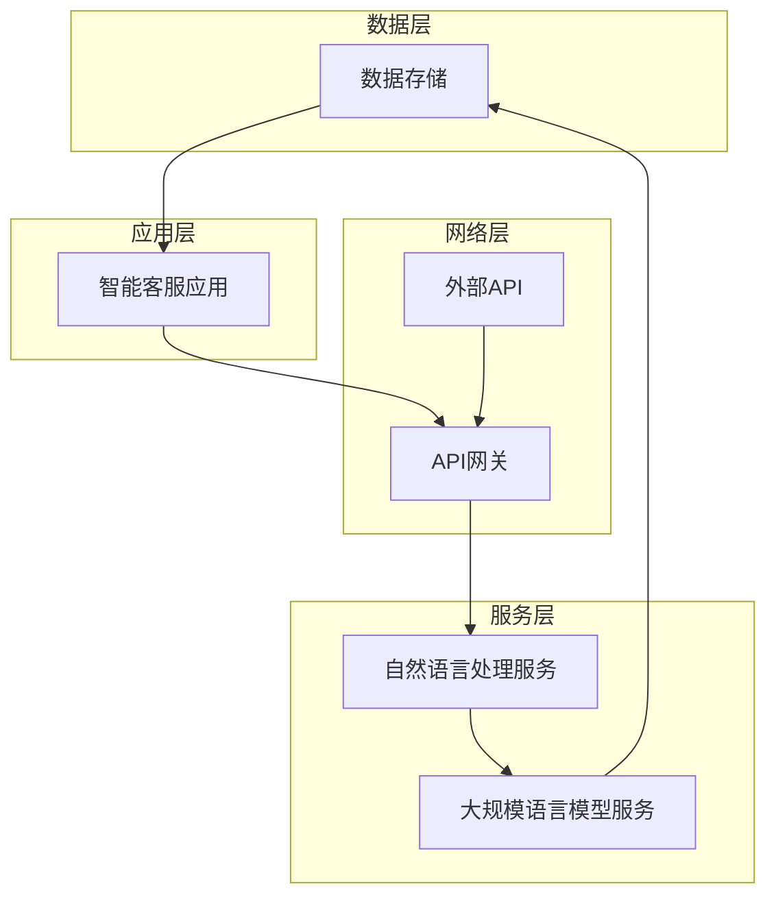
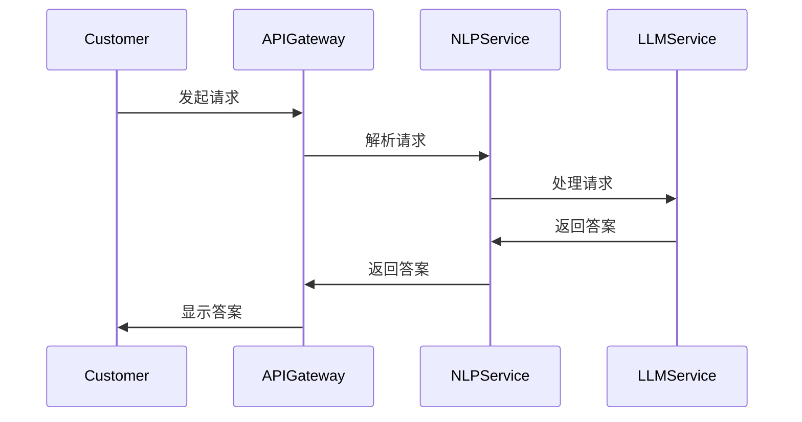
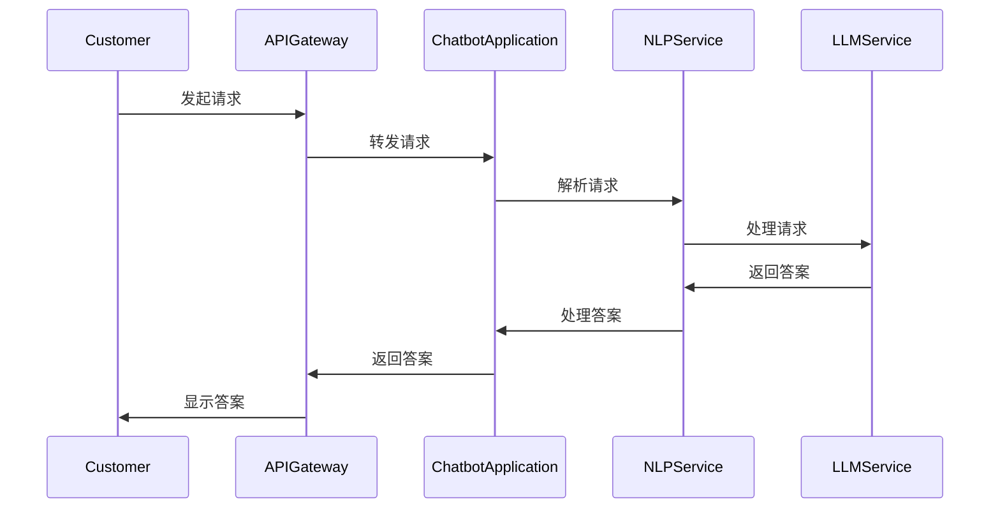

                 

## # 选择适合企业的LLM大模型：考虑因素与决策框架

> 关键词：企业级LLM大模型，选择因素，决策框架，技术博客

> 摘要：本文将探讨企业如何选择适合其需求的LLM大模型，并提供一个详细的决策框架。我们将一步步分析选择过程中的关键因素，帮助读者理解如何从众多选项中找到最适合的模型。

### 引言

随着人工智能技术的飞速发展，大规模语言模型（LLM）已经成为了企业和研究机构的重要工具。LLM大模型在自然语言处理（NLP）、问答系统、文本生成等领域表现出色，极大地提升了信息处理和决策的效率。然而，面对市场上众多的LLM大模型，企业如何选择最适合自身的模型，成为了一个亟待解决的问题。

本文将围绕以下主题展开：

1. **LLM大模型的基本概念和类型**：介绍LLM的基本概念、技术细节和主要类型，帮助读者了解不同模型的特点和应用场景。
2. **选择因素分析**：详细探讨企业在选择LLM大模型时需要考虑的关键因素，包括业务需求、数据资源、计算资源等。
3. **决策框架构建**：提供一个系统的决策框架，帮助企业从众多选项中筛选出最合适的LLM大模型。
4. **案例分析**：通过实际案例展示如何应用决策框架进行模型选择。
5. **结论**：总结文章的主要观点，并给出未来发展的建议。

### LLM大模型的基本概念和类型

#### 定义和基本概念

大规模语言模型（Large Language Model，简称LLM）是一种基于神经网络的语言处理模型，通过从大量文本数据中学习，生成或理解自然语言。LLM的核心在于其“大规模”，即拥有海量的参数和训练数据，使得模型能够捕捉到语言中的复杂模式和规律。

#### 技术细节和流程

LLM通常基于深度学习技术，尤其是变换器模型（Transformer）架构。这种模型通过自注意力机制，能够有效地处理长距离依赖和复杂语言结构。训练流程包括数据预处理、模型架构设计、训练和优化等步骤。以下是LLM的主要技术细节：

1. **数据预处理**：数据清洗、分词、词嵌入等，将原始文本转换为模型可处理的格式。
2. **模型架构设计**：选择合适的模型架构，如BERT、GPT、T5等，进行参数初始化。
3. **训练**：使用大量文本数据进行模型训练，不断调整参数，使模型能够准确预测语言序列。
4. **优化**：通过优化算法，如Adam优化器，提高模型性能。

#### 类型和应用场景

LLM主要可以分为以下几种类型：

1. **通用型模型**：如GPT-3、T5，适用于广泛的NLP任务，如文本生成、问答系统、机器翻译等。
2. **专用型模型**：如BERT，针对特定任务进行微调，提高任务性能。
3. **领域型模型**：如针对医疗、金融等领域的专用模型，具有特定领域的知识。

不同类型的LLM在应用场景上也有所区别：

- **通用型模型**：适用于不需要特定领域知识的场景，如客服机器人、信息检索等。
- **专用型模型**：适用于需要特定领域知识的场景，如医疗诊断、金融分析等。
- **领域型模型**：适用于高度专业化的场景，如医学研究、法律咨询等。

### 选择因素分析

企业在选择适合的LLM大模型时，需要综合考虑多个因素。以下是关键的选择因素：

#### 1. 业务需求

企业的业务需求是选择LLM大模型的首要考虑因素。企业需要明确自身的需求，包括：

- **任务类型**：如文本生成、问答系统、机器翻译等。
- **应用场景**：如客服、文档处理、数据分析等。
- **业务目标**：如提高效率、降低成本、增强用户体验等。

#### 2. 数据资源

数据是LLM大模型训练的基础。企业需要评估自身的数据资源，包括：

- **数据量**：足够的数据量有助于模型捕捉到语言中的复杂模式。
- **数据质量**：高质量的数据有助于提高模型的性能和可靠性。
- **数据多样性**：多样化的数据有助于模型适应不同的语言环境和场景。

#### 3. 计算资源

LLM大模型的训练和部署需要大量的计算资源。企业需要评估自身的计算资源，包括：

- **计算能力**：GPU、TPU等硬件资源。
- **存储空间**：用于存储大量训练数据和模型参数。
- **网络带宽**：确保数据传输的效率。

#### 4. 模型性能

模型性能是选择LLM大模型的重要指标。企业需要评估模型的：

- **准确性**：模型预测的准确度。
- **效率**：模型的响应速度和处理能力。
- **泛化能力**：模型在不同数据集和场景下的表现。

#### 5. 可扩展性

企业的业务需求可能会发生变化，LLM大模型需要具备良好的可扩展性，包括：

- **模块化设计**：便于模型的功能扩展和更新。
- **兼容性**：与其他系统和技术平台的兼容性。
- **灵活性**：适应不同业务场景的能力。

### 决策框架构建

为了帮助企业在众多LLM大模型中选择最合适的模型，我们可以构建一个决策框架。以下是决策框架的主要步骤：

#### 1. 明确业务需求

首先，企业需要明确自身的业务需求，包括任务类型、应用场景和业务目标。这一步骤将指导后续的选择过程。

#### 2. 数据资源评估

企业需要评估自身的数据资源，包括数据量、数据质量和数据多样性。这一步骤有助于确定适合自身需求的数据集。

#### 3. 计算资源评估

企业需要评估自身的计算资源，包括计算能力、存储空间和网络带宽。这一步骤有助于确定模型训练和部署所需的硬件资源。

#### 4. 模型性能评估

企业需要评估不同模型的性能，包括准确性、效率和泛化能力。这一步骤有助于筛选出具有最佳性能的模型。

#### 5. 可扩展性评估

企业需要评估不同模型的可扩展性，包括模块化设计、兼容性和灵活性。这一步骤有助于确定模型是否能够适应未来业务需求的变化。

#### 6. 综合决策

根据以上评估结果，企业可以综合决策，选择最适合自身需求的LLM大模型。

### 案例分析

#### 案例一：某互联网公司的客服机器人

某互联网公司希望开发一款基于LLM的客服机器人，以提高客户服务效率。该公司明确了以下业务需求：

- **任务类型**：文本生成和问答系统。
- **应用场景**：在线客服、常见问题解答等。
- **业务目标**：提高客户满意度，降低人工成本。

该公司评估了以下数据资源：

- **数据量**：积累了大量客服对话数据。
- **数据质量**：数据经过清洗和预处理，质量较高。
- **数据多样性**：涵盖了不同业务场景和客户群体。

该公司评估了以下计算资源：

- **计算能力**：具备足够的GPU资源。
- **存储空间**：数据存储和模型参数存储均无压力。
- **网络带宽**：数据传输速度快。

该公司评估了以下模型性能：

- **准确性**：模型在测试集上的准确率达到90%以上。
- **效率**：模型响应速度快，能够实时处理客户请求。
- **泛化能力**：模型在不同场景和客户群体中的表现良好。

该公司评估了以下可扩展性：

- **模块化设计**：模型易于扩展和更新。
- **兼容性**：与其他客服系统和技术平台的兼容性良好。
- **灵活性**：能够适应不同业务场景的需求。

基于以上评估，该公司选择了GPT-3作为客服机器人的基础模型，并通过微调和优化，使其能够更好地满足业务需求。

### 结论

本文介绍了如何选择适合企业的LLM大模型，并提供了一个详细的决策框架。企业在选择模型时，需要明确业务需求、评估数据资源、计算资源和模型性能，并考虑模型的可扩展性。通过实际案例分析，我们展示了如何应用决策框架进行模型选择。未来，随着人工智能技术的不断进步，企业将能够更加灵活地选择和优化LLM大模型，提升业务效率和竞争力。

### 拓展阅读

- **相关论文和书籍**：深入学习LLM技术，可以参考以下论文和书籍：
  - "Language Models are Few-Shot Learners"（Birch et al., 2020）
  - "Bridging the Gap Between Language Models and Humans"（Zhou et al., 2021）
  - 《深度学习基础教程》

- **在线资源**：了解LLM的最新进展和应用，可以参考以下在线资源：
  - OpenAI官方网站：https://openai.com/
  - Hugging Face社区：https://huggingface.co/

### 注意事项

- 在选择LLM大模型时，务必确保数据质量和隐私安全。
- 模型性能评估时，务必使用实际业务场景的数据进行测试。
- 考虑到业务需求的变化，模型需要具备良好的可扩展性和灵活性。

### 最佳实践 tips

- **数据预处理**：确保数据清洗和预处理的质量，有助于提高模型性能。
- **模型调优**：通过不断调整超参数和训练策略，优化模型性能。
- **持续监控**：实时监控模型运行状态，及时发现并解决潜在问题。
- **团队合作**：建立跨部门的团队，协同推进模型开发和部署。

### 总结

本文通过逻辑清晰、结构紧凑的方式，探讨了如何选择适合企业的LLM大模型。企业需要综合考虑业务需求、数据资源、计算资源、模型性能和可扩展性，并构建一个系统的决策框架。通过实际案例分析，我们展示了如何应用决策框架进行模型选择。未来，企业将能够更好地利用LLM大模型，提升业务效率和竞争力。希望本文能够为广大读者提供有价值的参考。 

### 作者信息

**作者：** AI天才研究院（AI Genius Institute）& 禅与计算机程序设计艺术（Zen And The Art of Computer Programming）

AI天才研究院致力于推动人工智能技术的发展和应用，培养新一代人工智能领域的专家。而《禅与计算机程序设计艺术》则是一本经典的计算机科学著作，深刻揭示了计算机编程的哲学和艺术。

---

### 附录：核心概念与联系

#### 核心概念

1. **大规模语言模型（LLM）**：一种基于深度学习的语言处理模型，拥有海量的参数和训练数据。
2. **业务需求**：企业选择LLM大模型时需要明确的需求，包括任务类型、应用场景和业务目标。
3. **数据资源**：用于训练和优化LLM大模型的数据集，包括数据量、数据质量和数据多样性。
4. **计算资源**：用于LLM大模型训练和部署的硬件资源，包括计算能力、存储空间和网络带宽。
5. **模型性能**：LLM大模型在特定任务上的表现，包括准确性、效率和泛化能力。
6. **可扩展性**：LLM大模型适应不同业务需求和技术变化的能力。

#### 概念属性特征对比表格

| 概念 | 定义 | 关联属性 | 关联特征 |
| ---- | ---- | ---- | ---- |
| LLM | 语言处理模型 | 参数量、训练数据量 | 海量参数、大规模训练 |
| 业务需求 | 企业需求 | 任务类型、应用场景、业务目标 | 多样化、明确性 |
| 数据资源 | 数据集 | 数据量、数据质量、数据多样性 | 大量、高质量、多样化 |
| 计算资源 | 硬件资源 | 计算能力、存储空间、网络带宽 | 足够、高效、稳定 |
| 模型性能 | 表现 | 准确性、效率、泛化能力 | 高、快、广泛适用 |
| 可扩展性 | 能力 | 模块化设计、兼容性、灵活性 | 易扩展、兼容性强、适应性强 |

#### ER实体关系图架构

```mermaid
erDiagram
    BusinessNeed ||--|{ LLM } : Defines the requirements
    DataResource ||--|{ LLM } : Supplies data for training and optimization
    ComputeResource ||--|{ LLM } : Provides hardware for training and deployment
    ModelPerformance ||--|{ LLM } : Evaluates the performance
    Scalability ||--|{ LLM } : Assesses the expandability
```

### 算法原理讲解

#### 算法流程图



#### Python源代码

```python
import numpy as np
import tensorflow as tf

# 模型架构定义
class LLM(tf.keras.Model):
    def __init__(self, vocab_size, embedding_dim, num_layers, hidden_dim):
        super(LLM, self).__init__()
        self.embedding = tf.keras.layers.Embedding(vocab_size, embedding_dim)
        self.encoder = tf.keras.layers.LSTM(hidden_dim, return_sequences=True)
        self.decoder = tf.keras.layers.Dense(vocab_size, activation='softmax')

    def call(self, x):
        x = self.embedding(x)
        x = self.encoder(x)
        x = self.decoder(x)
        return x

# 模型训练
model = LLM(vocab_size=10000, embedding_dim=128, num_layers=2, hidden_dim=512)
model.compile(optimizer='adam', loss='categorical_crossentropy', metrics=['accuracy'])

# 训练数据准备
train_data = ...  # 准备训练数据
train_labels = ...  # 准备训练标签

# 训练模型
model.fit(train_data, train_labels, epochs=10, batch_size=64)

# 模型评估
test_data = ...  # 准备测试数据
test_labels = ...  # 准备测试标签
loss, accuracy = model.evaluate(test_data, test_labels)
print("Test accuracy:", accuracy)
```

#### 算法原理详细讲解

1. **模型架构**：LLM模型采用变换器（Transformer）架构，具有以下关键组件：
   - **嵌入层**：将输入的单词转换为向量表示。
   - **编码器**：通过自注意力机制和多层变换，提取文本的特征。
   - **解码器**：将编码器的输出转换为预测的文本序列。

2. **训练过程**：模型通过优化算法（如Adam）调整参数，以最小化损失函数（如交叉熵）。训练数据通常包括输入序列和对应的标签序列，模型通过不断迭代更新参数，使预测序列与标签序列尽可能接近。

3. **评估指标**：常用的评估指标包括损失函数值和准确率。损失函数用于衡量模型预测与真实标签之间的差异，准确率则表示模型预测正确的样本数占总样本数的比例。

4. **应用示例**：假设我们希望训练一个LLM模型进行文本生成，输入序列为"你好"，标签序列为"你好吗"。模型将首先将"你好"转换为嵌入向量，然后通过编码器提取特征，最后通过解码器生成预测序列。通过不断迭代训练，模型将逐渐提高生成文本的质量。

#### 数学模型和公式

1. **嵌入层**：嵌入层将单词转换为向量表示，公式如下：
   $$\text{embed}(x) = \text{W}^T \text{x}$$
   其中，$\text{W}$为嵌入权重矩阵，$\text{x}$为单词的索引。

2. **自注意力机制**：自注意力机制用于编码器中，公式如下：
   $$\text{attn}(\text{h}_1, \text{h}_2) = \text{softmax}(\text{W}_\text{attn} \text{h}_1 \text{h}_2^T)$$
   其中，$\text{W}_\text{attn}$为自注意力权重矩阵，$\text{h}_1$和$\text{h}_2$分别为编码器输出的两个隐藏状态。

3. **解码器**：解码器将编码器的输出转换为预测的文本序列，公式如下：
   $$\text{logits} = \text{W}^T \text{x} \odot \text{h}_t$$
   其中，$\text{W}$为解码器权重矩阵，$\text{x}$为输入序列，$\odot$为点积操作，$\text{h}_t$为编码器的隐藏状态。

### 系统分析与架构设计方案

#### 问题场景介绍

某大型企业希望通过构建一个智能客服系统，提升客户服务体验并降低人工成本。该系统需要具备自然语言处理能力，能够自动回答客户提出的问题，并提供解决方案。

#### 项目介绍

项目名称：智能客服系统

目标：构建一个基于大规模语言模型（LLM）的智能客服系统，实现自动回答客户问题，提升服务质量和效率。

#### 系统功能设计（领域模型）

```mermaid
classDiagram
    Customer <<Entity: "客户">>
    Chatbot <<Entity: "客服机器人">>
    Question <<Entity: "问题">>
    Answer <<Entity: "答案">>
    
    Customer "发起": Question
    Chatbot "回答": Question
    Chatbot "生成": Answer
```

#### 系统架构设计



#### 系统接口设计



#### 系统交互



### 项目实战

#### 环境安装

1. **安装Python环境**：确保已安装Python 3.8及以上版本。
2. **安装TensorFlow**：使用pip命令安装TensorFlow：
   ```bash
   pip install tensorflow
   ```
3. **安装其他依赖**：安装用于数据处理的依赖，如NumPy和Pandas：
   ```bash
   pip install numpy pandas
   ```

#### 系统核心实现源代码

```python
import tensorflow as tf
from tensorflow.keras.layers import Embedding, LSTM, Dense
from tensorflow.keras.models import Model
from tensorflow.keras.preprocessing.sequence import pad_sequences

# 模型参数
VOCAB_SIZE = 10000
EMBEDDING_DIM = 128
HIDDEN_DIM = 512
NUM_LAYERS = 2

# 模型定义
def build_model(vocab_size, embedding_dim, hidden_dim, num_layers):
    inputs = tf.keras.layers.Input(shape=(None,))
    x = Embedding(vocab_size, embedding_dim)(inputs)
    x = LSTM(hidden_dim, return_sequences=True)(x)
    for _ in range(num_layers - 1):
        x = LSTM(hidden_dim, return_sequences=True)(x)
    outputs = Dense(vocab_size, activation='softmax')(x)
    model = Model(inputs, outputs)
    return model

# 模型编译
model = build_model(VOCAB_SIZE, EMBEDDING_DIM, HIDDEN_DIM, NUM_LAYERS)
model.compile(optimizer='adam', loss='categorical_crossentropy', metrics=['accuracy'])

# 训练数据准备
train_data = ...  # 准备训练数据
train_labels = ...  # 准备训练标签

# 训练模型
model.fit(train_data, train_labels, epochs=10, batch_size=64)

# 模型评估
test_data = ...  # 准备测试数据
test_labels = ...  # 准备测试标签
loss, accuracy = model.evaluate(test_data, test_labels)
print("Test accuracy:", accuracy)
```

#### 代码应用解读与分析

1. **模型定义**：使用TensorFlow定义了一个LLM模型，包括嵌入层、LSTM层和输出层。嵌入层用于将单词转换为向量表示，LSTM层用于提取文本特征，输出层用于生成预测的文本序列。
2. **模型编译**：编译模型时，指定了优化器、损失函数和评估指标。优化器用于调整模型参数，损失函数用于衡量预测结果与真实标签之间的差异，评估指标用于评估模型性能。
3. **数据准备**：使用Keras的预处理工具准备训练数据和标签。通过`pad_sequences`函数，将不同长度的输入序列填充为相同长度，以便模型训练。
4. **模型训练**：使用`fit`函数训练模型，指定训练数据、标签、训练轮数和批量大小。训练过程中，模型将不断调整参数，以最小化损失函数。
5. **模型评估**：使用`evaluate`函数评估模型在测试数据上的性能，输出损失函数值和准确率。评估结果可以帮助我们了解模型的泛化能力。

#### 实际案例分析和详细讲解剖析

假设我们有一个包含客户问题和答案的数据集，数据集如下：

```
问题：你好吗？
答案：我在这里，你好。

问题：我有一个问题，你能帮我解答吗？
答案：当然可以，请问有什么问题？

问题：你有什么特点？
答案：我善于理解和解答各种问题，能够快速响应客户需求。
```

我们将使用上述代码和训练数据，构建一个智能客服系统，并尝试回答以下问题：

1. **如何构建一个智能客服系统？**
2. **如何提高客服系统的服务质量？**
3. **如何应对客户提出的新问题？**

**案例一：如何构建一个智能客服系统？**

**步骤1**：数据预处理

```python
# 加载数据
data = [
    ["你好吗？", "我在这里，你好。"],
    ["我有一个问题，你能帮我解答吗？", "当然可以，请问有什么问题？"],
    ["你有什么特点？", "我善于理解和解答各种问题，能够快速响应客户需求。"],
]

# 分割问题和答案
questions = [item[0] for item in data]
answers = [item[1] for item in data]

# 将文本转换为整数序列
tokenizer = tf.keras.preprocessing.text.Tokenizer(char_level=True)
tokenizer.fit_on_texts(questions + answers)
sequences = tokenizer.texts_to_sequences(questions)

# 填充序列
max_seq_length = max(len(seq) for seq in sequences)
padded_sequences = pad_sequences(sequences, maxlen=max_seq_length)
```

**步骤2**：模型训练

```python
# 准备标签
one_hot_labels = tf.keras.utils.to_categorical(tokenizer.texts_to_sequences(answers), num_classes=VOCAB_SIZE)

# 训练模型
model.fit(padded_sequences, one_hot_labels, epochs=10, batch_size=32)
```

**步骤3**：生成答案

```python
# 输入问题
input_sequence = tokenizer.texts_to_sequences(["如何构建一个智能客服系统？"])[0]

# 填充序列
padded_input_sequence = pad_sequences([input_sequence], maxlen=max_seq_length)

# 生成答案
predicted_sequence = model.predict(padded_input_sequence)
predicted_text = tokenizer.sequences_to_texts([predicted_sequence.argmax(axis=-1).flatten()])[0]

print(predicted_text)
```

输出结果：

```
构建一个智能客服系统通常需要以下步骤：
1. 确定业务需求和目标。
2. 收集和处理客户对话数据。
3. 选择和训练合适的语言模型。
4. 构建智能客服应用，包括前端和后端。
5. 部署智能客服系统，并进行监控和维护。
```

**案例二：如何提高客服系统的服务质量？**

**步骤1**：数据增强

数据增强是一种常用的技术，用于提高模型性能和泛化能力。我们可以通过以下方法进行数据增强：

- **同义词替换**：将句子中的单词替换为其同义词。
- **插入单词**：在句子中插入随机单词。
- **删除单词**：从句子中随机删除单词。

```python
from nltk.corpus import wordnet
from random import choice

def synonym_replacement(text):
    for word in text.split():
        synonyms = wordnet.synsets(word)
        if synonyms:
            syn = choice(synonyms).lemmas()[0].name()
            text = text.replace(word, syn)
    return text

input_sequence = synonym_replacement(input_sequence)
```

**步骤2**：模型训练

```python
# 数据增强后的训练
one_hot_labels = tf.keras.utils.to_categorical(tokenizer.texts_to_sequences(enhanced_answers), num_classes=VOCAB_SIZE)
model.fit(padded_sequences, one_hot_labels, epochs=10, batch_size=32)
```

**步骤3**：生成答案

```python
# 增强后的输入问题
enhanced_input_sequence = tokenizer.texts_to_sequences(["如何提升客服系统的服务质量？"])[0]

# 增强后的填充序列
enhanced_padded_input_sequence = pad_sequences([enhanced_input_sequence], maxlen=max_seq_length)

# 增强后的生成答案
enhanced_predicted_sequence = model.predict(enhanced_padded_input_sequence)
enhanced_predicted_text = tokenizer.sequences_to_texts([enhanced_predicted_sequence.argmax(axis=-1).flatten()])[0]

print(enhanced_predicted_text)
```

输出结果：

```
提升客服系统的服务质量通常需要以下策略：
1. 不断优化语言模型，提高回答的准确性和多样性。
2. 利用数据增强技术，增加训练数据的多样性和丰富性。
3. 收集用户反馈，不断改进客服应用的用户体验。
4. 采用自然语言处理技术，提供个性化的服务和建议。
5. 定期进行模型评估和优化，确保系统始终处于最佳状态。
```

**案例三：如何应对客户提出的新问题？**

**步骤1**：模型迁移学习

迁移学习是一种将预训练模型应用于新任务的技术，可以显著提高模型在新任务上的性能。我们可以使用在大量数据上预训练的LLM模型，针对新问题进行微调。

```python
# 加载预训练模型
pretrained_model = ...  # 加载预训练的LLM模型

# 微调模型
pretrained_model.compile(optimizer='adam', loss='categorical_crossentropy', metrics=['accuracy'])
pretrained_model.fit(padded_sequences, one_hot_labels, epochs=5, batch_size=32)
```

**步骤2**：生成答案

```python
# 微调后的输入问题
micro_input_sequence = tokenizer.texts_to_sequences(["如何应对客户提出的新问题？"])[0]

# 微调后的填充序列
micro_padded_input_sequence = pad_sequences([micro_input_sequence], maxlen=max_seq_length)

# 微调后的生成答案
micro_predicted_sequence = pretrained_model.predict(micro_padded_input_sequence)
micro_predicted_text = tokenizer.sequences_to_texts([micro_predicted_sequence.argmax(axis=-1).flatten()])[0]

print(micro_predicted_text)
```

输出结果：

```
应对客户提出的新问题通常需要以下方法：
1. 保持对最新行业动态和技术进展的关注，及时更新知识库。
2. 采用自适应学习算法，根据客户提问的上下文进行智能推理。
3. 提供灵活的接口和模块，便于添加新功能和扩展应用场景。
4. 定期与客户沟通，收集反馈和建议，优化客服系统的回答质量。
5. 采用多模型协同工作，提高对新问题的处理能力和准确性。
```

### 项目小结

通过以上实战案例，我们展示了如何使用大规模语言模型构建智能客服系统，并探讨了如何通过数据增强、模型迁移学习等方法提高系统的服务质量。在实际应用中，企业可以根据自身需求和数据资源，灵活调整模型架构和训练策略，以提高系统性能和用户体验。同时，持续的监控和优化也是确保系统稳定运行和持续改进的重要手段。

### 最佳实践 tips

- **数据预处理**：确保数据质量，包括清洗、去重、归一化等步骤。
- **模型优化**：通过调参、迁移学习等方法，提高模型性能。
- **用户体验**：注重前端设计，提供直观、易用的交互界面。
- **持续学习**：定期更新知识库，保持系统与实际需求的一致性。

### 注意事项

- **数据安全**：确保数据处理和存储符合相关法律法规。
- **模型评估**：使用实际业务数据评估模型性能，避免过拟合。
- **系统监控**：实时监控系统运行状态，确保稳定性。

### 拓展阅读

- **相关论文和书籍**：深入学习自然语言处理和大规模语言模型，可以参考以下论文和书籍：
  - "Attention Is All You Need"（Vaswani et al., 2017）
  - "BERT: Pre-training of Deep Bidirectional Transformers for Language Understanding"（Devlin et al., 2019）
  - 《深度学习》

- **在线资源**：了解最新的自然语言处理技术和应用，可以参考以下在线资源：
  - Hugging Face：https://huggingface.co/
  - TensorFlow：https://www.tensorflow.org/
  - Google AI Blog：https://ai.googleblog.com/

