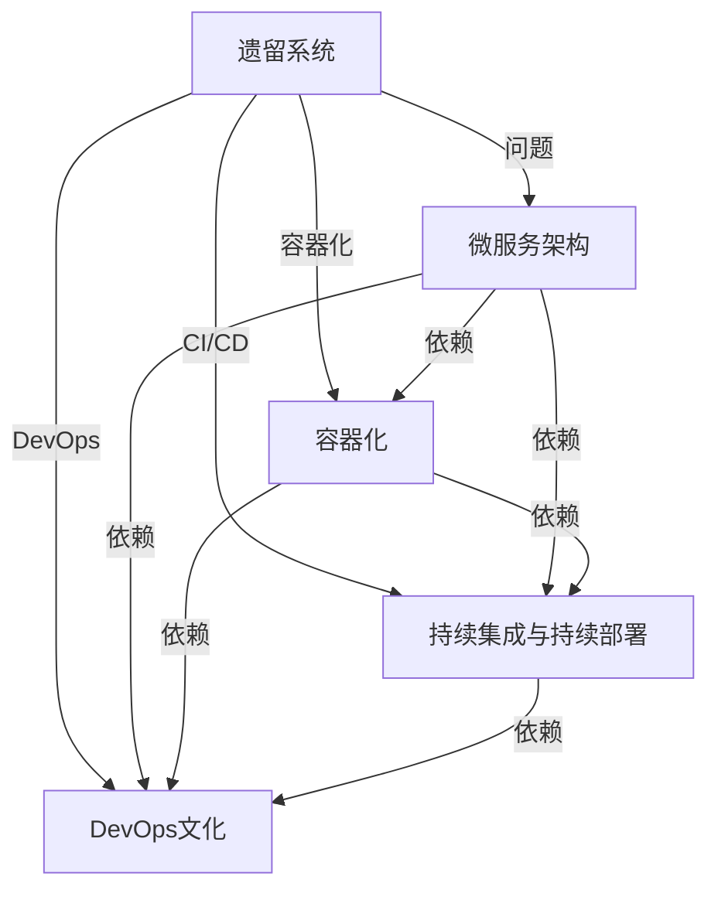
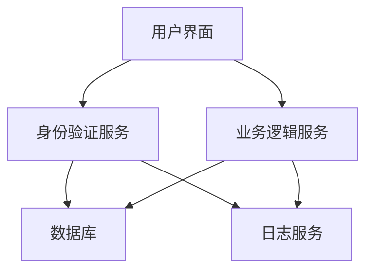
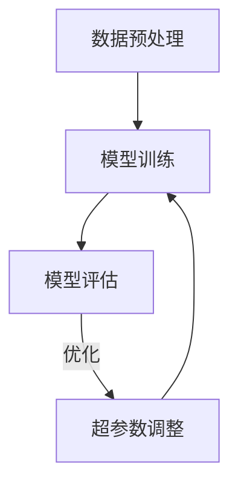

                 


### 遗留系统改造：平滑过渡到现代架构

#### 关键词：
- 遗留系统
- 现代架构
- 微服务
- 容器化
- DevOps
- 持续集成与持续部署（CI/CD）
- 算法优化

#### 摘要：
本文旨在探讨遗留系统的改造过程，以平滑过渡到现代架构。通过对遗留系统的定义、现状、挑战及其改造目标的深入分析，我们提出了涵盖核心概念、方法论、算法应用和实际案例的完整解决方案。文章结构清晰，内容详实，旨在为IT从业者提供实用的指导。

## 第一部分：遗留系统改造概述

### 第1章：遗留系统的现状与挑战

#### 1.1 遗留系统的定义

遗留系统（Legacy System）通常指的是那些因长期使用而未进行重大更新的计算机系统。这些系统可能是由过时的编程语言或技术构建的，难以满足当前的业务需求和技术发展。遗留系统在企业中普遍存在，尤其是一些历史悠久的组织。

#### 1.2 遗留系统的问题与挑战

遗留系统带来的问题包括但不限于：

- **可维护性差**：随着时间的推移，系统代码变得越来越复杂，维护成本增加。
- **扩展性不足**：遗留系统往往难以适应新的业务需求，扩展性差。
- **安全性漏洞**：老旧的系统可能存在安全漏洞，容易受到攻击。
- **技术债务**：长期未更新的系统累积了大量的技术债务，影响系统的稳定性和可靠性。

#### 1.3 遗留系统改造的重要性

遗留系统的改造至关重要，原因如下：

- **提高系统性能**：通过引入现代技术，可以提升系统的运行效率和响应速度。
- **降低维护成本**：现代架构的可维护性更好，长期来看可以降低维护成本。
- **适应未来发展**：改造后的系统更易于扩展和更新，能够更好地适应未来的技术发展。

## 第二部分：遗留系统改造的核心概念与联系

### 第2章：遗留系统改造的核心概念

#### 2.1 微服务架构

微服务架构（Microservices Architecture）是一种基于模块化设计的架构风格，它将应用程序分解为多个独立的服务模块，每个服务模块负责特定的业务功能。微服务架构具有高扩展性、高可用性和高可维护性。

#### 2.2 容器化

容器化（Containerization）是一种轻量级的应用打包和部署技术。通过容器，应用程序及其依赖项可以在不同的环境中一致地运行，从而实现环境的标准化和隔离。

#### 2.3 持续集成与持续部署（CI/CD）

持续集成与持续部署（Continuous Integration/Continuous Deployment，简称CI/CD）是一种软件开发和交付的最佳实践，它通过自动化的方式将代码集成和部署到生产环境，从而提高开发效率和软件质量。

#### 2.4 DevOps文化

DevOps文化强调开发（Development）和运维（Operations）之间的协作，通过自动化和持续改进，实现快速、可靠和高质量的软件交付。

#### 2.5 核心概念联系与对比

以下是一个核心概念联系与对比的Mermaid流程图：



## 第三部分：遗留系统改造的方法论

### 第3章：遗留系统改造的方法论

#### 3.1 分析与评估

在改造之前，需要全面分析遗留系统的现状，评估其性能、可维护性和安全性。这一步包括：

- **性能评估**：使用基准测试和性能分析工具评估系统性能。
- **代码质量评估**：使用静态代码分析工具评估代码质量。
- **安全性评估**：进行安全扫描和漏洞分析。

#### 3.2 设计现代架构

设计现代架构包括以下几个步骤：

- **领域模型设计**：使用Mermaid类图设计领域模型。
- **系统架构设计**：使用Mermaid架构图设计系统架构。
- **接口设计**：定义系统接口和API。

以下是一个系统架构设计的Mermaid架构图示例：



#### 3.3 实施改造

实施改造包括以下步骤：

- **容器化应用**：使用Docker将遗留系统容器化。
- **部署容器**：使用Kubernetes等容器编排工具部署容器。
- **持续集成与持续部署**：配置CI/CD流水线，实现自动化构建和部署。

#### 3.4 监控与优化

在改造后，需要持续监控系统的性能和稳定性，并进行优化：

- **性能监控**：使用Prometheus等工具监控系统性能。
- **日志分析**：使用ELK（Elasticsearch, Logstash, Kibana）等工具分析日志。
- **性能优化**：根据监控数据进行分析，进行系统性能优化。

## 第四部分：算法原理在遗留系统中的应用

### 第4章：算法原理在遗留系统中的应用

#### 4.1 机器学习模型的选择

在遗留系统中应用机器学习模型，需要考虑以下几个因素：

- **数据量**：选择适合数据量的模型，如决策树、随机森林或深度学习模型。
- **业务目标**：根据业务目标选择合适的模型，如分类、回归或聚类模型。
- **计算资源**：考虑计算资源的限制，选择计算成本较低的模型。

#### 4.2 模型集成与优化

在遗留系统中集成机器学习模型，需要以下步骤：

- **数据预处理**：对遗留系统中的数据进行预处理，如数据清洗、归一化和特征提取。
- **模型训练**：使用预处理后的数据训练机器学习模型。
- **模型优化**：通过交叉验证和超参数调整优化模型性能。

以下是一个算法流程图的示例：



#### 4.3 算法原理的数学模型和公式

在机器学习模型中，常见的数学模型包括损失函数、优化算法和评价指标。以下是一些数学公式的示例：

```latex
\text{损失函数：} L(\theta) = -\frac{1}{m}\sum_{i=1}^{m}y^{(i)}\log(h_\theta(x^{(i)}))
\text{梯度下降：} \theta_j := \theta_j - \alpha \frac{\partial}{\partial \theta_j} J(\theta)
\text{准确率：} accuracy = \frac{1}{N}\sum_{i=1}^{N} I(y_i = \hat{y_i})
```

#### 4.4 算法原理的举例说明

以决策树为例，决策树是一种常见的机器学习模型，用于分类和回归任务。以下是一个简单的决策树算法原理的举例说明：

1. **数据集准备**：给定一个包含特征和标签的数据集。
2. **选择最优特征**：计算每个特征的信息增益，选择信息增益最大的特征作为根节点。
3. **划分数据集**：根据最优特征将数据集划分为若干个子集。
4. **递归构建树**：对每个子集重复上述步骤，构建子树。
5. **终止条件**：当满足终止条件（如最大树深度、节点数量等）时，停止划分。

### 第五部分：项目实战

#### 第5章：项目实战

#### 5.1 环境安装

在本节中，我们将介绍如何搭建一个遗留系统改造的环境。这包括安装操作系统、数据库、应用服务器等。

#### 5.2 系统核心实现

在本节中，我们将展示如何实现遗留系统的核心功能，包括领域模型、接口设计和数据交互。

#### 5.3 代码解读与分析

在本节中，我们将深入分析实现的代码，讲解关键代码的功能和原理。

#### 5.4 实际案例分析与详细讲解

在本节中，我们将通过一个实际的遗留系统改造案例，展示整个改造过程，并进行分析和讲解。

#### 5.5 项目小结

在本节中，我们将总结项目的关键点和经验教训，为未来的项目提供参考。

### 第六部分：最佳实践、小结、注意事项、拓展阅读

#### 6.1 最佳实践 tips

在本节中，我们将分享一些遗留系统改造的最佳实践，帮助读者更好地实施改造。

#### 6.2 小结

在本节中，我们将对全文进行小结，回顾核心内容和关键点。

#### 6.3 注意事项

在本节中，我们将指出在遗留系统改造过程中需要注意的事项，避免常见的错误。

#### 6.4 拓展阅读

在本节中，我们将推荐一些相关的阅读资源，供读者进一步学习和研究。

### 作者

作者：AI天才研究院/AI Genius Institute & 禅与计算机程序设计艺术 /Zen And The Art of Computer Programming

---

通过上述结构，我们可以确保文章内容完整、逻辑清晰，并且能够引导读者逐步深入理解遗留系统改造的各个方面。每个部分都将包含详细的解释、示例和最佳实践，帮助读者在实际工作中应用所学知识。

