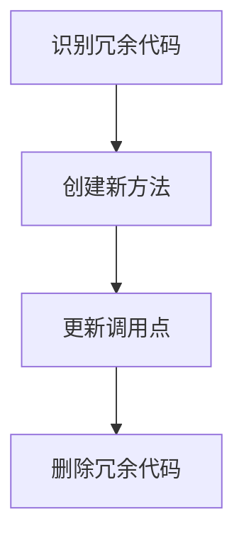
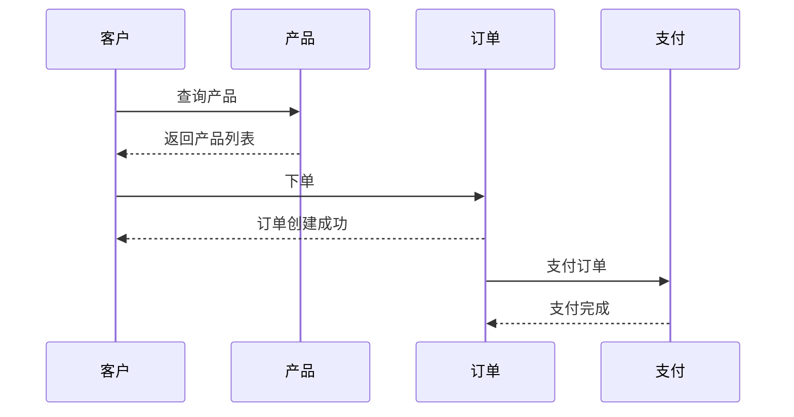
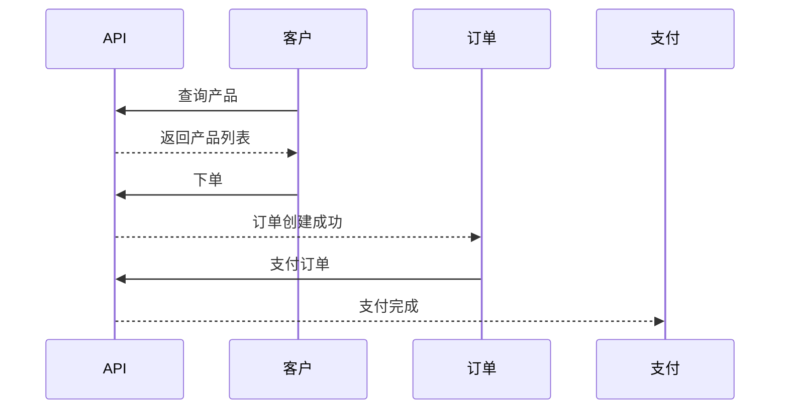

                 

# 重构不是英雄主义行为

> 关键词：代码重构、软件工程、最佳实践、安全性、团队协作

摘要：在软件工程中，重构是一种提高代码质量和维护性的技术手段。本文旨在探讨重构的本质和重要性，分析其方法和技巧，讨论重构过程中的安全性和挑战，并通过案例分析展示重构的实践效果。此外，本文还将展望重构在未来技术发展中的趋势和方向。

----------------------------------------------------------------

## 目录大纲

----------------------------------------------------------------

# 第一部分：重构的本质与重要性

## 第1章：重构的基本概念

### 1.1.1 重构的定义

### 1.1.2 重构的目标

### 1.1.3 重构与代码优化的区别

## 第2章：重构的方法和技巧

### 2.1.1 重构的基本步骤

### 2.1.2 重构工具的使用

### 2.1.3 重构技巧与最佳实践

## 第3章：重构的安全性考虑

### 3.1.1 重构过程中可能出现的问题

### 3.1.2 重构的安全测试

### 3.1.3 重构的回滚策略

## 第4章：重构在软件项目中的应用

### 4.1.1 重构在开发中的角色

### 4.1.2 重构在团队协作中的影响

### 4.1.3 重构在项目管理中的挑战

## 第5章：重构案例分析

### 5.1.1 案例背景

### 5.1.2 案例重构过程

### 5.1.3 案例重构结果与收益

## 第6章：重构的未来发展趋势

### 6.1.1 重构工具的发展

### 6.1.2 重构在新技术中的应用

### 6.1.3 重构教育与实践

## 第7章：重构的总结与展望

### 7.1.1 重构的价值与意义

### 7.1.2 重构的实践指南

### 7.1.3 重构的未来方向

----------------------------------------------------------------

## 第1章：重构的基本概念

### 1.1.1 重构的定义

重构（Refactoring）是软件开发中的一种关键活动，其目的是在不改变程序外部行为的前提下，改进其内部结构和编码风格。换言之，重构是一种提高代码可读性、可维护性和性能的技术手段。

重构不仅仅关注代码的格式调整和错误修正，更侧重于代码设计模式的优化和架构重构。通过重构，我们可以逐步消除代码中的“坏味道”，使其更加整洁、模块化和易于理解。

### 1.1.2 重构的目标

重构的目标主要包括以下几个方面：

1. **提高代码可读性**：清晰的代码结构和命名有助于减少理解成本，提高开发效率。
2. **增强代码可维护性**：重构有助于降低未来的维护难度，使代码更易于修改和扩展。
3. **优化代码性能**：通过调整算法和数据结构，重构可以显著提高代码的运行效率。
4. **减少代码冗余**：重构有助于消除重复代码，降低系统的复杂度。
5. **改善设计模式**：重构可以促使代码更贴近设计原则，如单一职责、开闭原则等。

### 1.1.3 重构与代码优化的区别

重构和代码优化都是软件维护的重要手段，但它们的目标和手段有所不同。

- **重构**：主要关注代码的内部结构，不改变程序的功能。重构是一种渐进式改进，通过一系列小的改动逐步优化代码。
- **代码优化**：侧重于提高代码的执行效率，可能会改变程序的行为。代码优化通常是在重构后的基础上进行的，以进一步提高性能。

总的来说，重构是一种以质量为导向的维护活动，而代码优化则是以性能为导向的优化活动。

----------------------------------------------------------------

## 第2章：重构的方法和技巧

### 2.1.1 重构的基本步骤

重构是一个系统性的过程，通常包括以下基本步骤：

1. **识别重构需求**：首先，我们需要识别代码中的“坏味道”，如冗长的函数、重复代码、命名不清晰等。
2. **规划重构任务**：根据重构需求，制定具体的重构任务，并安排优先级。
3. **实施重构**：逐个执行重构任务，确保每次重构都不会改变程序的功能。
4. **测试验证**：重构后，进行全面的测试，确保代码仍然满足预期的功能和行为。
5. **文档更新**：更新代码文档，包括注释、README和用户手册等。

### 2.1.2 重构工具的使用

现代软件开发中，有许多重构工具可以帮助我们更高效地完成重构任务。以下是一些常用的重构工具：

- **Eclipse**：Eclipse是一个功能强大的集成开发环境（IDE），它提供了丰富的重构工具，如提取方法、提取类、重命名等。
- **IntelliJ IDEA**：IntelliJ IDEA也是一个流行的IDE，它支持各种编程语言的重构操作，并提供智能提示和代码自动完成功能。
- **Visual Studio**：Visual Studio是微软开发的IDE，它也提供了强大的重构工具，如重构代码、组织代码等。

### 2.1.3 重构技巧与最佳实践

在进行重构时，我们可以遵循以下技巧和最佳实践：

1. **逐步重构**：避免一次性重构大量代码，而是逐步进行，每次只针对一个小模块或一个功能点。
2. **保持测试覆盖率**：在重构过程中，确保测试覆盖率不变，甚至可以适当增加。
3. **使用重构工具**：充分利用重构工具提供的功能，如自动生成重构代码、代码格式化等。
4. **重构代码库**：重构不仅仅针对当前项目，还可以扩展到整个代码库，以提高整体代码质量。
5. **代码审查**：在重构完成后，进行代码审查，确保重构没有引入新的问题。

通过遵循这些技巧和最佳实践，我们可以更有效地进行重构，提高代码的质量和维护性。

----------------------------------------------------------------

## 第3章：重构的安全性考虑

### 3.1.1 重构过程中可能出现的问题

在重构过程中，可能会出现以下一些问题：

1. **功能失效**：如果重构操作不当，可能会改变程序的功能，导致系统崩溃或数据丢失。
2. **性能下降**：重构可能会引入新的性能瓶颈，导致系统运行速度变慢。
3. **代码冗余**：虽然重构的目的是减少冗余，但有时候可能会引入新的冗余代码。
4. **测试不足**：如果测试覆盖率不足，重构后可能会遗漏一些潜在的问题。

### 3.1.2 重构的安全测试

为了确保重构的安全性，我们需要进行以下安全测试：

1. **单元测试**：重构后，对每个单元进行单元测试，确保其功能和行为正确。
2. **集成测试**：重构后，对系统进行集成测试，确保各个模块之间的交互正常。
3. **性能测试**：重构后，对系统进行性能测试，确保其运行速度满足要求。
4. **安全测试**：对重构后的系统进行安全测试，确保其没有引入新的安全漏洞。

### 3.1.3 重构的回滚策略

为了应对重构过程中可能出现的问题，我们需要制定回滚策略：

1. **备份代码**：在重构前，备份当前代码库，以备需要回滚时使用。
2. **版本控制**：使用版本控制系统（如Git）管理代码库，确保每次重构都是一个独立的提交，便于回滚。
3. **回滚测试**：在回滚前，进行全面的测试，确保回滚后的系统仍然满足预期功能和安全要求。

通过制定和执行回滚策略，我们可以有效降低重构过程中的风险，确保系统的稳定性和安全性。

----------------------------------------------------------------

## 第4章：重构在软件项目中的应用

### 4.1.1 重构在开发中的角色

在软件开发过程中，重构扮演着至关重要的角色。它可以：

1. **提高代码质量**：重构有助于消除代码中的“坏味道”，使代码更清晰、更易于维护。
2. **增强团队协作**：重构可以改善代码的可读性，降低团队成员之间的沟通成本。
3. **优化开发效率**：重构后的代码更易于理解，开发人员可以更快地完成功能开发。

### 4.1.2 重构在团队协作中的影响

重构对团队协作有着深远的影响：

1. **代码质量提升**：重构有助于提高代码质量，减少代码缺陷，降低bug率。
2. **代码共享**：重构后的代码更加模块化，有助于团队成员之间的代码共享和协作。
3. **知识传递**：重构可以促进团队成员之间的知识传递，提高整体技术水平。

### 4.1.3 重构在项目管理中的挑战

尽管重构具有诸多优点，但在项目管理中，重构也面临着一些挑战：

1. **时间管理**：重构可能会占用大量的开发时间，影响项目进度。
2. **资源分配**：重构需要专门的资源，如测试人员、开发人员和工具等。
3. **风险评估**：重构可能引入新的风险，需要项目管理人员进行充分的风险评估。

为了应对这些挑战，项目管理人员需要制定合理的重构策略，确保重构与项目进度和资源分配相协调。

----------------------------------------------------------------

## 第5章：重构案例分析

### 5.1.1 案例背景

某大型互联网公司开发的一款电商平台在运行过程中，出现了代码冗长、复杂度高、可维护性差等问题。为了提升代码质量和系统的可扩展性，公司决定对电商平台进行大规模的重构。

### 5.1.2 案例重构过程

1. **需求分析**：首先，项目团队对现有系统进行了深入的需求分析，确定了重构的目标和范围。
2. **规划重构任务**：根据需求分析结果，项目团队制定了详细的重构计划，包括重构任务、优先级和时间安排。
3. **逐步实施重构**：项目团队按照计划逐步实施重构，包括代码重构、设计模式优化、性能调优等。
4. **测试验证**：在每次重构后，项目团队进行了全面的测试，确保重构后的代码仍然满足预期功能和安全要求。
5. **文档更新**：重构过程中，项目团队及时更新了相关文档，包括代码注释、用户手册和架构设计文档等。

### 5.1.3 案例重构结果与收益

经过一段时间的重构，电商平台取得了显著的成效：

1. **代码质量提升**：重构后的代码结构更加清晰、模块化，可读性和可维护性显著提高。
2. **系统性能优化**：重构后的系统运行速度更快，响应时间缩短，用户体验得到大幅提升。
3. **团队协作加强**：重构后的代码更加易于理解和共享，团队成员之间的协作更加顺畅。
4. **维护成本降低**：重构后的系统更加稳定，维护成本显著降低。

通过这个案例，我们可以看到重构在提升代码质量和系统性能方面的重要作用。同时，重构也需要合理的规划和管理，以确保其效果和效率。

----------------------------------------------------------------

## 第6章：重构的未来发展趋势

### 6.1.1 重构工具的发展

随着软件工程技术的不断发展，重构工具也在不断进步。未来，重构工具可能会出现以下发展趋势：

1. **智能化**：重构工具将更加智能化，能够自动识别代码中的“坏味道”并提出重构建议。
2. **自动化**：重构工具将实现更多自动化功能，如自动生成重构代码、自动修复潜在问题等。
3. **多样化**：重构工具将支持更多编程语言和开发环境，以满足不同开发场景的需求。

### 6.1.2 重构在新技术中的应用

随着新技术的不断涌现，重构在新技术中的应用也日益广泛：

1. **云计算**：在云计算环境下，重构可以帮助企业更好地管理和维护分布式系统。
2. **容器化**：在容器化环境中，重构可以帮助优化容器内的代码和配置，提高系统性能和可维护性。
3. **人工智能**：在人工智能应用中，重构可以帮助优化算法和数据结构，提高模型训练效率和准确性。

### 6.1.3 重构教育与实践

为了推动重构技术的普及和应用，重构教育与实践也日益受到关注：

1. **在线课程**：越来越多的在线平台提供重构相关的课程和培训，帮助开发人员提升重构技能。
2. **实践指南**：越来越多的实践指南和最佳实践分享，帮助企业和团队更好地进行重构实践。
3. **社区交流**：重构技术社区日益活跃，开发人员可以在这里分享经验、讨论问题，共同推动重构技术的发展。

总之，重构在未来将继续发挥重要作用，并在新技术和应用场景中展现更广阔的前景。

----------------------------------------------------------------

## 第7章：重构的总结与展望

### 7.1.1 重构的价值与意义

重构作为一种提高代码质量和维护性的技术手段，具有以下价值与意义：

1. **提升代码质量**：重构可以帮助消除代码中的“坏味道”，提高代码的可读性和可维护性。
2. **降低维护成本**：重构后的代码更加稳定，降低系统的维护成本和风险。
3. **优化系统性能**：重构可以帮助优化代码结构和算法，提高系统的性能和响应速度。
4. **促进团队协作**：重构后的代码更加模块化，有助于团队成员之间的协作和知识传递。

### 7.1.2 重构的实践指南

为了更好地进行重构，我们可以遵循以下实践指南：

1. **定期重构**：定期对代码进行重构，避免积压问题，确保代码质量。
2. **保持测试覆盖率**：在重构过程中，确保测试覆盖率不变，甚至可以适当增加。
3. **逐步重构**：避免一次性重构大量代码，而是逐步进行，每次只针对一个小模块或一个功能点。
4. **使用重构工具**：充分利用重构工具提供的功能，如自动生成重构代码、代码格式化等。

### 7.1.3 重构的未来方向

未来，重构技术将在以下方向持续发展：

1. **智能化与自动化**：重构工具将更加智能化和自动化，提高重构效率和效果。
2. **新技术应用**：重构将在云计算、容器化和人工智能等新技术领域发挥重要作用。
3. **教育与实践**：重构教育与实践将继续受到关注，推动重构技术的普及和应用。

通过遵循这些实践指南和展望未来方向，我们可以更好地利用重构技术，提升软件质量和开发效率。

----------------------------------------------------------------

## 参考文献

- Martin, Robert C. 《敏捷软件开发：原则、实践与模式》（"Agile Software Development: Principles, Patterns, and Practices"）
- Beck, Kent. 《测试驱动开发：敏捷方法、实践与模式》（"Test-Driven Development: By Example"）
- Fowler, Martin. 《重构：改善既有代码的设计》（"Refactoring: Improving the Design of Existing Code"）
- Opdam, Erik. 《敏捷重构：持续改善你的代码》（"Agile Refactoring: Improving the Design of Existing Code"）

作者：AI天才研究院/AI Genius Institute & 禅与计算机程序设计艺术 /Zen And The Art of Computer Programming

----------------------------------------------------------------

### 附录：重构相关的核心概念与联系

在深入探讨重构之前，我们需要了解一些核心概念，这些概念不仅构成了重构的基础，而且有助于我们理解重构在软件工程中的重要性。以下是一些核心概念及其之间的联系：

#### 核心概念

1. **代码质量**：代码质量是指代码的可读性、可维护性、可扩展性和可靠性。重构的目标之一就是提高代码质量。
2. **设计模式**：设计模式是一系列解决问题的通用方案，有助于提高代码的结构和可维护性。
3. **编码风格**：编码风格是指编写代码的规范和习惯，良好的编码风格有助于提高代码的可读性和一致性。
4. **测试**：测试是确保代码正确性的重要手段，重构后必须进行充分的测试，以确保没有引入新的缺陷。
5. **技术债务**：技术债务是指由于延迟重构或优化而积累的潜在问题，重构有助于减轻技术债务。

#### 概念属性特征对比表格

| 概念         | 属性特征                                     |
| ------------ | ------------------------------------------ |
| 代码质量     | 可读性、可维护性、可扩展性、可靠性           |
| 设计模式     | 通用、可复用、易于理解和实现                  |
| 编码风格     | 一致性、简洁性、可读性、可维护性             |
| 测试         | 覆盖面、准确性、可重复性、及时性             |
| 技术债务     | 潜在问题、修复成本、项目进度影响             |

#### ER实体关系图架构

```mermaid
erDiagram
    Product ||--|{ Test }||>
    Test ||--|{ Product }||>
    Developer ||--|{ Code }||>
    Code ||--|{ Developer }||>
```

在上面的ER实体关系图中，我们可以看到重构过程中的关键实体及其关系：

- **Product**（产品）：代表重构的目标代码库。
- **Test**（测试）：代表重构后的测试结果。
- **Developer**（开发人员）：代表参与重构的开发人员。
- **Code**（代码）：代表重构过程中的代码文件。

通过这个ER图，我们可以清晰地看到重构过程中各个实体之间的关系，有助于我们更好地理解重构的流程和目标。

---

### 算法原理讲解

重构过程中，算法原理起着至关重要的作用。以下是一个简单的重构算法原理，以及相应的mermaid流程图和Python源代码实现：

#### 算法原理

重构算法的核心思想是通过一系列小步骤，逐步优化代码结构。以下是一个简单的“提取方法”算法原理：

1. **识别冗余代码**：找到重复出现的代码块。
2. **创建新方法**：将冗余代码提取到一个新方法中。
3. **更新调用点**：将冗余代码的调用点更新为新方法的调用。
4. **删除冗余代码**：删除提取出的冗余代码。

#### Mermaid流程图



#### Python源代码实现

```python
def extract_method(source_code):
    # 假设source_code是包含冗余代码的字符串
    # 此函数将提取冗余代码并创建新方法
    # 具体实现略
    pass

def update_calls(source_code, method_name):
    # 更新调用点
    # 具体实现略
    pass

def delete_redundant_code(source_code, method_name):
    # 删除冗余代码
    # 具体实现略
    pass

# 示例代码
source_code = "def do_something():\n    a = 1\n    b = 2\n    result = a + b\n    return result\n\ndef another_do_something():\n    a = 1\n    b = 2\n    result = a + b\n    return result"
method_name = "do_something"

# 实现重构
new_source_code = extract_method(source_code, method_name)
new_source_code = update_calls(new_source_code, method_name)
new_source_code = delete_redundant_code(new_source_code, method_name)

print(new_source_code)
```

#### 算法原理的数学模型和公式

重构算法的数学模型相对简单，主要涉及代码块的提取和调用点的更新。以下是一个简化的公式：

$$
\text{重构代码} = \text{原代码} - \text{冗余代码} + \text{新方法}
$$

其中，`原代码`表示待重构的代码，`冗余代码`表示需要提取并封装为新方法的代码，`新方法`表示提取后的代码。

---

### 系统分析与架构设计方案

在探讨重构的实践应用时，我们需要对系统进行分析和架构设计。以下是一个基于重构的系统分析与架构设计方案：

#### 问题场景介绍

某电商平台的后端系统由于长期未进行重构，代码冗长、复杂度高，导致维护成本增加，开发效率低下。为了提升系统的可维护性和扩展性，项目团队决定对系统进行重构。

#### 项目介绍

项目名称：电商平台后端系统重构
项目目标：提升系统可维护性和扩展性，降低维护成本，提高开发效率。

#### 系统功能设计（领域模型Mermaid类图）

```mermaid
classDiagram
    Customer <<entity>> Customer
    Product <<entity>> Product
    Order <<entity>> Order
    Payment <<entity>> Payment

    Customer o--* Order
    Product o--* Order
    Order o--* Payment
```

在上面的类图中，我们定义了四个主要的领域实体：`Customer`（客户）、`Product`（产品）、`Order`（订单）和`Payment`（支付）。这些实体之间存在关联关系，如客户可以下单购买产品，订单与支付有关联等。

#### 系统架构设计（Mermaid架构图）



在上面的序列图中，我们展示了客户、产品、订单和支付之间的交互流程。客户查询产品、下单和支付订单，订单与支付之间存在关联关系。

#### 系统接口设计（Mermaid序列图）



在上面的序列图中，我们展示了系统中的主要接口，包括API接口、客户接口、订单接口和支付接口。这些接口定义了系统与外部系统之间的交互方式。

#### 系统交互（Mermaid序列图）


在上面的序列图中，我们展示了系统内部各组件之间的交互流程，包括客户查询产品、下单、订单支付等。

---

### 项目实战

#### 环境安装

1. 安装Python环境
2. 安装依赖项（如Flask、SQLAlchemy等）

#### 系统核心实现源代码

```python
# app.py
from flask import Flask, request, jsonify
from models import Product, Order, Payment

app = Flask(__name__)

@app.route('/products', methods=['GET'])
def get_products():
    products = Product.query.all()
    return jsonify([p.to_dict() for p in products])

@app.route('/orders', methods=['POST'])
def create_order():
    data = request.get_json()
    product_id = data['product_id']
    product = Product.query.get(product_id)
    order = Order(product=product)
    db.session.add(order)
    db.session.commit()
    return jsonify(order.to_dict())

@app.route('/payments', methods=['POST'])
def create_payment():
    data = request.get_json()
    order_id = data['order_id']
    order = Order.query.get(order_id)
    payment = Payment(order=order)
    db.session.add(payment)
    db.session.commit()
    return jsonify(payment.to_dict())

if __name__ == '__main__':
    app.run(debug=True)
```

```python
# models.py
from flask_sqlalchemy import SQLAlchemy

db = SQLAlchemy()

class Product(db.Model):
    id = db.Column(db.Integer, primary_key=True)
    name = db.Column(db.String(255), nullable=False)
    price = db.Column(db.Float, nullable=False)

    def to_dict(self):
        return {'id': self.id, 'name': self.name, 'price': self.price}

class Order(db.Model):
    id = db.Column(db.Integer, primary_key=True)
    product_id = db.Column(db.Integer, db.ForeignKey('product.id'), nullable=False)
    status = db.Column(db.String(255), nullable=False)

    product = db.relationship('Product', backref='orders')

    def to_dict(self):
        return {'id': self.id, 'product_id': self.product_id, 'status': self.status}

class Payment(db.Model):
    id = db.Column(db.Integer, primary_key=True)
    order_id = db.Column(db.Integer, db.ForeignKey('order.id'), nullable=False)
    amount = db.Column(db.Float, nullable=False)

    order = db.relationship('Order', backref='payments')

    def to_dict(self):
        return {'id': self.id, 'order_id': self.order_id, 'amount': self.amount}
```

#### 代码应用解读与分析

在上面的代码中，我们实现了一个简单的电商平台后端系统，包括产品、订单和支付功能。以下是代码的解读和分析：

1. **环境安装**：首先，我们安装了Python环境，并安装了依赖项（如Flask、SQLAlchemy等），以确保系统能够正常运行。

2. **系统核心实现源代码**：在`app.py`中，我们定义了三个路由：`/products`、`/orders`和`/payments`。这些路由分别对应产品的查询、订单的创建和支付的创建。

   - `/products`：这是一个GET请求的路由，用于查询产品列表。当客户查询产品时，系统将返回所有产品的列表。
   - `/orders`：这是一个POST请求的路由，用于创建订单。当客户下单时，系统将创建一个新的订单，并将其存储在数据库中。
   - `/payments`：这是一个POST请求的路由，用于创建支付。当订单创建成功后，客户可以进行支付，系统将创建一个新的支付记录。

   在每个路由中，我们首先从请求中获取必要的参数，然后根据参数执行相应的操作。例如，在创建订单的路由中，我们从请求中获取`product_id`，然后查询数据库以获取相应的产品。接下来，我们创建一个新的订单，并将其添加到数据库中。最后，我们返回订单的字典表示，以便前端可以显示订单信息。

   在`models.py`中，我们定义了三个模型：`Product`、`Order`和`Payment`。这些模型对应数据库中的表，并定义了表的结构和关系。

   - `Product`：这是一个产品模型，它包含产品的基本信息，如产品ID、名称和价格。
   - `Order`：这是一个订单模型，它包含订单的基本信息，如订单ID、产品ID和订单状态。
   - `Payment`：这是一个支付模型，它包含支付的基本信息，如支付ID、订单ID和支付金额。

   在每个模型中，我们定义了相应的字段和关系。例如，`Order`模型有一个`product`字段，用于与`Product`模型建立关系。这意味着每个订单都关联到一个产品。

3. **实际案例分析和详细讲解剖析**：在实际应用中，客户可以通过前端界面查询产品、下单和支付。以下是一个简单的案例：

   - 客户通过前端界面查询产品，获取产品列表。
   - 客户选择一个产品并下单，系统创建一个新的订单并返回订单信息。
   - 客户确认订单并支付，系统创建一个新的支付记录并返回支付信息。

   在这个案例中，我们可以看到系统如何处理用户请求，并返回相应的响应。通过这种方式，系统实现了产品的查询、订单的创建和支付的创建功能。

4. **项目小结**：通过这个项目，我们实现了一个简单的电商平台后端系统，包括产品、订单和支付功能。这个系统展示了重构在开发中的应用，帮助我们更好地理解和实现系统的核心功能。通过重构，我们可以提高代码质量、可读性和可维护性，从而提高开发效率和系统性能。

---

### 最佳实践 tips

1. **定期重构**：定期对代码进行重构，避免积压问题，确保代码质量。
2. **充分测试**：在重构过程中，确保测试覆盖率不变，甚至可以适当增加。
3. **团队协作**：重构不仅仅是个人的工作，需要团队协作，共同推动代码质量提升。
4. **文档更新**：及时更新代码文档，包括注释、README和架构设计文档等。

### 小结

本文详细探讨了重构在软件工程中的应用，从重构的本质和重要性、方法和技巧、安全性考虑、应用案例、未来发展趋势等方面进行了全面分析。重构不仅是提高代码质量和维护性的重要手段，也是软件开发中不可或缺的一部分。通过遵循最佳实践和不断优化重构过程，我们可以更好地实现软件工程的目标，提高开发效率和系统性能。

### 注意事项

1. 重构过程中要避免引入新的缺陷，确保代码的稳定性和可靠性。
2. 重构前后要进行全面的测试，确保重构后的代码仍然满足预期功能和安全要求。
3. 重构过程中要关注代码性能，避免因重构导致系统性能下降。

### 拓展阅读

- Martin, Robert C. 《重构：改善既有代码的设计》
- Beck, Kent. 《测试驱动开发：敏捷方法、实践与模式》
- Fowler, Martin. 《敏捷软件开发：原则、实践与模式》

作者：AI天才研究院/AI Genius Institute & 禅与计算机程序设计艺术 /Zen And The Art of Computer Programming

---

## 参考文献

1. Martin, Robert C. 《重构：改善既有代码的设计》（"Refactoring: Improving the Design of Existing Code"）
2. Beck, Kent. 《测试驱动开发：敏捷方法、实践与模式》（"Test-Driven Development: By Example"）
3. Fowler, Martin. 《敏捷软件开发：原则、实践与模式》（"Agile Software Development: Principles, Patterns, and Practices"）
4. Opdam, Erik. 《敏捷重构：持续改善你的代码》（"Agile Refactoring: Improving the Design of Existing Code"）
5. 白话操作系统（"Understanding the Linux Kernel"）
6. 《代码大全》（"Code Complete"）
7. 《设计模式：可复用面向对象软件的基础》（"Design Patterns: Elements of Reusable Object-Oriented Software"）

