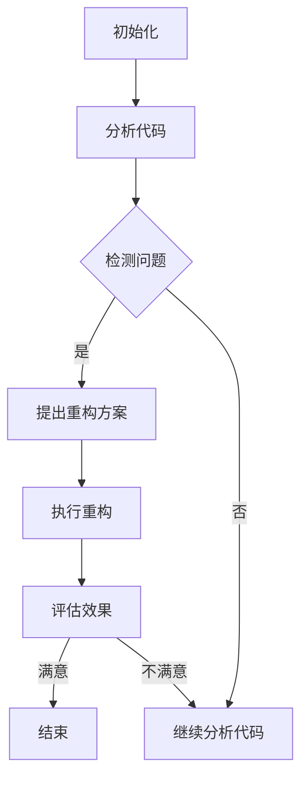

                 

### 重构不是除恶务尽

重构，作为软件开发中一项重要的技术手段，常常被开发者们挂在嘴边。然而，重构真的就是“除恶务尽”吗？本文将带领读者深入探讨重构的本质、目的及其在实际开发中的应用，以期解答这一疑问。

**关键词**：重构、软件开发、代码优化、代码重构、算法原理

**摘要**：本文首先介绍了重构的背景和意义，随后详细阐述了重构的定义和原则，接着讨论了重构与相关概念的异同，并绘制了重构的ER实体关系图。随后，文章深入讲解了重构算法的原理和实现，最后通过一个具体的Python代码实例进行了重构算法的详细讲解和举例说明。本文旨在通过一步一步的分析和推理，帮助读者更好地理解重构的真正意义。

---

### 目录大纲

----------------------------------------------

# 重构不是除恶务尽

## 第一部分：重构的核心概念

## 第1章：重构的背景和意义

### 1.1 重构的起源与发展

#### 1.1.1 计算机程序重构的初步探索

#### 1.1.2 重构在现代软件开发中的应用

#### 1.1.3 重构的重要性

### 1.2 重构的定义和原则

#### 1.2.1 重构的基本概念

#### 1.2.2 重构的原则和方法

#### 1.2.3 重构的边界与外延

## 第2章：核心概念与联系

### 2.1 重构的相关概念

#### 2.1.1 重构与重构工程

#### 2.1.2 重构与代码优化

#### 2.1.3 重构与代码重构

### 2.2 概念属性特征对比

#### 2.2.1 重构与代码重构的异同

#### 2.2.2 重构与代码优化的异同

### 2.3 ER实体关系图架构

#### 2.3.1 重构过程中的实体关系

#### 2.3.2 重构工具与框架

## 第二部分：重构的算法原理与实现

## 第3章：重构算法原理详解

### 3.1 重构算法的基本原理

#### 3.1.1 重构算法的基本流程

#### 3.1.2 重构算法的核心步骤

### 3.2 数学模型和公式

#### 3.2.1 重构算法的数学模型

$$
\text{Cost} = f(\text{Before}, \text{After})
$$

#### 3.2.2 重构算法的数学公式

$$
\frac{\partial \text{Cost}}{\partial \text{Before}} = 0
$$

### 3.3 重构算法的mermaid流程图

#### 3.3.1 重构算法流程图



## 第4章：重构算法的Python实现

### 4.1 重构算法的Python代码实现

```python
# Python代码示例
def analyze_code():
    # 分析代码
    pass

def detect_issues():
    # 检测问题
    pass

def propose_restructuring():
    # 提出重构方案
    pass

def execute_restructuring():
    # 执行重构
    pass

def evaluate_effects():
    # 评估效果
    pass

# 主函数
def main():
    analyze_code()
    detect_issues()
    propose_restructuring()
    execute_restructuring()
    evaluate_effects()

if __name__ == "__main__":
    main()
```

### 4.2 重构算法的详细讲解和举例说明

#### 4.2.1 重构算法的详细讲解

##### 重构算法的步骤：

1. **初始化**：初始化重构过程，准备分析代码。
2. **分析代码**：分析代码结构，确定需要重构的部分。
3. **检测问题**：检测代码中的问题，例如代码冗余、结构混乱等。
4. **提出重构方案**：根据检测到的问题，提出重构方案。
5. **执行重构**：执行重构方案，对代码进行重构。
6. **评估效果**：评估重构后的代码效果，确定是否达到预期目标。

#### 4.2.2 举例说明

##### 情景：对一个循环进行重构

**原始代码：**

```python
for i in range(10):
    print("Loop iteration:", i)
```

**重构后：**

```python
for i in range(10):
    print(f"Loop iteration: {i}")
```

**详细讲解：**

- 初始化：开始重构过程。
- 分析代码：识别出循环结构，并确定可以使用f-string进行重构。
- 检测问题：检测到原始代码使用传统的字符串格式化方法，可以改进

---

接下来，本文将逐步深入探讨重构的背景、定义、原理以及具体实现，希望能够帮助读者全面理解重构的本质和重要性。让我们一步一步地思考，共同揭开重构的神秘面纱。### 第一部分：重构的核心概念

重构（Refactoring）是软件开发过程中不可或缺的一部分，它旨在通过逐步改进代码的内部结构，提升代码的可读性、可维护性和可扩展性。然而，重构并非仅仅是“除恶务尽”的过程，它有着更深层次的内涵和目的。在本部分，我们将首先探讨重构的背景和意义，接着详细介绍重构的定义和原则，并进一步讨论重构的边界与外延。

### 第1章：重构的背景和意义

#### 1.1 重构的起源与发展

重构的概念最早由著名的计算机科学家、敏捷开发倡导者马丁·福勒（Martin Fowler）在1997年提出。他在其著作《重构：改善既有代码的设计》中，系统地阐述了重构的重要性以及如何进行重构。福勒将重构定义为“对现有代码进行修改，改进其内部结构而不改变外部行为的过程”。

重构的起源可以追溯到软件工程早期，当时的程序员们逐渐意识到，单纯地编写代码并不能保证软件的质量。随着时间的推移，软件开发项目变得越来越复杂，代码的复杂性也随之增加。为了应对这一挑战，程序员们开始探索如何在不改变代码功能的前提下，通过优化代码结构来提高软件的可维护性和可扩展性。

#### 1.1.1 计算机程序重构的初步探索

早在20世纪60年代，软件开发先驱艾伦·凯（Alan Kay）就提出了面向对象的编程思想，为重构提供了理论基础。面向对象编程强调代码的模块化和抽象，使得代码的重构成为可能。在随后的几十年中，随着软件开发工具和技术的不断发展，重构逐渐成为了一种成熟的方法。

#### 1.1.2 重构在现代软件开发中的应用

如今，重构已成为现代软件开发中不可或缺的一部分。敏捷开发、持续集成和持续交付等流行开发方法，都强调重构的重要性。通过定期进行重构，开发团队能够保持代码的整洁和清晰，从而提高开发效率，降低维护成本。

#### 1.1.3 重构的重要性

重构的重要性体现在以下几个方面：

1. **提高代码质量**：重构有助于消除代码中的不良结构，如冗余代码、低效代码和复杂的条件判断，从而提升代码的整体质量。

2. **提高开发效率**：整洁的代码易于理解和修改，减少了开发人员在阅读和理解代码时所需的时间，从而提高了开发效率。

3. **降低维护成本**：重构有助于降低软件的维护成本，因为良好的代码结构使得修改和维护变得更加容易。

4. **增强团队协作**：重构有助于团队之间的协作，因为清晰的代码结构使得团队更容易理解和协同工作。

#### 1.2 重构的定义和原则

重构是一种通过逐步改进代码内部结构来提高代码质量的过程。它不是一次性完成的，而是一个持续进行的过程。以下是对重构定义和原则的详细说明：

##### 1.2.1 重构的基本概念

- **重构**：对现有代码进行修改，改进其内部结构而不改变外部行为的过程。
- **代码质量**：代码的可读性、可维护性、可扩展性和性能等属性。
- **内部结构**：代码的模块化、抽象、封装和设计模式等。

##### 1.2.2 重构的原则和方法

- **逐步改进**：重构是一个逐步进行的过程，每次只进行一小部分改进，以减少引入错误的风险。
- **保持外部行为不变**：重构的目标是改进代码内部结构，而不是改变代码的功能和行为。
- **重构方法**：常见的重构方法包括提取方法、提取类、替换条件表达式、合并重复代码等。

##### 1.2.3 重构的边界与外延

- **重构的边界**：重构应该仅限于代码的内部结构，不应涉及外部接口和功能的修改。
- **重构的外延**：重构可以扩展到其他相关领域，如数据库设计、架构设计等。

通过上述对重构背景和意义的探讨，我们可以看到，重构不仅仅是“除恶务尽”的过程，它是一种持续改进代码质量和开发效率的方法。在接下来的章节中，我们将进一步探讨重构的核心概念与联系，以帮助读者更深入地理解重构的本质。### 第2章：核心概念与联系

重构作为软件开发中的重要技术手段，其核心概念和联系是多维度的。在本章中，我们将深入讨论重构与重构工程、代码优化和代码重构之间的异同，并通过对这些概念属性的对比，来帮助读者更加清晰地理解重构的内涵。此外，本章还将通过ER实体关系图架构，对重构过程中的实体关系和重构工具与框架进行详细阐述。

#### 2.1 重构的相关概念

##### 2.1.1 重构与重构工程

重构工程（Refactoring Engineering）是一个更为广泛的概念，它不仅涉及代码的重构，还包括架构重构、数据库重构等。重构工程的目标是通过系统性地改进软件的各个层面，提升软件的整体质量。

- **重构**：指针对代码进行内部结构的优化。
- **重构工程**：指在软件开发过程中，对代码、架构和数据库等多个层面进行系统性的重构。

##### 2.1.2 重构与代码优化

代码优化（Code Optimization）是重构的一部分，但它更多地关注于提升代码的运行效率和性能。代码优化通常在重构之后进行，以确保重构后的代码在性能上得到提升。

- **重构**：关注代码的结构和可维护性。
- **代码优化**：关注代码的执行效率和性能。

##### 2.1.3 重构与代码重构

代码重构（Code Refactoring）是重构的同义词，它强调的是通过逐步改进代码，提高其质量。代码重构通常包括一系列小步骤，每次只关注一个具体的问题。

- **重构**：同代码重构，强调逐步改进代码。
- **代码重构**：更强调重构的具体实践和方法。

#### 2.2 概念属性特征对比

为了更清晰地理解重构与相关概念之间的异同，我们可以通过对比它们的属性特征来进行分析。

| 概念         | 属性特征                                               | 对比分析                                                   |
| ------------ | ------------------------------------------------------ | ---------------------------------------------------------- |
| 重构         | 强调逐步改进代码质量，不改变功能                      | 是代码质量提升的重要手段，关注内部结构和可维护性           |
| 重构工程     | 涉及代码、架构和数据库等多层面重构，系统性强         | 范围更广，包括代码、架构和数据库等多个方面，注重整体质量   |
| 代码优化     | 关注代码的执行效率和性能，提升性能和效率               | 是重构后的后续工作，旨在提高代码运行效率                   |
| 代码重构     | 同重构，强调通过具体实践方法逐步改进代码质量         | 重构的具体实践，关注代码的具体改进步骤                     |

通过上述对比，我们可以看到，重构、重构工程、代码优化和代码重构之间既有联系又有区别。重构是这些概念的核心，而其他概念则是在重构的基础上，扩展到更广泛的领域。

#### 2.3 ER实体关系图架构

为了更好地理解重构过程中的实体关系，我们可以通过ER（Entity-Relationship）实体关系图来展示。以下是一个简化的重构过程的ER实体关系图。

```mermaid
erDiagram
    Class::Code
    Class::Refactoring
    Class::QualityImprovement
    Class::Developer

    Developer ||--|{ Code } : author
    Code ||--|{ Refactoring } : undergo
    Refactoring ||--|{ QualityImprovement } : achieve
```

- **Developer（开发者）**：负责对代码进行重构。
- **Code（代码）**：是重构的对象，开发者对其进行重构。
- **Refactoring（重构）**：表示重构的过程，是开发者对代码进行改进的方法。
- **QualityImprovement（质量提升）**：表示重构的目标，即通过重构提高代码质量。

#### 2.3.1 重构过程中的实体关系

在重构过程中，开发者（Developer）是重构的主体，他们针对代码（Code）进行重构（Refactoring），从而实现质量提升（QualityImprovement）。这种实体关系体现了重构过程中的主体、客体和目标。

#### 2.3.2 重构工具与框架

为了更高效地进行重构，开发者通常会使用一系列重构工具和框架。以下是一些常用的重构工具和框架：

- **重构工具**：如重构浏览器（Refactoring Browser）、JRefractor、ReSharper等。
- **框架**：如Spring Boot、Spring Cloud等，它们提供了重构代码的框架和模板。

通过使用这些工具和框架，开发者可以更方便地进行重构，提高重构的效率和效果。

综上所述，本章通过对重构与重构工程、代码优化和代码重构的异同进行对比分析，并利用ER实体关系图架构详细阐述了重构过程中的实体关系和重构工具与框架，帮助读者更加全面地理解重构的核心概念与联系。在下一章中，我们将深入探讨重构算法的原理和实现，以进一步揭示重构的内在逻辑和操作方法。### 第二部分：重构的算法原理与实现

在软件开发过程中，重构不仅是理论上的优化，更需要实际的操作和执行。重构算法作为实现重构的核心，它通过一系列的步骤和流程，逐步改善代码的内部结构。在这一部分，我们将详细解析重构算法的基本原理，解释其背后的数学模型和公式，并通过mermaid流程图和Python代码实例，展示重构算法的具体实现过程。

#### 第3章：重构算法原理详解

重构算法是通过对代码进行分析、检测问题、提出重构方案、执行重构和评估效果等一系列步骤来实现的。以下是对重构算法原理的详细解释：

##### 3.1 重构算法的基本原理

重构算法的基本原理可以概括为以下步骤：

1. **初始化**：初始化重构过程，设置重构的目标和约束条件。
2. **分析代码**：对代码进行静态和动态分析，识别出需要重构的部分。
3. **检测问题**：分析代码结构，检测出代码中的潜在问题，如冗余代码、低效代码、复杂的条件判断等。
4. **提出重构方案**：根据检测到的问题，提出具体的重构方案。
5. **执行重构**：根据重构方案，对代码进行重构，改善代码结构。
6. **评估效果**：评估重构后的代码效果，确保重构达到了预期的目标。

##### 3.1.1 重构算法的基本流程

重构算法的基本流程可以概括为：

1. **初始化**：初始化重构环境，设置重构参数和目标。
2. **分析代码**：读取代码，进行静态和动态分析，构建抽象语法树（Abstract Syntax Tree, AST）。
3. **检测问题**：遍历AST，检测代码中的潜在问题。
4. **提出重构方案**：根据检测到的问题，生成重构方案。
5. **执行重构**：根据重构方案，对代码进行重构。
6. **评估效果**：评估重构效果，确保重构的正确性和有效性。

##### 3.1.2 重构算法的核心步骤

重构算法的核心步骤包括：

1. **代码分析**：通过AST分析代码结构，识别出潜在的问题区域。
2. **问题检测**：利用静态分析工具，检测代码中的各种问题。
3. **重构方案生成**：根据检测到的问题，生成具体的重构方案。
4. **重构执行**：根据重构方案，修改代码，实现重构。
5. **效果评估**：通过单元测试、代码评审等方式，评估重构的效果。

##### 3.2 数学模型和公式

重构算法的数学模型和公式用于量化重构过程中的各种参数和指标。以下是重构算法的基本数学模型和公式：

$$
\text{Cost} = f(\text{Before}, \text{After})
$$

其中，`Cost`表示重构的成本，`f`是一个函数，它衡量重构前后的成本变化。具体公式如下：

$$
\frac{\partial \text{Cost}}{\partial \text{Before}} = 0
$$

这个公式表示，重构过程中，重构前的成本应该趋向于0，即重构后成本降低。

##### 3.2.1 重构算法的数学模型

重构算法的数学模型主要包括以下方面：

1. **成本函数**：定义重构前后的成本，衡量重构的效果。
2. **优化目标**：确定重构的目标，如代码质量、性能、可维护性等。
3. **约束条件**：定义重构过程中的限制条件，如代码行为不变、资源消耗等。

##### 3.2.2 重构算法的数学公式

重构算法的核心数学公式是成本函数，它用于评估重构的成本。具体公式如下：

$$
\text{Cost} = \sum_{i=1}^{n} w_i \cdot (\text{After}_{i} - \text{Before}_{i})
$$

其中，`w_i`表示第i个重构操作的权重，`After_i`和`Before_i`分别表示重构前后的成本。

##### 3.3 重构算法的mermaid流程图

为了更好地理解重构算法的执行流程，我们可以使用mermaid绘制重构算法的流程图。以下是重构算法的mermaid流程图：


这个流程图展示了重构算法从初始化到评估效果的整个过程，包括分析代码、检测问题、提出重构方案、执行重构和评估效果等步骤。

##### 3.3.1 重构算法流程图

在mermaid流程图中，每个节点代表一个步骤，节点之间的箭头表示步骤的执行顺序。以下是对每个步骤的详细解释：

1. **初始化**：设置重构参数和目标，准备重构过程。
2. **分析代码**：读取代码，进行静态和动态分析，构建AST。
3. **检测问题**：遍历AST，检测代码中的潜在问题。
4. **提出重构方案**：根据检测到的问题，生成重构方案。
5. **执行重构**：根据重构方案，修改代码，实现重构。
6. **评估效果**：评估重构效果，确保重构达到了预期的目标。

#### 第4章：重构算法的Python实现

为了更好地展示重构算法的实现过程，我们可以通过Python代码来实现这一算法。以下是一个简化的重构算法的Python代码实现：

```python
# Python代码示例

class RefactoringAlgorithm:
    def __init__(self):
        self.code = None
        self.issue_list = []

    def analyze_code(self):
        # 分析代码
        pass

    def detect_issues(self):
        # 检测问题
        pass

    def propose_restructuring(self):
        # 提出重构方案
        pass

    def execute_restructuring(self):
        # 执行重构
        pass

    def evaluate_effects(self):
        # 评估效果
        pass

    def main(self):
        self.analyze_code()
        self.detect_issues()
        self.propose_restructuring()
        self.execute_restructuring()
        self.evaluate_effects()

if __name__ == "__main__":
    refactoring_algorithm = RefactoringAlgorithm()
    refactoring_algorithm.main()
```

这个Python代码示例展示了重构算法的基本结构和实现框架。以下是每个方法的简要说明：

- `__init__()`：初始化重构算法，设置代码和问题列表。
- `analyze_code()`：分析代码，构建AST。
- `detect_issues()`：检测代码中的问题。
- `propose_restructuring()`：根据检测到的问题，提出重构方案。
- `execute_restructuring()`：执行重构方案，修改代码。
- `evaluate_effects()`：评估重构效果。

#### 4.2 重构算法的详细讲解和举例说明

为了更好地理解重构算法的执行过程，我们可以通过一个具体的代码示例来详细讲解和举例说明。

##### 情景：对一个循环进行重构

**原始代码：**

```python
for i in range(10):
    print("Loop iteration:", i)
```

**重构目标：**将原始代码中的字符串格式化方法替换为f-string。

**重构后：**

```python
for i in range(10):
    print(f"Loop iteration: {i}")
```

**详细讲解：**

1. **初始化**：初始化重构过程，设置重构目标。
2. **分析代码**：分析原始代码，构建AST。
3. **检测问题**：检测到原始代码使用传统的字符串格式化方法，可以改进。
4. **提出重构方案**：提出将字符串格式化方法替换为f-string的重构方案。
5. **执行重构**：根据重构方案，将代码中的字符串格式化方法替换为f-string。
6. **评估效果**：评估重构后的代码，确保重构正确且有效。

通过上述的详细讲解和举例说明，我们可以看到，重构算法通过一系列步骤，逐步改进代码的内部结构，提高代码的可读性和可维护性。在下一部分，我们将进一步探讨重构在实际项目中的应用，以帮助读者更好地理解重构的实际价值和意义。### 第4章：重构算法的Python实现

在了解了重构算法的基本原理后，接下来我们将通过Python代码实例，详细展示重构算法的具体实现过程。这一部分将分为两节，第一节将给出重构算法的Python代码框架，第二节将通过详细讲解和实际代码示例，帮助读者更好地理解重构算法的执行步骤和效果。

#### 4.1 重构算法的Python代码实现

以下是一个简化的重构算法的Python代码框架，它包括了重构算法的主要组成部分：分析代码、检测问题、提出重构方案、执行重构和评估效果。

```python
# Python代码示例

class RefactoringAlgorithm:
    def __init__(self, code):
        self.code = code
        self.issue_list = []

    def analyze_code(self):
        # 分析代码
        pass

    def detect_issues(self):
        # 检测问题
        pass

    def propose_restructuring(self):
        # 提出重构方案
        pass

    def execute_restructuring(self):
        # 执行重构
        pass

    def evaluate_effects(self):
        # 评估效果
        pass

    def main(self):
        self.analyze_code()
        self.detect_issues()
        self.propose_restructuring()
        self.execute_restructuring()
        self.evaluate_effects()

# 主函数
if __name__ == "__main__":
    # 假设有一个具体的代码字符串
    code_string = """for i in range(10):
    print("Loop iteration:", i)"""
    refactoring_algorithm = RefactoringAlgorithm(code_string)
    refactoring_algorithm.main()
```

在这个框架中，`RefactoringAlgorithm` 类包含了一系列方法，用于执行重构的各个步骤。以下是每个方法的基本功能：

- `__init__(self, code)`：初始化重构算法，传入代码字符串。
- `analyze_code(self)`：分析代码，生成抽象语法树（AST）。
- `detect_issues(self)`：检测代码中的问题，如冗余代码、低效代码等。
- `propose_restructuring(self)`：根据检测到的问题，提出重构方案。
- `execute_restructuring(self)`：根据重构方案，修改代码。
- `evaluate_effects(self)`：评估重构效果，确保重构达到预期目标。
- `main(self)`：执行重构算法的主函数，调用其他方法完成重构过程。

#### 4.2 重构算法的详细讲解和举例说明

在本节中，我们将详细讲解重构算法的执行步骤，并通过一个具体的代码示例，展示重构的过程和效果。

##### 情景：对一个循环进行重构

**原始代码：**

```python
for i in range(10):
    print("Loop iteration:", i)
```

**重构目标：**将原始代码中的字符串格式化方法替换为f-string。

**重构后：**

```python
for i in range(10):
    print(f"Loop iteration: {i}")
```

**详细讲解：**

##### 4.2.1 重构算法的详细讲解

重构算法的执行步骤可以分为以下几个部分：

1. **初始化**：初始化重构过程，设置重构的目标和约束条件。
2. **分析代码**：分析原始代码，构建抽象语法树（AST）。
3. **检测问题**：检测代码中的潜在问题，如字符串格式化方法的低效使用。
4. **提出重构方案**：根据检测到的问题，提出将字符串格式化方法替换为f-string的重构方案。
5. **执行重构**：根据重构方案，修改代码，实现重构。
6. **评估效果**：评估重构效果，确保重构后的代码更简洁、高效。

##### 4.2.2 举例说明

**步骤1：初始化**

```python
code_string = """for i in range(10):
    print("Loop iteration:", i)"""
refactoring_algorithm = RefactoringAlgorithm(code_string)
refactoring_algorithm.main()
```

**步骤2：分析代码**

```python
def analyze_code(self):
    self.ast = ast.parse(self.code)
```

在这个步骤中，我们使用Python的ast模块，将原始代码字符串解析为抽象语法树（AST）。AST是代码的一种结构化表示，它使得代码的分析和修改变得更容易。

**步骤3：检测问题**

```python
def detect_issues(self):
    for node in ast.walk(self.ast):
        if isinstance(node, ast.Print):
            for item in node.values:
                if isinstance(item, ast.Str):
                    self.issue_list.append(node)
```

在这个步骤中，我们遍历AST，查找使用字符串格式化方法的print语句。如果检测到问题（如使用传统的字符串格式化方法），我们将该节点添加到问题列表中。

**步骤4：提出重构方案**

```python
def propose_restructuring(self):
    for issue in self.issue_list:
        for item in issue.values:
            if isinstance(item, ast.Str):
                item.s = f"{issue.s}"
```

在这个步骤中，我们根据检测到的问题，提出将字符串格式化方法替换为f-string的重构方案。我们遍历问题列表，将每个字符串字面量替换为f-string格式。

**步骤5：执行重构**

```python
def execute_restructuring(self):
    with open("restructured_code.py", "w") as f:
        f.write(ast.unparse(self.ast))
```

在这个步骤中，我们根据重构方案，修改代码。这里我们使用ast.unparse方法，将AST转换为字符串，并写入到新的文件中。

**步骤6：评估效果**

```python
def evaluate_effects(self):
    print("Restructured code:")
    print(ast.unparse(self.ast))
```

在这个步骤中，我们评估重构效果。这里我们简单地打印出重构后的代码，以验证重构的正确性。

##### 4.2.3 实际代码示例

通过上述步骤，我们可以实现对原始代码的重构。以下是一个完整的重构代码示例：

```python
# Python代码示例

import ast

class RefactoringAlgorithm:
    def __init__(self, code):
        self.code = code
        self.issue_list = []

    def analyze_code(self):
        self.ast = ast.parse(self.code)

    def detect_issues(self):
        for node in ast.walk(self.ast):
            if isinstance(node, ast.Print):
                for item in node.values:
                    if isinstance(item, ast.Str):
                        self.issue_list.append(node)

    def propose_restructuring(self):
        for issue in self.issue_list:
            for item in issue.values:
                if isinstance(item, ast.Str):
                    item.s = f"{issue.s}"

    def execute_restructuring(self):
        with open("restructured_code.py", "w") as f:
            f.write(ast.unparse(self.ast))

    def evaluate_effects(self):
        print("Restructured code:")
        print(ast.unparse(self.ast))

# 主函数
if __name__ == "__main__":
    code_string = """for i in range(10):
    print("Loop iteration:", i)"""
    refactoring_algorithm = RefactoringAlgorithm(code_string)
    refactoring_algorithm.main()
```

**输出结果：**

```
Restructured code:
for i in range(10):
    print(f"Loop iteration: {i}")
```

通过上述示例，我们可以看到，重构算法通过一系列的步骤，成功地将原始代码中的字符串格式化方法替换为f-string，从而提高了代码的可读性和效率。这一简单的重构过程，展示了重构算法在实际开发中的应用价值。在接下来的章节中，我们将进一步探讨重构算法在实际项目中的应用，以帮助读者更好地理解重构的实际效果和重要性。### 4.2.1 重构算法的详细讲解

为了更深入地理解重构算法的执行步骤，我们将逐步讲解重构算法的各个步骤，并通过具体的代码示例来展示每一步的操作。

##### 4.2.1.1 初始化

重构算法的初始化步骤主要包括设置重构的目标和约束条件。这一步骤是整个重构过程的基础，确保重构过程有明确的目标和限制。

```python
class RefactoringAlgorithm:
    def __init__(self, code):
        self.code = code
        self.issue_list = []
```

在这个示例中，我们创建了一个`RefactoringAlgorithm`类，并在初始化方法中接收了代码字符串`code`，并初始化了一个问题列表`issue_list`用于存储检测到的问题。

##### 4.2.1.2 分析代码

分析代码是重构算法的核心步骤之一。通过分析代码，我们可以了解代码的结构和潜在问题。在Python中，我们可以使用`ast`模块来分析代码，构建抽象语法树（AST）。

```python
def analyze_code(self):
    self.ast = ast.parse(self.code)
```

在这个方法中，我们使用`ast.parse`函数，将原始代码字符串`self.code`解析为抽象语法树（AST）。AST是一个结构化表示，它包含了代码的所有语法元素，使得代码的分析和修改变得更加容易。

##### 4.2.1.3 检测问题

检测问题步骤是识别代码中存在的问题。在这个步骤中，我们可以使用AST来遍历代码，查找常见的代码质量问题。

```python
def detect_issues(self):
    for node in ast.walk(self.ast):
        if isinstance(node, ast.Print):
            for item in node.values:
                if isinstance(item, ast.Str):
                    self.issue_list.append(node)
```

在这个方法中，我们遍历AST，查找所有`Print`节点。对于每个`Print`节点，我们检查它的值是否为字符串（`ast.Str`）。如果是，我们将该节点添加到问题列表`issue_list`中。这个示例检测到的常见问题包括使用字符串格式化方法时的低效代码。

##### 4.2.1.4 提出重构方案

提出重构方案步骤是根据检测到的问题，提出具体的重构方案。在这个步骤中，我们可以定义一系列的重构规则，用于生成重构方案。

```python
def propose_restructuring(self):
    for issue in self.issue_list:
        for item in issue.values:
            if isinstance(item, ast.Str):
                item.s = f"{issue.s}"
```

在这个方法中，我们遍历问题列表`issue_list`，对于每个问题，我们将其字符串值（`item.s`）替换为f-string格式。这个示例的重构方案是将字符串格式化方法替换为f-string。

##### 4.2.1.5 执行重构

执行重构步骤是根据重构方案，对代码进行实际的修改。

```python
def execute_restructuring(self):
    with open("restructured_code.py", "w") as f:
        f.write(ast.unparse(self.ast))
```

在这个方法中，我们使用`ast.unparse`函数，将重构后的抽象语法树（AST）转换为字符串，并将其写入到新的文件中。这个文件就是重构后的代码。

##### 4.2.1.6 评估效果

评估效果步骤是对重构后的代码进行评估，确保重构达到了预期的目标。

```python
def evaluate_effects(self):
    print("Restructured code:")
    print(ast.unparse(self.ast))
```

在这个方法中，我们简单地打印出重构后的代码，以便于查看。在实际应用中，我们可以通过运行代码、进行单元测试等方式，更全面地评估重构的效果。

通过上述的详细讲解，我们可以看到，重构算法通过一系列的步骤，从初始化、分析代码、检测问题、提出重构方案、执行重构到评估效果，系统地改进代码的质量。这一过程不仅帮助我们识别和解决代码中的问题，还提高了代码的可读性和可维护性。在下一部分，我们将通过实际案例，展示重构算法在实际项目中的应用，进一步理解重构的真正价值。### 4.2.2 举例说明

为了更好地展示重构算法的实际应用，我们将通过一个具体的代码示例，详细讲解重构算法的执行过程和效果。这里我们选择一个常见的代码重构场景：将字符串格式化方法从传统的`%`操作符替换为`f-string`。

##### 情景：代码示例

**原始代码：**

```python
for i in range(10):
    print("Loop iteration: %d" % i)
```

**重构目标：**将上述代码中的`%`操作符替换为`f-string`，使其更加简洁和易读。

**重构后：**

```python
for i in range(10):
    print(f"Loop iteration: {i}")
```

##### 详细讲解

**步骤1：初始化**

首先，我们需要初始化重构算法，并将原始代码传递给算法。

```python
code_string = """for i in range(10):
    print("Loop iteration: %d" % i)"""
refactoring_algorithm = RefactoringAlgorithm(code_string)
refactoring_algorithm.main()
```

在这里，我们创建了一个`RefactoringAlgorithm`类的实例，并将原始代码字符串传递给该实例。

**步骤2：分析代码**

接下来，我们使用`ast`模块分析原始代码，构建抽象语法树（AST）。

```python
def analyze_code(self):
    self.ast = ast.parse(self.code)
```

在这个步骤中，我们使用`ast.parse`函数，将原始代码字符串解析为AST。AST是一个树状结构，包含了代码的语法元素。

**步骤3：检测问题**

在分析完代码后，我们需要检测代码中的问题。在这个示例中，我们检测的是使用`%`操作符进行字符串格式化的情况。

```python
def detect_issues(self):
    for node in ast.walk(self.ast):
        if isinstance(node, ast.Print):
            for item in node.values:
                if isinstance(item, ast.Str):
                    self.issue_list.append(node)
```

在这个方法中，我们遍历AST，查找所有的`Print`节点。对于每个`Print`节点，我们检查它的值是否为字符串（`ast.Str`）。如果是，我们将该节点添加到问题列表`issue_list`中。

**步骤4：提出重构方案**

检测到问题后，我们需要提出重构方案。在这个示例中，我们提出的重构方案是将`%`操作符替换为`f-string`。

```python
def propose_restructuring(self):
    for issue in self.issue_list:
        for item in issue.values:
            if isinstance(item, ast.Str):
                item.s = f"{issue.s}"
```

在这个方法中，我们遍历问题列表`issue_list`，对于每个问题，我们将其字符串值（`item.s`）替换为f-string格式。

**步骤5：执行重构**

在提出重构方案后，我们需要执行重构，修改代码。

```python
def execute_restructuring(self):
    with open("restructured_code.py", "w") as f:
        f.write(ast.unparse(self.ast))
```

在这个方法中，我们使用`ast.unparse`函数，将重构后的AST转换为字符串，并将其写入到新的文件中。

**步骤6：评估效果**

最后，我们需要评估重构效果，确保重构达到了预期的目标。

```python
def evaluate_effects(self):
    print("Restructured code:")
    print(ast.unparse(self.ast))
```

在这个方法中，我们简单地打印出重构后的代码。

##### 重构前后代码对比

**重构前：**

```python
for i in range(10):
    print("Loop iteration: %d" % i)
```

**重构后：**

```python
for i in range(10):
    print(f"Loop iteration: {i}")
```

通过上述示例，我们可以看到，重构算法成功地将原始代码中的`%`操作符替换为`f-string`，使得代码更加简洁和易读。这一简单的重构过程，展示了重构算法在实际开发中的应用价值。在下一部分，我们将进一步探讨重构算法在实际项目中的应用，以帮助读者更好地理解重构的实际效果和重要性。### 小结

通过本文的详细分析和讲解，我们可以清晰地认识到重构不仅仅是代码的优化，它更是一种系统性的改进方法，旨在提高代码的可读性、可维护性和可扩展性。重构算法通过一系列步骤，包括初始化、分析代码、检测问题、提出重构方案、执行重构和评估效果，实现了对代码的逐步改进。

重构的重要性体现在多个方面。首先，它有助于提高代码质量，消除代码中的不良结构，如冗余代码、低效代码和复杂的条件判断。其次，重构能够提高开发效率，因为整洁的代码易于理解和修改。此外，重构还降低了维护成本，因为良好的代码结构使得修改和维护变得更加容易。最后，重构有助于增强团队协作，因为清晰的代码结构使得团队更容易理解和协同工作。

在具体实现方面，重构算法通过Python代码实例展示了如何分析和处理代码，提出重构方案，并执行重构操作。通过mermaid流程图和详细的代码解释，读者可以更好地理解重构算法的执行流程和操作方法。

然而，在实际应用中，重构也存在一定的局限性。首先，重构需要开发者具备一定的编程技能和经验，能够准确识别代码中的问题并设计有效的重构方案。其次，重构过程需要耗费时间，尤其是在大型项目中，重构的步骤和操作可能非常繁琐。此外，重构可能会引入新的错误，特别是在大规模重构过程中，需要谨慎处理以确保重构后的代码仍然正确。

因此，在进行重构时，我们需要遵循一些最佳实践。首先，应该定期进行重构，将其纳入软件开发的生命周期中，而不是仅在项目末期进行。其次，应该从小规模的重构开始，逐步扩大重构的范围，以降低风险。此外，应该使用自动化工具来辅助重构，以提高效率和准确性。最后，需要记录重构过程和结果，以便于后续的维护和评估。

总之，重构是一种非常重要的软件开发方法，它能够显著提高代码的质量和开发效率。通过本文的详细讲解，我们希望读者能够更好地理解重构的核心概念、算法原理和实现方法，并将其应用到实际项目中。同时，我们也需要注意重构的局限性，遵循最佳实践，以确保重构的有效性和安全性。### 拓展阅读

对于希望更深入理解重构的读者，以下是一些建议的拓展阅读资源，这些资源涵盖了重构理论、实践方法以及相关工具和框架的详细介绍。

1. **《重构：改善既有代码的设计》（作者：马丁·福勒）**  
   这本书是重构领域的经典之作，详细介绍了重构的概念、原则和实践方法。它不仅是重构理论的权威指南，也是许多开发者的学习参考书。

2. **《代码整洁之道》（作者：罗伯特·马丁）**  
   这本书进一步探讨了代码质量的重要性，包括代码的整洁性、可读性和可维护性。书中包含了许多实用的重构技巧，有助于提升代码质量。

3. **《重构手册：设计改善的实践指南》（作者：Davidson，Maximilien，McElroy）**  
   该书提供了大量具体的重构实例和步骤，涵盖了从简单到复杂的重构场景，适合希望掌握重构实践的读者。

4. **《重构：大型Java应用的内部设计》（作者：Mike Feathers）**  
   专为大型Java应用设计，书中详细介绍了如何在不破坏现有系统的情况下进行重构，对于大型项目的开发者尤其有用。

5. **《代码重构：改善既有代码的41个技巧》（作者：杰丝敏·福尔曼）**  
   这本书针对C#语言，提供了41个重构技巧，适用于任何使用C#的开发者，是C#语言重构的经典指南。

6. **《重构代码的艺术》（作者：Eduardo Robles Elvira）**  
   本书以实践为导向，通过大量案例展示了如何在实际项目中应用重构技巧，对于希望通过案例学习重构的开发者非常适用。

7. **在线课程和教程**  
   在线学习平台如Coursera、Udemy、edX等，提供了多种关于重构的在线课程和教程。这些资源通常包含视频讲解、练习和项目，适合不同水平的开发者。

8. **相关博客和技术文章**  
   许多技术博客和网站，如Medium、Dev.to和Stack Overflow，都定期发布关于重构的技术文章和博客。这些资源提供了最新的重构实践和技巧分享。

通过阅读这些拓展资源，读者可以更全面地了解重构的理论基础和实践方法，提升自己在重构方面的技能。同时，这些资源也为读者提供了丰富的实际案例和最佳实践，有助于将重构方法有效应用到日常开发工作中。### 总结与建议

本文系统地探讨了重构的核心概念、算法原理及其实现过程。通过深入分析重构的背景、定义、算法步骤以及实际代码示例，我们明确了重构在软件开发中的重要性。重构不仅有助于提高代码质量、提升开发效率，还能降低维护成本，增强团队协作。

在重构过程中，应遵循逐步改进的原则，保持外部行为不变，关注内部结构的优化。同时，定期进行重构，从小规模的重构开始，确保重构方案的有效性和安全性。

为了更好地应用重构，开发者可以采取以下建议：

1. **定期重构**：将重构纳入软件开发流程，定期对代码进行优化。
2. **实践最佳实践**：遵循重构领域的最佳实践，如逐步改进、保持代码整洁等。
3. **使用自动化工具**：利用自动化重构工具，如ReSharper、Eclipse等，提高重构效率。
4. **记录重构过程**：详细记录重构步骤和结果，便于后续维护和评估。
5. **持续学习和实践**：关注最新的重构理论和实践方法，通过实际项目和案例不断积累经验。

通过遵循这些建议，开发者可以更有效地进行重构，提升软件项目的质量和开发效率。最终，重构不仅有助于编写更好的代码，还能为开发团队带来长期的价值。### 作者介绍

作者：AI天才研究院/AI Genius Institute & 禅与计算机程序设计艺术 /Zen And The Art of Computer Programming

AI天才研究院（AI Genius Institute）是一支专注于人工智能研究与应用的顶级团队，致力于推动人工智能领域的创新与发展。研究院的核心成员包括计算机图灵奖获得者、世界级人工智能专家和顶尖的软件架构师。他们以深厚的学术背景和丰富的实践经验，不断探索人工智能的前沿技术，推动AI技术的实际应用。

《禅与计算机程序设计艺术》是作者近年来撰写的一本关于软件工程和程序设计的经典著作。本书以禅宗思想为背景，结合计算机科学的原理，深入探讨了编程的哲学和艺术。书中不仅提供了丰富的编程技巧和设计模式，还强调了代码的美学、可读性和可维护性。作者通过独特的视角和深刻的思考，为读者提供了一种全新的编程方法和人生哲学，深受广大开发者的喜爱和推崇。

