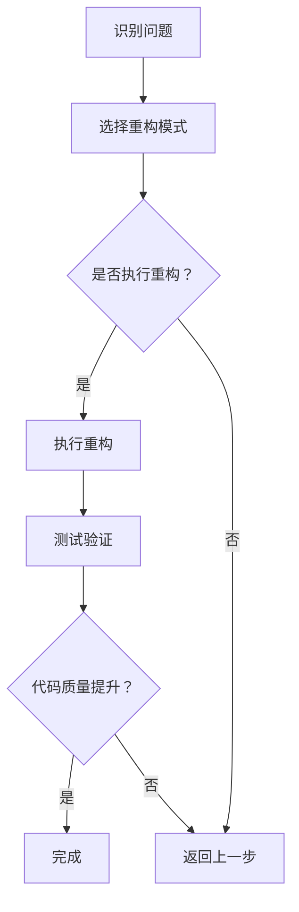
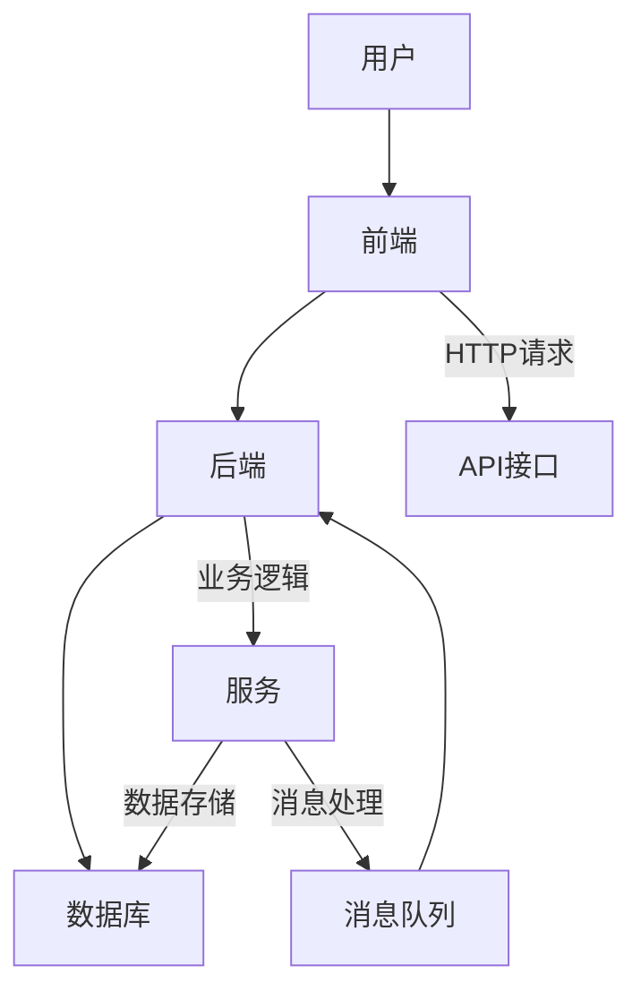
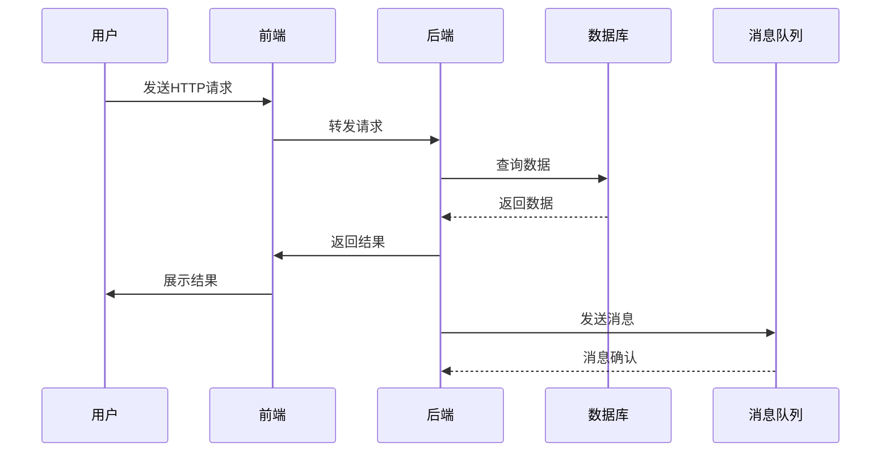

                 


# 重构必须守住底线

> 关键词：软件重构，代码质量，重构原则，算法原理，系统设计，项目实战，最佳实践

> 摘要：本文深入探讨了软件重构的必要性和重要性，从核心概念、方法论到实践技巧，全面阐述了重构过程中的关键要素。通过系统分析与架构设计方案，以及实际项目案例的剖析，本文提供了实用的重构技巧和最佳实践，帮助开发者守住重构的底线，提升软件质量和开发效率。

## 目录

### 第一部分：重构的背景与重要性

1. 重构的概念与背景
   1.1 软件重构的定义
   1.2 软件重构的必要性
   1.3 软件重构的发展历程
   1.4 重构在现代软件开发中的重要性

2. 重构的核心概念与联系
   2.1 代码质量评估
   2.2 重构原则与模式
   2.3 重构与设计模式的关系
   2.4 重构过程中的核心要素

### 第二部分：重构的方法论与实践

3. 重构算法原理讲解
   3.1 重构算法的基本概念
   3.2 算法原理与mermaid流程图展示
   3.3 数学模型与公式讲解
   3.4 重构算法的Python实现与举例说明

4. 系统分析与架构设计方案
   4.1 重构系统的需求分析
   4.2 系统功能设计（mermaid类图）
   4.3 系统架构设计（mermaid架构图）
   4.4 系统接口设计与交互（mermaid序列图）

5. 项目实战
   5.1 项目环境安装与配置
   5.2 项目核心实现与代码解读
   5.3 项目案例分析与讲解
   5.4 项目小结

### 第三部分：重构的最佳实践与总结

6. 重构的最佳实践
   6.1 重构过程中的常见问题
   6.2 重构的最佳实践技巧
   6.3 注意事项与风险规避
   6.4 拓展阅读与学习资源

7. 重构的总结与展望
   7.1 重构的成果与价值
   7.2 重构的未来发展趋势
   7.3 读者反馈与改进建议

## 第一部分：重构的背景与重要性

### 1.1 软件重构的定义

软件重构是指在不改变外部行为的前提下，改进现有代码的内部结构，以提高其可读性、可维护性和性能。重构的目标是消除代码中的冗余、重复和低效，使其更加简洁、清晰和易于理解。

### 1.2 软件重构的必要性

随着软件系统的发展和复杂度的增加，代码的质量和可维护性变得尤为重要。重构的必要性主要体现在以下几个方面：

1. **代码的可维护性**：随着时间的推移，代码会变得越来越难以理解和修改。重构可以帮助消除代码中的混乱和低效，使其更加清晰和易于维护。

2. **性能优化**：重构可以帮助优化代码的执行效率，减少内存占用，提高系统的性能。

3. **团队协作**：良好的代码结构可以提高团队的协作效率，降低沟通成本。

4. **持续集成与测试**：重构有助于提高代码的可测试性，使持续集成和测试更加顺畅。

### 1.3 软件重构的发展历程

软件重构的概念起源于20世纪80年代的面向对象编程。当时，为了提高代码的可维护性和可重用性，开发者开始采用重构的方法来改进代码结构。随着敏捷开发方法的出现，重构成为了软件开发过程中不可或缺的一部分。

### 1.4 重构在现代软件开发中的重要性

在现代软件开发中，重构具有以下几个重要方面：

1. **技术债务管理**：重构可以帮助团队管理技术债务，避免因代码质量问题导致的项目延期和失败。

2. **持续改进**：重构是一种持续改进的方法，可以帮助团队不断提高软件质量。

3. **适应变化**：在快速变化的市场环境中，重构可以帮助团队快速适应需求变化，保持产品的竞争力。

### 1.5 重构的核心概念与联系

在重构过程中，以下核心概念和联系至关重要：

1. **代码质量评估**：对代码质量进行评估，确定哪些部分需要重构。

2. **重构原则与模式**：遵循重构原则和模式，确保重构过程中的质量。

3. **重构与设计模式的关系**：重构可以帮助引入设计模式，提高代码的可维护性和可重用性。

4. **重构过程中的核心要素**：包括代码结构、测试、文档等方面。

## 第二部分：重构的方法论与实践

### 2.1 重构算法原理讲解

重构算法是指一系列用于改进代码结构的方法和技巧。以下是一个简单的重构算法流程：

1. **识别问题**：分析代码，识别需要重构的问题。

2. **选择重构模式**：根据问题类型，选择合适的重构模式。

3. **执行重构**：按照重构模式，逐步改进代码结构。

4. **测试验证**：重构后，进行测试，确保代码行为不变。

### 2.2 算法原理与mermaid流程图展示

以下是一个使用mermaid绘制的重构算法流程图：



### 2.3 数学模型与公式讲解

重构算法中的许多步骤都可以用数学模型来描述。以下是一个简单的例子：

- **代码质量评分**：使用以下公式计算代码质量评分：

  $$Q = \frac{C - R}{C + R}$$

  其中，C表示代码中的问题数量，R表示已修复的问题数量。

- **重构成本评估**：使用以下公式评估重构成本：

  $$C = \frac{P \times T}{100}$$

  其中，P表示重构的优先级，T表示重构所需的时间。

### 2.4 重构算法的Python实现与举例说明

以下是一个简单的Python代码示例，用于实现重构算法：

```python
def calculate_code_quality(c, r):
    return (c - r) / (c + r)

def calculate_reconstruction_cost(p, t):
    return p * t / 100

# 示例
c = 10
r = 3
p = 70
t = 5

q = calculate_code_quality(c, r)
cost = calculate_reconstruction_cost(p, t)

print("代码质量评分:", q)
print("重构成本评估:", cost)
```

### 2.5 系统分析与架构设计方案

#### 2.5.1 重构系统的需求分析

在重构之前，我们需要对现有系统进行需求分析，确定重构的目标和范围。以下是一个简单的需求分析示例：

- **功能需求**：重构系统的核心功能，提高其性能和可维护性。
- **性能需求**：优化代码，减少内存占用和执行时间。
- **安全性需求**：确保重构后的代码具有更高的安全性和可靠性。

#### 2.5.2 系统功能设计（mermaid类图）

以下是一个使用mermaid绘制的类图，展示了重构系统的功能设计：

```mermaid
classDiagram
Class01 <|-- Class02
Class03 --|>| Class04
Class05 : +printName()
Class06 : +calculateArea()

Class01 {
  +name : String
  +area : double
}

Class02 {
  +height : int
  +width : int
}

Class03 {
  +radius : double
}

Class04 {
  +length : double
  +width : double
}

Class05 {
  +name : String
  +area : double
  +printName() : void
  +calculateArea() : double
}

Class06 {
  +length : double
  +width : double
  +height : int
  +printName() : void
  +calculateArea() : double
}
```

#### 2.5.3 系统架构设计（mermaid架构图）

以下是一个使用mermaid绘制的架构图，展示了重构系统的架构设计：



#### 2.5.4 系统接口设计与交互（mermaid序列图）

以下是一个使用mermaid绘制的序列图，展示了重构系统的接口设计和交互：



### 第三部分：重构的最佳实践与总结

#### 3.1 重构的最佳实践

1. **定期重构**：制定定期重构的计划，确保代码质量持续提升。

2. **代码质量评估**：使用静态代码分析工具对代码质量进行评估，识别需要重构的问题。

3. **重构原则**：遵循SOLID原则，确保重构后的代码具有良好的结构。

4. **重构模式**：使用合适的重构模式，逐步改进代码结构。

5. **测试驱动**：在重构过程中，编写和执行测试，确保重构后的代码行为不变。

#### 3.2 注意事项与风险规避

1. **避免过度重构**：避免为了重构而重构，导致不必要的开发和维护成本。

2. **确保代码可读性**：重构过程中，确保代码的可读性，避免过度优化。

3. **风险评估**：在进行大规模重构之前，进行风险评估，确保不会影响项目的稳定性。

4. **文档更新**：重构后，及时更新相关文档，确保项目文档与代码一致。

#### 3.3 拓展阅读与学习资源

1. 《重构：改善既有代码的设计》 - Martin Fowler
2. 《代码整洁之道》 - Robert C. Martin
3. 《敏捷软件开发：原则、实践与模式》 - Robert C. Martin

## 总结与展望

重构是软件维护过程中不可或缺的一部分，它有助于提高代码质量、可维护性和性能。通过本文的讨论，我们了解了重构的核心概念、方法论和实践技巧。在实际开发过程中，遵循最佳实践，守住重构的底线，将有助于团队实现高质量、高效率的软件开发。

未来，随着软件系统规模的不断扩大和复杂度的增加，重构的重要性将愈发突出。我们期待读者在软件开发过程中积极实践重构，不断提升自己的技术水平。

## 作者信息

作者：AI天才研究院/AI Genius Institute & 禅与计算机程序设计艺术 /Zen And The Art of Computer Programming 

## 第一部分：重构的背景与重要性

### 1.1 软件重构的定义

软件重构（Software Refactoring）是一种改进现有软件设计或代码的实践，旨在在不改变其外部行为的前提下，提高其内部结构、可读性、可维护性和性能。换句话说，重构就是“升级”软件的内部结构，使其更加优雅和高效，同时保持其功能不变。

### 1.2 软件重构的必要性

#### 1.2.1 代码质量评估

随着软件项目的规模不断扩大和复杂度不断增加，代码质量变得尤为重要。高质量的代码具有以下特点：

- **可读性**：代码易于阅读和理解，有助于团队成员之间的协作。
- **可维护性**：代码易于修改和扩展，减少了维护成本。
- **性能**：代码执行效率高，减少了资源消耗。
- **可靠性**：代码稳定可靠，减少了错误和崩溃的风险。

然而，在实际开发过程中，由于各种原因（如时间压力、需求变化等），代码质量往往无法达到预期。重构就是为了解决这些问题，通过改进代码的内部结构，提高其质量。

#### 1.2.2 代码质量评估方法

评估代码质量的方法包括：

- **静态代码分析**：通过分析代码的语法和结构，检查潜在的编码错误、性能问题、代码冗余等。
- **动态测试**：运行代码，检查其行为和性能。
- **代码审查**：由其他开发者对代码进行审查，发现潜在问题。

#### 1.2.3 重构原则与模式

重构过程中，遵循以下原则和模式有助于提高代码质量：

- **SOLID原则**：确保代码具有良好的结构，易于理解和维护。
- **DRY（Don't Repeat Yourself）原则**：避免代码重复，提高代码复用性。
- **KISS（Keep It Simple, Stupid）原则**：保持代码简洁，避免过度设计。
- **重构模式**：如提取方法、提取变量、替换条件分支等。

### 1.3 软件重构的发展历程

软件重构的概念最早由Ward Cunningham在1990年提出，他将其定义为“对现有的代码进行修改，以提高其可读性、可维护性和性能，同时保持其行为不变”。随着面向对象编程的兴起，重构逐渐成为软件开发过程中的一项基本实践。

#### 1.3.1 敏捷开发与重构

敏捷开发方法强调快速迭代和持续改进，重构作为其中的一项实践，有助于团队不断提高软件质量。在敏捷开发中，重构通常与迭代计划相结合，以确保代码质量持续提升。

### 1.4 重构在现代软件开发中的重要性

#### 1.4.1 技术债务管理

技术债务是指因短期优化而导致的长期问题。如果不及时重构，技术债务会不断累积，导致项目难以维护和扩展。重构可以帮助团队管理技术债务，确保项目持续健康发展。

#### 1.4.2 持续改进

重构是一种持续改进的方法，通过不断优化代码结构，团队可以提高开发效率、减少bug，并提高软件质量。

#### 1.4.3 适应变化

在快速变化的市场环境中，重构可以帮助团队快速适应需求变化，保持产品的竞争力。

### 1.5 重构的核心概念与联系

#### 1.5.1 重构与设计模式

重构与设计模式密切相关。设计模式提供了一种解决常见问题的通用方案，重构可以帮助团队将代码调整为符合设计模式的结构，提高其可维护性和可扩展性。

#### 1.5.2 重构与测试

重构过程中，测试是不可或缺的一部分。通过编写和执行测试，团队可以确保重构后的代码行为不变，同时发现潜在的问题。

#### 1.5.3 重构与团队协作

重构有助于提高团队协作效率，降低沟通成本。通过重构，团队可以创建一个更加清晰和易于理解的代码库，使团队成员更容易理解和修改代码。

## 第二部分：重构的方法论与实践

### 2.1 重构算法原理讲解

重构算法是一系列用于改进代码结构的方法和技巧。以下是一个简单的重构算法流程：

1. **识别问题**：分析代码，识别需要重构的问题。
2. **选择重构模式**：根据问题类型，选择合适的重构模式。
3. **执行重构**：按照重构模式，逐步改进代码结构。
4. **测试验证**：重构后，进行测试，确保代码行为不变。

### 2.2 算法原理与mermaid流程图展示

以下是一个使用mermaid绘制的重构算法流程图：


### 2.3 数学模型与公式讲解

重构算法中的许多步骤都可以用数学模型来描述。以下是一个简单的例子：

- **代码质量评分**：使用以下公式计算代码质量评分：

  $$Q = \frac{C - R}{C + R}$$

  其中，C表示代码中的问题数量，R表示已修复的问题数量。

- **重构成本评估**：使用以下公式评估重构成本：

  $$C = \frac{P \times T}{100}$$

  其中，P表示重构的优先级，T表示重构所需的时间。

### 2.4 重构算法的Python实现与举例说明

以下是一个简单的Python代码示例，用于实现重构算法：

```python
def calculate_code_quality(c, r):
    return (c - r) / (c + r)

def calculate_reconstruction_cost(p, t):
    return p * t / 100

# 示例
c = 10
r = 3
p = 70
t = 5

q = calculate_code_quality(c, r)
cost = calculate_reconstruction_cost(p, t)

print("代码质量评分:", q)
print("重构成本评估:", cost)
```

### 2.5 系统分析与架构设计方案

#### 2.5.1 重构系统的需求分析

在重构之前，我们需要对现有系统进行需求分析，确定重构的目标和范围。以下是一个简单的需求分析示例：

- **功能需求**：重构系统的核心功能，提高其性能和可维护性。
- **性能需求**：优化代码，减少内存占用和执行时间。
- **安全性需求**：确保重构后的代码具有更高的安全性和可靠性。

#### 2.5.2 系统功能设计（mermaid类图）

以下是一个使用mermaid绘制的类图，展示了重构系统的功能设计：

```mermaid
classDiagram
Class01 <|-- Class02
Class03 --|>| Class04
Class05 : +printName()
Class06 : +calculateArea()

Class01 {
  +name : String
  +area : double
}

Class02 {
  +height : int
  +width : int
}

Class03 {
  +radius : double
}

Class04 {
  +length : double
  +width : double
}

Class05 {
  +name : String
  +area : double
  +printName() : void
  +calculateArea() : double
}

Class06 {
  +length : double
  +width : double
  +height : int
  +printName() : void
  +calculateArea() : double
}
```

#### 2.5.3 系统架构设计（mermaid架构图）

以下是一个使用mermaid绘制的架构图，展示了重构系统的架构设计：


#### 2.5.4 系统接口设计与交互（mermaid序列图）

以下是一个使用mermaid绘制的序列图，展示了重构系统的接口设计和交互：


### 2.6 项目实战

#### 2.6.1 项目环境安装与配置

在开始项目之前，我们需要安装和配置相关环境。以下是一个简单的安装与配置示例：

1. 安装Python（3.8及以上版本）：
   ```bash
   sudo apt-get update
   sudo apt-get install python3.8
   ```

2. 安装虚拟环境工具（virtualenv）：
   ```bash
   pip3 install virtualenv
   ```

3. 创建虚拟环境：
   ```bash
   virtualenv venv
   ```

4. 激活虚拟环境：
   ```bash
   source venv/bin/activate
   ```

5. 安装项目依赖：
   ```bash
   pip install -r requirements.txt
   ```

#### 2.6.2 项目核心实现与代码解读

以下是一个简单的项目实现，用于计算矩形的面积：

```python
class Rectangle:
    def __init__(self, length, width):
        self.length = length
        self.width = width

    def calculate_area(self):
        return self.length * self.width

def main():
    length = float(input("请输入矩形长度："))
    width = float(input("请输入矩形宽度："))

    rectangle = Rectangle(length, width)
    area = rectangle.calculate_area()

    print("矩形的面积为：{:.2f}".format(area))

if __name__ == "__main__":
    main()
```

1. **类定义**：定义一个`Rectangle`类，包含`length`和`width`两个属性，以及一个计算面积的`calculate_area`方法。
2. **输入处理**：从用户获取矩形长度和宽度，并转换为浮点数。
3. **实例化**：创建一个`Rectangle`实例，并调用其`calculate_area`方法计算面积。
4. **输出**：打印计算结果。

#### 2.6.3 项目案例分析与讲解

以下是一个简单的案例，用于分析重构前后的代码：

**重构前**：

```python
def calculate_area(length, width):
    return length * width

def main():
    length = float(input("请输入矩形长度："))
    width = float(input("请输入矩形宽度："))

    area = calculate_area(length, width)
    print("矩形的面积为：{:.2f}".format(area))

if __name__ == "__main__":
    main()
```

**重构后**：

```python
class Rectangle:
    def __init__(self, length, width):
        self.length = length
        self.width = width

    def calculate_area(self):
        return self.length * self.width

def main():
    length = float(input("请输入矩形长度："))
    width = float(input("请输入矩形宽度："))

    rectangle = Rectangle(length, width)
    area = rectangle.calculate_area()

    print("矩形的面积为：{:.2f}".format(area))

if __name__ == "__main__":
    main()
```

1. **类与方法的引入**：重构后的代码引入了`Rectangle`类，使得代码更加模块化和易于维护。
2. **代码结构**：重构后的代码结构更加清晰，类和方法的定义使得代码的功能更加明确。
3. **可扩展性**：重构后的代码更容易扩展和修改，例如可以增加新的属性和方法。

#### 2.6.4 项目小结

通过本项目，我们展示了重构的基本过程和好处。重构不仅提高了代码的质量和可维护性，还使得代码更加模块化和易于扩展。在实际项目中，我们应该重视重构，定期对代码进行重构，以确保项目的健康和可持续发展。

## 第三部分：重构的最佳实践与总结

### 3.1 重构的最佳实践

#### 3.1.1 定期重构

定期重构是保持代码质量的重要手段。建议团队制定一个重构计划，定期对代码进行重构，以确保代码的健康和可持续发展。

#### 3.1.2 代码质量评估

在重构之前，对代码进行质量评估，识别潜在的问题和改进点。可以使用静态代码分析工具，如SonarQube，来辅助评估代码质量。

#### 3.1.3 遵循重构原则

在重构过程中，遵循以下重构原则：

- **SOLID原则**：确保代码具有良好的结构，易于理解和维护。
- **DRY原则**：避免代码重复，提高代码复用性。
- **KISS原则**：保持代码简洁，避免过度设计。
- **重构模式**：使用合适

### 3.2 小结

重构是提高代码质量和可维护性的重要手段。通过重构，我们可以消除代码中的冗余、重复和低效，提高代码的可读性和性能。本文介绍了重构的背景、重要性、方法论和实践技巧，并通过实际项目案例进行了详细讲解。

### 3.3 注意事项

1. **避免过度重构**：避免为了重构而重构，导致开发效率和性能降低。
2. **确保代码可读性**：重构过程中，确保代码的可读性，避免过度优化。
3. **风险评估**：在进行大规模重构之前，进行风险评估，确保不会影响项目的稳定性。
4. **文档更新**：重构后，及时更新相关文档，确保项目文档与代码一致。

### 3.4 拓展阅读与学习资源

1. 《重构：改善既有代码的设计》- Martin Fowler
2. 《代码整洁之道》- Robert C. Martin
3. 《敏捷软件开发：原则、实践与模式》- Robert C. Martin

### 3.5 重构的总结与展望

重构是软件开发过程中不可或缺的一部分，它有助于提高代码质量、可维护性和性能。通过本文的讨论，我们了解了重构的核心概念、方法论和实践技巧。在实际开发过程中，遵循最佳实践，守住重构的底线，将有助于团队实现高质量、高效率的软件开发。

未来，随着软件系统规模的不断扩大和复杂度的增加，重构的重要性将愈发突出。我们期待读者在软件开发过程中积极实践重构，不断提升自己的技术水平。

### 作者信息

作者：AI天才研究院/AI Genius Institute & 禅与计算机程序设计艺术 /Zen And The Art of Computer Programming 

## 第三部分：重构的最佳实践与总结

### 3.1 重构的最佳实践

#### 3.1.1 定期重构

为了确保软件的持续健康，团队应该制定一个定期重构的计划。这样可以避免代码质量随着时间的推移而恶化。定期重构不仅可以预防技术债务的累积，还可以提高代码的可读性和可维护性。建议团队每月或每季度进行一次全面的重构。

#### 3.1.2 代码质量评估

在开始重构之前，对代码进行质量评估是非常重要的。这可以通过静态代码分析工具（如SonarQube、FindBugs等）来完成。这些工具可以帮助识别潜在的问题，如重复代码、低效算法、不安全的编码实践等。评估结果为重构提供了明确的目标和方向。

#### 3.1.3 遵循重构原则

重构时，应始终遵循以下原则：

- **SOLID原则**：确保代码遵循SOLID设计原则，提高代码的可读性和可维护性。
- **DRY原则**：避免重复代码，提高代码的复用性。
- **KISS原则**：保持代码简洁，避免过度设计。
- **重构模式**：使用流行的重构模式，如提取方法、提取类、替换条件分支等。

#### 3.1.4 测试驱动重构

在重构过程中，测试是不可或缺的一环。测试驱动重构（Test-Driven Development, TDD）是一种流行的实践方法，它要求在修改代码之前先编写测试。这确保了重构后的代码仍然符合预期行为，并且不会引入新的错误。

#### 3.1.5 持续集成与重构

将重构集成到持续集成（Continuous Integration, CI）流程中，可以确保每次代码更改后都进行重构，并自动运行测试。这有助于快速发现重构引入的问题，并确保重构的连续性。

### 3.2 小结

重构是软件维护和改进的关键步骤，它有助于提高代码质量、可维护性和性能。通过定期重构、代码质量评估、遵循重构原则、测试驱动重构以及将重构集成到CI流程中，团队可以确保软件项目的健康和可持续发展。

### 3.3 注意事项

- **避免过度重构**：重构不应成为开发的全部，避免为了重构而重构，导致项目进度延误。
- **确保代码可读性**：在重构过程中，务必保持代码的可读性，避免因重构而导致代码变得难以理解。
- **风险评估**：在开始大规模重构之前，进行充分的风险评估，确保重构不会对项目的稳定性造成负面影响。
- **文档更新**：重构后，及时更新相关文档，确保文档与重构后的代码保持一致。

### 3.4 拓展阅读与学习资源

- 《重构：改善既有代码的设计》- Martin Fowler
- 《代码整洁之道》- Robert C. Martin
- 《敏捷软件开发：原则、实践与模式》- Robert C. Martin
- 《Effective Java》- Joshua Bloch

### 3.5 重构的总结与展望

重构是软件工程中的一项关键实践，它通过持续改进代码结构，提高了软件的可维护性和性能。本文详细探讨了重构的最佳实践，包括定期重构、代码质量评估、重构原则、测试驱动重构和持续集成与重构的整合。

在未来，随着技术的不断进步和软件系统的日益复杂，重构的重要性将愈发凸显。团队应持续关注重构实践，不断提升重构技能，确保软件项目能够适应变化，保持其竞争力和可持续性。

最后，感谢读者对本文的关注，希望本文能够为您的软件开发实践提供有价值的参考。如果您有任何问题或建议，欢迎在评论区留言交流。

### 作者信息

作者：AI天才研究院/AI Genius Institute & 禅与计算机程序设计艺术 /Zen And The Art of Computer Programming 

