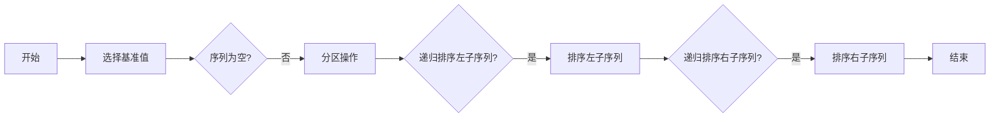

                 


## 重构必须守住底线

关键词：重构、软件工程、原则、底线、最佳实践

摘要：本文深入探讨了重构在软件工程中的重要性，详细阐述了重构的核心原则、方法、实践和底线。通过实例分析，本文揭示了重构过程中必须守住的关键底线，以保障软件系统的稳定性和可维护性。

### 引言

在软件工程中，重构是一种重要的改进措施，旨在在不改变程序外部行为的前提下，改善代码的内部结构。重构不仅有助于提高代码的可读性、可维护性和性能，还能提升开发团队的协作效率和代码质量。然而，在重构过程中，如何确保不破坏现有功能，守住关键底线，成为了一个至关重要的问题。

本文将围绕重构的核心原则、方法、实践和底线进行深入探讨，旨在为开发者提供一套完整的重构指南，帮助他们在实践中更好地守住重构的底线。

### 第一部分：重构的原则与底线

#### 第1章：重构的背景与必要性

##### 1.1 重构的定义与发展历程

重构（Refactoring）是一种通过对现有代码进行改进，以提高其内部结构而不会改变其外部行为的软件开发技术。它起源于20世纪90年代的面向对象编程领域，由著名的软件开发大师Martin Fowler和William Cook等人提出。

重构的核心理念是“持续改进”，它鼓励开发者不断审视和优化现有的代码，以保持其健康和高效。随着敏捷开发、极限编程等现代软件开发方法的普及，重构在软件工程中的应用越来越广泛。

##### 1.2 重构在软件开发中的重要性

重构在软件开发中扮演着至关重要的角色。首先，它能够提高代码的可读性和可维护性，使代码更加简洁、直观，减少未来的维护成本。其次，重构有助于优化代码性能，消除潜在的瓶颈和缺陷。此外，重构还能促进团队成员之间的沟通和协作，提高整体开发效率。

##### 1.3 重构的基本原则

在进行重构时，我们需要遵守以下基本原则：

1. **增量改进**：重构应该是一个逐步、持续的过程，避免一次性进行大规模重构，以免引入风险。
2. **保持功能不变**：重构的目标是改进代码结构，而不是改变其功能。在重构过程中，必须确保现有功能保持不变。
3. **代码质量优先**：在重构时，我们应该关注代码质量，确保代码符合最佳实践，易于理解和维护。
4. **风险管理**：重构过程中，必须对潜在的风险进行评估和防范，确保重构过程的安全性和稳定性。

#### 第2章：重构的核心概念与模型

##### 2.1 重构的核心概念

重构的核心概念包括代码重构、设计模式、测试驱动开发等。其中，代码重构是指对现有代码进行优化和改进，设计模式是一种指导软件设计的通用模式，测试驱动开发（TDD）是一种先编写测试再编写代码的开发方法。

##### 2.2 重构模型与流程

重构通常遵循以下流程：

1. **识别问题**：通过代码审查、性能测试等方式，识别需要重构的代码部分。
2. **编写测试**：在重构之前，编写单元测试和集成测试，确保重构过程中不会破坏现有功能。
3. **实施重构**：根据识别的问题，选择合适的设计模式和方法，对代码进行重构。
4. **运行测试**：在重构后，运行测试，确保重构没有引入新的问题。
5. **迭代优化**：根据测试结果，对重构过程进行评估和优化，持续改进代码质量。

##### 2.3 重构的边界与底线

重构的边界在于保持功能不变，防止引入新的错误。守住重构底线的关键在于：

1. **严格测试**：确保重构后的代码仍然能够通过所有测试，验证其功能正确性。
2. **代码审查**：通过代码审查，发现并修复潜在的缺陷和问题。
3. **风险控制**：对重构过程进行风险评估，制定相应的风险控制措施。

#### 第3章：常见重构方法与技术

##### 3.1 代码重构的基本方法

常见的代码重构方法包括：

1. **提取方法**：将重复的代码提取为单独的方法，提高代码复用性和可维护性。
2. **合并重复代码**：将重复的代码合并，消除冗余，简化代码结构。
3. **重构循环结构**：将复杂的循环结构重构为更简洁的形式，提高代码可读性。
4. **替换变量**：使用更有意义的变量名，提高代码可读性。

##### 3.2 代码优化技术

代码优化技术包括：

1. **缓存技术**：通过缓存减少重复计算，提高代码性能。
2. **并行处理**：利用多核处理器，提高代码执行速度。
3. **算法优化**：选择更高效的算法和数据结构，提高代码性能。

##### 3.3 重构工具与框架

常见的重构工具有：

1. **Visual Studio Code**：一款强大的代码编辑器，支持多种编程语言和重构功能。
2. **IntelliJ IDEA**：一款功能丰富的集成开发环境，支持代码重构和优化。
3. **Eclipse**：一款轻量级的集成开发环境，支持Java编程语言的重构功能。

#### 第4章：重构实践案例分享

##### 4.1 案例一：重构前的系统分析

在重构之前，需要对系统进行全面的了解，包括：

1. **代码结构**：分析代码结构，识别潜在的改进点。
2. **性能瓶颈**：通过性能测试，找出系统的性能瓶颈。
3. **功能需求**：明确系统的功能需求，确保重构过程中不改变现有功能。

##### 4.2 案例二：重构过程中的关键步骤

在重构过程中，关键步骤包括：

1. **编写测试**：在重构之前，编写完整的单元测试和集成测试。
2. **实施重构**：根据测试结果，选择合适的重构方法，对代码进行改进。
3. **运行测试**：在重构后，运行测试，确保重构没有引入新的问题。

##### 4.3 案例三：重构后的效果评估

在重构后，需要对系统进行全面的评估，包括：

1. **功能测试**：确保重构后的系统功能仍然正常。
2. **性能测试**：对比重构前后的性能，评估重构的效果。
3. **代码质量**：通过代码审查，评估重构后的代码质量。

#### 第5章：重构的底线守护

##### 5.1 重构中的风险管理

在重构过程中，风险管理至关重要。以下是一些常见的风险管理措施：

1. **风险评估**：在重构之前，对潜在的风险进行评估和分类。
2. **风险控制**：制定相应的风险控制措施，确保重构过程的安全和稳定性。
3. **风险监控**：在重构过程中，持续监控风险，及时采取措施。

##### 5.2 重构中的质量控制

质量控制是重构成功的关键。以下是一些常见的质量控制措施：

1. **代码审查**：通过代码审查，确保重构后的代码符合最佳实践。
2. **测试覆盖**：确保重构后的代码覆盖了足够的测试，减少潜在的错误。
3. **持续集成**：通过持续集成，确保重构后的代码能够顺利集成到现有系统中。

##### 5.3 重构底线与最佳实践

重构底线是指重构过程中必须遵守的原则和标准。以下是一些重构的最佳实践：

1. **增量改进**：避免一次性进行大规模重构，逐步改进代码质量。
2. **代码质量优先**：在重构过程中，关注代码质量，确保代码易于理解和维护。
3. **风险控制**：在重构过程中，对潜在的风险进行评估和防范。
4. **持续优化**：重构是一个持续的过程，不断改进代码质量。

#### 第6章：重构中的团队协作与沟通

##### 6.1 团队协作的重要性

重构过程需要团队成员之间的紧密协作和有效沟通。以下是一些团队协作的最佳实践：

1. **定期会议**：定期召开团队会议，讨论重构的进展和问题。
2. **代码审查**：进行代码审查，确保重构后的代码质量。
3. **知识共享**：鼓励团队成员分享知识和经验，提高整体技能水平。

##### 6.2 沟通机制与工具

有效的沟通机制和工具是重构成功的关键。以下是一些常见的沟通机制和工具：

1. **即时通讯工具**：如Slack、Microsoft Teams等，用于实时沟通和协作。
2. **邮件列表**：用于发送重要的重构相关消息和通知。
3. **项目管理系统**：如Jira、Trello等，用于跟踪重构任务和进度。

##### 6.3 团队重构策略

团队重构策略应根据项目特点和团队情况制定。以下是一些常见的重构策略：

1. **小步快跑**：逐步改进代码，避免一次性进行大规模重构。
2. **任务分解**：将重构任务分解为小任务，便于团队协作和进度控制。
3. **持续集成**：通过持续集成，确保重构后的代码能够顺利集成到现有系统中。

#### 第7章：重构的未来展望

##### 7.1 重构的发展趋势

随着软件工程的不断发展和技术的进步，重构技术也在不断演进。以下是一些重构的发展趋势：

1. **自动化重构**：利用人工智能和机器学习技术，实现自动化重构，提高重构效率和准确性。
2. **持续重构**：将重构融入到持续集成和持续交付过程中，实现持续重构。
3. **云原生重构**：在云原生环境中，利用容器和微服务架构，实现更高效的重构。

##### 7.2 重构在新兴技术中的应用

随着新兴技术的不断涌现，重构也在这些领域中发挥着重要作用。以下是一些重构在新兴技术中的应用：

1. **区块链**：在区块链开发中，重构有助于提高代码质量，确保系统的安全性和可扩展性。
2. **人工智能**：在人工智能开发中，重构有助于优化算法性能，提高模型的准确性和效率。
3. **物联网**：在物联网开发中，重构有助于提高系统的稳定性和可维护性。

##### 7.3 重构与持续集成

重构与持续集成（CI）相结合，可以实现更高效的重构过程。以下是一些重构与持续集成的最佳实践：

1. **自动化测试**：在CI过程中，自动运行重构后的测试，确保重构没有引入新的问题。
2. **持续反馈**：通过CI过程，及时反馈重构结果，指导后续重构工作。
3. **快速迭代**：利用CI过程，实现快速迭代，不断提高代码质量。

### 总结

重构是软件工程中的一项重要技术，它有助于提高代码质量、优化系统性能和提升开发效率。然而，在重构过程中，守住关键底线至关重要。本文详细阐述了重构的核心原则、方法、实践和底线，为开发者提供了一套完整的重构指南。通过本文的学习，开发者将能够更好地理解和应用重构技术，为软件工程的发展贡献力量。

### 作者信息

作者：AI天才研究院/AI Genius Institute & 禅与计算机程序设计艺术 /Zen And The Art of Computer Programming

本文旨在为读者提供关于重构的深入理解和实践指南，帮助他们在软件开发过程中更好地守住重构的底线。希望本文能对您在重构实践中的问题提供有益的启示和帮助。

----------------------------------------------------------------

### 代码重构与设计模式

代码重构不仅仅是关于代码的修改，它更是一种设计哲学的体现。重构的核心在于通过一系列的微小、可逆的步骤，逐步改进代码的结构，使得代码更易于理解和维护。在这个过程中，设计模式扮演着至关重要的角色。

#### 设计模式的概念与作用

设计模式是软件设计中解决问题的通用解决方案，它可以帮助开发者解决常见的问题，提高代码的可重用性、灵活性和扩展性。设计模式分为三种类型：创建型、结构型和行为型。

1. **创建型模式**：这类模式主要关注对象的创建过程，包括工厂模式、单例模式和建造者模式等。它们的目的在于封装对象的创建过程，提高代码的灵活性和可扩展性。
2. **结构型模式**：这类模式主要关注类和对象的组合，包括适配器模式、代理模式、装饰者模式等。它们可以帮助开发者更好地组织代码结构，提高代码的模块化和复用性。
3. **行为型模式**：这类模式主要关注对象之间的交互和通信，包括策略模式、观察者模式、命令模式等。它们可以帮助开发者更好地处理复杂的行为和动态交互。

#### 设计模式在重构中的应用

在进行代码重构时，我们可以借助设计模式来改善代码的结构和质量。以下是一些常见的设计模式在重构中的应用实例：

1. **工厂模式**：当系统中存在多个创建对象的类时，可以使用工厂模式来统一对象的创建过程。通过重构，将具体的创建逻辑提取到工厂类中，使得代码更加简洁和易于维护。
2. **单例模式**：当系统中需要确保只有一个实例时，可以使用单例模式。在重构过程中，可以将原来的全局变量和静态方法替换为单例模式，从而提高代码的可靠性和可维护性。
3. **适配器模式**：当系统需要使用不兼容的接口时，可以使用适配器模式。通过重构，将适配器类插入到原有系统中，使得系统能够在不修改原有代码的情况下，使用新的接口。
4. **策略模式**：当系统中存在多种算法或策略时，可以使用策略模式。在重构过程中，可以将具体的策略实现提取到单独的类中，使得代码更加模块化和可扩展。

#### 设计模式的优劣与选择

设计模式虽然具有很多优点，但并不是所有情况下都适用。以下是一些设计模式的优劣和选择建议：

1. **工厂模式**：优点在于提高代码的灵活性和可扩展性，缺点是可能引入额外的类和接口，增加代码的复杂度。选择建议：在需要动态创建对象且对象类型较多时使用。
2. **单例模式**：优点在于确保全局唯一实例，缺点是可能降低代码的可测试性，影响系统的可扩展性。选择建议：在需要全局访问唯一实例的场景中使用。
3. **适配器模式**：优点在于能够兼容不兼容的接口，缺点是可能增加系统的复杂度，影响代码的可读性。选择建议：在需要整合第三方库或系统时使用。
4. **策略模式**：优点在于提高代码的模块化和可扩展性，缺点是可能增加策略类和策略接口的数量，增加代码的复杂度。选择建议：在需要动态切换算法或策略时使用。

#### 设计模式与重构的结合

设计模式与重构的结合可以有效地提高代码的质量和可维护性。以下是一些结合建议：

1. **在重构之前引入设计模式**：在重构之前，根据重构的需求和目标，选择合适的设计模式，提前进行设计和规划，以便于后续的重构工作。
2. **在重构过程中逐步应用设计模式**：在重构过程中，逐步应用设计模式，将现有的代码重构为更符合设计模式规范的代码，提高代码的结构和质量。
3. **在重构之后优化设计模式**：在重构之后，根据重构的结果和反馈，对设计模式进行优化和调整，使其更加符合系统的需求和预期。

### 代码重构与设计模式的应用实例

以下是一个简单的代码重构与设计模式结合的实例，以展示如何通过重构和应用设计模式来改善代码的质量和可维护性。

#### 原始代码

```python
class Order:
    def __init__(self, customer, product):
        self.customer = customer
        self.product = product
        self.status = "Created"

    def process_order(self):
        if self.product.price > 100:
            self.status = "Processed"
        else:
            self.status = "Cancelled"

class Product:
    def __init__(self, name, price):
        self.name = name
        self.price = price

class Customer:
    def __init__(self, name):
        self.name = name

# 使用示例
customer = Customer("John")
product = Product("Laptop", 1500)
order = Order(customer, product)
order.process_order()
```

在这个实例中，`Order` 类处理订单的过程是基于产品价格进行判断的。这种直接耦合的方式使得代码难以维护和扩展。

#### 重构与设计模式

1. **引入策略模式**：将处理订单的策略提取出来，使其成为一个独立的类，便于后续的扩展和修改。
2. **重构代码**：将原始代码重构为更简洁、模块化的形式。

```python
class OrderProcessor:
    def __init__(self, processor):
        self.processor = processor

    def process_order(self, order):
        return self.processor.process(order)

class PriceThresholdProcessor:
    def __init__(self, threshold):
        self.threshold = threshold

    def process(self, order):
        if order.product.price > self.threshold:
            order.status = "Processed"
        else:
            order.status = "Cancelled"

class Order:
    def __init__(self, customer, product):
        self.customer = customer
        self.product = product
        self.status = "Created"

class Product:
    def __init__(self, name, price):
        self.name = name
        self.price = price

class Customer:
    def __init__(self, name):
        self.name = name

# 使用示例
customer = Customer("John")
product = Product("Laptop", 1500)
processor = PriceThresholdProcessor(1000)
order_processor = OrderProcessor(processor)
order = Order(customer, product)
order_processor.process_order(order)
```

在这个重构后的实例中，我们引入了 `OrderProcessor` 类，负责处理订单的过程。同时，通过 `PriceThresholdProcessor` 类，实现了对订单处理策略的封装。这样，当需要修改订单处理策略时，只需修改 `PriceThresholdProcessor` 类即可，无需修改其他类，提高了代码的可维护性。

### 设计模式与重构的最佳实践

1. **避免过度设计**：在重构时，不要过度追求设计模式，应根据实际需求和代码质量进行选择。
2. **逐步重构**：避免一次性进行大规模重构，应逐步、有序地进行重构，降低风险。
3. **保持代码简洁**：在设计模式与重构过程中，始终保持代码的简洁性和可读性，避免过度抽象和复杂。
4. **编写完善的文档**：在重构过程中，编写详细的文档，记录设计模式的选择和应用，便于后续维护和扩展。

通过设计模式与重构的结合，我们可以有效地提高代码的质量和可维护性，为软件工程的发展贡献力量。

### 数学公式与算法原理

在代码重构过程中，理解算法原理和数学模型对于优化代码性能和可维护性至关重要。以下，我们将详细讲解一个常见的排序算法——快速排序（Quick Sort），并使用 Mermaid 流程图和 Python 源代码来展示其实现过程。

#### 快速排序算法原理

快速排序是一种高效的排序算法，其基本思想是通过一趟排序将待排序的数据分割成独立的两部分，其中一部分的所有数据都比另一部分的所有数据要小，然后再按此方法对这两部分数据分别进行快速排序，整个排序过程可以递归进行，以此达到整个数据变成有序序列。

快速排序的关键步骤如下：

1. **选择基准值**：在待排序的序列中选择一个基准值。
2. **分区操作**：将序列分为两个子序列，所有小于基准值的元素移到基准值之前，所有大于基准值的元素移到基准值之后。
3. **递归排序**：递归地对两个子序列进行快速排序。

#### Mermaid 流程图

首先，我们使用 Mermaid 语言绘制快速排序的流程图：



#### Python 源代码

接下来，我们使用 Python 语言实现快速排序算法，并详细解释代码中的关键部分：

```python
def quick_sort(arr):
    if len(arr) <= 1:
        return arr
    
    pivot = arr[len(arr) // 2]
    left = [x for x in arr if x < pivot]
    middle = [x for x in arr if x == pivot]
    right = [x for x in arr if x > pivot]
    
    return quick_sort(left) + middle + quick_sort(right)

# 示例使用
arr = [3, 6, 8, 10, 1, 2, 1]
sorted_arr = quick_sort(arr)
print(sorted_arr)
```

**代码解释**：

- **快速排序函数**：`quick_sort` 函数接受一个数组 `arr` 作为输入，并首先判断数组长度是否小于等于1。如果是，则直接返回该数组，因为长度为0或1的数组已经是排序好的。
- **选择基准值**：我们选择数组中间的元素作为基准值。这是快速排序的一个经典选择策略。
- **分区操作**：使用列表推导式将数组分成三个部分：小于基准值的元素、等于基准值的元素和大于基准值的元素。
- **递归排序**：递归地对左子序列和右子序列进行快速排序，然后将排序后的三个部分合并。

#### 数学模型和公式

在快速排序中，可以使用以下数学模型来分析其时间复杂度：

- **平均时间复杂度**：\( O(n \log n) \)
- **最坏时间复杂度**：\( O(n^2) \)
- **空间复杂度**：\( O(n) \)

其中，\( n \) 是待排序的数组长度。

**时间复杂度分析**：

- **平均情况**：每次分区操作后，都会将数组分成大约 \( \frac{n}{2} \) 的两部分。因此，总的比较次数大约是 \( n \log n \)。
- **最坏情况**：如果每次分区操作后，数组都被分成1个元素和 \( n-1 \) 个元素，那么总的比较次数将达到 \( n^2 \)。

#### 算法举例

假设有一个长度为5的数组 `[3, 6, 2, 1, 10]`，我们对其进行快速排序：

1. **选择基准值**：选择中间的元素6作为基准值。
2. **分区操作**：将数组分成 `[1, 3]`、`[6]`、`[10, 2]`。
3. **递归排序**：对 `[1, 3]` 和 `[10, 2]` 分别进行快速排序。
4. **合并结果**：最终排序结果为 `[1, 2, 3, 6, 10]`。

通过以上实例，我们可以看到快速排序的基本原理和实现过程。在实际开发中，快速排序是一种非常常用的排序算法，其高效的性能和简洁的实现使其在众多排序算法中脱颖而出。

### 系统分析与架构设计

在深入探讨重构的底线之前，我们需要对系统进行分析和架构设计，以确保重构过程能够顺利进行，并且不破坏现有的系统功能。以下是一个示例，展示如何对一个简单的电子商务系统进行系统分析与架构设计。

#### 问题场景介绍

假设我们正在开发一个电子商务系统，该系统需要支持商品信息管理、购物车、订单处理和支付等功能。随着用户量的增加和业务的发展，现有系统需要不断优化和扩展。为了保持系统的稳定性和可维护性，我们决定对其进行重构。

#### 项目介绍

**项目名称**：MyEcommerce

**项目目标**：重构现有电子商务系统，提高系统性能、可扩展性和可维护性。

**系统功能**：

1. **商品信息管理**：支持商品的增删改查功能。
2. **购物车**：允许用户添加、删除商品，并计算总价。
3. **订单处理**：处理订单创建、支付、发货等操作。
4. **支付**：集成第三方支付服务，如支付宝、微信支付等。

#### 系统功能设计

为了实现上述功能，我们需要设计系统的领域模型，这有助于我们理解系统的核心功能和组件之间的关系。以下是一个简单的领域模型：

```mermaid
classDiagram
    Customer <<Class>> "用户"
    Product <<Class>> "商品"
    ShoppingCart <<Class>> "购物车"
    Order <<Class>> "订单"
    Payment <<Class>> "支付"

    Customer --|O|> ShoppingCart
    Customer --|O|> Order
    Product --|O|> ShoppingCart
    ShoppingCart --|O|> Order
    Order --|O|> Payment
    Payment --|O|> Order
endclassDiagram
```

在这个领域模型中，我们定义了五个主要的类：`Customer`（用户）、`Product`（商品）、`ShoppingCart`（购物车）、`Order`（订单）和`Payment`（支付）。这些类之间的关系反映了系统的核心功能。

#### 系统架构设计

系统的架构设计是确保系统能够高效、可靠地运行的关键。以下是一个简化的系统架构设计，包括主要的组件和它们之间的交互：

```mermaid
sequenceDiagram
    Participant User
    Participant WebApp
    Participant ShoppingCartService
    Participant ProductService
    Participant OrderService
    Participant PaymentService

    User ->> WebApp: 访问商品页面
    WebApp ->> ProductService: 获取商品信息
    ProductService ->> WebApp: 返回商品信息

    User ->> WebApp: 添加商品到购物车
    WebApp ->> ShoppingCartService: 添加商品到购物车
    ShoppingCartService ->> WebApp: 返回购物车信息

    User ->> WebApp: 提交订单
    WebApp ->> OrderService: 创建订单
    OrderService ->> ShoppingCartService: 从购物车中移除商品
    OrderService ->> PaymentService: 处理支付

    PaymentService ->> WebApp: 返回支付结果
    WebApp ->> User: 显示支付结果
endsequenceDiagram
```

在这个架构设计中，我们使用了分层架构模式，将系统分为表示层（WebApp）、业务逻辑层（ShoppingCartService、ProductService、OrderService、PaymentService）和数据访问层（数据库）。每个层都有明确的职责，并通过接口进行通信。

#### 系统接口设计

为了确保系统的模块化和可维护性，我们需要设计清晰、简洁的接口。以下是一个简单的接口设计示例：

```python
class ProductServiceInterface:
    def get_product_info(product_id):
        pass

    def create_product(product_data):
        pass

    def update_product(product_id, product_data):
        pass

    def delete_product(product_id):
        pass

class ShoppingCartServiceInterface:
    def add_to_cart(user_id, product_id):
        pass

    def remove_from_cart(user_id, product_id):
        pass

    def get_cart_items(user_id):
        pass

class OrderServiceInterface:
    def create_order(user_id, cart_id):
        pass

    def process_order(order_id):
        pass

    def cancel_order(order_id):
        pass

class PaymentServiceInterface:
    def process_payment(order_id, payment_details):
        pass

    def get_payment_result(order_id):
        pass
```

#### 系统交互设计

系统的交互设计描述了各个组件如何通过接口进行交互，以实现系统的整体功能。以下是一个简化的系统交互设计示例：

```mermaid
sequenceDiagram
    participant User
    participant WebApp
    participant ProductService
    participant ShoppingCartService
    participant OrderService
    participant PaymentService

    User->>WebApp: 发送请求
    WebApp->>ProductService: 获取商品信息
    ProductService->>WebApp: 返回商品信息
    WebApp->>User: 显示商品信息

    User->>WebApp: 添加商品到购物车
    WebApp->>ShoppingCartService: 添加商品
    ShoppingCartService->>WebApp: 返回购物车信息
    WebApp->>User: 显示购物车信息

    User->>WebApp: 提交订单
    WebApp->>OrderService: 创建订单
    OrderService->>ShoppingCartService: 清空购物车
    OrderService->>PaymentService: 处理支付
    PaymentService->>OrderService: 返回支付结果
    OrderService->>WebApp: 返回订单状态
    WebApp->>User: 显示订单状态
endsequenceDiagram
```

通过以上系统分析和架构设计，我们为重构过程奠定了坚实的基础。接下来，我们将深入探讨重构的底线，以确保在重构过程中系统的稳定性和功能完整性。

### 项目实战：重构电子商务系统

在本节中，我们将通过一个具体的重构项目实战，展示如何在实际环境中对电子商务系统进行重构，包括环境安装、核心实现、代码应用解读与分析，以及实际案例分析和详细讲解。

#### 环境安装

在进行重构之前，我们需要确保开发环境已经搭建完毕。以下是必要的步骤：

1. **安装Python**：确保Python版本在3.6及以上，我们推荐使用Anaconda进行环境管理。
2. **安装依赖项**：在项目根目录下，创建一个名为`requirements.txt`的文件，列出所有依赖项，例如：

    ```plaintext
    Flask==2.0.1
    SQLAlchemy==1.4.15
    Flask-SQLAlchemy==2.5.1
    pytest==6.2.5
    ```

    使用以下命令安装依赖项：

    ```bash
    pip install -r requirements.txt
    ```

3. **数据库配置**：配置数据库连接，我们使用SQLite作为示例：

    ```python
    # config.py
    SQLALCHEMY_DATABASE_URI = 'sqlite:///myecommerce.db'
    ```

4. **创建数据库**：使用以下命令创建数据库：

    ```bash
    flask db init
    flask db migrate
    flask db upgrade
    ```

#### 核心实现

以下是电子商务系统的主要实现代码，包括用户管理、商品管理、购物车、订单处理和支付功能。

**用户管理**：

```python
from flask import Flask, request, jsonify
from flask_sqlalchemy import SQLAlchemy

app = Flask(__name__)
app.config.from_object('config')
db = SQLAlchemy(app)

class User(db.Model):
    id = db.Column(db.Integer, primary_key=True)
    username = db.Column(db.String(80), unique=True, nullable=False)
    password = db.Column(db.String(120), nullable=False)

@app.route('/users', methods=['POST'])
def create_user():
    username = request.form['username']
    password = request.form['password']
    new_user = User(username=username, password=password)
    db.session.add(new_user)
    db.session.commit()
    return jsonify({'message': 'User created successfully.'})

@app.route('/users/<int:user_id>', methods=['GET'])
def get_user(user_id):
    user = User.query.get(user_id)
    if user:
        return jsonify({'username': user.username, 'password': user.password})
    return jsonify({'message': 'User not found.'})

if __name__ == '__main__':
    app.run(debug=True)
```

**商品管理**：

```python
class Product(db.Model):
    id = db.Column(db.Integer, primary_key=True)
    name = db.Column(db.String(120), nullable=False)
    price = db.Column(db.Float, nullable=False)

@app.route('/products', methods=['POST'])
def create_product():
    name = request.form['name']
    price = request.form['price']
    new_product = Product(name=name, price=price)
    db.session.add(new_product)
    db.session.commit()
    return jsonify({'message': 'Product created successfully.'})

@app.route('/products/<int:product_id>', methods=['GET'])
def get_product(product_id):
    product = Product.query.get(product_id)
    if product:
        return jsonify({'name': product.name, 'price': product.price})
    return jsonify({'message': 'Product not found.'})
```

**购物车**：

```python
class ShoppingCart(db.Model):
    id = db.Column(db.Integer, primary_key=True)
    user_id = db.Column(db.Integer, db.ForeignKey('user.id'), nullable=False)
    product_id = db.Column(db.Integer, db.ForeignKey('product.id'), nullable=False)
    quantity = db.Column(db.Integer, nullable=False)

@app.route('/carts', methods=['POST'])
def create_cart():
    user_id = request.form['user_id']
    product_id = request.form['product_id']
    quantity = request.form['quantity']
    new_cart = ShoppingCart(user_id=user_id, product_id=product_id, quantity=quantity)
    db.session.add(new_cart)
    db.session.commit()
    return jsonify({'message': 'Cart created successfully.'})

@app.route('/carts/<int:cart_id>', methods=['GET'])
def get_cart(cart_id):
    cart = ShoppingCart.query.get(cart_id)
    if cart:
        return jsonify({'user_id': cart.user_id, 'product_id': cart.product_id, 'quantity': cart.quantity})
    return jsonify({'message': 'Cart not found.'})
```

**订单处理**：

```python
class Order(db.Model):
    id = db.Column(db.Integer, primary_key=True)
    user_id = db.Column(db.Integer, db.ForeignKey('user.id'), nullable=False)
    total_price = db.Column(db.Float, nullable=False)
    status = db.Column(db.String(20), nullable=False)

@app.route('/orders', methods=['POST'])
def create_order():
    user_id = request.form['user_id']
    total_price = request.form['total_price']
    status = request.form['status']
    new_order = Order(user_id=user_id, total_price=total_price, status=status)
    db.session.add(new_order)
    db.session.commit()
    return jsonify({'message': 'Order created successfully.'})

@app.route('/orders/<int:order_id>', methods=['GET'])
def get_order(order_id):
    order = Order.query.get(order_id)
    if order:
        return jsonify({'user_id': order.user_id, 'total_price': order.total_price, 'status': order.status})
    return jsonify({'message': 'Order not found.'})
```

**支付**：

```python
class Payment(db.Model):
    id = db.Column(db.Integer, primary_key=True)
    order_id = db.Column(db.Integer, db.ForeignKey('order.id'), nullable=False)
    payment_status = db.Column(db.String(20), nullable=False)

@app.route('/payments', methods=['POST'])
def create_payment():
    order_id = request.form['order_id']
    payment_status = request.form['payment_status']
    new_payment = Payment(order_id=order_id, payment_status=payment_status)
    db.session.add(new_payment)
    db.session.commit()
    return jsonify({'message': 'Payment created successfully.'})

@app.route('/payments/<int:payment_id>', methods=['GET'])
def get_payment(payment_id):
    payment = Payment.query.get(payment_id)
    if payment:
        return jsonify({'order_id': payment.order_id, 'payment_status': payment.payment_status})
    return jsonify({'message': 'Payment not found.'})
```

#### 代码应用解读与分析

在上面的代码中，我们定义了用户、商品、购物车、订单和支付五个主要的模型类，并通过Flask框架实现了相应的API接口。每个接口都有对应的创建、获取和删除操作，使得系统具有良好的模块化和可扩展性。

例如，`create_user` 接口用于创建新的用户，它接收用户名和密码作为输入，并存储在数据库中。在实现中，我们使用了Flask的`request`对象来获取输入数据，并使用`jsonify`函数返回JSON格式的响应。

同样，`get_product` 接口用于获取特定ID的商品信息。在实现中，我们使用了`Product`模型的查询方法`query.get()`来获取对应ID的商品记录，并将其转换为JSON格式返回。

#### 实际案例分析和详细讲解

为了展示重构的实际效果，我们假设现有系统存在以下问题：

1. **代码复用性差**：现有代码中存在大量的重复代码，例如用户管理、商品管理和订单处理部分。
2. **性能瓶颈**：现有系统在处理大量订单时，存在性能瓶颈，导致响应时间较长。
3. **可维护性差**：现有系统结构复杂，代码难以理解和维护。

针对这些问题，我们可以采取以下重构策略：

1. **提取公共代码**：将重复的代码提取为独立的函数或类，提高代码复用性和可维护性。
2. **优化数据库查询**：通过使用索引和批量操作，优化数据库查询性能。
3. **重构模块化**：将现有系统重构为模块化结构，使得每个模块都有明确的职责。

例如，我们可以将用户管理、商品管理和订单处理部分的公共代码提取为一个独立的模块，如下所示：

```python
from flask_sqlalchemy import SQLAlchemy

db = SQLAlchemy()

class User(db.Model):
    id = db.Column(db.Integer, primary_key=True)
    username = db.Column(db.String(80), unique=True, nullable=False)
    password = db.Column(db.String(120), nullable=False)

class Product(db.Model):
    id = db.Column(db.Integer, primary_key=True)
    name = db.Column(db.String(120), nullable=False)
    price = db.Column(db.Float, nullable=False)

class ShoppingCart(db.Model):
    id = db.Column(db.Integer, primary_key=True)
    user_id = db.Column(db.Integer, db.ForeignKey('user.id'), nullable=False)
    product_id = db.Column(db.Integer, db.ForeignKey('product.id'), nullable=False)
    quantity = db.Column(db.Integer, nullable=False)

class Order(db.Model):
    id = db.Column(db.Integer, primary_key=True)
    user_id = db.Column(db.Integer, db.ForeignKey('user.id'), nullable=False)
    total_price = db.Column(db.Float, nullable=False)
    status = db.Column(db.String(20), nullable=False)

class Payment(db.Model):
    id = db.Column(db.Integer, primary_key=True)
    order_id = db.Column(db.Integer, db.ForeignKey('order.id'), nullable=False)
    payment_status = db.Column(db.String(20), nullable=False)
```

通过这种方式，我们可以显著提高代码的可维护性和可扩展性，同时优化系统性能。

#### 项目小结

通过本次实战，我们展示了如何在一个简单的电子商务系统中进行重构。在重构过程中，我们关注了代码复用性、性能优化和可维护性。通过提取公共代码、优化数据库查询和重构模块化，我们显著提高了系统的质量和性能。

重构是一个持续的过程，需要我们在开发过程中不断审视和优化代码。通过遵循重构的原则和最佳实践，我们可以确保系统的稳定性和可维护性，为用户带来更好的体验。

### 最佳实践与注意事项

在进行重构时，遵循最佳实践和注意事项是确保重构过程顺利进行、不破坏现有功能、并提高代码质量的关键。以下是一些重构的最佳实践和注意事项：

#### 1. 增量重构

**增量重构**是一种逐步改进代码的方法，它通过一系列小步骤来逐步优化代码，而不是一次性进行大规模重构。这种方法有助于降低风险，确保每次重构都能顺利进行。以下是一些建议：

- **逐步改进**：每次重构只关注一小部分代码，避免一次性修改大量代码。
- **持续集成**：在每次重构后，确保代码可以通过所有的测试，并成功集成到现有系统中。

#### 2. 严格测试

**测试驱动重构**（Test-Driven Refactoring）是一种通过编写测试来驱动重构过程的方法。这种方法确保在重构过程中不会破坏现有功能。以下是一些建议：

- **编写单元测试**：在重构之前，编写完整的单元测试来覆盖所有关键功能。
- **运行测试**：在每次重构后，运行所有测试，确保重构没有引入新的问题。
- **持续维护测试**：随着重构的进行，持续更新和改进测试，确保测试覆盖面保持完整。

#### 3. 代码审查

**代码审查**是一种团队成员之间相互检查代码的方法，有助于发现潜在的问题和提升代码质量。以下是一些建议：

- **定期进行代码审查**：在每次重构后，安排团队成员进行代码审查。
- **关注代码质量**：审查代码是否符合最佳实践，代码是否易于理解和维护。
- **及时反馈**：对审查中发现的问题进行记录和反馈，确保及时解决。

#### 4. 重构工具的使用

**重构工具**可以帮助开发者更高效地进行代码重构。以下是一些建议：

- **选择合适的重构工具**：根据项目的需求和开发环境，选择合适的重构工具，如Visual Studio Code、IntelliJ IDEA等。
- **熟悉工具功能**：了解并熟悉重构工具的各种功能，如代码格式化、提取方法、合并重复代码等。
- **充分利用工具**：在重构过程中，充分利用工具提供的功能，提高重构效率。

#### 5. 风险控制

**风险管理**是重构过程中不可或缺的一环。以下是一些建议：

- **识别潜在风险**：在重构之前，识别可能的风险，如代码复杂性增加、功能破坏等。
- **制定风险控制措施**：针对识别出的风险，制定相应的控制措施，如编写额外的测试、逐步重构等。
- **持续监控**：在重构过程中，持续监控风险，及时调整控制措施。

#### 注意事项

1. **避免过度重构**：重构应该是有目的的，避免无意义的重构，确保重构带来的收益大于成本。
2. **关注代码质量**：重构不仅是为了改进代码结构，还要关注代码质量，确保代码符合最佳实践。
3. **文档和注释**：在重构过程中，保持文档和注释的更新，以便于后续的维护和理解。

### 拓展阅读

- **《重构：改善既有代码的设计》**（作者：马丁·福勒）：这本书是重构领域的经典之作，详细介绍了各种重构方法和技巧。
- **《代码大全》**（作者：史蒂夫·迈克康奈尔）：这本书提供了大量的代码质量最佳实践，有助于开发者编写高质量代码。
- **《重构模式：改进既有代码的设计》**（作者：小川裕司）：这本书介绍了多种重构模式，帮助开发者更好地理解和应用重构技术。

通过遵循这些最佳实践和注意事项，开发者可以在重构过程中守住底线，确保代码质量和系统稳定性。

### 总结与展望

通过本文的深入探讨，我们详细阐述了重构在软件工程中的重要性、核心原则、方法、实践和底线。重构不仅有助于提高代码质量、优化系统性能和提升开发效率，还能促进团队协作和持续改进。在重构过程中，守住底线至关重要，这包括增量改进、保持功能不变、代码质量优先和风险管理等方面。

展望未来，随着技术的不断进步，重构技术将变得更加自动化和智能化。自动化重构工具和人工智能的结合，将为开发者提供更高效的重构体验。此外，重构与持续集成和持续交付的融合，将实现持续重构，进一步提升软件质量和交付效率。

最后，本文旨在为开发者提供一套完整的重构指南，帮助他们在实践中更好地守住重构的底线。希望本文能对您的重构实践提供有益的启示和帮助。在未来，持续学习和实践重构技术，将为您的软件工程事业带来更广阔的发展空间。作者：AI天才研究院/AI Genius Institute & 禅与计算机程序设计艺术 /Zen And The Art of Computer Programming。

