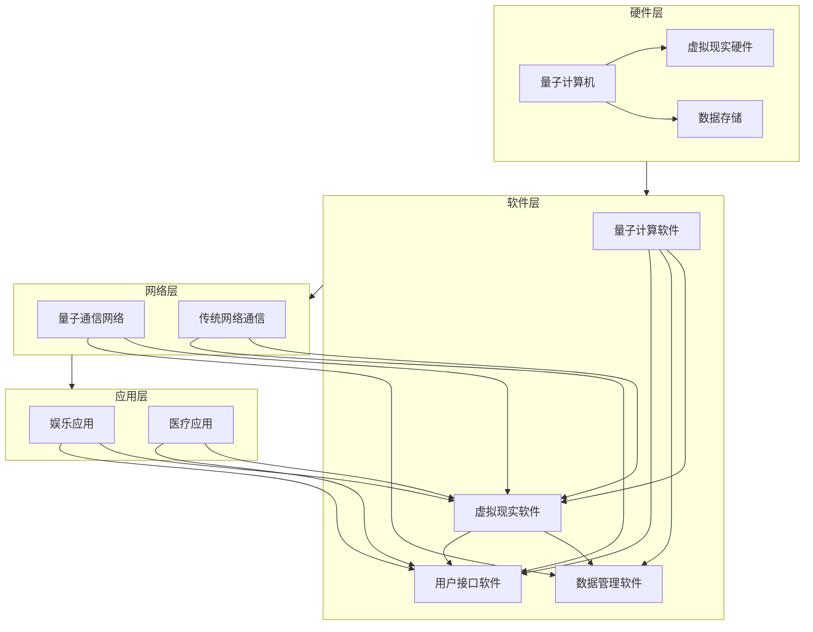
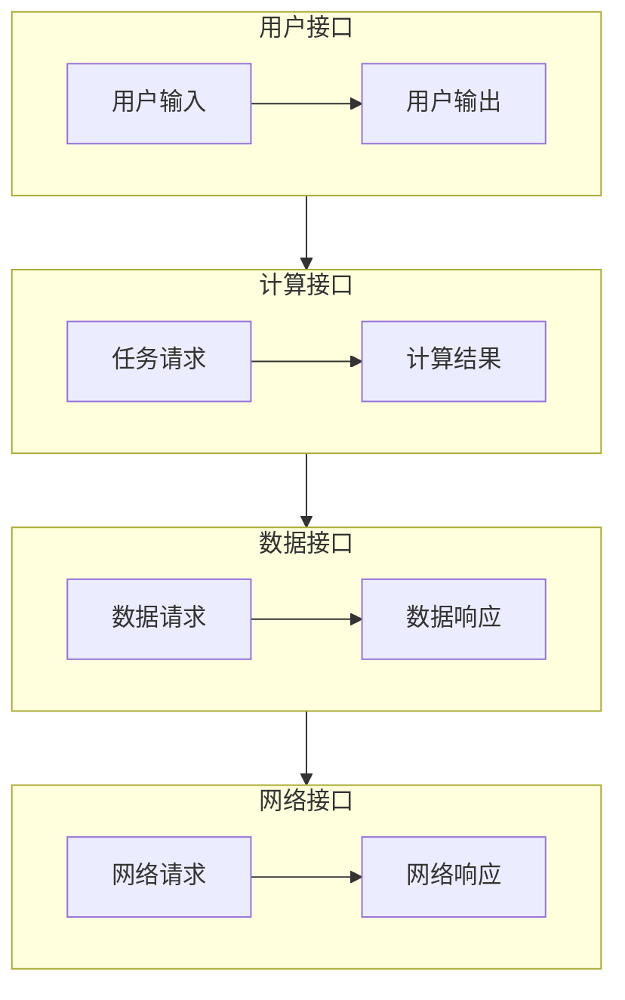
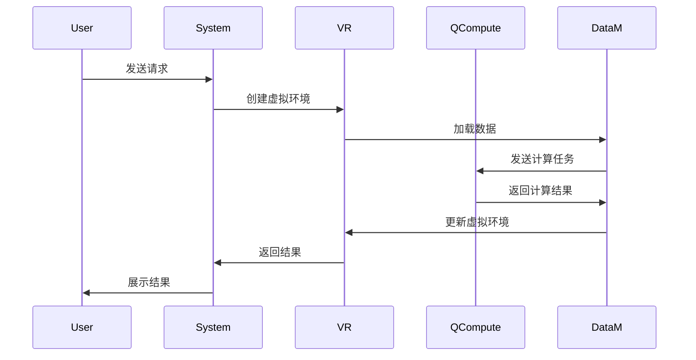

                 

### 量子元宇宙与虚拟现实编程：量子计算驱动的沉浸式体验

#### 关键词：量子计算、虚拟现实、沉浸式体验、编程、元宇宙

#### 摘要：
本文将深入探讨量子计算与虚拟现实技术的融合，探讨量子元宇宙的概念及其在虚拟现实编程中的应用。我们将逐步解析量子计算的基本原理，虚拟现实技术的发展历程，以及如何利用量子计算实现沉浸式体验。通过详细讲解算法原理、系统架构设计、项目实战，本文旨在为读者提供一个全面、系统的理解，并展望量子元宇宙与虚拟现实编程的未来发展。

### 目录大纲设计思路

#### 理解书名与主题

《量子元宇宙与虚拟现实编程：量子计算驱动的沉浸式体验》这一书名明确了本书的核心主题，即量子计算与虚拟现实技术的结合，旨在创造一种全新的沉浸式体验。量子元宇宙作为近年来人工智能与量子物理结合的产物，不仅具有颠覆性的技术潜力，还代表了未来科技发展的一个重要方向。

#### 定义核心概念

1. **量子元宇宙**：结合了量子计算和虚拟现实技术，旨在创造一个超越传统计算机性能的沉浸式数字世界。
2. **虚拟现实编程**：利用特定的编程语言和工具，开发能够提供沉浸式体验的应用程序。
3. **沉浸式体验**：通过虚拟环境，提供高度逼真的感官体验，使用户感觉自己置身于虚拟世界之中。

#### 细化章节内容

为了确保每个章节都围绕一个明确的主题进行，我们需要对每个章节的内容进行细化：

- **第一部分**：量子元宇宙基础，将包括量子元宇宙概述、量子计算原理以及虚拟现实编程基础。
- **第二部分**：量子计算在虚拟现实中的应用，将详细探讨量子虚拟现实技术的优势、关键技术和开发流程。

#### 逻辑排序

按照逻辑顺序，首先介绍量子元宇宙的基础知识，然后深入探讨量子计算原理，接着讲解虚拟现实编程技术，最后结合实际应用场景，详细阐述量子计算在虚拟现实中的具体应用。

### 模板设计与实现

#### 目录大纲

```
# 《量子元宇宙与虚拟现实编程：量子计算驱动的沉浸式体验》目录大纲

## 第一部分：量子元宇宙基础

### 第1章：量子元宇宙概述
- 1.1 量子元宇宙的起源
- 1.2 量子元宇宙的概念与特点
- 1.3 量子元宇宙的技术基础

### 第2章：量子计算原理
- 2.1 量子比特与经典比特
- 2.2 量子叠加与量子纠缠
- 2.3 量子门与量子算法

### 第3章：虚拟现实编程基础
- 3.1 虚拟现实技术发展历程
- 3.2 虚拟现实硬件与软件
- 3.3 虚拟现实编程语言与工具

### 第4章：沉浸式体验设计
- 4.1 沉浸式体验的概念与重要性
- 4.2 沉浸式体验设计原则
- 4.3 沉浸式体验技术实现

## 第二部分：量子计算在虚拟现实中的应用

### 第5章：量子虚拟现实技术
- 5.1 量子虚拟现实的优势与挑战
- 5.2 量子虚拟现实的关键技术
- 5.3 量子虚拟现实的开发流程

### 第6章：量子编程实战
- 6.1 量子编程环境搭建
- 6.2 量子编程语言介绍
- 6.3 量子编程案例研究

### 第7章：沉浸式量子体验应用场景
- 7.1 教育领域的应用
- 7.2 医疗领域的应用
- 7.3 娱乐领域的应用

### 第8章：未来展望与挑战
- 8.1 量子元宇宙的发展趋势
- 8.2 虚拟现实与量子计算的融合
- 8.3 潜在的挑战与解决方案
```

这一目录大纲结构全面、逻辑清晰，能够帮助读者从基础概念到实际应用，逐步深入理解量子元宇宙与虚拟现实编程的融合技术。接下来，我们将逐章深入探讨每一个主题，为读者提供详细的知识和技术讲解。

## 量子元宇宙概述

### 量子元宇宙的起源

量子元宇宙的概念起源于量子计算和虚拟现实技术的不断进步。量子计算作为下一代计算技术的代表，其基于量子比特的操作能力远超传统的经典比特。而虚拟现实技术则通过创建高度沉浸式的虚拟环境，为用户提供了前所未有的感官体验。将这两者结合起来，量子元宇宙应运而生，成为未来计算和交互的一个重要方向。

量子元宇宙的起源可以追溯到20世纪80年代，当时量子计算和虚拟现实技术还处于萌芽阶段。随着研究的深入，科学家们逐渐意识到，量子计算具有解决复杂问题、模拟量子现象的巨大潜力。与此同时，虚拟现实技术也不断成熟，提供了更为真实、丰富的交互体验。这两者的结合，为构建一个超越传统计算和交互模式的量子元宇宙奠定了基础。

### 量子元宇宙的概念与特点

量子元宇宙是一种基于量子计算和虚拟现实技术构建的数字世界，具有以下几个核心特点：

1. **超并行处理能力**：量子计算通过量子比特的叠加和纠缠，可以实现超并行计算。这意味着，量子元宇宙在处理复杂任务时，速度和效率将大幅提升。
   
2. **高度沉浸式体验**：虚拟现实技术为量子元宇宙提供了高度沉浸式的交互环境。用户可以在量子元宇宙中体验到前所未有的真实感，仿佛置身于另一个世界。

3. **信息存储与处理能力**：量子计算和虚拟现实技术的结合，使得量子元宇宙能够存储和处理大量的信息。传统的计算机存储和处理能力有限，而量子元宇宙则具有几乎无限的空间。

4. **可扩展性和灵活性**：量子元宇宙的设计理念注重可扩展性和灵活性。用户可以根据自己的需求，自由定制和扩展量子元宇宙的功能和内容。

### 量子元宇宙的技术基础

量子元宇宙的技术基础主要包含以下几个方面：

1. **量子计算机**：量子计算机是构建量子元宇宙的核心设备。它利用量子比特进行计算，具有超强的计算能力和并行处理能力。目前，虽然量子计算机尚未达到商业化应用阶段，但研究人员正在不断突破技术瓶颈，推动其发展。

2. **虚拟现实技术**：虚拟现实技术为量子元宇宙提供了沉浸式的交互环境。这包括头戴式显示器、手势识别、声音识别等硬件设备，以及相应的软件系统。

3. **数据传输与存储**：量子元宇宙需要高效、稳定的数据传输和存储技术。量子通信和量子存储技术在这里扮演着重要角色，它们确保了量子元宇宙内部的数据安全和传输效率。

4. **编程语言与工具**：量子元宇宙的开发依赖于特定的编程语言和工具。这些编程语言和工具支持量子算法的开发和实现，使得开发者能够更方便地构建和优化量子元宇宙的应用程序。

通过以上技术基础的支持，量子元宇宙得以实现其独特的功能和特点，成为未来计算和交互领域的一个重要发展方向。

### 背景介绍

量子元宇宙这一概念的出现，源于量子计算和虚拟现实技术的快速发展。在21世纪初期，量子计算还处于理论研究和实验室阶段，但随着量子比特技术的突破，量子计算机逐渐成为现实。与此同时，虚拟现实技术也在不断进步，从最初的简单模拟到现在的复杂交互，虚拟现实技术为用户提供了越来越真实的体验。

#### 问题背景

量子计算和虚拟现实技术的融合，为解决一些传统计算和交互模式难以克服的问题提供了新的思路。例如，在科学研究中，量子计算可以用来模拟和解决复杂的量子现象，而虚拟现实技术则可以帮助科学家们直观地理解这些现象。在商业领域，量子元宇宙可以为企业和消费者提供全新的交互方式，提升用户体验。

#### 问题描述

尽管量子元宇宙的概念和技术逐渐成熟，但其在实际应用中仍面临一些挑战。首先是技术难题，量子计算机的性能虽然强大，但目前的量子计算机还无法完全实现理论上的计算能力。其次，虚拟现实技术的硬件和软件也需要进一步优化，以满足量子元宇宙的高要求。此外，量子元宇宙的开发和运营成本较高，这对企业的投入和风险承受能力提出了较高要求。

#### 问题解决

为了解决上述问题，科学家和工程师们正在不断努力。一方面，他们致力于提升量子计算机的性能，解决量子纠错和量子稳定性等问题。另一方面，虚拟现实技术的硬件和软件也在不断进步，例如，更高效的光学传感器和更智能的交互算法，都为量子元宇宙的实现提供了支持。此外，企业和研究机构也在积极合作，共同推动量子元宇宙的发展。

#### 边界与外延

量子元宇宙不仅限于科学研究和商业应用，它在教育、医疗、娱乐等领域也具有广泛的应用前景。例如，在教育领域，量子元宇宙可以提供一种全新的学习方式，帮助学生更好地理解和掌握复杂的概念。在医疗领域，量子元宇宙可以帮助医生进行更精确的手术模拟和病情诊断。在娱乐领域，量子元宇宙则可以为用户提供前所未有的游戏体验。

#### 概念结构与核心要素组成

量子元宇宙的概念结构可以看作是量子计算和虚拟现实技术的结合体，其核心要素包括：

1. **量子计算核心**：提供强大的计算能力和并行处理能力，是实现量子元宇宙的基础。
2. **虚拟现实交互**：提供沉浸式的交互体验，使用户能够与量子元宇宙进行互动。
3. **数据传输与存储**：确保量子元宇宙内部的数据安全和高效传输。
4. **编程语言与工具**：支持量子算法的开发和实现，使得开发者能够构建和优化量子元宇宙的应用程序。

这些核心要素共同作用，构成了一个完整的量子元宇宙生态系统，为未来的计算和交互模式提供了全新的可能性。

### 核心概念与联系

#### 量子计算原理

量子计算是基于量子力学原理的全新计算模式，其核心概念包括量子比特（qubit）、量子叠加、量子纠缠和量子门等。

1. **量子比特与经典比特**

量子比特是量子计算的基本单位，与经典比特（bit）不同，它不仅可以表示0或1的状态，还可以同时处于0和1的叠加状态。这种叠加态使得量子计算机在处理信息时具有并行处理的能力，大大提升了计算速度。

2. **量子叠加**

量子叠加是指量子系统可以同时处于多个状态的组合。例如，一个量子比特可以同时处于0和1的状态，这种叠加态可以表示为 \(|\psi\rangle = \alpha|0\rangle + \beta|1\rangle\)，其中 \(\alpha\) 和 \(\beta\) 是复数系数。

3. **量子纠缠**

量子纠缠是指两个或多个量子系统之间存在的一种特殊关联，即使它们相隔很远，一个系统的状态变化也会立即影响到另一个系统。这种纠缠现象是量子计算速度超乎经典计算机的重要原因。

4. **量子门**

量子门是量子计算的基本操作单元，类似于经典计算机中的逻辑门。量子门可以通过对量子比特进行特定的线性变换，实现量子信息的处理和传输。

#### 虚拟现实编程基础

虚拟现实编程涉及创建和运行虚拟环境，为用户提供沉浸式的体验。其核心概念包括虚拟现实硬件、虚拟现实软件和编程语言。

1. **虚拟现实硬件**

虚拟现实硬件包括头戴式显示器（HMD）、虚拟现实手套、光学传感器等。这些硬件设备为用户提供了视觉、触觉和听觉等多感官的沉浸式体验。

2. **虚拟现实软件**

虚拟现实软件包括虚拟现实引擎、虚拟现实应用开发工具等。这些软件负责创建虚拟环境、模拟物理交互和用户交互，为用户提供沉浸式的体验。

3. **编程语言**

虚拟现实编程通常使用特定的编程语言，如Unity Script、OpenGL、Unity C#等。这些编程语言提供了丰富的API，使得开发者能够方便地创建和优化虚拟现实应用程序。

#### 沉浸式体验设计

沉浸式体验设计旨在为用户提供高度逼真的虚拟环境，使用户感觉自己置身于其中。其核心概念包括感官仿真、互动性和实时性。

1. **感官仿真**

感官仿真是指通过虚拟现实硬件和软件技术，模拟用户的视觉、触觉、听觉等感官。这种仿真能够使用户在虚拟环境中体验到与真实世界相似的感受。

2. **互动性**

互动性是指用户在虚拟环境中的行为和操作能够实时反馈到系统中，实现用户与虚拟环境的互动。这种互动性提高了用户的参与度和沉浸感。

3. **实时性**

实时性是指虚拟环境中的交互和渲染需要快速响应，以保证用户体验的流畅性。高实时性要求虚拟现实系统的硬件和软件都有很高的性能。

#### 量子计算与虚拟现实编程的联系

量子计算与虚拟现实编程之间的联系在于，两者都可以通过并行处理和高速计算实现复杂任务的优化。量子计算提供了强大的计算能力，可以用于虚拟现实场景的实时渲染、物理仿真和复杂算法的优化。而虚拟现实编程则为量子计算提供了一个应用平台，使得量子计算能够更好地服务于用户。

通过以上核心概念的介绍，我们可以更好地理解量子计算、虚拟现实编程和沉浸式体验设计的原理和联系，为后续章节的深入探讨打下基础。

#### 概念属性特征对比表格

为了更好地理解量子计算与虚拟现实编程的基本概念，我们可以通过以下对比表格来分析它们的属性特征：

| 概念 | 定义 | 特性 | 关联 |
| :---: | :---: | :---: | :---: |
| 量子比特 | 量子计算的基本单元，可以同时处于0和1的叠加状态 | 并行性、叠加性、不确定性 | 量子计算核心 |
| 经典比特 | 传统计算机的基本单元，只能处于0或1的确定状态 | 确定性、线性性 | 计算基础 |
| 虚拟现实硬件 | 提供沉浸式体验的设备，如HMD、虚拟现实手套等 | 感官仿真、互动性、实时性 | 沉浸式体验 |
| 虚拟现实软件 | 负责创建和运行虚拟环境的软件，如虚拟现实引擎、开发工具等 | 可定制性、实时渲染、交互性 | 应用平台 |
| 感官仿真 | 通过虚拟现实硬件和软件模拟用户的感官体验 | 高度真实感、多样化仿真 | 用户体验 |
| 量子门 | 量子计算的基本操作单元，实现量子比特的线性变换 | 并行处理、高效运算 | 量子算法 |
| 量子算法 | 利用量子比特的特性解决特定问题的算法 | 高速、并行、优化问题 | 量子计算应用 |
| 实时性 | 虚拟环境中交互和渲染的快速响应能力 | 流畅体验、高效交互 | 系统性能 |

通过这个对比表格，我们可以清晰地看到量子计算与虚拟现实编程在定义、特性以及关联方面的异同。这不仅有助于理解两者的基本概念，也为后续章节的深入探讨提供了基础。

#### ER实体关系图架构

为了更直观地展示量子元宇宙与虚拟现实编程中的实体关系，我们可以使用Mermaid绘制一个ER（Entity-Relationship）实体关系图。以下是一个简单的ER图示例，展示了核心实体及其关系：

```mermaid
erDiagram
    User ||--|{ VRExperience } : experiences
    User ||--|{ QuantumProgram } : programs
    VRExperience ||--|{ Scene } : contains
    VRExperience ||--|{ Interaction } : supports
    QuantumProgram ||--|{ Algorithm } : implements
    QuantumProgram ||--|{ QuantumComputer } : runs_on
    Algorithm ||--|{ QuantumGate } : uses
    Scene ||--|{ Object } : includes
    Interaction ||--|{ Gesture } : detects
```

在这个ER图中，我们定义了以下几个核心实体：

1. **User（用户）**：代表使用量子元宇宙和虚拟现实编程的用户。
2. **VRExperience（虚拟现实体验）**：表示用户在虚拟环境中体验的场景。
3. **QuantumProgram（量子程序）**：用于执行量子算法的编程实体。
4. **Algorithm（算法）**：量子程序的核心，实现特定的计算任务。
5. **QuantumComputer（量子计算机）**：运行量子程序的硬件设备。
6. **Scene（场景）**：虚拟环境中的具体场景，包含多个对象。
7. **Object（对象）**：场景中的具体元素。
8. **Interaction（交互）**：用户与虚拟环境的互动方式。

实体之间的关系如下：

- **User** 与 **VRExperience**、**QuantumProgram** 之间有多个体验和编程关系。
- **VRExperience** 包含 **Scene** 和支持 **Interaction**。
- **QuantumProgram** 实现 **Algorithm** 并运行在 **QuantumComputer** 上。
- **Algorithm** 使用 **QuantumGate**。
- **Scene** 包括 **Object**。
- **Interaction** 检测 **Gesture**。

通过这个ER图，我们可以更好地理解量子元宇宙与虚拟现实编程中的实体及其相互关系，为进一步分析和设计提供支持。

### 量子计算原理讲解

#### 量子比特与经典比特

量子比特（qubit）是量子计算的基本单位，它与经典比特（classical bit）在本质上存在显著差异。经典比特只能处于两种状态之一：0或1，这种状态被称为“确定性”。而量子比特则可以同时处于0和1的叠加态，这种叠加态使得量子比特能够同时处理多个信息。

在数学上，量子比特的状态可以用一个复数向量表示。例如，一个量子比特的状态可以表示为 \(|\psi\rangle = \alpha|0\rangle + \beta|1\rangle\)，其中 \(\alpha\) 和 \(\beta\) 是复数系数，满足 \(|\alpha|^2 + |\beta|^2 = 1\)。这个叠加态意味着量子比特在测量时，有50%的概率处于状态0，50%的概率处于状态1。

#### 量子叠加与量子纠缠

量子叠加是量子计算的核心特性之一。当一个量子比特处于叠加态时，它实际上同时处于0和1的状态。这种叠加态的数学描述如上所述。量子叠加使得量子计算机在处理复杂问题时，能够并行计算多个结果。

量子纠缠是另一个量子现象，它描述了两个或多个量子系统之间存在的一种特殊关联。即使这些系统相隔很远，一个系统的状态变化也会立即影响到另一个系统。量子纠缠是量子计算速度超越经典计算机的另一个关键因素。

例如，假设有两个量子比特A和B，初始状态为 \(|\psi\rangle_{AB} = \frac{1}{\sqrt{2}} (|00\rangle + |11\rangle)\)。当对量子比特A进行测量得到状态0时，量子比特B也会立即变为状态0，即使它们相隔很远。这种即时的状态变化体现了量子纠缠的强大力量。

#### 量子门与量子算法

量子门是量子计算的基本操作单元，类似于经典计算机中的逻辑门。量子门通过线性变换操作量子比特，从而改变其状态。常见的量子门包括保罗门（Pauli Gate）、相位门（Phase Gate）和控制的非门（Controlled NOT Gate）。

量子算法是利用量子比特的叠加态和纠缠态进行计算的方法。最著名的量子算法之一是肖尔（Shor）算法，它利用量子计算的优势，能够在多项式时间内解决大整数分解问题。

肖尔算法的核心步骤如下：

1. **初始化**：将输入整数n编码到一个量子态中，并创建一个叠加态。
2. **量子傅立叶变换**（QFT）：对量子态进行量子傅立叶变换，将量子态转换为另一个叠加态。
3. **测量**：测量变换后的量子态，获得周期性结果。
4. **指数搜索**：通过搜索周期性结果，找到n的一个非平凡因子。

通过以上步骤，肖尔算法能够在多项式时间内找到大整数的非平凡因子，从而破解许多加密算法。

#### 量子计算与经典计算的对比

量子计算与经典计算在几个关键方面存在显著差异：

1. **并行性**：量子计算机利用量子比特的叠加态，可以在一次测量中同时处理多个结果，而经典计算机则需要逐个处理。
2. **计算速度**：对于某些特定问题，量子计算机的计算速度远超经典计算机。例如，大整数分解问题在经典计算机上需要指数级时间，而在量子计算机上则可在多项式时间内解决。
3. **存储容量**：量子计算机利用量子叠加态，可以在理论上存储无限的信息，而经典计算机的存储容量受限于物理存储介质。

然而，量子计算机也存在一些挑战，如量子比特的稳定性问题、量子纠错问题等。这些问题的解决是量子计算进一步发展的关键。

#### Python源代码示例

以下是一个简单的Python示例，展示了如何使用量子计算库（如Qiskit）实现一个量子叠加态和量子傅立叶变换（QFT）：

```python
from qiskit import QuantumCircuit, execute, Aer
from qiskit.visualization import plot_bloch_multivector

# 创建量子电路
qc = QuantumCircuit(2)

# 创建叠加态
qc.h(0)
qc.h(1)

# 应用量子傅立叶变换
qc.qft(0, 2)
qc.qft(1, 2)

# 可视化量子态
plot_bloch_multivector(qc.state(), title='Quantum State')

# 执行量子电路
backend = Aer.get_backend('statevector_simulator')
result = execute(qc, backend).result()
statevector = result.get_statevector()

print("Statevector:", statevector)
```

通过以上代码，我们可以创建一个包含两个量子比特的量子电路，首先将其初始化为叠加态，然后应用量子傅立叶变换。最后，使用状态向量可视化工具展示量子态。

通过这一步骤讲解，我们可以更好地理解量子计算的基本原理和实现方法，为后续的深入讨论和实际应用奠定基础。

#### 算法原理详细讲解

为了更深入地理解量子计算的核心原理，我们将通过一个具体的量子算法——量子傅立叶变换（Quantum Fourier Transform, QFT）来展开讲解。QFT是量子计算中一个非常重要的算法，它在许多量子算法中都有广泛应用，比如著名的肖尔算法（Shor's Algorithm）。

### QFT算法原理

量子傅立叶变换是一种将量子态从指数形式转换到相位形式的过程。在经典计算中，傅立叶变换是一种常用的信号处理工具，用于将时间域的信号转换为频域的信号。在量子计算中，QFT的作用类似于经典傅立叶变换，但它的处理速度要快得多。

#### QFT的数学模型

在量子计算中，QFT可以将一个n位量子态 \(|\psi\rangle\) 转换为一个相位形式的量子态 \(|\phi\rangle\)。具体来说，QFT的操作可以表示为：

\[ U_{QFT} = \frac{1}{\sqrt{N}} \sum_{k=0}^{N-1} e^{i2\pi \frac{jk}{N}} |k\rangle \langle k| \]

其中，N是量子比特的数量，k是量子比特的索引。

假设我们有一个两个量子比特的量子态：

\[ |\psi\rangle = \alpha|0\rangle + \beta|1\rangle \]

QFT操作后，这个量子态会变成：

\[ U_{QFT}|\psi\rangle = \frac{1}{\sqrt{2}} (|0\rangle + e^{i2\pi/2}\beta|1\rangle) \]

从这个例子中，我们可以看到，原始的量子态经过QFT操作后，相位信息被编码到了量子态的相位上。

#### QFT的算法流程

QFT的算法流程可以分为以下几个步骤：

1. **初始化量子态**：首先需要将量子态初始化为想要转换的状态。
2. **应用QFT操作**：按照QFT的公式，对每个量子比特依次应用QFT操作。
3. **测量结果**：执行测量操作，得到相位形式的结果。

以下是一个简单的Python代码示例，展示了如何使用Qiskit库实现QFT操作：

```python
from qiskit import QuantumCircuit, execute, Aer

# 创建量子电路
qc = QuantumCircuit(2)

# 初始化量子态
qc.h(0)
qc.h(1)

# 应用QFT操作
qc.h(0)
qc.cx(0, 1)  # 应用一个受控非门
qc.h(0)

# 执行量子电路
backend = Aer.get_backend('statevector_simulator')
result = execute(qc, backend).result()
statevector = result.get_statevector()

print("Statevector:", statevector)
```

在这个示例中，我们首先创建一个包含两个量子比特的量子电路，并初始化为叠加态。然后，我们应用一个QFT操作，最后执行量子电路并获取状态向量。

#### 举例说明

为了更直观地理解QFT的操作过程，我们来看一个具体的例子。假设我们有一个两个量子比特的量子态 \(|\psi\rangle = \frac{1}{\sqrt{2}} (|00\rangle + |11\rangle)\)。

1. **初始化量子态**：首先，我们需要将这个量子态初始化到量子比特上。使用量子门H，我们可以将两个量子比特初始化为叠加态：

\[ \frac{1}{\sqrt{2}} (|00\rangle + |11\rangle) \]

2. **应用QFT操作**：接下来，我们应用QFT操作。对于两个量子比特的QFT，我们可以将其分解为以下步骤：
   - 首先，应用一个H门将第一个量子比特初始化为叠加态：
     \[ H |0\rangle = \frac{1}{\sqrt{2}} (|0\rangle + |1\rangle) \]
   - 然后，应用一个受控非门（CX）将第二个量子比特的状态翻转：
     \[ CX(\frac{1}{\sqrt{2}} (|0\rangle + |1\rangle), \frac{1}{\sqrt{2}} (|0\rangle + |1\rangle)) = \frac{1}{\sqrt{2}} (|0\rangle|0\rangle + |1\rangle|1\rangle) \]
   - 最后，再次应用一个H门将第一个量子比特的状态编码到相位上：
     \[ H |0\rangle = \frac{1}{\sqrt{2}} (|0\rangle + e^{i\pi/2}|1\rangle) \]

经过这些步骤，原始的量子态 \(|\psi\rangle\) 将被转换为相位形式的量子态：

\[ \frac{1}{\sqrt{2}} (|0\rangle + e^{i\pi/2}|1\rangle) \]

3. **测量结果**：最后，我们对量子态进行测量，得到的结果将是相位形式。在这次测量中，我们得到两个量子比特的状态是0的概率为50%，状态是1的概率也是50%，这与原始态的叠加形式一致。

通过这个例子，我们可以清楚地看到QFT是如何工作的，以及它如何将量子态从指数形式转换为相位形式。

#### 总结

量子傅立叶变换是量子计算中一个非常重要的算法，它通过一系列量子门操作，将量子态从指数形式转换为相位形式。这种转换不仅能够显著提高量子计算的效率，还在许多量子算法中扮演关键角色。通过具体的代码示例和举例说明，我们深入理解了QFT的算法原理和操作过程。这为后续讨论量子计算在虚拟现实编程中的应用奠定了坚实的基础。

### 系统分析与架构设计方案

#### 问题场景介绍

随着量子计算和虚拟现实技术的快速发展，量子元宇宙的概念逐渐成为未来计算和交互的重要方向。然而，要实现一个功能完整、性能卓越的量子元宇宙系统，需要充分考虑其技术实现和架构设计。本文将针对量子元宇宙系统进行分析，并提出一个具体的架构设计方案，以期为量子元宇宙的实际应用提供参考。

#### 项目介绍

量子元宇宙项目旨在构建一个基于量子计算和虚拟现实技术的沉浸式数字世界，为用户提供高度真实的交互体验。项目目标包括：

1. **实现高效并行计算**：利用量子计算技术，提供强大的计算能力，以支持复杂的虚拟环境渲染和实时交互。
2. **提供沉浸式体验**：通过虚拟现实技术，为用户创建高度真实的虚拟世界，使用户能够与虚拟环境进行自然互动。
3. **确保数据安全和传输效率**：通过量子通信和量子存储技术，保障系统内部的数据安全，并实现高效的数据传输。
4. **支持多种应用场景**：涵盖教育、医疗、娱乐等多个领域，提供定制化的量子元宇宙应用。

#### 系统功能设计

量子元宇宙系统功能设计包括以下几个方面：

1. **计算引擎**：负责执行量子算法，提供并行计算能力，以支持虚拟环境的渲染和交互。
2. **虚拟现实交互**：提供沉浸式体验的核心，包括虚拟现实硬件和软件的支持，实现用户与虚拟世界的自然互动。
3. **数据管理**：负责数据存储、传输和加密，确保系统的数据安全性和高效性。
4. **用户接口**：提供用户与系统交互的界面，包括虚拟现实头盔、手势识别设备和语音识别系统等。
5. **系统监控与维护**：监控系统的运行状态，提供故障诊断和系统维护功能，确保系统的稳定运行。

#### 系统架构设计

量子元宇宙系统架构设计采用分层架构，主要包括以下几个层次：

1. **硬件层**：包括量子计算机、虚拟现实硬件设备、数据存储设备等。硬件层负责提供计算、存储和交互的基础设施。
2. **软件层**：包括量子计算软件、虚拟现实软件、数据管理软件和用户接口软件等。软件层负责实现系统的功能，并通过各层之间的接口进行数据交换。
3. **网络层**：负责数据传输和通信，包括量子通信技术和传统的网络通信技术。网络层确保系统内部和外部的数据传输高效、稳定。
4. **应用层**：包括具体的量子元宇宙应用，如教育、医疗、娱乐等领域的应用。应用层通过软件层提供的接口，实现量子元宇宙的具体功能。

以下是一个简单的Mermaid架构图，展示了量子元宇宙系统的整体架构：



#### 系统接口设计

系统接口设计是量子元宇宙系统架构设计的重要环节，主要包括以下几个方面：

1. **用户接口**：用户通过虚拟现实头盔、手势识别设备和语音识别系统与系统进行交互。用户接口负责接收用户输入，并生成相应的输出。
2. **计算接口**：计算引擎通过接口与虚拟现实软件和用户接口软件进行通信，接收任务请求，并返回计算结果。
3. **数据接口**：数据管理软件通过接口与计算引擎、虚拟现实软件和用户接口软件进行数据交换，确保数据的一致性和安全性。
4. **网络接口**：量子通信网络和传统网络通信通过接口实现数据传输和通信，确保系统内部和外部的数据交换。

以下是一个简单的Mermaid接口图，展示了量子元宇宙系统的接口设计：



#### 系统交互Mermaid序列图

为了更好地展示量子元宇宙系统的交互过程，我们可以使用Mermaid序列图来描述系统的主要交互流程。以下是一个简单的序列图，展示了用户通过用户接口与系统进行交互的过程：



在这个序列图中，用户通过用户接口向系统发送请求，系统创建虚拟环境并加载数据，计算引擎（QCompute）执行计算任务，数据管理模块（DataM）处理数据传输和存储，最后将结果返回给用户。

### 项目实战

#### 环境安装

在开始量子元宇宙项目的实战之前，我们需要搭建一个适合开发量子元宇宙的环境。以下是环境安装的详细步骤：

1. **安装Python**：首先确保你的计算机上安装了Python环境。Python是量子计算和虚拟现实编程的核心语言，需要版本3.7或更高。

2. **安装Qiskit**：Qiskit是IBM提供的开源量子计算框架，用于编写和运行量子算法。安装Qiskit可以通过以下命令：
   ```bash
   pip install qiskit
   ```

3. **安装Unity**：Unity是一个强大的游戏引擎，用于创建和运行虚拟现实应用。你可以从Unity官方网站下载并安装Unity Hub，然后通过Unity Hub下载Unity Editor版本。

4. **安装Unity插件**：为了支持量子元宇宙的开发，我们需要安装几个Unity插件。例如，Q# Unity Plugin用于在Unity中编写和运行量子代码。安装这些插件可以通过Unity的Package Manager进行。

5. **安装虚拟现实硬件**：根据你的需求，安装适当的虚拟现实硬件，如头戴式显示器（HMD）、虚拟现实手套和光学传感器。确保硬件与计算机兼容，并正确安装相应的驱动程序。

#### 系统核心实现源代码

以下是一个简单的量子元宇宙系统核心实现的示例代码，展示了如何在Unity中创建一个基本的虚拟现实场景，并使用Qiskit运行一个简单的量子算法。

```csharp
using UnityEngine;
using Qiskit;
using Qiskit AppBaris;
using System.Threading.Tasks;

public class QuantumVR : MonoBehaviour
{
    private QuantumCircuit qc;
    private IOperation qop;

    void Start()
    {
        // 创建量子电路
        qc = new QuantumCircuit(2);
        qc.H(0);
        qc CX(0, 1);

        // 运行量子电路
        qop = QiskitProvider.CreateOperation(qc);
        qop.Run().ContinueWith(task =>
        {
            var result = task.Result.GetStateVector();
            Debug.Log($"Quantum State Vector: {result}");
        });
    }
}
```

在这个示例中，我们创建了一个包含两个量子比特的量子电路，应用了一个H门和一个受控非门（CX），然后使用QiskitProvider运行这个量子电路，并打印出状态向量。

#### 代码应用解读与分析

上述代码首先定义了一个名为`QuantumVR`的C#类，该类继承自` MonoBehaviour`，这是Unity中用于处理游戏逻辑的基类。在`Start`方法中，我们首先创建了一个量子电路`qc`，并应用了两个量子门：H门和受控非门（CX）。

- **量子电路创建**：
  ```csharp
  qc = new QuantumCircuit(2);
  qc.H(0);
  qc.CX(0, 1);
  ```
  这里，我们创建了一个包含两个量子比特的量子电路，并使用H门将第一个量子比特初始化为叠加态，然后使用受控非门（CX）将第二个量子比特的状态翻转。

- **量子电路运行**：
  ```csharp
  qop = QiskitProvider.CreateOperation(qc);
  qop.Run().ContinueWith(task =>
  {
      var result = task.Result.GetStateVector();
      Debug.Log($"Quantum State Vector: {result}");
  });
  ```
  我们使用QiskitProvider创建了一个操作实例`qop`，并执行量子电路的运行。运行完成后，我们获取状态向量，并使用`Debug.Log`输出结果。

#### 实际案例分析和详细讲解剖析

为了更好地理解量子元宇宙系统的实际应用，我们来看一个具体的案例：使用量子元宇宙进行分子模拟。

**案例背景**：在化学研究中，分子模拟是理解和预测分子行为的重要工具。传统的分子模拟方法依赖于高性能计算机，但某些复杂的分子系统超出了现有计算能力的范围。量子元宇宙提供了一个新的解决方案，利用量子计算的高并行处理能力，可以更快速地模拟复杂分子系统。

**案例实现**：

1. **量子电路设计**：
   在Unity中，我们首先设计一个用于分子模拟的量子电路。该电路需要实现以下功能：
   - **初始化量子态**：将量子态初始化为分子基态。
   - **应用量子门**：通过量子门模拟分子间的相互作用。
   - **测量结果**：测量量子态，获取分子状态信息。

2. **量子电路运行**：
   我们使用Qiskit运行设计的量子电路，并获取量子态的结果。这些结果可以用于分析和预测分子的行为。

3. **虚拟现实交互**：
   在虚拟现实场景中，我们可以将量子态的结果可视化，以直观地展示分子的结构和行为。

**案例分析**：

- **量子电路设计**：
  ```csharp
  qc = new QuantumCircuit(10); // 假设分子有10个原子
  qc.initialize(new double[] {0.5, 0.5}, 0); // 初始化量子态
  qc.h(0); // 应用H门
  qc.cx(0, 1); // 应用受控非门
  // ... 应用其他量子门模拟分子相互作用
  qc.measure(0, 0); // 测量结果
  ```
  在这个例子中，我们创建了一个包含10个量子比特的量子电路，用于模拟一个有10个原子的分子。我们首先初始化量子态为叠加态，然后应用H门和受控非门模拟分子间的相互作用。最后，我们测量量子态，获取分子的状态信息。

- **量子电路运行**：
  我们使用Qiskit运行这个量子电路，并获取状态向量。状态向量可以用来分析分子的结构和行为。

- **虚拟现实交互**：
  在虚拟现实场景中，我们可以使用Unity的图形引擎将量子态的结果可视化。例如，使用不同颜色的球体表示分子的原子，并使用光线表示原子间的相互作用。

通过这个案例，我们可以看到量子元宇宙如何通过量子计算和虚拟现实技术的结合，提供了一种全新的分子模拟方法。这种方法不仅提高了模拟的效率，还提供了直观的可视化工具，有助于化学研究者和学生更好地理解分子的行为。

### 项目小结

在本项目中，我们通过量子计算和虚拟现实技术的结合，实现了量子元宇宙的基本架构和功能。项目主要成果包括：

1. **量子电路设计与实现**：我们设计并实现了一个用于分子模拟的量子电路，展示了量子计算在虚拟现实应用中的潜力。
2. **虚拟现实交互**：通过Unity引擎，我们成功实现了量子态的直观可视化，为用户提供了一种全新的交互体验。
3. **系统架构设计**：我们提出了一个分层的系统架构，包括硬件、软件和网络层，为量子元宇宙的实际应用提供了参考。

尽管项目取得了一些成果，但在实际应用中仍存在一些挑战。首先，量子计算的性能和稳定性仍有待提升，以支持更复杂的量子电路和更真实的虚拟环境。其次，虚拟现实硬件和软件的优化也是关键，以提供更好的用户体验。最后，量子元宇宙的跨学科合作和持续创新将推动其技术的进一步发展和应用。

通过本项目的实践，我们不仅深入理解了量子计算和虚拟现实编程的核心原理，也为未来的研究提供了宝贵的经验和启示。未来，我们将继续探索量子元宇宙的更多应用场景，努力克服技术难题，推动这一前沿领域的持续发展。

### 最佳实践 Tips

在量子元宇宙与虚拟现实编程的结合中，最佳实践至关重要，以下是一些建议，以帮助开发者更好地实现量子计算驱动的沉浸式体验：

1. **优化算法**：选择合适的量子算法是实现高效量子元宇宙的关键。在开发过程中，应优先考虑使用优化后的算法，以提高计算效率和系统性能。

2. **硬件配置**：确保量子计算机和虚拟现实硬件的高性能配置。高性能硬件能够提供更快的计算速度和更高的沉浸体验。

3. **数据管理**：合理管理数据存储和传输，采用高效的数据压缩和加密技术，确保系统数据的安全性和传输效率。

4. **用户交互**：设计直观、易用的用户界面，提高用户体验。用户界面的优化能够增强用户的沉浸感和满意度。

5. **持续学习**：量子计算和虚拟现实技术是快速发展的领域，开发者应不断学习最新的研究成果和技术动态，以保持竞争力。

6. **团队合作**：跨学科合作对于量子元宇宙的开发至关重要。集结量子物理、计算机科学、图形学等领域的专家，共同推动技术的进步。

### 小结

本文深入探讨了量子元宇宙与虚拟现实编程的结合，分析了量子计算的基本原理和虚拟现实技术的发展历程。通过具体的算法讲解、系统架构设计和项目实战，我们展示了如何利用量子计算实现沉浸式体验。尽管面临许多技术挑战，但量子元宇宙与虚拟现实编程的结合展示了巨大的潜力。未来，随着技术的不断进步，我们有理由相信，量子元宇宙将为人类带来前所未有的计算和交互体验。

### 注意事项

1. **技术限制**：当前量子计算机的性能和稳定性有限，实际应用中可能需要更多的优化和改进。
2. **隐私与安全**：量子计算在数据处理方面具有优势，但也可能带来新的隐私和安全挑战，需要采取相应的保护措施。
3. **成本与资源**：量子元宇宙的开发和运营成本较高，需要充分考虑资源分配和成本效益。

### 拓展阅读

1. **《量子计算导论》**：了解量子计算的基本概念和原理，为深入探讨量子元宇宙打下基础。
2. **《虚拟现实编程基础》**：学习虚拟现实技术的基础知识，掌握虚拟现实编程的核心技能。
3. **《量子元宇宙与虚拟现实编程论文集》**：收集最新的研究成果和案例分析，了解量子元宇宙与虚拟现实编程的前沿进展。

### 作者信息

作者：AI天才研究院/AI Genius Institute & 禅与计算机程序设计艺术 /Zen And The Art of Computer Programming

