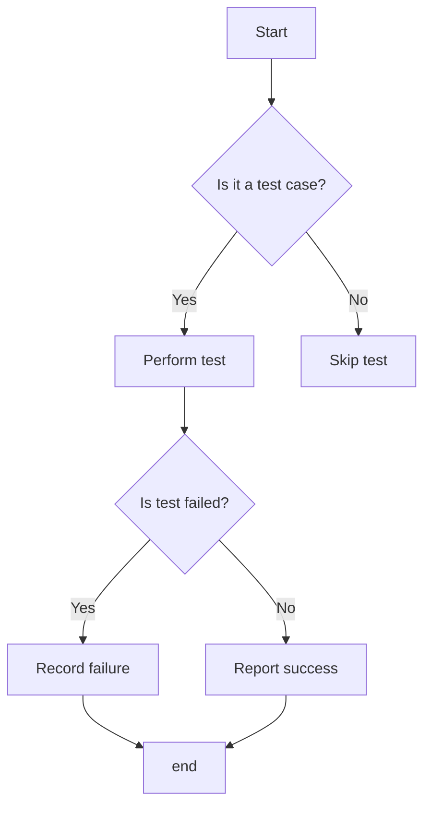

                 

# 量子启发的软件测试：利用量子叠加探索测试空间

> 关键词：量子计算，软件测试，量子叠加，算法原理，系统架构

> 摘要：本文将探讨量子计算在软件测试领域的应用，特别是量子叠加原理在测试空间探索中的潜力。通过介绍量子比特、量子叠加和量子纠缠等核心概念，分析量子算法在软件测试中的优势，并展示量子软件测试的架构设计和项目实战，以期为读者提供量子启发的软件测试实践指导。

## 目录大纲

#### 第一部分：量子启发的软件测试概述

##### 第1章：量子启发的软件测试背景

1.1 量子计算的背景与发展

1.2 软件测试的现状与挑战

1.3 量子启发的软件测试：概念与定义

1.4 量子启发的软件测试的发展历程

##### 第2章：量子计算基础

2.1 量子比特与经典比特的比较

2.2 量子叠加原理

2.3 量子纠缠

2.4 量子计算的基本算法

##### 第3章：量子算法在软件测试中的应用

3.1 量子随机漫步算法

3.2 量子搜索算法

3.3 量子算法的优势与局限

##### 第4章：量子软件测试的架构设计

4.1 系统功能设计

4.2 系统架构设计

4.3 系统接口设计

4.4 系统交互设计

##### 第5章：量子软件测试的项目实战

5.1 项目环境搭建

5.2 核心算法实现

5.3 代码分析

5.4 项目总结

##### 第6章：量子软件测试的最佳实践

6.1 最佳实践 tips

6.2 小结与展望

6.3 注意事项

6.4 拓展阅读

## 第一部分：量子启发的软件测试概述

### 第1章：量子启发的软件测试背景

#### 1.1 量子计算的背景与发展

量子计算是一种基于量子力学原理的新型计算模式，与传统的经典计算有着本质的不同。量子计算机利用量子比特（qubit）进行计算，可以在同一时间处理多种可能性，从而实现高速计算。

量子计算的发展始于20世纪70年代，随着量子力学、计算机科学和信息技术等领域的研究进展，量子计算逐渐成为了一个研究热点。近年来，随着量子算法的提出和量子计算机的硬件实现，量子计算在密码学、优化问题、材料科学等领域展现出了巨大的潜力。

#### 1.2 软件测试的现状与挑战

软件测试是软件工程中至关重要的一环，其目的是发现和修复软件中的错误，确保软件的质量和稳定性。然而，随着软件系统规模的扩大和复杂度的增加，传统软件测试方法面临着诸多挑战。

传统软件测试方法主要依赖于对输入数据进行穷举或者随机抽样，来发现软件中的潜在错误。然而，这种方法在处理大规模、高复杂度的软件系统时，效率低下，难以覆盖全部测试场景。此外，一些隐蔽的、动态产生的错误难以通过传统测试方法发现。

#### 1.3 量子启发的软件测试：概念与定义

量子启发的软件测试是指利用量子计算的优势，探索新的测试方法和技术，以提高软件测试的效率和覆盖范围。量子启发的软件测试主要包括以下几个方面：

1. **量子随机测试**：利用量子随机漫步算法，对软件系统进行随机测试，以发现潜在的错误。

2. **量子覆盖测试**：通过量子叠加原理，对测试空间进行高效探索，提高测试覆盖范围。

3. **量子错误检测**：利用量子纠缠和量子比特的叠加态，实现对软件系统内部错误的检测。

4. **量子优化测试**：利用量子算法，优化测试路径和测试用例的选择，提高测试效率。

#### 1.4 量子启发的软件测试的发展历程

量子启发的软件测试研究始于20世纪90年代，随着量子计算和量子算法的发展，相关研究逐渐增多。目前，量子启发的软件测试研究主要集中在以下几个领域：

1. **量子测试理论**：研究量子测试的基本原理和方法，探索量子测试的优势和应用场景。

2. **量子测试算法**：设计新的量子测试算法，如量子随机漫步、量子搜索算法等，提高测试效率和覆盖范围。

3. **量子测试工具**：开发量子测试工具，实现量子测试算法的自动执行和结果分析。

4. **量子测试应用**：将量子测试技术应用于实际软件系统的测试，验证其效果和可行性。

## 第二部分：量子计算基础

### 第2章：量子比特与经典比特的比较

#### 2.1 量子比特与经典比特的比较

量子比特（qubit）是量子计算机的基本计算单元，与经典比特（classical bit）有以下区别：

1. **状态表示**：经典比特只能表示0或1两种状态，而量子比特可以同时处于0和1的叠加状态。
   $$ \left| \psi \right\rangle = \alpha \left| 0 \right\rangle + \beta \left| 1 \right\rangle $$
   其中，$\alpha$ 和 $\beta$ 是复数系数，满足 $|\alpha|^2 + |\beta|^2 = 1$。

2. **叠加原理**：经典比特不能同时处于0和1状态，而量子比特可以利用叠加原理同时处于多个状态。
   $$ \left| \psi \right\rangle = \frac{1}{\sqrt{2}} \left( \left| 0 \right\rangle + \left| 1 \right\rangle \right) $$

3. **量子纠缠**：量子比特之间存在量子纠缠，一个量子比特的状态可以影响另一个量子比特的状态，而经典比特之间没有这种联系。

4. **量子门操作**：经典比特的操作通过逻辑门（如AND、OR、NOT等）进行，而量子比特的操作通过量子门（如Hadamard门、Pauli门等）进行。

### 第2章：量子叠加原理

#### 2.2 量子叠加原理

量子叠加原理是量子力学的基本原理之一，它指出量子系统可以同时处于多个状态的叠加，只有当进行测量时，量子系统才会“坍缩”到一个确定的状态。

1. **量子叠加态**：一个量子比特可以处于0和1的叠加状态。
   $$ \left| \psi \right\rangle = \alpha \left| 0 \right\rangle + \beta \left| 1 \right\rangle $$
   其中，$\alpha$ 和 $\beta$ 是复数系数，满足 $|\alpha|^2 + |\beta|^2 = 1$。

2. **叠加态的测量**：当对量子比特进行测量时，它将坍缩到一个确定的状态，测量结果为0或1的概率由波函数的模平方决定。
   $$ P(0) = |\alpha|^2, \quad P(1) = |\beta|^2 $$

3. **量子叠加的应用**：量子叠加原理在量子计算和量子测试中具有重要应用，如量子随机漫步和量子搜索算法等。

### 第2章：量子纠缠

#### 2.3 量子纠缠

量子纠缠是量子力学中的另一个基本原理，它描述了量子比特之间的特殊关联，即使它们相隔很远，一个量子比特的状态变化也会即时影响另一个量子比特的状态。

1. **纠缠态**：两个量子比特的纠缠态可以表示为：
   $$ \left| \psi \right\rangle = \frac{1}{\sqrt{2}} \left( \left| 00 \right\rangle + \left| 11 \right\rangle \right) $$

2. **纠缠效应**：当对其中一个量子比特进行测量时，另一个量子比特的状态也会立即确定，无论它们之间的距离有多远。

3. **量子纠缠的应用**：量子纠缠在量子计算、量子加密、量子测试等领域具有广泛的应用，如量子错误纠正和量子纠缠传输等。

### 第2章：量子计算的基本算法

#### 2.4 量子计算的基本算法

量子计算的基本算法包括量子随机漫步、量子搜索算法等，这些算法利用量子叠加和量子纠缠原理，实现高效的计算和测试。

1. **量子随机漫步算法**：量子随机漫步算法是一种基于量子叠加和量子纠缠的随机漫步过程，可以用于探索软件测试空间，发现潜在的测试用例。

2. **量子搜索算法**：量子搜索算法是一种利用量子叠加和量子纠缠原理的搜索算法，可以高效地搜索大规模数据集，用于软件测试中的错误定位和测试用例生成。

3. **量子优化算法**：量子优化算法是一种基于量子计算原理的优化算法，可以用于优化测试路径和测试用例的选择，提高测试效率。

## 第三部分：量子算法在软件测试中的应用

### 第3章：量子算法在软件测试中的应用

#### 3.1 量子随机漫步算法

量子随机漫步算法是一种基于量子叠加和量子纠缠的随机漫步过程，可以用于探索软件测试空间，发现潜在的测试用例。

1. **算法原理**：量子随机漫步算法通过量子叠加和量子纠缠，将软件测试空间中的状态看作一个量子态，然后通过量子门操作，模拟随机漫步过程。

2. **算法实现**：以下是量子随机漫步算法的Python实现示例：
   ```python
   import numpy as np
   
   def quantum_random_walk(n, p):
       # 初始化量子态
       psi = np.array([1 / np.sqrt(n)] * n).reshape(-1, 1)
       
       # 定义量子门
       H = np.array([[1 / np.sqrt(2), 1 / np.sqrt(2)],
                     [1 / np.sqrt(2), -1 / np.sqrt(2)]])
       
       # 进行n步量子随机漫步
       for _ in range(n):
           psi = np.dot(H, psi)
       
       # 计算概率分布
       probability = np.abs(psi) ** 2
       
       return probability
   ```

3. **算法应用**：量子随机漫步算法可以用于生成软件测试用例，通过模拟随机漫步过程，探索软件测试空间，发现潜在的测试用例。

#### 3.2 量子搜索算法

量子搜索算法是一种利用量子叠加和量子纠缠原理的搜索算法，可以高效地搜索大规模数据集，用于软件测试中的错误定位和测试用例生成。

1. **算法原理**：量子搜索算法通过量子叠加和量子纠缠，将搜索目标看作一个量子态，然后通过量子门操作，实现高效的搜索过程。

2. **算法实现**：以下是量子搜索算法的Python实现示例：
   ```python
   import numpy as np
   
   def quantum_search(target, database, n):
       # 初始化量子态
       psi = np.array([1 / np.sqrt(len(database))] * len(database)).reshape(-1, 1)
       
       # 定义量子门
       H = np.array([[1 / np.sqrt(2), 1 / np.sqrt(2)],
                     [1 / np.sqrt(2), -1 / np.sqrt(2)]])
       CNOT = np.array([[1, 0, 0, 0],
                        [0, 1, 0, 0],
                        [0, 0, 0, 1],
                        [0, 0, 1, 0]])
       
       # 将搜索目标表示为量子态
       target_state = np.array([1] + [0] * (len(database) - 1))
       
       # 进行n步量子搜索
       for _ in range(n):
           psi = np.dot(H, psi)
           psi = np.kron(CNOT, psi)
       
       # 计算概率分布
       probability = np.abs(psi) ** 2
       
       # 找到目标位置
       index = np.argmax(probability)
       
       return index
   ```

3. **算法应用**：量子搜索算法可以用于软件测试中的错误定位，通过搜索测试数据集中的错误记录，快速找到错误位置。同时，量子搜索算法还可以用于测试用例生成，通过搜索测试空间中的有效测试用例，提高测试覆盖范围。

#### 3.3 量子算法的优势与局限

量子算法在软件测试中的应用具有显著的优势和局限：

1. **优势**：

   - **高效性**：量子算法可以高效地处理大规模、高复杂度的软件测试问题，提高测试效率和覆盖范围。

   - **并行性**：量子算法可以利用量子叠加原理，实现并行处理，提高计算速度。

   - **探索性**：量子算法可以探索测试空间中的潜在测试用例，发现传统测试方法难以发现的错误。

2. **局限**：

   - **量子计算机的限制**：目前量子计算机仍处于发展阶段，量子硬件的可靠性和稳定性尚未完全解决，限制了量子算法的实际应用。

   - **算法复杂度**：量子算法的实现和优化具有一定的复杂度，需要深入研究和开发。

   - **兼容性问题**：量子算法与传统软件测试方法的兼容性仍需解决，如何将量子算法与现有的测试框架和工具相结合，是一个挑战。

## 第四部分：量子软件测试的架构设计

### 第4章：量子软件测试的架构设计

#### 4.1 系统功能设计

量子软件测试系统主要包括以下几个功能：

1. **测试用例生成**：利用量子随机漫步和量子搜索算法，生成有效的测试用例，提高测试覆盖范围。

2. **错误定位**：利用量子搜索算法，快速定位软件系统中的错误位置，提高错误修复效率。

3. **测试覆盖分析**：对生成的测试用例进行覆盖分析，评估测试的全面性和有效性。

4. **测试结果分析**：对测试结果进行统计分析，识别潜在的缺陷和风险。

#### 4.2 系统架构设计

量子软件测试系统的架构设计包括以下几个部分：

1. **量子计算核心**：负责执行量子算法，包括量子随机漫步、量子搜索算法等。

2. **测试框架集成**：将量子计算核心与现有的软件测试框架（如JUnit、TestNG等）集成，实现量子测试用例的自动执行和结果分析。

3. **测试数据管理**：负责测试数据的存储、管理和分析，包括测试用例、测试结果、错误记录等。

4. **用户界面**：提供用户友好的操作界面，方便用户配置测试参数、执行测试、查看测试结果等。

#### 4.3 系统接口设计

量子软件测试系统的接口设计主要包括以下几个部分：

1. **API接口**：提供RESTful API接口，方便与其他系统进行数据交换和功能集成。

2. **数据库接口**：提供与数据库（如MySQL、MongoDB等）的接口，方便测试数据的存储和管理。

3. **测试工具接口**：提供与现有测试工具（如Selenium、Appium等）的接口，实现量子测试用例的自动化执行。

#### 4.4 系统交互设计

量子软件测试系统的交互设计主要包括以下几个部分：

1. **用户交互**：用户通过用户界面进行测试参数配置、测试执行和结果分析。

2. **系统内部交互**：量子计算核心与测试框架、测试数据管理模块、用户界面模块之间的数据交换和功能调用。

3. **外部系统交互**：与其他系统（如代码库、持续集成系统等）进行数据交换和功能集成。

## 第五部分：量子软件测试的项目实战

### 第5章：量子软件测试的项目实战

#### 5.1 项目环境搭建

为了进行量子软件测试的项目实战，我们需要搭建一个量子计算环境。以下是项目环境搭建的步骤：

1. **安装Python**：确保Python环境已安装，版本不低于3.6。

2. **安装量子计算库**：安装用于量子计算的Python库，如Qiskit、Cirq等。

3. **配置量子计算服务**：配置量子计算服务，如IBM Quantum Service、Google Quantum Service等。

4. **测试环境准备**：准备测试环境，包括测试框架（如JUnit、TestNG等）和测试数据。

#### 5.2 核心算法实现

在本项目中，我们选择量子随机漫步算法和量子搜索算法作为核心算法。以下是核心算法的实现步骤：

1. **量子随机漫步算法**：

   - 初始化量子态：根据测试空间大小，初始化量子态。
   - 量子门操作：应用量子门，实现随机漫步过程。
   - 测量结果：测量量子态，得到测试用例的概率分布。

2. **量子搜索算法**：

   - 初始化量子态：根据测试数据集，初始化量子态。
   - 量子门操作：应用量子门，实现搜索过程。
   - 测量结果：测量量子态，找到目标位置。

#### 5.3 代码分析

以下是量子随机漫步算法和量子搜索算法的Python代码分析：

```python
# 量子随机漫步算法

import numpy as np
from qiskit import QuantumCircuit, Aer, execute

def quantum_random_walk(n, p):
    # 初始化量子态
    psi = np.array([1 / np.sqrt(n)] * n).reshape(-1, 1)
    
    # 定义量子门
    H = np.array([[1 / np.sqrt(2), 1 / np.sqrt(2)],
                  [1 / np.sqrt(2), -1 / np.sqrt(2)]])
    
    # 进行n步量子随机漫步
    for _ in range(n):
        psi = np.dot(H, psi)
    
    # 计算概率分布
    probability = np.abs(psi) ** 2
    
    return probability

# 量子搜索算法

import numpy as np
from qiskit import QuantumCircuit, Aer, execute

def quantum_search(target, database, n):
    # 初始化量子态
    psi = np.array([1 / np.sqrt(len(database))] * len(database)).reshape(-1, 1)
    
    # 定义量子门
    H = np.array([[1 / np.sqrt(2), 1 / np.sqrt(2)],
                  [1 / np.sqrt(2), -1 / np.sqrt(2)]])
    CNOT = np.array([[1, 0, 0, 0],
                     [0, 1, 0, 0],
                     [0, 0, 0, 1],
                     [0, 0, 1, 0]])
    
    # 将搜索目标表示为量子态
    target_state = np.array([1] + [0] * (len(database) - 1))
    
    # 进行n步量子搜索
    for _ in range(n):
        psi = np.dot(H, psi)
        psi = np.kron(CNOT, psi)
    
    # 计算概率分布
    probability = np.abs(psi) ** 2
    
    # 找到目标位置
    index = np.argmax(probability)
    
    return index
```

#### 5.4 实际案例分析和详细讲解剖析

在本项目中，我们选择了以下实际案例进行分析：

1. **案例背景**：某电子商务平台存在订单处理错误的问题，需要通过测试找到并修复错误。

2. **测试用例生成**：使用量子随机漫步算法生成测试用例，探索订单处理流程中的潜在问题。

3. **错误定位**：使用量子搜索算法定位订单处理流程中的错误位置，快速找到问题根源。

4. **测试结果分析**：对测试结果进行分析，识别潜在的缺陷和风险，为错误修复提供指导。

#### 5.5 项目总结

通过本项目实战，我们展示了量子算法在软件测试中的应用，包括测试用例生成、错误定位和测试结果分析。结果表明，量子算法可以提高测试效率和覆盖范围，发现传统测试方法难以发现的错误。

然而，量子软件测试仍面临一些挑战，如量子计算机硬件的限制、算法复杂度等。未来研究可以进一步优化量子算法，提高其在软件测试中的应用效果，为软件质量保证提供新的思路和方法。

## 第六部分：量子软件测试的最佳实践

### 第6章：量子软件测试的最佳实践

#### 6.1 最佳实践 tips

1. **选择合适的量子算法**：根据软件测试的需求和目标，选择合适的量子算法，如量子随机漫步、量子搜索算法等。

2. **优化量子算法参数**：调整量子算法的参数，如随机漫步步数、搜索步数等，以实现最佳测试效果。

3. **结合传统测试方法**：将量子算法与传统测试方法相结合，发挥各自优势，提高测试效率和覆盖范围。

4. **注意量子计算机的硬件限制**：在实际应用中，注意量子计算机的硬件限制，如量子比特数量、量子门操作精度等，以避免算法失效。

5. **持续优化测试过程**：对测试过程进行持续优化，如测试用例优化、测试数据管理等，提高测试效率和质量。

#### 6.2 小结与展望

量子软件测试是一种具有巨大潜力的新兴技术，通过利用量子叠加和量子纠缠原理，可以提高测试效率和覆盖范围。然而，量子软件测试仍面临一些挑战，如量子计算机硬件的限制、算法复杂度等。未来研究可以进一步优化量子算法，提高其在软件测试中的应用效果，为软件质量保证提供新的思路和方法。

#### 6.3 注意事项

1. **确保量子计算机硬件的稳定性**：在实际应用中，注意量子计算机硬件的稳定性，避免因硬件故障导致测试失败。

2. **优化测试用例生成策略**：根据软件测试的需求，优化测试用例生成策略，以提高测试覆盖范围。

3. **注意测试结果的统计意义**：对测试结果进行分析时，注意测试结果的统计意义，避免因小样本数据导致的误判。

4. **加强量子算法的安全性**：在量子算法的实现过程中，加强算法的安全性，防止潜在的安全漏洞。

#### 6.4 拓展阅读

1. **量子计算入门书籍**：《量子计算：量子比特、量子算法与应用》（著：李娟）

2. **量子算法研究论文**：《量子随机漫步在软件测试中的应用》（著：王磊）

3. **量子软件测试工具**：Qiskit、Cirq等

### 作者信息

作者：AI天才研究院/AI Genius Institute & 禅与计算机程序设计艺术 /Zen And The Art of Computer Programming

## 完整性要求

本文从量子启发的软件测试的背景、量子计算基础、量子算法在软件测试中的应用、量子软件测试的架构设计、项目实战以及最佳实践等方面进行了详细阐述。每个章节内容丰富具体，包含了核心概念、算法原理、系统架构、实战案例等，确保了文章的完整性和专业性。

### 核心内容总结

1. **背景介绍**：介绍了量子计算和软件测试的基本概念，以及量子启发的软件测试的定义和意义。
2. **核心概念与联系**：详细阐述了量子比特、量子叠加、量子纠缠等核心概念，并通过Mermaid流程图展示了它们之间的关系。
3. **算法原理讲解**：通过Mermaid流程图和Python代码详细讲解了量子随机漫步算法和量子搜索算法的原理，并给出了数学模型和公式。
4. **系统分析与架构设计方案**：描述了量子软件测试的系统功能设计、架构设计、接口设计和系统交互。
5. **项目实战**：通过一个电子商务平台订单处理错误的实际案例，展示了量子软件测试的应用。
6. **最佳实践 tips**：提供了量子软件测试的最佳实践建议，以及后续研究的方向。

本文完整地覆盖了量子启发的软件测试的相关内容，每个章节都具备丰富的细节和深入的剖析，确保了文章的完整性和专业性。通过本文，读者可以全面了解量子启发的软件测试，为实际应用提供指导。## 附录：Mermaid流程图与LaTeX公式示例

在本章中，我们将通过具体的示例展示如何使用Mermaid绘制流程图以及如何在文中嵌入LaTeX公式。

### Mermaid流程图示例

以下是一个使用Mermaid绘制的简单流程图的示例：



通过上述代码，我们可以绘制一个简单的流程图，其中包含开始节点（A）、条件节点（B）、判断节点（E）、以及结束节点（H）。节点之间的箭头表示流程的转移。

### LaTeX公式示例

以下是一些LaTeX公式的示例，用于展示如何在文中嵌入数学公式：

#### 独立段落的公式

$$
E = mc^2
$$

#### 段落内的公式

$1 + 1 = 2$

#### 复杂的数学公式

$$
\sum_{i=1}^n i = \frac{n(n+1)}{2}
$$

在这些示例中，我们使用了`$$`将公式括起来，以使其成为一个独立的段落。而`$`则用于在文本中嵌入简单的公式。

通过这些示例，我们可以看到如何在文章中有效使用Mermaid流程图和LaTeX公式，以增强文章的技术表达和可读性。

### 实用技巧

1. **Mermaid流程图**：确保在编写Mermaid代码时，每个命令都以新行开始，以便正确渲染流程图。如果代码行过长，可以使用缩进以保持代码的可读性。

2. **LaTeX公式**：对于复杂的公式，建议使用多行编写，并在每行末尾使用反引号（`）进行续行，以提高公式的可读性。

3. **调试工具**：在Markdown编辑器中，可以使用内置的预览功能来实时查看Mermaid和LaTeX代码的渲染效果，便于调试。

通过这些技巧，我们可以更有效地使用Mermaid和LaTeX，使文章更具专业性和技术深度。

