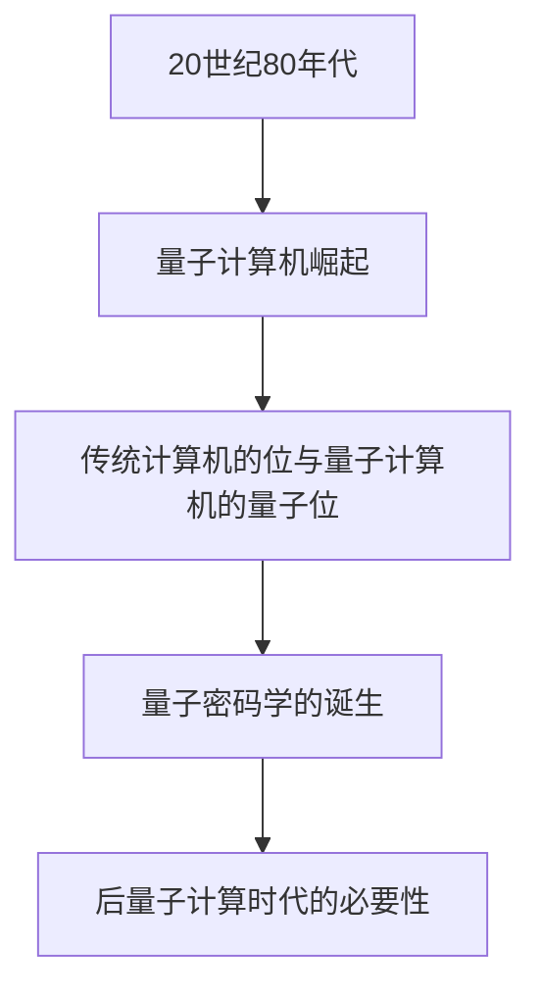

                 

**# 量子密码学：后量子时代的加密技术**

> **关键词：**量子密码学、后量子计算、加密技术、量子密钥分发、安全通信

> **摘要：**本文深入探讨了量子密码学这一前沿领域，解释了量子密码学在应对后量子计算威胁中的重要性。我们将从量子密码学的基本概念出发，详细分析量子密钥分发（QKD）的工作原理，探讨其实际应用，并分析面临的挑战和未来发展方向。通过这一系列的讨论，读者将能够理解量子密码学在现代加密技术中的关键作用。

## **概述：量子密码学的诞生背景**

量子密码学，作为一门结合了量子力学和密码学的交叉学科，其诞生背景可以追溯到20世纪80年代。当时的计算机科学领域正面临着新的挑战——量子计算机的崛起。传统计算机依赖于位（bit）作为信息的基本单元，而量子计算机则利用量子位（qubit）的叠加和纠缠特性，能够在短时间内解决传统计算机无法处理的复杂问题。

[Mermaid 流程图：量子密码学诞生背景]

量子计算机的潜在威胁在于它们可能破解现有的加密算法，如RSA和ECC，这些算法广泛用于保护互联网上的通信和数据。因此，量子密码学的出现为信息安全领域带来了新的希望。它通过利用量子力学的特性，提供一种理论上无法被量子计算机破解的加密方式。

## **核心概念：量子力学与量子信息**

量子密码学的基础是量子力学和量子信息理论。量子力学揭示了微观世界的奇特现象，如量子态的叠加和纠缠。量子信息理论则将这些现象用于信息的编码、传输和处理。

### **量子态叠加**

量子位可以处于多种状态的叠加，而不是传统位只能处于0或1的状态。这种叠加态使得量子计算机在处理复杂问题时具有巨大的计算能力。例如，一个量子位可以同时处于0和1的状态，而两个纠缠的量子位的状态则无法独立描述，它们之间的变化是即时的，无论距离多远。

$$
|\psi\rangle = \frac{1}{\sqrt{2}} (|0\rangle + |1\rangle)
$$

### **量子纠缠**

量子纠缠是量子力学中另一个重要特性。当两个量子位处于纠缠态时，一个量子位的状态会即时影响另一个量子位的状态，即使它们相隔很远。这种非局域的特性使得量子密钥分发（QKD）成为可能。

### **量子信息理论**

量子信息理论研究了如何利用量子位的特性来编码信息。量子密钥分发（QKD）就是利用量子纠缠和叠加态来实现安全的密钥交换。QKD能够确保通信过程中的密钥不会被窃取或破解，因为任何对量子态的测量都会破坏量子纠缠状态，从而暴露出窃听行为。

## **量子密钥分发（QKD）**

量子密钥分发（QKD）是量子密码学中最重要的应用之一。QKD利用量子力学的特性，实现两个远程实体之间的安全密钥交换。

### **工作原理**

QKD的工作原理基于量子纠缠和量子态叠加。首先，发送方（Alice）和一个量子位生成器产生一对纠缠的量子位，然后将其中一个量子位发送给接收方（Bob）。在这个过程中，任何对量子态的测量都会破坏纠缠状态，从而暴露出窃听行为。

### **安全验证**

在QKD过程中，Alice和Bob使用经典通信来验证量子态的传输是否成功。如果传输过程中没有发生任何窃听，他们将能够共享一个安全的密钥。这个密钥可以用于加密和解密未来的通信。

### **挑战与未来**

尽管QKD提供了理论上无法被量子计算机破解的加密方式，但其实际应用仍面临许多挑战。例如，量子态的传输距离受限，需要开发更先进的量子中继技术。此外，如何在实际网络中集成QKD系统也是一个亟待解决的问题。

## **实际应用：量子安全通信**

量子密码学的实际应用之一是量子安全通信。通过QKD，可以实现两个实体之间的安全通信，确保通信过程中的信息不会被窃取或破解。这一技术在金融、政府和企业等领域具有重要应用价值。

## **面临的挑战**

尽管量子密码学提供了强大的加密能力，但其实际应用仍面临许多挑战。首先，量子态的传输距离有限，需要开发更先进的量子中继技术。其次，如何在实际网络中集成QKD系统也是一个亟待解决的问题。

## **未来展望**

随着量子计算机的发展，量子密码学将成为信息安全领域的关键技术。未来的研究将集中在提高QKD的传输距离、集成QKD系统、开发更安全的量子密码学算法等方面。

## **结论**

量子密码学作为应对后量子计算威胁的重要手段，其重要性日益凸显。通过深入探讨量子密码学的基本概念、工作原理和实际应用，读者将能够理解其在现代加密技术中的关键作用。随着量子计算机的发展，量子密码学将迎来更广泛的应用，为信息安全领域带来新的希望。

## **作者信息**

- **作者：**AI天才研究院/AI Genius Institute & 禅与计算机程序设计艺术 /Zen And The Art of Computer Programming

---

在接下来的文章中，我们将进一步探讨量子密码学的核心概念、原理和应用，并提供详细的算法解释和实际案例分析。希望通过这一系列的讨论，读者能够对量子密码学有更深入的理解，并认识到其在现代加密技术中的重要性。

