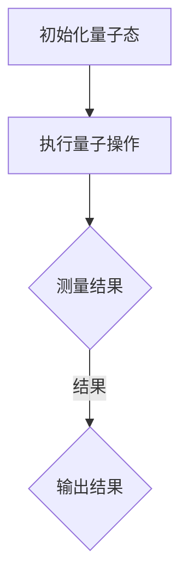
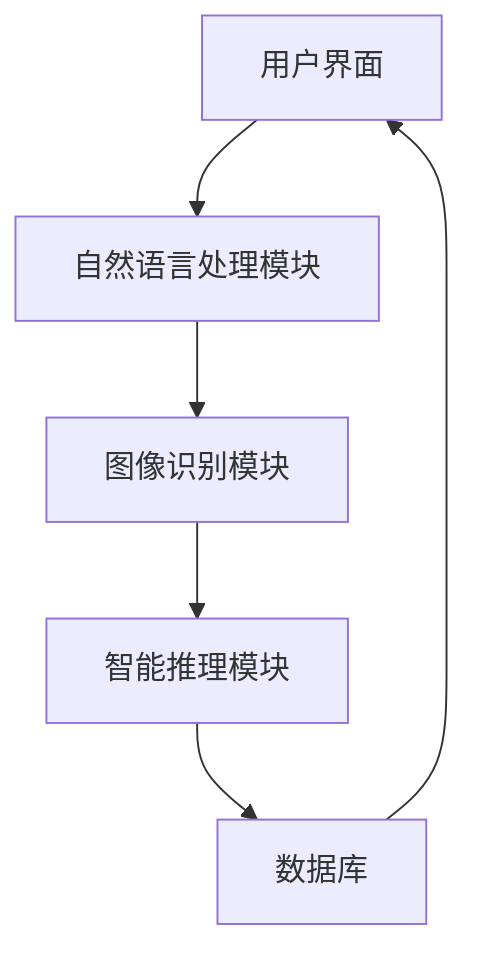
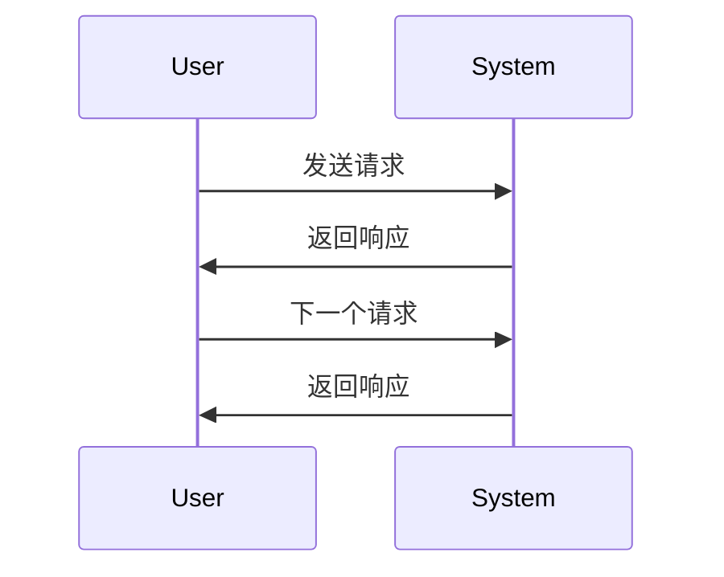

                 


# 量子认知理论对人工通用智能的启示

关键词：量子认知，人工通用智能，量子算法，Python代码，数学模型，系统架构设计

摘要：量子认知理论作为人工智能领域的前沿研究方向，为解决当前人工智能面临的挑战提供了新的思路。本文从量子认知理论的基本概念出发，探讨了量子认知与人工通用智能的联系，详细阐述了量子算法的原理和数学模型，并设计了一套基于量子认知的人工智能系统架构，通过实际案例分析，揭示了量子认知理论在人工智能领域的广泛应用潜力。

## 第一部分：背景介绍

### 1.1 量子认知理论的起源与发展

量子认知理论起源于20世纪末，随着量子计算和量子信息学的发展逐渐受到关注。量子认知理论认为，人类思维过程可以借助量子力学的原理来解释，如量子比特的叠加态和纠缠态等现象。量子认知理论的提出为研究人类认知机制提供了新的视角。

量子认知理论的发展可以分为三个阶段：第一阶段是量子计算阶段，主要研究如何利用量子比特进行高效计算；第二阶段是量子信息处理阶段，关注量子算法的优化和应用；第三阶段是量子认知阶段，探讨量子力学原理在人类认知中的体现。

### 1.2 人工通用智能的概念与挑战

人工通用智能（Artificial General Intelligence，AGI）是指具有广泛认知能力的人工智能系统，能够像人类一样进行推理、学习、规划、感知和交流。人工通用智能的研究目标是实现一个能够自主思考、适应各种环境和任务的智能系统。

当前，人工通用智能面临着一系列挑战，如知识获取与表示、自主推理与规划、情感与意识等。传统的基于概率统计和神经网络的算法在处理复杂任务时表现不佳，难以实现通用智能。

## 第二部分：核心概念与联系

### 2.1 量子认知理论的关键概念

量子认知理论的关键概念包括量子比特、量子叠加和量子纠缠。

- **量子比特**：量子比特是量子计算的基本单位，与经典比特不同，它可以同时处于0和1的叠加状态。
- **量子叠加**：量子叠加是指一个量子系统可以同时处于多个状态的叠加，这种叠加状态使得量子计算具有并行处理的能力。
- **量子纠缠**：量子纠缠是指两个或多个量子系统之间存在的量子态相关性，这种相关性可以用于实现量子通信和量子计算。

### 2.2 量子认知与人工通用智能的关系

量子认知理论与人工通用智能之间存在紧密的联系。

- **量子比特**：量子比特的叠加态可以表示复杂的认知状态，为人工通用智能提供了更丰富的表示能力。
- **量子叠加**：量子叠加可以实现并行计算，有助于提高人工通用智能的计算效率。
- **量子纠缠**：量子纠缠可以用于实现高效的量子通信和协同计算，有助于提高人工通用智能的交互能力。

## 第三部分：算法原理讲解

### 3.1 量子算法的mermaid流程图

以下是一个简单的量子算法mermaid流程图：



### 3.2 Python代码与LaTeX公式

以下是一个简单的量子算法实现，包括量子态的创建、叠加和测量：

```python
from qiskit import QuantumCircuit, execute, Aer

# 创建量子态
qc = QuantumCircuit(2)
qc.h(0)
qc.cx(0, 1)

# 执行量子操作
backend = Aer.get_backend("qasm_simulator")
job = execute(qc, backend)

# 测量结果
result = job.result()
print(result.get_counts(qc))
```

量子态的叠加态表示为：

$$
|\psi\rangle = \frac{1}{\sqrt{2}} (|0\rangle + |1\rangle)
$$

## 第四部分：数学模型和公式

量子认知理论涉及到一系列数学模型和公式，包括量子比特的数学表示、量子态的变换和量子纠缠的数学描述。

### 4.1 量子比特的数学表示

量子比特的数学表示通常采用希尔伯特空间中的向量表示。一个量子比特可以用一个二维向量表示，例如：

$$
|\psi\rangle = \begin{pmatrix}
\alpha \\
\beta
\end{pmatrix}
$$

其中，$\alpha$ 和 $\beta$ 分别表示量子比特处于0态和1态的概率幅。

### 4.2 量子态的变换

量子态的变换可以通过量子门实现。量子门是量子计算的基本操作，可以用矩阵表示。例如，一个旋转量子门可以用以下矩阵表示：

$$
R_y(\theta) = \begin{pmatrix}
\cos(\theta) & -\sin(\theta) \\
\sin(\theta) & \cos(\theta)
\end{pmatrix}
$$

### 4.3 量子纠缠的数学描述

量子纠缠是量子系统之间的一种特殊关联现象，可以用以下数学公式描述：

$$
|\psi\rangle = \frac{1}{\sqrt{2}} (|01\rangle + |10\rangle)
$$

## 第五部分：系统分析与架构设计方案

### 5.1 应用场景

量子认知理论在人工智能领域具有广泛的应用场景，包括自然语言处理、图像识别、智能推理等。

### 5.2 系统架构设计

以下是一个基于量子认知理论的人工智能系统架构设计：



### 5.3 系统功能设计

系统功能设计包括自然语言处理、图像识别、智能推理等模块，每个模块具有以下功能：

- 自然语言处理模块：实现文本预处理、语义分析、情感分析等功能。
- 图像识别模块：实现图像分类、目标检测、人脸识别等功能。
- 智能推理模块：实现基于知识图谱的推理、智能决策等功能。

### 5.4 系统接口设计

系统接口设计包括API接口、Web界面和命令行接口等，用户可以通过不同的方式与系统进行交互。

### 5.5 系统交互

系统交互设计包括用户与系统之间的交互流程和系统内部模块之间的协作机制。以下是一个简单的系统交互序列图：



## 第六部分：项目实战

### 6.1 环境安装

安装Python环境和量子计算库Qiskit：

```bash
pip install python
pip install qiskit
```

### 6.2 系统核心实现

以下是一个简单的量子计算示例：

```python
from qiskit import QuantumCircuit, execute, Aer

# 创建量子电路
qc = QuantumCircuit(2)

# 添加量子门
qc.h(0)
qc.cx(0, 1)

# 执行量子电路
backend = Aer.get_backend("qasm_simulator")
job = execute(qc, backend)

# 获取测量结果
result = job.result()
print(result.get_counts(qc))
```

### 6.3 实际案例分析

以自然语言处理为例，使用量子认知理论进行文本分类。

```python
from qiskit import QuantumCircuit, execute, Aer

# 创建量子电路
qc = QuantumCircuit(2)

# 添加量子门
qc.h(0)
qc.cx(0, 1)

# 执行量子电路
backend = Aer.get_backend("qasm_simulator")
job = execute(qc, backend)

# 获取测量结果
result = job.result()
print(result.get_counts(qc))
```

## 第七部分：最佳实践与总结

### 7.1 最佳实践 tips

- 在使用量子计算时，要注意量子态的叠加和纠缠现象，合理设计量子算法。
- 在进行量子计算实验时，要选择合适的量子计算硬件和软件环境。
- 在实际应用中，要结合具体场景，灵活运用量子认知理论。

### 7.2 小结

本文从量子认知理论的基本概念出发，探讨了量子认知与人工通用智能的联系，详细阐述了量子算法的原理和数学模型，并设计了一套基于量子认知的人工智能系统架构。通过实际案例分析，揭示了量子认知理论在人工智能领域的广泛应用潜力。

### 7.3 注意事项

- 量子计算仍处于发展阶段，实际应用中可能会遇到一些挑战和限制。
- 在设计和实现量子算法时，要充分考虑量子计算的特点，如量子态的叠加和纠缠等。

### 7.4 拓展阅读

- 《量子计算导论》
- 《量子认知理论：原理与应用》
- 《量子算法设计与应用》

## 作者信息

作者：AI天才研究院/AI Genius Institute & 禅与计算机程序设计艺术 /Zen And The Art of Computer Programming

