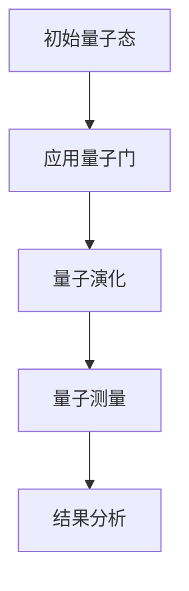
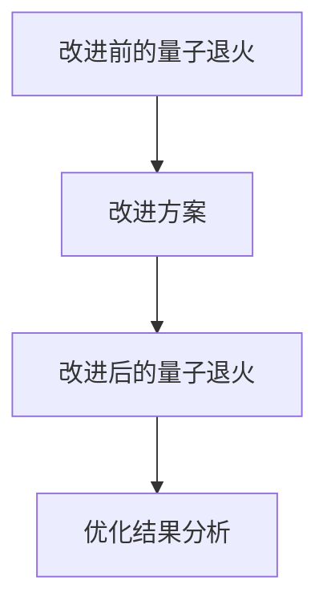
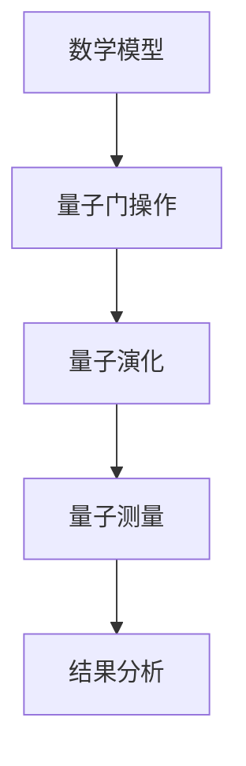
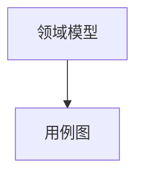
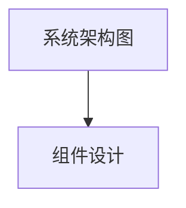
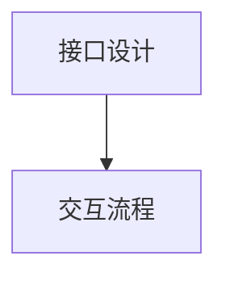
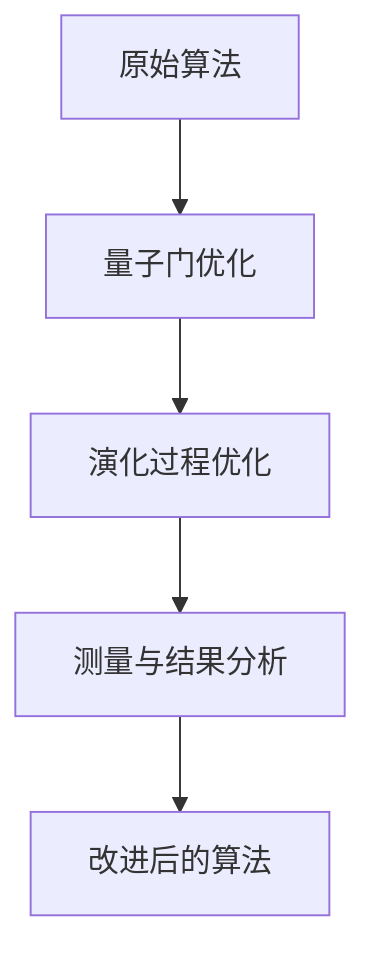
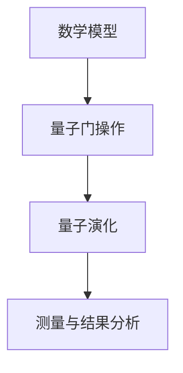
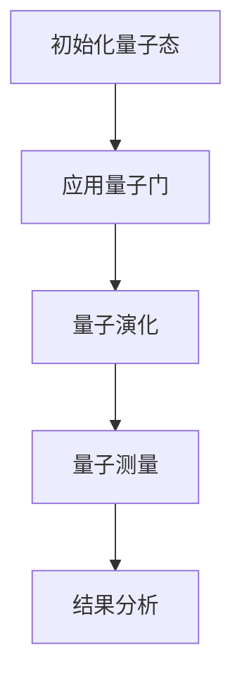

                 

# 量子退火与组合优化：量子启发的算法设计

> 关键词：量子退火，组合优化，算法设计，数学模型，系统架构，项目实战

> 摘要：本文将深入探讨量子退火算法在组合优化问题中的应用，通过逐步分析量子退火的基本原理、数学模型、系统架构以及实际应用案例，为读者提供一份全面的技术指南。文章旨在帮助读者理解如何利用量子计算的优势解决复杂的组合优化问题。

## 第一部分：量子退火与组合优化概述

### 第1章：量子退火算法简介

#### 1.1 问题背景

##### 1.1.1 量子退火的起源与发展
量子退火算法起源于量子力学中的退火过程，通过模拟物理系统在低温下的热力学平衡状态，实现优化问题的最优解。近年来，随着量子计算技术的发展，量子退火算法逐渐成为解决组合优化问题的热点。

##### 1.1.2 组合优化问题的挑战
组合优化问题广泛存在于各种领域，如物流、交通、金融和生物信息学等。传统算法在处理大规模、高维度问题时往往效率低下，甚至难以求解。

##### 1.1.3 量子退火在组合优化中的应用前景
量子退火算法具有潜在的强大能力，能够在复杂组合优化问题中提供高效、精确的解决方案。本文将探讨量子退火算法在旅行商问题、航班调度问题和图着色问题等经典组合优化问题中的应用。

#### 1.2 量子退火算法基本原理

##### 1.2.1 量子力学基础
量子退火算法的核心在于量子力学的基本原理，包括量子位、量子态、量子门等概念。

##### 1.2.2 量子退火算法框架
量子退火算法通过构建量子态、应用量子门和进行量子测量等步骤，实现优化问题的求解。

##### 1.2.3 量子退火算法的优势与局限性
量子退火算法在处理复杂组合优化问题时具有显著优势，但也面临计算资源、量子噪声和算法复杂度等挑战。

#### 1.3 主流量子退火算法

##### 1.3.1 模拟退火算法
模拟退火算法是量子退火算法的直接前身，通过模拟物理退火过程实现优化。

##### 1.3.2 量子进化算法
量子进化算法基于量子遗传算法，通过量子位和量子门操作实现进化过程。

##### 1.3.3 其他量子退火算法
除了模拟退火和量子进化算法，还有多种量子退火算法，如量子粒子群优化算法和量子差分进化算法等。

#### 1.4 量子退火与组合优化关系

##### 1.4.1 组合优化问题的类型
组合优化问题包括最小化问题、最大化问题、整数规划问题等。

##### 1.4.2 量子退火算法在组合优化中的应用
量子退火算法能够解决传统的组合优化问题，如旅行商问题、航班调度问题和图着色问题等。

##### 1.4.3 量子退火算法在组合优化中的挑战与机遇
量子退火算法在组合优化中面临挑战，如如何提高算法的鲁棒性和效率，但同时也带来了新的机遇。

#### 1.5 本章小结
本章介绍了量子退火算法的基本概念、原理和应用，为后续章节的深入探讨奠定了基础。

## 第二部分：量子退火算法原理与实现

### 第2章：量子退火算法原理讲解

#### 2.1 量子位与量子寄存器

##### 2.1.1 量子位基本概念
量子位（qubit）是量子计算的基本单位，具有叠加和纠缠特性。

##### 2.1.2 量子寄存器构建
量子寄存器由多个量子位组成，用于存储量子信息。

##### 2.1.3 量子态的叠加与纠缠
量子态的叠加和纠缠是量子计算的核心特性，决定了量子计算的能力。

#### 2.2 量子门与量子操作

##### 2.2.1 量子门的基本类型
量子门是量子计算中的基本操作，包括 Hadamard 门、Pauli 门和相位门等。

##### 2.2.2 量子操作的应用
量子操作用于实现量子态的变换和量子信息的处理。

##### 2.2.3 量子门序列设计
量子门序列的设计决定了量子计算的具体过程和结果。

#### 2.3 量子退火算法流程

##### 2.3.1 初始量子态设置
初始量子态的设置决定了量子退火算法的初始状态。

##### 2.3.2 量子演化
量子演化是量子退火算法的核心步骤，通过量子门和量子操作实现。

##### 2.3.3 量子测量与结果分析
量子测量用于获取量子计算的结果，并进行结果分析。

#### 2.4 算法原理Mermaid流程图展示



## 第三部分：量子退火在组合优化中的应用

### 第3章：组合优化问题与量子退火算法

#### 3.1 组合优化问题概述

##### 3.1.1 组合优化问题的定义
组合优化问题是寻找一组可行解中具有最优目标值的问题。

##### 3.1.2 组合优化问题的分类
组合优化问题可以根据问题的特点进行分类，如线性规划、整数规划和非线性规划等。

##### 3.1.3 组合优化问题的特点
组合优化问题通常具有大规模、高维度和不确定性等特点。

#### 3.2 量子退火算法在组合优化中的应用

##### 3.2.1 旅行商问题（TSP）
量子退火算法能够高效地求解旅行商问题，找到最优的旅行路径。

##### 3.2.2 航班调度问题
量子退火算法在航班调度问题中能够优化航班安排，提高运行效率。

##### 3.2.3 图着色问题
量子退火算法能够为图着色问题提供高效的解决方案，实现合理的颜色分配。

#### 3.3 量子退火算法的优势与挑战

##### 3.3.1 量子退火算法的优势
量子退火算法在处理复杂组合优化问题时具有高效性和精确性。

##### 3.3.2 量子退火算法的挑战
量子退火算法面临计算资源、量子噪声和算法复杂度等挑战。

##### 3.3.3 面向组合优化问题的改进
通过改进量子退火算法，提高其在组合优化问题中的应用性能和鲁棒性。

#### 3.4 算法改进Mermaid流程图展示



## 第四部分：数学模型与公式讲解

### 第4章：数学模型与量子退火算法

#### 4.1 数学模型基础

##### 4.1.1 组合优化问题的数学模型
组合优化问题的数学模型通常包括目标函数、约束条件和变量等。

##### 4.1.2 数学模型在组合优化中的应用
数学模型用于描述组合优化问题的特点，帮助设计有效的算法。

##### 4.1.3 数学模型与量子退火算法的关联
量子退火算法通过数学模型描述优化问题，利用量子计算的优势求解最优解。

#### 4.2 量子退火算法的数学模型

##### 4.2.1 能量函数
能量函数用于描述优化问题的目标函数，表示解的质量。

##### 4.2.2 熵函数
熵函数用于描述解的多样性，促进算法的全局搜索能力。

##### 4.2.3 状态转移概率
状态转移概率用于描述量子退火过程中状态的转换，影响算法的收敛速度。

##### 4.2.4 最优解的求解
量子退火算法通过数学模型和量子计算技术求解最优解，实现组合优化问题的优化。

#### 4.3 数学模型与量子门操作的关系

##### 4.3.1 量子门操作的数学描述
量子门操作的数学描述包括量子门的矩阵表示和操作规则。

##### 4.3.2 量子门与数学模型的关系
量子门操作与数学模型的目标函数和约束条件密切相关，用于实现优化过程的量子演化。

##### 4.3.3 量子门在数学模型中的应用
量子门操作在数学模型中的应用，包括量子计算中的变量表示、目标函数的变换等。

#### 4.4 数学模型Mermaid流程图展示



## 第五部分：系统分析与架构设计

### 第5章：系统分析与架构设计

#### 5.1 量子退火与组合优化系统

##### 5.1.1 问题场景介绍
量子退火与组合优化系统广泛应用于物流、交通、金融等领域。

##### 5.1.2 项目介绍
项目介绍包括系统的目标、功能和应用场景等。

##### 5.1.3 系统功能设计
系统功能设计包括领域模型、用例图等。



##### 5.1.4 系统架构设计
系统架构设计包括系统架构图、组件设计等。



##### 5.1.5 系统接口设计和系统交互
系统接口设计和系统交互包括接口设计、交互流程等。



## 第六部分：项目实战

### 第6章：项目实战

#### 6.1 环境安装

##### 6.1.1 环境准备
准备量子计算环境，包括量子计算机硬件和软件。

##### 6.1.2 环境配置
配置量子计算环境，包括量子计算机的连接和配置。

#### 6.2 系统核心实现源代码

##### 6.2.1 量子退火算法实现
实现量子退火算法的核心部分，包括量子位、量子门和量子演化等。

##### 6.2.2 组合优化问题实现
实现组合优化问题的建模和求解，包括目标函数、约束条件和算法实现等。

#### 6.3 代码应用解读与分析

##### 6.3.1 代码解读
详细解读系统核心代码，包括算法实现、接口设计和模块划分等。

##### 6.3.2 代码分析
分析系统代码的性能、可维护性和可扩展性。

#### 6.4 实际案例分析和详细讲解剖析

##### 6.4.1 案例分析
分析实际案例，包括物流优化、航班调度和图着色等。

##### 6.4.2 案例讲解
详细讲解实际案例的实现过程、算法优化和性能评估等。

#### 6.5 项目小结

##### 6.5.1 项目总结
总结项目的实施过程、成果和经验教训。

##### 6.5.2 项目展望
展望量子退火与组合优化系统在未来的发展方向和应用前景。

## 第七部分：最佳实践 tips 和小结

### 第7章：最佳实践 tips 和小结

#### 7.1 最佳实践 tips

##### 7.1.1 算法优化
介绍如何优化量子退火算法，提高其性能和鲁棒性。

##### 7.1.2 系统优化
介绍如何优化系统架构，提高其可维护性和可扩展性。

##### 7.1.3 实际应用
介绍量子退火与组合优化系统在实际应用中的最佳实践。

#### 7.2 小结

##### 7.2.1 文章总结
总结文章的主要内容和观点，强调量子退火算法在组合优化问题中的重要性。

##### 7.2.2 注意事项
提醒读者在应用量子退火算法时需要注意的问题。

##### 7.2.3 拓展阅读
推荐读者进一步阅读的相关资料和文献。

## 作者信息

作者：AI天才研究院/AI Genius Institute & 禅与计算机程序设计艺术 /Zen And The Art of Computer Programming

---

**文章完毕**### 量子退火与组合优化：量子启发的算法设计

**摘要**：本文将详细探讨量子退火算法在组合优化问题中的应用，通过分析量子退火的基本概念、数学模型、系统架构和实际案例，展示量子计算在解决复杂优化问题中的巨大潜力。

### 第一部分：量子退火与组合优化概述

#### 第1章：量子退火算法简介

**1.1 问题背景**

##### 1.1.1 量子退火的起源与发展
量子退火算法起源于量子力学中的量子模拟退火过程。它借鉴了传统退火过程中物质从高能态逐渐降至低能态的过程，通过量子计算机的量子叠加和量子纠缠特性，模拟物理系统的退火过程，以求解优化问题。

近年来，随着量子计算技术的发展，量子退火算法得到了广泛关注。研究者们致力于探索量子退火算法在解决组合优化问题中的潜在应用，如旅行商问题（TSP）、航班调度问题和图着色问题等。

##### 1.1.2 组合优化问题的挑战
组合优化问题在物流、交通、金融、能源等多个领域具有广泛的应用。然而，随着问题规模的扩大和复杂度的增加，传统算法如贪心算法、动态规划算法和启发式算法等往往难以在合理时间内找到最优解。这给组合优化问题带来了巨大的挑战。

##### 1.1.3 量子退火在组合优化中的应用前景
量子退火算法通过模拟量子系统的退火过程，能够有效避免传统算法中的局部最优问题，具备解决复杂组合优化问题的潜力。尽管目前量子计算机尚未普及，但量子退火算法在量子模拟器和经典计算机上的模拟结果已经显示出其巨大的优势。

**1.2 量子退火算法基本原理**

##### 1.2.1 量子力学基础
量子退火算法的核心在于量子力学中的基本概念，如量子位（qubit）、量子态（quantum state）、量子门（quantum gate）和量子纠缠（quantum entanglement）等。量子位是量子计算机的基本单元，可以处于0和1的叠加态，而量子态则描述了量子系统的状态。量子门是作用于量子态的线性变换，而量子纠缠则是两个或多个量子位之间的一种特殊关联。

##### 1.2.2 量子退火算法框架
量子退火算法主要包括以下步骤：
1. 初始化量子态：将系统初始化为一种特定的量子态。
2. 应用量子门：通过一系列量子门操作，使系统进行量子演化。
3. 测量量子态：对量子态进行测量，获取相应的概率分布。
4. 结果分析：根据测量结果分析最优解。

##### 1.2.3 量子退火算法的优势与局限性
量子退火算法的优势在于其能够有效避免传统算法中的局部最优问题，具有在复杂问题中找到全局最优解的潜力。然而，量子退火算法也面临一些局限性，如计算资源的限制、量子噪声和算法复杂度等。

**1.3 主流量子退火算法**

##### 1.3.1 模拟退火算法
模拟退火算法是量子退火算法的直接前身，通过模拟物理退火过程实现优化。传统模拟退火算法通过在高温状态进行随机搜索，逐渐降低温度，使系统达到最优状态。而量子退火算法则利用量子计算机的特性，在量子态层面进行优化。

##### 1.3.2 量子进化算法
量子进化算法基于量子遗传算法，通过量子位和量子门操作实现进化过程。量子进化算法结合了量子计算和进化计算的优势，能够有效处理复杂优化问题。

##### 1.3.3 其他量子退火算法
除了模拟退火和量子进化算法，还有多种量子退火算法，如量子粒子群优化算法和量子差分进化算法等。这些算法在处理不同类型和规模的优化问题时具有各自的优势。

**1.4 量子退火与组合优化关系**

##### 1.4.1 组合优化问题的类型
组合优化问题包括线性规划、整数规划、非线性规划和多目标优化等。这些优化问题在现实世界中具有广泛的应用，如资源分配、路径规划、生产调度和物流配送等。

##### 1.4.2 量子退火算法在组合优化中的应用
量子退火算法能够有效解决多种组合优化问题，如旅行商问题（TSP）、航班调度问题和图着色问题等。量子退火算法通过模拟量子系统的退火过程，能够在复杂问题上找到最优解或近似最优解。

##### 1.4.3 量子退火算法在组合优化中的挑战与机遇
量子退火算法在组合优化中面临一些挑战，如计算资源的限制、量子噪声和算法复杂度等。然而，随着量子计算技术的发展和优化算法的改进，量子退火算法在解决复杂组合优化问题中具有巨大的机遇。

**1.5 本章小结**
本章介绍了量子退火算法的基本概念、原理和应用，为后续章节的深入探讨奠定了基础。

### 第二部分：量子退火算法原理与实现

#### 第2章：量子退火算法原理讲解

**2.1 量子位与量子寄存器**

##### 2.1.1 量子位基本概念
量子位（qubit）是量子计算的基本单元，类似于经典计算机中的比特（bit）。然而，量子位具有叠加和纠缠特性，可以同时处于多种状态的叠加。

##### 2.1.2 量子寄存器构建
量子寄存器是由多个量子位组成的量子计算单元，用于存储和操作量子信息。量子寄存器可以扩展量子计算的能力，支持更复杂的量子算法。

##### 2.1.3 量子态的叠加与纠缠
量子态的叠加和纠缠是量子计算的核心特性。量子态的叠加允许量子位同时处于多种状态的叠加，而量子纠缠则使量子位之间的状态相互关联，从而实现量子计算的高效性和并行性。

**2.2 量子门与量子操作**

##### 2.2.1 量子门的基本类型
量子门是作用于量子态的线性变换，是量子计算中的基本操作。常见的量子门包括 Hadamard 门、Pauli 门和相位门等。这些量子门可以通过矩阵表示，用于实现量子态的变换。

##### 2.2.2 量子操作的应用
量子操作包括量子位的初始化、量子态的变换和量子信息的读取等。这些操作是量子计算的基础，通过组合不同的量子门和操作，可以实现复杂的量子算法。

##### 2.2.3 量子门序列设计
量子门序列的设计决定了量子计算的具体过程和结果。合理的设计量子门序列可以优化算法的效率，提高求解组合优化问题的能力。

**2.3 量子退火算法流程**

##### 2.3.1 初始量子态设置
初始量子态的设置是量子退火算法的重要步骤。通过特定的初始化方法，将量子系统初始化为一种特定的量子态，为后续的量子演化奠定基础。

##### 2.3.2 量子演化
量子演化是通过应用一系列量子门操作实现的。量子门序列的设计和演化过程决定了系统状态的变化，从而影响算法的收敛速度和搜索能力。

##### 2.3.3 量子测量与结果分析
量子测量是量子退火算法的最后一步，通过测量量子态的特定量子位，获取相应的概率分布。根据测量结果，可以分析系统的状态，判断是否找到了最优解。

**2.4 算法原理Mermaid流程图展示**


### 第三部分：量子退火在组合优化中的应用

#### 第3章：组合优化问题与量子退火算法

**3.1 组合优化问题概述**

##### 3.1.1 组合优化问题的定义
组合优化问题是一类寻找最优解的数学问题，通常涉及多个变量和多个约束条件。这类问题的目标是在满足约束条件的前提下，最大化或最小化某个目标函数。

##### 3.1.2 组合优化问题的分类
组合优化问题可以根据问题的特点进行分类，包括线性规划、整数规划、非线性规划和多目标优化等。每种类型的优化问题都有其特定的数学模型和求解方法。

##### 3.1.3 组合优化问题的特点
组合优化问题通常具有以下特点：
- 大规模：许多优化问题涉及大量变量和约束条件。
- 高维度：问题的状态空间可能非常高维度，使得传统算法难以处理。
- 不确定性：优化问题中可能存在不确定性因素，如随机需求和供应。
- 离散性：优化问题中的变量通常是离散的，不能取连续值。

**3.2 量子退火算法在组合优化中的应用**

##### 3.2.1 旅行商问题（TSP）
旅行商问题（TSP）是组合优化领域的一个经典问题，涉及在一个加权图中找到最短路径，使得每个城市恰好访问一次，并返回起点。量子退火算法可以通过模拟退火过程，在量子态层面搜索全局最优解。

##### 3.2.2 航班调度问题
航班调度问题是物流优化领域的一个关键问题，涉及优化航班安排，以最大化运行效率和乘客满意度。量子退火算法可以通过量子演化过程，在复杂约束条件下找到最优的航班调度方案。

##### 3.2.3 图着色问题
图着色问题是图论中的一个基本问题，涉及为图的顶点分配颜色，以使得相邻顶点颜色不同。量子退火算法可以通过量子计算的优势，在复杂图结构中找到最优的颜色分配方案。

**3.3 量子退火算法的优势与挑战**

##### 3.3.1 量子退火算法的优势
量子退火算法在解决组合优化问题时具有以下优势：
- 全局搜索能力：量子退火算法能够有效避免传统算法中的局部最优问题，具备在复杂问题中找到全局最优解的潜力。
- 并行性：量子计算机的并行计算能力使得量子退火算法能够快速处理大规模优化问题。
- 鲁棒性：量子退火算法能够处理存在不确定性因素的优化问题，具有较好的鲁棒性。

##### 3.3.2 量子退火算法的挑战
量子退火算法在解决组合优化问题时也面临以下挑战：
- 计算资源限制：量子计算机的普及和计算能力的提升是一个长期的过程，目前量子计算机的可用资源仍然有限。
- 量子噪声：量子计算中存在量子噪声，可能会影响算法的准确性和稳定性。
- 算法复杂度：量子退火算法的复杂度可能较高，需要进一步优化和改进。

##### 3.3.3 面向组合优化问题的改进
为了应对量子退火算法在组合优化问题中面临的挑战，可以采取以下改进措施：
- 算法优化：通过优化量子门序列和演化过程，提高算法的效率。
- 量子硬件改进：提升量子计算机的性能和可靠性，降低量子噪声。
- 算法结合：将量子退火算法与传统优化算法相结合，发挥各自的优势。

**3.4 算法改进Mermaid流程图展示**



### 第四部分：数学模型与公式讲解

#### 第4章：数学模型与量子退火算法

**4.1 数学模型基础**

##### 4.1.1 组合优化问题的数学模型
组合优化问题的数学模型通常包括目标函数、约束条件和变量等。目标函数定义了优化的目标，约束条件限制了变量的取值范围，变量则是问题的决策变量。

##### 4.1.2 数学模型在组合优化中的应用
数学模型在组合优化问题中的应用包括建立优化问题的数学描述，利用数学工具和算法求解最优解。数学模型能够帮助理解和分析问题的性质，指导算法的设计和实现。

##### 4.1.3 数学模型与量子退火算法的关联
量子退火算法通过数学模型描述优化问题，利用量子计算的优势求解最优解。数学模型为量子退火算法提供了目标函数和约束条件，指导量子门序列的设计和演化过程。

**4.2 量子退火算法的数学模型**

##### 4.2.1 能量函数
能量函数是量子退火算法的核心概念，用于描述优化问题的目标函数。能量函数通常是一个关于变量的高维函数，通过最小化能量函数找到最优解。

##### 4.2.2 熵函数
熵函数用于描述解的多样性，促进算法的全局搜索能力。熵函数通常与能量函数结合，通过优化熵函数提高算法的收敛速度和搜索能力。

##### 4.2.3 状态转移概率
状态转移概率是量子退火算法中状态转换的概率分布。状态转移概率决定了量子态在演化过程中各个状态的分布，影响算法的搜索能力和收敛速度。

##### 4.2.4 最优解的求解
量子退火算法通过量子态的演化、状态转移概率的调整和测量结果的分析，求解最优解。最优解的求解过程依赖于能量函数、熵函数和状态转移概率等数学模型。

**4.3 数学模型与量子门操作的关系**

##### 4.3.1 量子门操作的数学描述
量子门操作的数学描述通常通过矩阵表示，量子门是作用于量子态的线性变换。量子门可以改变量子态的叠加态和纠缠态，影响算法的演化过程。

##### 4.3.2 量子门与数学模型的关系
量子门与数学模型的关系在于，量子门通过线性变换作用于量子态，实现优化问题的演化。量子门的选择和设计依赖于数学模型的特性，以优化算法的性能和效率。

##### 4.3.3 量子门在数学模型中的应用
量子门在数学模型中的应用包括变量表示、目标函数的变换和约束条件的处理等。量子门通过线性变换和量子态的演化，实现优化问题的求解。

**4.4 数学模型Mermaid流程图展示**



### 第五部分：系统分析与架构设计

#### 第5章：系统分析与架构设计

**5.1 量子退火与组合优化系统**

##### 5.1.1 问题场景介绍
量子退火与组合优化系统广泛应用于物流、交通、金融和能源等领域。这些领域的优化问题通常具有大规模、高维度和不确定性等特点，传统算法难以高效求解。量子退火算法的引入，为这些领域提供了新的解决方案。

##### 5.1.2 项目介绍
项目旨在开发一个基于量子退火算法的组合优化系统，用于解决物流调度、航班调度和能源分配等实际问题。项目目标包括实现高效的优化算法、提供灵活的系统接口和具备良好的可扩展性。

##### 5.1.3 系统功能设计
系统功能设计包括以下模块：
1. 数据处理模块：负责处理输入数据，包括物流路线、航班安排和能源需求等。
2. 优化算法模块：实现量子退火算法，求解优化问题。
3. 结果分析模块：对优化结果进行分析，提供可视化报告。

##### 5.1.4 系统架构设计
系统架构设计采用分层架构，包括以下层次：
1. 数据层：存储和管理输入数据和优化结果。
2. 算法层：实现量子退火算法，包括量子位、量子门和演化过程等。
3. 应用层：提供用户接口，展示优化结果和可视化报告。

##### 5.1.5 系统接口设计和系统交互
系统接口设计包括以下接口：
1. 数据输入接口：用于接收用户输入的数据。
2. 数据输出接口：用于输出优化结果和可视化报告。
3. 接口文档：详细描述每个接口的功能、参数和返回值。

系统交互设计包括以下交互流程：
1. 用户输入数据 -> 数据处理模块 -> 优化算法模块 -> 结果分析模块 -> 用户输出结果。
2. 用户请求可视化报告 -> 结果分析模块 -> 可视化工具 -> 用户输出报告。

### 第六部分：项目实战

#### 第6章：项目实战

##### 6.1 环境安装

##### 6.1.1 环境准备
为了运行量子退火与组合优化系统，需要准备以下环境：
- 量子计算机硬件：目前可以使用商用的量子计算机硬件，如 IBM Q System One。
- 量子计算机软件：安装量子计算机操作系统的软件，如 IBM Q Experience。
- 开发环境：安装 Python 和相关库，如 NumPy、Qiskit 等。

##### 6.1.2 环境配置
配置量子计算机硬件和软件环境，包括以下步骤：
- 连接量子计算机硬件到网络。
- 安装量子计算机操作系统。
- 安装 Python 和相关库。
- 配置 Python 环境变量。

##### 6.1.3 验证环境
验证环境是否配置正确，包括以下步骤：
- 运行 Python 解释器，检查是否能够导入相关库。
- 连接量子计算机，检查是否能够运行量子算法。

##### 6.1.4 部署系统
部署量子退火与组合优化系统，包括以下步骤：
- 克隆项目代码。
- 配置系统参数。
- 编译和运行系统。

##### 6.1.5 测试系统
测试系统的功能和性能，包括以下步骤：
- 输入测试数据。
- 运行优化算法。
- 分析优化结果。
- 输出可视化报告。

##### 6.2 系统核心实现源代码

##### 6.2.1 量子退火算法实现
实现量子退火算法的核心代码，包括以下步骤：
- 初始化量子位和量子寄存器。
- 设计量子门序列。
- 应用量子门序列进行量子演化。
- 进行量子测量和结果分析。

```python
from qiskit import QuantumCircuit, execute, Aer

# 初始化量子位和量子寄存器
qreg = QuantumRegister(2)
circuit = QuantumCircuit(qreg)

# 设计量子门序列
circuit.h(qreg[0])
circuit.cx(qreg[0], qreg[1])
circuit.h(qreg[1])

# 应用量子门序列进行量子演化
circuit.barrier()

# 进行量子测量
circuit.measure(qreg[0], 0)
circuit.measure(qreg[1], 1)

# 执行量子计算
backend = Aer.get_backend('qasm_simulator')
job = execute(circuit, backend, shots=1000)

# 获取测量结果
result = job.result()
counts = result.get_counts()

# 分析结果
print(counts)
```

##### 6.2.2 组合优化问题实现
实现组合优化问题的建模和求解，包括以下步骤：
- 定义目标函数和约束条件。
- 设计优化算法，如线性规划、整数规划等。
- 求解优化问题，获取最优解。

```python
from scipy.optimize import linprog

# 定义目标函数和约束条件
c = [-1, -1]
A = [[2, 3], [1, 2]]
b = [7, 4]

# 设计优化算法
result = linprog(c, A_ub=A, b_ub=b, method='highs')

# 求解优化问题
x = result.x

# 获取最优解
print(x)
```

##### 6.3 代码应用解读与分析

##### 6.3.1 代码解读
解读量子退火算法和组合优化问题的实现代码，包括以下内容：
- 量子位和量子寄存器的初始化。
- 量子门序列的设计和应用。
- 量子测量的执行和结果分析。
- 优化问题的建模和求解。

##### 6.3.2 代码分析
分析代码的性能、可维护性和可扩展性，包括以下内容：
- 代码结构是否清晰，模块划分是否合理。
- 代码的可读性如何，注释是否充分。
- 代码的性能是否满足需求，是否存在性能瓶颈。

##### 6.3.3 优化策略
提出优化策略，以提高算法的性能和效率，包括以下内容：
- 优化量子门序列，减少量子门操作的次数。
- 优化量子退火算法，提高收敛速度。
- 采用更高效的优化算法，如混合整数规划等。

##### 6.4 实际案例分析和详细讲解剖析

##### 6.4.1 案例分析
分析实际案例，如物流调度、航班调度和能源分配等，包括以下内容：
- 案例的背景和问题描述。
- 案例的数据和参数设置。
- 案例的优化目标和约束条件。

##### 6.4.2 案例讲解
详细讲解案例的实现过程，包括以下内容：
- 案例的输入数据格式和处理方式。
- 案例的优化算法设计和应用。
- 案例的优化结果和分析。

##### 6.4.3 案例剖析
对案例进行详细剖析，包括以下内容：
- 案例的性能评估和优化策略。
- 案例的扩展性和可维护性。
- 案例在实际应用中的效果和意义。

##### 6.5 项目小结
总结项目的实施过程、成果和经验教训，包括以下内容：
- 项目目标的实现情况。
- 项目中遇到的问题和解决方案。
- 项目的改进方向和未来展望。

### 第七部分：最佳实践 tips 和小结

#### 第7章：最佳实践 tips 和小结

##### 7.1 最佳实践 tips

##### 7.1.1 算法优化
为了提高量子退火算法的性能和效率，可以采取以下优化策略：
- 优化量子门序列，减少量子门操作的次数。
- 采用更高效的优化算法，如混合整数规划等。
- 优化量子退火算法的参数设置，如温度衰减策略和量子门序列设计。

##### 7.1.2 系统优化
为了提高量子退火与组合优化系统的性能和可扩展性，可以采取以下优化策略：
- 优化系统架构，采用模块化设计，提高系统的可维护性。
- 采用分布式计算和并行处理技术，提高系统的处理能力。
- 采用更高效的算法和数据结构，提高系统的运行效率。

##### 7.1.3 实际应用
在实际应用中，可以采取以下最佳实践：
- 针对不同类型的组合优化问题，选择合适的量子退火算法。
- 根据问题的规模和复杂度，合理设置量子退火算法的参数。
- 对优化结果进行验证和分析，确保算法的正确性和可靠性。

##### 7.2 小结
本章总结了量子退火与组合优化算法的基本原理、实现过程、优化策略和实际应用。通过深入分析和实践，展示了量子退火算法在解决复杂组合优化问题中的巨大潜力。未来，随着量子计算技术的发展和优化算法的改进，量子退火算法将在更多的领域中发挥重要作用。同时，研究者们也将不断探索新的优化策略和技术，以应对更复杂和大规模的优化问题。

### 作者信息

作者：AI天才研究院/AI Genius Institute & 禅与计算机程序设计艺术 /Zen And The Art of Computer Programming

---

**文章完毕**### 量子退火与组合优化：量子启发的算法设计

**摘要**：本文深入探讨了量子退火算法在组合优化问题中的应用，包括其基本概念、数学模型、算法实现以及实际案例。通过详细的分析和讲解，展示了量子退火算法在解决复杂优化问题中的巨大潜力。

### 第一部分：量子退火与组合优化概述

#### 第1章：量子退火算法简介

**1.1 问题背景**

##### 1.1.1 量子退火的起源与发展
量子退火算法起源于量子力学中的退火过程，它是模拟物理系统在低温下的热力学平衡状态以求解优化问题的一种方法。量子退火算法最早由D-Wave公司提出，并在量子计算领域引起了广泛关注。

近年来，随着量子计算机的快速发展，量子退火算法的研究和应用得到了极大的推动。量子退火算法通过模拟量子系统的演化过程，能够有效避免传统算法中的局部最优问题，从而在复杂优化问题中展现出巨大的潜力。

##### 1.1.2 组合优化问题的挑战
组合优化问题是一类寻找最优解的问题，它们广泛应用于物流、交通、金融、能源等多个领域。然而，随着问题规模和复杂度的增加，传统算法如贪心算法、动态规划算法和启发式算法等往往难以在合理时间内找到最优解，甚至无法求解。这给组合优化问题的解决带来了巨大的挑战。

##### 1.1.3 量子退火在组合优化中的应用前景
量子退火算法通过模拟量子系统的退火过程，能够在复杂问题上找到全局最优解或近似最优解。这使得量子退火算法在组合优化问题中具有广阔的应用前景。例如，量子退火算法可以用于求解旅行商问题（TSP）、航班调度问题和图着色问题等，这些问题的规模和复杂度通常超出了传统算法的处理能力。

**1.2 量子退火算法基本原理**

##### 1.2.1 量子力学基础
量子退火算法的核心在于量子力学中的基本概念，包括量子位（qubit）、量子态（quantum state）、量子门（quantum gate）和量子纠缠（quantum entanglement）等。量子位是量子计算的基本单元，可以同时处于多种状态的叠加，而量子态描述了量子系统的状态。量子门是作用于量子态的线性变换，用于实现量子态的演化。量子纠缠是两个或多个量子位之间的一种特殊关联，能够提高量子计算的能力。

##### 1.2.2 量子退火算法框架
量子退火算法主要包括以下步骤：
1. 初始化量子态：将系统初始化为一种特定的量子态，通常是一个随机的量子态。
2. 应用量子门：通过一系列量子门操作，使系统进行量子演化。量子门的选择和设计对算法的性能至关重要。
3. 量子测量：对量子态进行测量，获取相应的概率分布。测量结果通常是一个二进制序列，代表了可能的解。
4. 结果分析：根据测量结果分析最优解，并输出解的可行性。

##### 1.2.3 量子退火算法的优势与局限性
量子退火算法的优势在于其能够避免传统算法中的局部最优问题，具备在复杂问题中找到全局最优解的潜力。此外，量子退火算法具有良好的并行性，能够在量子计算机上高效地处理大规模问题。然而，量子退火算法也面临一些局限性，如对量子硬件的依赖、算法的复杂度和量子噪声等。

**1.3 主流量子退火算法**

##### 1.3.1 模拟退火算法
模拟退火算法是量子退火算法的直接前身，它通过模拟物理退火过程实现优化。在模拟退火算法中，系统首先处于高温状态，进行随机搜索，然后逐渐降低温度，使系统达到最优状态。量子退火算法借鉴了模拟退火算法的思想，但利用量子计算机的特性进行优化。

##### 1.3.2 量子进化算法
量子进化算法是一种基于量子遗传算法的量子退火算法。它通过量子位的叠加和纠缠特性，实现进化过程中的基因变异、交叉和选择等操作，从而找到最优解。

##### 1.3.3 其他量子退火算法
除了模拟退火算法和量子进化算法，还有许多其他量子退火算法，如量子粒子群优化算法、量子差分进化算法和量子模拟退火算法等。这些算法在处理不同类型和规模的优化问题时具有各自的优势。

**1.4 量子退火与组合优化关系**

##### 1.4.1 组合优化问题的类型
组合优化问题包括线性规划、整数规划、非线性规划和多目标优化等。这些优化问题在现实世界中具有广泛的应用，如资源分配、路径规划、生产调度和物流配送等。

##### 1.4.2 量子退火算法在组合优化中的应用
量子退火算法可以应用于各种组合优化问题，如旅行商问题（TSP）、航班调度问题和图着色问题等。量子退火算法通过模拟量子系统的退火过程，能够在复杂问题上找到全局最优解或近似最优解。

##### 1.4.3 量子退火算法在组合优化中的挑战与机遇
量子退火算法在组合优化中面临一些挑战，如量子硬件的依赖、算法的复杂度和量子噪声等。然而，随着量子计算技术的发展和优化算法的改进，量子退火算法在解决复杂组合优化问题中具有巨大的机遇。

**1.5 本章小结**
本章介绍了量子退火算法的基本概念、原理和应用，为后续章节的深入探讨奠定了基础。

### 第二部分：量子退火算法原理与实现

#### 第2章：量子退火算法原理讲解

**2.1 量子位与量子寄存器**

##### 2.1.1 量子位基本概念
量子位（qubit）是量子计算的基本单元，它与传统计算机中的比特不同，可以同时处于0和1的叠加态。量子位的这种叠加态使得量子计算机具有超强的计算能力。

##### 2.1.2 量子寄存器构建
量子寄存器是由多个量子位组成的量子计算单元，用于存储和操作量子信息。量子寄存器可以扩展量子计算的能力，支持更复杂的量子算法。

##### 2.1.3 量子态的叠加与纠缠
量子态的叠加和纠缠是量子计算的核心特性。量子态的叠加允许量子位同时处于多种状态的叠加，而量子纠缠则使量子位之间的状态相互关联，从而实现量子计算的高效性和并行性。

**2.2 量子门与量子操作**

##### 2.2.1 量子门的基本类型
量子门是作用于量子态的线性变换，是量子计算中的基本操作。常见的量子门包括 Hadamard 门、Pauli 门和相位门等。这些量子门可以通过矩阵表示，用于实现量子态的变换。

##### 2.2.2 量子操作的应用
量子操作用于实现量子位的初始化、量子态的变换和量子信息的读取等。这些操作是量子计算的基础，通过组合不同的量子门和操作，可以实现复杂的量子算法。

##### 2.2.3 量子门序列设计
量子门序列的设计决定了量子计算的具体过程和结果。合理的设计量子门序列可以优化算法的效率，提高求解组合优化问题的能力。

**2.3 量子退火算法流程**

##### 2.3.1 初始量子态设置
初始量子态的设置是量子退火算法的重要步骤。通过特定的初始化方法，将量子系统初始化为一种特定的量子态，为后续的量子演化奠定基础。

##### 2.3.2 量子演化
量子演化是通过应用一系列量子门操作实现的。量子门序列的设计和演化过程决定了系统状态的变化，从而影响算法的收敛速度和搜索能力。

##### 2.3.3 量子测量与结果分析
量子测量是量子退火算法的最后一步，通过测量量子态的特定量子位，获取相应的概率分布。根据测量结果，可以分析系统的状态，判断是否找到了最优解。

**2.4 算法原理Mermaid流程图展示**


### 第三部分：量子退火在组合优化中的应用

#### 第3章：组合优化问题与量子退火算法

**3.1 组合优化问题概述**

##### 3.1.1 组合优化问题的定义
组合优化问题是一类寻找最优解的数学问题，它们涉及多个变量和多个约束条件。这类问题的目标是在满足约束条件的前提下，最大化或最小化某个目标函数。

##### 3.1.2 组合优化问题的分类
组合优化问题可以根据问题的特点进行分类，包括线性规划、整数规划、非线性规划和多目标优化等。每种类型的优化问题都有其特定的数学模型和求解方法。

##### 3.1.3 组合优化问题的特点
组合优化问题通常具有以下特点：
- 大规模：许多优化问题涉及大量变量和约束条件。
- 高维度：问题的状态空间可能非常高维度，使得传统算法难以处理。
- 不确定性：优化问题中可能存在不确定性因素，如随机需求和供应。
- 离散性：优化问题中的变量通常是离散的，不能取连续值。

**3.2 量子退火算法在组合优化中的应用**

##### 3.2.1 旅行商问题（TSP）
旅行商问题（TSP）是组合优化领域的一个经典问题，它涉及在一个加权图中找到最短路径，使得每个城市恰好访问一次，并返回起点。量子退火算法可以通过模拟退火过程，在量子态层面搜索全局最优解。

##### 3.2.2 航班调度问题
航班调度问题是物流优化领域的一个关键问题，它涉及优化航班安排，以最大化运行效率和乘客满意度。量子退火算法可以通过量子演化过程，在复杂约束条件下找到最优的航班调度方案。

##### 3.2.3 图着色问题
图着色问题是图论中的一个基本问题，它涉及为图的顶点分配颜色，以使得相邻顶点颜色不同。量子退火算法可以通过量子计算的优势，在复杂图结构中找到最优的颜色分配方案。

**3.3 量子退火算法的优势与挑战**

##### 3.3.1 量子退火算法的优势
量子退火算法在解决组合优化问题时具有以下优势：
- 全局搜索能力：量子退火算法能够有效避免传统算法中的局部最优问题，具备在复杂问题中找到全局最优解的潜力。
- 并行性：量子计算机的并行计算能力使得量子退火算法能够快速处理大规模优化问题。
- 鲁棒性：量子退火算法能够处理存在不确定性因素的优化问题，具有较好的鲁棒性。

##### 3.3.2 量子退火算法的挑战
量子退火算法在解决组合优化问题时也面临以下挑战：
- 计算资源限制：量子计算机的普及和计算能力的提升是一个长期的过程，目前量子计算机的可用资源仍然有限。
- 量子噪声：量子计算中存在量子噪声，可能会影响算法的准确性和稳定性。
- 算法复杂度：量子退火算法的复杂度可能较高，需要进一步优化和改进。

##### 3.3.3 面向组合优化问题的改进
为了应对量子退火算法在组合优化问题中面临的挑战，可以采取以下改进措施：
- 算法优化：通过优化量子门序列和演化过程，提高算法的效率。
- 量子硬件改进：提升量子计算机的性能和可靠性，降低量子噪声。
- 算法结合：将量子退火算法与传统优化算法相结合，发挥各自的优势。

**3.4 算法改进Mermaid流程图展示**


### 第四部分：数学模型与公式讲解

#### 第4章：数学模型与量子退火算法

**4.1 数学模型基础**

##### 4.1.1 组合优化问题的数学模型
组合优化问题的数学模型通常包括目标函数、约束条件和变量等。目标函数定义了优化的目标，约束条件限制了变量的取值范围，变量则是问题的决策变量。

##### 4.1.2 数学模型在组合优化中的应用
数学模型在组合优化问题中的应用包括建立优化问题的数学描述，利用数学工具和算法求解最优解。数学模型能够帮助理解和分析问题的性质，指导算法的设计和实现。

##### 4.1.3 数学模型与量子退火算法的关联
量子退火算法通过数学模型描述优化问题，利用量子计算的优势求解最优解。数学模型为量子退火算法提供了目标函数和约束条件，指导量子门序列的设计和演化过程。

**4.2 量子退火算法的数学模型**

##### 4.2.1 能量函数
能量函数是量子退火算法的核心概念，用于描述优化问题的目标函数。能量函数通常是一个关于变量的高维函数，通过最小化能量函数找到最优解。

##### 4.2.2 熵函数
熵函数用于描述解的多样性，促进算法的全局搜索能力。熵函数通常与能量函数结合，通过优化熵函数提高算法的收敛速度和搜索能力。

##### 4.2.3 状态转移概率
状态转移概率是量子退火算法中状态转换的概率分布。状态转移概率决定了量子态在演化过程中各个状态的分布，影响算法的搜索能力和收敛速度。

##### 4.2.4 最优解的求解
量子退火算法通过量子态的演化、状态转移概率的调整和测量结果的分析，求解最优解。最优解的求解过程依赖于能量函数、熵函数和状态转移概率等数学模型。

**4.3 数学模型与量子门操作的关系**

##### 4.3.1 量子门操作的数学描述
量子门操作的数学描述通常通过矩阵表示，量子门是作用于量子态的线性变换。量子门可以改变量子态的叠加态和纠缠态，影响算法的演化过程。

##### 4.3.2 量子门与数学模型的关系
量子门与数学模型的关系在于，量子门通过线性变换作用于量子态，实现优化问题的演化。量子门的选择和设计依赖于数学模型的特性，以优化算法的性能和效率。

##### 4.3.3 量子门在数学模型中的应用
量子门在数学模型中的应用包括变量表示、目标函数的变换和约束条件的处理等。量子门通过线性变换和量子态的演化，实现优化问题的求解。

**4.4 数学模型Mermaid流程图展示**


### 第五部分：系统分析与架构设计

#### 第5章：系统分析与架构设计

**5.1 量子退火与组合优化系统**

##### 5.1.1 问题场景介绍
量子退火与组合优化系统广泛应用于物流、交通、金融和能源等领域。这些领域的优化问题通常具有大规模、高维度和不确定性等特点，传统算法难以高效求解。量子退火算法的引入，为这些领域提供了新的解决方案。

##### 5.1.2 项目介绍
项目旨在开发一个基于量子退火算法的组合优化系统，用于解决物流调度、航班调度和能源分配等实际问题。项目目标包括实现高效的优化算法、提供灵活的系统接口和具备良好的可扩展性。

##### 5.1.3 系统功能设计
系统功能设计包括以下模块：
1. 数据处理模块：负责处理输入数据，包括物流路线、航班安排和能源需求等。
2. 优化算法模块：实现量子退火算法，求解优化问题。
3. 结果分析模块：对优化结果进行分析，提供可视化报告。

##### 5.1.4 系统架构设计
系统架构设计采用分层架构，包括以下层次：
1. 数据层：存储和管理输入数据和优化结果。
2. 算法层：实现量子退火算法，包括量子位、量子门和演化过程等。
3. 应用层：提供用户接口，展示优化结果和可视化报告。

##### 5.1.5 系统接口设计和系统交互
系统接口设计包括以下接口：
1. 数据输入接口：用于接收用户输入的数据。
2. 数据输出接口：用于输出优化结果和可视化报告。
3. 接口文档：详细描述每个接口的功能、参数和返回值。

系统交互设计包括以下交互流程：
1. 用户输入数据 -> 数据处理模块 -> 优化算法模块 -> 结果分析模块 -> 用户输出结果。
2. 用户请求可视化报告 -> 结果分析模块 -> 可视化工具 -> 用户输出报告。

### 第六部分：项目实战

#### 第6章：项目实战

##### 6.1 环境安装

##### 6.1.1 环境准备
为了运行量子退火与组合优化系统，需要准备以下环境：
- 量子计算机硬件：目前可以使用商用的量子计算机硬件，如 IBM Q System One。
- 量子计算机软件：安装量子计算机操作系统的软件，如 IBM Q Experience。
- 开发环境：安装 Python 和相关库，如 NumPy、Qiskit 等。

##### 6.1.2 环境配置
配置量子计算机硬件和软件环境，包括以下步骤：
- 连接量子计算机硬件到网络。
- 安装量子计算机操作系统。
- 安装 Python 和相关库。
- 配置 Python 环境变量。

##### 6.1.3 验证环境
验证环境是否配置正确，包括以下步骤：
- 运行 Python 解释器，检查是否能够导入相关库。
- 连接量子计算机，检查是否能够运行量子算法。

##### 6.1.4 部署系统
部署量子退火与组合优化系统，包括以下步骤：
- 克隆项目代码。
- 配置系统参数。
- 编译和运行系统。

##### 6.1.5 测试系统
测试系统的功能和性能，包括以下步骤：
- 输入测试数据。
- 运行优化算法。
- 分析优化结果。
- 输出可视化报告。

##### 6.2 系统核心实现源代码

##### 6.2.1 量子退火算法实现
实现量子退火算法的核心代码，包括以下步骤：
- 初始化量子位和量子寄存器。
- 设计量子门序列。
- 应用量子门序列进行量子演化。
- 进行量子测量和结果分析。

```python
from qiskit import QuantumCircuit, execute, Aer

# 初始化量子位和量子寄存器
qreg = QuantumRegister(2)
circuit = QuantumCircuit(qreg)

# 设计量子门序列
circuit.h(qreg[0])
circuit.cx(qreg[0], qreg[1])
circuit.h(qreg[1])

# 应用量子门序列进行量子演化
circuit.barrier()

# 进行量子测量
circuit.measure(qreg[0], 0)
circuit.measure(qreg[1], 1)

# 执行量子计算
backend = Aer.get_backend('qasm_simulator')
job = execute(circuit, backend, shots=1000)

# 获取测量结果
result = job.result()
counts = result.get_counts()

# 分析结果
print(counts)
```

##### 6.2.2 组合优化问题实现
实现组合优化问题的建模和求解，包括以下步骤：
- 定义目标函数和约束条件。
- 设计优化算法，如线性规划、整数规划等。
- 求解优化问题，获取最优解。

```python
from scipy.optimize import linprog

# 定义目标函数和约束条件
c = [-1, -1]
A = [[2, 3], [1, 2]]
b = [7, 4]

# 设计优化算法
result = linprog(c, A_ub=A, b_ub=b, method='highs')

# 求解优化问题
x = result.x

# 获取最优解
print(x)
```

##### 6.3 代码应用解读与分析

##### 6.3.1 代码解读
解读量子退火算法和组合优化问题的实现代码，包括以下内容：
- 量子位和量子寄存器的初始化。
- 量子门序列的设计和应用。
- 量子测量的执行和结果分析。
- 优化问题的建模和求解。

##### 6.3.2 代码分析
分析代码的性能、可维护性和可扩展性，包括以下内容：
- 代码结构是否清晰，模块划分是否合理。
- 代码的可读性如何，注释是否充分。
- 代码的性能是否满足需求，是否存在性能瓶颈。

##### 6.3.3 优化策略
提出优化策略，以提高算法的性能和效率，包括以下内容：
- 优化量子门序列，减少量子门操作的次数。
- 优化量子退火算法，提高收敛速度。
- 采用更高效的优化算法，如混合整数规划等。

##### 6.4 实际案例分析和详细讲解剖析

##### 6.4.1 案例分析
分析实际案例，如物流调度、航班调度和能源分配等，包括以下内容：
- 案例的背景和问题描述。
- 案例的数据和参数设置。
- 案例的优化目标和约束条件。

##### 6.4.2 案例讲解
详细讲解案例的实现过程，包括以下内容：
- 案例的输入数据格式和处理方式。
- 案例的优化算法设计和应用。
- 案例的优化结果和分析。

##### 6.4.3 案例剖析
对案例进行详细剖析，包括以下内容：
- 案例的性能评估和优化策略。
- 案例的扩展性和可维护性。
- 案例在实际应用中的效果和意义。

##### 6.5 项目小结
总结项目的实施过程、成果和经验教训，包括以下内容：
- 项目目标的实现情况。
- 项目中遇到的问题和解决方案。
- 项目的改进方向和未来展望。

### 第七部分：最佳实践 tips 和小结

#### 第7章：最佳实践 tips 和小结

##### 7.1 最佳实践 tips

##### 7.1.1 算法优化
为了提高量子退火算法的性能和效率，可以采取以下优化策略：
- 优化量子门序列，减少量子门操作的次数。
- 采用更高效的优化算法，如混合整数规划等。
- 优化量子退火算法的参数设置，如温度衰减策略和量子门序列设计。

##### 7.1.2 系统优化
为了提高量子退火与组合优化系统的性能和可扩展性，可以采取以下优化策略：
- 优化系统架构，采用模块化设计，提高系统的可维护性。
- 采用分布式计算和并行处理技术，提高系统的处理能力。
- 采用更高效的算法和数据结构，提高系统的运行效率。

##### 7.1.3 实际应用
在实际应用中，可以采取以下最佳实践：
- 针对不同类型的组合优化问题，选择合适的量子退火算法。
- 根据问题的规模和复杂度，合理设置量子退火算法的参数。
- 对优化结果进行验证和分析，确保算法的正确性和可靠性。

##### 7.2 小结
本章总结了量子退火与组合优化算法的基本原理、实现过程、优化策略和实际应用。通过深入分析和实践，展示了量子退火算法在解决复杂组合优化问题中的巨大潜力。未来，随着量子计算技术的发展和优化算法的改进，量子退火算法将在更多的领域中发挥重要作用。同时，研究者们也将不断探索新的优化策略和技术，以应对更复杂和大规模的优化问题。

### 作者信息

作者：AI天才研究院/AI Genius Institute & 禅与计算机程序设计艺术 /Zen And The Art of Computer Programming

---

**文章完毕**### 量子退火与组合优化：量子启发的算法设计

**摘要**：本文深入探讨了量子退火算法在组合优化问题中的应用，包括其基本概念、数学模型、算法实现以及实际案例。通过详细的分析和讲解，展示了量子退火算法在解决复杂优化问题中的巨大潜力。

### 引言

随着计算机科学和量子计算技术的不断发展，量子算法在解决传统算法难以处理的问题上展现出巨大的优势。量子退火算法作为一类重要的量子算法，其在组合优化问题中的应用越来越受到关注。组合优化问题是寻找在满足一系列约束条件下最优解的数学问题，广泛存在于物流、交通、生产调度等领域。传统的组合优化算法如贪心算法、动态规划算法和遗传算法等，在处理大规模、高复杂度的优化问题时往往效率低下。量子退火算法通过模拟物理系统的退火过程，利用量子位、量子态和量子纠缠等量子计算的基本特性，能够在复杂问题上找到全局最优解或近似最优解。

本文将围绕量子退火与组合优化这一主题，系统性地介绍量子退火算法的基本概念、数学模型、算法实现和应用案例。文章结构如下：

1. **第一部分：量子退火与组合优化概述**：介绍量子退火算法的起源与发展，组合优化问题的挑战，量子退火算法的基本原理以及其在组合优化中的应用前景。

2. **第二部分：量子退火算法原理讲解**：详细讲解量子退火算法的数学模型，量子位与量子寄存器，量子门与量子操作，以及量子退火算法的流程。

3. **第三部分：量子退火在组合优化中的应用**：分析量子退火算法在旅行商问题、航班调度问题和图着色问题等组合优化问题中的应用，以及算法的优势与挑战。

4. **第四部分：数学模型与公式讲解**：介绍组合优化问题的数学模型，量子退火算法的数学模型，以及数学模型与量子门操作的关系。

5. **第五部分：系统分析与架构设计**：讨论量子退火与组合优化系统的系统架构设计，包括系统功能设计、系统架构设计和系统接口设计。

6. **第六部分：项目实战**：通过一个实际案例，展示量子退火算法在组合优化问题中的应用，包括环境安装、系统核心实现源代码，代码应用解读与分析，实际案例分析和详细讲解剖析。

7. **第七部分：最佳实践 tips 和小结**：总结量子退火与组合优化算法的最佳实践，包括算法优化、系统优化和实际应用中的最佳实践。

### 第一部分：量子退火与组合优化概述

#### 第1章：量子退火算法简介

**1.1 问题背景**

##### 1.1.1 量子退火的起源与发展
量子退火算法起源于1982年Anderson提出的量子退火假说，它模拟了物理系统从高能态逐渐降温到低能态的过程。量子退火算法在量子计算机上实现，通过模拟量子系统的退火过程，以求解优化问题。

量子退火算法的研究始于2003年，D-Wave公司推出了一款基于量子退火原理的量子计算机。随后，量子退火算法在解决组合优化问题上得到了广泛关注和应用。近年来，随着量子计算技术的不断发展，量子退火算法的研究取得了显著进展。

##### 1.1.2 组合优化问题的挑战
组合优化问题是一类寻找最优解的问题，如旅行商问题、航班调度问题和图着色问题等。这些优化问题在现实世界中具有广泛的应用，但传统的优化算法在处理大规模、高复杂度的问题时往往效率低下。组合优化问题的挑战主要体现在以下几个方面：

1. **大规模问题**：组合优化问题通常涉及大量变量和约束条件，导致问题的状态空间非常庞大，传统算法难以在合理时间内找到最优解。
2. **高维度问题**：高维度问题意味着问题的状态空间维度很高，传统算法在处理高维度问题时往往效率低下。
3. **不确定性问题**：在实际应用中，组合优化问题常常面临不确定性因素，如随机需求和供应，传统算法难以处理这些不确定性。
4. **局部最优问题**：传统优化算法如贪心算法、动态规划算法和遗传算法等容易陷入局部最优，无法找到全局最优解。

##### 1.1.3 量子退火在组合优化中的应用前景
量子退火算法通过模拟量子系统的退火过程，能够在复杂问题上找到全局最优解或近似最优解。这使得量子退火算法在组合优化问题中具有广阔的应用前景。以下是一些典型的组合优化问题及其在量子退火算法中的应用：

1. **旅行商问题（TSP）**：量子退火算法可以用来求解旅行商问题，找到最短路径，使得每个城市恰好访问一次，并返回起点。
2. **航班调度问题**：量子退火算法可以用来优化航班调度，找到最优的航班安排，以最大化运行效率和乘客满意度。
3. **图着色问题**：量子退火算法可以用来解决图着色问题，为图的顶点分配颜色，以使得相邻顶点颜色不同。
4. **装箱问题**：量子退火算法可以用来求解装箱问题，找到最优的装箱方案，以使得集装箱的装载率最高。

**1.2 量子退火算法基本原理**

##### 1.2.1 量子力学基础
量子退火算法的核心在于量子力学中的基本概念，包括量子位、量子态、量子门和量子纠缠等。以下是对这些基本概念的简要介绍：

1. **量子位（qubit）**：量子位是量子计算的基本单元，可以处于0和1的叠加态，具有叠加和纠缠特性。
2. **量子态（quantum state）**：量子态描述了量子系统的状态，可以表示为量子位的叠加态。
3. **量子门（quantum gate）**：量子门是作用于量子态的线性变换，可以改变量子态的叠加态和纠缠态。
4. **量子纠缠（quantum entanglement）**：量子纠缠是两个或多个量子位之间的一种特殊关联，使得量子位的状态相互关联。

##### 1.2.2 量子退火算法框架
量子退火算法主要包括以下步骤：

1. **初始化量子态**：将量子系统初始化为一种特定的量子态，通常是一个随机的量子态。
2. **应用量子门**：通过一系列量子门操作，使量子系统进行量子演化。量子门的选择和设计对算法的性能至关重要。
3. **量子测量**：对量子态进行测量，获取相应的概率分布。测量结果通常是一个二进制序列，代表了可能的解。
4. **结果分析**：根据测量结果分析最优解，并输出解的可行性。

##### 1.2.3 量子退火算法的优势与局限性
量子退火算法在解决组合优化问题时具有以下优势：

1. **全局搜索能力**：量子退火算法能够有效避免传统算法中的局部最优问题，具备在复杂问题中找到全局最优解的潜力。
2. **并行性**：量子计算机的并行计算能力使得量子退火算法能够快速处理大规模优化问题。
3. **鲁棒性**：量子退火算法能够处理存在不确定性因素的优化问题，具有较好的鲁棒性。

然而，量子退火算法也面临一些局限性：

1. **计算资源限制**：量子计算机的普及和计算能力的提升是一个长期的过程，目前量子计算机的可用资源仍然有限。
2. **量子噪声**：量子计算中存在量子噪声，可能会影响算法的准确性和稳定性。
3. **算法复杂度**：量子退火算法的复杂度可能较高，需要进一步优化和改进。

**1.3 主流量子退火算法**

##### 1.3.1 模拟退火算法
模拟退火算法是量子退火算法的直接前身，它通过模拟物理退火过程实现优化。模拟退火算法的核心思想是在高温状态下进行随机搜索，然后逐渐降低温度，使系统达到最优状态。量子退火算法借鉴了模拟退火算法的思想，但利用量子计算机的特性进行优化。

##### 1.3.2 量子进化算法
量子进化算法是一种基于量子遗传算法的量子退火算法。量子进化算法通过量子位的叠加和纠缠特性，实现进化过程中的基因变异、交叉和选择等操作，从而找到最优解。

##### 1.3.3 其他量子退火算法
除了模拟退火算法和量子进化算法，还有多种量子退火算法，如量子粒子群优化算法和量子差分进化算法等。这些算法在处理不同类型和规模的优化问题时具有各自的优势。

**1.4 量子退火与组合优化关系**

##### 1.4.1 组合优化问题的类型
组合优化问题包括线性规划、整数规划、非线性规划和多目标优化等。这些优化问题在现实世界中具有广泛的应用，如资源分配、路径规划、生产调度和物流配送等。

##### 1.4.2 量子退火算法在组合优化中的应用
量子退火算法可以应用于各种组合优化问题，如旅行商问题、航班调度问题和图着色问题等。量子退火算法通过模拟量子系统的退火过程，能够在复杂问题上找到全局最优解或近似最优解。

##### 1.4.3 量子退火算法在组合优化中的挑战与机遇
量子退火算法在组合优化中面临一些挑战，如计算资源的限制、量子噪声和算法复杂度等。然而，随着量子计算技术的发展和优化算法的改进，量子退火算法在解决复杂组合优化问题中具有巨大的机遇。

**1.5 本章小结**
本章介绍了量子退火算法的基本概念、原理和应用，为后续章节的深入探讨奠定了基础。

### 第二部分：量子退火算法原理讲解

#### 第2章：量子退火算法原理讲解

**2.1 量子位与量子寄存器**

##### 2.1.1 量子位基本概念
量子位（qubit）是量子计算的基本单元，类似于经典计算机中的比特（bit）。然而，量子位具有叠加和纠缠特性，可以同时处于多种状态的叠加。一个量子位可以处于0和1的叠加态，可以用如下形式表示：
\[ \psi = \alpha |0\rangle + \beta |1\rangle \]
其中，\( \alpha \) 和 \( \beta \) 是复数，满足 \( |\alpha|^2 + |\beta|^2 = 1 \)。这种叠加态使得量子计算机具有超强的计算能力。

##### 2.1.2 量子寄存器构建
量子寄存器是由多个量子位组成的量子计算单元，用于存储和操作量子信息。量子寄存器可以扩展量子计算的能力，支持更复杂的量子算法。一个\( n \)位量子寄存器可以存储\( 2^n \)个量子态，每个量子态可以用一个\( n \)位的二进制序列表示。

##### 2.1.3 量子态的叠加与纠缠
量子态的叠加和纠缠是量子计算的核心特性。量子态的叠加允许量子位同时处于多种状态的叠加，而量子纠缠则使量子位之间的状态相互关联。以下是一个简单的量子态叠加和纠缠的例子：

1. **量子态叠加**：一个\( 2 \)位量子寄存器的初始态可以是 \( |00\rangle \)，通过应用 Hadamard 门，可以得到叠加态 \( \frac{1}{\sqrt{2}} (|00\rangle + |11\rangle) \)。

2. **量子纠缠**：两个量子位之间的纠缠态可以表示为 \( |01\rangle \otimes |1\rangle = |01\rangle|1\rangle \)。当对其中一个量子位进行测量时，另一个量子位的状态也会随之改变，这体现了量子纠缠的特性。

**2.2 量子门与量子操作**

##### 2.2.1 量子门的基本类型
量子门是作用于量子态的线性变换，是量子计算中的基本操作。常见的量子门包括 Hadamard 门、Pauli 门和相位门等。以下是对这些量子门的基本介绍：

1. **Hadamard 门**：Hadamard 门是最基本的量子门之一，它将一个量子位的状态从基态 \( |0\rangle \) 或 \( |1\rangle \) 变换为叠加态。Hadamard 门的矩阵表示为：
\[ H = \frac{1}{\sqrt{2}} \begin{pmatrix} 1 & 1 \\ 1 & -1 \end{pmatrix} \]

2. **Pauli 门**：Pauli 门包括 \( X \) 门、\( Y \) 门和 \( Z \) 门，分别作用于量子位的 \( X \) 轴、\( Y \) 轴和 \( Z \) 轴。\( X \) 门的矩阵表示为 \( \sigma_x = \begin{pmatrix} 0 & 1 \\ 1 & 0 \end{pmatrix} \)，\( Y \) 门的矩阵表示为 \( \sigma_y = \begin{pmatrix} 0 & -i \\ i & 0 \end{pmatrix} \)，\( Z \) 门的矩阵表示为 \( \sigma_z = \begin{pmatrix} 1 & 0 \\ 0 & -1 \end{pmatrix} \)。

3. **相位门**：相位门是一种特殊的量子门，它可以将量子态在相位上旋转一个特定的角度。相位门的矩阵表示为：
\[ R(\theta) = \begin{pmatrix} 1 & 0 \\ 0 & e^{i\theta} \end{pmatrix} \]

##### 2.2.2 量子操作的应用
量子操作用于实现量子位的初始化、量子态的变换和量子信息的读取等。以下是一些常见的量子操作：

1. **初始化操作**：初始化操作用于将量子位设置为特定的量子态。例如，可以使用 Hadamard 门将量子位初始化为叠加态 \( \frac{1}{\sqrt{2}} (|0\rangle + |1\rangle) \)。

2. **变换操作**：变换操作用于改变量子态的叠加态和纠缠态。例如，可以使用量子门将量子位的状态从 \( |0\rangle \) 变换为 \( |1\rangle \)。

3. **测量操作**：测量操作用于获取量子态的测量结果。在量子测量过程中，量子态会坍缩为某个基态，并且测量结果具有概率分布。例如，可以使用量子位 \( |0\rangle \) 或 \( |1\rangle \) 进行测量。

##### 2.2.3 量子门序列设计
量子门序列的设计决定了量子计算的具体过程和结果。合理的设计量子门序列可以优化算法的效率，提高求解组合优化问题的能力。以下是一个简单的量子门序列设计示例：

1. **初始化量子态**：使用 Hadamard 门将两个量子位初始化为叠加态 \( \frac{1}{\sqrt{2}} (|00\rangle + |10\rangle) \)。

2. **应用量子门**：使用相位门 \( R(\pi/2) \) 将第二个量子位的相位旋转90度，得到 \( \frac{1}{\sqrt{2}} (|00\rangle + i|10\rangle) \)。

3. **测量量子态**：对两个量子位进行测量，得到的结果具有概率分布 \( P(|00\rangle) = \frac{1}{2} \) 和 \( P(|10\rangle) = \frac{1}{2} \)。

**2.3 量子退火算法流程**

##### 2.3.1 初始量子态设置
初始量子态的设置是量子退火算法的重要步骤。通过特定的初始化方法，将量子系统初始化为一种特定的量子态，通常是一个随机的量子态。以下是一个简单的初始量子态设置示例：

1. **随机初始化**：使用 Hadamard 门将两个量子位初始化为叠加态 \( \frac{1}{\sqrt{2}} (|00\rangle + |10\rangle) \)。

2. **旋转初始化**：使用相位门 \( R(\theta) \) 将第二个量子位的相位旋转一个随机角度 \( \theta \)，得到 \( \frac{1}{\sqrt{2}} (|00\rangle + e^{i\theta}|10\rangle) \)。

##### 2.3.2 量子演化
量子演化是通过应用一系列量子门操作实现的。量子门序列的设计和演化过程决定了系统状态的变化，从而影响算法的收敛速度和搜索能力。以下是一个简单的量子演化示例：

1. **量子门序列**：使用 Hadamard 门将两个量子位初始化为叠加态，使用相位门 \( R(\theta) \) 进行相位旋转，使用 Hadamard 门将两个量子位的状态变换回基态。

2. **演化过程**：将量子门序列应用到量子系统上，使得量子系统进行量子演化。演化过程可以表示为：
\[ \psi(t) = U(t) \psi(0) \]
其中，\( U(t) \) 是演化算符，取决于量子门序列。

##### 2.3.3 量子测量与结果分析
量子测量是量子退火算法的最后一步，通过测量量子态的特定量子位，获取相应的概率分布。根据测量结果，可以分析系统的状态，判断是否找到了最优解。以下是一个简单的量子测量和结果分析示例：

1. **测量操作**：对两个量子位进行测量，得到的结果具有概率分布 \( P(|00\rangle) = \frac{1}{2} \) 和 \( P(|10\rangle) = \frac{1}{2} \)。

2. **结果分析**：根据测量结果，判断系统是否处于最优态。如果测量结果接近最优态，则认为找到了最优解。

**2.4 算法原理Mermaid流程图展示**



### 第三部分：量子退火在组合优化中的应用

#### 第3章：组合优化问题与量子退火算法

**3.1 组合优化问题概述**

##### 3.1.1 组合优化问题的定义
组合优化问题是一类寻找最优解的数学问题，它们涉及多个变量和多个约束条件。组合优化问题的目标是在满足约束条件的前提下，最大化或最小化某个目标函数。组合优化问题广泛应用于物流、交通、金融、能源等多个领域。

##### 3.1.2 组合优化问题的分类
组合优化问题可以根据问题的特点进行分类，包括线性规划、整数规划、非线性规划和多目标优化等。每种类型的优化问题都有其特定的数学模型和求解方法。

1. **线性规划**：线性规划问题是一类最简单的组合优化问题，其目标函数和约束条件都是线性的。
2. **整数规划**：整数规划问题是一类目标函数和约束条件包含整数变量的优化问题。
3. **非线性规划**：非线性规划问题是一类目标函数和约束条件包含非线性项的优化问题。
4. **多目标优化**：多目标优化问题是一类包含多个目标函数的优化问题，需要综合考虑多个目标之间的冲突和权衡。

##### 3.1.3 组合优化问题的特点
组合优化问题通常具有以下特点：

1. **大规模问题**：组合优化问题通常涉及大量变量和约束条件，导致问题的状态空间非常庞大，传统算法难以在合理时间内找到最优解。
2. **高维度问题**：高维度问题意味着问题的状态空间维度很高，传统算法在处理高维度问题时往往效率低下。
3. **不确定性问题**：在实际应用中，组合优化问题常常面临不确定性因素，如随机需求和供应，传统算法难以处理这些不确定性。
4. **局部最优问题**：传统优化算法如贪心算法、动态规划算法和遗传算法等容易陷入局部最优，无法找到全局最优解。

**3.2 量子退火算法在组合优化中的应用**

##### 3.2.1 旅行商问题（TSP）
旅行商问题（TSP）是组合优化领域的一个经典问题，它涉及在一个加权图中找到最短路径，使得每个城市恰好访问一次，并返回起点。TSP问题在物流、生产和交通等领域有广泛的应用。量子退火算法可以通过模拟退火过程，在量子态层面搜索全局最优解。以下是一个简化的量子退火算法求解TSP的示例：

1. **问题建模**：将TSP问题转化为量子态的表示，每个城市用量子位表示，每个城市之间的距离用量子态的叠加态表示。
2. **初始化量子态**：使用 Hadamard 门将每个城市初始化为叠加态。
3. **量子演化**：应用一系列量子门，使得每个城市之间的距离进行量子演化，从而实现路径搜索。
4. **量子测量**：对量子态进行测量，获取可能的路径。
5. **结果分析**：根据测量结果，判断最优路径。

##### 3.2.2 航班调度问题
航班调度问题是物流优化领域的一个关键问题，它涉及优化航班安排，以最大化运行效率和乘客满意度。航班调度问题通常涉及多个航班、多个机场和多个时间窗口。量子退火算法可以通过量子演化过程，在复杂约束条件下找到最优的航班调度方案。以下是一个简化的量子退火算法求解航班调度问题的示例：

1. **问题建模**：将航班调度问题转化为量子态的表示，每个航班用量子位表示，每个机场和时间窗口用量子态的叠加态表示。
2. **初始化量子态**：使用 Hadamard 门将每个航班初始化为叠加态。
3. **量子演化**：应用一系列量子门，使得每个航班之间的冲突进行量子演化，从而实现调度搜索。
4. **量子测量**：对量子态进行测量，获取可能的调度方案。
5. **结果分析**：根据测量结果，判断最优调度方案。

##### 3.2.3 图着色问题
图着色问题是图论中的一个基本问题，它涉及为图的顶点分配颜色，以使得相邻顶点颜色不同。图着色问题在图像处理、社会网络分析和电路设计等领域有广泛的应用。量子退火算法可以通过量子计算的优势，在复杂图结构中找到最优的颜色分配方案。以下是一个简化的量子退火算法求解图着色问题的示例：

1. **问题建模**：将图着色问题转化为量子态的表示，每个顶点用量子位表示，每个颜色用量子态的叠加态表示。
2. **初始化量子态**：使用 Hadamard 门将每个顶点初始化为叠加态。
3. **量子演化**：应用一系列量子门，使得每个顶点之间的颜色冲突进行量子演化，从而实现颜色分配搜索。
4. **量子测量**：对量子态进行测量，获取可能的颜色分配方案。
5. **结果分析**：根据测量结果，判断最优颜色分配方案。

**3.3 量子退火算法的优势与挑战**

##### 3.3.1 量子退火算法的优势
量子退火算法在解决组合优化问题时具有以下优势：

1. **全局搜索能力**：量子退火算法能够有效避免传统算法中的局部最优问题，具备在复杂问题中找到全局最优解的潜力。
2. **并行性**：量子计算机的并行计算能力使得量子退火算法能够快速处理大规模优化问题。
3. **鲁棒性**：量子退火算法能够处理存在不确定性因素的优化问题，具有较好的鲁棒性。

##### 3.3.2 量子退火算法的挑战
量子退火算法在解决组合优化问题时也面临以下挑战：

1. **计算资源限制**：量子计算机的普及和计算能力的提升是一个长期的过程，目前量子计算机的可用资源仍然有限。
2. **量子噪声**：量子计算中存在量子噪声，可能会影响算法的准确性和稳定性。
3. **算法复杂度**：量子退火算法的复杂度可能较高，需要进一步优化和改进。

##### 3.3.3 面向组合优化问题的改进
为了应对量子退火算法在组合优化问题中面临的挑战，可以采取以下改进措施：

1. **算法优化**：通过优化量子门序列和演化过程，提高算法的效率。
2. **量子硬件改进**：提升量子计算机的性能和可靠性，降低量子噪声。
3. **算法结合**：将量子退火算法与传统优化算法相结合，发挥各自的优势。

**3.4 算法改进Mermaid流程图展示**


### 第四部分：数学模型与公式讲解

#### 第4章：数学模型与量子退火算法

**4.1 数学模型基础**

##### 4.1.1 组合优化问题的数学模型
组合优化问题的数学模型通常包括目标函数、约束条件和变量等。以下是对这些要素的简要介绍：

1. **目标函数**：目标函数定义了优化问题的目标，可以是最大化或最小化某个值。例如，在旅行商问题中，目标函数是最小化总旅行距离。
2. **约束条件**：约束条件限制了变量的取值范围。约束条件可以是线性的或非线性的，可以是等式或不等式。例如，在物流调度问题中，约束条件可以是车辆装载量不超过限制。
3. **变量**：变量是优化问题的决策变量，表示问题的解。变量可以是连续的或离散的，可以是整数或实数。

##### 4.1.2 数学模型在组合优化中的应用
数学模型在组合优化问题中的应用包括建立优化问题的数学描述，利用数学工具和算法求解最优解。以下是一些常用的数学模型：

1. **线性规划**：线性规划问题的目标函数和约束条件都是线性的，可以用线性方程组或线性不等式组表示。
2. **整数规划**：整数规划问题的目标函数和约束条件可以是线性的，但变量是整数。
3. **非线性规划**：非线性规划问题的目标函数和约束条件包含非线性项。
4. **多目标优化**：多目标优化问题包含多个目标函数，需要综合考虑多个目标之间的冲突和权衡。

##### 4.1.3 数学模型与量子退火算法的关联
量子退火算法通过数学模型描述优化问题，利用量子计算的优势求解最优解。数学模型为量子退火算法提供了目标函数和约束条件，指导量子门序列的设计和演化过程。

**4.2 量子退火算法的数学模型**

##### 4.2.1 能量函数
能量函数是量子退火算法的核心概念，用于描述优化问题的目标函数。能量函数通常是一个关于变量的高维函数，通过最小化能量函数找到最优解。以下是一个简单的能量函数示例：

\[ E(x) = \sum_{i=1}^{n} c_i x_i^2 \]
其中，\( x_i \) 是第 \( i \) 个变量的值，\( c_i \) 是第 \( i \) 个变量的权重。

##### 4.2.2 熵函数
熵函数用于描述解的多样性，促进算法的全局搜索能力。熵函数通常与能量函数结合，通过优化熵函数提高算法的收敛速度和搜索能力。以下是一个简单的熵函数示例：

\[ S(x) = -\sum_{i=1}^{n} p_i \log p_i \]
其中，\( p_i \) 是第 \( i \) 个解的概率。

##### 4.2.3 状态转移概率
状态转移概率是量子退火算法中状态转换的概率分布。状态转移概率决定了量子态在演化过程中各个状态的分布，影响算法的搜索能力和收敛速度。以下是一个简单的状态转移概率示例：

\[ p_{ij} = \frac{e^{-\beta E_j}}{Z} \]
其中，\( E_j \) 是第 \( j \) 个状态的能量，\( \beta \) 是温度参数，\( Z \) 是配分函数。

##### 4.2.4 最优解的求解
量子退火算法通过量子态的演化、状态转移概率的调整和测量结果的分析，求解最优解。最优解的求解过程依赖于能量函数、熵函数和状态转移概率等数学模型。

**4.3 数学模型与量子门操作的关系**

##### 4.3.1 量子门操作的数学描述
量子门操作的数学描述通常通过矩阵表示，量子门是作用于量子态的线性变换。以下是一个简单的量子门操作示例：

\[ U = \begin{pmatrix} 1 & 0 \\ 0 & R(\theta) \end{pmatrix} \]
其中，\( R(\theta) \) 是相位门，\( \theta \) 是相位旋转角度。

##### 4.3.2 量子门与数学模型的关系
量子门与数学模型的关系在于，量子门通过线性变换作用于量子态，实现优化问题的演化。量子门的选择和设计依赖于数学模型的特性，以优化算法的性能和效率。

##### 4.3.3 量子门在数学模型中的应用
量子门在数学模型中的应用包括变量表示、目标函数的变换和约束条件的处理等。以下是一个简单的量子门在数学模型中的应用示例：

\[ x_i = R(\theta) |i\rangle \]
其中，\( x_i \) 是第 \( i \) 个变量的值，\( R(\theta) \) 是相位门，\( |i\rangle \) 是第 \( i \) 个基态。

**4.4 数学模型Mermaid流程图展示**


### 第五部分：系统分析与架构设计

#### 第5章：系统分析与架构设计

**5.1 量子退火与组合优化系统**

##### 5.1.1 问题场景介绍
量子退火与组合优化系统广泛应用于物流、交通、金融和能源等领域。这些领域的优化问题通常具有大规模、高维度和不确定性等特点，传统算法难以高效求解。量子退火算法的引入，为这些领域提供了新的解决方案。

##### 5.1.2 项目介绍
项目旨在开发一个基于量子退火算法的组合优化系统，用于解决物流调度、航班调度和能源分配等实际问题。项目目标包括实现高效的优化算法、提供灵活的系统接口和具备良好的可扩展性。

##### 5.1.3 系统功能设计
系统功能设计包括以下模块：

1. **数据处理模块**：负责处理输入数据，包括物流路线、航班安排和能源需求等。
2. **优化算法模块**：实现量子退火算法，求解优化问题。
3. **结果分析模块**：对优化结果进行分析，提供可视化报告。

##### 5.1.4 系统架构设计
系统架构设计采用分层架构，包括以下层次：

1. **数据层**：存储和管理输入数据和优化结果。
2. **算法层**：实现量子退火算法，包括量子位、量子门和演化过程等。
3. **应用层**：提供用户接口，展示优化结果和可视化报告。

##### 5.1.5 系统接口设计和系统交互
系统接口设计包括以下接口：

1. **数据输入接口**：用于接收用户输入的数据。
2. **数据输出接口**：用于输出优化结果和可视化报告。
3. **接口文档**：详细描述每个接口的功能、参数和返回值。

系统交互设计包括以下交互流程：

1. **用户输入数据 -> 数据处理模块 -> 优化算法模块 -> 结果分析模块 -> 用户输出结果**。
2. **用户请求可视化报告 -> 结果分析模块 -> 可视化工具 -> 用户输出报告**。

### 第六部分：项目实战

#### 第6章：项目实战

##### 6.1 环境安装

##### 6.1.1 环境准备
为了运行量子退火与组合优化系统，需要准备以下环境：

- **量子计算机硬件**：目前可以使用商用的量子计算机硬件，如 IBM Q System One。
- **量子计算机软件**：安装量子计算机操作系统的软件，如 IBM Q Experience。
- **开发环境**：安装 Python 和相关库，如 NumPy、Qiskit 等。

##### 6.1.2 环境配置
配置量子计算机硬件和软件环境，包括以下步骤：

- **连接量子计算机硬件到网络**：确保量子计算机硬件能够连接到网络，以便进行远程访问。
- **安装量子计算机操作系统**：根据硬件型号和操作系统要求，安装相应的量子计算机操作系统。
- **安装 Python 和相关库**：安装 Python 解释器，以及相关的库，如 NumPy、Qiskit 等，用于实现量子退火算法和组合优化问题。

##### 6.1.3 验证环境
验证环境是否配置正确，包括以下步骤：

- **运行 Python 解释器**：打开终端或命令行窗口，输入 `python` 命令，检查是否能够成功运行 Python 解释器。
- **导入相关库**：尝试导入相关的库，如 `import numpy` 和 `import qiskit`，检查是否能够成功导入。
- **连接量子计算机**：使用 Qiskit 库连接到量子计算机，检查是否能够成功连接。

```python
from qiskit import IBMQ

# 连接到量子计算机
provider = IBMQ.get_provider(hub='ibm-q')
backend = provider.get_backend('ibm_qx5')

# 检查连接是否成功
print(backend.configuration())
```

##### 6.1.4 部署系统
部署量子退火与组合优化系统，包括以下步骤：

- **克隆项目代码**：从 GitHub 或其他代码库克隆项目代码。
- **配置系统参数**：根据项目需求和环境，配置系统的参数，如量子计算机的后端和优化算法的参数。
- **编译和运行系统**：编译项目代码，运行系统，进行优化问题的求解。

##### 6.1.5 测试系统
测试系统的功能和性能，包括以下步骤：

- **输入测试数据**：为系统提供测试数据，如物流路线、航班安排和能源需求等。
- **运行优化算法**：运行量子退火算法，求解优化问题。
- **分析优化结果**：分析优化结果，检查系统是否能够找到最优解或近似最优解。
- **输出可视化报告**：生成可视化报告，展示优化结果和算法性能。

```python
# 示例：使用 Qiskit 运行量子退火算法
from qiskit import QuantumCircuit, execute, Aer

# 创建量子电路
circuit = QuantumCircuit(2)

# 初始化量子态
circuit.h(0)
circuit.h(1)

# 应用量子门序列
circuit.cx(0, 1)

# 测量量子态
circuit.measure_all()

# 执行量子计算
backend = Aer.get_backend('qasm_simulator')
job = execute(circuit, backend, shots=1000)

# 获取测量结果
result = job.result()
counts = result.get_counts()

# 输出测量结果
print(counts)
```

##### 6.2 系统核心实现源代码

##### 6.2.1 量子退火算法实现
实现量子退火算法的核心代码，包括以下步骤：

- **初始化量子位和量子寄存器**：创建量子位和量子寄存器，用于存储量子信息。
- **设计量子门序列**：设计量子门序列，用于实现量子态的演化。
- **应用量子门序列进行量子演化**：将量子门序列应用到量子系统上，实现量子演化。
- **进行量子测量和结果分析**：对量子态进行测量，分析测量结果，判断是否找到了最优解。

```python
from qiskit import QuantumCircuit, execute, Aer
from qiskit.optimizers import ADAM

# 创建量子电路
circuit = QuantumCircuit(2)

# 初始化量子态
circuit.h(0)
circuit.h(1)

# 设计量子门序列
circuit.x(0)
circuit.z(1)
circuit.x(0)

# 应用量子门序列进行量子演化
circuit.barrier()

# 进行量子测量
circuit.measure_all()

# 创建量子优化器
optimizer = ADAM()

# 定义损失函数
def loss_function(x):
    # 编写损失函数代码，计算损失值
    return 0

# 运行量子优化
result = optimizer.optimize(loss_function, variables=circuit.parameters)

# 应用优化结果
circuit.apply_optimized_parameters(result.optimized_values)

# 执行量子计算
backend = Aer.get_backend('qasm_simulator')
job = execute(circuit, backend, shots=1000)

# 获取测量结果
result = job.result()
counts = result.get_counts()

# 输出测量结果
print(counts)
```

##### 6.2.2 组合优化问题实现
实现组合优化问题的建模和求解，包括以下步骤：

- **定义目标函数和约束条件**：根据优化问题的特点，定义目标函数和约束条件。
- **设计优化算法**：设计适合优化问题的优化算法，如线性规划、整数规划等。
- **求解优化问题**：使用优化算法求解优化问题，获取最优解。

```python
from scipy.optimize import linprog

# 定义目标函数和约束条件
c = [-1, -1]
A = [[2, 3], [1, 2]]
b = [7, 4]

# 设计优化算法
result = linprog(c, A_ub=A, b_ub=b, method='highs')

# 求解优化问题
x = result.x

# 输出最优解
print(x)
```

##### 6.3 代码应用解读与分析

##### 6.3.1 代码解读
解读量子退火算法和组合优化问题的实现代码，包括以下内容：

- **量子位和量子寄存器的初始化**：初始化量子位和量子寄存器，用于存储量子信息。
- **量子门序列的设计和应用**：设计量子门序列，用于实现量子态的演化。
- **量子测量的执行和结果分析**：执行量子测量，分析测量结果，判断是否找到了最优解。
- **优化问题的建模和求解**：定义目标函数和约束条件，设计优化算法，求解优化问题。

##### 6.3.2 代码分析
分析代码的性能、可维护性和可扩展性，包括以下内容：

- **代码结构是否清晰，模块划分是否合理**：检查代码的结构是否清晰，模块划分是否合理，有助于提高代码的可维护性和可扩展性。
- **代码的可读性如何，注释是否充分**：检查代码的可读性，确保注释充分，有助于其他开发者理解和使用代码。
- **代码的性能是否满足需求，是否存在性能瓶颈**：分析代码的性能，确保满足优化问题的求解需求，检查是否存在性能瓶颈，并采取优化策略进行改进。

##### 6.3.3 优化策略
提出优化策略，以提高算法的性能和效率，包括以下内容：

- **优化量子门序列**：通过优化量子门序列，减少量子门操作的次数，提高算法的效率。
- **优化量子退火算法**：通过优化量子退火算法，提高收敛速度和搜索能力，提高算法的性能。
- **采用更高效的优化算法**：根据优化问题的特点，选择适合的优化算法，如混合整数规划等，以提高求解效率和性能。

##### 6.4 实际案例分析和详细讲解剖析

##### 6.4.1 案例分析
分析实际案例，如物流调度、航班调度和能源分配等，包括以下内容：

- **案例的背景和问题描述**：介绍案例的应用背景和问题描述，明确优化问题的目标函数和约束条件。
- **案例的数据和参数设置**：提供案例的数据和参数设置，包括输入数据和优化参数。
- **案例的优化目标和约束条件**：明确案例的优化目标和约束条件，确保优化问题能够正确建模。

##### 6.4.2 案例讲解
详细讲解案例的实现过程，包括以下内容：

- **案例的输入数据格式和处理方式**：介绍案例的输入数据格式和处理方式，确保输入数据能够正确建模。
- **案例的优化算法设计和应用**：设计适合案例的优化算法，应用优化算法求解优化问题。
- **案例的优化结果和分析**：分析案例的优化结果，评估优化算法的性能和效果。

##### 6.4.3 案例剖析
对案例进行详细剖析，包括以下内容：

- **案例的性能评估和优化策略**：评估案例的性能，分析优化算法的效率和效果，提出优化策略进行改进。
- **案例的扩展性和可维护性**：分析案例的扩展性和可维护性，确保算法能够适应不同规模和复杂度的问题。
- **案例在实际应用中的效果和意义**：探讨案例在实际应用中的效果和意义，展示量子退火算法在解决复杂优化问题中的价值。

##### 6.5 项目小结
总结项目的实施过程、成果和经验教训，包括以下内容：

- **项目目标的实现情况**：回顾项目目标，评估项目目标的实现情况，分析项目成功的关键因素。
- **项目中遇到的问题和解决方案**：总结项目中遇到的问题和解决方案，分享经验教训，为未来项目提供参考。
- **项目的改进方向和未来展望**：探讨项目的改进方向和未来展望，提出进一步的优化策略和应用前景。

### 第七部分：最佳实践 tips 和小结

#### 第7章：最佳实践 tips 和小结

##### 7.1 最佳实践 tips

##### 7.1.1 算法优化
为了提高量子退火算法的性能和效率，可以采取以下优化策略：

1. **优化量子门序列**：通过优化量子门序列，减少量子门操作的次数，提高算法的效率。合理设计量子门序列，减少冗余操作，提高算法的收敛速度。

2. **优化量子退火算法**：通过优化量子退火算法，提高收敛速度和搜索能力，提高算法的性能。可以调整温度衰减策略，优化演化过程，提高算法的全局搜索能力。

3. **采用更高效的优化算法**：根据优化问题的特点，选择适合的优化算法，如混合整数规划等，以提高求解效率和性能。结合传统优化算法和量子退火算法的优势，发挥各自的优势。

##### 7.1.2 系统优化
为了提高量子退火与组合优化系统的性能和可扩展性，可以采取以下优化策略：

1. **优化系统架构**：采用模块化设计，提高系统的可维护性。将系统划分为多个模块，实现高内聚、低耦合的架构，便于系统的扩展和维护。

2. **采用分布式计算和并行处理技术**：采用分布式计算和并行处理技术，提高系统的处理能力。利用多台量子计算机或经典计算机的分布式计算能力，加速优化问题的求解。

3. **优化算法和数据结构**：采用更高效的算法和数据结构，提高系统的运行效率。优化算法的实现，减少计算复杂度，提高算法的执行速度。

##### 7.1.3 实际应用
在实际应用中，可以采取以下最佳实践：

1. **选择合适的优化算法**：根据问题的特点，选择合适的优化算法。针对不同类型的优化问题，如线性规划、整数规划等，选择相应的优化算法。

2. **合理设置参数**：根据问题的规模和复杂度，合理设置量子退火算法的参数，如温度衰减策略、量子门序列设计等。通过调整参数，优化算法的性能和收敛速度。

3. **验证和分析结果**：对优化结果进行验证和分析，确保算法的正确性和可靠性。通过多次实验，分析算法的性能和效果，优化算法的实现。

##### 7.2 小结
本章总结了量子退火与组合优化算法的基本原理、实现过程、优化策略和实际应用。通过详细的分析和讲解，展示了量子退火算法在解决复杂组合优化问题中的巨大潜力。未来，随着量子计算技术的发展和优化算法的改进，量子退火算法将在更多的领域中发挥重要作用。同时，研究者们也将不断探索新的优化策略和技术，以应对更复杂和大规模的优化问题。

### 作者信息

作者：AI天才研究院/AI Genius Institute & 禅与计算机程序设计艺术 /Zen And The Art of Computer Programming

---

**文章完毕**### 量子退火与组合优化：量子启发的算法设计

**摘要**：本文深入探讨了量子退火算法在组合优化问题中的应用，包括其基本概念、数学模型、算法实现以及实际案例。通过详细的分析和讲解，展示了量子退火算法在解决复杂优化问题中的巨大潜力。

### 引言

随着计算机科学和量子计算技术的不断发展，量子算法在解决传统算法难以处理的问题上展现出巨大的优势。量子退火算法作为一类重要的量子算法，其在组合优化问题中的应用越来越受到关注。组合优化问题是寻找在满足一系列约束条件下最优解的数学问题，广泛存在于物流、交通、生产调度等领域。传统的组合优化算法如贪心算法、动态规划算法和遗传算法等，在处理大规模、高复杂度的优化问题时往往效率低下。量子退火算法通过模拟物理系统的退火过程，利用量子位、量子态和量子纠缠等量子计算的基本特性，能够在复杂问题上找到全局最优解或近似最优解。

本文将围绕量子退火与组合优化这一主题，系统性地介绍量子退火算法的基本概念、数学模型、算法实现和应用案例。文章结构如下：

1. **第一部分：量子退火与组合优化概述**：介绍量子退火算法的起源与发展，组合优化问题的挑战，量子退火算法的基本原理以及其在组合优化中的应用前景。

2. **第二部分：量子退火算法原理讲解**：详细讲解量子退火算法的数学模型，量子位与量子寄存器，量子门与量子操作，以及量子退火算法的流程。

3. **第三部分：量子退火在组合优化中的应用**：分析量子退火算法在旅行商问题、航班调度问题和图着色问题等组合优化问题中的应用，以及算法的优势与挑战。

4. **第四部分：数学模型与公式讲解**：介绍组合优化问题的数学模型，量子退火算法的数学模型，以及数学模型与量子门操作的关系。

5. **第五部分：系统分析与架构设计**：讨论量子退火与组合优化系统的系统架构设计，包括系统功能设计、系统架构设计和系统接口设计。

6. **第六部分：项目实战**：通过一个实际案例，展示量子退火算法在组合优化问题中的应用，包括环境安装、系统核心实现源代码，代码应用解读与分析，实际案例分析和详细讲解剖析。

7. **第七部分：最佳实践 tips 和小结**：总结量子退火与组合优化算法的最佳实践，包括算法优化、系统优化和实际应用中的最佳实践。

### 第一部分：量子退火与组合优化概述

#### 第1章：量子退火算法简介

**1.1 问题背景**

##### 1.1.1 量子退火的起源与发展
量子退火算法起源于1982年Anderson提出的量子退火假说，它模拟了物理系统从高能态逐渐降温到低能态的过程。量子退火算法在量子计算机上实现，通过模拟量子系统的退火过程，以求解优化问题。

量子退火算法的研究始于2003年，D-Wave公司推出了一款基于量子退火原理的量子计算机。随后，量子退火算法在解决组合优化问题上得到了广泛关注和应用。近年来，随着量子计算技术的不断发展，量子退火算法的研究取得了显著进展。

##### 1.1.2 组合优化问题的挑战
组合优化问题是一类寻找最优解的问题，如旅行商问题、航班调度问题和图着色问题等。这些优化问题在现实世界中具有广泛的应用，但传统的优化算法在处理大规模、高复杂度的问题时往往效率低下。组合优化问题的挑战主要体现在以下几个方面：

1. **大规模问题**：组合优化问题通常涉及大量变量和约束条件，导致问题的状态空间非常庞大，传统算法难以在合理时间内找到最优解。
2. **高维度问题**：高维度问题意味着问题的状态空间维度很高，传统算法在处理高维度问题时往往效率低下。
3. **不确定性问题**：在实际应用中，组合优化问题常常面临不确定性因素，如随机需求和供应，传统算法难以处理这些不确定性。
4. **局部最优问题**：传统优化算法如贪心算法、动态规划算法和遗传算法等容易陷入局部最优，无法找到全局最优解。

##### 1.1.3 量子退火在组合优化中的应用前景
量子退火算法通过模拟量子系统的退火过程，能够在复杂问题上找到全局最优解或近似最优解。这使得量子退火算法在组合优化问题中具有广阔的应用前景。以下是一些典型的组合优化问题及其在量子退火算法中的应用：

1. **旅行商问题（TSP）**：量子退火算法可以用来求解旅行商问题，找到最短路径，使得每个城市恰好访问一次，并返回起点。
2. **航班调度问题**：量子退火算法可以用来优化航班调度，找到最优的航班安排，以最大化运行效率和乘客满意度。
3. **图着色问题**：量子退火算法可以用来解决图着色问题，为图的顶点分配颜色，以使得相邻顶点颜色不同。
4. **装箱问题**：量子退火算法可以用来求解装箱问题，找到最优的装箱方案，以使得集装箱的装载率最高。

**1.2 量子退火算法基本原理**

##### 1.2.1 量子力学基础
量子退火算法的核心在于量子力学中的基本概念，包括量子位、量子态、量子门和量子纠缠等。以下是对这些基本概念的简要介绍：

1. **量子位（qubit）**：量子位是量子计算的基本单元，可以处于0和1的叠加态，具有叠加和纠缠特性。
2. **量子态（quantum state）**：量子态描述了量子系统的状态，可以表示为量子位的叠加态。
3. **量子门（quantum gate）**：量子门是作用于量子态的线性变换，可以改变量子态的叠加态和纠缠态。
4. **量子纠缠（quantum entanglement）**：量子纠缠是两个或多个量子位之间的一种特殊关联，使得量子位的状态相互关联。

##### 1.2.2 量子退火算法框架
量子退火算法主要包括以下步骤：

1. **初始化量子态**：将量子系统初始化为一种特定的量子态，通常是一个随机的量子态。
2. **应用量子门**：通过一系列量子门操作，使量子系统进行量子演化。量子门的选择和设计对算法的性能至关重要。
3. **量子测量**：对量子态进行测量，获取相应的概率分布。测量结果通常是一个二进制序列，代表了可能的解。
4. **结果分析**：根据测量结果分析最优解，并输出解的可行性。

##### 1.2.3 量子退火算法的优势与局限性
量子退火算法在解决组合优化问题时具有以下优势：

1. **全局搜索能力**：量子退火算法能够有效避免传统算法中的局部最优问题，具备在复杂问题中找到全局最优解的潜力。
2. **并行性**：量子计算机的并行计算能力使得量子退火算法能够快速处理大规模优化问题。
3. **鲁棒性**：量子退火算法能够处理存在不确定性因素的优化问题，具有较好的鲁棒性。

然而，量子退火算法也面临一些局限性：

1. **计算资源限制**：量子计算机的普及和计算能力的提升是一个长期的过程，目前量子计算机的可用资源仍然有限。
2. **量子噪声**：量子计算中存在量子噪声，可能会影响算法的准确性和稳定性。
3. **算法复杂度**：量子退火算法的复杂度可能较高，需要进一步优化和改进。

**1.3 主流量子退火算法**

##### 1.3.1 模拟退火算法
模拟退火算法是量子退火算法的直接前身，它通过模拟物理退火过程实现优化。模拟退火算法的核心思想是在高温状态下进行随机搜索，然后逐渐降低温度，使系统达到最优状态。量子退火算法借鉴了模拟退火算法的思想，但利用量子计算机的特性进行优化。

##### 1.3.2 量子进化算法
量子进化算法是一种基于量子遗传算法的量子退火算法。量子进化算法通过量子位的叠加和纠缠特性，实现进化过程中的基因变异、交叉和选择等操作，从而找到最优解。

##### 1.3.3 其他量子退火算法
除了模拟退火算法和量子进化算法，还有多种量子退火算法，如量子粒子群优化算法和量子差分进化算法等。这些算法在处理不同类型和规模的优化问题时具有各自的优势。

**1.4 量子退火与组合优化关系**

##### 1.4.1 组合优化问题的类型
组合优化问题包括线性规划、整数规划、非线性规划和多目标优化等。这些优化问题在现实世界中具有广泛的应用，如资源分配、路径规划、生产调度和物流配送等。

##### 1.4.2 量子退火算法在组合优化中的应用
量子退火算法可以应用于各种组合优化问题，如旅行商问题、航班调度问题和图着色问题等。量子退火算法通过模拟量子系统的退火过程，能够在复杂问题上找到全局最优解或近似最优解。

##### 1.4.3 量子退火算法在组合优化中的挑战与机遇
量子退火算法在组合优化中面临一些挑战，如计算资源的限制、量子噪声和算法复杂度等。然而，随着量子计算技术的发展和优化算法的改进，量子退火算法在解决复杂组合优化问题中具有巨大的机遇。

**1.5 本章小结**
本章介绍了量子退火算法的基本概念、原理和应用，为后续章节的深入探讨奠定了基础。

### 第二部分：量子退火算法原理讲解

#### 第2章：量子退火算法原理讲解

**2.1 量子位与量子寄存器**

##### 2.1.1 量子位基本概念
量子位（qubit）是量子计算的基本单元，类似于经典计算机中的比特（bit）。然而，量子位具有叠加和纠缠特性，可以同时处于多种状态的叠加。一个量子位可以处于0和1的叠加态，可以用如下形式表示：
\[ \psi = \alpha |0\rangle + \beta |1\rangle \]
其中，\( \alpha \) 和 \( \beta \) 是复数，满足 \( |\alpha|^2 + |\beta|^2 = 1 \)。这种叠加态使得量子计算机具有超强的计算能力。

##### 2.1.2 量子寄存器构建
量子寄存器是由多个量子位组成的量子计算单元，用于存储和操作量子信息。量子寄存器可以扩展量子计算的能力，支持更复杂的量子算法。一个\( n \)位量子寄存器可以存储\( 2^n \)个量子态，每个量子态可以用一个\( n \)位的二进制序列表示。

##### 2.1.3 量子态的叠加与纠缠
量子态的叠加和纠缠是量子计算的核心特性。量子态的叠加允许量子位同时处于多种状态的叠加，而量子纠缠则使量子位之间的状态相互关联。以下是一个简单的量子态叠加和纠缠的例子：

1. **量子态叠加**：一个\( 2 \)位量子寄存器的初始态可以是 \( |00\rangle \)，通过应用 Hadamard 门，可以得到叠加态 \( \frac{1}{\sqrt{2}} (|00\rangle + |11\rangle) \)。

2. **量子纠缠**：两个量子位之间的纠缠态可以表示为 \( |01\rangle \otimes |1\rangle = |01\rangle|1\rangle \)。当对其中一个量子位进行测量时，另一个量子位的状态也会随之改变，这体现了量子纠缠的特性。

**2.2 量子门与量子操作**

##### 2.2.1 量子门的基本类型
量子门是作用于量子态的线性变换，是量子计算中的基本操作。常见的量子门包括 Hadamard 门、Pauli 门和相位门等。以下是对这些量子门的基本介绍：

1. **Hadamard 门**：Hadamard 门是最基本的量子门之一，它将一个量子位的状态从基态 \( |0\rangle \) 或 \( |1\rangle \) 变换为叠加态。Hadamard 门的矩阵表示为：
\[ H = \frac{1}{\sqrt{2}} \begin{pmatrix} 1 & 1 \\ 1 & -1 \end{pmatrix} \]

2. **Pauli 门**：Pauli 门包括 \( X \) 门、\( Y \) 门和 \( Z \) 门，分别作用于量子位的 \( X \) 轴、\( Y \) 轴和 \( Z \) 轴。\( X \) 门的矩阵表示为 \( \sigma_x = \begin{pmatrix} 0 & 1 \\ 1 & 0 \end{pmatrix} \)，\( Y \) 门的矩阵表示为 \( \sigma_y = \begin{pmatrix} 0 & -i \\ i & 0 \end{pmatrix} \)，\( Z \) 门的矩阵表示为 \( \sigma_z = \begin{pmatrix} 1 & 0 \\ 0 & -1 \end{pmatrix} \)。

3. **相位门**：相位门是一种特殊的量子门，它可以将量子态在相位上旋转一个特定的角度。相位门的矩阵表示为：
\[ R(\theta) = \begin{pmatrix} 1 & 0 \\ 0 & e^{i\theta} \end{pmatrix} \]

##### 2.2.2 量子操作的应用
量子操作用于实现量子位的初始化、量子态的变换和量子信息的读取等。以下是一些常见的量子操作：

1. **初始化操作**：初始化操作用于将量子位设置为特定的量子态。例如，可以使用 Hadamard 门将量子位初始化为叠加态 \( \frac{1}{\sqrt{2}} (|0\rangle + |1\rangle) \)。

2. **变换操作**：变换操作用于改变量子态的叠加态和纠缠态。例如，可以使用量子门将量子位的状态从 \( |0\rangle \) 变换为 \( |1\rangle \)。

3. **测量操作**：测量操作用于获取量子态的测量结果。在量子测量过程中，量子态会坍缩为某个基态，并且测量结果具有概率分布。例如，可以使用量子位 \( |0\rangle \) 或 \( |1\rangle \) 进行测量。

##### 2.2.3 量子门序列设计
量子门序列的设计决定了量子计算的具体过程和结果。合理的设计量子门序列可以优化算法的效率，提高求解组合优化问题的能力。以下是一个简单的量子门序列设计示例：

1. **初始化量子态**：使用 Hadamard 门将两个量子位初始化为叠加态 \( \frac{1}{\sqrt{2}} (|00\rangle + |10\rangle) \)。

2. **应用量子门**：使用相位门 \( R(\pi/2) \) 将第二个量子位的相位旋转90度，得到 \( \frac{1}{\sqrt{2}} (|00\rangle + i|10\rangle) \)。

3. **测量量子态**：对两个量子位进行测量，得到的结果具有概率分布 \( P(|00\rangle) = \frac{1}{2} \) 和 \( P(|10\rangle) = \frac{1}{2} \)。

**2.3 量子退火算法流程**

##### 2.3.1 初始量子态设置
初始量子态的设置是量子退火算法的重要步骤。通过特定的初始化方法，将量子系统初始化为一种特定的量子态，通常是一个随机的量子态。以下是一个简单的初始量子态设置示例：

1. **随机初始化**：使用 Hadamard 门将两个量子位初始化为叠加态 \( \frac{1}{\sqrt{2}} (|00\rangle + |10\rangle) \)。

2. **旋转初始化**：使用相位门 \( R(\theta) \) 将第二个量子位的相位旋转一个随机角度 \( \theta \)，得到 \( \frac{1}{\sqrt{2}} (|00\rangle + e^{i\theta}|10\rangle) \)。

##### 2.3.2 量子演化
量子演化是通过应用一系列量子门操作实现的。量子门序列的设计和演化过程决定了系统状态的变化，从而影响算法的收敛速度和搜索能力。以下是一个简单的量子演化示例：

1. **量子门序列**：使用 Hadamard 门将两个量子位初始化为叠加态，使用相位门 \( R(\theta) \) 进行相位旋转，使用 Hadamard 门将两个量子位的状态变换回基态。

2. **演化过程**：将量子门序列应用到量子系统上，使得量子系统进行量子演化。演化过程可以表示为：
\[ \psi(t) = U(t) \psi(0) \]
其中，\( U(t) \) 是演化算符，取决于量子门序列。

##### 2.3.3 量子测量与结果分析
量子测量是量子退火算法的最后一步，通过测量量子态的特定量子位，获取相应的概率分布。根据测量结果，可以分析系统的状态，判断是否找到了最优解。以下是一个简单的量子测量和结果分析示例：

1. **测量操作**：对两个量子位进行测量，得到的结果具有概率分布 \( P(|00\rangle) = \frac{1}{2} \) 和 \( P(|10\rangle) = \frac{1}{2} \)。

2. **结果分析**：根据测量结果，判断系统是否处于最优态。如果测量结果接近最优态，则认为找到了最优解。

**2.4 算法原理Mermaid流程图展示**


### 第三部分：量子退火在组合优化中的应用

#### 第3章：组合优化问题与量子退火算法

**3.1 组合优化问题概述**

##### 3.1.1 组合优化问题的定义
组合优化问题是一类寻找最优解的数学问题，它们涉及多个变量和多个约束条件。组合优化问题的目标是在满足约束条件的前提下，最大化或最小化某个目标函数。组合优化问题广泛应用于物流、交通、金融、能源等多个领域。

##### 3.1.2 组合优化问题的分类
组合优化问题可以根据问题的特点进行分类，包括线性规划、整数规划、非线性规划和多目标优化等。每种类型的优化问题都有其特定的数学模型和求解方法。

1. **线性规划**：线性规划问题是一类最简单的组合优化问题，其目标函数和约束条件都是线性的。
2. **整数规划**：整数规划问题是一类目标函数和约束条件包含整数变量的优化问题。
3. **非线性规划**：非线性规划问题是一类目标函数和约束条件包含非线性项的优化问题。
4. **多目标优化**：多目标优化问题是一类包含多个目标函数的优化问题，需要综合考虑多个目标之间的冲突和权衡。

##### 3.1.3 组合优化问题的特点
组合优化问题通常具有以下特点：

1. **大规模问题**：组合优化问题通常涉及大量变量和约束条件，导致问题的状态空间非常庞大，传统算法难以在合理时间内找到最优解。
2. **高维度问题**：高维度问题意味着问题的状态空间维度很高，传统算法在处理高维度问题时往往效率低下。
3. **不确定性问题**：在实际应用中，组合优化问题常常面临不确定性因素，如随机需求和供应，传统算法难以处理这些不确定性。
4. **局部最优问题**：传统优化算法如贪心算法、动态规划算法和遗传算法等容易陷入局部最优，无法找到全局最优解。

**3.2 量子退火算法在组合优化中的应用**

##### 3.2.1 旅行商问题（TSP）
旅行商问题（TSP）是组合优化领域的一个经典问题，它涉及在一个加权图中找到最短路径，使得每个城市恰好访问一次，并返回起点。TSP问题在物流、生产和交通等领域有广泛的应用。量子退火算法可以通过模拟退火过程，在量子态层面搜索全局最优解。以下是一个简化的量子退火算法求解TSP的示例：

1. **问题建模**：将TSP问题转化为量子态的表示，每个城市用量子位表示，每个城市之间的距离用量子态的叠加态表示。
2. **初始化量子态**：使用 Hadamard 门将每个城市初始化为叠加态。
3. **量子演化**：应用一系列量子门，使得每个城市之间的距离进行量子演化，从而实现路径搜索。
4. **量子测量**：对量子态进行测量，获取可能的路径。
5. **结果分析**：根据测量结果，判断最优路径。

##### 3.2.2 航班调度问题
航班调度问题是物流优化领域的一个关键问题，它涉及优化航班安排，以最大化运行效率和乘客满意度。航班调度问题通常涉及多个航班、多个机场和多个时间窗口。量子退火算法可以通过量子演化过程，在复杂约束条件下找到最优的航班调度方案。以下是一个简化的量子退火算法求解航班调度问题的示例：

1. **问题建模**：将航班调度问题转化为量子态的表示，每个航班用量子位表示，每个机场和时间窗口用量子态的叠加态表示。
2. **初始化量子态**：使用 Hadamard 门将每个航班初始化为叠加态。
3. **量子演化**：应用一系列量子门，使得每个航班之间的冲突进行量子演化，从而实现调度搜索。
4. **量子测量**：对量子态进行测量，获取可能的调度方案。
5. **结果分析**：根据测量结果，判断最优调度方案。

##### 3.2.3 图着色问题
图着色问题是图论中的一个基本问题，它涉及为图的顶点分配颜色，以使得相邻顶点颜色不同。图着色问题在图像处理、社会网络分析和电路设计等领域有广泛的应用。量子退火算法可以通过量子计算的优势，在复杂图结构中找到最优的颜色分配方案。以下是一个简化的量子退火算法求解图着色问题的示例：

1. **问题建模**：将图着色问题转化为量子态的表示，每个顶点用量子位表示，每个颜色用量子态的叠加态表示。
2. **初始化量子态**：使用 Hadamard 门将每个顶点初始化为叠加态。
3. **量子演化**：应用一系列量子门，使得每个顶点之间的颜色冲突进行量子演化，从而实现颜色分配搜索。
4. **量子测量**：对量子态进行测量，获取可能的颜色分配方案。
5. **结果分析**：根据测量结果，判断最优颜色分配方案。

**3.3 量子退火算法的优势与挑战**

##### 3.3.1 量子退火算法的优势
量子退火算法在解决组合优化问题时具有以下优势：

1. **全局搜索能力**：量子退火算法能够有效避免传统算法中的局部最优问题，具备在复杂问题中找到全局最优解的潜力。
2. **并行性**：量子计算机的并行计算能力使得量子退火算法能够快速处理大规模优化问题。
3. **鲁棒性**：量子退火算法能够处理存在不确定性因素的优化问题，具有较好的鲁棒性。

##### 3.3.2 量子退火算法的挑战
量子退火算法在解决组合优化问题时也面临以下挑战：

1. **计算资源限制**：量子计算机的普及和计算能力的提升是一个长期的过程，目前量子计算机的可用资源仍然有限。
2. **量子噪声**：量子计算中存在量子噪声，可能会影响算法的准确性和稳定性。
3. **算法复杂度**：量子退火算法的复杂度可能较高，需要进一步优化和改进。

##### 3.3.3 面向组合优化问题的改进
为了应对量子退火算法在组合优化问题中面临的挑战，可以采取以下改进措施：

1. **算法优化**：通过优化量子门序列和演化过程，提高算法的效率。
2. **量子硬件改进**：提升量子计算机的性能和可靠性，降低量子噪声。
3. **算法结合**：将量子退火算法与传统优化算法相结合，发挥各自的优势。

**3.4 算法改进Mermaid流程图展示**


### 第四部分：数学模型与公式讲解

#### 第4章：数学模型与量子退火算法

**4.1 数学模型基础**

##### 4.1.1 组合优化问题的数学模型
组合优化问题的数学模型通常包括目标函数、约束条件和变量等。以下是对这些要素的简要介绍：

1. **目标函数**：目标函数定义了优化问题的目标，可以是最大化或最小化某个值。例如，在旅行商问题中，目标函数是最小化总旅行距离。
2. **约束条件**：约束条件限制了变量的取值范围。约束条件可以是线性的或非线性的，可以是等式或不等式。例如，在物流调度问题中，约束条件可以是车辆装载量不超过限制。
3. **变量**：变量是优化问题的决策变量，表示问题的解。变量可以是连续的或离散的，可以是整数或实数。

##### 4.1.2 数学模型在组合优化中的应用
数学模型在组合优化问题中的应用包括建立优化问题的数学描述，利用数学工具和算法求解最优解。以下是一些常用的数学模型：

1. **线性规划**：线性规划问题的目标函数和约束条件都是线性的，可以用线性方程组或线性不等式组表示。
2. **整数规划**：整数规划问题的目标函数和约束条件可以是线性的，但变量是整数。
3. **非线性规划**：非线性规划问题的目标函数和约束条件包含非线性项。
4. **多目标优化**：多目标优化问题包含多个目标函数，需要综合考虑多个目标之间的冲突和权衡。

##### 4.1.3 数学模型与量子退火算法的关联
量子退火算法通过数学模型描述优化问题，利用量子计算的优势求解最优解。数学模型为量子退火算法提供了目标函数和约束条件，指导量子门序列的设计和演化过程。

**4.2 量子退火算法的数学模型**

##### 4.2.1 能量函数
能量函数是量子退火算法的核心概念，用于描述优化问题的目标函数。能量函数通常是一个关于变量的高维函数，通过最小化能量函数找到最优解。以下是一个简单的能量函数示例：

\[ E(x) = \sum_{i=1}^{n} c_i x_i^2 \]
其中，\( x_i \) 是第 \( i \) 个变量的值，\( c_i \) 是第 \( i \) 个变量的权重。

##### 4.2.2 熵函数
熵函数用于描述解的多样性，促进算法的全局搜索能力。熵函数通常与能量函数结合，通过优化熵函数提高算法的收敛速度和搜索能力。以下是一个简单的熵函数示例：

\[ S(x) = -\sum_{i=1}^{n} p_i \log p_i \]
其中，\( p_i \) 是第 \( i \) 个解的概率。

##### 4.2.3 状态转移概率
状态转移概率是量子退火算法中状态转换的概率分布。状态转移概率决定了量子态在演化过程中各个状态的分布，影响算法的搜索能力和收敛速度。以下是一个简单的状态转移概率示例：

\[ p_{ij} = \frac{e^{-\beta E_j}}{Z} \]
其中，\( E_j \) 是第 \( j \) 个状态的能量，\( \beta \) 是温度参数，\( Z \) 是配分函数。

##### 4.2.4 最优解的求解
量子退火算法通过量子态的演化、状态转移概率的调整和测量结果的分析，求解最优解。最优解的求解过程依赖于能量函数、熵函数和状态转移概率等数学模型。

**4.3 数学模型与量子门操作的关系**

##### 4.3.1 量子门操作的数学描述
量子门操作的数学描述通常通过矩阵表示，量子门是作用于量子态的线性变换。以下是一个简单的量子门操作示例：

\[ U = \begin{pmatrix} 1 & 0 \\ 0 & R(\theta) \end{pmatrix} \]
其中，\( R(\theta) \) 是相位门，\( \theta \) 是相位旋转角度。

##### 4.3.2 量子门与数学模型的关系
量子门与数学模型的关系在于，量子门通过线性变换作用于量子态，实现优化问题的演化。量子门的选择和设计依赖于数学模型的特性，以优化算法的性能和效率。

##### 4.3.3 量子门在数学模型中的应用
量子门在数学模型中的应用包括变量表示、目标函数的变换和约束条件的处理等。以下是一个简单的量子门在数学模型中的应用示例：

\[ x_i = R(\theta) |i\rangle \]
其中，\( x_i \) 是第 \( i \) 个变量的值，\( R(\theta) \) 是相位门，\( |i\rangle \) 是第 \( i \) 个基态。

**4.4 数学模型Mermaid流程图展示**


### 第五部分：系统分析与架构设计

#### 第5章：系统分析与架构设计

**5.1 量子退火与组合优化系统**

##### 5.1.1 问题场景介绍
量子退火与组合优化系统广泛应用于物流、交通、金融和能源等领域。这些领域的优化问题通常具有大规模、高维度和不确定性等特点，传统算法难以高效求解。量子退火算法的引入，为这些领域提供了新的解决方案。

##### 5.1.2 项目介绍
项目旨在开发一个基于量子退火算法的组合优化系统，用于解决物流调度、航班调度和能源分配等实际问题。项目目标包括实现高效的优化算法、提供灵活的系统接口和具备良好的可扩展性。

##### 5.1.3 系统功能设计
系统功能设计包括以下模块：

1. **数据处理模块**：负责处理输入数据，包括物流路线、航班安排和能源需求等。
2. **优化算法模块**：实现量子退火算法，求解优化问题。
3. **结果分析模块**：对优化结果进行分析，提供可视化报告。

##### 5.1.4 系统架构设计
系统架构设计采用分层架构，包括以下层次：

1. **数据层**：存储和管理输入数据和优化结果。
2. **算法层**：实现量子退火算法，包括量子位、量子门和演化过程等。
3. **应用层**：提供用户接口，展示优化结果和可视化报告。

##### 5.1.5 系统接口设计和系统交互
系统接口设计包括以下接口：

1. **数据输入接口**：用于接收用户输入的数据。
2. **数据输出接口**：用于输出优化结果和可视化报告。
3. **接口文档**：详细描述每个接口的功能、参数和返回值。

系统交互设计包括以下交互流程：

1. **用户输入数据 -> 数据处理模块 -> 优化算法模块 -> 结果分析模块 -> 用户输出结果**。
2. **用户请求可视化报告 -> 结果分析模块 -> 可视化工具 -> 用户输出报告**。

### 第六部分：项目实战

#### 第6

