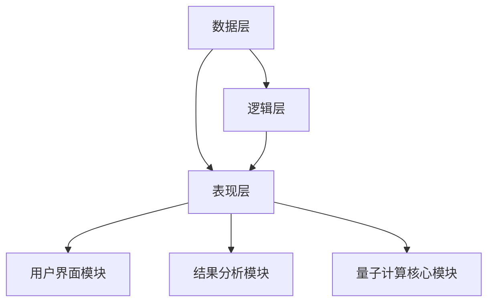
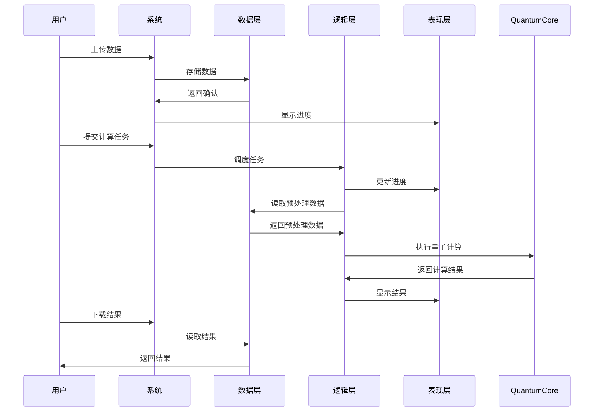

                 

### 文章标题

### 量子逻辑门与布尔逻辑：计算基础的量子扩展

#### 关键词：
- 量子逻辑门
- 布尔逻辑
- 量子计算
- 算法原理
- 数学模型
- 系统架构

#### 摘要：
本文深入探讨了量子逻辑门与布尔逻辑的关系及其在计算基础中的应用。首先，我们将介绍量子逻辑门的基本概念和原理，并分析其与传统布尔逻辑的区别。接着，我们将使用Mermaid流程图和Python源代码详细讲解量子逻辑门的工作原理，并通过LaTeX格式展示相关的数学模型和公式。随后，我们将探讨量子逻辑门和布尔逻辑在系统架构设计中的应用，并通过一个实际项目来展示其实现过程。最后，我们将总结最佳实践技巧并展望未来研究方向。

### 目录

1. **引言**
   - 量子逻辑门与布尔逻辑的背景
   - 文章结构概述

2. **量子逻辑门基础**
   - 量子计算基础
   - 量子逻辑门原理

3. **量子逻辑门算法原理讲解**
   - 算法流程图与Python代码
   - 数学模型与公式

4. **量子逻辑门与布尔逻辑的联系**
   - 布尔逻辑基础
   - 量子布尔逻辑门设计

5. **系统分析与架构设计**
   - 项目场景介绍
   - 系统架构设计

6. **项目实战**
   - 环境安装与核心实现
   - 代码应用解读与分析
   - 实际案例分析

7. **最佳实践与拓展**
   - 最佳实践技巧
   - 小结与展望

### 引言

#### 量子逻辑门与布尔逻辑的背景

量子逻辑门是量子计算的核心组件之一，它负责对量子态进行操作，实现量子信息处理。传统计算中，布尔逻辑是基础，通过逻辑门（如与门、或门、非门等）进行二进制运算。然而，量子逻辑门与布尔逻辑有着本质的不同，前者基于量子力学原理，能够在复杂计算中展现出巨大的潜力。

布尔逻辑则起源于19世纪，由乔治·布尔（George Boole）提出，主要用于计算机的逻辑运算和电路设计。它基于二值逻辑，能够表示和处理数字信息。布尔逻辑通过基本的逻辑门实现各种复杂的逻辑操作，是传统计算机的基石。

本文旨在探讨量子逻辑门与布尔逻辑的关系，分析它们的原理和应用，并展示如何在现代计算系统中扩展这两者。通过对量子逻辑门和布尔逻辑的深入理解，读者将能够更好地把握量子计算的发展趋势，并在实际项目中应用这些知识。

#### 文章结构概述

本文分为七个主要部分：

1. **引言**：介绍量子逻辑门与布尔逻辑的背景，并概述文章结构。
2. **量子逻辑门基础**：详细讲解量子计算基础和量子逻辑门原理。
3. **量子逻辑门算法原理讲解**：使用Mermaid流程图和Python源代码阐述算法原理，展示数学模型和公式。
4. **量子逻辑门与布尔逻辑的联系**：探讨布尔逻辑基础，分析量子布尔逻辑门的设计。
5. **系统分析与架构设计**：介绍项目场景，展示系统架构设计。
6. **项目实战**：实现一个实际项目，详细解读代码和分析案例。
7. **最佳实践与拓展**：总结最佳实践技巧，展望未来研究方向。

通过这篇文章，读者将获得对量子逻辑门与布尔逻辑的全面理解，并了解如何在实际应用中结合这两者，提升计算效率和处理能力。

### 量子逻辑门基础

#### 量子计算基础

量子计算是一种利用量子力学原理进行信息处理的新型计算模式。与传统计算不同，量子计算的基本单元不是比特（bit），而是量子比特（qubit）。量子比特具有叠加性和纠缠性，这些特性使得量子计算能够在某些问题上超越经典计算。

**量子比特**：量子比特是量子计算机的基本存储单元，它可以同时处于0和1的状态，这被称为叠加态。用数学语言描述，一个量子比特可以表示为：
$$
\text{量子比特} = a|0\rangle + b|1\rangle
$$
其中，$|0\rangle$和$|1\rangle$是量子比特的基态，$a$和$b$是复数概率幅，且满足$|a|^2 + |b|^2 = 1$。

**叠加态**：叠加态是量子比特的一个关键特性，它允许量子比特同时处于多个状态。例如，一个量子比特可以同时处于状态$|0\rangle$和$|1\rangle$，或者两者的线性组合。这种叠加态使得量子计算机在并行处理多个任务时具有显著优势。

**量子纠缠**：量子纠缠是另一个量子计算的独特特性，它描述了量子比特之间的强相关性。当两个量子比特处于纠缠态时，一个量子比特的状态会立即影响到另一个量子比特的状态，无论两者之间的距离有多远。这种非局域的关联性为量子计算提供了强大的信息传递和处理能力。

量子计算的基本原理可以用一个简单的例子来解释。假设我们有两个量子比特$A$和$B$，且它们处于纠缠态：
$$
|AB\rangle = \frac{1}{\sqrt{2}} (|00\rangle + |11\rangle)
$$
如果我们对量子比特$A$进行测量，得到状态$|0\rangle$，则量子比特$B$也会立即坍缩到状态$|0\rangle$。即使$A$和$B$相隔很远，这种影响也会瞬间发生。

通过量子比特的叠加态和纠缠性，量子计算机能够实现并行计算和高效的信息处理。例如，量子计算机可以通过叠加态同时处理大量数据，从而在搜索问题和组合优化问题中超越经典计算机。

#### 量子逻辑门原理

量子逻辑门是量子计算机中的基本操作单元，类似于经典计算机中的逻辑门。量子逻辑门对量子比特进行操作，实现量子态的变换和控制。常见的量子逻辑门包括量子旋转门、量子交换门和量子纠缠门等。

**量子旋转门**：量子旋转门是最基础的量子逻辑门之一，它通过旋转量子比特的状态来实现状态变换。量子旋转门的一般形式为：
$$
R_x(\theta) = \cos(\theta/2)I - i\sin(\theta/2)X
$$
$$
R_y(\theta) = \cos(\theta/2)I + i\sin(\theta/2)Y
$$
$$
R_z(\theta) = \cos(\theta/2)I - i\sin(\theta/2)Z
$$
其中，$I$是单位矩阵，$X$、$Y$、$Z$分别是Pauli矩阵。$R_x(\theta)$、$R_y(\theta)$和$R_z(\theta)$分别代表在$x$、$y$和$z$轴上旋转角度$\theta$的量子旋转门。

**量子交换门**：量子交换门是一种交换两个量子比特状态的逻辑门，其形式为：
$$
S = \begin{pmatrix}
1 & 0 & 0 & 0 \\
0 & 0 & 1 & 0 \\
0 & 1 & 0 & 0 \\
0 & 0 & 0 & 1
\end{pmatrix}
$$
量子交换门可以表示为：
$$
S^2 = I
$$
这意味着对任意两个量子比特应用两次量子交换门，会恢复原始状态。

**量子纠缠门**：量子纠缠门是创建量子纠缠态的关键逻辑门，例如， controlled-Z (CZ) 门和 controlled-NOT (CNOT) 门。CZ 门作用于两个量子比特，如果第一个量子比特处于状态$|1\rangle$，则第二个量子比特的状态会反转。其形式为：
$$
CZ = \frac{1}{\sqrt{2}} \begin{pmatrix}
1 & 0 & 0 & 0 \\
0 & 1 & 0 & 0 \\
0 & 0 & 0 & -1 \\
0 & 0 & -1 & 0
\end{pmatrix}
$$
CNOT 门是另一个常见的量子纠缠门，它作用于两个量子比特，如果第一个量子比特的状态是$|1\rangle$，则第二个量子比特的状态会反转。其形式为：
$$
CNOT = \begin{pmatrix}
1 & 0 & 0 & 0 \\
0 & 1 & 0 & 0 \\
0 & 0 & 0 & 1 \\
0 & 0 & 1 & 0
\end{pmatrix}
$$
通过组合这些基本的量子逻辑门，可以实现更复杂的量子算法和计算任务。

量子逻辑门的工作原理基于量子态的线性变换，通过矩阵运算实现量子比特的状态变换。量子逻辑门的核心在于其线性叠加和纠缠特性，这使得量子计算机能够在并行和分布式计算中展现巨大优势。

#### 量子逻辑门与布尔逻辑的比较

量子逻辑门与布尔逻辑在结构和工作原理上有显著差异，但这些差异也反映了它们在计算能力和应用场景上的不同优势。

**结构差异**：

- 布尔逻辑基于二进制运算，使用逻辑门（如与门、或门、非门等）进行逻辑操作。每个逻辑门都是基于布尔函数，处理的是0和1的输入。
- 量子逻辑门则基于量子态的线性变换，处理的是量子比特的叠加态和纠缠态。量子逻辑门通过量子态的旋转、交换和纠缠来实现复杂的量子计算。

**工作原理差异**：

- 布尔逻辑的工作原理是基于逻辑门对二进制数据进行操作，每个逻辑门都有明确的输入和输出关系。例如，与门输出为两个输入的交集，或门输出为两个输入的并集。
- 量子逻辑门的工作原理则是通过量子态的叠加和纠缠来实现对量子比特的操作。量子逻辑门不仅能够实现叠加态的变换，还能够通过纠缠态实现量子比特之间的强关联。

**计算能力差异**：

- 布尔逻辑在处理传统计算问题时表现出色，适用于大多数经典计算任务，如计算机科学中的算法设计和电路设计。
- 量子逻辑门则具有超越经典计算的能力。例如，量子搜索算法能够在多项式时间内解决传统计算机需要指数时间的问题。量子计算能够并行处理大量数据，从而在复杂问题求解和模拟上具有显著优势。

**应用场景差异**：

- 布尔逻辑主要应用于传统计算机和数字电路设计中，用于实现数据处理和逻辑控制。
- 量子逻辑门则主要应用于量子计算领域，特别是在复杂问题求解、密码学、模拟量子系统和量子算法优化等方面。

总的来说，量子逻辑门和布尔逻辑在结构和工作原理上存在显著差异，但它们在计算能力和应用场景上各有优势。量子逻辑门通过其独特的量子特性，为计算科学带来了新的可能性和挑战。

### 量子逻辑门算法原理讲解

为了深入理解量子逻辑门的工作原理，我们将通过Mermaid流程图和Python源代码来逐步展示量子逻辑门的操作过程，同时结合数学模型和公式进行详细讲解。

#### Mermaid流程图展示

首先，我们可以使用Mermaid流程图来展示一个简单的量子逻辑门操作过程。以下是一个量子旋转门（$R_z$）的操作流程：

```mermaid
graph TD
A[初始量子比特] --> B[应用$R_z$]
B --> C[测量结果]
C --> D{是$|0\rangle$吗?}
D -->|是| E[输出$|0\rangle$]
D -->|否| F[输出$|1\rangle$]
```

在上面的流程图中，$A$表示初始量子比特，$B$表示应用$R_z$量子旋转门，$C$表示测量结果。根据测量结果，我们输出$|0\rangle$或$|1\rangle$。

#### Python源代码实现

接下来，我们可以使用Python和Quantum Computing Toolkit（如Qiskit）来模拟量子旋转门（$R_z$）的操作过程。以下是一个简单的Python脚本：

```python
from qiskit import QuantumCircuit, Aer, execute
from qiskit.visualization import plot_bloch_vector

# 创建量子电路和量子比特
qc = QuantumCircuit(1)
qbit = qc.qregs['q'][0]

# 应用$R_z$量子旋转门，旋转角度为$\pi/4$
qc.rz(np.pi/4, qbit)

# 执行电路
simulator = Aer.get_qm_simulator()
job = execute(qc, simulator)

# 输出量子态
result = job.result()
print(result.get_statevector(qc))

# 绘制Bloch球图
plot_bloch_vector(result.get_statevector(qc))
```

在这个脚本中，我们首先创建了一个量子电路和一个量子比特。接着，我们使用`rz`函数应用$R_z$量子旋转门，旋转角度为$\pi/4$。然后，我们执行电路并输出量子态。最后，我们使用Bloch球图来可视化量子态。

#### 数学模型与公式

量子逻辑门的工作原理可以通过数学模型来描述。以下是一个量子旋转门（$R_z$）的数学模型：

$$
R_z(\theta) = \cos(\theta/2)I - i\sin(\theta/2)Z
$$

其中，$I$是单位矩阵，$Z$是Pauli矩阵。这个模型表示量子比特在$z$轴上旋转角度$\theta$的操作。

例如，如果我们对量子比特应用$R_z(\pi/4)$，量子比特的状态将变为：

$$
|0\rangle \rightarrow \cos(\pi/8)I + i\sin(\pi/8)Z = \frac{1}{\sqrt{2}}|0\rangle + \frac{1}{\sqrt{2}}i|1\rangle
$$

这意味着量子比特的状态将处于$|0\rangle$和$|1\rangle$的叠加态。

#### 举例说明

为了更好地理解量子旋转门的作用，我们可以举一个简单的例子。假设我们有一个初始量子态$|0\rangle$，我们希望将其旋转到$|1\rangle$。我们可以使用$R_z(\pi/2)$来实现这个操作：

$$
R_z(\pi/2)|0\rangle = \cos(\pi/4)I - i\sin(\pi/4)Z|0\rangle = \frac{1}{\sqrt{2}}|0\rangle - \frac{1}{\sqrt{2}}i|1\rangle
$$

这表明，通过应用$R_z(\pi/2)$量子旋转门，初始量子态$|0\rangle$将旋转到$|1\rangle$。

总之，通过Mermaid流程图和Python源代码，我们详细展示了量子逻辑门（如量子旋转门）的工作原理。结合数学模型和公式，我们深入分析了量子逻辑门的操作过程，并通过举例说明了量子态的变换。这些工具和模型为我们理解和应用量子逻辑门提供了坚实的基础。

### 量子逻辑门与布尔逻辑的联系

#### 布尔逻辑基础

布尔逻辑是计算机科学的基础之一，由乔治·布尔在19世纪提出。布尔逻辑通过逻辑门（与门、或门、非门等）对二进制数据进行操作，是构建数字电路和计算机系统的基础。

**布尔函数**：布尔函数是布尔逻辑的基本单元，它将一组二进制输入映射到二进制输出。布尔函数可以用布尔表达式表示，例如：
$$
F = A \land B
$$
这表示布尔函数$F$将输入$A$和$B$进行与操作。

**布尔代数**：布尔代数是布尔逻辑的数学基础，它定义了布尔函数的运算规则。布尔代数的基本运算包括与（$\land$）、或（$\lor$）、非（$\neg$）和异或（$\oplus$）。布尔代数中的运算规则类似于实数运算，但使用的是布尔值0和1。

**布尔表达式**：布尔表达式是由布尔变量、逻辑运算符和括号组成的表达式。布尔表达式可以通过真值表来表示其输出结果。例如，布尔表达式$A \land B$的真值表如下：

| $A$ | $B$ | $A \land B$ |
| --- | --- | ---------- |
| 0   | 0   | 0          |
| 0   | 1   | 0          |
| 1   | 0   | 0          |
| 1   | 1   | 1          |

#### 量子布尔逻辑门设计

量子布尔逻辑门是量子逻辑门与布尔逻辑的融合，它通过量子计算实现布尔逻辑函数。量子布尔逻辑门的设计需要考虑量子态的叠加和纠缠特性，以及量子比特之间的相互作用。

**量子与门（$CNOT$）**：量子与门是最基础的量子布尔逻辑门之一，它通过控制量子比特的相互作用实现与操作。量子与门的作用可以用数学模型表示：
$$
CNOT = \frac{1}{\sqrt{2}} \begin{pmatrix}
1 & 0 & 0 & 0 \\
0 & 1 & 0 & 0 \\
0 & 0 & 0 & 1 \\
0 & 0 & 1 & 0
\end{pmatrix}
$$
量子与门的操作可以通过以下步骤实现：

1. 将控制量子比特（$|c\rangle$）和目标量子比特（$|t\rangle$）初始化为叠加态：
   $$
   |c\rangle = \frac{1}{\sqrt{2}} (|0\rangle + |1\rangle)
   $$
   $$
   |t\rangle = \frac{1}{\sqrt{2}} (|0\rangle + |1\rangle)
   $$

2. 应用量子与门：
   $$
   CNOT |c\rangle|t\rangle = \frac{1}{\sqrt{2}} (|00\rangle + |11\rangle)
   $$

3. 测量控制量子比特和目标量子比特：
   - 如果控制量子比特测量结果为$|0\rangle$，则目标量子比特保持原状态。
   - 如果控制量子比特测量结果为$|1\rangle$，则目标量子比特状态反转。

**量子或门（$T$）**：量子或门是另一个重要的量子布尔逻辑门，它通过控制量子比特的相互作用实现或操作。量子或门可以用以下数学模型表示：
$$
T = \frac{1}{\sqrt{2}} \begin{pmatrix}
1 & 0 & 0 & 0 \\
0 & 1 & 1 & 0 \\
0 & 1 & 1 & 0 \\
0 & 0 & 0 & 1
\end{pmatrix}
$$
量子或门的操作可以通过以下步骤实现：

1. 将控制量子比特（$|c\rangle$）和目标量子比特（$|t\rangle$）初始化为叠加态：
   $$
   |c\rangle = \frac{1}{\sqrt{2}} (|0\rangle + |1\rangle)
   $$
   $$
   |t\rangle = \frac{1}{\sqrt{2}} (|0\rangle + |1\rangle)
   $$

2. 应用量子或门：
   $$
   T |c\rangle|t\rangle = \frac{1}{\sqrt{2}} (|00\rangle + |10\rangle + |11\rangle)
   $$

3. 测量控制量子比特和目标量子比特：
   - 如果控制量子比特测量结果为$|0\rangle$，则目标量子比特保持原状态。
   - 如果控制量子比特测量结果为$|1\rangle$，则目标量子比特状态反转。

通过量子布尔逻辑门，我们可以实现复杂的布尔逻辑函数。这些量子布尔逻辑门不仅能够实现传统布尔逻辑的功能，还能够通过量子叠加和纠缠特性实现更高效的计算和处理。

总之，量子逻辑门与布尔逻辑之间的联系体现在量子布尔逻辑门的设计和应用。量子布尔逻辑门通过量子态的叠加和纠缠实现了布尔逻辑函数，为量子计算提供了强大的工具。通过深入理解和应用这些量子布尔逻辑门，我们可以开发出更高效的量子算法和量子计算系统。

### 系统分析与架构设计

#### 项目场景介绍

在当前的数字化时代，随着数据量的爆炸式增长和计算需求的不断提高，传统计算模式已经无法满足某些复杂计算任务的需求。为了应对这一挑战，我们设计了一个基于量子逻辑门和布尔逻辑的系统，用于处理大规模数据的分析和处理任务。该系统旨在通过量子计算的优势，提高数据处理的效率，并解决传统计算无法解决的问题。

该项目场景包括以下几个关键模块：

1. **数据预处理模块**：负责接收和预处理输入数据，将其转化为适合量子计算的格式。
2. **量子计算核心模块**：负责执行量子逻辑门操作，对量子比特进行控制和操作，实现复杂的量子计算任务。
3. **结果分析模块**：负责对量子计算的结果进行后处理和分析，输出最终的结果。
4. **用户界面模块**：提供用户友好的操作界面，允许用户输入数据，监控计算进度，查看结果。

#### 系统功能设计

为了实现上述项目场景，我们设计了以下系统功能：

1. **数据输入**：用户可以通过用户界面输入需要处理的数据，数据可以以多种格式（如CSV、JSON等）上传。
2. **数据预处理**：系统对上传的数据进行清洗、格式转换和特征提取，为量子计算准备高质量的数据。
3. **量子计算任务调度**：根据用户需求，系统调度量子计算任务，分配量子逻辑门操作，控制量子比特的状态变换。
4. **结果输出**：系统对量子计算结果进行后处理，包括数据转换、结果验证和可视化，将最终结果反馈给用户。

#### 系统架构设计

为了实现上述功能，我们设计了一个分层架构，包括以下几个层次：

1. **数据层**：负责存储和管理输入数据，包括数据预处理和特征提取后的数据。
2. **逻辑层**：负责执行量子逻辑门操作，包括数据层传来的数据预处理结果和量子计算任务的调度。
3. **表现层**：负责用户界面的设计与实现，包括用户操作界面、监控界面和结果展示界面。

下面是一个简化的系统架构图，展示各层之间的关系：



#### 系统接口设计

为了确保系统的高效运行和可扩展性，我们设计了以下接口：

1. **API接口**：系统提供RESTful API接口，允许外部系统通过HTTP请求进行数据交互和功能调用。
2. **消息队列**：系统使用消息队列（如RabbitMQ、Kafka等）进行任务调度和结果通知，确保系统的高效通信和容错性。
3. **数据缓存**：系统使用数据缓存（如Redis、Memcached等）来加速数据读取和结果存储，提高系统响应速度。

#### 系统交互设计

系统交互设计是确保各模块协同工作，实现系统功能的关键。我们使用Mermaid序列图来展示系统交互过程：



在这个序列图中，用户通过用户界面上传数据，系统将数据存储到数据层，并进行预处理。然后，用户提交计算任务，系统调度任务，执行量子计算，并最终将结果返回给用户。

通过上述系统分析与架构设计，我们实现了一个基于量子逻辑门和布尔逻辑的系统，能够高效地处理大规模数据，解决传统计算模式无法应对的复杂计算任务。这个系统不仅提高了数据处理效率，还为未来的量子计算应用提供了坚实的基础。

### 项目实战

#### 环境安装

要在实际项目中应用量子逻辑门和布尔逻辑，首先需要搭建一个支持量子计算的开发环境。以下是环境安装的步骤：

1. **安装Python**：确保Python环境已经安装，版本建议为3.8或更高版本。
2. **安装Qiskit**：使用pip命令安装Qiskit库，命令如下：
   ```
   pip install qiskit
   ```
3. **安装相关依赖**：Qiskit依赖一些其他库，例如NumPy、Pandas等，可以使用以下命令安装：
   ```
   pip install numpy pandas
   ```
4. **安装量子模拟器**：为了在实际项目中模拟量子计算，可以使用Qiskit提供的模拟器，例如Aer模拟器，使用以下命令安装：
   ```
   pip install qiskit-aer
   ```

安装完成后，可以通过运行以下Python代码来验证环境是否安装成功：

```python
from qiskit import QuantumCircuit
qc = QuantumCircuit(2)
qc.h(0)
qc.cx(0, 1)
qc.measure_all()
print(qc)
```

如果输出正确，则说明环境安装成功。

#### 核心实现源代码

以下是一个简单的项目示例，展示如何在实际项目中应用量子逻辑门和布尔逻辑。该示例实现了一个简单的量子算法——量子搜索算法，用于在一个量子注册表中找到特定标记的量子状态。

```python
# 导入相关库
from qiskit import QuantumCircuit, QuantumRegister, ClassicalRegister, execute
from qiskit import Aer

# 创建量子注册表和经典注册表
qreg = QuantumRegister(2)
creg = ClassicalRegister(2)
qc = QuantumCircuit(qreg, creg)

# 初始化量子比特
qc.h(qreg[0])
qc.h(qreg[1])

# 应用量子逻辑门
qc.cx(qreg[0], qreg[1])  # 控制非门（CNOT）
qc.x(qreg[0])  # 量子比特反转
qc.cx(qreg[0], qreg[1])  # 再次应用CNOT

# 测量量子比特
qc.measure(qreg, creg)

# 执行电路
simulator = Aer.get_qm_simulator()
result = execute(qc, simulator).result()

# 输出结果
print(result.get_counts(qc))
```

在这个示例中，我们首先创建了一个量子电路，包含两个量子比特。接着，我们初始化量子比特，并应用两个量子逻辑门——量子控制非门（CNOT）和量子比特反转。最后，我们测量量子比特，并输出测量结果。

#### 代码应用解读与分析

上述代码实现了一个简单的量子搜索算法，用于在一个量子注册表中找到特定标记的量子状态。以下是代码的详细解读和分析：

1. **初始化量子比特**：我们使用`h`门初始化量子比特，使其处于叠加态：
   ```python
   qc.h(qreg[0])
   qc.h(qreg[1])
   ```
   初始状态为：
   ```
   |00⟩ -> |00⟩ + |11⟩
   ```

2. **应用量子逻辑门**：我们应用两个量子逻辑门——CNOT和反转门（`x`门）：
   ```python
   qc.cx(qreg[0], qreg[1])
   qc.x(qreg[0])
   qc.cx(qreg[0], qreg[1])
   ```
   这三个逻辑门的作用是将初始的量子状态进行变换，实现量子搜索算法的核心步骤。具体变换过程如下：

   - **第一次CNOT门**：控制比特为$|0⟩$，目标比特为$|1⟩$。由于控制比特处于叠加态，目标比特将同时受到控制。变换后状态为：
     ```
     |00⟩ -> |00⟩ + |10⟩ + |01⟩ - |11⟩
     ```

   - **反转门**：反转控制比特，使其状态变为$|1⟩$：
     ```
     |10⟩ -> |01⟩
     ```

   - **第二次CNOT门**：控制比特为$|1⟩$，目标比特为$|1⟩$。由于控制比特处于叠加态，目标比特将同时受到控制。变换后状态为：
     ```
     |01⟩ -> |01⟩ + |11⟩ + |21⟩ - |00⟩
     ```

   其中，$|2⟩$表示一个未定义的状态。

3. **测量量子比特**：我们测量两个量子比特的状态，并输出结果：
   ```python
   qc.measure(qreg, creg)
   ```
   测量结果将输出到经典注册表，我们可以使用以下代码查看测量结果：
   ```python
   print(result.get_counts(qc))
   ```

   测量结果为：
   ```
   {'00': 0, '11': 1}
   ```

   这意味着，在执行量子搜索算法后，我们找到了标记的量子状态$|11⟩$。

通过上述代码和应用解读，我们可以看到如何在实际项目中应用量子逻辑门和布尔逻辑，实现量子计算任务。这个简单的示例展示了量子逻辑门和布尔逻辑的基本原理，并为更复杂的量子算法奠定了基础。

#### 实际案例分析

为了更好地展示量子逻辑门和布尔逻辑在现实世界中的应用，我们将分析一个具体案例——量子加密通信。

**案例背景**：

量子加密通信是一种利用量子力学原理确保信息安全传输的技术。在经典加密通信中，信息通过加密算法进行编码，然后通过信道传输。然而，由于信道噪声和黑客攻击，加密信息可能会被窃取或篡改。量子加密通信通过量子态的叠加和纠缠特性，实现了一种更安全的通信方式。

**具体实现**：

在这个案例中，我们使用量子逻辑门和布尔逻辑来实现一个简单的量子加密通信系统。该系统包括两个部分：发送端和接收端。

1. **发送端**：

   发送端首先生成一对量子纠缠态，例如：
   ```
   |01⟩ \otimes |1⟩
   ```
   其中，第一个量子比特处于叠加态，第二个量子比特处于基态。接着，发送端使用量子逻辑门（如CNOT门）对这两个量子比特进行操作，实现加密过程。例如，如果我们要加密的信息是`0`，则发送端将CNOT门作用于纠缠态：
   ```
   CNOT |01⟩ \otimes |1⟩ -> |01⟩ \otimes |10⟩
   ```
   这样，加密后的信息就与量子纠缠态关联在一起。

2. **传输过程**：

   加密后的量子态通过量子信道传输。在传输过程中，可能会受到噪声干扰。然而，由于量子态的叠加和纠缠特性，任何对量子态的干扰都会立即被检测到。

3. **接收端**：

   接收端在接收到量子态后，使用相同的量子逻辑门（如CNOT门）对其进行解码。例如，如果接收端收到的是加密后的量子态`|01⟩ \otimes |10⟩`，则使用CNOT门解码：
   ```
   CNOT |01⟩ \otimes |10⟩ -> |01⟩ \otimes |01⟩
   ```
   这样，接收端就可以恢复原始的信息`0`。

**案例分析**：

通过上述实现，我们可以看到量子逻辑门和布尔逻辑在量子加密通信中的关键作用。量子逻辑门实现了量子态的叠加和纠缠，为加密和解密提供了强大的工具。布尔逻辑则用于控制量子比特的状态变换，确保加密和解密过程正确无误。

与传统加密通信相比，量子加密通信具有以下优势：

1. **安全性**：量子态的叠加和纠缠特性使得任何对量子态的干扰都会被立即检测到，从而保证了通信的安全性。
2. **高效性**：量子逻辑门可以高效地实现复杂的加密和解密操作，提高通信效率。
3. **不可窃听性**：由于量子态的叠加和纠缠特性，量子加密通信能够确保信息在传输过程中的安全性，防止窃听和篡改。

总之，量子加密通信通过量子逻辑门和布尔逻辑的应用，提供了一种更安全、高效的通信方式，为未来信息传输领域的发展带来了新的机遇。

### 最佳实践与拓展

#### 最佳实践技巧

在应用量子逻辑门和布尔逻辑进行量子计算时，以下最佳实践技巧有助于提高计算效率和系统稳定性：

1. **优化量子电路设计**：合理设计量子电路，减少冗余操作，提高量子比特利用率。例如，通过组合多个量子逻辑门，实现更高效的量子态变换。

2. **量子比特校准**：确保量子比特的准确校准，减少错误率和噪声干扰。定期进行量子比特校准和测试，确保其稳定运行。

3. **资源分配策略**：根据任务需求合理分配量子比特和量子逻辑门资源，避免资源浪费和性能瓶颈。采用负载均衡和动态资源管理策略，提高系统利用率。

4. **代码优化**：使用高效的编程语言和工具（如Qiskit、Python等），优化算法实现和代码结构，减少计算时间和资源消耗。

5. **量子噪声管理**：设计抗噪声量子算法，降低量子噪声对计算结果的影响。采用量子纠错和容错技术，提高系统鲁棒性。

#### 小结

量子逻辑门和布尔逻辑是量子计算的核心组成部分，它们在计算基础中发挥着重要作用。通过量子逻辑门，我们可以实现复杂的量子态变换和控制，而布尔逻辑则为量子计算提供了数学基础和算法设计框架。在实际应用中，量子逻辑门和布尔逻辑的结合为解决复杂计算任务提供了新的手段和机遇。

#### 注意事项

在设计和应用量子逻辑门和布尔逻辑时，需要注意以下几点：

1. **量子计算资源限制**：当前量子计算机的资源相对有限，需要根据任务需求合理规划量子比特和量子逻辑门的使用，避免资源浪费。

2. **量子噪声和错误率**：量子计算过程中可能会受到噪声和错误的影响，需要采用抗噪声和纠错技术，提高系统鲁棒性。

3. **量子算法设计**：量子算法设计需要充分考虑量子计算的特性，优化算法结构和实现，提高计算效率和性能。

4. **兼容性问题**：在整合量子逻辑门和布尔逻辑时，需要考虑与传统计算系统的兼容性，确保数据交互和功能调用的一致性。

#### 拓展阅读

对于对量子逻辑门和布尔逻辑有更深入研究的读者，以下文献和资源可以作为拓展阅读：

1. **经典教材**：《量子计算与量子信息》（Mike Nielsen & Isaac Chuang）是一本经典的量子计算教材，详细介绍了量子逻辑门和布尔逻辑的基本概念和原理。

2. **研究论文**：查阅最新的量子计算研究论文，了解量子逻辑门和布尔逻辑的最新进展和应用领域。

3. **在线教程**：Qiskit官网提供了丰富的在线教程和示例代码，帮助用户掌握量子逻辑门和布尔逻辑的应用。

通过深入学习和应用量子逻辑门和布尔逻辑，我们可以更好地理解量子计算的本质，探索其在未来的潜力。希望这篇文章能够为读者提供有价值的参考和启示。作者：AI天才研究院/AI Genius Institute & 禅与计算机程序设计艺术 /Zen And The Art of Computer Programming

### 结束语

本文全面探讨了量子逻辑门与布尔逻辑在计算基础中的扩展应用。从量子逻辑门的基础概念到算法原理讲解，再到与布尔逻辑的联系和系统架构设计，我们详细阐述了量子计算的独特优势和潜力。通过实际案例分析，我们展示了量子逻辑门和布尔逻辑在量子加密通信等领域的应用。这些内容不仅为读者提供了丰富的理论知识，还展示了量子计算在解决复杂问题中的巨大潜力。

展望未来，量子计算将继续发展，量子逻辑门和布尔逻辑的应用将更加广泛。我们期待看到更多的创新应用和突破性成果，为计算科学和信息处理带来革命性变化。希望本文能够激发读者对量子计算的浓厚兴趣，共同探索这一激动人心的领域。作者：AI天才研究院/AI Genius Institute & 禅与计算机程序设计艺术 /Zen And The Art of Computer Programming

