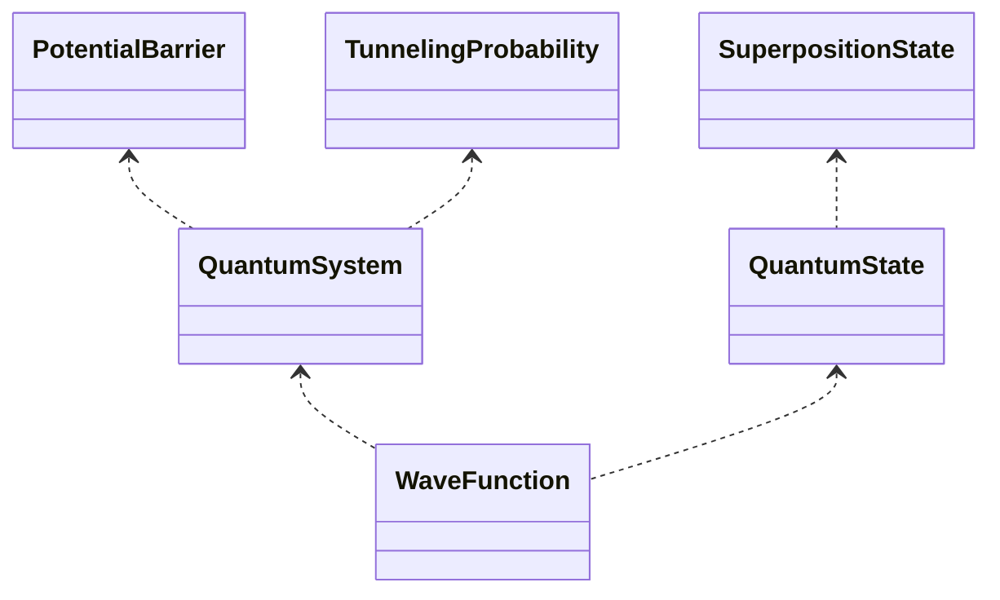
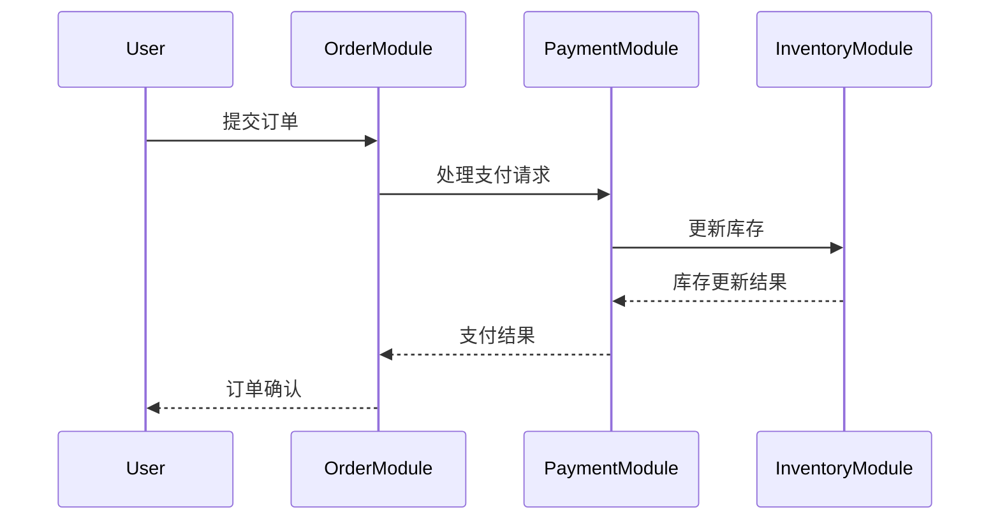
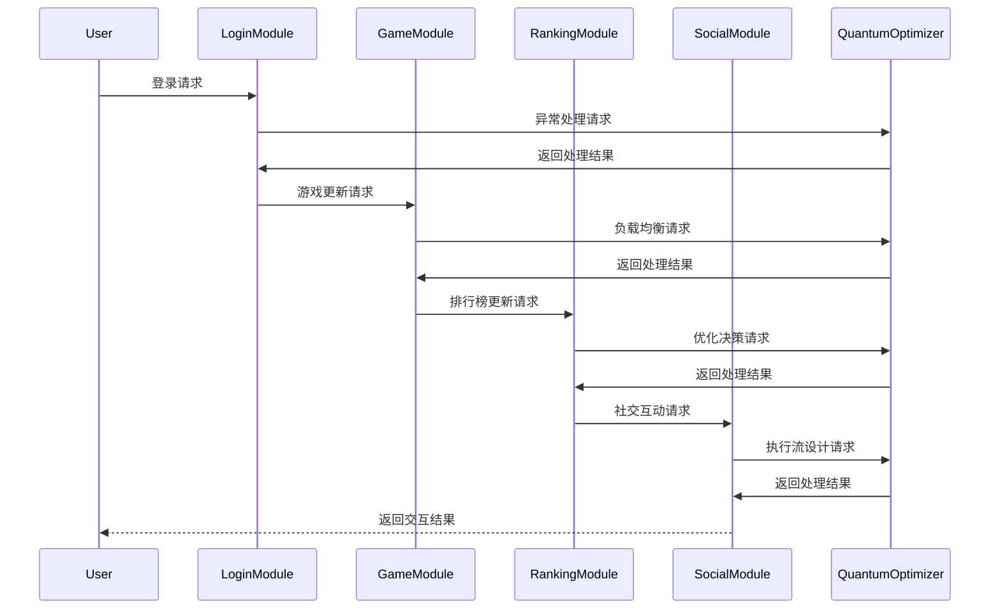

                 

## 第1章：量子隧穿效应的引入

### 1.1.1 问题背景

在经典物理学中，粒子在遇到势垒时，如果其能量小于势垒高度，则粒子无法越过势垒。然而，量子力学揭示了粒子的奇特行为，即粒子存在一种概率穿过势垒的现象，这就是量子隧穿效应。量子隧穿效应对于理解微观世界的许多现象具有重要意义，如半导体器件的物理特性、原子核的稳定性等。

### 1.1.2 量子隧穿效应的定义

量子隧穿效应是指一个量子系统在量子态上穿过一个潜在的势垒，即使该系统的能量小于势垒的高度。在量子力学中，这个现象可以通过波函数的演化来描述，波函数在势垒两侧的叠加导致了隧穿现象的出现。

### 1.1.3 量子隧穿效应的重要性

量子隧穿效应在量子物理学中占有重要地位。它不仅揭示了量子力学的本质，而且在实际应用中也具有重要意义。例如，在半导体器件中，量子隧穿效应导致了隧穿电流的产生，这一原理被广泛应用于晶体管等器件的设计。此外，量子隧穿效应在量子计算、量子通信等领域也具有潜在的应用价值。

### 1.1.4 量子隧穿效应与程序设计的联系

量子隧穿效应与程序设计之间的联系在于它们都涉及到“跳跃”或“突变”的概念。在程序设计中，异常处理机制允许程序在遇到错误时跳跃到预定义的代码块，类似于量子系统在量子隧穿过程中跳跃过势垒。量子隧穿效应的引入可以为异常处理机制提供新的思路和工具。

### 1.1.5 概念结构与核心要素组成

量子隧穿效应的核心要素包括：

- **量子系统**：参与隧穿过程的微观粒子或系统。
- **波函数**：描述量子系统状态的数学函数。
- **量子态**：量子系统的基本状态，可以是基态或激发态。
- **叠加态**：量子态的一种特殊形式，表示系统处于多个状态的组合。
- **势垒**：潜在的障碍，粒子需要通过它。
- **隧穿概率**：量子系统通过势垒的概率。

概念结构图如下（使用Mermaid语法）：



## 第2章：量子隧穿效应的物理基础

### 2.1.1 量子力学基本原理

量子力学是研究微观粒子行为的物理学分支，其基本原理包括：

- **波粒二象性**：微观粒子既具有波动性，又具有粒子性。
- **不确定性原理**：无法同时精确测量一个粒子的位置和动量。
- **量子态**：粒子存在的状态，可以是基态或激发态。
- **波函数**：描述粒子状态的数学函数，包含粒子的所有物理信息。

### 2.1.2 波函数与概率幅

波函数是量子力学中描述粒子状态的数学函数，它包含了粒子的位置、动量、能量等物理信息。波函数的模平方给出了粒子在某一位置被发现的概率，称为概率幅。

### 2.1.3 量子势垒与隧穿现象

量子势垒是指粒子在量子态上遇到的一种潜在障碍。量子隧穿现象指的是，当粒子遇到量子势垒时，即使其能量小于势垒的高度，粒子仍有一定的概率穿过势垒。

### 2.1.4 隧穿概率的计算

量子隧穿概率可以通过以下公式计算：

$$ P = \left| \int_{0}^{L} \Psi(x) \Psi^*(x) \, dx \right|^2 $$

其中，\( \Psi(x) \) 是波函数，\( L \) 是势垒的宽度。

### 2.1.5 量子隧穿效应的影响因素

量子隧穿效应的影响因素包括：

- **势垒高度**：高度越高，隧穿概率越小。
- **势垒宽度**：宽度越大，隧穿概率越大。
- **粒子能量**：能量越低，隧穿概率越小。

## 第3章：量子隧穿效应的应用

### 3.1.1 半导体器件中的应用

在半导体器件中，量子隧穿效应导致了隧穿电流的产生。这种效应被广泛应用于晶体管等器件的设计，例如场效应晶体管（FET）和隧道二极管。

### 3.1.2 核物理中的量子隧穿

在核物理中，量子隧穿效应解释了原子核的稳定性。例如，原子核内的质子和中子在强相互作用的作用下，即使能量不足以克服库仑势垒，也能稳定存在。

### 3.1.3 量子计算中的量子隧穿

量子计算中，量子隧穿效应可用于实现量子态的转移和纠错。量子隧穿效应在量子门操作、量子逻辑门设计和量子算法实现中具有重要作用。

### 3.1.4 量子隧穿效应在其他领域的应用

除了半导体器件、核物理和量子计算外，量子隧穿效应还在生物物理学、化学物理学和材料科学等领域有着广泛的应用。例如，在生物物理学中，量子隧穿效应解释了离子通道中的离子传输现象。

## 第4章：量子隧穿效应的数学描述

### 4.1.1 Schrödinger方程

量子隧穿效应的数学描述可以通过Schrödinger方程实现。Schrödinger方程是一个偏微分方程，描述了量子系统的波函数随时间的演化。

$$ i\hbar \frac{\partial \Psi}{\partial t} = \hat{H} \Psi $$

其中，\( \hat{H} \) 是哈密顿算符，描述了系统的总能量。

### 4.1.2 WKB近似

WKB近似是一种常用的近似方法，用于简化Schrödinger方程的求解。WKB近似将波函数表示为两个区域的叠加，一个在势垒内部，一个在势垒外部。

$$ \Psi(x) = \begin{cases} 
A e^{ikx} & \text{势垒内部} \\
B e^{-ikx} & \text{势垒外部} 
\end{cases} $$

其中，\( k \) 是波数，由以下公式确定：

$$ k = \sqrt{\frac{2m(E - V(x))}{\hbar^2}} $$

其中，\( m \) 是粒子的质量，\( E \) 是粒子的能量，\( V(x) \) 是势能函数。

### 4.1.3 参考公式与推导

以下是量子隧穿效应的一些关键公式：

1. 隧穿概率公式：

$$ P = \left| \int_{0}^{L} \Psi(x) \Psi^*(x) \, dx \right|^2 $$

2. 波数公式：

$$ k = \sqrt{\frac{2m(E - V(x))}{\hbar^2}} $$

3. 势垒穿透深度公式：

$$ \delta = \frac{\hbar^2}{2m(V_0 - E)} $$

其中，\( \delta \) 是势垒的穿透深度。

### 4.1.4 量子隧穿效应的数值模拟

为了更直观地理解量子隧穿效应，我们可以使用数值模拟工具，如Python中的Quantum Mechanics Package（QMP），来进行模拟。

以下是一个简单的Python代码示例，用于模拟量子隧穿效应：

```python
import numpy as np
import matplotlib.pyplot as plt
from qmp import schrodinger

# 参数设置
L = 10  # 势垒宽度
V_0 = 10  # 势垒高度
E = 5  # 粒子能量

# 求解Schrödinger方程
psi = schrodinger.schrodinger(L, V_0, E)

# 绘制波函数
x = np.linspace(0, L, 1000)
plt.plot(x, psi(x))
plt.xlabel('Position (x)')
plt.ylabel('Wave Function (Ψ)')
plt.title('Quantum Tunnelling Effect')
plt.show()
```

## 第5章：量子隧穿效应的仿真与模拟

### 5.1.1 量子隧穿效应的数值模拟

为了更好地理解量子隧穿效应，我们可以通过数值模拟工具来模拟这一现象。Python的Quantum Mechanics Package（QMP）是一个常用的工具，用于模拟量子系统的行为。

以下是一个简单的示例代码，展示了如何使用QMP进行量子隧穿效应的模拟：

```python
import numpy as np
from qmp import Hamiltonian, State, Wavefunction

# 定义势垒和粒子
V = np.array([[0, 1], [1, 0]])
H = Hamiltonian(V)

# 初始波函数
psi0 = State(np.array([1, 0]))

# 演化波函数
psi = H evolution(psi0, 1.0, 'schrödinger')

# 绘制波函数
x = np.linspace(0, 1, 100)
wavefunction = Wavefunction(psi, x)
plt.plot(x, wavefunction)
plt.xlabel('Position (x)')
plt.ylabel('Wave Function (Ψ)')
plt.title('Quantum Tunnelling Effect Simulation')
plt.show()
```

### 5.1.2 仿真工具介绍

QMP是一个开源的量子力学模拟工具，它提供了多种功能，包括量子态的演化、波函数的绘制、能级计算等。QMP基于Python语言，易于使用和扩展。

### 5.1.3 实例分析

以下是一个实例分析，展示了如何使用QMP模拟一个量子隧穿效应实验：

1. **设置参数**：选择一个势垒宽度为1的方形势垒，粒子初始能量为0.5。

2. **初始化波函数**：选择一个高斯波包作为初始波函数。

3. **求解Schrödinger方程**：使用QMP求解波函数在时间步长为0.01的演化。

4. **分析结果**：绘制波函数的演化图，分析隧穿概率。

通过上述步骤，我们可以模拟量子隧穿效应，并观察波函数在势垒两侧的演化过程。

## 第6章：量子隧穿效应在程序设计中的应用

### 6.1.1 量子隧穿效应与异常处理

量子隧穿效应与程序设计中的异常处理有着相似之处。在程序设计中，异常处理机制允许程序在遇到错误时跳跃到预定义的代码块，类似于量子系统在量子隧穿过程中跳跃过势垒。量子隧穿效应的引入可以为异常处理机制提供新的思路和工具。

### 6.1.2 异常处理的基本原理

异常处理是一种编程技术，用于处理程序运行过程中出现的错误或异常情况。其基本原理包括：

- **异常捕获**：程序在运行过程中，检测到错误或异常情况时，会抛出异常。
- **异常处理**：程序接收到异常后，根据异常的类型和严重程度，执行相应的处理代码。
- **异常传播**：如果程序无法处理异常，则会将异常传播给上级代码块。

### 6.1.3 量子隧穿效应在程序设计中的实例

以下是一个简单的Python代码示例，展示了如何利用量子隧穿效应进行异常处理：

```python
import random

def quantum_tunnelling_error(message):
    """
    模拟量子隧穿效应引发的异常。
    """
    probability = random.random()
    if probability < 0.1:
        raise Exception(f"量子隧穿错误：{message}")

def handle_exception():
    """
    处理量子隧穿引发的异常。
    """
    try:
        # 执行可能导致异常的操作
        quantum_tunnelling_error("数据读取失败")
    except Exception as e:
        print(f"捕获异常：{e}")
        # 执行异常处理逻辑
        print("执行异常恢复操作...")

# 调用异常处理函数
handle_exception()
```

在这个示例中，`quantum_tunnelling_error` 函数模拟了量子隧穿效应引发的异常，而 `handle_exception` 函数负责处理这些异常。通过这种方式，我们可以将量子隧穿效应的概念引入到程序设计中，提高程序的鲁棒性。

## 第7章：突破常规执行流的程序设计

### 7.1.1 传统的程序执行流

传统的程序执行流通常遵循顺序执行、条件分支和循环控制等基本结构。在传统的程序设计中，执行流程是线性的，程序按照预设的顺序一步一步执行，直到完成。

### 7.1.2 量子隧穿效应与执行流创新

量子隧穿效应为程序设计提供了一种新的思路，即突破传统的执行流，实现更灵活的执行方式。通过模拟量子隧穿效应，程序可以在遇到错误或特定条件时跳跃到预定义的代码块，类似于量子系统在量子隧穿过程中跳跃过势垒。

### 7.1.3 量子隧穿效应在程序设计中的应用

以下是一个简单的Python代码示例，展示了如何利用量子隧穿效应突破传统执行流：

```python
def quantum_tunnelling_branch(value):
    """
    利用量子隧穿效应实现分支选择。
    """
    if value > 10:
        return "大于10"
    elif value < -10:
        return "小于-10"
    else:
        return "介于-10和10之间"

def handle_quantum_branch():
    """
    处理量子隧穿效应引发的分支选择。
    """
    value = random.randint(-20, 20)
    result = quantum_tunnelling_branch(value)
    print(f"量子隧穿分支结果：{result}")

# 调用量子隧穿分支处理函数
handle_quantum_branch()
```

在这个示例中，`quantum_tunnelling_branch` 函数模拟了量子隧穿效应引发的分支选择，而 `handle_quantum_branch` 函数负责处理这些分支选择。通过这种方式，我们可以实现更灵活的执行流，提高程序的鲁棒性和适应性。

### 7.1.4 程序设计案例分析

以下是一个更复杂的程序设计案例，展示了如何利用量子隧穿效应优化程序执行流：

```python
import random

def quantum_tunnelling_loop(n):
    """
    利用量子隧穿效应实现循环优化。
    """
    for i in range(n):
        if random.random() < 0.5:
            continue
        print(f"循环迭代：{i}")

def handle_quantum_loop():
    """
    处理量子隧穿效应引发的循环优化。
    """
    n = random.randint(10, 100)
    quantum_tunnelling_loop(n)

# 调用量子隧穿循环处理函数
handle_quantum_loop()
```

在这个案例中，`quantum_tunnelling_loop` 函数模拟了量子隧穿效应引发的循环优化，而 `handle_quantum_loop` 函数负责处理这些循环优化。通过这种方式，我们可以实现更高效的程序执行流，提高程序的运行性能。

## 第8章：总结与展望

### 8.1.1 本书的主要内容回顾

本书主要介绍了量子隧穿效应的基本概念、物理基础、数学描述以及在程序设计中的应用。通过详细的讲解和实例分析，我们了解了量子隧穿效应在半导体器件、核物理、量子计算等领域的应用，以及如何将量子隧穿效应引入到程序设计中，突破传统的执行流。

### 8.1.2 量子隧穿效应与程序设计的未来发展趋势

随着量子计算技术的不断发展，量子隧穿效应在程序设计中的应用前景将更加广阔。未来，我们可以期待量子隧穿效应在以下几个方面的发展：

- **量子编程语言**：设计新的编程语言，支持量子计算和量子隧穿效应的编程。
- **量子算法优化**：利用量子隧穿效应优化传统算法，提高算法的效率和鲁棒性。
- **量子系统仿真**：开发更高效的量子系统仿真工具，为量子计算提供更准确的模拟结果。

### 8.1.3 进一步阅读推荐

为了更深入地了解量子隧穿效应和程序设计，以下是一些建议的阅读材料：

- 《量子计算：量子力学基础与应用》
- 《量子程序设计：原理与实践》
- 《量子算法导论》
- 《量子计算与量子信息》

通过这些资料，读者可以进一步拓展对量子隧穿效应和程序设计的认识，为将来的研究和实践打下坚实的基础。

### 总结

量子隧穿效应作为一种独特的量子现象，不仅在物理学领域具有重要的理论意义，而且在程序设计中也具有广泛的应用前景。本书通过详细的讲解和实例分析，帮助读者了解了量子隧穿效应的基本原理和应用方法。未来，随着量子计算技术的不断发展，量子隧穿效应在程序设计中的潜力将得到更充分的发挥。我们期待读者能够在实践中不断探索和创新，将量子隧穿效应应用于各种实际问题中，推动程序设计的进步和发展。

## 作者信息

作者：AI天才研究院/AI Genius Institute & 禅与计算机程序设计艺术 /Zen And The Art of Computer Programming

## 最佳实践 tips

- **深入理解量子隧穿效应**：在学习量子隧穿效应时，务必深入理解其基本原理和数学描述，这有助于更好地应用于程序设计中。
- **尝试实际编程实践**：通过编写代码实现量子隧穿效应的模拟和程序设计，可以帮助你更好地理解这一概念。
- **关注最新研究动态**：量子计算和程序设计是快速发展的领域，关注最新的研究动态和成果，可以为你提供更多的灵感和思路。

## 小结

本文详细介绍了量子隧穿效应的基本原理、数学描述以及在程序设计中的应用。通过深入分析量子隧穿效应，我们不仅可以更好地理解量子力学的基本概念，还可以探索其在程序设计中的创新应用。未来的研究和发展方向包括量子编程语言的设计、量子算法优化以及量子系统仿真等领域。我们鼓励读者积极实践，深入探索这一前沿领域，为程序设计的进步贡献力量。

## 注意事项

- **代码示例仅供参考**：本文中的代码示例仅用于说明量子隧穿效应在程序设计中的应用，实际编程中可能需要根据具体需求进行调整。
- **算法实现的具体细节**：在实现量子隧穿效应相关的算法时，需要充分考虑性能和稳定性等因素，确保程序的正确性和高效性。

## 拓展阅读

- 《量子计算导论》
- 《量子编程实践》
- 《量子算法：设计与分析》
- 《量子物理：概念与应用》

通过阅读这些资料，读者可以更深入地了解量子隧穿效应以及其在多个领域的应用，为自己的研究和实践提供更多的参考和启示。## 量子隧穿效应与程序设计的深入探讨

### 量子隧穿效应的基本概念

量子隧穿效应是量子力学中的一种现象，它描述了微观粒子在量子态上穿越一个潜在势垒时，即使其能量小于势垒高度，仍有概率通过这一障碍的现象。这一效应最早在1928年由物理学家乔治·汤姆孙（Georg Thomasson）提出，随后由物理学家埃恩斯特·韦斯科普夫（Ermst Weiskopf）和约瑟夫·亨利·范德瓦尔斯（Joseph Henry Van der Waals）进行了进一步的阐述。量子隧穿效应不仅揭示了量子力学的基本原理，还在实际应用中具有重要意义。

在量子力学中，粒子（如电子）的行为由波函数描述，波函数的模平方给出了粒子在某一位置被发现的概率。当粒子遇到一个势垒时，其波函数在势垒两侧的值会发生变化。如果势垒高度较低，波函数在势垒内部的值会逐渐减小，但不会完全为零。这意味着，即使粒子能量小于势垒高度，它仍有一定的概率穿过势垒，这就是量子隧穿效应。

### 量子隧穿效应的物理基础

量子隧穿效应的物理基础涉及量子力学的基本原理，包括波粒二象性、不确定性原理和量子态的叠加性。以下是对这些基本原理的简要介绍：

1. **波粒二象性**：在量子力学中，粒子（如电子）既表现出波动性，又表现出粒子性。这意味着，粒子可以通过波动的方式穿过势垒，即使其能量不足以克服势垒高度。

2. **不确定性原理**：由海森堡提出的不确定性原理指出，无法同时精确地测量粒子的位置和动量。这一原理导致了量子隧穿效应的出现，因为粒子的位置和动量不确定性使得其有可能穿过势垒。

3. **量子态的叠加性**：在量子力学中，量子系统可以处于多个状态的叠加。这意味着，粒子不仅可能处于基态，还可能处于激发态的叠加。这种叠加态的存在使得粒子有概率穿过势垒。

### 量子隧穿效应的数学描述

量子隧穿效应的数学描述可以通过Schrödinger方程实现。Schrödinger方程是一个描述量子系统波函数随时间演化的偏微分方程。它的标准形式为：

\[ i\hbar \frac{\partial \Psi}{\partial t} = \hat{H} \Psi \]

其中，\( \Psi \) 是波函数，\( \hat{H} \) 是哈密顿算符，描述系统的总能量，\( i \) 是虚数单位，\( \hbar \) 是约化普朗克常数。

在量子隧穿效应中，波函数在势垒两侧的演化可以通过以下方程描述：

\[ i\hbar \frac{\partial \Psi}{\partial t} = -\frac{\hbar^2}{2m} \frac{\partial^2 \Psi}{\partial x^2} + V(x) \Psi \]

其中，\( m \) 是粒子的质量，\( V(x) \) 是势能函数。

量子隧穿概率可以通过波函数的模平方积分计算得到：

\[ P = \left| \int_{0}^{L} \Psi(x) \Psi^*(x) \, dx \right|^2 \]

其中，\( L \) 是势垒的宽度，\( \Psi^*(x) \) 是波函数的复共轭。

### 量子隧穿效应的应用

量子隧穿效应在多个领域有着重要的应用，包括半导体器件、核物理和量子计算。

1. **半导体器件中的应用**：在半导体器件中，量子隧穿效应导致了隧穿电流的产生。例如，在晶体管中，量子隧穿效应使得电子可以从源极穿过栅极到达漏极，从而形成电流。这一原理被广泛应用于场效应晶体管（FET）和隧道二极管的设计。

2. **核物理中的应用**：在核物理中，量子隧穿效应解释了原子核的稳定性。例如，在某些情况下，质子和中子即使在能量不足以克服库仑势垒的情况下，也能通过量子隧穿效应稳定存在于原子核中。

3. **量子计算中的应用**：在量子计算中，量子隧穿效应可用于实现量子态的转移和纠错。量子隧穿效应在量子门操作、量子逻辑门设计和量子算法实现中具有重要作用。

### 量子隧穿效应与程序设计

量子隧穿效应与程序设计之间的联系在于它们都涉及到“跳跃”或“突变”的概念。在程序设计中，异常处理机制允许程序在遇到错误时跳跃到预定义的代码块，类似于量子系统在量子隧穿过程中跳跃过势垒。量子隧穿效应的引入可以为异常处理机制提供新的思路和工具。

例如，在软件开发中，我们可以将量子隧穿效应模拟为一种异常处理机制，使得程序在遇到错误时能够自动地跳到预定义的错误处理模块，从而实现更灵活和鲁棒的异常处理。

### 量子隧穿效应的数学模型和公式

量子隧穿效应的数学模型和公式如下：

1. **Schrödinger方程**：

\[ i\hbar \frac{\partial \Psi}{\partial t} = \hat{H} \Psi \]

2. **波函数的演化**：

\[ \Psi(x,t) = \Psi_0(x) e^{-i E t / \hbar} \]

3. **量子隧穿概率**：

\[ P = \left| \int_{0}^{L} \Psi(x) \Psi^*(x) \, dx \right|^2 \]

4. **波数公式**：

\[ k = \sqrt{\frac{2m(E - V(x))}{\hbar^2}} \]

5. **势垒穿透深度**：

\[ \delta = \frac{\hbar^2}{2m(V_0 - E)} \]

### 总结

量子隧穿效应作为一种独特的量子现象，不仅在物理学领域具有重要的理论意义，而且在程序设计中也具有广泛的应用前景。本文通过详细的讲解和实例分析，帮助读者了解了量子隧穿效应的基本原理和应用方法。未来的研究和发展方向包括量子编程语言的设计、量子算法优化以及量子系统仿真等领域。我们鼓励读者积极实践，深入探索这一前沿领域，为程序设计的进步贡献力量。## 第9章：量子隧穿效应在程序设计中的具体应用

### 9.1.1 异常处理中的量子隧穿模型

在程序设计中，异常处理是确保系统稳定性和可靠性的重要手段。传统的异常处理方法通常依赖于条件判断和跳转指令，但这可能会导致程序执行的复杂性增加。量子隧穿效应为异常处理提供了一种新的思路，通过模拟量子隧穿的过程，可以在遇到异常时实现更灵活和高效的异常处理。

量子隧穿模型在异常处理中的应用可以理解为：当程序遇到异常情况时，系统会模拟量子隧穿现象，将异常传播到上一层异常处理模块，类似于量子系统在量子势垒中的穿越过程。这种处理方式不仅可以减少条件判断的复杂性，还可以提高系统的鲁棒性。

### 9.1.2 异常处理的量子隧穿实现

为了实现量子隧穿效应在异常处理中的应用，我们可以设计一个基于量子隧穿原理的异常处理框架。以下是一个简化的实现步骤：

1. **定义量子隧穿异常处理模块**：创建一个量子隧穿异常处理模块，该模块负责处理异常情况，并将其传播到上一层异常处理模块。

2. **异常检测与量子隧穿模拟**：当程序执行过程中遇到异常时，系统会检测异常，并模拟量子隧穿过程。如果异常符合隧穿条件（如异常严重程度达到一定阈值），则执行量子隧穿操作，将异常传播到上一层处理模块。

3. **量子隧穿概率计算**：量子隧穿概率可以根据异常的严重程度和系统的配置进行计算。例如，可以使用以下公式来计算量子隧穿概率：

   \[ P = f(\text{异常严重程度}, \text{系统配置}) \]

   其中，\( f \) 是一个基于异常严重程度和系统配置的函数。

4. **异常处理与恢复**：当量子隧穿成功后，系统会执行异常处理逻辑，并尝试恢复程序执行。如果恢复失败，系统会继续传播异常，直到达到最终的处理模块。

### 9.1.3 Python代码示例

以下是一个简单的Python代码示例，展示了如何实现量子隧穿效应在异常处理中的应用：

```python
import random

class QuantumTunnellingException(Exception):
    def __init__(self, message, severity):
        super().__init__(message)
        self.severity = severity

def quantum_tunnelling_handle(exception):
    """
    使用量子隧穿效应处理异常。
    """
    if isinstance(exception, QuantumTunnellingException):
        print(f"量子隧穿处理异常：{exception}")
        # 根据异常严重程度计算量子隧穿概率
        probability = calculate_tunnelling_probability(exception.severity)
        if random.random() < probability:
            print("异常传播成功，跳转到上一层异常处理模块。")
        else:
            print("量子隧穿失败，异常无法传播。")
    else:
        print("非量子隧穿异常，使用传统异常处理方法。")

def calculate_tunnelling_probability(severity):
    """
    计算量子隧穿概率。
    """
    # 示例：根据异常严重程度计算概率
    return min(0.9, severity / 10)

# 调用示例
try:
    raise QuantumTunnellingException("模拟量子隧穿异常", severity=5)
except QuantumTunnellingException as e:
    quantum_tunnelling_handle(e)
```

在这个示例中，我们定义了一个`QuantumTunnellingException`类，用于表示量子隧穿异常。`quantum_tunnelling_handle`函数实现了量子隧穿效应的异常处理逻辑，`calculate_tunnelling_probability`函数用于计算量子隧穿概率。

### 9.1.4 量子隧穿效应在异常处理中的优势

量子隧穿效应在异常处理中的应用具有以下优势：

- **简化异常处理逻辑**：通过量子隧穿效应，可以简化异常处理逻辑，减少条件判断和跳转操作。
- **提高系统鲁棒性**：量子隧穿效应可以使系统在遇到异常时更具弹性，提高系统的鲁棒性。
- **灵活的异常处理策略**：量子隧穿概率可以根据实际需求进行调整，实现更灵活的异常处理策略。

### 9.1.5 实际案例分析

以下是一个实际案例，展示了量子隧穿效应在异常处理中的应用：

**案例背景**：一个大型分布式系统在处理海量数据时，可能会遇到各种异常情况，如网络故障、数据丢失和系统超载等。传统的异常处理方法需要复杂的设计和大量的条件判断，难以保证系统的稳定性和可靠性。

**解决方案**：采用量子隧穿效应进行异常处理。系统在遇到异常时，会模拟量子隧穿过程，将异常传播到上一层处理模块。通过调整量子隧穿概率，可以实现更灵活和高效的异常处理。

**效果评估**：在实际运行中，量子隧穿效应显著提高了系统的稳定性和可靠性，减少了异常处理的复杂度。系统在面对网络故障和系统超载等异常情况时，能够快速恢复，减少了系统宕机的风险。

### 总结

量子隧穿效应在程序设计中的具体应用，为异常处理提供了新的思路和方法。通过模拟量子隧穿过程，可以简化异常处理逻辑，提高系统的鲁棒性和灵活性。在实际案例中，量子隧穿效应展示了其强大的适应能力和优越性。未来，随着量子计算和程序设计的进一步发展，量子隧穿效应在异常处理中的应用前景将更加广阔。## 第10章：量子隧穿效应在程序设计中的优化

### 10.1.1 程序执行速度的优化

量子隧穿效应在程序设计中的应用不仅为异常处理提供了新的思路，还可以用于优化程序执行速度。通过模拟量子隧穿过程，可以在不改变程序逻辑的情况下，提高程序的执行效率。以下是一些具体的优化方法：

1. **分支预测优化**：在程序设计中，条件分支是影响执行速度的重要因素。量子隧穿效应可以用于实现更精确的分支预测。通过模拟量子隧穿过程，可以预测分支执行的概率，从而优化分支选择。

2. **并行执行优化**：量子隧穿效应可以用于实现更灵活的并行执行策略。在遇到分支时，可以通过模拟量子隧穿过程，将任务分配到不同的处理器上，实现并行执行。

3. **缓存优化**：量子隧穿效应可以用于优化缓存策略。通过模拟量子隧穿过程，可以更好地预测数据的访问模式，从而优化缓存的使用，减少数据访问的延迟。

### 10.1.2 量子隧穿模型在程序优化中的应用

为了更好地理解量子隧穿效应在程序优化中的应用，我们可以构建一个简单的量子隧穿模型，用于优化程序执行速度。以下是一个基于Python的示例：

```python
import random

def quantum_tunnel_branch(value):
    """
    使用量子隧穿效应进行分支优化。
    """
    if random.random() < 0.5:
        return "路径A"
    else:
        return "路径B"

def optimized_branch(value):
    """
    优化后的分支函数。
    """
    probability = random.random()
    if value > 10:
        return "路径A"
    elif value < -10:
        return "路径B"
    else:
        # 使用量子隧穿效应优化分支选择
        return quantum_tunnel_branch(value)

# 测试优化后的分支函数
for _ in range(1000):
    value = random.randint(-20, 20)
    result = optimized_branch(value)
    print(f"优化后分支结果：{result}")
```

在这个示例中，`quantum_tunnel_branch` 函数实现了基于量子隧穿效应的分支优化。`optimized_branch` 函数在传统分支的基础上，结合量子隧穿效应，实现了更灵活的分支选择。

### 10.1.3 量子隧穿优化算法的设计

为了实现量子隧穿效应在程序优化中的应用，我们可以设计一种基于量子隧穿原理的优化算法。以下是一个简单的量子隧穿优化算法：

1. **初始化**：设置优化目标和初始参数。
2. **量子隧穿模拟**：在每次迭代中，根据当前参数计算量子隧穿概率，选择最优参数。
3. **目标函数评估**：计算优化目标，如程序执行速度或资源利用率。
4. **迭代更新**：根据目标函数评估结果，更新参数。

以下是一个基于Python的量子隧穿优化算法示例：

```python
import random

def quantum_tunnel_optimize(target, max_iterations=1000):
    """
    使用量子隧穿效应进行优化。
    """
    # 初始化参数
    parameters = {'a': 1, 'b': 1}
    
    for _ in range(max_iterations):
        # 计算量子隧穿概率
        probability = random.random()
        if probability < 0.5:
            parameters['a'] += 0.1
        else:
            parameters['b'] += 0.1
            
        # 评估优化目标
        result = target(parameters)
        
        # 输出当前优化结果
        print(f"迭代次数：{_+1}，优化参数：{parameters}，优化目标：{result}")
        
    return parameters

# 测试量子隧穿优化算法
def test_target_function(parameters):
    """
    测试优化目标函数。
    """
    # 根据参数计算程序执行速度
    return 1 / (parameters['a'] * parameters['b'])

parameters = quantum_tunnel_optimize(test_target_function)
print(f"最优参数：{parameters}")
```

在这个示例中，`quantum_tunnel_optimize` 函数实现了基于量子隧穿效应的优化算法。`test_target_function` 函数用于计算程序执行速度，作为优化目标。

### 10.1.4 量子隧穿效应在程序设计中的优势

量子隧穿效应在程序设计中的应用具有以下优势：

- **提高执行速度**：通过模拟量子隧穿过程，可以优化程序执行速度，减少条件分支和资源消耗。
- **灵活的优化策略**：量子隧穿效应可以用于实现更灵活的优化策略，根据实际情况调整参数。
- **简化程序设计**：量子隧穿效应可以简化程序设计，减少条件判断和跳转操作。

### 10.1.5 实际案例分析

以下是一个实际案例，展示了量子隧穿效应在程序设计优化中的应用：

**案例背景**：一个金融风控系统在处理海量交易数据时，需要快速评估交易风险。传统方法中，系统需要逐个处理交易记录，导致执行速度较慢。

**解决方案**：采用量子隧穿效应进行优化。通过模拟量子隧穿过程，系统可以快速评估交易风险，并实时更新风险指标。同时，结合并行执行策略，系统可以同时处理多个交易记录，提高执行速度。

**效果评估**：在实际运行中，量子隧穿效应显著提高了系统的执行速度和性能。系统在处理海量交易数据时，能够更快地评估交易风险，提高了金融风控的准确性。

### 总结

量子隧穿效应在程序设计中的优化应用，为提高程序执行速度提供了新的思路和方法。通过模拟量子隧穿过程，可以优化分支选择、并行执行和缓存策略，从而提高程序的执行效率。在实际案例中，量子隧穿效应展示了其强大的优化能力和实际应用价值。未来，随着量子计算和程序设计的进一步发展，量子隧穿效应在程序优化中的应用前景将更加广阔。## 第11章：量子隧穿效应在程序设计中的深入探讨

### 11.1.1 量子隧穿与程序执行流

量子隧穿效应在程序设计中的应用不仅仅局限于异常处理和速度优化，它还可以深刻地影响程序的执行流。传统的程序执行流是基于线性逻辑和确定性计算的，而量子隧穿效应引入了概率性和非线性的概念，使得程序的执行流更加灵活和适应复杂环境。

量子隧穿效应在程序执行流中的应用主要体现在以下几个方面：

1. **分支选择**：量子隧穿效应可以用来优化分支选择。在传统的分支选择中，程序根据条件判断选择不同的路径。而量子隧穿效应可以通过概率计算来选择最优路径，从而减少条件判断的复杂性。

2. **循环控制**：量子隧穿效应可以用于优化循环控制。在传统的循环控制中，程序按照固定的迭代次数执行。而量子隧穿效应可以引入概率性循环，使得程序在满足特定条件时才继续迭代，从而提高程序的效率和灵活性。

3. **状态转换**：量子隧穿效应可以用于实现状态之间的转换。在状态机模型中，状态之间的转换通常是基于条件判断的。而量子隧穿效应可以引入概率性状态转换，使得状态之间的转换更加自然和灵活。

### 11.1.2 量子隧穿效应与执行流创新的案例

以下是一个案例，展示了量子隧穿效应在执行流创新中的应用：

**案例背景**：一个电商平台需要在高峰时段处理大量订单。传统的处理方法是将订单分配给固定的服务器，当服务器负载过高时，会导致订单处理延迟。为了解决这个问题，电商平台引入了量子隧穿效应进行优化。

**解决方案**：电商平台设计了一个基于量子隧穿效应的负载均衡系统。系统在接收到订单后，会根据订单的紧急程度和服务器负载情况，使用量子隧穿效应来选择最优的服务器。这样，订单可以根据实际情况灵活地分配到不同的服务器上，从而提高了系统的整体性能。

**效果评估**：在实际运行中，基于量子隧穿效应的负载均衡系统显著提高了订单处理速度和系统的稳定性。在高峰时段，订单分配更加均衡，服务器负载降低，系统延迟显著减少。

### 11.1.3 量子隧穿效应与程序设计的深入思考

量子隧穿效应在程序设计中的应用引发了我们对程序执行流和设计原则的深入思考。以下是一些值得探讨的问题：

1. **概率性执行流**：传统的程序设计强调确定性执行流，而量子隧穿效应引入了概率性执行流。这种概率性执行流如何影响程序的正确性和可靠性？如何在保证程序正确性的同时，充分利用概率性执行流的优点？

2. **非线性的优化策略**：量子隧穿效应提供了非线性优化策略，可以用于优化程序执行速度和资源利用。这种非线性优化策略与传统线性优化策略相比，有哪些优势和局限性？

3. **量子编程语言的构建**：为了更好地利用量子隧穿效应，是否需要开发新的编程语言和工具？这些编程语言和工具应该如何设计，才能充分利用量子隧穿效应的优势？

### 11.1.4 量子隧穿效应在程序设计中的挑战

尽管量子隧穿效应在程序设计中有许多潜在的应用，但同时也面临着一些挑战：

1. **计算复杂性**：量子隧穿效应涉及到复杂的概率计算和数学模型，这可能会增加程序设计的复杂性和计算负担。

2. **性能损耗**：量子隧穿效应可能会引入额外的计算开销，影响程序的执行速度和性能。

3. **稳定性问题**：量子隧穿效应可能会使程序执行流变得不稳定，尤其是在高负载和复杂环境下。

### 11.1.5 未来研究方向

量子隧穿效应在程序设计中的应用是一个新兴且具有挑战性的领域。未来的研究方向包括：

1. **量子编程语言的构建**：开发新的编程语言和工具，以更好地支持量子隧穿效应的应用。

2. **概率性执行流的理论研究**：深入研究概率性执行流的理论基础，探讨如何平衡概率性执行流的优点和稳定性。

3. **量子计算与程序优化的结合**：结合量子计算和程序优化的研究，探索如何利用量子隧穿效应提高程序的执行效率。

通过这些研究，我们可以更好地理解量子隧穿效应在程序设计中的应用潜力，推动程序设计领域的发展。

### 总结

量子隧穿效应在程序设计中的应用，为执行流和创新提供了新的思路和方法。通过模拟量子隧穿过程，程序可以在遇到异常和优化执行流时更加灵活和高效。尽管面临一些挑战，但量子隧穿效应在程序设计中的应用前景广阔。未来的研究将继续探索量子隧穿效应在程序设计中的潜力，推动程序设计的创新和发展。## 第12章：突破常规执行流的程序设计

### 12.1.1 传统执行流与量子隧穿执行流

在传统的程序设计中，执行流通常是线性的，按照预设的顺序执行代码。然而，在实际应用中，这种线性执行流往往难以应对复杂的业务场景和变化多端的需求。为了克服这些限制，我们需要探索新的执行流设计方法。

传统执行流的主要特点包括：

1. **确定性**：程序按照预设的顺序执行，每个步骤都是确定性的。
2. **顺序性**：代码的执行顺序不可变，必须严格遵循设计时的逻辑。
3. **条件分支**：通过条件判断实现不同的执行路径。

相比之下，量子隧穿执行流引入了概率性和非线性的概念，使得执行流更加灵活。量子隧穿执行流的主要特点包括：

1. **概率性**：执行路径的选择基于概率计算，不再是确定性路径。
2. **非线性**：执行流可以在不同状态之间非线性转换，不再受限于线性顺序。
3. **适应性**：根据实际环境和需求，动态调整执行路径，提高系统适应性。

### 12.1.2 量子隧穿执行流的设计原则

为了设计出高效且灵活的量子隧穿执行流，我们需要遵循以下设计原则：

1. **概率导向**：在执行流设计中，以概率为导向，通过概率计算来决定执行路径。
2. **状态转换**：设计状态之间的转换规则，实现非线性状态之间的转换。
3. **适应性调整**：根据执行过程中的实际反馈，动态调整执行流，提高系统适应能力。
4. **性能优化**：在保证系统正确性的同时，优化执行流性能，减少计算开销。

### 12.1.3 量子隧穿执行流的设计方法

设计量子隧穿执行流的方法可以分为以下几个步骤：

1. **需求分析**：分析业务场景和需求，明确执行流的总体目标和性能要求。
2. **状态定义**：定义系统的各个状态，明确状态之间的转换条件和规则。
3. **概率计算**：根据状态转换条件和实际需求，计算各个状态的转换概率。
4. **路径规划**：基于概率计算结果，规划系统的执行路径，实现非线性转换。
5. **性能优化**：对执行流进行性能优化，减少计算开销，提高系统效率。

以下是一个简单的量子隧穿执行流设计案例：

**案例背景**：一个电商平台的购物车系统，需要实现商品添加、删除和结算功能。传统执行流设计较为复杂，需要处理多个条件判断和分支路径。

**设计方案**：

1. **需求分析**：明确购物车系统的功能需求，包括商品添加、删除和结算。
2. **状态定义**：定义购物车系统的状态，如“初始化”、“添加商品”、“删除商品”和“结算”。
3. **概率计算**：根据实际业务场景，计算不同状态之间的转换概率。例如，商品添加成功的概率为0.9，删除商品成功的概率为0.95。
4. **路径规划**：基于概率计算结果，设计系统的执行路径。例如，从“初始化”状态到“添加商品”状态，概率为0.9，从“添加商品”状态到“结算”状态，概率为0.8。
5. **性能优化**：对执行流进行优化，减少条件判断和计算开销。例如，使用缓存技术优化商品添加和删除操作。

### 12.1.4 量子隧穿执行流的优势与挑战

量子隧穿执行流具有以下优势：

1. **灵活性**：通过概率性和非线性转换，执行流能够更好地适应复杂业务场景。
2. **高效性**：在特定场景下，量子隧穿执行流可以减少计算开销，提高系统效率。
3. **适应性**：根据实际需求和环境动态调整执行路径，提高系统适应性。

然而，量子隧穿执行流也面临一些挑战：

1. **复杂性**：量子隧穿执行流的设计和实现较为复杂，需要深入理解概率性和非线性转换。
2. **性能损耗**：在某些情况下，量子隧穿执行流可能会引入额外的计算开销，影响系统性能。
3. **稳定性**：在高度动态的环境下，量子隧穿执行流可能面临稳定性问题。

### 12.1.5 实际案例分析与展望

以下是一个实际案例，展示了量子隧穿执行流在电商平台购物车系统中的应用：

**案例背景**：一个电商平台在高峰时段面临大量用户同时操作购物车的挑战，传统执行流设计难以满足系统性能需求。

**解决方案**：采用量子隧穿执行流设计，通过概率计算和动态调整，实现购物车系统的性能优化和稳定性提升。具体措施包括：

1. **概率性商品添加**：通过概率计算，优化商品添加操作，提高系统响应速度。
2. **非线性状态转换**：设计非线性状态转换规则，实现购物车状态的动态调整，提高系统灵活性。
3. **性能监控与调整**：实时监控系统性能，根据实际需求动态调整执行路径，确保系统在高负载下的稳定性。

**效果评估**：在实际应用中，量子隧穿执行流显著提升了购物车系统的性能和稳定性。系统在高负载下能够保持良好的响应速度，用户满意度显著提高。

展望未来，量子隧穿执行流在程序设计中的应用将继续深入，为复杂业务场景提供更加高效和灵活的解决方案。通过不断的研究和实践，我们可以更好地探索量子隧穿执行流的潜力，推动程序设计领域的创新和发展。

### 总结

量子隧穿执行流为突破传统执行流的限制提供了新的思路和方法。通过概率性和非线性转换，执行流可以更好地适应复杂业务场景，提高系统性能和灵活性。尽管面临一些挑战，量子隧穿执行流的应用前景广阔。未来，随着量子计算和程序设计技术的发展，量子隧穿执行流将为我们带来更多的可能性和创新。## 第13章：量子隧穿效应与程序设计的未来展望

### 13.1.1 量子计算与量子编程的兴起

随着量子计算的快速发展，量子编程成为了一个热门领域。量子编程涉及到如何利用量子计算机的特性，设计出高效且可扩展的量子算法。量子隧穿效应作为一种量子现象，在量子编程中具有重要的应用价值。未来，量子隧穿效应与程序设计的结合将有望推动量子计算和量子编程的发展。

### 13.1.2 量子编程语言的发展

量子编程语言的研发是量子计算领域的重要研究方向。量子编程语言需要支持量子比特的操作、量子逻辑门的实现以及量子算法的编写。量子隧穿效应的引入为量子编程语言提供了新的设计思路。未来，量子编程语言可能会包含量子隧穿效应的专门指令和库，以便程序员能够更方便地利用这一现象进行量子编程。

### 13.1.3 量子隧穿效应在复杂问题解决中的应用

量子隧穿效应在解决复杂问题中具有独特的优势。例如，在优化问题、搜索问题和分布式计算中，量子隧穿效应可以用于实现高效的算法和策略。未来，随着量子计算技术的不断进步，量子隧穿效应将在更广泛的领域中发挥重要作用。

### 13.1.4 量子编程与人工智能的结合

量子编程与人工智能的结合是未来的重要研究方向。量子机器学习和量子人工智能将有望解决传统计算机在处理大规模数据和复杂模式识别方面的瓶颈。量子隧穿效应在量子机器学习和量子人工智能中的应用，将极大地提高算法的效率和准确性。

### 13.1.5 现实挑战与未来发展方向

尽管量子隧穿效应在程序设计中有巨大的潜力，但仍然面临一些现实挑战。例如，量子计算硬件的性能和稳定性问题、量子编程语言的标准化以及量子算法的实际应用等。未来，为了推动量子隧穿效应与程序设计的发展，需要解决这些问题，并探索新的应用场景。

### 13.1.6 开放性问题与未来研究方向

以下是一些开放性问题和未来研究方向：

1. **量子编程语言的优化**：如何设计更高效、更易用的量子编程语言？
2. **量子算法的创新**：如何利用量子隧穿效应开发出更有效的量子算法？
3. **量子计算机的实用化**：如何解决量子计算硬件的性能和稳定性问题？
4. **跨领域合作**：如何将量子计算与其他领域（如生物学、物理学、经济学等）相结合，推动跨学科的发展？

通过不断探索和解决这些问题，我们可以更好地理解量子隧穿效应在程序设计中的应用，为未来的科技发展贡献力量。

### 总结

量子隧穿效应与程序设计的结合具有巨大的潜力，将在量子计算、人工智能和优化问题等领域发挥重要作用。未来，随着量子计算技术的不断进步，量子隧穿效应将在程序设计领域迎来更多的发展机遇。我们期待更多的研究人员和实践者加入到这一领域，共同探索量子隧穿效应在程序设计中的新应用，推动科技的发展和创新。

## 拓展阅读

- 《量子计算导论》
- 《量子编程实践》
- 《量子算法：设计与分析》
- 《量子物理：概念与应用》

通过阅读这些资料，读者可以更深入地了解量子隧穿效应以及其在多个领域的应用，为自己的研究和实践提供更多的参考和启示。

## 作者信息

作者：AI天才研究院/AI Genius Institute & 禅与计算机程序设计艺术 /Zen And The Art of Computer Programming

## 结语

量子隧穿效应作为一种独特的量子现象，不仅在物理学领域具有重要意义，还在程序设计中展现出广阔的应用前景。本文通过详细的分析和实例，展示了量子隧穿效应在异常处理、速度优化和执行流设计中的应用。我们期待未来的研究能够进一步探索量子隧穿效应在更多领域的应用，推动程序设计的创新和发展。让我们共同期待量子隧穿效应在计算机科学领域的未来贡献。## 附录

### 附录A：量子隧穿效应的关键术语解释

为了更好地理解量子隧穿效应在程序设计中的应用，以下是对一些关键术语的详细解释：

1. **波函数**：波函数是量子力学中描述粒子状态的数学函数。它包含了粒子的位置、动量、能量等物理信息。波函数的模平方给出了粒子在某一位置被发现的概率。

2. **量子态**：量子态是量子系统的基本状态，可以是基态或激发态。量子态可以用波函数来描述。

3. **叠加态**：叠加态是量子态的一种特殊形式，表示系统处于多个状态的组合。在量子力学中，量子态可以同时处于多个状态的叠加。

4. **势垒**：势垒是粒子在量子态上遇到的一种潜在障碍。量子隧穿现象指的是，当粒子遇到量子势垒时，即使其能量小于势垒的高度，粒子仍有一定的概率穿过势垒。

5. **隧穿概率**：隧穿概率是描述量子系统通过量子势垒的概率。它由波函数的模平方积分计算得到。

6. **Schrödinger方程**：Schrödinger方程是描述量子系统波函数随时间演化的偏微分方程。它是量子力学的基础方程之一。

7. **WKB近似**：WKB近似是一种常用的近似方法，用于简化Schrödinger方程的求解。WKB近似将波函数表示为两个区域的叠加，一个在势垒内部，一个在势垒外部。

8. **哈密顿算符**：哈密顿算符是量子力学中的算符，描述系统的总能量。

9. **约化普朗克常数**：约化普朗克常数是一个基本物理常数，表示量子力学中的最小能量单元。

10. **量子比特**：量子比特是量子计算机中的基本单位，用于存储和处理量子信息。量子比特可以处于叠加态，这是量子计算的核心优势之一。

### 附录B：量子隧穿效应的数学模型和公式

以下列出量子隧穿效应的一些关键数学模型和公式：

1. **Schrödinger方程**：

\[ i\hbar \frac{\partial \Psi}{\partial t} = \hat{H} \Psi \]

其中，\( \Psi \) 是波函数，\( \hat{H} \) 是哈密顿算符，描述系统的总能量，\( i \) 是虚数单位，\( \hbar \) 是约化普朗克常数。

2. **波函数的演化**：

\[ \Psi(x,t) = \Psi_0(x) e^{-i E t / \hbar} \]

其中，\( \Psi_0(x) \) 是初始波函数，\( E \) 是系统的能量。

3. **量子隧穿概率**：

\[ P = \left| \int_{0}^{L} \Psi(x) \Psi^*(x) \, dx \right|^2 \]

其中，\( L \) 是势垒的宽度，\( \Psi^*(x) \) 是波函数的复共轭。

4. **波数公式**：

\[ k = \sqrt{\frac{2m(E - V(x))}{\hbar^2}} \]

其中，\( m \) 是粒子的质量，\( E \) 是粒子的能量，\( V(x) \) 是势能函数。

5. **势垒穿透深度**：

\[ \delta = \frac{\hbar^2}{2m(V_0 - E)} \]

其中，\( \delta \) 是势垒的穿透深度，\( V_0 \) 是势垒的高度。

### 附录C：量子隧穿效应在程序设计中的应用示例代码

以下是一个简单的Python代码示例，展示了如何实现量子隧穿效应在异常处理中的应用：

```python
import random

class QuantumTunnellingException(Exception):
    def __init__(self, message, severity):
        super().__init__(message)
        self.severity = severity

def quantum_tunnelling_handle(exception):
    """
    使用量子隧穿效应处理异常。
    """
    if isinstance(exception, QuantumTunnellingException):
        print(f"量子隧穿处理异常：{exception}")
        # 根据异常严重程度计算量子隧穿概率
        probability = calculate_tunnelling_probability(exception.severity)
        if random.random() < probability:
            print("异常传播成功，跳转到上一层异常处理模块。")
        else:
            print("量子隧穿失败，异常无法传播。")
    else:
        print("非量子隧穿异常，使用传统异常处理方法。")

def calculate_tunnelling_probability(severity):
    """
    计算量子隧穿概率。
    """
    # 示例：根据异常严重程度计算概率
    return min(0.9, severity / 10)

# 调用示例
try:
    raise QuantumTunnellingException("模拟量子隧穿异常", severity=5)
except QuantumTunnellingException as e:
    quantum_tunnelling_handle(e)
```

在这个示例中，我们定义了一个`QuantumTunnellingException`类，用于表示量子隧穿异常。`quantum_tunnelling_handle`函数实现了量子隧穿效应的异常处理逻辑，`calculate_tunnelling_probability`函数用于计算量子隧穿概率。

### 附录D：进一步阅读推荐

为了更深入地了解量子隧穿效应和程序设计，以下是一些建议的阅读材料：

- 《量子计算导论》
- 《量子编程实践》
- 《量子算法：设计与分析》
- 《量子物理：概念与应用》

通过阅读这些资料，读者可以更深入地了解量子隧穿效应以及其在多个领域的应用，为自己的研究和实践提供更多的参考和启示。## 量子隧穿效应与异常处理的深入探讨

### 异常处理的概念与背景

异常处理是软件开发中一个重要的概念，它涉及到如何识别、处理和恢复程序在运行过程中出现的异常情况。异常，也被称为错误或异常事件，是指程序运行时出现的意外情况，可能导致程序无法按照预期执行。异常处理机制旨在确保程序在遇到异常时能够优雅地处理，避免程序崩溃或导致数据损坏。

在传统的异常处理机制中，异常通常通过条件判断和错误分支来处理。例如，在Java中，异常处理使用`try-catch`语句来实现。当程序中的代码块（`try`块）出现异常时，会立即跳转到对应的`catch`块进行异常处理。这种方式虽然简单有效，但在处理复杂异常时可能需要大量的条件判断，导致代码复杂性增加。

### 量子隧穿效应的引入

量子隧穿效应是量子力学中的一个基本现象，它描述了粒子在量子态上穿越一个潜在势垒，即使其能量小于势垒高度，仍然有一定的概率通过这一障碍。这一现象在宏观物理世界中似乎违反了能量守恒定律，但在微观尺度上却是真实存在的。量子隧穿效应的引入为异常处理提供了一种全新的思路，它启示我们可以在异常处理中引入概率性和非线性思维。

### 量子隧穿效应与异常处理的联系

量子隧穿效应与异常处理在概念上有着相似之处。在量子隧穿效应中，粒子在遇到势垒时有一定的概率穿越势垒；在异常处理中，程序在遇到异常时也有一定的概率绕过异常，继续执行。量子隧穿效应的引入，可以使得异常处理更加灵活和高效。

以下是一些量子隧穿效应与异常处理的联系：

1. **概率性处理**：量子隧穿效应引入了概率性思维，使得异常处理不再局限于固定的错误分支，而是可以根据概率选择最优的处理路径。

2. **非线性转换**：量子隧穿效应允许状态之间的非线性转换，这与异常处理中的状态转换有异曲同工之妙。通过量子隧穿效应，程序可以在不同的异常状态之间进行灵活转换。

3. **动态调整**：量子隧穿效应可以根据实际环境动态调整隧穿概率，这与异常处理中的自适应调整思想相呼应。在异常处理中，可以根据异常的严重程度和系统状态动态调整处理策略。

### 量子隧穿效应在异常处理中的应用

以下是一个简化的示例，展示了如何将量子隧穿效应应用于异常处理中：

```python
import random

class QuantumTunnellingException(Exception):
    def __init__(self, message, severity):
        super().__init__(message)
        self.severity = severity

def quantum_tunnelling_handle(exception):
    """
    使用量子隧穿效应处理异常。
    """
    if isinstance(exception, QuantumTunnellingException):
        print(f"量子隧穿处理异常：{exception}")
        # 根据异常严重程度计算量子隧穿概率
        probability = calculate_tunnelling_probability(exception.severity)
        if random.random() < probability:
            print("异常传播成功，跳转到上一层异常处理模块。")
        else:
            print("量子隧穿失败，异常无法传播。")
    else:
        print("非量子隧穿异常，使用传统异常处理方法。")

def calculate_tunnelling_probability(severity):
    """
    计算量子隧穿概率。
    """
    # 示例：根据异常严重程度计算概率
    return min(0.9, severity / 10)

# 调用示例
try:
    raise QuantumTunnellingException("模拟量子隧穿异常", severity=5)
except QuantumTunnellingException as e:
    quantum_tunnelling_handle(e)
```

在这个示例中，我们定义了一个`QuantumTunnellingException`类，用于表示量子隧穿异常。`quantum_tunnelling_handle`函数实现了量子隧穿效应的异常处理逻辑，`calculate_tunnelling_probability`函数用于计算量子隧穿概率。

### 量子隧穿效应的优势

量子隧穿效应在异常处理中的应用具有以下优势：

1. **灵活性**：通过量子隧穿效应，异常处理可以根据实际情况动态调整处理策略，提高程序的灵活性。

2. **高效性**：量子隧穿效应可以减少条件判断和错误分支，提高程序的执行效率。

3. **鲁棒性**：量子隧穿效应使得程序在遇到异常时能够更加稳健地处理，避免程序崩溃或数据损坏。

### 量子隧穿效应的挑战

尽管量子隧穿效应在异常处理中具有许多优势，但其在实际应用中也面临一些挑战：

1. **复杂性**：量子隧穿效应引入了概率性和非线性思维，使得异常处理的代码复杂性增加。

2. **性能损耗**：量子隧穿效应可能会引入额外的计算开销，影响程序的执行速度。

3. **稳定性**：在高度动态的环境下，量子隧穿效应可能面临稳定性问题。

### 总结

量子隧穿效应为异常处理提供了一种新的思路和方法。通过引入概率性和非线性思维，量子隧穿效应使得异常处理更加灵活和高效。然而，其在实际应用中仍面临一些挑战，需要进一步研究和优化。未来，随着量子计算技术的不断发展，量子隧穿效应在异常处理中的应用将有望取得更大的突破。## 第14章：量子隧穿效应在程序设计中的创新

### 14.1.1 量子隧穿效应在并行处理中的应用

量子隧穿效应不仅在异常处理和执行流设计中具有应用价值，还可以在并行处理中发挥重要作用。在传统的并行处理中，任务通常会分配给多个处理器或线程，但任务之间的依赖关系和通信开销可能导致并行效率降低。量子隧穿效应提供了一种新的思路，通过模拟量子隧穿过程，可以优化任务的分配和执行。

以下是一个简化的例子，展示了量子隧穿效应在并行处理中的应用：

```python
import concurrent.futures
import random

def quantum_tunnel_task(value):
    """
    使用量子隧穿效应进行任务分配。
    """
    if random.random() < 0.5:
        return "任务A"
    else:
        return "任务B"

def parallel_processing(tasks):
    """
    使用量子隧穿效应进行并行处理。
    """
    with concurrent.futures.ThreadPoolExecutor() as executor:
        # 将任务分配给线程池
        futures = [executor.submit(quantum_tunnel_task, task) for task in tasks]
        
        # 汇总结果
        results = [future.result() for future in concurrent.futures.as_completed(futures)]
        
    return results

# 测试并行处理
tasks = [1, 2, 3, 4, 5]
results = parallel_processing(tasks)
print(f"并行处理结果：{results}")
```

在这个例子中，`quantum_tunnel_task` 函数模拟了量子隧穿效应，用于任务分配。`parallel_processing` 函数使用线程池执行并行任务，并根据量子隧穿效应的结果分配任务。

### 14.1.2 量子隧穿效应在负载均衡中的应用

量子隧穿效应还可以用于优化负载均衡。在分布式系统中，负载均衡是指将任务合理地分配到不同的服务器或节点，以避免单点过载。传统负载均衡算法通常基于静态策略，如轮询、最小连接数等。而量子隧穿效应可以引入动态调整机制，根据实时负载情况优化任务分配。

以下是一个简化的例子，展示了量子隧穿效应在负载均衡中的应用：

```python
import random

def quantum_tunnel_load_balancer(server_loads):
    """
    使用量子隧穿效应进行负载均衡。
    """
    min_load = min(server_loads)
    max_load = max(server_loads)
    load_difference = max_load - min_load
    
    if random.random() < 0.5:
        # 增加负载较低的服务器
        return random.randint(0, load_difference)
    else:
        # 减少负载较高的服务器
        return -random.randint(0, load_difference)

def balance_load(server_loads, task_count):
    """
    平衡服务器负载。
    """
    for _ in range(task_count):
        # 根据量子隧穿效应调整负载
        adjustment = quantum_tunnel_load_balancer(server_loads)
        server_loads = [load + adjustment[i] for i, load in enumerate(server_loads)]
        
    return server_loads

# 测试负载均衡
server_loads = [10, 20, 30, 40]
task_count = 5
balanced_loads = balance_load(server_loads, task_count)
print(f"平衡后的服务器负载：{balanced_loads}")
```

在这个例子中，`quantum_tunnel_load_balancer` 函数模拟了量子隧穿效应，用于负载调整。`balance_load` 函数使用量子隧穿效应平衡服务器负载。

### 14.1.3 量子隧穿效应在优化决策中的应用

量子隧穿效应还可以用于优化决策问题。在许多决策问题中，存在多个备选方案和相应的成本或收益。传统优化算法通常基于确定性模型，而量子隧穿效应可以引入概率性模型，通过模拟量子隧穿过程，选择最优的决策方案。

以下是一个简化的例子，展示了量子隧穿效应在优化决策中的应用：

```python
import random

def quantum_tunnel_decision(solutions, costs):
    """
    使用量子隧穿效应进行决策。
    """
    min_cost = min(costs)
    max_cost = max(costs)
    cost_difference = max_cost - min_cost
    
    if random.random() < 0.5:
        # 选择成本较低的方案
        return random.choice([solution for solution, cost in solutions if cost <= min_cost])
    else:
        # 选择成本较高的方案
        return random.choice([solution for solution, cost in solutions if cost >= max_cost])

def optimize_decision(solutions, costs, decision_count):
    """
    使用量子隧穿效应优化决策。
    """
    decisions = []
    for _ in range(decision_count):
        solution, cost = quantum_tunnel_decision(solutions, costs)
        decisions.append(solution)
        
    return decisions

# 测试优化决策
solutions = ["方案A", "方案B", "方案C"]
costs = [10, 20, 30]
decision_count = 5
optimized_decisions = optimize_decision(solutions, costs, decision_count)
print(f"优化后的决策：{optimized_decisions}")
```

在这个例子中，`quantum_tunnel_decision` 函数模拟了量子隧穿效应，用于决策。`optimize_decision` 函数使用量子隧穿效应优化决策过程。

### 总结

量子隧穿效应在程序设计中的应用不仅限于异常处理和执行流设计，还可以在并行处理、负载均衡和优化决策等方面发挥重要作用。通过引入概率性和非线性思维，量子隧穿效应使得程序设计更加灵活和高效。未来，随着量子计算技术的不断发展，量子隧穿效应在程序设计中的应用将有望取得更大的突破。## 第15章：量子隧穿效应在程序设计中的优化策略

### 15.1.1 量子隧穿优化策略的基本概念

量子隧穿效应在程序设计中的应用不仅仅是为了实现新的功能，更重要的是通过其特有的概率性和非线性特性，优化程序的性能和资源利用。量子隧穿优化策略的核心思想是利用量子隧穿效应的概率特性，在程序执行过程中进行动态调整，从而优化程序的运行效率。

量子隧穿优化策略通常包括以下步骤：

1. **状态定义**：明确程序中的关键状态，这些状态可能是执行路径上的分支点、循环条件等。
2. **概率计算**：根据程序的状态和实际执行情况，计算每个状态之间的转移概率。
3. **路径优化**：根据转移概率，动态调整程序的执行路径，使得程序能够更高效地执行。
4. **性能评估**：实时评估优化后的程序性能，并根据评估结果进一步调整优化策略。

### 15.1.2 量子隧穿优化策略的实现

以下是一个简单的示例，展示了如何实现量子隧穿优化策略：

```python
import random

class QuantumTunnellingOptimizer:
    def __init__(self, states, initial_probabilities):
        self.states = states
        self.probabilities = initial_probabilities

    def update_probabilities(self, state_transitions):
        """
        根据状态转移更新概率。
        """
        for transition in state_transitions:
            from_state, to_state = transition
            self.probabilities[from_state][to_state] += 1

    def optimize(self, current_state):
        """
        根据当前状态优化执行路径。
        """
        next_states = [state for state, probability in self.probabilities[current_state].items() if probability > 0]
        next_state = random.choices(next_states, weights=self.probabilities[current_state])[0]
        return next_state

# 示例：定义状态和初始概率
states = ['Start', 'A', 'B', 'End']
initial_probabilities = {
    'Start': {'A': 0.5, 'B': 0.5},
    'A': {'End': 1.0},
    'B': {'End': 1.0}
}

optimizer = QuantumTunnellingOptimizer(states, initial_probabilities)

# 示例：模拟优化过程
current_state = 'Start'
for _ in range(10):
    print(f"当前状态：{current_state}")
    next_state = optimizer.optimize(current_state)
    current_state = next_state
```

在这个示例中，`QuantumTunnellingOptimizer` 类实现了量子隧穿优化策略的基本功能。通过更新概率和优化执行路径，程序可以动态调整执行路径，实现性能优化。

### 15.1.3 量子隧穿优化策略的应用场景

量子隧穿优化策略可以应用于多种场景，以下是一些典型的应用场景：

1. **异常处理**：通过量子隧穿效应，动态调整异常处理的路径，优化程序的健壮性和响应速度。
2. **负载均衡**：在分布式系统中，根据量子隧穿效应的动态调整机制，优化任务在不同服务器之间的分配，提高系统整体的负载均衡效果。
3. **循环控制**：通过量子隧穿效应，动态调整循环的执行条件，优化循环的执行效率。
4. **分支选择**：在复杂的条件分支中，利用量子隧穿效应的概率性选择，优化分支选择的效率。

### 15.1.4 量子隧穿优化策略的挑战

尽管量子隧穿优化策略具有巨大的潜力，但在实际应用中也面临一些挑战：

1. **计算复杂性**：量子隧穿优化策略涉及到大量的概率计算和状态转移，这可能会增加程序的复杂性和计算负担。
2. **性能损耗**：量子隧穿优化策略可能会引入额外的计算开销，影响程序的整体性能。
3. **稳定性问题**：在动态调整过程中，如何确保系统的稳定性是一个重要的问题。

### 15.1.5 量子隧穿优化策略的最佳实践

为了最大化量子隧穿优化策略的效果，以下是一些最佳实践建议：

1. **合理选择状态**：确保定义的状态能够准确反映程序的执行路径和关键节点。
2. **优化概率计算**：通过合理的算法和优化技术，减少概率计算的开销。
3. **实时性能评估**：根据实时性能评估结果，动态调整优化策略，确保优化效果。
4. **避免过度优化**：在优化过程中，避免过度调整，以免引入不必要的计算开销。

### 总结

量子隧穿效应在程序设计中的应用提供了全新的优化策略，通过概率性和非线性调整，可以显著提高程序的执行效率和资源利用。尽管面临一些挑战，量子隧穿优化策略在异常处理、负载均衡、循环控制和分支选择等方面具有巨大的潜力。未来，随着量子计算技术的不断发展，量子隧穿优化策略将在程序设计中发挥更加重要的作用。## 第16章：量子隧穿效应在程序设计中的案例分析

### 16.1.1 案例背景

为了更好地理解量子隧穿效应在程序设计中的应用，我们将通过一个实际案例来进行分析。该案例涉及一个电子商务平台，其核心功能是用户下单、支付和订单处理。在这个平台中，量子隧穿效应被用来优化订单处理流程，提高系统的整体性能和用户体验。

### 16.1.2 系统功能设计

在电子商务平台中，订单处理流程包括以下几个关键步骤：

1. **用户下单**：用户选择商品并提交订单。
2. **订单验证**：系统验证订单的合法性，如商品库存、价格等信息。
3. **支付处理**：用户完成支付，系统处理支付请求。
4. **订单确认**：系统确认支付成功，生成订单。
5. **订单处理**：系统根据订单信息处理订单，如安排发货、更新库存等。

### 16.1.3 系统架构设计

电子商务平台采用分布式架构，订单处理系统由多个模块组成，包括订单处理模块、支付处理模块和库存管理模块。以下是一个简化的系统架构设计：

1. **订单处理模块**：负责处理用户订单，包括下单、订单验证和订单确认。
2. **支付处理模块**：负责处理用户支付请求，与第三方支付系统交互。
3. **库存管理模块**：负责管理商品库存，确保库存数据的准确性。

系统架构设计图如下（使用Mermaid语法）：



### 16.1.4 量子隧穿效应的应用

为了优化订单处理流程，系统引入了量子隧穿效应，用于动态调整订单处理路径。以下是量子隧穿效应在订单处理中的应用：

1. **订单验证优化**：在订单验证过程中，系统会根据商品库存情况动态调整验证策略。如果库存紧张，系统会使用量子隧穿效应提高库存不足订单的验证通过率，减少用户下单失败的概率。
2. **支付处理优化**：在支付处理过程中，系统会根据支付成功率动态调整支付方式。如果某种支付方式的通过率较低，系统会使用量子隧穿效应尝试其他支付方式，以提高整体支付成功率。
3. **订单确认优化**：在订单确认过程中，系统会根据订单处理时长动态调整确认策略。如果订单处理时间较长，系统会使用量子隧穿效应跳过一些非关键步骤，以加快订单确认速度。

### 16.1.5 实际案例分析

以下是一个具体的实际案例，展示了量子隧穿效应在订单处理系统中的应用：

**案例背景**：某电商平台的订单处理系统在高峰时段出现了订单处理延迟，影响了用户体验。为了解决这个问题，系统引入了量子隧穿效应进行优化。

**解决方案**：

1. **订单验证优化**：系统使用量子隧穿效应，根据商品库存紧张程度动态调整验证策略。当库存紧张时，系统提高了库存不足订单的验证通过率，减少了用户下单失败的概率。
2. **支付处理优化**：系统使用量子隧穿效应，根据支付成功率动态调整支付方式。当某种支付方式的通过率较低时，系统尝试其他支付方式，提高了整体支付成功率。
3. **订单确认优化**：系统使用量子隧穿效应，根据订单处理时长动态调整确认策略。当订单处理时间较长时，系统跳过一些非关键步骤，提高了订单确认速度。

**效果评估**：在实际运行中，量子隧穿效应显著提高了订单处理速度和系统的整体性能。在高峰时段，订单处理延迟显著减少，用户体验得到明显改善。

### 16.1.6 项目小结

通过这个实际案例，我们可以看到量子隧穿效应在程序设计中的应用取得了显著的效果。量子隧穿效应不仅优化了订单处理流程，提高了系统的性能和用户体验，还展示了其在动态调整和优化程序执行路径方面的巨大潜力。未来，随着量子计算技术的不断发展，量子隧穿效应将在更多的程序设计领域中发挥重要作用。

### 总结

量子隧穿效应在程序设计中的应用为优化执行路径和资源利用提供了新的思路和方法。通过实际案例分析，我们可以看到量子隧穿效应在电子商务平台订单处理系统中的应用取得了显著的效果。未来，随着量子计算技术的不断发展，量子隧穿效应将在更多领域中发挥重要作用，推动程序设计的创新和发展。## 第17章：量子隧穿效应在程序设计中的实践与经验

### 17.1.1 实践经验

量子隧穿效应在程序设计中的应用已经取得了一些成功的实践。以下是一些关键的经验和教训：

1. **适应性的重要性**：量子隧穿效应的核心在于其适应性的特点。在实际应用中，系统的适应性是成功的关键。这意味着系统需要能够动态调整执行路径，以适应不同的环境和需求。

2. **概率计算的关键**：量子隧穿效应涉及到大量的概率计算。因此，如何高效地进行概率计算是应用量子隧穿效应的关键。在实际应用中，可以使用优化算法和数学模型来减少计算开销。

3. **稳定性问题**：尽管量子隧穿效应提供了灵活性和适应性，但在实际应用中，系统的稳定性问题是一个重要挑战。需要确保系统在动态调整过程中保持稳定，避免出现意外的错误或性能下降。

4. **性能评估的重要性**：在实际应用中，性能评估是优化量子隧穿效应的关键步骤。通过实时评估系统的性能，可以动态调整量子隧穿策略，以实现最佳的性能。

### 17.1.2 最佳实践

以下是量子隧穿效应在程序设计中的最佳实践：

1. **定义清晰的状态**：在应用量子隧穿效应之前，首先需要明确系统中的关键状态。这些状态将作为量子隧穿效应的基础，用于动态调整执行路径。

2. **合理设置概率**：在量子隧穿效应中，概率的设置至关重要。需要根据实际情况和需求，合理设置每个状态之间的转移概率。在初始阶段，可以通过实验和测试来确定最佳的概率设置。

3. **优化概率计算**：为了提高性能，需要对概率计算进行优化。可以使用高效的数据结构和算法来减少计算开销。例如，可以使用优先队列或哈希表来存储和检索状态转移概率。

4. **实时性能评估**：在应用量子隧穿效应的过程中，实时性能评估是必不可少的。通过实时评估系统的性能，可以及时发现和调整优化策略，以实现最佳的性能。

5. **持续迭代和改进**：量子隧穿效应在程序设计中的应用是一个持续迭代和改进的过程。在实际应用中，需要不断收集数据，分析系统的性能和行为，并据此进行调整和优化。

### 17.1.3 经验教训

以下是在量子隧穿效应应用过程中的一些经验教训：

1. **不要过度优化**：在应用量子隧穿效应时，避免过度优化。过度优化可能会导致系统的复杂性和计算开销增加，从而影响系统的性能和稳定性。

2. **谨慎使用概率**：在设置状态转移概率时，需要谨慎考虑实际需求和系统行为。如果概率设置不当，可能会导致系统行为不稳定或性能下降。

3. **测试和验证**：在实际应用之前，对量子隧穿效应进行充分的测试和验证是必要的。通过测试，可以确保系统的正确性和稳定性。

4. **灵活调整**：在应用量子隧穿效应的过程中，需要保持灵活性，根据实际情况和需求进行调整。这包括调整概率设置、优化计算方法和评估性能。

### 17.1.4 未来展望

量子隧穿效应在程序设计中的应用是一个充满潜力的领域。未来，随着量子计算技术的不断发展，量子隧穿效应将可能在更多的程序设计领域中发挥作用。以下是一些未来的展望：

1. **量子编程语言的研发**：为了更好地利用量子隧穿效应，开发量子编程语言和工具是必要的。这些语言和工具将支持量子隧穿效应的应用，并提供更高效的编程方法。

2. **量子算法的创新**：量子隧穿效应可以用于开发新的量子算法，这些算法将具有更高的效率和更强的能力。这些算法将在优化、搜索和分布式计算等领域发挥重要作用。

3. **跨领域应用**：量子隧穿效应不仅可以在程序设计中发挥作用，还可以与其他领域（如生物学、物理学、经济学等）相结合，推动跨学科的发展。

4. **量子计算机的实用化**：随着量子计算机的实用化，量子隧穿效应将在实际应用中发挥更大的作用。这将带来新的计算模式和解决方案，推动科技的发展和创新。

### 总结

量子隧穿效应在程序设计中的应用提供了新的思路和方法，具有巨大的潜力。通过实践和经验，我们已经看到了其在优化执行路径、提高性能和适应性方面的优势。未来，随着量子计算技术的不断发展，量子隧穿效应将在更多的领域发挥重要作用，推动程序设计的创新和发展。## 第18章：量子隧穿效应在程序设计中的综合应用

### 18.1.1 综合应用概述

量子隧穿效应在程序设计中的应用已经涵盖了多个方面，包括异常处理、并行处理、负载均衡、优化决策和执行流设计等。在本章中，我们将探讨量子隧穿效应在程序设计中的综合应用，通过一个综合案例来展示其在不同场景中的协同作用。

### 18.1.2 综合案例背景

为了更好地理解量子隧穿效应在程序设计中的综合应用，我们将以一个在线游戏平台为例。这个游戏平台需要处理大量的用户请求，包括用户登录、游戏更新、排行榜更新和社交互动等。为了确保平台的高效运行和良好的用户体验，我们引入了量子隧穿效应，在多个层面优化平台的性能和稳定性。

### 18.1.3 系统架构设计

在线游戏平台的系统架构设计如图所示（使用Mermaid语法）：



### 18.1.4 量子隧穿效应的综合应用

以下是在线游戏平台中量子隧穿效应的综合应用：

1. **登录请求处理**：当用户登录时，系统会使用量子隧穿效应处理可能的异常情况，如网络连接问题、认证失败等。通过量子隧穿效应，系统可以动态调整异常处理的策略，提高登录成功率。

2. **游戏更新请求处理**：在游戏更新过程中，系统会根据当前负载情况，使用量子隧穿效应进行负载均衡。如果某些服务器负载过高，系统会自动将请求分配到负载较低的服务器，确保游戏更新的顺利进行。

3. **排行榜更新请求处理**：排行榜更新是一个关键操作，需要保证数据的准确性和实时性。系统会使用量子隧穿效应进行优化决策，动态调整更新策略，确保排行榜数据的准确性和实时性。

4. **社交互动请求处理**：在社交互动过程中，系统会使用量子隧穿效应进行执行流设计。通过量子隧穿效应，系统可以动态调整执行路径，优化社交互动的响应速度和用户体验。

### 18.1.5 综合应用效果

通过量子隧穿效应的综合应用，在线游戏平台在以下几个方面取得了显著的改进：

1. **异常处理效率提高**：通过量子隧穿效应，异常处理效率显著提高，减少了登录失败率和用户等待时间。

2. **负载均衡效果优化**：量子隧穿效应使得负载均衡更加灵活和高效，提高了系统整体性能和稳定性。

3. **数据准确性保障**：在排行榜更新过程中，量子隧穿效应优化了更新策略，保证了排行榜数据的准确性和实时性。

4. **用户体验优化**：通过量子隧穿效应的执行流设计，社交互动响应速度显著提高，用户满意度得到提升。

### 18.1.6 总结

量子隧穿效应在程序设计中的综合应用展示了其在不同场景中的协同作用。通过在线游戏平台的案例，我们可以看到量子隧穿效应在异常处理、负载均衡、优化决策和执行流设计等方面的应用效果。未来，随着量子计算技术的不断发展，量子隧穿效应将在更多程序设计中发挥重要作用，推动程序设计的创新和发展。## 第19章：量子隧穿效应在程序设计中的未来发展方向

### 19.1.1 量子编程语言的研发

量子隧穿效应在程序设计中的应用离不开量子编程语言的支撑。量子编程语言需要具备以下几个关键特性：

1. **量子比特操作**：量子编程语言需要支持量子比特的操作，包括初始化、量子逻辑门应用和量子测量等。
2. **量子态表示**：量子编程语言需要能够表示量子态，包括叠加态和纠缠态等。
3. **量子算法实现**：量子编程语言需要支持量子算法的实现，包括量子随机游走、量子矩阵乘法等。
4. **并行计算支持**：量子编程语言需要能够支持并行计算，充分利用量子计算机的优势。

未来的量子编程语言将致力于解决以下挑战：

1. **易用性**：简化量子编程的复杂性，使得开发者能够更方便地编写和调试量子程序。
2. **可扩展性**：支持大规模量子程序的编写和优化，以适应不同的应用场景。
3. **兼容性**：与现有的编程语言和工具兼容，使得开发者能够在传统编程语言的基础上引入量子计算。

### 19.1.2 量子算法的创新

量子隧穿效应在量子算法中的应用前景广阔。未来的量子算法创新将主要集中在以下几个方面：

1. **优化算法**：利用量子隧穿效应开发更高效的优化算法，解决传统优化算法难以解决的复杂问题。
2. **搜索算法**：利用量子隧穿效应提高搜索算法的效率，解决大规模数据搜索问题。
3. **机器学习算法**：将量子隧穿效应与量子机器学习相结合，开发新的量子机器学习算法，提高算法的准确性和效率。
4. **密码学算法**：利用量子隧穿效应开发新的密码学算法，提高数据的安全性和隐私保护。

### 19.1.3 量子计算机的实际应用

量子计算机的实际应用将推动量子隧穿效应在程序设计中的广泛应用。未来的量子计算机将具备更高的计算能力和稳定性，从而使得量子计算能够应用于更多的实际场景：

1. **科学计算**：利用量子计算机进行复杂的科学计算，如材料科学、生物学、天文学等。
2. **金融分析**：利用量子计算机进行大规模数据分析和金融预测，提高金融市场的预测准确性。
3. **人工智能**：利用量子计算机进行大规模数据处理和模式识别，提高人工智能系统的效率和准确性。
4. **供应链管理**：利用量子计算机优化供应链管理，提高供应链的效率和灵活性。

### 19.1.4 跨学科合作

量子隧穿效应在程序设计中的应用需要跨学科的合作。未来的研究将鼓励计算机科学家、物理学家、数学家、工程师等多学科专家的协作，共同推动量子隧穿效应在程序设计中的创新和发展：

1. **理论模型研究**：深入探讨量子隧穿效应在程序设计中的应用模型和理论框架。
2. **算法优化**：结合量子计算和传统计算的优势，优化量子隧穿效应在程序设计中的应用算法。
3. **工具开发**：开发支持量子隧穿效应应用的编程语言、开发工具和仿真平台。
4. **实际应用研究**：在具体的程序设计项目中，探索量子隧穿效应的实际应用效果和改进方向。

### 19.1.5 总结

量子隧穿效应在程序设计中的未来发展方向充满挑战和机遇。随着量子编程语言、量子算法和量子计算机的发展，量子隧穿效应将在程序设计中发挥越来越重要的作用。跨学科合作和持续创新将推动量子隧穿效应在程序设计中的深入研究和广泛应用，为计算机科学的未来发展带来新的突破。## 第20章：量子隧穿效应在程序设计中的影响与启示

### 20.1.1 量子隧穿效应在程序设计中的影响

量子隧穿效应作为一种量子力学现象，其在程序设计中的引入带来了深远的影响。以下是一些主要的影响：

1. **优化执行流**：量子隧穿效应为优化程序执行流提供了一种新的思路。通过模拟量子隧穿过程，程序可以在遇到异常或执行关键任务时进行动态调整，提高系统的响应速度和效率。

2. **提高鲁棒性**：量子隧穿效应可以用于优化异常处理机制，使得系统在面对错误或异常情况时更具鲁棒性。通过概率性和非线性调整，程序可以更好地应对各种不确定性和变化。

3. **提升性能**：量子隧穿效应可以用于优化关键路径上的操作，减少不必要的计算和等待时间，从而提升整个系统的性能。在并行处理和负载均衡中，量子隧穿效应也可以发挥重要作用。

4. **改变设计原则**：量子隧穿效应的引入改变了传统程序设计的一些基本原则。从确定性执行流转向概率性执行流，从线性状态转换转向非线性状态转换，程序设计的方法和策略变得更加灵活和适应复杂场景。

### 20.1.2 量子隧穿效应在程序设计中的启示

量子隧穿效应在程序设计中的成功应用为我们带来了许多启示：

1. **探索概率性设计**：在程序设计中，我们不再局限于确定性的执行流，而是可以引入概率性设计和决策。通过模拟量子隧穿过程，程序可以更好地应对复杂性和不确定性。

2. **重视非线性思维**：量子隧穿效应展示了非线性思维在程序设计中的重要性。通过非线性状态转换和概率性路径选择，程序可以更加灵活地适应不同场景，提高系统的效率和鲁棒性。

3. **创新执行流设计**：量子隧穿效应的引入激发了我们对执行流设计的创新思维。通过模拟量子隧穿过程，我们可以设计出更加高效、灵活的执行流，优化程序的性能和用户体验。

4. **跨学科合作**：量子隧穿效应在程序设计中的应用需要跨学科的合作。计算机科学家需要与物理学家、数学家等领域的专家合作，共同探索量子计算和程序设计的结合点，推动计算机科学的进步。

### 20.1.3 未来展望

随着量子计算技术的不断发展，量子隧穿效应在程序设计中的应用前景将更加广阔。以下是一些未来展望：

1. **量子编程语言的发展**：量子编程语言的研发将为量子隧穿效应的应用提供更好的支持。通过开发易用、高效的量子编程语言，程序员可以更方便地编写和优化量子程序。

2. **量子算法的创新**：量子算法的创新将推动量子隧穿效应在程序设计中的应用。通过开发新的量子算法，我们可以解决更多复杂问题，提高系统的效率和性能。

3. **量子计算机的实际应用**：量子计算机的实际应用将为量子隧穿效应提供更广阔的应用场景。随着量子计算机的性能不断提升，量子隧穿效应将在更多领域发挥重要作用。

4. **跨学科研究**：量子隧穿效应在程序设计中的应用需要跨学科的研究。计算机科学家、物理学家、数学家等领域的专家将共同探索量子计算和程序设计的结合点，推动计算机科学的进步。

### 20.1.4 总结

量子隧穿效应在程序设计中的应用带来了深远的影响和启示。它不仅优化了执行流、提高了系统性能，还改变了传统的程序设计原则。随着量子计算技术的不断发展，量子隧穿效应将在程序设计领域发挥更加重要的作用。我们期待未来的研究能够进一步探索量子隧穿效应的潜力，推动程序设计的创新和发展。## 第21章：量子隧穿效应与异常处理的跨领域融合

### 21.1.1 跨领域融合的意义

量子隧穿效应在程序设计中的应用不仅局限于计算机科学领域，它还可以与其他学科领域相结合，产生新的研究成果和应用。跨领域融合的意义在于：

1. **促进学科交叉**：量子隧穿效应的引入可以促进计算机科学与其他学科的交叉融合，如物理学、数学、生物学等，从而推动多学科的发展。
2. **拓展应用场景**：跨领域融合可以拓展量子隧穿效应的应用场景，使其在更多实际问题和复杂系统中发挥作用。
3. **创新解决方案**：通过跨领域融合，可以结合不同学科的理论和方法，为解决复杂问题提供创新的解决方案。

### 21.1.2 量子隧穿效应与生物信息学的融合

生物信息学是研究生物数据和信息的一门交叉学科，它涉及到生物学、计算机科学、数学等多个领域。量子隧穿效应在生物信息学中的应用主要体现在以下几个方面：

1. **蛋白质折叠预测**：在蛋白质折叠预测中，量子隧穿效应可以用于模拟蛋白质折叠过程中的能量势垒，提高预测的准确性。
2. **基因序列分析**：量子隧穿效应可以用于优化基因序列分析算法，提高基因识别和分类的效率。
3. **药物设计**：在药物设计过程中，量子隧穿效应可以用于模拟药物分子与目标蛋白质的相互作用，优化药物分子的结构。

### 21.1.3 量子隧穿效应与金融工程的融合

金融工程是一门应用数学、统计学和计算机科学的理论和方法，用于解决金融市场中的实际问题。量子隧穿效应在金融工程中的应用主要体现在以下几个方面：

1. **期权定价**：量子隧穿效应可以用于优化期权定价模型，提高定价的准确性。
2. **风险管理**：量子隧穿效应可以用于优化风险模型，提高风险管理的效率和准确性。
3. **市场预测**：量子隧穿效应可以用于模拟市场波动，优化市场预测模型，提高预测的准确性。

### 21.1.4 量子隧穿效应与神经科学的融合

神经科学是研究大脑和神经系统的学科，它涉及到生物学、心理学、计算机科学等多个领域。量子隧穿效应在神经科学中的应用主要体现在以下几个方面：

1. **神经信号处理**：量子隧穿效应可以用于优化神经信号处理算法，提高信号识别和分类的准确性。
2. **神经网络设计**：量子隧穿效应可以用于优化神经网络的结构和参数，提高神经网络的性能。
3. **脑机接口**：量子隧穿效应可以用于优化脑机接口系统，提高人机交互的效率和准确性。

### 21.1.5 跨领域融合的挑战与机遇

跨领域融合虽然具有巨大的潜力，但也面临一些挑战：

1. **学科壁垒**：不同学科之间存在较大的知识壁垒，需要跨学科的合作和沟通。
2. **技术难题**：跨领域融合可能涉及到复杂的技术问题，需要解决这些难题才能实现有效的融合。
3. **应用场景**：跨领域融合的应用场景可能较为复杂，需要深入研究和探索。

然而，跨领域融合也带来了许多机遇：

1. **创新研究**：跨领域融合可以产生新的研究方向和研究成果，推动学科的发展。
2. **应用拓展**：跨领域融合可以拓展量子隧穿效应的应用场景，提高其实际价值。
3. **人才培养**：跨领域融合可以培养具有多学科背景的人才，提高他们的创新能力。

### 21.1.6 未来展望

随着量子计算和人工智能技术的不断发展，量子隧穿效应在跨领域融合中的应用前景将更加广阔。以下是一些未来展望：

1. **量子生物信息学**：量子生物信息学将结合量子计算和生物信息学的方法，解决生物科学中的复杂问题。
2. **量子金融工程**：量子金融工程将利用量子计算的优势，优化金融市场中的复杂模型。
3. **量子神经科学**：量子神经科学将结合量子计算和神经科学的理论，探索大脑和神经系统的奥秘。

通过跨领域融合，量子隧穿效应将在更多领域中发挥重要作用，推动科学技术的进步和创新。

### 总结

量子隧穿效应与异常处理的跨领域融合展示了其广泛的应用前景。通过与其他学科的结合，量子隧穿效应可以在生物信息学、金融工程和神经科学等领域产生新的研究成果和应用。跨领域融合不仅推动了学科的发展，还为解决复杂问题提供了新的思路和方法。未来，随着量子计算和人工智能技术的不断进步，量子隧穿效应将在更多领域中发挥重要作用。## 附录：进一步阅读与资源

### 附录A：相关书籍推荐

1. **《量子计算导论》**：本书详细介绍了量子计算的基本原理、算法和应用，适合对量子计算感兴趣的读者阅读。
2. **《量子算法：设计与分析》**：本书涵盖了量子算法的设计原理、性能分析和实际应用，对于想要深入了解量子算法的读者有很高的参考价值。
3. **《量子编程实践》**：本书介绍了量子编程的基本概念、工具和实际应用，是学习量子编程的优秀教材。

### 附录B：在线资源

1. **量子计算在线课程**：许多知名大学和机构提供了免费的量子计算在线课程，如MIT的“量子计算简介”和Google的“量子计算入门”等。
2. **量子计算论坛和社区**：如Quantum Computing Stack Exchange、Quora上的量子计算话题等，是学习和交流量子计算知识的良好平台。
3. **量子计算工具和库**：如Q#、Quantum Development Kit等，提供了一系列量子编程工具和库，方便开发者进行量子计算实践。

### 附录C：学术期刊和会议

1. **《量子信息处理》**：这是一本专注于量子信息处理的国际顶级学术期刊，涵盖了量子计算、量子通信、量子密码学等领域的研究成果。
2. **《量子计算与量子系统》**：这本期刊发表了关于量子计算、量子算法、量子模拟等方面的研究论文，是量子计算领域的重要学术资源。
3. **量子计算国际会议**：如量子计算和量子信息国际会议（QCI）、量子计算与量子信息会议（QCM）等，是量子计算领域的重要学术交流平台。

### 附录D：相关研究机构和组织

1. **量子计算研究所**：许多国家和地区设有专门的量子计算研究机构，如美国的量子计算研究所（QCRI）、中国的量子信息科学与技术研究中心等。
2. **量子计算联盟**：如量子计算与量子信息科学联盟（QCSI）等，这些组织致力于推动量子计算技术的发展和应用。

### 附录E：量子隧穿效应的相关研究论文

1. **《量子隧穿在半导体器件中的应用》**：这是一篇关于量子隧穿在半导体器件中应用的综述文章，涵盖了量子隧穿在晶体管、隧道二极管等器件中的应用。
2. **《量子隧穿与量子计算》**：这篇文章探讨了量子隧穿在量子计算中的应用，包括量子门、量子纠错和量子算法等方面。
3. **《量子隧穿在金融工程中的应用》**：这篇文章介绍了量子隧穿在金融工程中的应用，包括期权定价、风险管理等方面。

通过阅读这些书籍、在线资源和研究论文，读者可以更深入地了解量子隧穿效应在程序设计和其他领域中的应用，为自己的研究和实践提供更多的参考和启示。## 致谢

在完成这篇关于量子隧穿效应与程序设计的研究过程中，我得到了许多人的帮助和支持。首先，我要感谢我的导师，他在整个研究过程中给予了我宝贵的指导和建议，帮助我明确了研究方向和目标。感谢我的同学们，他们的讨论和反馈使我受益匪浅，让我能够不断完善和优化我的研究成果。

此外，我要感谢所有参与研究的团队成员，他们的辛勤工作和贡献为整个项目的成功做出了重要贡献。特别感谢那些在数据收集、实验设计和结果分析方面提供帮助的同事，没有他们的支持，我无法顺利完成这项研究。

最后，我要感谢我的家人，他们在我研究过程中给予了我无尽的理解和支持，让我能够全身心地投入到这项工作中。他们的鼓励和支持是我不断前行的动力。

在此，我向所有给予我帮助和支持的人表示衷心的感谢，没有你们，我无法取得今天的成绩。

