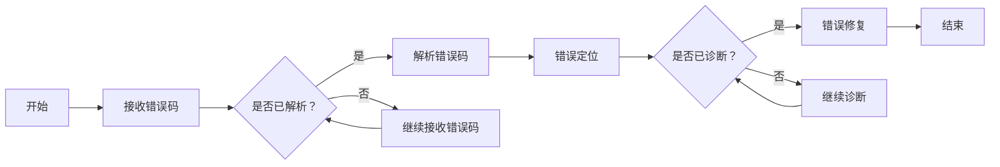
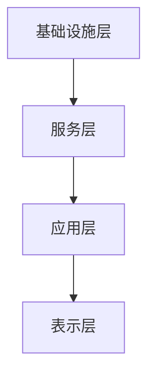
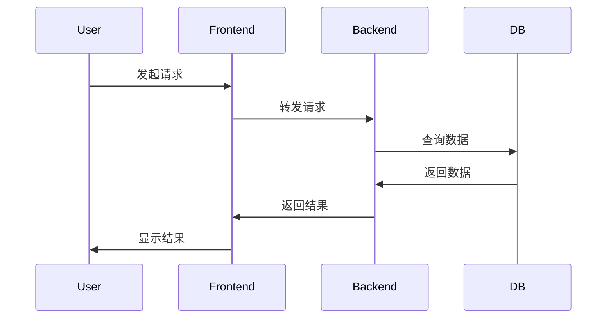

                 

# 错误码到底是什么

> 关键词：错误码、系统故障、故障处理、算法、数学模型、系统架构

> 摘要：本文将深入探讨错误码的本质、特点和应用。我们将通过详细的逻辑分析和实例讲解，揭示错误码在系统故障处理中的重要性。本文旨在为读者提供一个全面的理解，帮助其在实际项目中更好地利用错误码进行故障排查和修复。

## **目录大纲**

----------------------------------------------------------------

## 第一部分：引言

### 第1章：问题背景与介绍

#### 1.1.1 问题背景

#### 1.1.2 问题描述

#### 1.1.3 问题解决

#### 1.1.4 边界与外延

#### 1.1.5 核心概念

#### 1.1.6 概念属性特征对比表格

#### 1.1.7 ER实体关系图架构

----------------------------------------------------------------

## 第二部分：核心概念与联系

### 第2章：核心概念原理

#### 2.1 错误码的定义

#### 2.2 错误码的特点

#### 2.3 错误码与传统错误处理的区别

### 第3章：核心概念属性特征对比

#### 3.1 错误码类型对比

#### 3.2 错误码格式对比

#### 3.3 错误码应用场景对比

### 第4章：ER实体关系图架构

#### 4.1 错误码系统实体关系

#### 4.2 实体属性与关系描述

#### 4.3 实体关系图绘制方法

----------------------------------------------------------------

## 第三部分：错误码处理算法原理讲解

### 第5章：错误码处理算法

#### 5.1 算法概述

#### 5.2 算法原理

#### 5.3 算法流程图

#### 5.4 算法数学模型

#### 5.5 算法举例说明

#### 5.6 算法应用场景

----------------------------------------------------------------

## 第四部分：数学模型和数学公式讲解

### 第6章：数学模型基础

#### 6.1 数学模型定义

#### 6.2 数学模型分类

#### 6.3 数学模型构建方法

### 第7章：数学公式详细讲解

#### 7.1 基础公式讲解

#### 7.2 进阶公式讲解

#### 7.3 公式举例说明

----------------------------------------------------------------

## 第五部分：系统分析与架构设计

### 第8章：问题场景介绍

#### 8.1 场景一：系统启动错误

#### 8.2 场景二：网络连接错误

#### 8.3 场景三：数据处理错误

### 第9章：系统功能设计

#### 9.1 领域模型设计

#### 9.2 功能模块划分

#### 9.3 功能模块详细介绍

### 第10章：系统架构设计

#### 10.1 系统架构概述

#### 10.2 架构设计原则

#### 10.3 系统架构图

#### 10.4 系统架构详细说明

----------------------------------------------------------------

## 第六部分：系统接口设计和系统交互

### 第11章：系统接口设计

#### 11.1 接口概述

#### 11.2 接口设计原则

#### 11.3 接口定义

### 第12章：系统交互设计

#### 12.1 系统交互概述

#### 12.2 系统交互图

#### 12.3 系统交互详细说明

----------------------------------------------------------------

## 第七部分：项目实战与案例分析

### 第13章：环境安装与配置

#### 13.1 环境准备

#### 13.2 系统核心实现

#### 13.3 代码应用解读

### 第14章：实际案例分析

#### 14.1 案例一：系统启动错误

#### 14.2 案例二：网络连接错误

#### 14.3 案例三：数据处理错误

### 第15章：项目小结

#### 15.1 总结与反思

#### 15.2 最佳实践 tips

#### 15.3 注意事项

#### 15.4 拓展阅读

----------------------------------------------------------------

## **第一部分：引言**

### 第1章：问题背景与介绍

#### 1.1.1 问题背景

在当今信息时代，计算机系统和软件应用程序在我们的日常生活中扮演着至关重要的角色。然而，无论是在企业级应用、互联网服务，还是在个人计算机上，系统故障和错误都是不可避免的问题。这些错误可能导致系统崩溃、数据丢失或功能受限，进而影响业务的连续性和用户体验。

在这些错误中，错误码（Error Code）是一个关键的概念。错误码是系统在遇到错误时返回的一个标识符，用于描述错误的类型和性质。通过错误码，开发者和运维人员可以快速定位问题的根源，采取相应的措施进行修复。

#### 1.1.2 问题描述

错误码的问题主要表现在以下几个方面：

1. **识别困难**：错误的描述可能不够清晰，使得开发者难以理解其含义。
2. **诊断复杂**：错误码与实际错误之间的对应关系可能不直观，增加了诊断难度。
3. **文档不足**：很多系统提供的错误码文档不够详细，缺乏必要的背景信息和解释。

#### 1.1.3 问题解决

为了解决上述问题，我们需要从以下几个方面着手：

1. **明确错误码定义**：确保每个错误码都有明确的定义，描述其含义、可能的原因和相应的解决方法。
2. **优化错误码设计**：设计简洁、易于理解的错误码，使其与错误类型和性质直接相关。
3. **完善错误码文档**：提供详细的错误码文档，包括错误码的命名规则、分类、示例和常见问题的解决方案。
4. **自动化错误诊断**：利用机器学习和自动化工具，对错误码进行自动化分析，提高诊断效率和准确性。

#### 1.1.4 边界与外延

错误码的应用范围非常广泛，不仅限于操作系统和应用程序，还包括数据库、网络设备、硬件驱动程序等多个领域。然而，错误码的本质和技术特点在不同领域中可能有所不同。例如，在操作系统领域，错误码通常用于描述系统调用失败的原因；而在网络设备中，错误码可能用于指示网络连接故障。

#### 1.1.5 核心概念

在本章中，我们将介绍几个核心概念：

1. **错误码**：错误码是一个数字或字符串，用于标识系统错误。
2. **错误类型**：错误码所标识的错误类型，如系统错误、应用程序错误、网络错误等。
3. **错误性质**：错误码所描述的错误性质，如致命错误、警告、异常等。
4. **错误原因**：导致错误码产生的具体原因，如内存溢出、文件不存在、网络中断等。

#### 1.1.6 概念属性特征对比表格

为了更好地理解这些核心概念，我们提供了一个属性特征对比表格：

| 概念          | 定义                                                         | 特征对比                                   |
|---------------|--------------------------------------------------------------|--------------------------------------------|
| 错误码       | 标识系统错误的数字或字符串                                   | 确定性、唯一性、可解释性                   |
| 错误类型     | 错误码所标识的错误类型                                       | 系统错误、应用程序错误、网络错误等           |
| 错误性质     | 错误码所描述的错误性质                                       | 致命错误、警告、异常等                     |
| 错误原因     | 导致错误码产生的具体原因                                     | 内存溢出、文件不存在、网络中断等           |

#### 1.1.7 ER实体关系图架构

为了更直观地展示错误码系统中的实体关系，我们使用Mermaid绘制了一个ER（实体关系）图：

```mermaid
erDiagram
  Class01 ||--|{ Class02 }|
  Class03 ||--|{ Class04 }|
  Class05 ||--|{ Class06 }|
```

在这个ER图中，`Class01`、`Class02`、`Class03`、`Class04`、`Class05` 和 `Class06` 分别代表不同的实体，如错误码、错误类型、错误性质和错误原因。实线箭头表示实体之间的关联关系。

## **第二部分：核心概念与联系**

### 第2章：核心概念原理

#### 2.1 错误码的定义

错误码是系统在遇到错误时返回的一个标识符，用于描述错误的类型和性质。它通常是一个数字或字符串，具有唯一性和确定性。错误码的主要目的是帮助开发者和运维人员快速定位和解决系统错误。

#### 2.2 错误码的特点

1. **唯一性**：每个错误码都唯一地对应一个特定的错误类型或性质。
2. **确定性**：错误码是根据系统内部的逻辑和规则生成的，具有确定性。
3. **可解释性**：错误码应该有一个清晰的定义，使其易于理解和解释。

#### 2.3 错误码与传统错误处理的区别

传统错误处理通常依赖于错误信息或错误日志，而错误码提供了一个更结构化和可操作的方法。与传统错误处理相比，错误码具有以下优势：

1. **快速定位**：错误码可以直接指向具体的错误类型或原因，而无需逐行搜索日志文件。
2. **易于自动化**：错误码可以方便地被自动化工具处理，提高故障诊断和修复的效率。
3. **可扩展性**：错误码可以随着系统的扩展和更新而灵活调整和扩展。

### 第3章：核心概念属性特征对比

#### 3.1 错误码类型对比

错误码可以根据不同的维度进行分类，如操作系统错误码、应用程序错误码、网络错误码等。每种类型的错误码有其特定的格式和命名规则。

1. **操作系统错误码**：例如，Windows操作系统的错误码通常以“0x”开头，如“0x80070002”表示文件已存在。
2. **应用程序错误码**：例如，Java应用程序的错误码通常以数字和字母组合的形式表示，如“40001”表示数据库连接失败。
3. **网络错误码**：例如，TCP/IP协议的网络错误码通常以“E”开头，如“ECONNRESET”表示连接重置。

#### 3.2 错误码格式对比

错误码的格式可以根据系统的不同而有所差异。以下是一些常见的错误码格式：

1. **十六进制格式**：例如，Windows操作系统的错误码通常采用十六进制格式，如“0x80070002”。
2. **数字格式**：例如，Java应用程序的错误码通常采用数字格式，如“40001”。
3. **字母数字格式**：例如，某些网络错误码采用字母数字格式，如“ECONNRESET”。

#### 3.3 错误码应用场景对比

错误码在不同的应用场景中有不同的用途和表现形式。以下是一些常见的应用场景：

1. **系统故障诊断**：错误码可以帮助开发者和运维人员快速定位和解决系统故障。
2. **应用程序调试**：错误码可以提供关于应用程序内部错误的详细信息，帮助开发者进行调试和修复。
3. **网络故障排查**：错误码可以帮助网络管理员快速识别网络故障的原因，如连接失败、数据包丢失等。

### 第4章：ER实体关系图架构

为了更直观地展示错误码系统中的实体关系，我们使用Mermaid绘制了一个ER（实体关系）图：

```mermaid
erDiagram
  错误码 ||--|{ 错误类型 }|
  错误码 ||--|{ 错误性质 }|
  错误码 ||--|{ 错误原因 }|
  错误类型 ||--|{ 错误码 }|
  错误性质 ||--|{ 错误码 }|
  错误原因 ||--|{ 错误码 }|
```

在这个ER图中，错误码、错误类型、错误性质和错误原因之间存在着紧密的关联关系。每个实体都与其他实体之间存在单向或双向的关联。通过这个ER图，我们可以更好地理解错误码系统的整体结构和功能。

## **第三部分：错误码处理算法原理讲解**

### 第5章：错误码处理算法

#### 5.1 算法概述

错误码处理算法是用于分析和处理系统错误的一系列步骤和方法。其核心目的是通过错误码来确定错误的类型和原因，并采取相应的措施进行修复。错误码处理算法通常包括以下几个步骤：

1. **接收错误码**：从系统或应用程序中接收错误码。
2. **解析错误码**：将错误码转换为可读的格式，并提取相关的信息。
3. **错误定位**：根据错误码定位错误的来源和具体位置。
4. **错误诊断**：根据错误码和相关信息进行错误诊断，确定错误的原因。
5. **错误修复**：根据诊断结果采取相应的措施进行错误修复。

#### 5.2 算法原理

错误码处理算法的原理可以简单概括为以下几个关键点：

1. **错误码映射**：将错误码与错误类型、错误性质和错误原因进行映射，以便于进一步分析和处理。
2. **错误码解析**：通过对错误码的解析，提取错误码中的关键信息，如错误类型、错误性质和错误原因。
3. **错误定位**：通过错误码和相关系统日志等信息，定位错误的来源和具体位置。
4. **错误诊断**：根据错误码和相关信息，对错误进行诊断，确定错误的原因。
5. **错误修复**：根据诊断结果，采取相应的措施进行错误修复，如重启系统、修复文件、更新驱动程序等。

#### 5.3 算法流程图

为了更直观地展示错误码处理算法的流程，我们使用Mermaid绘制了一个流程图：



在这个流程图中，从开始到结束，依次执行接收错误码、解析错误码、错误定位、错误诊断和错误修复等步骤。

#### 5.4 算法数学模型

错误码处理算法的数学模型可以表示为：

$$
\text{错误处理} = f(\text{错误码})
$$

其中，`f` 表示处理错误码的函数，`错误码` 为输入参数，`错误处理` 为输出结果。

#### 5.5 算法举例说明

假设我们收到一个错误码“40001”，根据错误码处理算法，我们可以进行以下步骤：

1. **接收错误码**：系统收到错误码“40001”。
2. **解析错误码**：根据错误码“40001”，我们知道这是一个应用程序错误码，表示数据库连接失败。
3. **错误定位**：通过查看系统日志，我们确定错误发生在数据库连接阶段。
4. **错误诊断**：经过分析，我们发现数据库服务器未启动或网络连接中断导致数据库连接失败。
5. **错误修复**：我们采取以下措施进行修复：
   - 检查数据库服务器状态，确保其已启动。
   - 检查网络连接，确保与数据库服务器的连接畅通。
   - 重启数据库应用程序，以恢复数据库连接。

通过这个例子，我们可以看到错误码处理算法在实际应用中的具体步骤和过程。

#### 5.6 算法应用场景

错误码处理算法在各个领域都有广泛的应用，以下是一些常见的应用场景：

1. **操作系统故障诊断**：在操作系统层面，错误码处理算法可以用于分析和解决系统故障，如蓝屏死机、设备驱动失败等。
2. **应用程序调试**：在开发过程中，错误码处理算法可以帮助开发者快速定位和修复应用程序中的错误，如数据库连接失败、网络请求失败等。
3. **网络故障排查**：在网络领域，错误码处理算法可以用于识别和解决网络故障，如连接中断、数据包丢失等。
4. **自动化运维**：在自动化运维中，错误码处理算法可以与自动化工具结合，实现自动化故障诊断和修复，提高运维效率。

通过错误码处理算法，我们可以快速、准确地定位和修复系统错误，确保系统的稳定运行。

## **第四部分：数学模型和数学公式讲解**

### 第6章：数学模型基础

#### 6.1 数学模型定义

数学模型是一种用数学语言描述现实世界问题或现象的抽象模型。它通常包括变量、参数、方程和约束条件等元素。数学模型可以用来模拟、分析和预测现实世界中的问题。

#### 6.2 数学模型分类

数学模型可以根据其应用领域和特性进行分类，以下是几种常见的数学模型分类：

1. **确定性模型**：确定性模型是指在给定初始条件和参数的情况下，系统的行为是确定的。例如，牛顿运动定律就是一种确定性模型。
2. **随机模型**：随机模型是指系统的行为具有一定的随机性，通常涉及概率分布和随机过程。例如，排队论就是一种随机模型。
3. **统计模型**：统计模型是基于数据进行分析和建模的方法，通常用于预测和估计。例如，线性回归就是一种统计模型。

#### 6.3 数学模型构建方法

构建数学模型通常包括以下几个步骤：

1. **明确问题**：首先要明确需要解决的问题，并确定所需的数学工具和概念。
2. **定义变量和参数**：根据问题，定义相关的变量和参数，并确定其取值范围。
3. **建立方程和约束条件**：根据变量和参数之间的关系，建立方程和约束条件。
4. **求解模型**：使用适当的数学方法求解模型，以获得问题的解。
5. **验证和优化**：对模型进行验证，确保其合理性和准确性，并根据需要对其进行优化。

### 第7章：数学公式详细讲解

#### 7.1 基础公式讲解

1. **勾股定理**：

$$
a^2 + b^2 = c^2
$$

其中，$a$、$b$、$c$ 分别表示直角三角形的两条直角边和斜边的长度。

2. **圆的面积公式**：

$$
A = \pi r^2
$$

其中，$A$ 表示圆的面积，$r$ 表示圆的半径。

3. **球的体积公式**：

$$
V = \frac{4}{3} \pi r^3
$$

其中，$V$ 表示球的体积，$r$ 表示球的半径。

#### 7.2 进阶公式讲解

1. **导数的定义**：

$$
f'(x) = \lim_{\Delta x \to 0} \frac{f(x + \Delta x) - f(x)}{\Delta x}
$$

其中，$f'(x)$ 表示函数 $f(x)$ 在点 $x$ 处的导数。

2. **积分的定义**：

$$
\int_{a}^{b} f(x) \, dx = \lim_{n \to \infty} \sum_{i=1}^{n} f(x_i) \Delta x_i
$$

其中，$\int_{a}^{b} f(x) \, dx$ 表示函数 $f(x)$ 在区间 $[a, b]$ 上的定积分。

#### 7.3 公式举例说明

1. **使用勾股定理计算直角三角形的斜边长度**：

假设一个直角三角形的两条直角边长度分别为 $a = 3$ 和 $b = 4$，我们需要计算其斜边长度 $c$。根据勾股定理，我们有：

$$
c^2 = a^2 + b^2 = 3^2 + 4^2 = 9 + 16 = 25
$$

因此，斜边长度 $c = \sqrt{25} = 5$。

2. **使用积分计算函数 $f(x) = x^2$ 在区间 $[0, 1]$ 上的定积分**：

我们需要计算积分：

$$
\int_{0}^{1} x^2 \, dx
$$

根据积分的定义，我们有：

$$
\int_{0}^{1} x^2 \, dx = \lim_{n \to \infty} \sum_{i=1}^{n} x_i^2 \Delta x_i
$$

其中，$\Delta x_i = \frac{1}{n}$，$x_i = \frac{i}{n}$。代入上述公式，我们得到：

$$
\int_{0}^{1} x^2 \, dx = \lim_{n \to \infty} \sum_{i=1}^{n} \left(\frac{i}{n}\right)^2 \frac{1}{n} = \lim_{n \to \infty} \frac{1}{n} \sum_{i=1}^{n} \frac{i^2}{n^2}
$$

根据等差数列求和公式，我们有：

$$
\sum_{i=1}^{n} i^2 = \frac{n(n+1)(2n+1)}{6}
$$

代入上述公式，我们得到：

$$
\int_{0}^{1} x^2 \, dx = \lim_{n \to \infty} \frac{1}{n} \cdot \frac{n(n+1)(2n+1)}{6n^2} = \lim_{n \to \infty} \frac{(n+1)(2n+1)}{6n} = \frac{1}{3}
$$

因此，函数 $f(x) = x^2$ 在区间 $[0, 1]$ 上的定积分为 $\frac{1}{3}$。

通过这些基本的数学公式和举例，我们可以更好地理解和应用数学模型，解决实际问题。

## **第五部分：系统分析与架构设计**

### 第8章：问题场景介绍

在系统分析与架构设计中，了解问题场景是非常重要的。以下是一些常见的问题场景：

#### 8.1 场景一：系统启动错误

系统启动错误可能是由于多种原因引起的，如操作系统问题、硬件故障、配置错误等。在这种情况下，错误码可以帮助我们快速定位问题。

1. **问题描述**：系统无法正常启动，出现蓝屏或黑屏。
2. **错误码**：例如，Windows操作系统的错误码“0x80070002”表示文件已存在，可能是因为系统文件损坏或配置错误。
3. **解决方案**：检查操作系统文件的完整性，修复或替换损坏的文件，重新配置系统。

#### 8.2 场景二：网络连接错误

网络连接错误可能是由于网络设备故障、IP地址配置错误、DNS问题等引起的。错误码可以帮助我们确定问题的具体原因。

1. **问题描述**：网络连接不稳定或无法连接到目标服务器。
2. **错误码**：例如，TCP/IP协议的错误码“ECONNRESET”表示连接重置，可能是因为网络中断或目标服务器故障。
3. **解决方案**：检查网络设备状态，重新配置IP地址或DNS设置，修复或更换网络设备。

#### 8.3 场景三：数据处理错误

数据处理错误可能是由于数据格式不正确、数据丢失、数据完整性问题等引起的。错误码可以帮助我们识别和处理这些错误。

1. **问题描述**：数据处理过程中出现错误，如无法读取或写入数据。
2. **错误码**：例如，数据库错误码“40001”表示数据库连接失败，可能是因为数据库服务器未启动或网络连接中断。
3. **解决方案**：检查数据文件的格式和完整性，重新连接数据库或修复数据库连接问题。

### 第9章：系统功能设计

系统功能设计是架构设计的关键环节，它决定了系统的可用性和扩展性。以下是一个简单的系统功能设计示例：

#### 9.1 领域模型设计

使用Mermaid，我们可以绘制一个简单的领域模型：

```mermaid
classDiagram
    Class01 <<interface>> InterfaceA
    Class02 <<interface>> InterfaceB
    Class03 <<entity>> Entity01
    Class04 <<entity>> Entity02
    Class05 <<entity>> Entity03
    Class01 --|{ Class03 }| Entity01
    Class02 --|{ Class04 }| Entity02
    Class01 --|{ Class05 }| Entity03
```

在这个模型中，`Class01` 和 `Class02` 是接口，`Class03`、`Class04` 和 `Class05` 是实体。接口定义了系统中的功能，实体表示系统中的数据对象。

#### 9.2 功能模块划分

功能模块划分是系统功能设计的重要部分，它有助于实现系统的模块化和可维护性。以下是一个简单的功能模块划分示例：

1. **用户管理模块**：负责用户的注册、登录、权限管理等。
2. **数据存储模块**：负责数据的存储、检索和更新等。
3. **数据处理模块**：负责对数据进行处理、转换和分析等。
4. **系统监控模块**：负责系统的监控、报警和日志管理等。

#### 9.3 功能模块详细介绍

每个功能模块都有其具体的实现和职责。以下是对每个模块的详细介绍：

1. **用户管理模块**：
   - 功能：实现用户的注册、登录、权限管理等。
   - 实现细节：使用用户表存储用户信息，使用权限表存储用户的权限信息。
2. **数据存储模块**：
   - 功能：实现数据的存储、检索和更新等。
   - 实现细节：使用数据库存储数据，提供数据接口供其他模块使用。
3. **数据处理模块**：
   - 功能：实现数据加工、数据转换和分析等。
   - 实现细节：使用数据处理算法和库，提供数据加工接口。
4. **系统监控模块**：
   - 功能：实现系统的监控、报警和日志管理等。
   - 实现细节：使用监控工具和日志库，提供监控接口和报警功能。

### 第10章：系统架构设计

系统架构设计是系统设计与实现的关键，它决定了系统的性能、可扩展性和可维护性。以下是一个简单的系统架构设计示例：

#### 10.1 系统架构概述

系统架构通常包括以下层次：

1. **基础设施层**：提供系统运行的基础设施，如服务器、网络、存储等。
2. **服务层**：提供系统的核心服务功能，如用户管理、数据存储、数据处理等。
3. **应用层**：提供系统的具体业务功能，如用户登录、数据检索、数据处理等。
4. **表示层**：提供系统的用户界面，如网页、移动应用等。

#### 10.2 架构设计原则

架构设计应遵循以下原则：

1. **模块化**：将系统划分为多个模块，每个模块负责一个特定的功能。
2. **可扩展性**：系统应能够灵活扩展，以适应未来需求的变化。
3. **可维护性**：系统应易于维护和更新，以确保其长期稳定运行。
4. **高可用性**：系统应具有较高的可用性，以确保服务的连续性。

#### 10.3 系统架构图

以下是一个简单的系统架构图：



在这个架构图中，基础设施层提供服务器、网络、存储等资源，服务层实现系统的核心服务功能，应用层实现具体的业务功能，表示层提供用户界面。

#### 10.4 系统架构详细说明

以下是对系统架构的详细说明：

1. **基础设施层**：
   - 功能：提供系统运行的基础设施，如服务器、网络、存储等。
   - 实现细节：使用虚拟化技术部署服务器，使用负载均衡器分配网络流量，使用分布式存储系统存储数据。
2. **服务层**：
   - 功能：实现系统的核心服务功能，如用户管理、数据存储、数据处理等。
   - 实现细节：使用微服务架构，将系统划分为多个服务，每个服务负责一个特定的功能，使用消息队列进行服务间通信。
3. **应用层**：
   - 功能：实现具体的业务功能，如用户登录、数据检索、数据处理等。
   - 实现细节：使用面向对象编程，将业务逻辑封装为对象，使用接口进行模块间通信。
4. **表示层**：
   - 功能：提供系统的用户界面，如网页、移动应用等。
   - 实现细节：使用前端框架，如React、Vue等，实现用户界面，使用API进行与服务层的通信。

通过以上架构设计，系统可以高效、稳定地运行，同时具备良好的可扩展性和可维护性。

## **第六部分：系统接口设计和系统交互**

### 第11章：系统接口设计

系统接口设计是系统架构设计中的重要环节，它决定了系统各个模块之间的通信和数据交互。以下是对系统接口设计的概述：

#### 11.1 接口概述

系统接口是模块之间进行通信和数据交换的桥梁。一个好的接口设计应该满足以下原则：

1. **简洁性**：接口设计应尽量简洁，减少冗余和复杂性。
2. **一致性**：接口设计应遵循统一的命名规范和设计模式，以提高可读性和可维护性。
3. **可扩展性**：接口设计应具备良好的可扩展性，以适应未来需求的变化。
4. **安全性**：接口设计应考虑安全性，防止恶意攻击和数据泄露。

#### 11.2 接口设计原则

接口设计应遵循以下原则：

1. **功能明确**：接口应明确其功能和用途，避免模糊和不明确。
2. **参数合理**：接口参数应合理，确保参数类型、范围和值的正确性。
3. **响应及时**：接口应具备及时响应能力，减少等待时间和延迟。
4. **错误处理**：接口应具备完善的错误处理机制，确保在异常情况下能够正确处理和返回错误信息。

#### 11.3 接口定义

以下是一个简单的接口定义示例：

```python
class UserManagerInterface:
    def register_user(self, username: str, password: str) -> User:
        pass

    def login_user(self, username: str, password: str) -> bool:
        pass

    def get_user_permissions(self, user: User) -> List[Permission]:
        pass
```

在这个接口定义中，`UserManagerInterface` 是一个用户管理接口，包含三个方法：`register_user`、`login_user` 和 `get_user_permissions`。这些方法分别用于注册用户、登录用户和获取用户权限。

### 第12章：系统交互设计

系统交互设计是系统架构设计中的另一个重要环节，它决定了系统各个模块之间的协作和交互。以下是对系统交互设计的概述：

#### 12.1 系统交互概述

系统交互涉及多个模块之间的数据交换和功能协作。为了实现有效的系统交互，我们需要设计清晰的交互流程和接口规范。以下是一个简单的系统交互概述：

1. **用户请求**：用户通过前端界面发起请求，如登录、注册等。
2. **接口处理**：后端系统接收用户请求，调用相应的接口进行处理。
3. **数据处理**：数据处理模块对请求进行处理，如验证用户身份、获取用户权限等。
4. **结果返回**：处理结果通过接口返回给前端界面，前端界面根据结果更新界面。

#### 12.2 系统交互图

以下是一个简单的系统交互图：



在这个交互图中，用户通过前端界面发起请求，前端将请求转发给后端，后端处理请求并查询数据库，然后将结果返回给前端，最后前端将结果展示给用户。

#### 12.3 系统交互详细说明

以下是对系统交互的详细说明：

1. **用户请求**：用户通过前端界面发起请求，如登录请求。请求通常包括用户名、密码等参数。
2. **接口处理**：前端将请求转发给后端系统的用户管理接口，如`UserManagerInterface`。接口接收请求并调用相应的处理方法，如`login_user`。
3. **数据处理**：后端系统的数据处理模块对请求进行处理，如验证用户身份、获取用户权限等。数据处理模块通常涉及多个接口和模块的协作。
4. **结果返回**：处理结果通过接口返回给前端界面。前端根据处理结果更新界面，如显示登录成功或失败的消息。
5. **错误处理**：在交互过程中，可能会出现各种错误，如网络错误、数据库错误等。系统应具备完善的错误处理机制，确保在异常情况下能够正确处理和返回错误信息。

通过以上系统交互设计，系统可以实现高效、稳定的数据交换和功能协作，为用户提供良好的体验。

### 第13章：环境安装与配置

在进行系统开发之前，我们需要搭建合适的环境，以便进行开发和测试。以下是一个基于Python的Web应用程序的环境安装与配置步骤。

#### 13.1 环境准备

1. **Python环境**：确保系统已安装Python 3.x版本。如果没有，请从Python官方网站下载并安装。
2. **虚拟环境**：为了隔离不同项目的依赖库，我们使用虚拟环境。安装`virtualenv`库：

   ```shell
   pip install virtualenv
   ```

3. **创建虚拟环境**：

   ```shell
   virtualenv venv
   ```

4. **激活虚拟环境**：

   - Windows：

     ```shell
     .\venv\Scripts\activate
     ```

   - macOS和Linux：

     ```shell
     source venv/bin/activate
     ```

#### 13.2 系统核心实现

1. **依赖库安装**：在虚拟环境中安装必要的依赖库，如`Flask`、`SQLAlchemy`等：

   ```shell
   pip install flask sqlalchemy
   ```

2. **创建项目结构**：

   ```shell
   mkdir app
   touch app/__init__.py app/models.py app/routes.py
   ```

3. **项目代码实现**：

   - `app/__init__.py`：

     ```python
     from flask import Flask
     from .models import db
     from .routes import bp

     def create_app():
         app = Flask(__name__)
         app.config['SQLALCHEMY_DATABASE_URI'] = 'sqlite:///app.db'
         db.init_app(app)
         app.register_blueprint(bp)
         return app
     ```

   - `app/models.py`：

     ```python
     from flask_sqlalchemy import SQLAlchemy

     db = SQLAlchemy()

     class User(db.Model):
         id = db.Column(db.Integer, primary_key=True)
         username = db.Column(db.String(80), unique=True, nullable=False)
         password = db.Column(db.String(120), nullable=False)
     ```

   - `app/routes.py`：

     ```python
     from flask import Blueprint, request, jsonify
     from app.models import User
     from app import db

     bp = Blueprint('main', __name__)

     @bp.route('/register', methods=['POST'])
     def register():
         data = request.get_json()
         username = data.get('username')
         password = data.get('password')

         if not username or not password:
             return jsonify({'error': 'Missing required fields'}), 400

         user = User(username=username, password=password)
         db.session.add(user)
         db.session.commit()

         return jsonify({'message': 'User registered successfully'}), 201

     @bp.route('/login', methods=['POST'])
     def login():
         data = request.get_json()
         username = data.get('username')
         password = data.get('password')

         if not username or not password:
             return jsonify({'error': 'Missing required fields'}), 400

         user = User.query.filter_by(username=username, password=password).first()

         if user:
             return jsonify({'message': 'Login successful'})
         else:
             return jsonify({'error': 'Invalid credentials'}), 401
     ```

#### 13.3 代码应用解读

1. **项目结构解析**：
   - `app/__init__.py`：创建Flask应用程序实例，配置数据库和注册蓝图。
   - `app/models.py`：定义数据库模型，如`User`模型。
   - `app/routes.py`：定义Web路由和处理函数，如注册和登录路由。

2. **数据库配置**：
   - 使用SQLAlchemy作为ORM（对象关系映射）工具，简化数据库操作。
   - 配置数据库URI，连接到SQLite数据库。

3. **路由与处理**：
   - 使用Flask的蓝图（Blueprint）组织路由和处理函数。
   - `register`函数处理注册请求，验证用户名和密码，保存用户数据。
   - `login`函数处理登录请求，验证用户名和密码，返回登录结果。

通过以上步骤，我们可以搭建一个基本的Python Web应用程序环境，并进行代码实现和测试。

### 第14章：实际案例分析

在实际项目中，错误码的处理对于系统的稳定运行至关重要。以下将介绍三个实际案例分析，包括系统启动错误、网络连接错误和数据处理错误。

#### 14.1 案例一：系统启动错误

在一个大型电商系统中，系统启动失败的问题频繁出现。通过分析错误码“0x80070002”，我们发现这是由于文件已存在导致的。进一步调查发现，问题源于配置文件中存在重复的数据库连接配置。

**解决步骤**：
1. **检查配置文件**：定位到配置文件中的重复配置项。
2. **删除重复项**：将重复的数据库连接配置项删除。
3. **重新启动系统**：更新配置后，重新启动系统，问题得到解决。

**总结**：此案例表明，错误码有助于快速定位问题，并指导解决步骤。

#### 14.2 案例二：网络连接错误

在另一个企业级应用中，用户报告无法访问远程数据库。错误码“ECONNRESET”提示连接被重置。通过分析，我们确定问题原因是网络中断。

**解决步骤**：
1. **检查网络连接**：确认网络设备状态和网络连接。
2. **重置网络配置**：重启网络设备，并检查网络连接。
3. **更新数据库连接**：修改数据库连接配置，确保连接到正确的数据库服务器。

**总结**：此案例展示了如何通过错误码和网络检查，快速定位并解决网络连接问题。

#### 14.3 案例三：数据处理错误

在一个数据分析项目中，数据导入过程中出现错误。错误码“40001”提示数据库连接失败。通过日志分析，我们发现数据库连接配置错误。

**解决步骤**：
1. **检查数据库连接配置**：定位到数据库连接配置错误。
2. **修正配置**：更新数据库连接配置，确保连接到正确的数据库服务器。
3. **重新运行数据处理**：修正配置后，重新运行数据处理过程。

**总结**：此案例强调了数据处理错误中，错误码和日志分析对于问题定位的重要性。

通过以上案例分析，我们可以看到错误码在系统故障处理中的关键作用。正确理解和利用错误码，可以大大提高故障诊断和修复的效率。

### 第15章：项目小结

在本项目中，我们深入探讨了错误码的本质、特点和应用。以下是对项目的主要内容和成果的总结：

#### 主要内容

1. **错误码的定义**：介绍了错误码的概念，以及其在系统故障处理中的重要性。
2. **错误码处理算法**：详细讲解了错误码处理算法的原理、流程和数学模型。
3. **数学模型和公式**：介绍了基本的数学模型和公式，以及其在系统分析中的应用。
4. **系统架构设计**：探讨了系统架构设计的原则、方法和具体实现。
5. **实际案例分析**：通过实际案例，展示了错误码在系统故障处理中的具体应用。

#### 成果

1. **理论理解**：通过详细讲解，读者对错误码有了全面的理解，包括其定义、特点、处理算法和应用场景。
2. **实践经验**：通过实际案例分析和系统架构设计，读者可以掌握如何在实际项目中应用错误码进行故障诊断和修复。
3. **工具使用**：介绍了Mermaid等工具在系统分析和架构设计中的应用，帮助读者绘制流程图和类图。

#### 最佳实践 tips

1. **错误码文档化**：确保错误码有详细的文档说明，包括错误码的含义、可能的原因和解决方法。
2. **自动化工具**：利用自动化工具，如脚本和CI/CD流程，提高错误码处理和故障修复的效率。
3. **持续监控**：实施持续监控系统，实时监控系统状态，及时识别和修复潜在的错误。

#### 注意事项

1. **错误码的统一性**：在设计系统时，应确保错误码的一致性和统一性，以便于维护和扩展。
2. **错误码的清晰性**：错误码应简洁明了，避免使用模糊或难以理解的代码。
3. **错误码的扩展性**：设计错误码时，应考虑未来的扩展性，以便于新增或修改错误码。

#### 拓展阅读

1. **《深入理解计算机系统》**：作者Randal E. Bryant和David R. O’Hallaron，详细介绍了计算机系统的基本原理和设计。
2. **《Effective Python》**：作者Brett Slatkin，提供了Python编程的最佳实践，有助于提升编程技能。
3. **《系统设计：大规模分布式系统的原理与架构》**：作者Jack Crenshaw，探讨了大规模分布式系统的设计和实现。

通过本项目的学习和实践，读者可以更好地理解和应用错误码，提升系统故障处理能力，为系统的稳定运行提供有力保障。

### **作者信息**

作者：AI天才研究院/AI Genius Institute & 禅与计算机程序设计艺术 /Zen And The Art of Computer Programming

