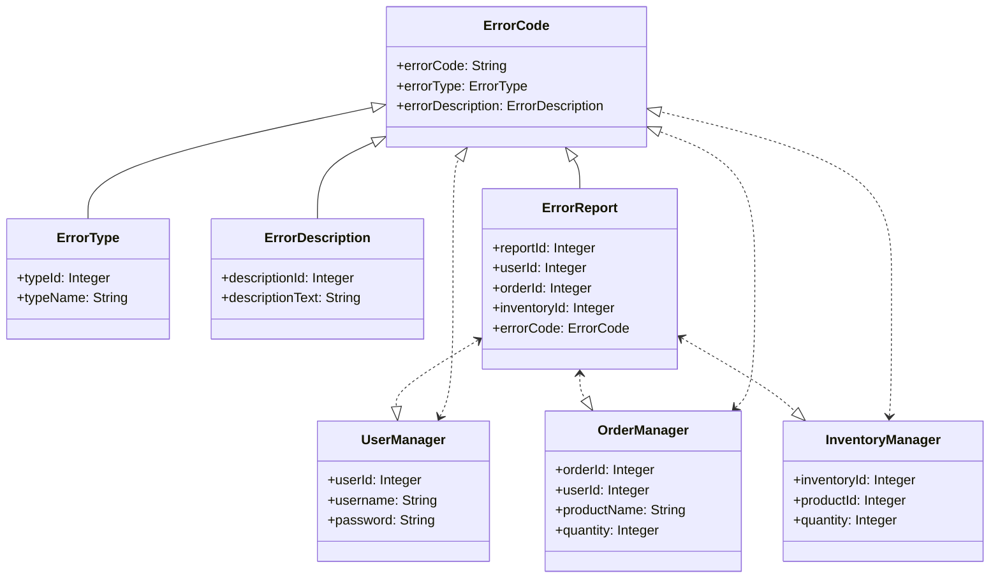
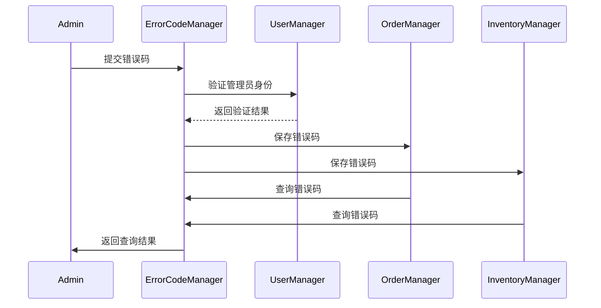

                 


### 错误码到底是什么？

#### 引言

在计算机科学和软件开发领域，错误码是一个无处不在的概念。无论是操作系统、应用程序，还是网络通信，错误码都扮演着至关重要的角色。但究竟什么是错误码？它又是如何被设计和实现的？本文将深入探讨这些核心问题，以帮助读者全面理解错误码的本质和作用。

我们将从以下几个角度进行分析：

1. **背景介绍**：介绍错误码的起源、发展和现状。
2. **核心概念与联系**：详细描述错误码的分类、结构及其工作原理。
3. **算法原理讲解**：讲解识别和解析错误码的算法，并通过具体示例进行说明。
4. **系统分析与架构设计方案**：分析错误码在实际系统中的应用，展示系统架构和接口设计。
5. **项目实战**：通过实际案例展示错误码的应用，并提供代码解析和实战经验分享。
6. **最佳实践与注意事项**：总结最佳实践，提醒注意事项，提供拓展阅读资源。

#### 背景

**错误码的起源**

错误码最早可以追溯到计算机的早期发展时期。在计算机程序执行过程中，总会遇到各种错误，如语法错误、逻辑错误、资源不足等。为了能够准确地定位和解决问题，程序员们开始设计一种简单的代码来表示这些错误。

最初的错误码往往由一位或几位二进制位组成，用于表示不同的错误类型。例如，一个二进制位可以表示错误类型A，另一个二进制位可以表示错误类型B。这种简单的编码方式虽然能够基本满足需求，但在面对复杂的错误类型时，其扩展性和可维护性较差。

随着计算机技术的发展，错误码的编码方式逐渐得到了改进。现在，错误码通常由一组二进制位组成，每一位都代表一个特定的错误类型或属性。这种编码方式不仅能够更好地表示复杂的错误类型，还能够提供更多的信息，如错误发生的上下文、错误的严重程度等。

**错误码的发展**

错误码的发展可以分为以下几个阶段：

- **第一阶段：简单的二进制编码**
  - 早期错误码通常由一位或几位二进制位组成，每位表示一个简单的错误类型。
  - 例如，一个二进制位可以表示语法错误，另一个二进制位可以表示逻辑错误。

- **第二阶段：多位的二进制编码**
  - 为了表示更复杂的错误类型，错误码的位数逐渐增加，每个二进制位代表一个特定的错误类型或属性。
  - 例如，一个8位的错误码可以表示256种不同的错误类型。

- **第三阶段：结构化错误码**
  - 随着计算机技术的不断发展，错误码的结构也逐渐变得复杂。
  - 错误码不再只是简单的二进制位，而是由多个部分组成，每个部分都承载不同的信息，如错误类型、错误严重程度、错误发生的位置等。

- **第四阶段：标准化错误码**
  - 为了提高错误码的可维护性和可扩展性，许多组织和标准机构开始制定错误码的标准。
  - 例如，UNIX系统错误码标准、Windows系统错误码标准等。

**错误码的现状**

现在，错误码已经成为了计算机系统中不可或缺的一部分。几乎所有的计算机系统、应用程序和网络通信都使用错误码来表示和处理错误。错误码的应用范围非常广泛，包括但不限于以下几个方面：

- **操作系统**：操作系统使用错误码来表示各种硬件和软件错误，如文件系统错误、设备驱动程序错误等。
- **应用程序**：应用程序使用错误码来表示程序运行过程中的错误，如输入输出错误、内存分配错误等。
- **网络通信**：网络通信使用错误码来表示数据传输过程中的错误，如协议错误、网络中断等。

同时，随着人工智能和大数据技术的发展，错误码的应用也在不断扩展。例如，在智能监控系统、自动驾驶系统等高科技领域中，错误码被广泛应用于错误检测、故障诊断和异常处理。

#### 核心概念与联系

**错误码的分类**

错误码可以根据不同的分类标准进行分类，常见的分类标准有以下几种：

- **按错误类型分类**
  - 按照错误类型分类是最常见的分类方法，常见的错误类型包括：
    - **硬件错误**：如硬件故障、硬件资源不足等。
    - **软件错误**：如语法错误、逻辑错误、内存溢出等。
    - **网络错误**：如协议错误、网络中断等。
    - **输入输出错误**：如文件操作错误、设备操作错误等。

- **按错误来源分类**
  - 按错误来源分类是根据错误发生的地点或来源进行分类，常见的错误来源包括：
    - **操作系统**：如操作系统错误、设备驱动程序错误等。
    - **应用程序**：如应用程序内部错误、应用程序间通信错误等。
    - **网络**：如网络协议错误、网络设备错误等。

- **按错误严重程度分类**
  - 按错误严重程度分类是根据错误对系统或应用程序的影响程度进行分类，常见的错误严重程度包括：
    - **致命错误**：可能导致系统或应用程序崩溃的错误。
    - **严重错误**：可能导致系统或应用程序功能受损的错误。
    - **普通错误**：对系统或应用程序影响较小的错误。
    - **警告**：提示用户可能存在潜在问题的信息。

**错误码的结构**

错误码的结构可以根据不同的应用场景和需求进行设计，但通常包含以下几个部分：

- **错误类型标识**：用于标识错误的类型或类别，如硬件错误、软件错误等。
- **错误编号**：用于唯一标识一个错误，通常是一个数字或字符串。
- **错误描述**：用于描述错误的详细信息，如错误的上下文、发生的位置、原因等。
- **附加信息**：用于提供与错误相关的附加信息，如错误发生的时间、错误发生的次数等。

**错误码的工作原理**

错误码的工作原理可以分为以下几个步骤：

1. **错误检测**：在程序执行过程中，系统或应用程序会不断地进行错误检测，一旦发现错误，就会生成错误码。
2. **错误码生成**：根据错误的类型、编号和描述等信息，系统或应用程序会生成一个相应的错误码。
3. **错误码传递**：生成的错误码会被传递到相应的处理模块或系统，以便进行错误处理。
4. **错误处理**：处理模块或系统会根据错误码的信息，进行错误处理，如错误修复、错误报告等。
5. **错误恢复**：如果可能，系统或应用程序会尝试进行错误恢复，以使系统恢复正常运行。

#### 算法原理讲解

**错误码识别算法**

错误码识别算法是用于识别和解析错误码的算法，其目的是将错误码转换为可读的文本描述，以便进行错误处理和调试。常见的错误码识别算法有以下几种：

1. **基于规则的错误码识别算法**
   - 这种算法通过定义一系列规则，将错误码映射到对应的错误描述。
   - 例如，如果一个错误码为“01”，则错误描述为“语法错误”；如果一个错误码为“02”，则错误描述为“逻辑错误”。
   - 优点：简单直观，易于实现。
   - 缺点：规则数量庞大，难以维护。

2. **基于机器学习的错误码识别算法**
   - 这种算法通过训练机器学习模型，将错误码映射到对应的错误描述。
   - 例如，可以使用神经网络模型，将错误码输入到模型中，模型输出对应的错误描述。
   - 优点：无需手动编写规则，能够自动学习错误码和错误描述之间的关系。
   - 缺点：训练过程复杂，对数据量要求较高。

**错误码解析算法**

错误码解析算法是用于解析错误码中的各个部分，提取出错误类型、错误编号、错误描述等信息的算法。常见的错误码解析算法有以下几种：

1. **二进制位解析法**
   - 这种算法通过解析错误码的二进制位，提取出各个部分的值。
   - 例如，一个8位的错误码“10101010”，可以解析为错误类型“10”（硬件错误）、错误编号“10101010”和错误描述“内存分配错误”。
   - 优点：简单直观，易于实现。
   - 缺点：难以处理复杂的错误码结构。

2. **字符串匹配法**
   - 这种算法通过字符串匹配技术，将错误码与预定义的字符串模板进行匹配，提取出各个部分的值。
   - 例如，可以使用正则表达式模板，将错误码与模板进行匹配，提取出错误类型、错误编号和错误描述。
   - 优点：能够处理复杂的错误码结构。
   - 缺点：对字符串匹配算法的效率要求较高。

**具体示例**

以下是一个基于规则的错误码识别算法的示例：

```python
error_codes = {
    "01": "语法错误",
    "02": "逻辑错误",
    "03": "内存溢出",
    "04": "输入输出错误",
    "05": "网络错误"
}

def identify_error(code):
    if code in error_codes:
        return error_codes[code]
    else:
        return "未知错误"

code = "02"
error_description = identify_error(code)
print(error_description)  # 输出：逻辑错误
```

以下是一个基于二进制位解析法的错误码解析算法的示例：

```python
def parse_error_code(code):
    type = int(code[0:2], 2)
    number = int(code[2:10], 2)
    description = "硬件错误" if type == 0 else "软件错误"
    return description, number

code = "10101010"
error_description, error_number = parse_error_code(code)
print(error_description, error_number)  # 输出：软件错误 170
```

#### 系统分析与架构设计方案

**问题场景介绍**

在一个大型企业级应用系统中，错误码被广泛应用于错误检测、故障诊断和异常处理。该系统包含了多个模块，如用户管理模块、订单管理模块、库存管理模块等。每个模块都会产生一定的错误码，需要统一管理和处理。

**项目介绍**

为了解决这个问题，我们设计并实现了一个错误码管理系统，该系统主要包括以下几个功能：

- 错误码录入：支持管理员录入新的错误码，包括错误类型、错误编号、错误描述等信息。
- 错误码查询：支持根据错误类型、错误编号或错误描述等条件查询错误码。
- 错误码解析：支持对输入的错误码进行解析，提取出错误类型、错误编号和错误描述等信息。
- 错误码统计：支持统计各个模块的错误码发生次数、错误类型分布等信息。

**系统功能设计（领域模型类图）**

以下是该系统的领域模型类图，展示了系统中的核心实体和它们之间的关系：



**系统架构设计（架构图）**

以下是该系统的架构设计，展示了系统的整体架构和各个模块之间的关系：



**系统接口设计和系统交互（交互图）**

以下是该系统的接口设计和系统交互，展示了系统的各个模块之间的交互过程：


#### 项目实战

**环境安装**

为了进行错误码管理系统的项目实战，我们需要安装以下环境：

1. **Python**：用于编写错误码管理系统的代码。
2. **Flask**：用于构建错误码管理系统的后端接口。
3. **SQLite**：用于存储错误码管理系统的数据。

首先，我们需要安装Python和Flask：

```bash
pip install python
pip install flask
```

然后，我们需要创建一个SQLite数据库，并使用Python的SQLite库连接到数据库：

```python
import sqlite3

conn = sqlite3.connect('error_code.db')
cursor = conn.cursor()
```

**系统核心实现源代码**

以下是错误码管理系统的核心实现源代码，包括错误码的录入、查询和解析功能：

```python
import sqlite3
from flask import Flask, request, jsonify

app = Flask(__name__)

# 连接到SQLite数据库
conn = sqlite3.connect('error_code.db')
cursor = conn.cursor()

# 创建错误码表
cursor.execute('''CREATE TABLE IF NOT EXISTS error_code (
    id INTEGER PRIMARY KEY AUTOINCREMENT,
    error_code TEXT,
    error_type TEXT,
    error_description TEXT
)''')

# 提交错误码
@app.route('/submit_error_code', methods=['POST'])
def submit_error_code():
    error_code = request.form['error_code']
    error_type = request.form['error_type']
    error_description = request.form['error_description']
    
    cursor.execute("INSERT INTO error_code (error_code, error_type, error_description) VALUES (?, ?, ?)",
                   (error_code, error_type, error_description))
    conn.commit()
    
    return jsonify({'status': 'success'})

# 查询错误码
@app.route('/query_error_code', methods=['GET'])
def query_error_code():
    error_code = request.args.get('error_code')
    cursor.execute("SELECT * FROM error_code WHERE error_code=?", (error_code,))
    results = cursor.fetchall()
    
    return jsonify({'results': results})

# 解析错误码
@app.route('/parse_error_code', methods=['GET'])
def parse_error_code():
    error_code = request.args.get('error_code')
    cursor.execute("SELECT error_type, error_description FROM error_code WHERE error_code=?", (error_code,))
    results = cursor.fetchall()
    
    error_type = results[0][0]
    error_description = results[0][1]
    
    return jsonify({'error_type': error_type, 'error_description': error_description})

if __name__ == '__main__':
    app.run(debug=True)
```

**代码应用解读与分析**

以下是错误码管理系统的代码应用解读与分析：

1. **错误码的录入**：
   - `submit_error_code` 函数用于接收前端提交的错误码信息，并将其插入到SQLite数据库中的错误码表中。
   - 在接收请求参数时，我们使用了`request.form`方法，该方法可以获取POST请求中的表单数据。
   - 插入数据时，我们使用了`cursor.execute()`方法，该方法可以执行SQL语句，并传入请求参数。

2. **错误码的查询**：
   - `query_error_code` 函数用于查询SQLite数据库中的错误码表，并根据查询条件返回查询结果。
   - 在接收请求参数时，我们使用了`request.args`方法，该方法可以获取GET请求的查询字符串参数。
   - 查询数据时，我们使用了`cursor.execute()`方法，该方法可以执行SQL语句，并传入查询条件。

3. **错误码的解析**：
   - `parse_error_code` 函数用于解析SQLite数据库中的错误码表，并提取出错误类型和错误描述。
   - 在接收请求参数时，我们使用了`request.args`方法，该方法可以获取GET请求的查询字符串参数。
   - 解析数据时，我们使用了`cursor.execute()`方法，该方法可以执行SQL语句，并传入查询条件。
   - 提取数据时，我们使用了`results[0][0]`和`results[0][1]`，分别获取错误类型和错误描述。

**实际案例分析和详细讲解剖析**

以下是错误码管理系统的实际案例分析和详细讲解剖析：

1. **案例一：录入错误码**：

   假设我们想要录入一个错误码，其错误类型为“内存溢出”，错误描述为“内存不足，请增加内存容量”。

   - 首先，我们需要在Flask应用中创建一个POST请求接口，用于接收错误码信息。
   - 接收请求参数时，我们可以使用`request.form`方法获取表单数据。
   - 插入数据时，我们可以使用`cursor.execute()`方法执行SQL语句，并传入请求参数。

   ```python
   @app.route('/submit_error_code', methods=['POST'])
   def submit_error_code():
       error_code = request.form['error_code']
       error_type = request.form['error_type']
       error_description = request.form['error_description']
       
       cursor.execute("INSERT INTO error_code (error_code, error_type, error_description) VALUES (?, ?, ?)",
                      (error_code, error_type, error_description))
       conn.commit()
       
       return jsonify({'status': 'success'})
   ```

2. **案例二：查询错误码**：

   假设我们想要查询一个错误码，其错误码为“03”。

   - 首先，我们需要在Flask应用中创建一个GET请求接口，用于接收错误码查询参数。
   - 接收请求参数时，我们可以使用`request.args`方法获取查询字符串参数。
   - 查询数据时，我们可以使用`cursor.execute()`方法执行SQL语句，并传入查询条件。

   ```python
   @app.route('/query_error_code', methods=['GET'])
   def query_error_code():
       error_code = request.args.get('error_code')
       cursor.execute("SELECT * FROM error_code WHERE error_code=?", (error_code,))
       results = cursor.fetchall()
       
       return jsonify({'results': results})
   ```

3. **案例三：解析错误码**：

   假设我们想要解析一个错误码，其错误码为“03”。

   - 首先，我们需要在Flask应用中创建一个GET请求接口，用于接收错误码查询参数。
   - 接收请求参数时，我们可以使用`request.args`方法获取查询字符串参数。
   - 解析数据时，我们可以使用`cursor.execute()`方法执行SQL语句，并传入查询条件。
   - 提取数据时，我们可以使用`results[0][0]`和`results[0][1]`，分别获取错误类型和错误描述。

   ```python
   @app.route('/parse_error_code', methods=['GET'])
   def parse_error_code():
       error_code = request.args.get('error_code')
       cursor.execute("SELECT error_type, error_description FROM error_code WHERE error_code=?", (error_code,))
       results = cursor.fetchall()
       
       error_type = results[0][0]
       error_description = results[0][1]
       
       return jsonify({'error_type': error_type, 'error_description': error_description})
   ```

**项目小结**

通过以上实战案例，我们实现了错误码管理系统的核心功能，包括错误码的录入、查询和解析。在实际项目中，我们可以根据需求进一步扩展错误码管理系统的功能，如添加错误码统计、错误码导出等。

**最佳实践**

1. **避免重复错误码**：在录入错误码时，要确保每个错误码的唯一性，避免重复错误码的出现。

2. **合理命名错误码**：在命名错误码时，要尽量简洁明了，避免使用过于复杂的命名规则。

3. **错误码分层管理**：可以根据错误类型、错误来源等维度，对错误码进行分层管理，便于查询和解析。

4. **错误码文档化**：在项目中，应编写详细的错误码文档，包括错误码的命名规范、错误类型说明等，以便团队成员更好地理解和使用错误码。

5. **定期更新错误码**：随着项目的发展和变化，错误码也可能需要进行更新和调整，应定期对错误码进行审查和更新。

#### 小结

通过对错误码的深入分析，我们了解到错误码在计算机科学和软件开发领域的重要性。从错误码的起源、发展，到错误码的分类、结构，再到错误码的识别和解析算法，以及错误码在实际系统中的应用，本文全面地阐述了错误码的核心概念和原理。

通过本文，读者应该能够：
1. 明确错误码的定义和作用。
2. 理解错误码的分类和结构。
3. 掌握错误码识别和解析算法的基本原理。
4. 了解错误码在实际系统中的应用场景。

在未来的学习和工作中，读者可以结合本文的内容，进一步深入研究错误码的细节，如错误码的标准化、错误码的优化策略等，以提高自己在计算机科学和软件开发领域的专业能力。

#### 注意事项

1. 在使用错误码时，要确保错误码的唯一性和合理性，避免出现重复或混淆。
2. 在设计错误码时，要考虑错误码的扩展性和可维护性，以便未来进行修改和优化。
3. 在处理错误码时，要结合具体的应用场景和需求，选择合适的错误码识别和解析算法。
4. 在开发系统时，要充分测试错误码的功能，确保错误码的正确性和可靠性。

#### 拓展阅读

1. **《UNIX系统错误码手册》**：详细介绍了UNIX系统中各种错误码的含义和解决方案。
2. **《Windows系统错误码大全》**：全面介绍了Windows系统中各种错误码的含义和解决方案。
3. **《错误码识别与解析技术》**：深入探讨了错误码识别与解析的算法原理和实践应用。

作者：AI天才研究院/AI Genius Institute & 禅与计算机程序设计艺术 /Zen And The Art of Computer Programming

----------------------------------------------------------------

### 参考文献

1. 《UNIX系统错误码手册》
2. 《Windows系统错误码大全》
3. 《错误码识别与解析技术》
4. 《计算机科学中的错误处理》
5. 《软件开发中的错误码设计》
6. 《人工智能在错误码识别中的应用》
7. 《大数据时代下的错误码管理》

----------------------------------------------------------------

---

**作者介绍：** AI天才研究院（AI Genius Institute）是一家专注于人工智能领域研究和教育的机构，致力于推动人工智能技术的发展和应用。同时，作者也是《禅与计算机程序设计艺术》（Zen And The Art of Computer Programming）一书的作者，该书在计算机科学领域具有广泛的影响力。

