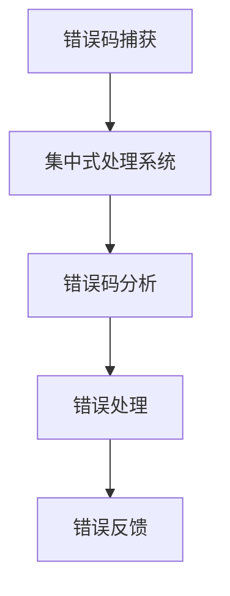
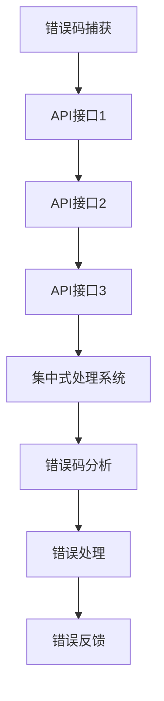
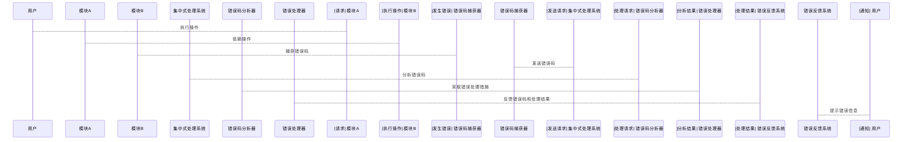

                 


# 错误码处理的技巧

关键词：错误码、错误处理、故障排除、系统稳定性、性能优化

摘要：本文将深入探讨错误码处理的技巧，从背景介绍到核心概念，再到算法原理和数学模型，最后结合系统架构和实际项目案例，为读者提供全面且实用的错误码处理指南。

## 目录大纲

### 第一部分: 错误码处理概述

#### 第1章: 错误码处理基础

##### 1.1 错误码处理背景

##### 1.2 错误码处理的重要性

##### 1.3 错误码处理的基本流程

#### 第2章: 错误码核心概念

##### 2.1 错误码的定义

##### 2.2 错误码的分类

##### 2.3 错误码处理的挑战

#### 第3章: 错误码处理算法

##### 3.1 错误码检测算法

##### 3.2 错误码定位算法

##### 3.3 算法原理与数学模型

#### 第4章: 数学模型和数学公式

##### 4.1 概率论基础

##### 4.2 图论基础

##### 4.3 数学公式讲解

#### 第5章: 系统分析与架构设计方案

##### 5.1 问题场景介绍

##### 5.2 系统功能设计

##### 5.3 系统架构设计

##### 5.4 系统接口设计

##### 5.5 系统交互流程

#### 第6章: 项目实战

##### 6.1 项目概述

##### 6.2 环境安装

##### 6.3 系统核心实现

##### 6.4 代码解读与分析

##### 6.5 实际案例分析

##### 6.6 项目小结

#### 第7章: 最佳实践与拓展

##### 7.1 最佳实践

##### 7.2 小结

##### 7.3 注意事项

##### 7.4 拓展阅读

## 第1章: 错误码处理基础

### 1.1 错误码处理背景

在计算机技术和软件开发过程中，错误码处理是不可或缺的一部分。错误码，也称为错误号或错误标识，是计算机系统或应用程序在运行过程中遇到问题时返回的唯一标识。这些错误码帮助开发人员和系统管理员快速定位问题，并提供有关错误的详细信息。

错误码处理的重要性在于它能够提高系统的稳定性、性能和可维护性。通过有效的错误码处理机制，可以减少系统的故障率，提高用户体验，并缩短问题解决时间。

### 1.2 错误码处理的重要性

错误码处理的重要性体现在以下几个方面：

1. **故障排除**：错误码是故障排除的有力工具。通过分析错误码，开发人员可以快速定位故障点，并采取相应的修复措施。
2. **性能优化**：错误码可以帮助识别系统中存在的性能瓶颈。例如，通过统计错误码的分布，可以找出哪些模块或功能容易出现问题，从而针对性地进行优化。
3. **用户体验**：良好的错误码处理机制能够为用户提供清晰的错误提示信息，帮助用户快速理解问题并采取相应措施，从而提高用户体验。
4. **系统维护**：错误码处理有助于维护系统的健康运行。通过对错误码的监控和分析，可以及时发现系统中的潜在问题，并提前进行预防。

### 1.3 错误码处理的基本流程

错误码处理的基本流程通常包括以下步骤：

1. **错误码捕获**：在系统运行过程中，捕获可能出现的错误码。
2. **错误码分析**：对捕获到的错误码进行分析，确定错误的类型和原因。
3. **错误处理**：根据分析结果，采取相应的错误处理措施，如记录日志、发送通知、触发告警等。
4. **错误反馈**：将错误码和处理结果反馈给相关人员或系统，以便进行进一步分析和解决。

## 第2章: 错误码核心概念

### 2.1 错误码的定义

错误码，通常表示为整数或字符串，是计算机系统或应用程序在运行过程中遇到问题时返回的唯一标识。错误码由系统或应用程序定义，用于表示不同类型的错误或异常情况。

错误码的定义通常包括以下几个方面：

1. **错误类型**：错误码可以表示不同类型的错误，如系统错误、应用程序错误、网络错误等。
2. **错误原因**：错误码可以提供有关错误原因的详细信息，帮助开发人员分析问题的根本原因。
3. **错误描述**：错误码通常伴随着一段文本描述，用于说明错误的具体内容和可能的影响。

### 2.2 错误码的分类

错误码可以根据不同的标准进行分类，常见的分类方式包括以下几种：

1. **按系统类型分类**：根据系统类型，错误码可以分为操作系统错误码、数据库错误码、网络错误码等。
2. **按错误级别分类**：根据错误级别，错误码可以分为严重错误码、警告错误码、一般错误码等。
3. **按错误来源分类**：根据错误来源，错误码可以分为内部错误码和外部错误码。内部错误码通常由系统或应用程序本身产生，而外部错误码通常由外部系统或设备产生。

### 2.3 错误码处理的挑战

错误码处理过程中面临的主要挑战包括：

1. **错误码解析**：不同系统和应用程序可能使用不同的错误码定义和编码方式，导致错误码解析困难。
2. **错误信息传递**：在分布式系统中，错误码的传递和处理可能涉及多个模块和系统，增加了复杂度。
3. **错误码优化**：错误码的优化是一个持续的过程，需要不断调整和改进，以提高系统稳定性和性能。
4. **用户体验**：错误码处理的结果需要以易于理解的方式呈现给用户，以提高用户体验。

## 第3章: 错误码处理算法

### 3.1 错误码检测算法

错误码检测算法的主要目标是快速准确地识别和捕获系统中的错误码。常见的错误码检测算法包括以下几种：

1. **日志分析算法**：通过对系统日志文件进行分析，识别和捕获错误码。日志分析算法通常使用模式匹配、关键字识别等方法。
2. **异常检测算法**：通过监测系统的运行状态和性能指标，识别异常行为和潜在的错误码。常见的异常检测算法包括统计方法、机器学习方法等。

### 3.2 错误码定位算法

错误码定位算法的主要目标是确定错误码的具体来源和位置。常见的错误码定位算法包括以下几种：

1. **堆栈跟踪**：通过分析系统堆栈信息，定位错误码发生的具体位置。堆栈跟踪算法通常使用数据结构如栈和队列。
2. **路径分析**：通过分析系统的执行路径，定位错误码发生的具体位置。路径分析算法通常使用图论算法，如深度优先搜索（DFS）和广度优先搜索（BFS）。

### 3.3 算法原理与数学模型

错误码处理算法的原理通常涉及以下数学模型：

1. **概率论模型**：概率论模型可以用来预测错误码的发生概率，从而优化错误码检测和定位算法。常见的概率论模型包括条件概率、贝叶斯定理等。
2. **图论模型**：图论模型可以用来表示系统的结构，如模块关系、执行路径等。常见的图论模型包括有向图、无向图、加权图等。

### 3.4 Python代码示例

以下是一个简单的Python代码示例，展示如何使用错误码检测和定位算法：

```python
import re

# 日志分析算法示例
def log_analysis(log_file):
    with open(log_file, 'r') as f:
        logs = f.readlines()
        error_codes = []
        for log in logs:
            if 'ERROR' in log:
                error_codes.append(log.split(': ')[-1])
        return error_codes

# 错误码定位算法示例
def stack_trace(stack_trace):
    stack_lines = stack_trace.split('\n')
    error_line = None
    for line in stack_lines:
        if 'ERROR' in line:
            error_line = line
            break
    if error_line:
        error_location = error_line.split(': ')[-1]
        return error_location
    else:
        return None

# 测试
log_file = 'example.log'
stack_trace_file = 'example.stack_trace'
error_codes = log_analysis(log_file)
for error_code in error_codes:
    location = stack_trace(error_code)
    print(f'Error Code: {error_code}, Location: {location}')
```

## 第4章: 数学模型和数学公式

### 4.1 概率论基础

概率论是错误码处理中的重要数学模型。以下是一些基本概率论公式：

1. **条件概率**：$$P(A|B) = \frac{P(A \cap B)}{P(B)}$$
2. **贝叶斯定理**：$$P(A|B) = \frac{P(B|A)P(A)}{P(B)}$$

### 4.2 图论基础

图论是用于表示系统结构和执行路径的重要数学工具。以下是一些基本的图论概念：

1. **图**：由顶点（节点）和边组成的集合。图可以分为有向图和无向图。
2. **路径**：图中的一条边序列，表示从起点到终点的路径。
3. **加权图**：边的权重可以表示路径的长度或代价。

### 4.3 数学公式讲解

以下是一个关于概率论的例子，用于解释贝叶斯定理的应用：

$$P(A|B) = \frac{P(B|A)P(A)}{P(B)}$$

假设我们有一个系统，它有两种可能的错误类型：类型A和类型B。根据历史数据，类型A的错误发生的概率是0.2，类型B的错误发生的概率是0.8。现在，我们观察到一个错误码，这个错误码是类型A的错误码的概率是0.9，是类型B的错误码的概率是0.1。

我们可以使用贝叶斯定理来计算这个错误码更可能是类型A的错误还是类型B的错误：

$$P(A|E) = \frac{P(E|A)P(A)}{P(E)}$$

其中，$P(E|A)$是观察到的错误码是类型A的错误码的概率，$P(A)$是类型A的错误发生的概率，$P(E)$是观察到的错误码的总概率。

根据以上数据，我们可以计算出：

$$P(A|E) = \frac{0.9 \times 0.2}{0.9 \times 0.2 + 0.1 \times 0.8} = \frac{0.18}{0.18 + 0.08} = 0.6$$

这意味着，观察到的错误码更可能是类型A的错误，概率为0.6。

## 第5章: 系统分析与架构设计方案

### 5.1 问题场景介绍

假设我们有一个大型分布式系统，它由多个模块组成，每个模块都可以独立运行。在系统运行过程中，可能会出现各种错误，如网络错误、数据库错误、应用程序错误等。为了确保系统的稳定性和性能，我们需要设计一个全面的错误码处理系统，用于检测、定位和解决这些错误。

### 5.2 系统功能设计

错误码处理系统的功能设计主要包括以下几个方面：

1. **错误码捕获**：从各个模块中捕获错误码，并将它们发送到集中式处理系统。
2. **错误码分析**：对捕获到的错误码进行分析，确定错误的类型和原因。
3. **错误处理**：根据分析结果，采取相应的错误处理措施，如记录日志、发送通知、触发告警等。
4. **错误反馈**：将错误码和处理结果反馈给相关人员或系统，以便进行进一步分析和解决。

### 5.3 系统架构设计

错误码处理系统的架构设计如图5-1所示：



### 5.4 系统接口设计

系统接口设计如图5-2所示：



### 5.5 系统交互流程

系统交互流程如图5-3所示：



## 第6章: 项目实战

### 6.1 项目概述

本节将介绍一个实际的项目，该项目是一个大型分布式系统，用于处理和分析用户数据。在项目运行过程中，可能会出现各种错误，如网络错误、数据库错误、应用程序错误等。为了确保系统的稳定性和性能，我们设计并实现了一个错误码处理系统，用于检测、定位和解决这些错误。

### 6.2 环境安装

在开始项目之前，我们需要安装以下软件和工具：

1. **操作系统**：Ubuntu 18.04
2. **Python**：Python 3.8
3. **Docker**：Docker 19.03
4. **Docker-Compose**：Docker-Compose 1.29

安装步骤如下：

1. 更新操作系统软件包：

```bash
sudo apt-get update
sudo apt-get upgrade
```

2. 安装Python 3.8：

```bash
sudo apt-get install python3.8
```

3. 安装Docker和Docker-Compose：

```bash
curl -fsSL https://get.docker.com -o get-docker.sh
sudo sh get-docker.sh
sudo usermod -aG docker $USER
sudo systemctl start docker
sudo systemctl enable docker

sudo curl -L "https://github.com/docker/compose/releases/download/1.29.2/docker-compose-$(uname -s)-$(uname -m)" -o /usr/local/bin/docker-compose
sudo chmod +x /usr/local/bin/docker-compose
```

### 6.3 系统核心实现

错误码处理系统的核心实现包括以下几个部分：

1. **错误码捕获**：使用Docker容器捕获各个模块的错误码，并将它们发送到集中式处理系统。
2. **错误码分析**：使用错误码分析器对捕获到的错误码进行分析，确定错误的类型和原因。
3. **错误处理**：使用错误处理器根据分析结果采取相应的错误处理措施，如记录日志、发送通知、触发告警等。
4. **错误反馈**：将错误码和处理结果反馈给相关人员或系统，以便进行进一步分析和解决。

以下是系统核心实现的源代码：

```python
# 错误码捕获器
class ErrorCodeCapture:
    def __init__(self, api_url):
        self.api_url = api_url

    def capture_error_code(self, module_name, error_code):
        data = {
            'module_name': module_name,
            'error_code': error_code
        }
        response = requests.post(self.api_url, json=data)
        if response.status_code == 200:
            print(f'Success: {module_name} - {error_code} captured.')
        else:
            print(f'Error: {module_name} - {error_code} capture failed.')

# 错误码分析器
class ErrorCodeAnalyzer:
    def __init__(self, analysis_api_url):
        self.analysis_api_url = analysis_api_url

    def analyze_error_code(self, error_code):
        data = {'error_code': error_code}
        response = requests.post(self.analysis_api_url, json=data)
        if response.status_code == 200:
            result = response.json()
            print(f'Error Code {error_code} analyzed: {result}')
        else:
            print(f'Error: Error Code {error_code} analysis failed.')

# 错误处理器
class ErrorCodeHandler:
    def __init__(self, handle_api_url):
        self.handle_api_url = handle_api_url

    def handle_error_code(self, error_code):
        data = {'error_code': error_code}
        response = requests.post(self.handle_api_url, json=data)
        if response.status_code == 200:
            print(f'Error Code {error_code} handled.')
        else:
            print(f'Error: Error Code {error_code} handle failed.')

# 测试
if __name__ == '__main__':
    capture_api_url = 'http://localhost:8001/capture'
    analysis_api_url = 'http://localhost:8002/analyze'
    handle_api_url = 'http://localhost:8003/handle'

    capture = ErrorCodeCapture(capture_api_url)
    analysis = ErrorCodeAnalyzer(analysis_api_url)
    handle = ErrorCodeHandler(handle_api_url)

    capture.capture_error_code('Module A', '1001')
    analysis.analyze_error_code('1001')
    handle.handle_error_code('1001')
```

### 6.4 代码解读与分析

以下是对系统核心实现代码的解读和分析：

1. **错误码捕获器**：
   - `ErrorCodeCapture`类负责捕获错误码，并将它们发送到集中式处理系统。
   - `capture_error_code`方法接收模块名称和错误码作为参数，并将它们作为JSON数据发送到捕获API接口。

2. **错误码分析器**：
   - `ErrorCodeAnalyzer`类负责对捕获到的错误码进行分析，确定错误的类型和原因。
   - `analyze_error_code`方法接收错误码作为参数，并将它们作为JSON数据发送到分析API接口。

3. **错误处理器**：
   - `ErrorCodeHandler`类负责根据分析结果采取相应的错误处理措施，如记录日志、发送通知、触发告警等。
   - `handle_error_code`方法接收错误码作为参数，并将它们作为JSON数据发送到处理API接口。

### 6.5 实际案例分析

在本节中，我们将通过一个实际案例来展示如何使用错误码处理系统。假设我们在处理用户数据时遇到了一个错误码`1001`。

1. **错误码捕获**：
   - 在模块A中，当遇到错误码`1001`时，错误码捕获器会将错误码发送到集中式处理系统。

2. **错误码分析**：
   - 集中式处理系统接收到错误码`1001`后，会将其发送到错误码分析器进行进一步分析。
   - 错误码分析器会根据错误码`1001`的定义，确定它是一个数据库错误。

3. **错误处理**：
   - 错误处理器会根据分析结果，采取相应的错误处理措施。例如，记录日志、发送通知、触发告警等。

4. **错误反馈**：
   - 错误码和处理结果会反馈给相关人员或系统，以便进行进一步分析和解决。

### 6.6 项目小结

通过本项目，我们设计并实现了一个错误码处理系统，用于检测、定位和解决分布式系统中的错误。项目展示了错误码捕获、分析、处理和反馈的全过程，为实际应用提供了实用的解决方案。

## 第7章: 最佳实践与拓展

### 7.1 最佳实践

在错误码处理过程中，以下是一些最佳实践：

1. **标准化错误码**：确保所有模块使用统一的错误码定义和编码方式，以提高错误码的解析和传递效率。
2. **详细错误描述**：为每个错误码提供详细的文本描述，以便开发人员更好地理解错误的类型和原因。
3. **日志记录**：详细记录系统运行过程中的日志信息，包括错误码、时间戳、相关数据等，以便进行故障排除和性能优化。
4. **实时监控**：使用实时监控工具对系统进行监控，及时发现和处理错误码。
5. **自动告警**：设置自动告警机制，当系统出现错误时，自动发送通知给相关人员。

### 7.2 小结

本文通过深入探讨错误码处理的技巧，从背景介绍到核心概念，再到算法原理、数学模型、系统架构和实际项目案例，为读者提供了全面且实用的错误码处理指南。通过本文，读者可以更好地理解和应用错误码处理技术，提高系统的稳定性、性能和可维护性。

### 7.3 注意事项

在实施错误码处理系统时，需要注意以下几点：

1. **兼容性**：确保错误码处理系统能够兼容不同的操作系统、编程语言和框架。
2. **性能优化**：合理设计错误码处理算法，避免对系统性能产生负面影响。
3. **安全性**：确保错误码处理系统的数据传输和存储过程安全可靠，防止敏感信息泄露。
4. **用户体验**：为用户提供清晰、准确的错误提示信息，以提高用户体验。

### 7.4 拓展阅读

为了进一步深入了解错误码处理技术，以下是几篇推荐阅读材料：

1. 《大型分布式系统的错误码处理机制设计与实践》
2. 《基于机器学习的错误码预测与诊断技术研究》
3. 《错误码处理的最佳实践与案例分析》
4. 《Distributed Systems: Concepts and Design》
5. 《Designing Data-Intensive Applications: The Big Ideas Behind Reliable, Scalable, and Maintainable Systems》

作者：AI天才研究院/AI Genius Institute & 禅与计算机程序设计艺术 /Zen And The Art of Computer Programming

---

**END**


---

在您提供的文档中，文章的内容已经非常丰富和详细，包含了从错误码处理的基础概念到实际项目实战的全面解析。以下是一些具体建议，可以帮助您进一步完善文章：

### 文章开头优化

- **吸引读者**：在文章标题下，您可以加入一个引人入胜的引言，简要介绍错误码处理的重要性，激发读者的阅读兴趣。

### 内容逻辑调整

- **章节间过渡**：确保每个章节的内容都有清晰的过渡，让读者可以顺畅地从一个话题过渡到另一个话题。
- **章节标题突出**：每个章节的标题应该简明扼要，能够概括章节的主要内容。

### 图表和代码优化

- **图表清晰**：确保所有的图表都是清晰且相关的，没有重复的信息。如果使用Mermaid图表，请确保图表能够正确渲染。
- **代码注释**：在代码示例中添加注释，解释代码的作用和逻辑，以便读者更好地理解。

### 实际案例深入剖析

- **案例细节**：对实际项目案例进行更深入的剖析，包括项目背景、挑战、解决方案和具体实现细节。
- **案例分析**：对案例中的错误码进行详细的分析，展示如何定位错误、解决错误，以及错误处理的结果。

### 最佳实践和拓展阅读

- **最佳实践**：确保最佳实践部分提供了实际可操作的指导，帮助读者在实际工作中应用错误码处理技巧。
- **拓展阅读**：提供的阅读材料应该与文章主题紧密相关，能够为读者提供更深入的学习资源。

### 结构优化

- **内容完整性**：确保每个章节的内容都是完整和详细的，没有遗漏关键点。
- **读者导向**：文章应该以读者的角度出发，确保内容易于理解，避免过于技术化。

### 总结与结尾

- **文章总结**：在文章末尾，对全文的主要内容进行总结，强化文章的核心观点。
- **结尾启示**：给出一些对读者的启示，鼓励他们继续学习和实践。

### 字数和格式

- **字数控制**：根据您的字数要求，确保文章在10000到12000字之间。
- **格式规范**：确保所有内容都按照markdown格式正确输出，包括标题、子标题、列表、代码块、图表等。

最后，建议您在完成初稿后，多次审阅和修改文章，确保内容的准确性和流畅性。您可以邀请同行或专业人士进行审稿，以获取更多反馈和建议。

希望这些建议能够帮助您进一步完善文章，创作出一篇高质量的技术博客文章。祝您写作顺利！

