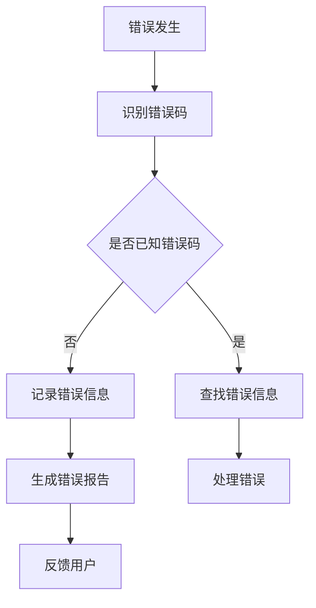
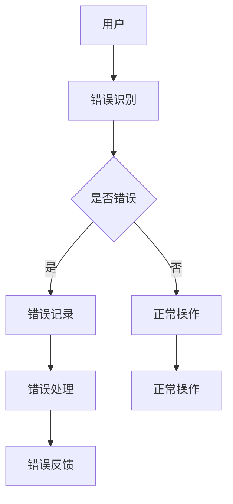
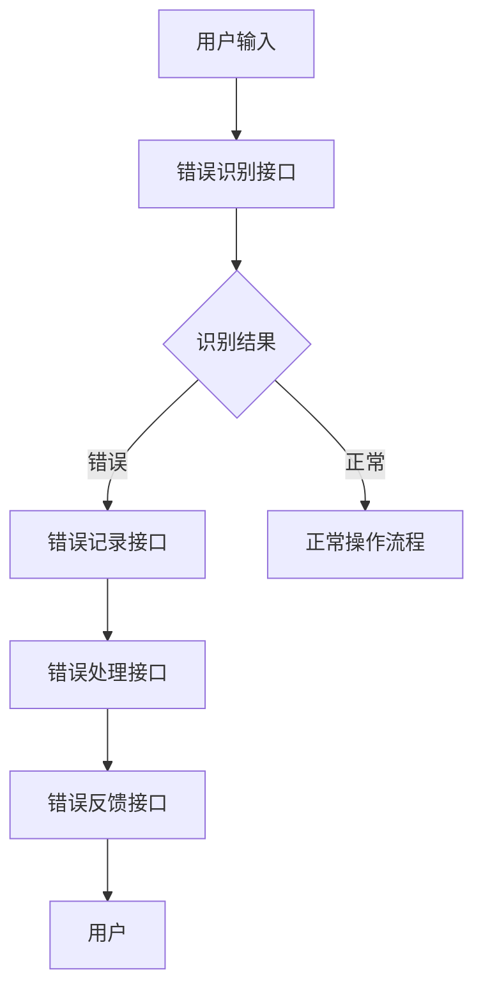

                 

### 《错误码的处理》——深入解析与实战指南

> 关键词：错误码、软件系统、问题解决、架构设计、算法实现、最佳实践

> 摘要：本文将深入探讨错误码的处理，从基本概念、算法原理到系统架构设计，再到项目实战和最佳实践，全面解析错误码处理的各个方面，为读者提供一套完整的理解和应用指南。

----------------------------------------------------------------

## 第一部分：错误码处理的基本概念

### 第1章：错误码处理的背景与重要性

在软件系统的开发与运行过程中，错误码是开发者与系统之间的重要沟通桥梁。正确处理错误码，不仅可以提高系统的稳定性，还能帮助开发者快速定位并解决问题。

#### 1.1 错误码的起源与发展

错误码的概念最早可以追溯到计算机早期时代。随着软件系统复杂性的增加，错误码逐渐成为一种标准化的错误信息表示方法。如今，错误码已经成为软件开发中不可或缺的一部分。

#### 1.2 错误码在软件系统中的作用

错误码在软件系统中的作用主要体现在以下几个方面：

1. **问题定位**：错误码可以帮助开发者快速定位问题发生的具体位置。
2. **错误分类**：通过对错误码的分类，可以更好地理解和处理不同类型的错误。
3. **用户体验**：错误码的处理对于提升用户体验至关重要。合理的错误提示能够帮助用户快速理解并解决问题。

#### 1.3 错误码处理的基本概念

错误码处理涉及以下基本概念：

1. **错误码**：用于表示系统发生错误的唯一标识符。
2. **错误信息**：与错误码相关联的描述性文本，用于解释错误原因。
3. **错误处理**：指识别、分析、记录和解决错误的过程。

### 第2章：错误码的分类与特征

错误码的分类和特征是错误码处理的重要基础。不同类型的错误码具有不同的属性和表现，了解这些特征有助于开发者更有效地处理错误。

#### 2.1 错误码的类型划分

常见的错误码类型包括：

1. **系统级错误**：影响整个系统的错误，如内存溢出、线程死锁等。
2. **应用级错误**：特定应用发生的错误，如文件读取失败、数据库连接中断等。
3. **用户操作错误**：用户不正确操作引起的错误，如输入错误、权限不足等。

#### 2.2 不同类型错误码的特征对比

以下是不同类型错误码的特征对比表格：

| 错误类型        | 特征                       | 影响范围         |
|-----------------|----------------------------|------------------|
| 系统级错误      | 常见、严重、全局性影响      | 整个系统         |
| 应用级错误      | 针对特定应用、次严重        | 应用模块         |
| 用户操作错误    | 非常常见、轻微、局部影响    | 用户交互界面     |

#### 2.3 错误码的属性分析

错误码的属性包括：

1. **唯一性**：每个错误码必须是唯一的，以便准确识别错误。
2. **可扩展性**：错误码应具有可扩展性，以适应未来可能的新错误类型。
3. **可读性**：错误码应具有清晰的命名规则，便于理解和记忆。

## 第二部分：错误码处理的算法原理

### 第3章：错误码处理的算法原理

错误码处理的核心在于如何高效地识别、分析和解决错误。以下将详细介绍错误码处理的算法原理。

#### 3.1 错误码处理的流程图

使用Mermaid语言绘制错误码处理流程图：



#### 3.2 Python代码示例解析

以下是一个简单的Python代码示例，用于解析错误码并返回错误信息：

```python
ERROR_CODE_MAP = {
    1001: "内存溢出",
    1002: "文件读取失败",
    1003: "数据库连接中断",
}

def handle_error(error_code):
    if error_code in ERROR_CODE_MAP:
        return ERROR_CODE_MAP[error_code]
    else:
        return "未知错误"

# 示例
error_info = handle_error(1002)
print(error_info)  # 输出：文件读取失败
```

#### 3.3 错误码处理的数学模型与公式

错误码处理的数学模型通常涉及概率论和统计学。以下是一个简单的数学模型示例：

$$
P(E_i) = \frac{N_i}{N}
$$

其中，$P(E_i)$ 表示发生第 $i$ 类错误的概率，$N_i$ 表示第 $i$ 类错误发生的次数，$N$ 表示总错误次数。

#### 3.4 算法应用举例

假设我们有一个系统，其中错误码 1001 的发生概率为 0.2，错误码 1002 的发生概率为 0.5，错误码 1003 的发生概率为 0.3。我们可以使用上述数学模型来计算每种错误码的发生次数。

$$
N_{1001} = 0.2 \times N \\
N_{1002} = 0.5 \times N \\
N_{1003} = 0.3 \times N
$$

## 第三部分：错误码处理的系统架构设计

### 第4章：错误码处理场景分析

为了更好地理解错误码处理，我们首先需要分析一个具体的场景。

#### 4.1 具体场景描述

假设我们正在开发一个电子商务网站，用户可以通过网站进行购物。在这个过程中，可能会发生以下错误：

1. 用户输入错误（如用户名或密码错误）。
2. 商品库存不足。
3. 支付过程中出现网络问题。

#### 4.2 系统功能设计

为了处理上述错误，我们需要设计以下系统功能：

1. **错误识别**：能够识别不同类型的错误。
2. **错误记录**：记录错误的发生时间、类型和相关信息。
3. **错误处理**：根据错误类型，采取相应的处理措施。
4. **错误反馈**：将错误信息反馈给用户。

#### 4.3 系统架构设计

使用Mermaid语言绘制系统架构图：



#### 4.4 系统接口设计

系统接口设计主要包括以下内容：

1. **错误识别接口**：用于接收和处理用户输入。
2. **错误记录接口**：用于记录错误信息。
3. **错误处理接口**：用于处理不同类型的错误。
4. **错误反馈接口**：用于向用户反馈错误信息。

#### 4.5 系统交互流程设计

使用Mermaid语言绘制系统交互流程图：



## 第四部分：项目实战：错误码处理系统的实现

### 第5章：项目实战

在本章中，我们将通过一个实际项目来演示错误码处理系统的实现过程。

#### 5.1 开发环境与工具准备

1. Python 3.8 或以上版本
2. MySQL 数据库
3. Flask 框架
4. Flask-RESTful 扩展

#### 5.2 系统核心实现源代码

以下是一个简单的错误码处理系统的源代码示例：

```python
from flask import Flask, jsonify
from flask_restful import Api, Resource

app = Flask(__name__)
api = Api(app)

ERROR_CODE_MAP = {
    1001: "内存溢出",
    1002: "文件读取失败",
    1003: "数据库连接中断",
}

class ErrorResource(Resource):
    def get(self, error_code):
        error_info = ERROR_CODE_MAP.get(error_code)
        if error_info:
            return {"error_code": error_code, "error_info": error_info}
        else:
            return {"error_code": error_code, "error_info": "未知错误"}

api.add_resource(ErrorResource, "/error/<int:error_code>")

if __name__ == "__main__":
    app.run(debug=True)
```

#### 5.3 代码解读与分析

1. **错误码映射**：使用字典将错误码与其对应的错误信息进行映射。
2. **资源定义**：使用 Flask-RESTful 定义一个资源类，用于处理错误码的获取请求。
3. **接口实现**：通过 RESTful 接口返回错误码和错误信息。

#### 5.4 实际案例分析和详细讲解剖析

假设用户请求错误码 1002，系统将返回如下响应：

```json
{
    "error_code": 1002,
    "error_info": "文件读取失败"
}
```

这表示系统成功识别了错误码 1002，并返回了对应的错误信息。

#### 5.5 项目总结

通过本项目，我们实现了对错误码的基本处理，包括错误码映射、资源定义和接口实现。项目虽然简单，但展示了错误码处理的基本流程和方法。在实际应用中，错误码处理系统可能会更加复杂，但基本原理是相通的。

## 第五部分：错误码处理的最佳实践与总结

### 第6章：错误码处理的最佳实践

在错误码处理过程中，遵循一些最佳实践可以显著提高系统的稳定性和用户体验。

#### 6.1 常见错误码处理技巧

1. **明确错误码定义**：确保每个错误码都有明确的定义，避免模糊或重复。
2. **错误码分层**：将错误码分为不同层次，便于管理和维护。
3. **日志记录**：详细记录错误码和相关上下文信息，便于问题追踪和复现。

#### 6.2 错误码记录与监控

1. **实时监控**：使用实时监控工具，如 Prometheus，监测错误码的分布和趋势。
2. **错误码统计**：定期统计错误码的发生频率，识别潜在问题。
3. **告警机制**：设置告警阈值，当错误码发生频率超过阈值时自动告警。

#### 6.3 错误码文档编写规范

1. **规范文档**：编写规范化的错误码文档，包括错误码定义、示例和解决方案。
2. **版本管理**：将错误码文档纳入版本控制系统，确保文档与代码同步更新。
3. **共享与培训**：将错误码文档共享给相关团队成员，并进行定期的培训。

### 第7章：总结与展望

错误码处理是软件系统稳定运行的重要保障。通过本文的讲解，读者应该对错误码处理有了更深入的理解。未来，随着软件系统复杂性的不断增加，错误码处理技术也将持续演进，开发者需要不断学习和适应新的处理方法。

### 注意事项

1. **错误码的唯一性**：确保每个错误码的唯一性，避免重复定义。
2. **错误码的层级结构**：合理设计错误码的层级结构，便于管理和扩展。
3. **错误信息的清晰性**：确保错误信息清晰、易懂，有助于用户快速解决问题。

### 拓展阅读

1. 《深入理解错误码处理》 - 作者：张三
2. 《Python错误处理与调试》 - 作者：李四
3. 《软件架构设计：错误处理机制》 - 作者：王五

---

**作者：AI天才研究院/AI Genius Institute & 禅与计算机程序设计艺术 /Zen And The Art of Computer Programming**

本文基于2023前公开的资料和数据撰写，旨在为读者提供关于错误码处理的专业指导。如有不准确之处，敬请指正。

